# Manufacturing Process and Type Approval, Etc.

> OTHER RULES AND GUIDANCE / GC-01-E / 2025 / EN / Guidance

## CHAPTER 2 APPROVAL OF MANUFACTURING PROCESS

### Section 1 General

#### 101. Application

- **1.** The requirements in this Chapter apply to the procedure and tests for the approval of manufacturing process of the materials in accordance with the requirements in **Pt 2, Ch 1** and **Pt 4, Ch 8** of the Rules.
- **2.** Of those materials to be approved by the Society in accordance with the requirements in **Pt 2, Ch 1, 102. 2** of the Rules, the requirements in this Chapter correspondingly apply to the procedure and tests for the approval of manufacturing process of the materials.
- **3.** The manufacturers wishing to obtain the approval of manufacturing process are to comply with the requirements specified in the relevant Section of this Chapter according to the kind of materials in addition to the requirement for the procedure and tests specified in this Section.

#### 102. Approval application

- **1.** The manufacturer wishing to obtain the approval of manufacturing process is to submit a copy of the application of approval for manufacturing process (refer to **Annex 6**) of the Society together with three copies of the required data for the approval and two copies of the required data for reference to the Society.
- **2.** **Data to be submitted**
  - **(1)** Data for approval
    The following reference data are to be submitted to the Society. Where test methods and procedure are specified into this Guidance, IMO Res., KS standard, etc., the data to indicate the related standard instead of this required data may be submitted except detail drawings of test specimens. *(2017)*
    - **(A)** Test plan for the approval of manufacturing process *(2017)*
      - **(a)** Material grade
      - **(b)** Thickness, weight and specification of products
      - **(c)** Test items, test method and Acceptance criteria
      - **(d)** Location for test
      - **(e)** The location and direction of specimens
      - **(f)** Thickness and specification of specimens
    - **(B)** Applicable standard, codes or rules relevant to (A), if applicable *(2017)*
  - **(2)** Data for reference
    Estimated total annual production of finished products for shipbuilding and for other applications
    - **(A)** Details of products information
      - **(a)** Type of products, grade of steel, thickness and specification of products
    - **(B)** Outline of workshops
      - **(a)** Name and address of the manufacturer, history, layout and dimension of works
    - **(C)** Organization and quality
      - **(a)** Organizational chart and number of staff employed *(2017)*
      - **(b)** Staff employed and organization of the quality control department
      - **(c)** Certification of compliance of the quality system with IS0 9001 and/or approval certificates already granted by other Classification Societies, if any.
    - **(D)** Outline of manufacturing process and facilities
      - **(a)** Flow chart of the manufacturing process including quality control process on each manufacturing stage.
      - **(b)** Manufacturing facilities and equipment
      - **(c)** Origin and storage of raw material *(2017)*
      - **(d)** Storage of finished products *(2017)*
    - **(E)** Inspection and test
      - **(a)** Inspection and test procedures/standards
      - **(b)** Qualification of the personnel involved in activities related to the inspection and test
      - **(c)** List and documents of equipment for mechanical tests, chemical analyses and metallography, non destructive examinations and relevant calibration procedures
      - **(d)** Details of system used for identification of materials at the different manufacturing stages
    - **(F)** Service records
    - **(G)** Other data deemed necessary by the Society
- **3.** Notwithstanding the requirements in the preceding **1,** where the applicant is already approved by the Society and the attachments are entirely equal in content to the documents previously submitted to the Society, the documents may be partly or entirely exempted from submission except for approval test program for approval of the manufacturing process.
- **4.** Where any part of the manufacturing process is assigned to other companies or other manufacturing plants, additional documents related to the manufacturing process showing the names and addresses of the other companies and plants together with the organization and method of inspection for purchasing semi-final products are to be included.

#### 103. Data review

The Society examines the approval test program for approval of manufacturing process submitted in accordance with the requirements in **102. 2** and where deemed appropriate, the test program is approved and returned to the manufacturer.

#### 104. Plant audit

- **1.** **Purpose**
  The Society will, where deemed appropriate upon review of documents and data submitted, carry out the plant audit in the presence of the Surveyor to verify that the manufacturer has a technical capability to continuously produce the proposed products of equal level in quality under the stable workmanship to the satisfaction of the Society.
- **2.** **Items to be audited**
  The plant audit is to apply to the following items in the presence of the Surveyor
  - **(1)** Quality system in general
    - **(A)** Establishment and implementation of quality system
    - **(B)** Observance and establishment of procedure for handling of customer complaints
    - **(C)** Education and training of employees
  - **(2)** Control of process and quality
    - **(A)** Observance of work instruction
    - **(B)** Observance and confirmation of Q.C flow charts
    - **(C)** Control of nonconforming product and corrective action
  - **(3)** Control of manufacturing and inspection equipment
    - **(A)** Observance and establishment of maintenance procedure for manufacturing equipment
    - **(B)** Calibration and control of inspection equipment
  - **(4)** Others
    - **(A)** Updating of documents such as applicable standards, etc.
    - **(B)** Comprehension of related requirements for class surveys
  - **(5)** Audit methods and acceptance criteria are to be as deemed appropriate by the Society.
- **3.** **Time for audit**
  The time of the audit is to correspond, in principle, to either the time when the proposed product is manufactured or the time when the approval test is carried out. In this case, the manufacturer is to provide the necessary information related to this audit.
- **4.** **Exemption of audit**
  When the manufacturer submits the application of newly produced product with the same manufacturing facilities and similar method of manufacture for products which have been approved by the Society or retains the approval of ISO 9001 issued by the Society, the audit items may be exempted wholly or partly according to the review result of the documents. *(2019)*

#### 105. Approval test

- **1.** The approval test is to be carried out in the presence of the Surveyor in accordance with the test method described in each Section of the Guidance or equivalent method thereof. However, the test may be partly or entirely omitted subject to the approval by the Society in case any of the following (1) or (2) is relevant.
  - **(1)** In case where the manufacturer has been approved by other Classification Society or an inspection organization recognized by the Society.
  - **(2)** In case of approval test for the lower grade products manufactured by the similar methods which have been approved by the Society.
- **2.** In principle, the approval test is to be carried out at the manufacturing sites. If the testing facilities are not available at the works, the tests are to be carried out at accredited laboratories. *(2017)*
- **3.** The test samples used for the approval test are to be selected, as a rule, from the same conditions of products in the presence of the Surveyor during the plant audit as far as practicable.
- **4.** **Test records**
  - **(1)** After completion of the approval test, the manufacturer is to prepare a record of the approval test and operation records relevant to steel making, casting, rolling and heat treatment etc. of the test products and is to submit three copies to the Society upon receiving confirmation by the Surveyor.
  - **(2)** All results, which are in any case to comply with the requirements of the Rules, are evaluated for the approval; depending on the results, particular limitations or testing conditions, as deemed appropriate, may be specified in the approval document.

#### 106. Notification and announcement of approval

- **1.** The Society shall issue an Approval Certificate for Manufacturing Process such as **FORM AC-1** shown in **Annex 1** to the applicant, where deemed appropriate by the Society on the basis of the submitted test reports and plant audit results after completion of the approval test.
- **2.** The Society announces the manufacturers who have been granted the approval of manufacturing process in the “List of Approved Manufacturer & Type Approved Equipment” containing the types of products and the main conditions of approval.

#### 107. Changes in the manufacturing process

- **1.** When the alteration to the specifications (materials, composition, dimension, construction, particulars, etc.), manufacturing facilities, manufacturing methods and/or quality control system has a significant effect on the property or quality of the products, or when the works was removed, the manufacturer is to submit the application of alteration to the Society together with the detailed documents of the alteration (where practicable, to be mentioned with a comparison table form between new and old).
- **2.** The Society may request an plant audit or approval test, where deemed necessary upon reviewing the contents of alteration.
- **3.** For the insignificant alterations, the manufacturer shall give the contents of alteration to the Surveyor for confirmation at the appropriate time. In this case the Surveyor shall report the contents of alteration to the head office.

#### 108. Validity and renewal of approval certificate

- **1.** The approval certificate for manufacturing process will be valid within five years from the date of issue. In case where the approval certificate is renewed in accordance with the requirements specified in the preceding **107.,** the expiration date will not be changed.
- **2.** The manufacturer who intends to have a continuation of the approval is to submit an application to the Society three months before the due date together with following data.
  - **(1)** Data related to the corrective action for approved product, if any
  - **(2)** Alteration to the approved manufacturing process or specification, if any *(2021)*
  - **(3)** Service records of approved products or similar products which are approved by this Society (minimum 6 months and over)
- **3.** The Society is to carry out an plant audit in accordance with the requirements specified in 104. and may request an approval test where deemed necessary after the examination of application and documents thereof.
- **4.** Manufacturers who have not produced the approved grades and products during the period between renewals may be required to either carry out approval tests or, on the basis of results of production of similar grades of products, at the discretion of the Society, be preapproved.
- **5.** Where for operational reasons, the renewal plant audit falls outside the period of approval, the manufacturer will still be considered as approved if agreement to this audit date is made within the period of three months after expiry of the validity. In this instance, if successful, the extension of approval will be back dated to the original renewal date.

#### 109. Suspension or withdrawal of approval

- **1.** Concerning the product quality, during the period of validity, the Society can suspend or withdraw the approval of manufacturing process in case any of following cases: *(2021)*
  - **(1)** When the materials no longer conform to the given requirements due to amendments or establishment of conventions, laws, rules and regulations.
  - **(2)** In service failures traceable to product quality and/or non conformity of the product revealed during test, fabrication and construction.
  - **(3)** When the products are produced in breach of the approval conditions
  - **(4)** when the test results have been improperly reported
  - **(5)** Changes brought by the Manufacturer without preliminary agreement of the Society to the extent of the approval defined at the time of the approval
  - **(6)** In case where forged or falsified stamps or certificates are used. *(2019)*
  - **(7)** When the materials and equipment failed to pass the confirmation test and/or occasional plant audit specified in **110.**
  - **(8)** In case where a serious failure of the manufacturer's quality system has been identified
  - **(9)** In case where the manufacturer has failed to inform any changes which will affect the approved quality system to this Society.
  - **(10)** In case where the manufacturer has not undergone a renewal plant audit
  - **(11)** In case where the manufacturer is refusing to undergo occasional plant audit, confirmation test, etc. requested by this Society.
- **2.** In renewal or occasional audit for approved products, where non-conformities in the approved quality system are found, or where conditions for the issuance of the certificate or for its maintenance have deteriorated, the manufacturer is to correct the non-conformities. Such corrections are to be verified by the Society. In case where corrective actions are not taken within the specified period, the Society may suspend the approved certificate. In case where the corrective actions are not taken for the suspended period, the Society may withdraw the approval. *(2021)*
- **3.** Having no concern with the product quality, the Society can withdraw the approval of manufacturing process in the following cases: *(2021)*
  - **(1)** When a request for withdrawal is made by the manufacturer.
  - **(2)** When the approval fees are not paid.
  - **(3)** When considered inappropriate for approved condition by the Society.
- **4.** A manufacturer whose approval has been withdrawn, may apply for re-approval provided that the reasons which resulted in cancellation are corrected, and the Society is to issue the approval certificate after it is confirmed that the corrective action has effectively been implemented.
- **5.** Where an application for re-approval is made for product which had its approval of manufacturing process withdrawn, such application shall be handled according to initial approval of manufacturing process requirements. But, it may be considered as exceptional case in case where the Society specially accepted.

#### 110. Confirmation test and/or occasional plant audit

- **1.** The confirmation test and/or occasional plant audit may be required when serious defect is found in structure or performance, etc. of the materials and equipment retaining approval.
- **2.** After completion of the confirmation test and/or occasional plant audit, the manufacturer is to prepare a record of the confirmation test and/or occasional plant audit and submit three copies to the Society upon receiving confirmation by the Surveyor.

### Section 2-1 Rolled Steels

#### 201. Application

The requirements in this Section apply to tests and inspection for the approval of manufacturing process of rolled steels (including rolled steel bars, to which **Pt 2, Ch 1, Sec 6** of the Rules apply) as specified in **Pt 2, Ch 1, Sec 3** of the Rules.

#### 202. Data to be submitted

The following reference data in addition to those specified in **102.** are to be submitted to the Society.

#### 203. Approval tests

- **1.** **Test samples and specimen**
  - **(1)** For each grade of steel and for each manufacturing process (e.g. steel making, casting, rolling and condition of supply), test samples are in general to be selected for each kind of product.
  - **(2)** Test samples are to be taken in the presence of the Surveyor from the product (plate, flat, section, bar) corresponding to the top of the ingot, or, in the case of continuous casting, a random slabs from the ladle of the first heat and the last heat in one casting sequence.
  - **(3)** The position of the samples to be taken in the length of the rolled product, "piece" defined in **Pt 2, Ch 1, 301.** of the Rules (top and/or bottom of the piece) and the direction of the test specimens with respect to the final direction of rolling of the material are indicated in **Table 2.2.2.** The position of the samples in the width of the product is to be in compliance with **Pt 2, Ch 1, 301.** of the Rules
  - **(4)** Test samples are to be taken from the product with the maximum thickness (dimension) to be approved. In addition, for initial approval, the Society will require selection of one test product of average thickness.
- **2.** **Approval test and acceptance criteria**
  - **(1)** Approval tests are to be carried out in the presence of the Surveyor at the manufacturing plant and approval test items are to be as given in **Table 2.2.1**
  - **(2)** Test methods and acceptance criteria are to be as given in **Table 2.2.2.** However, where accordance with these requirements are difficult, decisions are left to the discretion of the Society.
- **3.** **Weldability test**
  - **(1)** Preparation of the test assemblies
    Welded joints tests are to be carried out on samples of the thickest plate.
    - **(A)** 1 butt weld test assembly welded with a heat input approximately 15 kJ/cm
    - **(B)** 1 butt weld test assembly welded with a heat input approximately 50 kJ/cm
  - **(2)** Welding of the test assemblies
    - **(A)** The butt weld test assemblies are to be prepared with the weld seam transverse to the plate rolling direction, so that impact specimens will result in the longitudinal direction.
    - **(B)** The bevel preparation should be preferably $1/2 V$ or $K$.
    - **(C)** The welding procedure should be as far as possible in accordance with the normal welding practice used at the yards for the type of steel in question. The welding parameters including consumables designation and diameter, pre-heating temperatures, inter-pass temperatures, heat input, number of passes, etc. are to be reported.
  - **(3)** Type of tests and acceptance criteria
    Kinds of tests, test methods and acceptance criteria are to be as given in **Table 2.2.3.**
  - **(4)** Other tests
    Additional tests such as cold cracking tests (CTS, Cruciform, Implant, Tekken, Bead-on plate), CTOD, or other tests may be required in the case of when deemed necessary by the Society.
- **4.** In addition to those specified in **105. 1** a reduction of the indicated number of casts, steel plate thicknesses and grades to be tested or complete suppression of the approval tests may be considered subject to the approval by the Society on the basis of the preliminary information submitted by the manufacturer in case any of the following (1) or (5) is relevant. On the other hand, an increase of the number of casts and thicknesses to be tested may be required in the case of newly developed types of steel or manufacturing processes.
  - **(1)** Approval for any grade of steel also covers approval for any lower grade(impact test temperature) in the same strength level, provided that the method of manufacture and condition of supply are similar.
  - **(2)** For higher tensile steels, approval of one strength level covers the approval of the strength level immediately below, provided the steelmaking process, deoxidation and fine grain practice, casting method and condition of supply are similar.
  - **(3)** Change of the approval conditions.
  - **(4)** Grades of steel to be approved and availability of long term statistic results of chemical and mechanical properties

    | Kinds | grade |   | Base metal test |   |   |   |   |   |   |   |   |   |   |   |   | Brittle fracture test |   |   | WeldabiIity test |   |   |   |   |   | Other test |   |   |   |
    | --- | --- | --- | --- | --- | --- | --- | --- | --- | --- | --- | --- | --- | --- | --- | --- | --- | --- | --- | --- | --- | --- | --- | --- | --- | --- | --- | --- | --- |
    | Kinds | grade |   | ⒜ | ⒝ | ⒞ | ⒟ | ⒠ | ⒡ | ⒢ | ⒣ | ⒤ | ⒥ | ⒦ | ⒧ | ⒨ | ⒩ | ⒪ | ⒫ | ⒬ | ⒭ | ⒮ | ⒯ | ⒰ | ⒱ | ⒲ | ⒳ | (y) | (z) |
    | Rolled steel for hull | *A, B* |   | ○ | ○ | ○ |   | ○ |   | ○ |   |   | ○ |   |   |   |   |   |   |   |   |   |   |   |   |   |   |   |   |
    | Rolled steel for hull | *D* |   | ○ | ○ | ○ |   | ○ |   | ○ |   |   | ○ | ○ |   |   |   |   |   |   |   |   |   |   |   |   |   |   |   |
    | Rolled steel for hull | *E* |   | ○ | ○ | ○ |   | ○ |   | ○ |   |   | ○ | ○ |   |   |   | ○ |   | ○ | ○ | ○ | ○ |   |   |   |   |   |   |
    | Rolled steel for hull | *AH*32, *AH*36*,* *AH*40, *DH*32*, DH*36, *DH*40 |   | ○ | ○ | ○ |   | ○ |   | ○ |   |   | ○ | ○ |   |   |   |   |   | ○ | ○ | ○ | ○ |   |   |   |   |   |   |
    | Rolled steel for hull | *EH*32, *EH*36, *EH*40, *FH*32, *FH*36, *FH*40 |   | ○ | ○ | ○ |   | ○ |   | ○ |   |   | ○ | ○ |   |   |   | ○ | ○ (6) | ○ | ○ | ○ | ○ |   |   |   |   |   |   |
    | YP47 steel plates (Sec. 2-5) | *EH*47-*H* |   | ○ | ○ | ○ |   | ○ |   | ○ |   |   | ○ | ○ |   |   | ○(7) | ○ | ○ | ○ | ○ | ○ | ○ | ○ |   |   |   |   |   |
    | High strength steels for welded structures (Sec. 2-7) | *AH*43∼*FH*97, *FH*43∼*FH*70 |   | ○ | ○ | ○ |   | ○ |   | ○ | ○ |   | ○ | ○ |   |   | ○ | ○ |   | ○ | ○ | ○ | ○ | ○ |   |   |   |   |   |
    | Rolled steels for low temp. service | *RL*235A∼*RL*9*N*490 |   | ○ | ○ | ○ |   | ○ |   | ○ | ○ |   | ○ | ○ |   |   |   | ○ |   | ○ | ○ | ○ | ○ |   |   |   |   |   |   |
    | Rolled steel for boilers | *RSP*42∼*RSP*49*A* |   | ○ | ○ | ○ |   | ○ |   | ○ | ○ |   | ○ |   |   |   |   |   |   |   |   | ○ |   |   |   | ○ | ○ |   |   |
    | Rolled steels for pressure vessels | *RPV*24∼*RPV*50 |   | ○ | ○ | ○ |   | ○ |   | ○ | ○ |   | ○ | ○ |   |   |   | ○ |   |   |   | ○ |   |   |   |   |   |   |   |
    | Round bars for chain | *RSBC*31∼*RSBC*70 |   | ○ | ○ | ○ |   | ○ |   | ○ | ○ |   | ○ |   |   |   |   |   |   |   |   | ○ |   |   |   |   |   |   |   |
    | Round bars for offshore chains and accessories(6) | *RSBCR*3, *RSBCR*3*S*, *RSBCR*4, *RSBCR*4*S* *RSBCR*5 |   | See **Sec. 10-3** |   |   |   |   |   |   |   |   |   |   |   |   |   |   |   |   |   |   |   |   |   |   |   |   |   |
    | Rolled steels bar for boilers | *RSB*42∼*RSB*46 |   | ○ | ○ | ○ |   | ○ |   | ○ | ○ |   | ○ |   |   |   |   |   |   |   |   |   |   |   |   |   |   |   |   |
    | Rolled and forged steel carbon bars | *RSFB*400 ∼*RSFB*760 |   | ○ | ○ | ○ |   | ○ |   | ○ | ○ |   | ○ |   |   |   |   |   |   |   |   |   |   |   |   |   |   |   |   |
    | Rolled and forged steel low alloy steel bars | *RSFB*600*A* *~RSFB*1100*A* |   | ○ | ○ | ○ |   | ○ |   | ○ | ○ |   | ○ |   |   |   |   |   |   |   |   |   |   |   |   |   |   |   |   |
    | Rolled stainless steels | *RSTS*304∼*RSTS*347 *RSTS*31803, *RSTS*32750 |   | ○ | ○ | ○ |   | ○ | ○ | ○ | ○ |   | ○ |   |   |   |   |   |   |   |   |   |   |   |   |   |   | ○ |   |
    | Stainless clad steel plates | Base metal | *A~E,* *AH32~FH36* | ○ | ○ | ○ | ○ | ○ | ○ | ○ | ○ | ○ | ○ |   |   |   |   |   |   |   |   |   |   |   |   |   |   | ○ | ○ |
    | Stainless clad steel plates | Clad metal | *RSTS*304∼ *RSTS*347 | ○ | ○ | ○ | ○ | ○ | ○ | ○ | ○ | ○ | ○ |   |   |   |   |   |   |   |   |   |   |   |   |   |   | ○ | ○ |
    | High manganese austenitic steels | *HMA400* |   | See **Sec. 2-9** |   |   |   |   |   |   |   |   |   |   |   |   |   |   |   |   |   |   |   |   |   |   |   |   |   |

    | Notes (1) Where thermo-mechanical controlled processing(TMCP) is performed, tensile test after stress relieving is required in addition to those tests given in table. (2) For steel materials with consideration against through thickness properties as specified in Pt 2, Ch 1. of the Rules, the tensile test of through thickness direction, microscopic examination for non-metallic inclusions, ultrasonic test are required in addition to those tests given in table. (3) For steels other than steel plates, the strain ageing Charpy impact test, NRL drop weight test and CTOD test are not required, unless otherwise specified. However, where cast piece from the continuous casting method is used, the macro-structure of the cast piece and sulphur print test may be required. (4) The CTOD test, high temperature tension test and creep test as specified in the Table are performed for the purpose of evaluating low temperature toughness and high temperature characteristics, and these tests may be omitted in case appropriate records prepared by the manufacturer are available or in case the Society deems the test unnecessary. (5) Additional tests such as large scale brittle fracture tests (Double Tension test, ESSO test, Deep Notch test, etc.) or other tests may be required when deemed necessary by the Society. (6) Brittle crack arrest steel is to be carried out standard ESSO test in accordance with Pt 2, Ch 1, Sec. 2 of the Guidance. (7) Instead of CTOD test, deep notch test may be carried out. (8) Kind of test ⒜ Chemical analysis ⒝ Sulphur print ⒞ Micro structure ⒟ Macro structure ⒠ Ferrite grain size ⒡ Hardness test ⒢ Tensile test ⒣ Bend test ⒤ Shearing strength test ⒥ Charpy impact test ⒦ Strain charpy impact test ⒧ Hydrogen embrittlement test ⒨ Fatigue test ⒩ CTOD test ⒪ NRL drop weight test ⒫ Esso test ⒬ Weldment tensile test ⒭ Weldment impact test ⒮ Max. hardness test ⒯ Macro structure ⒰ Hydrogen crack test ⒱ Fatigue test ⒲High temp. tensile test ⒳Creep test (y) Corrosion test (z) Ultrasonic test |
    | --- |

    | Approval test items |   | Position of the Sample${} ^{(0)}$ | Direction of the test specimens | Approval Testing method | acceptance criteria |
    | --- | --- | --- | --- | --- | --- |
    | Base metal test | Chemical analysis | T(Top) | - | KS D 0228 or equivalent method. Ladle analysis and production analysis(from the tensile test specimens) are to be performed for C, Si, Mn, P, S and other elements as deemed necessary. | The chemical composition by ladle analysis is to comply with the requirements in Pt2, Ch1, Sec3 of the Rules. Excess difference in the chemical compositions between melt analysis and product analysis is not to be accepted. |
    | Base metal test | Sulphur print | T | T (Transverse) | KS D 0226 or equivalent method. Length is to be greater than 600 *mm* (cross section in the case of cast piece) | Segregation, etc, deemed to have negative effect are not to be present |
    | Base metal test | Microscopic exam. for non-metallic inclusion | T | T | ISO 4969 or equivalent method. | Acceptance criteria is the reference. |
    | Base metal test | Macro structure | T | T | KS D 0204 or equivalent method. | Acceptance criteria is the reference. |
    | Base metal test | Micro structure | T | - | Microscopic photographs (approx. 100x) of base metal, joining part and cladding metal are to be taken | Acceptance criteria is the reference. |
    | Base metal test | Ferrite grain size | T |   | KS D 0205 or equivalent method. Magnification of microscopic photographs are to be as a rule 100x.${} ^{(2)}$ | Acceptance criteria is the reference. |
    | Base metal test | Hardness test | T | - | In accordance with Pt 2 of the Rules. Hardness distribution in the thickness direction is to be measured in the case of stainless clad steel. | To meet the requirements in Pt 2, Ch 1, Sec 3 of the Rules, to be as appropriate by the Society. |
    | Base metal test | Tensile test | T | T${} ^{(3)}$ | In accordance with Pt 2 of the Rules.${} ^{(4)(5)}$ | To meet the requirements in Pt 2, Ch 1, Sec 3 of the Rules. |
    | Base metal test | Tensile test | B (Bottom) | T${} ^{(3)}$ | In accordance with Pt 2 of the Rules.${} ^{(4)(5)}$ | To meet the requirements in Pt 2, Ch 1, Sec 3 of the Rules. |
    | Base metal test | Tensile test of through thickness direction | T | thickness direction | In accordance with Pt 2 of the Rules | To meet the requirements in Pt 2, Ch 1, Sec 3 of the Rules |
    | Base metal test | Tensile test of through thickness direction | B | thickness direction | In accordance with Pt 2 of the Rules | To meet the requirements in Pt 2, Ch 1, Sec 3 of the Rules |
    | Base metal test | Tensile test (stress relieved) ${} ^{(6)}$ | T | T${} ^{(3)}$ | Tensile test after stress relieving at 600℃(2 *min/mm* with minimum 1 hour holding) | Acceptance criteria is the reference. |
    | Base metal test | Tensile test (stress relieved) ${} ^{(6)}$ | B | T${} ^{(3)}$ | Tensile test after stress relieving at 600℃(2 *min/mm* with minimum 1 hour holding) | Acceptance criteria is the reference. |

    | Approval test items |   | Position of the Sample${} ^{(0)}$ | Direction of the test specimens | Approval Testing method | acceptance criteria |
    | --- | --- | --- | --- | --- | --- |
    | Base metal test | Bend test | B | T | In accordance with Pt 2 of the Rules. However, in case of not being prescribed in the Pt 2, bend test is to be in accordance with recognized national or international standard which the Society considers appropriate. | Defects etc, deemed to have negative effect are not to be present |
    | Base metal test | Shearing strength test | T | - | In accordance with Pt 2 of the Rules | To meet the requirements in Pt 2, Ch 1, Sec 3 of the Rules |
    | Base metal test | Shearing strength test | B | - | In accordance with Pt 2 of the Rules | To meet the requirements in Pt 2, Ch 1, Sec 3 of the Rules |
    | Base metal test | V-notch Charpy impact test | T | P (Parallel) | Using R4 test specimen, the transition temperature curve of the absorbed energy and fracture surface ratio is to be determined by testing three pieces at each temperature.${} ^{(8)(9)}$ (also the lateral expansion to be reported.) Furthermore, the test temperature is to include the temperature as specified in Pt 2 of the Rules, and its interval is to be 10~20°C${} ^{(10)}$ V-notch Charpy impact test specimens for stainless clad steels are to be taken from the base material. | To meet the requirements in Pt 2 of the Rules. Others are the reference. |
    | Base metal test | V-notch Charpy impact test | T | T${} ^{(7)}$ | Using R4 test specimen, the transition temperature curve of the absorbed energy and fracture surface ratio is to be determined by testing three pieces at each temperature.${} ^{(8)(9)}$ (also the lateral expansion to be reported.) Furthermore, the test temperature is to include the temperature as specified in Pt 2 of the Rules, and its interval is to be 10~20°C${} ^{(10)}$ V-notch Charpy impact test specimens for stainless clad steels are to be taken from the base material. | To meet the requirements in Pt 2 of the Rules. Others are the reference. |
    | Base metal test | V-notch Charpy impact test | B | P | Using R4 test specimen, the transition temperature curve of the absorbed energy and fracture surface ratio is to be determined by testing three pieces at each temperature.${} ^{(8)(9)}$ (also the lateral expansion to be reported.) Furthermore, the test temperature is to include the temperature as specified in Pt 2 of the Rules, and its interval is to be 10~20°C${} ^{(10)}$ V-notch Charpy impact test specimens for stainless clad steels are to be taken from the base material. | To meet the requirements in Pt 2 of the Rules. Others are the reference. |
    | Base metal test | Strain ageing V-notch charpy impact test | T | P | Same as V-notch Charpy impact test. However The test specimens which have been maintained for one hour at 250°C after strain of 5 % have been applied is, as a rule, to be used.${} ^{(8)(9)(11)}$ | Acceptance criteria is the reference. |
    | Base metal test | Hydrogen embrittlement test | T | P | In accordance with Pt 2, Ch 1, Sec 3 of the Rules | To meet the requirements in Pt 2, Ch 1, Sec 3 of the Rules |
    | Base metal test | Hydrogen embrittlement test | B | P | In accordance with Pt 2, Ch 1, Sec 3 of the Rules | To meet the requirements in Pt 2, Ch 1, Sec 3 of the Rules |
    | Base metal test | Fatigue test | T | - | Fatigue tests is to be carried out for butt welded joints and is in accordance with **Pt7, Chapter 5, 418.2.(4).(B).** | S-N curve should be equal to or above D curve in IIW. |

    | Approval test items |   | Position of the Sample | Direction of the test specimens | Approval Testing method | acceptance criteria |
    | --- | --- | --- | --- | --- | --- |
    | Brittle fracture test | CTOD test | T | P | BS 7448 or equivalent. To be consulted with the Society the dimension of test specimen, test condition, etc, when newly performing tests at the time of approval. In general, the CTOD test for welds according to BS 7448-2 is performed at -10℃. If necessary, the Society may require the CTOD test of the base metal to be carried out. *(2023)* | Acceptance criteria is the reference. |
    | Brittle fracture test | NRL drop weight test | T | P${} ^{(7)}$ | ASTM E 208 or equivalent method. The NDTT(Non- Ductility transition temperature) is to be determined and photographs of the tested specimens are to be taken and enclosed with the test report. | Acceptance criteria is the reference. However, in case of rolled steels for hull structural, no fracture to be occurred at the impact test temperature specified in Pt 2, Ch 1, 301. of the Rules. |
    | Weldability test | Weldment tensile test | T | T(to the welding direction) | in accordance with the test method described in below 203. 3 | in accordance with the test method described in below 203. 3 |
    | Weldability test | Weldment impact test | T | T(to the welding direction) | in accordance with the test method described in below 203. 3 | in accordance with the test method described in below 203. 3 |
    | Weldability test | Maximum hardness test | T | - | in accordance with the test method described in below 203. 3 | in accordance with the test method described in below 203. 3 |
    | Weldability test | Macro structure | T | - | in accordance with the test method described in below 203. 3 | in accordance with the test method described in below 203. 3 |
    | Weldability test | Fatigue test | T | T(to the welding direction) | Fatigue tests is to be carried out for butt welded joints and is in accordance with **Pt7, Chapter 5, 418.2.(4).(B).** | S-N curve should be equal to or above D curve in IIW. |
    | High temp. characteristics tests | High temp. tensile test | T | P | KS D0026(High temp. tensile test), KS B 0814(Creep test) or equivalent.. To be consulted with the Society on the dimension of test specimen, test condition etc, when newly performing tests at the time of Approval. | Acceptance criteria is the reference. |
    | High temp. characteristics tests | Creep test | T | P | KS D0026(High temp. tensile test), KS B 0814(Creep test) or equivalent.. To be consulted with the Society on the dimension of test specimen, test condition etc, when newly performing tests at the time of Approval. | Acceptance criteria is the reference. |
    | Corrosion resistance test | Corrosion test | T | - | ISO 3651-2, ISO 3651-1, KS D 0222 or equivalent method. For duplex stainless steel(*RSTS*31803, *RSTS*32750), corrosion test shall be carry out in accordance with ASTM G48 Method A or equivalent method. The test temperature shall be 20℃(±2) for *RSTS*31803, 50℃(±2) for *RSTS*32750 and the exposure time shall be minimum 24h. | Acceptance criteria is the reference. For duplex stainless steel (*RSTS*31803, *RSTS*32750), no pitting is required at 20 X magnification. The weight loss is to be less than 4.0 g/m^2. |
    | Corrosion resistance test | Corrosion test | T | - | For high manganese austenitic steel, general corrosion test shall be carried out in accordance with **ASTM NACE/ASTM G31-12a** or equivalent method. Intergranular corrosion test shall follow **ASTM A262** or equivalent method and stress corrosion cracking test shall be lined with **ASTM G36 and ASTM G123** or equivalent method. | Acceptance criteria is the reference. |
    | Non- destructive test | Ultrasonic test | All surface | - | KS D 0234(Clad Steels), KS D 0233(Steels with through thickness property), KS D 0248(Bars for chains) or equivalent method. | Clad Steels to be met the requirements of class 1 of KS D 0234. Others to be free from any defects deemed to have negative effect. |

    **Table 2.2.2 Test Items and Selection of Test Specimens (continued)** ***(2018) (2019) (2023)***

    **Notes (0) The followings can be shown the example of the position (Top and Bottom) where the test samples are detached 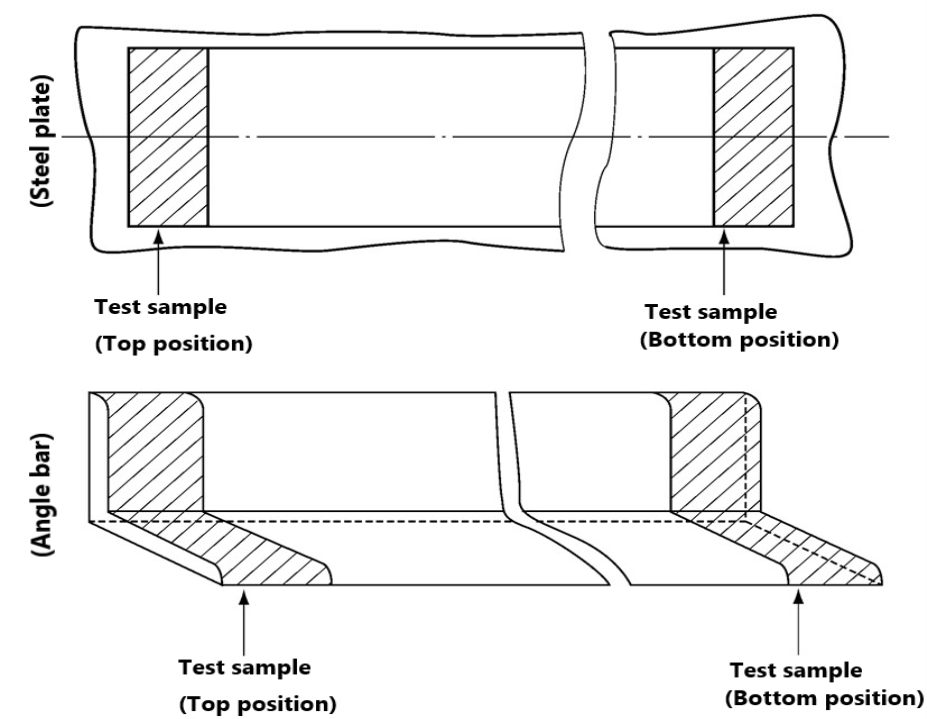 (1) For rolled steels for hull, the content of the following elements is to be checked: *C, Mn, Si, P, S, Ni, Cr, Mo, Al, N, Nb, V, Cu, As, Sn, Ti* and, for steel manufactured from electric or open-hearth furnace, *Sb* and *B*. (2) For thick products in general at least three examinations are to be made at surface, one quarter and mid-thickness of the product. (3) Longitudinal direction for sections and plates having width less than 600 *mm*. (4) In case of tensile test specimens of bar steels taken from steels over 40 *mm* in thickness, test specimens are to be taken at the middle of thickness and in accordance with the requirements of Part 2 of the Rules. (5) For plates made from hot rolled strip one additional tensile specimen is to be taken from the middle of the strip constituting the coil. (6) Only for TMCP steels, or when deemed necessary by the Society. (7) Not required for sections and plates having width less than 600 *mm*. (8) For plates made from hot rolled strip one additional set of impact specimens is to be taken from the middle of the strip constituting the coil. (9) For plates having thickness higher than 40 *mm* one additional set of impact specimens is to be taken with the axis located at mid-thickness. (10) Impact test temperature of hull steels are as bellows ; Grades ; Direction ; Test temp.(℃) *A*, *B*, *AH* 32, *AH* 36, *AH* 40 ; longitudinal ; +20 ; 0 ; -20 ; - *D*, *DH* 32, *DH* 36, *DH* 40 ; 0 ; -20 ; -40 ; - *E*, *EH* 32, *EH* 36, *EH* 40 ; 0 ; -20 ; -40 ; -60 *FH* 32, *FH* 36, *FH* 40 ; -20 ; -40 ; -60 ; -80 *A*, *B*, *AH* 32, *AH* 36, *AH* 40 ; Transverse ; +20 ; 0 ; -20 ; - *D*, *DH* 32, *DH* 36, *DH* 40 ; 0 ; -20 ; -40 ; - *E,* *EH* 32, *EH* 36, *EH* 40 ; -20 ; -40 ; -60 ; - *FH* 32, *FH* 36, *FH* 40 ; -40 ; -60 ; -80 ; - Grades Direction Test temp.(℃) *A*, *B*, *AH* 32, *AH* 36, *AH* 40 longitudinal +20 0 -20 - *D*, *DH* 32, *DH* 36, *DH* 40 0 -20 -40 - *E*, *EH* 32, *EH* 36, *EH* 40 0 -20 -40 -60 *FH* 32, *FH* 36, *FH* 40 -20 -40 -60 -80 *A*, *B*, *AH* 32, *AH* 36, *AH* 40 Transverse +20 0 -20 - *D*, *DH* 32, *DH* 36, *DH* 40 0 -20 -40 - *E,* *EH* 32, *EH* 36, *EH* 40 -20 -40 -60 - *FH* 32, *FH* 36, *FH* 40 -40 -60 -80 - (11) Strain ageing charpy impact test temperature of hull steels are as bellows; Grades ; Test temperature(℃) *AH* 32, *AH* 36, *AH* 40 ; +20 ; 0 ; -20 *D*, *DH* 32, *DH 3*6, *DH* 40 ; 0 ; -20 ; -40 *E*, *EH* 32, *EH* 36, *EH* 40 ; -20 ; -40 ; -60 *FH* 32, *FH* 36, *FH* 40 ; -40 ; -60 ; -80 Grades Test temperature(℃) *AH* 32, *AH* 36, *AH* 40 +20 0 -20 *D*, *DH* 32, *DH 3*6, *DH* 40 0 -20 -40 *E*, *EH* 32, *EH* 36, *EH* 40 -20 -40 -60 *FH* 32, *FH* 36, *FH* 40 -40 -60 -80**

    | Grades | Direction | Test temp.(℃) |   |   |   |
    | --- | --- | --- | --- | --- | --- |
    | *A*, *B*, *AH* 32, *AH* 36, *AH* 40 | longitudinal | +20 | 0 | -20 | - |
    | *D*, *DH* 32, *DH* 36, *DH* 40 | longitudinal | 0 | -20 | -40 | - |
    | *E*, *EH* 32, *EH* 36, *EH* 40 | longitudinal | 0 | -20 | -40 | -60 |
    | *FH* 32, *FH* 36, *FH* 40 | longitudinal | -20 | -40 | -60 | -80 |
    | *A*, *B*, *AH* 32, *AH* 36, *AH* 40 | Transverse | +20 | 0 | -20 | - |
    | *D*, *DH* 32, *DH* 36, *DH* 40 | Transverse | 0 | -20 | -40 | - |
    | *E,* *EH* 32, *EH* 36, *EH* 40 | Transverse | -20 | -40 | -60 | - |
    | *FH* 32, *FH* 36, *FH* 40 | Transverse | -40 | -60 | -80 | - |
    | Grades | Test temperature(℃) |   |   |   |   |
    | *AH* 32, *AH* 36, *AH* 40 | +20 | 0 | -20 |   |   |
    | *D*, *DH* 32, *DH 3*6, *DH* 40 | 0 | -20 | -40 |   |   |
    | *E*, *EH* 32, *EH* 36, *EH* 40 | -20 | -40 | -60 |   |   |
    | *FH* 32, *FH* 36, *FH* 40 | -40 | -60 | -80 |   |   |

    | Test items | Direction of the test specimens | Test method | Acceptance criteria |
    | --- | --- | --- | --- |
    | Tensile test | T (Transverse) | In accordance with Pt 2 of the Rules | To meet the requirements in Pt 2, Ch 2, Sec 4 of the Rules |
    | Charpy V-notch Impact test | T | (a) A set of 3 Charpy V-notch impact specimens transverse to the weld with the notch located at the fusion line and at a distance 2, 5 and minimum 20 mm from the fusion line. (b) The fusion boundary is to be identified by etching the specimens with a suitable reagent. | To meet the requirements in Pt 2, Ch 1, Sec 3, Table 2.1.7 of the Rules. |
    | Maximum hardness tests | - | Hardness tests Hv 5 across the weldment. The indentations are to be made along a 1 mm transverse line beneath the plate surface on both the face side and the root side of the weld as follows: - Fusion line - HAZ : at each 0,7 *mm* from fusion line into unaffected base material (6 to 7 minimum measurements for each HAZ) | The maximum hardness value should not be higher than 350 $Hv$. |
    | Macro structure tests | T | A sketch of the weld joint depicting groove dimensions, number of passes, hardness indentations should be attached to the test report together with photo-macrographs of the weld cross section. | To be free from crack, incomplete penetration, lack of fusion, other harmful defects |
- **5.** In case of multi-source slabs or changing of slab manufacturer, the rolled steel manufacturer is required to obtain the approval of the manufacturing process of rolled steels using the slabs from each slab manufacturer and to conduct approval tests in accordance with 2 and 3 above. A reduction or complete suppression of the approval tests may considered by the Society taking into account previous approval as follows:
  - **(1)** the rolled steel manufacturer has already been approved for the manufacturing process using other semi finished products characterized by the same thickness, steel grade, grain refining and micro-alloying elements, steel making and casting process;
  - **(2)** the semi finished products manufacturer has been approved for the complete manufacturing process with the same conditions (steelmaking, casting, rolling and heat treatment) for the same steel types.

#### 204. Changes in the manufacturing process

In addition to those specified in **107**., the manufacturer has to submit to the Society the documents together with the request of changing the approval conditions, in the case of the followings:

#### 205. Dealing after approval

Rolled steels which conform to the requirements in this Section are to be dealt with as [an approved case] in the requirements in **Pt 2, Ch 1, 201. 3** (2) of the Rules, unless otherwise specified by the Society. The manufacturer can detached the test samples from material without being stamped by the Surveyor.

### Section 2-2 Semi Finished Products for Rolled Steels

#### 211. Application

- **1.** The requirements in this Section apply to tests and inspection for the approval of manufacturing process of semi-finished products such as slabs, blooms and billets for the rolled steels (including rolled steel bars, to which **Pt 2, Ch 1, Sec 6** of the Rules apply) as specified in **Pt 2, Ch 1, Sec 3** of the Rules.
- **2.** Products approved as semi-finished rolled steels for hull structural steels are also applicable as steel forgings for equivalent types of steels. *(2019)*
- **3.** Requirements other than those specified in this Section are to be in accordance with the requirements of **Section 2-1.**

#### 212. Data to be submitted

The following reference data in addition to those specified in **102.** are to be submitted to the Society.

#### 213. Approval tests

- **1.** **Test samples and specimen**
  - **(1)** For each type of steel and for each manufacturing process (e.g. ingot casting, continuous casting), one test product with the maximum thickness and one test product with the minimum thickness to be approved are in general to be selected for each kind of product (ingots, slabs, blooms/billets). The selection of the casts for the test product is to be based on the typical chemical composition, with particular regard to the specified *Ceq* or *Pcm* values and grain refining micro-alloying additions.
  - **(2)** The test samples are to be taken, unless otherwise agreed, from the product (slabs, blooms, billets) corresponding to the top of the ingot, or, in the case of continuous casting, a random sample.
- **2.** **Approval test and acceptance criteria**
  - **(1)** Approval tests are to be carried out in the presence of the Surveyor at the manufacturing plant and approval test items are to be as given in **Table 2.2.4.**
  - **(2)** Test methods and acceptance criteria are to be as given in **Table 2.2.4**. However, where accordance with these requirements are difficult, decisions are left to the discretion of the Society.
  - **(3)** In addition, for initial approval and for any upgrade of the approval, the Society will require full tests indicated in **Sec 2-1. 203.** to be performed at rolling mill on the minimum thickness semi finished product.
  - **(4)** In case of a multi-caster work, full tests on finished products shall be carried out for one caster and reduced tests (chemical analysis and sulphur print) for the others.

    **Table 2.2.4 Approval test items and acceptance criteria of Semi Finished Products for Rolled Steels**

    | Approval test items | Approval Testing method | acceptance criteria |
    | --- | --- | --- |
    | Chemical analyses | Both the ladle and product analyses are to be reported. In general the content of the following elements is to be checked: C, Mn, Si, P, S, Ni, Cr, Mo, Al, N, Nb, V, Cu, As, Sn, Ti and, for steel manufactured from electric or open-hearth furnace, Sb and B. | The chemical composition by ladle analysis is to comply with the requirements in Pt 2, Ch 1, Sec 3 of the Rules. Excess difference in the chemical compositions between melt analysis and product analysis is not to be accepted. |
    | Sulphur prints | Sulphur prints are to be taken from product edges which are perpendicular to the axis of the ingot or slab. These sulphur prints are to be approximately 600 mm long taken from the centre of the edge selected, i.e. on the ingot centreline, and are to include the full product thickness. | Segregation, etc, deemed to have negative effect are not to be present |
- **3.** In addition to those specified in **105. 1.** a reduction of the indicated number of casts, product thicknesses and types to be tested or complete suppression of the approval tests may be considered subject to the approval by the Society on the basis of the preliminary information submitted by the manufacturer in case any of the following (1) or (2) is relevant. On the other hand, an increase of the number of casts and thicknesses to be tested may be required in the case of newly developed types of steel or manufacturing processes.
  - **(1)** Approval already granted by other Classification Societies and documentation of approval tests performed.
  - **(2)** Types of steel to be approved and availability of long term statistic results of chemical properties and of mechanical tests performed on rolled products.

#### 214. Certification

- **1.** On the approval certificate the following information is to be stated:
  - **(1)** Types of steel (normal or higher strength)
  - **(2)** Type of products (ingots, slabs, blooms, billets)
  - **(3)** Steelmaking and casting processes
  - **(4)** Thickness range of the semi-finished products
- **2.** It is also to be indicated that the individual users of the semi finished products are to be approved for the manufacturing process of the specific grade of rolled steel products they are going to manufacture with those semi finished products.

#### 215. Changes in the manufacturing process

In addition to those specified in **107.**, the manufacturer has to submit to the Society the documents together with the request of changing the approval conditions, in the case of the followings. In this case, plant audit and approval test are to be carried out. *(2019)*

### Section 2-3 Other Semi Finished Products (2019)

#### 221. Application

- **1.** The requirements in this Section apply to tests and inspection for the approval of manufacturing process of semi-finished products such as slabs, blooms, billets and hot worked bars for rolled and forged steels. *(2020)*
- **2.** Requirements of semi finished products for hull structural steel are to be in accordance with the requirements of **Section 2-2**.

#### 222. Data to be submitted

The following reference data in addition to those specified in **102.** are to be submitted to the Society.

#### 223. Approval tests

- **1.** **Test samples and specimen**
  - **(1)** Taking into account the manufacturing method(melting method, casting method, etc.) applied by the manufacturer, samples is to be selected for all type of product and steel.
  - **(2)** At least two samples are to be selected for each type of product and steel, and samples are to be taken from different steelmaking furnaces. In case of approval for a large number of type of products and steels, the number may be reduced by the approval of the Society.
  - **(3)** At least one of the products to be sampled should be closed to the maximum size or weight for which approval is applied.
- **2.** **Approval test and acceptance criteria**
  - **(1)** Selection of test samples and approval tests, in principle, are to be carried out in the presence of the Surveyor. However ladle analysis, micro structure or in case the Society deems the test unnecessary may be omitted.
  - **(2)** Test methods and acceptance criteria are to be as given in **Table 2.2.5**. However, where accordance with these requirements are difficult, decisions are left to the discretion of the Society.

    **Table 2.2.5 Approval test items and acceptance criteria of Semi Finished Products**

    | Approval test items | Approval Testing method | acceptance criteria |
    | --- | --- | --- |
    | Chemical analyses | Both the ladle and product analyses are to be reported. In general the content of the following elements is to be checked: C, Mn, Si, P, S, Ni, Cr, Mo, Al, N, Nb, V, Cu, As, Sn, Ti and, for steel manufactured from electric or open-hearth furnace, Sb and B. | The chemical composition by ladle analysis is to comply with the requirements in Pt 2, Ch 1, Sec 3 of the Rules. Excess difference in the chemical compositions between melt analysis and product analysis is not to be accepted. |
    | Sulphur prints | Sulphur prints are to be taken from product edges which are perpendicular to the axis of the product and are to include the full product thickness(for ingot, width is required). Information of sampling position, and photographs of the tested specimens are to be submitted. For products with large sizes, the manufacturer may substitute other test with the approval by the Society. | Segregation, etc, deemed to have negative effect are not to be present |
    | Note (1) The others are to be tested in accordance with special order, standards applied. The others may be additionally required by the Society where deemed necessary. |   |   |

#### 224. Certification

- **1.** On the approval certificate the following information is to be stated:
  - **(1)** Types of products
  - **(2)** Type of steel
  - **(3)** Melting process
  - **(4)** Casting method
  - **(5)** Maximum size or weight (for ingot, weight is required)
- **2.** It is also to be indicated that the individual users of the semi finished products are to be approved for the manufacturing process of the specific grade of rolled steel products they are going to manufacture with those semi finished products.

#### 225. Changes in the manufacturing process

- **1.** In addition to those specified in **107.**, the manufacturer has to submit to the Society the documents together with the request of changing the approval conditions, in the case of the followings. In this case, plant audit and approval test are to be carried out.
  - **(1)** Types of product
  - **(2)** Type of steel
  - **(3)** Melting process
  - **(4)** Casting method
  - **(5)** Maximum size or weight (for ingot, weight is required)
  - **(6)** Relocating or changing of the manufacturing sites
- **2.** If the manufacturing sites has been relocated or changed without changing the approved range, the test samples for approval test are to be included all approved types of products. However, the others of the material may be selected by the manufacturer.

### Section 2-4 Rolled Steels intended for welding with high heat input

#### 231. Application

The requirements in this Section specifies the weldability confirmation scheme of normal and higher strength hull structural steels intended for welding with high heat input over 50kJ/cm. The weldability confirmation scheme is to be generally applied by manufacturer's option.

#### 232. Data to be submitted

The following reference data in addition to those specified in **102.** are to be submitted to the Society.

#### 233. Approval tests

- **1.** **Test plate and Test assembly**
  - **(1)** Test plate is to be manufactured by a process approved by the Society in accordance with the requirements in **Section 2-1**. For each manufacturing process route, two test plates with different thickness are to be selected. The thicker plate (t) and thinner plate (less than or equal to t/2) are to be proposed by the manufacturer.
  - **(2)** One butt weld assembly is to be generally prepared with the weld axis transverse to the plate rolling direction. Dimensions of the test assembly are to be amply sufficient to take all the required test specimens.
- **2.** **Welding of test assembly**
  - **(1)** The welding procedures should be as far as possible in accordance with the normal practices applied at shipyards for the test plate concerned.
  - **(2)** Welding process, welding position, welding consumable (manufacturer, brand, grade, diameter and shield gas) and welding parameters including bevel preparation, heat input, preheating temperatures, interpass temperatures, number of passes etc. are to be reported.
- **3.** **Approval test and acceptance criteria**
  Approval test items, test methods and acceptance criteria are to be as given in **Table 2.2.6.**
- **4.** Additional test assemblies and/or test items may be required in the case of newly developed type of steel, welding consumable and welding method, or when deemed necessary by the Society. Where the content of tests differs from those specified in **Table 2.2.6**, the program is to be confirmed by the Society before the tests are carried out.
- **5.** **Other test**
  Additional tests such as wide-width tensile test, HAZ tensile test, cold cracking tests (CTS, Cruciform, Implant, Tekken, and Bead-on plate), CTOD or other tests should be required at the discretion of the Society.

#### 234. Grade designation

### Section 2-5 YP47 Steel Plates

#### 241. Application

- **1.** The requirements in this Section apply to tests and inspection for the approval of manufacturing process of YP47 Steels for longitudinal structural members in the upper deck region of container carriers as specified in **Pt 2, Ch 1, 311.** of the Rules.
- **2.** Requirements other than those specified in this Section are to be in accordance with the requirements of **Section 2-1.**

#### 242. Data to be submitted

The following reference data in addition to those specified in **102.** are to be submitted to the Society.

#### 243. Approval tests

- **1.** **General**
  - **(1)** Approval test items, test methods and acceptance criteria not specified in this Requirements are to be in accordance with **Section 2-1**.
  - **(2)** Additional tests other than this **Section** and **Sec 2-1** may be required when deemed necessary by the Society. *(2021)*
- **2.** **Approval test and acceptance criteria**
  - **(1)** Except for **203. 4.** (1) and (2), approval range is to be in accordance with **Sec 2-1**. *(2021)*
  - **(2)** The products for testing are to represent the maximum thickness for approval. If the target chemical composition changes with the thickness, the maximum thickness for each specified chemical composition specification shall be tested. *(2024)*
- **3.** **Base Metal test**
  - **(1)** **Brittle fracture initiation test**
    - **(A)** Deep notch test or Crack Tip Opening Displacement (CTOD) test is to be carried out and the result is to be reported.
    - **(B)** CTOD test is to be carried out in accordance with BS 7448 or equivalent.
    - **(C)** When performing the deep notch test, manufacturer is to submit the detailed test procedure to the Society.
    - **(D)** Manufacturer is to be consulted with the Society the dimension of test specimen, test condition, etc.
- **4.** **Weldability test**
  - **(1)** **Y-shape weld crack test (Hydrogen crack test)**
    - **(A)** The test method is to be in accordance with recognized national standards such as **ISO 17642-2:2005**. *(2019) (2021) (2024)*
    - **(B)** Acceptance criteria are to be as deemed appropriate by the Society.
  - **(2)** **Brittle fracture initiation test**
    - **(A)** Deep notch test or CTOD test is to be carried out.
    - **(B)** Test method and results are to be in accordance with **3.** (1) of this requirements.

### Section 2-6 Hull Structural Steels with Improved Fatigue Properties

#### 251. Application

- **1.** The requirements in this Section apply to tests and inspection for the approval of manufacturing process of hull structural steels with improved fatigue properties(hereinafter called "fatigue resistant steels") as specified in **Pt 2, Annex 2-10** of the Guidance.
- **2.** Requirements other than those specified in this Section are to be in accordance with the requirements of **Section 2-1.**

#### 252. Data to be submitted

The following reference data in addition to those specified in **102.** are to be submitted to the Society.

#### 253. Data review

The test program submitted by the steel manufacturer is to be reviewed by the Society, and if found satisfactory, it will be approved and returned to the steel manufacturer for acceptance prior to tests being carried out. Items that need to be witnessed by the Surveyor will be identified.

#### 254. Approval tests

- **1.** **General**
  Approval test items, test methods and acceptance criteria not specified in this Requirements are to be in accordance with **Section 2-1**.
- **2.** The approval tests are to be witnessed by the Surveyor at the steel manufacturer’s plant. If the testing facilities are not available at the works, the tests are to be carried out at the laboratories accepted by the Society.
- **3.** The plant audit may be required by the Surveyor during the visit for the approval as appropriate. All the test specimens are to be selected and stamped by the Surveyor.
- **4.** **Approval range**
  Approval range is to comply with the requirements of **203.** (4) and (5)
- **5.** **Test samples and specimen**
  - **(1)** For each grade of steels and for each manufacturing process (e.g. steel making, casting, rolling and condition of supply), one(1) test piece with the maximum thickness (dimension) to be approved is in general to be selected for each kind of product. The term “piece” is to comply with **Pt 2, Ch 1, 301.** of the Rules.
  - **(2)** In addition, for initial approval, the Society may require selection of one(1) test piece of average thickness.
  - **(3)** The selection of the casts for the test product is to be based on the typical chemical composition, with particular regard to the specified C_eq or P_cm values and grain refining micro-alloying additions.
  - **(4)** The corresponding grade of non-fatigue resistant hull structural steels complying with **Pt 2, Ch 1, 301.** of the Rules with the same thickness of fatigue resistant steels tested is to be prepared as a reference material for comparison.
- **6.** The approval tests are to comply with **Table 2.2.7**.

  **Table 2.2.7 Approval test for fatigue resistant steels**

  | Approval test items | Position of the Sample | Direction of the test specimens | Test method |
  | --- | --- | --- | --- |
  | Fatigue test | T(Top), 1/4 of the width | P(Parallel) | Fatigue test specimens are to comply with Pt 2, Annex 2-10 5. (2) of the Guidance. The requirements related to fatigue test procedures are to comply with Table 2.2.8. The loading frequency without heat generation should be selected. The fatigue tests should be continued until the failure of the test specimens. |
  | Other than fatigue test | To meet the requirements in Pt 2, Ch 2-1 of this Guidance. Additional tests in order to confirm the improvement mechanism of the fatigue properties may be required when deemed necessary by the Society. |   |   |

  **Table 2.2.8 Fatigue tests**

  | Kind of steels | Kind of joints | Stress ratio R (= σ_min/σ_max) | Max. stress σ_max | Stress ranges to be tested(2) ∆σ (N/mm^2) | Number of test specimens(3) |
  | --- | --- | --- | --- | --- | --- |
  | Fatigue resistant steel | Transverse non-load-carrying fillet welded joint(5) | – | ReH(1) | 70 100 130 150 180 | Five(5) for each stress range(4) |
  | Fatigue resistant steel | Longitudinal fillet welded gusset(6) | 0.1 | – | 70 100 130 150 180 | Five(5) for each stress range(4) |
  | non-fatigue resistant hull structural steels | Transverse non-load-carrying fillet welded joint | – | ReH(1) | 70 100 130 150 180 | Three(3) for each stress range |
  | non-fatigue resistant hull structural steels | Longitudinal fillet welded gusset | 0.1 | – | 70 100 130 150 180 | Three(3) for each stress range |
  | Notes (1) ReH : specified minimum yield strength of the test steel (2) In the case where in-house fatigue test results mentioned in 242. (4) are regarded adequate by the Society, 100 and 130 N/mm^2 for stress ranges may be omitted. (3) The number of fatigue test specimens may be increased at the discretion of the Society. (4) In the case where in-house fatigue test results mentioned in 242. (4) are regarded adequate by the Society, the number of test specimens for each stress range may be reduced to three(3). (5) Required min. N_f is 3.63 × 10^6 for 70 N/mm^2 of stress ranges and is 2.50 × 10^5 for 150 N/mm^2 of stress ranges. (6) Required min. N_f is 2.32 × 10^6 for 70 N/mm^2 of stress ranges and is 1.60 × 10^5 for 150 N/mm^2 of stress ranges. |   |   |   |   |   |
- **7.** **Fatigue test report**
  After completion of the manufacturing approval test, the steel manufacturer is to prepare fatigue test report to be included in the dossier required in Pt 2, Ch 2-1 of this Guidance.
- **8.** **Acceptance criteria**
  - **(1)** The Society will give approval for fatigue resistant steels where all the fatigue test results are considered by the Society to have the required fatigue properties (S-N curve in-air environment) mentioned in **Pt 2, Annex 2-10 4.** (2) of the Guidance based on the data submitted in accordance with the provisions of this Guidance.
  - **(2)** Additional tests for fatigue resistant steels and/or non-fatigue resistant hull structural steels may be required by the Society in consideration of the fatigue test results of non-fatigue resistant hull structural steels mentioned in **4.** (4).
  - **(3)** All the results, which are in any case to comply with the requirements of this document, are evaluated for the approval; depending on the results, particular limitations or testing conditions, as deemed appropriate, may be specified in the approval document.

#### 255. Renewal of approval certificate

The requirements in addition to those specified in **108.** are to be in accordance with the following.

### Section 2-7 High Strength Steels for Welded Structures (2017)

#### 261. Application

- **1.** The requirements in this Section apply to tests and inspection for the approval of manufacturing process of High Strength Steels for use in marine and offshore structural applications, tanks of liquefied gas carriers and process pressure vessels as specified in **Pt 2, Ch 1, Sec 3** of the Rules.
- **2.** Requirements other than those specified in this Section are to be in accordance with the requirements of **Section 2-1.**

#### 262. Data to be submitted

The manufacturing specification with following reference data in addition to those specified in **102.** are to be submitted to the Society.

#### 263. Approval tests

- **1.** **Test samples and specimen**
  - **(1)** For each grade of steel and for each manufacturing process (e.g. steel making, casting, rolling and condition of supply), one test product with the maximum thickness (dimension) to be approved is in general to be selected for each kind of product. In addition, for initial approval, the Society will require selection of one test product of representative thickness.
  - **(2)** The selection of the casts for the test product is to be based on the typical chemical composition, with particular regard to the aimed *Ceq*, *CET* or *Pcm* values and grain refining micro-alloying additions.
  - **(3)** The test samples are to be taken, unless otherwise agreed, from the product (plate, flat, section, bar and tubular) corresponding to the top and bottom of the ingot, or, in the case of continuous casting, a random sample.
  - **(4)** The position of the samples to be taken in the length of the rolled product, “piece” defined in **Pt 2, Ch 1, 301.** of the Rules, (top and bottom of the piece) and the direction of the test specimens with respect to the final rolling direction of the material are indicated in **Table 2.2.2**. The position of the samples in the width of the product is to be in accordance with **Pt 2, Ch 1, 301.** of the Rules.
- **2.** **Approval test and acceptance criteria**
  - **(1)** Approval tests are to be carried out in the presence of the Surveyor at the manufacturing plant and approval test items are to be as given in **Table 2.2.1**.
  - **(2)** Test methods and acceptance criteria are to be as given in **Table 2.2.9**. However, it may be modified on the basis of the preliminary information submitted by the manufacturer. Approval test method is to be confirmed by the Society before the tests are carried out.
- **3.** **Weldability test**
  - **(1)** Preparation of the test assemblies
    Weldability tests are to be carried out on samples of the thickest plate. Testing on higher grades can cover the lower strength and toughness grades.
    In general, the thickest plate with the highest toughness grade for each strength grade is to be tested. Provided the chemical composition of the higher grade is representative to the lower grade, testing requirements on the lower grades may be reduced at the discretion of the Society.
    - **(A)** **For AH43 ~ FH51 grade steels**
      - **(a)** 1 butt weld test assembly welded with a heat input 15±2 kJ/cm is to be tested as-welded
      - **(b)** 1 butt weld test assembly welded with a heat input 50±5 kJ/cm for N/NR and TM and 35±3.5 kJ/cm for QT steels is to be tested as-welded
      - **(c)** 1 butt weld test assembly welded with the same heat input as given in (b) is to be post-weld heat treated (PWHT) prior to testing
      - **(d)** Steels intended to be designated as steels for high heat input welding are to be tested with 1 butt weld test assembly in the as-welded condition and 1 test assembly in the PWHT condition, both welded with the maximum heat input being approved
    - **(B)** **For AH56 ~ EH97 grade steels**
      - **(a)** 1 butt weld test assembly welded with a heat input 10±2 kJ/cm is to be tested as-welded
      - **(b)** 1 butt weld test assembly welded with a maximum heat input as proposed by the manufacturer is to be tested as-welded. The approved maximum heat input is to be stated on the manufacturer approval certificate
      - **(c)** If the manufacturer requests to include the approval for Post Weld Heat Treated (PWHT) condition, 1 additional butt weld test assembly welded with a maximum heat input proposed by the manufacturer for the approval same as test assembly (b) is to be post-weld heat treated (PWHT) prior to testing
  - **(2)** Welding of the test assemblies
    - **(A)** The butt weld test assemblies of N/CR plates are to be prepared with the weld seam transverse to the final plate rolling direction. The butt weld test assemblies of TM/TM+AcC/TM+DQ and QT plates are to be prepared with the weld seam parallel to the final plate rolling direction. The butt weld test assemblies of long products, sections and seamless tubular in any delivery condition are to be prepared with the weld seam transverse to the rolling direction.
    - **(B)** The bevel preparation is to be preferably 1/2V or K related to thickness.
    - **(C)** The welding procedure is to be as far as possible in accordance with the normal welding practice used for the type of steel in question. The welding procedure and welding record are to be submitted to the Surveyor for review.
    - **(D)** Post-weld heat treatment procedure
      - **(a)** Steels delivered in N/CR or TM/TM+AcC/TM+DQ condition are to be heat treated for a minimum time of 1 hour per 25 mm thickness (but not less than 30 minutes and needs not be more than 150 minutes) at a maximum holding temperature of 580 °C, unless otherwise approved at the time of approval.
      - **(b)** Steels delivered in QT condition are to be heat treated for a minimum time of 1 hour per 25 mm thickness (but not less than 30 minutes and needs not be more than 150 minutes) at a maximum holding temperature of 550 °C with the maximum holding temperature of at least 30 °C below the previous tempering temperature, unless otherwise approved at the time of approval.
      - **(c)** Heating and cooling above 300 °C are to be carried out in a controlled manner in order to heat/cool the material uniformly. The cooling rate from the max. holding temperature to 300 °C shall not be slower than 55 °C/hour.
  - **(3)** Approval test and acceptance criteria
    Approval test items, test methods and acceptance criteria are to be as given in **Table 2.2.10**.
- **4.** **Other test**
  Additional tests such as CTOD test on parent plate, large scale brittle fracture tests (Double Tension test, ESSO test, Deep Notch test, etc.) or other tests may be required in the case of newly developed type of steel, outside the scope of **Pt 2, Ch 1, 308.** of the Rules, or when deemed necessary by the Society.
- **5.** In addition to those specified in **105. 1** a reduction of the indicated number of casts, steel plate thicknesses and grades to be tested or complete suppression of the approval tests may be accepted by the Society on the basis of the preliminary information submitted by the manufacturer in case any of the following (1) or (2) is relevant. On the other hand, an increase of the number of casts and thicknesses to be tested may be required in the case of newly developed types of steel or manufacturing processes.
  - **(1)** Approval already granted by other Classification Societies and documentation of approval tests performed.
  - **(2)** Grades of steel to be approved and where available the long term statistical results of chemical and mechanical properties.
- **6.** In case of multi-source slabs or changing of slab manufacturer, the rolled steel manufacturer is required to obtain the approval of the manufacturing process of rolled steels using the slabs from each slab manufacturer and to conduct approval tests in accordance with **2**, **3** and **4**. A reduction or complete suppression of the approval tests may be considered by the Society taking into account previous approval as follows:
  - **(1)** the rolled steel manufacturer has already been approved for the manufacturing process using other semi finished products characterized by the same thickness, steel grade, grain refining and micro-alloying elements, steel making and casting process;
  - **(2)** the semi finished products manufacturer has been approved for the complete manufacturing process with the same conditions (steelmaking, casting, rolling and heat treatment) for the same steel types.

    | Approval test items |   | Position of the Sample${} ^{(0)}$ | Direction of the test specimens | Approval Testing method | acceptance criteria |
    | --- | --- | --- | --- | --- | --- |
    | Base metal test | Chemical analysis | T(Top) | - | KS D 0228 or equivalent method. Ladle analysis and production analysis(from the tensile test specimens) are to be performed for C, Si, Mn, P, S and other elements${} ^{(1)}$ as deemed necessary. Carbon equivalent(*Ceq* or *CET*) and/or *Pcm* are to be calculated, as applicable. | The chemical composition by ladle analysis is to comply with the requirements in Pt2, Ch1, 308. of the Rules. The deviation of the product analysis from the ladle analysis is to be permissible in accordance with the limits given in the manufacturing specification |
    | Base metal test | Sulphur print${} ^{(2)}$ | T | T (Transverse) | KS D 0226 or equivalent method. Length is to be greater than 600 *mm* (cross section in the case of cast piece) | Segregation, etc, deemed to have negative effect are not to be present. |
    | Base metal test | Micro structure(3) | T | - | All photomicrographs are to be taken at x 100 and 500 magnification. The standards of the micrographic examination methods ISO 4967 or equivalent standards are applicable. | The level of non-metallic inclusions and impurities in term of amount, size, shape and distribution are to be controlled by the manufacturer. Alternative methods for demonstrating the non-metallic inclusions and impurities may be used by the manufacturer. |
    | Base metal test | Ferrite grain size | T |   | All photomicrographs are to be taken at x 100 and 500 magnification. KS D 0205 or equivalent method. Ferrite and/or prior austenite grain size are to be determined.${} ^{(2)}$ | Acceptance criteria is the reference. |
    | Base metal test | Tensile test | T | T${} ^{(4)}$ | In accordance with Pt 2 of the Rules.${} ^{(5)}$ Yield strength, tensile strength, elongation, reduction in area and Y/T ratio are to be reported. | To meet the requirements in Pt 2, Ch 1, 308. of the Rules. |
    | Base metal test | Tensile test | B (Bottom) | T${} ^{(4)}$ | In accordance with Pt 2 of the Rules.${} ^{(5)}$ Yield strength, tensile strength, elongation, reduction in area and Y/T ratio are to be reported. | To meet the requirements in Pt 2, Ch 1, 308. of the Rules. |
    | Base metal test | V-notch Charpy impact test${} ^{(7)}$ | T | P (Parallel) and T | The transition temperature curve of the absorbed energy and fracture surface ratio is to be determined by testing three pieces at each temperature.${} ^{(8)}$ (also the lateral expansion to be reported.) Furthermore, the test temperature is to include the temperature as specified in Pt 2 of the Rules, and its interval is to be 10~20°C${} ^{(9)}$ | To meet the requirements in Pt 2 of the Rules. Others are the reference. |
    | Base metal test | V-notch Charpy impact test${} ^{(7)}$ | B | P (Parallel) and T | The transition temperature curve of the absorbed energy and fracture surface ratio is to be determined by testing three pieces at each temperature.${} ^{(8)}$ (also the lateral expansion to be reported.) Furthermore, the test temperature is to include the temperature as specified in Pt 2 of the Rules, and its interval is to be 10~20°C${} ^{(9)}$ | To meet the requirements in Pt 2 of the Rules. Others are the reference. |
    | Base metal test | Strain ageing V-notch charpy impact test${} ^{(6)}$ | T | P or T | Same as V-notch Charpy impact test. However The test specimens which have been maintained for one hour at 250°C after strain of 5 % have been applied is, as a rule, to be used.${} ^{(8)(9)}$ | Acceptance criteria is the reference. |
    | Brittle fracture test | CTOD test | T | T(to the welding direction) | In accordance with the test method described in below 253. 3. | In accordance with the test method described in below 253. 3. |
    | Brittle fracture test | NRL drop weight test | T | P | ASTM E 208 or equivalent method. The NDTT(Non- Ductility transition temperature) is to be determined and photographs of the tested specimens are to be taken and enclosed with the test report. | Acceptance criteria is the reference. However no fracture to be occurred at the impact test temperature specified in Pt 2 of the Rules. |

    | Approval test items |   | Position of the Sample${} ^{(0)}$ | Direction of the test specimens | Approval Testing method | acceptance criteria |   |
    | --- | --- | --- | --- | --- | --- | --- |
    | Weldability test${} ^{(6)}$ | Weldment tensile test | T | T(to the welding direction) | In accordance with the test method described in below 253. 3. For PWHT, the test is additionally to be carried out, if applicable. | In accordance with the test method described in below 253. 3. |   |
    | Weldability test${} ^{(6)}$ | Weldment impact test | T | T(to the welding direction) | In accordance with the test method described in below 253. 3. For PWHT, the test is additionally to be carried out, if applicable. | In accordance with the test method described in below 253. 3. |   |
    | Weldability test${} ^{(6)}$ | Maximum hardness test | T | - | In accordance with the test method described in below 253. 3. For PWHT, the test is additionally to be carried out, if applicable. | In accordance with the test method described in below 253. 3. |   |
    | Weldability test${} ^{(6)}$ | Macro structure | T | - | In accordance with the test method described in below 253. 3. For PWHT, the test is additionally to be carried out, if applicable. | In accordance with the test method described in below 253. 3. |   |
    | Weldability test${} ^{(6)}$ | Hydrogen crack test | T | - | In accordance with the test method described in below 253. 3. | In accordance with the test method described in below 253. 3. |   |
    | Notes (0) The followings can be shown the example of the position (Top and Bottom) where the test samples are detached 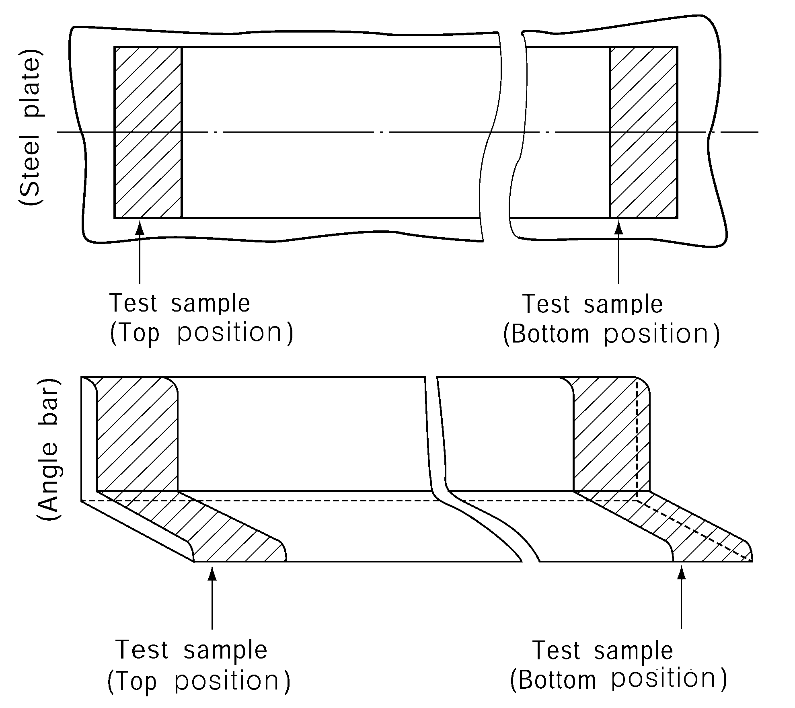 (1) Contents of *C, Mn, Si, P, S, Ni, Cr, Mo, Al, N, Nb, V, Cu, As, Sn, Ti, B, Zr, Bi, Pb, Ca, Sb, O, H* are to be reported. (2) Other tests than Sulphur prints for segregation examination may be applied and subject to acceptance by the Society. (3) The micrographs are to be representative of the full thickness. For thick products in general at least three examinations are to be made at surface, 1/4t and 1/2t of the product. (4) Longitudinal direction for sections, bars, tubulars and rolled flats with a finished width of 600 mm or less. (5) In case of tensile test specimens of bar steels taken from steels over 40 *mm* in thickness, test specimens are to be taken at the middle of thickness and in accordance with the requirements of Part 2, Ch 1, 308. of the Rules. (6) Strain ageing test and weldability test are to be carried out on the thickest plate. (7) Impact test for a nominal thickness less than 6 mm are normally not required. (8) For plates having thickness higher than 40 *mm* one additional set of impact specimens is to be taken with the axis located at mid-thickness. (9) Impact test temperatures on unstrained specimens(A) and strained specimens(B) for grades are as bellows ; division ; Grades ; Direction ; Test temp.(℃) (A) ; *AH* 43 ∼ *AH* 97 ; longitudinal and Transverse ; +20 ; 0 ; -20 ; - *DH* 43 ∼ *DH* 97 ; 0 ; -20 ; -40 ; - *EH* 43 ∼ *EH* 97 ; 0 ; -20 ; -40 ; -60 *FH* 43 ∼ *FH* 70 ; -20 ; -40 ; -60 ; -80 (B) ; *AH* 43 ∼ *AH* 97 ; longitudinal or Transverse ; +20 ; 0 ; -20 ; - *DH* 43 ∼ *DH* 97 ; 0 ; -20 ; -40 ; - *EH* 43 ∼ *EH* 97 ; 0 ; -20 ; -40 ; -60 *FH* 43 ∼ *FH* 70 ; -20 ; -40 ; -60 ; -80 division Grades Direction Test temp.(℃) (A) *AH* 43 ∼ *AH* 97 longitudinal and Transverse +20 0 -20 - *DH* 43 ∼ *DH* 97 0 -20 -40 - *EH* 43 ∼ *EH* 97 0 -20 -40 -60 *FH* 43 ∼ *FH* 70 -20 -40 -60 -80 (B) *AH* 43 ∼ *AH* 97 longitudinal or Transverse +20 0 -20 - *DH* 43 ∼ *DH* 97 0 -20 -40 - *EH* 43 ∼ *EH* 97 0 -20 -40 -60 *FH* 43 ∼ *FH* 70 -20 -40 -60 -80 |   |   |   |   |   |   |
    | division | Grades | Direction | Test temp.(℃) |   |   |   |
    | (A) | *AH* 43 ∼ *AH* 97 | longitudinal and Transverse | +20 | 0 | -20 | - |
    | (A) | *DH* 43 ∼ *DH* 97 | longitudinal and Transverse | 0 | -20 | -40 | - |
    | (A) | *EH* 43 ∼ *EH* 97 | longitudinal and Transverse | 0 | -20 | -40 | -60 |
    | (A) | *FH* 43 ∼ *FH* 70 | longitudinal and Transverse | -20 | -40 | -60 | -80 |
    | (B) | *AH* 43 ∼ *AH* 97 | longitudinal or Transverse | +20 | 0 | -20 | - |
    | (B) | *DH* 43 ∼ *DH* 97 | longitudinal or Transverse | 0 | -20 | -40 | - |
    | (B) | *EH* 43 ∼ *EH* 97 | longitudinal or Transverse | 0 | -20 | -40 | -60 |
    | (B) | *FH* 43 ∼ *FH* 70 | longitudinal or Transverse | -20 | -40 | -60 | -80 |

    | Test items | Direction of the test specimens | Test method | Acceptance criteria |
    | --- | --- | --- | --- |
    | Tensile test | T (Transverse) | In accordance with Pt 2 of the Rules. 1 cross weld tensile test - 1 full thickness test sample or sub-sized samples cover the full thickness cross section. | To meet the requirements in Pt 2, Ch 2, Sec 4 of the Rules |
    | Charpy V-notch Impact test | T | (a) 1 set of 3 Charpy V-notch impact specimens transverse to the weld seam and 1-2 mm below the surface with the notch located at the fusion line and at a distance 2, 5 and 20 mm from the straight fusion line. An additional set of 3 Charpy test specimens at root is required for each aforementioned position for plate thickness t ≥ 50 mm. The test temperature is to be the one prescribed for the testing of the steel grade. (b) The fusion boundary is to be identified by etching the specimens with a suitable reagent. | To meet the requirements in Pt 2, Ch 1, Sec 3, Table 2.1.35 of the Rules. |
    | CTOD test | T | CTOD test specimens are to be taken from butt weld test assembly specified in 3 (1) (A) (b) or (B) (b). CTOD test is to be carried out in accordance with EN ISO 15653 or equivalent. • the specimen geometry (B = W) is permitted for plate thickness up to 50 mm. For plate thicker than 50 mm, subsidiary specimen geometry (50x50 mm) is permitted, which is to be taken 50 mm in depth through thickness from the subsurface and 50 mm in width. See below figure for more details. 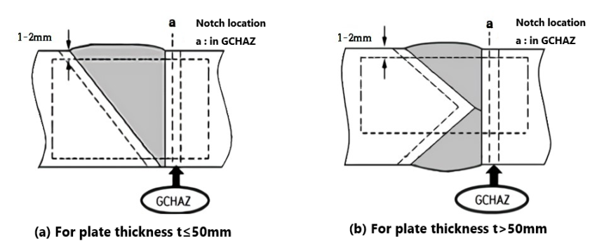 • the specimens are to be notched in through thickness direction • grain-coarsened HAZ (GCHAZ) is to be targeted for the sampling position of the crack tip • the test specimens are to be in as-welded and post-weld heat treated, if applicable • three tests shall be performed at -10°C on each butt weld test assembly For the steels specified yield point of 690 N/mm^2 and above, dehydrogenation of as-welded test pieces may be carried out by a low temperature heat treatment, prior to CTOD testing. Heat treatment conditions of 200 °C for 4 h are recommended, and the exact parameters are to be notified with the CTOD test results. | It is to be at the discretion of the Society. *(2020)* |

    | Test items | Direction of the test specimens | Test method | Acceptance criteria |
    | --- | --- | --- | --- |
    | Maximum hardness tests | - | Hardness tests HV10 across the weldment. The indentations are to be made along a 1-2 mm transverse line beneath the plate surface on both the face side and the root side of the weld as follows: - Fusion line - HAZ : at each 0.7 *mm* from fusion line into unaffected base material (6 to 7 minimum measurements for each HAZ) | Grade ; Hardness AH43 ~FH47 ; 350 HV max. AH51 ~FH70 ; 420 HV max. AH90 ~EH97 ; 450 HV max. Grade Hardness AH43 ~FH47 350 HV max. AH51 ~FH70 420 HV max. AH90 ~EH97 450 HV max. |
    | Grade | Hardness |   |   |
    | AH43 ~FH47 | 350 HV max. |   |   |
    | AH51 ~FH70 | 420 HV max. |   |   |
    | AH90 ~EH97 | 450 HV max. |   |   |
    | Macro structure tests | T | A sketch of the weld joint depicting groove dimensions, number of passes, hardness indentations should be attached to the test report together with photo-macrographs of the weld cross section. | To be free from crack, incomplete penetration, lack of fusion, other harmful defects |
    | Hydrogen crack test | - | Testing in accordance with national and international recognised standards such as GB/T4675.1 and JIS Z 3158 for Y-groove weld crack test. Minimum preheat temperature is to be determined and the relationship of minimum preheat temperature with thickness is to be derived. | It is to be at the discretion of the Society. *(2020)* |

### Section 2-8 Brittle Crack Arrest Steels (2021)

#### 271. Application

- **1.** The requirements in this Section apply to tests and inspection for the approval of manufacturing process of brittle crack arrest steels for longitudinal structural members in the upper deck region of container carriers as specified in **Pt 2, Ch 1, 312.** of the Rules.
- **2.** Requirements other than those specified in this Section are to be in accordance with the requirements of **Section 2-1.**

#### 272. Data to be submitted

The following reference data in addition to those specified in **102.** are to be submitted to the Society.

#### 273. Approval tests

- **1.** **Extent of the approval tests**
  - **(1)** If the manufacturing process and mechanism to ensure the brittle crack arrest properties for the steels intended for approval are same, **203.** of **Sec 2-1** is to be followed for the extent of the approval tests. For YP47 steels with brittle crack arrest properties, **203. 4.** (1) and (2) are not applied. *(2024)*
  - **(2)** The products for testing are to represent the maximum thickness for approval. If the target chemical composition changes with the thickness, the maximum thickness for each specified chemical composition specification shall be tested. *(2024)*
  - **(3)** The number of test samples and test specimens may be increased when deemed necessary by the Society, based on the in-house test reports of the brittle crack arrest properties of the steels intended for approval specified in **272.** (2) (B).
- **2.** **Type of tests**
  - **(1)** Brittle crack arrest tests are to be carried out in accordance with **3.** in addition to the approval tests specified in **Sec 2-1** and/or **Sec 2-5**.
  - **(2)** In the case of applying for addition of the specified brittle crack arrest properties for YP36, YP40 and YP47 steels of which, manufacturing process has been approved by the Society (i.e. The aim analyses and method of manufacture are similar and the steelmaking process, deoxidation and fine grain practice, casting method and condition of supply are the same), brittle crack arrest tests, chemical analyses, tensile test and Charpy V-notch impact test are to be carried out in accordance with this **Section** and **Sec 2-1**. *(2024)*
- **3.** **Approval tests and acceptance criteria**
  - **(1)** Test specimens and testing procedure of brittle crack arrest tests
    - **(A)** The test specimens of the brittle crack arrest tests are to be taken with their longitudinal axis parallel to the final rolling direction of the test plates.
    - **(B)** The loading direction of brittle crack tests is to be parallel to the final rolling direction of the test plates.
    - **(C)** The thickness of the test specimens of the brittle crack arrest tests is to be the full thickness of the test plates.
    - **(D)** The test specimens and repeat test specimens are to be taken from the same steel plate. Where the brittle crack arrest properties are evaluated by $K_ca$, and the brittle crack arrest test result fails to meet the requirement, further brittle crack arrest tests may be carried out. In this case, the judgment of acceptance is to be made on the arrest toughness value $K_ca$ of all test specimens (results of the initial test, failed tests and additional tests shall be included in the testing report.). *(2024)*
    - **(E)** The thickness of the test specimen is to be the maximum thickness of the steel plate requested for approval.
    - **(F)** In the case where the brittle crack arrest properties are evaluated by $K_ca$, the brittle crack arrest test method is to be in accordance with **Pt 2**, **Ch 1**, **203. 1.** of the Guidance. In the case where the brittle crack arrest properties are evaluated by CAT, the test method is to be in accordance with **Pt 2**, **Ch 1**, **203. 4.** of the Guidance.
  - **(2)** Other tests
    Additional tests may be required when deemed necessary by the Society.
  - **(3)** Acceptance criteria
    - **(A)** When the approval test is carried out in accordance with **Sec 2-1** and/or **Sec 2-5**, the acceptance criteria is also in accordance with the relevant requirements.
    - **(B)** Other than above (A), results of test items and the procedures shall comply with the test program approved by the Society. In the case where the brittle crack arrest properties are evaluated by $K_ca$ or CAT, the manufacturer also is to submit to the Society the brittle crack arrest test reports in accordance with **Pt 2**, **Ch 1**, **203. 1.** of the Guidance for $K_ca$ and **Pt 2**, **Ch 1**, **203. 4.** of the Guidance for CAT.
- **4.** **Grade designation**
  Upon satisfactory completion of the survey and tests, approval is granted by the Society with the grade designation having the suffix “BCA1” or “BCA2” (e.g. *EH40-BCA1*, *EH47-H-BCA1*, *EH47-H-BCA2*, etc.).
- **5.** **Renewal of approval**
  - **(1)** With respect to **108.**, the manufacturer is also to submit to the Society actual manufacturing records of the approved brittle crack arrest steels within the term of validity of the manufacturing approval certificate.
  - **(2)** Chemical composition, mechanical properties, brittle crack arrest properties (e.g. brittle crack arrest test results or small-scale test results) and nominal thickness are to be described in the form of histogram or statistics. *(2024)*

### Section 2-9 High manganese austenitic steels (2023)

#### 281. Application

- **1.** The requirements in this Section apply to tests and inspection for the approval of manufacturing process of high manganese austenitic steels as specified in **Pt 2, Annex 2-11** of the Guidance.
- **2.** Requirements other than those specified in this Section are to be in accordance with the requirements of **Section 2-1.**

#### 282. Data to be submitted

The following reference data in addition to those specified in **102.** & **202.** are to be submitted to the Society.

#### 283. Approval tests

- **1.** **Approval test and acceptance criteria**
  - **(1)** Approval tests are to be carried out in the presence of the Surveyor at the manufacturing plant and approval test items are to be as given in **Table 2.2.11**.
  - **(2)** Test methods and acceptance criteria are to be as given in **Table 2.2.12** & **Table 2.2.13**. However, where accordance with these requirements are difficult, decisions are left to the discretion of the Society.
  - **(3)** Weldability test
    In general, the following test assembles are to be prepared.
    - **(A)** Weldability tests are required for plates and are to be carried out on samples of the thickest plate.
    - **(B)** Preparation and welding of the test assemblies
      - **(a)** One butt weld test assembly welded with a heat input 15 kJ/cm ± 10 %
      - **(b)** One butt weld test assembly welded with a heat input 30 kJ/cm ± 10 %
      - **(c)** Where steel is required to be approved for heat input levels higher than 30 kJ/cm, the maximum heat input to be approved should be used for the test assembly in agreement with the Society.
    - **(C)** The butt weld test assemblies are to be prepared with the weld seam longitudinal to the plate rolling direction, so that impact specimens will result in the transverse direction. The bevel preparation should be preferably 1/2V or K upon the test assembly thickness. The welding procedure should be as far as possible in accordance with the normal welding practice used at the yards for the type of steel in question.
    - **(D)** The welding parameters including welding process, consumables designation and diameter, preheating temperature, interpass temperature, heat input, number of passes, etc. are to be reported. The maximum approved heat input level may be specified on the approval certificate.
  - **(4)** The corrosion test for ammonia compatibility should be carried out in accordance with **MSC.1/Circ.1599(Rev.2)**.

    | Kinds | grade | Base metal test |   |   |   |   |   |   |   |   |   |   |   | Brittle fracture test |   | WeldabiIity test |   |   |   |   |   |   | Corrosion resistance test |   |
    | --- | --- | --- | --- | --- | --- | --- | --- | --- | --- | --- | --- | --- | --- | --- | --- | --- | --- | --- | --- | --- | --- | --- | --- | --- |
    | Kinds | grade | ⒜ | ⒝ | ⒞ | ⒟ | ⒠ | ⒡ | ⒢ | ⒣ | ⒤ | ⒥ | ⒦ | ⒧ | ⒨ | ⒩ | ⒪ | ⒫ | ⒬ | ⒭ | ⒮ | ⒯ | ⒰ | ⒱ | ⒲ |
    | High manganese austenitic steels | *HMA 400* | ○ | ○ | ○ | ○ |   |   | ○ |   | ○ | ○ | ○ | ○ | ○(3) | ○ | ○ | ○ | ○ | ○ | ○ | ○ | ○ | ○(3) | ○(2)(3) |
    | Notes (1) Additional test such as large scale brittle fracture tests(Double tension test, ESSO test, Deep notch test, etc.) or other tests may be required in the case of newly developed type of steel, when deemed necessary by the Society. (2) Corrosion test for ammonia compatibility should be carried out for high manganese austenitic steels used in ammonia service, (3) The test is to be carried out for both base metal test and weldability test. (4) Kind of test ⒜ Chemical analysis ⒝ Sulphur print ⒞ Micro structure ⒟ Elastic modulus test ⒠ Ferrite grain size ⒡ Hardness test ⒢ Tensile test ⒣ Bend test ⒤ Charpy impact test ⒥ Strain charpy impact test ⒦ S-N Fatigue test ⒧ Fatigue crack growth rate test ⒨ CTOD test ⒩ NRL drop weight test ⒪ Weldment tensile test ⒫ Weldment impact test ⒬ Hardness test ⒭ Micro and Macro structure ⒮ S-N Fatigue test ⒯ Fatigue crack growth rate test ⒰ Ductile fracture toughness test J_1c ⒱ Corrosion test ⒲ Corrosion test for ammonia compatibility |   |   |   |   |   |   |   |   |   |   |   |   |   |   |   |   |   |   |   |   |   |   |   |   |

    | Approval test items |   | Position of the Sample | Direction of the test specimens | Approval Testing method | Acceptance criteria |
    | --- | --- | --- | --- | --- | --- |
    | Base metal test | Chemical analysis | T(Top) | - | KS D 0228 or equivalent method. Ladle analysis and production analysis(from the tensile test specimens) are to be performed for C, Si, Mn, P, S and other elements as deemed necessary. Determine the carbon equivalent value(Ceq or CET) and/or cold cracking susceptibility(Pcm). One test specimen for chemical analysis should be taken from one test sample. Contents of C, Mn, Si, P, S, Ni, Cr, Mo, Al, N, Nb, V, Ti, B, Zr, Cu, As, Sn, Bi, Pb, Ca, Sb, O, H are to be reported. | The chemical composition by ladle analysis is to comply with the requirements in Pt2, Annex 2-11 of the Guidance. Excess difference in the chemical compositions between melt analysis and product analysis is not to be accepted. |
    | Base metal test | Micro structure | T | - | One test specimen for micrographic examination should be taken from one test sample. All micrographs are to be taken at ×100 magnification and where austenite grain size exceeds **ASTM E112-2013** index 10 or equivalent, additionally at ×500 magnification. The austenite grain size should be measured and the non-metallic inclusions are to be examined. The micrographs are to be representative of the full thickness. | The result should be reported for reference. |
    | Base metal test | CTOD test | T | T | Test method should comply with **ISO 12135:2016, ASTM E1820:2020, BS7448-1:1991** or equivalent method. Test specimens for CTOD test are to be taken from one test sample One set of three CTOD specimens is required for each test. | CTOD minimum value should be in accordance with design specification for testing at room and cryogenic temperatures as per design conditions. As a guidance, a minimum CTOD value of 0.2mm is often required. |
    | Base metal test | Tensile test | T | P(Parallel) & T | In accordance with Pt 2 of the Rules. Yield strength, tensile strength, elongation, rate of reduction in area and yield ratio are to be recorded. Tensile test specimens are to be taken from one test sample. Tensile tests are to be carried out at room temperature and -165°C. Result of tensile tests at -165°C should be reported for reference. Tensile tests should be carried out with specimen of full thickness. | To meet the requirements in Pt 2, Annex 2-11 of the Guidance. |
    | Base metal test | Tensile test | B (Bottom) | P(Parallel) & T | In accordance with Pt 2 of the Rules. Yield strength, tensile strength, elongation, rate of reduction in area and yield ratio are to be recorded. Tensile test specimens are to be taken from one test sample. Tensile tests are to be carried out at room temperature and -165°C. Result of tensile tests at -165°C should be reported for reference. Tensile tests should be carried out with specimen of full thickness. | To meet the requirements in Pt 2, Annex 2-11 of the Guidance. |
    | Base metal test | V-notch Charpy impact test | T, 1/4t | P & T | Using test specimen in **Pt 2**, **Ch 1**, **Sec 2** of the Rules, the transition temperature curve of the absorbed energy and fracture surface ratio is to be determined by testing three pieces at each temperature.(also the lateral expansion to be reported.) The Charpy V-notch impact test temperature should include -196°C at least. In addition to the determination of the energy value, the lateral expansion and the percentage crystallinity are also to be reported. The percentage of the ductile fracture surface at -196°C should be 100% by fractography(SEM). Additionally at each location, Charpy V-notch impact tests are to be carried out with appropriate temperature intervals(-196°C, -165°C, -100°C and -65°C) to verify the properties of toughness at each temperature for reference. | To meet the requirements in Pt 2, Annex 2-11 of the Guidance. Other temperatures are for reference only. |
    | Base metal test | V-notch Charpy impact test | B, 1/4t | P & T | Using test specimen in **Pt 2**, **Ch 1**, **Sec 2** of the Rules, the transition temperature curve of the absorbed energy and fracture surface ratio is to be determined by testing three pieces at each temperature.(also the lateral expansion to be reported.) The Charpy V-notch impact test temperature should include -196°C at least. In addition to the determination of the energy value, the lateral expansion and the percentage crystallinity are also to be reported. The percentage of the ductile fracture surface at -196°C should be 100% by fractography(SEM). Additionally at each location, Charpy V-notch impact tests are to be carried out with appropriate temperature intervals(-196°C, -165°C, -100°C and -65°C) to verify the properties of toughness at each temperature for reference. | To meet the requirements in Pt 2, Annex 2-11 of the Guidance. Other temperatures are for reference only. |

    | Approval test items |   | Position of the Sample | Direction of the test specimens | Approval Testing method | Acceptance criteria |
    | --- | --- | --- | --- | --- | --- |
    | Base metal test | Strain ageing V-notch charpy impact test | T, 1/4t | P | Same as V-notch Charpy impact test. However The test specimens which have been maintained for one hour at 250°C after strain of 5 % have been applied is, as a rule, to be used. The Charpy V-notch impact test temperature should include -196°C at least. | The result should be reported for reference. |
    | Base metal test | Chemical analysis | T(Top) | - | KS D 0228 or equivalent method. Ladle analysis and production analysis(from the tensile test specimens) are to be performed for C, Si, Mn, P, S and other elements as deemed necessary. Determine the carbon equivalent value(Ceq or CET) and/or cold cracking susceptibility(Pcm). One test specimen for chemical analysis should be taken from one test sample. Contents of C, Mn, Si, P, S, Ni, Cr, Mo, Al, N, Nb, V, Ti, B, Zr, Cu, As, Sn, Bi, Pb, Ca, Sb, O, H are to be reported. | The chemical composition by ladle analysis is to comply with the requirements in Pt2, Annex 2-11 of the Guidance. Excess difference in the chemical compositions between melt analysis and product analysis is not to be accepted. |
    | Base metal test | Micro structure | T | - | One test specimen for micrographic examination should be taken from one test sample. All micrographs are to be taken at ×100 magnification and where austenite grain size exceeds **ASTM E112-2013** index 10 or equivalent, additionally at ×500 magnification. The austenite grain size should be measured and the non-metallic inclusions are to be examined. The micrographs are to be representative of the full thickness. | The result should be reported for reference. |
    | Base metal test | CTOD test | T | T | Test method should comply with I**SO 12135:2016, ASTM E1820:2020, BS7448-1:1991** or equivalent method. Test specimens for CTOD test are to be taken from one test sample One set of three CTOD specimens is required for each test. | CTOD minimum value should be in accordance with design specification for testing at room and cryogenic temperatures as per design conditions. As a guidance, a minimum CTOD value of 0.2mm is often required. |
    | Base metal test | Tensile test | T | P(Parallel) & T | In accordance with Pt 2 of the Rules. Yield strength, tensile strength, elongation, rate of reduction in area and yield ratio are to be recorded. Tensile test specimens are to be taken from one test sample. Tensile tests are to be carried out at room temperature and -165°C. Result of tensile tests at -165°C should be reported for reference. Tensile tests should be carried out with specimen of full thickness. | To meet the requirements in Pt 2, Annex 2-11 of the Guidance. |
    | Base metal test | Tensile test | B (Bottom) | P(Parallel) & T | In accordance with Pt 2 of the Rules. Yield strength, tensile strength, elongation, rate of reduction in area and yield ratio are to be recorded. Tensile test specimens are to be taken from one test sample. Tensile tests are to be carried out at room temperature and -165°C. Result of tensile tests at -165°C should be reported for reference. Tensile tests should be carried out with specimen of full thickness. | To meet the requirements in Pt 2, Annex 2-11 of the Guidance. |

    | Approval test items |   | Position of the Sample | Direction of the test specimens | Approval Testing method | Acceptance criteria |
    | --- | --- | --- | --- | --- | --- |
    | Base metal test | V-notch Charpy impact test | T, 1/4t | P & T | Using test specimen in **Pt 2**, **Ch 1**, **Sec 2** of the Rules, the transition temperature curve of the absorbed energy and fracture surface ratio is to be determined by testing three pieces at each temperature.(also the lateral expansion to be reported.) The Charpy V-notch impact test temperature should include -196°C at least. In addition to the determination of the energy value, the lateral expansion and the percentage crystallinity are also to be reported. The percentage of the ductile fracture surface at -196°C should be 100% by fractography(SEM). Additionally at each location, Charpy V-notch impact tests are to be carried out with appropriate temperature intervals(-196°C, -165°C, -100°C and -65°C) to verify the properties of toughness at each temperature for reference. | To meet the requirements in Pt 2, Annex 2-11 of the Guidance. Other temperatures are for reference only. |
    | Base metal test | V-notch Charpy impact test | B, 1/4t | P & T | Using test specimen in **Pt 2**, **Ch 1**, **Sec 2** of the Rules, the transition temperature curve of the absorbed energy and fracture surface ratio is to be determined by testing three pieces at each temperature.(also the lateral expansion to be reported.) The Charpy V-notch impact test temperature should include -196°C at least. In addition to the determination of the energy value, the lateral expansion and the percentage crystallinity are also to be reported. The percentage of the ductile fracture surface at -196°C should be 100% by fractography(SEM). Additionally at each location, Charpy V-notch impact tests are to be carried out with appropriate temperature intervals(-196°C, -165°C, -100°C and -65°C) to verify the properties of toughness at each temperature for reference. | To meet the requirements in Pt 2, Annex 2-11 of the Guidance. Other temperatures are for reference only. |
    | Base metal test | Strain ageing V-notch charpy impact test | T, 1/4t | P | Same as V-notch Charpy impact test. However The test specimens which have been maintained for one hour at 250°C after strain of 5 % have been applied is, as a rule, to be used. The Charpy V-notch impact test temperature should include -196°C at least. | The result should be reported for reference. |
    | Base metal test | S-N Fatigue test | T | T | Test method should comply with **ASTM E466:2015** or equivalent method. Sufficient number of test specimens to obtain S-N curve are to be taken from test samples. The test temperature is room temperature. At the discretion of the Society, S-N fatigue test may be waived. | The S-N curve should be established and the result should be equal or better than the FAT125-curve in International Institute of Welding(IIW). |
    | Base metal test | Fatigue crack growth rate test | T | T | Test method should comply with **ASTM E647:2015** or equivalent method. One test specimen for fatigue crack growth rate should be taken from one test sample. The test temperature is room temperature. At the discretion of the Society, fatigue crack growth rate test may be waived. | The result should be reported for reference. |
    | Base metal test | Corrosion test | T | - | General corrosion test method should comply with **ASTM G31-21** or equivalent method. One test specimen for corrosion resistance should be taken from one test sample. | The result should be reported for reference. |
    | Base metal test | Corrosion test | T | - | Intergranular corrosion test method should comply with **ASTM A262:2015** or equivalent method. One test specimen for corrosion resistance should be taken from one test sample. | The result should be reported for reference. |
    | Base metal test | Corrosion test | T | - | Stress corrosion crack(SCC) test Test method should comply with **ASTM G36:2018** and **G123:2015** or equivalent method. Test specimen should comply with **ASTM G30:2016** or equivalent. One test specimen for stress corrosion crack should be taken from one test sample. | The result should be reported for reference. |

    | Approval test items |   | Position of the Sample | Direction of the test specimens | Approval Testing method | Acceptance criteria |
    | --- | --- | --- | --- | --- | --- |
    | Base metal test | Sulphur print | T | - | Sulphur prints are to be taken from plate edges which are perpendicular to the axis of the ingot or slab. These sulphur prints are to be approximately 600mm long taken from the centre of the edge selected, i.e. on the ingot centerline, and are to include the full product thickness. | Segregation, etc, deemed to have negative effect are not to be present. |
    | Base metal test | Elastic modulus test | T | - | Test method should comply with **ASTM E494:2015** or equivalent method. One test specimen for elastic modulus should be taken from one test sample. The test temperature should include room temperature and -165°C at least. | The result should be reported for reference. |
    | Brittle fracture test | NRL drop weight test | T | - | ASTM E 208 or equivalent method. The NDTT(Non- Ductility transition temperature) is to be determined and photographs of the tested specimens are to be taken and enclosed with the test report. Two specimens for drop weight test are to be taken from the surface of one test sample. The test temperature is -196°C. | The test results should show no-break performance at -196°C. |

    | Approval test items | Direction of the test specimens | Approval Testing method | Acceptance criteria |
    | --- | --- | --- | --- |
    | Tensile test | T (Transverse) | Two tensile test specimens transverse to the weld are to be taken from one test assembly. Tensile tests are to be carried out at room temperature and -165°C. The result at tensile test at -165°C should be reported for reference. Tensile tests should be carried out with full thickness. | To meet Note (1)${}^{(1)}$ |
    | Charpy V-notch Impact test | 1/4t, T | One set of three Charpy V-notch specimens transverse to the weld should be taken. Charpy impact test on center of WM, FL, FL+1, FL+3 and FL+5. The fusion boundary should be identified by etching the specimens with a suitable reagent. The impact test temperature should include -196°C at least. Additionally at each location, impact tests are to be carried out with appropriate temperature intervals(-196°C, -165°C, -100°C, 0°C) to verify the properties of toughness at each temperature for reference. | To meet Note (1)${}^{(1)}$ |
    | Ductile fracture toughness test J_1C | T | Test method should comply with **ASTM E1820:2020**, **ISO 15653:2018** or equivalent method. One test specimen should be taken from the test sample. Test temperature should include cryogenic service temperature. This test may be omitted at the discretion of the Society. | The test results are to show the satisfactory resistance to the unstable ductile fracture. |
    | CTOD test | T | Test method should comply with **ISO 15653:2018**, **ASTM E1820:2020**, or equivalent method. CTOD test for three specimens transverse to the weld for each condition should be carried out at a position of coarse grained heat affected zone(CGHAZ). Additional set of CTOD tests with notch positions such as FL+1, FL+3, FL+5 may be required by the Society. | CTOD minimum value should be in accordance with design specification for testing at room and cryogenic temperatures as per design conditions. As a guidance, a minimum CTOD value of 0.2mm is often required. |
    | Hardness test | - | Hardness tests HV10 across the weldment. The indentations are to be made along a transverse line which is 1~2mm beneath the plate surface on both the face side and the root side of the weld as follows: - Fusion line - HAZ : at each 0.7mm from fusion line into unaffected based material(6 to 7 minimum measurements for each HAZ) A sketch of the weld joint depicting groove dimensions, number of passes, hardness indentations should be attached to the test report together with photomacrographs of the weld cross section. At least two rows of indentations are to be carried out in accordance with Fig below. 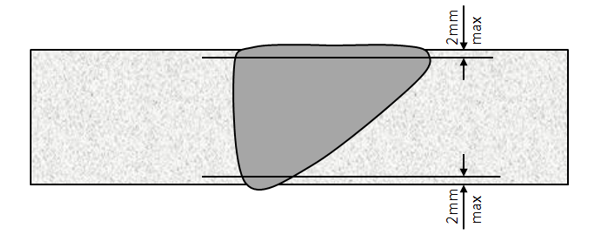 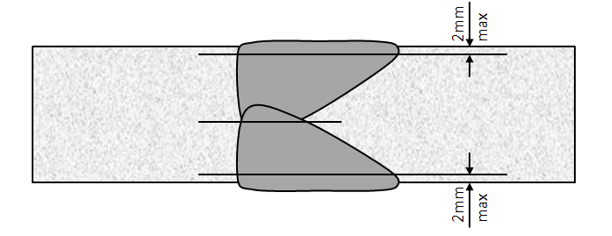 | The result should be reported for reference. |

    | Approval test items | Direction of the test specimens | Approval Testing method | Acceptance criteria |
    | --- | --- | --- | --- |
    | Corrosion test | - | General corrosion test method should comply with **ASTM G31-21** or equivalent method. One test specimen for corrosion resistance should be taken from one test sample. | The result should be reported for reference. |
    | Corrosion test | - | Intergranular corrosion test method should comply with **ASTM A262:2015** or equivalent method. One test specimen for corrosion resistance should be taken from one test sample. | The result should be reported for reference. |
    | Corrosion test | - | Stress corrosion crack(SCC) test Test method should comply with **ASTM G36:2018** and **G123:2015** or equivalent method. Test specimen should comply with **ASTM G58:2015** or equivalent. One test specimen for stress corrosion crack should be taken from one test sample. | The result should be reported for reference. |
    | Micro and macro examination | - | All micrographs are to be taken at ×100 magnification and where austenite grain size exceeds **ASTM E112-2013** index 10 or equivalent, additionally at × 500 magnification. The austenite grain size should be measured and the non-metallic inclusions are to be examined. The micrographs are to be representative of the full thickness. Three examinations are to be made at surface, one quarter and mid-thickness of the product. | The result including metallurgical phases should be reported for reference. One macroscopic photograph should be representative of transverse section of the welded joint and should show absence of cracks, lack of penetration, lack of fusion and other injurious defects. |
    | Bending test | P(Parallel) | Longitudinal bend test should be carried out. | No fracture should be acceptable after 180° bend over a former diameter four times the thickness of the test pieces. |
    | S-N fatigue test | T | Test method should comply with **ASTM E466:2015** or equivalent method. Sufficient number of test specimens to obtain S-N curve are to be taken from test samples. The test temperature is room temperature. At the discretion of the Society, S-N fatigue test may be waived. | The S-N curve should be established and the result should be equal or better than the FAT90-curve in IIW. |
    | Fatigue crack growth rate test | - | Test method should comply with **ASTM E647:2015** or equivalent method. One test specimen for fatigue crack growth rate should be taken from one test sample. Notch in test specimen should be parallel with welding seam. The test temperature is room temperature. As the discretion of the Society, the fatigue crack growth rate test may be waived. | The result should be reported for reference. |
    | Notes (1) The Mechanical properties for butt weld tests are defined in Table below. Tensile Strength ($N/mm ^{2}$) ; Elongation ($L=5.65 \sqrt {A}$) (%) ; Impact test Test Temp.(℃) ; Average Impact Energy(J) min. min. 660 ; min. 22 ; -196 ; 27 Tensile Strength ($N/mm ^{2}$) Elongation ($L=5.65 \sqrt {A}$) (%) Impact test Test Temp.(℃) Average Impact Energy(J) min. min. 660 min. 22 -196 27 |   |   |   |
    | Tensile Strength ($N/mm ^{2}$) | Elongation ($L=5.65 \sqrt {A}$) (%) | Impact test |   |
    | Tensile Strength ($N/mm ^{2}$) | Elongation ($L=5.65 \sqrt {A}$) (%) | Test Temp.(℃) | Average Impact Energy(J) min. |
    | min. 660 | min. 22 | -196 | 27 |

### Section 3 Steel Tubes and Pipes

#### 301. Application

The requirements in this Section apply to tests and inspection for the approval of manufacturing process of steel tubes and pipes as specified in **Pt 2, Ch 1, Sec 4** of the Rules.

#### 302. Data to be submitted

- **1.** The following reference data in addition to those specified in **102.** are to be submitted to the Society.
  - **(1)** Kind of products (e.g. Material grade, etc.)
  - **(2)** Method of melting process
  - **(3)** Method of ingot casting
  - **(4)** Fabrication method of steel tubes and pipes (Fabrication method is to be classified seamless steel tubes and pipes, welded steel tubes and pipes, electric-resistance welded steel tubes and pipes, etc. For welded steel tubes and pipes or electric-resistance welded steel tubes and pipes, welding working standards are to be included.)
  - **(5)** Method of heat treating, etc.
- **2.** Where raw materials for steel tubes and pipes are provided from multi-source or any part of the manufacturing process is assigned to other companies or other manufacturing plants, the manufacturer is to submit the documents for identification system for its traceability.

#### 303. Approval tests

- **1.** **Selection of test samples**
  - **(1)** The test samples used for the approval test are to be selected, in the presence of the Surveyor, as a rule, from the steel tubes and pipes with the same conditions of material manufacturing process, fabrication method of tubes and pipes and heat treatment method.
  - **(2)** As a rule, the dimensions of the test sample are standardized according to the maximum manufactured outer diameter, the maximum manufactured thickness and the closest 1/2 of these values. Furthermore, the number of test pieces is to be as deemed appropriate by the Society.
- **2.** **Test**
  - **(1)** Items of the approval test are to be as given in **Table 2.3.1** and are to be carried out in the presence of the Surveyor except otherwise specially provided.
  - **(2)** The test method and evaluation criteria are to be in accordance with the requirements in **Pt 2, Ch 1, Sec 4** of the Rules. However, where accordance with these requirements are difficult, decisions are left to the discretion of the Society.

#### 304. Changes in the manufacturing process

In case changes occur in the approval content among manufacturing process of steel tubes and pipes which have been granted approval beforehand, such as those given in the following (1) through (9), the manufacturer is to submit the application of alteration to the Society together with the documents in response to the content of changes.

#### 305. Dealing after approval

Steel tubes and pipes which conform to the requirements in this Section are to be dealt with as [in approved case] in the requirements in **Pt 2, Ch 1, 201. 3** (2) of the Rules, unless otherwise specified by the Society.

**Table 2.3.1 Approval Test Items for Steel Tubes and Pipes** ***(2018) (2019)***

| Test items Steel tubes and pipes |   | Base metal test |   |   |   |   |   |   |   |   |   | High temperature characteristics test |   | Corrosion resistance test |
| --- | --- | --- | --- | --- | --- | --- | --- | --- | --- | --- | --- | --- | --- | --- |
| Test items Steel tubes and pipes |   | Chemical analysis | Microstructure | Tensile test | Charpy impact test | Bend test | Flattening test | Flaring test | Reverse flattening | U-shaped bend test | Hydraulic test | High temp. tensile test | Creep test | Corrosion test |
| Steel tubes for boilers and heat exchangers | *RSTH* 33 ~ *RSTH* 52 | ○ | ○ | ○ |   |   | ○ | ○ | ○ | ○ | ○ | ○ | ○ |   |
| Steel pipes for pressure piping | *RST* 138 ~ *RST* 424 | ○ | ○ | ○ |   | ○(8) | ○(8) |   |   |   | ○ | ○ | ○ |   |
| Steel pipes for low temp. service | *RLPA* ~ *RLP* 9 | ○ | ○ | ○ | ○ | ○(8) | ○(8) |   |   |   | ○ |   |   |   |
| Stainless steel pipes | *RSTS* 304*TP* ~ *RSTS* 347*TP,* *RSTS* 31803*TP*, *RSTS* 32750*TP* | ○ | ○ | ○ | ○ |   | ○(9) |   |   |   | ○ |   |   | ○ |
| Headers | *RBH-*1 ~ *RBH* 6 | ○ | ○ | ○ |   | ○ |   |   |   |   |   |   |   |   |
| NOTES: (1) Approval tests for each steel tubes and pipes are to be performed for each test item indicated with a ○ mark in the Table. Moreover, the application of the flattening, flaring, reverse flattening and bending tests are to be in accordance with the requirements in Pt 2, Ch 1, Sec 4 of the Rules. Also, high temperature tensile test and creep test are not applicable to Grade 1 and Grade 2 of steel pipes for pressure piping. (2) The U-shaped bend test method for steel tubes for boilers and heat exchangers is to comply with the requirements in the KS D 3563. (3) Where steel pipes for pressure piping and low temperature service have passed the tests for higher grade material with the similar strength level, pipe production method, heat treatment method, etc., the tests for steel pipes with lower grade may be omitted when deemed appropriate by the Society. (4) Where other steel tubes and pipes than those of the preceding 3. have passed the tests for higher strength level with similar chemical composition (carbon steel or low alloy steel), pipe manufacturing process, heat treatment method, etc., the tests for those with lower strength level may be omitted, subject to submission of their acceptable data (i,e. specification of chemical composition and heat treatment, etc.) to the Society. (5) The high temperature tensile test and creep test as specified in the Table are performed for the purpose of evaluating high temperature characteristics of steel tubes and pipes, and these tests may be omitted in case appropriate technical reports are available or in case Society deems the tests unnecessary. (6) Where the steel tubes and pipes are not specified in the Rules or the steel tubes and pipes are used in special applications, tests other than those indicated in the Table (e,g, tests for welded parts) or the submission of reference data may be requested. Moreover, where low temperature toughness is considered necessary, the CTOD test is required. (7) Where the welded steel tubes and pipes are not specified in the Rules or the steel tubes and pipes are used in special applications, tests for weld joint other than those indicated in the Table are to be required. - Tensile test for butt weld joint - Flattening test - Charpy V-notch impact test (weld and HAZ) - Hardness test for butt weld joint - Micro and Macro test for butt weld joint - Non-destructive test for butt weld joint (RT and/or UT) (8) For steel pipes of 50 mm and under in outside diameter, flattening test may be substituted for bend test. (9) For the welded steel pipes with nominal diameter 200A and more, the flattening test may be substituted for the guided bend test upon the approval of the Society. |   |   |   |   |   |   |   |   |   |   |   |   |   |   |

### Section 4-1 Castings (2018)

#### 401. Application

The requirements in this Section apply to tests and inspection for the approval of manufacturing process of castings as specified in **Pt 2, Ch 1, Sec 5** of the Rules. Anchors, chain, chain accessories and special cast iron valves are to be in accordance with the other requirements of this Guidance.

#### 402. Data to be submitted

The following reference data in addition to those specified in **102.** are to be submitted to the Society.

#### 403. Approval tests

- **1.** **Test samples and specimen** ***(2021)***
  - **(1)** Test samples are to be representative of material types and casting methods for which approval is requested. The typical type of material and casting method are to be in accordance with **Table 2.4.1**.

    **Table 2.4.1 The type of material and casting method** ***(2022) (2024)***

    | Kinds | Representative grade or Standards | Casting method |
    | --- | --- | --- |
    | Carbon steel(1) | *RSC* 400*H* ~ *RSC* 600*H*, *RSC* 400*M* ~ *RSC* 600*M* **Pt 2, Ch 1, 501.** of the Rules | - Sand casting - Die casting - Precision casting - Centrifugal casting - Others |
    | Alloy steel | *RSC* 550*HA* ~ *RSC* 700*HA,* *RSC* 550*MA* ~ *RSC* 700*MA* **Pt 2, Ch 1, 501.** of the Rules | - Sand casting - Die casting - Precision casting - Centrifugal casting - Others |
    | Austenitic stainless steel | *RSSC* 13 ~ *RSSC* 21 **Pt 2, Ch 1, 503.** of the Rules | - Sand casting - Die casting - Precision casting - Centrifugal casting - Others |
    | 22Cr duplex stainless steel(2) | UNS J93370, J93372, J93345, J93371, J92205 | - Sand casting - Die casting - Precision casting - Centrifugal casting - Others |
    | 25Cr duplex stainless steel(2) | UNS J93373, J93404, J93380 | - Sand casting - Die casting - Precision casting - Centrifugal casting - Others |
    | Carbon steel for low temperature service(1) | *RLCA* ~ *RLCB* **Pt 2, Ch 1, 504.** of the Rules | - Sand casting - Die casting - Precision casting - Centrifugal casting - Others |
    | Nickel alloy steel for low temperature service | *RLC* 2 ~ *RLC* 3 **Pt 2, Ch 1, 504.** of the Rules | - Sand casting - Die casting - Precision casting - Centrifugal casting - Others |
    | Martensitic stainless steel for propeller | 12*Cr*1*Ni* ~ 16*Cr*5*Ni* **Pt 2, Ch 1, 505.** of the Rules | - Sand casting - Die casting - Precision casting - Centrifugal casting - Others |
    | Austenitic stainless steel for propeller | 19*Cr*11*Ni* **Pt 2, Ch 1, 505.** of the Rules | - Sand casting - Die casting - Precision casting - Centrifugal casting - Others |
    | Grey iron(3) | ISO 185, EN 1561 | - Sand casting - Die casting - Precision casting - Centrifugal casting - Others |
    | Spheroidal or nodular graphite iron(3) | ISO 1083, EN 1563 | - Sand casting - Die casting - Precision casting - Centrifugal casting - Others |
    | Others | Applicable standards, codes, etc. | - Sand casting - Die casting - Precision casting - Centrifugal casting - Others |
    | Notes : (1) Where carbon steel for low temperature service has passed the tests, the tests for carbon steel may be omitted. *(2021)* (2) Where 25Cr duplex stainless steel has passed the tests, the tests for 22Cr duplex stainless steel may be omitted. (3) Where Spheroidal or nodular graphite iron has passed the tests, the tests for grey iron may be omitted. |   |   |
  - **(2)** For initial approval, at least two test samples are to be selected.
  - **(3)** In case of approval for various material groups and casting methods, test samples may be reduced to one per material type by the approval of the Society.
  - **(4)** All test samples are to be from different heats or casts.
  - **(5)** One of test samples should be close to the maximum mass for which approval is requested.
- **2.** Selection of test specimens and approval tests, in principle, are to be carried out in the presence of the Surveyor. However ladle analysis, micro structure or in case the Society deems the test unnecessary may be omitted. *(2021)*
- **3.** The semi-built-up crank throw for diesel engines and the crank throw to reduce the size are to be as deemed appropriate by the Society.
- **4.** **Approval test and acceptance criteria**
  Kinds of tests, test methods and acceptance criteria are to be as given in **Table 2.4.2**. However, where accordance with these requirements are difficult, it may be changed with the approval of the Society. *(2019)*

#### 404. Certification

On the approval certificate the following information is to be stated:

#### 405. Changes in the manufacturing process

- **1.** In case changes occur in the approval content among manufacturing process of castings which have been granted approval beforehand, such as those given in the followings, the manufacturer is to submit the application of alteration to the Society together with the documents in response to the content of changes. In this case, plant audit and approval test are to be carried out.
  - **(1)** Types of material
  - **(2)** Melting process
  - **(3)** Casting method *(2021)*
  - **(4)** Max. mass of the products
  - **(5)** Relocating or changing of the manufacturing sites
- **2.** If the manufacturing sites has been relocated or changed without changing the approved range, the test samples for approval test are to be included all approved casting procedure. However, the type and weight of the material may be selected by the manufacturer.

#### 406. Dealings after approval

### Section 4-2 Steel forgings (2018)

#### 411. Application

The requirements in this Section apply to tests and inspection for the approval of manufacturing process of steel forging as specified in **Pt 2, Ch 1, Sec 6** of the Rules. Steel forgings for chains are to be in accordance with the other requirements of this Guidance.

#### 412. Data to be submitted

The following reference data in addition to those specified in **102.** are to be submitted to the Society.

#### 413. Approval tests

- **1.** **Test samples and specimen** ***(2021)***
  - **(1)** Test samples are to be representative of types of steel and forging processes for which approval is requested. The typical type of steel and forging process are to be in accordance with **Table 2.4.3**.

    **Table 2.4.3 The type of steel and forging process** ***(2022)***

    | Kinds | Representative grade or Standards | Forging process |
    | --- | --- | --- |
    | Carbon steel(1) | *RSF* 400*H* ~ *RSF* 600*H* *RSF* 400*M* ~ *RSF* 760*M* **Pt 2, Ch 1, 601.** of the Rules | - Open die forging - Closed die forging - Ring forging - Others |
    | Alloy steel | *RSF* 550*AH* ~ *RSF* 650*AH* *RSF* 600*AM* ~ *RSF* 1100*AM* **Pt 2, Ch 1, 601.** of the Rules | - Open die forging - Closed die forging - Ring forging - Others |
    | Stainless steel | *RSSF* 304 ~ *RSSF* 347 **Pt 2, Ch 1, 502.** of the Rules | - Open die forging - Closed die forging - Ring forging - Others |
    | 22Cr duplex stainless steel(2) | UNS S31200, S31803, S32950, S32205 | - Open die forging - Closed die forging - Ring forging - Others |
    | 25Cr duplex stainless steel(2) | UNS S32750, S32550, S32760 | - Open die forging - Closed die forging - Ring forging - Others |
    | Carbon steel for low temperature service(1) | *RLFA* ~ *RLFC* **Pt 2, Ch 1, 604.** of the Rules | - Open die forging - Closed die forging - Ring forging - Others |
    | Nickel alloy steel for low temperature service | *RLF* 3 ~ *RLF* 9 **Pt 2, Ch 1, 604.** of the Rules | - Open die forging - Closed die forging - Ring forging - Others |
    | Others | Applicable standards, codes, etc. | - Open die forging - Closed die forging - Ring forging - Others |
    | Notes : (1) Where carbon steel for low temperature service has passed the tests, the tests for carbon steel may be omitted. *(2021)* (2) Where 25Cr duplex stainless steel has passed the tests, the tests for 22Cr duplex stainless steel may be omitted. |   |   |
  - **(2)** For initial approval, at least two test samples are to be selected.
  - **(3)** In case of approval for various steel types and forging processes, test samples may be reduced one per steel type by the approval of the Society.
  - **(4)** All test samples are to be from different heats or casts.
  - **(5)** One of test samples should be close to the maximum forging weight and/or maximum dimension for which approval is requested.
- **2.** Selection of test specimens and approval tests, in principle, are to be carried out in the presence of the Surveyor. However ladle analysis, micro structure or in case the Society deems the test unnecessary may be omitted. *(2021)*
- **3.** The separate approval tests are required for the products as below.
  - **(1)** Semibuilt-up crank throws
  - **(2)** Continuous grain flow forged crankshaft
  - **(3)** Crankshaft for reduction of the dimension(**Ch 2**, **Sec 5** of this Guidance)
  - **(4)** Intermediate shaft for reduction of shaft dimensions or having higher permissible vibration stresses(**313. 4**)
- **4.** **Approval test and acceptance criteria**
  Kinds of tests, test methods and acceptance criteria are to be as given in **Table 2.4.4**. For solid crank shafts and semibuilt-up crank throws, kinds of tests, test methods and acceptance criteria are to be as given in **Table 2.4.4** and **Table 2.4.5**. However, where accordance with these requirements are difficult, it may be changed with the approval of the Society. *(2019)*

  | Approval test items | Approval testing method | Acceptance criteria |   |
  | --- | --- | --- | --- |
  | Chemical analysis | Both the ladle and product analyses are to be reported. The elements as specified in Pt 2 of the Rules and standards applied which are added or intentionally controlled are to be checked. | The chemical composition is to comply with the requirements in Pt 2 of the Rules and standards applied. Excess difference in the chemical compositions between melt analysis and product analysis is not to be accepted. |   |
  | Tensile test | To meet the requirements in **Pt 2** of the Rules and standards applied. | To meet the requirements in **Pt 2** of the Rules and standards applied. |   |
  | V-notch Charpy impact test | The test specimens specified in **Pt 2**, **Ch 1**, **Sec 2** of the Rules are to be tested by three pieces at each temperature in accordance with table below. The absorbed energy for average and individual is to be determined by testing. Material classification ; Temperature ; Acceptance criteria Carbon steel and alloy steel have no specific test condition in Pt 2 of the Rules and standards applied ; 20℃ ; At 20℃ to be 27J min, At other temperature to be with reference 0℃ Carbon steel and alloy steel have the specific test condition in Pt 2 of the Rules and standards applied ; 20℃ ; The average absorbed energy is to be satisfied with minimum value specified in Pt 2 of the Rules and standards applied. At other temperature to be with reference Required temperature 20℃ lower than required temperature Stainless steel ; -196℃ ; Average absorbed energy is to be 27J min. Duplex stainless steel ; 0℃ ; At -20℃ to be 27J min, At other temperature to be with reference -20℃ -40℃ Carbon steel for low temperature service ; *RLFA* ; -40℃ ; Average absorbed energy is to be 27J min. *RLFB* ; -50℃ *RLFC* ; -60℃ Nickel alloy steel for low temperature service ; *RLF*3 ; -70℃ ; At 95℃ to be 34J min, At other temperature to be with reference -95℃ -115℃ *RLF*9 ; -196℃ ; Average absorbed energy is to be 41J min. Material classification Temperature Acceptance criteria Carbon steel and alloy steel have no specific test condition in Pt 2 of the Rules and standards applied 20℃ At 20℃ to be 27J min, At other temperature to be with reference 0℃ Carbon steel and alloy steel have the specific test condition in Pt 2 of the Rules and standards applied 20℃ The average absorbed energy is to be satisfied with minimum value specified in Pt 2 of the Rules and standards applied. At other temperature to be with reference Required temperature 20℃ lower than required temperature Stainless steel -196℃ Average absorbed energy is to be 27J min. Duplex stainless steel 0℃ At -20℃ to be 27J min, At other temperature to be with reference -20℃ -40℃ Carbon steel for low temperature service *RLFA* -40℃ Average absorbed energy is to be 27J min. *RLFB* -50℃ *RLFC* -60℃ Nickel alloy steel for low temperature service *RLF*3 -70℃ At 95℃ to be 34J min, At other temperature to be with reference -95℃ -115℃ *RLF*9 -196℃ Average absorbed energy is to be 41J min. |   |   |
  | Material classification |   | Temperature | Acceptance criteria |
  | Carbon steel and alloy steel have no specific test condition in Pt 2 of the Rules and standards applied |   | 20℃ | At 20℃ to be 27J min, At other temperature to be with reference |
  | Carbon steel and alloy steel have no specific test condition in Pt 2 of the Rules and standards applied |   | 0℃ | At 20℃ to be 27J min, At other temperature to be with reference |
  | Carbon steel and alloy steel have the specific test condition in Pt 2 of the Rules and standards applied |   | 20℃ | The average absorbed energy is to be satisfied with minimum value specified in Pt 2 of the Rules and standards applied. At other temperature to be with reference |
  | Carbon steel and alloy steel have the specific test condition in Pt 2 of the Rules and standards applied |   | Required temperature | The average absorbed energy is to be satisfied with minimum value specified in Pt 2 of the Rules and standards applied. At other temperature to be with reference |
  | Carbon steel and alloy steel have the specific test condition in Pt 2 of the Rules and standards applied |   | 20℃ lower than required temperature | The average absorbed energy is to be satisfied with minimum value specified in Pt 2 of the Rules and standards applied. At other temperature to be with reference |
  | Stainless steel |   | -196℃ | Average absorbed energy is to be 27J min. |
  | Duplex stainless steel |   | 0℃ | At -20℃ to be 27J min, At other temperature to be with reference |
  | Duplex stainless steel |   | -20℃ | At -20℃ to be 27J min, At other temperature to be with reference |
  | Duplex stainless steel |   | -40℃ | At -20℃ to be 27J min, At other temperature to be with reference |
  | Carbon steel for low temperature service | *RLFA* | -40℃ | Average absorbed energy is to be 27J min. |
  | Carbon steel for low temperature service | *RLFB* | -50℃ | Average absorbed energy is to be 27J min. |
  | Carbon steel for low temperature service | *RLFC* | -60℃ | Average absorbed energy is to be 27J min. |
  | Nickel alloy steel for low temperature service | *RLF*3 | -70℃ | At 95℃ to be 34J min, At other temperature to be with reference |
  | Nickel alloy steel for low temperature service | *RLF*3 | -95℃ | At 95℃ to be 34J min, At other temperature to be with reference |
  | Nickel alloy steel for low temperature service | *RLF*3 | -115℃ | At 95℃ to be 34J min, At other temperature to be with reference |
  | Nickel alloy steel for low temperature service | *RLF*9 | -196℃ | Average absorbed energy is to be 41J min. |

  | Approval test items | Approval testing method | Acceptance criteria |
  | --- | --- | --- |
  | Hardness test | To meet the requirements in **Pt 2** of the Rules and standards applied. | To meet the requirements in **Pt 2** of the Rules and standards applied. |
  | Micro structure | All photomicrographs are to be taken at x 100 and 500 magnification. | Acceptance criteria is the reference. |
  | Micro structure | For duplex stainless steel, ferrite content is to be measured in accordance with ASTM E 562 or equivalent method. | Ferrite content is to be 30 ∼ 70% |
  | Corrosion test | For stainless steel, ISO 3651-2 or equivalent Standards recognized by the Society *(2022)* | No crack is to be accepted. |
  | Corrosion test | For duplex stainless steel, ASTM G48 Method A or equivalent method - For type 22Cr, at 20℃ during 24 hours - For type 25Cr, at 50℃ during 24 hours | There are to be no pitting at 20 x magnification. The weight loss is to be not exceed 4.0g/m^2. |
  | Non-destructive test | Visual examination and magnetic particle test(MT) are to be carried out for all surfaces. (When MT is unavailable, liquid penetrant test may be used). Radiographic and ultrasonic inspection are to be in accordance with **Pt 2** of the Rules and standards applied. | To meet the requirements in **Pt 2** of the Rules and standards applied. |
  | Others | The others are to be tested in accordance with special order, Pt 2 of the Rules and standards applied. The others may be additionally required by the Society where deemed necessary. | To meet the requirements in **Pt 2** of the Rules and standards applied. |

  | Approval test items | Approval testing method | Acceptance criteria |
  | --- | --- | --- |
  | Tensile test and V-notch Charpy impact test | The test specimens are taken from journal and pin(or near area).The test specimens are arranged both parallel and transverse to the forging direction. | To meet the requirements in **Pt 2** of the Rules and standards applied. |
  | Sulphur print and grain flow Surface for sulphur print and macrostructure / grain flow | The area of figure below is for the test. 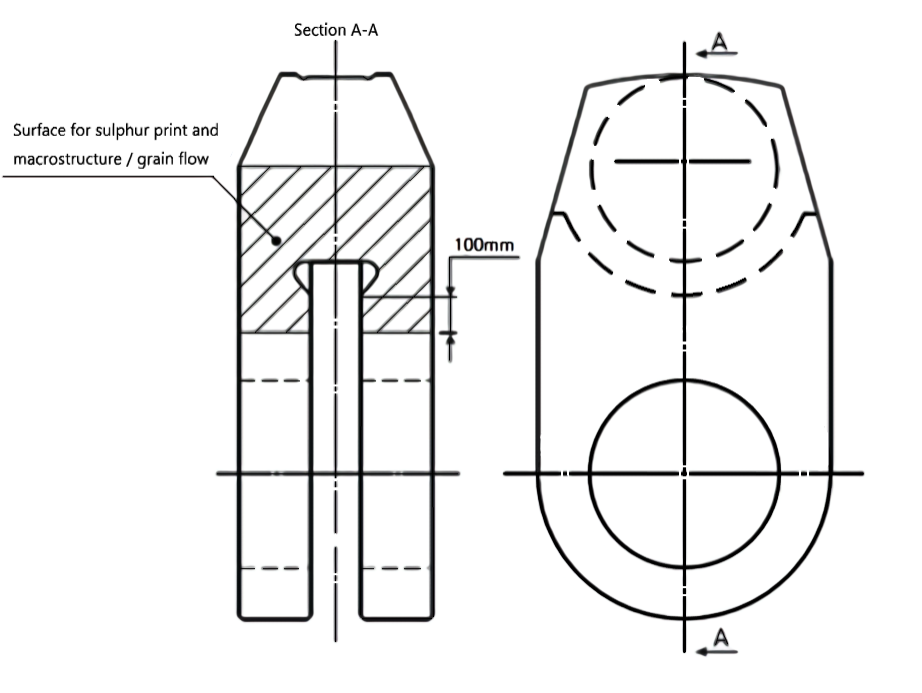 | Acceptance criteria is the reference |
- **5.** **Approval tests for intermediated shaft material under special requirements** ***(2017)***
  For alloy steel forgings which has a minimum specified tensile strength greater than 800 N/mm^2 but less than 950 N/mm^2 for use as intermediate shaft material in **Pt 5, Ch 3, 203.** and **Ch 4, 202.** and **Pt2, Ch 1, 601.** of the Rules, where special manufacturing processes are adopted to reduce shaft dimensions or higher permissible vibration stresses is to be required as following additional tests.
  - **(1)** Torsional fatigue test
    A torsional fatigue test is to be performed to verify that the material exhibits similar fatigue life as conventional steels. The torsional fatigue strength of said material is to be equal to or greater than the permissible torsional vibration stress($\tau _{ 1}$ and $\tau _{ 2}$) given by the formulae in **Pt 5, Ch 4, 202. 1** of the Rules. The test is to be carried out with notched and unnotched specimens respectively. For calculation of the stress concentration factor of the notched specimen, fatigue strength reduction factor($\beta$) is to be evaluated in consideration of the severest torsional stress concentration in the design criteria.
    Mean surface roughness is to be <0.2 μm Ra with the absence of localised machining marks verified by visual examination at low magnification(x20) as required by *Section 8.4* of *ISO 1352:2011*. *(2022)*

    **Table 2.4.6 Test condition**

    | Loading type | Torsion |
    | --- | --- |
    | Stress ratio | R = -1 |
    | Load waveform | Constant-amplitude sinusoidal |
    | Evaluation | S-N curve |
    | Number of cycles for test termination | 1 x 10^7 cycles |

    Measured high-cycle torsional fatigue strength $\tau _{C 1}$ and low-cycle torsional fatigue strength $\tau _{C 2}$ are to be equal to or greater than the values given by the following formulae:
    $\tau _{C 1} \geq \tau _{1, \lambda =0} = \frac{T _{s} +160}{6} C _{k} C _{d}$
    $\tau _{C 2} \geq \frac{1.7 \tau _{C1 }}{\sqrt {C _{k}}}$
    $C _{k}$ : factor for the particular shaft design features
    $C _{k} =1.45/scf$
    $scf$ : stress concentration factor, see **Pt5, Ch4, 202. 4.** of Guidance(For unnotched specimen, 1.0)
    $C _{d}$ : size factor, see **Pt5, Ch4, 202. 1** of the Rules
    $T _{s}$ : specified minimum tensile strength in $\mathrm{N}/mm ^{2}$ of the shaft material
    - **(A)** Surface condition
    - **(B)** Test procedures are to be in accordance with *Section 10* of *ISO 1352:2011*. Test conditions are to be in accordance with **Table 2.4.6**. *(2022)*
    - **(C)** Acceptance criteria
  - **(2)** Cleanliness requirements
    Cleanliness requirements are to be in accordance with the requirements in **Pt 2, Ch 1, 601. 18** of the Rules.
  - **(3)** Non-destructive inspection
    No-destructive inspection is to be in accordance with the requirements in **Pt 2, Ch 1, 601. 10** of the Rules.

#### 414. Certification

On the approval certificate the following information is to be stated:

#### 415. Changes in the manufacturing process

- **1.** In case changes occur in the approval content among manufacturing process of steel forgings which have been granted approval beforehand, such as those given in the followings, the manufacturer is to submit the application of alteration to the Society together with the documents in response to the content of changes. In this case, plant audit and approval test are to be carried out.
  - **(1)** Types of steel
  - **(2)** Melting process
  - **(3)** Forging process
  - **(4)** Mass of the forging
  - **(5)** Relocating or changing of the manufacturing sites
- **2.** If the manufacturing sites has been relocated or changed without changing the approved range, the test samples for approval test are to be included all approved forging process. However, the type and weight of the material may be selected by the manufacturer.

#### 416. Dealings after approval

### Section 5 Crankshafts under special requirements

#### 501. Application

The requirements in this Section apply to the tests and inspection for the approval of crankshafts manufactured to reduce the dimension in accordance with the requirements of **Pt 5, Ch 2, 208**, **Pt 2, Ch 1, 501. 14** and **601. 14** of the Rules in case where the special manufacturing processes specified in the following (1) or (2) are adopted.

#### 502. Data to be submitted

The manufacturer who intends to obtain an approval for the manufacturing process is to submit an application together with the data specified in **102.,** containing information of applicable engine type, or with the data showing the details of surface treatment in the case of **501.** (2).

#### 503. Approval tests

- **1.** **Kinds of steel**
  The tests are to be carried out for each kind of steels as a standard practice. Even within the category of steel forgings, normalized steels (including annealed steels or annealed steels after normalization) and quenched and tempered steels are to be considered as different kind of steels. However, for example, in case where it is intended to obtain approval for carbon steel forgings in both *RSF* 520 and *RSF* 560, tests on *RSF* 560 which has a higher tensile strength are to be carried out as the standard procedure. The same principle is to apply in dealing with *Cr-Mo* steel forgings and *Ni-Cr-Mo* steel forgings.
- **2.** **Approval test for special forged crankshafts**
  - **(1)** Test specimens
    The test specimen, as standard, is to be taken from the crankthrow with the maximum diameter manufactured or close thereto.
  - **(2)** Tests
    The following tests are to be carried out on each test specimen:
    - **(A)** Sulphur print test and macro-structure analysis (The specimens are to be taken from sections *A-A, B-B* and *C-C* specified in Fig **2.5.1**)
    - **(B)** Chemical composition analysis test (The specimens are to be taken from the positions asterisked in Fig **2.5.1**)
    - **(C)** Micro-structure analysis (The specimens are to be taken from the positions asterisked in Fig **2.5.1**)
    - **(D)** Microscopic test for the non-metallic inclusions (as per **KS D 0204**) (The specimens are to be taken from the positions asterisked in Fig **2.5.1**)
    - **(E)** Hardness test (Positions in the vicinity of pin or journal surface. In the case of quenched and tempered steels, hardness distribution from the surface to the shaft centre.)
    - **(F)** Tensile test and impact test (Test specimens are to be taken as specified in Fig **2.5.2** as the standard.)
    - **(G)** Bending fatigue test on actual crank throw. The number of test specimens is to be two or more
    - **(H)** Rotational bending fatigue test on small-size test specimens (Dia. 10 ~ 20 *mm*). The number of test specimens is to be not less than 10 as the standard. In case where previous data on this test are available or in case of carbon steel forgings, this test may be omitted upon approval of the Society. (**Fig 2.5.3**)
  - **(3)** Judgement of test results
    The manufacturing process can be approved in case where the results of tests of the preceding (2) proves that the special forged crankshaft has continuous grain flow, the product quality is judged stable and the fatigue strength obtained from (2) (g) have improved by 20 % or more when compared with the fatigue strength of a free-forged crankshaft $\sigma _{w}$ ($N/mm ^{2}$) calculated by the following formula:
    When $D$≤100, $\sigma _{w} =196 \left[ 1+ \frac{2}{3} \left( \frac{T _{s}}{440} -1 \right) \right]$
    When 100＜$D$＜200, $\sigma _{w} = \left( 216- \frac{D}{5.1} \right) \left[ 1+ \frac{2}{3} \left( \frac{T _{s}}{440} -1 \right) \right]$
    When $D$≥200, $\sigma _{w} =177 \left[ 1+ \frac{2}{3} \left( \frac{T _{s}}{440} -1 \right) \right]$
    where
    $D$ : Diameter of test specimen (mm)
    $T _{s}$ : Specified minimum tensile strength ($\mathrm{N}/mm ^{2}$)
- **3.** **Approval tests for crankshafts with surface treatments**
  This requirement applies to cases where the fillets of a crankshaft are applied with induction hardening, cold-rolling or nitriding, etc. In case where surface treatment is applied to all over the crankpin, journal and fillets, approval tests are to be as deemed appropriate by the Society.
  - **(1)** Test specimens
    The requirements specified in **2** (1) apply correspondingly.
  - **(2)** Tests
    The following tests are to be carried out on each test specimen:
    - **(A)** Non-destructive test (the conditions of defects on surface of the test specimens before and after the surface treatment are to be examined. The detection is to be either by magnetic particle test or liquid penetrant test.)
    - **(B)** Examination of the hardness distribution, depth of hardening and residual stress (Examination is to be carried out on the surface treated areas and their vicinity. Further, in case where cold-rolling is carried out, measurements for the deformation on the cold-rolling area are to be included.)
    - **(C)** Sulphur print test, microstructure test and macroscopic test (to be carried out on the sectional area in the direction of hardening depth.)
    - **(D)** Bending fatigue test on actual crank throw (tests are, in principle, to be carried out on both the crank throws with and without surface treatment. In this case, the number of test specimens are to be sufficient to verify the strength improvement ratio $\rho$ specified in **Pt 5, Ch 2, 208. 1** of the Guidance relating to the Rules for the Classification of Steel Ships. In this connection, the torsional fatigue tests on the actual crank throws or the test specimens having sizes similar to them are also to be carried out.)
    - **(E)** Tensile test and impact test (one set of test specimens as to be taken from end portion of crankshaft with surface treatment.)
  - **(3)** Judgement of test results
    The manufacturing process can be approved in case when the results of tests of preceding item (2) prove that a stability in the quality of the crankshafts with surface treatment and excellent improvement in the fatigue strength are obtained. In this case, the allowable stress is to be as specified in **Pt 5, Ch 2, 208. 1** of the Guidance relating to the Rules for the Classification of Steel Ships.
- **4.** In case where the crankshaft manufactured under the special process as specified in the preceding **501.** (1) is applied with the surface treatment as specified in, **501.** (2), the judgement for acceptance is to be determined by considering the results of tests for free forged crankshaft with surface treatment and the strength of other positions of the crankshaft than the fillets thereof.

### Section 6-1 Aluminium Alloys

#### 601. Application

The requirements in this Section apply to the tests and inspection for the approval of manufacturing process of aluminium alloys as specified in **Pt 2, Ch 1, Sec 8** of the Rules.

#### 602. Data to be submitted

The following reference data in addition to those specified in **102.** are to be submitted to the Society.

#### 603. Approval test

- **1.** **Selection of test samples**
  - **(1)** Test samples used for the approval test are to, as a rule, be taken in the presence of the Surveyor from aluminium alloy plates, shapes, etc., of each melt manufactured under the same conditions of the melting process and forming process.
  - **(2)** The plate thickness and dimensions for the test sample used in the approval test are, as a rule, to be maximum thickness and dimensions.
- **2.** **Details of test**
  - **(1)** Items of the approval test are to be as given in **Table 2.6.1** and are to be carried out for each factory in the presence of the Surveyor except otherwise spacially provided.
  - **(2)** Testing method and acceptance criteria are to be in accordance with the **Table 2.6.2**.

#### 604. Changes in the manufacturing process

In case changes occur in the approval content among manufacturing process of aluminium alloys which have been granted approval beforehand, the followings are to be submitted to the Society.

#### 605. Dealings after approval

Aluminium alloys which conform to the requirements in this Section are to be dealt with as [in approval case] in the requirements in **Pt 2, Ch 1, 201. 2** (2) of the Rules, unless otherwise specified by the Society.

| Kinds | Grades | Temper | Test items |   |   |   |   |   |
| --- | --- | --- | --- | --- | --- | --- | --- | --- |
| Kinds | Grades | Temper | Chemical analysis | Macro- structure | Micro- structure | Tensile test at room temp | Bend test | Corrosion resistance test(1) |
| Rolled Product | 5083*P* | *O* | ○ | ○ | ○ | ○ | ○ |   |
| Rolled Product | 5083*P* | *H*111 | ○ | ○ | ○ | ○ | ○ |   |
| Rolled Product | 5083*P* | *H*112 | ○ | ○ | ○ | ○ | ○ |   |
| Rolled Product | 5083*P* | *H*116 | ○ | ○ | ○ | ○ | ○ | ○ |
| Rolled Product | 5083*P* | *H*321 | ○ | ○ | ○ | ○ | ○ | ○ |
| Rolled Product | 5086*P* | *O* | ○ | ○ | ○ | ○ | ○ |   |
| Rolled Product | 5086*P* | *H*111 | ○ | ○ | ○ | ○ | ○ |   |
| Rolled Product | 5086*P* | *H*112 | ○ | ○ | ○ | ○ | ○ |   |
| Rolled Product | 5086*P* | *H*116 | ○ | ○ | ○ | ○ | ○ | ○ |
| Rolled Product | 5383*P* | *O* | ○ | ○ | ○ | ○ | ○ |   |
| Rolled Product | 5383*P* | *H*111 | ○ | ○ | ○ | ○ | ○ |   |
| Rolled Product | 5383*P* | *H*116 | ○ | ○ | ○ | ○ | ○ | ○ |
| Rolled Product | 5383*P* | *H*321 | ○ | ○ | ○ | ○ | ○ | ○ |
| Rolled Product | 5059*P* | *O* | ○ | ○ | ○ | ○ | ○ |   |
| Rolled Product | 5059*P* | *H*111 | ○ | ○ | ○ | ○ | ○ |   |
| Rolled Product | 5059*P* | *H*116 | ○ | ○ | ○ | ○ | ○ | ○ |
| Rolled Product | 5059*P* | *H*321 | ○ | ○ | ○ | ○ | ○ | ○ |
| Rolled Product | 5456*P* | *O* | ○ | ○ | ○ | ○ | ○ |   |
| Rolled Product | 5456*P* | *H*116 | ○ | ○ | ○ | ○ | ○ | ○ |
| Rolled Product | 5456*P* | *H*321 | ○ | ○ | ○ | ○ | ○ | ○ |
| Rolled Product | 5754*P* | *O* | ○ | ○ | ○ | ○ | ○ |   |
| Rolled Product | 5754*P* | *H*111 | ○ | ○ | ○ | ○ | ○ |   |
| Extrude Product | 5083*S* | *O* | ○ | ○ | ○ | ○ |   |   |
| Extrude Product | 5083*S* | *H*111 | ○ | ○ | ○ | ○ |   |   |
| Extrude Product | 5083*S* | *H*112 | ○ | ○ | ○ | ○ |   |   |
| Extrude Product | 5086*S* | *O* | ○ | ○ | ○ | ○ |   |   |
| Extrude Product | 5086*S* | *H*111 | ○ | ○ | ○ | ○ |   |   |
| Extrude Product | 5086*S* | *H*112 | ○ | ○ | ○ | ○ |   |   |
| Extrude Product | 5383*S* | *O* | ○ | ○ | ○ | ○ |   |   |
| Extrude Product | 5383*S* | *H*111 | ○ | ○ | ○ | ○ |   |   |
| Extrude Product | 5383*S* | *H*112 | ○ | ○ | ○ | ○ |   |   |
| Extrude Product | 5059*S* | *H*112 | ○ | ○ | ○ | ○ |   |   |
| Extrude Product | 6005*A*S | *T*5 | ○ | ○ | ○ | ○ |   |   |
| Extrude Product | 6005*A*S | *T*6 | ○ | ○ | ○ | ○ |   |   |
| Extrude Product | 6061*S* | *T*6 | ○ | ○ | ○ | ○ |   |   |
| Extrude Product | 6082*S* | *T*5 | ○ | ○ | ○ | ○ |   |   |
| Extrude Product | 6082*S* | *T*6 | ○ | ○ | ○ | ○ |   |   |
| Notes (1) Where deemed necessary by the Society, tests related to fatigue tests, weld joint test, corrosion resistance tests and stress corrosion cracking test etc, or submission of reference data relating to these tests may be required. |   |   |   |   |   |   |   |   |

**Table 2.6.2 Approval Testing Method and Acceptance Criteria for aluminium alloy** ***(2022)***

| Approval test items | Selection of test specimen |   | Testing method |   |
| --- | --- | --- | --- | --- |
| Approval test items | Location | Direction(1) | Testing method |   |
| Chemical analysis | T(Top part) | - | Ladle analysis and product analysis are to be performed | Chemical composition by ladle analysis is to comply with the requirements in Ch 8, Pt 2 of the Rules. |
| Chemical analysis | B(Bottom part) | - | Ladle analysis and product analysis are to be performed | Chemical composition by ladle analysis is to comply with the requirements in Ch 8, Pt 2 of the Rules. |
| Macro- structure | T | - | To be as deemed appropriate by the Society | To be as deemed appropriate by the Society |
| Macro- structure | B | - | To be as deemed appropriate by the Society | To be as deemed appropriate by the Society |
| Micro- structure | T | - | To be as deemed appropriate by the Society | To be as deemed appropriate by the Society |
| Micro- structure | B | - | To be as deemed appropriate by the Society | To be as deemed appropriate by the Society |
| Tensile test at room temperature | T | Parallel | in accordance with Pt 2 of the Rules. | In accordance with Pt 2 of the Rules. |
| Tensile test at room temperature | T | Transverse | in accordance with Pt 2 of the Rules. | In accordance with Pt 2 of the Rules. |
| Tensile test at room temperature | B | Parallel | in accordance with Pt 2 of the Rules. | In accordance with Pt 2 of the Rules. |
| Tensile test at room temperature | B | Transverse | in accordance with Pt 2 of the Rules. | In accordance with Pt 2 of the Rules. |
| Bend test | T | Parallel | Bend test is to be in accordance with recognized national or international standard which the Society considers appropriate.(e.g. EN 482-2, etc.) *(2018)* | No crack is to be accepted. |
| Bend test | T | Transverse | Bend test is to be in accordance with recognized national or international standard which the Society considers appropriate.(e.g. EN 482-2, etc.) *(2018)* | No crack is to be accepted. |
| Bend test | B | Parallel | Bend test is to be in accordance with recognized national or international standard which the Society considers appropriate.(e.g. EN 482-2, etc.) *(2018)* | No crack is to be accepted. |
| Bend test | B | Transverse | Bend test is to be in accordance with recognized national or international standard which the Society considers appropriate.(e.g. EN 482-2, etc.) *(2018)* | No crack is to be accepted. |
| Corrosion resistance test | T | Parallel | Test method is to be as specified in Pt 2, Ch 1, 801. 9. of the Rules for the Classification of steel ships. | In accordance with Pt 2, Ch 1, 801. 9. of the Rules |
| Corrosion resistance test | B | Parallel | Test method is to be as specified in Pt 2, Ch 1, 801. 9. of the Rules for the Classification of steel ships. | In accordance with Pt 2, Ch 1, 801. 9. of the Rules |
| NOTES: (1) When the test specimens used for the approval test can not be taken from the test samples because of their dimensions or shapes, the direction of the selection of test specimens to be determined on a case-by-case basis upon mutual consultation by the manufacturer and the Society. (2) Excess difference in the chemical compositions between ladle analysis and product analysis is not to be accepted. |   |   |   |   |

### Section 6-2 Aluminium/steel transition joints (2023)

#### 611. Application

The requirements in this Section apply to tests and inspection for the approval of manufacturing process of aluminium/steel transition joints as specified in **Pt 2, Ch 1, Sec 8** of the Rules.

#### 612. Data to be submitted

The following reference data in addition to those specified in **102.** are to be submitted to the Society.

#### 613. Approval tests

- **1.** **Selection of test samples**
  - **(1)** Test samples used for the approval test are to, as a rule, be taken in the presence of the Surveyor from transition joints under the same conditions of the bonding process and manufacturing process.
  - **(2)** The thickness and dimensions for the test sample used in the approval test are, as a rule, to be maximum thickness and dimensions.
- **2.** **Details of test**
  - **(1)** All of the approval tests required in each Sec of this Chapter shall be carried out for the base material and the bonding material. However, it may be omitted if it is approved in other manufacturers by the Society.
  - **(2)** Testing method and acceptance criteria are to be in accordance with the **Table 2.6.3**.

    | **Approval test items** | **Approval testing method** | **Acceptance criteria** |
    | --- | --- | --- |
    | Macro structure | ISO 4969 or equivalent method. | Acceptance criteria is the reference. |
    | Micro structure | Microscopic photographs (approx. 100x) of base metal, joining part and bonding materials are to be taken | Acceptance criteria is the reference. |
    | Tensile test | In accordance with Pt 2, Ch 1, 802. of the Rules. | To meet the requirements in Pt 2, Ch 1, 802. of the Rules. |
    | Bend test | In accordance with Pt 2, Ch 1, 802. of the Rules. | To meet the requirements in Pt 2, Ch 1, 802. of the Rules. |
    | Shear test | In accordance with Pt 2, Ch 1, 802. of the Rules. | To meet the requirements in Pt 2, Ch 1, 802. of the Rules. |
    | Ultrasonic test | KS D 0234 or equivalent method. | Unbonded areas are not acceptable |

#### 614. Dealing after approval

Transition joints which conform to the requirements in this Section are to be dealt with as [in approved case] in the requirements in **Pt 2, Ch 1, 201. 3** (2) of the Rules, unless otherwise specified by the Society.

### Section 7-1 Copper Alloy Castings

#### 701. Application

The requirements in this Section apply to the tests and inspection for the approval of manufacturing process of copper alloy casting to be used for propellers, propeller blades and bosses as specified in **Pt 2, Ch 1, 702.** of the Rules.

#### 702. Data to be submitted

The following reference data in addition to those specified in **102.** are to be submitted to the Society.

#### 703. Approval tests

- **1.** Approval tests are to be in accordance with the **Table 2.7.1.**

  **Table 2.7.1 Approval Testing Method and Acceptance Criteria for copper alloy castings**

  | Test item | Test method | Acceptance criteria |
  | --- | --- | --- |
  | **chemical composition** | **Analysis of chemical composition on ladles and separately cast test specimens is to be carried out** | To comply with the Rule requirements |
  | Tensile test | Tensile tests are to be carried out in accordance with the requirements specified in Pt 2, Ch 1, 702. 6 of the Rules. | To comply with the Rule requirements |
  | Micro-structure analysis | The micro structure of alloy types *CU* 1 and *CU* 2 shall be verified by determining the proportion of alpha phase. For this purpose, at least one specimen shall be taken from each heat. The proportion of alpha phase shall be determined as the average value of 5 counts. | To comply with the Rule requirements |
  | Other test | To be as deemed appropriate by the Society | To be as deemed appropriate by the Society |
- **2.** Notwithstanding the requirements in the preceding **1** some parts of the tests may be omitted in case of propellers with a diameter of 2.5 m or less.

#### 704. Dealings after approval

Copper alloy castings which conform to the requirements in this Section are to be dealt with as [in approval case] in the requirements in **Pt 2, Ch 1, 201. 2** (2) of the Rules, unless otherwise specified by the Society.

### Section 7-2 Copper and Copper Alloy Tubes

#### 711. Application

The requirements in this Section apply to the tests and inspection for the approval of manufacturing process of copper and copper alloy tubes as specified in **Pt 2, Ch 1, 701.** of the Rules.

#### 712. Data to be submitted

The following reference data in addition to those specified in **102.** are to be submitted to the Society.

#### 713. Approval tests

- **1.** **Selection of test samples**
  - **(1)** The test samples used for the approval test are to be selected, in the presence of the Surveyor, as a rule, from the copper and copper alloy tubes with the same conditions of material manufacturing process, fabrication method of tubes and heat treatment method.
  - **(2)** As a rule, the dimensions of the test sample are standardized according to the maximum manufactured outer diameter and 1/2 of this value. Furthermore, the number of test pieces is to be as deemed appropriate by the Society.
- **2.** **Approval tests**
  - **(1)** Approval tests specified in **Table 2.7.2** are to be carried out, in the presence of the Surveyor unless otherwise specified by the Society.
  - **(2)** Testing method and acceptance criteria are to be in accordance with the **Table 2.7.3.** Where it is difficult to comply with test methods and evaluation criteria specified in this Section, the decision may apply to standards authorized by the Society. (officially recognized establishment).

#### 714. Dealings after approval

Copper and copper alloy tubes which conform to the requirements in this Section are to be dealt with as [in approval case] in the requirements in **Pt 2, Ch 1, 201. 3** (2) of the Rules, unless otherwise specified by the Society.

**Table 2.7.2 Approval Test Items for copper and copper alloy tubes**

| Grade | Approval test items |   |   |   |   |   |   |   |   |   |
| --- | --- | --- | --- | --- | --- | --- | --- | --- | --- | --- |
| Grade | Chemical analysis | Tensile test | Elongation | Hardness test | Grain size | Flairing test(1) | Flattening test(2) | NDT(3) | Hydrogen embrittlement test | Season cracking |
| C1201 | O | O | O | O | O | O | O | O | O |   |
| C1220 | O | O | O | O | O | O | O | O |   |   |
| C2600 | O | O | O | O | O | O | O | O(4) |   | O |
| C2700 | O | O | O | O | O | O | O | O(4) |   | O |
| C2800 | O | O | O |   |   | O | O | O(4) |   | O |
| C4430 | O | O | O |   | O | O | O | O(4) |   | O |
| C6870 | O | O | O |   | O | O | O | O(4) |   | O |
| C6871 | O | O | O |   | O | O | O | O(4) |   | O |
| C6872 | O | O | O |   | O | O | O | O(4) |   | O |
| C7060 | O | O | O |   | O | O | O | O(4) |   |   |
| C7100 | O | O | O |   | O | O | O | O(4) |   |   |
| C7150 | O | O | O |   | O | O | O | O(4) |   |   |
| Notes: 1. In case where not more than 100mm in outside diameter. 2. In case where more than 100mm in outside diameter. 3. Eddy current test is to be applied. However, hydrostatic or pneumatic test can be applied if agreed by the Surveyor. 4. In case where not more than 50mm in outside diameter. |   |   |   |   |   |   |   |   |   |   |

**Table 2.7.3 Approval Testing Method and Acceptance Criteria for copper and copper alloy tubes**

| Approval test items | Approval testing method | Acceptance criteria |
| --- | --- | --- |
| Chemical analysis | Chemical analysis is to be carried out in accordance with the standards authorized by the Society (officially recognized establishment). | To meet the requirements in KS D 5301 or equivalent |
| Tensile test | In accordance with Pt 2, Ch 1 of the Rules. | To meet the requirements in Pt 2, Ch 1, Sec 7 of the Rules. |
| Elongation | In accordance with Pt 2, Ch 1 of the Rules. | To meet the requirements in Pt 2, Ch 1, Sec 7 of the Rules. |
| Hardness test | In accordance with KS B 0806 or equivalent. Hardness to be measured on the inner face of tube. | To meet the requirements in KS D 5301 or equivalent |
| grain size | In accordance with KS D 0202 or equivalent. Grain size to be measured on the longitudinal section of tube. | To meet the requirements in KS D 5301 or equivalent |
| Flaring test | In accordance with Pt 2, Ch 1, 401. of the Rules. The outside diameter of tube end after flaring is to comply with the requirement specified in bellow table. Grade ; Outside diameter of tube end D ≤ 20mm ; 20 < D ≤ 100mm C1201, C1220 ; 1.4 × D ; 1.3 × D C2600, C2700, C2800 ; 1.2 × D ; 1.15 × D C4430, C6870, C6871, C6872, C7060, C7100, C7150 ; 1.25 × D Grade Outside diameter of tube end D ≤ 20mm 20 < D ≤ 100mm C1201, C1220 1.4 × D 1.3 × D C2600, C2700, C2800 1.2 × D 1.15 × D C4430, C6870, C6871, C6872, C7060, C7100, C7150 1.25 × D | To be free of surface crack. |
| Grade | Outside diameter of tube end |   |
| Grade | D ≤ 20mm | 20 < D ≤ 100mm |
| C1201, C1220 | 1.4 × D | 1.3 × D |
| C2600, C2700, C2800 | 1.2 × D | 1.15 × D |
| C4430, C6870, C6871, C6872, C7060, C7100, C7150 | 1.25 × D |   |
| Flattening test | In accordance with Pt 2, Ch 1, 401. Distance between flattening plates is to be 3 times of tube thickness. | To be free of surface crack. |
| Eddy current test | In accordance with KS D 0214 or equivalent. Test can be performed prior to heat treatment. Dimension of reference defect (diameter of drilled hole) is to comply with the requirements in KS D 5301 or equivalent. | To be free of harmful defects. |
| hydrostatic test | In accordance with Pt 2, Ch 1, 401. Permissible pressure of material, S is to comply with the requirement specified in bellow table. Grade ; S ($\mathrm{N}/mm ^{2}$) C1201, C1220 ; 41 C2600, C2700, C2800, C4430, C6870, C6871, C6872, C7060, C7100, C7150 ; 48 Grade S ($\mathrm{N}/mm ^{2}$) C1201, C1220 41 C2600, C2700, C2800, C4430, C6870, C6871, C6872, C7060, C7100, C7150 48 | To be free of leakages. |
| Grade | S ($\mathrm{N}/mm ^{2}$) |   |
| C1201, C1220 | 41 |   |
| C2600, C2700, C2800, C4430, C6870, C6871, C6872, C7060, C7100, C7150 | 48 |   |
| Approval test items | Approval Testing method | acceptance criteria |
| pneumatic test | Pneumatic test is to be carried out with the air pressure of 0.4 MPa, maintained in the water for 5sec. | To be free of leakages. |
| Hydrogen embrittlement test | In accordance with KS D ISO 2626. Heat the test piece in a furnace with an hydrogen atmosphere, maintained at a temperature 850±25℃ for a period of 30 min. Polish the section, etch if desired, and examine under a microscope at magnification of 75~200 X. | There is no evidence of gassing or open grain structure characteristic of embrittlement. |
| season cracking | In accordance with KS D 5301 or equivalent. | To be free of surface crack. |

### Section 8 Special Cast Iron Valves

#### 801. Application

The requirements in this Section apply to the tests and inspection for the approval of manufacturing process of special cast iron valves (black heart malleable castings and spheroidal graphite iron castings which has elongation of 12 % or above) specified in **Pt 5, Ch 5, 102. 4.** of the Rules.

#### 802. Approval tests

Approval tests specified in **Table 2.8.1** are to be carried out to verify the material quality of special cast iron in the presence of the Surveyor. Tensile test and charpy impact test are to be carried out on the test specimens separately cast and on those taken from the valve body of the largest size.

**Table 2.8.1 Approval Testing Method and Acceptance Criteria for special cast iron valves**

| Kinds | Test item | Test method | Acceptance criteria |
| --- | --- | --- | --- |
| Spheroidal graphite iron castings | Tensile test | The separately cast test sample is to be of A type specified in KS D 4302. Tensile test is to be carried out on two test specimens taken from test sample at room temperature (in case of boiler mounting valves, at each temperature of 200°C, 300°C and 400°C). Two test specimens (*R* 14*A* type specified in **Table 2.1.1 of Pt 2, Ch 1** of the Rules) for tensile test at room temperature are to be taken from the valve body. (the separately cast test sample is to be heat treated as same as applied to the valve body.) | To comply with the Rule requirements |
| Spheroidal graphite iron castings | Charpy impact test | Three each test specimens of *R* 4 type specified in Table 2.1.3 of Pt 2, Ch 1 of the Rules are to be taken from test sample and flange of valve body. | To comply with the Rule requirements |
| Spheroidal graphite iron castings | Hardness test | Valve body is to be cut and hardness at each position is to be measured (Brinnel Hardness Test, 3000 kg). | To comply with the Rule requirements |
| Spheroidal graphite iron castings | Micro-structure analysis | Structural ferritization and spheroidization of graphite are to be examined. | To be as deemed appropriate by the Society |
| Spheroidal graphite iron castings | chemical composition | For the analysis of total carbon, a drilling machine is not to be used. | To comply with the Rule requirements |
| Blackheart malleable iron castings | Tensile test | Test specimen is to be of *A* type specified in KS D ISO 5922 and shall not be separately casted or machined unless approved by the Society. Two each test specimens are to be subjected to tensile test under the same temperature conditions as in Spheroidal graphite iron castings. The tensile test on the test specimens taken from valve body is to be as specified in Spheroidal graphite iron castings. | To comply with the Rule requirements |
| Blackheart malleable iron castings | Charpy impact test | The same as in Spheroidal graphite iron castings | To comply with the Rule requirements |
| Blackheart malleable iron castings | Hardness test | The same as in Spheroidal graphite iron castings | To comply with the Rule requirements |
| Blackheart malleable iron castings | Micro-structure analysis | Examination is to be carried out on the matrix and graphitization, | To be as deemed appropriate by the Society |
| Blackheart malleable iron castings | chemical composition | The same as in Spheroidal graphite iron castings | To comply with the Rule requirements |

#### 803. Dealings after approval

Special cast iron valves which conform to the requirements in this Section are to be dealt with as [in approval case] in the requirements in **Pt 2, Ch 1, 201. 2** (2) of the Rules, unless otherwise specified by the Society.

### Section 9 Anchors

#### 901. Application

- **1.** The requirements in this Section apply to tests and inspection for the approval of manufacturing process of ordinary anchors made of steel castings as specified in **Pt 4, Ch 8, 302. (1)** of the Rules.
- **2.** The anchor manufacturers who conform to the requirements in this Section are to be dealt with as the approved manufacturers of steel castings in accordance with the requirements in **Pt 2, Ch 1, 102.** of the Rules.
- **3.** In case where the anchor is manufactured by the methods other than those rules specified in the preceding **1.**, the requirements of this Section can be applied.

#### 902. Data to be submitted

The following reference data in addition to those specified in **102.** are to be submitted to the Society.

#### 903. Approval test

- **1.** Approval test items, test methods and acceptance criteria are to be as given in **Table 2.9.1**

  **Table 2.9.1 Approval Testing Method and Acceptance Criteria for anchors**

  | Test item | Test method and acceptance criteria |
  | --- | --- |
  | material test | (1) Anchors are to be manufactured and tested in accordance with the requirements in PT 2, Ch 1, 501. of the Rules and comply with the requirements for castings for welded construction. The steel is to be fine grain treated with Aluminium. (2) Unless otherwise agreed the test samples are to be either integrally cast or gated to the castings. |
  | Drop test | in accordance with Pt 4, Ch 8, 309. 2. (1) of the Rules. Dropping is to be made for 3 attempts at least. |
  | Hammering test | in accordance with Pt 4, Ch 8, 309. 2. (2) of the Rules. |
  | Proof test | in accordance with Pt 4, Ch 8, 309. 3. of the Rules. |
  | Visual inspection | in accordance with Pt 4, Ch 8, 309. 4. of the Rules. |
  | Non-destructive test | To be carried out the extended non-destructive examination in accordance with Pt 4, Ch 8, 309. 6. of the Rules. |
- **2.** Impact test, macro structure test and/or hardness test, etc. may be additionally required by the Society where deemed necessary.
- **3.** Selection of test samples and approval tests, in principle, are to be carried out in the presence of the Surveyor.

#### 904. Dealings after approval

Anchors which conform to the requirements in this Section are to be dealt with as [in approval case] in the requirements in **Pt 2, Ch 1, 201. 3.** (2) of the Rules, unless otherwise specified by the Society.

### Section 10-1 Marine Chains

#### 1001. Application

- **1.** The requirements in this Section apply to tests and inspection for the approval of manufacturing process of electrical welded and steel cast chains used for anchor chains and steering chains specified in **Pt 4, Ch 8, 405. 1** of the Rules.
- **2.** Of those forge welded or other manufacturing process chains, the requirements in this Section correspondingly apply to the tests and inspection for the approval of the manufacturing process of chains.
- **3.** The manufacturer who makes steel cast chains in accordance with the requirements of this Section may be considered to comply with the requirements of manufacturing process in **Pt 2, Ch 1, 102.** of the Rules.

#### 1002. Data to be submitted

The following reference data in addition to those specified in **102.** are to be submitted to the Society.

#### 1003. Approval test

- **1.** **Approval test**
  The approval test is to be carried out on each chain under application for each manufacturing factory. The contents of approval test are to be as indicated in **Table 2.10.1** and the test is to be carried out in the presence of the Surveyor unless otherwise specified.
- **2.** **Test chains**
  The link and test specimens used in the approval test are to be taken from the test chains in the presence of the Surveyor.
- **3.** **Omission of approval test for manufacturing process**
  - **(1)** When the test for Grade 1 chains has been passed, the approval test for manufacturing process for studless chains of the same or of the smaller diameter manufactured by the same electric welding method may be omitted.
  - **(2)** When the test for Grade 2 chains has been passed, the approval test for manufacturing process for studless chains of the same or of the smaller diameter manufactured by the same electric welding method and the approval test for the manufacturing process of Grade 1 chains, may be omitted.
  - **(3)** The manufacturing process of the enlarged link and end link may be approved up to those with the diameter corresponding to that of common link provided that they are manufactured by the same manufacturing process of the common link or by the electric welding method.

#### 1004. Changes in the approval content

When major changes are intended to be made in the manufacturing process already approved, the application procedure required for a new approval application is to be taken. The major changes include the items given below where, however, the witness of the approval test by the Surveyor may be dispensed with, or reduction in the approval test items may be accepted for the manufacturer whose product quality control standards and inspection standards are considered appropriate. In this case, however, submission of the results of tests on material properties and related data is required.

### Section 10-2 Marine Chain Accessories

#### 1011. Application

- **1.** The requirements in this Section apply to the tests and inspection for the approval of manufacturing process of the connecting shackles, kenter shackles, anchor shackles and swivels (hereinafter referred to as the "chain accessories") specified in **Pt 4, Ch 8, 405. 4** of the Rules.
- **2.** The requirements in this Section apply to the manufacturing process of the enlarged link and end link are manufactured by a chain accessories manufacturer other than the manufacturer of the chain.
- **3.** The manufacturer who makes cast chains in accordance with the requirements of this Section may be considered to comply with the requirements of manufacturing process in **Pt 2, Ch 1, 102.** of the Rules.

#### 1012. Data to be submitted

The following reference data in addition to those specified in **102.** are to be submitted to the Society including (1) to (5) of 1002.

#### 1013. Approval test

- **1.** **Approval test**
  The approval test is to be carried out on each item of chain accessories under application for each manufacturing factory. The details of approval test are to be as indicated in **Table 2.10.2** and the test is to be carried out in the presence of the Surveyor unless otherwise specified.
- **2.** **Test chain accessories**
  The test specimens used in the approval test are to be taken from the test chain accessories under application in the presence of the Surveyor.
- **3.** **Omission of approval test**
  - **(1)** When the test for chain accessories of higher grade has been passed, the approval test for manufacturing process for chain accessories of the same or of the smaller diameter manufactured by the same casting or forging method may be omitted.
  - **(2)** When the test either for swivel or for kenter shackle has been passed, the approval test for manufacturing process for another product not subjected to approval test may be omitted provided that discrimination between the casting procedure and forging procedure is specified.
  - **(3)** When the test either for swivel or for kenter shackle has been passed, the approval test for manufacturing process for the enlarged link and end link of the same diameter as that of the swivel and kenter shackle or less may be omitted.
  - **(4)** When the test for anchor shackle has been passed, the approval test for manufacturing process of the connecting shackle of the same diameter thereof or less may be omitted.
  - **(5)** When the test either for connecting shackle or anchor shackle has been passed, the approval test for manufacturing process of the enlarged link and end link of the same diameter there of or less may be omitted.
  - **(6)** The diameter of the chain accessories shown in items (1) through (5) above corresponding to that of the common link to which they are fitted.

#### 1014. Changes in the manufacturing process

Where major changes significantly affecting the manufacturing process already approved have been made, the requirements in **1004.** are to apply.

| Test item |   | Numbers of test specimens | Selection of test specimen and details of test specimen | Test procedure | Acceptance criteria |
| --- | --- | --- | --- | --- | --- |
| Mechanical properties test of chain accessories | ①Tensile test | 2 | 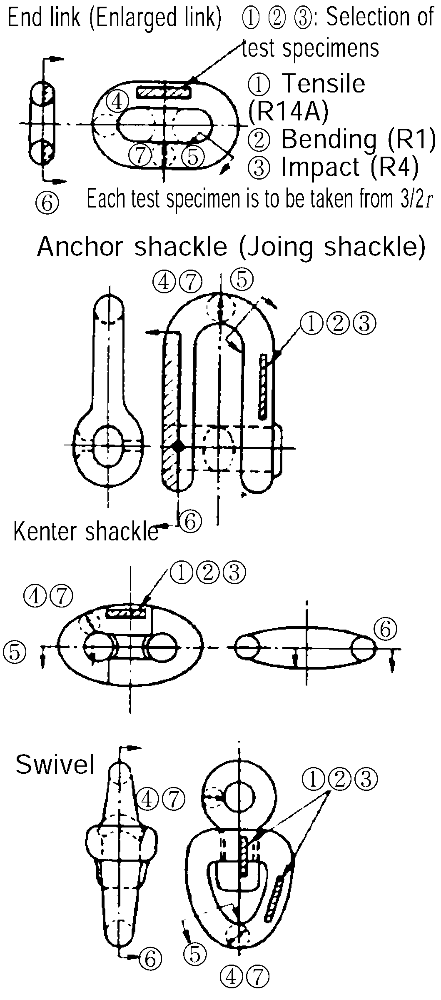 | ① and ② : To conform to Pt 2, Ch 1 of the Rules, The bending radius of chain accessories is to be 25mm. And the bending angle is to be not less than following angle : 120°. ③ : Testing temperature of impact test is to be refered to NOTES 6. ④ : To be examined at its surface, 2/3 r and center (magnifying power : × 100) ⑤ : Areas shown in the figure are to be macroetched. ⑥ : Sulphur print of the chain accessory in longitudinal section is to be taken. ⑦ : Hardness distribution in diametric direction is to be measured at proper intervals. ⑧, ⑨, ⑪ : To conform to Pt 4, Ch 8 Sec 4 of the Rules. ⑩ : Measurements of each part of chain accessories after subjected to proof test are to be taken for dimensions. | To conform to Pt 2, Ch 1 of the Rules. |
| Mechanical properties test of chain accessories | ②Bending test | 2 |   | ① and ② : To conform to Pt 2, Ch 1 of the Rules, The bending radius of chain accessories is to be 25mm. And the bending angle is to be not less than following angle : 120°. ③ : Testing temperature of impact test is to be refered to NOTES 6. ④ : To be examined at its surface, 2/3 r and center (magnifying power : × 100) ⑤ : Areas shown in the figure are to be macroetched. ⑥ : Sulphur print of the chain accessory in longitudinal section is to be taken. ⑦ : Hardness distribution in diametric direction is to be measured at proper intervals. ⑧, ⑨, ⑪ : To conform to Pt 4, Ch 8 Sec 4 of the Rules. ⑩ : Measurements of each part of chain accessories after subjected to proof test are to be taken for dimensions. | To be free of harmful defects |
| Mechanical properties test of chain accessories | ③Impact test | see NOTES 6 |   | ① and ② : To conform to Pt 2, Ch 1 of the Rules, The bending radius of chain accessories is to be 25mm. And the bending angle is to be not less than following angle : 120°. ③ : Testing temperature of impact test is to be refered to NOTES 6. ④ : To be examined at its surface, 2/3 r and center (magnifying power : × 100) ⑤ : Areas shown in the figure are to be macroetched. ⑥ : Sulphur print of the chain accessory in longitudinal section is to be taken. ⑦ : Hardness distribution in diametric direction is to be measured at proper intervals. ⑧, ⑨, ⑪ : To conform to Pt 4, Ch 8 Sec 4 of the Rules. ⑩ : Measurements of each part of chain accessories after subjected to proof test are to be taken for dimensions. | see NOTES 6. |
| Mechanical properties test of chain accessories | ④Micro-test | 3 |   | ① and ② : To conform to Pt 2, Ch 1 of the Rules, The bending radius of chain accessories is to be 25mm. And the bending angle is to be not less than following angle : 120°. ③ : Testing temperature of impact test is to be refered to NOTES 6. ④ : To be examined at its surface, 2/3 r and center (magnifying power : × 100) ⑤ : Areas shown in the figure are to be macroetched. ⑥ : Sulphur print of the chain accessory in longitudinal section is to be taken. ⑦ : Hardness distribution in diametric direction is to be measured at proper intervals. ⑧, ⑨, ⑪ : To conform to Pt 4, Ch 8 Sec 4 of the Rules. ⑩ : Measurements of each part of chain accessories after subjected to proof test are to be taken for dimensions. | The degree of heat treatment in diametric direction is to be examined. |
| Mechanical properties test of chain accessories | ⑤Macro test | 1 |   | ① and ② : To conform to Pt 2, Ch 1 of the Rules, The bending radius of chain accessories is to be 25mm. And the bending angle is to be not less than following angle : 120°. ③ : Testing temperature of impact test is to be refered to NOTES 6. ④ : To be examined at its surface, 2/3 r and center (magnifying power : × 100) ⑤ : Areas shown in the figure are to be macroetched. ⑥ : Sulphur print of the chain accessory in longitudinal section is to be taken. ⑦ : Hardness distribution in diametric direction is to be measured at proper intervals. ⑧, ⑨, ⑪ : To conform to Pt 4, Ch 8 Sec 4 of the Rules. ⑩ : Measurements of each part of chain accessories after subjected to proof test are to be taken for dimensions. | To be free of harmful defects. |
| Mechanical properties test of chain accessories | ⑥Sulphur print | 1 |   | ① and ② : To conform to Pt 2, Ch 1 of the Rules, The bending radius of chain accessories is to be 25mm. And the bending angle is to be not less than following angle : 120°. ③ : Testing temperature of impact test is to be refered to NOTES 6. ④ : To be examined at its surface, 2/3 r and center (magnifying power : × 100) ⑤ : Areas shown in the figure are to be macroetched. ⑥ : Sulphur print of the chain accessory in longitudinal section is to be taken. ⑦ : Hardness distribution in diametric direction is to be measured at proper intervals. ⑧, ⑨, ⑪ : To conform to Pt 4, Ch 8 Sec 4 of the Rules. ⑩ : Measurements of each part of chain accessories after subjected to proof test are to be taken for dimensions. | To be free of harmful defects. |
| Mechanical properties test of chain accessories | ⑦Hardness test | 1 |   | ① and ② : To conform to Pt 2, Ch 1 of the Rules, The bending radius of chain accessories is to be 25mm. And the bending angle is to be not less than following angle : 120°. ③ : Testing temperature of impact test is to be refered to NOTES 6. ④ : To be examined at its surface, 2/3 r and center (magnifying power : × 100) ⑤ : Areas shown in the figure are to be macroetched. ⑥ : Sulphur print of the chain accessory in longitudinal section is to be taken. ⑦ : Hardness distribution in diametric direction is to be measured at proper intervals. ⑧, ⑨, ⑪ : To conform to Pt 4, Ch 8 Sec 4 of the Rules. ⑩ : Measurements of each part of chain accessories after subjected to proof test are to be taken for dimensions. | For reference only. |
| Tests on testing object of chain accessories | ⑧Proof test | 1 |   | ① and ② : To conform to Pt 2, Ch 1 of the Rules, The bending radius of chain accessories is to be 25mm. And the bending angle is to be not less than following angle : 120°. ③ : Testing temperature of impact test is to be refered to NOTES 6. ④ : To be examined at its surface, 2/3 r and center (magnifying power : × 100) ⑤ : Areas shown in the figure are to be macroetched. ⑥ : Sulphur print of the chain accessory in longitudinal section is to be taken. ⑦ : Hardness distribution in diametric direction is to be measured at proper intervals. ⑧, ⑨, ⑪ : To conform to Pt 4, Ch 8 Sec 4 of the Rules. ⑩ : Measurements of each part of chain accessories after subjected to proof test are to be taken for dimensions. | To conform to Pt 4, Ch 8 of the Rules. |
| Tests on testing object of chain accessories | ⑨Breaking test | 1 |   | ① and ② : To conform to Pt 2, Ch 1 of the Rules, The bending radius of chain accessories is to be 25mm. And the bending angle is to be not less than following angle : 120°. ③ : Testing temperature of impact test is to be refered to NOTES 6. ④ : To be examined at its surface, 2/3 r and center (magnifying power : × 100) ⑤ : Areas shown in the figure are to be macroetched. ⑥ : Sulphur print of the chain accessory in longitudinal section is to be taken. ⑦ : Hardness distribution in diametric direction is to be measured at proper intervals. ⑧, ⑨, ⑪ : To conform to Pt 4, Ch 8 Sec 4 of the Rules. ⑩ : Measurements of each part of chain accessories after subjected to proof test are to be taken for dimensions. | 1.1 times of the specified breaking load is omly required to be loaded, and no actual breaking is required. |
| Tests on testing object of chain accessories | ⑩Dimension inspection | 1 |   | ① and ② : To conform to Pt 2, Ch 1 of the Rules, The bending radius of chain accessories is to be 25mm. And the bending angle is to be not less than following angle : 120°. ③ : Testing temperature of impact test is to be refered to NOTES 6. ④ : To be examined at its surface, 2/3 r and center (magnifying power : × 100) ⑤ : Areas shown in the figure are to be macroetched. ⑥ : Sulphur print of the chain accessory in longitudinal section is to be taken. ⑦ : Hardness distribution in diametric direction is to be measured at proper intervals. ⑧, ⑨, ⑪ : To conform to Pt 4, Ch 8 Sec 4 of the Rules. ⑩ : Measurements of each part of chain accessories after subjected to proof test are to be taken for dimensions. | To conform to Pt 4, Ch 8 of the Rules. In addition, dimensional changes are to be measured. |
| Tests on testing object of chain accessories | ⑪Visual inspection | 1 |   | ① and ② : To conform to Pt 2, Ch 1 of the Rules, The bending radius of chain accessories is to be 25mm. And the bending angle is to be not less than following angle : 120°. ③ : Testing temperature of impact test is to be refered to NOTES 6. ④ : To be examined at its surface, 2/3 r and center (magnifying power : × 100) ⑤ : Areas shown in the figure are to be macroetched. ⑥ : Sulphur print of the chain accessory in longitudinal section is to be taken. ⑦ : Hardness distribution in diametric direction is to be measured at proper intervals. ⑧, ⑨, ⑪ : To conform to Pt 4, Ch 8 Sec 4 of the Rules. ⑩ : Measurements of each part of chain accessories after subjected to proof test are to be taken for dimensions. | To conform to Pt 4, Ch 8 of the Rules. |
| NOTES; 1. The test chain accessories used for approval test are to, in principle, be two or three, in number, of the larges diameter under application. 2. The Society, when deemed necessary, may request nondestructive test. 3. In the case of the approval test required in connection with the change in the manufacturing process as shown in 1004., the Society may reduce the requirements in the diamter and number of test chain accessories with respect to the test itmes. 4. When any steel materials, manufacturing process or haat treatment not specified in the Rules are intended to be used, the Society may request other testing procedure or submission of reference data in addition to those specified in the Rules. 5. Two specimens for each test of tensile test specimens, bending test specimens and Charpy V-notch impact test specimens are to be taken from the test samples specified in Pt 2, Ch 1, 502. & 603. of the Rules, on both cast and forged chain accessories, tested to satisfy the specified values in addition to the mechanical properties tests given in this Table. 6. Temperature of impact test are to be in accordance with following tables. Kind of chain accessories ; Number of test specimen ; Temperature ; Minimum absorbed average energy (J) Grade 2 chain accessories ; 1 set ; 0°C ; To be with reference Grade 3 chain accessories ; 2 set ; 0°C and -20°C ; At 0°C to be of 60J, At other temperature to be with reference Kind of chain accessories Number of test specimen Temperature Minimum absorbed average energy (J) Grade 2 chain accessories 1 set 0°C To be with reference Grade 3 chain accessories 2 set 0°C and -20°C At 0°C to be of 60J, At other temperature to be with reference |   |   |   |   |   |
| Kind of chain accessories | Number of test specimen | Temperature | Minimum absorbed average energy (J) |   |   |
| Grade 2 chain accessories | 1 set | 0°C | To be with reference |   |   |
| Grade 3 chain accessories | 2 set | 0°C and -20°C | At 0°C to be of 60J, At other temperature to be with reference |   |   |

### Section 10-3 Offshore Chains and Chain Accessories

#### 1021. Application

- **1.** The requirements in this Section apply to the tests and inspection for the approval of manufacturing process of the offshore chain and chain accessories (hereinafter called chains and chain accessories) specified in **Pt 4, Ch 8, 401. 2** of the Guidance.
- **2.** Chains and chain accessories are to comply with the additional requirements, which are **1001.** for offshore chains and **1011.** for offshore chain accessories, other than the above **1.**

#### 1022. Materials

- **1.** Kind of materials, mechanical properties used in chains and chain accessories are to comply with **Pt 2, Annex 2-9** of the Guidance.
- **2.** Manufacturers propriety specifications for R4S and R5 may vary subject to design conditions and the acceptance of the Society.
- **3.** Each grade is to be individually approved. Approval for a higher grade does not constitute approval of a lower grade. If it is demonstrated to the satisfaction of the Society that the higher and lower grades are produced to the same manufacturing procedure using the same chemistry and heat treatment, consideration will be given to qualification of a lower grade by a higher. The parameters applied during qualification are not to be modified during production. *(2017)*

#### 1023. Chain Approval of manufacturing process

- **1.** Chains are to be manufactured only by works approved by the Society.
- **2.** **Data to be submitted**
  - **(1)** Kind of chains
  - **(2)** Manufacturing process
  - **(3)** Materials
  - **(4)** Heat treating method (including furnace types, controlling and recording of temperature and chain speed and allowable limits, quenching bath and agitation, cooling method after exit)
  - **(5)** Diameter of test chain, maximum chain diameter
  - **(6)** In addition to the above, the following reference data are to be submitted for approval and review to the Society.
    - **(A)** Bar heating and bending including method, temperatures, temperature control and recording
    - **(B)** Proof and break loading including method, method of measurement, and recording
    - **(C)** Manufacturer’'s surface quality requirement of mooring components
    - **(D)** Manufacturing process, manufacturing facilities and Welding machines description according to **1001.** (6) (A) (a) and (b)
    - **(E)** Working standards
      - **(a)** Inspection organization chart
      - **(b)** Contents of inspection at the reception of raw materials
      - **(c)** Bar cutting, heating and bending including method, temperatures, temperature control and recording
      - **(d)** Working standards applicable to each size of chain link for flash butt welding (welding current, force, time, flash allowance, upsetting allowance, preheating temperature and period, maintenance procedure and programme for welding machine, etc.) *(2017)*
      - **(e)** Flash removal including method and inspection
      - **(f)** Stud manufacturing process and dimensions
      - **(g)** Stud insertion method for stud link chain
      - **(h)** Non-destructive examination procedures
      - **(i)** Details of product inspection
      - **(j)** The manufacturer’s procedure for removing and replacing defective links without heat treatment of the entire chain. *(2017)*
- **3.** **Calibration of furnaces**
  - **(1)** Calibration of furnaces is to be verified by measurement and recording of a calibration test piece with dimensions equivalent to the maximum size of link manufactured.
  - **(2)** The manufacturer is to be submitted a procedure for furnace temperature surveys which is to be included the following requirements *(2017)*
    - **(A)** The temperature uniformity of furnaces is to be surveyed whenever approval of manufacturer is requested and at least annually during normal operating conditions.
    - **(B)** Furnaces are to be checked by conveying a monitoring link instrumented with two thermocouples through the furnaces at representative travel speed.
    - **(C)** One thermocouple is to be attached to the surface of the straight part and one thermocouple is to be imbedded in a drilled hole located at the mid thickness position of the straight part of the calibration block.
    - **(D)** The time-temperature curves are to be showed that the temperatures throughout the cross section and the soaking times are within specified limits as given in the heat treatment procedure.
- **4.** **Approval test**
  - **(1)** Approval test
    The approval test is to be carried out on each chain under application for each manufacturing factory. The contents of approval test are to be as indicated in **Table 2.10.3** and the test is to be carried out in the presence of the Surveyor unless otherwise specified.
  - **(2)** Test chains
    The link and test specimens used in the approval test are to be taken from the test chains in the presence of the Surveyor.
- **5.** **Changes in the approval content**
  When major changes are intended to be made in the manufacturing process already approved, the application procedure required for a new approval application is to be taken. The major changes include the items given below where, however, the witness of the approval test by the Surveyor may be dispensed with, or reduction in the approval test items may be accepted for the manufacturer whose product quality control standards and inspection standards are considered appropriate. In this case, however, submission of the results of tests on material properties and related data is required.
  - **(1)** Increase in the maximum diameter of chain to be manufactured
  - **(2)** Change in casting procedure
  - **(3)** Changes in heat treatments (quenching, annealing, tempering, etc.)
  - **(4)** New installation of welding machine
  - **(5)** New installation of furnace for heat treatment
  - **(6)** Other changes for which approval test is considered necessary

#### 1024. Approval of quality system at chain and accessory manufacturers

Chain and accessory manufacturers are to have a documented and effective quality system approved by **Ch 2, 104. 2.** The quality system is to be additionally submitted during witnessing of tests by Surveyor in order to approve the chain and chain accessories.

#### 1025. Approval of rolled bar for offshore chain (2017)

- **1.** If a chain manufacturer wishes to use material from a number of suppliers, separate approval tests must be carried out for each supplier.
- **2.** Approval will be given only after successful approval of manufacturing process of testing of the completed chain. Each Grade is to be individually approved. Approval for a higher grade does not constitute approval of a lower grade. If it is demonstrated to the satisfaction of the Society that the higher and lower grades are produced to the same manufacturing procedure using the same chemistry and heat treatment, consideration will be given to qualification of a lower grade by a higher.
- **3.** The parameters applied during qualification are not to be modified during production. The approval will normally be limited to a thickness equal to that of the bars tested. up to the maximum diameter equal to that of the chain diameter tested. The rolling reduction ratio is to be recorded and is to be at least 5:1 for R3, R3S, R4, R4S and R5. The rolling reduction ratio used in production can be higher, but should not be lower than that qualified.
- **4.** A heat treatment sensitivity study simulating chain production conditions shall be applied in order to verify mechanical properties and establish limits for temperature and time combinations. All test details and results are to be submitted to the Society.
- **5.** The bar manufacturer is to provide evidence that the manufacturing process produces material that is resistant to strain ageing, temper embrittlement and all test details and results are to be submitted to the Society.

#### 1026. Approval of forges and foundries for chain accessories

- **1.** Forges and foundries intending to supply finished or semi-finished accessories are to be approved by the Society. The approval is to be limited to a nominated supplier of forged or cast material. If an accessory manufacturer wishes to use material from a number of suppliers, a separate approval must be carried out for each supplier.
- **2.** Approval will be given only after successful testing of the completed accessory. Approval for a higher grade does not constitute approval of a lower grade. If it is demonstrated to the satisfaction of the Society that the higher and lower grades are produced to the same manufacturing procedure using the same steel specification, supplier and heat treatment, consideration will be given to qualification of a lower grade by a higher. *(2017)*
- **3.** The approval will normally be limited to the type of accessory and the designated mooring grade of material up to the maximum diameter or thickness equal to that of the completed accessory used for qualification unless otherwise agreed by the Society. However for the different accessories that have the same geometry, the tests for initial approval are to be carried out on the one having the lowest reduction ratio. Qualification of accessory pins to maximum diameters is also required. Individual accessories of complex geometries will be subject to the Society requirements. *(2017)*
- **4.** Forges and foundries are to provide evidence that the manufacturing process produces material that is resistant to strain ageing, temper embrittlement and for R4S and R5 grades, hydrogen embrittlement. A heat treatment sensitivity study simulating accessory production conditions shall be applied in order to verify mechanical properties and establish limits for temperature and time combinations. (Cooling after tempering shall be appropriate to avoid temper embrittlement). All test details and results are to be submitted to the Classification society.
- **5.** For initial approval, Three CTOD tests are to be tested in accordance with a recognized standard such as BS 7448 Part 1 & BS EN ISO 15653:2010. The specimen location is as shown in **Table 2.10.3** notes 7. For rectangular accessories, the CTOD test piece is to be a standard 2 x 1 single edge notched bend specimen of thickness equal to full thickness of material to be tested. Subsized specimens can be used subject to approval of the Society. For circular geometries, the minimum cross section of the test piece is to be 50 × 25 mm for accessory diameters less than 120 mm, and 80 × 40 mm for diameters 120 mm and above. The tests are to be taken at minus 20 ℃ and the results are to be submitted to the Society. The minimum values of each set of three specimens are to at least meet the requirements same as that of the studless chain material shown in **Table 2.10.3**. The geometry of accessories can vary. Fig **2.10.1** a) and b) show the CTOD location for circular and rectangular cross sections such as those of the D-shackle and accessories fabricated from rectangular sections. The orientation of the specimen is to be considered the direction of the grain flow. Fig **2.10.1** b) shows two possible sampling positions for CTOD test specimens with notch orientation for rectangular type accessories. *(2017)*

  | 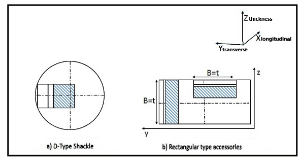 |
  | --- |
  | **Fig 2.10.1 Location of CTOD test specimens (B corresponds to the thickness of material,** **the grain flow is considered in the longitudinal direction X)** |
- **6.** Calibration of furnaces is to be verified by measurement and recording of a calibration test piece with dimensions equivalent to the maximum size of link manufactured. Thermocouples are to be placed both on the surface and in a drilled hole located to the mid thickness position of the calibration block. The furnace dimensions are to be such as to allow the whole furnace charge to be uniformly heated to the necessary temperature. Temperature uniformity surveys of heat treatment furnaces for forged and cast components are to be carried out according to **API Spec 6A/ISO 10423 Annex M** or **ASTM A991**. The initial survey is to be carried out with maximum charge (load) in the furnace. Subsequent surveys are to be carried out annually and may be carried out with no furnace charge. *(2017)*
- **7.** **Approval test**
  - **(1)** Approval test
    The approval test is to be carried out on each item of chain accessories under application for each manufacturing factory. The details of approval test are to be as indicated in **Table 2.10.4** and the test is to be carried out in the presence of the Surveyor unless otherwise specified.
  - **(2)** Test chain accessories
    The test specimens used in the approval test are to be taken from the test chain accessories under application in the presence of the Surveyor.
- **8.** **Changes in the manufacturing process**
  Where major changes significantly affecting the manufacturing process already approved have been made, the requirements in **1023. 5** are to apply.

  **Test chains for approval test**

  | 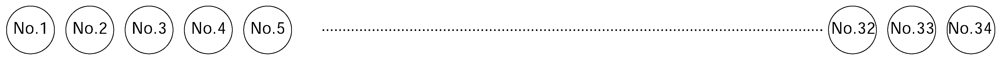 |   |   |   |   |   |   |   |
  | --- | --- | --- | --- | --- | --- | --- | --- |
  | Test item |   |   | Numbers of test specimens | Numbers of test link(example) | Selection of test specimen and details of test specimen | Test procedure | Acceptance criteria |
  | Mechanical properties test of llink | Base metal | ① Tensile test | 1 | No.1 | 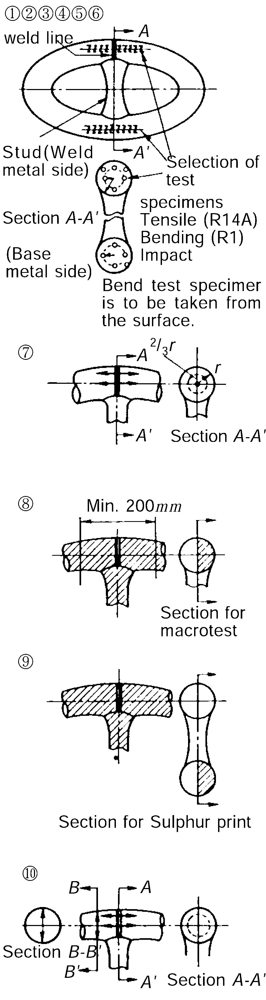 ⑪ 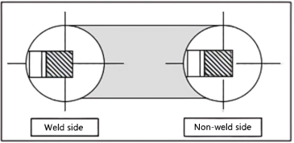 | ①, ②, ④, ⑤ : To conform to Pt 2, Ch 1 of the Rules, The bending radius of Grades R3, R3S & R4 chain accessories is to be 25mm. Grade R4S and R5 chains are to be as deemed appropriate by the Society. And the bending angle is to be not less than following angle : 30° for Grade R4, 45° for Grade R3S, 60° for Grade R3. And Grade R4S and R5 chains are to be as deemed appropriate by the Society. ③, ⑥ : Testing temperature of impact test is to be refered to NOTES 6. ⑦ : is to be examined at its center and the point 2/3 r for the structure of HAZ, base metal and weld zone (× 100) ⑧ : Welded portion of link in longitudinal section is to be macroetched. ⑨ : Sulphur print of longitudinal section of link is to be taken. ⑩ : Hardness distribution of base metal and weld zone is to be measured at proper intervals. ⑪ : To be comply with Notes 7 | To conform to Pt 2, Ch 1 of the Rules. |
  | Mechanical properties test of llink | Base metal | ② Bending test | 1 | No.1 |   | ①, ②, ④, ⑤ : To conform to Pt 2, Ch 1 of the Rules, The bending radius of Grades R3, R3S & R4 chain accessories is to be 25mm. Grade R4S and R5 chains are to be as deemed appropriate by the Society. And the bending angle is to be not less than following angle : 30° for Grade R4, 45° for Grade R3S, 60° for Grade R3. And Grade R4S and R5 chains are to be as deemed appropriate by the Society. ③, ⑥ : Testing temperature of impact test is to be refered to NOTES 6. ⑦ : is to be examined at its center and the point 2/3 r for the structure of HAZ, base metal and weld zone (× 100) ⑧ : Welded portion of link in longitudinal section is to be macroetched. ⑨ : Sulphur print of longitudinal section of link is to be taken. ⑩ : Hardness distribution of base metal and weld zone is to be measured at proper intervals. ⑪ : To be comply with Notes 7 | To be free of harmful defects |
  | Mechanical properties test of llink | Base metal | ③ Impact test | 3sets | No.3~4 |   | ①, ②, ④, ⑤ : To conform to Pt 2, Ch 1 of the Rules, The bending radius of Grades R3, R3S & R4 chain accessories is to be 25mm. Grade R4S and R5 chains are to be as deemed appropriate by the Society. And the bending angle is to be not less than following angle : 30° for Grade R4, 45° for Grade R3S, 60° for Grade R3. And Grade R4S and R5 chains are to be as deemed appropriate by the Society. ③, ⑥ : Testing temperature of impact test is to be refered to NOTES 6. ⑦ : is to be examined at its center and the point 2/3 r for the structure of HAZ, base metal and weld zone (× 100) ⑧ : Welded portion of link in longitudinal section is to be macroetched. ⑨ : Sulphur print of longitudinal section of link is to be taken. ⑩ : Hardness distribution of base metal and weld zone is to be measured at proper intervals. ⑪ : To be comply with Notes 7 | see NOTES 6. |
  | Mechanical properties test of llink | Weld zone | ④ Tensile test | 2 | No.1 |   | ①, ②, ④, ⑤ : To conform to Pt 2, Ch 1 of the Rules, The bending radius of Grades R3, R3S & R4 chain accessories is to be 25mm. Grade R4S and R5 chains are to be as deemed appropriate by the Society. And the bending angle is to be not less than following angle : 30° for Grade R4, 45° for Grade R3S, 60° for Grade R3. And Grade R4S and R5 chains are to be as deemed appropriate by the Society. ③, ⑥ : Testing temperature of impact test is to be refered to NOTES 6. ⑦ : is to be examined at its center and the point 2/3 r for the structure of HAZ, base metal and weld zone (× 100) ⑧ : Welded portion of link in longitudinal section is to be macroetched. ⑨ : Sulphur print of longitudinal section of link is to be taken. ⑩ : Hardness distribution of base metal and weld zone is to be measured at proper intervals. ⑪ : To be comply with Notes 7 | Measured tensile strength is to exceed that of the base metal. |
  | Mechanical properties test of llink | Weld zone | ⑤ Bending test | 2 | No.2 |   | ①, ②, ④, ⑤ : To conform to Pt 2, Ch 1 of the Rules, The bending radius of Grades R3, R3S & R4 chain accessories is to be 25mm. Grade R4S and R5 chains are to be as deemed appropriate by the Society. And the bending angle is to be not less than following angle : 30° for Grade R4, 45° for Grade R3S, 60° for Grade R3. And Grade R4S and R5 chains are to be as deemed appropriate by the Society. ③, ⑥ : Testing temperature of impact test is to be refered to NOTES 6. ⑦ : is to be examined at its center and the point 2/3 r for the structure of HAZ, base metal and weld zone (× 100) ⑧ : Welded portion of link in longitudinal section is to be macroetched. ⑨ : Sulphur print of longitudinal section of link is to be taken. ⑩ : Hardness distribution of base metal and weld zone is to be measured at proper intervals. ⑪ : To be comply with Notes 7 | To be free of harmful defects |
  | Mechanical properties test of llink | Weld zone | ⑥ Impact test | 3sets | No.3~4 |   | ①, ②, ④, ⑤ : To conform to Pt 2, Ch 1 of the Rules, The bending radius of Grades R3, R3S & R4 chain accessories is to be 25mm. Grade R4S and R5 chains are to be as deemed appropriate by the Society. And the bending angle is to be not less than following angle : 30° for Grade R4, 45° for Grade R3S, 60° for Grade R3. And Grade R4S and R5 chains are to be as deemed appropriate by the Society. ③, ⑥ : Testing temperature of impact test is to be refered to NOTES 6. ⑦ : is to be examined at its center and the point 2/3 r for the structure of HAZ, base metal and weld zone (× 100) ⑧ : Welded portion of link in longitudinal section is to be macroetched. ⑨ : Sulphur print of longitudinal section of link is to be taken. ⑩ : Hardness distribution of base metal and weld zone is to be measured at proper intervals. ⑪ : To be comply with Notes 7 | see NOTES 6. |
  | Mechanical properties test of llink |   | ⑦ Micro-test | 2 | No.5 |   | ①, ②, ④, ⑤ : To conform to Pt 2, Ch 1 of the Rules, The bending radius of Grades R3, R3S & R4 chain accessories is to be 25mm. Grade R4S and R5 chains are to be as deemed appropriate by the Society. And the bending angle is to be not less than following angle : 30° for Grade R4, 45° for Grade R3S, 60° for Grade R3. And Grade R4S and R5 chains are to be as deemed appropriate by the Society. ③, ⑥ : Testing temperature of impact test is to be refered to NOTES 6. ⑦ : is to be examined at its center and the point 2/3 r for the structure of HAZ, base metal and weld zone (× 100) ⑧ : Welded portion of link in longitudinal section is to be macroetched. ⑨ : Sulphur print of longitudinal section of link is to be taken. ⑩ : Hardness distribution of base metal and weld zone is to be measured at proper intervals. ⑪ : To be comply with Notes 7 | Coarse grain area in HAZ and degree of heat treatment are to be examined. |
  | Mechanical properties test of llink |   | ⑧ Macro test | 1 | No.5 |   | ①, ②, ④, ⑤ : To conform to Pt 2, Ch 1 of the Rules, The bending radius of Grades R3, R3S & R4 chain accessories is to be 25mm. Grade R4S and R5 chains are to be as deemed appropriate by the Society. And the bending angle is to be not less than following angle : 30° for Grade R4, 45° for Grade R3S, 60° for Grade R3. And Grade R4S and R5 chains are to be as deemed appropriate by the Society. ③, ⑥ : Testing temperature of impact test is to be refered to NOTES 6. ⑦ : is to be examined at its center and the point 2/3 r for the structure of HAZ, base metal and weld zone (× 100) ⑧ : Welded portion of link in longitudinal section is to be macroetched. ⑨ : Sulphur print of longitudinal section of link is to be taken. ⑩ : Hardness distribution of base metal and weld zone is to be measured at proper intervals. ⑪ : To be comply with Notes 7 | To be free of harmful defects |
  | Mechanical properties test of llink |   | ⑨ Sulphur print | 1 | No.7 |   | ①, ②, ④, ⑤ : To conform to Pt 2, Ch 1 of the Rules, The bending radius of Grades R3, R3S & R4 chain accessories is to be 25mm. Grade R4S and R5 chains are to be as deemed appropriate by the Society. And the bending angle is to be not less than following angle : 30° for Grade R4, 45° for Grade R3S, 60° for Grade R3. And Grade R4S and R5 chains are to be as deemed appropriate by the Society. ③, ⑥ : Testing temperature of impact test is to be refered to NOTES 6. ⑦ : is to be examined at its center and the point 2/3 r for the structure of HAZ, base metal and weld zone (× 100) ⑧ : Welded portion of link in longitudinal section is to be macroetched. ⑨ : Sulphur print of longitudinal section of link is to be taken. ⑩ : Hardness distribution of base metal and weld zone is to be measured at proper intervals. ⑪ : To be comply with Notes 7 | To be free of harmful defects |
  | Mechanical properties test of llink |   | ⑩ Hardness test | 3 | No.5 |   | ①, ②, ④, ⑤ : To conform to Pt 2, Ch 1 of the Rules, The bending radius of Grades R3, R3S & R4 chain accessories is to be 25mm. Grade R4S and R5 chains are to be as deemed appropriate by the Society. And the bending angle is to be not less than following angle : 30° for Grade R4, 45° for Grade R3S, 60° for Grade R3. And Grade R4S and R5 chains are to be as deemed appropriate by the Society. ③, ⑥ : Testing temperature of impact test is to be refered to NOTES 6. ⑦ : is to be examined at its center and the point 2/3 r for the structure of HAZ, base metal and weld zone (× 100) ⑧ : Welded portion of link in longitudinal section is to be macroetched. ⑨ : Sulphur print of longitudinal section of link is to be taken. ⑩ : Hardness distribution of base metal and weld zone is to be measured at proper intervals. ⑪ : To be comply with Notes 7 | For reference only. However, hardness is to be max 330 for Grade R4S, and 340 for Grade R5. |
  | Mechanical properties test of llink |   | ⑪ CTOD test | 6 (from 3 links on each weld side and non-weld side) | No.5 |   | ①, ②, ④, ⑤ : To conform to Pt 2, Ch 1 of the Rules, The bending radius of Grades R3, R3S & R4 chain accessories is to be 25mm. Grade R4S and R5 chains are to be as deemed appropriate by the Society. And the bending angle is to be not less than following angle : 30° for Grade R4, 45° for Grade R3S, 60° for Grade R3. And Grade R4S and R5 chains are to be as deemed appropriate by the Society. ③, ⑥ : Testing temperature of impact test is to be refered to NOTES 6. ⑦ : is to be examined at its center and the point 2/3 r for the structure of HAZ, base metal and weld zone (× 100) ⑧ : Welded portion of link in longitudinal section is to be macroetched. ⑨ : Sulphur print of longitudinal section of link is to be taken. ⑩ : Hardness distribution of base metal and weld zone is to be measured at proper intervals. ⑪ : To be comply with Notes 7 | To be comply with CTOD minimum values of Notes 7 |
  | Test of testing object of chains |   | ⑫ Proof test | 2 lengths | No.1~5 No.9~13 |   | ⑫, ⑬, ⑮, : To conform to Pt 4, Ch 8 of the Rules. ⑭ : After proof test, chain length and dimensions of each link are to be measu | To conform to Pt 4, Ch 8 of the Rules. |
  | Test of testing object of chains |   | ⑬ Breaking test | 2 lengths | No.15~19 No.30~34 |   | ⑫, ⑬, ⑮, : To conform to Pt 4, Ch 8 of the Rules. ⑭ : After proof test, chain length and dimensions of each link are to be measu | Actual breaking load is to be measured in addition to conform to Pt 4, Ch 8 of the Rules. |
  | Test of testing object of chains |   | ⑭ Dimension test | 2 lengths | No.1~5 No.9~13 |   | ⑫, ⑬, ⑮, : To conform to Pt 4, Ch 8 of the Rules. ⑭ : After proof test, chain length and dimensions of each link are to be measu | Check dimensional changes in addition to conform to Pt 4, Ch 8 of the Rules. |
  | Test of testing object of chains |   | ⑮ Mass inspection | 2 lengths | No.1~5 No.9~13 |   | ⑫, ⑬, ⑮, : To conform to Pt 4, Ch 8 of the Rules. ⑭ : After proof test, chain length and dimensions of each link are to be measu | To conform to Pt 4, Ch 8 of the Rules. |
  | Test of testing object of chains |   | Visual inspection | 2 lengths | No.1~5 No.9~13 |   | ⑫, ⑬, ⑮, : To conform to Pt 4, Ch 8 of the Rules. ⑭ : After proof test, chain length and dimensions of each link are to be measu | To conform to Pt 4, Ch 8 of the Rules. |
  | NOTES; 1. The test links used in the aproval test are to, in principle, be of the desired largest diameter for approval. 2. In the case of cast links, their mechanical properties tests are to be carried out in a manner corresponding to those applied to weld zone. Of those items of test on the testing object, the bending test and compression test may be substituted by magnetic particle testing. 3. When deemed necessary by the Society, non-destructive testing may be requested. 4. In the case of the approval test in association with the change in the manufacturing process as shown in 1203. 5, the diameter and number of test link, or the approval test items may be reduced. 5. When steel materials, manufacturing process or heat treatment methods which are not specified in the Rules are to be employed, the Society may request other tests or submission of reference materials in addition to the specified test items. |   |   |   |   |   |   |   |

  **Table 2.10.3 Approval Test Items and Acceptance Criteria for Offshore Chains (continued)**

  | Test chains for approval test |   |   |   |   |   |   |   |   |
  | --- | --- | --- | --- | --- | --- | --- | --- | --- |
  | 6. Temperatures of impact test are to be in accordance with following tables. Kind of chain ; Temperature ; Minimum absorbed average energy (J) Base metal ; Flash butt weld zone Grade R3 chain ; 0°C, -20°C and -40°C ; At 0°C to be of 60J, At -20°C to be of 40J, At -40°C to be with reference. ; At 0°C to be of 50J, At -20°C to be of 30J, At -40°C to be with reference. Grade R3S chain ; At 0°C to be of 65J, At -20°C to be of 45J, At -40°C to be with reference. ; At 0°C to be of 53J, At -20°C to be of 33J, At -40°C to be with reference. Grade R4 chain ; At -20°C to be of 50J, At other temperature to be with reference. ; At -20°C to be of 36J, At other temperature to be with reference. Grade R4S chain ; At -20°C to be of 56J, At other temperature to be with reference. ; At -20°C to be of 40J, At other temperature to be with reference. Grade R5 chain ; At -20°C to be of 58J, At other temperature to be with reference. ; At -20°C to be of 42J, At other temperature to be with reference. Kind of chain Temperature Minimum absorbed average energy (J) Base metal Flash butt weld zone Grade R3 chain 0°C, -20°C and -40°C At 0°C to be of 60J, At -20°C to be of 40J, At -40°C to be with reference. At 0°C to be of 50J, At -20°C to be of 30J, At -40°C to be with reference. Grade R3S chain At 0°C to be of 65J, At -20°C to be of 45J, At -40°C to be with reference. At 0°C to be of 53J, At -20°C to be of 33J, At -40°C to be with reference. Grade R4 chain At -20°C to be of 50J, At other temperature to be with reference. At -20°C to be of 36J, At other temperature to be with reference. Grade R4S chain At -20°C to be of 56J, At other temperature to be with reference. At -20°C to be of 40J, At other temperature to be with reference. Grade R5 chain At -20°C to be of 58J, At other temperature to be with reference. At -20°C to be of 42J, At other temperature to be with reference. 7. CTOD test required for offshore mooring chain is to comply with the followings (2017) For initial approval, CTOD tests are to be tested in accordance with a recognized standard such as BS 7448 Part 1 & BS EN ISO 15653:2010. The CTOD test piece is to be a standard 2 × 1 single edge notched bend piece, test location as shown in Figure 1. The notch of the CTOD specimen is to be located as close to the surface as practicable. The minimum cross section of the test piece is to be 50 × 25 mm for chain diameters less than 120 mm, and 80 × 40 mm for diameters 120 mm and above. CTOD specimens are to be taken from both the side of the link containing the weld and from the opposite side. Three links are to be selected for testing, a total of six CTOD specimens. The tests are to be taken at minus 20 ℃ and the lowest CTOD of each set of 3 specimens is to be met the minimum values indicated below in table : Chain type ; R3 (mm) ; R3S (mm) ; R4 (mm) ; R4S & R5 (mm) BM ; WM ; BM ; WM ; BM ; WM ; BM ; WM Stud link ; 0.20 ; 0.10 ; 0.22 ; 0.11 ; 0.24 ; 0.12 ; 0.26 ; 0.13 Studless ; 0.20 ; 0.14 ; 0.22 ; 0.15 ; 0.24 ; 0.16 ; 0.26 ; 0.17 Chain type R3 (mm) R3S (mm) R4 (mm) R4S & R5 (mm) BM WM BM WM BM WM BM WM Stud link 0.20 0.10 0.22 0.11 0.24 0.12 0.26 0.13 Studless 0.20 0.14 0.22 0.15 0.24 0.16 0.26 0.17 BM : Base metal WM : Weld metal 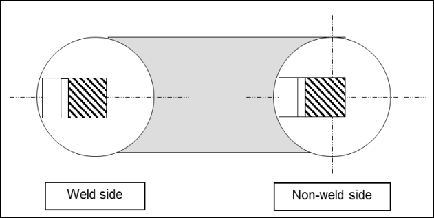 8. For R4S and R5 chain, prior to approval, the manufacturer is to have undertaken experimental tests or have relevant supporting data to develop the chain material. The tests and data may include fatigue tests, hot ductility tests (no internal flaws are to develop whilst bending in the link forming temperature range), welding parameter research, heat treatment study, strain age resistance, temper embrittlement study, stress corrosion cracking (SCC) data and hydrogen embrittlement (HE) study, using slow strain test pieces in hydrated environments. Reports indicating the results of experimental tests are to be submitted. |   |   |   |   |   |   |   |   |
  | Kind of chain | Temperature | Minimum absorbed average energy (J) |   |   |   |   |   |   |
  | Kind of chain | Temperature | Base metal | Flash butt weld zone |   |   |   |   |   |
  | Grade R3 chain | 0°C, -20°C and -40°C | At 0°C to be of 60J, At -20°C to be of 40J, At -40°C to be with reference. | At 0°C to be of 50J, At -20°C to be of 30J, At -40°C to be with reference. |   |   |   |   |   |
  | Grade R3S chain | 0°C, -20°C and -40°C | At 0°C to be of 65J, At -20°C to be of 45J, At -40°C to be with reference. | At 0°C to be of 53J, At -20°C to be of 33J, At -40°C to be with reference. |   |   |   |   |   |
  | Grade R4 chain | 0°C, -20°C and -40°C | At -20°C to be of 50J, At other temperature to be with reference. | At -20°C to be of 36J, At other temperature to be with reference. |   |   |   |   |   |
  | Grade R4S chain | 0°C, -20°C and -40°C | At -20°C to be of 56J, At other temperature to be with reference. | At -20°C to be of 40J, At other temperature to be with reference. |   |   |   |   |   |
  | Grade R5 chain | 0°C, -20°C and -40°C | At -20°C to be of 58J, At other temperature to be with reference. | At -20°C to be of 42J, At other temperature to be with reference. |   |   |   |   |   |
  | Chain type | R3 (mm) |   | R3S (mm) |   | R4 (mm) |   | R4S & R5 (mm) |   |
  | Chain type | BM | WM | BM | WM | BM | WM | BM | WM |
  | Stud link | 0.20 | 0.10 | 0.22 | 0.11 | 0.24 | 0.12 | 0.26 | 0.13 |
  | Studless | 0.20 | 0.14 | 0.22 | 0.15 | 0.24 | 0.16 | 0.26 | 0.17 |

  | Test item |   | Numbers of test specimens | Selection of test specimen and details of test specimen | Test procedure | Acceptance criteria |
  | --- | --- | --- | --- | --- | --- |
  | Mechanical properties test of chain accessories | ① Tensile test | 2 |  | ① and ② : To conform to Pt 2, Ch 1 of the Rules, The bending radius of Grades R3, R3S & R4 chain accessories is to be 25mm. Grade R4S and R5 chains are to be as deemed appropriate by the Society. And the bending angle is to be not less than following angle : 30° for Grade R4, 45° for Grade R3S, 60°. And Grade R4S and R5 chains are to be as deemed appropriate by the Society. ③ : Testing temperature of impact test is to be refered to NOTES 6. ④ : To be examined at its surface, 2/3 r and center (magnifying power : × 100) ⑤ : Areas shown in the figure are to be macroetched. ⑥ : Sulphur print of the chain accessory in longitudinal section is to be taken. ⑦ : Hardness distribution in diametric direction is to be measured at proper intervals. ⑧ : To conform to 1025. 4 ⑨, ⑩, ⑫ : To conform to Pt 4, Ch 8 Sec 4 of the Rules. ⑪ : Measurements of each part of chain accessories after subjected to proof test are to be taken for dimensions. | To conform to Pt 2, Ch 1 of the Rules. |
  | Mechanical properties test of chain accessories | ② Bending test | 2 |   | ① and ② : To conform to Pt 2, Ch 1 of the Rules, The bending radius of Grades R3, R3S & R4 chain accessories is to be 25mm. Grade R4S and R5 chains are to be as deemed appropriate by the Society. And the bending angle is to be not less than following angle : 30° for Grade R4, 45° for Grade R3S, 60°. And Grade R4S and R5 chains are to be as deemed appropriate by the Society. ③ : Testing temperature of impact test is to be refered to NOTES 6. ④ : To be examined at its surface, 2/3 r and center (magnifying power : × 100) ⑤ : Areas shown in the figure are to be macroetched. ⑥ : Sulphur print of the chain accessory in longitudinal section is to be taken. ⑦ : Hardness distribution in diametric direction is to be measured at proper intervals. ⑧ : To conform to 1025. 4 ⑨, ⑩, ⑫ : To conform to Pt 4, Ch 8 Sec 4 of the Rules. ⑪ : Measurements of each part of chain accessories after subjected to proof test are to be taken for dimensions. | To be free of harmful defects |
  | Mechanical properties test of chain accessories | ③ Impact test | see NOTES 6 |   | ① and ② : To conform to Pt 2, Ch 1 of the Rules, The bending radius of Grades R3, R3S & R4 chain accessories is to be 25mm. Grade R4S and R5 chains are to be as deemed appropriate by the Society. And the bending angle is to be not less than following angle : 30° for Grade R4, 45° for Grade R3S, 60°. And Grade R4S and R5 chains are to be as deemed appropriate by the Society. ③ : Testing temperature of impact test is to be refered to NOTES 6. ④ : To be examined at its surface, 2/3 r and center (magnifying power : × 100) ⑤ : Areas shown in the figure are to be macroetched. ⑥ : Sulphur print of the chain accessory in longitudinal section is to be taken. ⑦ : Hardness distribution in diametric direction is to be measured at proper intervals. ⑧ : To conform to 1025. 4 ⑨, ⑩, ⑫ : To conform to Pt 4, Ch 8 Sec 4 of the Rules. ⑪ : Measurements of each part of chain accessories after subjected to proof test are to be taken for dimensions. | see NOTES 6. |
  | Mechanical properties test of chain accessories | ④ Micro-test | 3 |   | ① and ② : To conform to Pt 2, Ch 1 of the Rules, The bending radius of Grades R3, R3S & R4 chain accessories is to be 25mm. Grade R4S and R5 chains are to be as deemed appropriate by the Society. And the bending angle is to be not less than following angle : 30° for Grade R4, 45° for Grade R3S, 60°. And Grade R4S and R5 chains are to be as deemed appropriate by the Society. ③ : Testing temperature of impact test is to be refered to NOTES 6. ④ : To be examined at its surface, 2/3 r and center (magnifying power : × 100) ⑤ : Areas shown in the figure are to be macroetched. ⑥ : Sulphur print of the chain accessory in longitudinal section is to be taken. ⑦ : Hardness distribution in diametric direction is to be measured at proper intervals. ⑧ : To conform to 1025. 4 ⑨, ⑩, ⑫ : To conform to Pt 4, Ch 8 Sec 4 of the Rules. ⑪ : Measurements of each part of chain accessories after subjected to proof test are to be taken for dimensions. | The degree of heat treatment in diametric direction is to be examined. |
  | Mechanical properties test of chain accessories | ⑤ Macro test | 1 |   | ① and ② : To conform to Pt 2, Ch 1 of the Rules, The bending radius of Grades R3, R3S & R4 chain accessories is to be 25mm. Grade R4S and R5 chains are to be as deemed appropriate by the Society. And the bending angle is to be not less than following angle : 30° for Grade R4, 45° for Grade R3S, 60°. And Grade R4S and R5 chains are to be as deemed appropriate by the Society. ③ : Testing temperature of impact test is to be refered to NOTES 6. ④ : To be examined at its surface, 2/3 r and center (magnifying power : × 100) ⑤ : Areas shown in the figure are to be macroetched. ⑥ : Sulphur print of the chain accessory in longitudinal section is to be taken. ⑦ : Hardness distribution in diametric direction is to be measured at proper intervals. ⑧ : To conform to 1025. 4 ⑨, ⑩, ⑫ : To conform to Pt 4, Ch 8 Sec 4 of the Rules. ⑪ : Measurements of each part of chain accessories after subjected to proof test are to be taken for dimensions. | To be free of harmful defects |
  | Mechanical properties test of chain accessories | ⑥ Sulphur print | 1 |   | ① and ② : To conform to Pt 2, Ch 1 of the Rules, The bending radius of Grades R3, R3S & R4 chain accessories is to be 25mm. Grade R4S and R5 chains are to be as deemed appropriate by the Society. And the bending angle is to be not less than following angle : 30° for Grade R4, 45° for Grade R3S, 60°. And Grade R4S and R5 chains are to be as deemed appropriate by the Society. ③ : Testing temperature of impact test is to be refered to NOTES 6. ④ : To be examined at its surface, 2/3 r and center (magnifying power : × 100) ⑤ : Areas shown in the figure are to be macroetched. ⑥ : Sulphur print of the chain accessory in longitudinal section is to be taken. ⑦ : Hardness distribution in diametric direction is to be measured at proper intervals. ⑧ : To conform to 1025. 4 ⑨, ⑩, ⑫ : To conform to Pt 4, Ch 8 Sec 4 of the Rules. ⑪ : Measurements of each part of chain accessories after subjected to proof test are to be taken for dimensions. | To be free of harmful defects6. |
  | Mechanical properties test of chain accessories | ⑦ Hardness test | 1 |   | ① and ② : To conform to Pt 2, Ch 1 of the Rules, The bending radius of Grades R3, R3S & R4 chain accessories is to be 25mm. Grade R4S and R5 chains are to be as deemed appropriate by the Society. And the bending angle is to be not less than following angle : 30° for Grade R4, 45° for Grade R3S, 60°. And Grade R4S and R5 chains are to be as deemed appropriate by the Society. ③ : Testing temperature of impact test is to be refered to NOTES 6. ④ : To be examined at its surface, 2/3 r and center (magnifying power : × 100) ⑤ : Areas shown in the figure are to be macroetched. ⑥ : Sulphur print of the chain accessory in longitudinal section is to be taken. ⑦ : Hardness distribution in diametric direction is to be measured at proper intervals. ⑧ : To conform to 1025. 4 ⑨, ⑩, ⑫ : To conform to Pt 4, Ch 8 Sec 4 of the Rules. ⑪ : Measurements of each part of chain accessories after subjected to proof test are to be taken for dimensions. | For reference only. However, hardness is to be max 330 for Grade R4S, and 340 for Grade R5. |
  | Mechanical properties test of chain accessories | ⑧ CTOD test | 3 |   | ① and ② : To conform to Pt 2, Ch 1 of the Rules, The bending radius of Grades R3, R3S & R4 chain accessories is to be 25mm. Grade R4S and R5 chains are to be as deemed appropriate by the Society. And the bending angle is to be not less than following angle : 30° for Grade R4, 45° for Grade R3S, 60°. And Grade R4S and R5 chains are to be as deemed appropriate by the Society. ③ : Testing temperature of impact test is to be refered to NOTES 6. ④ : To be examined at its surface, 2/3 r and center (magnifying power : × 100) ⑤ : Areas shown in the figure are to be macroetched. ⑥ : Sulphur print of the chain accessory in longitudinal section is to be taken. ⑦ : Hardness distribution in diametric direction is to be measured at proper intervals. ⑧ : To conform to 1025. 4 ⑨, ⑩, ⑫ : To conform to Pt 4, Ch 8 Sec 4 of the Rules. ⑪ : Measurements of each part of chain accessories after subjected to proof test are to be taken for dimensions. | To be as deemed appropriate by the Society. |
  | Tests on testing object of chain accessories | ⑨ Proof test | 1 |   | ① and ② : To conform to Pt 2, Ch 1 of the Rules, The bending radius of Grades R3, R3S & R4 chain accessories is to be 25mm. Grade R4S and R5 chains are to be as deemed appropriate by the Society. And the bending angle is to be not less than following angle : 30° for Grade R4, 45° for Grade R3S, 60°. And Grade R4S and R5 chains are to be as deemed appropriate by the Society. ③ : Testing temperature of impact test is to be refered to NOTES 6. ④ : To be examined at its surface, 2/3 r and center (magnifying power : × 100) ⑤ : Areas shown in the figure are to be macroetched. ⑥ : Sulphur print of the chain accessory in longitudinal section is to be taken. ⑦ : Hardness distribution in diametric direction is to be measured at proper intervals. ⑧ : To conform to 1025. 4 ⑨, ⑩, ⑫ : To conform to Pt 4, Ch 8 Sec 4 of the Rules. ⑪ : Measurements of each part of chain accessories after subjected to proof test are to be taken for dimensions. | To conform to Pt 4, Ch 8 of the Rules. |
  | Tests on testing object of chain accessories | ⑩ Breaking test | 1 |   | ① and ② : To conform to Pt 2, Ch 1 of the Rules, The bending radius of Grades R3, R3S & R4 chain accessories is to be 25mm. Grade R4S and R5 chains are to be as deemed appropriate by the Society. And the bending angle is to be not less than following angle : 30° for Grade R4, 45° for Grade R3S, 60°. And Grade R4S and R5 chains are to be as deemed appropriate by the Society. ③ : Testing temperature of impact test is to be refered to NOTES 6. ④ : To be examined at its surface, 2/3 r and center (magnifying power : × 100) ⑤ : Areas shown in the figure are to be macroetched. ⑥ : Sulphur print of the chain accessory in longitudinal section is to be taken. ⑦ : Hardness distribution in diametric direction is to be measured at proper intervals. ⑧ : To conform to 1025. 4 ⑨, ⑩, ⑫ : To conform to Pt 4, Ch 8 Sec 4 of the Rules. ⑪ : Measurements of each part of chain accessories after subjected to proof test are to be taken for dimensions. | 1.1 times of the specified breaking load is omly required to be loaded, and no actual breaking is required. |
  | Tests on testing object of chain accessories | ⑪ Dimension inspection | 1 |   | ① and ② : To conform to Pt 2, Ch 1 of the Rules, The bending radius of Grades R3, R3S & R4 chain accessories is to be 25mm. Grade R4S and R5 chains are to be as deemed appropriate by the Society. And the bending angle is to be not less than following angle : 30° for Grade R4, 45° for Grade R3S, 60°. And Grade R4S and R5 chains are to be as deemed appropriate by the Society. ③ : Testing temperature of impact test is to be refered to NOTES 6. ④ : To be examined at its surface, 2/3 r and center (magnifying power : × 100) ⑤ : Areas shown in the figure are to be macroetched. ⑥ : Sulphur print of the chain accessory in longitudinal section is to be taken. ⑦ : Hardness distribution in diametric direction is to be measured at proper intervals. ⑧ : To conform to 1025. 4 ⑨, ⑩, ⑫ : To conform to Pt 4, Ch 8 Sec 4 of the Rules. ⑪ : Measurements of each part of chain accessories after subjected to proof test are to be taken for dimensions. | To conform to Pt 4, Ch 8 of the Rules. In addition, dimensional changes are to be measured. |
  | Tests on testing object of chain accessories | ⑫ Visual inspection | 1 |   | ① and ② : To conform to Pt 2, Ch 1 of the Rules, The bending radius of Grades R3, R3S & R4 chain accessories is to be 25mm. Grade R4S and R5 chains are to be as deemed appropriate by the Society. And the bending angle is to be not less than following angle : 30° for Grade R4, 45° for Grade R3S, 60°. And Grade R4S and R5 chains are to be as deemed appropriate by the Society. ③ : Testing temperature of impact test is to be refered to NOTES 6. ④ : To be examined at its surface, 2/3 r and center (magnifying power : × 100) ⑤ : Areas shown in the figure are to be macroetched. ⑥ : Sulphur print of the chain accessory in longitudinal section is to be taken. ⑦ : Hardness distribution in diametric direction is to be measured at proper intervals. ⑧ : To conform to 1025. 4 ⑨, ⑩, ⑫ : To conform to Pt 4, Ch 8 Sec 4 of the Rules. ⑪ : Measurements of each part of chain accessories after subjected to proof test are to be taken for dimensions. | To conform to Pt 4, Ch 8 of the Rules. |

  **NOTES; 1. The test chain accessories used for approval test are to, in principle, be two or three, in number, of the larges diameter under application. 2. The Society, when deemed necessary, may request nondestructive test. 3. In the case of the approval test required in connection with the change in the manufacturing process as shown in 1025. 7, the Society may reduce the requirements in the diamter and number of test chain accessories with respect to the test itmes. 4. When any steel materials, manufacturing process or haat treatment not specified in the Rules are intended to be used, the Society may request other testing procedure or submission of reference data in addition to those specified in the Rules. 5. Two specimens for each test of tensile test specimens, bending test specimens and Charpy V-notch impact test specimens are to be taken from the test samples specified in Pt 2, Ch 1, 502. & 603. of the Rules, on both cast and forged chain accessories, tested to satisfy the specified values in addition to the mechanical properties tests given in this Table. 6. Temperature of impact test are to be in accordance with following tables. Kind of chain accessories ; Number of test specimen ; Temperature ; Minimum absorbed average energy (J) Grade R3 chain accessories ; 3 set ; 0°C, -20°C and -40°C ; At 0°C to be of 60J, At -20°C to be of 40J, At -40°C to be with reference Grade R3S chain accessories ; 3 set ; At 0°C to be of 65J, At -20°C to be of 45J, At -40°C to be with reference Grade R4 chain accessories ; 3 set ; At -20°C to be of 50J, At other temperature to be with reference Grade R4S chain accessories ; 3 set ; At -20°C to be of 56J, At other temperature to be with reference Grade R5 chain accessories ; 3 set ; At -20°C to be of 58J, At other temperature to be with reference Kind of chain accessories Number of test specimen Temperature Minimum absorbed average energy (J) Grade R3 chain accessories 3 set 0°C, -20°C and -40°C At 0°C to be of 60J, At -20°C to be of 40J, At -40°C to be with reference Grade R3S chain accessories 3 set At 0°C to be of 65J, At -20°C to be of 45J, At -40°C to be with reference Grade R4 chain accessories 3 set At -20°C to be of 50J, At other temperature to be with reference Grade R4S chain accessories 3 set At -20°C to be of 56J, At other temperature to be with reference Grade R5 chain accessories 3 set At -20°C to be of 58J, At other temperature to be with reference 7. For R4S and R5 chain accessories, prior to approval, the manufacturer is to have undertaken experimental tests or have relevant supporting data to develop the chain accessory material. The tests and data may include fatigue tests, hot ductility tests (no internal flaws are to develop whilst bending in the link forming temperature range), welding parameter research, heat treatment study, strain age resistance, temper embrittlement study, stress corrosion cracking (SCC) data and hydrogen embrittlement (HE) study, using slow strain test pieces in hydrated environments. Reports indicating the results of experimental tests are to be submitted.**

  | Kind of chain accessories | Number of test specimen | Temperature | Minimum absorbed average energy (J) |
  | --- | --- | --- | --- |
  | Grade R3 chain accessories | 3 set | 0°C, -20°C and -40°C | At 0°C to be of 60J, At -20°C to be of 40J, At -40°C to be with reference |
  | Grade R3S chain accessories | 3 set | 0°C, -20°C and -40°C | At 0°C to be of 65J, At -20°C to be of 45J, At -40°C to be with reference |
  | Grade R4 chain accessories | 3 set | 0°C, -20°C and -40°C | At -20°C to be of 50J, At other temperature to be with reference |
  | Grade R4S chain accessories | 3 set | 0°C, -20°C and -40°C | At -20°C to be of 56J, At other temperature to be with reference |
  | Grade R5 chain accessories | 3 set | 0°C, -20°C and -40°C | At -20°C to be of 58J, At other temperature to be with reference |

### Section 11 Wire Rope

#### 1101. Application

The requirements in this section apply to the tests and inspection for the approval of manufacturing process of wire rope as specified in **Pt 4, Ch 8, 503.** of the Rules.

#### 1102. Approval tests

- **1.** **Selection of test samples**
  - **(1)** For strand test, a suitable length of a strand is to be cut off the rope and unstranded. The number of wires to be taken therefrom for tests is to be as specified in **Table 4.8.12.** of **Pt 4, Ch 8** of the Rule.
  - **(2)** For rope test, one test piece is to be taken suitable length from end of each length of steel wire ropes.
- **2.** **Approval tests and acceptance criteria**
  - **(1)** The approval test is to be carried out on each grade of steel wire ropes under application for each manufacturing factory. The details of approval test are to be as indicated in **Table 2.11.1** and the test is to be carried out in the presence of the Surveyor. Provided, however, approval test is carried out in the presence of inspector of the organization authorized by the Society (officially recognized establishment), the test witnessed by the Surveyor of the Society may be omitted.
  - **(2)** Notwithstanding the requirements in the preceding (**1**)**,** the test may be done by sampling subject to the Society's approval.
  - **(3)** Where it is difficult to comply with the test method and evaluation criteria specified in the preceding (1), the decision may apply to standards (**KS D3514** "Wire Rope") authorized by the Society (officially recognized establishment).

    **Table 2.11.1 Approval Test Items and Acceptance Criteria for wire ropes**

    | Kinds | Test item | Test method | Acceptance criteria |
    | --- | --- | --- | --- |
    | strand test | Diameters and Appearance | (1) The difference between the maximum and minimum diameters of the individual wires is to be measured at any two or more positions by the micro meter (2) Through the entire length, cross section of individual wires is to be rounded with smooth surface. Individual wires should also be free from defects such as scratch which is detrimental to practical use. | To comply with the Pt 4, Ch 8 of the Rule. |
    | strand test | Breaking tests(1) | (1) The test piece is to be set to the testing machine and gradually pulled until break down. The difference between individual breaking load and average value is to be calculated. (2) The distance between grips is to be 100 mm where the diameter of test piece is less than 1.0 mm, or 200 mm where the diameter of test piece is 1.0 mm and over | The difference between individual breaking load and average value is to be within ± 8 % |
    | strand test | Twisting Tests(1) | The test piece with the length 100 times the diameter of the test piece is to be gripped hard at the ends, and then, depending on the twisting speed of each strand, one end is to be revolved until the test piece is broken down. Where they are broken down, the number of times of twisting is to be measured. | To comply with the Pt 4, Ch 8 of the Rule. |
    | strand test | Wrapping Tests | The test pieces are to be wrapped at least eight times around the wire with the same diameter as the test piece. Where they are unwrapped, the number of broken test pieces is to be measured. | To comply with the Pt 4, Ch 8 of the Rule. |
    | strand test | Mass of Zinc Coating | To be as deemed appropriate by the Society | To be as deemed appropriate by the Society |
    | rope test | Diameters and Appearance | (1) The diameter of steel wire ropes is taken as an average diameter measured at any two or more positions except within 1.5 m from the ends of ropes. (2) Through the entire length, wire ropes should be free from defects such as dent, scratch which are detrimental to practical use. | To comply with the Pt 4, Ch 8 of the Rule. |
    | rope test | Breaking tests(1) | (1) The test piece of which both ends are either loosened and solidified to cone with suitable metal alloy or gripped by other suitable methods, is to be set to the testing machine and gradually pulled until breaks down. (2) One test piece is to be taken from each length of steel wire ropes. (3) The distance between the grips is to be set according to the diameter of ropes. However, it needs not exceed 2 m. | To comply with the Pt 4, Ch 8 of the Rule. |
    | Notes (1) Where the test piece has broken down at the parts of the grips before reaching the required breaking load, one more test piece taken from the steel wire rope may be retested. |   |   |   |

### Section 12 Synthetic Fibre Ropes

#### 1201. Application

- **1.** The requirements in this Section apply to the tests and inspection for the approval of manufacturing process of synthetic fibre ropes specified in **Pt 4, Ch 8, 603.** of the Rules.
- **2.** Where it is difficult to comply with test methods and evaluation criteria specified in this Section, the decision may apply to standards authorized by the Society. (officially recognized establishment)

#### 1202. Data to be submitted

The Society may request to submit the data about following tests for raw textiles for synthetic fibre ropes:

#### 1203. Approval tests

- **1.** **Selection of test samples**
  Test pieces are to be taken suitable length from end of each length of synthetic fibre ropes. The number of rope to be taken for tests is to be as specified in **Table 2.12.1.**
- **2.** **Approval tests and acceptance criteria**
  The approval test is to be carried out on each kind of ropes under application for each manufacturing factory. The details of approval test are to be as indicated in **Table 2.12.1** and the test is to be carried out in the presence of the Surveyor. Provided, however, approval test is carried out in the presence of inspector of the organization authorized by the Society (officially recognized establishment), the test witnessed by the Surveyor of the Society may be omitted.

  **Table 2.12.1 Approval Test Items and Acceptance Criteria for synthetic fibre ropes**

  | Test item | Test method | Acceptance criteria |
  | --- | --- | --- |
  | Construction & Diameter | Construction and diameter of synthetic fibre ropes are to be measured in accordance with Pt 4, Ch 8, Sec 6 of the Rule. | To comply with the Pt 4, Ch 8, Sec 6 of the Rule. |
  | Tensile tests in wet and dry conditions | (1) Tensile tests on three each test specimens are to, in principle, be carried out for each of the test conditions given in Table below and breaking strength and elongation are to be measured. For rope having diameter higher than 60mm, one additional tensile test specimen is to be taken from the rope of maximum diameter. (2) The gauge length of the test specimen is to be 30 times or more of the rope diameter, however it needs not to exceed 1 meter. Kind of rope Diameter of test rope ; Vinylon rope polyester rope nylon rope ; Polyethylene rope polypropylene rope 12 ~ 24 *mm* ; Wet condition(1) ; Wet condition(3) Dry condition(2) ; Dry condition(2) 40 ~ 60 *mm* ; Wet condition(1) ; Wet condition(3) Dry condition(2) ; Dry condition(2) NOTES: (1) The test specimen is to be soaked in water at normal temperature for a period of 30 *minute*s or more, then taken out and subjected to tensile test at room temperature. (2) The test specimen in dry condition is to be subjected to tensile test at room temperature. (3) The test specimen is to be soaked in warm water at temperature of 35 ± 2°C for a period of 30 *minutes* or more, then taken out and immediately subjected to tensile test at room temperature. Kind of rope Diameter of test rope Vinylon rope polyester rope nylon rope Polyethylene rope polypropylene rope 12 ~ 24 *mm* Wet condition(1) Wet condition(3) Dry condition(2) Dry condition(2) 40 ~ 60 *mm* Wet condition(1) Wet condition(3) Dry condition(2) Dry condition(2) NOTES: (1) The test specimen is to be soaked in water at normal temperature for a period of 30 *minute*s or more, then taken out and subjected to tensile test at room temperature. (2) The test specimen in dry condition is to be subjected to tensile test at room temperature. (3) The test specimen is to be soaked in warm water at temperature of 35 ± 2°C for a period of 30 *minutes* or more, then taken out and immediately subjected to tensile test at room temperature. | (1) Respective breaking loads are to satisfy the requirements specified in Pt 4, Ch 8, Sec 6, of the Rules. *(2024)* (2) Values with respect to elongation are to be for reference only. |
  | Kind of rope Diameter of test rope | Vinylon rope polyester rope nylon rope | Polyethylene rope polypropylene rope |
  | 12 ~ 24 *mm* | Wet condition(1) | Wet condition(3) |
  | 12 ~ 24 *mm* | Dry condition(2) | Dry condition(2) |
  | 40 ~ 60 *mm* | Wet condition(1) | Wet condition(3) |
  | 40 ~ 60 *mm* | Dry condition(2) | Dry condition(2) |
  | NOTES: (1) The test specimen is to be soaked in water at normal temperature for a period of 30 *minute*s or more, then taken out and subjected to tensile test at room temperature. (2) The test specimen in dry condition is to be subjected to tensile test at room temperature. (3) The test specimen is to be soaked in warm water at temperature of 35 ± 2°C for a period of 30 *minutes* or more, then taken out and immediately subjected to tensile test at room temperature. |   |   |

  **Table 2.12.1 Approval Test Items and Acceptance Criteria for synthetic fibre ropes (continued)**

  | Test item | Test method | Acceptance criteria |
  | --- | --- | --- |
  | Abrasion resistance tensile test | (1) A total of six test specimens are to be taken from ropes with diameter from 12 to 24 *mm*. Three of them are to be set in the abrasion resistance testing machine with the following particulars, and are to be subjected to repeated strokes for 500 times. Stroke: 200~300 *mm* Abrasion speed: 50 *strokes/min*. Abrasion surface: Grinder with particle size No. 120 Tensile load : 98 N (2) Those three tested specimens together with other three non-tested specimens are to be placed in a thermostatic oven kept at a temperature of 20 °C and a humidity of 65 %, and left there for one hour. (3) They are then to be taken out, and be subjected to tensile tests for measuring the tensile strength and elongation, whereby the strength values of the rope before and after abrasion are to be compared. (4) For other test conditions than those shown above, they are to be considered appropriate by the Society. | The ratio of the residual abrasion strength to the strength without abrasion (the residual abrasion strength ratio) is to satisfy the values given in table below. Kind of rope ; Residual abrasion strength ratio (%) Vinylon rope ; min. 50 Polyethylene rope ; min. 55 Polyester rope ; min. 55 Polypropylene rope ; min. 55 Nylon rope ; min. 55 Kind of rope Residual abrasion strength ratio (%) Vinylon rope min. 50 Polyethylene rope min. 55 Polyester rope min. 55 Polypropylene rope min. 55 Nylon rope min. 55 |
  | Kind of rope | Residual abrasion strength ratio (%) |   |
  | Vinylon rope | min. 50 |   |
  | Polyethylene rope | min. 55 |   |
  | Polyester rope | min. 55 |   |
  | Polypropylene rope | min. 55 |   |
  | Nylon rope | min. 55 |   |
  | Weather resistance test | (1) A total of six test specimens are to be taken from ropes with diameter from 12 to 24 *mm*. Three of these test specimens are to be placed in the weather resistance test machine controlled to the following conditions where they are to be left for 200 hours or more. Weathering light : Sunshine carbon arc light or ultraviolet carbon arc light (KS F 2274 (Recommended Practice for Accelerated Artificial Exposure of Plastics Building Materials)) Temperature of black panel : 63 ± 1 °C Period of water spray : 18 *min*/2 *hours* (2) The six test specimens including those three non tested specimens are then to be placed in a thermostatic oven kept at a temperature of 20 °C and a humidity of 65 %, and left there for one hour. These test specimens are to be taken out, tensile strength and elongation are to be measured, and the strength after the weathering resistance test and that of the test specimens not subjected to such weathering resistance test are to be compared. | The ratio of the former to the latter (the residual weathering strength ratio) is to satisfy the values given in table below. Kind of rope ; Residual weathering strength ratio (%) Vinylon rope ; min. 90 Polyethylene rope ; min. 80 Polyester rope ; min. 90 Polypropylene rope ; min. 80 Nylon rope ; min. 80 Kind of rope Residual weathering strength ratio (%) Vinylon rope min. 90 Polyethylene rope min. 80 Polyester rope min. 90 Polypropylene rope min. 80 Nylon rope min. 80 |
  | Kind of rope | Residual weathering strength ratio (%) |   |
  | Vinylon rope | min. 90 |   |
  | Polyethylene rope | min. 80 |   |
  | Polyester rope | min. 90 |   |
  | Polypropylene rope | min. 80 |   |
  | Nylon rope | min. 80 |   |

#### 1204. Yarn test

In case where manufacturer's testing equipment does not have enough capacity for tensile test of fibre rope, yarn test may be substitute for tensile test specified in **Table 2.12.1** provided that yarn test specimens are to be taken from fibre rope strand in question and, for calculating the breaking load, realization factor authorized by the Society shall be multiplied to the average yarn test value.

### Section 13 FRP Ships

#### 1301. Application

The requirements in this Section apply to tests and inspection for the approval of manufacturing process of Fibreglass Reinforced Plastic Ships (hereinafter referred to as **FRP ships**) as specified in "Rules for Classification of Fibreglass Reinforced Plastics Ships" and "Rules and Guidance for the Classification of High Speed and Light Crafts".

#### 1302. Data to be submitted

The following data are to be submitted to the Society in addition to those specified in **102.**

#### 1303. Workshops

The workshops manufacturing FRP ships intended to be registered to the Society, are to comply with the requirements in **Table 2.13.1** to maintain sufficient mechanical properties and a good quality of moulding.

**Table 2.13.1 Facility standard for FRP ship manufacturing workshop**

| Facility | Equipment | Facility standard |
| --- | --- | --- |
| General |   | (1) The laminating shops are to be of such construction as to be free from penetration of draught, dust and moisture, and to be provided with heating system to keep to keep the temperature above 15 °C. In this case, the method partially beaming the infrared rays is not to be generally permitted. (Recommended air temperature and humidity are 18°C to 22 °C and 60 % to 70 % respectively) (2) The shops are to be designed so that resin and fibreglass are not to be deteriorated with the elapse of the time and the fibreglass reinforcements are not to be contaminated by soil, dust, moisture, etc. (3) The standard specification for the construction and repair of FRP ships shall be clearly established and moulding of FRP is to be carried out under the supervision of a well-experienced technical expert. |
| **Standard of facilities** |   | The manufacturer of FRP ships is to provide with the facilities which can manufacture the FRP ships about G/T 20 tons by hand lay-up. |
| Laminating shops | Area | The laminating shops are to have sufficient spaces to carry out the laminating works and mould releasing operation for the largest ships intended to be manufactured. |
| Laminating shops | Structural conditions | The structure of the laminating shops is to be of an steel frame or an steel-concrete. The ceiling and surrounding walls are to be of a fireproof structure and to be protected against moisture, rain and draught, and the ground is to be of concrete construction. For the purpose of sun lighting, the partial use of inflammable materials for the ceiling may be allowed. A sufficient spaces carrying out the outfitting works are to be arranged not to cause inconvenience in doing their works, or their works are to be carried out in the separated room. |

**Table 2.13.1 Facility standard for FRP ship manufacturing workshop (continued)**

| Facility | Equipment | Facility standard |
| --- | --- | --- |
| Facilities in laminating shops | Temperature conditioners | The laminating shops are to have temperature conditioners not to fall below 15°C in winter season and rise above 30 °C in summer season at one metre distance from the floor level. |
| Facilities in laminating shops | Ventilation systems | Ventilation systems in accordance with the relevant law are to be provided to exhaust styrene gases and other harmful gases. |
| Facilities in laminating shops | dust collectors | The suitable dust collectors are to be provided in order to exhaust dusts yielded during laminating operation. |
| Facilities in laminating shops | Lighting and shields | Lighting equipment are to be so arranged that the operation of laminating are not disturbed. Also, the skylights and windows of the laminating shops are to be provided with suitable means of shielding so that the laminates are not exposed to direct sunlight. |
| Facilities in laminating shops | Transportation | Transportation equipment of suitable capacity are to be provided and arranged. |
| Facilities in laminating shops | Fire fighting and detection systems | Fire fighting and detection systems are to be provided in accordance with the relevant law. The caution sign of "Flammables" is to be indicated in shops. The smoking room is to be arranged outside the laminating shops. |
| Facilities in laminating shops | Electric equipment | Electrical equipment in the laminating shops is to be of explosion-protected electrical appliance, except that the ventilation systems are provided completely. |
| Facilities in laminating shops | Glass cutting | The glass cutting tables are to be so arranged as to be properly subdivided or separated from the laminating shops. |
| Facilities in laminating shops | Resin mixing | The mixing equipment and the weighing machines are to be provided in any case. Where the resin mixing room is provided, it is to be of a fireproof construction. |
| Facilities in laminating shops | Cleaning | The separated room with the ventilator is to be provided so as to clean the laminating equipment and FRP components weighing machines. |
| Other facilities of the laminating shops | Storage | A catalyst, resin, solvent, etc., are to be stored in cool and dark spaces in accordance with the relevant law, and the fibreglass reinforcements and core materials are to be stored in dust-free and dry spaces. |
| Other facilities of the laminating shops | Sanitary | A washstand, a bathroom, necessary medicine for eye-washing, etc., are to be provided considering the number of workers. |
| Other facilities of the laminating shops | Storage for moulds | Moulds used repeatly are to be stored free from rain and wind, and they are to be properly kept so that the internal surface of moulds can not be contaminated and distorted. |
| Other facilities of the laminating shops | Air compressor | The air compressors of suitable capacity with an air cleaner are to be provided outside the laminating shops. |
| Other facilities of the laminating shops | Management of waste matter | The incinerators for waste matters are to be equipped and the waste matters are to be treated considering a fire and environmental pollution. Where the incinerator is not provided, the waste matters are to be requested to the speciality dealers concerned of industrial waste products. Also, the procedure of management for ashes incinerated and incombustibles is to be established in accordance with the relevant law. |

#### 1304. Approval tests

- **1.** Approval test is to be carried out for FRP(including FRP laminates and sandwich laminates) used for hull construction of FRP ships.
- **2.** Construction of FRP test sample and approval test are to be conducted in accordance with the requirements in **Ch 3, 301.** and **302.** of the Rules for Classification of Fibreglass Reinforced Plastics Ships.
- **3.** Tests specified in the preceding **2** are to be carried out in the presence of the Society's Surveyor. Where tests are carried out by a recognized inspecting agency, it may be omitted at the discretion of the Society.

### Section 14 Boiler and Pressure Vessel

#### 1401. Application

The requirements in this Section applies to the manufacturers which have the activity categories such as the manufacturing process, or manufacturing process and design, or manufacturing process, design and test of the welding type of the Boilers and Class Ⅰ & Ⅱ Pressure Vessels prescribed in **Pt 5, Ch 5, 401. 1** of the Rules.

#### 1402. Documents to be submitted

The following reference data in addition to those specified in **102.** are to be submitted to the Society. (if any)

#### 1403. Approval test

- **1.** Approval tests are to be carried out with the representative boiler or class 1 pressure vessel in production in the presence of the Surveyor. However, class 2 pressure vessel may be used if the manufacturer has the capability of producing class 2 pressure vessels only.
- **2.** Approval tests listed below should at least be carried out to confirm that applied type of products are in compliance with the requirements of **Pt 5, Ch 5** of the Rules for Classification, Steel Ships.
  - **(1)** Review of documentation from manufacturer and verification of the procedures(requirements for identification and traceability of the products, materials and welding details)
  - **(2)** Non-destructive testing, in compliance with agreed procedures and Rule requirements
  - **(3)** Hydraulic test in compliance with Rule requirements
  - **(4)** Production weld tests according to **Pt 5, Ch 5, 405.**

#### 1404. After approval

After obtaining the approval, witnessing of welding workmanship approval test may be waived at the discretion of the Surveyor. 
