# Manufacturing Process and Type Approval, Etc.

> OTHER RULES AND GUIDANCE / GC-01-E / 2025 / EN / Guidance

## CHAPTER 3 TYPE APPROVAL

### Section 1 General

#### 101. General

- **1.** **Application**
  The requirements in this Chapter apply to the procedures and tests for type approval of materials and equipment for which approval of the Society is to be obtained in advance before they are used in ships in accordance with the requirements in the Technical Rules of the Society. However, the materials and equipment, other than those specified in the Technical Rules may be approved upon request of the manufacturer. In this case, the requirements in this Chapter are correspondingly applied.
- **2.** The manufacturers wishing to obtain the type approval are to comply with the requirements specified in the relevant Section of this Chapter according to the kind of materials and equipment in addition to the requirement for the procedures and tests specified in this Section.
  **3 Definition**
  - **(1)** **Mass production method** means to be produced by either lot production method or quasi-lot production method defined in the followings.
  - **(2)** **Lot production method** means a production method in which the parts are produced in a batch as a unit and the batch is manufactured repeatedly.
  - **(3)** **Quasi-lot production method** means a production method in which the parts are produced in a batch as a unit whereas the machinery is produced as a unit.

#### 102. Approval application

- **1.** **The applicant**
  The applicant is, in principle, to be the manufacturer of the materials and equipment. However, the applicant, where deemed appropriate by the Society, need not always be the manufacturer of the materials and equipment.
- **2.** The manufacturer wishing to obtain a type approval is to submit a copy of the application of type approval (refer to **Annex 6**) of the Society, together with three copies of the required data for approval and two copies of the required data for reference, to the Society. However, the required data previously submitted to the Society, according to the Technical Rules, may be exempted from submission.
- **3.** **Data to be submitted**
  - **(1)** Data for approval
    - **(A)** Type test program and applicable standards, codes or rules (when the test methods, procedures, etc. in the Guidance, IMO Resolution, Korean Industrial Standards, etc. apply, their number and subject stipulation instead of submission may be accepted except details of test specimens.)
    - **(B)** Relevant drawings (fully detailed sectional assembly, drawings for main component parts) and documents as belows.
      - **(a)** Product specifications
      - **(b)** All product details, catalogues, data sheets, calculations and functional descriptions, parts list, etc,(if any)
      - **(c)** Application and operational limitation
      - **(d)** Drawings showing the interaction between the main component(if any)
      - **(e)** PCB(Printed Circuit Board) Lay-out/circuit diagram(if any)
      - **(f)** Wiring diagram, connection diagram(if any)
      - **(g)** System block diagram(control logic)(if any)
      - **(h)** Name and version No of software to be installed and Quality Assurance Plan(if any)
      - **(i)** Installation and operation manual(if necessary)
      - **(j)** marking methods
  - **(2)** Data for reference
    - **(A)** Particulars and specifications of products
    - **(B)** Outline of company
      - **(a)** Data on history, outline and layout of manufacturing plants
      - **(b)** Organisation and management structure, including subsidiaries to be included in the approval/certification
    - **(C)** When plant audit is required in accordance with the requirements in **105.,** the following reference data may be submitted.
      - **(a)** Data on major manufacturing facilities
      - **(b)** Data on manufacturing process
      - **(c)** Data of in-house standards or codes
      - **(d)** Data of quality control system
      - **(e)** Data on major inspection and testing facilities
      - **(f)** Service records
      - **(g)** List of subcontractors and their products
      - **(h)** For a newly developed product, documents related to tests and their results for its development
      - **(i)** If applicable, written procedures or documents for verifying that materials are asbestos free(asbestos-free declarations, etc.) *(2017)*
- **4.** Notwithstanding the requirements in the preceding **Par 2,** where the applicant is already approved by the Society and the attachments are entirely equal in content to the documents previously submitted the submission of documents may be partly or wholly exempted except for the approval test program.

#### 103. Document review

The Society examines the type test program, drawings and data and where deemed appropriate, those are to be approved and returned to the manufacturers.

#### 104. Type test

- **1.** After completion of the document reviews (if necessary, including plant audit specified in **105.**), the type tests are to be carried out for the optionally chosen test specimens in the presence of the Surveyor in accordance with the approved type test program and test method described in each Section of the Guidance or equivalent method thereof.
- **2.** Products which have been failed to pass the type tests specified in **1.** shall not be retested without revision of drawings and/or specifications. If, following analysis of the experimental data from tests, it is found that the failure of type tests have been caused by the poor test conditions, etc., retest without revision may be permitted subject to the Society's approval.
- **3.** In principle, the type tests are to be carried out at the manufacturing sites. However, the test may be done outside of manufacturing sites subject to the Society's approval.
- **4.** The type tests may be partly or wholly exempted, subject to the approval by the Society, in cases where the manufacturer has been approved by other Classification Society or an inspection organization recognized by the Society. *(2022)*
- **5.** **Test records**
  After completion of the type tests, the manufacturer is to submit three copies of the test records to the Society.

#### 105. Plant audit

The Society may request the plant audit specified in **Ch 2, 104.** to assure the manufacturing process (including that of subcontractor's works) and quality assurance of the products.

#### 106. Notification and announcement of approval

- **1.** The Society is to issue a Type Approval Certificate, such as FORM AC-2 shown in **Annex 2,** to the applicant, where deemed appropriate by the Society on the basis of the plant audit report and the submitted test reports after completion of the type test.
- **2.** The Certificate shall clearly state that the type and scope of products and any limitations or restrictions imposed.
- **3.** Where real ship tests are required, the Society is to issue a Provisional Type Approval Certificate to the applicant, where deemed appropriate by the Society on the basis of the submitted test reports after completion of the type test except the real ship tests.
- **4.** The Society is to issue a Type Approval Certificate, such as FORM AC-2 shown in **Annex 2**, to the applicant, where deemed appropriate by the Society on the basis of the submitted test reports after completion of the real ship tests.
- **5.** The Society announces the manufacturers who have been granted the type approval in the "List of Approved Manufacturer & Type Approved Equipment" including approval conditions.

#### 107. Changes in the approved contents

- **1.** When the alteration to the specifications (materials, composition, dimension, construction, particulars, etc.), manufacturing facilities, manufacturing methods and/or quality control system has a significant effect on the property or quality of the products, or when the works was removed, the manufacturer is to submit the application of alteration to the Society together with the detailed documents of the alteration (where practicable, to be mentioned with a comparison table form between new and old). The Society may request an occasional plant audit or confirmation test, where deemed necessary upon reviewing the contents of alteration.
- **2.** For the insignificant alterations, the manufacturer shall give the contents of alteration to the Surveyor for confirmation at the appropriate time. In this case the Surveyor shall report the contents of alteration to the head office.
- **3.** When the manufacturing sites (including that of subcontractor's works) were changed or added, the manufacturer is to submit the application for alteration to the Society together with the detailed documents of the alteration. The Society is to carry out the plant audit equivalent to **Ch 2, 104.** and to reissue ‘Type Approval Certificate’ in which the alteration is noted.

#### 108. Validity and renewal of approval certificate

- **1.** **Validity of approval certificate**
  - **(1)** The type approval certificate will be valid within five years from the date of issue. In case where the approval certificate is renewed in accordance with the requirements specified in the preceding **107.,** the expiration date will not be changed.
  - **(2)** Where the Society issued a provisional type approval certificate, the validity of the type approval certificate described in **106. 3** above will be residual period within five years from issued date of provisional type approval certificate.
- **2.** **Renewal of approval certificate**
  - **(1)** The Society may reissue type approval of a product without retesting, provided that no alteration of components or construction has been made to the product. However, the Fire protection materials are to be in accordance with the provisions in **Ch 3, 2603.** The manufacturer who intends to have a continuation of the approval is to submit an application to the Society three months before the due date together with the following data.
    - **(A)** Data related to the corrective action for approved product, if any
    - **(B)** Alteration to the approved manufacturing process or specification
    - **(C)** Service records of approved products or similar products which are approved by this Society (minimum 6 months and over)
  - **(2)** The Society may request an approval test and/or plant audit, where deemed necessary, after the examination of application and documents thereof.
- **3.** **Extension of approval certificate**
  - **(1)** At the request of the manufacturer, the Society may extend the validity of approval certificate within the period of three months after expiry of the validity. In this case, the renewed approval certificate will be valid within five years from the expiry date of old approval certificate.
  - **(2)** At the request of the manufacturer, the Society may extend the validity of Provisional Type Approval Certificate for one time only, in case where the manufacturer submit the data including reasons of not completing the real ship test required and details of real ship test schedule, etc. However the extension can be made within two years from the expiry date of Provisional Type Approval Certificate.

#### 109. Confirmation test and/or occasional plant audit

- **1.** The confirmation test and/or occasional plant audit may be required when serious shortcoming is found in structure or performance, etc. of the materials and equipment already approved.
- **2.** After completion of the confirmation test and/or occasional plant audit, the manufacturer is to prepare a record of the confirmation test and/or occasional plant audit and submit three copies to the Society upon receiving confirmation by the Surveyor.

#### 110. Suspension or withdrawal of approval

- **1.** The Society can suspend or withdraw the type approval in case any of the following cases. *(2021)*
  - **(1)** When the materials and equipment no longer confirm to the given requirements due to amendments or establishment of conventions, laws, rules and regulations.
  - **(2)** When serious shortcoming is found in structure or quality of the materials and equipment already approved after being installed in ships.
  - **(3)** When the products are produced in breach of the approval conditions
  - **(4)** when the test results have been improperly reported.
  - **(5)** Changes brought by the Manufacturer without preliminary agreement of the Society to the extent of the approval defined at the time of the approval
  - **(6)** In case where forged or falsified stamps or certificates are used. *(2019)*
  - **(7)** When the materials and equipment failed to pass the confirmation test and/or occasional plant audit specified in **109.**
  - **(8)** In case where a serious failure of the manufacturer's quality system has been identified
  - **(9)** In case where the manufacturer has failed to inform any changes which will affect the approved quality system to this Society.
  - **(10)** In case where the manufacturer has not undergone a renewal plant audit
  - **(11)** In case where the manufacturer is refusing to undergo occasional plant audit, confirmation test, etc. requested by this Society.
- **2.** In renewal or occasional audit for approved products, where non-conformities in the approved quality system are found, or where conditions for the issuance of the certificate or for its maintenance have deteriorated, the manufacturer is to correct the non-conformities. Such corrections are to be verified by the Society. In case corrective actions are not taken within the specified period, the Society may suspend the approved certificate for a given period. In case the corrective actions are not taken for the suspended period, the Society may withdraw the approval.
- **3.** Having no concern with the product quality the Society can withdraw the type approval in the following cases: *(2021)*
  - **(1)** When a request for withdrawal is made by the manufacturer.
  - **(2)** When the approval fees are not paid.
  - **(3)** When considered inappropriate for approved condition by the Society.
- **4.** A manufacturer whose approval has been withdrawn, may apply for re-approval provided that the reasons which resulted in cancellation are corrected, and the Society is to issue the approval certificate after it is confirmed that the corrective action has effectively been implemented.
- **5.** Where an application for re-approval is made for product which had its type approval withdrawn, such application shall be handled according to initial type approval requirements. But, it may be considered as exceptional case in case where the Society specially accepted.

#### 111. Marking

The approved products are to be identified by a mark showing that they are the products approved by the Society.

#### 112. Quality control

- **1.** The manufacturing process and the quality control of the products are to be assured in accordance with the same procedure and system as they have been surveyed and examined by the Society under the manufacturer's responsibility.
- **2.** The in-house test results for production are to be available for review whenever requested by the Society.

### Section 2 Welding Materials

#### 201. Application

The requirements in this Section apply to tests and inspection for the welding materials in accordance with the requirements in **Pt 2, Ch 2, 601.** of the Rules.

#### 202. Data to be submitted

The following reference data are to be submitted to the Society in addition to those specified in **102.**

#### 203. Type tests

Type tests are to be done in accordance with the requirements in **Pt 2, Ch 2, Sec 6** of the Rules.

#### 204. Periodical inspection

- **1.** **General**
  The manufacturer of welding materials is annually to be subjected to the periodical inspection in the presence of Surveyor at each manufacturing plant within three months before or after the expiry of the validity. However, the manufacturer with a large number of welding materials may be subject to periodical inspection by reduction the effective date of the validity, subject to the approval of the Society. *(2019) (2024)*
- **2.** **Application for periodical inspection**
  Manufacturers are to submit to the Society an approval application from which includes for each brands of the welding materials (Marks of core wire in combination with flux for the case of automatic welding materials).
- **3.** **Items to be covered by periodical inspection**
  - **(1)** The periodical inspections are to, in principle, be conducted at the manufacturing plant in the presence of the Surveyor.
  - **(2)** The test in periodical inspection is to be conducted in accordance with requirements of **Pt 2, Ch 2, Sec 6** of the Rules using the welding materials taken at random by the Surveyor.
  - **(3)** The periodical inspection is to be completed within the effective period of the approval certificate. However, for unavoidable circumstances, the periodical inspection may be completed within a period of three months after the expiration date upon the approval by the Society.
- **4.** **Test records**
  After completion of the test in periodical inspection the manufacturer is to prepare three copies of test records and submit them to the Society upon receiving confirmation by the attending Surveyor.
- **5.** **Withdrawal of approval**
  In case where periodical survey specified in 1 to 4 above has not been carried out, the Society may withdraw the approval.

#### 205. Change in the approval content

- **1.** **Application for change**
  Application for change is to be treated in accordance with **Pt 2, Ch 2, 601. 6.**
- **2.** **Content of the tests**
  - **(1)** Type tests and confirmation tests are to, in principle, be conducted at the manufacturing plant in the presence of the Surveyor.
  - **(2)** The additional type tests under the provision of **1** (1) afore-mentioned, are to be done in accordance with the following:
    The additional tests are to be done in accordance with the requirements of **Pt 2, Ch 2, 601. 3** (3) of the Rules.
    Tests, of which test assemblies are specified to be prepared for additional welding positions in the provisions of **Pt 2, Ch 2, 602.** through **608.** of the Rules, are to be done.
    Tests required are to be carried out at the largest diameter of electrode or wire in accordance with the requirements in **Pt 2, Ch 2, 602.** through **608.** of the Rules.
    Additional tests are to be done in accordance with the requirements of **Pt 2, Ch 2, 603. 3, 604. 3, 606. 3** and **607. 3** of the Rules.
    As deemed necessary, the tests required by the Society basing on the nature and extent of the change, are to be done.
    - **(A)** Change of grade
    - **(B)** Addition of welding position
    - **(C)** Enlargement of maximum diameter of electrode or wire
    - **(D)** Addition of shield gas
    - **(E)** Others
  - **(3)** When confirmation test is required under the provision of **1** (2), the details of the confirmation test is to be informed by the Society taking consideration of the nature and extent of the changes.
- **3.** **Submission of test record and certificate of approval**
  - **(1)** Type test record and confirmation test record are to be submitted in accordance with **104. 5** and **109. 2** respectively.
  - **(2)** In case when items described in the certificate of approval is changed, the manufacturer is to return the certificate to the Society.

#### 206. Packing and marking

The manufacturers are to be specially noted the following points on the packing and marking of the approved welding materials.

### Section 3-1 Anti-corrosive Paints

#### 301. Application

- **1.** The requirements in this Section apply to tests and inspections for the type approval of primer coating or marine heavy duty coating upon request.
- **2.** If anti-corrosive paints are used in the area where cathodic protection is applied, additional tests may be required to evaluate the effect of cathodic protection. *(2021)*
- **3.** The requirements in this Section are not applicable to the type approval of **Section 30 Protective Coating Systems for Ballast Tanks** and **Section 33 Protective Coating Systems for Cargo Oil Tanks**. *(2021)*

#### 302. Data to be submitted

The following reference data are to be submitted to the Society in addition to those specified in **102.** *(2021)*

#### 303. Type tests

- **1.** **Test coupons**
  - **(1)** **Number of test coupons**
    Three each test coupons for each test item specified in **Table 3.3.1** are to be prepared.
  - **(2)** **Shape of test coupon**
    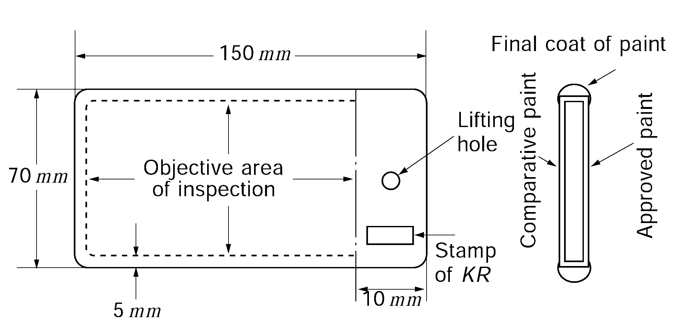
    **Fig 3.3.1 Test Coupon for Corrosion Resistance Test**
    - **(A)** Test coupon for physical properties test To conform to the requirements specified in **Table 3.3.1.**
    - **(B)** Test coupon for corrosion resistance test Standard shape of the test coupon is to be as shown in **Fig 3.32.1.** On one face of the test coupon, the paint of the brand under approval application, and on the other side thereof, the paint of ordinary brand (one each oil paint, vinyl and others) for comparative assessment are to be coated. Three test coupons coated on both side with the paint of brand under approval application and each one of test coupon coated with ordinary paint may be accepted as a alternative means. The final coat may be the paint of the brand under approval application or the comparative paint.
    - **(C)** Prior to the test the test specimen is to be stamped with the Society's brand.
  - **(3)** **Surface treatment, primer paint and coating**
    The surface treatment and painting are to be carried out in accordance with the instruction submitted under the provisions **302.** (2). The film thickness of paint is to be of the minimum recommended by the manufacturer.
- **2.** **Test details and acceptance criteria**
  - **(1)** Approval test for the paint of the brand under approval application are to be carried out in the presence of the Surveyor at the manufacturing plant and approval test items are to be as given in **Table 3.3.1.**
  - **(2)** The testing procedures and acceptance criteria are to be as given in **Table 3.3.1**. However, in case where these requirements are found impracticable due to special type of paints, separate considerations may be given.
  - **(3)** During execution of the corrosion resistance tests, the Surveyor may attend and make investigation necessary for verification.

    **Table 3.3.1 Test details and acceptance criteria of anti-corrosive paints**

    | Kind | Test item | Testing procedures | acceptance criteria |
    | --- | --- | --- | --- |
    | Physical properties test | Cross-cut adhesion test (KS M ISO 2409) | The test coupon is to be of a mild steel plate of a suitable size for testing. With a sharp knife point the paint coat on the test coupon is to be pierced right down to the steel surface in both the horizontal and vertical directions at 25 places at 2 *mm* pitch. Stick adhesive tape on the squared-off area encompassed by the 5th vertical and the horizontal line and pull off the tape quickly to judge with the unaided eyes how much of the coat is left on the test coupon. | For a successful test, small peelings are occurred on squared-off area and the peeling-off area of three test coupons are to be within 5~15% of total test area. |
    | Physical properties test | Erichsen test (KS B 0812, 5529 or the equivalent International Standards) | A mild steel test coupon of approximately 100 *mm* × 90 *mm* × 0.8 *mm* coated on a single side is to be subjected to the Erichsen test with a punch diameter of 20 *mm*, pushing speed 0.1 *mm*/sec, and pushing distance 6 *mm*. | For a successful test, peeling-off area of at least two out of three test coupons are to be within 1.0 $\mathrm{cm} ^{ 2}$. |
    | Physical properties test | Falling ball impact test | A mild steel test coupon of approximately 200 *mm* × 100 *mm* × 4 *mm* coated on one side is to be fixed on a steel base with the painted surface facing upwards and subjected to falling ball impact test with a weight of 300 g dropped thrice from a height of 2.4 m. Thereafter the condition of the paint surface is to be checked after leaving the test coupon at room temperature for a period of one hour. | If cracks and peelings occur in two out of three test coupons and more, the test is not to be approved. |
    | Physical properties test | Flex cracking test (KS M 5000) | A 150 *mm* × 50 *mm* × 0.3 *mm* tinned plate is to be painted on one side and flexed through 180° at room temperature keeping the coated side as the outer side (flexing diameter 10 *mm*, flexing time approximately 1 second). | If cracks and peelings occur in two out of three test coupons and more, the test is not to be approved. |
    | Corrosion resistance test | Salt water immersion test | The test coupon is to be immersed in a 5 % salt water kept at a temperature of 50 ± 5 °C over a period of 360 hours or more. At such times as before immersion and on completion of immersion, the film thickness of paint is to be measured and colour photographs are to be taken at each such time. | The acceptance criteria for the corrosion resistance tests are to be as given in Table 3.3.2. |
    | Corrosion resistance test | Gasoline immersion test | The test coupon is to be immersed in gasoline for 360 hours or more under room temperature. At such time as before immersion and on completion of immersion, the film thickness of paint is to be measured and colour photographs are to be taken at each such time. | The acceptance criteria for the corrosion resistance tests are to be as given in Table 3.3.2. |

    **Table 3.3.1 Test details and acceptance criteria of anti-corrosive paints (continued)**

    | Kind | Test item | Testing procedures | acceptance criteria |
    | --- | --- | --- | --- |
    | Corrosion resistance test | Hot water immersion test | Fill a container with tap water and heat it to a temperature 80 ± 5 °C and keep the test coupon immersed in it continuously for 168 hours and then take it out and examine the condition of the paint. If there is no abnormality, the test coupon is to be examined after being left for 2 hours. The film thicknesses of paint before and after immersion are to be measured with colour photographs taken. | The acceptance criteria for the corrosion resistance tests are to be as given in Table 3.3.2. |
    | Corrosion resistance test | Alternate salt water immersion test | After immersing in a 3 % salt water solution under room temperature for a period of 168 hours (7 days), the test coupon is to be taken out and left in air for 168 hours. Taking this as one cycle, the test coupon is to be subjected to 2 such cycles consecutively. Colour photographs and paint film thickness measurements before immersion and on completion of the test are to be taken. *(2021)* | The acceptance criteria for the corrosion resistance tests are to be as given in Table 3.3.2. |
    | Corrosion resistance test | Alternate gasoline/salt water immersion test | Two tanks respectively filled with 3 % salt water solution and gasoline are to be prepared and the test coupon is to be immersed in either of them for a period of 168 hours (7 days) and then taken out and immersed in the other tank for another 168 hours. Considering this as one cycle, the process is to be repeated for 2 cycles. Colour photographs and paint film thickness measurements before immersion and on completion of the test are to be taken. | The acceptance criteria for the corrosion resistance tests are to be as given in Table 3.3.2. |
    | Corrosion resistance test | Alternate salt water/crude oil immersion test | Tests similar to gasoline/salt water immersion test are to be carried out with 3 % salt water solution and crude oil. Colour photographs and paint film thickness measurements before immersion and on completion of the test are to be taken. *(2021)* | The acceptance criteria for the corrosion resistance tests are to be as given in Table 3.3.2. |
    | Corrosion resistance test | Salt water spray test (KS D 9502 or the equivalent International Standards) | Continuous test with salt water spray is to be carried out for a period of 360 hours or more. Colour photographs and paint film thickness measurements before immersion and on completion of the test are to be taken. | The acceptance criteria for the corrosion resistance tests are to be as given in Table 3.3.2. |
    | Real ship tests |   | (A) The paints, which have passed the paint film performance tests successfully, are to be subjected to real ship tests. For the real ship and specific painting areas, the manufacturer may give instructions after obtaining approval of the Society. The painting procedures and surface treatment are to be as instructed by the document under the provision 302. (2), and after application of the paints, visual inspection of paint coat, taking color photographs are to be carried out in the presence of the Surveyor. In ships having a post-painting period of two years, visual inspection, and taking of colour photographs are to be carried out at time of drydocking in the presence of the Surveyor. (B) If the paint has been applied to a ship which has already been put into service 2 years or more, this paint may be regarded as test sample in (A). (C) The primer coating does not require real ship tests(Only for products that have already been approved). *(2021)* | Standard blistered or peeled off area of the paint coat is to be 1 % or less of the total painted area. |
    | NOTES: *(2021)* (1) If real ship tests are not carried out, instead of this Table 3.3.1, Table 3.3.3 and Table 3.3.4 are to be applied as the testing procedure and acceptance criteria for anti-corrosive paints. In this case, the following requirements are to be satisfied. (a) Three test specimens for each test item specified in Table 3.3.3 and Table 3.3.4 are to be prepared. The dimensions of test specimens not specified in Table 3.3.3 and Table 3.3.4 are to be 150 mm × 75 mm × 3 mm. Appropriate protection are to be applied to the edges and the backs of the specimens. (b) Three specimens are to be tested for each test and two of the three test specimens are to be in compliance with the requirements specified in Table 3.3.3 and Table 3.3.4. |   |   |   |

    **Table 3.3.2 Acceptance Criteria**

    | Class of defects | Size of crack or blister (*mm*) | Coefficient of defect | No. of defects × coefficient of defect |
    | --- | --- | --- | --- |
    | Class of defects | Size of crack or blister (*mm*) | Coefficient of defect | Total number of defects of three test coupons |
    | A (fine) | 1 or below | 3 | 10 or below |
    | B (small) | 1 ~ 2 | 5 | 10 or below |
    | C (medium) | 2 ~ 3 | 7 | 10 or below |
    | D (large) | 4 or more | 10 | 10 or below |

    **Table 3.3.3 Test details and acceptance criteria for the peel resistance of anti-corrosive paints** ***(2021)***

    | Test item | Testing procedures | Acceptance criteria | Others |
    | --- | --- | --- | --- |
    | Cross-cut test | ISO 2409:2020 | Classification 0 to 2 | The test should be carried out only if the dry film thickness of the paint system is less than or equal to 250 µm. |
    | Pull-off test for adhesion | ISO 4624:2016 | 1) Minimum pull-off value of 2.5 MPa for each measurement 2) 0 % adhesive failure between steel/metalized steel respectively and the first coat (unless pull-off values are at least 5 MPa) | The test should be carried out only if the dry film thickness of the paint system is greater than 250 µm. |
    | Cupping test | (1) ISO 1520:2006 (2) Dimension of test specimen : 100 mm × 90 mm × 0.8 mm (3) Each test specimen is to be tested using 6 mm depth of indentation. | Peeling-off area is to be within 1.0 cm^2. |   |
    | Falling ball impact test | (1) Dimension of test specimen : 200 mm × 100 mm × 4 mm (2) A mild steel test specimen coated on one side is to be fixed on a steel base with the painted surface facing upwards and subjected to falling ball impact test with a weight of 300 g dropped thrice from a height of 2.4 m. Thereafter the condition of the paint surface is to be checked after leaving the test panel at room temperature for a period of one hour. | No cracks No peelings |   |
    | Bend test | (1) ISO 1519:2011 (2) Dimension of test specimen : 150 mm × 50 mm × 0.3 mm | No cracks No peelings |   |

    **Table 3.3.4 Test details and acceptance criteria for the corrosion resistance of anti-corrosive paints** ***(2021)***

    | Test item | Testing procedures | Assessment methods | Acceptance criteria | Others |
    | --- | --- | --- | --- | --- |
    | Water immersion | (1) ISO 2812-2:2018 (2) Test duration: 3000 hr (3) Water : sodium chloride, 5 %(mass fraction) aqueous solution | ISO 4628-2 (Blistering) ISO 4628-3 (Rusting) ISO 4628-4 (Cracking) ISO 4628-5 (Flaking) | 0 (S0) Ri 0 0 (S0) 0 (S0) |   |
    | Water condensation | (1) ISO 6270-1:2017 (2) Test duration: 720 hr | ISO 4628-2 (Blistering) ISO 4628-3 (Rusting) ISO 4628-4 (Cracking) ISO 4628-5 (Flaking) | 0 (S0) Ri 0 0 (S0) 0 (S0) |   |
    | Salt spray test | (1) Neutral salt spray test of ISO 9227:2017 (2) Test duration: 1440 hr (3) Test specimen (a) Test specimen(3ea) for corrosion: A scribe line shall be made on each test specimen in accordance with Annex A of ISO 12944-6:2018 (b) Test specimen(3ea) for cross-cut test or pull-off test | Corrosion at scribe after salt spray test (ISO 12944-6, Annex A.2) | Max. 1.5 mm corrosion at scribe as average value |   |
    | Salt spray test | (1) Neutral salt spray test of ISO 9227:2017 (2) Test duration: 1440 hr (3) Test specimen (a) Test specimen(3ea) for corrosion: A scribe line shall be made on each test specimen in accordance with Annex A of ISO 12944-6:2018 (b) Test specimen(3ea) for cross-cut test or pull-off test | Cross-cut test (ISO 2409:2020) | Classification 0 to 2 | - Only if the dry-film thickness of the paint system is less than or equal to 250 µm -Assessment after 7 days in standard atmosphere as defined in ISO 3270 |
    | Salt spray test | (1) Neutral salt spray test of ISO 9227:2017 (2) Test duration: 1440 hr (3) Test specimen (a) Test specimen(3ea) for corrosion: A scribe line shall be made on each test specimen in accordance with Annex A of ISO 12944-6:2018 (b) Test specimen(3ea) for cross-cut test or pull-off test | Pull-off test (ISO 4624:2016) | 1) Minimum pull-off value of 2.5 MPa for each measurement 2) 0 % adhesive failure between steel/metalized steel respectively and the first coat (unless pull-off values are at least 5 MPa) | - After 7 days reconditioning in a standard atmosphere as defined in ISO 3270 |
    | Cyclic ageing test | (1) ISO 12944-6:2018 Annex B (2) Test duration: 1680 hr (3) Test specimen (a) Test specimen(3ea) for corrosion: A scribe line is to be made on each test specimen in accordance with Annex A of ISO 12944-6:2018 (b) Test specimen(3ea) for cross-cut test or pull-off test | Corrosion at scribe after cyclic ageing test (ISO12944-6, Annex A.2) | Max. 3.0 mm corrosion at scribe as average value |   |
    | Cyclic ageing test | (1) ISO 12944-6:2018 Annex B (2) Test duration: 1680 hr (3) Test specimen (a) Test specimen(3ea) for corrosion: A scribe line is to be made on each test specimen in accordance with Annex A of ISO 12944-6:2018 (b) Test specimen(3ea) for cross-cut test or pull-off test | Cross-cut test (ISO 2409:2020) | Classification 0 to 2 | - Only if the dry-film thickness of the paint system is less than or equal to 250 µm -Assessment after 7 days in standard atmosphere as defined in ISO 3270 |
    | Cyclic ageing test | (1) ISO 12944-6:2018 Annex B (2) Test duration: 1680 hr (3) Test specimen (a) Test specimen(3ea) for corrosion: A scribe line is to be made on each test specimen in accordance with Annex A of ISO 12944-6:2018 (b) Test specimen(3ea) for cross-cut test or pull-off test | Pull-off test (ISO 4624:2016) | 1) Minimum pull-off value of 2.5 MPa for each measurement 2) 0 % adhesive failure between steel/metalized steel respectively and the first coat (unless pull-off values are at least 5 MPa) | - After 7 days reconditioning in a standard atmosphere as defined in ISO 3270 |

#### 304. Manufacturer approval

The manufacturer is to be subjected to Manufacturer approval in accordance with **Ch 6**.

### Section 3-2 Non-slip Paints

#### 311. Application

The requirements in this Section apply to tests and inspections for the type approval of non-slip paints in accordance with the requirements of **Pt 7, Annex 7-3, 7** of the Guidance upon request.

#### 312. Data to be submitted

The reference data in addition to those specified in **102.** are to be submitted to the Society in accordance with **302.**. The tests are to be made by using specimens of the final product.

#### 313. Type tests

- **1.** **Test coupons**
  Three each test coupons for each test item specified in **Table 3.3.3** are to be prepared.
- **2.** **Test details and acceptance criteria**
  Sampling of the precise amounts and test as follows should be done for each type of manufacture in the presence of Surveyor. Also, other tests may be added at the discretion of the Society.
  - **(1)** Physical properties test
    Tests are to comply with the requirements given in **Table 3.3.3**.

    **Table 3.3.3 Test details and acceptance criteria of Physical properties test**

    | Test item | Testing procedures | Acceptance criteria |
    | --- | --- | --- |
    | Cross-cut adhesion test | To be in compliance with **Table 3.3.1.** However, remove sand additives and paint with the thickness on the maker's advice. | To be in compliance with **Table 3.3.1.** |
    | Erichsen test | To be in compliance with **Table 3.3.1.** | Acceptance criteria is the reference. |
    | Falling ball impact test | To be in compliance with **Table 3.3.1.** However, thickness of sample to be 6mm and weight to be 1kg. | To be in compliance with **Table 3.3.1.** |
    | Flex cracking test | To be in compliance with **Table 3.3.1.** | Acceptance criteria is the reference. |
    | Abrasion test | To be in compliance with **ASTM D 4060.**(1) However, 3 samples are to be taken for an average. | Within 40% abrasion |
    | Notes; (1) To be based on resilient calibrase wheels No. CS-17, 1000 cycles, 1kg load given in **ASTM D 4060**. But the others for consideration of paints to be determined on a case-by-case basis upon mutual consultation by the manufacturer and the Society. |   |   |
  - **(2)** Friction test

    | Coefficient of friction = | Load when sliding steel plate start to move |
    | --- | --- |
    | Coefficient of friction = | Weight of sliding steel plate |

    |   |   |   |   |
    | --- | --- | --- | --- |
    | Section | Dry Condition | Wet Condition | Oily Condition |
    | Acceptance Criteria | 0.9 | 0.85 | 0.75 |
    - **(A)** 3 samples are to be prepared from worn part of the abrasion test finished samples. Friction test procedure is in accordance with Test Method B(Horizontal Pull test) of **ASTM D 1894**. The rubber plate has Shore-A hardness 60~70 is to be adhered to the surface of sliding steel plate. However, other test procedure may be applied at the discretion of the Society.
    - **(B)** An average of 5 times on friction test is to be taken from each condition(Dried condition, Wet condition with Synthetic Sea Water according to **ASTM D 1141**, Oily condition with Engine Oil). Also coefficient of friction is given by the following formula.
    - **(C)** Average coefficient friction value of 3 samples is not to be less than those obtained by the following formula. Also each coefficient friction value is not to be less than 0.7.
  - **(3)** Corrosion resistance test
    Saline water spray test and gasoline deposition test are carried out for corrosion resistance test. Also, test procedure and acceptance criteria are to comply with **303. 2**. However, the test time is to be 360 hours.
  - **(4)** Non-flammability test
    The procedure and acceptance criteria of the non-flammability test are to comply with **2604. 3**.

#### 314. Manufacturer approval

The manufacturer is to be subjected to Manufacturer approval in accordance with **Ch 6**.

### Section 4 Acid Resisting Paints

#### 401. Application

The requirements in this Section apply to tests and inspections for the type approval of acid resisting paints in accordance with the requirements of **Pt 6, Ch 1, 1305.** of the Rules.

#### 402. Data to be submitted

The following reference data are to be submitted to the Society in addition to those specified in **102.**

#### 403. Type tests

Approval tests are to comply with the requirements given in **Table 3.4.1.**

**Table 3.4.1 Test details and acceptance criteria of acid resisting paints**

| Kind | Testing procedures |
| --- | --- |
| **Test specimen** | The glass panel (about 150 *mm* × 70 *mm* × 2 *mm*) which is coated on both side is to be used as test specimen, unless otherwise specially specified. Four pieces of test panels are to be made according to coating method and drying condition designated by the manufacturer. The edges of three test specimens are to be duplicated with paraffin or wax, etc. at least 5 *mm* in width and one test panel is to be used for comparison. (refer to Fig 3.3.1) |
| **Test method** | (1) A glass bottle for one test panel is prepared as shown in Fig 3.4.1 and each bottle is filled with acid solutions (5 *%*, 7.5 *%*, 10 *%*) designated by the manufacturer up to 150 *mm* in depth and then maintained the temperature of solution at designated temperature. The test panel is to be hung by thread so that it may be immersed up to 120 *mm* as shown in Fig 3.4.1 and left it immersed for 480 hours. After 480 hours, the test panel is removed from the glass bottle and washed carefully with water and then drained off. The test panel is placed perpendicularly at room temperature for two hours and paint film is examined. In this case, edge of test panel and paint film within 10 mm in width from the immersion level are not examined. 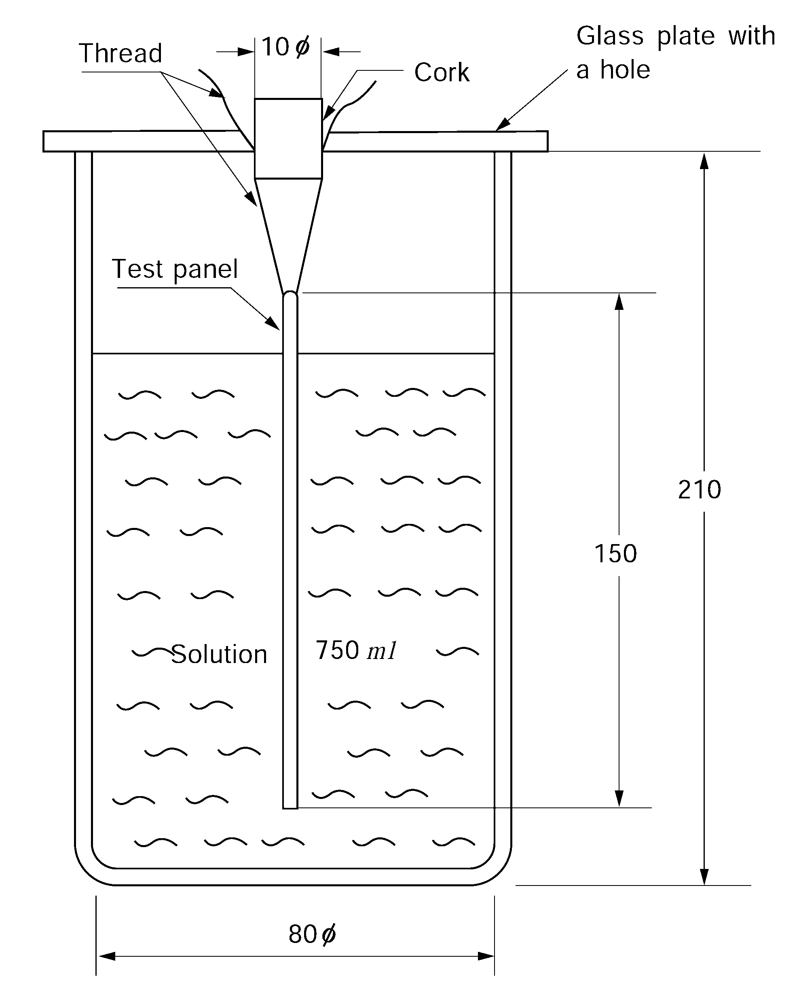 **Fig 3.4.1 Glass Bottle for Test** (Unit : mm) |

**Table 3.4.1 Test details and acceptance criteria of acid resisting paints (continued)**

| Kind | Testing procedures |
| --- | --- |
| **Test method** | (2) The inlet of the glass bottle is to be properly faced and the hole of glass plate is plugged with a cork. The test panel is hung with two strings of thread fixed to it and penetrated through the gap between the glass plate and the cork. So the height of the test panel is adjusted by the length of the thread fixed to it. |
| **Acceptance criteria** | Two test panels and over are to be examined with the test panel for comparison. In this case, paint film is to be free from cracks, blistering, peeling, pinholding, softening and elusion. There is to be no great change in color and gloss. |

#### 404. Manufacturer approval

The manufacturer is to be subjected to Manufacturer approval in accordance with **Ch 6**.

### Section 5 Loading Instruments

#### 501. Application

- **1.** The requirements of this Section apply to tests and inspection for type approval of loading instruments fitted on board for the calculation of stability in accordance with the requirements of **Pt 1, Ch 1, 307.** and 405. of the Rules, and for the calculation of longitudinal strength in accordance with the requirements of **Pt 3, Ch 3, 104.** of the Rules and for type approval of container lashing calculation instrument in accordance with the requirements of **Pt 7, Annex 7-2, 9.** of the Guidance.
- **2.** Related to **Par 1** above, the design approval of the Society for the software (program) used in the loading instruments or container lashing calculation instruments refer to requirements specified in **Ch 4, Sec 2. of this Guidance.**
- **3.** The requirements of this Section apply to the instruments used on land to assist several ships.

#### 502. Data to be submitted

The environmental test procedures are to be submitted to the Society in addition to those specified in **102.**

#### 503. Requirements

- **1.** **Construction**
  The loading instrument (computer) is to have sufficient endurance and no difficulty for operating under the following conditions, except where fitted in a special place. Also, humidity is to be considered especially, and a self-monitoring function is recommended to be computerized to prevent fallacy or error caused by failure in the circuit, etc.
  - **(1)** Ambient temperature : 0°C to 45°C
  - **(2)** Vibration:
    $pile{+3#-0}$ Amplitude ±1.0 *mm* at 2 Hz to 13.2 Hz
    Acceleration ±0.7 $G$ at 13.2 Hz to 100 Hz
    The vibration during operation is to range from 2 Hz to 100 Hz with an acceleration of ± 0.05 $G$.
  - **(3)** Inclination:
    Longitudinal inclination 10°
    Transverse inclination 22.5°
  - **(4)** Power supply variation:

    |   | Permanent value | Transient value |
    | --- | --- | --- |
    | Voltage (rated) | ± 10 % | ± 20 %, 1.5 *sec* |
    | Frequency (rated) | ± 5 % | ± 10 %, 5 *sec* |

    +30 % to -25 % for rated voltage for equipment connected to the battery during charging
    +20 % to -25 % for rated voltage for equipment not connected to the battery during charging
    - **(A)** *A.C*. power supply
    - **(B)** *D.C*. power supply
- **2.** The loading instrument is to have proper input/output function including printer. When the printer is provided separately, the type test for the printer is not required.

#### 504. Test and inspection

- **1.** **Environmental test**
  Environmental tests of loading instruments are followed by test item 1 through 9 of **Table 3.23.1** of **2304.** However, the tests for loading instruments to be used on land are not required as a rule.

### Section 6 High Holding Power Anchors and Super High Holding Power Anchors

#### 601. Application

- **1.** The requirements in this Section apply to tests and inspection for the approval of high holding power anchors and super high holding power anchors in accordance with requirements in **Pt 4, Ch 8, 304.** of the Rules.
- **2.** The manufacturer who supplies the raw materials of anchors which is subjected to the requirements in this Section is to obtain approval of manufacturing process of raw materials in accordance with the requirements in each Section of **Pt 2, Ch 1** of the Rules.
- **3.** The manufacturer who makes casted anchors in accordance with the requirements of this Section may be considered to comply with the requirements of manufacturing process in **Pt 2, Ch 1, 102.** of the Rules.

#### 602. Data to be submitted

The following reference data are to be submitted to the Society in addition to those specified in **102.**

#### 603. Type tests

- **1.** **Type test and acceptance criteria**
  - **(1)** The type test is to be carried out on holding power testing anchors(2 for high holding power anchors and 3 for super high holding power anchors) with the mass closest to the maximum applied mass on the test item specified in **Table 3.6.1**, in the presence of the Surveyor. However, in case where these requirements are found impracticable due to special type of anchors, separate considerations may be given. *(2018)*
  - **(2)** The testing procedures and acceptance criteria are to be as given in **Table 3.6.1.** However, in case where these requirements are found impracticable, separate considerations may be given.

    **Table 3.6.1 Type test and acceptance criteria of anchor**

    | Test item | Test method | Acceptance criteria |
    | --- | --- | --- |
    | Material test | (1) To be in compliance with Pt 2 of the Rule. Casted anchor is to be subjected to the impact test according to the requirements in Pt 4, Sec 8, 303. 5. of the Rule. (2) Test specimens of casted anchor are to, in principle, be taken from the body and the test blocks attached thereto. | To meet the Rule requirements |
    | Proof test | To be in compliance with Pt 4, Sec 8, 309. 3 of the Rule. | To meet the Rule requirements |
    | Drop test | Drop test of casted anchor is to be in compliance with Pt 4, Sec 8, 309. 2. (1) of the Rule. Dropping is to be made for 3 attempts at least. | To be free from cracks or other harmful defects. |
    | Hammering test | After the drop test, the anchor is to be slung clear of the ground and thoroughly hammered in accordance with Pt 4, Ch 8, 309. 2. (2) of the Rules. | To be free from cracks or other harmful defects. |
    | Visual inspection | To be in compliance with Pt 4, Sec 8, 309. 4 of the Rule. | To meet the Rule requirements |
    | Non-destructive test | To be carried out the extended non-destructive examination in accordance with Pt 4, Ch 8, 309. 6. of the Rules. | To meet the Rule requirements |
    | Holding power test | (A) Holding power test is to include the holding power measuring test and embed test and is to be carried out on anchors of different mass for respective modes of test in accordance with the requirements specified in Table 3.6.2. Where sufficient data are submitted, and if the Society considers appropriate, all or part of the holding power measuring test may be omitted. (B) The holding power measuring test is to be carried out in three types of the soil shown Table 3.6.2 where the anchor is to be dragged at a fixed speed (as slow as practicable). The sea bed for testing is to be of virgin bed for each attempt of testing. (C) Tests are normally to be carried out from a tug but alternatively shore based tests may be accepted. | To be as deemed appropriate by the Society |

    **Table 3.6.2 Items of Holding Power Test and Numbers of Attempts(1)** ***(2018)***

    | Type of anchor |   |   | Holding power measuring test |
    | --- | --- | --- | --- |
    | Type of anchor |   |   | Soil of sea bed (3) |
    | High Holding Power Anchor | Two pieces of test anchors | A(2) | 3 |
    | High Holding Power Anchor | Two pieces of test anchors | a(2) | 3 |
    | High Holding Power Anchor | Two pieces of anchors for comparison(4) | B(2) | 1 |
    | High Holding Power Anchor | Two pieces of anchors for comparison(4) | b(2) | 1 |
    | Super High Holding Power Anchor | Three pieces of test anchors | A(2) | 3 |
    | Super High Holding Power Anchor | Three pieces of test anchors | a(2) | 3 |
    | Super High Holding Power Anchor | Three pieces of test anchors | X(2) | 3 |
    | Super High Holding Power Anchor | Three pieces of anchors for comparison(4) | B(2) | 1 |
    | Super High Holding Power Anchor | Three pieces of anchors for comparison(4) | b(2) | 1 |
    | Super High Holding Power Anchor | Three pieces of anchors for comparison(4) | Y(2) | 1 |
    | NOTES: (1) The number of test attempts given in this Table may be increased/decreased as considered appropriate by the Society. (2) Anchors “A” and “B” are to have nearly compatible masses, and the mass of anchor “a” and “b” are to, in principle, have a mass equivalent to 1/10(the minimum of the approval mass range for the super high holding power anchor) of that of anchor “A” and “B” or more. Anchor “A” and “B” are to, in principle, have a mass a equivalent to 1/10(the maximum of the approval mass range for the super high holding power anchor) of the maximum mass to be approved or more. Anchors "X" and "Y" are to have nearly compatible masses and "X" is to be the middle value between "A" and "a". (3) The tests are to be carried out using three kinds of soils, i.e, sand, mud, clay, etc (4) Where an ordinary stockless anchor is not available, for testing of HHP anchors a previously approved HHP anchor may be used in its place. For testing of SHHP anchors, a previously approved HHP or SHHP anchor may be used in place of an ordinary stockless anchor. |   |   |   |
- **2.** **Test records**
  After completion of the type test, the manufacturer is to prepare records of the type test as follows, and is to submit three copies to the Society upon receiving confirmation by the Surveyor.
  - **(1)** Test records and work records of the manufacturing process on the test anchor (steelmaking process, casting process, heat treatments, etc.)
  - **(2)** Testing procedure and test arrangement (explanatory drawings on the testing procedure and test arrangement are to be attached thereto.)
  - **(3)** The results of holding power measuring test (in addition to the results of holding power measuring test ($Hp/W$ = Holding Power/Mass), holding power characteristics curves are to be attached thereto.)
  - **(4)** Properties of the soil of the sea bed (hardness, composition) and flatness of the sea bed.
  - **(5)** The dragging speed of the anchor in the holding power measuring test.

### Section 7-1 Emergency Towing Arrangements

#### 701. Application

- **1.** The requirements in this Section apply to tests and inspections for the type approval of emergency towing arrangements (hereinafter called *ETA*) for ships in accordance with requirements in **Pt 4, Ch 8, 205.** of the Rules. The type approval of emergency towing arrangements is made for a whole arrangement consisting of the components given in the **Table 3.7.1.**

  **Table 3.7.1 Major Components of the ETA**

  | Components | Forward ETA | Aft ETA |
  | --- | --- | --- |
  | Pick-up gear | (Optional) | Yes |
  | Towing pennant | (Optional) | Yes |
  | Chafing gear | Yes | (Depending on design) |
  | Fairlead | Yes | Yes |
  | Strong point | Yes | Yes |
  | Pedestal roller | Yes | (Depending on design) |
- **2.** The type approval of emergency towing arrangements is made for each of forward *ETA* and aft *ETA*.
- **3.** The applicant of the type approval is not necessarily to be a manufacturer of the components, but to be those responsible for quality of the products.
- **4.** The manufacturer who makes major components of the *ETA* shall obtain the Approval of Manufacturing Process of raw materials in accordance with the requirements in **Pt 2, Ch. 1, 102** of the Rule.

#### 702. Data to be submitted

The following reference data are to be submitted to the Society in addition to those specified in **102.**

#### 703. Type tests

- **1.** **Test methods and acceptance criteria**
  - **(1)** Approval tests of *ETA* are to be carried out in the presence of the Surveyor at the manufacturing plant and approval test items are to be as given in **Table 3.7.2.**
  - **(2)** The testing procedures and acceptance criteria are to be as given in **Table 3.7.2.** However, in case where these requirements are found impracticable, decisions are left to the discretion of the Society.

    **Table 3.7.2 Type test and acceptance criteria of Emergency Towing Arrangements**

    | Test item | Test method | Acceptance criteria |
    | --- | --- | --- |
    | Strength test | (A) Strength components of ETA, i.e., towing pennant, chafing gear, fairlead and strongpoint, etc., are to be assembled and fitted on the test unit according to the manufacturer's drawings. Tensile loads are to be applied and kept for at least 1 minute to the towing pennant or chafing gear with the tensile force directions and test loads as given in the following (a) and (b). (a) Tensile force directions (i) 90 °C from the ship's centerline to port and starboard, and 30 °C vertical downwards (ii) 0 °C sideway from the ship's centerline, and 30 °C vertical downwards (b) Test loads (i) 2,000 kN for 1,000 kN type ETA (ii) 4,000 kN for 2,000 kN type ETA (B) Towing pennant, chafing gear, fairlead and strongpoint to be used for the strength test in (A) above, are to be of the products as follows: (a) Towing pennant, chafing chain and their connecting parts They are to be made by a manufacturer with the manufacturing process approved by the Society in principle, and to be accepted to the production test by the Society. (b) Fairlead and strongpoint They are to comply with the requirements in Pt 2 of the Rules and to be wholly examined by ultrasonic test in principle, but, if impracticable, may be examined by effective nondestructive test such as magnetic particle test. (C) For other major components of strength member than those in (B) above, the Society may require certain tests or inspections prior to the strength test, if deemed necessary. | Each component of the ETA is to neither be broken nor destroyed. |
    | Deployment test | A deployment test as given in the following (A) and (B) is to be carried out during night time condition using prototypes fitted on a ship according to the manufacturer's drawings. In this test, only emergency power is to be used. (A) The aft ETA is to be deployed in accordance with the operation manual prepared by the manufacturer, and the following (a) and (b) are to be verified. (a) It is to be capable of being deployed within 15 minutes in harbour conditions. Time duration of deployment operation is counted from the time when a lid of the pick-up gear container is opened, to the time when inboard termination of the towing pennant or chafing gear touches to the strongpoint without any trouble. (b) The pick-up gear is to be designed for manual operation by one person taking into account the absence of power. (B) The forward ETA is to be deployed within 1 hour in harbour conditions in accordance with the operation manual prepared by the manufacturer. Ten persons in max. are to be employed in the deployment work on board the ship during the test. | ETA is to be deployed in accordance with the operation manual prepared by the manufacture |
    | Strength test for wire rope terminations of towing pennant | Wire rope terminations of towing pennant such as splicing, socket, etc., are to be prototype tested for 3 pieces of test specimens in accordance with the manufacturer's specifications, by the test load specified in (A) of strength test above for at least 1 minute. | In case where even 1 piece of the test specimen could not withstand the test load, the proposed termination is not to be accepted. |
    | Others | To be as deemed appropriate by the Society | To be as deemed appropriate by the Society |

### Section 7-2 Equipment for mooring at SPM

#### 711. Application

- **1.** The requirements in this Section apply to tests and inspections for the type approval of the equipment for mooring at SPM in accordance with the requirements of **Pt 4, Ch 10, 101. 3.** of the Guidance.
- **2.** The applicant of the type approval is not necessarily to be a manufacturer of the components, but to be those responsible for quality of the products.
- **3.** The manufacturer who makes major components of the equipment for mooring at SPM shall obtain the Approval of Manufacturing Process of raw materials in accordance with the requirements in **Pt 2, Ch. 1, 102** of the Rule.

#### 712. Data to be submitted

The following reference data are to be submitted to the Society in addition to those specified in **102.**

#### 713. Type tests

- **1.** **Test methods and acceptance criteria**
  - **(1)** Components of equipment for mooring at SPM are to be assembled and fitted on the test unit according to the manufacturer's drawings. Tensile loads are to be applied with the proof test loads equivalent to the safe working load specified in **Table 3.7.3** and following tensile test direction, and kept for at least 1 minute. Upon completion of type test, components of equipment for mooring at SPM are to have no permanent deformation.
    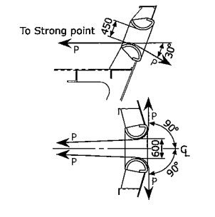
    **Fig 3.7.1 Tensile force directions**

    | Deadweight (ton) | Safe working load(SWL) (ton) |
    | --- | --- |
    | DWT ≤ 100,000 | 200 |
    | 100,000 < DWT ≤ 150,000 | 250 |
    | 150,000 < DWT | 350 |
    - **(A)** 90 degrees from the ship's centerline to port and starboard, and 30 degrees vertical downwards
    - **(B)** 0 degrees sideway from the ship's centerline, and 30 degrees vertical downwards
  - **(2)** Chain stoppers and fairleads are to be wholly examined by ultrasonic test in principle, but, if impracticable, may be examined by effective non-destructive test such as magnetic particle test.

### Section 8 Reciprocating Internal Combustion Engines

#### 801. Application

- **1.** The requirements in this Section apply to tests and inspection for the approval of new type reciprocating internal combustion engines or no service records to the Society on the basis of the requirements in **Pt 5, Ch 2, 211. 3** of the Rules.
- **2.** The definition of low, medium and high speed engine in this section, is to be according to **Table 5.2.1** of **Pt 5** of the Rules.
- **3.** An approval for a particular type of engine of which tests and inspection carried out at any place at any manufacture will be accepted for all engines of the same type including different number of cylinders built by licensees and licensors.
- **4.** The requirements in this Section apply, in general, to each engine type of which either of the following is different to that of an approved engine type. *(2017)*
  - **(1)** Bore and stroke
  - **(2)** Method of injection(direct or indirect injection)
  - **(3)** Valve and injection operation (by cams or electronically controlled)
  - **(4)** Kind of fuel (liquid, dual-fuel, gaseous)
  - **(5)** Working cycle(2-stroke, 4-stroke)
  - **(6)** Turbo-charging system (pulsating or constant pressure)
  - **(7)** Charging air cooling system (e.g. with or without intercooler)
  - **(8)** Cylinder arrangement (in-line, vee-type)
    One type test will be considered adequate to cover a range of different numbers of cylinders. However, a type test of an in-line engine may not always cover the vee-type. As required by the Society, separate type tests may be required for the vee-type. On the other hand, a type test of a vee-type engine covers the in-line engines, unless the bmep is higher.
    Items such as axial crankshaft vibration, torsional vibration in camshaft drives, and crankshafts, etc. may vary considerably with the number of cylinders and may influence the choice of engine to be selected for type testing.
  - **(9)** Cylinder power, speed and cylinder pressures
    If an engine has been drawing approved, and internal testing per Stage A is documented to a rating higher than the one type tested, the Type Approval may be extended to the increased power, mean effective pressure, rpm upon submission of an extended delivery test report as belows.
    - **(A)** The engine is generally type approved up to the tested ratings and pressures (100% corresponding to MCR).
    - **(B)** Provided documentary evidence of successful service experience with the classified rating of 100% is submitted, an increase may be permitted without a new type test if the increase from the type tested engine is within the following range. In this case, if crankshaft calculation and crankshaft drawings are modified, the drawing approval is to be required.
      - **(a)** 5 % of the maximum combustion pressure, or
      - **(b)** 5 % of the mean effective pressure, or
      - **(c)** 5 % of the rpm
    - **(C)** Providing maximum power is not increased by more than 10%, an increase of maximum approved power may be permitted without a new type test provided engineering analysis and evidence of successful service experience in similar field applications (even if the application is not classified) or documentation of internal testing are submitted if the increase from the type tested engine is within the following range.
      - **(a)** 10 % of the maximum combustion pressure, or
      - **(b)** 10 % of the mean effective pressure, or
      - **(c)** 10 % of the rpm
    - **(D)** De-rated engine
      - **(a)** Test at over speed (only if nominal speed has increased)
      - **(b)** Rated power, i.e. 100 % output at 100 % torque and 100 % speed corresponding to load point 1 in **Fig 3.8.1**, 2 measurements with one running hour in between
      - **(c)** Maximum permissible torque (normally 110 %) at 100 % speed corresponding to load point 3 in **Fig 3.8.1,** or maximum permissible power (normally 110 %) and speed according to nominal propeller curve corresponding to load point 3a in **Fig 3.8.1**, ½ hour
      - **(d)** 100 % power at maximum permissible speed corresponding to load point 2 in **Fig 3.8.1**, ½ hour
- **5.** Where the manufacturer apply to the approval by manufacturer's rating not the maximum continuous output of engine, the Society correspondingly apply to the requirements in this Section.
- **6.** An integration test demonstrating that the response of the complete mechanical, hydraulic and electronic system is as predicted maybe carried out for acceptance of sub-systems (Turbo Charger, Engine Control System, Dual Fuel, Exhaust Gas treatment, etc.) separately approved. The scope of these tests shall be proposed by the designer/licensor taking into account of impact on engine.

#### 802. Data to be submitted

In addition to those specified in **102.**, the documents is to be submitted according to **Table 5.1.4** and **Table 5.1.5** of **Pt 5, Ch 1, 203.** of the Rules.

#### 803. Type tests

- **1.** **Objectives**
  The type testing is to be arranged to represent typical foreseen service load profiles, as specified by the engine builder, as well as to cover for required margins due to fatigue scatter and reasonably foreseen in-service deterioration as followings.
  - **(1)** Parts subjected to high cycle fatigue (HCF) such as connecting rods, cams, rollers and spring tuned dampers where higher stresses may be provided by means of elevated injection pressure, cylinder maximum pressure, etc.
  - **(2)** Parts subjected to low cycle fatigue (LCF) such as “hot” parts when load profiles such as idle - full load - idle (with steep ramps) are frequently used.
  - **(3)** Operation of the engine at limits as defined by its specified alarm system, such as running at maximum permissible power with the lowest permissible oil pressure and/or highest permissible oil inlet temperature.
- **2.** **Safety precautions**
  - **(1)** Before any test run is carried out, all relevant equipment for the safety of attending personnel is to be made available by the manufacturer/shipyard and is to be operational, and its correct functioning is to be verified.
  - **(2)** This applies especially to crankcase explosive conditions protection, but also over speed protection and any other shut down function.
  - **(3)** The inspection for jacketing of high pressure fuel oil lines and proper screening of pipe connections is also to be carried out before the test runs.
  - **(4)** Interlock test of turning gear is to be performed when installed.
- **3.** **Test stages**
  The type tests are subdivided into three stages below.
  - **(1)** Stage A (Internal tests)
    Functional tests and collection of operating values including test hours during the internal tests, the relevant results (including photographs which show the conditions of each component after the internal tests) of which are to be presented to the Society during the stage B.
  - **(2)** Stage B (Approval tests)
    Operation test in the presence of the Surveyor.
  - **(3)** Stage C (Component inspection)
    Component inspections by the Surveyor after completion of the test programme. The engine manufacturer will have to compile all results and measurements for the engine tested during the approval tests in a report, which will have to be submitted to the Society.
- **4.** The complete type testing program is subject to approval by the Society. The extent the Surveyor’s attendance is to be agreed in each case, but at least during stage B and C. Testing prior to the witnessed type testing (stage B and C), is also considered as a part of the complete type testing program.
- **5.** Upon completion of complete type testing (stage A through C), a type test report is to be submitted to the Society for review. The type test report is to contain the followings.
  - **(1)** Overall description of tests performed during stage A. Records are to be kept by the builders QA management for presentation to the Society.
  - **(2)** Detailed description of the load and functional tests conducted during stage B.
  - **(3)** Inspection results from stage C.
- **6.** The type testing is to substantiate the capability of the design and its suitability for the intended operation. Special testing such as LCF and endurance testing will normally be conducted during stage A. High speed engines for marine use are normally to be subjected to an endurance test of 100 hours at full load. Omission or simplification of the type test may be considered for the type approval of engines with long service experience from non-marine fields or for the extension of type approval of engines of a well-known type, in excess of the limits given in **801. 4**.
  Propulsion engines for high speed vessels that may be used for frequent load changes from idle to full are normally to be tested with at least 500 cycles (idle - full load - idle) using the steepest load ramp that the control system (or operation manual if not automatically controlled) permits. The duration at each end is to be sufficient for reaching stable temperatures of the hot parts.
- **7.** Measurements and recordings
  - **(1)** During all testing the ambient conditions (air temperature, air pressure and humidity) are to be recorded.
  - **(2)** As a minimum, the following engine data are to be measured and recorded.
    Calibration records for the instrumentation used to collect data as listed above are to be presented and reviewed by the attending Surveyor. Additional measurements may be required in connection with the design assessment.
    - **(A)** Engine rpm and torque
    - **(B)** Maximum combustion pressure and Mean indicated pressure for each cylinder - For engines where the standard production cylinder heads are not designed for such measurements, a special cylinder head made for this purpose may be used. In such a case, the measurements may be carried out as part of Stage A and are to be properly documented. Where deemed necessary e.g. for dual fuel engines, the measurement of maximum combustion pressure and mean indicated pressure may be carried out by indirect means, provided the reliability of the method is documented.
    - **(C)** Charging air pressure and temperature
    - **(D)** Exhaust gas temperature
    - **(E)** Fuel rack position or similar parameter related to engine load
    - **(F)** Turbocharger speed
    - **(G)** All engine parameters that are required for control and monitoring for the intended use (propulsion, auxiliary, emergency)
- **8.** **Details of tests**
  Test items on stage A, B and C are to be as given in **Table 3.8.1.** However, during the stage B, deviations from the items, if any, are to be agreed with the Society.

  **Table 3.8.1 Details of test in stage A, B and C**

  | Test stage | Details of test |
  | --- | --- |
  | stage A | (1) Operation at the load points 25 %, 50 %, 75 %, 100 % and 110 % of the maximum rated power and other load points considered important, at engine speed of along the nominal (theoretical) propeller curve (if applicable mode of operation i.e. driving controllable pitch propellers) and at constant speed for propulsion engines, and at constant speed for engines intended for generating sets or auxiliary machinery. (2) Operation at the limit points of the permissible operating range. These limit points are to be defined by the engine manufacturer. (3) For high speed engines, the 100 hr full load test and the low cycle fatigue test apply as required in connection with the design assessment. (4) Other items deemed to be verified by the Society. (Vibration measurement, torsional vibration measurement, noise measurement, etc.) |
  | stage B | (1) Operation at each load point below (an operating time of two hours is to be required at the load point in (A) and two sets of readings are to be taken at a minimum interval of one hour, an operating time of 0.5 hour can be normally assumed per each load point other than (A)) (A) Rated power, i.e. 100 % output at 100% torque and 100% revolution (corresponding to load point 1 in Fig 3.8.1). If operation of the engine at limits as defined by its specified alarm system (e.g. at alarm levels of lub oil pressure and inlet temperature) is required, the test should be made here. (B) 100% power at maximum permissible revolution (corresponding to load point 2 in Fig 3.8.1) (C) Maximum permissible torque (normally 100 %) at 100 % revolution (corresponding to load point 3 in Fig 3.8.1) or maximum permissible power (normally 110 %) and 103.2 % revolution according to nominal propeller curve (corresponding to load point 3a in Fig 3.8.1). Load point 3 (or 3a as applicable) is to be replaced with a load that corresponds to the specified overload and duration approved for intermittent use. This applies where such overload rating exceeds 110% of MCR. (D) Minimum permissible revolution at 100 % torque (corresponding to load point 4 in Fig 3.8.1) (E) Minimum permissible revolution at 90 % torque (corresponding to load point 5 in Fig 3.8.1). Applicable to propulsion engines only. (F) Partial loads, e.g. 25 %, 50 %, and 75 % of rated power and revolution according to nominal propeller curve i.e. 90.8 %, 79.3 % and 62.9 % speed (corresponding to load points 6, 7 and 8 in Fig 3.8.1) for propulsion engines (G) Partial loads, e.g. 25 %, 50 % and 75 % of rated power and rated speed with constant governor setting (corresponding to load points 9, 10 and 11 in Fig 3.8.1) for engines intended for generator sets or auxiliary machinery (H) Crosshead engines not restricted for use with C.P. propellers are to be tested with no load at the associated maximum permissible engine speed. (2) For 2-stroke propulsion engines, the achievable continuous output when operating along the nominal propeller curve is to be determined in the case of turbocharger damage. Engines intended for single propulsion with a fixed pitch propeller are to be able to run continuously at a speed (r.p.m.) of 40 % of full speed along the theoretical propeller curve when one turbocharger is out of operation. (The test can be performed by either by-passing the turbocharger, fixing the turbocharger rotor shaft or removing the rotor.) (3) Verification of the lowest specified propulsion engine speed according to the nominal propeller curve as specified by the engine designer (even though it works on a water-brake). During this operation, no alarm shall occur. (4) Starting tests, for non-reversible engines and/or starting and reversing tests, for reversible engines (for the purpose of determining the minimum air pressure and the consumption for a start.) (5) Governor test for compliance with Pt 5, Ch 2, 203. 1 of the Rules. However, prime movers for generators are to comply with the requirements in Pt 6, Ch 1, 302. of the Rules for Classification of Steel Ships. (6) Testing the safety system, particularly for overspeed and low lubricating oil pressure (The over-speed test is to be carried out and is to demonstrate that the engine is not damaged by an actual engine overspeed within the overspeed shutdown system set-point. This test may be carried out at the manufacturer’s choice either with or without load during the speed overshoot.) |

  **Table 3.8.1 Details of test in stage A, B and C (continued)**

  | Test stage | Details of test |
  | --- | --- |
  | stage B | (7) For electronically controlled reciprocating internal combustion engines integration tests shall verify that the response of the complete mechanical, hydraulic and electronic system is as predicted for all intended operational modes. The scope of these tests shall be agreed with the Society for selected cases based on the FMEA. (8) Supplementary tests when required for engines intended for emergency services (9) Verification of compliance with requirements for jacketing of high-pressure fuel oil lines, screening of pipe connections in piping containing flammable liquids and insulation of hot surfaces. (A) The engine is to be inspected for jacketing of high-pressure fuel oil lines, including the system for the detection of leakage, and proper screening of pipe connections in piping containing flammable liquids. (B) Proper insulation of hot surfaces is to be verified while running the engine at 100% load, alternatively at the overload approved for intermittent use. Readings of surface temperatures are to be done by use of Infrared Thermoscanning Equipment. Equivalent measurement equipment may be used when so approved by the Society. Readings obtained are to be randomly verified by use of contact thermometers. (10) Other test items deemed necessary by the Society |
  | stage C | (1) The crankshaft deflections are to be measured in the specified (by designer) condition (except for engines where no specification exists). (2) High speed engines for marine use are normally to be stripped down for a complete inspection after the type test. (3) For all the engines other than (2), immediately after the test run the components of one cylinder for in-line engines and two cylinders for V-engines are presented for inspections as follows (engines with long service experience from non-marine fields can have a reduced extent of opening). (A) Piston removed and dismantled (B) Crosshead bearing, dismantled (C) Guide planes (D) Connecting rod bearings (big and small end) dismantled (special attention to serrations and fretting on contact surfaces with the bearing backsides) (E) Main bearing dismantled (F) Cylinder liner in the installed condition (G) Cylinder head, valves disassembled (H) cam drive gear or chain, camshaft and crankcase with opened covers. (The engine must be turnable by turning gear for this inspection.) (4) If deemed necessary by the surveyor, further dismantling of the engine may be required. |

  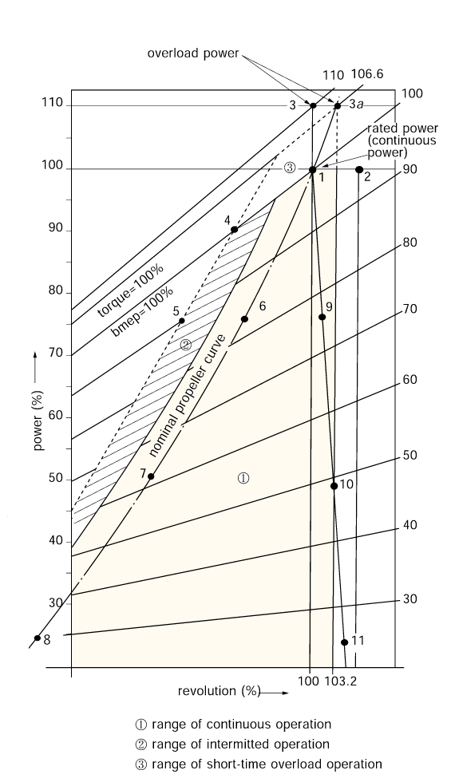
  Fig 3.8.1 Power/Revolution Diagram

### Section 9-1 Crankcase Explosion Relief valves

#### 901. Application

The requirements in this Section apply to tests and inspections for the type approval of crankcase explosion relief valves intended to be fitted to engines and gear cases in accordance with the requirements of **Pt 5, Ch 2, 203. 4.** of the Rules. This test procedure is only applicable to explosion relief valves fitted with flame arresters.

#### 902. Data to be submitted

The following reference data are to be submitted to the Society in addition to those specified in **102.**

#### 903. Type tests

- **1.** **Test houses**
  The test houses where testing is carried out are to be accredited to a National or International Standard, e.g. **KS Q ISO IEC 17025:2017**, and the test facilities are to be equipped so that they can perform and record explosion testing in accordance with The requirements in this Section
- **2.** **Valves to be tested**
  - **(1)** The valves used for type test shall be selected from the manufacturer’s normal production line by the Surveyor witnessing the tests and three valves for each size shall be selected. However, in case where the valves produced in series comply with the requirements specified in **4.**, type test may be exempted.
  - **(2)** The valves selected for type testing are to have been previously tested at the manufacturer's works to demonstrate that the opening pressure is in accordance with the specification within a tolerance of ±20% and that the valve is air tight at a pressure below the opening pressure for at least 30 seconds.
  - **(3)** In case where the orientation of installation could be changed, the valves are to be tested for each intended installation orientation.
- **3.** Approval tests are to comply with the requirements given in **Table 3.9.1.**

  **Table 3.9.1 Type test and acceptance criteria of Crankcase Explosion Relief valve**

  | Kinds | Requirements |
  | --- | --- |
  | Explosion test process | (1) All explosion tests to verify the functionality of crankcase explosion relief valves are to be carried out using an air and methane mixture with a methane concentration of 9.5 % ±0.5 %. The pressure in the test vessel is to be not less than atmospheric and not exceed 0.2 bar. (2) The concentration of methane in the test vessel is to be measured in the top and bottom of the vessel and is not to differ by more than 0.5%. (3) The ignition of the methane and air mixture is to be made at the centreline of the test vessel at a position approximately one third of the height or length of the test vessel opposite to where the valve is mounted. (4) The ignition is to be made using a maximum 100 joule explosive charge. |
  | Test vessel for explosion testing | (1) The test vessel for explosion testing is to have documented dimensions. The dimensions are to be such that the vessel is not "pipe like" with the distance between dished ends being not more than 2.5 times its diameter. The internal volume of the test vessel is to include any standpipe arrangements. (2) The pressure measuring equipment is to be capable of measuring the pressure in the test vessel in at least two positions, one at the valve(P2 in Fig 3.9.1) and the other at the test vessel centre(P1 in Fig 3.9.1). The measuring arrangements are to be capable of measuring and recording the pressure changes throughout an explosion test at a frequency recognising the speed of events during an explosion. The result of each test is to be documented by video recording and if necessary by recording with a heat sensitive camera. (3) The test vessel is to be provided with a flange, located centrally at one end perpendicular to the vessel longitudinal axis, for mounting the explosion relief valve. The test vessel is to be arranged in an orientation consistent with how the valve will be installed in service, i.e., in the vertical plane or the horizontal plane. |

  **Table 3.9.1 Type test and acceptance criteria of Crankcase Explosion Relief valve** **(continued)**

  | Kinds |   | Requirements |
  | --- | --- | --- |
  | Test vessel for explosion testing |   | (4) A circular plate is to be provided for fitting between the pressure vessel flange and valve to be tested with the following dimensions: a) Outside diameter of 2 times the outer diameter(D2 in Fig 3.9.1) of the valve top cover. b) Internal bore having the same internal diameter(D1 in Fig 3.9.1) as the valve to be tested. (5) The test vessel is to have connections for measuring the methane in air mixture at the top(G2 in Fig 3.9.1) and bottom(G1 in Fig 3.9.1). (6) The test vessel is to be provided with a means of fitting an ignition source at a position approximately one third of the height or length of the test vessel opposite to where the valve is mounted. (7) The test vessel volume is to be as far as practicable, related to the size and capability of the relief valve to be tested. In general, the volume is to correspond to the requirement for the free area of explosion relief valve to be not less than 115 $\mathrm{cm} ^{2} /m ^{3}$ of crankcase gross volume. This means that the testing of a valve having 1150 $\mathrm{cm} ^{2}$ of free area, would require a test vessel with a volume of 10 $\mathrm{m} ^{3}$. Where the free area of relief valves is greater than 115 $\mathrm{cm} ^{2} /m ^{3}$ of the crankcase gross volume, the volume of the test vessel is to be consistent with the design ratio. In no case is the volume of the test vessel to vary by more than +15% to -15% from the design $\mathrm{cm} ^{2} /m ^{3}$ volume ratio. (8) The test facilities are to have equipment for controlling and measuring a methane gas in air concentration within a test vessel to an accuracy of ± 0.1%. 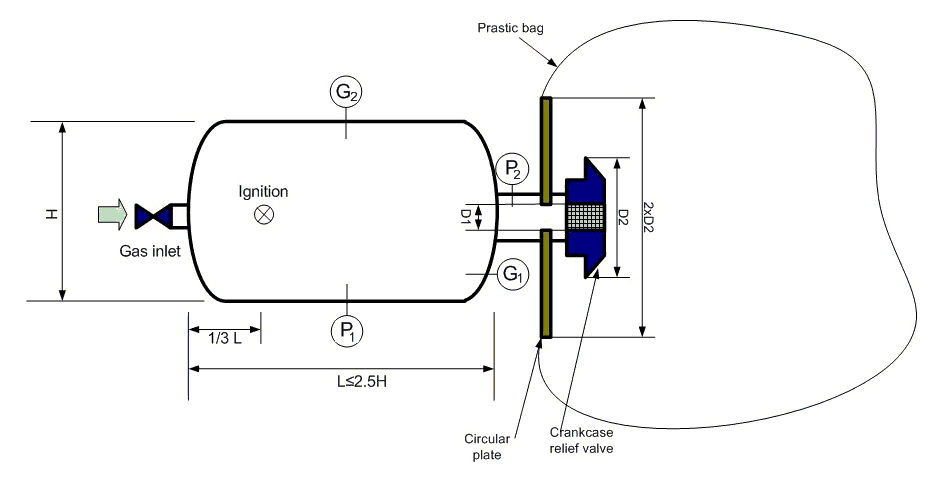 Fig 3.9.1 test vessel for explosion testing Fig 3.9.1 test vessel for explosion testing |
  | Explosion testing | General | (1) Where valves are to be installed on an engine or gear case with shielding arrangements to deflect the emission of explosion combustion products, the valves are to be tested with the shielding arrangements fitted. (2) Successive explosion testing to establish a valve's functionality is to be carried out as quickly as possible during stable weather conditions. (3) The pressure rise and decay during all explosion testing is to be recorded. (4) The external condition of the valves is to be monitored during each test for indication of any flame release by video and heat sensitive camera. (5) For obtaining the type approval, the explosion testing for each valves shall be done for three stages respectively. |
  | Explosion testing | Stage 1 | Two explosion tests are to be carried out with the flange opening fitted with the circular plate covered by a 0.05 mm thick polythene film. These tests establish a reference pressure level for determination of the effects of a relief valve in terms of pressure rise in the test vessel. |
  | Explosion testing | Stage 2 | (1) Two explosion tests are to be carried out on three different valves of the same size. Each valve is to be mounted in the orientation that it requires approval for installation i.e., in the vertical or horizontal position with the circular plate located between the valve and pressure vessel mounting flange. |

  **Table 3.9.1 Type test and acceptance criteria of Crankcase Explosion Relief valve (continued)**

  | Kinds |   | Requirements |
  | --- | --- | --- |
  | Explosion testing | Stage 2 | (2) The first of the two tests on each valve is to be carried out with a 0.05mm thick polythene bag, having a minimum diameter of three times the diameter of the circular plate and volume not less than 30% of the test vessel, enclosing the valve and circular plate. Before carrying out the explosion test the polythene bag is to be empty of air. The polythene bag is required to provide a readily visible means of assessing whether there is flame transmission through the relief valve following an explosion. (During the test, the explosion pressure will open the valve and some unburned methane/air mixture will be collected in the polythene bag. When the flame reaches the flame arrester and if there is flame transmission through the flame arrester, the methane/air mixture in the bag will be ignited and this will be visible.) (3) Provided that the first explosion test successfully demonstrated that there was no indication of combustion outside the flame arrester and there are no visible signs of damage to the flame arrester or valve, a second explosion test without the polythene bag arrangement is to be carried out as quickly as possible after the first test. During the second explosion test, the valve is to be visually monitored for any indication of combustion outside the flame arrester and video records are to be kept for subsequent analysis. The second test is required to demonstrate that the valve can still function in the event of a secondary crankcase explosion. (4) After each explosion, the test vessel is to be maintained in the closed condition for at least 10 seconds to enable the tightness of the valve to be ascertained. The tightness of the valve can be verified during the test from the pressure/time records or by a separate test after completing the second explosion test. |
  | Explosion testing | Stage 3 | Carry out two further explosion tests as described in Stage 1. These further tests are required to provide an average base line value for assessment of pressure rise recognising that the test vessel ambient conditions may have changed during the testing of the explosion relief valves in Stage 2. |
  | Assessment and records |   | (1) The valves to be tested are to have evidence of design appraisal/approval by the Society (2) The designation, dimensions and characteristics of the valves to be tested are to be recorded. This is to include the free area of the valve and of the flame arrester and the amount of valve lift at 0.2bar. (3) The test vessel volume is to be determined and recorded. (4) For acceptance of the functioning of the flame arrester there is not to be any indication of flame or combustion outside the valve during an explosion test. This should be confirmed by the test laboratory taking into account measurements from the heat sensitive camera. (5) The pressure rise and decay during an explosion is to be recorded, with indication of the pressure variation showing the maximum overpressure and steady underpressure in the test vessel during testing. The pressure variation is to be recorded at two points in the pressure vessel. (6) The effect of an explosion relief valve in terms of pressure rise following an explosion is ascertained from maximum pressures recorded at the centre of the test vessel during the three stages. The pressure rise within the test vessel due to the installation of a relief valve is the difference between average pressure of the four explosions from Stages 1 and 3 and the average of the first tests on the three valves in Stage 2. The pressure rise is not to exceed the limit specified by the manufacturer. (7) The valve tightness is to be ascertained by verifying from the records at the time of testing that an underpressure of at least 0.3bar is held by the test vessel for at least 10 seconds following an explosion. This test is to verify that the valve has effectively closed and is reasonably gas-tight following dynamic operation during an explosion. (8) After each explosion test in Stage 2, the external condition of the flame arrester is to be examined for signs of serious damage and/or deformation that may affect the operation of the valve. (9) After completing the explosion tests, the valves are to be dismantled and the condition of all components ascertained and documented. In particular, any indication of valve sticking or uneven opening that may affect operation of the valve is to be noted. Photographic records of the valve condition are to be taken and included in the report. |
- **4.** **Design series qualification**
  - **(1)** The qualification of quenching devices to prevent the passage of flame can be evaluated for other similar devices of identical type where one device has been tested and found satisfactory.
  - **(2)** The quenching ability of a flame arrester depends on the total mass of quenching lamellas/mesh. Provided the materials, thickness of materials, depth of lamellas/thickness of mesh layer and the quenching gaps are the same, then the same quenching ability can be qualified for different sizes of flame arresters subject to (a) and (b) being satisfied. However valves which could not be subjected to this method shall be verified by the method as deemed appropriate by the Society.
    Where:
    $n _{1}$ = total depth of flame arrester corresponding to the number of lamellas of size 1 quenching device for a valve with a relief area equal to $S _{1}$
    $n _{2}$ = total depth of flame arrester corresponding to the number of lamellas of size 2 quenching device for a valve with a relief area equal to $S _{2}$
    $A _{1}$ = free area of quenching device for a valve with a relief area equal to $S _{1}$
    $A _{2}$ = free area of quenching device for a valve with a relief area equal to $S _{2}$
  - **(3)** The qualification of explosion relief valves of larger sizes than that which has been previously satisfactorily tested in accordance with this Section can be evaluated where valves are of identical type and have identical features of construction subject to the following:
    - **(A)** The free area of a larger valve does not exceed three times + 5% that of the valve that has been satisfactorily tested.
    - **(B)** One valve of the largest size, subject to (A), requiring qualification is subject to satisfactory testing required by **2.** (2) and stage 2 explosion testing specified in **Table 3.9.1** except that a single valve will be accepted in item (1) of stage 2 explosion testing and the volume of the test vessel is not to be less than one third of the volume required in item (7) of test vessel specified in **Table 3.9.1**.
    - **(C)** The assessment and records are to be in accordance with the requirements specified in **Table 3.9.1** noting that item (6) will only be applicable to Stage 2 for a single valve.
  - **(4)** The qualification of explosion relief valves of smaller sizes than that which has been previously satisfactorily tested in accordance with this Sections can be evaluated where valves are of identical type and have identical features of construction subject to the following:
    - **(A)** The free area of a smaller valve is not less than one third of the valve that has been satisfactorily tested.
    - **(B)** One valve of the smallest size, subject to (A), requiring qualification is subject to satisfactory testing required by **2.** (2) and stage 2 explosion testing specified in **Table 3.9.1** except that a single valve will be accepted in item (1) of stage 2 explosion testing and the volume of the test vessel is not to be more than the volume required in item (7) of test vessel specified in **Table 3.9.1**.
    - **(C)** The assessment and records are to be in accordance with the requirements specified in **Table 3.9.1** noting that item (6) will only be applicable to Stage 2 for a single valve.
  - **(5)** Valves passed the type tests specified in this Section and valves having sizes between valves qualified according to the requirements in (3) and (4) may be qualified without type tests provided that calculation result of (2) is satisfactory.
- **5.** **Test report**
  The test facility is to deliver a full report that includes the following information and documents:
  - **(1)** Test specification.
  - **(2)** Details of test pressure vessel and valves tested.
  - **(3)** The orientation in which the valve was tested, (vertical or horizontal position).
  - **(4)** Methane in air concentration for each test.
  - **(5)** Ignition source
  - **(6)** Pressure curves for each test.
  - **(7)** Video recordings of each valve test.
  - **(8)** The assessment and records stated in **Table 3.9.1**

### Section 9-2 Explosion Relief Devices for Reciprocating Internal Combustion Engines Using Gas as Fuel (2024)

#### 911. General

- **1.** **Application**
  The requirements in this Section specify testing procedure for explosion relief devices for combustion air inlet manifold and exhaust gas manifold of reciprocating internal combustion engines using gas as fuel.
- **2.** **Definitions**
  - **(1)** Definitions addressing gas as fuel as given in **Pt 5, Annex 5-7, 1** (2) of the Guidance, Safety of Internal Combustion Engines Supplied with Low Pressure Gas, apply.
  - **(2)** **Explosion relief device (ERD)** means a device to protect a component against a determined overpressure in the event of a gas explosion. The device is fitted with a flame arrester and may be a valve, a rupture disc or other, as applicable.

#### 912. Data to be submitted

The following reference data are to be submitted to the Society in addition to those specified in **102.**

#### 913. Type tests

- **1.** **Test specimens**
  - **(1)** The ERD used for the explosion test is to be selected from the manufacturer’s production line by a representative of the Society:
  - **(2)** If necessary, an additional ERD may need to be selected for the demonstration of the opening pressure. The selected ERD has to be clearly marked.
  - **(3)** If applicable, the selected ERD is to be representative for the type range and operating conditions, for example:
    The selection of the representative ERD is subject to approval by the Society.
    - **(A)** Kind of ERD (valve, rupture disc, etc.),
    - **(B)** Mounting orientation (vertical, horizontal)
    - **(C)** Design of ERD (e.g., spring design, sealing)
    - **(D)** Design of flame arrester
    - **(E)** ERD intended to be fitted to the air inlet or exhaust gas manifold of an engine having a turbocharger with characteristics as per the testing conditions for test vessel in **Table 3.9.2**.
- **2.** **Demonstration of opening pressure**
  The ERD which has been selected is to be subjected to a pressure test at the manufacturer’s works to demonstrate that the static opening pressure is kept within the manufacturer’s specification and that the ERD is air tight at the maximum permissible operating pressure for at least 30 seconds.
- **3.** Type tests are to comply with the requirements given in **Table 3.9.2**.

  **Table 3.9.2 Type test for ERD**

  | Kinds | Requirements |
  | --- | --- |
  | Test facility | (1) The test facilities are to be accredited to a national or international standard, e.g. (KS Q) ISO/IEC 17025:2017, and are to be acceptable to the Society. (2) The test facilities are to be equipped so that they can perform and record explosion testing in accordance with this procedure. (3) The test facilities are to have equipment for controlling and measuring a methane gas concentration within a test vessel to an accuracy of ± 0.1%. (4) The test facilities are to be capable of effective point-located ignition of a methane/air mixture. (5) The test facility arrangements are to be capable of measuring and recording the pressure changes throughout an explosion test at a frequency recognizing the speed of the events during an explosion (10 kHz or above). (6) ERD test (stage 2) is to be documented by high speed (250 frames/s or above) video recording. The video recording shall be provided with a time stamp. |
  | Test vessel | (1) The test vessel is a simplified model of the air inlet or exhaust gas manifold. The free area of the connected turbo charger (compressor or turbine wheel) is to be considered. (2) The test vessel is to comply with the following requirements: (A) The shape of the test vessel is to correspond to a pipe with L/D ≥ 10. (B) The test vessel is to be equipped with a rupture disc at one front end to simulate the turbo charger. The relief area of the rupture disc is to be in relationship to the test vessel diameter based on turbocharger manufacturer data for an equivalent free area of compressor or turbine wheel. The opening pressure is to be ± 10% of the static opening pressure of the ERD. (C) The volume of the test vessel is to comply with the specific relief area of the ERD of 700 cm²/m³ ± 15%. (D) The test vessel is to be provided with all necessary flanges and connection to mount the ERD in the intended position, to mount a rupture disc as turbo charger simulation, to connect the Methane-air mixture supply and the measurement equipment. (E) The ignition is to be made at the middle of the test vessel. (F) The test vessel is to be designed to verify a homogeneous air/methane mixture inside the vessel. (G) The test vessel is to have connections for measuring the pressure in the test vessel in at least two positions, one at the ERD and the other at the test vessel center. (H) The test vessel is to have a design pressure of not less than the maximum explosion pressure of a stoichiometric air/methane mixture at test conditions in explosion test method. (I) The test vessel configuration is subject to approval by the Society. |

  **Table 3.9.2 Type test for ERD** **(continued)**

  | Kinds | Requirements |
  | --- | --- |
  | Test vessel | (3) Typical test vessel configurations All test vessel configurations to be equipped with a rupture disc (1) (turbo charger simulation) at one front end. The ignition is in the centre of the test vessel (↯). The pressure sensors are mounted at the valve flanges (p1) and at the test vessel centre (p2). The measuring of the methane concentration to verify a homogeneous air/methane mixture can be performed at both ends of the test vessel, e.g. (c1) and (c2). 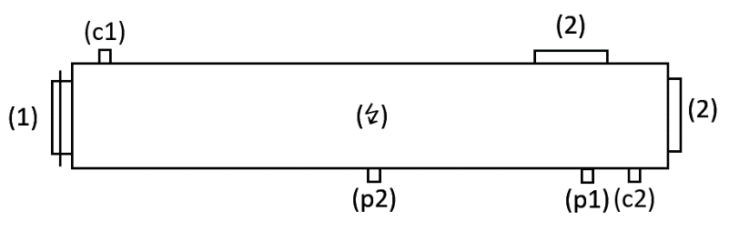 **Fig 3.9.2 Configuration without ERD (flanges for ERDs closed (2))**  **Fig 3.9.2 Configuration without ERD (flanges for ERDs closed (2))** 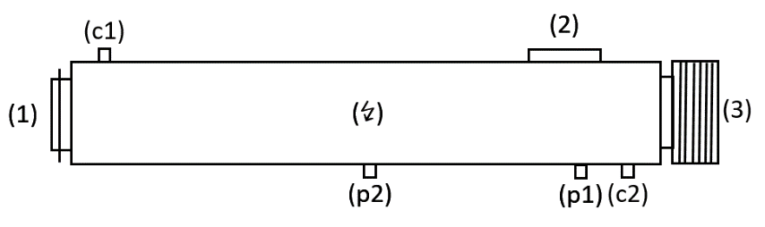 **Fig 3.9.3 Configuration with ERD (3) mounted at the front end of the test vessel**  **Fig 3.9.3 Configuration with ERD (3) mounted at the front end of the test vessel** 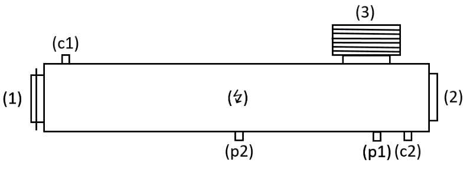 **Fig 3.9.4 Configuration with ERD (3) mounted on top of the test vessel**  **Fig 3.9.4 Configuration with ERD (3) mounted on top of the test vessel** |
  |  |   |
  | **Fig 3.9.2 Configuration without ERD (flanges for ERDs closed (2))** |   |
  |  |   |
  | **Fig 3.9.3 Configuration with ERD (3) mounted at the front end of the test vessel** |   |
  |  |   |
  | **Fig 3.9.4 Configuration with ERD (3) mounted on top of the test vessel** |   |

  **Table 3.9.2 Type test for ERD** **(continued)**

  | Kinds |   | Requirements |
  | --- | --- | --- |
  | Explosion test process | General | (1) The explosion testing is to be performed in two stages below for each ERD that is required to be approved as type tested. (2) The explosion testing is to be witnessed by a Society surveyor. (3) Calibration records for the instrumentation used to collect data are to be presented to, and reviewed by, the attending surveyor. |
  | Explosion test process | Reference test (stage 1) | (1) Explosion test without ERD (2) Two explosion tests are to be carried out in the test vessel without ERD. The test vessel configuration is shown in Fig 3.9.2. (3) The aim of this test is to establish a reference pressure level in the test vessel which can be used for determination of the capability of a relief valve in terms of pressure relief. |
  | Explosion test process | ERD test (stage 2) | (1) Explosion test with ERD (2) Two explosion tests are to be carried out in the test vessel with the same ERD at the required position. If the ERD is a rupture disc with flame arrester, the rupture disc shall be replaced. (3) If shielding arrangements to deflect the emission of explosion combustion products at the ERD are intended, the ERD are to be tested with the shielding arrangements fitted. The test vessel configuration is shown in Fig 3.9.3 or Fig 3.9.4. |
  | Explosion test method |   | (1) The test conditions shall comply with the intended use of the ERD, such as: (A) Pipe diameter (B) Operating pressure (C) Operating temperature (D) Installation orientation (2) All explosion tests are to be carried out using an air and methane mixture with a volumetric methane concentration of 9.5% ± 0.5%. A homogeneous air/methane mixture inside the test vessel is to be verified. The concentration of methane shall not differ by more than 0.5%. (3) The initial pressure in the test vessel is to be the specified maximum operating pressure of the ERD. (4) The initial temperature in the test vessel is to be the specified maximum operating temperature of the ERD. (5) If the initial pressure and/or initial temperature deviate from the design limits, the ERD manufacturer shall prove the acceptability of this deviation either using standards or generally applicable calculation methods. (6) The ignition is to be made using an explosive charge of 50 - 100 Joule. |

  **Table 3.9.2 Type test for ERD** **(continued)**

  | Kinds | Requirements |
  | --- | --- |
  | Explosion test method | (7) Successive explosion testing to establish an ERD functionality is to be carried out as quickly as possible during stable weather conditions. (8) The pressure rise and decay during all explosion testing is to be recorded. (9) The effect of an ERD in terms of pressure relief following an explosion is ascertained from maximum pressure recorded at the centre of the test vessel during the two stages. The pressure relief within the test vessel due to the installation of an ERD is the difference between average pressure of the two explosions of the reference test (stage 1) and the average of the two explosions of the ERD test (stage 2). (10) For acceptance of correct functioning of the flame arrester, there is to be no indication of flame or combustion outside of the ERD during ERD test (stage 2). This is to be monitored by a high-speed video camera, for which ambient light conditions are to be considered to maximise the potential for flame/combustion detection. The use of a dark, ideally matt finish, background and an avoidance of direct light onto the video camera monitored area are recommended. (11) After each ERD test (stage 2), the external condition of the flame arrester to be examined for signs of damage and/or deformation that may affect the operation of the ERD. |
  | Check of ERD components | After completing the explosion tests, the ERDs are to be dismantled and the condition of all components are to be ascertained and documented. |
- **4.** **Test report**
  - **(1)** A complete test report for the demonstration of opening pressure in **2** and the explosion test in **3** has to be submitted to the Society.
  - **(2)** The reports shall include respective information according to the requirements in **913.,** as applicable:
    - **(A)** Test specimens
    - **(B)** Test facility, including measuring equipment and test vessel
    - **(C)** Measuring results (pressures, temperatures, flame velocities, volumetric methane concentration, ambient conditions etc.)
    - **(D)** Video documentation of explosion tests
    - **(E)** Photo documentation of ERD components

### Section 10 Crankcase Oil Mist Detection and Alarm Equipment

#### 1001. Application

The requirements in this Section apply to tests and inspections for the type approval of crankcase oil mist detection and alarm equipment in accordance with the requirements of **Pt 5, Ch 2, 203. 10.** of the Rules.

#### 1002. Data to be submitted

The following reference data are to be submitted to the Society in addition to those specified in **102.**

#### 1003. Design requirements

Oil mist detection arrangements are to be designed and fitted in accordance with the following requirements.

#### 1004. Type tests

- **1.** Approval tests are to comply with the requirements given in **Table 3.10.1.**
- **2.** **Test report**
  The test house is to provide a full report that includes the following information and documents:
  - **(1)** Test specification.
  - **(2)** Details of devices tested.
  - **(3)** Results of tests
    To include a declaration by the manufacturer of the oil mist detector of its:

    **Table 3.10.1 Type tests of crankcase oil mist detection and alarm equipment**

    | Kinds | Requirements |
    | --- | --- |
    | Test facilities | (1) A full range of facilities for carrying out the environmental and functionality tests required by this Section shall be available and be acceptable to the Society. (2) The test house that verifies the functionality of the equipment is to be equipped so that it can control, measure and record oil mist concentration levels in terms of mg/L to an accuracy of ± 10%. (3) When verifying the functionality, test houses are to consider the possible hazards associated with the generation of the oil mist required and take adequate precautions. It will be accepted the use of low toxicity, low hazard oils as used in other applications, provided it is demonstrated to have similar properties to SAE 40 monograde mineral oil specified. |
    | Environmental tests | (1) Panel of the oil mist detection arrangement is to be type tested in accordance with Table 3.23.1 of Ch 3, Sec. 23 of the Guidance. However the test items are to be electrical power supply failure test, power supply variation test, dry heat test, damp heat test, vibration test, EMC test, insulation resistance test, high voltage test and, static and dynamic inclinations (if moving parts are contained). (2) Detectors are to be type tested in accordance with Table 3.23.1 of Ch 3, Sec 23 of the Guidance. However the test items are to be electrical power supply failure test, power supply variation test, dry heat test, damp heat test, vibration test, EMC test where susceptible, insulation resistance test, high voltage test and, static and dynamic inclinations. |
    | Functional tests | (1) All tests to verify the functionality of crankcase oil mist detection and alarm equipment are to be carried out in accordance with from (2) to (6) with an oil mist concentration in air, known in terms of mg/L to an accuracy of ± 10%. (2) The concentration of oil mist in the test vessel is to be measured in the top and bottom of the vessel and is not to differ by more than 10 %. (3) The oil mist detection arrangements are to be capable of detecting oil mist in air concentrations of followings. (A) between 0 and 10% of the lower explosive limit (LEL) or (B) between 0 and a percentage of weight of oil in air determined by the Manufacturer based on the sensor measurement method (e.g. obscuration or light scattering) that is acceptable to the Society taking into account the alarm level specified in (3). The LEL corresponds to an oil mist concentration of approximately 50 $\mathrm{mg}/L$ (13 % concentration of oil in air mixture, 4.1% weight of oil in air mixture). Refer to Fig 3.10.1. 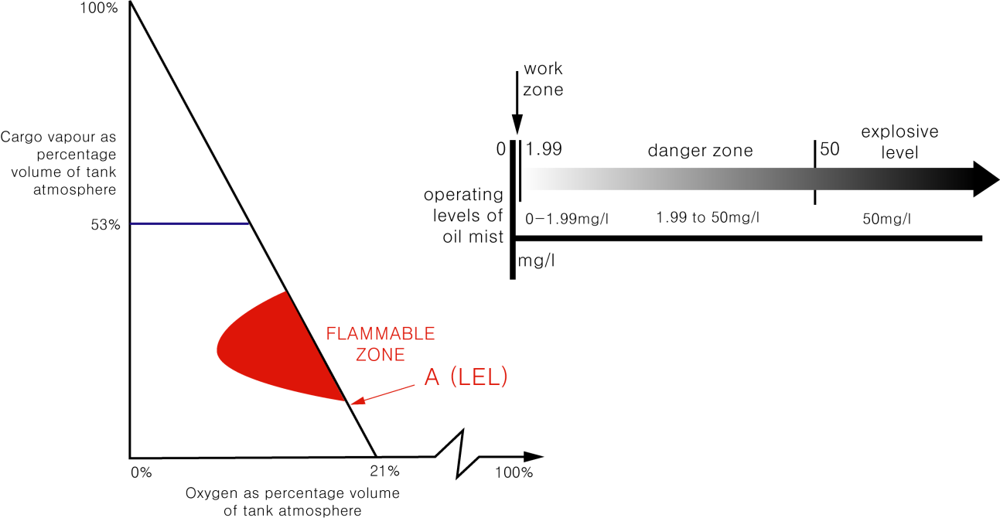 **Fig 3.10.1 Explosion curve of oil-air mixture and operating levels of oil mist** |

    **Table 3.10.1 Type tests of crankcase oil mist detection and alarm equipment (continued)**

    | Kinds | Requirements |
    | --- | --- |
    | Functional tests | (4) The alarm set point for oil mist concentration in air is to provide an alarm at a maximum level corresponding to not more than 5 % of the LEL or approximately 2.5 mg/L. (5) Where alarm set points can be altered, the means of adjustment and indication of set points are to be verified against the equipment manufacturer’s instructions. (6) The performance of the oil mist detector in mg/L is to be demonstrated. This is to include the range, resolution, sensitivity. (7) Where oil mist is drawn into a detector via piping arrangements, the time delay between the sample leaving the crankcase and operation of the alarm is to be determined for the longest and shortest lengths of pipes recommended by the manufacturer. The pipe arrangements are to be in accordance with the manufacturer’s instructions/recommendations. Piping is to be arranged to prevent pooling of oil condensate which may cause a blockage of the sampling pipe over time. (8) It is to be demonstrated that the openings of detector equipment does not become occluded or blocked under continuous splash and spray of engine lubricating oil, as may occur in the crankcase atmosphere. Testing is to be in accordance with arrangements proposed by the manufacturer and agreed by the Society. The temperature, quantity and angle of impact of the oil to be used is to be declared and their selection justified by the manufacturer. (9) Detector equipment may be exposed to water vapour from the crankcase atmosphere which may affect the sensitivity of the equipment and it is to be demonstrated that exposure to such conditions will not affect the functional operation of the detector equipment. Where exposure to water vapour and/or water condensation has been identified as a possible source of equipment malfunctioning, testing is to demonstrate that any mitigating arrangements such as heating are effective. Testing is to be in accordance with arrangements proposed by the manufacturer and agreed by the Society. (10) It is to be demonstrated that an indication is given where lenses fitted in the equipment and used in determination of the oil mist level have been partially obscured to a degree that will affect the reliability of the information and alarm indication. |
    | Detectors and alarm equipment to be tested | (1) The detectors and alarm equipment selected for the type testing are to be selected from the manufacturer’s normal production line in the presence of Surveyor. (2) Two detectors are to be tested. One is to be tested in clean condition and the other in a condition representing the maximum level of lens obscuration specified by the manufacturer. |
    | Test method | (1) The ambient temperature in and around the test chamber is to be at 25 $±$ 10${}^{\circ}\mathrm{C}$. (2) Oil mist is to be generated with suitable equipment using an SAE 40 monograde mineral oil or equivalent and supplied to a test chamber. The selection of the oil to be used is to take into consideration risks to health and safety, and the appropriate controls implemented. A low toxicity, low flammability oil of similar viscosity may be used as an alternative. The oil mist produced is to have an average (or arithmetic mean) droplet size not exceeding 5$\mathrm{\mu} m$. The oil droplet size is to be checked using the sedimentation method or an equivalent method to a relevant international or national standard. If the sedimentation method is chosen, the test chamber is to have a minimum height of 1$\mathrm{m}$ and volume of not less than 1$\mathrm{m} ^{3}$. (3) The oil mist concentrations used are to be ascertained by the gravimetric deterministic method or equivalent. Where an alternative technique is used its equivalence is to be demonstrated. (For this test, the gravimetric deterministic method is a process where the difference in weight of a 0.8$\mathrm{\mu} m$ pore size membrane filter is ascertained from weighing the filter before and after drawing 1L of oil mist through the filter from the oil mist test chamber. The oil mist chamber is to be fitted with a recirculating fan.) (4) Samples of oil mist are to be taken at regular intervals and the results plotted against the oil mist detector output. The oil mist detector is to be located adjacent to where the oil mist samples are drawn off. |

    **Table 3.10.1 Type tests of crankcase oil mist detection and alarm equipment (continued)**

    | Kinds | Requirements |
    | --- | --- |
    | Test method | (5) The results of a gravimetric analysis are considered invalid and are to be rejected if the resultant calibration curve has an increasing gradient with respect to the oil mist detection reading. This situation occurs when insufficient time has been allowed for the oil mist to become homogeneous. Single results that are more than 10% below the calibration curve are to be rejected. This situation occurs when the integrity of the filter unit has been compromised and not all of the oil is collected on the filter paper. (6) The filters require to be weighed to a precision of 0.1$\mathrm{mg}$ and the volume of air/oil mist sampled to 10$\mathrm{mL}$. (7) Oil mist detection equipment is to be tested in the orientation (vertical, horizontal or inclined) in which it is intended to be installed on an engine or gear case as specified by the equipment manufacturer. (8) Where sensitivity levels can be adjusted, testing is to be carried out at the extreme and mid-point level settings. |
    - **(A)** Performance (mg/L)
    - **(B)** Accuracy, of oil mist concentration in air
    - **(C)** Precision, of oil mist concentration in air
    - **(D)** Range, of oil mist detector
    - **(E)** Resolution, of oil mist detector
    - **(F)** Response time, of oil mist detector
    - **(G)** Sensitivity, of oil mist detector
    - **(H)** Obscuration of sensor detection, declared as percentage of obscuration. (0% totally clean, 100% totally obscure)
    - **(I)** Detector failure alarm

### Section 11 Exhaust Gas Turbochargers

#### 1101. Application

The requirements in this Section apply to the Type Approval of exhaust gas turbo-chargers (hereinafter referred to as the turbo-chargers in this Section) in accordance with the requirements in Pt 5, Ch 2 211. 1 (1) of the Rules. Turbo-chargers are to be type approved, either separately or as a part of an engine. The requirements are written for exhaust gas driven turbo-chargers, but apply in principle also for engine driven chargers. *(2019)*

#### 1102. Data to be submitted

The data in **Pt 5, Ch 1, 211.** are to be submitted to the Society in addition to those specified in **102.** *(2017)*

#### 1103. Type tests

Type tests are to be carried out for Categories B and C. The type test for a generic range of turbo-chargers may be carried out either on an engine (for which the turbo-charger is foreseen) or in a test rig.

- **1.** Turbo-chargers for the low, medium, and high-speed engines are to be subjected to at least 500 load cycles at the limits of operation. This test may be waived if the turbo-charger together with the engine is subjected to this kind of low cycle testing. The suitability of the turbo-charger for such kind of operation is to be preliminarily stated by the manufacturer. The rotor vibration characteristics shall be measured and recorded in order to identify possible sub-synchronous vibrations and resonances.
- **2.** The type test shall be completed by a hot running test at maximum permissible speed combined with maximum permissible temperature for at least one hour. After this test, the turbocharger shall be opened for examination, with focus on possible rubbing and the bearing conditions.

### Section 12 Hydraulic Motors and Hydraulic Pumps

#### 1201. Application

- **1.** Where the manufacturer obtained the Approval of Quality Assurance System specified in **Ch 5** of the Guidance apply to the Type Approval of individual units of hydraulic pumps and hydraulic motors intended to be used for steering gear, windlass, cargo winch and other deck machinery, opening/closing appliance of watertight door, side thruster and other auxiliaries for essential use, manufactured at the same manufacturing plant by mass production methods, in principle, the Society apply to the requirements of this Section for the tests and inspection of them.
- **2.** Hydraulic motors and hydraulic pumps in this Section mean those in the types of gear, screw, vane and piston.

#### 1202. Type tests

- **1.** The type tests are to be carried out on the hydraulic motors and hydraulic pumps random selected one for each type from the production line.
- **2.** The items of the type tests are to be, in principle, as follows:
  - **(1)** Construction instruction
  - **(2)** Pressure test
  - **(3)** Operational performance test *(2022)*
    - **(A)** Performance test (refer to KS V6731 (Shop test method for hydraulic pump at hydraulic steering gears for ships), etc.)
    - **(B)** Continuous running test (refer to KS V6731 (Shop test method for hydraulic pump at hydraulic steering gears for ships), etc.)
    - **(C)** Vibration test (refer to (KS B) ISO 10055 (Mechanical vibration-Vibration testing requirements for shipboard equipment and machinery components), etc.)
    - **(D)** Temperature rise test
    - **(E)** Relief valve test
  - **(4)** Overhaul inspection of major components after operational performance tests
    Casing, cover, gear, screw, shaft, bearing and relief valve
    Casing, cover, vane, rotor, bush, cam ring, driving shaft and relief valve
    Driving shaft, bearing piston, rod, cylinder block, valve plate, cam plate, pump casing, bearing casing, cover, flexible shaft coupling, controller and servo system
    Driving shaft, crankshaft, bearing, piston, rod, side guide, cam curve, pump casting, slide block, cylinder casting, cover, relief valve and servo system
    - **(A)** Gear type and screw type
    - **(B)** Vane type
    - **(C)** Axial piston type
    - **(D)** Radial piston type
  - **(5)** Other test required by the Society
- **3.** Representative type of hydraulic pumps and hydraulic motors intended to be used for steering gear is to be performed continuous running test for 100 hours. Testing methods are to comply with the requirements specified in **Pt 5, Ch 7, 501. 3** of the Rules.

#### 1203. Tests of individual Hydraulic Motors and Hydraulic Pumps after approval

Construction instruction, pressure test and performance test of safety devices during operation are to be carried out. In case where noise and/or vibration which is required to be ascertained is occurred, overhaul inspection may be requested by the Society.

### Section 13 Air Compressors

#### 1301. Application

- **1.** Where the manufacturer obtained the Approval of Quality Assurance System specified in **Ch 5** of the Guidance apply to the Type Approval of air compressors manufactured at the same manufacturing plant by mass production methods, in principle, the Society apply to the requirements of this Section for the tests and inspection of air compressors.
- **2.** The air compressors to which the requirements of this Section apply are those used for the starting of reciprocating internal combustion engines, controls of machinery and equipment, power sources and general service, and are of the piston type or vane type.

#### 1302. Type tests

- **1.** The type tests are to be carried out on the air compressors random selected one for each type from the production line.
- **2.** The items of the type test are to be, in general, as follows:
  - **(1)** Construction instruction
  - **(2)** Leakage test and pressure test
  - **(3)** Operational performance test
    - **(A)** Continuous running test (for one hour)
    - **(B)** Performance test
    - **(C)** Operational test of safety devices
  - **(4)** Overhaul inspection of major components after operational tests
    Cylinder head, cylinder, piston, piston pin, connecting rod, crankshaft, bearing (small end and big end bearing, main bearing), crankcase, suction valve, discharge valve, intercooler, after cooler, attached pump (lubricating oil and cooling water), outlet non-return valve and relief valve
  - **(5)** Other tests required by the Society

#### 1303. Tests of individual Air Compressors after approval

Construction instruction, pressure test and performance test of safety devices during operation are to be carried out. In case where noise and/or vibration which is required to be ascertained is occurred, overhaul inspection may be requested by the Society.

### Section 14 Safety Valves

#### 1401. Application

The requirements in this Section apply to tests and inspection for the type approval according to the following:

#### 1402. Data to be submitted

The sectional assembly drawings of the safety valve are to be submitted to the Society in addition to those specified in **102.**

#### 1403. Type tests

- **1.** **Test**
  - **(1)** The test is to be carried out according to the following. The test fluid is to be steam, air or gas having known property and the fluid at back pressure side is to be atmosphere. *(2023)*
    - **(A)** The safety valves tested are to be representative of the design, pressure and size range of valves for which operating characteristics are determined within the capability of the test laboratory. The ratio of valve inlet to flow area and the ratio of flow area to valve outlet shall be taken into account.
    - **(B)** For size ranges containing seven or more sizes in same design series, tests are to be carried out on three sizes. If the size range contains not more than six sizes, the number of sizes tested may be reduced to two. When a size range is extended so that the safety valves type approved previously are no longer representative of the range, further tests on the appropriate number of sizes are to be carried out.
    - **(C)** The tests are to be carried out using three significantly different springs for each size of valve tested. This may be achieved by testing either one valve with three significantly different springs or three valves of the same size with three significantly different springs. Each test is to be carried out a minimum of three times in order to establish and confirm acceptable reproducibility of performance. Tests at the minimum design set pressure are to be carried out.
    - **(D)** In the case of valves of which one size only at various pressure ratings is being manufactured, tests are to be carried out using four different springs, which are to cover the range of pressures for which the valve is to be used.
  - **(2)** Gauges and measuring procedures are to be in accordance with the requirements given in **Table 3.14.1**

    **Table 3.14.1 Gauges and measuring procedures**

    | measuring item | measuring procedures |
    | --- | --- |
    | Atmospheric pressure | Atmospheric pressure is to be measured by the gauge with error range of 33.3 Pa or less. |
    | Temperature | Temperature is to be measured by the calibrated thermocouples or resistance thermometer in the inside of pipes or thermometer case with attention to thermal conduction and radiation. |
    | Pressure | The static pressure not more than 0.1 MPa is to be measured by manometer, and the static pressure over 0.1 MPa or differential pressure is to be measured by a calibrated Bourdon pressure gauge. |
    | Flow rate | The orifice or nozzle according to national standard, etc., is to be used to measure flow rate, and the choking diameter ratio of orifice to pipe is to be not more than 0.7. The differential pressure between before and after orifice is to be 100 ~ 2,500 *mm* H_2O, and the test is to be carried out in a steady flow condition (for fluctuation over 2 %, the cause is to be checked and calibrated). |
    | Head | The head is to be measured by calibrated 0.01 *mm* level dial gauge, and the head limiting device is to be attached at the valve stem to prevent exceeding design head. |
    | Steam condition | (a) The temperature, pressure and humidity of steam in the safety valve inlet and atmospheric pressure are to be measured. (b) The humidity of steam is to be measured by well-insulated reducing type calorimeter and thermometer after reducing pressure. However, the measurement is not to be applied to steam having more than 10 % humidity. And the superheating of superheated steam at outlet of calorimeter may be 4.5 °C or over. |

    **Table 3.14.1 Gauges and measuring procedures (continued)**

    | measuring item | measuring procedures |
    | --- | --- |
    | Steam condition | (c) The humidity of steam is to be obtained from $h - s$ diagram or the enthalpy obtained from the following formula according to the steam table. Humidity (%) = 100 - $x$ where, $x$ : Dryness(%), $x = (h _{x} - h _{1} ^{ } ' ) / h _{1 r} \times 100$ $h _{x}$ : Enthalpy of superheated steam at atmosphere and steam temperature measured by choking type calorimeter ($\mathrm{kcal}/kg$) $h _{ 1 } '$ : Enthalpy of saturated water at steam pressure measured at inlet of choking type calorimeter ($\mathrm{kcal}/kg$) $h _{1 r}$ : Evaporation heat at steam pressure measured at inlet of choking type calorimeter ($\mathrm{kcal}/kg$) (d) The temperature measured by choking type calorimeter is not to have a difference of 0.5 °C or over at normal condition. |
    | Air condition | The air temperature and pressure at safety valve inlet are to be measured, and the air is to be free from dust and oil. |
    | Gas condition | The measurement of gas condition having known property is to be carried out according to the air condition measurement above. |
  - **(3)** Test procedures by steam is to be in accordance with the requirements given in **Table 3.14.2**

    **Table 3.14.2 Test procedure by steam**

    | measuring item | measuring procedures |
    | --- | --- |
    | Test apparatus | (a) Test apparatus is to be able to warm up insulated parts of the apparatus and pipes sufficiently and provided with a drain valve in its lowest part. (b) Test apparatus is to be provided with a pressure gauge, a thermometer and a head measuring device at safety valve inlet. When using saturated steam, reducing type calorimeter is to be fitted for steam humidity measurement. |
    | Test preparation | Before the test, the drainage in test apparatus is to be fully discharged. |
    | Test of valve | (a) The pressure at safety valve inlet is to be maintained to the pressure for decision of blow-off rate until each gauge being steady state. (b) The pressure at valve inlet, indicating value of flow meter, head of valve and steam temperature and humidity are to be measured when each gauge is in a steady state. |
  - **(4)** Test procedures by air is to be in accordance with the requirements given in **Table 3.14.3**

    **Table 3.14.3 Test procedure by air**

    | measuring item | measuring procedures |
    | --- | --- |
    | Test apparatus | (a) A drain valve is to be fitted in the lowest part of the apparatus or pipes and is to be observed for occurrence of frost in the test. (b) Pressure gauge and thermometer for measurement of air at safety valve inlet and head measuring apparatus are to be fitted. |
    | Test preparation | Before the test, the drainage in test apparatus is to be fully discharged. |
    | Test of valve | (a) Pressure at the safety valve inlet is to be maintained to the pressure for determination of blow-off rate until each gauge is in a steady state. (b) The pressure and temperature at the valve inlet, indicating value of flow meter and head of valve are to be measured when each gauge is in a steady state. |
  - **(5)** Determination of blow-off rate and nominal blow-off coefficient (K)
    $Q _{ma} = \alpha \frac{\pi}{4} d ^{2} \sqrt {2 \Delta p \rho _{0}} \times 3600$
    where,
    $Q _{ ma}$ : Flow rate at orifice inlet(kg/h)
    $\alpha$ : Flow rate coefficient
    $d$ : Reduced hole diameter in operation state (m)
    $\Delta p$ : Pressure difference between before and after orifice (Pa)
    $\rho _{0}$ : Fluid density at orifice inlet ($\mathrm{kg}/m ^{3}$), for air, $\rho _{0} = 1.318 \times (273/t) \times p _{0} \times 10 ^{-5}$
    $T$ : Absolute temperature of fluid at orifice inlet ($K$)
    $p _{0}$ : Absolute pressure of fluid at orifice inlet (Pa)
    Theoretical blow-off rate is to be determined by the following formula (i) or (ii).
    $Q _{mt} =A \sqrt {\frac{2k}{k-1} \frac{p _{1}}{v _{1}} \left\{ \left( \frac{p _{2}}{p _{1}} \right) ^{2/k} - \left( \frac{p _{2}}{p _{1}} \right) ^{(k+1)/k} \right\} } \times 3.6 \times 10 ^{-3}$
    However, in case of $p _{2} \leq p _{1} \left\{ \frac{2}{k+1} \right\} ^{k/(k-1)}$
    $Q _{mt} =A \sqrt {k \left( \frac{2}{k+1} \right) ^{(k+1)/(k-1)} } \times \frac{p _{1}}{\sqrt {RT _{1}}} \times 3.6 \times 10 ^{-3}$
    where,
    $Q _{ m t}$: Theoretical blow-off rate (kg/h)
    $A$ : Actual blow-off area of test valve ($\mathrm{mm} ^{2}$)
    $k$ : Adiabatic exponent of fluid at valve inlet, for air, $k$ may be 1.40.
    $p _{1}$ : Absolute pressure at valve inlet (Pa)
    $p _{2}$ : Absolute pressure at valve outlet (Pa)
    $v _{1}$ : Specific volume of fluid at valve inlet ($\mathrm{m} ^{3} /kg$)
    $R$ : Gas constant of fluid (*J*/($\mathrm{kg} \cdot K$))
    $T _{1}$ : Absolute temperature at valve inlet (K)
    (steam) $Q _{ m t} = 0.5145 \times A _{1} (10.2 p + 1) \times C$
    where,
    $Q _{ m t}$ : Molecular weight of gas (kg/h)
    $A _{1}$ : Actual blow-off area of test valve ($\mathrm{mm} ^{2}$)
    $p$ : Steam pressure at valve inlet (MPa gauge)
    $C$ : Factor depending on steam property according to the requirement of **4.2.2** of KS B 6352
    (gas) $Q _{mt} =A _{2} (10.2p+1) \sqrt {\frac{M}{ZT}} \times C '$
    where,
    $M$ : Molecular weight of gas
    $A _{2}$ : Actual blow-off area of test valve($\mathrm{mm} ^{2}$)
    $Z$ : Compression coefficient according to the requirement of **4.2.2** of KS B 6352, for air, $Z$ = 1
    $T$ : Absolute temperature of gas (K)
    $C '$ : Factor depending on vapor property according to the requirement of **4.2.2** of KS B 6352
    $K ' = \frac{Q _{ma}}{Q _{mt}}$
    where,
    $Q _{ m a}$ : Actual blow-off rate (kg/h)
    $Q _{ m t}$ : Theoretical blow-off rate (kg/h)
    When blow-off coefficient obtained from (i) above satisfy the requirement of (5) (A) (d) above, the arithmetic mean value is to be the nominal blow-off coefficient of each safety valve.
    $K= \sum _{l} ^{n} K ' /n$
    where,
    $n$ : Number of trial
    - **(A)** The condition for determination of blow-off coefficient
      - **(a)** The measured value, in order to evaluate blow-off coefficient (K), is to be compensated for gauge error, and not to be much fluctuation.
      - **(b)** In case test fluid is humid saturated steam, the measured value is to be compensated for humidity.
      - **(c)** The test pressure and nominal diameter of test valve refered to (1) (B) (a) and (b) is to be selected in large range as practicable.
      - **(d)** Each blow-off coefficient (K') obtained from measurement of actual blow-off rate is to be within a range of ± 5 % of their average value.
      - **(e)** The measurement of actual blow-off rate is, in principle, to be carried out one time in 1 test condition, and if there is any doubt about the measured value, measurement may be added 2 times in same condition. The measured value K in this case is to be used for the evaluation of (d) above. However, if (d) above is not satisfied, the corrected safety valve or substitute of the same design condition may be tested additionally.
      - **(f)** The standard deviation of actual blow-off rate obtained from (B) (a) above is to be not more than 2.5 %.
    - **(B)** Determination of blow-off rate and blow-off coefficient
      - **(a)** Determination of blow-off rate by reducing apparatus
      - **(i)** The measurement of blow-off rate by reducing apparatus is to be in accordance with (2) above, and in principle, to be calculated by the following formula, and may be determined by other national standard.
        - **(ii)** The calculated flow rate is to be considered for standard deviation which may be obtained according to the requirement of 3.6 of *KS A* 0612 or equivalent.
      - **(b)** Theoretical blow-off rate formula
      - **(i)** Case of calculation with assumption that ideal gas having frictionless flow in safety valve, flow coefficient of 1.0 and constant specific heat having isentropic process is blow-off.
        - **(ii)** Case of absolute pressure at valve outlet not much more than critical absolute pressure at valve inlet for steam or gas
      - **(c)** Calculation of blow-off coefficient and nominal blow-off coefficient
      - **(i)** Determination of blow-off coefficient ($K '$) by measurement of actual blow-off rate
        - **(ii)** Determination of nominal blow-off coefficient ($K$)
  - **(6)** Calculation of nominal blow-off rate
    $Q _{m} = Q _{ m t} \times 0.9 K$
    The conversion may be in accordance with the following when applying pressure is not less than measured pressure.
    $Q _{mg} = \frac{Q _{ms}}{0.5145C \cdot p _{s}} \cdot C ' p _{G} \sqrt {\frac{M _{G}}{Z _{G} T _{G}}}$
    $Q _{m2} = \frac{Q _{m1}}{C ' _{1} p _{1} \sqrt {\frac{M _{1}}{Z _{1} T _{1}}}} \cdot C ' _{2} p _{2} \sqrt {\frac{M _{2}}{Z _{2} T _{2}}}$
    where,
    $Q _{m}$ : Actual blow-off rate (kg/h)
    $p$ : Absolute pressure of fluid at valve inlet (MPa)
    $G$ : Gas
    $s$ : Steam
    1 : Air or gas having known property measured blow-off rate
    2 : Gas having known property in order to convert blow-off rate
    - **(A)** Calculation of nominal blow-off rate ($Q _{m}$)
    - **(B)** Conversion of blow-off rate of gas having known property
      - **(a)** Case of conversion from value for steam
      - **(b)** Case of conversion from value for air or gas having known property

### Section 15 Machinery and Equipment for Ships

#### 1501. Application

- **1.** The requirements of this Section apply to tests and inspection for the approval of the machinery and equipment listed below for which approval of the Society is to be obtained in advance before being fitted in ships. *(2018)*
  - **(1)** Kind 1 propeller shafts with corrosion resisting (**Pt 5, Ch 1, 102. 3** of the Rules)
  - **(2)** Resin Chock (**Pt 5, Ch 2, 202. 1** (3), **Pt 5, Ch 3, 103. 1** and **Pt 5, Ch 7, 106.** of the Rules)
  - **(3)** Resilient mountings for reciprocating internal combustion engine (Pt 5, Ch 2, 202. 1 (3) of the Rules). In addition, this guidance may apply for type approval of the resilient mountings for gear transmissions, generators, steam turbines, gas turbines and auxiliary machinery at the request of the manufacturers. *(2020)*
  - **(4)** Stern tube bearings (**Pt 5, Ch 3, 206. 1** of the Rules)
  - **(5)** Stern tube sealing devices (**Pt 5, Ch 3, 206. 2** of the Rules)
  - **(6)** Flexible couplings (**Pt 5, Ch 3, 406. 2** of the Rules)
  - **(7)** Pipes of special materials **(Pt 5, Ch 6, 102. 5. (1)** of the Rules except for plastic pipes)
  - **(8)** Cargo pipings, pumps and cargo hoses of ships carrying liquefied gases in bulk (**Pt 7, Ch 5, 513.** of the Rules)
  - **(9)** Fuel pipings and pumps for ships using low-flashpoint fuels (**Ch 16, 701.** and **703.** of Rules for Ships using Low-flashpoint Fuels)
  - **(10)** Expansion bellows for fuel cell fuel system (**Ch 2, 701. 4** of the **Guidance for Fuel Cell Systems on board ships**)
  - **(11)** Others as deemed necessary by the Society
- **2.** The (C) Expansion pipe of Cargo pipings, pumps and cargo hoses of ships carrying liquefied gases in bulk in **Table 3.15.1** apply to the tests and inspection for the approval of expansion pipes of metallic or non-metallic materials in accordance with the requirements in **Pt 5, Ch 6, 102. 5 (2)** of the Rules. *(2017)*

#### 1502. Data to be submitted

The following reference data are to be submitted to the Society in addition to those specified in **102.**

#### 1503. Type tests

- **1.** **General**
  The tests specified in the relevant provisions of the Rules and their Guidance relating to the machinery and equipment, and additionally, the detailed tests peculiar to the machinery and equipment as prescribed in **Par 2** are to be carried out.
- **2.** **Details of Tests**
  In the type test program, the test items specified in Table 3.15.1 as applicable to the machinery and equipment concerned and additionally those deemed necessary by the Society are to be included.

  **Table 3.15.1 Type test item of machinery and equipment** **of ship** ***(2018)***

  | Kinds | Type test item |
  | --- | --- |
  | Kind 1 propeller shafts with corrosion resisting | (A) In the type tests for kind 1 propeller shafts with rubber sleeve, following items are to be included. (a) The following physical tests by the method indicated in KS M 6518. In these tests, test specimens are to be vulcanized under the condition shown in "Work Procedure Manual" for the maximum diameter of propeller shaft for which an approval will be given. (ⅰ) Tensile test (including elongation test) (ⅱ) Hardness test (ⅲ) Tear test (ⅳ) Test for static modulus of elasticity (ⅴ) Aging tests relating to items (i) through (iv) (ⅵ) Dipping test (ⅶ) Adhesion test (bonded parts between rubber, ebonite, shaft and sleeve) (b) Peeling test by the method indicated in KS M 6518. In this case, the test shaft is to be of a model shaft with the maximum diameter worked up in accordance with the "Work Procedure Manual". (c) Following items are to be included in the "Work Procedure Manual" referred to in the preceding items (a) and (b) and 1502. (1). (ⅰ) The shape of the copper alloy sleeve on which rubber sleeve is bound. (ⅱ) Work details including the materials used, construction, dimensions, vulcanizing conditions (temperature, pressure and time interval) of the portion of rubber sleeve. (ⅲ) The procedure of permanent marking on the product (serial No., date of manufacture, name of company who carried out the work, the Society's approval No., material of the mark tag, size, etc.) |
  | Kind 1 propeller shafts with corrosion resisting | (B) In the type tests of kind 1 propeller shafts with synthetic resin sleeve, following items are to be included. (a) Watertightness verification test with the test shaft worked up in accordance with the "Work Procedure Manual" This test is to be carried out as the endurance test of the watertightness at the portion between synthetic resin sleeve and copper alloy sleeve under repeated twisting and bending loads. In this case, the construction drawing of the test shaft and the drawing of the test rig are to be indicated in the type test program. (b) Adhesion test correspondingly in accordance with KS M 6518 (adhesion between the bonded areas of synthetic resin, shaft and sleeve) (c) Water absorption rate test at the portion of synthetic resins is to be as deemed appropriate by the Society. (d) Falling ball impact test at the portion of synthetic resins correspondingly in accordance with (KS M) ISO 6603-1 *(2019)* (e) Following items are to be included in the “Work Procedure Manual” referred to the preceding (a) and 1502. (1). (ⅰ) Environmental conditions involved in the work (ⅱ) Environment control system relating to temperature, humidity, sanitation, etc. (ⅲ) Work procedure of the shape at the portion of the copper alloy sleeve where synthetic resin sleeve is bound (ⅳ) Work details including the materials, construction, dimensions, etc. at the portion of synthetic resin sleeve (ⅴ) The procedure of permanent marking on the product (serial No., date of manufacture, name of company who carried out the work, the Society's approval No., material of the mark tag, size, etc.) |
  | Kind 1 propeller shafts with corrosion resisting | (C) Type tests of kind 1 propeller shafts with other materials are to be as deemed appropriate by the Society. |

  **Table 3.15.1 Type test item of machinery and equipment of ship (continued)**

  | Kinds | Type test item |
  | --- | --- |
  | Resin chock | (A) The following items are to be tested. In the case of testing standards not specified below, those standards or testing method proposed by manufacturers may be applicable subject to being equivalent to the following standards. (a) Test for elastic modulus and compressive strength((KS M) ISO 604) (b) Tensile strength test ((KS M) ISO 527) (c) Test for deformation under load (ASTM D 621) (d) Impact test ((KS M) ISO 180) (e) Test for Barcol hardness (ASTM D 2583) (f) Test for linear shrinkage during cure ((KS M) ISO 3521) (g) Test for low flame spread (FTP Code, Annex 1, Part V) (h) Test for coefficient of thermal expansion (DIN 53752) (i) Test for resistance to oil absorption (ISO 175) and resistance to water absorption (ISO 62) (B) The following items are to be included in the “Work Procedure Manual” set out in aforementioned 1502. (1). (a) Range of ambient conditions during installation (puring/curing) (b) Gelling time (temperature sequence) (c) Curing conditions (tempering) (d) Minimum curing time prior to loading vs. ambient temperature (e) Surface treatment of supported materials (f) Maximum and minimum chock thickness |
  | Resilient Mountings for reciprocating internal combustion engine *(2020)* | (A) General (a) Type tests are to be performed with “as new” elements and normally also with elements having the maximum permissible permanent set. (b) Testing equipment has the function to adjust the parameters such as mean load, vibratory load, vibration frequency, heating of element surface (optional) on the test rig. (c) Testing equipment is to measure load, displacement, frequency, temperature at the surface of the rubber (optional). (B) Static vertical stiffness test (a) Test elements are to be subjected to the test load with constant load interval from 0 to the permissible load for 30 seconds by types, dimensions and hardness and, then, displacements are to be measured for calculating the static vertical stiffness. (b) The load and displacement readings are to be recorded simultaneously and results plotted in load-displacement diagrams. (c) In case where the resilient mountings can be loaded in both compression and shear, both directions are to be tested. (d) The spring constant is to be evaluated. (C) Dynamic stiffness test (a) Test is to be carried out repeatedly by types, dimensions and hardness in accordance with the manufacturer's practice. However, if there is no manufacturer’s practice, it may comply with the following method. (i) With mean load and vibratory load fixed, the tests are to be repeated with frequency $f$ changed as following steps. $f$ = 2, 5, 10, 20 and 40 (Hz) (ii) With frequency and vibratory load fixed, the tests are to be repeated with mean load $F _{M}$ changed as following steps. $F _{M}$ = 50%, 75% and 100% of the maximum nominal element load (iii) With frequency and mean load fixed, the tests are to be repeated with vibratory load $F _{V}$ changed as following steps. $F _{V}$ = 5%, 10%, 20% and 40% of the maximum nominal element load (b) For elements designed so that a permanent set is likely to occur and to alter the dynamic properties significantly, the tests with various mean and vibratory loads are to be repeated with the maximum permissible permanent set. (c) The vibratory load and displacement readings by frequency and mean load are to be recorded simultaneously and results plotted in load-displacement diagrams as shown in Fig 3.15.1. |

  **Table 3.15.1 Type test item of machinery and equipment of ship (continued)**

  | Kinds | Type test item |
  | --- | --- |
  | Resilient Mountings for reciprocating internal combustion engine *(2020)* | 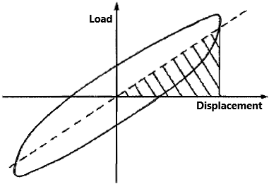 **Fig 3.15.1 An example of the load-displacement diagram in dynamic stiffness test**  **Fig 3.15.1 An example of the load-displacement diagram in dynamic stiffness test** (D) Using the load-displacement diagram, the dynamic stiffness($K _{D}$) and relative damping($\Psi$) are to be decided as follows. (a) The dynamic stiffness is evaluated as the slope of a line drawn through midpoints between the ascending and the descending paths for all displacement positions except near the ends where there might be some deviation from a straight line. (b) The damping is evaluated as relative damping $\Psi$ = area of hysteresis loop / elastic work (hatched area) (E) After evaluating the dynamic stiffness by frequency, the dynamic factor is calculated with following equation. dynamic factor = dynamic stiffness ($K _{D}$) / static vertical stiffness ($K _{V}$) (F) The Society may require the following additional tests or its documents. (a) Creep test (b) Durability test (G) Where the kinds of elastomer or the manufacturer of elastomer are changed, the type test is to newly carry out. |
  |  |   |
  | **Fig 3.15.1 An example of the load-displacement diagram in dynamic stiffness test** |   |
  | Stern tube bearings | (A) Confirmation tests for the characteristics of materials (a) In the case of vulcanized rubber, the following tests specified in KS M 6518 (ⅰ) Tensile test (ⅱ) Hardness test (ⅲ) Tension set test (ⅳ) Adhesion test (ⅴ) Test for adhesion to metals (except those not to be adhered to metals) (ⅵ) Tear test (ⅶ) Compression set test (ⅷ) Dipping test (in the case of a water-lubricated system, tests are to be carried out using sea water) (ⅸ) Aging test (b) In the case of materials other than those specified above in (a), tests according to pertient national standards or other equivalent standards concerning the contents of (a) according to the materials. (B) Abrasion test (C) Running test (In this case, confirm that the bearing pressures during the tests are to be verified are not less than 0.8 MPa for an oil-lubricated system, and are not less than 0.2 $MPa$ for a water-lubricated system respectively.) (D) "Type test program" submitted according to 102. 3 (1) (A) is to include the following items: (a) Drawing of the test rig (b) Drawing of the product (specified the materials, dimensions, etc.) (c) Condition of tests (lubrication system, shaft speed, bearing load, hydraulic pressure, test time, etc.) |

  **Table 3.15.1 Type test item of machinery and equipment of ship (continued)**

  | Kinds | Type test item |
  | --- | --- |
  | Stern tube sealing devices | (A) "Type test program" submitted according to 102. 3 (1) (A) is to include the following items: (a) Drawings of the test rig (b) Drawings of test product specifying the construction, materials, dimensions, etc. (c) Plans of test conditions specifying the lubrication system, shaft speed range, surface pressure of the bearing, hydraulic pressure, test hours, etc. (B) In principle, the duration of performance tests is to be not less than 1,000 hours. The temperature (keep up 55°C and less), quantity of leakage (or consumption) per hour and pressure, etc. are to be checked in accordance with 'Type test program' during the tests. Dismantle after the tests and inspect the dimensions, wear and corrosion, etc. The consumption of lubricating oil per day is to be 2 $l$ and less for the oil-lubricated system. |
  | flexible couplings | In the type tests of flexible couplings, the followings are to be included. For systems intended to control a deflection as well as a torsion, the tests in the followings are to be carried out under the condition of imposing the maximum allowable deflection. *(2019)* (A) Test to confirm the dynamic torsional stiffness and the damping. Test is to be carried out in accordance with the manufacturer's practice. However, if there is no manufacturer’s practice, it may comply with the following method. *(2020)* (a) With mean torque and vibratory torque fixed, the tests are to be repeated with vibration frequency $f$ changed as following steps. $f$ = 2, $10*$, 20 (Hz) (b) With vibration frequency and vibratory torque fixed, the tests are to be repeated with mean torque $T _{M}$ changed as following steps. $T _{M} /T _{KN}$ = 0, 0.25, 0.5, $0.75*$, 1 where: $T _{KN}$ = permissible nominal torque (c) With vibration frequency and mean torque fixed, the tests are to be repeated with vibratory torque $T _{V}$ changed as following steps. $T _{V} /T _{KV}$ = 0.5, $1*$, 2.0 (2.0 is for the purpose of transient vibrations) where: $T _{KV}$ = permissible vibratory torque (d) Testing all the possible combinations of the conditions mentioned above (a), (b), (c) is not required. When the one parameter is tested, the other parameters are kept constant as reference conditions (* marked above). For flexible couplings not to be used in reciprocating internal combustion engines the tests at reference condition may be sufficient. However, for typically flexible couplings which the stiffness progressively increase with torque, all permissible combinations of mean and vibratory torques are to be tested. (B) Test to confirm the permissible nominal torque (C) Test to confirm the permissible maximum torque and permissible maximum torque range (D) Test to confirm the permissible vibratory torque (imposing the mean torque) (E) Other tests as deemed necessary by the Society due to the own construction |
  | Pipes of special materials | In the type tests for pipes of special materials, the following items are to be included according to their applications and kinds of materials as deemed necessary by the Society: (A) Tests specified in KS M 6540 (Testing Methods for Rubber Hoses), ISO 1436 & 3862 (Rubber hoses and hose assemblies wire-reinforced hydraulic type), etc. (B) Flame-resistant test This test applies to piping system containing fuel oil, lubricating oil, hydraulic oil and sea water where leakage or failure could result in fire or flooding in the machinery space. The testing procedures are to be as follows: The test pipe at the design pressure (in the case of less than 0.5 MPa, 0.5 MPa is to be taken) and the design temperature (the temperature at outlet, in the case of less than 80°C, 80°C is to be taken) with fluid flowing through is to be exposed to a flame on the surface and held at a temperature of 800°C for a period of 30 minutes. Following the fire test, a pressure test is to be carried out at a pressure twice the design pressure (in the case of less than 1 MPa, 1 MPa is to be taken), whereby it is to be verified that the test pipe is free from abnormality. (C) For rubber hoses used for the contact freezer, the tests specified in the following (a) and (b): (a) Pressure test at a pressure twice the design pressure or 2 MPa, whichever is the greater (b) Rupture test at a pressure of 8 MPa or more |

  **Table 3.15.1 Type test item of machinery and equipment of ship (continued)**

  | Kinds | Type test item |   |
  | --- | --- | --- |
  | Cargo pipings, pumps and cargo hoses of ships carrying liquefied gases in bulk | Type tests specified in Pt 7, Ch 5, 503. and 507. are to be carried out in accordance with following requirements. Type tests of other systems and equipment which the Society deems necessary are to be considered by the Society in each case. (A) Valve : The following type tests are to be performed on each size and type of valve.(Refer to SIGTTO Publication on "The Selection and Testing of Valves for LNG Applications") (a) Cryogenic tests (i) Each size and type of valve shall be subjected to seat tightness testing consisting of cryogenic testing over the full range of operating pressures for bi-directional flow and temperatures, at intervals in accordance with Table 3.15.1.1, up to 1.1 times the rated design pressure of the valve. Allowable leakage rates are to be in accordance with Table 3.15.1.2. Design pressure($\mathrm{MPa}$) ; Interval($\mathrm{MPa}$) 2 and below ; 0.35 5 and below ; 0.75 6.4 and below ; 1 10 and below ; 2 **Table 3.15.1.1 Pressure intervals in seat tightness testing** Design pressure($\mathrm{MPa}$) Interval($\mathrm{MPa}$) 2 and below 0.35 5 and below 0.75 6.4 and below 1 10 and below 2 Flow direction ; Allowable leakage rates ($\mathrm{mm} ^{3} /s \times Diameter(mm)$) Handwheel operated valve ; Both direction ; 100 Check valve ; reverse flow direction ; 200 **Table 3.15.1.2 Allowable leakage rates in seat tightness testing** Flow direction Allowable leakage rates ($\mathrm{mm} ^{3} /s \times Diameter(mm)$) Handwheel operated valve Both direction 100 Check valve reverse flow direction 200 (ii) During the testing, satisfactory operation of the valve shall be verified. Operating tests are to be carried out at least 20 times at temperatures not exceeding minimum design temperature. The open and close forces for at least the first and last operation are to be measured. (iii) Leakage tests for gland/stem and body/bonnet are to be carried out and there is to be no leakage. (b) The flow or capacity shall be certified to a recognized standard for each size and type of valve. In applying this requirement, for pressrue relief valves (PRV), the flow or capacity are to be certified by the Society and for other types of valves, the manufacturer is to certify the flow properties of the valves based on tests carried out according to recognized standards. (c) Pressurized components shall be pressure tested to at least 1.5 times the rated pressure. (d) For emergency shutdown valves, with materials having melting temperatures lower than 925 ℃, the type testing shall include a fire test to a standard acceptable to the Society. In applying this requirement, emergency shutdown valves, with materials having melting temperatures lower than 925°C does not include an emergency shutdown valves in which components made of use materials having melting temperatures lower than 925°C do not contribute to the shell or seat tightness intrinsically of the valve. *(2020)* (B) PRV(Pressure Relief Valve) : PRVs shall be tested in accordance with recognized standards.(ISO 21013-1 and ISO 4126-1) However, the approval of the blow-off coefficient K in the calculation formula of the blow-off rate of pressure relief valves may be in accordance with **Ch 3, Sec. 14** of the **Guidance for Approval of Manufacturing Process and Type Approval, etc**. Type tests shall be include: (a) Verification of relieving capacity (b) Cryogenic testing when operating at design temperatures colder than -55 ℃(Including operation testing for safety valve set pressure and leakage verification at design temperature) (c) Seat tightness testing (d) Pressure containing parts are pressure tested to at least 1.5 times the design pressure. |   |
  | Design pressure($\mathrm{MPa}$) | Interval($\mathrm{MPa}$) |   |
  | 2 and below | 0.35 |   |
  | 5 and below | 0.75 |   |
  | 6.4 and below | 1 |   |
  | 10 and below | 2 |   |
  | Flow direction |   | Allowable leakage rates ($\mathrm{mm} ^{3} /s \times Diameter(mm)$) |
  | Handwheel operated valve | Both direction | 100 |
  | Check valve | reverse flow direction | 200 |

  **Table 3.15.1 Type test item of machinery and equipment of ship (continued)**

  | Kinds | Type test item |
  | --- | --- |
  | Cargo pipings, pumps and cargo hoses of ships carrying liquefied gases in bulk | (C) Expansion pipe : The following type tests are to be performed on each type of expansion bellows. *(2017)* (a) A type element of the bellows, not pre-compressed, shall be pressure tested at not less than 5 times the design pressure without bursting. The duration of the test should not be less than 5 min. (b) A pressure test shall be performed on a type complete expansion pipe with all the accessories such as flanges, stays and articulations, at the minimum design temperature and twice the design pressure at the extreme displacement conditions recommended by the manufacturer without permanent deformation. (c) A cyclic test (thermal movements) shall be performed on a complete expansion pipe, which shall withstand at least as many cycles, under the conditions of pressure, temperature, axial movement, rotational movement and transverse movement, as it will encounter in actual service. Testing at ambient temperature is permitted, when this testing is at least as severe as testing at the service temperature. (d) A cyclic fatigue test (ship deformation) shall be performed on a complete expansion pipe, without internal pressure, by simulating the bellows movement corresponding to a compensated pipe length, for at least 2,000,000 cycles at a frequency not higher than 5 $\mathrm{cycles}/s$. This test is only required when, due to the piping arrangement, ship deformation loads are actually experienced. (D) Cargo pumps : The following type tests are to be performed on each size and type of pumps. However, for the pump designed the same as an existing pump approved by the Society and having satisfactory in-service experience, consideration may be given to waiving the tests. (a) hydrostatic test of the pump body equal to 1.5 times the design pressure (b) the capacity tests in compliance with the following (i) For submerged pumps, deck-mounted pumps and reciprocating pumps, the capacity test is to be carried out with the design medium or with a medium below the design temperature. (ii) For deep well pumps, the capacity test may be carried out with water. In addition, for deep well pumps, a spin test to demonstrate satisfactory operation of bearing clearances, wear rings and sealing arrangements is to be carried out at the design temperature. (c) After completion of tests, the pump is to be opened out for examination. (E) Cargo hoses : Each new type of cargo hose, complete with end-fittings, are to be type tested at a normal ambient temperature. However, for the cargo hose designed the same as an existing cargo hose approved by the Society and having satisfactory in-service experience, consideration may be given to waiving the tests. (a) cycle pressure test of 200 pressure cycles from zero to at least twice the specified maximum working pressure (b) bursting pressure test of at least 5 times its specified maximum working pressure at the extreme service temperature |
  | Fuel pipings and pumps for ships using low-flashpoint fuels | Type tests specified in Ch 16, 701. and 703. of the Rules for ships using low-flashpoint fuels are to be carried out in accordance with the type test requirements of cargo pipings and pumps of ships carrying liquefied gases in bulk. |
  | Expansion bellows for fuel cell fuel system | Type tests specified in Ch 2, 701. 4 of the Guidance for Fuel Cell Systems on board ships are to be carried out in accordance with the type test requirements of expansion bellows of ships carrying liquefied gases in bulk. |
- **3.** The Society may request assurance of on-board performance of the machinery and equipment for same specific vessels as a condition of approval.

### Section 16 Plastic Piping System

#### 1601. Application (2017)

The requirements of this Section apply to tests and inspection for the approval of plastic piping system in accordance with the requirements in **Pt 5, Ch 6, 102. 5** of the Rules and in **Annex 5-6, Pt 5** of the Guidances.

#### 1602. Data to be submitted

The following reference data are to be submitted to the Society in addition to those specified in **102.**

#### 1603. Type tests

The requirements in **Table 3.16.1** are, in principle, to be considered as the criteria for the type tests of plastic piping system. For application of the tables, see below: *(2017)*

#### 1604. Marking

The plastic piping system approved by the Society are to be marked with the following. *(2017)*

### Section 17 Flexible Hose Assembly

#### 1701. Application

- **1.** The requirements of this Section apply to tests and inspection for the approval of flexible hose assembly of metallic or non-metallic materials in accordance with the requirements in **Pt 5, Ch 6, 102. 5 (2)** of the Rules.
- **2.** The requirements of this Section apply to the flexible hose assembly used in oil fuel, lubricating hydraulic and thermal oil systems, fresh water and sea water cooling systems, compressed air systems, bilge and ballast systems, and Class III steam systems in accordance with **Pt 5, Annex 5-9** of the Guidances and may also apply to the flexible hose assembly intended for other uses except for high pressure fuel oil injection systems and fixed extinguishing systems.

#### 1702. Data to be submitted

The following reference data are to be submitted to the Society in addition to those specified in **102.**

#### 1703. Type tests

- **1.** Flexible hoses assemblies are subject to satisfactory type testing. Type test programmes for flexible hose assembles are to be submitted by the manufacturer and are to be sufficiently detailed to demonstrate performance in accordance with the specified Standards.
- **2.** For a particular hose type complete with end fittings, the tests, as applicable, are to be carried out on different nominal diameters for pressure, burst, impulse and fire resistance in accordance with the requirements of the relevant Standard. The following Standards are to be used as applicable:
  - **(1)** ISO 6802 – Rubber and plastics hoses and hose assemblies with wire reinforcements – Hydraulic impulse test with flexing.
  - **(2)** ISO 6803 – Rubber or plastics hoses and hose assemblies – Hydraulic-pressure impulse test without flexing.
  - **(3)** ISO 15540 – Fire resistance of hose assemblies – Test methods.
  - **(4)** ISO 15541 – Fire resistance of hose assemblies – Requirements for test bench.
  - **(5)** ISO 10380 – Pipework – Corrugated metal hoses and hose assemblies.
    Other Standards may be accepted where agreed by the Scoeity.
     Prototype tests are to be carried out for each size of hose assembly. However, for ranges with more than 3 different diameters, the prototype tests are to be carried out for at least:
    • the smallest diameter,
    • the largest diameter,
    • Intermediate diameters selected based on the principle that prototype tests carried out for a hose assembly with a diameter D are considered valid only for the diameters ranging between 0.5 D and 2 D.
    For fire resistance tests the specimens shall be selected in accordance with ISO 15540:2016.
- **3.** All flexible hose assemblies are to be satisfactorily burst tested to an International Standard to demonstrate they are able to withstand a pressure of not less than four times the design pressure without indication of failure or leakage.(The International Standards, e.g., EN or SAE for burst testing of non-metallic hoses, require the pressure to be increased until burst without any holding period at 4 x Maximum Working Pressure.)
- **4.** In addition to the above tests, additional tests may be required if deemed necessary by This Society. *(2018)*

#### 1704. Markings

Type approved flexible metal hose assemblies are to be permanently marked by the manufacturer with the following details

#### 1705. Product Inspection after type approval

Flexible hose assembly of metallic or non-metallic materials used for Class I and II pipe fittings is subjected to a hydrostatic test at a pressure 1.5 times of the design pressure.

### Section 18 Mechanical Joints

#### 1801. General

The requirements of this Section apply to tests and inspection for the approval of mechanical joints in accordance with the requirements in **Pt 5, Ch 6, 104. 5** (1) of the Rules.

#### 1802. Data to be submitted

The following reference data are to be submitted to the Society in addition to those specified in **102.**

#### 1803. Type tests

- **1.** **Test items**
  Testing requirements for mechanical joints are to be as indicated in **Table 3.18.1**

  | Test items |   | Types of mechanical joints |   |   | Notes and references |
  | --- | --- | --- | --- | --- | --- |
  | Test items |   | Compression couplings and pipes unions | Slip-on joints |   | Notes and references |
  | Test items |   | Compression couplings and pipes unions | Grip type & Machine grooved type | Slip type | Notes and references |
  | 1 | Tightness test | ○ | ○ | ○ | Table 3.18.2 |
  | 2 | Vibration (fatigue) test, | ○ | ○ | - | Table 3.18.2 |
  | 3 | Pressure pulsation test1) | ○ | ○ | - | Table 3.18.2 |
  | 4 | Burst pressure test | ○ | ○ | ○ | Table 3.18.2 |
  | 5 | Pull-out test | ○ | ○ | - | Table 3.18.2 |
  | 6 | Fire endurance test | ○ | ○ | ○ | Table 3.18.2 (If required in Pt 5, Ch 6, 104. 5(5) of the Rules) |
  | 7 | Vacuum test | ○ | ○ | ○ | Table 3.18.2 (for suction lines only) |
  | 8 | Repeated assembly test | ○ | ○ | - | Table 3.18.2 |
  | Abbreviations : ○ : test is required. - : test is not required. Footnotes 1) for use in those systems where pressure pulsation other than water hammer is expected. 2) except press type and swage type. 3) except joints with metal-to-metal tightening surfaces. |   |   |   |   |   |
- **2.** Alternative testing in accordance with national or international standards may be accepted where applicable to the intended use and application.
- **3.** Unless otherwise specified, the water or oil as test fluid is to be used.
- **4.** **Selection of test specimen**
  - **(1)** Test specimens are to be selected from production line or at random from stock.
  - **(2)** Where there is a variety of size of joints requiring approval, a minimum of three separate sizes, representative of the range, from each type of joint to be tested in accordance with **Table 3.18.1** are to be selected.
- **5.** **Mechanical joint assembly**
  - **(1)** Assembly of mechanical joints should consist of components selected in accordance with preceding **4** (2) and the pipe sizes appropriate to the design of the joints.
  - **(2)** Where pipe material would affect the performance of mechanical joints, the selection of joints for testing is to take the pipe material into consideration.
  - **(3)** Where not specified, the length of pipes to be connected by means of the joint to be tested is to be at least five times the pipe diameter.
  - **(4)** Before assembling the joint, conformity of components to the design requirements is to be verified.
  - **(5)** In all cases the assembly of the joint shall be carried out only according to the manufacturer instructions.
  - **(6)** No adjustment operations on the joint assembly, other than that specified by the manufacturer, are permitted during the test.
- **6.** **Test results acceptance criteria**
  - **(1)** Where a mechanical joint assembly does not pass all or any part of the tests in **Table 3.18.1**, two assemblies of the same size and type that failed are to be tested.
  - **(2)** In this case, only those test which mechanical joint assembly failed in the first instance, are to be repeated. In the event where one of the assemblies fails the second test, that size and type of assembly is to be considered unacceptable.

#### 1804. Methods of tests

- **1.** The outlines of testing methods in **Table 3.18.1** are as given in Table 3.18.2.

  **Table 3.18.2 The outlines of testing methods of mechanical joints**

  | Test item | Kinds | Type test method |
  | --- | --- | --- |
  | **1. Tightness test** | all mechanical joints | In order to ensure correct assembly and tightness of the joints, all mechanical joints are to be subjected to a tightness test, as follows. (1) The mechanical joint assembly test specimen is to be connected to the pipe or tubing in accordance with the requirements of 1803. 5 (3) and the manufacturers instructions, filled with test fluid and de-aerated. Mechanical joints assemblies intended for use in rigid connections of pipe lengths, are not to be longitudinally restrained. Rigid connections are joints, connecting pipe length without free angular or axial movement. The pressure inside the joint assembly is to be slowly increased to 1.5 times the design pressure. This test pressure is to be retained for a minimum period of 5 minutes. In the event of a drop in pressure or visible leakage, the test (including fire test) is to be repeated for two further specimens. If during the repeat test one test piece fails, the coupling is regarded as having failed. An alternative tightness test procedure, such as a pneumatic test, may be accepted. (2) For compression couplings a static gas pressure test is to be carried out to demonstrate the integrity of the mechanical joints assembly for tightness under the influence of gaseous media. The pressure is to be raised to maximum pressure or 7 $MPa$ which ever is less. (3) Where the tightness test is carried out using gaseous media as permitted in (1) above, then the static pressure test mentioned in (2) above need not be carried out. |

  **Table 3.18.2 The outlines of testing methods of mechanical joints (continued)**

  | Test item | Kinds | Type test method |
  | --- | --- | --- |
  | **2. Vibration (fatigue) test** | General | (1) In order to establish the capability of the mechanical joint assembly to withstand fatigue, which is likely to occur due to vibrations under service conditions, mechanical joint assemblies are to be subject to the following vibration test. (2) Conclusions of the vibration tests should show no leakage or damage. |
  | **2. Vibration (fatigue) test** | compression couplings, pipe unions | Compression couplings and, pipe unions intended for use in rigid pipe connections are to be tested as follows. (A) Two lengths of pipe is to be connected by means of the joint to be tested. (B) One end of the pipe is to be rigidly fixed while the other end is to be fitted to the vibration rig. (C) The test rig and the joint assembly specimen being tested are to be arranged as shown in Fig 3.18.1 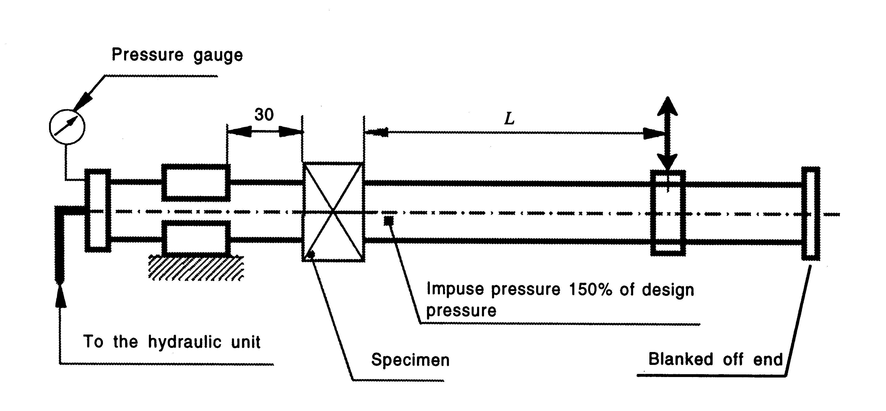 Fig 3.18.1 Example of equipment for vibration(fatigue) test **Fig 3.18.1 Example of equipment for vibration(fatigue) test** (D) The joint assembly is to be filled with test fluid, de-aerated and pressurised to the design pressure of the joint. (E) Pressure during the test is to be monitored. (F) In the event of a drop in the pressure and visible leakage the test is to be repeated as described in 1803. 6. (G) Visual examination of the joint assembly is to be carried out. (H) Re-tightening may be accepted once during the first 1000 cycles. (I) Vibration amplitude is to be within 5% of the value calculated from the following formula: $A = \frac{2 \times S \times L ^{2}}{3 \times E \times D}$ where: $A$ - single amplitude ( *mm*) $L$ - length of the pipe ( *mm*) $S$ - allowable bending stress in N/mm^2 based on 0.25 of the yield stress $E$ - modulus of elasticity of tube material (for mild steel, E =210 $\mathrm{kN}/mm ^{2}$) $D$ - outside diameter of tube ( *mm*) (J) Test specimen is to withstand not less than $10 ^{7}$ cycles with frequency 20~50 Hz without leakage or damage. |
  | **2. Vibration (fatigue) test** | Grip type and Machine grooved type joints | Grip type joints and other similar joints containing elastic elements are to be tested in accordance with the following method. A test rig of cantilever type used for testing fatigue strength of components may be used. (A) The test specimen being tested is to be arranged in the test rig as shown in Fig 3.18.2 (B) Two lengths of pipes are to be connected by means of joint assembly specimen to be tested (C) One end of the pipe is to be rigidly fixed while the other end is to be fitted to the vibrating element on the rig. |

  **Table 3.18.2 The outlines of testing methods of mechanical joints (continued)**

  | Test item | Kinds | Type test method |
  | --- | --- | --- |
  | **2. Vibration (fatigue) test** | Grip type and Machine grooved type joints | 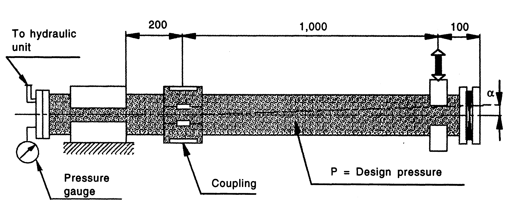 Fig 3.18.2 Example of Equipment for Vibration(fatigue) test **Fig 3.18.2 Example of Equipment for Vibration(fatigue) test** (D) The length of pipe connected to the fixed end should be kept as short as possible and in no case exceeds 200 mm*.* (E) Mechanical joint assemblies are not to be longitudinally restrained. (F) The assembly is to be filled with test fluid, de-aerated and pressurized to the design pressure of the joint. (G) Preliminary angle of deflection of pipe axis is to be equal to the maximum angle of deflection, recommended by the manufacturer. (H) The amplitude is to be measured at 1m distance from the center line of the joint assembly at free pipe end connected to the rotating element of the rig. (I) Parameters of testing are to be as indicated below and to be carried out on the same assembly Number of cycles ; Amplitude (mm) ; Frequency (Hz) 3 × $10 ^{6}$ ; ± 0.06 ; 100 ± 0.5 ; 45 ± 1.5 ; 10 Number of cycles Amplitude (mm) Frequency (Hz) 3 × $10 ^{6}$ ± 0.06 100 ± 0.5 45 ± 1.5 10 (J) Pressure during the test is to be monitored. (K) In the event of a drop in the pressure and visual signs of leakage the test is to be repeated as described in 1803. 6. (L) Visual examination of the joint assembly is to be carried out for signs of damage which may eventually cause leakage. |
  | Number of cycles | Amplitude (mm) | Frequency (Hz) |
  | 3 × $10 ^{6}$ | ± 0.06 | 100 |
  | 3 × $10 ^{6}$ | ± 0.5 | 45 |
  | 3 × $10 ^{6}$ | ± 1.5 | 10 |
  | **3. Pressure pulsation test** | mechanical joint assembly | In order to determine capability of mechanical joint assembly to withstand pressure pulsation likely to occur during working conditions, joint assemblies intended for use in rigid connections of pipe lengths, are to be tested in accordance with the following method. The mechanical joint test specimen for carrying out this test may be the same as that used in the test in 1. (1) of this Table provided it passed that test. (1) The vibration test in 2. of this Table and the pressure pulsation test are to be carried out simultaneously for compression couplings and pipe unions. (2) The mechanical joint test specimen is to be connected to a pressure source capable of generating pressure pulses of magnitude as shown in Fig 3.18.3 (3) Impulse pressure is to be raised from 0 to 1.5 times the design pressure of the joint with a frequency equal to 30~100 cycles per minute. (4) The number of cycles is not to be less than 5 × 10^5 (5) The specimen may have small deformation whilst under test pressure, but no leakage or visible cracks are permitted. |

  **Table 3.18.2 The outlines of testing methods of mechanical joints (continued)**

  | Test item | Kinds | Type test method |
  | --- | --- | --- |
  | **3. Pressure pulsation test** | mechanical joint assembly | 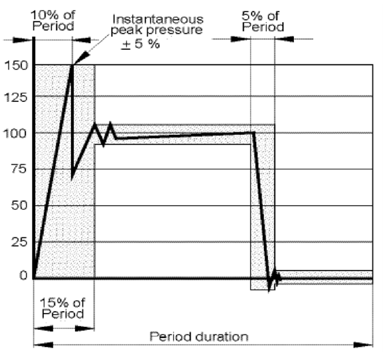 **Fig 3.18.3 Example of Equipment for Pressure Pulsation Test** |
  | **4. Burst pressure test** | mechanical joint assembly | In order to determine the capability of the mechanical joint assembly to withstand a pressure 4 times the design pressure, the following burst test is to be carried out. For design pressure above 20 MPa the required burst pressure will be specially considered by the Society. (1) Mechanical joint test specimen is to be connected to the pipe or tubing in accordance with the requirements of 1803. 5, filled with test fluid, de-aerated and pressurized to test pressure with an increasing rate of 10 % per minute of test pressure. (2) The mechanical joint assembly intended for use in rigid connections of pipe lengths is not to be longitudinally restrained. (3) Duration of this test is not to be less than 5 minutes at the maximum pressure. (4) Where considered convenient, the mechanical joint test specimen used in the tightness test in 1. of this Table, may be used for the burst test provided it passed the tightness test. (5) The specimen may exhibit a small deformation whilst under test pressure, but no leakage or visible cracks are permitted. |
  | **5. Pull-out test** | mechanical joint assembly | In order to determine the ability of a mechanical joint assembly to withstand the axial loading likely to be encountered in service without the connecting pipe becoming detached, following pull-out test is to be carried out. (1) Pipes of suitable length are to be fitted to each end of the mechanical joints assembly test specimen. (2) The test specimen is to be pressurized to design pressure. When pressure is attained, an external axial load is to be imposed with a value calculated using the following formula: The pressure and axial load are to be maintained for a period of 5 minutes $L = \frac{\pi}{4} \cdot D ^{2} \cdot p$ where: $D$ =pipe outside diameter (mm) $p$ =design pressure ($\mathrm{N}/mm ^{2}$) $L$ =applied axial load (N) (3) During the test, pressure is to be monitored and relative movement between the joint assembly and the pipe measured. (4) The mechanical joint assembly is to be visually examined for drop in pressure and signs of leakage or damage. (5) There is to be no movement between the mechanical joint assembly and the connecting pipes. |

  **Table 3.18.2 The outlines of testing methods of mechanical joints (continued)**

  | Test item | Kinds | Type test method |
  | --- | --- | --- |
  | **6. Fire endurance test** | mechanical joint assembly | (1) In order to establish capability of the mechanical joints to withstand effects of fire which may be encountered in service, mechanical joints are to be subjected to a fire endurance test. The fire endurance test is to be conducted on the selected test specimens as per the following standards. (a) KS V ISO 19921: Ships and marine technology – Fire resistance of metallic pipe components with resilient and elastomeric seals – Test methods (b) KS V ISO 19922: Ships and marine technology – Fire resistance of metallic pipe components with resilient and elastomeric seals – Requirements imposed on the test bench. (2) Clarifications to the standard requirements in KS V ISO19921:2005, Paragraphs 7.2, 7.4, 7.6 and 7.7: (a) If the fire test is conducted with circulating water at a pressure different from the design pressure of the joint (however of at least 5 bar) the subsequent pressure test is to be carried out to 1.5 times the design pressure. (b) If the fire test is required in Pt.5 Ch.6 Section 1 Table 5.6.10 of Rules for the Classification of Steel Ships to be “8 min dry + 22 min wet” or “30 min dry”, i.e. conducted for a period of time without circulating of water, the following test conditions apply:. (i) Test condition “8 min dry + 22 min wet” The test piece is not required to be rinsed with the test medium (water) in preparation for the test as required in Paragraph 7.2 of KS V ISO 19921:2005. The exposure to fire is to be started and continued for 8 minutes with the sample dry; after 8 minutes of dry test condition the piping system is to be filled with water and test pressure is to be increased up to at least 5 bar within 2 minutes, then maintained to at least 5 bar. After further 22 minutes (i.e. 30 minutes from initial exposure to fire) the exposure to fire is to be stopped and a hydrostatic pressure test as specified in (a) is to be carried out. (ii) Test condition “30 min dry” The exposure to fire is to be started and continued for 30 minutes with the sample dry. After 30 minutes the exposure to fire is to be stopped and a hydrostatic pressure test as specified in (a) is to be carried out. For fire tests in dry condition the pressure inside the test specimen is to be monitored for a rise due to heating of the enclosed air. Means of pressure relief should be provided where deemed necessary. High pressures created during this test can result in failure of the test specimen. Precautions shall be taken to protect personnel and facilities. Paragraph 7.5 of KS V ISO 19921:2005 does not apply to the dry tests and no forced air circulation is to be arranged. For fire endurance test requiring exposure time greater than 30 minutes test conditions are adjusted to meet the extended required total exposure time. In all cases for dry-wet test the minimum dry test exposure time is 8 minutes. |

  **Table 3.18.2 The outlines of testing methods of mechanical joints (continued)**

  | Test item | Kinds | Type test method |
  | --- | --- | --- |
  | **6. Fire endurance test** | mechanical joint assembly | (c) A selection of representative nominal bores may be tested in order to evaluate the fire resistance of a series or range of mechanical joints of the same design. When a mechanical joint of a given nominal bore (Dn) is so tested then other mechanical joints falling in the range Dn to 2xDn (both inclusive) are considered accepted. (d) Alternative test methods and/or test procedures considered to be at least equivalent may be accepted at the discretion of the Classification Society in cases where the test pieces are too large for the test bench and cannot be completely enclosed by the flames. (e) Where thermal insulation is acceptable as a means of providing fire resistance, following requirements apply: (i) Thermal insulation materials applied on couplings are to be non-combustible in dry condition and when subjected to oil spray. A non-combustibility test according to ISO 1182:2010 is to be carried out as required by the Fire Test Procedures Code defined in Regulation 3 of SOLAS Chapter II-2 as amended by IMO resolutions up to MSC.421(98). Precautions are to be taken to protect the insulation from being impregnated with flammable oils. (ii) At least the fire endurance and the vibration testing in table 3.18.1 are to be carried out with thermal insulation in place. (iii) A service restriction is to be stated on the type approval certificate that the mechanical joints are to be fitted with thermal insulation during the installation in cases where the mechanical joints are used where fire resistance is required, unless mechanical joints are delivered already fitted with thermal insulation before installation. |
  | **7. Vacuum test** | mechanical joint assembly | In order to establish the capability of the mechanical joint assembly to withstand internal pressures below atmospheric similar to the conditions likely to be encountered under service conditions, the following vacuum test is to be carried out. (1) The mechanical joint assembly is to be connected to a vacuum pump and subjected to a pressure of 170 hPa absolute. (2) Once this pressure is stabilized, the specimen under test is to be isolated from the vacuum pump and the pressure is to be maintained for a period of 5 minutes. (3) No internal pressure rise is permitted. |
  | **8. Repeated assembly test** | mechanical joint assembly | The mechanical joint test specimen is to be dismantled and reassembled 10 times in accordance with manufacturer’s instructions and then subjected to a tightness test as defined in 1 of this Table. |

### Section 19 Air Pipe Automatic Closing Devices

#### 1901. Application

The requirements in this Section apply to tests and inspection for the approval of air pipe automatic closing devices extending above weather decks in accordance with the requirements in Pt 5, Ch 6, 201. of the Rules, the International Convention on Load Lines, 1966 or the Protocol of 1988 relating to the International Convention on Load Lines, 1966, as amended by IMO resolutions up to MSC.375(93).

#### 1902. Design and Materials

- **1.** Design of the air pipe automatic closing devices is to comply with the following requirements.
  - **(1)** An air pipe automatic closing device is to prevent the free entry of water into the tanks and allow the passage of air or liquid to prevent excessive pressure or vacuum coming on the tank. For vacuum, air pipe automatic closing devices are to be made for relieving vacuum in the tanks when the tanks are also being pumped out.
  - **(2)** The open ends of air pipes to fuel oil and cargo oil tanks are to be furnished with the flame-screens which can be readily removed for cleaning or renewal and deemed appropriate by the Society. The clear area through the mesh of the flame-screens is not to be less than the required sectional area of the air pip
  - **(3)** Air pipe closing devices are to be designed so that they can withstand both ambient and working conditions up to an inclination of ± 40° without failure or damage.
  - **(4)** Air pipe closing devices are to be constructed to allow inspection of the closure and the inside of the casing as well as for changing the seals.
  - **(5)** In case of air pipe closing devices of the float type, suitable guides are to be provided to ensure unobstructed operation under all working conditions of heel and trim as specified in (3).
  - **(6)** Efficient ball or float seating arrangements are to be provided for the closures. Bars, cage or other devices are to be provided to prevent the ball or float from contacting the inner chamber in its normal state and made in such a way that the ball or float is not damaged when subjected to water impact due to a tank being overfilled.
  - **(7)** Air pipe closing devices are to be self draining.
  - **(8)** The clear area through an air pipe closing device is to be at least equal to the area of the inlet.
  - **(9)** The maximum allowable tolerances for wall thickness of ball floats are not to exceed ± 10 % of the nominal thickness.
  - **(10)** The inner and the outer chambers of an automatic air pipe head is to be of a minimum thickness of 6mm
- **2.** Materials of the air pipe automatic closing devices is to comply with the following requirements.
  - **(1)** Casings of air pipe closing devices are to be of approved metallic materials adequately protected against corrosion.
  - **(2)** For galvanized steel air pipe heads, the zinc coating is to be applied by the hot method and the thickness is to be 70 to 100 $\mathrm{\mu} m$.
  - **(3)** For areas of the head susceptible to erosion (e.g. those parts directly subjected to ballast water impact when the tank is being pressed up, for example the inner chamber area above the air pipe, plus an overlap of 10 degree or more either side) an additional harder coating should be applied. This is to be an aluminium bearing epoxy, or other equivalent, coating, applied over the zinc.
  - **(4)** Closures and seats made of non-metallic materials are to be compatible with the media intended to be carried in the tank and to sea water at ambient temperatures between -25 °C and 85 °C.
- **3.** The flame-screens installed in automatic air pipe outlets are to comply with the following.
  - **(1)** They are to be made of corrosion resisting material.
  - **(2)** They are to comprise two fitted screens of at least 20 × 20 *mesh* spaced 25.4 ± 12.7 $\mathrm{mm}$ apart or single fitted screen of at least 30 × 30 *mesh*, or to have a performance equivalent thereto.

#### 1903. Type tests

- **1.** **Testing of air pipe automatic closing devices**
  The following tests, specified in **Table 3.19.1**, for air pipe automatic closing devices by each type and size are to be carried out at the manufacturer's works or other acceptable location by the Society.
- **2.** Impact and compression loading tests for the floats are to be carried out as specified in **Table 3.19.2.**

  **Table 3.19.1 Test methods and acceptance criteria for air pipe automatic closing devices**

  | Kinds | Test Item | Type test method | Acceptance criteria |
  | --- | --- | --- | --- |
  | **air pipe automatic closing devices** | Tightness test | An automatic closing device is to be subjected to a series of tightness tests involving not less than two(2) immersion cycles under each of the following conditions. (1) The automatic closing device is to be submerged slightly below the water surface at a velocity of approximately 4 ml/min*.* and then returned to the original position immediately. The quantity of leakage is to be recorded. (2) The automatic closing device is to be submerged to a point slightly below the surface of water. The submerged velocity is to be approximately 8 m/min. and the air pipe vent head is to remain submerged for not less than 5 minutes. The quantity of leakage is to be recorded. (3) Each of the above tightness tests is to be carried out in the normal position as well as at an inclination of ± 40° under the strictest conditions for the device. In case where such strictest conditions are not clear, tests shall be carried out at an inclination of 40 degrees with the device opening facing in three different directions : upward, downward, sideways(left or right).(See Figure 3.19.1) | The maximum allowable leakage per cycle is not to exceed 2 ml/mm of nominal diameter of inlet pipe during any individual test. |
  | **air pipe automatic closing devices** | Discharge/ Reverse flow thest | The air pipe head shall allow the passage of air to prevent excessive vacuum developing in the tank. 1. Reverse flow test (1) A reverse flow test shall be performed. A vacuum pump or another suitable device shall be connected to the opening of the air pipe leading to the tank. The flow velocity shall be applied gradually at a constant rate until the float gets sucked and blocks the flow.; and (2) The velocity at the point of blocking shall be recorded. 80% of the value recorded will be stated in the certificate. 2. Alternative to the reverse flow test (1) For pipe heads of 400 mm nominal diameter and above, as an alternative to the reverse flow test, a numerical simulation test based on computational fluid dynamics (CFD), to be carried out in conjunction with limited representative testing to establish the validity of the CFD modelling and results, may be accepted; (2) CFD predictions for air pipe heads can be validated against the available actual reverse flow test results of same size and type of air pipe heads; (3) The accuracy of the CFD modelling and the major assumptions used for the calculation are to be documented; (4) Mesh convergence studies are to be carried out and documented; and (5) The requirement as per the preceding I (2) applies. | To be as deemed appropriate by the Society |
  | **air pipe automatic closing devices** | Confirmation of the flow characteristic | Measuring of the pressure drop versus rate of volume flow is to be carried out using water and with any intended flame or insect screen in place. | To be as deemed appropriate by the Society |

  **Table 3.19.1 Test methods and acceptance criteria for air pipe automatic closing devices (continued)**

  | Kinds | Test Item | Type test method | Acceptance criteria |
  | --- | --- | --- | --- |
  | **non-** **metallic floats** | Impact test | (1) The test may be conducted on a pendulum type testing machine. The floats are to be subjected to 5 impacts of 2.5 *N-m* each. (2) Subsequently the floats are to be subjected to 5 impacts of 25 *N-m* each. At this impact energy level some localized surface damage at the impact point may occur. | The floats are not to suffer either permanent deformation, cracking or surface deterioration at this impact loading. |
  | **non-** **metallic floats** | Compression loading test | (1) Compression tests are to be conducted with the floats mounted on a supporting ring of a diameter and bearing area corresponding to those of the valve seating with which it is intended that float shall be used. (2) For ball type float, loads are to be applied through a concave cap of the same internal radius as the test float and bearing on an area of the same diameter as the seating. (3) For a disc type float, loads are to be applied through a disc of equal diameter as the float. (4) A load of 350 kg is to be applied over one minute and maintained for 60 minutes. The deflection is to be measured at intervals of 10 minutes after attainment of the full load. | The record of deflection against time is to show no continuing increase in deflection and, after release of the load, there is to be no permanent deflection. |
  | **metallic floats** | Impact test | Tests are to be conducted in accordance with the impact test of non-metallic floats. The tests are to be carried out at room temperature and in the dry condition. | according to the requirement for impact test of non-metallic floats. |

  | 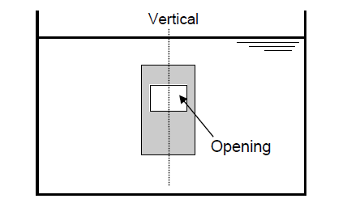 (1) normal position **(1) normal position** |
  | --- |
  | 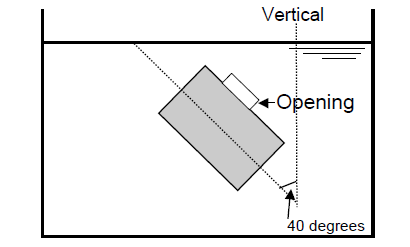 (2) inclination 40 degree opening facing upward **(2) inclination 40 degree opening facing upward** |
  | 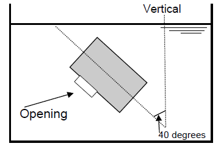 **(3) inclination 40 degree opening facing downward** |
  | 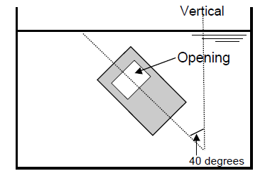 **(4) inclination 40 degree opening facing sideways** |

  **Table 3.19.2 Temperature and Condition of Test**

  | Test temperature (°C) Test condition | -25 | 20 | 85 |
  | --- | --- | --- | --- |
  | Dry | ○ | ○ | ○ |
  | After immerging in water | ○ | ○ | ○ |
  | After immerging in fuel oil |   | ○ |   |
  | NOTES: 1. Type tests are to be performed for each test item indicated with a ○ mark in this Table. 2. Immerging in water and fuel oil is to be for 48 hours at least. |   |   |   |

### Section 20 Level Indicators

#### 2001. Application

- **1.** In accordance with the requirements in **Pt 5, Ch 6, 203. 4, Pt 7, Ch 1, 1002. 8** and **Pt 7, Ch 5 and Ch 6** of the Rules, the requirements in this Section apply to tests and inspection for the approval of pneumatic, electric and/or electronic type level indicators installed in tanks, cofferdams, etc.
- **2.** The level indicators include all parts of the device from the detector to the display.

#### 2002. Construction

The construction of the level indicator is to satisfy the following requirements.

#### 2003. Type tests

- **1.** The type tests are to include the following (1) through (5) depending on application and type of level indicators.
  - **(1)** In addition to conformity with the requirements in **2002.,** confirmation of whether the test sample agrees with the established specifications for completion, construction, dimensions and used parts.
  - **(2)** Confirmation of whether the test sample performs as specified where the configuration is in the regular installed direction and in 22.5° inclined direction under the working condition given in the following.
    - **(A)** Parts located out of the tank: normal temperature and maximum working pressure.
    - **(B)** Parts located inside the tank and on the tank walls: maximum and/or minimum working temperature (However, where this temperature is within the range of 0°C and 60°C, normal temperature may be used instead.) and maximum working pressure.
  - **(3)** For devices in which the liquid level is measured by use of floats and where the float is not fixed during navigation, confirmation of whether specified performance can be realized after a drop test in which the float is dropped from a height of 3 m onto a steel plate in 10 $mm$ thickness. (However, where a damping device such as springs are provided at the top and bottom edge of the guide, tests may be carried out with such devices installed, although the tests are to be repeated at least ten times.)
  - **(4)** For devices in which the liquid level is measured by use of floats, confirmation of whether any damage occurs to the rubbing parts where the same equipped pipes and wires are set up horizontally and the float and guide are made to contact each other at the same places much as practicable. Then, for devices which the float is not fixed during navigation, rubbing tests which the float is slided 5,000 times between 5 m span are to be carried out.
  - **(5)** For the electrical parts of the devices, the type tests are to comply with the requirements in **2304. 1** (2) and, in case the explosion-protected construction is required, type tests also are to comply with the requirements in **2107.** of the Guidance. *(2021)*
- **2.** Additional tests other than those of the preceding **1**. may be requested, where deemed necessary by the Society.

### Section 21 Electrical Equipment and Cables

#### 2101. General

- **1.** **Application**
  The requirements in this Section apply to tests and inspection for the type of electrical equipment and cables in accordance with the requirements in **Pt 6, Ch 1, 103.** of the Rules for Classification of Steel Ships.
- **2.** **Items subject to the tests**
  Electrical equipment and cables subject to the type test are to be as the requirements in **Table 3.21.1.**

  **Table 3.21.1 Electrical equipment and cables subject to the type test** ***(2022)***

  | Kinds | Electrical equipment and cables subject to the type test |
  | --- | --- |
  | Fuses | Cartridge type fuses (renewable and non-renewable) and plug type fuses used for the protection of the low-voltage electric circuits |
  | Circuit breakers | Low-voltage breakers, air circuit breakers and molded case circuit breakers (including molded case circuit breakers with fuses and molded case circuit breakers used for the protection of induction motors simultaneously. Hereinafter, these are referred to as molded case circuit breakers unless otherwise specified.), used for protection of the electric circuits |
  | Electromagnetic contactors and protective relays | Electromagnetic contactors and protective relays used for motors and other loads connected to the low-voltage electric circuits |
  | Explosion-protected electrical equipment | Electrical equipment of the flameproof type, intrinsically safe type, increased safety type and pressurized protected type (limited to sealed type) used in the spaces on board flammable or explosive gas or vapour (hereinafter referred to as explosive gas) exists or may exist in the atmosphere. |
  | Cables | (1) Cables used for power circuits, lighting circuits, supply and distribution circuits of interior-communication, control circuits, etc. (2) Flexible cords used for power supply and distribution circuits. |
  | Other electrical equipment | The following electrical equipment produced by mass production method at the same manufacturing plant which obtained the Approval of Quality Assurance System specified in **Ch 5** of the Guidance - Generators, electrical motor, control gears for electrical motor, power and lighting transformers, switchboards, axial flow fan driven by motor built in casing and semi-conductor rectifiers |

#### 2102. Data to be submitted

Data are to be submitted to the Society in accordance with the requirements in **102.** and the following drawings and documents are to be included for explosion-protected electrical equipment. Items (4), (5) and (6) are, however, required for intrinsically safe type electrical equipment only.

#### 2103. Type tests

Type tests are to be carried out in accordance with the requirements in 2104. to 2109. and 2304.(where applicable) for each product. In case where the Society deemed necessary, however, additional tests and/or an increase in the number of test samples may be required. The type tests for fuses, circuit breakers and electromagnetic contactors may be partly or wholly exempted, subject to the approval by the Society, in cases where the manufacturer has been approved by an inspection organization recognized by the Society. *(2022)*

#### 2104. Test method of fuses

The details of test are to comply with the recognized code (IEC 60269 series, etc.). Where deemed necessary, the ambient temperature may be modified.

#### 2105. Test method of circuit-breakers

The details of test are to comply with the recognized code (IEC 60947-1, IEC 60947-2, IEC 62271-100 and KS C 8321*,* etc.). Where deemed necessary, the ambient temperature may be modified.

#### 2106. Test method of electromagnetic contactors

The details of test are to comply with the recognized code (IEC 60947-1, IEC 60947-4 and KS C 4504*,* etc.). Where deemed necessary, the ambient temperature may be modified.

#### 2107. Test method of explosion-protected electric equipment

- **1.** **Test items and number of samples**
  The test items marked "O" in **Table 3.21.2** are to be conducted on one test sample per each explosion-protection type.

  **Table 3.21.2 Test Items of Explosion Protected Equipment**

  | Types of explosion protection Test items | Flameproof type | Intrinsically safe type | Increased safety type | Pressurized protected type |
  | --- | --- | --- | --- | --- |
  | Construction inspection | ○ | ○ | ○ | ○ |
  | Temperature rise test | ○ | ○ | ○(note) | ○ |
  | Mechanical strength test | ○ | ○ | ○ | ○ |
  | Explosion test | ○ |   |   |   |
  | Pressurization test |   |   |   | ○ |
  | Spark ignition test |   | ○ |   |   |
  | Other test deemed necessary | ○ | ○ | ○ | ○ |
  | NOTE: Temperature rise test in the locking test for motors is to be included. REMARKS: 1. The mechanical strength test is to apply to movable apparatus, inspection windows, lighting fittings, portable lamps with batteries, plug-sockets and flexible fittings. 2. Other tests deemed necessary are to include thermal shock (heat resistance) test, water-tight test, air-tight test, function test of protective devices, etc. |   |   |   |   |
- **2.** **Test methods**
  Test methods are to comply with the requirements given in **Table 3.21.3** or IEC 60079 series.

  **Table 3.21.3 Test methods and acceptance criteria for explosion-protected equipment**

  | Types | Test item | Test method |   | Acceptance criteria |   |
  | --- | --- | --- | --- | --- | --- |
  | Flameproof type electric equipment | (A) Explosion withstand test | (a) The enclosure is filled with the flammable mixture which will produce the explosion pressure specified in Table belows according to the internal volume and tested by repeatedly igniting and exploding the mixture 10 times. Internal volume ($\mathrm{cm} ^{3}$) ; Less than 2 ; 2 over 100 incl. ; over 100 Internal pressure (MPa) ; Necessary for fabrication ; 0.8 or over ; 1.0 or over Internal volume ($\mathrm{cm} ^{3}$) Less than 2 2 over 100 incl. over 100 Internal pressure (MPa) Necessary for fabrication 0.8 or over 1.0 or over (b) The gaps of the enclosure may be sealed temporally to perform the test. |   | The enclosure is not to be damaged or obstructively deformed |   |
  | Flameproof type electric equipment | Internal volume ($\mathrm{cm} ^{3}$) | Less than 2 | 2 over 100 incl. | over 100 |   |
  | Flameproof type electric equipment | Internal pressure (MPa) | Necessary for fabrication | 0.8 or over | 1.0 or over |   |
  | Flameproof type electric equipment | (B) Flame propagation test | (a) The flammable mixture having flame propagation characteristic which can prove the safe guardness against each gas involved in each explosion class is filled inside and outside the enclosure and is ignited inside the enclosure and exploded repeatedly 15 times. In case where the pressure specified in (A) of this Table is available in this test, the explosion withstand test above may be included in this test. (b) The position considered as the flame propagation is most ready to occur in the enclosure is to be selected for the position of ignition. |   | The flame propagation is not to occur |   |
  | Flameproof type electric equipment | (C) Temperature rise test | To pass the rated current to the equipment (as for lighting fixtures, by turning or the maximum applicable lamp with the rated current) until the temperature at each part is saturated. | The temperature rise of the external parts of the enclosure is not to exceed the limit specified in Table below (Standard ambient temperature 50°C) Ignition group ; G_1 ; G_2 ; G_3 ; G_4 ; G_5 Limit of temperature rise ; 310 ; 190 ; 110 ; 60 ; 30 (Standard ambient temperature 50°C) Ignition group G_1 G_2 G_3 G_4 G_5 Limit of temperature rise 310 190 110 60 30 |   |   |
  | (Standard ambient temperature 50°C) |   |   |   |   |   |
  | Ignition group | G_1 | G_2 | G_3 | G_4 | G_5 |
  | Limit of temperature rise | 310 | 190 | 110 | 60 | 30 |
  | (D) Mechanical strength test | (a) The steel ball falling test of light transparent plate, light transparent window and inspection window ; The transparent plate (except for the cylindrical glass globes for fluorescent lamp) is dropped by the steel ball specified in Table below on the weakest part considered of the plate under the condition being fitted on to the equipment or equivalent condition. Transparent material ; Mass of steel ball (g) ; Dropping height (cm) Glove ; 95 (diameter approximately 28.5 mm) ; 100 Cylindric glass ; 50 (diameter approximately 23.0 mm) ; 100 Sheet glass ; 200 (diameter approximately 36.5 mm) ; 200 Transparent material Mass of steel ball (g) Dropping height (cm) Glove 95 (diameter approximately 28.5 mm) 100 Cylindric glass 50 (diameter approximately 23.0 mm) 100 Sheet glass 200 (diameter approximately 36.5 mm) 200 This test is, in principle, to be carried out on three test specimens and each of them is required to pass the test. For the indicating lamps, in case where the steel ball can not strike the glass cover through the openings of the guard, the test is to be conducted by dropping a steel ball sufficiently small to directly strike. |   | Not to cause any damage and cracks which may impair the flame-proofness |   |   |
  | (D) Mechanical strength test | Transparent material | Mass of steel ball (g) | Dropping height (cm) |   |   |
  | Glove | 95 (diameter approximately 28.5 mm) | 100 |   |   |   |
  | Cylindric glass | 50 (diameter approximately 23.0 mm) | 100 |   |   |   |
  | Sheet glass | 200 (diameter approximately 36.5 mm) | 200 |   |   |   |
  | (b) The strength test of cylindrical glass globe for fluorescent lamp The cylindrical glass globe is dropped by a steel ball of 50 g (diameter approximately 23 *mm* from a height of 100 cm on the weakest part considered of the cylindrical glass globe under the condition being fitted on to the equipment and held horizontally. And, the cylindrical glass globe is applied the internal hydrostatic pressure of not less than 2.0 MPa for 15 seconds. This test is, in principle, to be carried out on three test specimens and each of them is required to pass the test. |   | The cylindrical glass globe is not to be damaged and is to withstand the internal hydrostatic pressure. |   |   |   |

  **Table 3.21.3 Test methods and acceptance criteria for explosion-protected equipment (continued)**

  | Types | Test item | Test method | Acceptance criteria |
  | --- | --- | --- | --- |
  | Flameproof type electric equipment | Drop test for portable type apparatus | The portable type apparatus is dropped three times on to the steel plate of 6 *mm* in thickness from a height of 1.5 m by changing the position to collide. | Not to be impairer the flame-proofness |
  | Flameproof type electric equipment | Thermal shock test | The electric apparatus with light transparent windows or inspection windows is poured by water at a temperature of 10°C lower than the room temperature (minimum 5°C) onto the electric apparatus after the electric apparatus has been operated until the temperature of the light transparent material is saturated. This test is, in principle, to be carried out on three test specimens and each of them is required to pass the test. The test, however, may be omitted in case where the light transparent material can be considered to have a little temperature rise and to pass the thermal shock test apparently judging from test results in the past. | Not to cause cracks of damage on the light transparent material |
  | Intrinsically safe type electrical equipment | Temperature rise test | The temperature rise of the parts in contact with explosive gas of the intrinsically safe type electrical equipment is measured under the normal operational condition and under the maximum current or voltage which can be generated in time of fault. The test, however, may be omitted in case where the temperature rise of the apparatus can be considered not to exceed the limit apparently judging from the test results in the past. | not to exceed the limit specified in the temperature rise test of flameproof type electric equipment |
  | Intrinsically safe type electrical equipment | Spark ignition test | The intrinsically safe type electric equipment, at all parts of intrinsically safe circuit, is to be carried out the spark ignition test specified in the following (a) to (e) by using the lEC type spark ignition testing apparatus to verify that any sparks in normal operation and abnormal condition (short circuit, earth fault, breakage of cable, etc.) do not ignite explosive gas or vapour specified in Table 3.21.1. This test apply to the first product and may be omitted for the subsequent products of the same manufacturer in case where the voltage or the current of the circuit specified in the following (a) does not exceed that of the spark ignition test circuit by 20 %. (a) The spark ignition test is to be conducted in way of the circuit where the maximum voltage or current can be generated in normal operation and abnormal condition. For the safety barrier, however, the test is to be conducted at the connecting terminals of the intrinsically safe circuit side by applying the intrinsically safe rated voltage to the non-intrinsically safe circuit side. The intrinsically safe rated voltage means the voltage generated in the non-intrinsically safe circuit in normal operation and abnormal condition and the maximum voltage in the non-intrinsically safe circuit side of the safety barrier at which the intrinsical safety can be ensured. (b) The value of the testing voltage or the testing current is to be the value obtained from multiplying the maximum voltage or current in normal operation and abnormal condition in the circuit to be intrinsical safe by the safety factor. The safety factor is, in principle, to be 2. (c) The number of revolutions of the testing equipment is to be more than 200 times per each pole for the *d.c.* circuit and more than 1,000 times for the *a.c.* circuit. (d) The test gas is, in principle, to comply with either of the following: (i) 1 Class: Propane-air mixture gas (5.25 ± 0.25 *vol* %) (ii) 2 Class: Ethylene-air mixture gas (7.8 ± 0.5 *vol* %) (iii) 3 Class: Hydrogen-air mixture gas (21 ± 2 *vol* %) | The intrinsically safe type electric equipment, at all parts of intrinsically safe circuit, is to pass the spark ignition test |

  **Table 3.21.3 Test methods and acceptance criteria for explosion-protected equipment (continued)**

  | Types | Test item | Test method |   | Acceptance criteria |   |
  | --- | --- | --- | --- | --- | --- |
  | Intrinsically safe type electrical equipment | Spark ignition test | (e) The sensitivity of the spark ignition testing equipment before and after the test is to be adjusted so that the maximum ignition current becomes approximately 65 mA for ethylene-air mixture gas and approximately 30 mA for hydrogen-air mixture gas when the sparks are produced in the gas by inserting the testing equipment into the electric circuit as shown in Fig below. 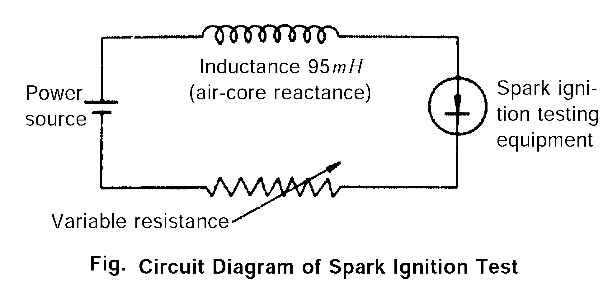 |   |   |   |
  | Intrinsically safe type electrical equipment | Drop test for portable type apparatus | The portable type apparatus is dropped onto the steel plate of 6 *mm* in thickness fixed on the floor from an effective height of 1.5 m. The test is to be carried out three times by changing the positions to collide which are selected as the weakest positions judging from the structural features of the test specimen. |   | Not to be damaged on the external covers and not to cause damage or deformation in the internal circuit which may impair the intrinsical safety |   |
  | Increased safety type electrical equipment | Temperature rise test | The temperature rise of the increased safe type electrical equipment is to comply with the following (a) to (d) by being continuously supplied under the rated voltage, the rated output or capacity. (a) Temperature rise of electrical equipment against explosive gas The temperature rise of the all parts which may be exposed to explosive gas is measured**.** The temperature rise of insulating windings and bulb socket is to comply with the requirements of the following (b) and (c). (b) Temperature rise of insulating windings The temperature rise of the insulating windings used for the electric equipment is to be 15°C lower than the value specified in Pt 6, Ch 1, 304. of the Rules for Classification of Steel Ships. The thermometer method may be used only when the resistance method is hardly applied. (c) Temperature rise of bulb socket The temperature rise of the rim and the soldered part of the bulb is not to exceed 145°C. (d) Temperature rise of leading part of external cable The temperature rise of the cable entry points is not to exceed 20°C and that of the branching points of the conductor is not to exceed 30°C. | The temperature rise of the all parts which may be exposed to explosive gas is not to exceed the limit given in Table below. Ignition group ; G1 ; G2 ; G3 ; G4 Enclosures and their parts ; 310 ; 190 ; 110 ; 60 Surface of lamps for lighting fittings ; 350 ; 300 ; 250 ; 150 Ignition group G1 G2 G3 G4 Enclosures and their parts 310 190 110 60 Surface of lamps for lighting fittings 350 300 250 150 |   |   |
  | Increased safety type electrical equipment | Ignition group | G1 | G2 | G3 | G4 |
  | Enclosures and their parts | 310 | 190 | 110 | 60 |   |
  | Surface of lamps for lighting fittings | 350 | 300 | 250 | 150 |   |
  | Thermal shock test | The protective lamp cover of the lighting fitting is poured by a water jet with a diameter of approximately 1 mm and with a temperature of approximately 20°C onto the parts having the highest temperature, after applying the rated voltage to the maximum applicable bulb until the temperature rise of the outside surface of the protective lamp cover is saturated. |   | The protective lamp cover of the lighting fitting is not to be damaged or cracked |   |   |

  **Table 3.21.3 Test methods and acceptance criteria for explosion-protected equipment (continued)**

  | Types | Test item | Test method | Acceptance criteria |   |
  | --- | --- | --- | --- | --- |
  | Increased safety type electrical equipment | Waterproof test | The electrical equipment is to be tested according to the requirements of test method for IPX4 specified in IEC 60529. | To comply with the requirements of waterproof test and is to have the waterproof performance accordingly necessary for the place where the electrical equipment is intended to be installed. |   |
  | Increased safety type electrical equipment | Mechanical strength test of lighting fittings | The lighting fittings are dropped by a steel ball (as the end of object) of 25 mm in diameter and a mass specified in Table below at the tip onto the weakest part considered from the height specified in the Table, under the condition being fitted on a fixed table. Electrical apparatus ; Mass of steel ball (kg) ; Height of fall (m) Enclosures ; Lamp protective cover ; Guard Incandescent lights and mercury lights ; 1 ; - ; 0.7 ; - 2 ; 2 ; - ; 2 Fluorescent lights ; 1 ; 2 ; 0.7 ; 2 Electrical apparatus Mass of steel ball (kg) Height of fall (m) Enclosures Lamp protective cover Guard Incandescent lights and mercury lights 1 - 0.7 - 2 2 - 2 Fluorescent lights 1 2 0.7 2 | Not to be damaged |   |
  | Electrical apparatus | Mass of steel ball (kg) | Height of fall (m) |   |   |
  | Electrical apparatus | Mass of steel ball (kg) | Enclosures | Lamp protective cover | Guard |
  | Incandescent lights and mercury lights | 1 | - | 0.7 | - |
  | Incandescent lights and mercury lights | 2 | 2 | - | 2 |
  | Fluorescent lights | 1 | 2 | 0.7 | 2 |
  | Pressurized protective type electrical equipment (sealed type only) | Temperature rise test | The temperature rise test is to be carried out in accordance with that of flameproof type electrical equipment. | The temperature rise of the external parts of the enclosure is not to exceed the limit specified in table of the flameproof type electrical equipment. |   |
  | Pressurized protective type electrical equipment (sealed type only) | Internal pressure test | The internal pressure test is to comply with the followings. (a) Internal pressure maintaining test Being filled with the protective gas up to the specified value, (b) Operating test of protective device The pressure of the protective gas falls below the specified value. The test is, in principle, to be conducted for 5 times. | (a) The internal pressure of the equipment is to be satisfactorily maintained. (b) the device indicating the pressure fall is to operate satisfactorily. |   |

#### 2108. Test method of cables

- **1.** **1**. The details of test are to comply with the recognized code IEC 60092-350, etc. given in **Table 3.24.** Where deemed necessary, the ambient temperature may be modified.
- **2.** In addition to 1 above, tests for vertical flame spread of vertically bunched cable are to be carried out in accordance with IEC 60332-1 or IEC 60332-3-22:2018. *(2022)*
- **3.** Fire resistance cables are to be carried out in accordance with required tests of IEC 60331-1 or IEC 60331-2 and tests of IEC 60331-21. *(2022)*

  **Table 3.21.4 Type test item of cables**

  | No. | Test items | IEC code |
  | --- | --- | --- |
  | 1 | Visual inspection |   |
  | 2 | Conductor resistance test | IEC 60092-350, 5.2.2 |
  | 3 | Voltage test | IEC 60092-350, 5.2.3 |
  | 4 | Insulation resistance | IEC 60092-350, 6.9 & 7.2 |
  | 5 | Conductor examination | IEC 60092-350, 6.4 |
  | 6 | Insulation thickness | IEC 60092-350, 6.5 & 8.2 |
  | 7 | Non-metallic sheaths thickness | IEC 60092-350, 6.6 & 8.3 |
  | 8 | External diameter | IEC 60092-350, 6.7 |
  | 9 | Hot-set test for insulations and sheaths | IEC 60092-350, 6.8 |
  | 10 | Increase in a.c. capacitance after immersion in water | IEC 60092-350, 7.3 |
  | 11 | High voltage test for 4 h | IEC 60092-350, 7.4 |
  | 12 | Mutual capacitance (control and instrumentation cables only) | IEC 60092-350, 7.5 |
  | 13 | Inductance to resistance ratio (control and instrumentation cables only) | IEC 60092-350, 7.6 |
  | 14 | Mechanical properties of insulation before and after ageing | IEC 60092-350, 8.4 |
  | 15 | Mechanical properties of sheaths before and after ageing | IEC 60092-350, 8.5 |
  | 16 | Compatibility test | IEC 60092-350, 8.6 |
  | 17 | Loss of mass test on PVC ST2 sheath | IEC 60092-350, 8.7 |
  | 18 | Test for the behaviour of PVC ST2 and halogen-free SHF1 sheaths at high temperatures (hot pressure test) | IEC 60092-350, 8.8 |
  | 19 | Test for the behaviour of PVC sheath ST2 and halogen-free SHF1 and SHF2 sheaths at low temperature | IEC 60092-350, 8.9 |
  | 20 | Special test for low temperature behaviour (when required) | IEC 60092-350, 8.10 |
  | 21 | Test of the metal coating of copper wires | IEC 60092-350, 8.11 |
  | 22 | Galvanizing test | IEC 60092-350, 8.12 |
  | 23 | Test for resistance of PVC ST2 and halogen-free SHF1 sheaths to cracking (heat shock test) | IEC 60092-350, 8.13 |
  | 24 | Ozone resistance test for insulation and for sheaths | IEC 60092-350, 8.14 |
  | 25 | Oil immersion test for sheaths | IEC 60092-350, 8.15 |
  | 26 | Mud drilling fluid test (when required) | IEC 60092-350, 8.16 |
  | 27 | Fire tests | IEC 60092-350, 8.17 |
  | 28 | Determination of hardness for HEPR | IEC 60092-350, 8.18 |
  | 29 | Determination of elastic modulus for HEPR | IEC 60092-350, 8.19 |
  | 30 | Durability of print | IEC 60092-350, 8.20 |

#### 2109. Other electrical equipment

- **1.** The type tests are to be carried out on the electrical equipment random selected one for each frame No. or type from the production line to verity their compliance with the relevant requirements of **Pt 6, Ch 1** of the Rules.
- **2.** The items of the type tests are, in general, to be in accordance with the requirements given in **Table 3.21.5**. In case where the Society specifically deems necessary, additional test items or number of test samples may be required.

  **Table 3.21.5 Type test item of other electrical equipment** ***(2020)***

  | Electrical equipment | The items of the type tests |
  | --- | --- |
  | *a.c.* Generators | In accordance with the test items for the first batch of each type in the table for tests of rotating machinery of Pt 6, Ch 1, 309. 16 of Rules for the Classification of Steel Ships. |
  | *a.c.* Motors | In accordance with the test items for the first batch of each type in the table for tests of rotating machinery of Pt 6, Ch 1, 309. 16 of Rules for the Classification of Steel Ships. |
  | *d.c.* Machines | In accordance with the test items for the first batch of each type in the table for tests of rotating machinery of Pt 6, Ch 1, 309. 16 of Rules for the Classification of Steel Ships. |
  | Controlgears for electric motor | (1) Construction inspection (2) Temperature rising test (3) Operational test (including circuit inspection) (4) Insulation resistance test (5) High voltage test (6) Other tests |
  | Power and lighting transformer | (1) Construction inspection (2) Temperature rising test (3) Insulation resistance test (4) High voltage test (5) Induced high voltage test (6) Other tests |
  | Switchboards | (1) Construction inspection (2) Temperature rising test (for main circuits) (3) Operational test (4) Insulation resistance test (5) High voltage test (6) Other tests |
  | Axial flow fan driven by motor built in casing | (1) Construction inspection (2) Combined running tests: Temperature rising test, air flow rate and static air pressure measurements, shaft power measurements (3) Insulation resistance test (4) High voltage test (5) Vibration measurement, noise level measurement (6) Other tests |
  | Semi-conductor rectifiers | (1) Construction inspection (2) Temperature rising test (3) Operation test (4) High voltage test (5) Insulation resistance test |
- **3.** **Tests and inspection**
  - **(1)** The test and inspection methods are to be in accordance with requirements of **KS** or as deemed appropriate by the Society.
  - **(2)** The overload test provided in **Par 2** above is to be carried out continuously under the load of 110 % of the rated output for the duration necessary for saturation of the temperature of each part plus two hours. However, there is no limit of temperature rise.
  - **(3)** Tests and inspection other than those specified in **Par 2** above are defined upon agreement between the Society and the manufacturer.
- **4.** **Tests of individual electrical equipment after approval**
  Tests of individual electrical equipment after approval are defined upon agreement between the Society and the manufacturer.

### Section 22 Cable Laying

#### 2201. Application

The requirements in this Section apply to tests and inspection for the approval of fire stop method for bunched cables (ex: fire stop mat, hereinafter referred to **fire stop methods** in this Section) and nonmetallic cable bands which are required an advance approval by the Society in accordance with the requirements in **Pt 6, Ch 1, 103.** and **507. 4** of the Rules for Classification of Steel Ships, **Pt 6, Ch 1, 504. 1** and **507. 1** of the Guidance relating to the Rules for the Classification of Steel Ships.

#### 2202. Data to be submitted

The manufacturer or constructer is to submit to the Society the drawings and documents specified in (1) for the approval of the fire stop methods, and those specified in (2) for the approval of nonmetallic cable bands in addition to those specified in **102.**

#### 2203. Type tests

- **1.** **Prevention methods of flame spread through cable**
  The type tests for prevention methods of flame spread through cable are to be carried out in accordance with IEC 60332-3-22:2018. *(2022)*
- **2.** **Cable bands** ***(2019)***
  The type tests for cable bands are to be carried out in accordance with the requirements given in **Table 3.22.1.**

  | No. | Item | Test method | Remark |
  | --- | --- | --- | --- |
  | 1 | Installation test | IEC 62275, 9.2 |   |
  | 2 | Minimum installation temperature test | IEC 62275, 9.3 | except for metallic |
  | 3 | Minimum operating temperature test | IEC 62275, 9.4 | except for metallic |
  | 4 | Loop tensile strength test for cable ties | IEC 62275, 9.5 and 9.6 |   |
  | 5 | Mechanical strength test for fixing devices | IEC 62275, 9.7 |   |
  | 6 | Contribution to fire | IEC 62275, 10 |   |
  | 7 | Resistance to ultraviolet light | IEC 62275, 11.1 | except for metallic |
  | 8 | Resistance to corrosion | IEC 62275, 11.2 |   |
- **3.** **Nonmetallic cable trays/protective casings**
  The type tests for cable trays/protective casings made of plastics materials are, according to the purpose and kind, to be carried out in accordance with the requirements given in **Table 3.22.2.**

  **Table 3.22.2 type tests for cable trays/protective casings made of plastics materials** ***(2024)***

  | Test item |   | Approval test method and acceptance criteria |
  | --- | --- | --- |
  | Impact Resistance Test |   | The test should be performed according to IEC 60068-2-75:2014 using the pendulum hammer. (a) The test should be carried out on samples of cable tray lengths or cable ladder lengths of 250 mm ± 5 mm long. Samples of ladder should consist of two side-members with one rung positioned centrally. Samples of mesh trays should be prepared in such a way that there will be a wire in the centre. (b) Before the test, plastics components should be aged at a temperature of 90℃ ± 2℃ for 240 h continuously. (c) The samples should be mounted on wooden fibreboard of thickness 20 mm ± 2 mm. (d) The samples to be tested should be placed in a refrigerator, the temperature within which is maintained at the declared temperature below with a tolerance of ±2℃. -25℃ to 90℃ for outdoor use + 5℃ to 90℃ for indoor use. Consideration will be given to the use of plastics cable trays/protective casings in the cold environment where the ambient temperature is below -25℃ provided the mechanical properties of the plastics can be maintained for the intended purpose and the installation location. In this particular instance, the cold bend and cold impact properties of the material should also be considered. (e) After 2 h, the samples should, in turn, be removed from the refrigerator and immediately placed in the test apparatus. (f) At 10 $s$ ± 1 $s$ after removal of each sample from the refrigerator the hammer should be allowed to fall with impact energy, mass of the hammer and fall height as belows: Approximate energy(J) ; Mass of hammer (kg) ; Fall height(mm) 10 ; 5.0 ; 200 ± 2 Approximate energy(J) Mass of hammer (kg) Fall height(mm) 10 5.0 200 ± 2 (g) The impact should be applied to the base, or the rung, in the first sample, to one of the side members in the second sample, and to the other side member in the third sample. In each case, the impact should be applied to the centre of the face being tested. (h) After the test, the samples should show no signs of disintegration and/or deformation that will impair the safety. |
  | Approximate energy(J) | Mass of hammer (kg) | Fall height(mm) |
  | 10 | 5.0 | 200 ± 2 |
  | Safe Working Load (SWL) Test | application | Tests should be carried out for the smallest and largest sizes of cable trays lengths or cable ladder lengths, having the same material, joint and topological shape. |
  | Safe Working Load (SWL) Test | Test temperature | Cable trays/protective casings and joints should be tested at the declared temperatures according to (d) of impact resistance test above. Alternatively, tests can be carried out: (a) at any temperature within the declared range if documentation is available which states that the relevant structural properties of the materials as used within the system do not differ by more than 5% of the average between the maximum and minimum property values, or, (b) only at maximum temperature within the range, if documentation is available, which states that the relevant structural properties of the materials, as used within the system decrease when the tempera ture is increasing, or (c) at maximum and minimum temperature only. |
  | Safe Working Load (SWL) Test | Test loads | All loads should be uniformly distributed (UDL) over the length and width of the samples as shown in Fig 3.22.4. The loads should be applied in such a way that a UDL is ensured even in the case of extreme deformation of the samples. 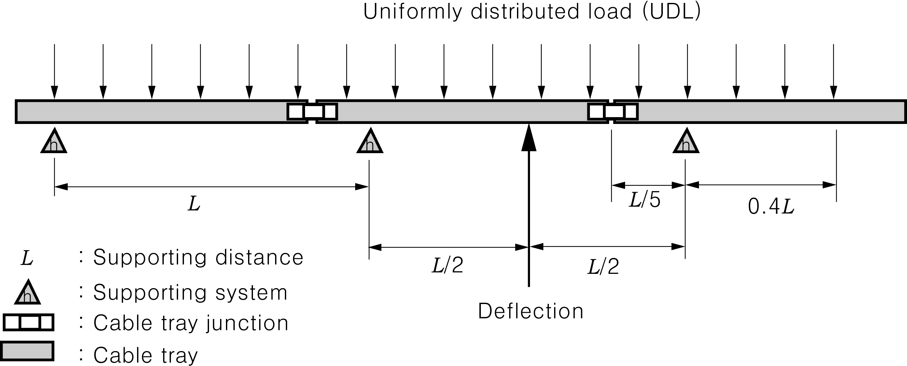 Fig 3.22.4 UDL applying method **Fig 3.22.4 UDL applying method** |

  **Table 3.22.2 type tests for cable trays/protective casings made of plastics materials (continued)**

  | Test item |   | Approval test method and acceptance criteria |
  | --- | --- | --- |
  | Safe Working Load (SWL) Test | Load test | (a) To allow for settlement of the samples, a pre-load of 10% of the test load unless otherwise specified, should be applied and held for at least 5 min, after which the measurement apparatus should be calibrated to zero. (b) The load should then be gradually increased evenly longitudinally and transversely up to the test load continuously or when a continuous increase is impractical, the load may be increased by increments. These increments should not exceed about a quarter of the safe working load. The load increments should be distributed through the load plates longitudinally and transversely as evenly as is practical. (c) After loading, the deflection should be measured at the points specified to give a practical mid-span deflection.(refer to Fig 3.22.4) The samples should be left and the deflections measured every 5 minutes until the difference between two consecutive sets of readings is less than 2 % with regard to the first set of the two consecutive sets of readings. The first set of readings measured at this point is the set of deflections measured at the test load. (d) The maximum deflection should not exceed L/100 where L is the distance between the supports. (refer to Fig 3.22.4) (e) When subject to the test load the samples, their joints and internal fixing devices, should show no damage or crack visible to normal view or corrected vision without magnification. |
  | Safe Working Load (SWL) Test | Breaking test | (a) The load should then be increased to l.7 times the test load. (b) The samples should be left and the deflections measured every 5 min until the difference between two consecutive sets of readings is less than 2 % with regard to the first set of the two consecutive sets of readings.(refer to **Fig** 3.9.2) (c) The samples should sustain the increased loading without collapsing. Buckling and deformation of the samples is permissible at this loading. |
  | Flame Retardant Test |   | The cable trays/protective casings should be at least flame retardant. They should be tested in accordance with Table 3.26.1 of 2604. of this Guidance. |
  | Smoke and Toxicity Test |   | The cable tray/protective casings should be tested in accordance with 2604. 4. of this Guidance. |
  | Resistivity Test |   | Cable trays/protective casings of plastic materials passing through a hazardous area are to be complied with the following. (a) They should not be electrically non-conductive and should ensure satisfactory earthing between any point in these appliances and the ship’s hull. (b) The volume resistivity level of the cable trays/protective casings and fittings should be below 10^5$\Omega$ｍ and the surface resistivity should be below 10^8$\Omega$. (c) The cable tray/protective casings should be tested in accordance with IEC 62631-3-1:2016 and IEC 62631-3-2:2015. |

### Section 23 Automatic and Remote Control Systems

#### 2301. Application

- **1.** The requirements of this Section apply to tests and inspection for the type approval of the automatic and remote control systems (device, units and sensors, etc) including basic softwares(if any) for use in the marine environment in accordance with the requirements in **Pt 6, Ch 2, 301. 1** of the Rules. However, the automatic and remote control systems that are to be installed less than 5 m from magnetic compass are to comply with the requirement in following (1) and fire detection system and gas detection system are to comply with the requirements in following (2) to (4).
  - **(1)** Compass safe distance test for the automatic and remote control systems that are to be installed less than 5 m from magnetic compass is to be carried out in accordance with IEC 60945:2002 11.2. *(2022)*
  - **(2)** Fire detection system is to comply with the EN 54 series or equivalent standard.
  - **(3)** Design requirements and performance tests for gas detection system for measurement and detection of fixed/portable combustible gases are to comply with IEC 60079-29-1 or equivalent standard. However audible alarm level and signal characteristics are to comply with IMO Res. A.830(19).
  - **(4)** Gas detection system for oxygen detection and measurement is to comply with the EN 50104 or equivalent standard, However audible alarm level and signal characteristics are to comply with IMO Res. A.830(19).
- **2.** Electrical and electronic equipment on board ships, required neither by the Rules of the Society nor by International conventions, liable to cause electromagnetic disturbance are to be of type which fulfil the test requirements of test specification item 20 and 21 of **Table 3.23.1**.
- **3.** The automatic and remote control systems are to be provided with a degree of protection appropriate to the location in accordance with the requirements in **Pt 6, Ch 1, 201. 2** of **Rules for the Classification of Steel Ships**.

#### 2302. Data to be submitted

The following reference data are to be submitted to the Society in addition to those specified in **102.**

- **1.** **General**
  - **(1)** All documentation shall provide relevant information in a clear and unambiguous manner..
  - **(2)** Symbols and abbreviations used shall be explained, or referenced to an appropriate international standard or code recognized by the Society.
- **2.** **Hardware**
  - **(1)** System block diagram, showing the arrangement, input and output devices and interconnections
  - **(2)** Wiring diagram (electrical systems), piping diagram (pneumatic or hydraulic systems)
  - **(3)** Details of input and output devices
  - **(4)** Details of power supplies
- **3.** **System functional description**
  - **(1)** System specifications
  - **(2)** System performance for normal or abnormal equipment operation.
  - **(3)** Instructions for normal and abnormal operating modes;
  - **(4)** Transfer of control
  - **(5)** Redundancy or reversionary mode
  - **(6)** Test facilities
  - **(7)** Failure detection and identification facilities (automatic and manual)
  - **(8)** Data security
  - **(9)** Access restriction
  - **(10)** Special aspects requiring user attention.
  - **(11)** In addition, documentation shall be provided concerning procedures for:
- **4.** **Software**
  - **(1)** Quality plan
  - **(2)** Software shall be fully described, e.g.:
  - **(3)** The description of application software shall include, e.g.:
  - **(4)** A schedule of anticipated equipment operation ranges and limits for alarm and safety functions shall be provided.
- **5.** **User interface**
  - **(1)** Control station design and arrangement shall be detailed including drawings, dimensions, pictures, etc. of each user input or output device at a level sufficient to asses the working principles.
  - **(2)** Details of screen-based computer dialogue shall be produced, including:
- **6.** Failure analysis for safety related functions only is to be carried out using appropriate means such as FMEA and the results are to be submitted to the Society,

#### 2303. Type test report (2020)

- **1.** In application to **104. 1**, upon completion of the type test, the manufacturer is to submit to the Society the complete test report including test conditions, test results and required information.
- **2.** In application to **104. 4**, test result may be accepted in cases where test has been carried out as follows.
  - **(1)** At a laboratory accredited for all the required tests by an accreditation body being member of KOLAS in accordance with KS Q ISO/IEC 17025
  - **(2)** At a laboratory accredited for all the required tests by an accreditation body being member of ILAC in accordance with ISO/IEC 17025
  - **(3)** At a laboratory having the quality system audited by the Society.
  - **(4)** At any suitable laboratory when testing is witnessed by a Society surveyor.

#### 2304. Type test

- **1.** **Hardware**
  - **(1)** General
    - **(A)** Tests are to be carried out under following atmosphere conditions, rated electrical source voltage and rated electrical source frequency unless otherwise specified.
      - **(a)** temperature : 25 ± 10 ℃
      - **(b)** relative humidity : 60 ± 30 %
      - **(c)** atmospheric pressure : 96 kPa ± 10 kPa
    - **(B)** Measuring and testing equipment used in the type test are to be calibrated in accordance with the related standards and/or codes.
    - **(C)** The number of EUT(Equipment Under Test) is, as a rule, to be one for each type. However, additional EUT may be required when deemed necessary by the Society.
    - **(D)** Raising and lowering rate of temperature is to be within 1℃/min (mean value for 5 minutes) unless otherwise specified.
    - **(E)** Power supply variation test and pressure test are applied on pneumatic and hydraulic type equipment only.
    - **(F)** Flame retardant test is to be generally applied by manufacturer's option to demonstrate that plastic components of the equipment under test with a large mass are flame retardant and self-extinguishing under the influence of flame.
  - **(2)** **Test methods and criteria**
    - **(A)** After the drawings and documents submitted in accordance with the requirements in **2302.** have been examined, tests are to be carried out in accordance with the testing condition and method of **Table 3.23.1** in the presence of the Society's surveyor, and they are to be proven to satisfy the criteria of **Table 3.23.1.**
    - **(B)** Where tests which do not fully comply with the testing condition and method, and the criteria of **Table 3.23.1**, they may comply with a standard deemed appropriate by the Society such as IEC, Korean Industrial Standards(KS), etc.
    - **(C)** In contrast to a complete performance test, a functional test is a simplified test sufficient to verify that the equipment under test(ETU) has not suffered any deterioration caused by the individual environmental tests.
    - **(D)** In application to high voltage test of **Table 3.23.1,** if agreed by the Society, the test may be carried out by referring of **Pt 6, Ch 1, 1205. 4** of **Rules for the Classification of Steel Ships**. *(2018)*
- **2.** **Software**
  - **(1)** **Module tests**
    Software module tests are to provide evidence that each module performs its intended function and does not perform unintended functions.
  - **(2)** **Subsystem tests**
    Subsystem testing is to verify that modules interact correctly to perform the intended functions and do not perform unintended functions.
  - **(3)** **System test**
    System testing is to verify that subsystems interact correctly to perform the functions in accordance with specified requirements and do not perform unintended functions.
- **3.** **Performance tests**
  - **(1)** **Integration tests**
    Programmable electronic system integration testing is to be carried out using satisfactorily tested system software, and as far as practicable intended system components.
  - **(2)** **Fault simulation**
    Faults are to be simulated as realistically as possible to demonstrate appropriate system fault detection and system response. The results of any required failure analysis are to be observed.

    | No. | Test item | testing condition and method | Criteria |
    | --- | --- | --- | --- |
    | 1 | Visual inspection | ․ Examine the external, structure, etc., of the equipment. | ․ The equipment comply with the specifications. |
    | 2 | Performance test | ․ Check the operation of the equipment. ․ Check the self monitoring features if provided. ․ Check the specified protection against an access to the memory. ․ check against the effect of unerroneous use of control elements in the case of computer systems. ․ When the EUT is required to comply with an international performance standard, e.g. protection relays, verification of requirements in the standard are to be part of the performance testing required in this initial test and subsequent performance tests after environmental testing. | ․ The equipment operates satisfactory. |
    | 3 | Electrical power supply failure test | ․ Check the operation of the equipment when the electrical power supply is interrupted 3 times during 5 minutes. (interruption time is 30 seconds each time) - The time of 5 minutes may be exceeded if the equipment under test needs a longer time for start up, e.g. booting sequence. For equipment which requires booting, one additional power supply interruption during booting to be performed ․ Check the possible corruption of programme or data held in programmable electronic systems (where applicable) | ․ The equipment operates satisfactory without manual calibration after restoration of the electrical power supply. |
    | 4 | Electrical power supply variation test | ․ Check the operation of the equipment when the electrical power supply varies as shown in the following AC supply Combination ; Voltage variation permanent (%) ; Frequency variation permanent (%) 1 ; +6 ; +5 2 ; +6 ; -5 3 ; -10 ; -5 4 ; -10 ; +5 voltage transient (%) ; frequency transient (%) 1.5 sec ; 5 sec 5 ; +20 ; +10 6 ; -20 ; -10 Combination Voltage variation permanent (%) Frequency variation permanent (%) 1 +6 +5 2 +6 -5 3 -10 -5 4 -10 +5 voltage transient (%) frequency transient (%) 1.5 sec 5 sec 5 +20 +10 6 -20 -10 DC supply For the equipment not related to a battery (%) ; Voltage tolerance continuous ; ±10 Voltage cyclic variation ; 5 Voltage ripple ; 10 For the equipment related to a battery (%) ; For the equipment connected to a battery during charging ; -25 ~ +30 For the equipment not connected to a battery during charging ; -25 ~ +20 For the equipment not related to a battery (%) Voltage tolerance continuous ±10 Voltage cyclic variation 5 Voltage ripple 10 For the equipment related to a battery (%) For the equipment connected to a battery during charging -25 ~ +30 For the equipment not connected to a battery during charging -25 ~ +20 | ․ No abnormality is observed. ․ The equipment operates satisfactory. |
    | Combination | Voltage variation permanent (%) | Frequency variation permanent (%) |   |
    | 1 | +6 | +5 |   |
    | 2 | +6 | -5 |   |
    | 3 | -10 | -5 |   |
    | 4 | -10 | +5 |   |
    |   | voltage transient (%) | frequency transient (%) |   |
    |   | 1.5 sec | 5 sec |   |
    | 5 | +20 | +10 |   |
    | 6 | -20 | -10 |   |
    | For the equipment not related to a battery (%) | Voltage tolerance continuous | ±10 |   |
    | For the equipment not related to a battery (%) | Voltage cyclic variation | 5 |   |
    | For the equipment not related to a battery (%) | Voltage ripple | 10 |   |
    | For the equipment related to a battery (%) | For the equipment connected to a battery during charging | -25 ~ +30 |   |
    | For the equipment related to a battery (%) | For the equipment not connected to a battery during charging | -25 ~ +20 |   |

    | No. | Test item | testing condition and method | Criteria |
    | --- | --- | --- | --- |
    | 5 | Power supply variation test | ․ Check the operation of the equipment when the pneumatic and the hydraulic power supplies are maintained continuously +20 % and -20 % of the working pressure for at least 15 minutes. | ․ No abnormality is observed. ․ The equipment operates satisfactory. |
    | 6 | Dry heat test | ․ The test shall be carried out at 25 ±2 ℃ in atmospheric temperature. ․ The absolute humidity shall not exceed 20 g of water vapor per cubic meter of air(corresponding approximately to 50 % relative humidity at 35℃). ․ Test A : The equipment is at an operating condition and apply the environmental condition of +70 ±2 ℃ for 16 hours. ․ Test B : For the equipment installed in air conditioned spaces, the environmental condition of +55 ±2 ℃ for 16 hours may be applied. Where the equipment is attached with other equipments in the console and housing, test A is to be performed. ․ Dry heat at 70 °C is to be carried out to automation, control and instrumentation equipment subject to high degree of heat, for example mounted in consoles, housings, etc. together with other heat dissipating power equipment. ․ The operation of the equipment during conditioning and testing is to be checked and functional test carry out during the last 1 hour at the test temperature. However, for heat dissipating equipment, the operation of the equipment during conditioning and testing with cooling system on if provided is to be checked. ․ For equipment specified for increased temperature, the dry heat test is to be conducted at the agreed test temperature and duration. ․ Detailed test methods are referred to the follows. - For non-heat dissipating equipment: Test Bb of IEC 60068-2-2:2007 - For heat dissipating equipment: Test Be of IEC 60068-2-2:2007 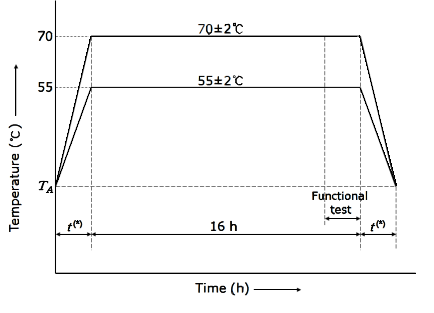 Note (*) Raising and lowering rate of temperature is to be within 1°C/min.(mean value for a period within 5 minutes **Fig 3.23.1 Program of dry heat test** | ․ No abnormality is observed. ․ The equipment is comply with the requirements of functional test. |

    | No. | Test item | testing condition and method | Criteria |
    | --- | --- | --- | --- |
    | 7 | Damp heat test | - The test shall start with 25 ±3 ℃ in atmospheric temperature and at least 95 % humidity. - The temperature in the chamber shall be continuously raised to 55 ±2 ℃ during 3h±30 min. During this period, the relative humidity shall be not less than 95 %, except during the last 15min when it shall be not less than 90 %. (see **Fig 3.23.2**) - The temperature shall then be maintained 55 ±2 ℃ until 12h ±30 min from the start of the cycle. During this period, the relative humidity shall be 93±3%, except for the first and last 15 min when it shall be between 90% and 100%. - 2 cycles shall be carried out as shown in Fig 3.10.2. The equipment is kept under operating condition during complete 1st cycle and switched off during 2nd cycle except for the operation test. And functional test is to be carried out during the first 2 hours of the 1st cycle at the environmental condition, during the last 2 hours of 2nd cycle at the environmental condition and after recovery. And duration of the second cycle can be extended due to more convenient handling of the functional test. - Insulation resistance measurements are carried out before and after test. - Detailed test methods are referred to Test Db of IEC 60068-2-30:2005. 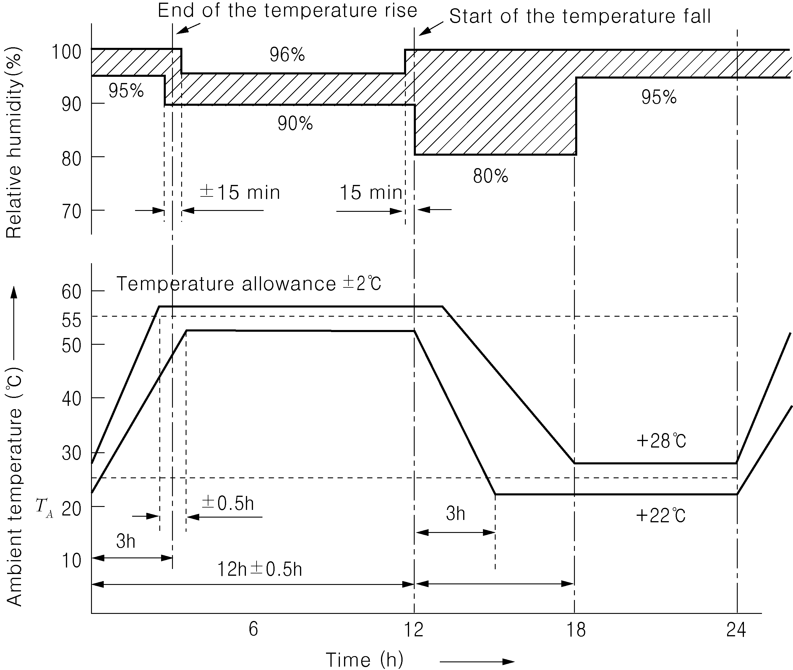 Fig 3.23.2 Program of damp heat test **Fig 3.23.2 Program of damp heat test** | ․ No abnormality is observed. ․ The equipment is comply with the requirements of performance test and functional test. |

    | No. | Test item | Testing condition and method | Criteria |
    | --- | --- | --- | --- |
    | 8 | Vibration test | ․ The equipment is at an operating condition and apply the sweeping of vibration specified in the following over the frequency range of 2(+3, -0) Hz ~ 100 Hz in order to find resonance points.(points of which amplification factor : Q≥2 are considered resonance points.) Frequency ; Amplitude or Acceleration 2(+3, -0) ~ 13.2 Hz ; Amplitude ±1.0 mm 13.2 ~ 100 Hz ; Acceleration ±0.7 g Frequency Amplitude or Acceleration 2(+3, -0) ~ 13.2 Hz Amplitude ±1.0 mm 13.2 ~ 100 Hz Acceleration ±0.7 g ․ When resonance points do not exist, apply the vibration of acceleration ±0.7 g at 30 Hz for 90 minutes as an endurance test. ․ When resonance points exist, repeat the test with necessary provisions to avoid resonance or apply the vibration (same amplitude or acceleration of resonance point) at the resonance frequency for 90 minutes as an endurance test. However, where sweep test is to be carried out instead of the discrete frequency test and a number of resonant frequencies is detected close to each other, duration of the test is to be 120 min. ․ Sweep over a restricted frequency range between 0.8 and 1.2 times the critical frequencies can be used where appropriate. Critical frequency is a frequency at which the equipment being tested may exhibit: - malfunction and/or performance deterioration - mechanical resonances and/or other response effects occur, e.g. chatter ․ during the vibration test, functional tests are to be carried out; ․ The test is carried out in three axis direction. ․ It is recommended as guidance that Q does not exceed 5. ․ For the equipment intended to be installed in severe vibration conditions such as diesel engines, air compressors, the vibration level specified in the following is applied. Frequency ; Amplitude or Acceleration 2(+3, -0) ~ 25.0 Hz ; Amplitude ±1.6 mm 25.0 ~ 100 Hz ; Acceleration ±4.0 g Frequency Amplitude or Acceleration 2(+3, -0) ~ 25.0 Hz Amplitude ±1.6 mm 25.0 ~ 100 Hz Acceleration ±4.0 g ․ More severe conditions may exist for example automatic and reomte contol systems installed on exhaust manifolds or fuel oil injection systems of diesel engines. For equipment specified for increased vibration levels the vibration test is to be conducted at the agreed vibration level, frequency range and duration. Values may be required to be in these cases 40 Hz to 2000 Hz- acceleration ±10.0 $g$ at 600 ℃ duration 90 minutes. ․ Detailed test methods are referred to Test Fc of IEC 60068-2-6:2007. | ․ No abnormality is observed. ․ The equipment is comply with the requirements of functional test. |
    | Frequency | Amplitude or Acceleration |   |   |
    | 2(+3, -0) ~ 13.2 Hz | Amplitude ±1.0 mm |   |   |
    | 13.2 ~ 100 Hz | Acceleration ±0.7 g |   |   |
    | Frequency | Amplitude or Acceleration |   |   |
    | 2(+3, -0) ~ 25.0 Hz | Amplitude ±1.6 mm |   |   |
    | 25.0 ~ 100 Hz | Acceleration ±4.0 g |   |   |

    | No. | Test item | Testing condition and method | Criteria |
    | --- | --- | --- | --- |
    | 9 | Inclination test | ․ The equipment is at an operating condition and check the operation of the equipment with 22.5° static inclination. ․ The equipment is at an operating condition and check the operation of the equipment with rolling of 22.5° at period of about 10 seconds for not less than 15 min. ․ The test is carried out in three axis directions. ․ These inclination tests are normally not required for equipment with no moving parts. ․ Detailed test methods are referred to IEC 60092-504:2016. | ․ No abnormality is observed. ․ The equipment operates satisfactory. |
    | 10 | Insulation resistance test | ․ Measure the insulation resistance between current carrying parts and between current parts and earth when measured with the following application voltage. Rated voltage : Un(V) ; Test voltage(D.C. voltage)(V) Un ≤ 65 ; 2 × Un, min. 24 Un ＞ 65 ; 500 Rated voltage : Un(V) Test voltage(D.C. voltage)(V) Un ≤ 65 2 × Un, min. 24 Un ＞ 65 500 ․ Measurements are carried out before and after; other series of environmental tests, damp heat test, cold test and salt mist test. ․ For the equipment containing circuits in which the application of the test voltage is not desirable, the test voltage is applied after removing the circuits. | ․ The insulation resistance($\mathrm{M} \Omega$) is not less than the value specified in the following. Rated voltage ; Before test ; After test Un≤65 ; 10 ; 1.0 Un＞65 ; 100 ; 10 Rated voltage Before test After test Un≤65 10 1.0 Un＞65 100 10 |
    | Rated voltage : Un(V) | Test voltage(D.C. voltage)(V) |   |   |
    | Un ≤ 65 | 2 × Un, min. 24 |   |   |
    | Un ＞ 65 | 500 |   |   |
    | Rated voltage | Before test | After test |   |
    | Un≤65 | 10 | 1.0 |   |
    | Un＞65 | 100 | 10 |   |
    | 11 | High voltage test | ․ Apply the following test voltage, alternating of a frequency of 50 Hz or 60 Hz, between current carrying parts and between current-carrying parts connected and earth for 1 minute. Rated voltage : Un(V) ; Test voltage(V) Un ≤ 65 ; 2 × Un + 500 65 ＜ Un ≤ 250 ; 1,500 250 ＜ Un ≤ 500 ; 2,000 500 ＜ Un ≤ 690 ; 2,500 Rated voltage : Un(V) Test voltage(V) Un ≤ 65 2 × Un + 500 65 ＜ Un ≤ 250 1,500 250 ＜ Un ≤ 500 2,000 500 ＜ Un ≤ 690 2,500 ․ For the equipment containing circuits in which the application of the test voltage is not desirable, the test voltage is applied after removing the circuits. | ․ No abnormality is observed. |
    | Rated voltage : Un(V) | Test voltage(V) |   |   |
    | Un ≤ 65 | 2 × Un + 500 |   |   |
    | 65 ＜ Un ≤ 250 | 1,500 |   |   |
    | 250 ＜ Un ≤ 500 | 2,000 |   |   |
    | 500 ＜ Un ≤ 690 | 2,500 |   |   |

    | No. | Test item | Testing condition and method | Criteria |
    | --- | --- | --- | --- |
    | 12 | Cold test | ․ The test shall be carried out at 25 ±10 ℃ in atmospheric temperature. ․ The equipment is switched off except for the functional test and apply the environmental condition of +5 ±3 ℃ for 2 hours. And functional test is to be carried out during the last hour at the test temperature and after recovery. ․ For the equipment installed in open decks, etc., the environmental condition of -25 ±3 ℃ is applied for 2 hours. ․ Insulation resistance measurements are carried out before and after cold test. ․ Detailed test methods are referred to Test Ab or Test Ad of IEC 60068-2-1:2007. 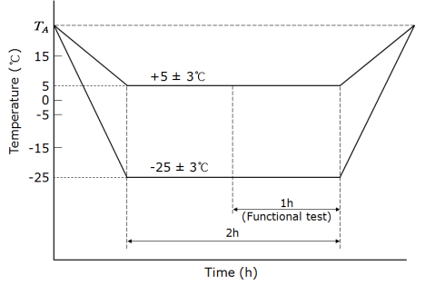**Fig 3.23.3 Program of cold test** | ․ No abnormality is observed. ․ The equipment is comply with the requirements of functional test. |
    | 13 | Salt mist test | ․ Salt mist test is to be carried out for equipment installed in weather exposed areas. ․ The equipment is switched off except when its operation is checked. Apply four cycles of the environmental condition of spraying NaCl liquid (saline solution, 5 % NaCl, pH 6.5 ~ 7.2, 20 ±2 ℃) for 2 hours and leaving for 7 days. Check the operation of the equipment during the 7th day of each cycle and after recovery. ․ Damp chamber conditions for storage are to be maintained as follows; - Temp. : 40℃±2℃ - Relative humidity : 93% +2% -3% ․ The test is carried out according to the following procedure - Insulation resistance and functional test before test - Functional test on the 7th day of each cycle period - Insulation resistance and performance test : 4 to 6 hours after recovery ․ On completion of exposure, the equipment is to be examined to verify that deterioration or corrosion (if any) is superficial in nature. ․ Detailed test methods are referred to Test Kb of IEC 60068-2-52:2017. | ․ No abnormality is observed. ․ The equipment is comply with the requirements of performance test and functional test. |

    | No. | Test item | Testing condition and method | Criteria |
    | --- | --- | --- | --- |
    | 14 | Electrostatic discharge immunity test | ․ Check the operation of the equipment when the electrostatic discharge immunity test is carried out according to the following condition. Contact discharge ; 6 kV Air discharge ; 2 kV, 4 kV, 8 kV Interval between single discharge ; 1 sec. No. of Pulses ; 10 per polarity Contact discharge 6 kV Air discharge 2 kV, 4 kV, 8 kV Interval between single discharge 1 sec. No. of Pulses 10 per polarity ․ The test is to be confined to the points and surfaces that can normally be reached by the operator. ․ Detailed test methods are referred to Test level 3 of IEC 61000-4-2:2008. | ․ Performance Criterion B(1) |
    | Contact discharge | 6 kV |   |   |
    | Air discharge | 2 kV, 4 kV, 8 kV |   |   |
    | Interval between single discharge | 1 sec. |   |   |
    | No. of Pulses | 10 per polarity |   |   |
    | 15 | Electromagnetic field immunity test | ․ Check the operation of the equipment when the radiated radio frequency immunity test is carried out according to the following condition. Frequency range ; 80 MHz ~ 6 GHz Modulation ; 80 % AM at 1,000 Hz Field strength ; 10 V/m Frequency sweep rate ; ≤1.5 × 10decades/sec. (or 1 %/3 sec.) Frequency range 80 MHz ~ 6 GHz Modulation 80 % AM at 1,000 Hz Field strength 10 V/m Frequency sweep rate ≤1.5 × 10decades/sec. (or 1 %/3 sec.) ․ If for tests of equipment an input signal with a modulation frequency of 1,000 Hz is necessary, a modulation frequency(80 % AM) of 400 Hz may be chosen. ․ The test is to be confined to the appliances exposed to direct radiation by transmitters at their place of installation. ․ If an equipment is intended to receive radio signals for the purpose of radio communication (e.g. wifi router, remote radio controller), then the immunity limits at its communication frequency do not apply, subject to the requirements in Pt 6, Ch 2, 407. 2 (2) of Rules for the Classification of Steel Ships. ․ Detailed test methods are referred to Test level 3 of IEC 61000-4-3:2020 or IEC 61000-4-3:2006+AMD1:2007+AMD2:2010. | ․ Performance Criterion A(2) |
    | Frequency range | 80 MHz ~ 6 GHz |   |   |
    | Modulation | 80 % AM at 1,000 Hz |   |   |
    | Field strength | 10 V/m |   |   |
    | Frequency sweep rate | ≤1.5 × 10decades/sec. (or 1 %/3 sec.) |   |   |
    | 16 | Conducted low frequency immunity test | ․ Check the operation of the equipment when the conducted low frequency immunity test is carried out according to the following condition. (values in round brackets are shown where the rated frequency of the equipment is 50 Hz) 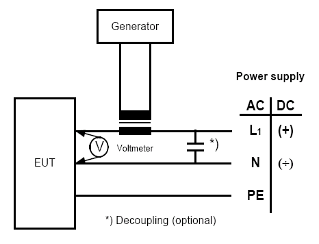 **Fig 3.23.4 Test Set-up - Conducted Low Frequency Test** | ․ Performance Criterion A(2) |

    | No. | Test item | Testing condition and method | Criteria |
    | --- | --- | --- | --- |
    | 16 | Conducted low frequency immunity test | Frequency range ; 60 $Hz$~12 kHz (50 $Hz$~10 kHz) Test voltage ; AC ; 10 % of supply voltage ; 60 Hz~900 Hz (50 Hz~750 Hz) 10 % to 1 % of supply voltage ; 900 Hz~6 Hz (750 Hz~5 kHz) 1 % of supply voltage ; 6 kHz~12 kHz (5 kHz~10 kHz) DC ; 10 % of supply voltage (at least 3 V) ; 50 Hz~10 kHz Maximum power ; AC ; min 3 V r.m.s, max 2 W. DC ; 2 W Frequency range 60 $Hz$~12 kHz (50 $Hz$~10 kHz) Test voltage AC 10 % of supply voltage 60 Hz~900 Hz (50 Hz~750 Hz) 10 % to 1 % of supply voltage 900 Hz~6 Hz (750 Hz~5 kHz) 1 % of supply voltage 6 kHz~12 kHz (5 kHz~10 kHz) DC 10 % of supply voltage (at least 3 V) 50 Hz~10 kHz Maximum power AC min 3 V r.m.s, max 2 W. DC 2 W ․ For keeping max. 2 W, the voltage of the test signal may be lower. ․ In case of marine navigational and radiocommunication equipment and systems, this test can be exempted. | ․ Performance Criterion A(2) |
    | Frequency range | 60 $Hz$~12 kHz (50 $Hz$~10 kHz) |   |   |
    | Test voltage | AC | 10 % of supply voltage | 60 Hz~900 Hz (50 Hz~750 Hz) |
    | Test voltage | AC | 10 % to 1 % of supply voltage | 900 Hz~6 Hz (750 Hz~5 kHz) |
    | Test voltage | AC | 1 % of supply voltage | 6 kHz~12 kHz (5 kHz~10 kHz) |
    | Test voltage | DC | 10 % of supply voltage (at least 3 V) | 50 Hz~10 kHz |
    | Maximum power | AC | min 3 V r.m.s, max 2 W. |   |
    | Maximum power | DC | 2 W |   |
    | 17 | Conducted radio frequency immunity test | ․ Check the operation of the equipment when the conducted high frequency immunity test is carried out according to the following condition. Frequency range ; 150 kHz ~ 80 MHz Modulation ; 80 % AM at 1,000 Hz Amplitude ; 3 Vrms(3) Frequency sweep rate ; ≤1.5 × 10-3 decades/sec. (or 1 %/3 sec.) Frequency range 150 kHz ~ 80 MHz Modulation 80 % AM at 1,000 Hz Amplitude 3 Vrms(3) Frequency sweep rate ≤1.5 × 10-3 decades/sec. (or 1 %/3 sec.) ․ If for tests of equipment an input signal with a modulation frequency of 1 kHz is necessary a modulation frequency(80 % AM) of 400 Hz should be chosen. ․ Detailed test methods are referred to Test level 2 of IEC 61000-4-6:2013. | ․ Performance Criterion A(2) |
    | Frequency range | 150 kHz ~ 80 MHz |   |   |
    | Modulation | 80 % AM at 1,000 Hz |   |   |
    | Amplitude | 3 Vrms(3) |   |   |
    | Frequency sweep rate | ≤1.5 × 10-3 decades/sec. (or 1 %/3 sec.) |   |   |
    | 18 | Electrical fast transients / Burst immunity test | ․ Check the operation of the equipment when the electrical fast transients / burst immunity test is carried out according to the following condition. Single pulse rise time ; 5 nS (10 ~ 90 % value) Single pulse width ; 50 nS (50 % value) Amplitude(peak) ; line on power supply port/earth : 2 kV line/line on I/O data control and signal lines : 1 kV Pulse period ; 300 mS Burst duration ; 15 mS Duration ; 5 min./polarity Single pulse rise time 5 nS (10 ~ 90 % value) Single pulse width 50 nS (50 % value) Amplitude(peak) line on power supply port/earth : 2 kV line/line on I/O data control and signal lines : 1 kV Pulse period 300 mS Burst duration 15 mS Duration 5 min./polarity ․ Detailed test methods are referred to Test level 3 of IEC 61000-4-4:2012. | ․ Performance Criterion B(1) |
    | Single pulse rise time | 5 nS (10 ~ 90 % value) |   |   |
    | Single pulse width | 50 nS (50 % value) |   |   |
    | Amplitude(peak) | line on power supply port/earth : 2 kV |   |   |
    | Amplitude(peak) | line/line on I/O data control and signal lines : 1 kV |   |   |
    | Pulse period | 300 mS |   |   |
    | Burst duration | 15 mS |   |   |
    | Duration | 5 min./polarity |   |   |

    | No. | Test item | Testing condition and method | Criteria |
    | --- | --- | --- | --- |
    | 19 | Surge immunity test | ․ Check the operation of the equipment when the surge immunity test is carried out according to the following condition. Test applicable to AC and DC power ports Open- circuit voltage ; Pulse rise time ; 1.2 $\mu s$(front time) Pulse width ; 50 $\mu s$(time to half value) Amplitude(peak) ; line/earth :1 kV line/line : 0.5 kV Short- circuit current ; Pulse rise time ; 8 $\mu s$(front time) Pulse width ; 20 $\mu s$(time to half value) Repetition rate ; at least 1 pulse/min. No. of pulse ; 5 per polarity Test applicable to AC and DC power ports Open- circuit voltage Pulse rise time 1.2 $\mu s$(front time) Pulse width 50 $\mu s$(time to half value) Amplitude(peak) line/earth :1 kV line/line : 0.5 kV Short- circuit current Pulse rise time 8 $\mu s$(front time) Pulse width 20 $\mu s$(time to half value) Repetition rate at least 1 pulse/min. No. of pulse 5 per polarity ․ Detailed test methods are referred to Test level 2 of IEC 61000-4-5:2017. | ․ Performance Criterion B(2) |
    | Test applicable to AC and DC power ports |   |   |   |
    | Open- circuit voltage | Pulse rise time | 1.2 $\mu s$(front time) |   |
    | Open- circuit voltage | Pulse width | 50 $\mu s$(time to half value) |   |
    | Open- circuit voltage | Amplitude(peak) | line/earth :1 kV |   |
    | Open- circuit voltage | Amplitude(peak) | line/line : 0.5 kV |   |
    | Short- circuit current | Pulse rise time | 8 $\mu s$(front time) |   |
    | Short- circuit current | Pulse width | 20 $\mu s$(time to half value) |   |
    | Repetition rate |   | at least 1 pulse/min. |   |
    | No. of pulse |   | 5 per polarity |   |
    | 20 | Radiated emission test | ․ Radiated emission test is to be carried out according to the following. For equipment installed in the bridge and deck zone. Frequency range ; Quasi peak limits 150 kHz ~ 300 kHz ; 80 ~ 52 $\mathrm{dB} \mu V/m$ 300 kHz ~ 30 MHz ; 52 ~ 34 $\mathrm{dB} \mu V/m$ 30 MHz ~ 1,000 MHz ; 54 $\mathrm{dB} \mu V/m$ 156 MHz ~ 165 MHz ; 24 $\mathrm{dB} \mu V/m$ For equipment installed in a zone other than bridge and deck zone 150 kHz ~ 30 MHz ; 80 ~ 50 $\mathrm{dB} \mu V/m$ 30 MHz ~ 100 MHz ; 60 ~ 54 $\mathrm{dB} \mu V/m$ 100 MHz ~ 1,000 MHz ; 54 $\mathrm{dB} \mu V/m$ 156 MHz ~ 165 MHz ; 24 d$\mathrm{dB} \mu V/m$ For equipment installed in the bridge and deck zone. Frequency range Quasi peak limits 150 kHz ~ 300 kHz 80 ~ 52 $\mathrm{dB} \mu V/m$ 300 kHz ~ 30 MHz 52 ~ 34 $\mathrm{dB} \mu V/m$ 30 MHz ~ 1,000 MHz 54 $\mathrm{dB} \mu V/m$ 156 MHz ~ 165 MHz 24 $\mathrm{dB} \mu V/m$ For equipment installed in a zone other than bridge and deck zone 150 kHz ~ 30 MHz 80 ~ 50 $\mathrm{dB} \mu V/m$ 30 MHz ~ 100 MHz 60 ~ 54 $\mathrm{dB} \mu V/m$ 100 MHz ~ 1,000 MHz 54 $\mathrm{dB} \mu V/m$ 156 MHz ~ 165 MHz 24 d$\mathrm{dB} \mu V/m$ Frequency range ; Average limit 1,000 MHz ~ 6,000 MHz ; 54 $\mathrm{dB} \mu V/m$ Frequency range Average limit 1,000 MHz ~ 6,000 MHz 54 $\mathrm{dB} \mu V/m$ ․ Distance between equipment and antenna is to be 3 m. ․ For the frequency band 156 MHz to 165 MHz the measurement shall be repeated with a receiver bandwidth of 9 kHz (as per IEC 60945). ․ Alternatively the radiation limit at a distance of 3 m from the enclosure port over the frequency 156 MHz to 165 MHz is to be 30 $\mathrm{dB} \mu V/m$ peak. (as per IEC 60945:2002). ․ Equipment intended to transmit radio signals for the purpose of radio communication (e.g. wifi router, remote radio controller) may be exempted from limit, within its communication frequency range, subject to the requirements in Pt 6, Ch 2, 407. 2 (2) of Rules for the Classification of Steel Ships.. ․ Detailed test methods are referred to CISPR 16-2-3:2016 and IEC 60945:2002(for 156 ~ 165 MHz). | ․ Radiated emission is to be within limits in the table.(4) |
    | For equipment installed in the bridge and deck zone. |   |   |   |
    | Frequency range | Quasi peak limits |   |   |
    | 150 kHz ~ 300 kHz | 80 ~ 52 $\mathrm{dB} \mu V/m$ |   |   |
    | 300 kHz ~ 30 MHz | 52 ~ 34 $\mathrm{dB} \mu V/m$ |   |   |
    | 30 MHz ~ 1,000 MHz | 54 $\mathrm{dB} \mu V/m$ |   |   |
    | 156 MHz ~ 165 MHz | 24 $\mathrm{dB} \mu V/m$ |   |   |
    | For equipment installed in a zone other than bridge and deck zone |   |   |   |
    | 150 kHz ~ 30 MHz | 80 ~ 50 $\mathrm{dB} \mu V/m$ |   |   |
    | 30 MHz ~ 100 MHz | 60 ~ 54 $\mathrm{dB} \mu V/m$ |   |   |
    | 100 MHz ~ 1,000 MHz | 54 $\mathrm{dB} \mu V/m$ |   |   |
    | 156 MHz ~ 165 MHz | 24 d$\mathrm{dB} \mu V/m$ |   |   |
    | Frequency range | Average limit |   |   |
    | 1,000 MHz ~ 6,000 MHz | 54 $\mathrm{dB} \mu V/m$ |   |   |

    | No. | Test item | Testing condition and method | Criteria |
    | --- | --- | --- | --- |
    | 21 | Conducted emission test | ․ Conducted emission test is to be carried out according to the following. For equipment installed in the bridge and deck zone. Frequency range ; Limits 10 kHz ~ 150 kHz ; 96 ~ 50 $\mathrm{dB} \mu V$ 150 kHz ~ 350 kHz ; 60 ~ 50 $\mathrm{dB} \mu V$ 350 kHz ~ 30 MHz ; 50 $\mathrm{dB} \mu V$ For equipment installed in a zone other than bridge and deck zone Frequency range ; Limits 10 kHz ~ 150 kHz ; 120 ~ 69 $\mathrm{dB} \mu V$ 150 kHz ~ 500 kHz ; 79 $\mathrm{dB} \mu V$ 500 kHz ~ 30 MHz ; 73 $\mathrm{dB} \mu V$ For equipment installed in the bridge and deck zone. Frequency range Limits 10 kHz ~ 150 kHz 96 ~ 50 $\mathrm{dB} \mu V$ 150 kHz ~ 350 kHz 60 ~ 50 $\mathrm{dB} \mu V$ 350 kHz ~ 30 MHz 50 $\mathrm{dB} \mu V$ For equipment installed in a zone other than bridge and deck zone Frequency range Limits 10 kHz ~ 150 kHz 120 ~ 69 $\mathrm{dB} \mu V$ 150 kHz ~ 500 kHz 79 $\mathrm{dB} \mu V$ 500 kHz ~ 30 MHz 73 $\mathrm{dB} \mu V$ ․ Test applicable to AC and DC power ports. ․ Detailed test methods are referred to CISPR 16-2-1:2017 | ․ Conducted emission is to be within limits in the table. |
    | For equipment installed in the bridge and deck zone. |   |   |   |
    | Frequency range | Limits |   |   |
    | 10 kHz ~ 150 kHz | 96 ~ 50 $\mathrm{dB} \mu V$ |   |   |
    | 150 kHz ~ 350 kHz | 60 ~ 50 $\mathrm{dB} \mu V$ |   |   |
    | 350 kHz ~ 30 MHz | 50 $\mathrm{dB} \mu V$ |   |   |
    | For equipment installed in a zone other than bridge and deck zone |   |   |   |
    | Frequency range | Limits |   |   |
    | 10 kHz ~ 150 kHz | 120 ~ 69 $\mathrm{dB} \mu V$ |   |   |
    | 150 kHz ~ 500 kHz | 79 $\mathrm{dB} \mu V$ |   |   |
    | 500 kHz ~ 30 MHz | 73 $\mathrm{dB} \mu V$ |   |   |
    | 22 | Flame resistance test | ․ Flame resistance test is to be carried out according to the following condition. Flame application ; 5 times 15 sec. each Interval between each application ; 15 sec. or 1 time 30 sec. Flame application 5 times 15 sec. each Interval between each application 15 sec. or 1 time 30 sec. ․ The test is performed with the EUT or housing of the EUT applying needle-flame test method. ․ Detailed test methods are referred to IEC 60092-101:2018 or IEC 60695-11-5:2016**.** | - The burnt out or damaged part of the specimen by not more than 60 mm long. - No flame, no incandescence or - In the event of a flame or incandescence being present, it shall extinguish itself within 30 s of the removal of the needle flame without full combustion of the test specimen. - Any dripping material shall extinguish itself in such a way as not to ignite a wrapping tissue. The drip height is 200 mm ± 5 mm. |
    | Flame application | 5 times 15 sec. each |   |   |
    | Interval between each application | 15 sec. or 1 time 30 sec. |   |   |
    | 23 | Pressure test | ․ Apply the pneumatic or hydraulic pressure of 1.5 times the designed pressure. | ․ No abnormality is observed. |

    | (Note) (1) Performance Criterion B: The Equipment Under Test is to continue to operate as intended after the tests. No degradation of performance or loss of function is allowed as defined in the technical specification published by the manufacturer. During the test, degradation or loss of function or performance which is self recoverable is however allowed but no change of actual operating state or stored data is allowed. (2) Performance Criterion A: The EUT is to continue to operate as intended during and after the test. No degradation of performance or loss of function is allowed as defined in the technical specification published by the manufacturer. (3) For equipment installed on the bridge and deck zone, the test levels shall be increased to 10 Vrms for spot frequencies in accordance with IEC 60945:2002 at 2, 3, 4, 6.2, 8.2, 12.6, 16.5, 18.8, 22, 25 MHz. (4) The upper frequency of the radiated emission test may be reduced depending on the highest internal frequency of the EUT, as per 7.6.6.2.2 of CISPR 16-2-3:2016. If the highest frequency of the EUT is: *(2022)* - below 108 MHz : emission shall be measured up to 1 GHz, - between 108 MHz and 500 MHz : emission shall be measured up to 2 GHz, - between 500 MHz and 1 GHz : emission shall be measured up to 5 GHz, - above 1 GHz : emission shall be measured up to the lower of 5 times of the highest internal frequency and 6 GHz. The conditional testing procedure cannot be applied unless the highest internal frequency of the EUT is documented. |
    | --- |

### Section 24 Equipment related to Ventilation Systems in Oil Tankers

#### 2401. General

- **1.** **Application**
  The requirements of this Section apply to tests and inspection for the type approval of equipment related to ventilation systems in oil tankers in accordance with the requirements in **Pt 7, Ch 1, 1004.** and **Pt 7, Ch 6, Sec 8** of the Rules.
- **2.** **Definitions**
  The terms used in this Section are defined as follows:
  - **(1)** **PV valve** is a device designed to maintain pressure and vacuum in a closed container within preset in limit conformity.
  - **(2)** **Flame screen** is a device utilizing wire mesh to prevent the passage of unconfined flames in conformity.
  - **(3)** **Flame arrester** is a device to prevent the passage of flame by elements based on the principle of quenching in conformity.
  - **(4)** **Detonation flame arrester** is a device to prevent the passage of flame generated in association with a detonation in the line pipe in conformity.
  - **(5)** **High velocity device** is a device to prevent the passage of flame consisting of a mechanical valve which adjust the opening available for flow in accordance with the pressure at inlet of the valve in such a way that the efflux velocity can not be less than 30 $m/s$ in conformity.
  - **(6)** **Flame speed** is the speed at which a flame propagates along a pipe or the other system.
  - **(7)** **Flashback** is the transmission of a flame through a device.
  - **(8)** **High level alarm system** is a device which alarms of excessive rises in the liquid cargo level to guard liquid rising in the venting system to the height which would exceed the designed head of cargo tanks in conformity.
  - **(9)** **Pressure monitoring system** is a device to prevent over-pressure and or under-pressure during cargo loading and ballasting or discharging operations, and to monitor the tank pressure and to actuate an alarm when the tank pressure reaches to a set pressure.

#### 2402. PV Valve

- **1.** **Materials and construction**
  Materials and construction of PV valve are to comply with the requirements given in **Table 3.24.1**

  **Table 3.24.1 Materials and construction of PV valve**

  | Kinds | Requirements |
  | --- | --- |
  | Materials | (A) The device housing, and other parts or bolted used for pressure retention, shall be constructed of materials suitable for the intended service and listed in a recognized national or international standard. (B) Housings, discs, spindles, seals, springs, gaskets, seals and all other integral parts, including parts with coatings to prevent corrosion, shall be made of materials resistant to attack by seawater and the liquids and vapours contained in the tank being protected. (C) Springs plated with corrosion-resistant material are not acceptable. (D) Non-metallic materials, other than gaskets and seals, shall not be used in the construction of pressure-retaining components of the device. (E) Resilient seals may be installed only if the device is still capable of effectively performing its function when the seals are partially or completely damaged or burned. (F) Non-metallic gaskets shall be made of non-combustible material suitable for the service intended. (G) Materials for connecting pressure/vacuum valves to their respective piping systems to which they are connected. (H) The materials for all parts not identified above shall be suitable for their intended purpose. (I) The possibility of galvanic corrosion shall be considered in the selection of materials. |
  | Structure | (A) Device housings shall be gastight in the primary pressure zone upstream of the main valve seat to prevent the escape of vapours. |

  **Table 3.24.1 Materials and construction of PV valve (continued)**

  | Kinds | Requirements |
  | --- | --- |
  | Structure | (B) Housings, elements and seal gasket materials shall be capable of withstanding of the maximum and minimum pressures and temperatures to which the device may be exposed under normal operating conditions and shall be capable of withstanding the hydrostatic pressure specified in Table 3.24.2 of 2402. 2. (C) Where welded construction is used for pressure-retaining components, welded-joint design details, welding and welders shall be in accordance with the relevant Rules of Pt 2. and appropriate non-destructive testing shall be carried out. (D) When pressure/vacuum valves are designed to allow for inspection, cleaning, repair or removal of internal elements for replacement without removing the entire device form th system, the design shall not allow the valve to be incorrectly reassembled following disassembly for inspection, cleaning or repair. (E) Pressure/vacuum valves shall be designed such that condensed vapour drains from the device and does not impair the efficiency of the device. The design shall also prevent the accumulation of water inside the device and subsequent blockage due to freezing. (F) Where design does not permit complete drainage of condensed vapours through its connection to the tank, the housing shall be fitted with a plugged drain opening on the side of the atmospheric outlet of not less than 13 mm. The drain shall not allow vapour to escape unless the drain is equipped with suitable means to prevent the passage of flame and meets all requirements for efflux velocity and direction. (G) All fastenings essential to the operation of the device shall be protected against loosening. (H) Devices shall be designed and constructed to minimize the effect of fouling under normal operating conditions. The design shall be such that the device can be examined for any build-up of residue due to vapour condensation that might impair the operation of the device. (I) Devices shall be capable of operating over the full range of ambient temperatures anticipated. Devices shall also be capable of operating in freezing conditions and when covered by a layer of ice, the allowed thickness of which shall be stated by the manufacturer in the operating manual. Devices shall be capable of operating at whatever surface temperature is developed by heating arrangements. (J) End-of-line devices shall be constructed to direct the efflux vertically upward under all flow rates. (K) A manual means shall be provided to verify that valve lifts easily and cannot remain in the open position. (L) Valve discs shall be guided by a suitable means to prevent binding and ensure proper self-closing (seating), taking into account the possible build-up of condensed vapours passing through the valve during loading, when maintenance is carried out in accordance with the manufacturer's requirements. Valve discs shall normally close against the valve seat by metal-to-metal contact. Resilient-seating seals may be provided in the design is such that the disc closed tight against the seat in case the seals are destroyed, damaged or otherwise carried away. Valve discs may be solid or made hollow so that weight material may be added to vary the lifting pressure. If hollow discs are employed, a watertight bolted cover shall be fitted to encase the weight material. The lifting pressure shall not be varied by personnel other than the manufacturer without prior approval by the administration. A clear indication, visible from the outside of the valve, shall be employed to indicate the position of the valve. (M) Valves may be actuated by non-metallic diaphragms except where failure would result in unrestricted flow of tank vapours to the atmosphere or in an increase in the pressure or vacuum at which the valve normally releases (N) Relief pressure adjusted mechanisms shall be permanently secured by lockwire, locknuts or other suitable means to prevent devices from becoming misadjusted due to handling, installation or vibration. |
- **2.** **Type tests**
  - **(1)** Test product
    The test products used in the type test are to be of each configuration and dimension given in the application.
  - **(2)** Details of tests and examinations
    Type test and inspection of PV valve are to be in accordance with the requirements given in **Table 3.24.2**

    **Table 3.24.2 Type test and inspection of PV valve**

    | Test item | Test method |
    | --- | --- |
    | Construction inspection | The materials, construction and dimension of the device shall be confirmed. |
    | Corrosion test | A corrosion test shall be conducted. In this test, a complete device, including a section of pipe similar to that to which the device will be fitted, shall be exposed to a 5 % sodium chloride solution spray at a temperature of 25℃(41℉) for a period of 240 h, and allowed to dry for 48 h. Following this exposure, all movable parts shall operate properly and there shall be no corrosion deposits that cannot be washed off. |
    | Hydrostatic pressure test | The pressure-retaining boundary of the device shall be subjected to a hydrostatic-pressure test of at least 150 % of maximum rated pressure(MRP) or a minimum pressure of 345 $kPa$ gauge (50psig), whichever is greater, for ten minutes without rupturing, leaking or showing permanent distortion. |
    | Performance characteristics | Performance characteristics as declared by the manufacturer, such as flow under both positive and negative pressures, operating sensitivity flow resistance and velocity, shall be demonstrated by appropriate tests. Flow testing shall be conducted in accordance with the flow test below. |
    | Pneumatic test | Each finished device shall be pneumatically tested at 70 kPa either using a submersion test or a soap test for a duration of three minutes to ensure there is no leakage. |
    | Flow tests | (a) The capacity data shall be presented in the form of curves or tables that give the volume of flow through both vacuum and pressure ports and that cover the full range between the opening pressure (or vacuum) and the pressure(or vacuum) at which the ports are fully open and the valve is flowing at its maximum anticipated rate. The capacity data for pilot-operated vents or devices that open fully at a set pressure (or vacuum) may be expressed as a flow coefficient that is the ratio of the flow through the vent to the flow through a theoretically perfect nozzle of the same diameter. Sufficient measurements shall be made a t pressures in the vicinity of the opening points, particularly at 1.1, 1.2 and 1.5 times the opening pressure and at 1.5 and 2.0 times the opening point on vacuum, to establish clearly the flow capacity at these points. (b) The capacity data shall indicate the points of initial opening and final closing of the venting device. (c) The capacity data shall be expressed in terms of cubic metres of air per hour at a temperature of 0℃ and a pressure of 1,015 hPa (d) Pressures shall be expressed in hectopascals, however, auxiliary scales shall be expressed in millimeters of water, and other units of measurement may also be included if desired. 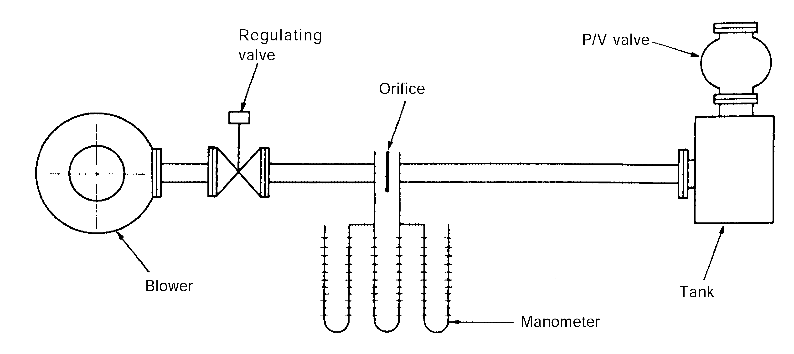 Fig 3.24.1 Example of Testing Equipment for PV Valve **Fig 3.24.1 Example of Testing Equipment for PV Valve** |

#### 2403. Devices to Prevent the Passage of Flame

- **1.** **General**
  - **(1)** Materials and strength, construction and dimension, and tests and inspections of a flame screen, a flame arrester, a detonation flame arresters and a high velocity vent are to be in accordance with the requirements in the following **2** through **3**.
  - **(2)** For flame screens, after carrying out a corrosion test and a hydraulic test, a flashback test and a general inspection are to be carried out. The test component is not to be exchanged for each test requested and is to have the most inappropriate gap dimension expected in the service of the product. An example of testing equipment for the flashback test is shown in Fig **3.24.2.**
    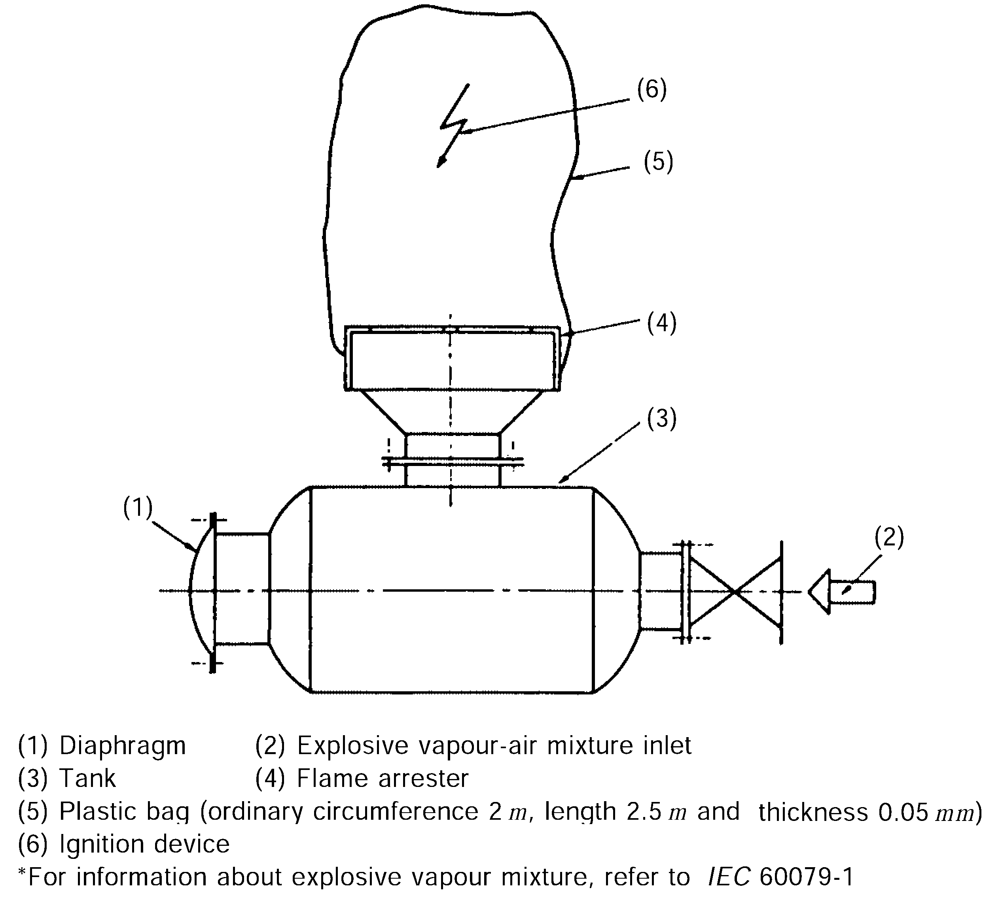
    Fig 3.24.2 Example of Testing Equipment for Flame Arrester
  - **(3)** For flame arresters, after carrying out a corrosion test and a hydraulic test, a flashback test, an endurance burning test and a general inspection are to be carried out.
  - **(4)** For detonation flame arresters, after carrying out a corrosion test and a hydraulic test, a detonation test, an endurance burning test and a general inspection are to be carried out. The test component is not to be exchanged for each test requested and is to have the most inappropriate gap dimension expected in the service of the product. An example of testing equipment for the detonation test is shown in **Fig 3.24.3**
    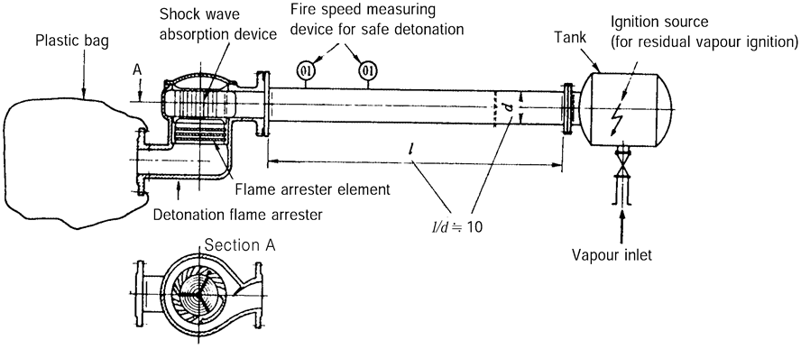
    **Fig 3.24.3 Example of Testing Equipment for Detonation Flame Arrester**
  - **(5)** For high velocity devices, after carrying out a corrosion test and a hydraulic test, a flow volume test, a flashback test, an endurance burning test and a general inspection are to be carried out. The test component is not to be exchanged for each test requested and is to have the most inappropriate gap dimension expected in the service of the product. Examples of testing equipment for the flashback test, and the flow volume test and the endurance burning test are shown in Fig **3.24.4.**
    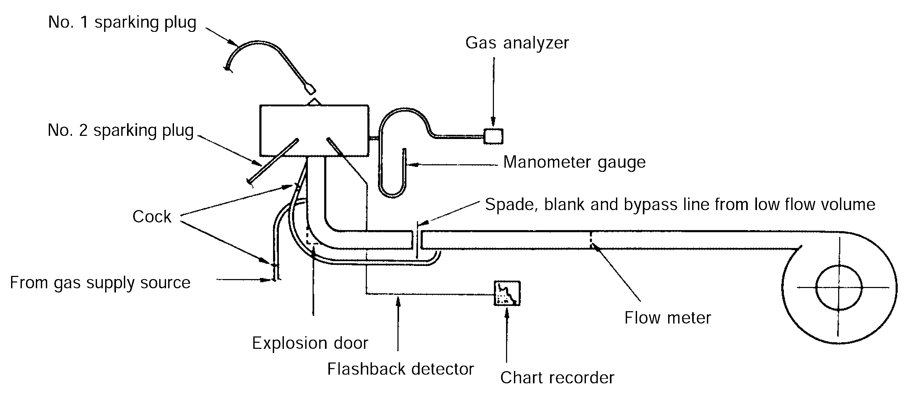
    Fig 3.24.4 Example of Testing Equipment for High Speed Discharger(For flashback test)
    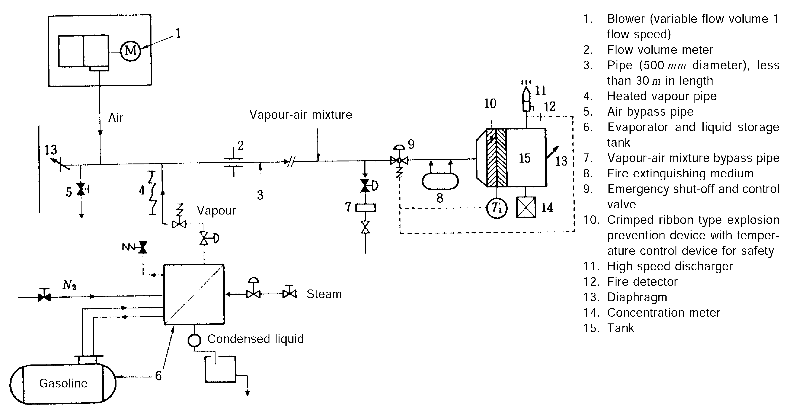
    Fig 3.24.5 Example of Testing Equipment for High Speed Discharger
  - **(6)** Refer to ISO 16852:2016 for the definition of stable detonation and detailed test methods. *(2022)*
- **2.** **Materials and structure**
  Materials and structure of a flame screen, a flame arrester, a detonation flame arresters and a high velocity vent are to comply with the requirements given in **Table 3.24.3**

  **Table 3.24.3 Materials and structure for devices to prevent the passage of flame**

  | Kinds |   | Requirements |
  | --- | --- | --- |
  | Material |   | (A) The casing or housing of devices should meet similar standards of strength, heat resistance and corrosion resistance as the pipe to which they are attached. (B) Elements, gaskets and seals should be of material resistant to both seawater and the cargoes carried. (C) The casing and element and gasket materials should be capable of withstanding the highest pressure and temperature to which the device may be exposed under both normal and specified fire test conditions. |
  | Structure | General | (a) The design of devices should allow for ease of inspection and removal of internal elements for replacement, cleaning or repair. (b) Devices should allow for efficient drainage of moisture without impairing their efficiency to prevent the passage of flame. (c) Fastenings essential to the operation of the device, i.e. screws, etc., should be protected against loosening. (d) Devices should be designed and constructed to minimize the effect of fouling under normal operating conditions. (e) All flat joints of the housing should be machined true and should provide for a joint having an adequate metal-to-metal contact. (f) Resilient seals may be installed only if their design is such that if the seals are partially or completely damaged or burned, the device is still capable of effectively preventing the passage of flame. (g) End-of-line devices should be so constructed as to direct the efflux vertically upwards. (h) Devices should be capable of operating in freezing conditions. (i) Devices are to be protected against mechanical damage. (j) Performance characteristics, such as the flow rates under both positive and negative pressure, operating sensitivity, flow resistance and velocity should be demonstrated by appropriate tests. In this case, the presence of the Surveyor may be dispensed with. |
  | Structure | Flame screen, flame arrester and detonation flame arrester | (a) The design of devices should allow for ease of inspection and removal of internal elements for replacement, cleaning or repair. (b) The clear area through the element or screen is to be at least 1.5 times the cross-sectional area of the line. (c) The elements are to be secured in the casing in such a way that flame cannot pass between the element and casing. |
  | Structure | High velocity devices | (a) High velocity devices are to have a width of the contact area of the valve seat of at least 5 mm. (b) Means should be provided to check that any valve lifts easily without remaining in the open position. (c) In the case of high velocity vents, the possibility of inadvertent detrimental hammering. |
- **3.** **Type tests**
  - **(1)** Test product
    The test products used in the type test are to be of each configuration and dimension given in the application.
  - **(2)** Details of test and examinations
    Type test and inspection of a flame screen, a flame arrester, a detonation flame arresters and a high velocity vent are to be in accordance with the requirements given in **Table 3.24.4**

    **Table 3.24.4 Type test and inspection for devices to prevent the passage of flame**

    | Kind | Test item | Test method |
    | --- | --- | --- |
    | 1. General |   | (a) The following characteristics should be recorded, as appropriate, throughout the tests: (i) concentration of fuel in the gas mixture (ii) temperature of the test gas mixture at inflow of the device (iii) flow rates of the test gas mixtures when applicable. (b) Flame passage should be observed by recording, e.g., temperature, pressure, or light emission by suitable sensors on the protected side of the device; alternatively, flame passage may be recorded on video tape. (c) If any device is provided with heating arrangements so that its surface temperature exceeds 85℃, then it should be tested in accordance with 2 through 6 of this Table at the highest operating temperature. (d) End of line devices which are intended for exclusive use at openings of inerted cargo tanks which are appropriate with the requirements of Pt 7, Ch 1, Sec 11 of the Rules need not be tested against endurance burning In this case, flashback may be dispensed with. (e) For ships other than those, 500 GT or above, engaged in the international voyages, the continuous combustion test for flame arrests, the flash back test and the continuous combustion test for high velocity devices may be omitted. (f) After the relevant tests, the device should not show mechanical damage that affects its original performance. |
    | 2. Flame arresters located at openings to the atmosphere. | General | The test rig should consist of an apparatus producing an explosive mixture, a small tank with a diaphragm, a flanged prototype of the flame arrester, a plastic bag and a firing source in three positions. Where end-of-line devices are fitted with cowls, weather hoods and deflectors, etc., these attachments should be fitted for the tests. |
    | 2. Flame arresters located at openings to the atmosphere. | Flashback test | (i) The tank, flame arrester assembly and the plastic bag enveloping the prototype flame arrester should be filled so that this volume contains the most easily ignitable propane/air mixture. However, devices are to be tested with ethylene or test media with MESG not more than 0.65mm for Apparatus Group IIB on chemical tankers and with hydrogen or test media with MESG not more than 0.28mm for Apparatus Group IIC on chemical tankers, according to the apparatus group assigned as per column i'' of **the Annex 7B-1 Table of Summary of Minimum Requirements of the Guidance Pt 7 Ch 6.** (ii) Three ignition sources should be installed along the axis of the bag, one close to the flame arrester, another as far away as possible therefrom, and the third at the midpoint between these two. (iii) These three sources should be fired in succession, twice in each of the three positions. (iv) Devices should not be capable of being bypassed or blocked open unless they are tested in the bypassed or blocked open position. (v) The temperature of the test gas should be within the range of 15℃ to 40℃. |
    | 2. Flame arresters located at openings to the atmosphere. | Endurance burning test | Following tests are to be carried out to ascertain that no flashback occurs. (i) Without the plastic bag the flame arrester is to be so installed that the mixture emission is vertical. (ii) Endurance burning is to be achieved by using the most easily ignitable gasoline vapour/air mixture with the aid of a continuously operated pilot flame. (iii) By varying the flow rate, the flame arrester is to be heated until the highest obtainable temperature on the cargo tank side is reached. This temperature is to be maintained for a period of 10 minutes, after which the flow is to be stopped and the conditions are to be observed. The highest obtainable temperature may be considered to have been reached when the rate rise of temperature does not exceed 0.5℃ per minute over a ten-minute period. If difficulty a rises in establishing stationary temperature conditions (at elevated temperatures), endurance burning, by using the flow rate which produced the maximum temperature during the foregoing test sequence, is to be continued for a period of two hours from the time the above mentioned flow rate has been established. |
    | 3. Tests for flame arresters located in-line | General | The following tests are to be carried out to ascertain that no flashback occurs. In these tests, the flame arrester is to be tested with the inclusion of all pipes, tees, bends, cowls, weather hoods, etc. which may be fitted between the device and atmosphere. |
    | 3. Tests for flame arresters located in-line | Flashback test | A flashback test is to be carried out in accordance with 2. of this Table. In this test, the plastic bag is to be fitted at the outlet to atmosphere. |
    | 3. Tests for flame arresters located in-line | Endurance burning test | An endurance burning test is to be carried out in accordance with 2. of this Table. In this test, the flame arrester is to be so installed as to reflect its final orientation. |

    **Table 3.24.4 Type test and inspection for devices to prevent the passage of flame (continued)**

    | Kind | Test item | Test method |
    | --- | --- | --- |
    | 4. Tests for detonation flame arresters located in-line | General | The following tests are to be carried out using the test apparatus which consists of an apparatus producing an explosive mixture, a tank, a plastic bag, a pipe of suitable length and of the same diameter as the flange of the detonation flame arrester, ignition device and a measuring instrument of flame speed , and it is to be ascertained that no flashback occurs and no part of the flame arrester is damaged or shows permanent deformation. |
    | 4. Tests for detonation flame arresters located in-line | Detonation test | (i) A detonation flame arrester is to be installed at one end of a pipe, and a plastic bag is to be affixed on the other end of the detonation flame arrester. (ii) The tank, the plastic bag, the pipes and the detonation flame arrester are to be filled with the most easily ignitable propane/air mixture. However, devices are to be tested with ethylene or test media with MESG not more than 0.65mm for Apparatus Group IIB on chemical tankers and with hydrogen or test media with MESG not more than 0.28mm for Apparatus Group IIC on chemical tankers, according to the apparatus group assigned as per column i'' of **the Annex 7B-1 Table of Summary of Minimum Requirements of the Guidance Pt 7 Ch 6.** (iii) They are to be ignited in the tank and three detonation tests are to be carried out. The velocity of the flame measured near the detonation flame arrester is to have a value of that for stable detonations. |
    | 4. Tests for detonation flame arresters located in-line | Endurance burning test | In case where the distance requirement(l) in **Fig. 3.24.3** cannot be met, an endurance burning test is to be carried out in addition to the requirements in the detonation test. *(2022)* |
    | 5. Tests for flame screens | Flashback test | A flashback test is to be carried out in accordance with 2. or 3. of this Table depending on the installed position of the flame screen. |
    | 6. Tests for high velocity devices | Flow condition test | A flow condition test is to be carried out with high velocity vents using compressed air or gas at agreed flow rates, and the following is to be measured and recorded. (i) The flow rate. Where air or gas other than vapours of cargoes with which the vent is to be used is employed in the test, the flow rates achieved are to be corrected to reflect the vapour density of such cargoes. (ii) The pressure before the vent opens. The pressure in the test tank on which the device is located is not to rise at a rate greater than 10 kPa*/min.* (iii) The pressure at which the vent opens. (iv) The pressure at which the vent closes. (v) The efflux velocity at the outlet which is not to be less than 30m/s at any time when the valve is open. |
    | 6. Tests for high velocity devices | Flashback test | The following tests are to be carried out using the test apparatus producing explosive mixture, flowmeter, ignition device and diaphragm, and it is to be ascertained that no flashback occurs. (i) The test rig and the high velocity device are filled with the most easily ignitable gasoline vapour, hexane vapour or propane/air mixture. The mixture is to be ignited with the aid of a permanent pilot flame at the outlet. A flashback test is to be carried out with the device in the upright position and then inclined at 10° from the vertical. For some device designs further tests with the device inclined in more than one direction may be necessary. (ii) In each of these tests specified in (i), the flow is to be reduced until the device closes and the flame is extinguished, and each is to be carried out at least 50 times. |
    | 6. Tests for high velocity devices | Endurance burning test | The following tests are to be carried out using the test apparatus producing explosive mixture, blower, tank with a diaphragm, safety device and flowmeter, and it is to be ascertained that is no flashback occurs. (i) An endurance burning test is to be carried out in accordance with 2. of this Table. (ii) Following the test specified in (a), the main flame is to be extinguished and then, with the pilot flame burning or the spark igniter discharging, small quantity of the most easily ignitable mixture is to be allowed to e scape for a period of 10 minutes maintaining a pressure below the value of 90 % of the valves opening setting. (iii) For the purpose of this test, soft seals and seats a re to be removed. |
    | 7. Corrosion test |   | A corrosion test is to be carried out. In this test a complete device including a section of the pipe to which the device may be fitted is to be exposed to a 5 % sodium chloride solution spray at a temperature of 25℃ for a period o f 240 hours, and allowed to dry for 48 hours. Following the test all movable parts are to operate properly and there is to be no corrosion deposits which cannot be washed out. This test is to be carried out before carrying out the tests specified in 2. through 6 of this Table. |

    **Table 3.24.4 Type test and inspection for devices to prevent the passage of flame (continued)**

    | Kind | Test item | Test method |
    | --- | --- | --- |
    | 8. Hydraulic test |   | For the casing of a device, a hydraulic test at the same test pressure as the pipe to which the device is attached. This test is to be carried out before carrying out the tests specified in 2. through 6 of this Table. (a) End of line device of all sizes : 90 kPa or tests according to the method considered acceptable by This Society (eg EN ISO 16852) *(2018)* (b) In-line device up to 200 mm pipe diameter : 1,500 kPa (c) In-line device above 200 mm and up to 300mm : 1,800 kPa (d) In-line device above 300 mm pipe diameter : to the satisfaction of the Society |
    | 9. Finished condition inspection |   | The materials, construction and dimensions of the device are to be ascertained. |

#### 2404. High level alarms

Performance, construction, tests and inspections of a high level alarm are to be in accordance with requirements given in **Table 3.24.5.**

**Table 3.24.5 Performance, construction, tests and inspections of a high level alarm**

| Item | Requirements |
| --- | --- |
| Performance and construction | (A) The deviation between the indicated level and the actual one is to be within 25mm or less. (B) The liquid level can be indicated within a time lag of 3 seconds following the actual liquid level fluctuation. (C) The device is to be capable of withstanding motions, vibrations and inclinations of a ship. (D) Electrical installations of the device are to comply with the requirements in relevant Rules. (E) Due consideration is to be paid against the generation of static electricity. (F) The device is to be capable of withstanding the highest pressure and temperature to which the device may be exposed under normal condition, and is to be of material resistant both sea water and cargoes carried. (G) The construction of a device is to be in accordance with the following requirements: (a) The design is to allow for ease of repair. (b) The fastenings a re to be protected against loosening. (H) The operational error is to be demonstrated by an appropriate test. (I) The alarms are to be visible and audible, and to be capable of identifying the tank in which the liquid level rises. (J) The audible alarm is to be capable of being stopped manually. |
| Type tests | High level alarms are to comply with the requirements specified in 2303. of this Guidance. |

#### 2405. Pressure monitoring system

Construction, strength, test and inspections of a pressure monitoring system are to be in accordance with the requirements given in **Table 3.24.6.**

**Table 3.24.6 Construction, strength, test and inspections of a pressure monitoring system**

| Item | Requirements |
| --- | --- |
| Performance and construction | (A) A pressure monitoring system is to comply with the requirements specified in 2302. (B) In addition to the requirements specified in (A), a pressure monitoring system is to be in accordance with followings: (a) The alarms are to be visible and audible, and to be capable of identifying the tank which is the condition of over-pressure or under-pressure. (b) The audible alarm is to be capable of being stopped manually. |
| Type tests | (A) The details of tests are to be in accordance with the requirements specified in 2303. (B) In addition to the requirements specified in (A), a pressure monitoring system is to be in accordance with followings: (a) The operational errors are to be in ranges from 0 % to -10 % of the set pressure on the pressure side and from +10 % to 0 % of the set pressure on the vacuum side. (b) The pressure can be measured within a time lag of 3 seconds following the actual pressure fluctuation. |

### Section 25 Securing Devices

#### 2501. Application

- **1.** The requirements in this Section apply to tests and inspection for the type approval of securing devices, which will be approved by this Society for the safe carriage of cargoes, in accordance with the requirements in **Pt 7, Ch 4, 1002.** of the Rules, etc.
- **2.** Raw forgings or castings are to be approved their manufacturing process by the Society in accordance with the requirements in **Pt 2, Ch. 1** of the Rule.

#### 2502. Type tests

- **1.** Type tests to determine the breaking or proof loads are to be carried out on at least two samples of each item used in the securing system. The relationship between minimum design breaking load and safe working load is to be as indicated in **Table 3.25.1.**

  **Table 3.25.1 Design Braking Loads and Proof Loads** ***(2023)***

  | Item |   |   | Min. design breaking load (kN) |   | Min. proof load (kN) |   |
  | --- | --- | --- | --- | --- | --- | --- |
  | Item |   |   | $SWL$≤400 | $SWL$＞400 | $SWL$≤400 | $SWL$＞400 |
  | Lashings | Wire ripe |   | 3 × $SWL$ | - | - | - |
  | Lashings | Rod | mild steel | 2 × $SWL$ | - | 1.5 × $SWL$ | - |
  | Lashings | Rod | higher tensile steel | 2 × $SWL$ | - | 1.5 × $SWL$ | - |
  | Lashings | Chain | mild steel | 2.5 × $SWL$ | - | - | - |
  | Lashings | Chain | higher tensile steel | 3 × $SWL$ | - | - | - |
  | Other securing devices |   |   | 2 × $SWL$ | $SWL$+ 400 | 1.5 × $SWL$ | $SWL$+ 200 |
  | NOTES: 1. Higher tensile steel is defined for this purpose as steel having a yield stress not less than 315 $\mathrm{N}/mm ^{2}$ 2. If a material other than steel is intended to be used for lashing equipment, it must be verified that the breaking load, proof load and other mechanical properties of the material are equivalent to that of steel. |   |   |   |   |   |   |
- **2.** The Surveyor is to be satisfied that the design and materials of the fitting are in accordance with the approved plans. The mode of load application is to represent as closely as possible the in-service operational modes. Jigs are to be employed where necessary in order that satisfactory simulation is obtained. For guidance purposes, test modes which are required for the more commonly used fittings are shown in **Table 3.25.2.**
- **3.** In the interests of standardization of the strength of container securing fittings and lashings, safe working loads in accordance with column 4 of **Table 3.25.2** are recommended.
- **4.** For acceptance, no permanent deformation (other than that due to initial embedding of component parts) is to be induced by test loads up to the proof load given in **Table 3.25.1.**
- **5.** Where one of the test samples fails before the design breaking load is reached this can be accepted, provided:
  - **(1)** The failure load is not less than 95 percent of the design breaking load.
  - **(2)** An additional sample is tested satisfactorily.
  - **(3)** The average failure load of the three samples is equal to or greater than the design breaking load.
- **6.** For fully automatic twistlocks, in addition to the breaking and proof loads test, an function test of **2503**. is to be carried out. (*2019*)

  | Item No | Description | Required test modes |   | Recommended minimal in kN |   |   |
  | --- | --- | --- | --- | --- | --- | --- |
  | Item No | Description | Required test modes |   | SWL | Proof load | Breaking load |
  | 1 | Lashing rod (H.T.S) | 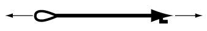 Tensile load |   | 250 | 375 | 500 |
  | 2 | Lashing rod (M.S) |   |   | 180 | 270 | 360 |
  | 3 | Lashing chain (H.T.S) |   |   | 100 | - | 300 |
  | 4 | Lashing chain (M.S) |   |   | 80 | - | 200 |
  | 5 | Lashing steel wire rope |   |   | 120 | - | 360 |
  | 6 | Turnbuckle | 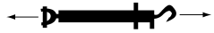 Tensile load |   | 250 | 375 | 500 |
  | 7 | Twistlock (single) | 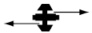 | Shear load | 210 | 315 | 420 |
  | 7 | Twistlock (single) | 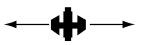 | Tensile load | 250 | 375 | 500 |
  | 7 | Twistlock (single) |   | Compression load(bottom) | 1200 | 1400 | 1600 |
  | 8 | Twistlock (linked) | 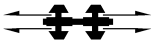 | As for item 7+ tensile load | 50 | 75 | 100 |
  | 9 | Midlock | 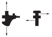 | Shear load | 210 | 315 | 420 |
  | 9 | Midlock |   | Tensile load | 250 | 375 | 500 |
  | 9 | Midlock |   | Compression load(bottom) | 1200 | 1400 | 1600 |
  | 10 | Stacker (single) |  | Shear load | 200 | 300 | 400 |
  | 11 | Stacker (double) | 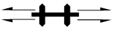 | As for item 10+ tensile load | 50 | 75 | 100 |
  | 12 | Flush socket |  | Pull-out load | 250 | 375 | 500 |
  | 13 | Pedestal socket |  | Pull-out load | 250 | 375 | 500 |
  | 13 | Pedestal socket |  | Tangential load | 210 | 315 | 420 |
  | 13 | Pedestal socket |   | Compression load | 1200 | 1400 | 1600 |
  | 14 | 'D' ring | 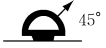 | Tensile load | 250 | 375 | 500 |
  | 15 | Lashing plate |  | Tensile load | 250 | 375 | 500 |
  | 16 | Penguin hook |  | Tangential load | 180 | 270 | 360 |
  | 17 | Bridge fitting | 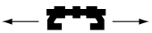 | Tensile load | 50 | 75 | 100 |
  | 18 | Buttress | 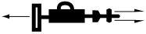 | Tensile load | See Note 5 |   |   |
  | (Notes) 1. For items 6, 14, 15 and 16 where specially designed for use with chain or wire rope lashings a less SWL may be considered. 2. For items 8, 11 and 17 the recommended minimum loads quoted in the Table refer to the fittings when employed in a location in container stacks which do not transfer load to an adjacent slack. Where items 8, 11 and 17 are fitted in line with a buttress/shore support at stowage sides, test loads are to be determined in association with Note 5. 3. For items 12 and 13, where multiple flush sockets or pedestal sockets are involved test loads are to be applied simultaneously to each socket opening which can be loaded simultaneously in service. 4. For item 15, where multiple lashing points are fitted in one deck plate fitting, testing is to bè similarly arranged as for Note 3. 5. For item 18, test loads for buttress fittings are to be determined by detailed consideration of the individual stowage arrangement proposed in association with **Table 3.25.1**. 6. Where special containers are used consideration will be given to the required minimum loads. |   |   |   |   |   |   |

#### 2503. Function test of fully automatic twistlock (2019)

- **1.** Performance is to be tested for at least three products and the test equipments should be constructed as shown in **Fig. 3.25.1**.
  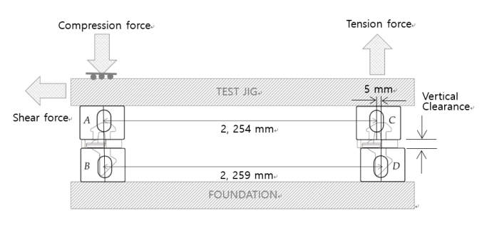
  Fig. 3.25.1 Configuration of test equipments *(2019)*
- **2.** The test loads applied in the function test are to be as given in **Table 3.25.3.**

  |   | Shear (kN) | Compression (kN) | Tension(kN) | Duration time (min.) |
  | --- | --- | --- | --- | --- |
  | Step 1 | 150 | 350 | 50 | 2 |
  | Step 2 | 150 | 350 | 250 | 2 |
  | Step 3 | 150 | 350 | 300 | 2 |
- **3.** In the 2nd step of the function test, the vertical clearance ($\delta v _{\max}$) between the twistlock intermediate plate and the end of corner casting of container is not be more than 20mm generally. *(2023)*
- **4.** The function test report of the fully automatic twistlock shall state:
  - **(1)** Function test equipment layout and step test load
  - **(2)** Corner casting specifications (ISO hole width and flange thickness) used in function test
  - **(3)** Vertical clearance of the tensile corner casting measured after the stepwise load test
- **5.** There should be no permanent deformation in corner castings or fully automatic twistlocks after the function test, and the fully automatic twistlocks should not be detached from the corner castings during the test.

  **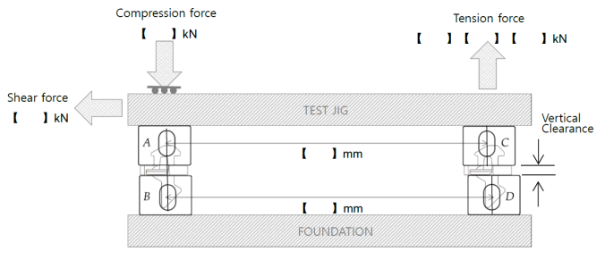**

  | Twistlock Flange Thickness (mm) Twistlock Flange Thickness (mm) | CornerCasting ; ISO FlangeThickness (mm) ; ISO Hole Width (mm) A B C D CornerCasting ISO FlangeThickness (mm) ISO Hole Width (mm) A B C D | Vertical Clearance ; Step 1(mm) ; Step 2(mm) ; Step 3(mm) Test 1 Test 2 Test 3 Vertical Clearance Step 1(mm) Step 2(mm) Step 3(mm) Test 1 Test 2 Test 3 |   |
  | --- | --- | --- | --- |
  | Twistlock Flange Thickness (mm) |   |   |   |
  |   |   |   |   |
  |   |   |   |   |
  |   |   |   |   |
  |   |   |   |   |
  | CornerCasting | ISO FlangeThickness (mm) | ISO Hole Width (mm) |   |
  | A |   |   |   |
  | B |   |   |   |
  | C |   |   |   |
  | D |   |   |   |
  | Vertical Clearance | Step 1(mm) | Step 2(mm) | Step 3(mm) |
  | Test 1 |   |   |   |
  | Test 2 |   |   |   |
  | Test 3 |   |   |   |
  |   |   |   |   |
  | NOTE1) ISO corner casting dimensions are to be in compliance with ISO 1161 as follows; Flange Thickness ≤ 28.5 (-1.5,+0) mm and 63.5 (+1.5,-0) mm ≤ Hole Width NOTE2) During the test, corner castings should not be changed and minimum loading duration time should be at least 2 minute. NOTE3) Average gauged separation on step2 may be used as design value to calculate lashing forces. (Where, Separation = Vertical Clearance – Twistlock Flange Thickness) NOTE4) In addition to this functional test, strength test should be carried out in accordance with “Guidance for Approval of Manufacturing Process and Type Approval, Etc.” |   |   |   |

#### 2504. Test requirements of additional special feature notation HHS(High Holding Securing) (2021)

- **1.** For a ship with **HHS** of additional special feature notation, type tests to determine the breaking or proof loads are to be carried out on at least two samples of each twistlock (manual, semi-automatic, full automatic), midlock and pedestal scoket. The test loads are in accordance with **Table 3.25.4**.
- **2.** Performance of full automatic twistlock is to be tested in both directions for at least three products and the test equipments should be constructed as shown in **Fig. 3.25.2.** Performance of manual and semi-automatic twistlock is to be tested for at least three products and the test equipments should be constructed as shown in **Fig. 3.25.3.** The test loads applied in the function test are to be as given in **Table 3.25.5**
- **3.** In the 2nd step of the function test, the vertical clearance ($\delta v _{\max}$) between the twistlock intermediate plate and the end of corner casting of container **(Fig. 3.25.4)** is not be more than 15mm, and the value of the vertical clearance measured in the function test can be applied to the evaluation of securing strength. *(2023)*
- **4.** The corner casting material used in the function test should have a mechanical property of RSC480A (or SCW480) or less, and a certificate equivalent to EN 10204 TYPE 3.2 should be submitted for the corner casting material.
- **5.** There should be no permanent deformation other than surface indentation in twistlock and the twistlock should not be detached from the corner casting during the test.
- **6.** The twistlock housing should be fastened with at least one bolt each at the top and bottom. Also the dimension of the neck of the twistlock should be equal to or greater than the value according to **Fig. 3.25.5**. In this case, the neck of the twistlock should be symmetrical in the length/width direction. *(2023)*
- **7.** The spring maximum force in static use of the bottom manual twistlock should be more than 250 N. (Confirm the Spring specification, Test report etc.) *(2023)*

  | Item No | Description | Required test modes |   | Recommended minimal in kN |   |   |
  | --- | --- | --- | --- | --- | --- | --- |
  | Item No | Description | Required test modes |   | SWL | Proof load | Breaking load |
  | 1 | Twistlock (single) |  | Shear load | 210 | 315 | 630 |
  | 1 | Twistlock (single) |  | Tensile load | 250 | 375 | 750 |
  | 1 | Twistlock (single) |   | Compression load(bottom) | 1200 | 1800 | 2400 |
  | 2 | Midlock |  | Shear load | 210 | 315 | 630 |
  | 2 | Midlock |   | Tensile load | 250 | 375 | 750 |
  | 2 | Midlock |   | Compression load(bottom) | 1200 | 1800 | 2400 |
  | 3 | Pedestal socket |  | Pull-out load | 250 | 375 | 750 |
  | 3 | Pedestal socket |  | Tangential load | 210 | 315 | 630 |
  | 3 | Pedestal socket |   | Compression load | 1200 | 1800 | 2400 |

  
  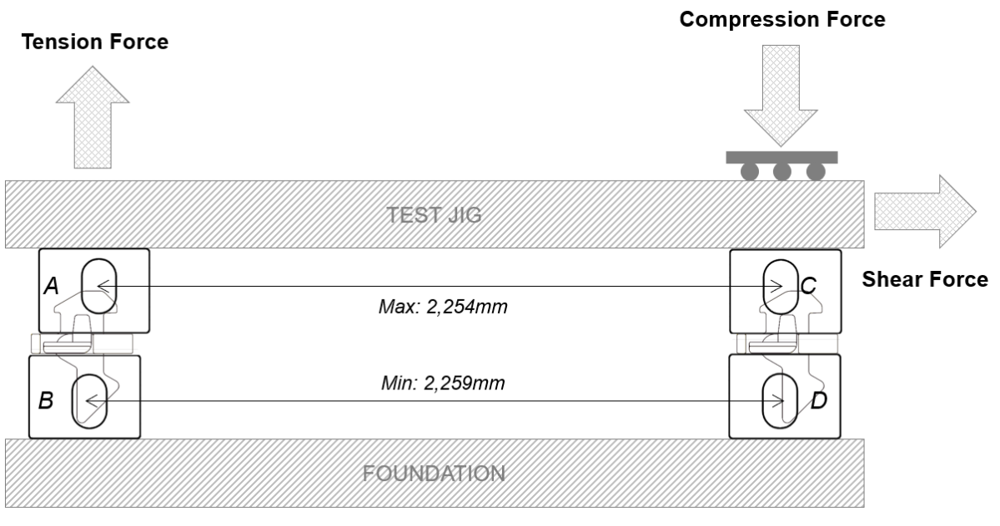
  **Fig. 3.25.2 Configuration of HHS test equipment (fully automatic twistlock)** ***(2024)***

  |   | Shear (kN) | Compression (kN) | Tension(kN) | Duration time (min.) |
  | --- | --- | --- | --- | --- |
  | Step 1 | 150 | 350 | 50 | 2 |
  | Step 2 | 150 | 350 | 250 | 2 |
  | Step 3 | 150 | 350 | 300 | 2 |
  | Step 4 | 150 | 350 | 500 | 2 |

  
  **Fig. 3.25.3 Configuration of HHS test equipment (semi-automatic twistlock)** ***(2021)***
  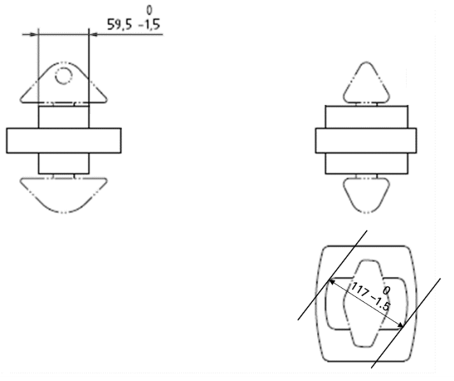
  Fig. 3.25.5 *(2024)*

#### 2505. Test requirements of additional special feature notation HHT(High Holding Twistlock) (2021)

- **1.** For a ship with **HHT** of additional special feature notation, only the requirements for twistlock and midlock are satisfied among the requirements of **2504**. above.

### Section 26 Fire Protection Materials

#### 2601. Application

- **1.** The requirements of this Section apply to tests and inspections for the approval of fire protection materials specified in **Table 3.26.1** according to the requirements of **Pt 8, Ch 1** of the Rules.
- **2.** For test and inspections of “H” class divisions in accordance with the requirements of **Ch 8, 102.** of **the Guidance for Floating Production Units**, the requirements of this Section are correspondingly applied.

  **Table 3.26.1 Kinds and application of fire protection materials**

  | Kinds | Application |
  | --- | --- |
  | Non-combustible materials | (1) Non-combustible materials mean the materials defined in Pt 8, Ch 1, 103. of the **Rules**. (2) The kinds of test for non-combustible materials are to be the 'Test method for non-combustible material', the procedure of which is to be as specified in 2604. 1. of this Guidance. (3) The materials specified below are to be regraded as non-combustible materials for which no approval by the Society is required. (A) Sheet glass, glass rock, clay, ceramics, and glass fiber (B) Metals (except magnesium and magnesium alloys) (C) Sand, gravel, expanded vermiculite, slag (expanded or foam slag), diatomaceous earth, portland cement using pearlite or pumice as aggregates, gypsum, and magnesite concrete (D) Needle punched glass fiber products containing 2.5 % or less of lubricant |
  | “H” Class divisions | (1) “H” class divisions are the divisions defined in Pt 8, 102. of the Guidance for Floating Production Units. They are used for bulkheads, decks, doors, cable penetrations, etc. (2) The kinds of test for “H” class divisions are to be correspondingly applied “fire tests of A class divisions," the procedures of which are to be as specified in 2604. 2. unless stated otherwise. For fire test, Hydrocarbon fire load/temperature curve of NPD(Norwegian Petroleum Directorate) is to be used. (3) “H” class divisions are classified into three ratings according to temperature conditions: “H-120” rating, “H-60” rating and “H-0” rating. (4) The materials constituting “H” class divisions are all to be approved non-combustible materials. In applying for approval, documents proving that the constituent materials are non-combustible (the certificate of the Society or the test results recognized by the Society) are to be submitted in addition to the results of fire tests for the constituent materials. |
  | "A" Class divisions | (1) "A" class divisions are the divisions defined in Pt 8, Ch 1, 103. of the **Rules**. They are used for bulkheads, decks, doors, cable penetrations, etc. (2) The kinds of test for “A” class divisions are to be “fire tests of A class divisions," the procedures of which are to be as specified in 2604. 2. (3) “A“ class divisions are classified into four ratings according to temperature conditions: ”A-60“ rating, ”A-30“ rating, ”A-15“ rating and ”A-0“ rating. (4) The materials constituting “A” class divisions are all to be approved non-combustible materials. In applying for approval, documents proving that the constituent materials are non-combustible (the certificate of the Society or the test results recognized by the Society) are to be submitted in addition to the results of fire tests for the constituent materials. |
  | "B" Class divisions | (1) "B" class divisions are the divisions defined in Pt 8, Ch 1, 103. of the **Rules**. They are used for bulkheads, doors, continuous ceilings, cable penetrations, etc. (2) The kinds and procedure of tests for 'B' class divisions are to be “fire tests of B class divisions” the procedures of which are to be as specified in 2604. 2. (3) “B“ class divisions are classified into two ratings according to temperature condition: ”B-15“ rating and ”B-0“ rating. (4) The materials constituting “B” class divisions are to be approved non-combustible materials. In applying for approval, documents proving that the constituent materials are non-combustible (the certificate of the Society or the test results recognized by the Society) are to be submitted in addition to the results of fire tests for the constituent materials. |

  **Table 3.26.1 Kinds and application of fire protection materials (continued)**

  | Kinds | Application |
  | --- | --- |
  | Fire retardant base materials | (1) Fire retardant base materials are the combustible materials used for internal divisions, and linings, draft stops, ceilings and their associated ground sills in corridors and stairway enclosures within accommodation and service spaces of a ship adopting Method ⅢC or ⅡC specified in Pt 8, Ch 3, 103. 5 of the **Rules**. (2) The kinds of test for fire retardant materials are to be test for surface flammability, smoke and toxicity test, the procedures of which are to be in accordance with the requirements specified in 2604. 3 and 4, respectively. |
  | Fire retardant veneers | (1) Fire retardant veneers are the combustible veneer materials applied on internal exposed surfaces and on the surfaces in consealed or inaccessible spaces in a ship except floor. (2) Fire retardant veneers applied on non-combustible bulkheads, linings, and ceilings within accommodation spaces and service areas are to be not more than 2.5 *mm* in thickness. In corridors, stairway enclosures, and control stations, fire retardant veneers are to be not more than 1.5 *mm* in thickness. (3) Notwithstanding the requirements (2) above, if the calorific value of fire retardant veneers measured by bomb method (refer to Appendix 1) does not exceed 45 $\mathrm{MJ}/m ^{2}$, the limit of thickness specified in (2) may not be observed. (4) The kinds and test procedures are similar to those specified in 2604. 3 and 4. (5) In applying the requirements in (4) above for PVC films, test for surface flammability is to be conducted without insulation materials, and smoke and toxicity test is to be conducted including insulation materials. |
  | Fire retardant floor coverings | (1) Floor coverings are other layers in the floor construction above the deck plating except primary deck coverings. (2) The kinds of test for fire retardant floor coverings are to be test for surface flammability, smoke and toxicity test. The procedures of which are to be in accordance with the requirements specified in 2604. 3 and 4. |
  | Primary deck coverings | (1) Primary deck coverings are the first layer of a floor construction which is applied directly on top of the deck plating and is inclusive of any primary coat, anti-corrosive compound or adhesive which is necessary to provide protection or adhesion to the deck plating. (2) The kinds of test for the primary deck coverings are to be of the test for the primary deck coverings and the testing procedure is to be in accordance with the requirements specified in 2604. 3 and 4. |
  | Fire retardant coatings | (1) Fire retardant coatings are the finishing materials applied on the internal exposed surface of a ship. (2) The approval of fire retardant coatings is to be made to actual coating systems (combination of under coat and top coat) on the basis of the coatings classified according to the kinds of synthetic resins used. (3) The classes of fire retardant coatings are as follows : (A) Alkyd resin coating (B) Chlorinated rubber coating (C) Tar epoxy resin coating (D) Denatured epoxy resin coating (E) Pure epoxy resin coating (F) Urethane resin coating (G) Emulsion coating (H) Water gross coating (I) Poly-vinyl chloride resin coating (J) Pure silicone coating (K) Others (4) The kinds and test procedures are to be in accordance with 2604. 3 and 4 correspondingly. |

  **Table 3.26.1 Kinds and application of fire protection materials (continued)**

  | Kinds | Application |
  | --- | --- |
  | Vertically supported textiles and films (including vertically hanging curtains and draperies) | (1) The test method for vertically supported textiles and films (including vertically hanging curtains and draperies) having the resistance to propagation of flame (hereinafter called curtains, etc.) is to be in accordance with the requirements in 2604. 6. (2) After flame time means the time during which the material continues to burn after the ignition source has been removed or extinguished. (3) Sustained ignition means after flame time of 5 seconds or more. (4) After glow means persistence of a material after cessation of flaming or after the ignition source has been removed. (5) Surface flash means the rapid flash of a flame across the surface pile finish and often leaving the base fabric in an essentially undamaged condition. |
  | Upholstered furniture | (1) The test method for upholstered furniture having the resistance to propagation of flame is to be in accordance with the requirements in 2604. 7. (2) Progressive smouldering is an exothermic oxidation not accompanied by flaming which is self-propagating, i.e. independent of the ignition source. It may or may not be accompanied by incandescence. |
  | Bedding components | (1) The test method for bedding components such as blankets, quilts, bedspreads, pillows and mattresses, including thin, light mattresses used on top of other mattresses having the resistance to propagation of flame is to be in accordance with the requirements in 2604. 8. (2) Mattress is product in the form of a resilient material (for instance, polyurethane foam or light fibre fill) or of padding materials in combination with steel springs (spring mattress), enveloped by a cover. (3) Quilt and pillow are products of padding materials (down/feather or textile fibre) enveloped by a textile fabric. (4) Ticking is fabric enveloping the resilient material in a mattress. (5) Ignitability is a measure of the ease with which a material or a product can be ignited so as to flame or progressively smoulder. (6) Ignition source is source of energy which is used to ignite combustible materials or products. (7) Flaming is undergoing combustion in the gaseous phase, usually with emission of light. (8) Smouldering is an exothermic reaction taking place in a material without flaming, with or without emission of light. (9) Progressive smouldering is smouldering which continues after the ignition source is extinguished or removed. |
  | Fire door control system | The test method for control system of fire door which is required to be able to operate in case of fire is to be in accordance with the requirements in 2604. 9. |

#### 2602. Data to be submitted

The following reference data are to be submitted to the Society in addition to those specified in **102.**

#### 2603. Type tests

- **1.** The type tests are to be carried out by the procedures specified in **2604.** or by those regarded to be equivalent by the Society in the presence of the Surveyor. The witness by the Surveyor may be omitted, however, if the type tests are conducted by any official organizations which the Society considers appropriate.
- **2.** The test specified in the preceding 1 may be omitted if the material is subjected to the tests specified in the preceding 1 in an organization which the Society considers appropriate and having a certificate or test records. The Society may require additional tests, however, if it considers necessary.
- **3.** For other established test procedures and acceptance criteria other than those specified in **2604.** the approval expiry period is as follows.
  - **(1)** The Society may issue type approval certificates of products tested in accordance with procedures adopted in **IMO Res. 61(67),** provided the tests were conducted no later than one year after entry into force of **IMO Res. MSC 307(88).**
  - **(2)** The Society may issue type approval of a product tested in accordance with procedures adopted in **IMO Res. 61(67)** without retesting, provided that the test report is not more than 15 years old and that no alteration of components or construction has been made to the product.

#### 2604. Test methods

- **1.** **Test method for non-combustible material**
  Test method for non-combustible material is to be in accordance with the requirements given in **Table 3.26.2.** (refer to **FTP Code, Annex 1, Part 1** and **IMO Res. MSC 307(88) & ISO 1182**)

  **Table 3.26.2** **Test method for non-combustible material**

  | Item | Requirements |
  | --- | --- |
  | Test specimens | (A) The test specimen shall be taken from a sample which is sufficiently large to be representative of the product. (B) The specimens are to be cylindrical and each is to have a diameter of 45mm, a height of 50 ± 3 mm and a volume of 80 ± 5 $\mathrm{cm} ^{3}$. (C) For homogeneous products, five specimens shall be made. For nonhomogeneous products, 10 specimens shall be made. |
  | Preparation of specimens | (A) If the thickness of the material is different from 50 ± 3 mm, specimens of the height of 50 ± 3 mm shall be made by using a sufficient number of layers of the material and/or by adjustment of the material thickness. (B) For non-homogeneous materials, the specimen of height of 50 ± 3 mm shall be constructed such that all layers are represented in the specimen in proportion to their presence, by volume, in the original specimen. |
  | Preparation of specimens | (C) The layers shall occupy a horizontal position in the specimen holder and shall be held together firmly, without significant compression, by means of two fine steel wires, of maximum diameter 0.5mm, to prevent air gaps between layers. The specimens of loose fill materials shall be representative in appearance, density, etc., as in use. (D) When a specimen is composed of a number of layers, the overall density should be as close as possible to that of the product provided by the manufacturer. |
  | Conditioning | The specimens are to be conditioned in a ventilated oven maintained at 60 ± 5 °C, for between 20 hours and 24 hours, and cooled to ambient temperature in a desiccator prior to the testing. The mass of each specimen is to be determined to an accuracy of 0.01 g prior to test. |

  **Table 3.26.2** **Test method for non-combustible material (continued)**

  | Item | Requirements |
  | --- | --- |
  | Observations during test | (A) Record the mass before and after test for each specimen tested and note any observations relating to the behaviour of the specimen during the test including during insertion into the apparatus. (B) Note the occurrence of any sustained flaming and record the duration of each flaming. Sustained flaming is to be taken as the continuous presence of flame caused by the specimen lasting 5 seconds or longer. (C) Some specimens exhibit only a steady blue-coloured luminous gas zone; this shall not be considered as flaming but be noted under "observations during tes" in the test report. (D) Record the following temperatures, as measured by the thermocouples; (a) the initial furnace temperature, $T_{ i}$(furnace) : the average temperature over the final 10 min of the stabilization period) (b) the maximum furnace temperature $T_{ m}$(furnace) and the maximum specimen surface temperature $T_{ m}$(surface) : the discrete values at maximum temperature anywhere over the entire test period; and (c) the final furnace temperature $T_{ f}$(furnace) and the final specimen surface temperature $T_{ f}$(surface) : the average temperature over the final 1 min of the test period 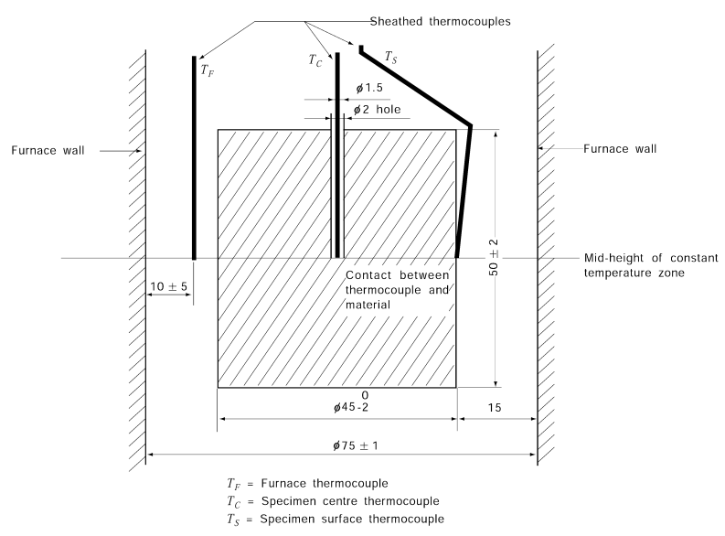 Fig 3.26.1 Relative position of furnace, specimen and thermocouple position **Fig 3.26.1 Relative position of furnace, specimen and thermocouple position** |

  **Table 3.26.2** **Test method for non-combustible material (continued)**

  | Item | Requirements |
  | --- | --- |
  | Expression of results | (A) Calculation of averages (a) For homogeneous products, calculate the averages for Mass loss(B) to Average temperature rise(E) for the five specimen. (b) For non-homogeneous products, calculate the averages for Mass loss(B) to Average temperature rise(E) for each set of five specimens in the same orientation. The results for each orientation shall be presented separately, but they shall not be combined. Classification shall be based on the most onerous orientation such that all the averages for each set of five specimens shall meet the requirements in "Classification of materials". (B) Mass loss (a) Calculate and record the mass loss in percentage for each of the five specimens, expressed as a percentage of the initial mass of the specimen, measured as specified in "Observations during test(A)". (b) Calculate the average mass loss in percentage, which is the average of mass loss of the five specimens. (C) Flaming (a) Calculate and record the total duration of sustained flaming, in seconds, for each of the five specimens measured as "Observations during test(B)". (b) Calculate the average duration of sustained flaming, which is the average of total duration of sustained flaming of the five specimens, (D) Temperature rise Calculate and record the following temperature rise in ℃ for each of the five specimens recorded by the thermocouples as specified in "Observations during test(C)". (a) furnace temperature rise : $T_{ r}(furnace)=T _{ m}(furnace)-T _{ f}(furnace)$ (b) specimen surface temperature rise :$T_{ r}(surface)=T _{ m}(surface)-T _{ f}(surface)$ (E) Average temperature rise Calculate the average furnace temperature rise Tave r(furnace) and the average specimen surface temperature rise Tave r(surface) from the values obtained by (D) Temperature rise. |
  | Classification of materials | A material is to be deemed non-combustible if all the following criteria are satisfied. (A) The average furnace thermocouples temperature rise as calculated is not to exceed 30°C; (B) The average surface thermocouples temperature rise as calculated is not to exceed 30°C; (C) The mean duration of sustained flaming as calculated is not to exceed 10 second; and (D) The average mass loss as calculated is not to exceed 50 %. |
  | Others | Details of test for non-combustible materials not specially mentioned in 2604. 1 are to comply with FTP Code, Annex 1, Part 1. |
- **2.** **Fire test of “A” and “B” class divisions** (refer to FTP Code, Annex 1, Part 3 and **IMO Res. MSC 307(88)**)
  - **(1)** General
    - **(A)** The dimensions of the structural cores of the test specimens given in (2) below are intended for structural cores of stiffened flat plates of steel or aluminium alloy. The Society may require tests to be carried out on specimens having structural cores of materials other than steel or aluminium alloy if such materials are more representative of the construction to be used on board ships.
    - **(B)** “A“ class divisions which consist of uninsulated steel bulkheads or decks of suitable scantlings and without openings can be deemed to satisfy the requirements for ”A-0“ class divisions, i.e. to satisfy the requirements for the passage of smoke and flame, without the need for testing. All other divisions, including ”A-0“ class divisions with a structural core of aluminium, are required to be tested.
    - **(C)** Results obtained on an insulating material used in conjunction with an 'A' class division may be applied to constructions incorporating heavier scantling than those tested and providing the orientation of the construction is the same, i.e. results from bulkhead tests are not to be applied to decks and vice versa.
    - **(D)** Constructions are to be tested without paint or other superimposed finish, provided that where they are only produced with a superimposed finish, and subject to the agreement of the Society, they may be tested as produced. Such constructions may be required to be tested with a superimposed finish if such a finish is considered by the Society to have a detrimental effect on the performance of the construction in the test.
    - **(E)** The construction to be tested are to be, as far as possible, representative of that to be used on board ships, including the materials and method of assembly.
    - **(F)** Non-combustible materials used in the construction of the specimen are not to be more than 24 months old from the date of the performance of the fire resistance test. If not, tests are to be conducted specified in **2604. 1** above.
    - **(G)** Adhesives used in A or B Class divisions should be low flame spread
    - **(H)** The thickness of insulation on the stiffeners need not be same as that of the steel plate.
    - **(I)** Doors, windows and other division penetrations intended to be installed in fire divisions made of material other than steel shall correspond to prototypes tested on a division made of such material.
    - **(J)** "B" class constructions shall be tested without finished. For constructions where this is not possible, the finishes may be included in the "B" class test specimen, and shall be included in the non-combustibility test of the construction.
  - **(2)** Nature of test specimens **is to be as specified in Table 3.26.3.**

    **Table 3.26.3** **Fire test specimens of “A” and “B” class divisions**

    | Kinds | Item | Requirements |
    | --- | --- | --- |
    | “A“ class bulkheads | Dimensions | (1) The minimum overall dimensions of test specimen, including the perimeter details at the top, bottom and vertical edges, are 2,440 *mm* width and 2,500 *mm* height. (a) When the maximum overall height in practice is less than that given above, then the test specimen shall be of the maximum height to be used in practice. (b) The minimum bulkhead panel height shall be a standard height of the manufactured panel with a dimension of 2,400 mm. (2) The overall dimensions of the structural core are to be 20 *mm* less in both the width and the height than the overall dimensions of the specimen, and the other dimensions of the structural core are to be as follows: - thickness of plating : steel 4.5 ± 0.5 *mm* aluminium 6.0 ± 0.5 *mm* - stiffeners spaced at 600 *mm* : steel 65 ± 5 mm × 65 ± 5 mm × 6 ± 1 *mm* aluminium 100 ± 5 mm × 75 ± 5 mm × 9 ± 1 *mm* (3) The width of the structural core may be greater than the specified dimensions providing that the additional width is in increments of 600 *mm* to maintain the stiffener centres and the relationship between the stiffeners and the perimeter detail. (4) Any joints in the plating are to be full welded, at least from one side. The dimensions of the structural core and the details around the perimeter of the specimen are to be as illustrated in Fig 3.26.2 and Fig 3.26.3. 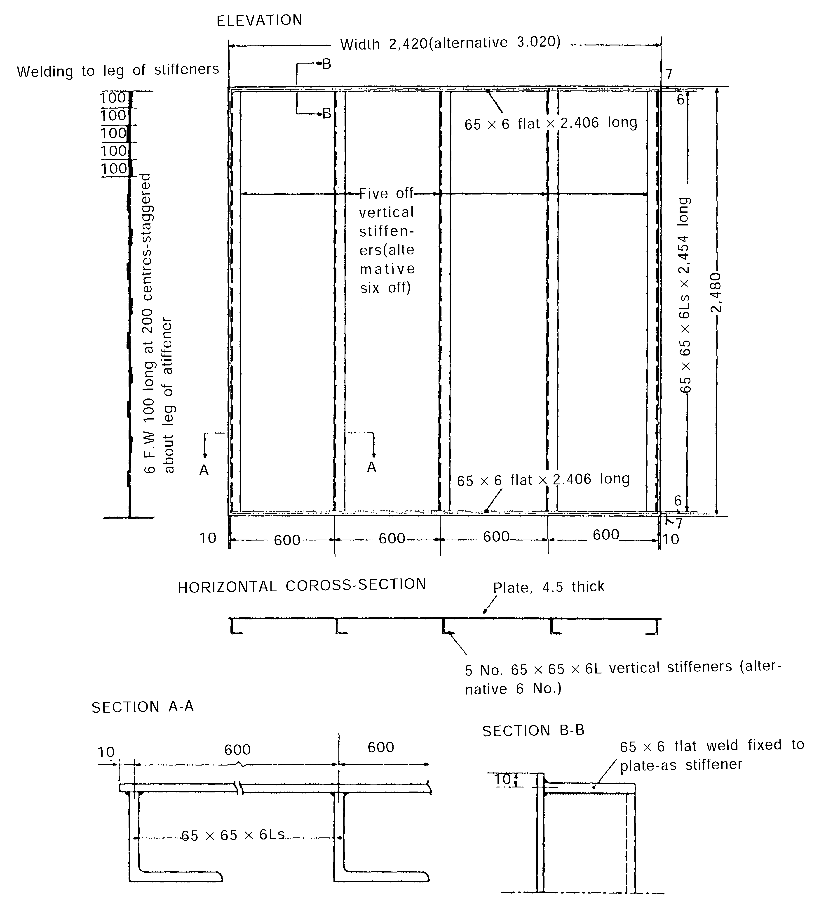 Fig 3.26.2 Structural Steel Core for "A" Class Bulkhead and "B" **Fig 3.26.2 Structural Steel Core for "A" Class Bulkhead and "B"** |

    **Table 3.26.3** **Fire test specimens of “A” and “B” class divisions (continued)**

    | Kinds | Item | Requirements |
    | --- | --- | --- |
    | “A“ class bulkheads | Dimensions | 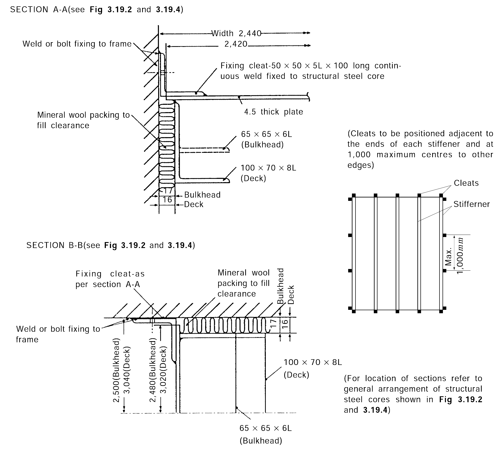 **Fig 3.26.3 Connection between Restraint Frame and Structural Steel Core** |
    | “A“ class bulkheads | Construction | (1) Where insulation is provided by panels (e.g. a “B” class lining), then the test specimen is to be designed such that at least one of the panels is of full width and this, or these, are to be positioned such that both its/their longitudinal edges are jointed to an adjacent panel and are not secured to the restraint frame. (2) The overall dimensions of the panel insulation system, including the perimeter details at all the edges, are to be 20 *mm* greater in each direction than the equivalent dimensions of the structural core. |
    | “A“ class decks | Dimensions | (1) The minimum overall dimensions of test specimen, including the perimeter details at all the edges, are 2,440 *mm* width and 3,040 *mm* length. (2) The overall dimensions of the structural core are to be 20 *mm* less in both the width and the length than the overall dimensions of the specimen, and the other dimensions of the structural core are to be as follows: - thickness of plating : steel 4.5 ± 0.5 *mm* aluminium 6.0 ± 0.5 *mm* - stiffeners spaced at 600 *mm* : steel 100 ± 5 mm × 70 ± 5 mm × 8 ± 1 *mm* aluminium 150 ± 5 mm × 100 ± 5 mm × 9 ± 1 *mm* (3) The width of the structural core may be greater than the specified dimensions providing that the additional width is in increments of 600 *mm* to maintain the stiffener centres and the relationship between the stiffeners and the perimeter detail. (4) Any joints in the plating are to be full welded, at least from one side. The dimensions of the structural core and the details around the perimeter of the specimen are to be as illustrated in Fig 3.26.3 and Fig 3.26.4. |

    **Table 3.26.3** **Fire test specimens of “A” and “B” class divisions (continued)**

    | Kinds | Item | Requirements |
    | --- | --- | --- |
    | “A“ class decks | Dimensions | 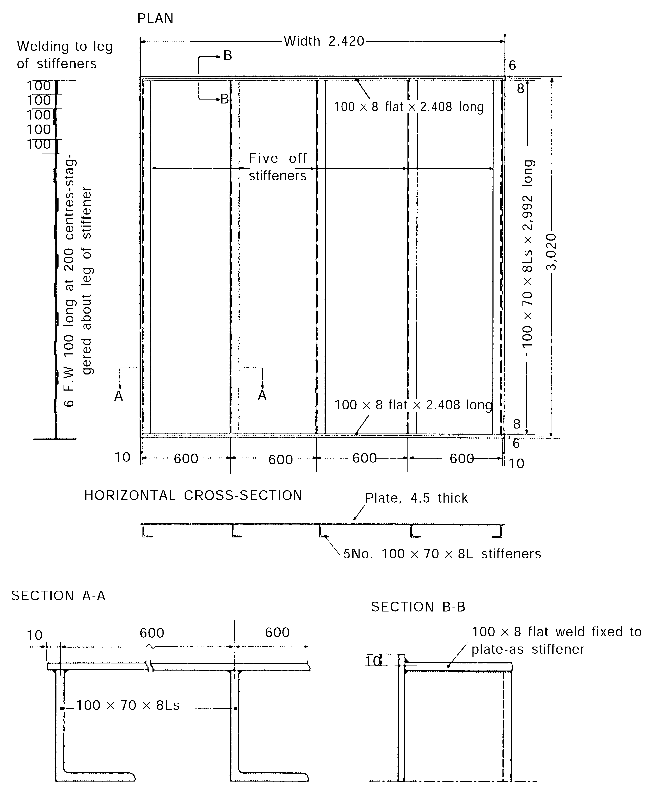 Fig 3.26.4 Structural Steel Core for "A" Class Deck and "B" Class Ceiling **Fig 3.26.4 Structural Steel Core for "A" Class Deck and "B" Class Ceiling** |
    | “A“ class decks | Construction | (1) Where insulation is provided by panels (e.g. a “B” class ceiling), then the test specimen is to be designed such that at least one of the panels is of full width and this, or these, are to be positioned such that both its/their longitudinal edges are jointed to an adjacent panel and are not secured to the restraint frame. (2) The overall dimensions of the panel insulation system, including the perimeter details at all the edges, are to be 20 *mm* greater in each direction than the equivalent dimensions of the structural core. |
    | “A“ class doors | Dimensions | The test specimen is to incorporate the maximum size (in terms of both the width and the height) of door leaf of leaves for which approval is to be sought. The maximum size of a door which can be tested will be determined by the requirement to retain certain dimensions of the structural core. |
    | “A“ class doors | Design | (1) Door furniture such as hinges, locks, latches, shoot bolts, handles, etc. are to be constructed of materials having melting points of not less than 950°C unless it can be shown by the fire test that materials having melting points below 950°C do not adversely affect the performance of the door. (2) The door leaf and frame are to be mounted as appropriate into a 'A' class bulkhead of compatible construction, thereby reflecting an actual end use situation. The bulkhead is to have dimension as specified in the dimension of 'A' class bulkhead above. The bulkhead is to be of a construction approved by the Society as having at least a similar classification to that required by the door. |

    **Table 3.26.3** **Fire test specimens of “A” and “B” class divisions (continued)**

    | Kinds | Item | Requirements |
    | --- | --- | --- |
    | “A“ class doors | Design | No additional stiffening shall be provided to the structurual core unless provided as part of the door frame. The method of fixing the door frame to the bulkhead is to be as used in practice. The door is to be positioned such that there is a minimum width of the bulkhead of 300 mm to each vertical side of the door and a minimum distance of 100 mm from the top edge of the bulkhead. If the method of fixing the door frame in a test is made by bolts, the Society may also accept welding as a method of fixing the door frame without further tests. (3) The door is to be positioned such that there is a minimum width of the bulkhead of 300 mm to each vertical side of the door and a minimum distance of 100 mm from the top edge of the bulkhead. If the method of fixing the door frame in a test is made by bolts, the Society may also accept welding as a method of fixing the door frame without further tests. (4) For doors mounted in a three-sided frame, the door shall be mounted with a bottom gap of between 12 mm and 25 mm between the bottom of the door and the test frame. (5) The door is to be mounted into the bulkhead such that the side expected to give the inferior performance will be exposed to the heating condition of the test. A hinged door is to be tested with the door leaf opening away from the heating conditions unless the Society deems otherwise. For sliding doors, it is not possible to state generally from which side the door is to be tested to give the inferior performance. It will, therefore, be necessary to conduct two separate tests, one with the door mounted to the exposed face and one with the door mounted to the unexposed face of the bulkhead (6) For a door which incorporates a ventilation opening within its construction, the ventilation grille(s) is (are) to be open at the commencement of the test. Temperature measurements on such a door are not to be made over the face of the grille(s). (7) Lift landing doors can be expected to be exposed to fire from the corridor side only, and they shall be exposed to fire test heating conditions from that side only. (8) Tests performed with double leaf doors will not be accepted as approval documentation for single leaf doors. (9) Double leaf doors should be tested with equally sized door leaves unless the door is intended to have unequally sized leaves. |
    | “B“ class bulkheads | Dimensions | (1) The minimum overall dimensions of test specimen, including the perimeter details at the top, bottom and vertical edges, are 2,440 *mm* width and 2,500 *mm* height. When the maximum overall height in practice is to be less than given above, then the test specimen is to be of the maximum height to be used in practice. (2) The minimum bulkhead panel height shall be a standard height of the manufactured panel with a dimension of 2,400 mm. |
    | “B“ class bulkheads | Construction | Where the construction incorporates panels, the specimen is to be constructed such that at least one of the panels is of full width and this, or these, is to be positioned such that both its/their longitudinal edges are jointed to an adjacent panel and are not secured to the restraint frame. |
    | “B“ class decks | Dimensions | The minimum overall dimensions of test specimen, including the perimeter details at all the edges, are 2,440 *mm* width and 3,040 *mm* length. When the maximum dimension in practice is to be less than given above, then the test specimen is to be of the maximum size to be used in practice. |
    | “B“ class decks | Construction | Where the construction incorporates panels, the specimen is to be constructed such that at least one of the panels is of full width and this, or these, is to be positioned such that both its/their longitudinal edges are jointed to an adjacent panel and are not secured to the restraint frame. |
    | “B“ class door | Dimensions | The test specimen is to incorporate the maximum size (in terms of both the width and the height) of door leaf of leaves for which approval is to be sought. The maximum size of a door which can be tested will be determined by the requirement to retain certain dimensions of the bulkhead. |
    | “B“ class door | Design | (1) Door furniture such as hinges, locks, latches, shoot bolts, handles, etc. are to be constructed of materials having melting points of not less than 850°C unless it can be shown by the fire test that materials having melting points below 850°C do not adversely affect the performance of the door. (2) The door leaf and frame are to be mounted as appropriate into a 'B' class bulkhead of compatible construction, thereby reflecting an actual end use situation. The bulkhead is to have dimension as specified in the dimension of 'B' class bulkhead above. The bulkhead is to be of a construction approved by the Society as having at least a similar classification to that required by the door. The method of fixing the door frame to the bulkhead is to be as used in practice. |

    **Table 3.26.3** **Fire test specimens of “A” and “B” class divisions (continued)**

    | Kinds | Item | Requirements |
    | --- | --- | --- |
    | “B“ class door | Design | (3) The bulkhead shall be of a construction approved by the Society as having at least a similar classification to that required by the door, and approval shall be limited to the type of construction in which the door was tested. (4) The method of fixing the door frame to the bulkhead shall be as used in practice. If the method of fixing the door frame in a test is made by bolts, the Society may also accept welding as a method of fixing the door frame without further tests. (5) For doors mounted in a three-sided frame, the door shall be mounted with a bottom gap of between 12 mm and 25 mm between the bottom of the door and the test frame. (6) The door is to be positioned such that there is a minimum width of the bulkhead of 300 mm to each vertical side of the door and a minimum distance of 100 mm from the top edge of the bulkhead. (7) The door is to be mounted into the bulkhead such that the side expected to give the inferior performance will be exposed to the heating condition of the test. A hinged door is to be tested with the door leaf opening away from the heating conditions unless the Society deems otherwise. For sliding doors, it is not possible to state generally from which side the door is to be tested to give the inferior performance. It will, therefore, be necessary to conduct two separate tests, one with the door mounted to the exposed face and one with the door mounted to the unexposed face of the bulkhead (8) For a door which incorporates a ventilation opening within its construction, the ventilation grille(s) is (are) to be open at the commencement of the test. Temperature measurements on such a door are not to be made over the face of the grille(s). |
    | “B“ class linings | Dimensions | (1) The minimum overall dimensions of test specimen, including the perimeter details at the top, bottom and vertical edges, are 2,440 mm width and 2,500 mm height. When the maximum overall height in practice is to be less than that given above, then the test specimen shall be of the maximum height to be used in practice. (2) The minimum bulkhead panel height shall be a standard height of the manufactured panel with a dimension of 2,400 mm. |
    | “B“ class linings | Design | (1) The lining is to be positioned alongside a structural core constructed in accordance with the dimension of 'A' class bulkhead above. The design of the lining is to be such that it facilitates its assembly with the limited access provided by the proximity of the structural core, i.e. it is to be mounted with the structural core in place. (2) During a test on an “A” class bulkhead which utilizes membrane protection along its exposed side, e.g. a 'B' class lining, it is possible also to evaluate the performance of the lining with a view to classification providing that the necessary thermocouples are attached to the lining and proving that the necessary integrity measurements are made. (3) The specimen is to be constructed such that at least one of the panels is of full width and this, or these, is to be positioned such that both its/their longitudinal edges are jointed to an adjacent panel and are not secured to the restraint frame. |
    | “B“ class ceilings | Dimensions | (1) The minimum overall dimensions of test specimen, including the perimeter details at the top, bottom and vertical edges, are 2,440 mm width and 3,040 mm length. (2) When the maximum dimensions in practice are less than those given above then the test specimen shall be of the maximum size to be used in practice, and the tested width shall be reported. |
    | “B“ class ceilings | Design | (1) The ceiling is to be positioned below a structural core constructed in accordance with the dimension of 'A' class deck above. (2) The design of the ceiling is to be such that it facilitates its assembly with the limited access provided by the proximity of the structural core, i.e. it is to be mounted with the structural core in place. (3) During a test on an “A” class deck which utilizes membrane protection along its underside, e.g. a 'B' class ceiling, it is possible also to evaluate the performance of the ceiling with a view to classification providing that the necessary thermocouples are attached to the ceiling and proving that the necessary integrity measurements are made. (4) If the ceiling incorporates panels, the specimen is to include example of both the lateral and longitudinal joints between the panels. (5) If the specimen is to simulate a ceiling where the maximum length of the panels is greater than the length of the specimen, then a joint is to be positioned at a distance of approximately 600 mm from one of the shorter ends of the test specimen. (6) The specimen is to be constructed such that at least one of the panels is of full width and this, or these, is to be positioned such that both its/their longitudinal edges are jointed to an adjacent panel and are not secured to the restraint frame. |

    **Table 3.26.3** **Fire test specimens of “A” and “B” class divisions (continued)**

    | Kinds | Item | Requirements |
    | --- | --- | --- |
    | Windows | General | Window is taken to include windows, sidescuttles and any other glazed opening provided for light transmission or vision purposes in “A” class bulkheads. Windows in “A” class doors are considered to be part of the door and they are to be tested within the appropriate door. |
    | Windows | Dimensions | (1) The test is to be conducted on the window of the maximum size (in terms of both the width and the height) for which approval is sought. (2) The test shall be conducted on a window of the maximum size(in terms of both the height and the width) and the type of the glass pane and/or the minimum thickness of the glass pane or panes/and gaps, if appropriate, for which approval is sought. Test results obtained on this configuration shall, by analogy, allow approval of windows of the same type, with lesser dimensions in terms of height and width and with the same or greater thickness. |
    | Windows | Design | The bulkhead which includes the window is to be insulated to class 'A-60' on the stiffened face, which is to be the face exposed to the heating conditions of the test. There may be special applications of windows where the Society considers it appropriate to test the window with the insulation of the bulkhead to the unexposed face of the structural core, or within bulkheads other than class 'A-60'. The window is to be positioned within the bulkhead, shown in Fig 3.26.2, at that height which is intended for practical application. When this is not known, the window is to be positioned with the top of its frame as close as possible, but not closer than 300 mm, to the top of the bulkhead. |
    | Fire dampers | Dimensions | The maximum sizes (in terms of both the width and the height, or the diameter) of each type of fire damper for which approval is sought are to be tested in both vertical and horizontal orientation. |
    | Fire dampers | Design | (1) A bulkhead which includes the damper is to be constructed in accordance with the dimension of 'A' class bulkhead above and is to be insulated to class “A-60” on the stiffened face, which is to be the face which is not exposed to the heating conditions of the test. A deck which includes the damper is to be constructed in accordance with (B) (a) above and is to be insulated to class “A-60” on the stiffened face, which is to be the face which is exposed to the heating conditions of the test. (2) Fire dampers are to be incorporated into or fixed to coaming or spigots, which are to be welded or bolted into the structural core. The length on the unexposed side = (450 mm or a needed insulation length for a damper under test)(L_unexp)+ 50 mm. The thickness of the coaming or spigot shall be as follows : Width* or diameter of the duct ; Minimum thickness of coaming or spigot Up to and including 300 *mm* ; 3 *mm* 760 *mm* and over ; 5 *mm* Width* or diameter of the duct Minimum thickness of coaming or spigot Up to and including 300 *mm* 3 *mm* 760 *mm* and over 5 *mm* * Width means the greater of the two cross-sectional dimensions. For widths or diameters of ducts in excess of 300 *mm* but less than 760 *mm*, the thickness of the coaming or spigot is to be obtained by interpolation. The coaming or spigot are to be insulated as shown in Fig 3.26.5. (3) The coamings or spigots (including insulation) are to be positioned only in the top half of a bulkhead but are to be no closer than 200 mm from the edges of a bulkhead or a deck. Where more than one damper is to be tested simultaneously in a division, the separation between adjacent coamings or spigots (including insulation) are not to be less than 200 mm. When more than one damper is included in a bulkhead, the top edges of all dampers are to be, as far as possible, at the same height. (4) The fire dampers are to be positioned on the exposed face of the bulkhead or deck, at a distance of at least 225 mm from the structural core, with their operative controls also on that side of the division. When a damper is mounted in the bulkhead the fuse element should be situated at the lowest level of the damper as in practice (5) Fire dampers which are operated automatically shall be in the open position at the start of the test and shall be closed by an automatic device. The damper shall be in the closed position within 2 min after the commencement of the test. If the fire damper fails to close after 2 min from the start of the test, the fire damper shall be deemed to have failed and the test shall be discontinued. |
    | Width* or diameter of the duct | Minimum thickness of coaming or spigot |   |
    | Up to and including 300 *mm* | 3 *mm* |   |
    | 760 *mm* and over | 5 *mm* |   |

    **Table 3.26.3** **Fire test specimens of “A” and “B” class divisions (continued)**

    | Kinds | Item | Requirements |
    | --- | --- | --- |
    | Fire dampers | Design | 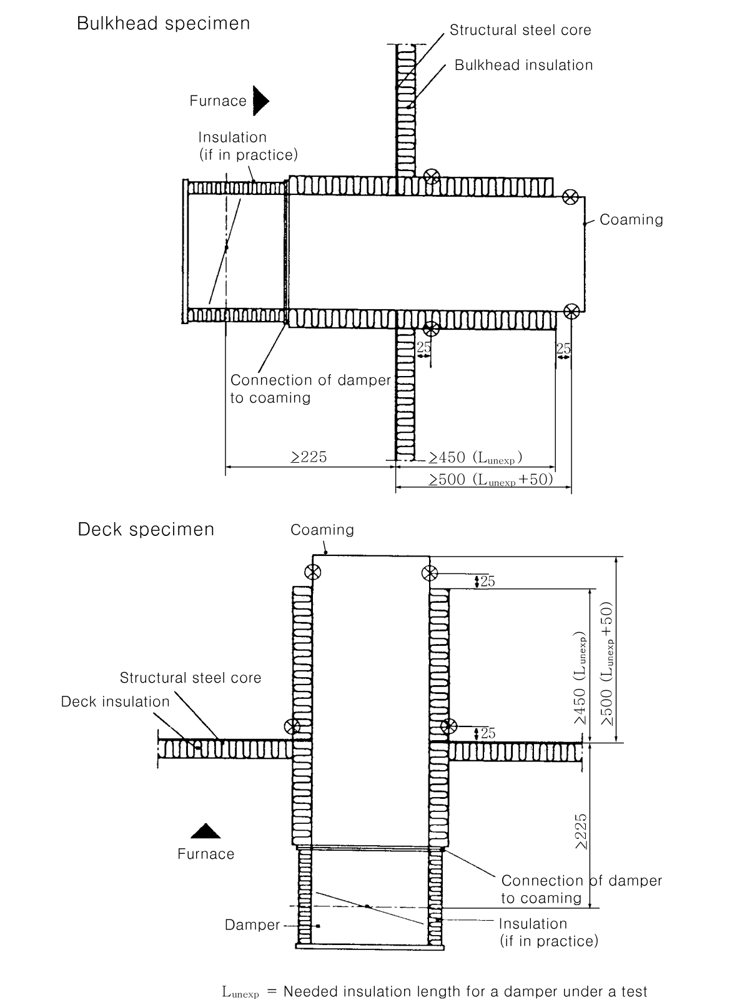 **Fig 3.26.5 Fire Dampers: Insulation on Test Specimens and Position of Unexposed-face Thermocouples** (6) Fire dampers which are operated with a manual systems shall be closed at the test time of 1 min. |
    | Pipe and duct penetrations | Dimensions | The maximum and minimum sizes (in terms of both the width and the height, or diameter) of each type of pipe penetration for which approval is sought are to be tested in both vertical and horizontal orientation. |
    | Pipe and duct penetrations | Design | (1) A bulkhead which includes the pipe penetration is to be constructed in accordance with (A) (a) above and is to be insulated to class “A-60” on the stiffened face, which is to be the face which is not exposed to the heating conditions of the test. A deck which includes the pipe penetration is to be constructed in accordance with the dimension of 'A' class deck above and is to be insulated to class “A-60” on the stiffened face, which is to be the face which is exposed to the heating conditions of the test. (a) "A-0" class pipe penetrations are recommended to be performed in an uninsulated ("A-0") bulkhead/deck. If the pipe penetrations are tested as an "A-60" class penetrations, any insulation fitted (on the penetration itself and 200 mm around) will be required to be fitted also for class "A-0". (b) "A-0" penetrations shall not be approved without an "A-0" test although tested and approved as "A-60". |

    **Table 3.26.3** **Fire test specimens of “A” and “B” class divisions (continued)**

    | Kinds | Item | Requirements |
    | --- | --- | --- |
    | Pipe and duct penetrations | Design | (2) The pipe penetrations are to be positioned only in the top half of a bulkhead but are not to be closer than 200 mm from the edges of a bulkhead or a deck. Where more than one pipe penetration is to be tested simultaneously in a division, the separation between adjacent penetrations is not to be less than 200 mm. Both measurements are to relate to the distance to the nearest part of the penetration system, including any insulation which is part of the system. (3) Each pipe passing through a penetration is to project 500 ± 50 mm beyond the exposed end of the penetration and 500 ± 50 mm beyond the unexposed end of the penetration. The exposed end of the pipe is to be blanked off, using an appropriate methodology to ensure that any fire penetration into the pipe does not occur via the end of the pipe in advance of it occurring through the exposed perimeter of the pipe. (4) Each pipe is to be firmly supported and fixed independent of the bulkhead or deck on the unexposed side of the test specimen, e.g. by a framework mounted from the restraint frame. The support and fixing of the pipe are to restrain it from movement during the test. (5) When the deck penetration is fitted on an exposed side or is fitted symmetrically, general application will be given. When the deck penetration is fitted on an unexposed side, the approval will limit the penetration to the tested orientation. When the bulkhead penetration is fitted symmetrically, approval would be given for general application. For bulkhead penetrations with an exposed or unexposed fitted frame, one test for each fitting is required in order for obtaining approval for general application. (6) Sealing of pipe and duct penetrations: there shall be no visible openings before the start of the fire test. |
    | Cable transits | Dimensions | The maximum and minimum sizes (in terms of both the width and the height, or diameter) of each type of pipe penetration for which approval is sought are to be tested in both vertical and horizontal orientation. |
    | Cable transits | Design | (1) A bulkhead which includes the cable transit is to be constructed in accordance with the dimension of 'A' class bulkhead above and is to be insulated to class “A-60” on the stiffened face, which is to be the face which is not exposed to the heating conditions of the test. A deck which includes the cable transit is to be constructed in accordance with the dimension of 'A' class deck above and is to be insulated to class 'A-60' on the stiffened face, which is to be the face which is exposed to the heating conditions of the test. (a) "A-0" class cable transits are recommended to be performed in an uninsulated ("A-0") bulkhead/deck. If the cable transits are tested as an "A-60" class penetrations, any insulation fitted (on the cable transits itself and 200 mm around) will be required to be fitted also for class "A-0". (b) "A-0" cable transits shall not be approved without an "A-0" test although tested and approved as "A-60". (2) The cable transits are to be positioned only in the top half of a bulkhead but are not to be closer than 200 mm from the edges of a bulkhead or a deck. Where more than one cable transit is to be tested simultaneously in a division, the separation between adjacent penetrations is not to be less than 200 mm. Both measurements are to relate to the distance to the nearest part of the penetration system, including any insulation which is part of the system. (3) Notwithstanding the above, the distance between transits is to be sufficient to ensure that the transits do not influence each other during the test, except that this requirement does not apply to muli-transits which are intended to be positioned adjacent to one another. (4) The cables are to project 500 ± 50 mm beyond the transit on the exposed side of the division and 500 ± 50 mm on the unexposed side. Each cable shall be firmly supported and fixed independent of the bulkhead or deck on the unexposed side of the test specimen, e.g., by a framework mounted from the restraint frame. The support and fixing of the cables shall restrain them from movement during the test. (5) Cable transits shall be fitted to the bulkhead or deck in accordance with the manufacturer's specifications. The cables and sealing compounds or blocks shall be incorporated into the transits with the bulkhead and deck panels places respectively in vertical and horizontal positions. Any insulation shall be applied to the cables and transits with the panels in the same respective positions. (6) The transit(s) is to be tested incorporating a range of different types of cables (e.g. in terms of number and type of conductor, type of sheathing, type of insulation material, size) and is to provide an assembly which represents a practical situation which may be found on ships. The test results obtained from a given configuration are generally valid for the tested types of cables of size equal to or smaller than tested. |

    | Kinds | Item | Requirements |
    | --- | --- | --- |
    | Cable transits | Design | (7) Tests shall be conducted for the maximum and minimum fill based on the inside cross-sectional area at each transit. The distance between the adjacent cables shall be the minimum specified by the manufacturer, and the cables should be placed close to the centre of the transit. (8) When the deck cable transit is fitted on an exposed side or is fitted symmetrically, general application will be given. When the deck cable transit is fitted on the unexposed side, the approval will limit the penetration to the tested orientation. When the bulkhead cable transit is fitted symmetrically, approval would be given for general application. For bulkhead cable transit with exposed or unexposed fitted frame, one test for each fitting is required in order for obtaining approval for general application. (9) Sealing of cable transits shall have no visible opening before the start of the fire test. |
    | Continuous “B“ class divisions | Continuous 'B' class ceilings | The ceilings are to be tested in accordance with “B“ class ceilings above except that the ceiling is to be mounted on the horizontal furnace so that at least 150 mm high “B” class bulkheads are mounted on the furnace and the ceiling is fixed to these partial bulkheads by using the joining method as is intended to be used in practice. Such ceilings and the joining methods are to be evaluated as required for ceilings in accordance with “B“ class ceilings above and accordingly they are to be classified as “continuous ”B“ class ceilings”. |
    | Continuous “B“ class divisions | Continuous “B” class linings | A lining which has been evaluated in accordance with “B“ class linings above to be a “B” (“B-0”, “B-15”, as applicable on basis of the lining test) class lining may be considered forming 'continuous “B” (“B-0” or “B-15”, as applicable) class lining' in conjunction with a 'continuous “B” (“B-0' or ”B-15“, as applicable) class ceiling' and with the joining method used in the test without further testing the lining. |
    | Continuous “B“ class divisions | Continuous “B” class construction | An enclosed construction installed on an “A” class deck and formed by 'continuous “B” (“B-0” or “B-15”, as applicable) class lining' and 'continuous “B”(“B-0” or “B-15”,as applicable) class ceiling' is to be considered forming 'continuous 'B' class construction“. |
  - **(3)** Examination of the test specimens
    Following mounting of the door and immediately prior to test, the Society is to measure the actual clearances between the door leaf and the doorframe, and additionally for a double leaf door between the adjacent door leaves. The clearances are to be measured for each door leaf at two positions along the top and bottom edges and at three positions along each vertical edge.
    Similarly, immediately prior to test, the Society is to check the operability of the door by opening the door leaf by a distance of at least 300 *mm*. The door leaf is to then be closed, either automatically, if such a closing device is provide, or manually. The door may be latched for the test but is not to be locked, and no devices for latching or locking are to be included which are not normally incorporated in practice.
    - **(A)** The Society is to verify the conformity of the test specimen with the drawings and method of assembly provided by the applicant and any area of discrepancy is to be resolved prior to commencement of the test.
    - **(B)** Door clearances
    - **(C)** Door operation
  - **(4)** Observations during the test
    Observations during the test **is to be as specified in Table 3.26.4**.

    **Table 3.26.4. Observation** **of “A” and “B” class divisions**

    | Item | Observation |
    | --- | --- |
    | Flaming on unexposed face | The occurrence and duration of any flaming on the unexposed surface, together with the location of the flaming, are to be recorded. In case where it is difficult to identify whether or not there are flames then the cotton-wool pad is to be applied to the area of such disputed flaming to establish whether ignition of the pad can be initiated. |
    | Cotton-wool pad | (a) Tests with the cotton-wool pad are used to indicate whether cracks and openings in the test specimen are such that they could lead to the passage of hot gases sufficient to cause ignition of combustible materials. (b) A cotton-wool pad is employed by placing the frame within which it is mounted against the surface of the test specimen, adjacent to the opening or flaming under examination, for a period of 30 seconds, or until ignition (defined as glowing or flaming ) of the cotton-wool pad occurs (if this happens before the elapse of the 30 seconds period). A cotton-wool pad is to be used only once. |
    | Gap gauges | (a) Tests with the gap gauges are used to indicate whether cracks and openings in the test specimen are of such dimensions that they could lead to the passage of hot gases sufficient to cause ignition of combustible materials. (b) The gap gauges are to be used at intervals which will be determined by the apparent rate of the specimen deterioration. Two gap gauges are to be employed, in turn, and without undue force to determine: - whether the 6 mm gap gauge can be passed through the specimen such that the gauge projects into the furnace, and can be moved a distance of 150 mm along the gap, or - whether the 25 mm gap gauge can be passed through the specimen such that the gauge projects into the surface. (c) If gaps in "A" or "B" class divisions are fully or partly sealed by intumescent materials, the gap gauge test shall be performed as if no intumescent material is present. (d) For doors mounted in a three-sided frame, the change of gap at the bottom of the door as measured by a horizontally-held gap gauge shall not increase by more than 12 mm along the bottom edge of the door. 12 mm gap gauge can be used for the purpose of examining the increase of such gap. The edges of the door above the horizontal plane along the bottom of the door should be checked in the same manner as the fou-sided framed door. * If the door is mounted with a 13 mm gap, the 25 mm gap gauge may be used to determine an unacceptable change in gap. |
    | Deformation | The deflection of an “A” or "B" class test specimen, and additionally in the case of a door the maximum displacement of each corner of the door leaf relative to the door frame, are to be recorded during the test. These deflections are to be measured with an accuracy of 2 *mm*. |
    | General behaviour | If quantities of smoke are emitted from the unexposed face, this is to be noted in the report. |
  - **(5)** Duration of testing
    Duration of testing **is to be as specified in Table 3.26.5**.

    **Table 3.26.5 Duration of testing** **of “H”, “A” and “B” class divisions**

    | Kind | Duration of testing |
    | --- | --- |
    | “H” class divisions | For all “H” class divisions, including those with doors, the test is to continue for minimum 120 minutes. When the specimen is of an “H” class division, with a structural steel core which is imperforate (e.g. without door), and where insulation is provided to the exposed face only (i.e. the structural steel core is the unexposed face of the construction), it is permitted to terminate the test prior to 120 minutes once the unexposed face temperature rise limits have been exceeded. |
    | “A” class divisions | For all “A” class divisions, including those with doors, the test is to continue for minimum 60 minutes. When the specimen is of an “A” class division, with a structural steel core which is imperforate (e.g. without door), and where insulation is provided to the exposed face only (i.e. the structural steel core is the unexposed face of the construction), it is permitted to terminate the test prior to 60 minutes once the unexposed face temperature rise limits have been exceeded. |
    | “B” class divisions | For all “B” class divisions, including those with doors, the test is to continue for minimum 30 minutes. |
    | Termination of the test | The test may be terminated for one or more of the following reasons : (1) safety of personnel or impending damage to equipment ; (2) attainment of selected criteria ; or (3) request of the sponsor. The test may be continued after failure under subparagraph (2) above to obtain additional data. |
  - **(6)** Performance criteria
    Performance criteria **is to be as specified in Table 3.26.6**.

    **Table 3.26.6 Performance criteria of** **“H”, “A” and “B” class divisions**

    | Item | Kind | Performance criteria |
    | --- | --- | --- |
    | Insulation | “H” class divisions, including “H” class doors | The average unexposed face temperature rise is not to be more than 140 °C, and the temperature rise recorded by any of the individual unexposed face thermocouples is not to be more than 180 °C during the periods given below for each classification: class “H-120” 120 minutes class “H-60” 60 minutes class “H-0” 0 minutes This division is to remain intact with the main structure of the vessel, and is to maintain its structural integrity after two(2) hours. Structural Integrity means that the structure will not fall under its own weight, nor will it crumble or break upon normal contact after exposure to the fire. |
    | Insulation | “A” class divisions, including “A” class doors | The average unexposed face temperature rise is not to be more than 140 °C, and the temperature rise recorded by any of the individual unexposed face thermocouples is not to be more than 180 °C during the periods given below for each classification: class “A-60” 60 minutes class “A-30“ 30 minutes class “A-15” 15 minutes class “A-0” 0 minutes |
    | Insulation | “B” class divisions, including “B” class doors | The average unexposed face temperature rise is not to be more than 140 °C, and the temperature rise recorded by any of the individual unexposed face thermocouples is not to be more than 225 °C during the periods given below for each classification: class “B-15“ 15 minutes class “B-0” 0 minutes |

    **Table 3.26.6 Performance criteria of** **“H”, “A” and “B” class divisions**

    | Item | Kind | Performance criteria |
    | --- | --- | --- |
    | Integrity | General | For all “A” and “B” class divisions, including “A” and “B” class doors, the following requirements are to be satisfied for the minimum test duration relevant to the classification. "A" and "B" class doors are not required to be able to be opened or closed, during or after the specified test duration. |
    | Integrity | Flaming | there are to be no flaming on the unexposed face |
    | Integrity | Cotton-wool pad | there are to be no ignition, i.e. flaming or glowing, of the cotton-wool pad when applied in accordance with Table 3.26.4 above or when used to assist evaluation of flaming in accordance with Table 3.26.4 above. |
    | Integrity | Gap gauges | Gap gauges: it is not to be possible to enter the gap gauges into any opening in the specimen in the manner described in Table 3.26.4 above. |
    | Structural core temperature |   | In the case of load-bearing divisions of aluminium alloy, the average temperature of the structural core obtained by the thermocouples is not to rise more than 200 °C above its initial temperature at any time during the minimum test duration relevant to the classification described in (5) above. Where the structural core is of a material other than steel or aluminium alloy, the Society is to decide the rise in temperature which is not to be exceeded during the test duration. |
    | Continuous "B" class ceilings and linings |   | Where ceilings or linings are required to be continuous "B" class ceilings or linings, they may be tested and evaluated in accordance with appendix 4, Part 3, Annex 1 and IMO FTP Code. |
    | Additional requirements |   | (1) The specimen of the "A" and "B" class constructions shall be constructed from non-combustible materials. (A) adhesives and vapour barriers used in the construction of the specimen are not required to be non-combustible; however, they shall have low flame-spread characteristics; (B) sealing materials used in penetration systems; (C) seals for gas-, water- and weather-tight doors; (D) seals for windows; and (E) filling material within glazing systems. (a) Adhesives and sealing materials used in testing of penetration sysstems shall be used in the actual structure. Materials mentioned in paragraphs (A) ~ (E) may be installed in constructions of the specimen. Such inclusions shall be stated in the test report. (b) The material used in the test shall not be replaced by any other materials that have not been tested in accordance with FTP Code and/or accepted by the Society. (2) Thermal radiation through windows (A) Where thermal radiation through windows is required to be limited by the Society, the window assembly may be tested and evaluated in accordance with IMO FTP Code Appendix 3. (B) The cotton-wool pad need not be used on the unexposed face after the period relevant to the insulation classification of the product. |
  - **(7)** A fire door of marginally larger dimensions
    Method of evaluation and testing about fire doors larger than the standard specimen size (2,440 mm wide and 2,500 mm high) as specified in part 3 of the FTP Code is to comply with the following requirements.
    A fire door of marginally larger dimensions than a fire door tested in accordance with the FTP Code may be individually assessed and accepted for a specific project with the same classification, provided all of the following are met:

    | Class divisions | Insulation (min) | Integrity (min) |
    | --- | --- | --- |
    | B-0 | 0 | 36 |
    | B-15 | 18 | 36 |
    | A-0 | 0 | 68 |
    | A-15 | 18 | 68 |
    | A-30 | 36 | 68 |
    | A-60 | 68 | 68 |

    ① Standard fire test of the “pecimen”to obtain reference temperature and structural displacements. Such a “specimen” may be either
    - A door already certified through the fire test which is identical in design to the door to be analysed (fire test to include additional instrumentation as per paragraph (iv) ⑤) or
    - A specially-built specimen where the finite element method is to be performed to extrapolate the results of a specimen for a door having a size exceeding the maximum size allowed by the furnace of the testing laboratory; the specimen should be a mock-up of the door in question, but having a size that fits in the furnace.
    ② Finite element analysis in paragraph (vi), of the “specimen”to calibrate the thermal and mechanical boundary conditions of the FEM model, which are adjusted until the numerical and experimental temperature and displacement distribution compare satisfactorily
    ③ Finite element analysis in paragraph (v), of the door in question carried out using the model calibrated as per paragraph (vii), assuming that the differences in the geometry and dimensions between the actual door and the specimen door do not significantly influence the results.
    ① Detailed drawings of the door, the door frame and the closure and locking devices including clearances and interferences
    ② Test report of the prototype used to extrapolate the results.
    ③ Mechanical characteristics of all materials used for the construction of the door and its insulation
    - Young’ module
    - Yield strength
    - Density
    ④ Thermal properties
    - Thermal expansion coefficient
    - Thermal conductivity
    - Specific heat.
    ⑤ Since the properties in the above ③, ④ are temperature dependent, it is necessary that the required data be given as a function of the temperature range foreseen for the fire tests. Where it is not possible to obtain experimental data, an engineering evaluation shall be submitted with the supporting documentation for the proposed curves of variation of mechanical and thermal characteristics as a function of the temperature in the considered range.
    The comparison of the fire resistance of doors having larger geometry shall be carried out in two steps:
    ① Evaluation of the heat transmission through the specimen thickness and of the temperature on the unexposed specimen surface
    ② Evaluation of the strength characteristics and of the displacements of the structural members of the specimen.
    ① By carrying out finite element calculations, the histories over time of the heat transmission within the structural assembly are computed and the temperature is compared with the temperature experienced by the assembly represented in the standard fire test.
    ② Based on suitable data for the temperature-dependent variables, an iterative procedure is used for the evaluation of thermal-mechanic properties.
    ③ The thermal boundary conditions of convecting and radiative type are:
    $q _{c} = h _{c} \left( T _{S} -T _{\infty } \right)$ and $q _{r} = \sigma _{\varepsilon } \left( T _{S} ^{4} -T _{\infty } ^{4} \right)$
    where:
    $q _{c}$ and $q _{r}$ : Convective and radiative heat flux, respectively
    $h _{c}$ : Convective heat transfer coefficient
    $\sigma$ : Stefan-Boltzmann constant
    $\varepsilon$ : Emissivity coefficient
    $T _{S}$ : Surface temperature
    $T _{ \infty }$ : Furnace or ambient temperature.
    ④ The two equations can be included in an equivalent boundary condition:
    $q = H _{eq} \left( \sigma , \varepsilon , T _{s } , T _{\infty } \right) \left( T _{s} -T _{\infty } \right)$
    The equivalent coefficient $H _{eq}$ depends on the unknown surface temperature. However, it can be calculated as part of the finite element analysis using an emissivity coefficient appropriately calibrated with the fire test results.
    ⑤ The equivalent heat transfer coefficient can be assumed to be constant on the single exposed surface, as the furnace assembly built in accordance with the FTP Code gives uniformity of the temperature and heat flux within the furnace.
    ⑥ Alternatively, the temperature distribution measured on the specimen of the standard fire test can be directly applied on the finite element structural model taking into account the same time histories.
    ① Using the results of the heat transmission analysis and information on temperature dependent material properties, the thermal stresses and deformations on the geometry are evaluated. When modelling the structural assembly, attention should be paid to using a sufficient number of elements to account for the non-uniform temperature distribution within the member and to catch the non-linear temperature-dependent behaviour.
    ② Once the model is prepared, the analysis is to be carried out stepwise. For each element, the incremental strain or deformation caused by a temperature increase is calculated and a new stress level is obtained based on the stress-strain relationship applicable for that particular temperature increase.
    ③ The mechanical boundary conditions are to be congruent in order to represent the real interaction of the door with the external frame for the overall length of the test.
    - **(A)** If such doors can be accommodated into a larger test furnace, it is recommended to conduct a test with the full size specimen of the door; or
    - **(B)** It is recommended to use the following method for evaluation of the fire performance of the door and approval of the door may be used.
      - **(a)** Fire doors of marginally larger dimensions
      - **(i)** Dimensions (width, height) are not more than 15 % above those of the fire door tested in accordance with the FTP Code
        - **(ii)** The surface area of the door is not more than 10 % above that of the fire door tested in accordance with the FTP Code
        - **(iii)** The door design does not deviate in any other aspect from the fire door tested in accordance with the FTP Code.
        - **(iv)** The tested door has successfully satisfied both insulation and integrity criteria for the following times, as appropriate.
      - **(b)** Fire doors larger than those in the above (a), but not exceeding 50 % in surface area of a fire door tested in accordance with the FTP Code.
      - **(i)** An engineering assessment can be used to extrapolate the fire test results of a fire door tested in accordance with the FTP Code to apply to a door larger than those in the above (a), but not exceeding 50 % in surface area of a fire door tested in accordance with the FTP Code.
        - **(ii)** Such an assessment can be accepted for verification, only if the dimensions of the door in question are greater than the maximum permitted and the results from tested door have been found satisfactory in accordance with FTPC Annex 1, Part 3.
        - **(iii)** The methodology used to extrapolate the fire tests results shall include the following three steps
        - **(iv)** In order for the analysis to be carried out, the following information should be submitted
      - **(v)** Method of analysis
        - **(vi)** Heat transmission analysis
        - **(vii)** Structural analysis
      - **(c)** Larger fire doors exceeding 50 % in surface area of a fire door tested in accordance with the FTP Code
      - **(i)** For larger doors exceeding 50 % in surface area of a fire door tested in accordance with the FTP Code, a full analysis is to be performed as per SOLAS regulation II-2/17.
        - **(ii)** The approach shall be based on the results of the fire test of the door having the maximum dimensions permitted according to the procedure described in the above (b).
  - **(8)** Additional testing and approval of pipe penetrations and cable transits for use in "A" class divisions
    Penetrations in structural divisions shall not impair the structural strength of the division. The structural make-up of the penetration is to be fully described so that its use and the need for additional stiffening for the division can be fully assessed.
    - **(A)** Arrangement(Application)
      - **(a)** "A"-class pipe penetration and cable transits that are constructed without structural sleeves of minimum 3 mm thickness and minimum 60 mm length welded or bolted to the division; and/or
      - **(b)** "A"-class pipe penetrations and cable transits that are constructed with removable, soft or intumescent filling material
    - **(B)** Additional testing/design criteria
      - **(a)** Filling materials shall be adequately secured by bonded materials or mechanical means that cannot be removed without the use of tools in order to prevent damage by normal ship vibrations and pressures.
      - **(b)** The pipe penetration/cable transit shall not have any visible openings. It shall not be possible to manually penetrate any part of the penetration with a 6 mm gap gauge, as described in paragraph **7.10** of **2010 FTP Code, Annex 1, Part 3, Appendix 1**.
    - **(C)** Approval
  - **(9)** Others
    Details of test for “A” and “B” class divisions not specially mentioned in **2604. 2** are to comply with **FTP Code, Annex 1, Part 3.**
- **3.** **Test for surface flammability**
  Test for surface flammability are to comply with the requirements specified in **Table 3.26.7.** (refer to **FTP Code, Annex 1, Part 5** and **IMO Res. MSC. 307(88)**)

  **Table 3.26.7 Surface flammability test** ***(2019)***

  | Item | Test method |
  | --- | --- |
  | Application | Where a product is required to have a surface with low flame-spread characteristic, the product is to comply with the requirements below. |
  | Test specimens | (A) Number required (a) Specimens required : At least six specimens shall be provided for each different exposed surface. (b) Required number for the test : Three specimens shall be tested for each different exposed surface of the product evaluated and applied. (B) Dimension (a) The specimens are to be 155mm wide by 800mm long, and be representative of the product. (b) Specimen thickness: materials and composites of normal thickness 50 mm or less are to be tested using their full thickness. For materials and composites of normal thickness greater than 50 mm, the required specimens are to be obtained by cutting away the unexposed face to reduce the thickness to 50${}_{-3}^{+0}$mm. (C) Substrate (a) Substrate of surface material and floor coverings Materials and composite materials shall be tested using their full thickness, attaching them, by means of an adhesive if appropriate, to the substrate to which they will be attached in practice. The test specimen shall reflect actual application. (b) Substrate of primary deck covering The specimens shall be applied to a steel plate having a thickness of 3mm. The specimens shall have a nominal thickness ; the components and construction of the primary deck covering shall reflect actual application. (D) Composite materials (a) Assembly is to be as specified in (B) above. However, where thin materials or composites are used in the fabrication of an assembly, the presence of an air gap and/or the nature of any underlying construction may significantly affect the flammability characteristics of the exposed surface. The influence of the underlying layers is to be recognized and care taken to ensure that the test result obtained on any assembly is relevant to its use in practice. (b) Vapour barriers used in conjunction with installation shall be tested without any other components that will shield the barrier being tested from the radiant panel. The substrate of the specimen shall reflect actual application on ships. (E) Metallic facings If a bright metallic faced specimen is to be tested, it shall be tested as it is. (F) Marking specimens A line is to be marked centrally down the length of the face to be tested of each specimen. Caution is to be exercised to avoid the use of a line which would influence specimen performance. (G) Conditioning of specimens Before test, the specimens are to be conditioned to constant moisture content, at a temperature of 23 ± 2°C, and a relative humidity of 50 ± 5 %. Constant moisture content is considered to be reached when, following two successive weighing operations, carried out at an interval of 24 hours, the measured masses do not differ by more than 0.1% of the mass of the specimen. (H) Colour variation and organic contents of specimen Usually the influence of the colour and organic content of the specimen have a significant effect on the result of a fire test. The organic content of the specimen is a key factor of the combustion characteristic of the product. Therefore the specimen should be selected to have the dark colour the maximum organic content within the production variation. |
  | Duration of test | The test is to be terminated, the specimen removed, and the dummy specimen in its holder reinserted when any one of the following is applicable: (A) the specimen fails to ignite after a 10 minutes exposure; (B) 3 minutes have passed since all flaming from the specimen ceased or 10 min. exposure, whichever is longer. |

  **Table 3.26.7 Surface flammability test (continued)**

  | Item |   | Test method |
  | --- | --- | --- |
  | Conditions of retest |   | (A) In the event of failure, during test of one or more specimens, to secure complete flame spread times or a reasonable heat release curve, the data secured are to be rejected and a new test or tests performed. Such failures might involve, but not be limited to, incomplete observational data or malfunction of data logging equipment. Excessive stack signal baseline drift is also to require further equipment stabilization and retest. (B) If a specimen shows extensive loss of incompletely burned material during test, at least one additional specimen, restrained in the testing frame by poultry netting, is to be tested and the data secured to be reported separately. (C) The following procedures shall be taken in relation to the behavior of the specimen during the test. (a) if the pilot flame extinguishes : report occurrence and reject data and repeat test ; or (b) if the specimen breaks up and falls out of the specimen holder, report the behavior, but classify on basis of worst performance with and without specimen restraint in the above (B) |
  | Observations during the test |   | In addition to the recording of the experimental data, observations are to be made and recorded on the behaviour of the specimen including but not limited to flashing, unstable flame front, sparks, glowing, charring, melting, flaming drips, disintegration of the specimen, fissures, fusion, change in form. |
  | Derived fire characteristics | General | Experimental results are to be reported in terms of the thermal baseline of the output from the thermocouple circuit and measurements of incident heat flux measured with a dummy specimen in place. The results are not to be adjusted to compensate for changes in the thermal output of the radiant panel and the pilot flame during the conduct of the test. The following data are to be derived from the test results. |
  | Derived fire characteristics | Heat for ignition | The product of the time from initial specimen exposure until the flame front reaches the 150 mm position and the flux level at this position, this latter obtained in prior calibration of the apparatus. |
  | Derived fire characteristics | Heat for sustained burning | The product of time from the start of exposure of a specimen to the arrival of the flame front at a specified position and the incident flux corresponding to that position measured on a non-combustible calibration board. This shall be calculated for each station starting at the 150 mm station, but it shall not be calculated for a given station unless the flame propagates more than halfway to the next station as viewed along the centreline of the specimen. |
  | Derived fire characteristics | Average heat for sustained burning | (A) An average of the values for the characteristic defined in the above measured at different stations, the first 150 mm and then at subsequent stations at 50 mm intervals through the final station or the 400 mm station, whichever is the lower. (B) For each specimen where the flame front does not reach the 175 mm position, the heat of sustained burning in not defined. If the heat of sustained burning is not defined for one specimen, Qsb is calculated using the data from the other two specimens. If the heat of sustained burning is not defined for two specimens, Qsb is calculated using the data from the third specimen. If the heat of sustained burning is not defined for all three specimens, Qsb is undefined and the criterion of Qsb is deemed to have been met. |
  | Derived fire characteristics | Critical flux at extinguishment | A list of the values of this characteristic for the specimens tested and the average of these values |
  | Derived fire characteristics | Heat release of the specimen | Both a heat release time curve and a listing of the peak and total integrated heat release are to be secured from the experimental data. (A) The total heat release is given by integration of the positive part of the heat release rate during the test period. (B) The peak heat release rate is the maximum of the heat release rate during the test period. |

  **Table 3.26.7 Surface flammability test (continued)**

  | Item | Test method |   |   |
  | --- | --- | --- | --- |
  | Classification | Materials giving average values for all of the surface flammability criteria that comply with the values as listed in Table below, are considered to meet the requirement for low flame spread in compliance with the relevant regulations in chapter II-2 of the International Convention for the Safety of Life at Sea, 1974. Bulkhead, wall and ceiling linings ; Floor coverings ; Primary deck coverings CFE ($\mathrm{kW}/m ^{2}$) ; ≥ 20.0 ; ≥ 7.0 ; ≥ 7.0 $\mathrm{Q} _{ s b}$ ($\mathrm{MJ}/m ^{2}$) ; ≥ 1.5 ; ≥ 0.25 ; ≥ 0.25 $\mathrm{Q} _{ t}$ ($\mathrm{MJ}$) ; ≤ 0.7 ; ≤ 2.0 ; ≤ 2.0 $\mathrm{Q} _{ p}$ ($\mathrm{kW}$) ; ≤ 4.0 ; ≤ 10.0 ; ≤ 10.0 Burning droplets ; Not produced ; No more that 10 ; Not produced Where, CFE = Critical flux at extinguishment, $\mathrm{Q} _{ s b}$ = Heat for sustained burning $\mathrm{Q} _{ t}$ = Total heat release, $\mathrm{Q} _{ p}$ = Peak heat release rate Bulkhead, wall and ceiling linings Floor coverings Primary deck coverings CFE ($\mathrm{kW}/m ^{2}$) ≥ 20.0 ≥ 7.0 ≥ 7.0 $\mathrm{Q} _{ s b}$ ($\mathrm{MJ}/m ^{2}$) ≥ 1.5 ≥ 0.25 ≥ 0.25 $\mathrm{Q} _{ t}$ ($\mathrm{MJ}$) ≤ 0.7 ≤ 2.0 ≤ 2.0 $\mathrm{Q} _{ p}$ ($\mathrm{kW}$) ≤ 4.0 ≤ 10.0 ≤ 10.0 Burning droplets Not produced No more that 10 Not produced Where, CFE = Critical flux at extinguishment, $\mathrm{Q} _{ s b}$ = Heat for sustained burning $\mathrm{Q} _{ t}$ = Total heat release, $\mathrm{Q} _{ p}$ = Peak heat release rate |   |   |
  |   | Bulkhead, wall and ceiling linings | Floor coverings | Primary deck coverings |
  | CFE ($\mathrm{kW}/m ^{2}$) | ≥ 20.0 | ≥ 7.0 | ≥ 7.0 |
  | $\mathrm{Q} _{ s b}$ ($\mathrm{MJ}/m ^{2}$) | ≥ 1.5 | ≥ 0.25 | ≥ 0.25 |
  | $\mathrm{Q} _{ t}$ ($\mathrm{MJ}$) | ≤ 0.7 | ≤ 2.0 | ≤ 2.0 |
  | $\mathrm{Q} _{ p}$ ($\mathrm{kW}$) | ≤ 4.0 | ≤ 10.0 | ≤ 10.0 |
  | Burning droplets | Not produced | No more that 10 | Not produced |
  | Where, CFE = Critical flux at extinguishment, $\mathrm{Q} _{ s b}$ = Heat for sustained burning $\mathrm{Q} _{ t}$ = Total heat release, $\mathrm{Q} _{ p}$ = Peak heat release rate |   |   |   |
  | Other reference | (A) Surface materials and primary deck coverings. are to comply with 4 below. (B) However, surface materials and primary deck coverings with both the total heat release (Q_t) of not more than 0.2 MJ and the peak heat release rate (Q_p) of not more than 1.0 kW are considered to comply with the requirements of **4** with out further testing. |   |   |
  | Others | Details of test for surface flammability not specially mentioned in 2604. 3 are to comply with FTP Code, Annex 1, Part 5. |   |   |
- **4.** **Smoke and toxicity test**
  Smoke and toxicity test are to comply with the requirements specified in **Table 3.26.8.** (refer to **FTP Code, Annex 1, Part 2**) *(2022)*

  **Table 3.26.8 Smoke and toxicity test** ***(2019)***

  | Item |   | Test method |
  | --- | --- | --- |
  | Application |   | Where a material is required not to be capable of producing excessive quantities of smoke and toxic products or not to give rise to toxic hazards at evaluated temperatures, the material is to comply with the requirements below. |
  | Test specimen |   | (A) Number of specimens (a) The test sample shall comprise a minimum of nine specimens if all three test conditions are to be tested. (b) If the product has two faces and either face is likely to be exposed to a fire condition when in use, then both faces shall be evaluated. An additional number of specimens specified in (a) above shall be used for each face. (c) An additional set of three specimens per test conditions shall be held in reserve, where repeat test is required. (d) In case of intumescent materials, it is necessary to make a preliminary test with the cone heater at 50 mm from the specimen. Therefore, at least two additional specimens are required. (B) Size of specimens (a) The specimens shall be square, with sides measuring 75#eqnID-3281 mm. (b) Materials of nominal thickness 25 mm or less shall be evaluated at their full thickness. For comparative testing, materials shall be evaluated at a thickness of 1 #eqnID-3290.1 mm. As far as possible, materials shall be tested in their end-use thickness. (c) Materials with a thickness greater than 25 mm shall be cut to give a specimen thickness between 25${}_{-1}^{+0}$ mm. (d) Specimens of multi-layer materials with a thickness greater than 25 mm, consisting of core material(s) with facings of different materials, shall be prepared as specified in (c). (C) Requirements other than those specified in test specimen of **4** may refer to the requirements of **3.** |

  **Table 3.26.8 Smoke and toxicity test (continued)**

  | Item |   | Test method |
  | --- | --- | --- |
  | Test conditions |   | Irradiance to the specimen during the test shall be kept constant. Three specimens are to be tested under each of the following conditions: (A) irradiance of 25 $\mathrm{kW}/m ^{2}$ in the presence of pilot flame; (B) irradiance of 25 $\mathrm{kW}/m ^{2}$in the absence of pilot flame; and (C) irradiance of 50 $\mathrm{kW}/m ^{2}$ in the absence of pilot flame; |
  | Duration of tests | Smoke | The initial test at each test condition shall last for 20 min. to verify the possible existence of a second minimum transmittance value. If the minimum transmittance value is shown by the initial test to occur within the first 10 min. then subsequent tests for that test condition may have an exposure of 10 min. Otherwise, the tests shall last 20 min. |
  | Duration of tests | Toxicity | Continue the smoke density test until a 20 min. period has elapsed. |
  | Classifi-cation criteria | Smoke | (A) An average ($D _{m}$) of the maximum of specific optical density of smoke ($D _{s \max}$) of three tests at each test condition is to be calculated. - for materials used as surface of bulkheads, linings or ceilings, the $D _{m}$ is not to exceed 200 in any test condition; - for materials used as primary deck covering, the $D _{m}$ is not to exceed 400 in any test condition; - for materials used as floor covering, the $D _{m}$ is not to exceed 500 in any test condition; and - for plastic pipes and electric cables, the $D _{m}$ is not to exceed 400 in any test condition. (B) If the value of Ds max for any individual specimen differs from the average value for the set of three specimens of which it is part by more than 50% of that average for no apparent reason, test an additional set of three specimens from the same sample in the same mode and record the average of all six results obtained. |
  | Classifi-cation criteria | Toxicity | The average value of the maximum value of the gas concentration measured at each test condition is not to exceed the follow limits: - *CO* 1450 ppm - *HBr* 600 ppm - *HCl* 600 ppm - *HCN* 140 ppm - *HF* 600 ppm - *SO2* 120 ppm (200 ppm for floor coverings) - *NOx* 350 ppm |
  | Additional requirements |   | Paints, floor coverings, primary deck coverings, varnishes and other finishes used on exposed interior surfaces are also to be applicable to the above 2604. 3, Surface flammability test |
  | Others |   | Details of test for surface flammability not specially mentioned in 2604. 4 are to comply with FTP Code, Annex 1, Part 2. |
- **5.** **Test of curtains, etc.**
  Test of curtains, etc. are to comply with the requirements specified in **Table 3.26.9** (refer to **FTP Code, Annex 1, Part 7** and **IMO Res. MSC. 307(88)**)

  **Table 3.26.9 Test of curtains, etc.**

  | Item |   | Test method |
  | --- | --- | --- |
  | Application |   | Where draperies, curtains and other supported textile materials are required to have qualities of resistance to the propagation of flame, not inferior to those of wool of mass 0.8 kg/m^2, they shall comply with the requirements below. |
  | Test specimens | Preparation | The specimens are to be as representative as possible of the material provided and are to exclude salvages. At least ten specimens are to be cut, each measuring 220 *mm* × 170 *mm*, five in the direction of the warp, five in the direction of the weft. Where the fabric has differing surfaces on the two sides enough samples are to be cut for both surfaces to be tested. Using a template 220 *mm* × 170 *mm*, with holes approximately of 5 *mm* diameter located on the template at the position of the pins on the frame, each specimen is to be laid flat on a bench and premarked /punctured, to ensure a repeatable and reproductive tension of the specimen, after mounting on the frame. |
  | Test specimens | Conditioning | The specimens are to be conditioned at 20 ± 5°C and 65 ± 5 % relative humidity for not less than 24 hours before test. Each specimens are to be removed from the conditioning atmosphere and either tested within 3 min. or placed in a sealed container until required. |
  | Test specimens | Exposure procedures | If the material have not permanent fire-retardant treatment or is not inherently flameproof, one of the exposure procedures detailed in Appendix 3 of IMO Res. MSC. 307(88) may be applied to at least ten further specimens. |
  | Observations during the test |   | (A) Afterglow times and any evidence of surface flash are to be noted. If afterglow is observed to occur during a test, the specimen is to be allowed to remain in place until all glowing has ceased. The extent of char is also measured in accordance with Appendix 2 of IMO Res. MSC. 307(88). (B) To investigate if burning drops of thermoplastic materials are capable of igniting combustible materials on the base of the apparatus, cotton wool is to be laid to a depth of 10 *mm* over the base plate, immediately below the specimen holder. Note is to be made of any ignition or glowing of the cotton wool. |
  | Criteria |   | (A) Products which show any of the following characteristics shall be considered unsuitable for use as curtains, draperies, or free-hanging fabric product for use in rooms containing furniture and furnishings of restricted fire risk as defined in SOLAS Ⅱ-2, Reg. 3, 40 (a) An afterflame time greater than 5 seconds for any of the 10 or more specimens tested with surface application of the pilot flame. (b) Burn-through to any edge of any of the 10 or more specimens tested with surface application of the pilot flame. (c) Ignition of cotton wool below the specimen in any of the 10 or more specimens tested. (d) An average char length in excess of 150 mm observed in any of the batches of fire specimen tested by either surface or edge ignition. (e) The occurrence of a surface flash propagating more than 100 mm from the point of ignition with or without charring of the base fabric. (B) If, following analysis of the experimental data from tests of a fabric, it is found that either or both of the batches of five specimens cut in both warp and weft directions fail to meet one or more of the criteria specified in (a), (b), (c) and (e) of (A) above because of poor performance of only one of the five specimens tested, one complete retest of a similar batch is permitted. Failure of the second batch to meet any of the criteria is to provide the basis for rejection of the fabric for use. |
  | Additionally requirements |   | The tests are to be made by using specimens of the final product (e.g. with colour treatment). In cases where only the colours change, a new test is not necessary. However, in cases where the basis product or the treatment procedure change, a new test is required. |
  | Others |   | Details of test for curtains, etc. not specially mentioned in 2604. 6 are to comply with FTP Code, Annex 1, Part 7. |
- **6.** **Test for upholstered furniture**
  Test for upholstered furniture are to comply with the requirements specified in **Table 3.26.10.** (refer to **FTP Code, Annex 1, Part 8** and **IMO Res. MSC. 307(88)**)

  **Table 3.26.10 Test for upholstered furniture**

  | Item |   | Test method |
  | --- | --- | --- |
  | Application |   | Where upholstered furniture are required to have qualities of resistance to the ignition and propagation of flame, the upholstered furniture are to comply with the requirements below. |
  | Test pieces | General | The test piece materials are to be representative of the cover, filling and any other components to be used in the final assembly. |
  | Test pieces | Cover material and fabric interliner | The cover size needed for each test is 800 ± 10 *mm* × 650 ± 10 *mm*. The long dimensions are to be cut parallel to the selvage. The cover may be constructed from smaller pieces of material provided that the resulting seams are not located within 100 *mm* of the area likely to be affected by the test. Where a fabric interliner is used, it is to be cut to the same dimensions and in the same orientation as the cover for fitting to the test rig under the cover. |
  | Test pieces | Upholstery filling | Two pieces, one 450 ± 5 *mm* × 300 ± 5 *mm* × 75 ± 2 *mm* thick, and the other 450 ± 5 mm × 150 ± 5 *mm* × 75 ± 2 *mm* thick are required for each test. |
  | Atmosphere for conditioning and testing | Conditioning | The materials to be tested and the cigarettes are to be conditioned immediately before the test for 72 hours in indoor ambient conditions and then for at least 16 hours in an atmosphere having a temperature of 23 ± 2°C and a relative humidity of 50 ± 5 %. |
  | Atmosphere for conditioning and testing | Testing | For testing, a substantially draught-free environment, having a temperature of 20 ± 5°C and relative humidity of 20 % to 70 %, is to be used. |
  | Criteria | Smouldering cigarette test | (a) If progressive smouldering of flaming of the upholstery components is observed at any time within a period of 1 hour of the placement of the cigarette, extinguish the test pieces and record a fail result for the smouldering cigarette test. (b) If progressive smouldering or flaming is not observed within the 1 hour period, or if the cigarette fails to smoulder its complete length, repeat the test with a new cigarette placed in a fresh position not less than 50 mm from any previous test damage. If progressive smouldering or flaming is not observed in this retest, or if the cigarette fails to smoulder its complete length, record a pass result for the smouldering cigarette test unless the test piece fails the final examination specified in the final examination below. |
  | Criteria | Butane flame test | (a) Allow the gas to burn for a period of 20 ± 1 seconds, then terminate by carefully removing the burner tube from the test pieces. Observe for flaming or progressive smouldering in the interior and/or cover. Disregard flames, afterglow, smoking or smouldering that cease within 120 seconds of the removal of the burner tube. If flaming or progressive smouldering of the upholstery components is observed, extinguish the test pieces. Record a fail result for the butane flame ignition source test. (b) If progressive smouldering or flaming is not observed, repeat the test at a fresh position not less than 50 mm from any previous test damage. If flaming or progressive smouldering is not observed in this retest, record a pass result for the butane flame ignition source test unless the test piece fails the final examination specified in the final examination below. |
  | Criteria | Final examination | Where the tests specified in the smouldering cigarette test and butane flame test above are passed, immediately after completion of the test programme on the assembly, dismantle and examine it internally for progressive smouldering. If this is present, extinguish the test piece and record a fail result for the relevant test source. |
  | Additionally requirements |   | The tests are to be made by using specimens of the final product (e.g. with colour treatment). In cases where only the colours change, a new test is not necessary. However, in cases where the basis product or the treatment procedure change, a new test is required. |
  | Others |   | Details of test for upholstered furniture not specially mentioned in 2604. 7 are to comply with FTP Code, Annex 1, Part 8. |
- **7.** **Bedding components**
  Test for Bedding components are to comply with the requirements specified in **Table 3.26.11.** (refer to **FTP Code, Annex 1, Part 9** and **IMO Res. MSC. 307(88)**)

  **Table 3.26.11 Test for bedding components**

  | Item |   |   | Test method |
  | --- | --- | --- | --- |
  | Application |   |   | Where bedding components are required to have qualities of resistance to the ignition and propagation of flame, the bedding components are to comply with the requirements below. |
  | Specimens | General |   | The specimens are to be representative of the whole product to be tested. If possible, the specimens are to be taken in such a way that ignition can also be started along seams and their intersections. The top side is exposed. Where there is doubt as to which side is the top side, the test is to be carried out on both sides. Four additionally specimens are then needed. |
  | Specimens | Mattresses |   | Sufficient material is to be available for making at least for specimens with dimensions 450 *mm* × 350 *mm* in full nominal thickness. The cover is to envelop the mattress completely without wrinkles and is to be secured underneath (for instance with steel pins). For testing of mattresses with removable covers, sufficient material is to be available for the making of at least eight specimens, four with and four without the mattress cover, with dimensions 450 *mm* × 350 *mm* in full nominal thickness. |
  | Specimens | Pillows |   | Four samples in full size are to be available. |
  | Specimens | Other than mattresses and pillows |   | Four specimens each of size 450 *mm* × 350 *mm* are to be cut from each sample. |
  | Preparation of specimens |   |   | If the blankets, quilts, pillows, thin light mattresses or removable covers are sold as flame retardant, they are to be tested after three cleaning treatments carried out according to instructions given by the manufacturer, the commercial detergent or in accordance with a procedure described in International Standard ISO 6330. |
  | Conditioning |   |   | The materials to be tested, the cigarette used as ignition sources, the insulating cotton wool pads are to be conditioned immediately before testing for 72 hours in indoor ambient conditions and then for at least 16 hours in an atmosphere having a temperature of 23 ± 2°C and 50 ± 5% relative humidity. |
  | Testing |   |   | The test is carried out indoors, in an environment essentially free of air currents. The room temperature is to be 20 ± 5°C and 20 to 70% relative humidity. |
  | Criteria for ignitability |   | Progressive smouldering | All the types of behaviour described below are considered to be progressive smouldering ignition: (a) any test specimen that procedures externally detectable amounts of smoke, heat or glowing after a period of 1 hour following the application of the ignition source; (b) any test specimen that displays escalating combustion behaviour, so that it is unsafe to continue the test and requires forcible extinction; (c) any test specimen that smoulders until it is essentially consumed within the duration of the test; (d) any test specimen that smoulders to the extremities of the specimen, viz. to either side or to the full thickness of the specimen, within the duration of the test. However, all materials having a thickness of 25 *mm* or less, such as light mattresses, quilts and blankets are allowed to smoulder to the full thickness of the specimen; (e) any test specimen that, on final examination, shows evidence of smouldering other than discoloration more than 25 *mm* in any horizontal direction from the nearest part of the original position of the edge of cotton wool pad and open flame ignition source. |
  | Criteria for ignitability |   | Flaming ignition | (a) Mattresses All the types of behaviour described below are considered to be flaming ignition: - the occurrence of any flames initiated by a smouldering ignition source; - any test specimen that continues to flame for more than 150 seconds after removal of the igniting flame; - any test specimen that displays escalating combustion behaviour, so that it is unsafe to continue the test and requires forcible extinction; - any test specimen that burns until more than 66 % consumed with 150 seconds after removal of the ignition flame; - any test specimen that burns to the extremities of the specimen, viz. to either side or to the full thickness of the specimen, within the duration of the test. |

  **Table 3.26.11 Test for bedding components** **(continued)**

  | Item |   | Test method |
  | --- | --- | --- |
  | Criteria for ignitability | Flaming ignition | (b) Blankets, quilts, pillows and thin light mattresses All the types of behaviour described below are considered to be flaming ignition: - the occurrence of any flames initiated by a smouldering ignition source; - any test specimen that continues to flame for more than 150 seconds after removal of the igniting flame; - any test specimen that displays escalating combustion behaviour, so that it is unsafe to continue the test and requires forcible extinction; - any test specimen that burns until more than 66 % consumed with 150 seconds after removal of the ignition flame; - any test specimen that burns to either side of the specimen within the duration of the test. |
  | Criteria for ignitability | Classification | The bedding component is classified as not readily ignitable if it show no progressive smouldering ignition or flaming ignition as specified above. |
  | Additionally requirements |   | The tests are to be made by using specimens of the final product (e.g. with colour treatment). In cases where only the colours change, a new test is not necessary. However, in cases where the basis product or the treatment procedure change, a new test is required. |
  | Others |   | Details of test for bedding components not specially mentioned in 2604. 8 are to comply with FTP Code, Annex 1, Part 9. |
- **8.** **Test for fire door control systems**
  Test for fire door control systems are to comply with the requirements specified in **Table 3.26.12.** (refer to **FTP Code, Annex 1, Part 4** and **IMO Res. MSC. 307(88)**)

  **Table 3.26.12 Test for fire door control systems**

  | Item | Test method |
  | --- | --- |
  | Application | Where a control system of fire door is required to be able to operate in case of fire, the system is to comply with the requirements below. |
  | Fire test procedure and classification criteria | Fire test procedure and classification criteria are to comply with FTP Code, Annex 1, Part 4. |
  | Additional requirements | Insulation materials used in connection with a fire door control system are to comply with 2604. 1 above. |
  | Others | Details of test for fire door control systems not specially mentioned in 2604. 9 are to comply with FTP Code, Annex 1, Part 4 |

  APPENDIX 1. BOMB METHOD
- **1.** **Test specimens**
  Three test specimens of approximately 1 g are to be cut out from the test material and the surface area of each test specimen is to be measured accurately. The test specimens are to be dried for more than one hour in a dryer at a temperature of 105°C and then be stored in a desiccator.
- **2.** Equipment, instruments, reagents, combustion improvers and operations. A Nenken-A type flowmeter (insulation system) and a Nenken-B type flowmeter (insulation system) specified in **KS E 3707** (Determination of calorific value of coal and coke) or those having the equivalent characteristics are to be used as equipment and instruments for the test. The reagent, combustion improver and operating method are also to conform to the requirements of **KS E 3707** (Determination of calorific value of coal and coke).
- **3.** **Calculation of calorific value**
  The calorific value is to be calculated to the second decimal place and rounded off the first decimal place from the following formula.
  Temperature rise °C×(internal cylinder water(g)+water equivalent(g))
  Calorific value ($\mathrm{MJ}/m ^{2}$) = ×4.186×10^-6
  surface area of test sample ($\mathrm{m} ^{2}$)
  The average value of calorific values of the three specimens are to be used as the calorific value of the specimens.

#### 2605. Manufacturer approval

The manufacturer is to be subjected to Manufacturer approval in accordance with **Ch 6**.

### Section 27 Materials for Refrigerated Chambers and Oil-impervious Composition

#### 2701. Application

- **1.** The requirements in this Section apply to tests and inspection for the type approval of materials intended to be used for insulating the refrigerated chambers and oil-impervious composition provided for the surface oil tanks adjacent refrigerated chambers in accordance with the requirements of **Pt 9, Ch 1, 502. 1** and **3** of the Rules.
- **2.** For materials for refrigerated chambers of ships carrying liquefied gases in bulk in accordance with the requirements of **Pt 7, Ch 5, Sec 4** of the Rules, the requirements of this Section are correspondingly applied.
- **3.** For insulation materials for liquefied gas fuel containment system in accordance with the requirements in **Ch 6, Sec 4** of the **Guidance Relating to the Rules for the Classification of Ships Using Low-flashpoint Fuels**, the requirements of this Section are correspondingly applied. *(2019)*

#### 2702. Data to be submitted

The following reference data are to be submitted to the Society in addition to those specified in **102.**

#### 2703. Type tests

- **1.** **General**
  - **(1)** The type tests specified in **Par 2** or **3** are to be carried out in the presence of the Surveyor where the submitted documents are considered acceptable.
  - **(2)** Applicants are to submit the test plan describing the test place, testing procedure, etc., in advance.
  - **(3)** It is recommended that the above test plan is submitted with application form letter.
  - **(4)** Test samples are to be picked out, in general, from the products by the direction of the Surveyor upon the survey at confirmation survey.
  - **(5)** Three copies of the test record are to be submitted to the Society.
  - **(6)** The type tests may be omitted when the test is carried out at a recognized testing organization and the test records are to be submitted to the Society.
- **2.** **Insulation materials**
  - **(1)** The items represented by mark O in **Table 3.27.1** are to be tested for the insulation materials. Tests of calcium silicate is to follow the manufacturer’s method. However, materials not given in the table are to be considered in each case.

    **Table 3.27.1 Type Test Items of Insulation Materials**

    | Main materials | Thermal conductivity | Density | Bending strength | Compressive strength | Water absorption | Water content | Combustion test | Others | *KS* |
    | --- | --- | --- | --- | --- | --- | --- | --- | --- | --- |
    | Mineral wool | ○ | ○ |   |   |   |   |   | Heat shrinkage, Particle content | L 9102 |
    | Glass wool | ○ | ○ | ○ |   |   |   |   | Heat shrinkage | L 9102 |
    | Calcium silicate | ○ | ○ | ○ |   |   |   |   | Water repellency and shrinkage |   |
    | Foam polystyrene | ○ | ○ | ○ | ○ | ○ |   | ○ | Water vapor permeability | M 3808 |
    | Pearlite | ○ | ○ | ○ |   |   |   |   | Water repellency and shrinkage | F 4714 |
    | Rigid foam urethane | ○ | ○ | ○ | ○ | ○ |   | ○ | Water vapor permeability and rust test | M 3809 |
  - **(2)** Testing procedure and acceptance criteria
    The testing procedures are to be in accordance with the requirements of KS or other recognizant standards, and acceptance criteria are to be as belows.

    | Kind |   |   | Density |   | Thermal conductivity (W/mㆍK) (Ave. temp. 70±5℃) | Heat shrinkage (℃) | Diameter of fibre $\mathrm{\mu} m$ | Particle content (%) |
    | --- | --- | --- | --- | --- | --- | --- | --- | --- |
    | Kind |   |   | $\mathrm{kg}/m ^{3}$ | allowance | Thermal conductivity (W/mㆍK) (Ave. temp. 70±5℃) | Heat shrinkage (℃) | Diameter of fibre $\mathrm{\mu} m$ | Particle content (%) |
    | Mineral wool |   |   | 40~150 |   | Max. 0.044 | Min. 650 | Max. 7 | Max. 4 |
    | Insulation board | No.1 |   | 71~100 | -15% | Max. 0.044 | Min. 600 | - | - |
    | Insulation board | No.2 |   | 101~160 | -15% | Max. 0.043 | Min. 600 | - | - |
    | Insulation board | No.3 |   | 161~300 | -15% | Max. 0.044 | Min. 600 | - | - |
    | Felt |   |   | 40~70 | -15% | Max. 0.049 | Min. 400 | - | - |
    | Insulation band | No.1 |   | 71~100 | -15% | Max. 0.052 | Min. 600 | - | - |
    | Insulation band | No.2 |   | 101~160 | -15% | Max. 0.049 | Min. 600 | - | - |
    | Blanket | No.1 | a | 40~70 | -15% | Max. 0.049 | Min. 400 | - | - |
    | Blanket | No.1 | b | 71~100 | -15% | Max. 0.044 | Min. 600 | - | - |
    | Blanket | No.2 |   | 101~160 | -15% | Max. 0.043 | Min. 600 | - | - |
    | Insulation pipe cover |   |   | 40~200 |   | Max. 0.044 | Min. 600 | - | - |

    | Kind |   |   | Density |   | Thermal conductivity (W/mㆍK) (Ave. temperature 70℃) | Heat shrinkage ℃ |
    | --- | --- | --- | --- | --- | --- | --- |
    | Kind |   |   | $\mathrm{kg}/m ^{3}$ | allowance | Thermal conductivity (W/mㆍK) (Ave. temperature 70℃) | Heat shrinkage ℃ |
    | glass wool | No. 2 |   | - | - | Max. 0.042 | Min. 400 |
    | glass wool | No. 3 |   | - | - | Max. 0.049 | Min. 400 |
    | Insulation board | No. 2 | 24k | 24 | +3, -2 | Max. 0.048 | Min. 300 |
    | Insulation board | No. 2 | 32k | 32 | ±4 | Max. 0.045 | Min. 300 |
    | Insulation board | No. 2 | 40k | 40 | +4 -3 | Max. 0.043 | Min. 350 |
    | Insulation board | No. 2 | 48k | 48 | +4, -3 | Max. 0.042 | Min. 350 |
    | Insulation board | No. 2 | 64k | 64 | ±6 | Max. 0.042 | Min. 400 |
    | Insulation board | No. 2 | 80k | 80 | ±7 | Max. 0.042 | Min. 400 |
    | Insulation board | No. 2 | 96k | 96 | +9, -8 | Max. 0.042 | Min. 400 |
    | Insulation board | No. 2 | 120k | 120 | ±12 | Max. 0.042 | Min. 400 |
    | Insulation board | No. 3 | 80k | 80 | ±7 | Max. 0.047 | Min. 400 |
    | Insulation board | No. 3 | 96k | 96 | +9, -8 | Max. 0.047 | Min. 400 |
    | Insulation board | No. 3 | 120k | 120 | ±12 | Max. 0.047 | Min. 400 |
    | blanket | No. 2 | a | 24~40 |   | Max. 0.048 | Min. 350 |
    | blanket | No. 2 | b | 41~120 |   | Max. 0.043 | Min. 400 |
    | Insulation band | No. 2 | a | 22~36 |   | Max. 0.052 | Min. 300 |
    | Insulation band | No. 2 | b | 37~52 |   | Max. 0.052 | Min. 350 |
    | Insulation band | No. 2 | c | 58~132 |   | Max. 0.052 | Min. 400 |
    | Insulation pipe cover |   |   | 40~90 |   | Max. 0.043 | Min. 350 |

    | Kind | Density $\mathrm{kg}/m ^{3}$ | Thermal conductivity (W/mㆍK) (Ave. temperature 70±5℃) | Bending strength $\mathrm{N}/cm ^{2}$ | Shrinkage % | Water repellency(2) % |
    | --- | --- | --- | --- | --- | --- |
    | Board No.1-13 Pipe Cover No.1-13 | Max. 130(1) | Max. 0.049 | Min. 20 | Max. 2.0 free from spitting and/or twisting | Min. 98.0 |
    | Board No.2-17 Pipe Cover No.2-17 | Max. 170 | Max. 0.055 | Min. 20 | Max. 2.0 free from spitting and/or twisting | Min. 98.0 |
    | Board No.1-22 Pipe Cover No.1-22 | Max. 220 | Max. 0.062 | Min. 30 | Max. 2.0 free from spitting and/or twisting | Min. 98.0 |
    | Board No.2-22 Pipe Cover No.2-22 | Max. 220 | Max. 0.062 | Min. 30 | Max. 2.0 free from spitting and/or twisting | Min. 98.0 |
    | Notes 1. In case where the thickness of insulation board No.1-13 and pipe cover No.1-13 is not more than 30mm, density can be max. 155 $\mathrm{kg}/m ^{3}$. 2. Not to be applied if water repellency is not required. |   |   |   |   |   |

    | Kind |   | Density $\mathrm{kg}/m ^{3}$ | Thermal conductivity (W/mㆍK) (Ave. temperature 23±2℃) |   | Bending failure load, N | Compressive strength $\mathrm{N}/cm ^{2}$ | Water absorption g/100 $cm ^{2}$ | Combustion test | Water Vapor Permeability(1) $\mathrm{ng}/m ^{2 ^{}} .s.Pa$. |
    | --- | --- | --- | --- | --- | --- | --- | --- | --- | --- |
    | Kind |   | Density $\mathrm{kg}/m ^{3}$ | Class 1 | Class 2 | Bending failure load, N | Compressive strength $\mathrm{N}/cm ^{2}$ | Water absorption g/100 $cm ^{2}$ | Combustion test | Water Vapor Permeability(1) $\mathrm{ng}/m ^{2 ^{}} .s.Pa$. |
    | Insulation board | No.1 | Min. 30 | Max. 0.036 | Max. 0.031 | Min. 35 | Min. 16 | Max. 1 | Burning time is to be within 120 sec. and length is not more than 60mm. | Max. 146 |
    | Insulation board | No.2 | Min. 25 | Max. 0.037 | Max. 0.032 | Min. 30 | Min. 12 | Max. 1 | Burning time is to be within 120 sec. and length is not more than 60mm. | Max. 208 |
    | Insulation board | No.3 | Min. 20 | Max. 0.040 | Max. 0.033 | Min. 22 | Min. 8 | Max. 1 | Burning time is to be within 120 sec. and length is not more than 60mm. | Max. 250 |
    | Insulation board | No.4 | Min. 15 | Max. 0.043 | Max. 0.034 | Min. 15 | Min. 5 | Max. 1.5 | Burning time is to be within 120 sec. and length is not more than 60mm. | Max. 292 |
    | Note 1. To be measured per 25 mm in thickness for reference. |   |   |   |   |   |   |   |   |   |

    | Kind |   | Density $\mathrm{kg}/m ^{3}$ | Thermal conductivity (W/mㆍK) (Ave. temperature 23±2℃) |   | Bending strength $\mathrm{N}/cm ^{2}$ | Water absorption g/100 $cm ^{2}$ | Combustion test |
    | --- | --- | --- | --- | --- | --- | --- | --- |
    | Kind |   | Density $\mathrm{kg}/m ^{3}$ | Class 1 | Class 2 | Bending strength $\mathrm{N}/cm ^{2}$ | Water absorption g/100 $cm ^{2}$ | Combustion test |
    | Insulation pipe cover | No.1 | Min. 35 | Max. 0.036 | Max. 0.031 | Min. 30 | t ∠ 30 mm : Max. 2, t ≥ 30 mm : Max. 1 | Burning time is to be within 120 sec. and length is not more than 60mm. |
    | Insulation pipe cover | No.2 | Min. 30 | Max. 0.036 | Max. 0.032 | Min. 25 | t ∠ 30 mm : Max. 2, t ≥ 30 mm : Max. 1 | Burning time is to be within 120 sec. and length is not more than 60mm. |
    | Insulation pipe cover | No.3 | Min. 25 | Max. 0.037 | Max. 0.033 | Min. 20 | t ∠ 30 mm : Max. 2, t ≥ 30 mm : Max. 1 | Burning time is to be within 120 sec. and length is not more than 60mm. |

    | Kind |   | Pressure test $\mathrm{N}/cm ^{2}$ | Bending failure load, N | Thermal conductivity (W/mㆍK) (Ave. temperature 23±2℃) | Combustion test | Water Vapor Permeability(1) $\mathrm{ng}/m ^{2 ^{}} .s.Pa$ |
    | --- | --- | --- | --- | --- | --- | --- |
    | Insulation board | Special | Min. 25 | Min. 45 | Max. 0.027 | Burning time is to be within 120 sec. and length is not more than 60mm. | Max. 146 |
    | Insulation board | No.1 | Min. 18 | Min. 35 | Max. 0.028 | Burning time is to be within 120 sec. and length is not more than 60mm. | Max. 146 |
    | Insulation board | No.2 | Min. 14 | Min. 35 | Max. 0.029 | Burning time is to be within 120 sec. and length is not more than 60mm. | Max. 146 |
    | Insulation board | No.3 | Min. 10 | Min. 35 | Max. 0.031 | Burning time is to be within 120 sec. and length is not more than 60mm. | Max. 146 |
    | Note 1. To be measured per 25 mm in thickness for reference. |   |   |   |   |   |   |

    | Kind | Density $\mathrm{kg}/m ^{3}$ | Thermal conductivity (W/mㆍK) (Ave. temperature 70±5℃) | Bending strength $\mathrm{N}/cm ^{2}$ | Shrinkage ％ | Water repellency ％ |
    | --- | --- | --- | --- | --- | --- |
    | Insulation board (pipe cover) No.1 | Max. 200 | Max. 0.062 | Min. 25 | Max. 2.0 | Min. 98 |
    | Insulation board (pipe cover) No.2 | Max. 155 | Max. 0.055 | Min. 20 | Max. 2.0 | Min. 98 |
    | High temp. insulation board (pipe cover) No. 1 | Max. 250 | Max. 0.072 | Min. 25 | Max. 2.0 | Min. 98 |
    | High temp. insulation board (pipe cover) No. 2 | Max. 185 | Max. 0.056 | Min. 20 | Max. 2.0 | Min. 98 |

    | Kind |   |   | Density $\mathrm{kg}/m ^{3}$ | Thermal conductivity (W/mㆍK) (Ave. temp. 20±5℃) | Bending failure load, N | Pressure test $\mathrm{N}/cm ^{2}$ | Water absorption g/100 $\mathrm{cm} ^{2}$ | Combustion test | Water Vapor Permeability(1) $\mathrm{ng}/m ^{2 ^{}} .s.Pa$ | Rust test |
    | --- | --- | --- | --- | --- | --- | --- | --- | --- | --- | --- |
    | Insulation board | Grade 1 | No.1 | Min.45 | Max. 0.024 | Min. 35 | Min. 30 | Max. 3.0 | Burning time is to be within 120 sec. and length is not more than 60mm. | Max. 145 | (2) |
    | Insulation board | Grade 1 | No.2 | Min.35 | Max. 0.024 | Min. 25 | Min. 20 | Max. 3.0 | Burning time is to be within 120 sec. and length is not more than 60mm. | Max. 185 | (2) |
    | Insulation board | Grade 1 | No.3 | Min.25 | Max. 0.025 | Min. 15 | Min. 10 | Max. 3.0 | Burning time is to be within 120 sec. and length is not more than 60mm. | Max. 225 | (2) |
    | Insulation board | Grade 2 | No.1 | Min.45 | Max. 0.023 | Min. 35 | Min. 15 | Max. 3.0 | - | Max. 40 | (2) |
    | Insulation board | Grade 2 | No.2 | Min.35 | Max. 0.023 | Min. 25 | Min. 10 | Max. 3.0 | - | Max. 40 | (2) |
    | Insulation board | Grade 2 | No.2 | Min.35 | Max. 0.023 | Min. 25 | Min. 10 | Max. 3.0 | - | Max. 40 | (2) |
    | Insulation board | Grade 2 | No.3 | Min.25 | Max. 0.024 | Min. 15 | Min. 8 | Max. 3.0 | - | Max. 40 | (2) |
    | Insulation board | Grade 2 | No.3 | Min.25 | Max. 0.024 | Min. 15 | Min. 8 | Max. 3.0 | - | Max. 40 | (2) |
    | Insulation pipe cover |   | No.1 | Min.45 | Max. 0.024 | Min. 35 | Min. 30 | Max. 3.0 | Burning time is to be within 120 sec. and length is not more than 60mm. | Max. 145 | (2) |
    | Insulation pipe cover |   | No.2 | Min.35 | Max. 0.024 | Min. 25 | Min. 20 | Max. 3.0 | Burning time is to be within 120 sec. and length is not more than 60mm. | Max. 145 | (2) |
    | Insulation pipe cover |   | No.2 | Min.35 | Max. 0.024 | Min. 25 | Min. 20 | Max. 3.0 | Burning time is to be within 120 sec. and length is not more than 60mm. | Max. 185 | (2) |
    | Insulation pipe cover |   | No.3 | Min.25 | Max. 0.025 | Min. 15 | Min. 10 | Max. 3.0 | Burning time is to be within 120 sec. and length is not more than 60mm. | Max. 185 | (2) |
    | Insulation pipe cover |   | No.3 | Min.25 | Max. 0.025 | Min. 15 | Min. 10 | Max. 3.0 | Burning time is to be within 120 sec. and length is not more than 60mm. | Max. 225 | (2) |
    | Note 1. To be measured per 25 mm in thickness for reference. 2. Weight loss is to be not more than the weight loss of specimen without flame retardant. However this value is used as for reference. |   |   |   |   |   |   |   |   |   |   |
    - **(A)** Acceptance criteria for mineral wool is to be as specified in **Table 3.27.2.**
    - **(B)** Acceptance criteria for glass wool is to be as specified in **Table 3.27.3**.
    - **(C)** Acceptance criteria for calcium silicate is to be as specified in **Table 3.27.4**.
    - **(D)** Acceptance criteria for foam polystyrene is to be as specified in **Table 3.27.5** and **3.27.7.**
      - **(b)** Insulation board and pipe cover made by polystyrene extrusion.
    - **(E)** Acceptance criteria for Pearlite is to be as specified in **Table 3.27.8.**
    - **(F)** Acceptance criteria for Rigid foam urethane is to be as specified in **Table 3.27.9.**
  - **(3)** Test items and test methods of materials for refrigerated chambers of ships carrying liquefied gases in bulk are to be in accordance with the requirements in **Pt 7, Ch 5** of the Guidance relating to the Rules for the Classification of Steel Ships.
  - **(4)** Test items and test methods of insulation materials for liquefied gas fuel containment system are to be in accordance with the requirements in **Ch 6, Sec 4** of the **Guidance Relating to the Rules for the Classification of Ships Using Low-flashpoint Fuels**. *(2019)*
- **3.** **Oil-impervious covering**
  - **(1)** Tank top covering
    The test items and testing procedure given in **Table 3.27.10** are to be carried out for the tank top covering.

    **Table 3.27.10 Type Test Items and Testing Procedure for Tank Top Covering for Oil Tanks**

    | Test item | Test procedures |
    | --- | --- |
    | Odor test | The inner surface of an appropriate container is to be coated with the covering and the outer surface is to be warmed up and kept at 65°C by hot water, etc. It is to be verified whether or not harmful odor is generated. |
    | Bending strength | To be in accordance with KS F 2407 (Testing method for flexural strength of concrete (Using simple beam with center-point loading)) |
    | Compression strength | To be in accordance with KS F 2405 (Testing method for compressive strength of molded concrete cylinders) |
    | Oil absorption test | Test piece of tank top covering (30 cm × 30 cm) is to be immersed for 24 hours in heavy oil at 65°C and measure the increase of weight. 15% or less of weight increasing is acceptable. |
    | Oil tightness test | The tank top covering is to be coated on the top of steel container where 20 holes of 6 *mm* diameters are drilled with 100 *mm* pitch. 0.2 MPa oil pressure is to be applied to the inner surface and be kept for 24 hours. It is to be verified that no oil permeates through the 6 *mm* holes. |
    | Combustion test | To be in accordance with the combustion test in 2 (2). |
  - **(2)** Additional tests
    The tests are to be carried out in accordance with requirements specified in **Table 3.27.10** In addition to these tests, the tests given in **Table 3.27.11** are to be carried out for the tank side covering.

    **Table 3.27.11 Approval Test Items and Testing Procedure for Tank Side Covering**

    | Item | Method |
    | --- | --- |
    | Vibration test | 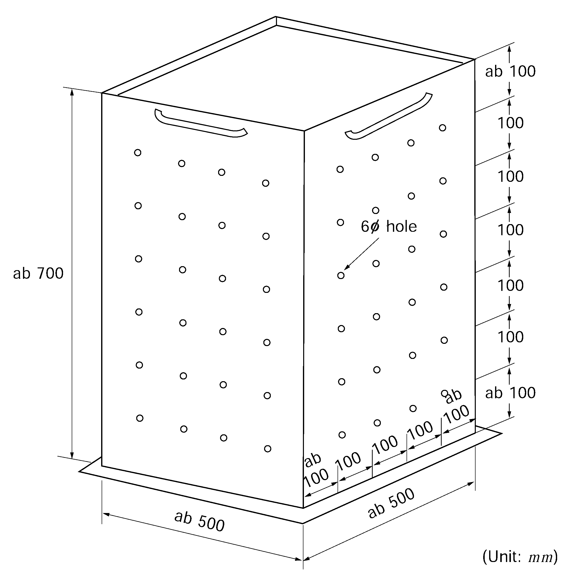 |
    | Vibration test | After the oil tightness test, the container is to be vibrated for 4 hours. (Vibration conditions of approximately 8 *Hz* frequency and about 0.10 to 0.50 *mm* half amplitude are to be maintained. After the vibration test, heavy oil is filled up in the container and left for 17 hours. It is to be verified that no leakage of oil and no peeling off of covering occurred. |
    | Hammering test | The inside of the test container is to be patted with a 5 *kg* hand hammer, and it is to be verified that no crack and no peeling off occurred. |
    | Adhesion test | A test sample is to be bundles up from the surface of the tank and detached by scraper to check adhesion hardness and permeation of fuel oil. |
    | Heating test | The internal surface of the tank is to be heated as follows to check the dissolution conditions of the test sample and the adhesive condition using a scraper. Heating time: 3 minutes Heating temperature: 600 °C Heating area: Approximately 100 *mm* in diameter |

### Section 28 Materials of Reinforced Plastics

#### 2801. Application

The requirements of this Section apply to tests and inspections for the type approval of the raw materials (reinforcements, thermosetting resins and core materials for sandwich construction) to be used for FRP ships conforming to the requirements of **Pt 2, Ch 2, Annex 2-8** of the Guidance relating to the Rules for Classification of Steel Ships. **Ch 3, Sec 2** of the Rules for Classification of Fibreglass Reinforced Plastics Ships and **Pt 3, Ch 5, Sec 2** of the Rules and Guidance for the Classification of High Speed and Light Crafts.

#### 2802. Data to be submitted

The following reference data are to be submitted to the Society in addition to those specified in **102.**

- **1.** **Thermosetting resins**
  The data listed in **Table 3.28.1** is to be provided by the manufacturer for each thermosetting resin.

  **Table 3.28.1 Data requirements for thermosetting resins**

  | Data | Type of resin |   |   |
  | --- | --- | --- | --- |
  | Data | Polyester(3) | Epoxide | Phenolic |
  | Specific gravity of liquid resin Viscosity Gel time Appearance Mineral content(1) Volatile content Acid value Epoxide content Free phenol Free formaldehyde | O O O O O O O X X X | O O O O O X X O X X | O O X O X(2) X X X O O |
  | Note : (1) This is to be the total filler in the system, including thixotrope, filler, pigments, etc., and is to be expressed in parts by weight per hundred parts of pure resin. (2) If the resin is pre-filled, the mineral content is required. (3) Vinylesters are to be treated as equivalent to polyesters. |   |   |   |
- **2.** **Reinforcements**
  The following data is to be provided, where applicable, for each type of reinforcement:
  - **(1)** Reinforcement type.
  - **(2)** Fibre type for each direction.
  - **(3)** Fibre tex value.
  - **(4)** Fibre finish and/or treatment.
  - **(5)** Yarn count in each direction.
  - **(6)** Width of manufactured reinforcement.
  - **(7)** Weight per unit area of manufactured reinforcement.
  - **(8)** Weight per linear metre of manufactured reinforcement.
  - **(9)** Compatibility (e.g. suitable for polyesters, epoxides, etc.).
  - **(10)** Constructional stitching - details of yarn, specific gravity, type, frequency and direction.
  - **(11)** Weave type.
  - **(12)** Binder type and content.
  - **(14)** Density of the fibre material.
- **3.** **Core materials**
  The following data is to be provided for each type of core material:
  - **(1)** Type of material.
  - **(2)** Density.
  - **(3)** Description (block, scrim mounted, grooved).
  - **(4)** Thickness and tolerance.
  - **(5)** Sheet/block dimensions.
  - **(6)** Surface treatment.
  - **(7)** full application procedure for use of the product.

#### 2803. Type tests

The test items and test methods are to comply with the following requirements and the Flame spread (Fire durability) test in **Table 3.16.1, 1603.** of the Guidance as necessary.

- **1.** **Testing procedures**
  - **(1)** **General**
    - **(A)** The test laboratory is to equip the test facilities so that they can perform the testing in accordance with the requirements in this Section and are to be recognized by the Society Alternatively, testing may be carried out by the manufacturer subject to these tests being witnessed by the Surveyor.
    - **(B)** The accuracy of test machines is to be within ±1 % and test machines are to be recalibrated at approximately annual intervals. A record of all calibrations is to be kept available in the test laboratory.
  - **(2)** **Preparation of test samples**
    - **(A)** Samples of thermosetting resins are to be prepared using the curing system recommended by the manufacturer and identical with that used for the finished product.
    - **(B)** The post curing conditions for samples of thermosetting resins are to be as recommended by the manufacturer and identical with those used for the finished product.
    - **(C)** Where curing of the product is intended to take place at room temperature, the sample is to be allowed to cure at room temperature (18 to 21 °C) for 24 hours followed by a post-cure at 40 °C for 16 hours.
  - **(3)** **Preparation of test specimens**
    - **(A)** The test specimen is to be prepared in accordance with the appropriate ISO standard and the requirements of this Section.
    - **(B)** Precautions are to be taken during machining to ensure that the temperature rise in the specimen is kept to a minimum.
  - **(4)** **Testing**
    - **(A)** Strain measurement are to be made by the use of a suitable extensometer or strain gauge.
    - **(B)** The number of test specimens from each sample to be tested is to be in accordance with the ISO standard. For mechanical testing this is five.
    - **(C)** If a test specimen fails because of faulty preparation or incorrect operation of the testing machine it is to be discarded and replaced by a new specimen.
    - **(D)** If the deviation of one result in a group of five exceeds the mean by more than two standard deviations, that result is to be discarded and one further specimen tested.
  - **(5)** **Reporting of results**
    - **(A)** All load/displacement graphs and tabulated results are to be reported, including mean values and the calculated standard deviation.
    - **(B)** Full details of the sample and specimen preparation are to be provided including (where applicable):
      - **(a)** Catalyst/accelerator or curing agent types and mix ratio.
      - **(b)** Weights of resins, and/or reinforcements used.
      - **(c)** Casting/laminate dimensions.
      - **(d)** Number of layers of reinforcement used.
      - **(e)** Curing/post-curing conditions.
- **2.** **Thermosetting resins**
  - **(1)** Cast samples are to be prepared in accordance with the manufacturer's recommendations and are to be cured and post-cured in a manner consistent with the intended use. Where postcure conditions equivalent to ambient-cure conditions apply, see **1** (2) (B) and (C).
  - **(2)** The curing system used and the ratio of curing agent (or catalyst) to resin are to be recorded.
  - **(3)** The following are to be determined using these samples:
    - **(A)** Tensile strength (stress at maximum load) and stress at break.
    - **(B)** Tensile strain at maximum load.
    - **(C)** Tensile secant modulus at 0.5 per cent and 0.25 per cent strain respectively.
    - **(D)** Temperature of deflection under load.
    - **(E)** Barcol hardness.
    - **(F)** water absorption.
    - **(G)** Volume shrinkage after cure.
    - **(H)** Specific gravity of cast resin.
  - **(4)** For gel coat resins the stress at break and modulus of elasticity in flexure are to be determined.
  - **(5)** Test methods and acceptance criteria for cast thermosetting resins are to comply with **Table 3.28.2.**

    **Table 3.28.2 Tests on cast thermosetting resin specimens** ***(2019)***

    | Test | Standard | Acceptance criteria |
    | --- | --- | --- |
    | Tensile properties Flexural properties Water absorption Temperature of deflection under load Compressive properties Interlaminar shear strength test(4) | • ISO 527-2 (Test speed = 5 mm/min, Specimen 1A or 1B) • ISO 178 (Test speed = Thickness/2 mm/min) • ISO 62 (Method 1) • ISO 75-2 (Method A) • ISO 604 (Test speed : as for ductile materials) • ISO 14130 : Fibre-reinforced plastic composites - Determination of apparent interlaminar shear strength by short-beam method | To comply with the requirements of Pt 2, Annex 2-8 of the Guidance relating to the Rules for Classification of steel Ships. |
    | Notes : (1) ISO 62 : where resins are intended for use under ambient conditions to avoid additional post-curing, the requirement in ISO 62 for pre-drying the test specimen at 50 °C is to be omitted. The test result is to be expressed as mg of water. (2) ISO 527-2 : tensile properties are to be measured using extensometry. (3) Testing method other than those given in this Table is to be in accordance with the requirements as deemed appropriate by the Society. (4) Interlaminar shear strength test is to be applied to the polyester containing wax or other material that deteriorate bonding. |   |   |
- **3.** **Reinforcements**
  - **(1)** Tests of the mechanical properties are to be made on laminate samples containing the reinforcement and prepared as follows:

    **Table 3.28.3 Glass fraction by weight for different reinforcement types**

    | Reinforcement type | Glass fraction (nominal values) |
    | --- | --- |
    | Unidirectional Chopped strand mat Woven roving Woven cloth Composite roving(1) ±45°/Triaxial/Quadriaxial parallel(2D) plied roving | 0.60 0.30 0.50 0.50 0.45 0.50 |
    | Note: (1) Continuous fibre reinforcement with attached chopped strand mat. |   |

    **Table 3.28.4 Fibre fraction by volume for different reinforcement types**

    | Reinforcement type | Fibre fraction by volume (nominal values) |
    | --- | --- |
    | Unidirectional Chopped strand mat Woven roving Woven cloth Composite roving ±45°/Triaxial/Quadriaxial parallel(2D) plied roving | 0.41 0.17 0.32 0.32 0.28 0.32 |
    | Note : The volume content may be converted to weight fractions by use of the formula: $W _{F} =V _{F} D _{F} /(D _{F} V _{F} +D _{R} V _{R} )$ where $W_F$ : fibre fraction by weight, $D_F$ : density of fibre $D_R$ : density of cured resin, $V_F$ : fibre fraction by volume $V_R$ : resin fraction by volume |   |
    - **(A)** an approved resin of suitable type is to be used;
    - **(B)** a minimum of three layers of the reinforcement is to be laid with parallel ply to give a laminate not less than 4 mm thick;
    - **(C)** the weights of resin and reinforcement used are to be recorded together with the measured thickness of the laminate, including the measured weight per unit area of the reinforcement used;
    - **(D)** for glass reinforcements, the glass/resin ratios, by weight, as shown in **Table 3.28.3** are to be used;
    - **(E)** for reinforcement type other than glass and carbon, a fibre volume fraction, as shown in **Table 3.28.4**, is to be used. *(2020)*
  - **(2)** Rovings intended for filament winding are to be tested as unidirectional rovings.
  - **(3)** The laminate is to be tested in air in the directions indicated by **Table 3.28.5.**

    **Table 3.28.5 Fibre orientations in reinforced test specimens**

    | Type of reinforcement | Test orientations |
    | --- | --- |
    | Unidirectional Chopped strand mat, Gun roving Woven roving, Woven cloth. Composite roving ±45° parallel plied roving Triaxial plied roving Quadriaxial plied roving | 0° any direction 0° and 90° 0°, 45°, 90° and -45° |
  - **(4)** For reinforcement type other than carbon, the following tests are to be made on the samples *(2020)* :
    - **(A)** Tensile strength (stress at maximum load).
    - **(B)** Tensile strain at break.
    - **(C)** Tensile secant modulus at 0.5 per cent and 0.25 per cent strain respectively.
    - **(D)** Compressive strength (stress at maximum load).
    - **(E)** Compressive modulus.
    - **(F)** Flexural strength (stress at maximum load).
    - **(G)** Modulus of elasticity in flexure.
    - **(H)** Apparent interlaminar shear.
    - **(I)** Fibre content.
    - **(J)** water absorption.
  - **(5)** Additionally, tests in (4) (c) and (f) are to be repeated, in one direction only, after immersion in fresh water at 35 °C for 28 days with the exception of 2.4.4(k).
  - **(6)** The test methods and acceptance criteria applied to laminate specimens of glass reinforcement are to comply with **Table 3.28.6**. *(2020)*
  - **(7)** The test methods and acceptance criteria applied to laminate specimens of carbon reinforcement are to comply with **Table 3.28.6**. *(2020)*

    **Table 3.28.6 Test methods and acceptance criteria of glass reinforcement specimens** ***(2020)***

    | Test | Standard | Acceptance criteria |
    | --- | --- | --- |
    | Tensile properties Flexural properties Compressive properties Interlaminar shear Water absorption Glass content | • ISO 527-4, ISO 527-5 (Test speed = 2 mm/min, Specimens Types II or III) • ISO 14125 (Test speed = Thickness/2 mm/min, Method A) • ISO 14126 (Test speed : 1 mm/min) • ISO 14130 • ISO 62 (Method 1) • ISO 1172 | To comply with the requirements of Pt 2, Annex 2-8 of the Guidance relating to the Rules for Classification of steel Ships. |
    | Notes : (1) ISO 62 : where resins are intended for use under ambient conditions to avoid additional post-curing, the requirement in ISO 62 for pre-drying the test specimen at 50 °C is to be omitted. The test result is to be expressed as mg of water. (2) ISO 527-4, 527-5 : tensile properties are to be measured using extensometry. (3) Tensile modulus values are to be determined using an extensometer which may be removed for strain to failure. (4) Testing method other than those given in this Table is to be in accordance with the requirements as deemed appropriate by the Society. |   |   |
- **4.** **Core materials**
  - **(1)** Initially the core shear strength and modulus are to be determined by ISO 1922–981 or ASTM C273. Test sandwich panels are then to be prepared and subjected to four-point flexural tests to determine the apparent shear properties according to ASTM C393 (short beam) at two representative thicknesses (i.e. 15 mm and 30 mm). Testing is to be carried out at ambient temperature and at 70 °C. The following requirements are to be observed:
    - **(A)** Each skin is to be identical and have a thickness not greater than 21 per cent of the nominal core thickness. For hand laid constructions, each skin is to comprise a lightweight chopped strand mat reinforcement (300 $\mathrm{g}/m ^{ 2}$) consolidated at a glass content, by weight, of 0,3 against the core, plus the required number of woven reinforcements consolidated, using an isophthalic polyester resin, to give a minimum glass content, by weight, of 0,5.
    - **(B)** The method of construction of the sandwich laminate is to reflect the core material manufacturer’ instructions for use, i.e. application of bonding paste, surface primer or any other recommended system.
    - **(C)** Curing conditions are to be in accordance with **1** (2), (B) and (C).
    - **(D)** The dimensions of the test samples should be based on the requirements of ASTM C393 Paragraph 5.1, and the ratio parameters as indicated in ASTM C393 Paragraph 5.2, using a proportional limit stress (F) for the woven roving skins of 130 $\mathrm{N}/mm ^{ 2}$ and a span (a2) of not less than 400 mm.
  - **(2)** For each type of test sample the following data are to be reported, together with the submission of a representative test sample showing the mode of failure for each density of core material:
    - **(A)** Skin and core thickness, and core type and density.
    - **(B)** Resin/catalyst/accelerator ratio.
    - **(C)** Skin construction, including types and weight of reinforcements, resin(s), etc.
    - **(D)** Details of production method and curing conditions (temperature and times).
    - **(E)** Where additional preparation of the foam is involved, for example the use of primers or bonding pastes, full details are to be provided.
    - **(F)** Actual span between base supports for each type of test sample.
  - **(3)** **Specific requirements for end-grain balsa**

    **Table 3.28.7 Test methods and acceptance criteria of carbon reinforcement specimens** ***(2020)***

    | Test | Standard | Acceptance criteria |
    | --- | --- | --- |
    | Tensile properties Flexural properties Compressive properties Carbon content | • ISO 527-4, ISO 527-5 (Test speed = 2 mm/min, Specimens Types II or III) • ISO 14125 (Test speed = Thickness/2 mm/min, Method A) • ISO 14126 (Test speed : 1 mm/min) • ISO 14127 | To comply with the requirements of Pt 2, Annex 2-8 of the Guidance relating to the Rules for Classification of steel Ships. |
    | Notes : (1) The dimensions of laminate samples are to be in accordance with the test standards. (2) The carbon fiber volume fraction of laminates is to be 50±5%. (3) ISO 527-4, 527-5 : tensile properties are to be measured using extensometry. (4) Testing method other than those given in this Table is to be in accordance with the requirements as deemed appropriate by the Society. |   |   |

    **Table 3.28.8 Test methods and acceptance criteria of end-grain balsa**

    | Test | Standard | Acceptance criteria |
    | --- | --- | --- |
    | Density Tensile properties Compressive properties Shear properties | • ISO 845 • ASTM C297-61 (Test speed=Thickness/10 mm/min) • ISO 844 (Test speed=Thickness/10 mm/min) • ISO 1922 (Test speed=Thickness/1 mm/min) | To comply with the requirements of **Pt 2, Annex 2-8** of the Guidance relating to the Rules for Classification of steel Ships. |
    - **(A)** The following tests are to be carried out on the virgin material, both parallel to and perpendicular to the grain. The density of the virgin material is also to be tested.
      - **(a)** Compressive strength (stress at maximum load).
      - **(b)** Compressive modulus of elasticity.
      - **(c)** Tensile strength (stress at maximum load).
    - **(B)** Where the balsa is mounted on a carrier material (e.g. scrim), any adhesive used is to be of a type compatible with the proposed resin system.
    - **(C)** The test methods and acceptance criteria for end-grain balsa are to comply with **Table 3.28.8**.
  - **(4)** **Specific requirements for rigid foams (PVC, Polyurethane and other types)**
    - **(A)** The following test are to be carried out for each type of foam:
      - **(a)** Density.
      - **(b)** Tensile strength (stress at maximum load).
      - **(c)** Tensile modulus of elasticity.
      - **(d)** Compressive strength (stress at maximum load).
      - **(e)** Compressive modulus of elasticity.
    - **(B)** Additionally the compressive properties (see (A), (d) and (e)) are to be determined at a minimum of five points over the temperature range ambient to maximum recommended service or 70 °C, whichever is the greater.
    - **(C)** The test methods and acceptance criteria for rigid foams are to comply with **Table 3.28.8**.

#### 2804. The test for each FRP ship is to be conducted in accordance with the requirements in Ch 3, Sec 3 of Rules for Classification of FRP Ships.

### Section 29 Water Level Detection and Alarm System

#### 2901. Application

The requirements in this Section apply to tests and inspections for the type approval of water level detector and visual and audible alarm system (hereinafter called detector system) in accordance with the requirements of **Pt 7 Ch 3, 1403. 1.** and 3. of the Rules and Pt 7 Annex 7-6 I. of the Guidance

#### 2902. Data to be submitted

The following reference data are to be submitted to the Society in addition to those specified in **102.**

#### 2903. Construction and Function

The construction and the function of the detector system is to satisfy the following requirements.

#### 2904. Type test

- **1.** The approval test is to include the following items (1) through (5) depending on the application and the type of the detector system.
  - **(1)** In addition to conformity with the requirements in **2903,** confirmation of whether the test sample complies with the designated specifications for finishing, construction, dimensions and parts or not
  - **(2)** Pressure test of the test specimen for a period in accordance with the following (a) through (c). The test pressure is to be a design pressure but not less than the pressure equivalent to seawater head of maximum depth of the space where the parts are fitted.
  - **(3)** Confirmation whether the test sample performs as specified or not, under the regular installed condition, inclining conditions of 22.5 degrees in transverse direction and 10 degrees in longitudinal direction at the following temperature:
  - **(4)** For the detector system installed in cargo holds, confirmation whether the test specimen detects seawater as specified or not, by merging in a test mixture of fine materials of each intended cargoes in seawater (a solution of sodium chloride having a specific gravity of 1.025 g/cm^3 may be accepted as an alternative to seawater) in accordance with the followings:
  - **(5)** For the electrical parts of the devices, testing as given in the following (a) through (j). However the type tests are to comply with the requirements in **2304. 2** and, in case the explosion-protected construction is required, type tests also are to comply with the requirements in **Pt 6, Ch 1, 201. 1.,** (2) of the Guidance.
- **2.** Additional tests other than those of the preceding **1.** may be requested, where deemed necessary by the Society.

### Section 30 Protective Coating Systems for Ballast Tanks

#### 3001. Application

- **1.** The requirements of this Section apply to tests and inspection for the type approval of protective coating systems in accordance with the requirements in **Pt 3, Ch 1, 801.** of the Guidance.
- **2.** Winter and summer type coating are considered different unless infrared (IR) identification and specific gravity (SG) demonstrates that they are the same. Winter type epoxy is required separate prequalification test including shop primer compatibility test according to **3006.**

#### 3002. Data to be submitted

- **1.** The following approval data are to be submitted to the Society in addition to those specified in **102.**
  - **(1)** Copy of Technical Data Sheet, including : 3 copies
  - **(2)** Compatibility of shop primer with protective coating system : 3 copies(if any)
  - **(3)** Inspection and acceptance criteria of protective coating system : 3 copies
  - **(4)** Procedures for repair of protective coating system : 3 copies
- **2.** The coating manufacturer should provide to the Society the following information;
  - **(1)** A detailed list of the production facilities.
  - **(2)** Names and location of raw material suppliers will be clearly stated.
  - **(3)** A detailed list of the test standards and equipment to be used, (Scope of approval).
  - **(4)** Details of quality control procedures employed.
  - **(5)** Details of any sub-contracting agreements.
  - **(6)** List of quality manuals, test procedures and instructions, records, etc.
  - **(7)** Copy of any relevant certificates with their issue number and/or date e.g. Quality Management System certification.

#### 3003. Data review and plant audit

- **1.** The Society shall performed the data review and plant audit specified in **Appendix Part A, 11.** of **Guidance for Approval of Service Suppliers** to assure the manufacturing process (including that of subcontractor's works) and quality assurance of the protective coating systems. *(2021)*
- **2.** With the exception of early ‘scale up’ from lab to full production, adjustment outside the limitations listed in the QC instruction referred to below is not acceptable, unless justified by trials during the coating system’s development programme, or subsequent testing. Any such adjustments must be agreed by the formulating technical centre.
- **3.** If formulation adjustment is envisaged during the production process the maximum allowable limits will be approved by the formulating technical centre and clearly stated in the QC working procedures.
- **4.** The manufacturer’s quality control system will ensure that all current production is the same formulation as that supplied for the Type Approval Certificate. Formulation change is not permissible without testing in accordance with the test procedures in **3004. 3.** or **4.** and the issue of a Type Approval Certificate by the Society.
- **5.** Batch records including all QC test results such as viscosity, specific gravity and airless spray characteristics will be accurately recorded. Details of any additions will also be included.
- **6.** Whenever possible, raw material supply and lot details for each coating batch will be traceable. Exceptions may be where bulk supply such as solvents and pre-dissolved solid epoxies are stored in tanks, in which case it may only be possible to record the supplier’s blend.
- **7.** Dates, batch numbers and quantities supplied to each coating contract will be clearly recorded.
- **8.** All raw material supply must be accompanied the supplier’s ‘Certificate of Conformance’. The certificate will include all requirements listed in the coating manufacturer’s QC system.
- **9.** In the absence of a raw material supplier’s certificate of conformance, the coating manufacturer must verify conformance to all requirements listed in the coating manufacturer’s QC system.
- **10.** Drums must be clearly marked with the details as described on the ‘Type Approval Certificate’.
- **11.** Product Technical Data Sheets must comply with all the PSPC requirements. The QC system will ensure that all Product Technical Data Sheets are current.
- **12.** QC procedures of the originating technical centre will verify that all production units comply with the above stipulations and that all raw material supply is approved by the technical centre.

#### 3004. Performance standard

- **1.** Protective coating systems are, in principal, to be an epoxy-based systems. *(2020)*
- **2.** A multi-coat system with each coat of contrasting colour is recommended. The top coat shall be of a light colour(a colour that reflects light to an extent that a simple flash light (hand torch) will make inspection easy and fast. Normally light grey, buff, off-white, swimming pool blue/green, etc. easily distinguishable from rust.) in order to facilitate in-service inspection.
- **3.** Protective coatings for dedicated seawater ballast tanks shall satisfied the approval tests specified in **3006. 2.** and **3.** and protective coatings for double-side spaces of bulk carriers shall satisfied the approval test specified in **3006. 3.**
- **4.** Epoxy-based systems which have documented field exposure for 5 years with a final coating condition of not less than "GOOD" may be accepted. In this case, field exposure for 5 years shall be satisfied following conditions.
  - **(1)** Coating manufacturer’s records, which shall at least include the information indicated in followings, shall be examined to confirm coating system has 5 years field exposure, and the current product is the same as that being assessed.
  - **(2)** A joint (coating manufacturer/Society) survey of all ballast tanks of a selected vessel is to be carried out for the purpose of verification of compliance with the requirements of (1) and (5). The coating manufacturer’s representative is to be qualified to *NACE Coating Inspector Level 2* or *FROSIO Inspector Level III* or equivalent as verified by the Administration.
  - **(3)** The selected vessel is to have ballast tanks in regular use, of which:
  - **(4)** In the case that the selected vessel does not meet the requirements in (3) above then the limitations shall be clearly stated on the type approval certificate. For example, the coating cannot be used in tanks adjacent to heated tanks or underdeck or tanks with volume greater than the size surveyed.
  - **(5)** All ballast tanks shall be in "GOOD" condition excluding mechanical damages, without touch up or repair in the prior 5 years. “Good” is defined as: Condition with spot rusting on less than 3% of the area under consideration without visible failure of the coating. Rusting at edges or welds, must be on less than 20 % of edges or welds in the area under consideration. Examples of how to report coating conditions with respect to areas under consideration should be as those given in **IACS Recommendation 87, Appendix 1.**
- **5.** In the case that a manufacturer wishes to have products which are manufactured in different locations under the same name, then infrared (IR) identification and specific gravity shall be used to demonstrate that they are the same coating, or individual approval tests will be required for the paint manufactured in each location.

#### 3005. Test Laboratory

The test laboratory where testing is carried out in accordance with the requirements in **3004. 3.** are to equip the test facilities so that they can perform the testing in accordance with the requirements in this Instruction and are to be data reviewed and audited in accordance with the requirements in **Appendix Part A, 11.** of **Guidance for Approval of Service Suppliers** by the Society. *(2021)*

#### 3006. Type test

- **1.** **Application of protective coating system**
  - **(1)** There shall be a minimum of two stripe coats and two spray coats, except that the second stripe coat, by way of welded seams only, may be reduced in scope where it is proven that the NDFT can be met by the coats applied, in order to avoid unnecessary over-thickness.
  - **(2)** Stripe coats shall be applied by brush or roller.
  - **(3)** Each main coating layer shall be appropriately cured before application of the next coat, in accordance with coating manufacturer’s recommendations.
  - **(4)** Surface contaminants such as rust, grease, dust, salt, oil, etc., shall be removed prior to painting with proper method according to the paint manufacturer’s recommendation. Abrasive inclusions embedded in the coating shall be removed. Job specifications shall include the dry-to-recoat times and walk-on time given by the manufacturer.
  - **(5)** NDFT 320 ㎛ with 90/10 rule(A 90/10 rule means that 90 % of all thickness measurements shall be greater than, or equal to, NDFT and none of the remaining 10 % measurements shall be below 0.9 x NDFT) for epoxy-based coatings; other systems to coating manufacturer’s specifications.
  - **(6)** For the coating pre-qualification test, the measured average DFT(dry film thickness) on each prepared test panels shall not exceed NDFT(nominal dry film thickness) of 320 ㎛ plus 20 % unless a paint manufacturer specified a NDFT greater than 320 ㎛.
  - **(7)** In the case that a paint manufacturer specified a NDFT greater than 320 ㎛, the average DFT shall not exceed the specified NDFT plus 20 % and the coating system shall be certified to the specified NDFT if the system passes the tests according to 3004. 3.. The measured DFT shall meet the "90/10" rule and the maximum DFT shall be below the maximum DFT value specified by the manufacturer.
  - **(8)** Care shall be taken to avoid increasing the thickness in an exaggerated way. Wet film thickness shall be regularly checked during application.
  - **(9)** Thinner shall be limited to those types and quantities recommended by the manufacturer.
- **2.** **Test on Simulated Ballast Tank Conditions**
  - **(1)** **Test condition**
    Test on simulated ballast tank conditions shall satisfy each of the following conditions:
    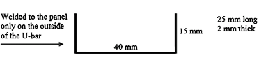
    Fig 3.30.1 Welding of U-bar
    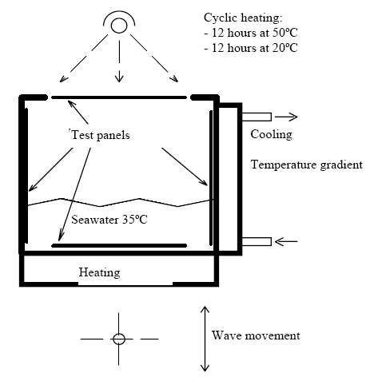
    **Fig 3.30.2 Wave tank for testing of ballast tank coatings**
  - **(2)** **Test results**
    - **(A)** Prior to the testing, the following measured data of the coating system shall be reported:
      - **(a)** Infrared (IR) identification of the base and hardener components of the coating;
      - **(b)** Specific gravity of the base and hardener components of the paint(refer to *KS M ISO* 2811-1/4); and
      - **(c)** Number of pinholes, low voltage detector at 90 V.
    - **(B)** After the testing, the following measured data shall be reported:
      - **(a)** blisters and rust (refer to *KS M ISO* 4628-2 and *KS M ISO* 4628-3);
      - **(b)** dry film thickness (DFT) (use of a template)(9 equally distributed measuring points are used on panel’s size 150 mm x 150 mm or 15 equally distributed measuring points on panel’s size 200 mm x 400 mm.);
      - **(c)** adhesion value(refer to *KS M ISO* 4624);
      - **(d)** flexibility modified according to panel thickness (refer to *ASTM D*4145, 3 mm steel, 300 μm coating, 150 mm cylindrical mandrel gives 2 % elongation) for information only;
      - **(e)** cathodic protection weight loss/current demand/disbondment from artificial holiday; and
      - **(f)** undercutting from scribe. The undercutting along both sides of the scribe is measured and the maximum undercutting determined on each panel. The average of the three maximum records is used for the acceptance.
  - **(3)** **Acceptance criteria**

    | Item | Acceptance criteria for epoxy-based systems based on this Guidance | Acceptance criteria for alternative systems |
    | --- | --- | --- |
    | Blisters on panel | No blisters | No blisters |
    | Rust on panel | Ri 0 (0%) | Ri 0 (0%) |
    | Number of pinholes | 0 | 0 |
    | Adhesive failure | > 3.5 MPa Adhesive failure between substrate and coating or between coats for 60% or more of the areas. | > 5 MPa Adhesive failure between substrate and coating or between coats for 60% or more of the areas. |
    | Cohesive failure | > 3 MPa Cohesive failure in coating for 40% or more of the area. | > 5 MPa Cohesive failure in coating for 40% or more of the area. |
    | Cathodic protection; current demand calculated from weight loss | < 5 mA/m^2 | < 5 mA/m^2 |
    | Cathodic protection; disbondment from artificial holiday | < 8 mm | < 5 mm |
    | Undercutting from scribe | < 8 mm | < 5 mm |
    | U-bar | Any defects, cracking or detachment at the angle or weld will lead to system being failed. | Any defects, cracking or detachment at the angle or weld will lead to system being failed. |
  - **(4)** **Test report**
    The test report shall include the following information:
    - **(A)** name of the manufacturer;
    - **(B)** date of tests;
    - **(C)** product name/identification of both paint and primer;
    - **(D)** batch number;
    - **(E)** data of surface preparation on steel panels, including the following:
      - **(a)** surface treatment;
      - **(b)** water soluble salts limit;
      - **(c)** dust; and
      - **(d)** abrasive inclusions;
    - **(F)** application data of coating system, including the following:
      - **(a)** shop primed;
      - **(b)** number of coats;
      - **(c)** recoat interval(both of actual specimen data and manufacturer’s requirement/recommendation.)
      - **(d)** dry film thickness (DFT) prior to testing(both of actual specimen data and manufacturer’s requirement/recommendation);
      - **(e)** thinner;(both of actual specimen data and manufacturer’s requirement/recommendation);
      - **(f)** humidity(both of actual specimen data and manufacturer’s requirement/recommendation);
      - **(g)** air temperature(both of actual specimen data and manufacturer’s requirement/ recommendation);
      - **(h)** steel temperature;
    - **(G)** test results according to (2); and
    - **(H)** judgment according to (3)
- **3.** **Condensation Chamber Test**
  - **(1)** **Test condition** Condensation chamber test shall be conducted in accordance with the KS M ISO 6270-1 and shall satisfy each of the following conditions (see **Fig 3.30.3**):
    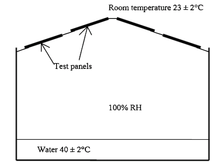
    **Fig 3.30.3 Condensation chamber**
  - **(2)** **Test results** According to **2.** (2), (A) and (B) (except for 2. (2) (B), (e) and (f))
  - **(3)** **Acceptance criteria**

    | Item | Acceptance criteria for epoxy-based systems based on this Guidance | Acceptance criteria for alternative systems |
    | --- | --- | --- |
    | Blisters on panel | No blisters | No blisters |
    | Rust on panel | Ri 0 (0%) | Ri 0 (0%) |
    | Number of pinholes | 0 | 0 |
    | Adhesive failure | > 3.5 MPa Adhesive failure between substrate and coating or between coats for 60% or more of the areas. | > 5 MPa Adhesive failure between substrate and coating or between coats for 60% or more of the areas. |
    | Cohesive failure | > 3 MPa Cohesive failure in coating for 40% or more of the area. | > 5 MPa Cohesive failure in coating for 40% or more of the area. |
    - **(A)** The test results based on (2) shall satisfy the criteria specified in **Table 3.30.2**.
    - **(B)** Epoxy-based systems based on this Guidance shall satisfy the criteria for epoxy-based systems based on this Guidance and alternative systems shall satisfy the criteria for alternative systems as indicated in **Table 3.30.2**. *(2020)*
  - **(4)** **Test report** According to **2.** (4)
- **4.** **Equivalent laboratory test**
  Type approval of a coating system is normally to be carried out in accordance with 2 and/or 3 above. However, the Society may accept an equivalent laboratory test method comprised of a single test or number of tests combined as a test procedure, subject to the following acceptance requirements:
  - **(1)** The test method/programme shall be based on recognized national or international standards, well established with proven experience.
  - **(2)** The equivalent test program is to adequately address the technical intent of the tests required in **2** and/or **3** above.
  - **(3)** Test results of samples tested in accordance with the equivalent test methods are, wherever possible, to be compared against the acceptance criteria specified in **2** and/or **3** above. Where this is not possible due to the parameters of the equivalent test method used, the acceptance criteria of the equivalent test method standard are to be selected that provide the closest equivalent to those in **2** and/or **3** above.
  - **(4)** Test laboratories shall comply with **3005.**
  - **(5)** Epoxy based coating systems approved by such an equivalent test method shall be applied in the shipyard in accordance with all the surface preparation and application requirements specified in 1 above.

#### 3007. Type Approval Certificates

- **1.** If the type tests specified in **3004. 3** or 5 years field exposure test specified in **3004. 4** are satisfactory, a Type Approval Certificate will be issued to include both the epoxy and the shop primer.
- **2.** In case where 5 years field exposure test specified in **3004. 4** are performed, The Type Approval Certificate shall reference the joint survey report specified in **3004. 4.** (2)
- **3.** In case where 5 years field exposure test specified in 3004. 4 are performed, If the applied NDFT is greater than required in **3006. 1.** (5), the applied NDFT will be the minimum to be applied during construction. This will be reported prominently on the Type Approval Certificate.
- **4.** In case where the epoxy has been tested without shop primer on bare prepared steel with satisfactory, a Type Approval Certificate will be issued. The Type Approval Certificate will just record the epoxy.
- **5.** The Type Approval Certificate is invalid if the formulation of either the epoxy or the shop primer is changed. It is the responsibility of the manufacturer to inform class immediately of any changes to the formulation.

#### 3008. Compatability of shop primer

- **1.** If a zinc silicate shop primer has passed the type test as part of an epoxy coating system, it may be used in combination with other approved epoxy coatings provided that the compatibility has been confirmed by the test in accordance with **3006. 2.** (1), (h) without wave movement.
- **2.** In case where same epoxy coating system is to applied on the different shop primers, each combination to be type tested in accordance with **3004.**. However, if each shop primer have already passed the type test as part of an epoxy coating system, the compatibility of shop primer can be confirmed by the test in accordance with **1.** above.
- **3.** If the test or tests specified above **1.** are satisfactory, a Type Approval Certificate will be issued. In this instance the Type Approval Certificate will include the details of the epoxy and a list of all shop primers with which it has been tested that have passed these requirements.

#### 3009. Dealing after approval

- **1.** The protective coating systems satisfied for the tests specified in **3004. 3.** are to be allowed the use of the epoxy with all the named shop primers or on bare prepared steel.
- **2.** The protective coating systems satisfied for the tests without shop primer according to **3007. 4.** are to be allowed the use of the epoxy on bare prepared steel only.
- **3.** In all cases of approval by 5 years field exposure test specified in **3004. 4.**, the shop primer shall be removed prior to application of the approved epoxy based system coating, unless it can be confirmed that the shop primer applied during construction, is identical in formulation to that applied in the selected vessel used as a basis of the approval.

#### 3010. Alternative systems

- **1.** All systems that are not applied according to **IMO PSPC**(**IMO Resolution 215(82)**) **4.4** are defined as an alternative system.
- **2.** Acceptance of alternative systems will be subject to documented evidence that they ensure a corrosion prevention performance at least equivalent to that indicated in **IMO PSPC**(**IMO Resolution 215(82)**)**.**
- **3.** The documented evidence shall consist of satisfactory performance corresponding to a target useful life of 15 years in either actual field exposure for 5 years with final coating condition not less than "GOOD" or laboratory testing according to **3004. 3**.

### Section 31 LED Lighting Fittings and Fluorescent Lighting Fittings of Electronic Ballast Stabilizer Type (2019)

#### 3101. Application and general

LED lighting fittings and fluorescent lighting fittings of electronic ballast stabilizer type installed in navigation bridge are to comply with the requirements of **Pt 6, Ch 1, Sec 10** and IEC 60092-306 as well as this guidance.

#### 3102. Data to be submitted

The manufacturer wishing to obtain the type approval of LED lighting fittings and fluorescent lighting fittings of electronic ballast stabilizer type is to submit the data required in **Ch 3, Sec 3, 102. 3** to the Society.

#### 3103. Type test

Type tests are to be carried out in accordance with **Table 3.31.1** and supplementary tests may be required where deemed necessary by the Society. Type tests may be partly or wholly omitted, subject to the approval by the Society, in cases where the manufacturer submits the test reports issued by an authorized test laboratory in accordance with the standard approved by the Society.

| No. | Item | Test method |   | Remark |
| --- | --- | --- | --- | --- |
| 1 | Visual inspection | No. 1 | Table 3.23.1 of Ch 3, Sec 23 | - |
| 2 | Performance Test | No. 2 | Table 3.23.1 of Ch 3, Sec 23 | - |
| 3 | Electrical power supply failure test | No. 3 | Table 3.23.1 of Ch 3, Sec 23 | - |
| 4 | Electrical power supply variation test | No. 4 | Table 3.23.1 of Ch 3, Sec 23 | - |
| 5 | Dry heat test | No. 6 | Table 3.23.1 of Ch 3, Sec 23 | - |
| 6 | Damp heat test | No. 7 | Table 3.23.1 of Ch 3, Sec 23 | - |
| 7 | Vibration test | No. 8 | Table 3.23.1 of Ch 3, Sec 23 | - |
| 8 | Insulation resistance test | No. 10 | Table 3.23.1 of Ch 3, Sec 23 | - |
| 9 | High voltage test | No. 11 | Table 3.23.1 of Ch 3, Sec 23 | - |
| 10 | Cold test | No. 12 | Table 3.23.1 of Ch 3, Sec 23 | - |
| 11 | EMC tests | No. 14 ~ 21 | Table 3.23.1 of Ch 3, Sec 23 | - |
| 12 | Flame resistance test | No. 22 | Table 3.23.1 of Ch 3, Sec 23 | - |
| 13 | Salt mist test | No. 13 | Table 3.23.1 of Ch 3, Sec 23 | for LED lightings installed in open deck |
| 14 | Temperature rising test | IEC 60092-306 |   | - |
| 15 | IP test | IEC 60529 |   | Please refer to Pt 6, Ch 1, Table 6.1.6 regarding the required IP grade |
| 16 | Explosion-Proof test | IEC 60079 Series |   | for LED lightings installed in hazardous areas |

### Section 32 Corrosion Resistant Steels

#### 3201. Application

- **1.** The requirements of this Section apply to tests and inspection for the type approval of Corrosion Resistant Steel in accordance with the requirements in **Pt 2, Ch 1, 301.** of the Rule.
- **2.** Corrosion Resistant Steel is to be graded and approved its manufacturing process in accordance with **Ch 2, Sec 2-1** of this Guidance.
- **3.** For each corrosion designation, Corrosion resistant steel shall be verified by the corrosion testing specified in this Sec..
- **4.** The Surveyor is to be present, as a rule, when the test samples for the approval test are being identified and for approval tests.

#### 3202. Data to be submitted

The following approval data are to be submitted to the Society in addition to those specified in **102.**

#### 3203. Data review and approval of test plan

- **1.** The test program submitted by the manufacturer is to be reviewed by the Society, if found satisfactory, it will be approved and returned to the manufacturer for acceptance prior to tests being carried out. Tests that need to be witnessed by the Surveyor will be identified.
- **2.** Method for selection of test samples is to satisfy the following:
  - **(1)** The numbers of test samples are to comply with **3205.**.
  - **(2)** The number of casts and test samples selected are to be sufficient to make it possible to confirm the validity of interaction effects and/or the control range (upper limit, lower limit) of the elements which are added or intentionally controlled, for improving the corrosion resistance. Where agreed, this may be supported with data submitted by the manufacturer.
- **3.** In addition to **2.** (2) above, the Society may require additional tests in the following cases. Considerations for additional tests may include but not be limited to.:
  - **(1)** When the Society determines that the control range is set by the theoretical analysis of each element based on existing data, the number of corrosion resistance tests conducted in accordance with Appendix of MSC.289(87) is too few to adequately confirm the validity of the control range of chemical composition;
  - **(2)** When the Society determines that the data of the corrosion resistance test result obtained for setting the control range of chemical composition varies too widely;
  - **(3)** When the Society determines that the validity of the corrosion resistance test result for setting the control range of chemical composition is insufficient, or has some flaws;
  - **(4)** When the Society's surveyor has not attended the corrosion resistance tests for setting the control range of chemical composition, and the Society determines that additional testing is necessary in order to confirm the validity of the test result data; and
  - **(5)** When the Society determines that it is necessary, for reasons other than cases (1) to (4) above.
    **Remarks:**
    **The chemical composition of the corrosion resistant steel is to be within the range specified for rolled steel for hull. Elements to be added for improving the corrosion resistance and for which content is not specified are to be generally within 1% in total.**

#### 3204. Test Laboratory

- **1.** The test laboratory where testing is carried out in accordance with the requirements in **3205.** are to equip the test facilities so that they can perform the testing in accordance with the requirements in this Appendix and are to be data reviewed and audited in accordance with the requirements in **Pt 1, Annex 1-11, 2.**(except for (3) (A) (b)) and 3. of the Guidance Relating to the Rules for the Classification of Steel Ships by the Society.
- **2.** Where a Surveyor of the Society is present at specified stages to witness the approval tests. The Society's approval is not needed for the testing laboratory.

#### 3205. Approval test

- **1.** **Test on simulated upper deck conditions**
  - **(1)** **Test condition**
    Tests on simulated upper deck conditions in cargo oil tank (COT) shall satisfy each of the following conditions:

    **Table 3.32.2 Chemical composition for conventional steel (%)**

    | C | Mn | Si | P | S |
    | --- | --- | --- | --- | --- |
    | 0.13~0.17 | 1.00~1.20 | 0.15~0.35 | 0.010~0.020 | 0.002~0.008 |
    | Al(acid soluble, min.) | Nb, max. | V, max. | Ti, max. | Nb+V+Ti, max. |
    | 0.015 | 0.02 | 0.10 | 0.02 | 0.12 |
    | Cu, max. | Cr, max. | Ni, max. | Mo, max. | Other, max. |
    | 0.1 | 0.1 | 0.1 | 0.02 | 0.02 (each) |
    | Notes; 1. To be based on ladle analysis given in the mill certificate. 2. Steel complying with a national standard that meets the requirements of this Table is also acceptable. |   |   |   |   |

    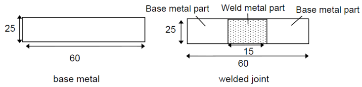
    **Fig 3.32.1 Test piece**
    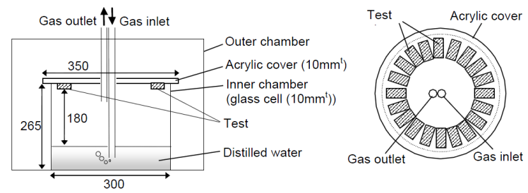
    **Fig 3.32.2 An example of simulated corrosion test apparatus for upper deck**
    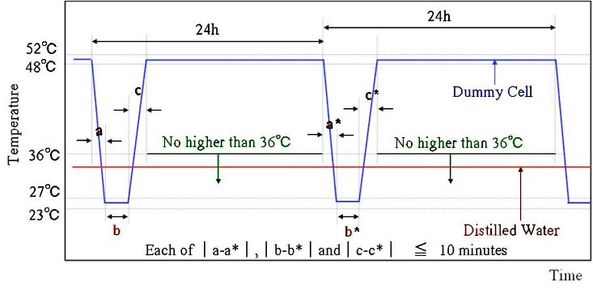
    **Fig 3.32.3 Schematic view of temperature controlling accuracy of**
    **specimens and distilled water during corrosion test**
    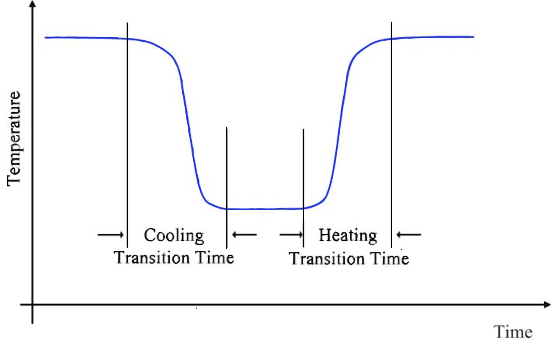
    **Fig 3.32.4 Transition time definition**
    - **(A)** Corrosion resistant steel and conventional steel shall be tested at the same time.
    - **(B)** The chemical composition of conventional steel shall comply with the requirements of **Table 3.32.2**. The mechanical properties of the test specimen should be representative of steel used in its intended shipboard application.
    - **(C)** The tests for corrosion resistant steel shall be carried out for 21, 49, 77 and 98 days. The tests for conventional steel shall be carried out for 98 days. The tests for welded joints shall be carried out for 98 days.
    - **(D)** There are to be five test pieces for each test period.
    - **(E)** The size of each test piece is 25±1mm x 60±1mm x 5±0.5mm. The surface to be tested is to be taken from a position within 2 mm of one rolled surface. This surface is to be ground to bare steel and polished with an emery paper #600.
    - **(F)** For welded samples, a test assembly is to be made from the same steel cast as the base material test in (E) but may be from a plate of different thickness. The assembly is to be welded using the process and consumable to be approved for use with the base material. The size of the test piece for a welded joint is 25±1mm x 60±1mm x 5±0.5mm, including 15±5mm width of the weld metal part(excluding heat affected zone). This surface is to be ground to bare steel and polished to 600 grit finish.
    - **(G)** The surface of the test piece, except for the tested surface, shall be protected from corrosive environment in order not to affect the test results.
    - **(H)** The test apparatus consists of a double chamber, and the temperature of the outer chamber is to be controlled.
    - **(I)** All the base material specimens should be located in one tank. **Fig 3.32.2** only shows locations of 20 specimens. The tank can be designed to hold 25 or more specimens; alternatively specimens can be added and removed as necessary so that the appropriate time periods are achieved within the total timescale of 98 days.
    - **(J)** Welded specimens may be tested with the parent material tests or tested separately against 5 conventional steel specimens.
    - **(K)** Since certain factors such as control and measurement of temperature and size of chamber may affect the corrosion rate achieved, it should be confirmed that the corrosion rate of conventional steel in the conditions and equipment of the test, satisfies the rate criteria, before carrying out corrosion test for evaluation of corrosion resistant steel.
    - **(L)** To remove specimens, the chamber is to be purged with 100% nitrogen gas while the specimens are in the high temperature region until the specimens are dry.
    - **(M)** Simulating the condition of the actual upper deck, the test cycle runs with distilled water and simulated COT gas (4±1% O_2, 13±2% CO_2, 100±10ppm SO_2, 500±50ppm H_2S, 83±2% N_2). A sufficient distance between the surface of the test piece and the distilled water is to be kept to avoid splashing of distilled water. The minimum gas flow rate is 100 cc per minute for the first 24 hours and 20 cc per minute after 24 hours.
    - **(N)** The test pieces shall be heated for 19±2 h at 50±2°C and 3±2 h at 25±2°C and the transition time is to be at least 1 h. The time for 1 cycle is 24 h. The temperature of the distilled water is to be kept at not higher than 36°C, while the temperature of the test pieces is 50°C.
    - **(O)** The cycling pattern of specimen temperature and temperature of distilled water should be controlled such that each cycle is as identical as possible throughout the whole corrosion test period. These temperatures must be recorded. See **Fig. 3.32.3**
    - **(P)** The transition time, a, a*, c and c* in **Fig 3.32.3** is the time from when the cooling and heating commences until the lower or upper temperature is reached, see **Fig 3.32.4** The transition of each cycle is to be as identical as possible throughout the whole corrosion test period. The temperature of both the specimens and the water is to be continuously recorded throughout the test.
  - **(2)** **Test results of base metal**
    $CL _{C} (mm)= \frac{10 \times W _{C}}{S \times D}$ $CL _{21} (mm)= \frac{10 \times W _{21}}{S \times D}$$CL _{49} (mm)= \frac{10 \times W _{49}}{S \times D}$
    $CL _{77} (mm)= \frac{10 \times W _{77}}{S \times D}$$CL _{98} (mm)= \frac{10 \times W _{98}}{S \times D}$
    whereby:
    W_C : weight loss of conventional steel (g) (average of five test pieces)
    W_21 : weight loss of corrosion resistant steel after 21 days (g) (average of five test pieces)
    W_49 : weight loss of corrosion resistant steel after 49 days (g) (average of five test pieces)
    W_77 : weight loss of corrosion resistant steel after 77 days (g) (average of five test pieces)
    W_98 : weight loss of corrosion resistant steel after 98 days (g) (average of five test pieces)
    S : surface area (cm^2)
    D : density (g/cm^3).
    X= (0.11 x S x D)/10
    Y= (0.05 x S x D)/10
    whereby:
    S = Surface area (cm^2)
    D = Density (g/cm^3)
    $CL=A \times t ^{B}$
    A(mm) and B : coefficient
    t : test period(days)
    ECL(mm) = A X (25 X 365)^B
    - **(A)** Prior to the testing, the following measured data shall be reported:
      - **(a)** size and weight of the test piece
    - **(B)** After the testing, the following measured data shall be reported:
      - **(a)** weight loss (difference between initial weight and weight after testing) of conventional steel (W_C) and corrosion resistant steel(W_21, W_49, W_77 and W_98);
    - **(C)** Specimens are to be weighed to an accuracy of ±1 mg.
    - **(D)** Corrosion loss of conventional steel ($CL _{c}$) and corrosion resistant steel (CL_21, CL_49, CL_77 and CL_98), calculated by the following formulae:
    - **(E)** The test is considered to be carried out appropriately if $CL _{c}$ is between 0.05 and 0.11 (corrosion rate is between 0.2 and 0.4mm/year).
    - **(F)** Where the calculated corrosion loss of conventional steel is less than 0.05 mm/year, the concentration of H_2S may be increased in the simulated cargo oil tank gas. All tests will be carried out at this increased level.
    - **(G)** At least 3 values of individual weight loss of conventional steel should be in the range of maximum X and minimum Y measured in grams.
    - **(H)** Coefficients A and B of corrosion resistant steel, calculated from the test results for 21, 49, 77 and 98 days by least square method. Corrosion loss of corrosion resistant steel is described as follows:
    - **(I)** Estimated corrosion loss after 25 years (ECL) calculated by the following formula:
  - **(3)** **Test results of welded joint**
    - **(A)** Sampling of test specimens, magnification of photomicrograph and evaluation of discontinuous surface to be in accordance with requirements in **3205. 3.**.
  - **(4)** **Acceptance criteria**
    The test results based on provisions of (2) and (3) above shall satisfy the following criteria:
    - **(A)** ECL(mm) ≤ 2 (for base metal)
    - **(B)** no discontinuous surface (e.g., step) between the base metal and weld metal (for welded joint)
  - **(5)** **Test report**
    The test report shall include the following information:
    - **(A)** name of the manufacturer
    - **(B)** date of tests
    - **(C)** chemical composition and corrosion resistant process of steel
    - **(D)** test results according to (2) and (3) above
    - **(E)** judgement according to (4) above
- **2.** **Test on simulated inner bottom conditions**
  - **(1)** **Test condition**
    Tests on simulated inner bottom conditions in cargo oil tanks (COT) should satisfy each of the following conditions:
    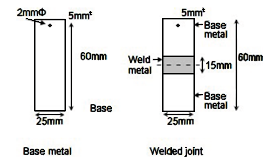
    Fig 3.32.5 Test piece

    | 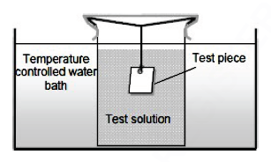 |
    | --- |
    | **Fig 3.32.6 Simulated corrosion test apparatus for inner bottom** |
    - **(A)** The test shall be carried out for 72 h for base metal, and 168 h for welded joint.
    - **(B)** There are to be at least five test pieces of corrosion resistant steel for base metal and welded joint, respectively. For comparison, at least five test pieces of base metal of conventional steel should be tested in the same condition.
    - **(C)** The conventional steel used should also meet the requirements of **Table 3.32.2** of this Appendix. The mechanical properties of the test specimen should be representative of steel used in its intended shipboard application.
    - **(D)** Base material is to be prepared such that one surface is to be taken from a position within 2 mm of one rolled surface. The size of each test piece is 25±1mm x 60±1mm x 5±0.5mm. All surfaces are to be ground to bare steel and polished with an emery paper #600, except a hole for hanging.
    - **(E)** For welded samples, a test assembly is to be made from the same steel cast as the base material test in (D) but may be from a plate of different thickness. The assembly is to be welded using the process and consumable to be approved for use with the base material. The size of the test piece for a welded joint is 25±1mm x 60±1mm x 5±0.5mm, including 15±5mm width of the weld metal part(excluding heat affected zone). This surface is to be ground to bare steel and polished to 600 grit finish.
    - **(F)** The samples are hung in a solution from a fishing line (0.3 mm to 0.4 mm in diameter, made of nylon) to avoid crevicelike and/or localized corrosion. An example of a corrosion test configuration is shown in **Fig 3.32.6**
    - **(G)** The test solution contains 10 mass% NaCl and its pH is 0.85 adjusted by HCl solution. The test solution should be changed to a new one every 24 h to minimize pH change of the test solution. The volume of the solution is more than 20 cc/cm^2 (surface area of test piece). The temperature of the test solution is to be kept at 30 ± 2°C.
  - **(2)** **Test results of base metal**
    $C.R.(mm/year)= \frac{365(days) \times 24(hours) \times W \times 10}{S \times 72(hours) \times D}$
    whereby:
    W: Weight loss(g), S: Surface area(cm^2), D: Density(g/cm^3)

    | 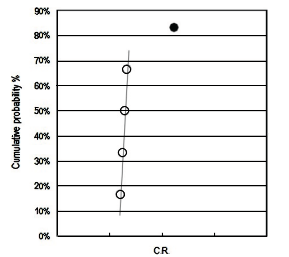 |
    | --- |
    | **Fig 3.32.7 An example of plot of C.R.s on a normal distribution chart** (In this case C.R. data • should be abandoned and eliminated.) |
    - **(A)** Prior to the testing, the following data shall be measured and reported:
      - **(a)** size and weight of test piece.
    - **(B)** After the testing, the following measured data shall be reported:
      - **(a)** weight loss (difference between initial weight and weight after testing)
    - **(C)** Specimens are to be weighed to an accuracy of ± 1 mg.
    - **(D)** Corrosion rate (C.R.) calculated by the following formula:
    - **(E)** To identify specimen which hold crevice and/or localized corrosion, the C.R. is to be plotted on a normal distribution statistic chart. One specimen that has a corrosion rate deviating from the average corrosion rate by more than +25% may be eliminated from the results, provided that the cause of the accelerated corrosion is demonstrated to be due to localized corrosion around the hanging hole and/or stamp (e.g. crevice corrosion, pitting corrosion, etc.). C.R. data which deviate from the normal statistical distribution must be eliminated from the test results. An example is shown in **Fig 3.32.7** for reference.
    - **(F)** Calculation of average of C.R.'s data (C.R. ave)
  - **(3)** **Test results of welded joint**
    - **(A)** Sampling of test specimens, magnification of photomicrograph and evaluation of discontinuous surface to be in accordance with requirements in **3205. 3.**.
  - **(4)** **Acceptance criterion**
    The test results based on (2) and (3) above shall satisfy the following criteria:
    - **(A)** C.R.ave (mm/ year) ≤ 1.0 (for base metal)
    - **(B)** no discontinuous surface (e.g., step) between the base metal and weld metal (for welded joint)
  - **(5)** **Test report**
    The test report shall include the following information:
    - **(A)** name of the manufacturer
    - **(B)** date of tests
    - **(C)** chemical composition and corrosion resistant process of steel
    - **(D)** test results according to (2) and (3) above
    - **(E)** judgement according to (4) above
- **3.** **Interpretation of weld discontinuity**
  - **(1)** **Preparation of samples after corrosion test**
    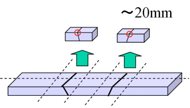
    **Fig 3.32.8 Sectioning plan**
    - **(A)** All five samples are to be prepared as follows.
    - **(B)** Two full thickness specimens approximately 20 mm long x 5 mm wide are to be sectioned with their principle axis perpendicular to the weld fusion line. Each specimen is to be located such that the weld fusion line is located approximately at its mid length. See **Fig 3.32.8**.
    - **(C)** The specimens are to be mounted in resin to allow polishing of the cross section. The specimens are to be etched in Nital after polishing to reveal the fusion boundary.
    - **(D)** A photomicrograph is to be taken at a magnification of approximately 100 X.
  - **(2)** **Evaluation of depth step**

    | 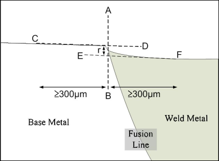 |
    | --- |
    | **Fig 3.32.9 Determination of corrosion depth on photomicrograph** |

    $R( \mu m)= \frac{r(mm) \times 1000}{M}$
    - **(A)** On the photomicrograph, construct a line A-B, perpendicular to the corrosion surface through the point where fusion line and the surface cross. See **Fig 3.32.9**.
    - **(B)** Construct two parallel lines C-D and E-F one representing the higher level, the other the lower level. Each line is to be constructed over a distance of ≥ 300 μm from line A-B on the base metal and weld metal side, respectively.
    - **(C)** Measure the distance r mm between the intersection point at line A-B and each average surface line on the photomicrograph.
    - **(D)** If the intersection point at line A-B and average surface line of welded metal part is above that of base metal part, then the existence of step should be neglected for this sample.
    - **(E)** Calculate the depth of discontinuous step R in μm from the actual photomicrograph magnification M as follows.
  - **(3)** **Evaluation of step angle**
    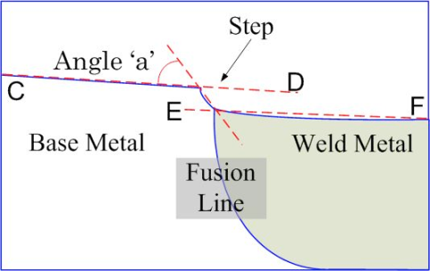
    Fig 3.32.10 Calculation of step angle
    - **(A)** Evaluation for angle of step is unnecessary if the depth of step calculated on both samples see (2) above, are not greater than 30 μm or if either step exceeds 50 μm for a single specimen. Otherwise the angle of step is to be calculated as follows.
    - **(B)** Produce a photomicrograph at a magnification of approximately 250 X, see **Figure 3.32.10**.
    - **(C)** Draw an average surface line C-D for base metal part and E-F for weld metal part.
    - **(D)** Find the closest intersection point with the step of the base metal surface profile and the constructed line C-D and the closest intersection point with the step for weld metal constructed line E-F respectively, and connect those two intersection points.
    - **(E)** Measure the angle ‘a’ in degrees given by the line C-D and the connected line described in (D) above.
  - **(4)** **Acceptance Criteria**
    - **(A)** If the depth of both steps are less than or equal to 30 μm then the measurement of angle is unnecessary, and the sample is considered to be acceptable.
    - **(B)** If the depth of steps on both photomicrographs are less than or equal to 50 μm and in addition if both the measured angles are less than or equal to 15 degrees, then the sample is considered to be acceptable.
    - **(C)** If either of the conditions described in (A) or (B) above are not in compliance, the sample is considered to contain a “discontinuous surface”and fails the test.
    - **(D)** Welds should be evaluated as “without discontinuous surface” when all 5 corrosion test samples are considered acceptable.

#### 3206. Type Approval Certificates

- **1.** After completion of the approval test, the manufacturer is to produce the report of the approval test and submit it to the Society.
- **2.** The Society is to issue a Type Approval Certificate, such as FORM AC-2 shown in **Annex 2** of this Guidance to the applicant, where deemed appropriate by the Society on the basis of the submitted test reports after completion of the type test.
- **3.** The Type Approval Certificate for approved corrosion resistant steel is to include the following items:
  - **(1)** Brand name, manufacturer and certificate number
  - **(2)** Steel grade and area of application designation
  - **(3)** Chemical composition range (including additive and/or controlling element percentages to improve corrosion resistance)
  - **(4)** Maximum thickness
  - **(5)** Steelmaking process
  - **(6)** Casting process
  - **(7)** Delivery condition
  - **(8)** Brand of welding consumables and welding method
  - **(9)** Period of validity of approval
- **4.** Validity and renewal of approval certificate are to be in accordance with **Ch 3**, **Ch 1**, **108.** of this Guidance.

#### 3207. Changes in the approved contents

- **1.** Where the scope of approval changes, for example for additions to the applicable welding consumables, the effects of these changes are to be subjected to corrosion resistance tests for the welded joints.

### Section 33 Protective Coating Systems for Cargo Oil Tanks

#### 3301. Application

- **1.** The requirements of this Section apply to tests and inspection for the type approval of protective coating systems in accordance with the requirements in **Pt 3, Ch 1, 801.** **2.** of the Guidance.
- **2.** Winter and summer type coating are considered different unless infrared (IR) identification and specific gravity (SG) demonstrates that they are the same. Winter type epoxy is required separate prequalification test including shop primer compatibility test according to **3306.** *(2021)*

#### 3302. Data to be submitted

- **1.** The following approval data are to be submitted to the Society in addition to those specified in **102.**
  - **(1)** Copy of Technical Data Sheet, including : 3 copies
  - **(2)** Compatibility of shop primer with protective coating system : 3 copies(if any)
  - **(3)** Inspection and acceptance criteria of protective coating system : 3 copies
  - **(4)** Procedures for repair of protective coating system : 3 copies
- **2.** The coating manufacturer should provide to the Society the following information;
  - **(1)** A detailed list of the production facilities.
  - **(2)** Names and location of raw material suppliers will be clearly stated.
  - **(3)** A detailed list of the test standards and equipment to be used, (Scope of approval).
  - **(4)** Details of quality control procedures employed.
  - **(5)** Details of any sub-contracting agreements.
  - **(6)** List of quality manuals, test procedures and instructions, records, etc.
  - **(7)** Copy of any relevant certificates with their issue number and/or date e.g. Quality Management System certification.
  - **(8)** Material safety Data Sheet

#### 3303. Data review and plant audit

- **1.** The Society shall performed the data review and plant audit specified in **Appendix Part A, 11.** of **Guidance for Approval of Service Suppliers** to assure the manufacturing process (including that of subcontractor's works) and quality assurance of the protective coating systems. *(2021)*
- **2.** With the exception of early ‘scale up’ from lab to full production, adjustment outside the limitations listed in the QC instruction referred to below is not acceptable.
- **3.** Unless justified by trials during the coating system’s development programme, or subsequent testing. Any such adjustments must be agreed by the formulating technical centre. If formulation adjustment is envisaged during the production process the maximum allowable limits will be approved by the formulating technical centre and clearly stated in the QC working procedures.
- **4.** The manufacturer’s quality control system will ensure that all current production is the same formulation as that supplied for the Type Approval Certificate. Formulation change is not permissible without testing in accordance with the test procedures in this Section and the issue of a Type Approval Certificate by the Society.
- **5.** Batch records including all QC test results such as viscosity, specific gravity and airless spray characteristics will be accurately recorded. Details of any additions will also be included.
- **6.** Whenever possible, raw material supply and lot details for each coating batch will be traceable. Exceptions may be where bulk supply such as solvents and pre-dissolved solid epoxies are stored in tanks, in which case it may only be possible to record the supplier’s blend.
- **7.** Dates, batch numbers and quantities supplied to each coating contract will be clearly recorded.
- **8.** All raw material supply must be accompanied the supplier’s ‘Certificate of Conformance’. The certificate will include all requirements listed in the coating manufacturer’s QC system.
- **9.** In the absence of a raw material supplier’s certificate of conformance, the coating manufacturer must verify conformance to all requirements listed in the coating manufacturer’s QC system.
- **10.** Drums must be clearly marked with the details as described on the ‘Type Approval Certificate’.
- **11.** Technical Data Sheets must comply with all the PSPC requirements. The QC system will ensure that all Product Technical Data Sheets are current.
- **12.** QC procedures of the originating technical centre will verify that all production units comply with the above stipulations and that all raw material supply is approved by the technical centre.

#### 3304. Performance standard

- **1.** Protective coating systems are, in principal, to be an epoxy-based systems. *(2020)*
- **2.** A multi-coat system with each coat of contrasting colour is recommended. The top coat shall be of a light colour(a colour that reflects light to an extent that a simple flash light (hand torch) will make inspection easy and fast. Normally light grey, buff, off-white, swimming pool blue/green, etc. easily distinguishable from rust.) in order to facilitate in-service inspection.
- **3.** Protective coatings for Cargo Oil Tanks of Crude Oil Tankers shall satisfy the approval tests specified in **3306. 2.** and **3..**
- **4.** Epoxy-based systems which have documented field exposure for 5 years with a final coating condition of not less than "GOOD" may be accepted. In this case, field exposure for 5 years shall be satisfied following conditions.
  - **(1)** Coating manufacturer’s records should include the information indicated in followings and should be examined to confirm coating system has 5 years field exposure, and the current product is the same as that being assessed.
    - **(A)** Original application records
    - **(B)** Original coating specification
    - **(C)** Original technical data sheet,
    - **(D)** Current formulation’s unique identification (Code or number)
    - **(E)** If the mixing ratio of base and curing agent has changed, a statement from the manufacturer confirming that the composition of the mixed product is the same as the original composition. This should be accompanied by an explanation of the modifications made.
    - **(F)** Current technical data sheet for the current production site
    - **(G)** SG(Specific Gravity) and IR(Infra Red) identification of original product
    - **(H)** SG and IR identification of the current product
    - **(I)** If original SG and IR cannot be provided then a statement from the manufacturer confirming the readings for the current product are the same as those of the original.
  - **(2)** Either class survey records should be reviewed, or A joint (coating manufacturer/Society) survey of cargo tanks of a selected vessel should be carried out, to verify compliance with the requirements of (1) and (5). The coating manufacturer’s representative is to be qualified to *NACE Coating Inspector Level 2* or *FROSIO Inspector Level III* or equivalent as verified by the Administration.
  - **(3)** The selected vessel should have cargo tanks in regular use, of which:
  - **(4)** In the case that the selected vessel does not meet the requirements in (3) then the limitations on lowest pH and Highest temperature of crude oils carried should be clearly stated on the type approval certificate.
  - **(5)** All cargo tanks should be in “GOOD” condition excluding mechanical damages, without touch up or repair in the prior 5 years. 2.6.1 “Good” is defined as: Condition with spot rusting on less than 3% of the area under consideration without visible failure of the coating. Rusting at edges or welds, must be on less than 20% of edges or welds in the area under consideration. “Area under consideration” is the area defined as per PSPC-COT 4.4 and 4.5. In evaluating the figures given in the definition, an under deck area and an inner bottom area are to be treated separately.
- **5.** In the case that a manufacturer wishes to have products which are manufactured in different locations under the same name, then infrared (IR) identification and specific gravity shall be used to demonstrate that they are the same coating, or individual approval tests will be required for the paint manufactured in each location.

#### 3305. Test Laboratory

The test laboratory where testing is carried out in accordance with the requirements in **3304. 3.** is to equip the test facilities so that they can perform the testing in accordance with the requirements in this Sec. and are to be accredited by any of followings;

#### 3306. Type test

- **1.** **General**
  - **(1)** **Application of protective coating system**
    - **(A)** There shall be a minimum of two stripe coats and two spray coats, except that the second stripe coat, by way of welded seams only, may be reduced in scope where it is proven that the NDFT can be met by the coats applied, in order to avoid unnecessary over-thickness.
    - **(B)** Stripe coats shall be applied by brush or roller.
    - **(C)** Each main coating layer shall be appropriately cured before application of the next coat, in accordance with coating manufacturer’s recommendations.
    - **(D)** Surface contaminants such as rust, grease, dust, salt, oil, etc., shall be removed prior to painting with proper method according to the paint manufacturer’s recommendation. Abrasive inclusions embedded in the coating shall be removed. Job specifications shall include the dry-to-recoat times and walk-on time given by the manufacturer.
    - **(E)** NDFT 320 μm with 90/10 rule(A 90/10 rule means that 90% of all thickness measurements shall be greater than, or equal to, NDFT and none of the remaining 10% measurements shall be below 0.9 x NDFT) for epoxy-based coatings; other systems to coating manufacturer’s specifications.
    - **(F)** For the coating pre-qualification test, the measured average DFT(dry film thickness) on each prepared test panels shall not exceed NDFT(nominal dry film thickness) of 320 ㎛ plus 20 % unless a paint manufacturer specified a NDFT greater than 320 ㎛. *(2021)*
    - **(G)** In the case that a paint manufacturer specified a NDFT greater than 320 ㎛, the average DFT shall not exceed the specified NDFT plus 20 % and the coating system shall be certified to the specified NDFT if the system passes the tests according to **3304. 3.**. The measured DFT shall meet the "90/10" rule and the maximum DFT shall be below the maximum DFT value specified by the manufacturer. *(2021)*
    - **(H)** Maximum total dry film thickness according to manufacturer’s detailed specifications.
    - **(I)** Care shall be taken to avoid increasing the thickness in an exaggerated way. Wet film thickness shall be regularly checked during application.
    - **(J)** Thinner shall be limited to those types and quantities recommended by the manufacturer.
  - **(2)** **Test gas composition**
    The test gas is based on the composition of the vapour phase in crude oil tanks and is to comply with the **Table 3.33.1**

    **Table 3.33.1 Test gas composition**

    | Test gas | composition | Remark |
    | --- | --- | --- |
    | N_2 | 83±2% | Volume of dry gas |
    | CO_2 | 13±2% | Volume of dry gas |
    | O_2 | 4±1% | Volume of dry gas |
    | SO_2 | 300±20 ppm |   |
    | H_2S | 200±20 ppm |   |
  - **(3)** **Test liquid**
    - **(A)** start with distillate Marine Fuel, DMA Grade density at 15ºC: maximum 890 kg/m^3, viscosity of maximum 6 mm^2/s at 40ºC (refer to KS M ISO 8217) ;
    - **(B)** add naphthenic acid up to an acid number of 2.5±0.1 mg KOH/g (refer to KS M ISO 6618) ;
    - **(C)** add benzene/ toluene (1:1 ratio) up to a total of 8.0±0.2% w/w of the DMA;
    - **(D)** add artificial seawater (refer to ASTM D1141) up to a total of 5.0±0.2% w/w to the mixture ;
    - **(E)** add H_2S dissolved in a liquid carrier (in order to get 5±1 ppm w/w H_2S in the total test liquid);
    - **(F)** thoroughly mix the above constituents immediately prior to use; and
    - **(G)** once the mixture is completed, it should be tested to confirm the mixture is compliant with the test mixture concentrations.
    - **(H)** To prevent the risk of H_2S release into the test facility, it is recommended to use a stock solution for steps (A) to (D), then fill the test containers and complete the test solution with steps (E) and (F).
- **2.** **Gastight cabinet test**
  - **(1)** **Test condition**
    The vapour test shall be carried out in a gastight cabinet. The dimensions and design of the air tight gas cabinet are not critical, provided the requirements of subparagraphs (F) to (J) below are met.
    - **(A)** The exposure time is 90 days.
    - **(B)** Testing shall be carried out using duplicate panels;a third panel shall be prepared and stored at ambient conditions to act as a reference panel during final evaluation of the test panels.
    - **(C)** The size of each test panel is 150 mm x 100 mm x 3 mm.
    - **(D)** The panels shall be treated according to **1.** (1) above.
    - **(E)** The zinc silicate shop primer, when used, shall be weathered for at least 2 months and cleaned by low pressure fresh water washing. The exact method of shop primer preparation before being over coated shall be reported, and the judgement issued for that specific system. The reverse side and edges of the test piece shall be coated appropriately, in order not to influence the test results.
    - **(F)** Inside the gastight cabinet a trough shall be present. This trough shall be filled with 2 ± 0.2 l of water. The water in the trough shall be drained and renewed prior to each time the test gas is refreshed.
    - **(G)** The vapour spaces inside the gastight cabinet shall be filled with a mixture of test gas as per **1.** (2) above. The cabinet atmosphere shall be maintained over the period of the test. When the gas is outside the scope of the test method, it shall be refreshed. The monitoring frequency and method, and the date and time for refreshing the test gas, shall be in the test report.
    - **(H)** The atmosphere in the test cabinet shall at all times be 95 ± 5% relative humidity.
    - **(I)** Temperature of the test atmosphere shall be 60 ± 3 °C.
    - **(J)** A stand for the test panels shall be made of a suitable inert material to hold the panels vertically spaced at least 20 mm between panels. The stand shall be positioned in the cabinet to ensure the lower edge of the panels is at least 200 mm above the height of the water and at least 100 mm from the walls of the cabinet. If two shelves are in the cabinet, care shall be taken to ensure solution does not drip on to the lower panels.
  - **(2)** **Test results**
    - **(A)** Prior to testing, the following measured data of each coating composing the coating system, including the zinc silicate shop primer when used under the coating system, shall be reported:
      - **(a)** infrared (IR) identification of the base and hardener components of the coating;
      - **(b)** specific gravity (refer to KS M ISO 2811-1/4) of the base and hardener components of the paint; and
      - **(c)** mean dry film thickness (DFT) (by using a template). (Six equally distributed measuring points are used on panels size 150mm x 100mm.)
    - **(B)** After completion of the test duration, the panels shall be removed from the cabinet and rinsed with warm tap water. The panels shall be dried by blotting with absorbent paper and, then, evaluated for rust and blistering within 24 hours of the end of the test.
    - **(C)** After testing, the following measured data shall be reported:
      - **(a)** blisters and rust. (refer to KS M ISO 4628-2 and KS M ISO 4628-3)
  - **(3)** **Acceptance criteria**

    | Item | Acceptance criteria for epoxy-based system based on this Guidance | Acceptance criteria for alternative system |
    | --- | --- | --- |
    | Blisters on panel | No blister | No blister |
    | Rust on panel | Ri 0 (0%) | Ri 0 (0%) |
    - **(A)** The test results based on (2) above shall satisfy the following criteria, the poorest performing of the duplicate test panels shall be used in the report *(2020)*:
    - **(B)** When evaluating test panels, blistering or rusting within 5 mm of the panel edge shall be ignored.
  - **(4)** **Test report**
    The test report shall include the following information:
    - **(A)** coating manufacturers' name and manufacturing site;
    - **(B)** dates of test;
    - **(C)** product name/identification of each coat and, where applicable, zinc silicate shop primer;
    - **(D)** batch numbers of each component of each product;
    - **(E)** details of surface preparation of steel panels, before shop primer application, and treatment of the shop primer before over coating where relevant and at a minimum including the following:
      - **(a)** surface treatment, or treatment of weathered shop primer, and any other important information on treatment influencing the performance; and
      - **(b)** water soluble salt level measured on the steel prior to application of the shop primer(refer to KS M ISO 8502)
    - **(F)** details of coating system, including the following:
      - **(a)** zinc silicate shop primer if relevant, its secondary surface pretreatment and condition under which applied, weathering period;
      - **(b)** number of coats, including the shop primer and thickness of each;
      - **(c)** mean dry film thickness (DFT) prior to testing
      - **(d)** thinner if used;
      - **(e)** humidity;
      - **(f)** air temperature;
      - **(g)** steel temperature;
    - **(G)** details of schedule for refreshing the test gas;
    - **(H)** test results according to **2.** (2); and
    - **(I)** results according to **2.** (3).
- **3.** **Immersion test**
  - **(1)** **Test condition**
    - **(A)** The exposure time is 180 days.
    - **(B)** The test liquid should be made as per **1.** (3) above.
    - **(C)** The test liquid should be added to a container with an inside flat bottom until a column of the test liquid of height of 400 mm is reached, resulting in an aqueous phase of 20 mm. Any other alternative test setup, using an identical test liquid, which will also result in the immersion of the test panel in 20 mm of the aqueous phase, is also accepted. This can be achieved by using, for instance, inert marbles.
    - **(D)** The temperature of the test liquid should be 60 ± 2℃ and should be uniform and maintained constant with recognized methods such as water or oil bath or air circulation oven capable of keeping the immersion liquid within the required temperature range.
    - **(E)** Test panels shall be positioned vertically and fully immersed during the test.
    - **(F)** Testing shall be carried out using duplicate panels.
    - **(G)** Inert spacers which do not cover the test area shall be used to separate test panels.
    - **(H)** The size of each test panel is 150 mm x 100 mm x 3 mm.
    - **(I)** The panels shall be treated according to **1.** (1) above.
    - **(J)** The zinc silicate shop primer, when used, shall be weathered for at least 2 months and cleaned by low pressure fresh water washing. The exact method of shop primer preparation before being over coated shall be reported, and the judgment issued for that specific system. The reverse side, and edges, of the test piece shall be coated appropriately, in order not to influence the test results.
    - **(K)** After the full immersion test period is completed the panels shall be removed from the test liquid and wiped with dry clean cloth before evaluation of the panels.
    - **(L)** Evaluation of the test panels shall be done within 24 hours after completion of the test.
  - **(2)** **Test results**
    - **(A)** Prior to testing, the following measured data of each coating composing the coating system, including the zinc silicate shop primer when used under the coating system, shall be reported:
      - **(a)** infrared (IR) identification of the base and hardener components of the coating;
      - **(b)** specific gravity of the base and hardener components of the paint (refer to KS M ISO 2811-1/4) ;
      - **(c)** mean dry film thickness (DFT) (by using a template). (*Six equally distributed measuring points are used on panels size 150mm x 100mm.*)
    - **(B)** After testing, the following measured data shall be reported:
      - **(a)** blisters and rust (refer to KS M ISO 4628-2 and KS M ISO 4628-3)
  - **(3)** **Acceptance criteria**

    | Item | Acceptance criteria for epoxy-based system based on this Guidance | Acceptance criteria for alternative system |
    | --- | --- | --- |
    | Blisters on panel | No blister | No blister |
    | Rust on panel | Ri 0 (0%) | Ri 0 (0%) |
    - **(A)** The test results based on (2) above shall satisfy the following criteria, the poorest performing of the duplicate test panels shall be used in the report *(2020)*:
    - **(B)** When evaluating test panels, blistering or rusting within 5 mm of the panel edge should be ignored.
  - **(4)** **Test report**
    The test report shall include the following information:
    - **(A)** coating manufacturers' name and manufacturing site;
    - **(B)** dates of test;
    - **(C)** product name/identification of each coat and, where applicable, zinc silicate shop primer;
    - **(D)** batch numbers of each component of each product;
    - **(E)** details of surface preparation of steel panels, before shop primer application, and treatment of the shop primer before over coating where relevant and at a minimum including the following:
      - **(a)** surface treatment, or treatment of weathered shop primer, and any other important information on treatment influencing the performance; and
      - **(b)** water soluble salt level measured on the steel prior to application of the shop primer(refer to KS M ISO 8502)
    - **(F)** details of coating system, including the following:
      - **(a)** zinc silicate shop primer if relevant, its secondary surface pretreatment and condition under which applied, weathering period;
      - **(b)** number of coats, including the shop primer and thickness of each;
      - **(c)** mean dry film thickness (DFT) prior to testing
      - **(d)** thinner if used;
      - **(e)** humidity;
      - **(f)** air temperature;
      - **(g)** steel temperature;
    - **(G)** test results according to **3.** (2) above; and
    - **(H)** results according to **3.** (3) above.

#### 3307. Type Approval Certificates

- **1.** If the type tests specified in **3304. 3.** or 5 years field exposure test specified in **3304. 4.** are satisfactory, a Type Approval Certificate will be issued to include both the epoxy and the shop primer.
- **2.** In case where 5 years field exposure test specified in **3304. 4.** are performed, The Type Approval Certificate shall reference the joint survey report specified in **3304. 4.** (2)
- **3.** In case where 5 years field exposure test specified in **3304. 4.** are performed, If the applied NDFT is greater than required in **3306. 1.** (1), (e) the applied NDFT will be the minimum to be applied during construction. This will be reported prominently on the Type Approval Certificate.
- **4.** In case where the epoxy has been tested without shop primer on bare prepared steel with satisfactory, a Type Approval Certificate will be issued. The Type Approval Certificate will just record the epoxy.
- **5.** The Type Approval Certificate is invalid if the formulation of either the epoxy or the shop primer is changed. It is the responsibility of the manufacturer to inform class immediately of any changes to the formulation.

#### 3308. Compatability of shop primer

- **1.** If a zinc silicate shop primer has passed the type test as part of an epoxy coating system, it may be used in combination with other approved epoxy coatings provided that the compatibility has been confirmed by the immersion test of **3306. 3.** or test in accordance with **Ch 3, Sec 30** in this Guidance.
- **2.** In case where same epoxy coating system is to applied on the different shop primers, each combination to be type tested in accordance with **3304.**. However, if each shop primer have already passed the type test as part of an epoxy coating system, the compatibility of shop primer can be confirmed by the test in accordance with **1.** above.
- **3.** If the test or tests specified above **1.** are satisfactory, a Type Approval Certificate will be issued. In this instance the Type Approval Certificate will include the details of the epoxy and a list of all shop primers with which it has been tested that have passed these requirements.

#### 3309. Dealing after approval

- **1.** The protective coating systems satisfied for the tests specified in **3304. 3.** are to be allowed the use of the epoxy with all the named shop primers or on bare prepared steel.
- **2.** The protective coating systems satisfied for the tests without shop primer according to **3307. 4.** are to be allowed the use of the epoxy on bare prepared steel only.
- **3.** In all cases of approval by 5 years field exposure test specified in **3304. 4.**, the shop primer shall be removed prior to application of the approved epoxy based system coating, unless it can be confirmed that the shop primer applied during construction, is identical in formulation to that applied in the selected vessel used as a basis of the approval.

#### 3310. Alternative systems

- **1.** All systems that are not applied according to **IMO PSPC**(**IMO Resolution 288(87)**) **4.6** are defined as an alternative system.
- **2.** Acceptance of alternative systems will be subject to documented evidence that they ensure a corrosion prevention performance at least equivalent to that indicated in **IMO PSPC.**
- **3.** The documented evidence shall consist of satisfactory performance corresponding to a target useful in either actual field exposure of continuous trading with crude oil cargoes for 5 years with final coating condition not less than "GOOD" or testing according to this Section.

### Section 34 Fiber Reinforced Plastic Gratings

#### 3401. Application

- **1.** The requirements of this Section apply to tests and inspection for the type approval of fiber reinforced plastic(hereinafter refer to FRP) gratings used in gangway for safe access to tanker bows in accordance with the requirements in **Pt 4, Ch 4, Sec 5** of the Guidance.
- **2.** In case where gratings used in lieu of steel gratings other than FRP gratings, the requirements of this Section can be applied.
- **3.** The manufacturers wishing to obtain the approval of the Society for FRP gratings used in service location specified in **Table 3.34.1** other than gangway are to comply with the requirements of this Chapter.

#### 3402. Data to be submitted (2018)

The following reference data are to be submitted to the Society in addition to those specified in **102.**

#### 3403. Type tests

- **1.** **General**
  - **(1)** The type tests specified in **Par 2**, **3**, **4** and **5** are to be carried out in the presence of the Surveyor where the submitted documents are considered acceptable.
  - **(2)** Applicants are to submit the test plan describing the test place, testing procedure, etc., in advance.
  - **(3)** It is recommended that the above test plan is submitted with application form letter.
  - **(4)** Test samples are to be picked out, in general, from the products by the direction of the Surveyor upon the survey at confirmation survey.
  - **(5)** Three copies of the test record are to be submitted to the Society.
  - **(6)** The type tests may be omitted when the test is carried out at a recognized testing organization and the test records are to be submitted to the Society.
- **2.** **Fire integrity test** ***(2017)***
  The service and locations for fire integrity test are to comply with the requirements specified in **Table 3.34.1**. The definitions and test procedures for L1, L2, L3 and L0 are also to be as follows. Details of test for fire integrity not specially mentioned in **3403. 2** are to comply with *ASTM F3059-14*.

  **Tabel 3.34.1 Level for fire integrity** ***(2017)***

  | Location | Service | Fire Integrity |
  | --- | --- | --- |
  | Machinery Spaces | Walkways or areas which may be used for escape, or access for firefighting, emergency operation or rescue | L1${} ^{(1)}$ |
  | Machinery Spaces | Personnel walkways, catwalks, ladders, platforms or access areas other than those described above | L3 |
  | Cargo Pump Rooms | All personnel walkways, catwalks, ladders, platforms or access areas | L1 |
  | Cargo Holds | Walksways or areas which may be used for escape, or access for firefighting, emergency operation or rescue | L1 |
  | Cargo Holds | Personnel walkways, catwalks, ladders, platforms or access areas other than those described above | L0 |
  | Cargo Tanks | All personnel walkways, catwalks, ladders, platforms or access areas | L0 |
  | Fuel Oil Tanks | All personnel walkways, catwalks, ladders, platforms or access areas | L0 |
  | Ballast Water Tanks | All personnel walkways, catwalks, ladders, platforms or access areas | L0 |
  | Cofferdams, void spaces, double bottoms, pipe tunnels, etc. | All personnel walkways, catwalks, ladders, platforms or access areas | L0 |
  | Accommodation, service, and control spaces | All personnel walkways, catwalks, ladders, platforms or access areas | -${} ^{(2)}$ |
  | Lifeboat embarkation or temporary safe refuge stations in open deck areas | All personnel walkways, catwalks, ladders, platforms or access areas | L2 |
  | Open Deck or semi-enclosed areas | Operational areas and access routes for deck foam firefighting systems on tank vessels | L2 |
  | Open Deck or semi-enclosed areas | Walkways or areas that may be used for escape, or access for firefighting systems and AFFF hose reels, emergency operation, or rescue on MODUs and production platforms including safe access to tanker bows(the areas to comply with the requirements of 3401. 1) | L2 |
  | Open Deck or semi-enclosed areas | Walkways or areas which may be used for escape, or access for firefighting systems, emergency operation or rescue other than those described above | L3 |
  | Open Deck or semi-enclosed areas | Personnel walkways, catwalks, ladders, platforms or access areas other than those described above | L3 |
  | Notes; (1) If the machinery space does not contain any internal combustion machinery, other oil burning, oil heating, or oil pumping units, fuel oil filling stations, or other potential hydrocarbon fire sources and has not more than 2.5 kg/m2 of combustible storage, grating of L3 integrity may be used in lieu of L1. (2) FRP grating is not permitted. (3) FRP grating is not permitted to the floor plating of normal passageways in machinery spaces of category A, |   |   |
  - **(1)** **Definitions**
    - **(A)** **Level 1(L1)**: FRP gratings meeting the L1 performance criteria provide the highest degree of safety and are intended for use in escape routes or areas in which access for firefighting, emergency operation, or rescue is needed after a significant fire exposure that may weaken the gratings. Level 1 gratings may also be used in any areas requiring Levels 2 or 3 gratings.
    - **(B)** **Level 2(L2)**: FRP gratings meeting the L2 performance criteria are intended for use in areas in which personnel may need to assemble after the grating has been exposed to a fire and are tested to ensure that they will be able to sustain a post-fire structural loading. Areas in which L2 gratings are specified include temporary safe refuge or lifeboat embarkation stations. Level 2 gratings may also be used in any areas requiring Level 3 gratings.
    - **(C)** **Level 3(L3)**: FRP gratings meeting the L3 performance criteria are intended for use in areas used as egress routes or that may require access for firefighting, rescue or emergency operations during or shortly after exposure to a very limited fire not likely involving flammable liquids.
    - **(D)** **Level 0(L0)**: FRP gratings have no level of fire integrity. L0 gratings are used for personnel walkways, catwalks, ladders, platforms, or access areas in cargo holds and tanks.
  - **(2)** **Test specimens**
    - **(A)** A set of two test specimens(one preload and one postload are required for Levels 2 and 3 testing; a set of four test specimens(one preload and three postload) are required for Level 1 testing.
    - **(B)** The test specimens are to be tested without any coatings(for example, UV coating, skid-resistant coating, and so forth).
    - **(C)** Each test specimen is to be 302 to 352 mm in width to allow for the differences in the spacing of longitudinal load-bearing members. The width is to be measured at the top surface from outside load-bearing member to outside load-bearing member. The length of each test specimen is to be the maximum length to be qualified for service plus 203 mm but a minimum of 1321 mm long. Test specimens are to be cut when required using representative methods and equipment as recommended by the manufacturer.
    - **(D)** Test specimens are to be conditioned for a minimum of 24 hours at a temperature of 23±2.8 ℃ and at a relative humidity of 50±5 %.
  - **(3)** **Approval test**
    For the preload test specimen of each set, the 392 N static load is to be applied at the center of the unsupported span of the test specimen. The load is to be applied over 102 mm of the longitudinal span and distributed evenly across the load-bearing members.
    - **(A)** The specification of fire conditions based on **ASTM E 119**. The time-temperature curve is to be the standard for **ASTM E 119**.
    - **(B)** **Placement of test specimens**
      - **(a)** A complete set of test specimens is to be placed in the furnace. More than one set may be placed in the furnace if each whole additional set can be accommodated. Individual specimens of a set are not to be tested in separate runs of the furnace.
      - **(b)** The specimens are to be had a minimum 305 mm clearance to the furnace walls and a minimum 610 mm clearance to the furnace floor or more as required ensuring maximum deflection limits can be properly evaluated.
      - **(c)** Each specimen is to be simply supported on minimum 102 mm wide steel or concrete supports without any other restraint to simulate the maximum unsupported span. The test specimen is to be placed with 100 mm of each end resting on the supports.
    - **(C)** The test for a furnace to be conducted with exposure duration of 60 minutes.
    - **(D)** **Data recording**
      - **(a)** The furnace temperature measurements are to be recorded at a maximum of 1 minute intervals.
      - **(b)** The time at which the vertical deflection of the preload test specimen exceeds a distance equal to the length of the unsupported span divided by 10 is to be recorded. The recorded time is to be within 6 seconds of the occurrence.
      - **(c)** The time when each of the unloaded test specimens collapse is to be recorded.
    - **(E)** **Preload test**
    - **(F)** **Postload test**
      - **(a)** The specimens are to be allowed to cool to ambient conditions before the postload test.
      - **(b)** For Level 3, the center load test of (c) is to be conducted. For Level 2, the center load test of (c) and the uniform load test of (d) are to be consecutively conducted. For Level1, the center load test of (c) and the uniform load test of (d) and the impact test of (e) are to be consecutively conducted for each test specimen and the uniform load test of (d) is to be conducted again.
      - **(c)** **Center load test**
      - **(i)** Each postload test specimen is to be supported as (B) (c) and is to be ubject to the 392 N static load at center of the unsupported span as required in the preload test of (E). The static load is to be applied for 15 minutes after the specimen appears motionless.
        - **(ii)** Whether each test specimen sustained the load without collapse is to be recorded. The specimen touching the ground or falling off the supports is to be considered as a collapse.
      - **(d)** **Uniform load test**
      - **(i)** Each postload test specimen is to be supported as (B) (c).
        - **(ii)** To each, a uniform distributed load in increments not exceeding 196 N until a load of 4.5 kN/m^2 is reached or until collapse, whichever occurs first, is to be applied. Each incremental load is to be applied for at least 5 minutes. The final load is to be applied for 15 minutes after the specimen appears motionless.
        - **(iii)** The load resulting in collapse for each specimen is to be recorded. Whether each test specimen sustained the final load without collapse is to be recorded. The specimen touching the ground or falling off the supports is to be considered as a collapse.
      - **(e)** **Impact test**
      - **(i)** Subject the test specimens to impact testing in accordance with **ASTM E 695**(Standard Method of Measuring Resistance of Wall, Floor, and Roof Construction to Impact Loading).
        - **(ii)** The test specimens are to be secured as required in **ASTM E 695** except that the span between supports should be 203 mm less than the pretest specimen length.
        - **(iii)** A lead shot bag with a minimum mass of 40 kg is to be dropped one time on each test specimen from a minimum height of 2 m, such that the point of impact is the midpoint of the span.
  - **(4)** **Acceptance criteria**
    The FRP gratings are considered to comply with Level 2 structural fire integrity requirements if they meet the requirements of Level 3 structural fire integrity and the test specimen of uniform load test is to be supported the load for the specified duration without collapse.
    The FRP gratings are considered to comply with Level 1 structural fire integrity requirements if all three postload specimens meet the requirements of Level 2 structural fire integrity and withstand the impact test in accordance with (3) (e) and subsequent uniform load test in accordance with (3) (d) without collapse.
    There are no structural fire integrity requirements.
    - **(A)** **Level 3(L 3)**
      - **(a)** The time for the heat exposure for the preload test specimen exceeds 18 minutes.
      - **(b)** The unloaded test specimens are not to be collapsed during the furnace test.
      - **(c)** The test specimen after center load test is to be supported the load for the specified duration without collapse.
    - **(B)** **Level 2(L 2)**
    - **(C)** **Level 1(L 1)**
    - **(D)** **Level 0(L 0)**
- **3.** **Fire retardance test**
  All FRP gratings should be fire retardant; this can be demonstrated by testing to **ASTM E 84**(Standard Test Method for the Surface Burning Characteristics of Building Materials) with a flame spread rating not to exceed 25 or by meeting the requirements in **4.** (1) or (2) below.
- **4.** **Flame spread and Surface flammability test**
  All FRP gratings, except those fitted on open decks and within tanks, cofferdams, void spaces, pipe tunnels and ducts, should have low flame spread and surface flammability characteristics as determined by one of the following test procedures. FRP gratings to comply with the requirements of **3401. 1.** should have low flame spread and surface flammability characteristics as determined by (2) of the following test procedures:
  - **(1)** When testing to **ASTM E 84** for flame spread characteristics, the flame spread rating is not to exceed 20; or
  - **(2)** The test for surface flammability is to comply with the requirements specified in **Table 3.26.7.** of this Guidance(refer to **FTP Code, Annex 1, Part 5** and **IMO Res. MSC. 307(88)**). The criteria established for materials used for bulkheads, linings, or ceilings are to be complies with.
- **5.** **Smoke and toxicity test**
  FRP gratings within accommodation, service and control spaces, should have low smoke characteristics as determined by one of the following test procedures. FRP gratings to comply with the requirements of **3401. 1.** should have low smoke and toxicity characteristics as determined by (2) of the following test procedures:
  - **(1)** When testing to **ASTM E 84** for smoke characteristics, the smoke developed rating is not to exceed 10; or
  - **(2)** Smoke and toxicity test are to comply with the requirements specified in **Table 3.26.8.** of this Guidance(refer to **FTP Code, Annex 1, Part 2**). The criteria established for materials used for bulkheads, linings, or ceilings are to be complies with. *(2022)*

### Section 35 Ballast Water Management System

#### 3501. General

- **1.** **Purpose**
  The requirements in this Section apply to design, construction, operation, function and verification testing including land-based, shipboard and component testing of ballast water management system (hereinafter referred to as “BWMS”), when the BWMS manufacturer makes an application for type approval of this Society or USCG. *(2021)*
- **2.** **Reference**
  - **(1)** The section is applied to the BWMS to be approved in accordance with KR’s Quality Assurance Project Plan (QAPP) for each verification testing (BWMS-USCG-VT and BWMS-USCG-CT), IMO Resolution MEPC.300(72) (hereinafter referred to as “BWMS Code”), related Guidance (IMO Resolution MEPC.173(58) (hereinafter referred to as “G2”), IMO Resolution MEPC.169(57) (hereinafter referred to as “G9”), BWM.2/Circ.33 and BWM.2/Circ.42/Rev.1, etc.) or any regulation of the respective Administration or USCG where applicable. However, the latest requirements of international organizations, the Administrations and USCG　are to be applied, regardless of whether or not they are specified in this Guidance. In case where IMO Resolution and relative circular are amended, the latest version is to be applied.　*(2021)*
  - **(2)** In case where the requirements are not specified in (1), “Rules and Guidance for Classification of Steel Ships” of the Society (hereinafter referred to as “the Rules”) or international standards may be applied.

#### 3502. Definition

- **1.** **Design assessment**
  The design assessment is a process of reviewing the drawings and relevant documentation containing the specification, structure, dimension, material, etc. of the BWMS. And also the design assessment is to prove that the design of the BWMS is in compliance with the criteria and the requirements of this Guidance. The design assessment also includes the test in-situation such as manufacturing plant, land-based testing and shipboard testing for assessment of operational performance and function of the BWMS concerned.
- **2.** **Land-based testing**
  Land-based testing of BWMS is a process of confirming that BWMS meets the standard described in regulation D-2 of the IMO Convention or U.S. Ballast Water Discharge Standards by carrying out BWMS in a test facility, equipment factory or pilot plant including a moored test barge or test ship according to the BWMS Code and 46 CFR 162.060-26. *(2021)*
- **3.** **Shipboard testing**
  Shipboard testing of BWMS is a process of confirming that BWMS meets the standard described in regulation D-2 of the IMO Convention or U.S. Ballast Water Discharge Standards by carrying out on board a ship according to the BWMS Code and 46 CFR 162.060-28. *(2021)*
- **4.** **Component testing**
  Component testing is a process of confirming that electrical equipment of the BWMS is suitable for operation & the maintenance in the environmental condition of the ship.
- **5.** **Emergency operation**
  Emergency operation is a method where the BWMS is not put into normal operation such as ballasting or de-ballasting via bypass or override mode in order to ensure the safety of the ship and the crew under emergency situations.

#### 3503. BWMS Design Requirements

- **1.** **Documents to be submitted**
  Unless specially specified by the Administration, the applicant is to submit required documents as below.
  - **(1)** Documents to be submitted for readiness evaluation *(2021)*
    - P&ID (including a diagram showing water flow of ballasting, de-ballasting and emergency operation)
    - Wiring diagrams for power supply, circuit diagrams and logic diagrams
    - Strength calculation data
    - Welding procedures and detail drawings of the main equipment
    - Section plan and elevation plan of the main equipment (including dimension)
    - The name, specification, version number, quality assurance plan of installed software
    - The documents for detail design (containing drawing, dimension and picture, etc. for user input and output equipment)
    - Function of each input equipment
    - Details of each screen
    - **(A)** The BWMS specification (including material)
    - **(B)** Detailed descriptions of management method
    - **(C)** Operation, Maintenance and Safety Manual (OMSM)
    - **(D)** Detailed documentation depending on each management method (GESAMP-BWWG report associated with IMO Basic and Final Approval, if applicable)
    - **(E)** Limitations of the BWMS
    - **(F)** The BWMS drawings
      - **(a)** System drawings
      - **(b)** List of components containing supplier’s information
      - **(c)** Specification and drawing for each component
      - **(d)** Software data
      - **(e)** User Interface data
    - **(G)** Information on test facilities (arrangement & specification of test facilities, information on sampling equipment, information on sampling procedures)
    - **(H)** Risk Assessment documents (e.g. HAZOP and/or FMEA, etc.)
    - **(I)** Scaled units of the BWMS and its supporting documents, etc. When the Guidance is referenced for approval of an Administration, submission of this document is subjected to the instruction of the Administration.
      - **(a)** Documents for scaled units of the BWMS & etc (e.g. manual)
      - **(b)** BWMS Specification/Performance data for all scaled units
      - **(c)** BWMS System Drawings for all scaled units (e.g. P&ID)
      - **(d)** Component drawings (main components) for all scaled units
      - **(e)** Table for component list according to all Scaled model
      - **(f)** Total Power consumption table for all scaled units (Power consumption is to be calculated by each major component and to be submitted summary of power consumption)
      - **(g)** Mathematical modelling/analysis data (e.g. CFD, Scaling-up and/or -down calculation data, etc.)
      - **(h)** Any information in which the change occurred from the data of the base unit, etc.
    - **(J)** Declaration of conformity which proclaims that the BWMS do not contain asbestos.
    - **(K)** Type approval certificate of Administration, Test result (the documents approved by International Maritime Organization, land-based testing, ship-board testing, and component testing, if applicable) and Test report (land-based testing, ship-board testing)
    - **(L)** Certificates or test reports for explosion-proof equipment (if applicable)
    - **(M)** Certificates for quality assurance system of the applicant (manufacturer), related data and test scope of respective equipment
    - **(N)** Operational and functional test program (Including confirmed data sheet, manufacturer’s dimensional check sheet for main components)
    - **(O)** Any information deemed necessary
  - **(2)** Documents to be submitted for component testing *(2021)*
    - **(A)** Lists of electrical equipment containing supplier’s information (control and monitoring equipment and electric·electronic components and sensors contained in control and monitoring equipment)
    - **(B)** Specifications and drawings of electrical equipment
    - **(C)** Piping and instrumentation diagrams (hereinafter referred to as “P&ID”) of the BWMS
    - **(D)** Component test program (detailed test plan for each test item including test arrangement)
    - **(E)** Any information deemed necessary
- **2.** **General for design**
  - **(1)** Machinery
    - **(A)** The manufacturer is to provide detailed specification. The BWMS is to be manufactured with adequate design and materials to have sufficient strength taking into account of the working condition onboard.
    - **(B)** The BWMS onboard is to be constructed and installed to minimize the risk to the crew. (including appropriate prevention measures against hot surfaces and other hazard, if applicable)
    - **(C)** The strength calculation is to be carried out for the pressure vessel if the equipment is classified as the pressure vessel in accordance with **Pt 5, Ch 5** of the Rules. However international standards recognized may be applied to the equipment.
    - **(D)** Pipes and pipe fittings are to comply with **Pt 5, Ch 6** of the Rules. In principle, mounted valve on the BWMS that are necessary to check the operation mode are to be controlled by a remote control system. Open or close condition of the valves is to be recorded in the data recording equipment.
    - **(E)** The BWMS is to be equipped with appropriate equipment to monitor operational parameters such as flow rate of ballast water, the amount of active substances dosing and residual active substances at de-ballast, UV intensity, the amount of neutralizer dosing, temperature, pressure, salinity and so on. The measured data is to be recorded in the storage equipment.
    - **(F)** From suction to discharge of ballast water, the BWMS is to be designed and constructed to control and monitor the operational parameters such as flow rate of ballast water, the amount of active substances dosing and residual active substances at de-ballasting, UV intensity, the amount of neutralizer dosing, temperature, pressure, salinity and so on automatically (if applicable).
    - **(G)** Sampling equipment is to be supplied and specified in the operation and maintenance manual in accordance with the Ballast Water Management Convention, G2 and/or requirements of Administration.
    - **(H)** The manufacturer of the BWMS is to provide this Society with the allowable operational range such as maximum / minimum ballast flow process, allowable use range of the active substances, allowable ultraviolet intensity, temperature, salinity range and so on along with the evidence. In addition, continuous normal operation is to be verified in the process of the readiness evaluation.
    - **(I)** In case of using the filter, the BWMS is to have self-cleaning function to enable continuous operation. If not, the BWMS is to have the countermeasures against clogging and fouling. The countermeasures are to be specified in the operation and maintenance manual.
    - **(J)** Where ballast water is discharged by stripping ejectors, the ballast water is to be also treated by BWMS.
    - **(K)** Where ballasting or deballasting operation is carried out by the gravity, this is to be treated by BWMS.
    - **(L)** For shipboard testing, TRC(Treatment Rated Capacity, hereinafter referred to as “TRC”) hereafter of the BWMS is to be compatible to the operable capacity of vessel’s ballast water pump.
  - **(2)** Electrical equipment
    - **(A)** Electrical∙electronic system is to comply with this Guidance in addition to the requirements specified in the Rules and Guidance.
    - **(B)** The electrical equipment for the control and monitoring of BWMS is to comply with the requirements for component testing in **Ch. 3, Sec. 23**. Also, the electrical equipment is to comply with requirements for component testing in the Convention or the Administration. However, in case of electrical equipment with type approval certificates of the Society, some or all of the tests may be exempted.
    - **(C)** Electronic and electric components subjected to component testing are, in principle, as follows:
      - **(a)** The main control and monitoring equipment
      - **(b)** Auxiliary control and monitoring equipment such as control panel of filter & neutralization unit etc.
      - **(c)** Rectifier, UV stabilizers, ozone generator, ultrasonic generators, plasma generators etc.
      - **(d)** Sensors or Switch (TRO(Total Residual Oxidant, hereinafter referred to as “TRO”), Flow, Proximity, Temperature, Intensity, Pressure, Gas, Salinity etc.)
      - **(e)** Electrical Automatic Control Valves
    - **(D)** The Society may not require, when deemed appropriate, other tests and inspections than those specified as follows:
      - **(a)** In case of type approval by Administration, testing targets & methods are to be in accordance with the interpretation of the Administration
      - **(b)** Component testing for UV chamber, filter, electrolyzer, and cyclone etc. might be waived in cases where attached sensors have been of tested
      - **(c)** Passive components, for example switches, junction boxes, resistors and simple semiconductor devices can be considered to be simple apparatus and component testing for simple apparatus might be waived
      - **(d)** In case of type approved electric equipment, the type test may be partly or wholly waived, subject to the decision.
    - **(E)** Fuses, circuit breakers, contactors, explosion-proof electrical equipment, cables, cable trays made of plastic material and protective casings are to be type approved by this Society, in principle. Also, above equipment is to comply with requirements of the Administration.
    - **(F)** The electrical equipment (power supply, instruments, switches and etc.) installed in enclosure except for item of (5), is to be type approved by this Society or comply with the international standards e.g., CE, KC and etc.
    - **(G)** Considering installation areas onboard in accordance with **Pt 6, Ch 1 Table 6.1.6** of the Rules, electrical equipment is to comply with IP grade. And it is to be verified by appropriate IP test in accordance with the IEC 60529 or equivalent. In case where electrical equipment is installed on the weather deck, it is to be at least IP 56 and verified by an appropriate test. If type approved enclosure of by the Society is used except for installing on the weather deck, IP tests may be exempted.
- **3.** **BWMS installed in hazardous areas**
  - **(1)** The BWMS is of explosion-proof type according to **Pt 6, Ch 1, Sec 9** of the Rules, if installed in hazardous areas.
  - **(2)** Otherwise, the equipment may be accepted as an explosion-proof by the certificates in accordance with International Standards as follows:
    - **(A)** The International Electrotechnical Commission explosion-proof certification (IEC Ex)
    - **(B)** NEC Code in USA(National Electrical Code)
    - **(C)** Explosion-proof equipment certification in Europe (ATEX)
    - **(D)** Retaining a certificate from the National Certification Agency recognized by the Society
  - **(3)** In case of U.S. flagged vessel, explosion proof certificate in (2) (A) or (B) is to be verified whether the certificate is issued by one of USCG ILs for explosion-proof.
- **4.** **Control and monitoring equipment**
  - **(1)** Control and monitoring equipment is to be designed as the fail-to-safe principle. The characteristics of fail-to-safe are to be evaluated on the basis not only of the respective systems themselves and associated machinery and equipment,but also the total safety of the ship.
  - **(2)** The automatic or remote control and monitoring equipment is to be sufficiently reliable under the installation and operational condition.
  - **(3)** Operational condition such as ballasting or de-ballasting operation, or maintenance condition or etc. is to be indicated by suitable visual means.
  - **(4)** When an abnormal condition is detected during the operation, a visual and audible alarm is to be activated and recorded.
  - **(5)** When the operational condition is beyond the allowable operational range during the ballasting operation, in order to prevent the untreated water from uptake into a tank, there is to be appropriate means to either stop the ballast water pump automatically or to discharge the untreated ballast water overboard.
  - **(6)** When the operational condition is beyond the allowable operational range during the de-ballasting operation, in order to prevent the untreated water from discharging overboard, there is to be appropriate means to either stop the ballast water pump automatically or to return the untreated ballast into the tank.
  - **(7)** If the BWMS requires a certain period of time for warm-up operation, appropriate means is to be provided to prevent untreated ballast water from flowing into the tank or discharging overboard.
  - **(8)** Minimum requirements for alarm and shutdown in an abnormal condition are referred to in **Table 3.35.1** depending on each management method. Unless otherwise specified in **3504.**, the specified requirement of this Society is to be complied with.
  - **(9)** The control and monitoring equipment of the BWMS is to be designed so that the recorded data such as operational parameters, the criteria of alarm & shutdown and self-monitored records cannot be changed arbitrarily.
  - **(10)** To protect of the ship and its crew, emergency stop function is to be provided. And there is to be preventive means to prevent unintended emergency stop owing to human error. Upon the activation of emergency stop, the valves on the relevant pipes are to close automatically to prevent untreated ballast water from uptake or discharge, and a visible and audible alarm is to be activated. Stopping of ballast water pump may be considered to ensure the safety of relevant pipes and pipe fittings. All of the events are to be recorded by the storage equipment.
  - **(11)** Remote control mode and local control mode should not be operable at the same time.
  - **(12)** When two or more sensors are used for TRO measuring at the same point, the value from main sensor is always to be selected for control and monitoring.
  - **(13)** Calibration certificates for sensors are to be submitted before the readiness evaluation.

    | No. | Item | Alarm & alarm equipment | Shutdown | Remark |
    | --- | --- | --- | --- | --- |
    | 1 | Maximum treatment capacity | O (exceeding maximum capacity for 3 min.) | O (exceeding maximum capacity for 5 min.) | Depending on the manufacturer’s specification. Alarm condition is to be subject to the BWMS specification and test result. |
    | 2 | Minimum treatment capacity | O | O | Depending on the manufacturer’s specification. Alarm condition is to be subject to the BWMS specification and test result. |
    | 3 | TRO Sensor failure | - | O |   |
    | 4 | Abnormal Operation of bypass valve | - | O |   |
    | 5 | Abnormal operation of automatic valve | O | O | Shutdown in case of valve having main function taking into account of system operation. |
    | 6 | Differential pressure of filter | O | O | Depending on the manufacturer’s specification |
    | 7 | Salinity | O | O | Depending on the manufacturer’s specification |
    | 8 | Minimum/maximum temperature of treated water | O | O | Depending on the manufacturer’s specification |
    | 9 | Emergency stop | - | O |   |
    | 10 | Overload of blower/fan | O | O | Depending on the manufacturer’s specification |
    | 11 | Blower/fan shutdown | - | O | If redundancy is arranged, shutdown is not required. |
    | 12 | The concentration of explosive and toxic gases | O (LEL 30%) | O (LEL 50%) | Depending on the manufacturer’s specification |

    | 13 | Failure of control & monitoring equipment | - | O |   |
    | --- | --- | --- | --- | --- |
    | 14 | Low levels of neutralizing tank | O | O | Depending on the manufacturer’s specification |
    | 15 | High/Low TRO value (DPD type) | O* | O* | Depending on the manufacturer’s specification and/or Type Approval Condition by Administration |
    | 16 | High/Low TRO value (Other than DPD type) | O* | O* | Depending on the manufacturer’s specification and/or Type Approval Condition by Administration |
    | 17 | Ballast pump stop | - | O | BWMS shutdown (However, the exception of gravity ballasting) |
    | 18 | High/Low UV Intensity | O | O | Depending on the manufacturer’s specification and/or Type Approval Condition by Administration |
    | 19 | UV intensity Sensor failure |   | O |   |
    | 20 | UV lamp Failure (One or more lamps) |   | O |   |
    | 21 | UV lamp high temperature | O | O | Depending on the manufacturer’s specification |
    | 22 | Power supply failure for rectifier, UV stabilizer and etc. | O | O | Depending on the manufacturer’s specification |
    | 23 | In excess of the allowable performance ranges of other systems | O | O | Depending on the manufacturer’s specification and/or Type Approval Condition by Administration |
    | 24 | Other equipment abnormal | O | O | Depending on the manufacturer’s specification |
    | 25 | Leakage of ozone | O | O | Depending on the manufacturer’s specification |
    | 26 | Ozone dosing | O | O | Depending on the manufacturer’s specification |
    | * Note (1) Unless specifically specified by the Administration, the minimum TRO value is to be verified through an additional biological efficacy test. (2) In case of DPD type, when the reference value exceeds 3 consecutive times, an alarm is to be initiated. When the reference value exceeds 5 consecutive times, the BWMS is to be shutdown automatically. The measurement interval of DPD sensor should not exceed 90 seconds. However, the first measured value after the start of the BWMS may be excluded as determining condition for alarm and shutdown, and the first measurement of DPD sensor should not exceed 120 seconds from the start of the system. (3) For any BWMS that incorporates the use of or generates active substances, preparations or chemicals, the MADC(maximum allowable discharge concentration of active substances) of TRO must not be exceeded 0.1 mg/L(as Cl_2) at any time. And unintentional release of active substances, preparations, relevant chemicals or hazardous materials used in or produced by the BWMS is not to occur under no circumstances. (Only for USCG) (4) In case of other than DPD type, alarm and shutdown should be activated when the TRO value exceeds consecutively for 4 minutes and 7 minutes respectively. (5) There are to be means to activate stop valves, as applicable, if the BWMS fails (only for USCG). (6) There are to be means that compensate for a momentary loss of power during operation of the BWMS so that unintentional discharges do not occur (Only for USCG). |   |   |   |   |
- **5.** **Data storage**
  - **(1)** The control and monitoring equipment are to be able to store data listed items in **Table 3.35.2** for at least 24 months. Furthermore, each data is to be stored in the interval of at least 1 minute.
  - **(2)** Where the control and monitoring equipment is replaced, means is to be provided to ensure the data recorded prior to replacement remains available on board for 24 months.
  - **(3)** Each operation data, alarm and shut down data is to be stored separately.
  - **(4)** The control and monitoring equipment is to be designed not to be changed or eliminated by the crew.

    **Table 3.35.2 Required record items**

    | Item | Remarks |
    | --- | --- |
    | Operation records such as normal and abnormal operation. |   |
    | Operation records with regard to TRO, UV, ozone, ultrasonic, intensity or dosing of the plasma, etc. |   |
    | Operation record of factors that affects the performance of BWMS such as flow rate, temperature, pressure, salinity, and gas density, voltage, current and etc. |   |
    | Record of ballast pump operating conditions, the main valve open/close operating condition. |   |
    | Record of alarm, shutdown and recovery |   |
    | Record of data back-up of an external storage equipment |   |
    | Record of the GPS position in case of equipment linked with GPS | Recommendation |
- **6.** **Emergency operation (Bypass or Override)**
  - **(1)** The control and monitoring equipment are to have emergency operation mode for urgent uptake or discharge of ballast water in order to ensure the safety of the ship. The emergency operation mode is to be operable via override arrangement or bypass line.
  - **(2)** Emergency operation is to be controlled by separate operation buttons or by selecting an appropriate operation mode with user friendly interface.
  - **(3)** In an emergency operation mode, the status of emergency operation is to be indicated appropriately by a visual and audible alarm accordingly. Clear instruction is to be specified in the manual and HMI so that the operator can recognize the emergency operation. Each event of emergency operation is to be recorded.

#### 3504. Additional requirements for each management method

- **1.** **Electrolysis method**
  - **(1)** Explosive gases generated in the electrolysis unit are to be ventilated to the opened space safely. The concentration of explosive exhaust gases is not to exceed 50% of the LEL. Even after stopping the operation of electrolysis unit, due to a possibility of explosive gas persistence in the ventilation pipe, gas ventilation operation of the unit is to be sustained for certain time period according to the manufacturer's recommendations, but not for less than 3 minutes.
  - **(2)** Detector(s) is to be installed in the ventilation pipe of explosive gases. The detector(s) is to be activated above the designated concentration level. Then, the BWMS is to be stopped and a visual and audible alarm is to be activated
  - **(3)** In case of electrolyzed water injection equipment, detailed drawing of the injection equipment and the specification of the equipment containing allowable operating pressure, any tolerance and etc. are to be submitted.
  - **(4)** In case of electrode module, self-inspection report and/or quality control report for the products by the manufacturer is to be submitted which contains the information affecting the performance of system e.g. the production process, material, coating, thickness, size, etc.
- **2.** **Ozone processing method**
  - **(1)** Ozone detector(s) is to be installed where ozone can accumulate such as around the ozone generating equipment and the ozone injection equipment. A visual and audible alarm is to be activated at a certain level of ozone. If the alarm continues, the BWMS is to be shutdown. The warning notice indicating the dangers of ozone leakage is to be posted in the passage and around the equipment.
  - **(2)** To prevent the ozone from persisting in the ozone generator and injection pipe line even after ozone generating equipment is stopped, appropriate measures are to be devised.
  - **(3)** Pipes and pipe fittings in which ozone passes through, are regarded as class I piping system. Full penetration butt joints welding or its equivalence is to be carried out. Leakage test is to be also carried out. The information is to be specified in the Operation, Maintenance and Safety Manual (OMSM) such that they are easily understood by the crew or user.
  - **(4)** Detailed drawings for injection equipment and the manufacturer’s specification required to maintain the normal operation such as normal operating pressure, etc. are to be submitted.
- **3.** **UV Sterilization method**
  - **(1)** The BWMS is to be designed to prevent UV exposure to the vessel crew. Safety requirements against the failure and repair are to be specified clearly in the instruction of the BWMS. A warning notice is to be posted in the BWMS as well.
  - **(2)** UV Lamps are to have alarm and interlock function to prevent overheating.
  - **(3)** UV intensity sensors are to be installed to monitor and confirm adequate UV intensity during the operation. Installation position of the sensor is to not be changed from the position in which it was installed during the approval.
  - **(4)** During the preheating process of UV unit, the representative valves which attest to the fact that the ballast water did not flow into a tank nor discharged from a tank are to be monitored and recorded.
- **4.** **Other management methods**
  - **(1)** The means to indicate that the BWMS is operating normally is to be prepared, and its operation data is to be recorded and monitored.
  - **(2)** Appropriate means is to be provided against chemical generated by the system and preparation, considering the human health and the safety of ship.

#### 3505. Operational and functional test

- **1.** **General**
  - **(1)** Upon review of the drawings, the BWMS is to be tested and inspected to verify its operational and functional requirements.
  - **(2)** The tests are to be conducted at an accredited laboratory, manufacturing plant or any other places.
- **2.** **Test procedures and items**
  - **(1)** At every stage of the test, the manufacturer is to measure and record the major operational data. And the measurement result is to be summarized in an appropriate form. Recorded data indicating the status of the BWMS during the test is to be submitted along with the data log.
  - **(2)** The data to be recorded at each load is to be taken during normal operation.
  - **(3)** Tests and inspections are to be carried out according to Table 3 when BWMS is in ballasting and de-ballasting operation. If deemed necessary by this Society, the Society may require additional testing. For the details about the test, refer to the method shown in Table 3.
  - **(4)** The test plan for readiness evaluation (according to **Table 3.35.3**) is to be prepared. This plan is to be reviewed by this Society. Readiness evaluation is to be carried out according to the test plan.

    **Table 3.35.3** **Operational and functional test items** ***(2021)***

    | Test item |   | Test requirements and test time | Remark |
    | --- | --- | --- | --- |
    | Functional test (Requirement regarding alarm and system shutdown) *(2023)* |   | Refer to **Table 3.35.1** |   |
    | Operation test | TRC (100%) | 60 minutes | (1) Alarm and shutdown are not to be occurred. When alarm and shut down are activated, the test is to be performed again. (2) Operation test is to be carried out for both ballast and de-ballast mode. (A) For land-based testing, (a) Operational margin is ± 7% of applicable treatment capacity. (b) TRC and Minimum treatment capacity are to be carried out for operation test. (c) Alarm and shutdown due to flow rate can be overridden for minimum treatment capacity. (B) For shipboard testing, (a) Operational margin is to be adjusted by agreement between the manufacturer and the Society considering the condition of the vessel. (b) TRC is to be carried out for operation test. |
    | Operation test | Minimum Treatment Capacity | 30 minutes | (1) Alarm and shutdown are not to be occurred. When alarm and shut down are activated, the test is to be performed again. (2) Operation test is to be carried out for both ballast and de-ballast mode. (A) For land-based testing, (a) Operational margin is ± 7% of applicable treatment capacity. (b) TRC and Minimum treatment capacity are to be carried out for operation test. (c) Alarm and shutdown due to flow rate can be overridden for minimum treatment capacity. (B) For shipboard testing, (a) Operational margin is to be adjusted by agreement between the manufacturer and the Society considering the condition of the vessel. (b) TRC is to be carried out for operation test. |
    | Emergency Operational test (bypass mode) |   | - | - |
    | Emergency stop test |   | - | - |
    | Open inspection |   | The main pressure components (e.g., filters, UV Chamber, electrolytic cell, etc.) | -No damage or wear. |
    | Hydrostatic test |   | 1.5 times the design pressure for 30 minutes | (1) Equipment is to be subjected to hydraulic pressure only. (2) No damage, leakage or wear. (3) Test report of certificate from other certification body can be acceptable. (4) Hydraulic test may be waived to the equipment which has been already installed for shipboard test before submitting the application. (5) Class 1 and Class 2 pressure vessels are to be applied. Class 3 pressure vessels considered necessary are to be subjected to hydraulic test. |

    **Table 3.6.3** **Operational and functional test items**

    | Test item | Test requirements and test time | Remark |
    | --- | --- | --- |
    | High voltage test | Apply the following test voltage, alternating of a frequency of 50 Hz or 60 Hz, between current carrying parts and between current carrying parts connected and earth for 1 minute. rated voltage: Un(V) ; test voltage (V) Un≤65 ; 2 × Un +500 65 1,500 250 2,000 500 2,500 For the equipment where the application of the test voltage is not desirable, the test voltage is applied after removing the circuits. rated voltage: Un(V) test voltage (V) Un≤65 2 × Un +500 651,500 2502,000 5002,500 | (1) No identified abnormality (2) Printed circuits with electronic components may be removed during the test; (3) High Voltage test is to be carried out before operation and functional test (4) When circuit is electrically connected, high voltage test can be carried out on main power source rather than on each electronic and electric component. (5) High voltage test and insulation resistance test are to be applied for land-based testing only. |
    | rated voltage: Un(V) | test voltage (V) |   |
    | Un≤65 | 2 × Un +500 |   |
    | 65 1,500 |   |   |
    | 250 2,000 |   |   |
    | 500 2,500 |   |   |
    | Insulation resistance test | Measure the insulation resistance between current carrying parts and between current parts and earth when measured with the following application voltage. Rated voltage: Un (V) ; Test voltage (V) Un≤65 ; 2 × Un, min. 24 Un>65 ; 500 For the equipment where the application of the test voltage is not desirable, the test voltage is applied after removing the circuits. Rated voltage: Un (V) Test voltage (V) Un≤65 2 × Un, min. 24 Un>65 500 | (1) The insulation resistance (MΩ) is not less than the value specified in the following. Rated voltage ; Before test ; After test Un≤65 ; 10 ; 1.0 Un>65 ; 100 ; 10 Rated voltage Before test After test Un≤65 10 1.0 Un>65 100 10 (2) Insulation resistance test is to be carried out just before & after high voltage test as well as at the end of the operation and functional test. (3) When circuit is electrically connected, insulation resistance test can be carried out on main power source rather than on each electronic and electric component. |
    | Rated voltage: Un (V) | Test voltage (V) |   |
    | Un≤65 | 2 × Un, min. 24 |   |
    | Un>65 | 500 |   |
    | Rated voltage | Before test | After test |
    | Un≤65 | 10 | 1.0 |
    | Un>65 | 100 | 10 |
    | Note) 1. Where necessary, Load test which excess TRC (100 %) may be required to verify the performance of the BWMS. 2. The land-based and shipboard testing may be partly or entirely omitted, subject to the approval by the Society, in case where the manufacturer has been approved by other Classification Society or a test organization recognized by the Society. |   |   |

#### 3506. Requirements of Land-based and Shipboard testing for BWMS

- **1.** **General**
  - **(1)** The manufacturer which intends to attain type approval of the Society should demonstrate that the results of land-based and shipboard testing for given BWMS are in compliance with the standards shown in the **Table 3.35.4** and requirements specified in this guidance (refer to BWMS Code, G9, 46 CFR 162.060 as well as US ETV Protocol (hereinafter referred to as “ETV protocol”)). *(2021)*

    **Table 3.35.4 Ballast Water Discharge Standard**

    | Type |   | Requirements |
    | --- | --- | --- |
    | Organisms | ≥ 50 $rm ㎛$ | < 10 $\mathrm{organisms}/m ^{3}$ |
    | Organisms | ≥ 10 $rm ㎛$ and < 50 $rm ㎛$ | < 10 $\mathrm{organisms}/mL$ |
    | Organisms | < 10 $rm ㎛$ | N/A |
    | Pathogens & Indicator Organisms | Toxicogenic Vibrio cholerae (O1 & O139) | < 1 cfu / 100 mL |
    | Pathogens & Indicator Organisms | Escherichia coli | < 250 cfu / 100 mL |
    | Pathogens & Indicator Organisms | Intestinal Enterococci | < 100 cfu / 100 mL |
    | Note) cfu : colony forming unit |   |   |
  - **(2)** The land-based and shipboard testing are to be carried out in the presence of the Surveyor in accordance with the requirements of test described in each Section of the Guidance or equivalent method thereof.
  - **(3)** The land-based and shipboard testing are to be conducted by the test organizations which are recognized by the Society.
  - **(4)** Notwithstanding the requirements in (1), (2) above, **3507.** and **3508.**, the land-based and shipboard testing may be partly or entirely omitted, subject to the approval by the Society, in case where the manufacturer has been approved by Administration including Retrofit Approval. Also, the land-based and shipboard testing may be partly or entirely omitted, subject to the approval by the Society, in case where the manufacturer has been approved by other Classification Society or a test organization recognized by the Society according to (K) and (o) of **3503. 1** (1), even though the manufacturer has not been approved by Administration including Retrofit Approval. *(2021)*
  - **(5)** Definition
    - **(A)** **Test** means the set of required test cycles.
    - **(B)** **Test cycle** refers to one testing iteration (to include uptake, treatment, holding and discharge as appropriate) under a given set of requirements used to establish the ability of a BWMS to meet the **Table 3.35.4**.
    - **(C)** **Valid test cycle** means a test cycle in which all the required test conditions and arrangements, including challenge conditions, test control, and monitoring arrangements (including piping, mechanical and electrical provisions) and test analytical procedures were achieved by the test organization.
    - **(D)** **Invalid test cycle** is a test cycle in which, due to circumstances outside the control of the BWMS, the requirements for a valid test cycle are not met. When a test cycle is invalid, it does not count as one of the required consecutive test cycles in a test and the test can be continued.
    - **(E)** **Failed test cycle** is a valid test cycle in which the performance of the BWMS resulted in treated water that is determined to be non-compliant with the standard set within **Table 3.35.4**. A failed test cycle interrupts the required consecutive test cycles and terminates the test.
    - **(F)** **Successful test cycle** means a valid test cycle where the BWMS functions to its specifications and treated water is determined to meet **Table 3.35.4**.
- **2.** **Sampling and analysis methods**
  Sampling and analysis method for biological efficacy test during land-based and shipboard testing should be applied as follows;
  - **(1)** Sampling methods
    Sample volume and handling are to be applied by paragraph 2.8.6 annex of BWMS Code for shipboard testing and paragraph 2.43 annex of BWMS Code for land-based testing. In case of concentrating biological samples for 10μm to 50μm and greater than 50μm, however, the validation data that the concentration methods do not have any negative effect on enumeration of living organisms. In case of pertaining to USCG type approval, sampling volume and handling are to be applied in ETV protocol, section 5.4.6.3 to 5.4.6.7. *(2021)*
    - **(A)** Sampling port is to be installed on land-based test facility and testing ship to collect the representative samples from in-line of control and discharge of ballast water. The detail specification and requirements for sampling port is to be applied in part 1, annex of G2 guidelines (Resolution MEPC.173(58)).
    - **(B)** In order to confirm the homogeneity in source water tank and storage tanks of ballast water during land-based testing, the samples may be collected from these tanks. In this case, the samples at surface, middle and bottom of tank should be collected or appropriate plankton net should be vertically retrieved from bottom of tank (speed of approximately 0.5m/s).
    - **(C)** Sample volume and handling
  - **(2)** Analysis methods
    - **(A)** Analysis methods for enumeration of live organisms and chemicals during biological efficacy testing are to be applied in accordance with following international organization and/or standards. In case of use of any other standard without following list, the standards to be applied are to be submitted with validation data.
      - **(a)** The Handbook of Standard Methods for the Analysis of Water and Waste Water.
      - **(b)** ISO standard methods.
      - **(c)** UNESCO standard methods.
      - **(d)** World Health Organization.
      - **(e)** American Society of Testing and Materials (ASTM) standard methods.
      - **(f)** United States EPA standard methods.
      - **(g)** American Public Health Association (APHA) standard methods
      - **(h)** Marine Environment Protection Committee (MEPC) documents.
    - **(B)** The analysis for biological efficacy testing is to be initiated within 6 hours after completion of last sampling. In case of beginning analysis over 6 hours, the testing results are to be submitted with the data and/or information to be valid.
- **3.** **Evaluation of regrowth**
  - **(1)** Evaluation of regrowth of organisms is to be conducted at least 2 test cycles in land-based and/or shipboard testing for each salinity ranges, and the evaluation results are to be submitted.
  - **(2)** In the case of land-based testing being performed with a holding time of less than five days, a sufficient volume of treated uptake water is to be held under conditions similar to conditions in the relevant holding tank. In the case of shipboard testing, water is to be retained on board for the evaluation of regrowth during a shipboard test cycle with a holding time of at least five days. Additional bench-scale testing may be used to supplement the land-based and/or shipboard testing.
  - **(3)** In the case of a BWMS having neutralization process and/or re-treatment process intended to kill, render harmless, or remove organisms within ballast water at the time of discharge, enumeration of organisms to assess regrowth is to be undertaken at least five days after all of neutralization process and/or re-treatment process.
  - **(4)** A report is to be submitted to this society containing all documentation (including procedures, methods, data, models, results, explanations and remarks) associated with the evaluation of regrowth according to (K) and (o) of **3503. 1** (1). *(2021)*
- **4.** **Temperature**
  - **(1)** To verifying the effective performance of BWMS through a ballast water temperature range of 0°C to 40°C (2°C to 40°C for fresh water) and a mid-range temperature of 10°C to 20°C, the testing results during land-based, shipboard, laboratory or bench-scale testing is to be submitted.
  - **(2)** Otherwise above (1), the requirements of biological parameter in source water is not necessary to be met, however, the water quality parameter specified in Table 3.35.5 must be met.
  - **(3)** For verifying temperature limitation of BWMS, the direct or indirect parameter of performance of BWMS can be used as indicator at upper and lower temperature. For example, the BWMS can be verified that, in case of UV type BWMS, UV intensity value previously set in BWMS should be continuously stable during one hour of each ballasting and de-ballasting operation at upper and lower temperature limitation and, in case of BWMS using active substances, TRO value previously set in BWMS should be continuously stable during one hour of each ballasting and de-ballasting operation at upper and lower temperature limitation.
  - **(4)** Where the report on temperature limitation is separately submitted to this society, refer to para 6.2 to 6.6 of BWMS Code. *(2021)*

#### 3507. Land-based testing

- **1.** **General**
  The land-based testing should be included testing results at least five consecutive successful test cycles in each salinity and successful tests should meet the **Table 3.35.4**.
- **2.** **Challenge water condition**
  - **(1)** The criteria of living organisms and water characteristics for the challenge water in each salinity are specified in **Table 3.35.5** and **Table 3.35.6**. For USCG Type Approval, the requirements must be in compliance with the ETV protocol.
  - **(2)** Challenge water should be used natural water. Unless the concentrations of DOC, POC, and TSS meet in natural water described challenge water condition specified in **Table 3.35.5**, challenge water could be artificially increased by using additives. It could be verified that the additive had no effect on the test organisms and the number of artificially increased DOC and POC could be equal to or greater than that of the natural water DOC and POC concentration considering BWMS performance. (comparison of TRO consumption and disinfection by-product formation for BWMS using active susbtances, comparison of UV absorbance between 200 nm and 280 nm for BWMS using UV)

    **Table 3.35.5 Criteria of water characteristics for challenge water in Land-based testing** ***(2021)***

    | Salinity | Challenge water characteristics | BWMS Code (mg/L) | ETV Protocol (mg/L) | Harmonized requirements | Remarks |
    | --- | --- | --- | --- | --- | --- |
    | Sea water (28-36 PSU) | DOM (mg/L) | > 1 | ≥ 6 | ≥ 6 |   |
    | Sea water (28-36 PSU) | POM (mg/L) | > 1 | ≥ 4 | ≥ 4 |   |
    | Sea water (28-36 PSU) | TSS (mg/L) | > 1 | ≥ 24 | ≥ 24 | TSS = POM + MM (ETV protocol) |
    | Sea water (28-36 PSU) | MM (mg/L) | - | ≥ 20 | ≥ 20 |   |
    | Brackish water (10-20 PSU) Fresh water (< 1 PSU) | DOM (mg/L) | > 5 | ≥ 6 | ≥ 6 |   |
    | Brackish water (10-20 PSU) Fresh water (< 1 PSU) | POM (mg/L) | > 5 | ≥ 4 | > 5 |   |
    | Brackish water (10-20 PSU) Fresh water (< 1 PSU) | TSS (mg/L) | > 50 | ≥ 24 | > 50 | TSS = POM + MM (ETV protocol) |
    | Brackish water (10-20 PSU) Fresh water (< 1 PSU) | MM (mg/L) | - | ≥ 20 | ≥ 20 |   |

    **Table 3.35.6 Criteria of living organisms for challenge water in Land-based testing** ***(2021)***

    | Organism size | BWMS Code |   | ETV Protocol |   | Harmonized requirements |   |
    | --- | --- | --- | --- | --- | --- | --- |
    | Organism size | Minimum concentration | Diversity | Minimum concentration | Diversity | Minimum concentration | Diversity |
    | ≥ 50㎛ | ≥10^5 $\mathrm{organisms}/m ^{3}$ | 5 species from 3 phyla/divisions | ≥10^5 $\mathrm{organisms}/m ^{3}$ | 5 species from 3 phyla/divisions | ≥10^5 $\mathrm{organisms}/m ^{3}$ | 5 species from 3 phyla/divisions |
    | ≥ 10㎛ and < 50 ㎛ | ≥10^3 $\mathrm{organisms}/mL$ | 5 species from 3 phyla/divisions | ≥10^3 $\mathrm{organisms}/mL$ | 5 species from 3 phyla/divisions | ≥10^3 $\mathrm{organisms}/mL$ | 5 species from 3 phyla/divisions |
    | < 10㎛ | ≥10^4 living bacteria/mL as culturable aerobic heterotrophic bacteria | - | ≥103 living bacteria/mL as culturable aerobic heterotrophic bacteria | - | ≥104 livingbacteria/mL as culturable aerobic heterotrophic bacteria | - |
  - **(3)** The salinity of the challenge water should be at least two of the salinity ranges given in **Table 3.35.5** according to the range of salinity to be approved by the ballast water management system. Each salinity interval should have a minimum difference of at least 10 PSU.
  - **(4)** If the ballast water treatment system has not been tested in fresh water and a separate test to confirm the condition of salinity limitation has not been performed, the average value of the tested brackish water should be set as the condition of salinity limitation.
  - **(5)** If the manufacturer presents the condition of salinity limitation for the BWMS, in addition to the requirements of (3), there should be results at least five consecutive successful test cycles in condition of salinity limitation
  - **(6)** In order to satisfy the salinity condition, it is possible to artificially control by adding natural fresh water to natural sea water or by adding high salt to natural fresh/brackish water.
  - **(7)** If the minimum biological concentration in the challenge water does not meet the criteria given in **Table 3.35.6**, natural species could be added or injected to the challenge water. In this case, the any biological augmentation method for preparation of the challenge water should minimize the impact of mortality rate of the test species and the community structure of natural species (seasonal diversity and abundance of population in natural seawater, brackish water and fresh water). The results of verification test should be submitted to the Society and the results should at least contain that the concentration of living organisms in challenge water after 5 days is not lower than 10 times the discharge standard specified in **Table 3.35.4**.
- **3.** **Requirements of land-based test**
  - **(1)** Ballast water treatment equipment scaling for land-based testing set-up
    - **(A)** Treated equipment with TRC equal to or smaller than 200 m^3/h should not be down -scaled.
    - **(B)** If treatment equipment with TRC large than 200 m^3/h or 1,000 m^3/h, in-line treatment equipment may be down-sized for land-based testing when following criteria met.
      - **(a)** Treatment equipment with a TRC greater than 200 m^3/h but less than 1,000 m^3/h may be down-sized to maximum of 1:5 scale, but must not be smaller than 200 m^3/h.
      - **(b)** Treatment equipment whit a TRC equal to or greater than 1,000 m^3/h may be down-scaled to a maximum of 1:100 scale, but must not be smaller than 200 m^3/h.
    - **(C)** In-tank treatment equipment should be tested on a scale that allows verification of full scale.
  - **(2)** Validity criteria for land-based testing

    **Table 3.35.7 Requirement for land-based set up**

    | Items | Requirements |
    | --- | --- |
    | Volume for uptake source water | (1) Uptake source water should be pumped to a ballast water treatment system of a minimum 200 m^3/h. (2) However, if the TRC of the ballast water treatment system for land-based test is more than 200 m^3/h, the test water should be pumped to the treatment system at the flow rate corresponding to TRC. |
    | Volume for treated water | (1) At least 200 m^3 of ballast water should be treated. |
    | Volume for control water | (1) Pumping of a minimum 200 m^3 of control water should be transported to the storage tank without treatment with a ballast water treatment system |
    | Control and Treated Tank (Simulated ballast tank) | (1) Standard industry practices for design and construction for ships (2) Surface coatings should be in accordance with **Pt 7, Ch 3, Sec 30** of the guidance (3) The minimum modifications required for structural integrity on land. |
    | Holding time | (1) Control water and treated water should be kept in the tank for the minimum time provided by the manufacturer. |
    | Discharge of treated and control water | (1) Discharge of the treated and control water by pumping. |
    | Cleaning phase | (1) Pressure-washed with tap water (2) Dried and swept to remove loose debris, organisms and other matter (3) Before starting testing procedure, and between test cycle |

    **Table 3.35.8 Criteria for concentration of living organisms in control discharged water**

    | Organism Size Class | Minimum Concentration |
    | --- | --- |
    | ≥ 50 μm | > 100 organisms/m^3 |
    | ≥ 10 μm and < 50 μm | > 100 organisms/mL |
    | < 10 μm | ≥ 500/mL as culturable aerobic heterotrophic bacteria |

    **Table 3.35.9** **Criteria of living organisms for challenge water in land-based testing**

    | Parameter | Ballasting |   | De-ballasting |   |
    | --- | --- | --- | --- | --- |
    | Parameter | Before control tank | Before treated tank | Control tank discharge | Treated tank discharge |
    | Volume | ● | ● | ● | ● |
    | Pressure | ● | ● | ● | ● |
    | Flow rate | ● | ● | ● | ● |
    | Parameters specified by the manufacturer | ● | ● | ● | ● |
    | Water quality conditions |   |   |   |   |
    | Temperature, Salinity, pH, DO (Possibility of challenge water monitoring) | ● | ● | ● | ● |
    | Total suspended solid | ● | ● | ● | ● |
    | Particulate organic matter | ● | ● | ● | ● |
    | Dissolved organic matter | ● | ● | ● | ● |
    | Mineral matter | ● | ● | ● | ● |
    | Environmental contaminants |   |   |   | ● |
    | Biological diversity and concentration |   |   |   |   |
    | ≥ 50 μm organisms (Live/Dead) (organisms/m^3) | ● | ● | ● | ● |
    | ≥ 10 μm and < 50 μm organisms (Live/Dead) (organisms/mL) | ● | ● | ● | ● |
    | < 10 μm (Live/Dead) (cfu/mL or 100 mL) | ● | ● | ● | ● |
    - **(A)** The operation, maintenance and replacement of the ballast water treatment system are to be carried out in accordance with the Operation, Maintenance, and Safety Manual by personnel of test facility. If personnel of test facility is unable to conduct the maintenance and replacement, expert of manufacturer may replace and maintain it under witnessing of the Society's Surveyor and personnel of test facility.
    - **(B)** The land-based testing is to be at least as tested under conditions satisfying the requirements specified in **Table 3.35.7**.
    - **(C)** The treatment of the test water and the transport of the control water can be done simultaneously or sequentially.
    - **(D)** The concentration of living organisms in control discharged water is to meet relevant criteria specified in **Table 3.35.8**.
    - **(E)** Each measurement item is to be sampled and measured at the locations shown in **Table 3.35.9**.

#### 3508. Shipboard testing

- **1.** **General**
  - **(1)** Shipboard test cycle includes the uptake of ballast water of the ship, treatment of the ballast water, the storage of ballast water on the ship and the discharge of ballast water from the ship.
  - **(2)** Successful test results are to be submitted at least three or five times (only in the case of USCG type approval) successive six months on board a ballast water treatment system. In this case, invalid tests do not affect consecutive successful tests.
  - **(3)** The ballast water treatment system to be used for shipboard testing is recommended to be tested with the largest or the most vulnerable model of TRC among a series of models.
    - **(A)** To identify the most vulnerable model, it should be defined that core internal and external performance parameters (e.g. injection concentration, UV intensity, filter flux density, etc.) required to achieve the performance of the scaled systems, physical/environmental conditions and design parameters that affect the performance of the system.
    - **(B)** The most vulnerable model should be identified through validated mathematical models and/or calculations that can predict that core performance parameters are satisfied with homogeneous treatment plant design and that the underlying mechanisms in operation are unchanged.
- **2.** **Validity criteria for Shipboard testing**
  - **(1)** The operation, maintenance and replacement of the ballast water treatment system are to be carried out in accordance with the Operation, Maintenance, and Safety Manual by vessel crew. If crew is unable to conduct the maintenance and replacement, expert of manufacturer may replace or maintain it under witnessing of the Society's Surveyor, personnel of test facility or crew.
  - **(2)** Concentrations of organisms ≥ 50 μm and ≥ 10 μm and < 50 μm organisms in the source water must exceed 10 times the maximum permitted values specified in **Table 3.35.4**.
  - **(3)** In case of USCG Type approval, the source water must be taken from the harbor or coastal waters and the ballast water treatment system should include the successful results of ballast water taken from at least two of the temperate, semi-tropical or tropical location. Also, successful treatment of ballast water taken from at least two sites based on the marine area of the Large Marine Ecosystem set by the US Oceanographic and Atmospheric Administration (NOAA) should be included. *(2021)*
  - **(4)** At least 80% of the rated treatment capacity is to be treated at ballast water and ballast water flow rate.
  - **(5)** When ballast water is discharged, it should satisfy the criteria specified in **Table 3.35.4**.
- **3.** **Measurement and record**
  - **(1)** During the shipboard testing, measurement data and information on the following are to be submitted.
  - **(2)** The salinity, temperature, dissolved organic carbon, particulate organic and total suspended solids in the ballast water uptake and discharged during the shipboard testing period are to be measured at the beginning, middle and end.
  - **(3)** All ballast water operation, including volumes and location of uptake and discharge
  - **(4)** Scheduled and unscheduled maintenance and repair performed on the BWMS
  - **(5)** Data on monitoring device during the shipboard testing
  - **(6)** Consumption of all solution, preparations, or other consumables necessary for the effective operation of the BWMS
  - **(7)** All parameters necessary for tracking the functioning of the control and monitoring equipment
  - **(8)** All instrument calibration methods and frequency of calibration

#### 3509. Operation and Maintenance Verification test

- **1.** **Application** ***(2021)***
  - **(1)** The requirements of this article apply to the USCG Type approval.
- **2.** **General**
  - **(1)** Operation and Maintenance Verification test (hereinafter referred to as “O&M test”) is to be conducted in land-based test facility and/or on vessel, and BWMS is to be operated more than 50 hours in ballasting and de-ballasting process, respectively (Operating time which the BWMS is operated during land-based test and Shipboard test is not incorporated).
  - **(2)** The plan and manual of O&M test are to be incorporated in TQAP for land-based and/or shipboard test.
  - **(3)** O&M test is to be conducted by test organization and/or crew. Observations and records for indicators stated in **2** are to be submitted.
- **3.** **O&M performance indicators**
  - **(1)** Qualitative indicators
    - **(A)** Visual Observation: treated ballast water quality (e.g. turbidity, color), treatment system condition (e.g. foaming, floating materials, settled solid), process failures, corrosion, leaks, impediments of flow (entering or exiting the system), etc.
    - **(B)** Operability: the ease of start-up and operation during testing and the ease of monitoring system performance
    - **(C)** O&M manual: evaluation of the usefulness and quality of the O&M manual
    - **(D)** Operator skills: the level of operator expertise required to operate and maintain the treatment system
    - **(E)** System Accessibility: the ease of access and required clearances for system operation and required maintenance
  - **(2)** Quantitative indicators
    - **(A)** Time demand: records of personnel time required to start-up, shutdown, operate, and maintain the treatment system in the monitoring and maintenance log
    - **(B)** Residual: volume of residual materials (e.g. solids removed via filtration system, etc.), mass generation rates, concentrations and factors related to the disposal of residuals (such as storage requirements and handling hazards)
    - **(C)** Chemical use: Usage rates and concentration of any chemicals (e.g. biocides) used as part of the treatment system and its operation during testing (per test cycle), and residuals and by-products occurring during the system operation
    - **(D)** Other consumables: the use of any other consumables (e.g. filter cartridges, etc.)
  - **(3)** Supplemental parameters (It may be applied differently depending on the treatment type of BWMS.)
    - **(A)** Upset condition: events or occurrences outside the operating parameters that result in either malfunctioning of the equipment, exception from normal operating condition, or conditions causing alarms that indicate the system is producing or discharging treated water that exceeds the stated set points or limits for effective treatment, and the causes, the results and the means to correct the problem.
    - **(B)** Reliability: comparison the manufacturer projected Mean-Time Between Failure (MTBF) with the maintenance events observed during testing, the number of instances where the treatment system or technology does not achieve the stated performance goal per the total number of test cycles, and the standard deviation of the mean for biological performance data (e.g. percent removal)
  - **(4)** Cost Factors
    - **(A)** Power consumption: Total kWh necessary to operate all equipment to achieve desired biological treatment performance
    - **(B)** Consumable or expendable materials: The amount of all consumables or expendables, including chemicals or other items required for treatment is to be itemized and reported.
    - **(C)** Replacement parts used during normal maintenance: The number of replacement parts used during scheduled and/or unscheduled maintenance is to be itemized and reported.
    - **(D)** Safety: List of all dangerous or hazardous materials, including submittal of Material Safety Data Sheets(MSDS); Potential to compromise the normal ship ballasting or de-ballasting, such as exposed or improper housing of power cable, structural stability of the system, external temperatures of the treatment system, and any other treatment-specific factors that may pose a threat to the operator or compromise the safety of ship operators.

### Section 36 Acoustic Insulation Materials (2018)

#### 3601. Application

The requirements of this Section apply to tests and inspection for the type approval of airborne sound insulation properties of acoustic insulation materials in accordance with the requirements in **Pt 13 Sub-Pt 1, Ch 1, Sec 1.** of the Rules upon requests.

#### 3602. Data to be submitted

The following reference data are to be submitted to the Society in addition to those specified in **102.**

#### 3603. Type test

- **1.** **General**
  - **(1)** The type tests specified in **Par 2** are to be carried out in the presence of the Surveyor where the submitted documents are considered acceptable. The witness by the Surveyor may be omitted, however, if the type tests are conducted by any official organizations which the Society considers appropriate.
  - **(2)** Test samples are to be picked out, in general, from the products by the direction of the Surveyor upon the survey at confirmation survey.
  - **(3)** Three copies of the test record are to be submitted to the Society.
  - **(4)** The type tests may be omitted when the test is carried out at a recognized testing organization and the test records are to be submitted to the Society. The Society may require additional tests, however, if it considers necessary.
- **2.** **Test method for Airborne sound insulation properties**
  - **(1)** **Preparation of specimens**
    Detailed test procedures depending on production type is to refer to **ISO 10140-1**.
  - **(2)** **Test method**
    - **(A)** Requirements for test facilities and equipment are given in **ISO 10140-5.**
    - **(B)** The average sound pressure levels shall be measured in the source and receiving rooms in fixed microphone positions or a continuously moving microphone. And all quantities shall be measured using 1/3 octave bands filters having at least the frequency range of 100 Hz to 5,000 Hz. For additional measurements at the low frequency up to 50 Hz using 1/3 octave band filters, guidance is given in **ISO 10140-4, Annex A**.
    - **(C)** Microphone shall be positioned with the following minimum separation distances:
      - **(a)** 0.7 m between fixed microphone positions;
      - **(b)** 0.7 m between any microphone position and room boundaries;
      - **(c)** 0.7 m between any microphone position and any diffusers;
      - **(d)** 1.0 m between any microphone position and the test element;
      - **(e)** 1.0 m between any microphone position and the sound source.
    - **(D)** If measuring with fixed microphone positions, measurements shall be made for no less than 15 s according to the following procedure.
      - **(a)** A minimum of five microphone positions shall be used in each room.
      - **(b)** These shall be distributed within the maximum permitted space throughout each room. No two microphone positions shall lie in the same plane relative to the room boundaries and the positions shall not be in a regular grid.
    - **(E)** If measuring with a continuously moving microphone, measurements shall be made for more than 30 s according to the following procedure.
      - **(a)** At least one measurement with a continuously moving microphone shall be used.
      - **(b)** The sweep radius shall be at least 1 m. The plane of the traverse shall be inclined in order to cover a large proportion of the permitted room space and shall not lie in any plane that is less than 10° to any room surface (wall, floor or ceiling). The duration of a traverse period shall be not less than 15 s.
    - **(F)** Measurements of background noise levels shall be made to ensure that the observations in the receiving room are not affected by the background noise.
    - **(G)** People shall not be present in the source or receiving rooms during measurements to avoid affecting the sound field.
  - **(3)** **Observations**
    $L _{R} =10\log \left( 10 ^{L _{sb} /10} -10 ^{L _{b} /10} \right)$
    where
    $L _{R}$ is the adjusted sound pressure level, in dB
    $L _{sb}$ s the combined sound pressure level with background noise, in dB
    $L _{b}$ is the background noise level, in dB
    $R=L _{S} -L _{R} +10\log\frac{S}{A}$
    where
    $R$ is the sound reduction index, in dB.
    $L _{S}$ is the energy average sound pressure level in the source room, in dB.
    $L _{R}$ is the energy average sound pressure level in the receiving room, in dB.
    $S$ is the area of the free test opening in which the test element is installed, in m^2.
    $A$ is the equivalent sound absorption area in the receiving room, in m^2.

    | Center Frequency(Hz) | Reference Values(dB) |
    | --- | --- |
    | 100 125 160 | 33 36 39 |
    | 200 250 315 | 42 45 48 |
    | 400 **500** 630 | 51 **52** 53 |
    | 800 1,000 1,250 | 54 55 56 |
    | 1,600 2,000 2,500 | 56 56 56 |
    | 3,150 | 56 |
    - **(A)** The background noise level shall be at least 6 dB below the level of signal and background noise combined at each frequency band. Adjusted sound pressure levels in receiving room shall be calculated according to the following equation.
    - **(B)** The sound reduction index shall be given as 1/3 octave band levels to one decimal place according to the following equation.
    - **(C)** The weighted sound reduction index(R_W) as the single-number rating shall be derived from sound reduction index of 1/3 octave band levels.
      - **(a)** Shift the reference values of **Table 3.36.1** in increments of 1 dB towards the measured values until the sum of unfavourable deviations is as large as possible, but not more than 32.0 dB.
      - **(b)** The value, in decibels of the reference value at 500 Hz, after shifting it in accordance with this procedure, is R_W.
  - **(4)** **Test report**
    The test report shall include at least the following information:

### Section 37 Busbar Trunking Systems (2019)

#### 3701. Application and general

The ship’s busbar trunking systems are to comply with the requirements of **Pt 6, Ch 1, Sec 4** of **Rules for the Classification of Steel Ships** and IEC 60092-302 as well as this guidance. However, high-voltage busbar trunking systems are to comply with the requirements of **Pt 6, Ch 1, Sec 15** of **Rules for the Classification of Steel Ships** and IEC 60466 as well as this guidance.

#### 3702. Data to be submitted

The manufacturer wishing to obtain the type approval of busbar trunking systems is to submit the data required in **Ch 3, Sec 3, 102. 3** to the Society.

#### 3703. Type test

Type tests are to be carried out in accordance with **Table 3.37.1** and supplementary tests may be required where deemed necessary by the Society. Type tests may be partly or wholly omitted, subject to the approval by the Society, in cases where the manufacturer submits the test reports issued by an authorized test laboratory in accordance with the standard approved by the Society.

| No. | Item | Test method |   | Remark |
| --- | --- | --- | --- | --- |
| 1 | Visual inspection |   |   | - |
| 2 | Temperature rising test | IEC 61439-6 |   | - |
| 3 | Short-circuit strength test | IEC 61439-6 |   | - |
| 4 | Verification of resistance and reactance | IEC 61439-6, 8.2.8 |   | - |
| 5 | Verification of structural strength | IEC 61439-6, 8.2.9 |   | - |
| 6 | Insulation resistance test | No. 10 | Table 3.23.1 | - |
| 7 | High voltage test | No. 11 | Table 3.23.1 | For high voltage, apply **Pt 6, Ch 1, 1506. 4** of **Rules for the Classification of Steel Ships** |
| 8 | Vibration test | No. 8 | Table 3.23.1 | - |
| 9 | Bulkhead and deck penetrations tests | IMO Res. A.754(18) |   | - |
| 10 | Fire test | IEC 60332-1-1 and IEC 60332-1-2 |   | - |
| 11 | IP test | IEC 60529 |   | - |
| 12 | EMC tests | No. 14 ~ 21 | Table 3.23.1 | Only if electronic devices form part of the system |

### Section 38 Cable Transits through watertight bulkheads and decks (2021)

#### 3801. Application

- **1.** The requirements in this Section apply to tests and inspection for the type approval of cable transits which cables pass through watertight bulkheads and decks in accordance with the requirements in **Pt 6, Ch 1, 508. 1** of the Rules.

#### 3802. Data to be submitted

The following reference data are to be submitted to the Society in addition to those specified in 102.

#### 3803. Type tests

### Section 39 Electric Power Converters (2022)

#### 3901. Application and general

Electric power converters installed on board are to comply with the requirements of **Pt 6, Ch 1, Sec 12** as well as this guidance.

#### 3902. Type tests

Type tests are to be carried out in accordance with **Table 3.39.1, Table 3.39.2** or **Table 3.39.3** and supplementary tests may be required where deemed necessary by the Society. Type tests may be partly or wholly exempted, subject to the approval by the Society, in cases where the manufacturer submits the test reports issued by an authorized test laboratory in accordance with the standard approved by the Society. *(2024)*

| No. | Test item | Test method |   |
| --- | --- | --- | --- |
| 1 | Visual inspection | No.1 | Table 3.23.1 |
| 2 | Electrical power supply failure test | No.3 | Table 3.23.1 |
| 3 | Electrical power supply variation test | No.4 | Table 3.23.1 |
| 4 | Dry heat test | No.6 | Table 3.23.1 |
| 5 | Damp heat test | No.7 | Table 3.23.1 |
| 6 | Variation test | No.8 | Table 3.23.1 |
| 7 | Inclination test | No.9 | Table 3.23.1 |
| 8 | Cold test | No.12 | Table 3.23.1 |
| 9 | Electromagnetic compatibility(EMC) test | No.14~21 | Table 3.23.1 |
| 10 | High voltage test | IEC 61800-5-1, 5.2.3.2(1) |   |
| 11 | Insulation resistance test | IEC 60146-1-1, 7.2.3.1 |   |
| 12 | Temperature rise test | IEC 60146-1-1, 7.4.2 |   |
| 13 | Light load test / Functional test | IEC 62040-3, 6.2.2.3 & 60146-1-1 |   |
| 14 | Fault clearing capacity test | IEC 62040-3, 6.4.2.9.2 |   |
| 15 | Load test | IEC 62040-3, 6.2.2.5, 6.4.2.2, 6.4.2.3 & 6.4.2.9.1 |   |
| 16 | Stored and restored energy test | IEC 62040-3, 6.4.3 |   |
| 17 | Capacitor discharge test | IEC 61800-5-1, 5.2.3.8 |   |
| 18 | Cooling failure test | IEC 61800-5-1, 5.2.4.13 |   |
| (Note) (1) Alternatively tests of IEC 60416-1-1, 7.2 or equivalent method may be accepted. |   |   |   |

| No. | Test item | Test method |   |
| --- | --- | --- | --- |
| 1 | Visual inspection | No.1 | Table 3.23.1 |
| 2 | Electrical power supply failure test | No.3 | Table 3.23.1 |
| 3 | Electrical power supply variation test | No.4 | Table 3.23.1 |
| 4 | Dry heat test | No.6 | Table 3.23.1 |
| 5 | Damp heat test | No.7 | Table 3.23.1 |
| 6 | Variation test | No.8 | Table 3.23.1 |
| 7 | Inclination test | No.9 | Table 3.23.1 |
| 8 | Cold test | No.12 | Table 3.23.1 |
| 9 | Electromagnetic compatibility(EMC) test | No.14~21 | Table 3.23.1 |
| 10 | Impulse voltage test^1) | IEC 61800-5-1, 5.2.3.2(3) |   |
| 11 | High voltage test | IEC 61800-5-1, 5.2.3.2(2) |   |
| 12 | Insulation resistance test | IEC 60146-1-1, 7.2.3.1(3) |   |
| 13 | Light load test / Functional test | IEC 60146-1-1, 7.3.1 & 7.5(3) |   |
| 14 | Rated current test | IEC 60146-1-1, 7.3.2(3) |   |
| 15 | Temperature rise test | IEC 60146-1-1, 7.4.2, IEC 61800-5-1, 5.2.3.10(3) |   |
| (Note) (1) The tests shall be carried out if not meet the criteria given in **Pt 6**, from **Table 6.1.26** to **Table 6.1.28** (2) Alternatively tests of IEC 60416-1-1, 7.2 or equivalent method may be accepted. (3) Alternatively tests of IEC 62447 or equivalent method may be accepted. |   |   |   |

| No. | Test item | Test method |   |
| --- | --- | --- | --- |
| 1 | Visual inspection(6) | No.1 | Table 3.23.1 |
| 2 | Electrical power supply failure test | No.3 | Table 3.23.1 |
| 3 | Electrical power supply variation test(1)(3) | No.4 | Table 3.23.1 |
| 4 | Dry heat test | No.6 | Table 3.23.1 |
| 5 | Damp heat test | No.7 | Table 3.23.1 |
| 6 | Variation test | No.8 | Table 3.23.1 |
| 7 | Inclination test | No.9 | Table 3.23.1 |
| 8 | Cold test | No.12 | Table 3.23.1 |
| 9 | Electromagnetic compatibility(EMC) test | No.14~21 | Table 3.23.1 |
| 10 | High voltage test(3) | IEC 60146-1-1, 7.2 |   |
| 11 | Insulation resistance test(2)(3) | IEC 60146-1-1, 7.2.3.1 |   |
| 12 | Temperature rise test(6) | IEC 60146-1-1, 7.4.2 |   |
| 13 | Light load test / Functional test | a) IEC 60146-1-1, 7.3.1 and 7.5 b) specification c) Emergency shutdown and restart |   |
| 14 | Short circuit test(3)(4) | The test is to be carried out at light load (e.g., 10%). The short circuit is through suitable fuses or breakers that meet the manufacturer’s or supplier’s specification for fault clearing in the event of short circuit. |   |
| 15 | Full load test(3)(5) | Measure output of voltage and frequency at rated output |   |
| 16 | Capacitor discharge test(6) | IEC 61800-5-1, 5.2.3.8 |   |
| 17 | Cooling failure test(6) | IEC 61800-5-1, 5.2.4.13 |   |
| (Note) (1) If the input voltage differs from the grid voltage, it shall be tested according to the manufacturer’s specifications. If the output voltage is connected to the grid, Pt 6, Ch 1, 201. 5 of Rules for the Classification of Steel Ships shall be considered. (2) Insulation resistance tests are conducted both before and after a series of environmental tests(temperature, humidity and high voltage tests). (3) Test in both directions, if the power converters are bi-directional. (4) No mechanical damage occurs to the power converters during the test, then they operate normally upon restart. (5) Not exceeding a manufacturer’s suggested values. (6) Alternatively tests of IEC 62477 or equivalent method may be accepted. |   |   |   |

### Section 40 Composite Material Pressure Vessels for Fuel Containment of Compressed Hydrogen Gas (2022)

#### 4001. General

- **1.** **Application** The requirements in this section apply to the test, etc. on the type approval of composite material pressure vessels for fuel containment of compressed hydrogen gas with an internal volume of 450L or less (hereinafter referred to as “vessels”) that supplies hydrogen fuel to fuel cells in accordance with **Ch 2, 704.** of **Guidance for Fuel Cell Systems on Board of Ships**.
- **2.** **Definition** The definitions used in this section are as follows.
  - **(1)** **Type 3** is a fully wrapped vessel in which a metal liner is wrapped with continuous fibers and synthetic resin.
  - **(2)** **Type 4** is a fully wrapped vessel in which a non-metallic liner is wrapped with continuous fibers and synthetic resin.
  - **(3)** **Autofrettage** is to causing permanent plastic deformation of a vessel with a metal liner by applying a pressure exceeding the yield point of the metal liner during the vessel manufacturing process.
  - **(4)** **Full wrapped vessel** is a vessel in which continuous fibers impregnated with resin are wound on a liner by hoop winding or helical winding, etc.
  - **(5)** **Hoop winding** is a method of winding fibers almost at right angles to the axis of the liner body during the process of filament winding (referring to winding continuous fibers impregnated with resin on a liner).
  - **(6)** **Helical winding** is a method of winding fibers in a spiral shape around the axis of the liner body during the process of filament winding.
  - **(7)** **Leakage** means leakage of contents through cracks or defects, but penetration through vessel body satisfying permeability test is not considered leakage.
  - **(8)** **Liner** is an inner vessel made of metal or non-metal that is covered with fibers and synthetic resins.
  - **(9)** **Burst pressure** is the highest pressure applied to vessels during the burst test.
  - **(10)** **Minimum design burst pressure** means the minimum burst pressure specified by the manufacturer in the design of vessel.
  - **(11)** **Working pressure** is the pressure when the vessel is actually used at a reference temperature of 15 ℃. For reference, there are vessels with a working pressure of 35 MPa or 70 MPa.
  - **(12)** **Maximum charging pressure** is the maximum pressure during charging that satisfies 1.25 times or less of the working pressure at 85 °C.
  - **(13)** **Batch** means the following.
    - **(A)** In the case of metal liners, the batch is a group of metal liners (as liners continuously manufactured with the same design, the same material, the same manufacturing process, the same heat treatment, the same manufacturing equipment, the same time, and the same atmosphere and temperature during heat treatment) in which the length of the manufactured vessels is in the range of ±50% of the batch average value.
    - **(B)** In the case of non-metallic liners, the batch is a group of non-metallic liners (as liners continuously manufactured with the same design, the same material, the same manufacturing process, and the same manufacturing equipment) in which the length is in the range of ±50% of the average value of the manufactured vessels.
    - **(C)** In the case of vessels, the batch is a group of vessels (as vessels continuously manufactured with the same design, the same material, the same manufacturing process, and the same autofrettage) in which the length is in the range of ±50% of the average value of the manufactured vessels.
    - **(D)** In any case, each batch is to be in quantity less than 200 including the number of vessels consumed in the tests.

#### 4002. Data to be submitted

The following reference data are to be submitted to the Society in addition to those specified in **102.**

#### 4003. Design and manufacture

- **1.** **General**
  - **(1)** The design life of vessel is determined by the manufacturer and is not to exceed a maximum of 15 years.
  - **(2)** Design charging cycle is calculated by the following formula.
    Design charging cycle = 1000+200∙X
    where:
    X : Design life(years)
  - **(3)** Design temperature of vessel is –40 ℃ to 85 ℃.
  - **(4)** At least one thermally-activated pressure relief device is to be installed in a vessel to prevent explosion in case of fire.
- **2.** **Materials**
  - **(1)** Materials are to have uniform quality.
  - **(2)** Materials that are not in accordance with the design specifications of the vessel manufacturer are not to be used.
  - **(3)** All materials that come into contact with hydrogen are to be compatible with hydrogen.
  - **(4)** Dissimilar metal materials that are concerned about corrosion are not to be used in contact with each other.
  - **(5)** Welded liners are not to be used.
  - **(6)** Metallic material (Type 3 liner and Type 4 boss)
    - **(A)** STS 316L is used for stainless steel used for vessels manufacturing, and Al 6061 T6 is used for aluminum alloy.
    - **(B)** The materials for the boss and closing plug of Type 4 vessel is to be used to maintain performance such as bonding and airtightness to the liner, and materials that can prevent stress corrosion cracking are to be used.
  - **(7)** Fiber materials

    **Table 3.40.1 Minimum burst pressure ratio**(1)

    | Materials | Type of vessels |   |
    | --- | --- | --- |
    | Materials | Type 3 | Type 4 |
    | Glass fiber | 3.4 | 3.5 |
    | Aramid fiber | 2.9 | 3.0 |
    | Carbon fiber | 2.25 | 2.25 |
    | Mixed fiber(2) | - | - |
    | Note: (1) Minimum burst pressure ratio = Fiber stress calculated at minimum burst pressure / Fiber stress calculated at working pressure (2) When two or more different fibers are mixed and used, the modulus of elasticity of each fiber are to be taken into consideration. Stress ratio verification can be performed using a strain gage. |   |   |
    - **(A)** Glass fiber, aramid fiber or carbon fiber is used as the structural reinforcement filament material. When carbon fiber is used, appropriate measures such as insulation coating are taken to prevent galvanic corrosion with the metal parts of fuel vessel. Tensile test of carbon fiber is to be carried out in accordance with ASTM D 4018 or equivalent test methods.
    - **(B)** Fibers for composite materials of vessels is to be used at least the minimum burst pressure ratio in **Table 3.40.1** depending on fiber type.
  - **(8)** Resin
    - **(A)** Resins for impregnation is thermosetting or thermoplastic. Shear strength test of resins may be conducted by (KS M) ISO 14130 or equivalent tests. Suitable resin materials include epoxies, modified epoxies, thermosetting resins of polyester and vinyl esters, and thermoplastic resins of polyethylene and polyamide.
  - **(9)** Materials for non-metallic liners (Type 4)
    - **(A)** Materials for non-metallic liners are to be suitable for the conditions of use.
    - **(B)** Softening points measured using (KS M) ISO 306 or appropriate methods are to be at least 100 ℃.
    - **(C)** Tensile strength and elongation are measured according to ASTM D 638.
  - **(10)** Vessel manufacturers are to conduct the tests of ASTM G 142-98 to confirm their suitability in a high pressure hydrogen environment for metal liner materials.
- **3.** **Manufacture**
  - **(1)** Fibers are made by laminating continuous filament winding to liner. The winding of fibers is computerized or mechanically controlled, and fibers maintain a controlled tensile force while winding. While winding fibers, confirm that the following parameters are kept within the tolerance. The work results are kept by the vessel manufacturers for the design life of vessels.
    - **(A)** Fiber type
    - **(B)** Number of fibers per winding width
    - **(C)** Mixing ratio and mixing method of base (epoxy, etc.) and hardener of resin
    - **(D)** Weight, mixing volume ratio of resin and fiber
    - **(E)** Winding angle
    - **(F)** Number of turns (layers) of hoop winding
    - **(G)** Number of turns (layers) of helical winding
    - **(H)** Winding width
    - **(I)** Tension during winding
    - **(J)** Winding speed
    - **(K)** Temperature of resin
  - **(2)** Resins are to be cured after fiber winding is complete. Thermosetting resins are to be cured using heat under controlled time-temperature. The curing cycle (e.g. time-temperature records) during curing is to be documented and kept by the vessel manufacturer for the design life of vessels.
  - **(3)** For aluminum alloy liners, the maximum curing time and temperature for vessel is to be less than the time and temperature that does not adversely affect the properties of metals, resins, and fibers. For Type 4 vessels, the curing temperature of resin is to be at least 10 ℃ lower than the softening temperature of plastic liner.
  - **(4)** Autofrettage for Type 3 vessels is to be performed prior to pressure test. Autofrettage pressure is to be the pressure suggested by the vessel manufacturer, and the vessel manufacturer is to prove that the autofrettage was performed properly. Records of autofrettage are to be kept by the vessel manufacturer for the design life of vessels.
  - **(5)** After molding, metal liners are to be heat treated to obtain the hardness value determined by the design condition. Local heat treatment is not permitted.
  - **(6)** If a protective coating is included in the design, the coating is to be tested in accordance with (KS M) ISO 4624, ensuring that the coating process does not adversely affect the mechanical properties of vessels.

#### 4004. Type tests

- **1.** **Test items**
  - **(1)** Test items at the time of new type approval and test items according to changes compared to design or manufacturing that have received type approval are in accordance with **Table 3.40.2**.
  - **(2)** Secondary changes compared to the changed design or manufacture are to be regarded as new type approval and test items as a new type approval are to be applied.

    **Table 3.40.2 Test items according to new and changes**

    | New and changes | Test items for vessels |   |   |   |   |   |   |   |   |   |   |
    | --- | --- | --- | --- | --- | --- | --- | --- | --- | --- | --- | --- |
    | New and changes | Material test | Burst test | Ambient temperature pressure cycle test | Leak before brake test | Flame exposure test | Defect test | Accelerated stress burst test | Extreme temperature pressure cycle test | Drop test | Permeability test | Tightness test, Boss torque test, Hydrogen gas repeated pressure test |
    | New type approval | 3, 4 | 3, 4 | 3, 4 | 3, 4 | 3, 4 | 3, 4 | 3, 4 | 3, 4 | 3, 4 | 4 | 4 |
    | Changes of fabric manufacturer |   | 3, 4 | 3, 4 | 3, 4 |   |   | 3, 4 | 3, 4 | 3, 4 |   |   |
    | Material changes of metal liner | 3 | 3 | 3 |   | 3 | 3 | 3 | 3 | 3 |   |   |
    | Material changes of plastic liner | 4 |   | 4 |   |   |   |   | 4 |   | 4 | 4 |
    | Material changes of fabric | 3, 4 | 3, 4 | 3, 4 | 3, 4 | 3, 4 | 3, 4 | 3, 4 | 3, 4 | 3, 4 |   |   |
    | Material changes of resin |   |   |   |   |   | 3, 4 | 3, 4 | 3, 4 | 3, 4 |   |   |
    | Inner diameter changes ≤ 20% |   | 3, 4 | 3, 4 |   |   |   |   |   |   |   |   |
    | Inner diameter changes > 20% |   | 3, 4 | 3, 4 |   | 3, 4 | 3, 4 |   | 3, 4 | 3, 4 |   |   |
    | Changes of length ≤ 50% |   | 3, 4 |   |   |   |   |   |   |   |   |   |
    | Changes of length > 50% |   | 3, 4 | 3, 4 |   | 3, 4 |   |   |   | 3, 4 |   |   |
    | Changes of working pressure ≤ 20%(1) |   | 3, 4 | 3, 4 |   |   |   |   |   |   |   |   |
    | Changes of working pressure > 20%(1) |   | 3, 4 | 3, 4 | 3, 4 | 3, 4 |   |   |   |   |   |   |
    | Shape changes of dome |   | 3, 4 | 3, 4 |   |   |   |   |   |   |   | 4 |
    | Size changes of opening |   | 3, 4 | 3, 4 |   |   |   |   |   |   |   |   |
    | Coating changes | 3, 4 |   |   |   |   |   |   |   |   |   |   |
    | Changes of boss (end plug) |   |   |   |   |   |   |   |   |   |   | 4(2) |
    | Changes of manufacturing process |   | 3, 4 | 3, 4 |   |   |   |   |   |   |   |   |
    | Changes of fire protection system |   |   |   |   | 3, 4 |   |   |   |   |   |   |
    | Note: 3 : Type 3 vessels, 4 : Type 4 vessels (1) It is to be carried out when there is a proportional change in thickness due to change in diameter or pressure. (2) If changes of stress at the neck are the same as the original value or decrease, hydrogen gas repeated pressurization test may not be performed. |   |   |   |   |   |   |   |   |   |   |   |
- **2.** **Test methods**
  - **(1)** All test vessels collected for type tests are to be subjected to visual inspection and dimensional inspection according to the following prior to type tests.
    - **(A)** Visual inspection: if vessels have no flaws, dents, cracks, etc. on the internal and external surfaces that interfere with use, and there are no defects and residues (debris, resin, etc.) generated during the manufacturing process that may cause harm to use, it is considered acceptable.
    - **(B)** Dimensional inspection: If the dimensions of vessels satisfy the design allowable tolerance decided by the manufacturer, it is considered acceptable.
  - **(2)** Test methods and acceptable criteria for type tests are to be in accordance with **Table 3.40.3**.

    **Table 3.40.3 Type tests for composite material pressure vessels for fuel containment of compressed hydrogen gas**

    | Test items |   |   | Test methods | Acceptable criteria |
    | --- | --- | --- | --- | --- |
    | Material test | Material tests are carried out according to the following for randomly sampled vessels. |   |   |   |
    | Material test | Liner tensile test |   | If liner material is aluminum alloy, one liner according to 10.2 of (KS B) ISO 7866, if liner material is stainless steel, one liner according to 7.1.2.1 of EN 1964-3, if liner material is plastic, two liners according to (KS M) ISO 527-2, tensile test is to be carried out at –40 °C. | If it is within the range suggested by the manufacturer, it is considered acceptable. |
    | Material test | Liner Impact test |   | For stainless steel liners, liner impact test is to be carried out in accordance with 7.1.2.4 of EN 1964-3. | If it satisfies the criteria of 7.1.2.4 of EN 1964-3, it is considered acceptable. |
    | Material test | Corrosion resistance test |   | For aluminum alloy liners, corrosion resistance test is to be carried out in accordance with Annex A of (KS B) ISO 7866. | If it satisfies the criteria of Annex A of KS B ISO 7866, it is considered acceptable. |
    | Material test | Stress crack resistance test |   | For aluminum alloy liners, stress crack resistance test is to be carried out in accordance with Annex B of (KS B) ISO 7866. | If it satisfies the criteria of Annex B of (KS B) ISO 7866, it is considered acceptable. |
    | Material test | Softening temperature test |   | One randomly sampled plastic liner is to be carried out according to Method A50 of (KS M) ISO 306. | If softening temperature is 100°C or higher, it is considered acceptable. |
    | Material test | Glass transition temperature test |   | Glass transition temperature tests of resin for three randomly sampled vessels are to be carried out by ASTM D 3418 or an equivalent method. | If test result is within the specifications decided by the manufacturer, it is considered acceptable. |
    | Material test | Resin shear strength test |   | Resin shear strength test is to be carried out with three specimens according to (KS M) ISO 14130. | If minimum shear strength of composite material measured after boiling in water for 24 hours is 13.8 MPa, it is considered acceptable. |
    | Material test | Protective coating test | Protective coating test is to be carried out on vessel with a protective coating (organic coating or paint, etc.) as follows. |   |   |
    | Material test | Protective coating test | Adhesion test | Adhesion test is to be carried out by the test method A or B of (KS M) ISO 4624. | Grade 4 or higher is considered acceptable. |
    | Material test | Protective coating test | Flexibility test | Flexibility test is to be carried out at –20 °C with a mandrel of 12.7 mm in method B of ASTM D 522. | If no cracks in the exterior occur, it is considered acceptable. |
    | Material test | Protective coating test | Impact resistance test | Impact resistance test is to be carried out according to ASTM D 2794. | If coating passes impact test of 18J at room temperature, it is considered acceptable. |
    | Material test | Light and moisture exposure test |   | Light and moisture exposure tests are to be carried out for 1000 hours according to ASTM G 154. | If there is no swelling and the adhesion is grade 3 or higher and the maximum loss of gloss is 20% or less according to (KS M) ISO 4628, it is considered acceptable. |

    **Table 3.40.3 Type tests for composite material pressure vessels for fuel containment of compressed hydrogen gas (continued)**

    | Test items |   | Test methods | Acceptable criteria |
    | --- | --- | --- | --- |
    | Material test | Salt mist test | Salt mist test is to be carried out for 500 hours according to ASTM B 117. | If undercut does not exceed 3 mm from the initial surface and there is no swelling, test and adhesion is grade 3 or higher according to (KS M) ISO 4628. |
    | Burst test |   | Burst test is to be carried out according to the following methods for three randomly sampled vessels. (1) Fill vessels with a fluid, such as water, and gradually increase the pressure until vessel burst. In this case, a pressure measuring device is to be installed and the pressure in the vessels is to be monitored whether the pressure increase rate exceeds 0.35 MPa/s as follows. (A) At 80 % or more of minimum burst pressure, if the pressurization speed is less than 0.35 MPa/s, pressurize until burst (B) At 80 % or more of minimum burst pressure, if the pressurization speed is 0.35 MPa/s or more and 1.4 MPa/s or less, place vessels between pressure pump and pressure sensor, or hold for 5 seconds at minimum design burst pressure and pressurize until burst | If actual burst pressure of vessel exceeds minimum design burst pressure and satisfies stress ratio requirements specified in the design, it is considered acceptable. |
    | Ambient temperature pressure cycle test |   | Ambient temperature pressure cycle test is to be carried out according to the following methods for two randomly sampled vessels. (1) Carry out ambient temperature pressure cycle test with a fluid such as water at ambient temperature. (2) Repeatedly apply pressure from pressure of 2 MPa or less to pressure of 1.25 times or more of working pressure. (3) Repetition period is to be less than 10 times per minute, and total number of cycle is to be at least 3 times the design charging cycle. | If there is no burst or leakage, it is considered acceptable. (If burst occurs during cycle test for 9 times the design charging cycle, record the number of cycle until burst, and record the initial location and description of burst.) * If cycle test of 9 times or more of the design charging cycle is carried out for both vessels without burst or leakage, the following Leak before brake (3 vessels) may not be carried out. |
    | Leak before brake test |   | Leak before brake test is to be carried out according to the following methods for three randomly sampled vessels. (1) Repeatedly apply pressure from pressure of 2 MPa or less to pressure of 1.5 times or more of working pressure. (2) Repetition period is to be less than 10 times per minute, and total number of cycle is to be at least 3 times the design charging cycle. | There is to be no burst, and it is considered acceptable in case of leakage. |
    | Flame exposure test |   | Flame exposure test is carried out according to the following methods for one randomly sampled vessel. (1) Fill vessel with hydrogen gas to working pressure. (2) Vessel is to be located horizontally 100 mm above flame source. |   |

    **Table 3.40.3 Type tests for composite material pressure vessels for fuel containment of compressed hydrogen gas (continued)**

    | Test items | Test methods | Acceptable criteria |
    | --- | --- | --- |
    | Flame exposure test | (3) Valves, fittings and pressure relief devices of vessels are protected by plates to prevent direct heating of the flame. The plates must not come into direct contact with the flame protection system (pressure relief devices, vessel valves, etc.). (4) The temperature of vessel surface is measured with at least 5 thermocouples (installed 2 or more in the local combustion area, 3 or more in the remaining area) at the 25 mm ± 10 mm point of vessel bottom, and the distance between each thermocouple is to be kept below 0.5 m. Temperatures are recorded at intervals of not more than 10 seconds. (5) Take measures to block the wind for constant heat supply. (6) First, at the point below the area (local area) farthest from pressure relief device, ignite with the width of the flame source not more than 250 mm ± 10 mm. At this time, the width of flame source is not to surround the diameter of vessel. (7) After ignition, reach 600°C within 3 minutes and maintain the temperature for 7 minutes thereafter. At this time, maximum temperature is not to exceed 900℃. (8) After ignition of local area, apply a uniform flame with a length of 1.65 m to the entire vessel. In this case, the fuel used as flame source is to be capable of providing uniform heat and sufficient temperature. (9) After ignition, reach 800℃ within 2 minutes and maintain the temperature. At this time, maximum temperature is not to exceed 1,100℃. (10) The test is carried out until all the gas inside vessel is released (pressure of vessel is 1 MPa or less). | If the gas is discharged through thermally activated pressure relief device without burst of vessel, it is considered acceptable. * Record the elapsed time time until the gas starts to be discharged through the pressure relief device, the maximum pressure, and the discharge time until pressure of 1 MPa or less is reached. |
    | Defect test | Defect test is to be carried out according to the following methods for one randomly sampled vessel. (1) Make two defects in the longitudinal direction on the outer wall of sample vessel. The size of one defect is to be 25 mm in length and 1.25 mm in depth, and the size of the other defect is to be 200 mm in length and 0.75 mm in depth or more. (2) Fill the defective vessel with a fluid such as water at ambient temperature, and carry out cycle test from pressure of 2 MPa or less to pressure of 1.25 times or more of working pressure for 3 times the design charging cycle. | If vessel has no leakage or burst under 0.6 times the design charging cycle and there is only leakage during cycle test thereafter, it is considered acceptable. |
    | Accelerated stress burst test | Accelerated stress burst test is to be carried out according to the following methods for one randomly sampled vessel. (1) Pressurize vessel with water at 85°C to pressure of 1.25 times of working pressure. (2) Vessel maintains the pressure and temperature for 1000 hours. (3) Burst test is carried out. | If burst pressure exceeds 85% of minimum design burst pressure, it is considered acceptable. |

    **Table 3.40.3 Type tests for composite material pressure vessels for fuel containment of compressed hydrogen gas (continued)**

    | Test items | Test methods | Acceptable criteria |
    | --- | --- | --- |
    | Extreme temperature pressure cycle test | Extreme temperature pressure cycle test is to be carried out according to the following method for one randomly sampled vessel that is not coated. (1) Fill vessel with a fluid such as water, and maintain it at internal pressure of 2 MPa or less, temperature of 85°C or more, and relative humidity of 95% or more for 48 hours. (Using chamber, etc.) (2) Carry out pressure cycle test for 1.5 times the design charging cycle from pressure of 2 MPa or less to pressure of 1.25 times or more of working pressure under the condition of maintaining temperature of 85℃ or more and relative humidity of 95% or more. (3) After stabilization at ambient temperature, the temperature of vessel and the fluid inside vessel is maintained at –40°C. (4) While maintaining the temperature below –40℃, carry out pressure cycle test for 1.5 times the design charging cycle from pressure of 2 MPa or less to working pressure. Ensure that the minimum temperature of the fluid is maintained during the low-temperature repeat test. (5) Repetition period is not to exceed 10 times per minute in the case of high temperature pressure cycle test. (6) Burst test is to be carried out. For Type 4 vessels, Tightness test is to be carried out and then burst test is to be carried out. | During extreme temperature pressure cycle test, if there is no burst, leakage, or fiber loosening in vessel, and burst pressure of vessel is 85% or more of minimum design burst pressure, it is considered acceptable. |
    | Drop test | Drop test is to be carried out according to the following methods for one randomly sampled vessel. (1) Use one empty vessel with no valve attached, or use up to three vessels for each test. Drop it onto a flat, horizontal concrete pad or hard surface at ambient temperature. A plug may be used to prevent impact damage to the threads and seal surfaces. (2) Drop horizontally from height of 1.8 m from the floor. (3) Fall vertically from height sufficient to generate more than 488 J of momentum (however, do not exceed 1.83 m). (4) Sample vessel is dropped from height where the center of gravity of vessel is 1.8 m so that the dome part of vessel touches the floor at an angle of 45° with the bottom of vessel. In this case, if the length of vessel is long and the height of lower part of vessel is less than 0.6 m, the drop angle is changed to maintain the minimum drop height of 0.6 m and the center of gravity is adjusted to maintain 1.8 m. Drop once at 45° angle then rotate 90° and fall again at 45° angle. | If vessel has no leakage or burst under 0.6 times the design charging cycle and there is only leakage during cycle test thereafter, it is considered acceptable. |

    **Table 3.40.3 Type tests for composite material pressure vessels for fuel containment of compressed hydrogen gas (continued)**

    | Test items | Test methods | Acceptable criteria |
    | --- | --- | --- |
    | Drop test | (5) It is allowed for vessel to bounce back to the concrete floor after first drop, but no measures are to be taken to prevent such secondary impact. (6) After drop test, fill vessel with fluid such as water, and carry out cycle test from pressure of 2 MPa or less to pressure of 1.25 times or more of working pressure for 3 times the design charging cycle. |   |
    | Tightness test | Tightness test is to be carried out according to the following methods for one Type 4 vessel randomly sampled. (1) Dry vessel so that there is no moisture. (2) Fill with nitrogen containing detectable gas such as hydrogen or helium and maintain the pressure for at least 3 minutes to working pressure. | If no gas leakage through cracks or defects is detected, it is considered acceptable. * Permeation through vessel body that satisfies permeability test below is not considered leakage. |
    | Permeability test | Permeability test is to be carried out according to the following methods for one Type 4 vessel randomly sampled. (1) Fill hydrogen with working pressure, and put vessel in a 15±2℃ airtight chamber, and record the amount of hydrogen gas permeated for 500 hours or while the steady state is maintained for at least 48 hours. | If the permeation rate of hydrogen gas in the stable state is 6.0 N$cm ^{3}$/h/ℓ or less, it is considered acceptable. |
    | Boss torque test | Boss torque test is to be carried out according to the following methods for one Type 4 vessel randomly sampled. (1) Fix the body of vessel so that it does not rotate. (2) Tighten boss to twice the torque suggested by the manufacturer for installing the valve or pressure relief device. (3) Torque is measured first in the tightening direction, then in the loosening direction, and finally in the tightening direction. (4) Tightness test and burst test are to be carried out respectively for vessel. | If the results of tightness test and burst test satisfy each acceptable criteria, it is considered acceptable. |
    | Hydrogen gas repeated pressure test | Hydrogen gas repeated pressure test is to be carried out according to the following methods for one Type 4 vessel randomly sampled. (1) Repeatedly pressurize 1,000 times using hydrogen gas from pressure of 2 MPa or less to pressure not less than working pressure. At this time, the charging time is to be 5 minutes or less, and the temperature at the time of gas release is not to exceed the range of -40°C to 85°C. (2) During the test, measure the temperature of gas using temperature sensor. (3) Check whether the temperature at the time of charging and discharging is within working condition. (4) After hydrogen gas repeated pressure test is completed, tightness test is to be carried out. | If there is no deterioration such as fatigue cracking or discharge of static electricity at the interface between plastic liner and boss, it is considered acceptable. |

### Section 41 Watertight bulkheads or deck pipe penetrations on passenger ships (2024)

#### 4101. Application

- **1.** The requirements of this Section apply to tests and inspection for type approval of watertightness test where materials (PVC, FRP, aluminium alloy, lead, etc) readily rendered ineffective by heat specified in **Pt 8, Annex 8-2 1.2** of the Guidance are used for pipe penetrations through watertight bulkheads or decks on passenger ships.
- **2.** Where applying 1. above, fire test specified in **Ch 3, Sec 26, Table 3.26.3** “Piping and Duct Penetrations” of this Guidance shall be conducted followed by watertightness test. Therefore, one of the two cases below may be applied.
  Case 1) Watertightness test on pipe penetrations that have already been type approved as fire test
  specified in Part 3 of Annex 1 to the 2010 FTP Code
  : Conduct fire test for the relevant fire rating with the same configuration as the already
  approved pipe penetration part + watertightness test
  Case 2) Pipe penetration that is not type approved as fire test
  : Conduct fire test with required fire protection level + watertightness test
- **3.** It shall be applicable to heat-sensitive piping systems and shall not be applied to cable penetrations in watertight bulkheads and decks.

#### 4102. Data to be submitted

The following reference data are to be submitted to the Society in addition to those specified in **102**.

#### 4103. Type tests

- **1.** Approval of pipe penetrations fitted to ensure the watertight integrity of a bulkhead or deck where heat-sensitive materials are used should include a prototype test of watertightness after having undergone the standard fire test appropriate for the location in which the penetrations are to be installed*****.
  1) The fire tested pipe penetration should then be tested to a test pressure of not less than 1.5 times the design pressure as defined in SOLAS Ch. II-1 Reg. 2.18. The pressure should be applied to the same side of the division as the fire test.
  2) The fire tested pipe penetration should be tested for a period of at least 30 minutes under hydraulic pressure equal to the test pressure, but minimum 1.0 bar. There should be no leakage during this test.
  3) The fire tested pipe penetration should continue to be tested for a further 30 minutes with the test pressure. The quantity of water leakage is not to exceed a total of 1 litre.
  4) The prototype test should be considered valid only for the pipe typology (e.g. thermoplastic and multilayer), pressure classes, the maximum/minimum dimensions tested, and the type and fire rating of the division tested.
  Note : ***** Refer to the requirements for A-class division set out in Part 3 of Annex 1 to the 2010 FTP Code
- **2.** The pressure test need not be carried out on the hot penetration arrangement. Ample time may be given to prepare for the pressure test, i.e. dismantling the fire testing equipment and rigging the pressure test equipment.
  1) The pressure test should be carried out with the pipe section used in the fire test still in place.
  2) Any pipe insulation fitted for the purpose of the fire test may be removed before the pressure test.
  3) Prototype testing for fire test and watertightness test need not be carried out if the pipe penetration is made of steel or equivalent material having a thickness of 3 mm or greater and a length of not less than 900 mm (preferably 450 mm on each side of the division), and there are no openings. Such penetrations shall be suitably insulated by extension of the insulation at the same level of the division.
  See also SOLAS Ch. II-2 Reg. 9.3.1 with respect to piping. However, the penetration must still comply with the watertight integrity requirement in SOLAS Ch. II-1 Reg. 2.17. 
