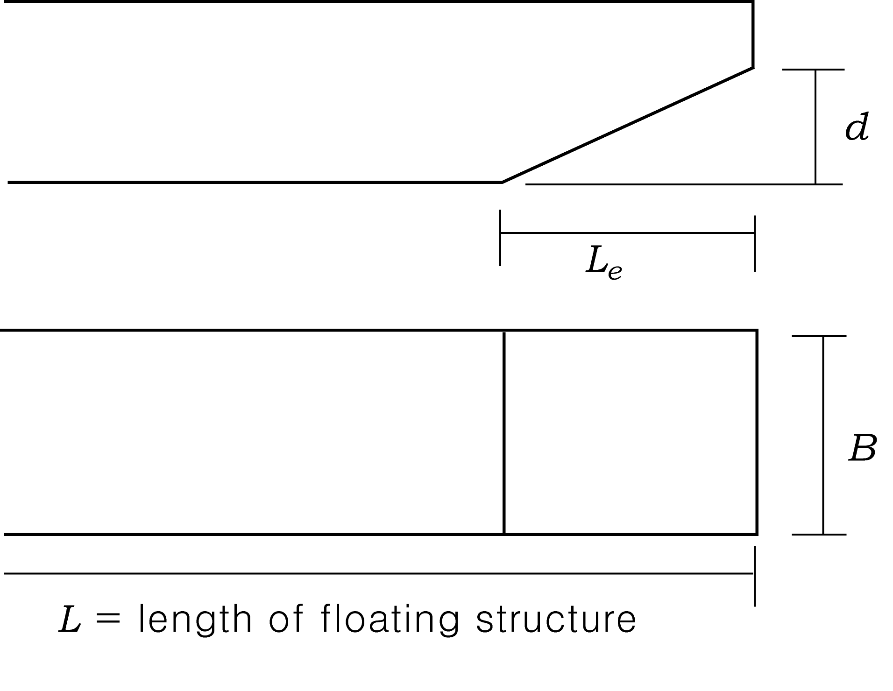
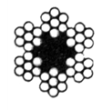
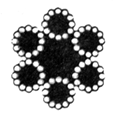
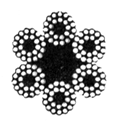
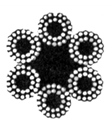
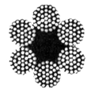
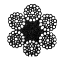

# Guidance for Floating Structures

> OTHER RULES AND GUIDANCE / GC-02-E / 2025 / EN / Guidance

## CHAPTER 4 MOORING AND ANCHORING, ETC.

### Section 1 Standard for Ship's Facilities

#### 101. Assessment of total resistances

Total resistance($R$)($\mathrm{kg}$) of floating structures is to be determined by using each mooring method, such that most severe condition can be considered when mooring force is calculated in accordance with the following $R _{aL}$, $R _{aT}$, $R _{t}$, $R _{sL}$ and $R _{sT}$.
$R _{aL}$ and $R _{aT}$ : the value obtained from the following
For longitudinal wind : $R _{aL} = K _{aL} \times A _{a} \times V _{a} ^{2}$ ($\mathrm{kg}$)
For transverse wind : $R _{aT} = K _{aT} \times A _{a} \times V _{a} ^{2}$ ($\mathrm{kg}$)
$K _{aL}$ : 0.0429 (longitudinal wind pressure factor) ($\mathrm{kg} \cdot \sec ^{2} /\mathrm{m} ^{4}$)
$K _{aT}$ : 0.0735 (lateral wind pressure factor) ($\mathrm{kg} \cdot \sec ^{2} /\mathrm{m} ^{4}$)
$A _{a}$ : projected area on the wind directional section above the load line ($\mathrm{m}^2$)
$V _{a}$ : relative wind speed ($\mathrm{m}/s$) (normal: min. 15 $\mathrm{m}/s$, typhoon: min. 44 $\mathrm{m}/s$. However, maximum wind speed of the data from Meteorological Administration may be used.)
$R _{t}$ : the value obtained from the following
$R _{t} = 0.1212 A _{t} "{"(V _{t} + V _{s} ) ^{2} +0.330(V _{t} + V _{s} )"}"$ ($\mathrm{kg}$)
$A _{t}$ : surface area below the waterline ($\mathrm{m} ^{2}$)
$V _{t}$ : current speed ($\mathrm{m}/s$)
$V _{s}$ : moving speed of the structures ($\mathrm{m}/s$)
$R _{sL}$ and $R _{sT}$ : the value obtained from the following
For longitudinal fluid flow : $R _{sL} = 0.5 \cdot \rho \cdot C _{bd} \cdot A _{s} \cdot (V _{t} + V _{s} ) ^{2}$ ($\mathrm{kg}$)
For lateral fluid flow : $R _{sT} = 73.2 A _{s} \cdot (V _{t} + V _{s} ) ^{2}$ ($\mathrm{kg}$)
$\rho$ : water density (sea water : 104.5 $\mathrm{kg} \cdot \sec ^{2} /\mathrm{m} ^{4}$, fresh water : 102.0 $\mathrm{kg} \cdot \sec ^{2} /\mathrm{m} ^{4}$)
$A _{s}$ : projected area on direction of fluid flow below the load line of the structure ($\mathrm{m} ^{2}$)
$V _{t}$ : current speed ($\mathrm{m}/s$)
$V _{s}$ : moving speed of the structures ($\mathrm{m}/s$)
$C _{bd}$ : the value according to the geometry of bow, as given in **Table 4.1.1**

| $L _{e} /d$ $V _{t} / \sqrt {Lg}$ | **0** | **1** | **2** | **3** | **4** | **5** | **6** | **7** |
| --- | --- | --- | --- | --- | --- | --- | --- | --- |
| 0.08 0.10 0.12 0.14 0.16 0.18 0.20 0.22 0.24 | 0.710 0.755 0.805 0.850 0.905 0.960 1.025 1.120 1.230 | 0.245 0.260 0.280 0.305 0.325 0.380 0.455 0.550 0.670 | 0.150 0.160 0.180 0.200 0.225 0.249 0.285 0.335 0.400 | 0.117 0.128 0.138 0.152 0.165 0.181 0.201 0.222 0.258 | 0.106 0.111 0.121 0.131 0.144 0.156 0.170 0.187 0.208 | 0.100 0.107 0.113 0.122 0.131 0.142 0.154 0.168 0.187 | 0.098 0.103 0.108 0.115 0.122 0.130 0.140 0.153 0.170 | 0.096 0.102 0.105 0.111 0.117 0.120 0.132 0.141 0.156 |
| (NOTES) $g$ : gravity acceleration (9.8 $\mathrm{m}/\sec ^{2}$) |   |   |   |   |   |   |   |   |

#### 102. Standard and provisions for anchor, etc.

- **1.** The floating structures are to be provided with anchors, anchor chains, etc. of which strength are not less than total resistance according to **101.** In this case, safety factor, tensile force acting on the anchor chain and mass of anchor are as follows:
  - **(1)** Safety factor is to be not less than 4.
  - **(2)** Tensile force($T _{c}$) acting on the anchor chain is to be obtained from the following formula. However, inclined angle of anchor chain on direction of total resistance should be considered when necessary to be considered.
    $T _{c} = R / \cos \theta$ ($\theta$ : inclined angle of anchor chain on direction of total resistance in horizontal plane)
  - **(3)** Mass of anchor is to be obtained from the following formula:
    $W =W _{a} ÷0.869$
    $W _{a}$ : mass of anchor in the underwater, as obtained from following formula:
    $W _{a} = P - K _{c} \times L _{c} \times W _{c} / K _{a}$
    $P$ : the value multiplying the tensile force($T _{c}$) of the anchor chain by the safety factor. When there are provided more than one anchor, the value divided by number of anchors
    $L _{c}$ : length of anchor chain
    $W _{c}$ : mass of 1 meter of anchor chain under water, to be taken the value multiplying the mass of anchor chain in the air by 0.869.
    $K _{a}$ and $K _{c}$ : holding power factor of anchor and anchor chain, as given in **Table 4.1.2**

    | Type | clay | silt | sandy soil | sand | coarse sand |
    | --- | --- | --- | --- | --- | --- |
    | $K _{a}$ | 2 | 2 | 2 | 3～4 | 3～4 |
    | $K _{c}$ | 0.6 | 0.6 | - | 0.75 | 0.75 |
  - **(4)** Tensile force($T _{r}$) acting on the mooring rope is to be taken from following formula:
    $T _{r} = R / \cos \theta$ ($\theta$ : inclined angle of the mooring rope on direction of total resistance in horizontal plane)
  - **(5)** The specification, etc. of the wire rope and fibre rope are to be given in **Table 4.1.3** to **Table 4.1.5.** *(2024)*
- **2.** The floating structures are to be provided with more than two anchors and anchors and anchor chains are to be capable of sustaining total resistance specified in **101.**
- **3.** Where stock anchors are used, the mass of anchor excluding the stock may be 0.8 times the mass of stockless anchor.
- **4.** Where anchor having the holding power of 2 times of stockless anchor is used, the mass of anchor may be 0.75 times the mass of stockless anchor.
- **5.** The anchor providing in forward direction are linked with anchor chains and the length of holding area of chains is to be more than 3 shackles. The length of each chain linked anchor is to be more than the sum length of catenary part and holding part.
- **6.** The anchors to hold a lateral position of structures are to be linked by chains.

#### 103. Anchoring Arrangements

For the floating structures having an anchor of more than 150 $\mathrm{kg}$, appropriate anchoring arrangements are to be provided. However, for the floating structures which are not maneuvering except repairing or deteriorating weather conditions, etc, it may not be provided.

#### 104. Mooring Arrangements

The requirements and types of mooring arrangements of floating structures are to comply with **Pt 4, Ch 10** of the Rules.

#### 105. Towing Arrangements

The towing arrangements of floating structures are to comply with **Pt 3** in **"Rules for the Towing Survey of Barges and Tugboats".** However, for the floating structures which are not maneuvering except repairing or deteriorating weather conditions, etc, it may not be applied.

**Table 4.1.3 Grades of steel wire rope**

| Grade |   | No. 1 | No. 2 | No. 3 | No. 4 | No. 5 | No. 6 | No. 21 |
| --- | --- | --- | --- | --- | --- | --- | --- | --- |
| Sectional view |   |  |  |  |  |  |  |  |
| Composition | Number of wire | 7 | 12 | 19 | 24 | 30 | 37 | 36 |
| Composition | Number of strands | 6 | 6 | 6 | 6 | 6 | 6 | 6 |
| Composition | Fibre core | Centre | Centre and Centre of strand | Centre | Centre and Centre of strand | Centre and Centre of strand | Centre | Centre |
| Composition mark |   | (6×7) | (6×12) | (6×19) | (6×24) | (6×30) | (6×37) | (6×WS(36)) |

**Table 4.1.4 Masses and breaking test loads for steel wire ropes**

| Grade | No. 1 |   | No. 2 |   | No. 3 |   | No. 4 |   | No. 5 |   | No. 6 |   | No. 21 |   |
| --- | --- | --- | --- | --- | --- | --- | --- | --- | --- | --- | --- | --- | --- | --- |
| Composition mark | (6×7) |   | (6×12) |   | (6×19) |   | (6×24) |   | (6×30) |   | (6×37) |   | (6×WS(36)) |   |
| Diameter of steel wire rope ($\mathrm{mm}$) | Breaking test load ($\mathrm{kN}$) | Mass per metre in length ($\mathrm{kg}$) | Breaking test load ($\mathrm{kN}$) | Mass per metre in length ($\mathrm{kg}$) | Breaking test load ($\mathrm{kN}$) | Mass per metre in length ($\mathrm{kg}$) | Breaking test load ($\mathrm{kN}$) | Mass per metre in length ($\mathrm{kg}$) | Breaking test load ($\mathrm{kN}$) | Mass per metre in length ($\mathrm{kg}$) | Breaking test load ($\mathrm{kN}$) | Mass per metre in length ($\mathrm{kg}$) | Breaking test load ($\mathrm{kN}$) | Mass per metre in length ($\mathrm{kg}$) |
| 10 12 14 16 18 | 52.4 75.4 103 134 170 | 0.371 0.534 0.727 0.950 1.20 | 33.3 48.0 65.3 85.2 108 | 0.273 0.393 0.535 0.699 0.885 | 47.9 71.6 97.4 127 161 | 0.364 0.524 0.713 0.932 1.18 | 45.5 65.5 89.1 117 147 | 0.332 0.478 0.651 0.850 1.08 | 41.1 59.1 80.5 105 133 | 0.310 0.446 0.607 0.793 1.00 | 48.9 70.5 96.2 126 159 | 0.359 0.517 0.704 0.920 1.16 | 50.5 72.8 99.0 129 164 | 0.396 0.570 0.776 1.01 1.28 |
| 20 22 24 26 28 | 210 253 302 354 411 | 1.48 1.80 2.14 2.51 2.91 | 133 161 192 225 261 | 1.09 1.32 1.57 1.85 2.14 | 199 240 286 336 389 | 1.46 1.77 2.10 2.47 2.85 | 181 221 262 308 357 | 1.33 1.61 1.91 2.24 2.60 | 164 199 236 278 322 | 1.24 1.50 1.79 2.10 2.43 | 195 237 281 330 382 | 1.44 1.74 2.07 2.43 2.82 | 202 244 291 341 396 | 1.58 1.92 2.28 2.68 3.10 |
| 30 32 34 36 38 | 472 536 605 679 756 | 3.34 3.80 4.29 4.81 5.36 | 300 341 385 432 481 | 2.46 2.80 3.16 3.54 3.94 | 447 509 575 644 718 | 3.28 3.73 4.21 4.72 5.26 | 410 466 526 589 657 | 2.99 3.40 3.84 4.30 4.79 | 369 421 475 533 593 | 2.79 3.17 3.58 4.02 4.48 | 439 501 566 634 707 | 3.23 3.68 4.16 4.66 5.19 | 454 517 583 654 730 | 3.56 4.06 4.58 5.13 5.72 |
| 40 42 44 46 48 | 838 | 5.93 | 533 | 4.37 | 795 877 963 1050 1150 | 5.82 6.42 7.05 7.70 8.39 | 728 802 881 963 1050 | 5.31 5.86 6.43 7.03 7.65 | 657 725 794 869 945 | 4.95 5.47 6.00 6.56 7.14 | 782 863 947 1040 1130 | 5.75 6.34 6.96 7.61 8.28 | 808 890 978 1070 1140 | 6.34 6.99 7.67 8.38 9.12 |
| 50 52 54 56 58 |   |   |   |   | 1250 | 9.10 | 1150 1230 1320 1420 1530 | 8.30 8.98 9.68 10.4 11.2 | 1020 1110 1200 1280 1380 | 7.74 8.38 9.04 9.71 10.4 | 1230 1320 1420 1530 1650 | 8.98 9.73 10.5 11.3 12.1 | 1260 1360 1470 1590 1700 | 9.90 10.7 11.5 12.4 13.3 |
| 60 62 65 |   |   |   |   |   |   | 1640 1750 1920 | 12.0 12.8 14.0 | 1470 1580 1740 | 11.1 11.9 13.1 | 1760 1880 2070 | 12.9 13.8 15.2 | 1810 1940 2140 | 14.3 15.2 16.7 |

**Table 4.1.5 Kind of fibre ropes** ***(2024)***

| Kind of fibre rope |   | Filament (material) |
| --- | --- | --- |
| Hemp rope |   | Manila hemp |
| Synthetic fibre rope | Vinylon rope | Vinylon |
| Synthetic fibre rope | Polyethylene rope | Polyethylene |
| Synthetic fibre rope | Polyester rope | Polyester |
| Synthetic fibre rope | Polypropylene rope | Polypropylene |
| Synthetic fibre rope | Polyamide rope | Polyamide |
| (NOTES) 1. Fibre ropes not includedin this Table may be in accordance with the relevant industry standard. Industry standard means international standard(ISO etc.) or standards issued by national association(KS, DIN, JMSA etc.) which are recognized in the country where the ship is built. 2. The requirements of breaking tests load for fibre ropes are to comply with **Pt 4, Ch 8, 607. of the Rules.** |   |   |

### Section 2 Load Lines, etc.

#### 201. Load lines

The load lines marked on floating structures are to comply with the National Regulations of the nation to which the ship is registered or to be registered.

#### 202. Stability

The stability calculations of floating structures are to comply with the National Regulations of the nation to which the ship is registered or to be registered. 
