# Freight Containers

> OTHER RULES AND GUIDANCE / GC-03-E / 2025 / EN / Guidance

## CHAPTER 2 CONSTRUCTION AND CERTIFICATIONOF FREIGHT CONTAINERS

### Section 1 General

#### 101. General

- **1.** **Application**
  - **(1)** The requirements in this Chapter are to apply to the procedure for application, tests, method of production unit inspections and certificates, etc. of containers when type approval test and production unit inspection of containers are required to be carried out by the Society in accordance with the provisions of relevant rules of type approval for containers of CSC Convention.
  - **(2)** Where deemed necessary by the Society or specially required by the Owner, the Society may carry out other tests and production unit inspection not provided in this Chapter.
- **2.** **Extent of application**
  The requirements in this Chapter applies to the following containers, in general:
  - **(1)** Of a permanent character and accordingly strong enough to be suitable for repeated use.
  - **(2)** Specially designed to facilitate the transport of goods, by one or more modes of transport, without intermediate reloading.
  - **(3)** Designed to be secured and/or readily handled, having corner fittings for these purpose.
  - **(4)** Of such a size as the area enclosed by the four other bottom corners either at least 14 m^2 (150 ft^2) or at least 7 m^2 (75 ft^2) if it is fitted with top corner fittings.
- **3.** **Equivalency**
  The relevant portions of this Chapter apply also to containers of special types not fully covered in this Chapter in association with additional requirements as may be considered appropriate in an individual case.

#### 102. Containers for transport of dangerous goods

For specially designed containers for transport of dangerous goods or bulk liquid, the Society may comply with the relevant Government Regulations and International Standards related to the special condition on structure and safety of such containers.

#### 103. Type approval under the provisions of International Convention, etc.

- **1.** The Society will carry out tests, inspection and approval of containers in accordance with the provisions of CSC Convention under the authority granted by the contracting governments and with the domestic law and regulation.
- **2.** The Society will carry out tests and approval of containers in accordance with the provisions of UIC Code 590, and 592-3 under the authority granted by Korean National Railway (KNR).
- **3.** The tests, inspection and approval of containers according to above **Pars 1** and **2** are to be in accordance with the requirements in this Chapter and at the discretion of the Society.

#### 104. Fees

Fees to be charged for the tests, inspection and production unit inspection of containers carried out by the Society are to be in accordance with fee regulations of the Society and fee regulation for statutory survey.

### Section 2 Approval of Manufacturing Process

#### 201. Application

- **1.** The manufacturers wishing to obtain the type approval are to obtain the approval of manufacturing process, in advance, in accordance with the requirements in this Section.
- **2.** The manufacturers wishing to obtain the approval of manufacturing process are to maintain and demonstrate the efficient quality control arrangements to ensure that the production of series containers produced is in conformity with the prototype container approved by the Society.

#### 202. Approval application

- **1.** The manufacturer wishing to obtain the approval of manufacturing process is to submit a copy of the approval application form of the Society together with 1 copy of the required data and information to the Society. *(2022)*
- **2.** **Data to be submitted**
  - **(1)** An outline, history of the works and organization
  - **(2)** An outline of containers intended to be built and the manufacturing process
  - **(3)** Main facilities for the production
  - **(4)** List of test facilities by container type *(2022)*
  - **(5)** Process of the quality control including the manufacturer's standards for inspection and the organized system of quality control internal audits and corrective actions.
  - **(6)** Marking method of manufacturer's serial numbers, etc.
  - **(7)** Major supplier of material of container
  - **(8)** Other data deemed necessary by the Society
- **3.** Notwithstanding the requirements in **Par 1,** where the applicant is already approved by the Society and the attachments are entirely equal in content to the documents previously submitted to the Society, the documents may be partly exempted from submission.
- **4.** Where a part of the manufacturing process is shared by other companies or other manufacturing plants, documents related to the manufacturing process showing the names and addresses of the other companies and plants together with the organization and method of inspection for purchasing semi-final products are to be included.

#### 203. Document review

- **1.** The Society reviews and refers to the documents submitted for approval of manufacturing process. *(2022)*
- **2.** **Review of quality control system**
  The manufacturers wishing to obtain the approval of manufacturing process are to be satisfied with the following requirements in accordance with the quality control system.
  - **(1)** Line of responsibility of the quality control department, which is to be independent of production department, and responsibility of the person in charge and the responsible person of quality control system is to be clearly defined.
  - **(2)** Arrangements for introducing approved design/ production changes and ensuring that they are acted upon at the appropriate production stage.
  - **(3)** Arrangements to ensure that supplies and services from sub-suppliers meet with design requirements. Identifiable test data for materials and components are to be available.
  - **(4)** Jigs suitable for maintaining dimensional accuracy during repeated use are to be provided at mainframe assembly points. Jig dimensions are to be periodically verified by the quality control department.
  - **(5)** Arrangements to ensure a proper storage of stock materials and spare parts and approved fabrication procedures and qualified personnel are to be engaged in fabricating container components and in container assembling.
  - **(6)** Rejection procedure and rejected component identification arrangements are to be clearly defined.
  - **(7)** Records of inspection, tests and results of checks and corrections are to be complete and reliable for each container. The record of inspection is to contain the manufacturer's identification numbers, dates of delivery and names and addresses of purchasers.
  - **(8)** All stages listed above (1) to (7) together with final dimensional examinations necessary must be under the responsibility of the quality control department.

#### 204. Plant audit

- **1.** **Purpose**
  The Society will, where deemed appropriate upon review of documents and data submitted, carry out the plant audit in the presence of the Surveyor to verify that the manufacturer has a technical capability to continuously produce the proposed container of equal level in quality under the stable workmanship to the satisfaction of the Society.
- **2.** **Items to be audited**
  Plant audit is to apply to the following items in the presence of the Surveyor.
  - **(1)** Status and capacity of production and testing facilities
  - **(2)** Organization and system of production of quality control
  - **(3)** Manufacturer's standard or criteria of quality control, flow of production and workmanship
- **3.** **Time for audit**
  The plant audit for approval is, in general, to be carried out so far as practicable during the construction of test containers for the type approval.

#### 205. Approval test

- **1.** The approval test is to be carried out in the presence of the surveyor in accordance with the test method described in each section of **Ch 2** or equivalent method therof. However, the test may be partly of entirely omitted subject to the approval by the society in case any of the following (1) or (2) is relevant.
  - **(1)** In case where the manufacturer has been approved by other classification society or an inspection organization recognized by the society.
  - **(2)** In case of approval test for the lower grade products manufactured by the similar methods which have been approved by the Society.
- **2.** In principle, the approval test is to be carried out at the manufacturing sites. However, it may be done at an outside of manufacturing sites subject to the society's approval.
- **3.** The test containers used for the approval test are to be selected, as a rule, from the same conditions of products in the presence of the survey or during the examination of works as far as practicable.
- **4.** **Test records**
  After completion of the approval test, the manufacturer is to prepare a record of the approval test and is to submit three copies to the Society upon receiving confirmation by the surveyor.

#### 206. Notification and announcement of approval

- **1.** The Society shall issue an Approval Certificate for Manufacturing Process, where deemed appropriate by the Society on the basis of the submitted test reports and plant audit results after completion of the approval test.
- **2.** The Society announces the manufacturers who have been granted the approval of manufacturing process in the “List of Approved Manufacturer & Type Approved Equipment” containing the types of products and the main conditions of approval.

#### 207. Changes in the manufacturing process

- **1.** When the alteration to the manufacturing facilities, manufacturing methods and/or quality control system has a significant effect on the property or quality of the containers, or when the works was moved, the manufacturer obtained the approval of manufacturing process is to submit the application of alteration to the Society together with the detailed documents of the alteration (where practicable, to be mentioned with comparison table form between new and old), and they are to be approved by the Society.
- **2.** The Society may request an plant audit, where deemed necessary upon reviewing the contents of alteration.
- **3.** For the insignificant alterations, the manufacturer is to give the contents of alteration to the Surveyor for confirmation at the appropriate time. In this case the Surveyor is to report the contents of alteration to the Head Office.

#### 208. Withdrawal of approval

The Society may withdraw the approval of manufacturing process in case any of the following (1) through (4) is relevant.

#### 209. Review of quality control system and manufacturing method

The surveyor will keep the quality control arrangements and workmanship under continuous review.

### Section 3 Type Approval Inspection

#### 301. Application

- **1.** The requirements in this Section apply to the type approval tests carried out by the Society, before the container manufacturers obtain the type approval from the Government in accordance with the provisions of relevant rules of type approval for containers of CSC Convention.
- **2.** The requirements in this Section apply also to the type approval tests carried out in accordance with the requirements in **Ch 2, 205.**
- **3.** In the case of a container type to which this Sec cannot be applied, it may be approved according to CSC convention. *(2022)*

#### 302. Approval application

- **1.** The manufacturer wishing to obtain the type approval tests is to submit a copy of the approval application form of the Society together with three copies of the required data and information to the Society.
- **2.** **Data to be submitted**
  - **(1)** Specifications
  - **(2)** Plans showing in detail the quality of materials to be used, scantlings and arrangements of structural members and their connections.
  - **(3)** Plans showing in detail the marking, manufacturer's name plate and safety approval plate.
  - **(4)** Type approval testing manual.
  - **(5)** In case of thermal containers, the following plans are to be added.
  - **(6)** In case of tank containers, the following plans are to be added.
  - **(7)** Other data deemed necessary by the Society.

#### 303. Document review

The Society examines the documents submitted, and where deemed appropriate, the documents are approved and returned to the manufacturer.

#### 304. Approval inspection

- **1.** The prototype unit of each type of container proposed for type approval is required to undergo and pass the approval tests specified in **Sec 6** to **8.**
- **2.** For specially designed containers constructed in accordance with other standards than those in this Section, the approval test requirements are to be complied with relevant international standards or equivalent thereto which are considered proper by the Society.
- **3.** The Society may require further tests and inspection in addition to those specified in the Rules, when necessary

#### 305. Prototype inspection certificate

The Society will issue a freight container prototype test certificate to the design type of container having satisfactorily undergone and passed the document review and type approval inspection in accordance with the requirements in **303.** and **304.**

#### 306. Approval Inspection for the design type alterations

A type of container is assumed to include those built in accordance with the same basic design and specifications. However, the Society may consider it the same type as the original one even if minor alteration to the structural arrangements, variations in the fittings or variation of configuration and size of members are made in containers of the type already approved.

### Section 4 Production Unit Inspection

#### 401. Application

- **1.** The requirements in this Section are applied to production unit inspection of containers that have been approved by a design type. For containers of special types not fully covered in this Chapter, tests and inspections are to be carried out in accordance with the discretion of the Society.
- **2.** In the case of a container type to which this Sec cannot be applied, it may be approved according to CSC convention. *(2022)*

#### 402. Application of production unit inspection

The prototype container manufacturer having satisfactorily passed the type approval test of **Ch 2, 304.** is to submit a copy of the production unit inspection application form of the Society to obtain the production unit inspection of type-series container manufacture.

#### 403. Kinds of production unit inspection

The kinds of production unit inspection for type series containers are given in **Table 2.1.**

#### 404. Production unit inspection procedure

- **1.** The surveyor may properly modify kinds and their production unit inspection specified in **403.** in accordance with the requirements in each Section of this Chapter.
- **2.** For each container inspection items, if the inspection result conducted by the quality control manager of the manufacturer is recognized as satisfactory in the case of continuous manufacturing production of the same type of product, it can be accepted. And “continuous manufacturing production” in the previous sentence refers to manufacturing producing 10 or more containers per hour using a conveyor division of labor. *(2024)*
- **3.** In the case of non-pressurized container for dry bulk, platform containers, and flat rack containers, different test standards may be applied depending on the structure of the container as containers with various structures are manufactured. In this case, the relevant information must be recorded on the certificate on inspection. *(2024)*

#### 405. Review of documents

The manufacturer is required to keep the record of production unit inspection, quality control and maker's checks to be complete and reliable for each container and submitted for a review of the Society when requested.

#### 406. Certificates

The Society will issue a container production certificate to the type-series container having satisfactorily undergone production unit inspection in accordance with the requirements in **404.**

| Kinds of container | Kinds of test | Frequency |
| --- | --- | --- |
| General Cargo Container | ․ Visual inspection ․ Dimensional inspection ․ Weather tightness test | for each container |
| General Cargo Container | ․ Stacking test ․ Mass measurement ․ Top lifting ․ Bottom lifting ․ Floor strength | for one container selected at random from every 100 containers |
| Thermal Container | ․ Visual inspection ․ Dimensional inspection ․ Weather tightness test ․ Airtightness test ․ Operation test for refrigerating unit or heating appliance | for each container |
| Thermal Container | ․ Stacking test ․ Mass measurement ․ Top lifting ․ Bottom lifting ․ Floor strength ․ Thermal test ․ Performance test of refrigerating unit | for one container selected at random from every 100 containers |
| Tank Container | ․ Visual inspection ․ Dimensional inspection ․ Weather tightness test ․ Pressure test | for each container |
| Tank Container | ․ Stacking test ․ Mass measurement ․ Top lifting ․ Bottom lifting | for one container selected at random from every 100 containers |
| Non-pressurized Container for dry bulk(1) | ․ Visual inspection ․ Dimensional inspection ․ Weather tightness test ․ Airtightness test | for each container |
| Non-pressurized Container for dry bulk(1) | ․ Stacking test ․ Mass measurement ․ Top lifting ․ Bottom lifting ․ Floor strength | for one container selected at random from every 100 containers |
| Platform, Flat Rack Container(2),(3) | ․ Visual inspection ․ Dimensional inspection ․ Weather tightness test | for each container |
| Platform, Flat Rack Container(2),(3) | ․ Stacking test ․ Mass measurement ․ Top lifting ․ Bottom lifting ․ Floor strength | for one container selected at random from every 100 containers |
| NOTES : (1) The designation and test procedure for containers are to be in accordance with **ISO 1496-4**. (2) The designation and test procedure for containers are to be in accordance with **ISO 1496-5**. (3) A flat rack container is a special-purpose container that has a floor structure similar to a platform container and has no side walls. |   |   |

### Section 5 Certificate and Identification

#### 501. Application

- **1.** The requirements in this Section are applied to the certification and identification of containers which are undergone and passed the prototype test or production unit inspection by the Society.
- **2.** Identification of containers, otherwise specified in this chapter, is to be complied with the requirements of ISO 6346 (coding, identification and marking)
- **3.** Identification of containers for transport of dangerous goods is to be complied with the relevant Government regulations and IMDG Code (international maritime dangerous goods code), etc. in addition to the requirements in this chapter.

#### 502. Certificates

- **1.** Approval certificate for manufacturing process (form no. AC-1) shown in **appendix 2-1** will be issued to the manufacturers which have been examined and approved by the Society.
- **2.** The Society will issue freight container prototype test certificate (form no. CTC-2) shown in **appendix 2-2** to the prototype container which is satisfactorily passed the type approval test of the Society.
- **3.** The Society will issue a container production certificate (form no. CTC-3) shown in **appendix 2-3** to the type-series containers having satisfactorily carried out production unit inspection of the Society.

#### 503. Marking

- **1.** **Marking items**
  For each container which satisfactorily carried out production unit inspection by the Society, the manufacturer, at least, is to indicate the following markings.
  - **(1)** General cargo containers and thermal containers without refrigerating units
  - **(2)** Thermal containers with refrigerating units
  - **(3)** Tank containers
  - **(4)** All maximum operating gross mass markings on the container are to be made consistent with the maximum operating gross mass information on the safety approval plate.
  - **(5)** Where the containers are provided with cargo hanging arrangements, the maximum service load is to be marked at easily visual position on the internal wall of the containers.
- **2.** **Warning marks**
  The containers which have larger dimensions or greater maximum operating gross mass than those specified in **Ch 2, 603.** may have warning marks to draw the operator's or carrier's attention.
- **3.** **Marking locations**
  - **(1)** The marking items prescribed in **Par 1** (1) to the containers are to be made as specified in **Fig 2.1.**
  - **(2)** The marking items, otherwise specified in (1), are to be properly attached to the containers at easily visible position on door of container.
    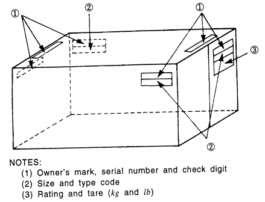
    Fig 2.1 Marking Locations

#### 504. Safety approval plate

- **1.** Each container which constructed in accordance with the approved design type and satisfactorily passed production unit inspection of the Society is to be affixed the safety approval plate for CSC Convention shown in **Fig 2.2** with the Society's inspection stamp.

  |   |
  | --- |
  | NOTES: (1) On line 1, [1] is Country of approval indicated by the distinguishing code and [2] is Approval Reference. (2) The Plate is to permanent, non-corrosive and fire proof and is to be permanently affixed to the container. (3) The word "CSC SAFETY APPROVAL" is to a minimum letter height of 8mm and other words and numbers a minimum height of 5mm. They are to be stamped into, embossed on or indicated on plate surface in any other permanent and legible way. (4) End and Side Wall Strength to be indicated on plate only if these walls are designed to withstand a force of less or greater than 0.4Pg and 0.6Pg respectively. (5) If Plate is used for the purpose of showing maintenance dates a blank space is to be reserved at the bottom. (6) One door off stacking strength to be indicated on plate only if the container is approved for one door off operation. The marking shall show: ALLOWABLE STACKING LOAD ONE DOOR OFF FOR 1.8g(...kg...lbs). This marking shall be displayed immediately near the stacking test value. (7) One door off racking strength to be indicated on plate only if the container is approved for one door off operation. The marking shall show: TRANSVERSE RACKING TEST FORCE(...newtons). This marking shall be displayed immediately near the racking test value. |
- **2.** Inspection stamp of this Society is as specified in **Fig 2.3.**
  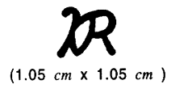
  **Fig 2.3 Inspection Stamp**

#### 505. Emblem

Each container which satisfactorily carried out production unit inspection by the Society is to be affixed the emblem of the Korean Register of Shipping shown in **Fig 2.4** at easily visible position of door in addition to the inspection stamp prescribed in **203.**

**Fig 2.4 Emblem** ***(2018)***

#### 506. Manufacturer's name plate

- **1.** Each container which satisfactorily carried out production unit inspection by the Society is to be affixed the manufacturer's name plate stamped into followings at easily visible position of door.
  - **(1)** General cargo containers and thermal containers
  - **(2)** Tank containers
- **2.** The above-mentioned markings are to be durable and in a color contrasting with that of the container. The markings are not to be altered without approval of the Society.
- **3.** At the request of container owner, supplementary notes may be added to the marking plate subject to the agreement of the Society.

### Section 6 General Cargo Containers

#### 601. Application

The requirements in this Section apply to general cargo containers of closed type and open top type.

#### 602. Materials and workmanship

- **1.** **Materials**
  - **(1)** Steel plates used in construction of containers are to have good weldability, and higher strength and low alloy steel plate is to be identified their chemical and mechanical properties by the steel maker's mill sheet, etc.
  - **(2)** Materials such as aluminium, FRP, etc. are to be complied with the specifications, and their chemical and mechanical properties are to be ascertained through the test reports, mill sheets, etc. which are issued by the manufacturer.
  - **(3)** Corner fittings are to have not only the dimensions which comply with the requirements of this chapter and ISO 1161 but the quality not lower than the grade of RSC 480-W of **Pt 2, Ch 1, 501.** of the Rules or equivalent thereto, and to be passed material test by the Society. However, the Society may consider omission of material test if the manufacturer can submit the test report which is considered proper by the Society.
  - **(4)** Where woods are used in a floor, those are to be free from defect and properly dried and preserved. Container manufacturer is to submit the details to the kinds of woods and method of preservation.
  - **(5)** Welding materials are to be of one which type approved by the Society in accordance with the requirements of **Pt 2, Ch 2, Sec 6** of the Rules for Classification of Steel Ships and to be well controlled in accordance with the manufacturer's recommendations.
  - **(6)** Caulking materials filled in the joints are to be of acceptable type by the Society.
- **2.** **Workmanship**
  - **(1)** Material processing such as bending, pressing, etc. are to be carried out by means of avoiding any defects such as crack.
  - **(2)** At the time of approval of manufacturing process, welding for type-series containers is to be carried out in accordance with the procedures approved by the Society and by the welding operators with qualified position by the Society in accordance with the requirements of **Pt 2, Ch 2, Sec 5** of the Rules for Classification of Steel Ships or processing the equivalent qualification. *(2022)*
  - **(3)** For the fabrication of main frame, total dimension of containers is to be maintained dimensional accuracy within the permissible tolerance by using suitable jigs.
  - **(4)** Floorings are to be provided without unacceptable gap or off-set of woods.

#### 603. Dimensions and ratings

- **1.** **Reference temperature for measurements**
  The dimensions and tolerances apply when measured at the temperature of 20 °C (68 °F); measurements taken at other temperatures shall be adjusted accordingly. *(2022)*
- **2.** **External dimensions and ratings**
  - **(1)** External dimensions and their permissible tolerances as well as the rating of the container or each designation are shown in **Table 2.2** and **Fig 2.5.**
  - **(2)** No part of the container is to project beyond the overall external dimensions.

    | Designation | Height (mm) H |   | Width (mm) W |   | Length (mm) L |   | K_1 (mm) Max. | K_2 (mm) Max. | Rating R (kg) |
    | --- | --- | --- | --- | --- | --- | --- | --- | --- | --- |
    | Designation | Dimension | Tolerance | Dimension | Tolerance | Dimension | Tolerance | K_1 (mm) Max. | K_2 (mm) Max. | Rating R (kg) |
    | 1EEE | 2896 | 0 -5 | 2438 | 0 -5 | 13716 | 0 -10 | 19 | 10 | 30480 |
    | 1EE | 2591 | 0 -5 | 2438 | 0 -5 | 13716 | 0 -10 | 19 | 10 | 30480 |
    | 1AAA | 2896 | 0 -5 | 2438 | 0 -5 | 12192 | 0 -10 | 19 | 10 | 30480 |
    | 1AA | 2591 | 0 -5 | 2438 | 0 -5 | 12192 | 0 -10 | 19 | 10 | 30480 |
    | 1A | 2438 | 0 -5 | 2438 | 0 -5 | 12192 | 0 -10 | 19 | 10 | 30480 |
    | 1AX | 〈2438 | 0 -5 | 2438 | 0 -5 | 12192 | 0 -10 | 19 | 10 | 30480 |
    | 1BBB | 2896 | 0 -5 | 2438 | 0 -5 | 9125 | 0 -10 | 16 | 10 | 30480 |
    | 1BB | 2591 | 0 -5 | 2438 | 0 -5 | 9125 | 0 -10 | 16 | 10 | 30480 |
    | 1B | 2438 | 0 -5 | 2438 | 0 -5 | 9125 | 0 -10 | 16 | 10 | 30480 |
    | 1BX | 〈2438 | 0 -5 | 2438 | 0 -5 | 9125 | 0 -10 | 16 | 10 | 30480 |
    | 1CCC | 2896 | 0 -5 | 2438 | 0 -5 | 6058 | 0 -6 | 13 | 10 | 30480 |
    | 1CC | 2591 | 0 -5 | 2438 | 0 -5 | 6058 | 0 -6 | 13 | 10 | 30480 |
    | 1C | 2438 | 0 -5 | 2438 | 0 -5 | 6058 | 0 -6 | 13 | 10 | 30480 |
    | 1CX | 〈2438 | 0 -5 | 2438 | 0 -5 | 6058 | 0 -6 | 13 | 10 | 30480 |
    | 1D | 2438 | 0 -5 | 2438 | 0 -5 | 2991 | 0 -6 | 10 | 10 | 10160 |
    | 1DX | ≤2438 | 0 -5 | 2438 | 0 -5 | 2991 | 0 -6 | 10 | 10 | 10160 |
    | NOTES : (1) All dimensions in table apply when measured at the temperature of 20 *℃*. Measurement taken at other temperatures is to be adjusted accordingly. (3) The values of $K _{1}$ and $K _{2}$ are given in **Fig 2.5.** |   |   |   |   |   |   |   |   |   |

    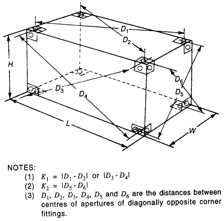
    **Fig 2.5 Dimensions and Permissible Tolerances**
- **3.** **Internal dimensions**
  - **(1)** Closed, vented containers are to comply with the requirements for minimum internal length, width and height given in **Table 2.3.** However, where a top corner fitting projects into the internal space, that part of corner fitting projecting into the container is not to be considered as reducing the size of the container.
  - **(2)** Containers having partial openings in the sides, are to comply with the requirements for minimum internal length and height given in **Table 2.3.**
  - **(3)** Containers having an opening roof, are to comply with the requirements for minimum internal length and width given in **Table 2.3.**
  - **(4)** Containers having openings in the sides and/or roof, are to comply with the requirements for minimum internal length given in **Table 2.3.**

    | Designation | Internal Height (mm) | Internal Width (mm) | Internal Length (mm) | Door Opening |   |
    | --- | --- | --- | --- | --- | --- |
    | Designation | Internal Height (mm) | Internal Width (mm) | Internal Length (mm) | Width (mm) | Height (mm) |
    | 1EEE | 2655 | 2330 | 13542 | 2286 | 2566 |
    | 1EE | 2350 | 2330 | 13542 | 2286 | 2261 |
    | 1AAA | 2655 | 2330 | 11998 | 2286 | 2566 |
    | 1AA | 2350 | 2330 | 11998 | 2286 | 2261 |
    | 1A | 2197 | 2330 | 11998 | 2286 | 2134 |
    | 1BBB | 2655 | 2330 | 8931 | 2286 | 2566 |
    | 1BB | 2350 | 2330 | 8931 | 2286 | 2261 |
    | 1B | 2197 | 2330 | 8931 | 2286 | 2134 |
    | 1CCC | 2655 | 2330 | 5867 | 2286 | 2566 |
    | 1CC | 2350 | 2330 | 5867 | 2286 | 2261 |
    | 1C | 2197 | 2330 | 5867 | 2286 | 2134 |
    | 1D | 2197 | 2330 | 2802 | 2286 | 2134 |

#### 604. Design Conditions

- **1.** **Design load**
  Containers are to be required to have ample strength to bear the load or force specified in **Table 2.4** and not to generate permanent deformation or abnormality which will render it unsuitable for use. Each structural member of the container is to be so designed as to be capable of withstanding the following conditions.
  - **(1)** **Stacking**: Superimposed mass 213,360 kg. (For 1D and 1DX, superimposed mass 50,800 kg)
    However, if it passes the approval test with designed stacking load, it may be accepted under the load conditions indicated on the safety approval plate. *(2022)*
  - **(2)** **Lifting**: vertical lifting from all four top corners, and lifting from all four bottom corners by means of suitable slings.
  - **(3)** **Transportation**: Restraint and lashing in transit under dynamic loading resulting from road or railway operations or the ship motions.
  - **(4)** **Loading and unloading**: Concentrated loading due to the cargo handling apparatus, etc. during loading and unloading operation.

    | Item | Where Applied | Direction | Notes(1) |
    | --- | --- | --- | --- |
    | Stacking | Top corner fittings Off-set : - 38 mm longitudinally - 25.4 mm laterally | Vertically downwards All containers other than 1 D/1DX containers 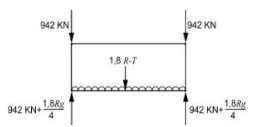 Applicable to 1EE and 1EEE containers only (a) 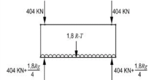 (b) 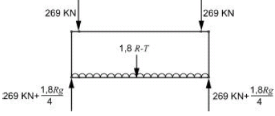 (c) 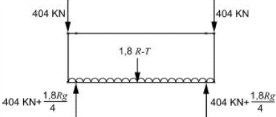 1 D/1DX Containers 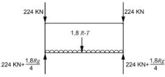 | Concentrated eccentrically applied load 3,767 kN (942 kN per top corner fitting) Stacking at 40' position and supported in 40' position(404 kN per top corner fitting) Stacking at 40' position and supported in 45' position(269 kN per top corner fitting) Stacking at 45' position and supported in 40' position(404 kN per top corner fitting) 896 kN (224 kN per top corner fitting) |
    | Top Lifting | Top corner fittings | Vertically upwards for all containers other than 1 D/1DX containers  Applicable to 1EE and 1EEE containers only 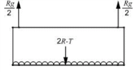 60° to the horizontal for 1 D/1DX containers  | 2 R The lifting forces shall be applied additionally from the 40' position |

    | Item | Where Applied | Direction | Notes(1) |
    | --- | --- | --- | --- |
    | Bottom Lifting | Bottom corner fittings (spacing between the line of action of the lifting force and the other face of the corner fitting is not further than 38 mm) | q : Angle to the horizontal  Applicable to 1EE and 1EEE containers only 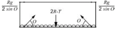 The q is to apply the requirements of the bottom lifting in **Table 2.5** in accordance with kinds and designation of containers | 2 R The lifting forces shall be applied additionally from the 40' position |
    | Floor Strength | Floor | Vertically downwards 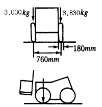 | per an axle: 7,260 kg per a wheel: 3,630 kg wheel width: 180 mm contact area per a wheel: 142 cm^2 wheel centers: 760 mm |
    | Longitudinal Restraint | Bottom corner fittings | Longitudinal  Applicable to 1EE and 1EEE containers only (a) 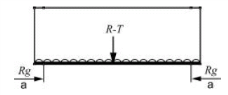 (b) 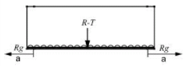 | Concentrated force 2 R (2 R/2 per one side) |
    | End Wall | End wall | Outerwards normal to the end  | 0.4 Pg |
    | Side Wall | Side Wall | Outerwards normal to the end 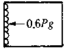 | 0.6 Pg |

    | Item | Where Applied | Direction | Notes(1) |
    | --- | --- | --- | --- |
    | Roof Panel | Roof panel (An area of 600 mm × 300 mm located at the weakest area) | Downwards normal to the roof 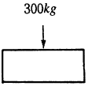 | 300 kg |
    | Transverse Racking (All containers other than 1D/1DX containers) | Top corner fittings | Transverse 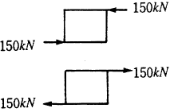 Applicable to 1EE and 1EEE containers only 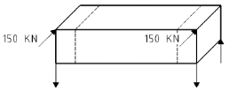 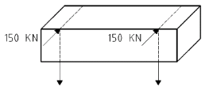 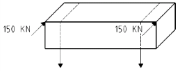 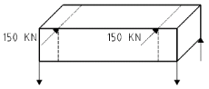 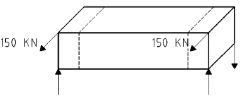 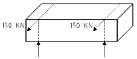 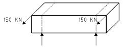 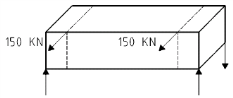 | Concentrated force 150 kN per top corner fitting (a) Pushing at 45' position and supported in 45' position (b) Pushing at 40' position and supported in 40' position (c) Pushing at 45' position and supported in 40' position (d) Pushing at 40' position and supported in 45' position (e) Pulling at 45' position and supported in 45' position (f) Pulling at 40' position and supported in 40' position (g) Pulling at 45' position and supported in 40' position (h) Pulling at 40' position and supported in 45' position |

    | Item | Where Applied | Direction | Notes(1) |
    | --- | --- | --- | --- |
    | Longitudinal Racking (All containers other than 1 D/1DX containers) | Top corner fittings | Longitudinal 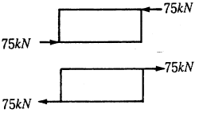 Applicable to 1EE and 1EEE containers only 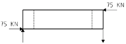 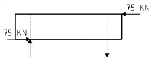 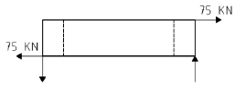 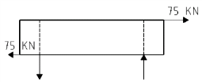 | Concentrated force 75 kN per top corner fitting (a) Compression at 45' position and supported in 45' position (b) Compression at 45' position and supported in 40' position (c) Tension at 45' position and supported in 45' position (d) Tension at 45' position and supported in 40' position |
    | Fork-lift pocket (where fork-lift pocket is fitted as 1CC, 1C, 1CX and 1 DX containers) | Fork-lift pocket (Width 200 *mm*, the part form side to 1,828 ± 3 *mm*) | Vertically upwards 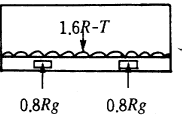 | Distributed load 0.8 R per fork-lift pocket |
    | Fork-lift pocket (where fork-lift pocket is fitted for empty as 1CC, 1C and 1CX containers) | Fork-lift pocket | Vertically upwards 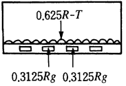 | Distributed load 0.3125 R per fork-lift pocket |
    | Grappler arm | Grappler lifting position | Vertically upwards 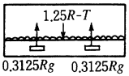 | Distributed load 1.25 R/4 per grappler lifting position |

    | Item | Where Applied | Direction | Notes(1) |
    | --- | --- | --- | --- |
    | Shoring slot(Where fitted) | Transverse of door | Transverse 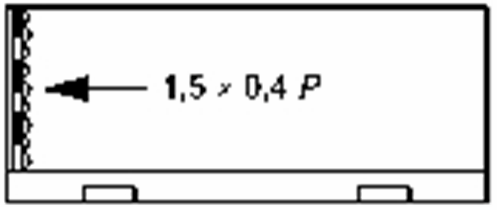 | 0.6 P |
    | NOTES : (1) If it passes the approval test with designed stacking load for transverse/longitudinal racking, it may be accepted under the load conditions indicated on the safety approval plate. |   |   |   |
- **2.** **Corner fittings**
  - **(1)** All containers shall be equipped with corner fittings at the top and bottom corner, the dimensions of which are given in **Figs 2.6** and **2.7**. 1EEE and 1EE units shall also have fittings in 40' position, as shown in **Fig 2.8**, the dimensions of which are given in **Figs 2.9** and **2.10**. However, these **Figures** indicate the top and bottom corner fittings on the left side of the front end and the right side of the rear end, and everything else should be symmetrical with them. *(2022)*
    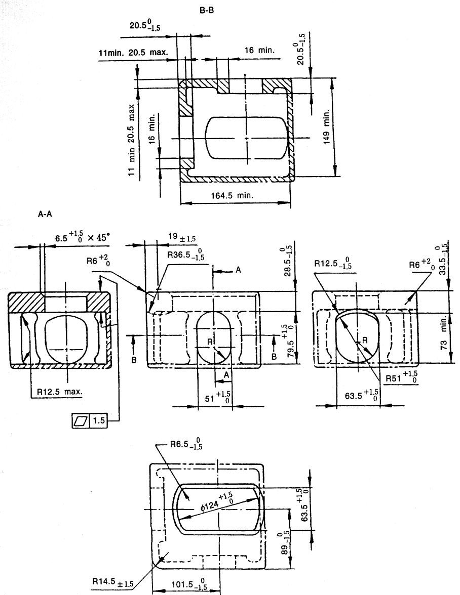
    Fig 2.6 Top Corner Fitting (Dimensions : mm)

    | 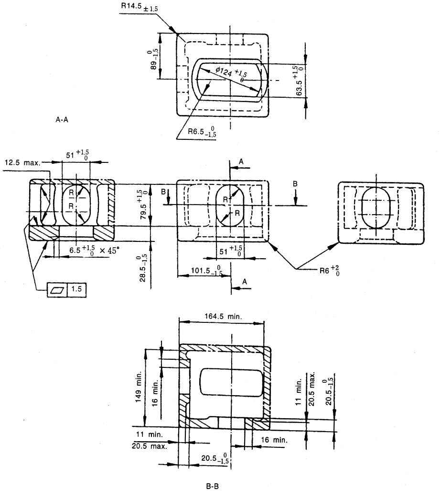 |
    | --- |
    | NOTE: (1) Solid and broken lines (― and ----) show surfaces and contours which are to be physically duplicated in the fitting. (2) Phantom lines (―--―) show optional walls, which may be used to develop a box shaped fitting. (3) Scantlings indicated by * are not to be more than the thickness of the adjacent part surrounding a hole at the side or end. (4) Notes (1) to (3) above are to also be applied to the **Fig 2.6.** |

    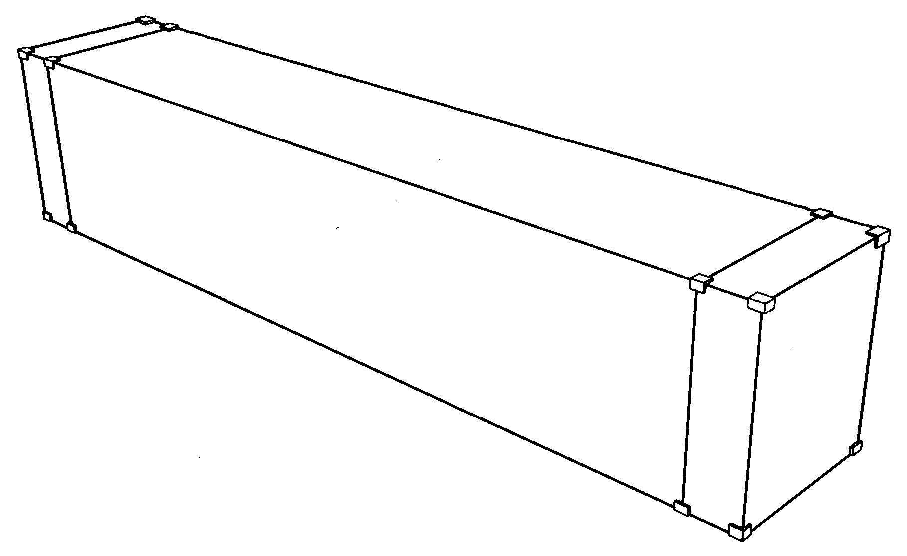
    **Fig 2.8 45 foot container with corner and intermediate fittings**
    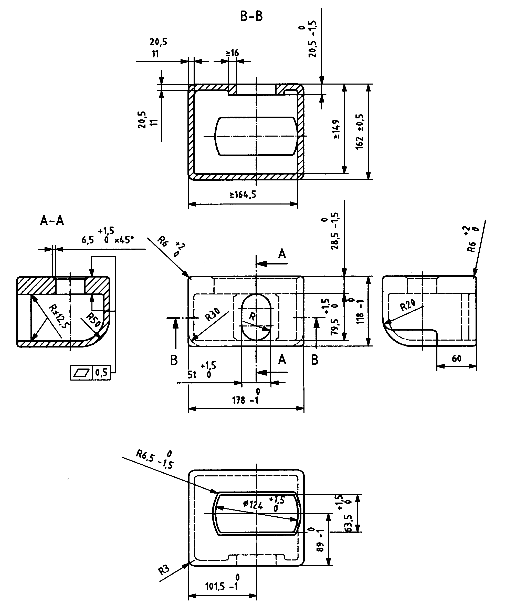
    Fig 2.9 Top intermediate fitting (Dimensions : mm)
    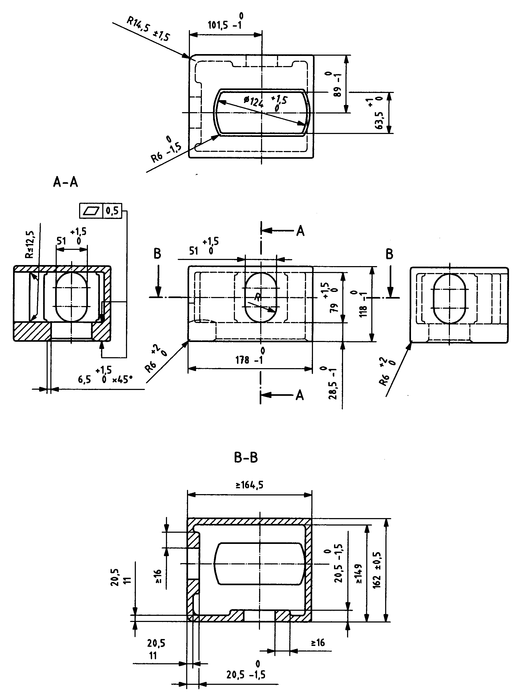
    Fig 2.10 Bottom intermediate fitting (Dimensions : mm)
  - **(2)** Where dimensions are not specified for inner and outer edges of apertures, these edges are to be given a radius of 3 mm.
  - **(3)** Where corner fitting or intermediate fitting has an optional inner side wall shown in **Figs 2.6 through 2.10** as phantom line (―--―) and is made to the minimum dimension of 149 mm, the junction of the mandatory horizontal face to the optional inner side wall may be provided with a radius not exceeding 5.5 mm. If a greater radius is required, the 149 mm dimensions are to be increased accordingly.
  - **(4)** The upper faces of the top corner fittings are to protrude above the top of the container by a minimum of 6 mm.
- **3.** **Base structure**
  - **(1)** All containers are to be capable of being supported by their bottom corner fittings only.
  - **(2)** For all containers under dynamic conditions, or the static equivalent thereof, with the container having a load uniformly distributed over the floor in such a way that the combined mass of the container and test load is equal to 1,8R, no part of the base of the container shall deflect more than 6 mm below the base plane (bottom faces of the lower corner fittings). *(2022)*
  - **(3)** All containers, other than 1 D and 1 DX, shall also be capable of being supported only by load transfer areas in their base structure. *(2022)*
    - **(A)** Consequently, these containers shall have end transverse members and sufficient intermediate load transfer areas (or a flat underside) of sufficient strength to permit vertical load transfer to or from the longitudinal member of a carrying vehicle. Such longitudinal members are assumed to lie within the two 375 mm wide zones defined by the broken lines in **Fig 2.11.**
    - **(B)** The lower faces of the load transfer areas, including those of the end transverse members, shall be in one plane located 12.5 mm above the plane of the bottom faces of the lower corner fittings of the container. Apart from the bottom corner fittings and bottom side rails, no part of the container shall project below this plane. However, doubler plates may be provided in the vicinity of the bottom corner fittings to afford protection to the understructure. Such plates shall not extend more than 550 mm from the outer end and not more than 470 mm from the side faces of the bottom corner fittings, and their lower faces shall be at least 5 mm above the lower faces of the bottom corner fittings of the container.
    - **(C)** The transfer of load between the underside of the bottom side rails and carrying vehicles is not envisaged. The transfer of load between side rails and handling equipment should only occur when provisions have been made in accordance with **7.** and **8.**.
    - **(D)** Containers having all their intermediate transverse members spaced at 1000 mm apart or less (or having a flat underside) shall be deemed to comply with the requirements laid down in (A).
    - **(E)** Requirements for containers not having transverse members spaced 1000 mm apart or less (and not having a flat underside) are given in **Annex B** of **ISO 668**.
  - **(4)** The base structure shall be designed to withstand all forces, particularly lateral forces, induced by the cargo in service. This is particularly important where provisions are made for securement of cargo to the base structure of the container. *(2022)*
    
    Fig 2.11 Load Transfer Areas in Base Structures (Dimensions : mm)
- **4.** **End structure**
  For all containers other than 1 D and 1 DX, the side way deflection of the top of container with respect to the bottom of the container at that time when it is under transverse racking force of 150 kN is not to cause the sum of the changes in length of the two diagonals in each end wall to exceed 60 mm.
- **5.** **Side structure**
  For all containers other than 1 D, the longitudinal deflection of the top of the container with respect to the bottom of the container at the time when it is under longitudinal racking force of 75 kN is not to exceed 25 mm.
- **6.** **Door openings**
  - **(1)** All door openings are to be as large as possible, minimum dimensions of door openings are given in **Table 2.3.**
  - **(2)** Doors are to be equipped with securing devices which is capable of being sealed up.
  - **(3)** All doors are to be capable of being clasped properly when opened.
- **7.** **Fork-lift pockets**
  - **(1)** Containers 1 CC, 1 C, 1 CX 1 D and 1 DX may be provided with fork-lift pocket, and fork-lift pocket may be provided on containers 1 CC, 1 C and 1 CX for empty handling only.
  - **(2)** The positions, dimensions and allowable tolerances of fork-lift pocket are to be in accordance with **Fig 2.12,** and are to pass completely through the base structure of the container.

    | 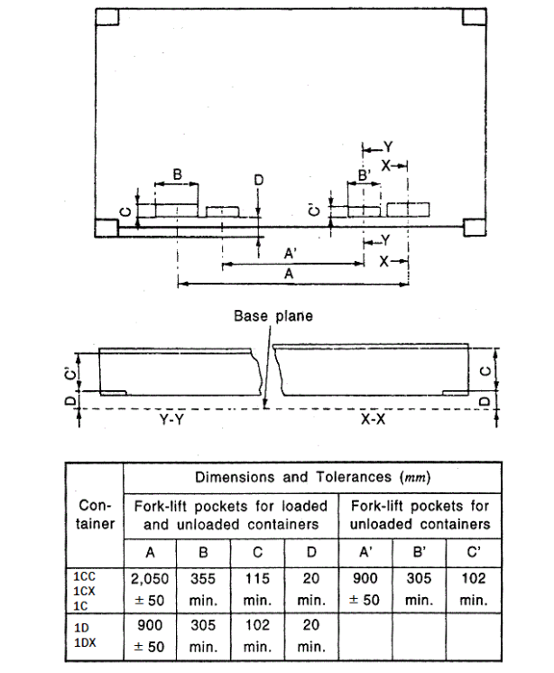 |
    | --- |
    | **Fig 2.12 Positions, Dimensions and Tolerances of Forklift Pocket** |
- **8.** **Gooseneck tunnels**
  - **(1)** Containers 1EEE, 1EE, 1AAA, 1AA 1A and 1AX may be provided gooseneck tunnels. In this case, dimensions and allowable tolerances of gooseneck tunnels are to be in accordance with **Fig 2.13.**
  - **(2)** Load transfer area is to be designed in base structure of gooseneck tunnels in accordance with **Fig 2.14.**
    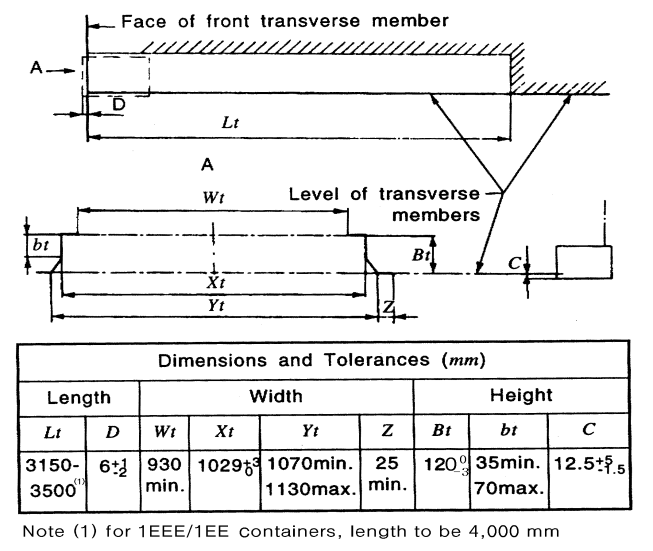
    **Fig 2.13 Positions, Dimensions, Tolerances of Gooseneck Tunnels**
    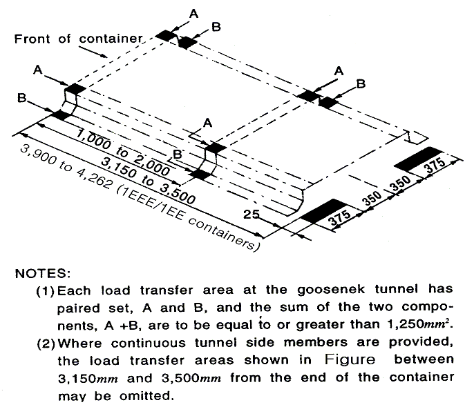
    Fig 2.14 Load Transfer Area in the Base Structure of the Gooseneck Tunnel
- **9.** **Grappler arms**
  - **(1)** Containers may be provided with the features for handling at the base by means of grappler arms or similar devices. The dimensional requirements are specified in **Fig 2.15**.
  - **(2)** Grappler arm contact area to be flat, and level with corner and lip clean and square.
  - **(3)** Where stops are provided at ends of pockets they are to be sloped as indicated in Fig.
  - **(4)** External wall of grappler arm including rivet or bolt heads is not to be more than 12 mm from the inside of the lip.
    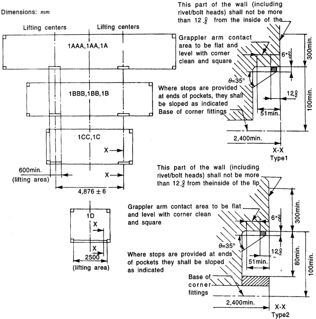
    Fig 2.15 Dimensions of Grappler Arm Lifting Areas

#### 605. Type Approval Inspection

- **1.** **General**
  - **(1)** The items of type approval test are to comply with the followings:
  - **(2)** Measuring instruments to be used for the test and inspection of the container are to be duly calibrated.
  - **(3)** Alternative test procedures to those specified in preceding (1) will be accepted if considered to be equivalent by the Society.
  - **(4)** Test procedures for specific purpose container may be properly modified and omitted.
- **2.** **Visual inspection**
  - **(1)** Visual inspection is to be carried out at a proper stage and period during production and/or after completion in order to ascertain that the constructions, materials and workmanship of the container are in compliance with the requirements of this Section without any visual defects in each component of the container.
  - **(2)** In the visual inspection, it is to be ascertained that the door can be smoothly operated and secured.
- **3.** **Dimensional inspection**
  Dimensional inspection is to be carried out after the completion of all the works in order to ascertain that the container meets the dimensional requirements of this Section
- **4.** **Mass measurement**
  Mass measurement is to be carried out after the completion of all the works in order to determine the tare mass of the container.
- **5.** **Strength tests**
  - **(1)** Strength tests are to be carried out as specified in **Table 2.5** after the completion of all the works.
  - **(2)** In the strength tests, measurements are to be taken as required in **Table 2.5.** Additional measurements may be required, where deemed necessary by the Society.
  - **(3)** During the strength tests, deformations which generated on each part of container based on their designation are not to be over the requirements specified in **604.** On completion of the tests, the container is to show neither permanent deformation nor abnormality which will render it unsuitable for use.

    | Item | Procedures and Measurements |
    | --- | --- |
    | Stacking | Procedure: Internal load: 1.8 R-T uniformly distributed over the base. (1) Applied forces: With the container in the normal position supported at the base corner fittings, compressive forces equivalent to 942 kN are to be applied to each corner post through rigidly held dummy corner fittings arranged to simulate an overstowed container base. The test is to be repeated to cover for all positions of offset namely 38 mm longitudinally and 25.4 mm laterally. (2) For 1EEE and 1EE containers, the stacking forces shall be applied vertically from the 1EEE/1EE position and separately from the 1AAA/1AA/1A position according to the requirements specified in **Table 2.4**, stacking test (a), (b) and (c). (3) For a 1D/1DX container, compressive forces equivalent to 224 kN are to be applied to each corner post.  Measurement: (1) Deflections at lowest point of both side rails and at the longitudinal centre line of the base which may be taken before the application of axial loads. (2) Deflections in two directions at midheight, or other point of maximum deflection of the corner posts, and permanent set remaining on removal of the load. |
    | Top Lifting | Procedure: Internal load : 2 R-T uniformly distributed over the base. (1) Applied forces: With the container in the normal position, lifting forces are to be applied gradually to the top corner fittings, vertically to containers other than 1D/1DX container (2) For 1EEE and 1EE containers, the lifting forces shall be applied vertically from the 1EEE/1EE position and separately from the 1AAA/1AA/1A position (3) at 30° to the vertical in the case of 1D/1DX containers. (4) The container shall be supported for 5 min. and then lowered to the ground.  Measurements: (1) While loaded and supported by the four bottom corner fittings before lifting clear, the deflection at lowest points of both side rails and at the longitudinal centre line of the base. (2) Permanent set remaining on removal of the load |

    | Item | Procedures and Measurements |
    | --- | --- |
    | Bottom Lifting | Procedure: Internal load: 2 R-T uniformly distributed over the base. (1) Applied forces: With the container in the normal position, lifting forces are to be applied gradually through the bottom corner fitting side aperatures as follows: Designation ; Angle 1EEE, 1EE 1AAA, 1AA, 1A ; 30° 1BBB, 1BB, 1B, 1BX ; 37° 1CCC, 1CC, 1C, 1CX ; 45° 1 D, 1DX ; 60° Designation Angle 1EEE, 1EE 1AAA, 1AA, 1A 30° 1BBB, 1BB, 1B, 1BX 37° 1CCC, 1CC, 1C, 1CX 45° 1 D, 1DX 60° (2) For 1EEE and 1EE containers, the lifting forces shall be applied from the 1EEE/1EE position and separately from the 1AAA/1AA/1A position (3) In each case, the line of action of the lifting force and the outer face of the corner fitting or intermediate fitting shall be no farther apart than 38mm. The container shall be supported for 5 min. and then lowered to the ground. Measurements: Same as measurements of the top lifting |
    | Designation | Angle |
    | 1EEE, 1EE 1AAA, 1AA, 1A | 30° |
    | 1BBB, 1BB, 1B, 1BX | 37° |
    | 1CCC, 1CC, 1C, 1CX | 45° |
    | 1 D, 1DX | 60° |
    | Floor Strength | Procedure: Internal load: Nil. Applied forces: With the container supported at the bottom corner fittings, a vehicle equipped with 180 mm wide types at 760 mm centres each having a contact area of 142 ㎠ loaded to an axle mass of 7,260 kg is to be maneuvered over the entire floor area.  Measurements: Deflection of the base. |
    | Longitudinal Restraint | Procedure: Internal load: R-T uniformly distributed over the base. Applied forces: With the container in the normal position, anchored by locking devices through the bottom apertures in the bottom corner fittings at one end, forces equivalent to Rg are to be applied to each side rail through the bottom apertures in the bottom corner fittings at the other end first in compression then in tension. For 1EEE and 1EE containers, the forces shall be applied from the 1AAA/1AA/1A position  Measurements: The change in length of both bottom side rails during and after the test (in each direction) |
    | End Wall | Procedure: Internal loading and application: 0.4 Pg uniformly distributed over the wall under test in such a way as to allow free deflection of the end wall.  Measurements: Deflection and permanent set at the centre and at least two other locations. |

    | Item | Procedures and Measurements |
    | --- | --- |
    | Side Wall | Procedure: Internal loading and application: 0.6 Pg uniformly distributed over the wall under test in such a way as to allow free deflection of the side wall and its top and bottom side rails. Each side is to be tested separately but only one side need to be tested when both are similar in construction.  Measurements: Deflection and permanent set at the centre of side wall and the centre of the top and bottom side rails. |
    | Roof Panel | Procedure: Internal load: Nil. Applied load: 300 kg uniformly distributed over a 600 mm × 300 mm area at the weakest section of the roof.  Measurements: Maximum deflection and permanent set of section under test. |
    | Transverse Racking | Procedure Internal load: Nil. Applied forces: The test is to be carried out to all containers other than 1D/1DX containers. With the container in the normal position anchored by locking devices through the apertures in the bottom corner fittings, transverse racking forces of 150 kN are to be applied separately or simultaneously to each top corner fitting on one side. Lateral restraint is to be taken up by the anchor devices diagonally opposite to the applied forces. The force(s) is to be applied first towards then away from the container. For 1EEE and 1EE containers, the forces shall be applied according to the requirements specified in **Table 2.4**, transverse racking test (a) through (h).  Measurements: Difference in diagonals before, during and after testing. |
    | Longitudinal Racking | Procedure: Internal load: Nil. Applied forces: The test is to be carried out to all containers other than 1D/1DX containers. With the container in the normal position anchored by locking devices through the apertures in the bottom corner fittings, longitudinal racking forces 75 kN are to be applied separately or simultaneously to each top corner fitting on one end. Longitudinal restraint is to be taken up by the anchor devices diagonally opposite to the applied forces. The force(s) is to be applied first towards then away form the container. For 1EEE and 1EE containers, the forces shall be applied according to the requirements specified in **Table 2.4**, longitudinal racking test (a) through (d).  Measurements: Longitudinal displacement of top side rails. |

    | Item | Procedures and Measurements |   |
    | --- | --- | --- |
    | Fork-lift pocket | Procedure: Internal load: 1.6 R-T (for empty container, 0.625 R-T) uniformly distributed over the base. Applied forces: The test is to be carried out to 1CC, 1C, 1CX, 1D and 1DX containers where fork-lift pocket is fitted. The container is to be supported for 5 minutes by two bars 200 mm wide inserted in the fork pockets to a depth of 1,828 ±3 mm Measurements: Undue local distortion during the test and any permanent distortion on removal of the load. |   |
    | Grappler arm | Procedure: Internal load:1.25 R-T uniformly distributed over the base. Applied forces: The test is to be carried out to containers where grappler arm is fitted. The container is to be supported for 5 minutes by pads at the four grappler arms intended to be used. Measurements: Undue local distortion during the test and any permanent distortion. |   |
    | Weathertightness | Procedure: All surfaces of the container are to a water test from a 12.5 mm nozzle, with a water pressure of 1 bar at the nozzle, second at a distance of 1.5 m from the surface under test. Observation: The interior of the container is to remain dry. |   |
    | Weathertightness | Procedure: All surfaces of the container are to a water test from a 12.5 mm nozzle, with a water pressure of 1 bar at the nozzle, second at a distance of 1.5 m from the surface under test. The weathertightness test shall always be performed after all structural test have been completed. Observation: The interior of the container is to remain dry. |   |
    | One door off Operation | Stacking | Procedure: Refer to Stacking of this Table. The loads are applied to design condition of manufacturers. Measurements: Refer to Stacking of this Table. |
    | One door off Operation | Transverse Racking | Procedure: Refer to Transverse Racking of this Table. The loads are applied to design condition of manufacturers. Measurements: Refer to Transverse Racking of this Table. |
    | NOTES : (1) The symbol P denotes the maximum payload of the container to be tested, that is: P = R – T where R is the rating; T is the tare. (2) R, P and T, by definition, are in units of mass. Where test requirements are based on the gravitational forces derived from these values, those forces, which are inertial forces, are indicated thus: Rg, Pg, Tg |   |   |
- **6.** **Weathertightness test**
  Weathertightness test is to be carried out as specified in **Table 2.5** after all strength tests have been completed or at a reasonable stage during production. On completion of the test, the container is to be free from penetration of water.

#### 606. Production Unit Inspection for Type-Series Containers

The kinds of tests and inspections for production unit inspections of type-series containers are to be in accordance with the requirements in **Ch 2, 403.** and to be carried out in accordance with the requirements of **605.** of this Section.

### Section 7 Thermal Containers

#### 701. Application

- **1.** The requirements in this Section apply to the type approval and production unit inspection of containers which are built with insulated walls, doors, floor and roof so as to retard the rate of heat transmission between inside and outside of the container. (hereinafter referred to as "thermal container")
- **2.** At the request of container owner, type approval, approval of manufacturing process and tests and inspections in respect of refrigerating units and/or heat-producing appliances intended for thermal containers may be carried out by the Society.

#### 702. Materials and workmanship

Requirements for materials and workmanship of thermal containers are as follows in addition to the requirements prescribed in **Ch 2, 602.**

#### 703. Dimensions and ratings

- **1.** **External dimensions and ratings**
  External dimensions, permissible tolerances and ratings for containers are to comply with the requirements in **Ch 2, 603. 1.**
- **2.** **Internal length**
  The minimum internal dimensions of thermal containers are specified in **Table 2.6**

  | Designation | Internal(1) Height (mm) | Internal(1) Breadth (mm) | Internal Length (mm) |
  | --- | --- | --- | --- |
  | 1AAA | 2,511 | 2,218 | 11,502 |
  | 1AA | 2,206 | 2,218 | 11,502 |
  | 1A | 2,053 | 2,218 | 11,502 |
  | 1BBB | 2,511 | 2,218 | 8,435 |
  | 1BB | 2,206 | 2,218 | 8,435 |
  | 1B | 2,053 | 2,218 | 8,435 |
  | 1CCC | 2,511 | 2,218 | 5,368 |
  | 1CC | 2,206 | 2,218 | 5,368 |
  | 1C | 2,053 | 2,218 | 5,368 |
  | 1D | 2,053 | 2,218 | 2,301 |
  | 1EEE | 2,511 | 2,218 | 13,026 |
  | 1EE | 2,206 | 2,218 | 13,026 |
  | NOTES: (1) The structure without tunnel recess adds 40 mm to internal breadth of this table. (2) Dimensions of door opening are to be as close as practicable to the internal dimensions of thermal containers. |   |   |   |

#### 704. Design conditions

- **1.** **Application**
  The design conditions to construction and capacity of thermal containers are to comply with the requirements in this Section, in addition to those of **Ch 2, 604.**
- **2.** **General**
  - **(1)** The coefficient of heat transfer (hereinafter referred to as "K") of thermal containers is to be not more than 0.4 W/m2℃.
  - **(2)** The maximum heat leakage (Umax) and inside and outside design temperatures of thermal containers are specified in **Table 2.7.**

    | Maximum heat leakage Umax (W/K) |   |   |   |   |   |   |   |   | Design temperature (℃) |   |
    | --- | --- | --- | --- | --- | --- | --- | --- | --- | --- | --- |
    | 1AAA | 1AA, 1A | 1BBB | 1BB, 1B | 1CCC | 1CC, 1C | 1D | 1EE | 1EEE | Inside | Outside |
    | 42 | 40 | 33 | 31 | 24 | 22 | 13 | 44 | 46 | +30 -30 | +50 -30 |
  - **(3)** Electrical aspects are to be in accordance with (KS T) ISO 1496-2 so far as applicable,
- **3.** **Insulating construction**
  - **(1)** The walls, doors, floors and roof of the thermal containers are to be insulated in such a manner as to balance, as far as is practicable, the heat transfer through each of them, although the roof insulation may be increased to compensate for solar radiation.
  - **(2)** The structure and the insulation of container are not to be functionally affected by cleaning methods, for example steam cleaning and detergents normally used.
- **4.** **Airtightness**
  Thermal containers are to be of airtight construction and to be complied with the requirements in **705. 3.**
- **5.** **Refrigerating appliances**
  - **(1)** Refrigerating units are to comply with following requirements and to have a sufficient capacity taking into consideration the service condition of containers.
  - **(2)** Where the containers using of cooling water to refrigerating units, the design temperature of cooling water for refrigerating units is to be 36 ℃, and the structure is to be so designed as to prevent from freezing of water.
- **6.** **Cooling water connections**
  - **(1)** For appliances requiring water connections, the in-let and outlet interface are to conform to **Fig 2.16** and **2.17** and operating and bursting pressure are to be 1 MPa and 4 MPa respectively.
    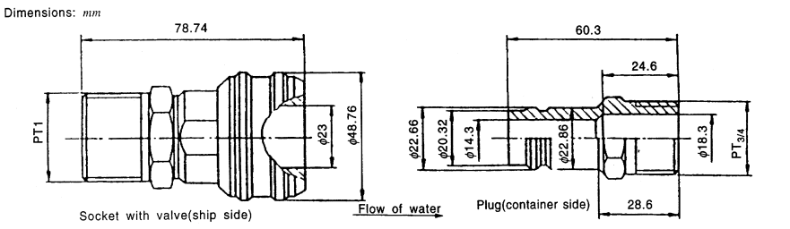
    Fig 2.16 Cooling Water Connection-Inlet Side
    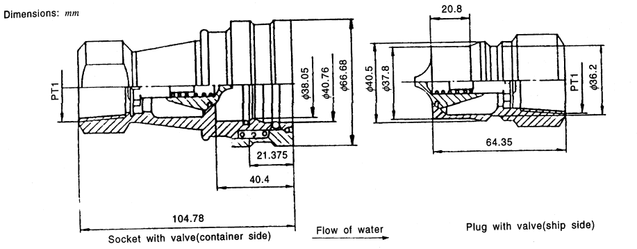
    Fig 2.17 Cooling Water Connection-Outlet Side
  - **(2)** The water inlet and outlet connections are to be located at the machinery end of the container that, to an observer facing that end, they appear in the lower right-hand quarter.
- **7.** **Air inlets and outlets**
  - **(1)** Where 1 AA, 1 CC and 1 C containers are designed for ducted air systems and for use with externally located removable equipment, the air inlet and outlet openings are to conform to the **Fig 2.18** through **Fig 2.20** respectively.
  - **(2)** Bosses are to be not less than 550 mm diameter or square for 1 AA containers and 457 mm diameter or square for 1 CC and 1 C containers.
  - **(3)** **.** Holes may have a mould draw taper but no part of the bore of the hole may have a diameter less than 350 mm in 1 AA containers and 254 mm in 1 CC and 1 C containers.
  - **(4)** Faces of bosses are to be plane to a tolerances of 0.25 mm and are to be parallel to a base plane determined by front faces of the front corner fittings and recessed 3 to 4.8 mm from this plane.
  - **(5)** Closure devices that the captive to the container are to be provided for closing off the air circulation openings when the container is not connected to a cold air supply and closure devices are to be capable of being sealed for customs requirements.
    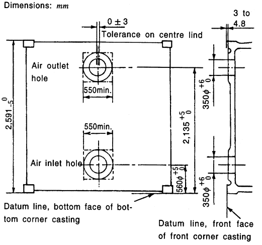
    Fig 2.18 Air apertures in end wall of 1AA thermal containers
    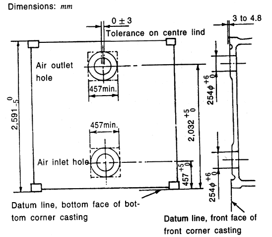
    Fig 2.19 Air apertures in end wall of ICC thermal containers
    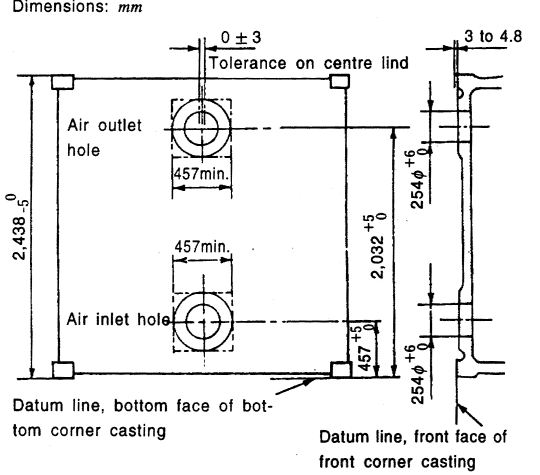
    Fig 2.20 Air apertures in end wall of 1C thermal containers
- **8.** **Sanitary structure** ***(2022)***
  - **(1)** Attention is drawn to the need for the proper choice of materials for the thermal container and any refrigeration/heating units to prevent adverse effects in cargo, especially foodstuffs.
  - **(2)** The interior surface and container structure shall be so constructed as to facilitate cleaning, and the structure and the insulation shall not be functionally affected by cleaning methods, for example steam cleaning and detergents normally used.
  - **(3)** No pockets shall exist inside the container that cannot be reached by conventional cleaning methods.
  - **(4)** If drains are fitted, provision shall be made to ensure that cleaning water can drain from the inside of the container.
- **9.** **Drain appliances**
  - **(1)** Where provision of drains is made on the floor of the container, such drains are to have a closing device operable from outside the container or arrangement to protect against intrusion of water. Further, the drains are to be so constructed as not to worsen the airtightness of the container remarkably.
  - **(2)** Where cargo space drains are required for cleaning of the interior of the container, they are to be provided with manual closures.
  - **(3)** Where operation of cargo space drains is required for the thermal containers when carrying cargo, the drains are to be protected by fittings which is automatically opened above normal internal operating pressure.
- **10.** **Arrangements for hanging cargo**
  Where on the ceiling of the thermal containers is provided the cargo hanging arrangements, the containers are to be so designed as to be capable of suspending a load of twice the maximum service load or 3,000 kg per meter of the usable container length, whichever is the greater.
- **11.** **Temperature measuring device**
  - **(1)** The suitable instruments are to be provided for measuring the internal temperature of the thermal containers, and the temperature is to be measured by automatic temperature records.
  - **(2)** Where automatic temperature indicator is used, a suitable device is to be provided for its calibration.
- **12.** **Requirements for optional features** ***(2022)***
  When the thermal containers have optional features, it is to be in accordance with 7.9 of **ISO 1496-2:2018**.

#### 705. Type Approval Inspection

- **1.** **General**
  - **(1)** The items of type approval inspection for thermal containers are to comply with the following.
  - **(2)** Requirements of tests and inspection prescribed in **Ch 2, 605.** are also applied in addition to those of this chapter.
  - **(3)** Performance tests are to be carried out after successful completion of strength tests.
  - **(4)** All instruments and devices used for performance tests are to be properly selected and periodically calibrated by the authorized calibration agencies to the precision as follows;
  - **(5)** The test procedure may be modified as appropriate to cater for special feature of the thermal container and special handling arrangements. In such cases, the general principles outlined herein are to be maintained.
- **2.** **Roof strength test**
  During the strength test, roof strength test for hanging cargo (where provided is to be carried out as follows.
  - **(1)** With the container in the normal position supported at the base corner fittings, a load of twice the service load or 3,000 kg per meter of the usable container length, whichever is the greater, is to be suspended from the roof support simulating normal service loading.
  - **(2)** Maximum deflection and permanent set of the section under test are to be measured.
  - **(3)** On completion of the test, container is to show neither permanent deformation nor abnormality which will make it unsuitable for use.
- **3.** **Airtightness test**
  - **(1)** **Procedure**
  - **(2)** **Measurements**
  - **(3)** **Requirements** ***(2022)***
- **4.** **Thermal test**
  - **(1)** **Procedure**
    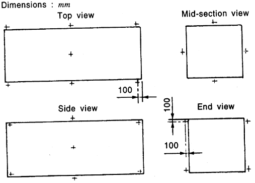
    **Fig 2.21 Outside Air Temperature Measurement Points**
    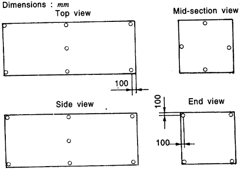
    Fig 2.22 Inside Air Temperature Measurement Points
    $U _{\theta } = \frac{Q}{\theta _{i} - \theta _{e}}$
    $U _{\theta }$ : The total heat leakage rate (W/℃)
    $Q$ : The power dissipated or absorbed by the operation of internal heaters and fans (W).
    $\theta _{i}$ : The average inside temperature of the container(℃).
    $\theta _{e}$ : The average outside temperature of the container (℃).
    - **(A)** The test is to be carried out after successful completion of airtightness test.
    - **(B)** The test is to be performed with the refrigerating unit and/or heating equipment fitted in place with all openings closed, except that, where the container is designed for use with removable equipment, the equipment is not to be in position but the closures are to be shut.
    - **(C)** The inner heating method only shall be used. This test requires the establishment of a heat balance. A heating device shall be placed inside the (insulated) body of the container and thermal equilibrium shall be established between the power of the heating device(s) and associated fan(s), and the heat flowing out through the insulation. All instruments and devices shall record automatically. The power measuring device shall be of a continuously integrating type and all instrumentation calibrated for the following accuracy. *(2022)*
      - **(a)** Temperature-measuring devices: ±0.5 ℃
      - **(b)** Power-measuring device: ±2 % of quantity measured.
    - **(D)** Test data for determining the heat leakage of the thermal container shall be taken for a continuous period of not less than 12 h, during which the following conditions shall be met. *(2022)*
      - **(a)** The test shall be performed with a mean wall temperature to be at 20 ± 0.5 °C and the difference between mean inside and mean outside temperature shall be 25 ± 2 °C.
      - **(b)** The maximum temperature difference between the warmest and the coldest inside measuring points at any one time shall be 2 °C.
      - **(c)** The maximum temperature difference between the warmest and the coldest outside measuring points at any one time shall be 2 °C.
      - **(d)** The mean outside temperature and the mean inside temperature of the container, taken over a steady state period of 12 h shall not vary by more than ±0.3 °C, and these temperatures shall not vary by more than ±1.0 °C during the preceding 6 h.
      - **(e)** The mean inside and outside temperatures at the beginning and at the end of the calculation period of at least 6 h shall not differ by more than 0.2 °C.
      - **(f)** The difference between heating power measured over two periods of not less than 3 h at the start and at the end of the steady state period, and separated by at least 6 h, shall be less than 3 %.
    - **(E)** An example of the steady-state conditions for thermal test is shown in Figure 1 of **ISO 1496-1:2018**. *(2022)*
    - **(F)** The inside and outside temperature-measuring points of containers under the test are to be given in **Fig 2.21** and **Fig 2.22.**
    - **(G)** The electric heating element(s) shall be operated at temperatures sufficiently low to minimize radiation effects. The heat from the element(s) shall be distributed by a fan or fans delivering a quantity of air sufficient to obtain 40 to 70 air changes per hour relating to the inner volume of the tested container, to ensure that the temperature distribution inside the body of the thermal container is within the limits given in (D). The fan(s) should be in the body of the container. The test shall be run with a mechanical refrigeration unit(MRU) installed. No action should be taken to prevent the movement of small quantities of air through the MRU. Such fans as the MRU can contain shall not run. *(2022)*
    - **(H)** If the test is carried out with the fan(s) of the MRU running, the test report shall draw attention to this fact. The heat leakage, U, measured - which in this case shall include the power consumption of the evaporator fan(s) - should not be expected to conform to the classification given in **Table 2.7** but may be used for calculating refrigeration capacity.
    - **(I)** Air should be circulated horizontally and in longitudinal direction over the exterior surfaces of the thermal container at a velocity between 1 m/s to 2 m/s at points approximately 100 mm from the mid-length of the side walls and the roof of the container. *(2022)*
    - **(J)** All temperature-measuring instruments placed inside and outside the container are to be protected against radiation.
    - **(K)** Sets of readings shall be recorded at intervals of not more than 15 min. *(2022)*
    - **(L)** The heat leakage is to be expressed by the total heat leakage rate, $U _{\theta }$, which is given by the following formula:
  - **(2)** **Measurements** ***(2022)***
    The calculation of the heat leakage rate shall be based on the measured data taken during the last 6 h of the steady state period, using following Formula.
    $U= \frac{1}{n} \sum _{1} ^{n} U _{\theta }$ (sets of reading: n ≥ 25)
    Since the test described in this clause can be carried out under conditions different from those at which the unit can operate and since the refrigeration and/or heating equipment will not be running during the test, care should be taken when using the value of U obtained from this test to calculate performance under service conditions. Taking into account the measurement errors, values of U are expected to have a variance of ±4 %.
  - **(3)** **Requirements**
    The heat leakage, U, obtained from (2) is to be not more than the value prescribed in **704. 2.**
- **5.** **Performance test of refrigerating unit**
  - **(1)** **Procedure**
    Heating Capacity = 0.25 $U _{\theta } ( \theta _{e} - \theta _{i} )$
  - **(2)** **Measurements**
  - **(3)** **Requirement**
    It is to be confirmed that the average inside temperature of the container is to be maintained at the specified temperature during the test.
- **6.** **Test under refrigeration by a mechanical refrigeration unit (MRU)** ***(2022)***
  If a mechanical refrigeration unit(MRU) is installed in thermal container, relevant requirements are to be in accordance with 8 of **ISO1496-2:2018**.

#### 706. Production Unit Inspection for Type-Series Containers

The kinds of tests and inspections for production unit inspection of type-series container are as specified in **Ch 2, 403.** and to be carried out in accordance with the requirements of **705.** and **Ch 2, 605.**

### Section 8 Tank Containers

#### 801. Application

- **1.** The requirements in this chapter apply to the type approval test and production unit inspection of tank containers for the carriage of liquids and gases with a maximum allowable working pressure of 0.3 bar (30 kPa, 50 ℃) gauge or above.
- **2.** Tank containers to be used for the carriage of dangerous goods are to be applied by this Rule, in addition to the requirements of the relevant Government regulations and IMDG Code (international maritime dangerous goods code) etc.
- **3.** Tank and its associated fittings are to be suitably designed, manufactured and tested in accordance with the requirements of this chapter, in addition to the requirements of regulations deemed necessary by the Society.

#### 802. Materials and Workmanship

Materials and construction used in the tank containers are to be applied by following requirements, in addition to the requirements of **Ch 2, 602.**

#### 803. Dimensions and Ratings

- **1.** External dimensions, permissible tolerances and ratings for tank containers are to comply with the requirements prescribed in **Ch 2, 603. 2.** However, internal dimensions are not to be applied.
- **2.** No part of the tank container and its associated fittings or equipment are to project beyond the overall external dimensions.

#### 804. Design Conditions

- **1.** **Design load**
  - **(1)** The tank container is to be capable of withstanding the loads and loadings specified in **Table 2.8,** when loads or loadings are removed, container is not to show permanent deformation or abnormality which will make it unsuitable for use.
  - **(2)** Each tank container shall be designed to withstand the effects of inertia of the tank contents resulting from transport motions. For design purposes, the effects may be taken to be equivalent to loadings of 2 Rg longitudinally, Rg laterally and 2 Rg vertically.
- **2.** **Framework**
  - **(1)** Corner fittings of tank containers are to be applied in accordance with the requirements in **Ch 2, 604. 2.** In particular, the upper faces of top corner fittings are to protrude above the top of all other components of tank container by a minimum of 6 mm.
  - **(2)** Base structure of tank container is to be in accordance with the requirements in **Ch 2, 604. 3.** and gooseneck tunnel of tank container is to be in accordance with the requirements in **Ch 2, 604. 8.** When the tank container is loaded to R, no part of the tank and its associated shell fittings are to project below a plane 25 mm above the bottom faces of the lower corner fittings.
  - **(3)** End structure of tank container is to be in accordance with the requirements in **Ch 2, 604. 4.**
  - **(4)** Side structure of tank container is to be in accordance with the requirements in **Ch 2, 604. 5.**
- **3.** **Optional features for framework**
  - **(1)** In principal, fork-lift pocket is not to be provided in tank containers. However, where fork-lift pocket is required by the Owner is to be at the discretion of the Society.
  - **(2)** Where tank containers are provided with the features for handling tank containers by means of grappler arms or similar devices is to be in accordance with the requirements in **Ch 2, 604. 9.**
  - **(3)** Where provided, walkways are to be designed to withstand a loading of 3 kN uniformly distributed over an any area of 600 mm × 300 mm.
    Longitudinal walkways shall have a minimum width of 400 mm.
  - **(4)** Where provided, ladders are to be designed to with stand a load of 200 kg on any rung.

    | Item | Where Applied | Direction | Notes |
    | --- | --- | --- | --- |
    | Stacking | Top corner fittings Off-set: ―38 mm longitudinally ―25.4 mm laterally | 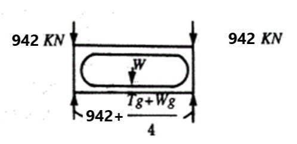Other than 1 D and 1 DX containers 1 D and 1 DX containers | 3767 kN (942 kN per top corner fitting) 896 kN (224 kN per top corner fitting) |
    | Top Lifting | As specified in **Ch 6, Table 6.3** |   |   |
    | Bottom Lifting | As specified in **Ch 6, Table 6.3** |   |   |
    | Longitudinal Restraint | As specified in **Ch 6, Table 6.3** |   |   |
    | Transverse Racking | As specified in **Ch 6, Table 6.3** |   |   |
    | Longitudinal Racking | As specified in **Ch 6, Table 6.3** |   |   |
    | Grappler lift (where fitted) | As specified in **Ch 6, Table 6.3** |   |   |
    | Internal restraint (longitudinal) dynamic | All |  | 0.97W |
    | Lateral Inertia | Side of barrel wall | Outerwards normal to the side  | Uniformly distributed load 1.0 P |
    | Internal Pressure | Tank or fluid-tight compartment |  | Minimum 1.5 times of Concentrated eccentrically applied load design pressure |
    | Walkway | Walkway (An area of 600 mm × 300 mm Located at the weakest area) | Vertically upwards  | 300 kg |
    | Ladder | 2 Point on any rung in both end of ladder | Vertically upwards  | 200 kg |
- **4.** **Tank structure**
  - **(1)** Each tank or tanks are to be firmly secured to structural elements of the tank framework. The tank or tanks are to be capable of being filled and emptied without removal from the framework.
  - **(2)** Tanks or tank compartments without vacuum relief devices are to be designed to withstand an external pressure of at least 0.4 bar (39.2 kPa) above the internal pressure. However, tanks equipped with vacuum relief valves are to be designed to withstand an external over-pressure of 0.21 bar (20.6 kPa) or greater.
  - **(3)** An allowance for corrosion shall be taken into consideration where necessary. *(2022)*
  - **(4)** All tank openings except pressure relief devices are to be provided with adequate closures of capable of being sealed up to prevent accidental escape of the contents, and closure devices are to be capable of being sealed for customs requirements.
  - **(5)** Tank nozzles and outlet fittings are to be substantially made and attached to the tank in such a manner as to minimize the risk of breakage. Protective covers or housings are to be employed as necessary. Wherever possible, hinged device should be fitted so that they open away from the likely vicinity of any personnel. *(2022)*
  - **(6)** All tank openings located below the normal liquid level of the contents and fitted with a valve capable of being operated manually are to be provided with an additional means of closure on the outlet side of valve. Such additional means of closure may be a fluid-tight cap, bolted blank flange or other suitable protection against accidental escape of the contents.
  - **(7)** All valves, whether fitted internally or externally, are to be located as close to the tank shell as practicable.
  - **(8)** Stop valves with screwed spindles are to be closed by clockwise motion of the hand-wheel.
  - **(9)** All tank connections, such as nozzles, outlet fittings and stop valves, are to be clearly marked to indicated their appropriate functions.
- **5.** **Pressure and vacuum relief devices** ***(2022)***
  - **(1)** Each tank or compartment thereof intended to carry non-dangerous cargo is to be fitted with a pressure relief device set to be fully open at a pressure not greater than the tank's test pressure. Such devices are to be connected to the vapour space of the tank and located as near to the top of the tank and as near to the tank's or tank compartment's mid-length as practicable where inspection can be readily conducted.
  - **(2)** Above mentioned pressure relief devices are to have a minimum relief capacity of 0.05 ㎥/sec at standard air [1 bar (100 kPa) 15 ℃] to prevent excessive internal overpressure under non-emergency conditions. This may be considered as providing overpressure protection under non-emergency conditions, but should not be considered as adequate protection for a tank container, or compartment thereof, against excessive overpressure under full fire exposure conditions, dry bulk dust explosion or higher dry bulk pressurization. *(2022)*
  - **(3)** Tanks, or a compartment thereof, intended for the carriage of dangerous goods are to be provided with pressure relief devices meeting the relevant regulations to the satisfaction of the competent authority and international convention.
  - **(4)** Tank container will be utilized for both dangerous and non-dangerous cargo, the relief devices are to be set in accordance with (3).
  - **(5)** Each pressure relief device is to be plainly and permanently marked with the pressure at which it is set to operate.
  - **(6)** A tank container, or a compartment thereof, with external design pressure of less than 0.4 bar (40 kPa) is to be equipped with a vacuum relief device set to relieve at 0.79 bar (79 kPa) absolute, except that a lower absolute setting may be utilized provided that the external design pressure is not exceeded. The vacuum relief device is to have a minimum through area of 284 mm^2. The use of combination pressure/vacuum relief devices is allowed. *(2022)*
- **6.** **Inspection and maintenance openings** ***(2022)***
  - **(1)** Tank containers shall be provided with openings to allow for complete internal inspection. The openings shall be fitted with pressure tight closures.
  - **(2)** The size of openings shall be a minimum of 500 mm in diameter and shall be determined by the need for personnel and machines to enter the tank to inspect, maintain or repair the inside.
- **7.** **Gauging devices** ***(2022)***
  Gauging devices which can be in direct communication with the contents of the tank shall be made of a material that is compatible with the tank and its contents.
- **8.** **Optional features for tank**
  - **(1)** For the optional features for tank, relevant requirements are to be in accordance with 5.7 of **ISO1496-3:2019**. *(2022)*
  - **(2)** Adequate provision shall be made for the sealing of the tank in accordance with international customs agreements.

#### 805. Type Approval Inspection

- **1.** **General**
  - **(1)** The test items of type approval test for the tank containers are to comply with the followings.
  - **(2)** The tests and inspections procedures are to be in accordance with the requirements **Ch 2, 605.** unless otherwise prescribed in this chapter.
  - **(3)** The test procedure may be modified and omitted as appropriate to cater for special features of tank containers.
  - **(4)** Where electrical equipment is fitted on the tank container, the installation is to be inspected and found satisfactory in accordance with the requirements of standards acceptable by the Society.
- **2.** **Visual inspection**
  For insulated tank containers, the visual inspection is to be conducted prior to commencement of the insulating work.
- **3.** **Strength tests**
  - **(1)** Strength tests are to be carried out as specified in **Table 2.9** after completion of all the work. However internal restraint (longitudinal) dynamic test(dynamic longitudinal impact test) is to carried out as specified in **4.**
  - **(2)** In the strength tests measurements are to be taken as required in **Table 2.9.** Additional measurements may be required, where deemed necessary by the Society.
  - **(3)** The required loadings in each test are to be applied in such a manner as to allow free deflection of the container section under test.
  - **(4)** The tank container is to be loaded with a suitable fluid to the material to achieve the test load or loading specified. And, when the load at a suitable fluid or dry bulk less than specified internal load, a supplementary load distributed over the length of tank is to be added to the container.
  - **(5)** Upon completion of the longitudinal or lateral inertia test the tank itself and the tank-to-frame work connection are not to show crack or deformation.
  - **(6)** Upon completion of the test, the container is to show neither permanent deformation nor abnormality which will make it unsuitable for use.
- **4.** **Internal restraint (longitudinal) dynamic tests (dynamic longitudinal impact test)**
  - **(1)** **Test container**
    Ensure the tank container under test (hereafter referred to as container-under-test) is representative of the tank container design for which conformity confirmation is being sought (design type). Permitted design variations:
  - **(2)** **Test platform**
    The test platform shall be

    | Tests | Procedures and Measurements |
    | --- | --- |
    | Stacking | Procedure: As specified in **Ch 2, 605,** **Table 2.5.** However, internal loading need not provided during test. Measurements: As specified in **Ch 2, 605,** **Table 2.5.** |
    | ․ Top/Bottom Lifting ․ Longitudinal Restraint ․ Transverse Racking ․ Longitudinal Racking ․ Grappler Arm | As specified in **Ch 2, 605,** **Table 2.5.** |
    | Internal restraint (longitudinal) dynamic | As specified in **Ch 2, 805. 4.** |
    | Lateral Inertia | Procedure: Internal load and application: With *R-T* internal load, the container is to be positioned with its transverse axis vertical and supported by its four bottom corner fittings. The container is to be supported for 5 minutes. Measurements: Diagonal dimension at end section of framework and deflection of tank wall at lower part. |
    | Walkway | Procedure: Internal load: Nil. Applied loads: A concentrated load of not less than 300 kg shall be uniformly distributed over an area of 600 mm × 300 mm located at the weakest area of the walkway. Measurements: Maximum deflection and permanent set of the walkway under test. |
    | Ladder (where provided) | Procedure: Internal load: Nil. Applied loads: A load of 200 kg shall be positioned at the center 50 mm of the widest rung. Measurements: Maximum deflection and permanent set of the ladder under test. |
    | Pressure | Procedure: The Pressure test is to be carried out after all strength test have been completed. The tank container together with its associated pipework and fittings is to be hydrostatically tested to a test pressure not less than 1.5 times the maximum allowable working pressure or design pressure. The test pressure is to be measured at the top of the tank in its normal position and is to be maintained to enable a complete examination of tank. The test pressure to be maintained for not less than 30 minutes. Relief devices, where fitted, are to be rendered in operative or removed. For test procedures other than the above, special consideration may be given by the Society. |
  - **(3)** **Impact creation**
    - **(A)** The impact may be created by:
      - **(a)** the test platform striking a stationary mass, or
      - **(b)** the test platform being struck by a moving mass.
    - **(B)** When the stationary mass consists of two or more railway vehicles connected together, each railway vehicle shall be equipped with cushioning devices. Free play between the vehicles shall be eliminated and the brakes on each of the railway vehicles shall be applied.
  - **(4)** **Measuring/recording system**
    - **(A)** Unless otherwise specified within this International Standard, the measuring system shall comply with **KS R ISO 6487**.
    - **(B)** The following equipment shall be available for the test:
      - **(a)** Two accelerometers with a minimum amplitude range of 200g, a maximum lower frequency limit of 1 Hz and a minimum upper frequency limit of 3,000 Hz. Each accelerometer shall be rigidly attached to the outer end or side face of the two adjacent bottom corner fittings closest to the impact source, and aligned so as to measure the acceleration in the longitudinal axis. The preferred method is to attach each accelerometer to a flat mounting plate by means of bolting and to bond the mounting plates to the corner fittings.
      - **(b)** A method of measuring the impact velocity.
      - **(c)** An analogue-to-digital data acquisition system capable of recording the shock disturbance as an acceleration versus time history at a minimum sampling frequency of 1000. Aliasing shall not exceed 1 %, which can require the incorporation of an anti-aliasing filter into the data acquisition system. *(2022)*
      - **(d)** A method of permanently storing in electronic format the acceleration versus time histories so that they can be subsequently retrieved and analysed.
  - **(5)** **Procedure**
    
    Fig 2.23 Minimum SRS Curve (5 % Damping)
  - **(6)** **Analysis/processing of data**
    Analysis and processing of the acceleration time history data obtained from test specified in (5) above shall be in accordance with **ISO 1496-3:2019**, Annex B. *(2022)*
  - **(7)** **Requirements**
    On completion of the test, the tank container shall not show leakage or permanent deformation or abnormality that will render it unsuitable for use, and the dimensional requirements affecting handling, securing and interchange shall be satisfied.
- **5.** **Pressure test**
  - **(1)** The pressure test is to be carried out as specified in **Table 2.9** after all strength tests have been completed.
  - **(2)** Upon completion of the test, the container is to show no leakage, no permanent deformation or abnormality which will render it unsuitable for use.

#### 806. Production Unit Inspection for Type-Series Containers

- **1.** The kinds of tests and inspections for production unit of type-series containers, are as specified in **Ch 2, 403.** and to be carried out in accordance with the requirements in **805.** and **Ch 2, 605.** unless otherwise specified herewith.
- **2.** For insulated tank containers, the visual inspection is to be conducted prior to commencement of the insulating work.
- **3.** For production line containers, the pressure test is to be carried out at a reasonable stage during production. In the case of insulated tank containers, the pressure test is to be carried out prior to commencement of the insulating work. 
