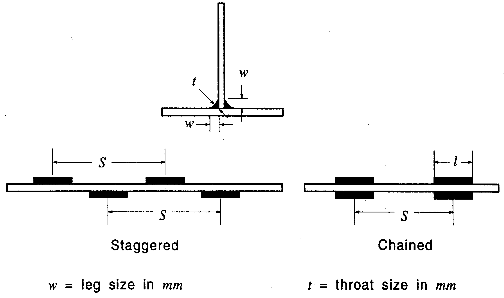

# Guidance for Single Point Mooring

> OTHER RULES AND GUIDANCE / GC-04-E / 2025 / EN / Guidance

## CHAPTER 2 MATERIALS AND WELDING

### Section 1 Materials

#### 101. General

- **1.** These requirements are intended for single point moorings (hereinafter reffered to as "SPM") to be constructed of materials manufactured and tested in accordance with the requirements of these Chapter and where applicable, **Pt 2** of "Rules for classification of Steel ships."
- **2.** Where it is intended to use materials of different process, manufacture or of different properties, the use of such materials will be specially considered.

#### 102. Structure

- **1.** Materials used in the construction of the SPM buoy structure are to comply with **Pt 2** of "Rules for classification of Steel ships."
- **2.** Critical load carrying components in the mooring load path, such as hawser connection padeyes, are to be considered as primary application structure.
- **3.** Materials used in the construction of the tower mooring structure are to be in accordance with **Pt 2** of "Rules for classification of Steel ships." The use of other commercial material specifications for SPM applications will be specially considered.

#### 103. Mooring system

- **1.** Materials used in the construction of anchors, anchor legs, associated hardware, etc. are to comply with one of the following when applicable:
  - **(1)** **Pt 2** of "Rules for Classification of Steel ships."
  - **(2)** National Standard or the Standard internationally recognized considered as equivalent by the Society (API Specifications 9A and RP 9B, ASME Boiler and Pressure Vessel Code).
- **2.** Where synthetic materials are used material specifications are to be submitted for review.

#### 104. Cargo or product transfer systems

- **1.** Materials used in the construction of cargo or product transfer systems are to comply with appropriate material specifications as may be approved in connection with the application of usage.
- **2.** The material specifications of previous **1**. are to comply with National Standard or the Standard internationally recognized considered as equivalent by the Society and are to specify a suitable range of established values for tensile strength, yield strength and ductility at design temperature.
- **3.** Materials used in cargo or product transfer systems that will be exposed to hydrogen sulfide are to be selected within appropriate limits of chemical composition heat treatment and hardness to resist sulfide stress cracking. Material selection is to comply with the requirements of NACE MR 01 75/ ISO 15156.
- **4.** Material selection is to consider the possibility of chloride stress cracking if chlorides are present in the cargo or product fluid.
- **5.** Refer to **Ch 4, 104. 4** for further requirements regarding underbuoy hoses/flexible risers and floating hoses.

#### 105. Bearings

Materials used in the construction of bearings and bearing retainers are to comply with appropriate material specifications as may be approved in connection with a particular design. The material specifications are to comply with recognized standards and are to specify a suitable range of required material properties. Materials need not be tested in the presence of the Surveyor. In general they may be accepted on the basis of a review of mill certificates by the Surveyor.

### Section 2 Welding and Fabrication

#### 201. General

- **1.** **Welding**
  - **(1)** Welding in SPM hull or buoy construction of the mooring system is to comply with the requirement of this section.
  - **(2)** It is recommended that appropriate permanent markings be applied to the side shell of welded SPM buoys or hulls to indicate the location of bulkheads for reference.
  - **(3)** In all instances, welding procedures and filler metals are to produce sound welds having strength and toughness comparable to the base material.
  - **(4)** Welding of tubular and/or bracing members which may be used in tower mooring is to comply with **Pt 2** of "Rules for classification of Steel ships."
- **2.** **Plans and specification**
  - **(1)** The plans submitted are to clearly indicate the proposed extent of welding to be used in the principal parts of the structure.
    The welding process, filler metal and joint design are to be shown on the detail drawings or in separate specifications submitted for approval.
  - **(2)** The builders are to prepare and file with the Surveyor a planned procedure to be followed in the erection and welding of the important structural members.
- **3.** **Workmanship and supervision**
  - **(1)** The Surveyor is to satisfy himself that all welders and welding operators to be employed in the construction of SPMs to be classed are properly qualified and are experienced in the work proposed.
  - **(2)** Inspection of welds employing methods outlined in **203. 9.** is to be carried out to the satisfaction of the Surveyor.
- **4.** **Welding procedures**
  - **(1)** General
    Welding procedure qualification test is to comply with **Pt 2, Ch 2, Sec 4** of "Rules for Classification of Steel ships."
  - **(2)** Weld Metal Toughness-Criteria for steels for hull **Pt 2, Ch 2.** of "Rules for Classification of Steel ships."
  - **(3)** Weld Metal Toughness -Criteria for Other Steels
    Weld metal is to exhibit Charpy V-notch toughness values at least equivalent to transverse base metal requirements.

#### 202. Preparation for welding

- **1.** **Edge preparation and fitting**
  - **(1)** The edge preparation is to be accurate and uniform and the parts to be welded are to be fitted in accordance with the approved joint detail. All means adopted for correcting improper fitting are to be to the satisfaction of the attending Surveyor.
  - **(2)** The Surveyor may accept a welding procedure for build up of each edge that does not exceed one half the thickness of the member or 12.5 mm, whichever is the lesser.
  - **(3)** Where plates to be joined differ in thickness and have an offset on either side of more than 3 mm, a suitable transition taper is to be provided. For butts in bottom shell, strength deck plating and other joints which may be subject to comparatively high stresses, the transition taper length is to be not less than three times the offset. The transition may be formed by tapering the thicker member or by specifying a weld joint design which will provide the required transition.
- **2.** **Alignment**
  Means are to be provided for maintaining the parts to be welded in correct position and alignment during the welding operation. In general, strong backs, or other appliances used for this purpose are to be so arranged as to allow for expansion and contraction during production welding. The removal of such items is to be carried out to the satisfaction of the Surveyor.
- **3.** **Cleanliness**
  - **(1)** All surfaces to be welded are to be free from moisture, grease, loose mill scale, excessive rust or shop primer coatings of ordinary thicknesses, thin coatings of linseed oil, or equivalent coatings may be used provided it is demonstrated that their use has no adverse effect in the production of satisfactory welds.
  - **(2)** Slag and scale are to be removed not only from the edges to be welded but also from each pass or layer before the deposition of subsequent passes or layers. Weld joins prepared by arc-air gouging may require additional preparation by grinding or chipping and wire brushing prior to welding to minimize the possibility of excessive carbon on the scarfed surfaces. However, these cleanliness requirements is of prime importance in the welding of higher strength steels especially those which are quenched and temperd.
- **4.** **Tack welds**
  - **(1)** Tack welds of consistent good quality, made with the same grade of filler metal as intended for production welding and deposited in such a manner as not to interfere with the completion of the final weld, need not be removed provided they are found upon examination to be thoroughly clean and free from cracks or other defects.
  - **(2)** Preheat may be necessary prior to tack welding when the materials to be joined are highly restrained. Special consideration is to be given to use the same preheat as specified in the welding procedure when tack welding higher-strength steels, particularly those materials which are quenched and tempered. These same precautions are to be followed when making any permanent welded markings.
- **5.** **Run-on and run-off tabs**
  When used run-on and run-off tabs are to be fitted to minimize the possibility of high-stress concentrations and base-metal and weld-metal cracking.
- **6.** **Stud welding**
  The use of stud welding for structural attachments is subject to special approval and may require special procedure tests appropriate to each application.

#### 203. Production welding

- **1.** **Environment**
  Proper precautions are to be taken to insure that all welding is done under conditions where the welding site is protected against the deleterious effects of moisture, wind and severe cold.
- **2.** **Sequence**
  Welding is to be planned to progress symmetrically so that shrinkage on both sides of the structure will be equalized. The ends of frames and stiffeners should be left unattached to the plating at the subassembly stage until connecting welds are made in the intersecting systems of plating, framing and stiffeners at the erection stage.
- **3.** **Preheat**
  - **(1)** The use of preheat and interpass temperature control are to be considered when welding higher-strength steels, materials of thick cross-section or materials subject to high restraint. When welding is performed under high humidity conditions or when the surface temperature of steel is below 0 ℃, the control of interpass temperature is to be specially considered
  - **(2)** The control of interpass temperature is to be specially considered when welding quenched and tempered higher-strength steels.
  - **(3)** When preheat is used the preheat and interpass temperatures are to be in accordance with the accepted welding procedure.
- **4.** **Low-hydrogen electrodes or welding processes**
  - **(1)** Welding of ordinary and higher strength steel
    The use of low-hydrogen electrodes or welding processes is recommended for welding all higher-strength steel and may also be considered for ordinary-strength steel weldment subject to high restraint. When using low-hydrogen electrodes or processes, proper precautions are to be taken to ensure that the electrodes, fluxes and gases used for welding are clean and dry.
  - **(2)** Welding of quenched and tempered steels
    Unless approved otherwise, matching strength low-hydrogen electrodes or welding processes arc to be used for welding quenched and tempered steels and overmatching should be generally avoided. When welding quenched and tempered steels to other steels, the weld filler metal selection is. to be based on the lower strength. base material being joined and low-hydrogen practice being comparable to that for the higher strength material. In all cases, filler metal strength is to be no less than that of the lowest strength member of the joint unless approved otherwise.
- **5.** **Back gouging**
  - **(1)** Chipping, grinding, arc-air gouging or other suitable methods are to be employed at the root or underside of the weld to obtain sound metal before applying subsequent beads for all full-penetration welds.
  - **(2)** When arc-air gouging is employed, a selected technique is to be used so that carbon buildup and burning of the weld or base metals minimized. Quenched and tempered steels are not to be flame gouged.
- **6.** **Peening**
  The use of peening is not recommended for single-pass weld and the root or cover passes on multipass welds. Peening, when used to correct distortion or to reduce residual stresses, is to be effected immediately after depositing and cleaning each weld pass.
- **7.** **Fairing**
  Fairing for correcting distortion in fabrication of main strength members and other plating which may be subject to high stresses is to be carried out only with the express approval of the Surveyor.
- **8.** **Visual inspection**
  The welds are to be regular and uniform with a minimum amount of reinforcement and reasonably free from undercut and overlap. Welds and adjacent base metal are to be free from injurious defects such as arc strikes etc.
- **9.** **Non-destructive inspection of welds**
  - **(1)** Inspection of welded joints in important locations is to be carried out by an approved non-destructive test.
  - **(2)** **Annex 2-9** *"Giudance for Radiographic and Ultrasonic inspection of Hull Welds"* of **Pt 2** "Guidances relating to rules for classification of steel ships" or an approved equivalent standard is to be used in evaluating radiographs and ultrasonic indications.
  - **(3)** Radiographic or ultrasonic inspection, or both, is to be used when the overall soundness of the weld cross section is to be evaluated. Magnetic-particle or dye-penetrant inspection or other approved methods are to be used when investigating the outer surface of welds or maybe used as a check of intermediate weld passes such as root passes and also to check back-gouged joints prior to depositing subsequent passes.
  - **(4)** Surface inspection of important fillet joints, using an approved magnetic particle or dye penetrant method is to be conducted.
  - **(5)** Extra high-strength steels, (minimum yield strength, 415-690 $N/mm ^{2}$) may be susceptible to delayed cracking. When welding these materials, the final NDT is to be delayed sufficiently to permit detection of such defects. Weld run-on or run-off tabs may be used where practical and be sectioned for examination.
- **10.** **Repair welding**
  - **(1)** Defective welds and other injurious defect, as determined by visual inspection; non-destructive test methods, or leakage are to be excavated in way of the defects to sound metal and corrected by rewelding using a suitable repair welding procedure to be consistent with the material being welded.
  - **(2)** Removal by grinding of minor surface imperfections such as scars, tack welds and arc strikes may be curried out where permitted by the attending Surveyor.
  - **(3)** Special precautions, such as the use of preheat interpass temperature control, and low-hydrogen electrodes, are to be considered when repairing welds in all higher strength steel, ordinary strength steel of thick cross section, or steel subject to high restraint.
  - **(4)** In all cases, preheat and interpass temperature control are to be sufficient to maintain dry surfaces.

### Section 3 Weld Design

#### 301. Fillet welds

- **1.** **General**
  - **(1)** Plans and specifications
    The actual sizes of fillet welds are to be indicated on detail drawings or on a separate welding schedule and submitted for approval in each individual case.
  - **(2)** Workmanship
    Completed welds are to be to the satisfaction of the attending Surveyor. The gaps between the faying surfaces of members being joined should be kept to a minimum. Where the opening between members being joined exceeds 2 $mm$ and is not greater than 5 $mm$*,* the welding size is to be increased by the amount of the opening. Where the opening between members is greater than 5 $mm$*,* corrective procedures are to be specially approved by the Surveyor.
  - **(3)** Special precautions
    Special precaution such as the use of preheat or low-hydrogen electrodes may be required where small fillet are used to attach heavy plates or sections. When heavy sections are attached to relatively light plating, the weld size may be required to be modified.
- **2.** **Fillet welds**
  - **(1)** Size of fillet welds
    Fillet welds are generally to be formed by continuous or intermittent fillet welds on each side, as required by **Table 2.l** The leg size, w, of fillet welds is obtained from the following equations.
    $w=t _{pl} C s/l+2.0 mm$
    $w _{\min} =0.3 t _{pl}$ or $4.5 mm$ ($4.0 mm$ Where **5.** is applicable), whichever is greater.
    where,
    $l$ = the actual length of weld fillet, clear of crater, in $mm$
    $s$ = the distance between successive weld fillets, from center to center, in $mm$
    $s/l$ = 1.0 for continuous fillet welding
    $t _{pl}$ = thickness of the thinner of the two members being joined in $mm$
    $C$ = weld factors given in **Table 2.1**
    In selecting the leg size and spacing of matched fillet welds, the leg size for the intermittent welds is to be taken as not greater than the designed leg size $w$ or $0.7 t _{pl} +2.0 mm$, whichever is less.
    The throat size, t, is to be not less than 0.70 $w$.
    For the weld size for $t _{pl}$ of 6.5 $mm$ or less, see (6)
  - **(2)** Length and arrangement of fillet
    Where an intermittent weld is permitted by **Table 2.1,** the length of each fillet weld is to be not less than 75 $mm$ for tpl of 7 $mm$ or more, nor less than 65 $mm$ for lesser $t _{pl}$ of 7 $mm$*.* The unwelded length is to be not more than 32 $t _{pl}$.
  - **(3)** Intermittent welding at intersection
    Where beams, stiffeners, frames, etc., are intermittently welded and pass through slotted girders, shelves or stringers, there is to be a pair of matched intermittent welds on each side of each such intersection, and the beams, stiffeners and frames are to be efficiently attached to the girders, shelves and stringers.
  - **(4)** Welding of longitudinal to plating
    Welding of longitudinals to plating is to have double continuous welds at the ends and in way of transverses equal in length to depth of the longitudinal.
    For deck longitudinals only, a matched pair of welds is required at the transverses.
  - **(5)** Stiffeners and webs to hatch covers
    Unbracketed stiffeners and webs of hatch covers are to be welded continuously to the plating and to the face plate for a length at ends equal to the end depth of the member.
  - **(6)** Thin plating
    For plating of 6.5 $mm$ or less, the requirement of (1) may be modified as follows:
    $w=t _{pl} C s/l+2.0(1.25-l/s) mm$
    $w _{\min} =3.5 mm$
    The use of above equations for plating. in excess of 6.5 $mm$ may be specially considered depending upon the location and quality control procedure of shipyards.
- **3.** **Fillet welds of end connections**
  Fillet welds of end connections where fillet welds are used are to have continuous welds on each side. In general, the leg sizes of the welds are to be in accordance with **Table 2.1** for unbracketed end attachment, but in special cases where heavy members are attached to relatively light plating, the sizes may be modified.
- **4.** **Ends of unbracketed stiffeners**
  Unbracketed stiffeners of shell, watertight and oiltight bulkheads are to have double continuous welds for one-tenth of their length at each end. Unbracketed stiffeners of nontight structural bulkheads, deckhouse sides and after ends are to have a pair of matched intermittent welds at each end.
- **5.** **Reduced weld size**
  Reduction in fillet weld sizes except for slab longitudinals of thickness greater than 25 $mm$ may be specially approved by the Surveyor in accordance with either (1) or (2) provided the requirements of previous **2.** are satisfied
  - **(1)** Controlled gaps
    Where quality control facilitates working to a gap between members being attached of 1 $mm$ or less, a reduction in fillet weld leg size $w$ of 0.5 $mm$ may be permitted.
  - **(2)** Deep penetration weld
    Where automatic double continuous fillet welding is used and quality control facilitates working to a gap between members being attached of 1 $mm$ or less, a reduction in fillet weld leg size $w$ of 1.5 $mm$ may be permitted provided that the penetration at the root is at least 1.5 $mm$ into the members being attached.
- **6.** **Lapped joints**
  Lapped joint are generally to have overlaps of not less width than twice the thinner plate thickness plus 25 $mm$*.*
  - **(1)** Overlapped end connections
    Overlapped end connections of main strength members are to have continuous fillet welds on both edges each equal in size *w* to the thickness of the thinner of the two plates joined. All other overlapped end connections are to have continuous welds on each edge of sizes *w* such that the sum of the two is not less than 1.5 times of the thickness of the thinner plate.
- **7.** **Plug weld or slot welds**
  Plug weld or slot. welds may be specially approved for particular applications. Where used in the body of double and similar locations, such welds may be spaced about 300 $mm$ between centers in both directions.
- **8.** **Weld in tubular joints**
  The weld design of joint of intersecting tubular members which are used in fixed structure in a tower mooring is to be in accordance with the **Pt 2** of "Rules for Fixed Offshore Structures." 

  ****

  | Periphery | Factor *C* | Welding method |
  | --- | --- | --- |
  | 1. Periphery connection (1) Tight joints. (A) Main bulkhead to deck bottom or inner bottom (B) All other tight joints (a) watertight bulkhead ($t _{pl}$ < 12.5 $mm$) - one side - other side (b) all other joints (2) Non-tight joints (A) Platform decks (B) Swash bulkheads in deep tanks (C) Non-tight bulkheads other than item b. | 0.42 0.58 0.12 0.35 0.28 0.20 0.15 | Double continuous Continuous Double continuous Double continuous |
  | 2. Bottom floors. (1) To shell (2) To inner bottom (3) To main girders (4) To side shell and sulkheads (5) Open sloor bracket (A) to center girder (B) to margin plate | 0.20 0.20 0.30 0.35 0.15 0.30 | Double continuous Double continuous Double continuous Double continuous Double continuous |
  | 3. Bottom girder (1) Center girder | 0.25 |   |
  | 4. Web frames, stringers, deck girder and deck transverses (1) To plating (A) in tanks (B) elsewhere (2) To face plates (A) face area 〈 64.5 $cm ^{2}$ (B) face area 〉64.5 $cm ^{2}$ (3) End attachment (A) unbracketed (see note 1) (B) bracketed | 0.20 0.15 0.12 0.15 0.55 0.40 | Double continuous Double continuous |

  | Periphery | Factor *C* | Welding method |
  | --- | --- | --- |
  | 5. Frams, beams and stiffeners (1) To shell (2) To plating elsewhere (3) End attachment (A) unbracketed (see nete 1) (B) bracketed | 0.25 0.12 0.45 0.35 | Double continuous Double continuous Double continuous |
  | 6. Hatch covers (1) Oiltight joints (2) Watertight joints (A) outside (B) inside (3) Stiffeners and webs to plating and to face plate (see note 2) (4) Stiffeners and web to side plating or other stiffeners (A) unbracketed (see note 1) (B) bracket | 0.40 0.40 0.15 0.12 0.45 0.35 | Double continuous continuous Double continuous Double continuous |
  | 7. Hatch coamings and ventilators. (1) To deck (A) at hatch corner (B) elsewhere (2) Coaming stays (A) to deck (B) to coaming | 0.45 0.25 0.20 0.15 | Double continuous Double continuous Double continuous Double continuous |
  | 8. Foundations (1) Major equipment and auxiliaries | 0.40 | Double continuous |
  | Notes 1. The weld size is to be determined from the thickness of the member being attached. 2. Unbracketed stiffeners and webs of hatch covers are to be welded continuously to the plating and to the face plate for a length at ends equal to the end depth of the member. 3. With longitudinal framing the weld size is to be increased to give an equivalent weld area to that obtained Without cutouts for longitudinal. |   |   |
