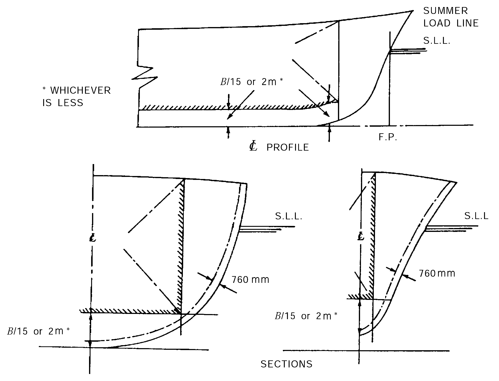
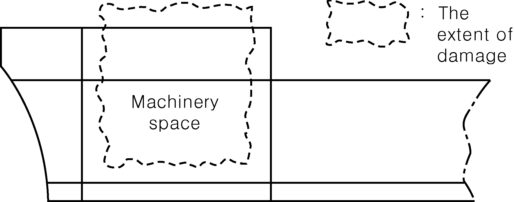
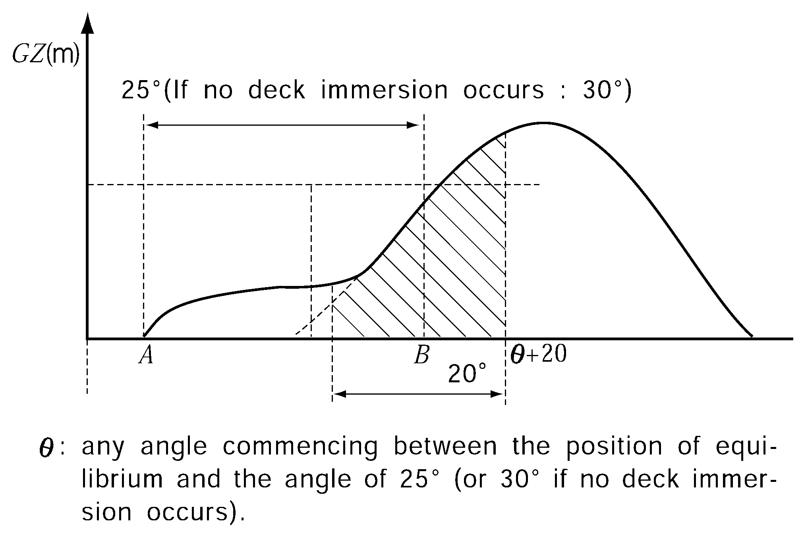
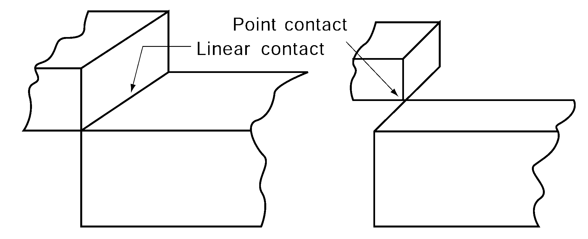
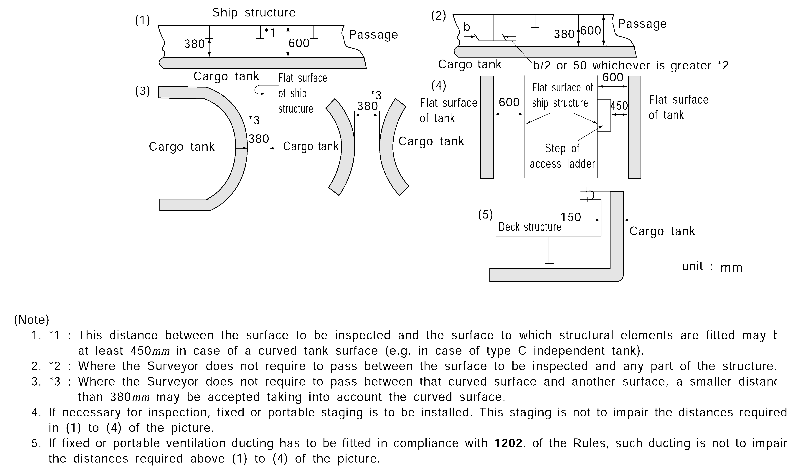
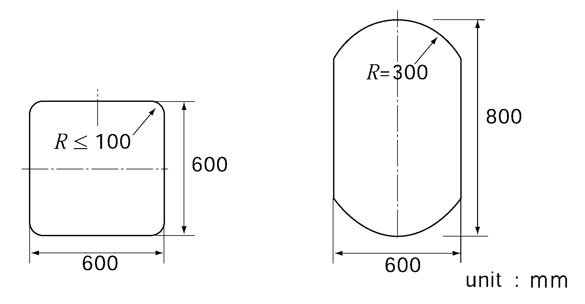
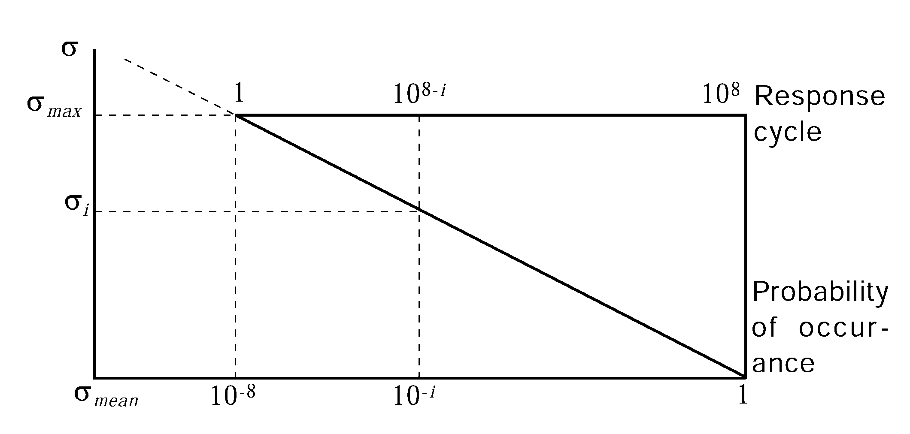
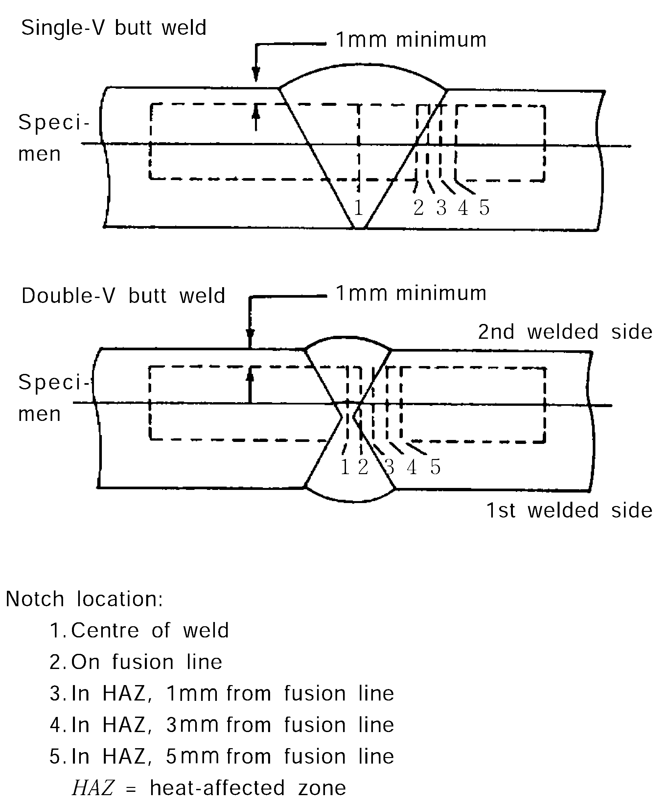

# Guidance for Ships Carrying CNG In Bulk

> OTHER RULES AND GUIDANCE / GC-05-E / 2025 / EN / Guidance

## CHAPTER 3 STRUCTURES AND EQUIPMENTS

### Section 1 General

#### 101. Application

- **1.** This requirements in this Chapter apply to the ships carrying CNG in bulk intended to be registered and classed with the Society.
- **2.** The requirements not specified in this Section are to be in accordance with the regulations in the **Ch. 1 Sec. 1.**

#### 102. Plan and Documents

For a ship requiring classification survey during construction, plans and documents(triplicate for approval and 1 copy for reference), specified below para. **1** and **2**, are to be submitted and approved before the work is commenced.

- **1.** **Plans and documents for approval**
  - **(1)** Manufacturing specifications for cargo tanks and insulations(including welding procedures, inspection and testing procedures for weld and cargo tanks, properties of insulation materials and their processing manual and working standards)
  - **(2)** Details of cargo tank construction
  - **(3)** Arrangement of cargo tank accessories
  - **(4)** Details of cargo tank supports, deck portions through which cargo tanks penetrate, and their sealing devices, if any
  - **(5)** Location of void spaces and accesses to dangerous zones
  - **(6)** Air locks between safe and dangerous zones
  - **(7)** Ventilation duct arrangement in gas-dangerous spaces and adjacent zones
  - **(8)** Details of anti-floating and anti-lifting devices and means of protection of hull structure in case of jet leak.
  - **(9)** Specifications and standards of materials (including insulations) used for cargo piping system in connection with design pressure and/or temperature
  - **(10)** Specifications and standards of materials of cargo tanks, insulations and cargo tank supports
  - **(11)** Layout and details of attachment for insulations
  - **(12)** Details and installation of the safety valves
  - **(13)** Construction details of components of cargo handling systems, including material specification
  - **(14)** Constructions of main parts of refrigeration systems
  - **(15)** Piping diagrams of cargo and instrument including loading and unloading systems, venting systems and gas-freeing systems, as well as a schematic diagram of the remote controlled valve system
  - **(16)** Piping diagrams of refrigerant for refrigeration systems (if applicable)
  - **(17)** Bilge and ballast system in cargo area
  - **(18)** Ventilation system in cargo area
  - **(19)** Details and installation of the various monitoring and control systems, including the devices for measuring the level of the cargoes in the tanks (if applicable) and the temperatures/pressure in the containment system
  - **(20)** Diagram of gas-detection system
  - **(21)** Emergency shutdown system
  - **(22)** Diagrams of inert gas lines and details of pressure adjusting devices for hold spaces
  - **(23)** Sectional assembly, details of nozzles, fitting arrangement and details of fittings for various pressure vessels
  - **(24)** Details of valves for special purpose, cargo hoses, expansion joints, filters, etc., for cargo piping system
  - **(25)** Piping diagram, constructions and particulars of utilization units, where cargo is used as fuel.
  - **(26)** Electric wiring plans and a table of electrical equipment in dangerous spaces
  - **(27)** Arrangement of earth connections for cargo tanks, pipe lines, machinery, equipment, etc.
  - **(28)** Plans showing dangerous spaces
  - **(29)** Fire extinguishing system stipulated in **Sec 11.**
  - **(30)** Blow down system, if any
  - **(31)** Hull structure heating system, if any
  - **(32)** Document for Formal Safety Assessment, if applicable
  - **(33)** The documents stating the alternative means of inspection for cargo tank from inside(if there is no access for inspection of each cargo tank from inside due to the design)
- **2.** **Plans and Documents for reference**
  - **(1)** Principal basic design and technical reports of cargo containment systems
  - **(2)** Data of test method and its result, where model test is carried out in compliance with the requirements of **Sec 4.**
  - **(3)** Data for notch toughness, corrosiveness, physical and mechanical properties of materials and welded parts at the minimum design temperature and room temperature, where new materials or welding methods are adopted for constructing the cargo tanks, insulations and others
  - **(4)** Data of design loads stipulated in **403.**
  - **(5)** Calculation sheets of cargo tanks and supports stipulated in **404.** to **406.**
  - **(6)** Data of the test method and the results, where model tests were carried out to demonstrate the strength and performance of cargo tanks, insulations, cargo tank supports
  - **(7)** Calculation sheets of heat transfer on the main parts of cargo tank under various condition of loading, where considered necessary by the Society.
  - **(8)** Calculation sheets of the thermal stress on the main parts of cargo tank at the condition of the temperature distribution stipulated in (7), where considered necessary by the Society
  - **(9)** Stress analysis of the cargo tanks, including fatigue analysis and crack propagation analysis for cargo tanks.
  - **(10)** Calculation of the thermal insulation suitability and refrigeration plant capability, if any, cooling down and temperature gradients during loading and unloading operations
  - **(11)** Calculation sheets of temperature distribution on hull structure, where considered necessary by the Society
  - **(12)** Specifications of cargo handling systems
  - **(13)** Composition and characteristics of natural gas to be carried (including maximum pressure, minimum and maximum temperature, a saturated vapour pressure diagram within the necessary temperature range, corrosivity and other important design conditions)
  - **(14)** Calculation sheets of relieving capacity for pressure relief valves of cargo tank (including calculation of the back pressure in cargo vent system)
  - **(15)** Cargo piping arrangement
  - **(16)** Calculation sheets of filling limits for cargo tanks
  - **(17)** Arrangement of access manholes stipulated in **305.** in cargo tank area and the guide for access through these manholes.
  - **(18)** Operation manual stipulated in **Sec 16.**
  - **(19)** Calculation for ship survival capability stipulated in **Sec 2.**

#### 103. Safety Goal and Formal Safety Assessment

Where a new concept design other than these guidance for all or partial system is adopted, a quantified formal safety assessment complying with the principles in IMO Res. MSC/Circ. 1023 is to be carried and the relevant data are to be submitted in order to document that the safety level is equivalent or better than these guidance. It is the responsibility of the designer and/or the owner to define the applicable risk acceptance criteria.

#### 104. Other Requirements

- **1.** Ships carrying CNG in bulk of 20.000 DWT and above are to be provided with emergency towing arrangements complied with the requirements in SOLAS Regulation II-1/3.4.
- **2.** Ships carrying CNG in bulk of 10.000 GT and above are to be provided with steering gear arrangements complied with the requirements in **Pt 5, Ch 7, Sec 6** of the Rules.

#### 105. Hazards

Hazards considered in this Guidance are fire, corrosivity, low temperature and pressure.

#### 106. Definitions

The definitions of terms are to be as specified in the following and **Sec 4**, unless otherwise specified elsewhere.

- **1.** **"Accommodation spaces"** are those spaces used for public spaces, corridors, lavatories, cabins, offices, hospitals, cinemas, games and hobbies rooms, barber shops, pantries containing no cooking appliances and similar spaces. Public spaces are those portions of the accommodation which are used for halls, dining rooms, lounges and similar permanently enclosed spaces.
- **2.** **"A class divisions"** are those divisions formed by bulkheads and decks which comply with the following criteria:
  - **(1)** they are constructed of steel or other equivalent material;
  - **(2)** they are suitably stiffened;
  - **(3)** they are insulated with approved non-combustible materials such that the average temperature of the unexposed side will not rise more than 140 ℃ above the original temperature, nor will the temperature, at any one point, including any joint, rise more than 180 ℃ above the original temperature, within the time listed below:
    class "A-60" 60 min
    class "A-30" 30 min
    class "A-15" 15 min
    class "A-0" 0 min
  - **(4)** they are constructed as to be capable of preventing the passage of smoke and flame to the end of the one-hour standard fire test; and
  - **(5)** the Society has required a test of a prototype bulkhead or deck in accordance with the Fire Test Procedures Code to ensure that it meets the requirements above for integrity and temperature rise.
- **3.** **"Administration"** means the Government of the State whose flag the ship is entitled to fly.
- **4.** **"Port Administration"** means the appropriate authority of the country in the Port of which the ship is loading or unloading.
- **5.** **"Blow Down"**is depressurizing or disposal of a pressurized cargo inventory from a cargo tank, process vessels, cargo and process piping in a controlled manner via the vent system.
- **6.** **"Boiling point"** is the temperature at which a product exhibits a vapour pressure equal to the atmospheric pressure.
- **7.** **"Breadth (**$B$**)"** means the maximum breadth of the ship, measured amidships to the moulded line of the frame in a ship with a metal shell and to the outer surface of the hull in a ship with a shell of any other material. The breadth ($B$) is to be measured in meters.
- **8.** **"Cargo area"** is that part of the ship which contains the cargo containment system, cargo handling system room and turret space, and includes deck areas over the full length and breadth of the part of the ship over the above-mentioned spaces. Where fitted, the cofferdams, ballast or void spaces at the after end of the aftermost hold space or at the forward end of the forwardmost hold space are excluded from the cargo area.
- **9.** **"Cargo containment system"** is the arrangement for containment of cargo including, where fitted, associated insulation and any intervening spaces, and adjacent structure if necessary for the support of these elements.
- **10.** **"Cargo control room"** is a space used in the control of cargo handling operations and complying with the requirements of **304.**
- **11.** **"Cargoes"** are compressed natural gas carried by ships subject to this guidance.
- **12.** **"Cargo service spaces"** are spaces within the cargo area used for workshops, lockers and store-rooms of more than 2 $\mathrm{m} ^{2}$ in area, used for cargo handling equipment.
- **13.** **"Cargo tank"** is a tank in accordance with **402. 1.**
- **14.** **"Cargo piping"** is the piping between the cargo tank first stop valve and the cargo loading/unloading valve.
- **15.** **"Cargo loading/unloading valve"** is the valve isolating the cargo piping from external piping.
- **16.** **"Cargo hold vent pipes" are** low pressure piping for venting of cargo hold spaces to vent mast.
- **17.** **"Cargo vent piping" is** the piping from the cargo relief valve to the vent mast.
- **18.** **"Cofferdam"** is the isolating space between two adjacent steel bulkheads or decks. This space may be a void space or a ballast space.
- **19.** **"Control stations"** are those spaces in which ships" radio or main navigating equipment or the emergency source of power is located or where the fire-recording or fire-control equipment is centralized. This does not include special fire-control equipment which can be most practically located in the cargo area.
- **20.** **"Ships carrying CNG in bulk"** is a ship constructed or adapted and used for the carriage in bulk of compressed natural gas.
- **21.** **"Design temperature"** is the temperature in accordance with **402. 4.**
- **22.** **"Design pressure"** is the pressure in accordance with **402. 2.**
- **23.** **“Maximium Allowable Operating Pressure(MAOP)”** is the pressure in accordance with **402. 3.**
- **24.** **"Flammability limits"** are the conditions defining the state of fuel-oxidant mixture at which application of an adequately strong external ignition source is only just capable of producing flammability in a given test apparatus.
- **25.** **"Gas-dangerous space or zone"** is:
  - **(1)** a space in the cargo area which is not arranged or equipped in an approved manner to ensure that its atmosphere is at all times maintained in a gas-safe condition;
  - **(2)** an enclosed space outside the cargo area through which any piping containing cargo passes, or within which such piping terminates, unless approved arrangements are installed to prevent any escape of cargo into the atmosphere of that space;
  - **(3)** a cargo containment system and cargo piping;
  - **(4)** a hold space;
  - **(5)** a space separated from a hold space by a single gastight steel boundary;
  - **(6)** a cargo handling system room;
  - **(7)** a zone on the open deck, or semi-enclosed space on the open deck, within 3 m of any cargo tank outlet, gas outlet, cargo pipe flange or cargo valve or of entrances and ventilation openings to cargo handling system room;
  - **(8)** the open deck over the cargo area and 3 m forward and aft of the cargo area on the open deck with no limit on height;
  - **(9)** the outer surface of a cargo containment system with no limit on height where such surface is exposed to the weather;
  - **(10)** an enclosed or semi-enclosed space in which pipes containing cargo are located;
  - **(11)** a compartment for cargo hoses; or
  - **(12)** an enclosed or semi-enclosed space having a direct opening into any gas-dangerous space or zone.
- **26.** **"Gas-safe space"** is a space other than a gas-dangerous space.
- **27.** **"Hold space"** is the space enclosed by the ship's structure in which a cargo containment system is situated.
- **28.** **"Hold space cover"** is the enclosure of hold space above main deck protecting cargo tanks and providing controlled environmental conditions within hold space and is gastight.
- **29.** **"Independent"** means that a piping or venting system, for example, is in no way connected to another system and there are no provisions available for the potential connection to other systems.
- **30.** **"Insulation space"** is the space occupied wholly or in part by insulation.
- **31.** **"Length (**$L$**)"** means 96 % of the total length on a waterline at 85 % of the least moulded depth measured from the top of the keel, or the length from the foreside of the stem to the axis of the rudder stock on that waterline, if that be greater. In ships designed with a rake of keel, the waterline on which this length is measured should be parallel to the designed waterline. The length ($L$) should be measured in meters.
- **32.** **"Machinery spaces of category A"** are those spaces and trunks to such spaces which contain:
  - **(1)** internal combustion machinery used for main propulsion; or
  - **(2)** internal combustion machinery used for purposes other than main propulsion where such machinery has in the aggregate a total power output of not less than 375 $\mathrm{kW}$; or
  - **(3)** any oil-fired boiler or oil fuel unit.
- **33.** **"Machinery spaces"** are all machinery spaces of category A and all other spaces containing propelling machinery, boilers, oil fuel units, steam and internal combustion engines, generators and major electrical machinery, oil filling stations, refrigerating, stabilizing, ventilation and air-conditioning machinery, and similar spaces; and trunks to such spaces.
- **34.** **"MARVS"** is the maximum allowable relief valve setting of a cargo tank.
- **35.** **"Oil fuel unit"** is the equipment used for the preparation of oil fuel for delivery to an oil-fired boiler, or equipment used for the preparation for delivery of heated oil to an internal combustion engine, and includes any oil pressure pumps, filters and heaters dealing with oil at a pressure of more than 0.18 $\mathrm{MPa}$ gauge.
- **36.** **"Organization"** is the International Maritime Organization (IMO).
- **37.** **"Permeability"** of a space means the ratio of the volume within that space which is assumed to be occupied by water to the total volume of that space.
- **38.** **"Process pressure vessel"** means a pressure vessel that is used in a cargo heating/cooling system, cargo processing/cleaning system or other system that processes cargo onboard.
- **39.** **"Recognized standards"** are applicable international or national standards acceptable to the Society.
- **40.** **"Relative density"** is the ratio of the mass of a volume of a product to the mass of an equal volume of fresh water.
- **41.** **"Separate"** means that a cargo piping system or cargo vent system, for example, is not connected to another cargo piping or cargo vent system. This separation may be achieved by the use of design or operational methods. Operational methods are not to be used within a cargo tank and are to consist of one of the following types:
  - **(1)** removing spool pieces or valves and blanking the pipe ends;
  - **(2)** arrangement of two spectacle flanges in series with provisions for detecting leak age into the pipe between the two spectacle flanges.
- **42.** **"Service spaces"** are those spaces used for galleys, pantries containing cooking appliances, lockers, mail and specie rooms, store-rooms, workshops other than those forming part of the machinery spaces and similar spaces and trunks to such spaces.
- **43.** **"SOLAS"** means the International Convention for the Safety of Life at Sea, 1974, as amended.
- **44.** **"Vapour pressure"** is the equilibrium pressure of the saturated vapour above the liquid expressed in MPa absolute at a specified temperature.
- **45.** **"Void space"** is an enclosed space in the cargo area external to a cargo containment system, other than a hold space, ballast space, fuel oil tank, cargo handling system room, or any space in normal use by personnel.

### Section 2 Ship Survival Capability and Location of Cargo Tanks

#### 201. General

Ships subject to this Guidance are to survive the normal effects of flooding following assumed hull damage caused by some external force. In addition, to safeguard the ship and the environment, the cargo tanks are to be protected from penetration in the case of minor damage to the ship resulting, for example, from contact with a jetty or tug, and given a measure of protection from damage in the case of collision or stranding, by locating them at specified minimum distances inboard from the ship's shell plating.

#### 202. Freeboard and intact stability

- **1.** Ships subject to this Guidance may be assigned the minimum freeboard permitted by the International Convention on Load Lines in force. However, the draught associated with the assignment is not to be greater than the maximum draught otherwise permitted by this Guidance.
- **2.** The stability of the ship in all seagoing conditions and during loading and unloading cargo is to be to a standard which is acceptable to the Society.
- **3.** When calculating the effect of free surfaces of consumable liquids for loading conditions it is to be assumed that, for each type of liquid, at least one transverse pair or a single centre tank has a free surface and the tank or combination of tanks to be taken into account is to be those where the effect of free surfaces is the greatest. The free surface effect in undamaged compartments is to be calculated by a method acceptable to the Society.
- **4.** Solid ballast are not normally be used in double bottom spaces in the cargo area. Where, however, because of stability considerations, the fitting of solid ballast in such spaces becomes unavoidable, then its disposition is to be governed by the need to ensure that the impact loads resulting from bottom damage are not directly transmitted to the cargo tank structure.
- **5.** The master of the ship is to be supplied with a Loading and Stability Information booklet. This booklet is to contain details of typical service conditions, loading, unloading and ballasting operations, provisions for evaluating other conditions of loading and a summary of the ship’'s survival capabilities. In addition, the booklet is to contain sufficient information to enable the master to load and operate the ship in a safe and seaworthy manner.

#### 203. Shipside discharges below the freeboard deck

- **1.** The provision and control of valves fitted to discharges led through the shell from spaces below the freeboard deck or from within the superstructures and deckhouses on the freeboard deck fitted with weathertight doors are to comply with the requirements of the relevant regulation of the International Convention on Load Lines in force, except that the choice of valves are to be limited to:
  - **(1)** one automatic non-return valve with a positive means of closing from above the freeboard deck; or
  - **(2)** where the vertical distance from the summer load waterline to the inboard end of the discharge pipe exceeds 0.01 $L$, two automatic non-return valves without positive means of closing, provided that the inboard valve is always accessible for examination under service conditions.
- **2.** For the purpose of this Section "summer load waterline" and "freeboard deck", have the meanings defined in the International Convention on Load Lines in force.
- **3.** The automatic non-return valves referred to in **Par 1** (1) and (2) are to comply with recognized standards and are to fully effective in preventing admission of water into the ship, taking into account the sinkage, trim and heel in survival requirements in **209.**

#### 204. Conditions of loading

Damage survival capability are to be investigated on the basis of loading information submitted to the Society for all anticipated conditions of loading and variations in draught and trim. The survival requirements need not be applied to the ship when in the ballast condition, provided that any cargo retained on board is solely used for cooling, circulation or fuelling purposes.

#### 205. Damage assumptions

- **1.** The assumed maximum extent of damage should be:
  - **(1)** Side damage:
    measured inboard from the ship's side at right angles to the centerline at the level of the summer load line
    from the moulded line of the bottom shell plating at centerline.
    - **(A)** Longitudinal extent: 1/3 $L ^{2/3}$ or 14.5 $\mathrm{m}$, whichever is less
    - **(B)** Transverse extent: $B$/5 or 11.5 $\mathrm{m}$, whichever is less
    - **(C)** Vertical extent: upwards without limit
  - **(2)** Bottom damage:

    |   | For 0.3 $L$ from the forward perpendicular of the ship | Any other part of the ship |
    | --- | --- | --- |
    | (A) Longitudinal extent: | 1/3 $L ^{2/3}$ or 14.5 $\mathrm{m}$, whichever is less | 1/3$L ^{2/3}$ or 5 $\mathrm{m}$, whichever is less |
    | (B) Transverse extent: | B/6 or 10 $\mathrm{m}$, whichever is less | B/6 or 5 $\mathrm{m}$, whichever is less |
    | (C) Vertical extent: | B/15 or 2 $\mathrm{m}$, whichever is less measured from the moulded line of the bottom shell plating at centerline. (see **206. 3**) | B/15 or 2 $\mathrm{m}$, whichever is less measured from the moulded line of the bottom shell plating at centerline. (see **206. 3**) |
- **2.** **Other damage:**
  - **(1)** If any damage of a lesser extent than the maximum damage specified in **Par 1** would result in a more severe condition, such damage is to be assumed.
  - **(2)** Local side damage anywhere in the cargo area extending inboard 760 $\mathrm{mm}$ measured normal to the hull shell is to be considered and transverse bulkheads are to be assumed damaged when also required by the applicable sub-paragraphs of **208. 1.**

#### 206. Location of cargo tanks

- **1.** Cargo tanks are to be protected by double hull constructions with double sides and double bottom.
- **2.** A collision and bottom raking damage analysis is to be conducted to determine the distances regarding the location of cargo tanks. The analysis is to be performed in accordance with the requirements in **Par 4** unless such analysis is available from a similar vessel.
  - **(1)** A collision analysis is to be carried out to demonstrate that the energy absorption capability of the side of the ships carrying CNG in bulk is to be sufficient to prevent the bow of the striking vessel from penetrating the inner hull so as not to damage the cargo tanks.
  - **(2)** A bottom raking damage analysis is to be carried out to demonstrate that the cargo tank or its supports are not damaged by bottom raking damage.
- **3.** Regardless of the results of the above-mentioned analysis, inner hulls are to be located at a distance inboard from the moulded line of the bottom shell plating at centerline not less than B/15 or 2 m whichever is less, and nowhere less than 760 mm from the shell plating.(see **Fig 3.2.1**).
- **4.** A collision and bottom raking damage analysis to determine the distances of the cargo tanks is to comply with the followings. Alternate method is to be specially considered by the Society and details are to be submitted for review and approval.
  - **(1)** A collision analysis
    - **(A)** A collision energy of striking vessel is to be determined based on the annual collision frequency analysis data for the expected navigation routes of the ships carrying CNG in bulk, regarding striking vessel sizes, types, speeds and the annual collision frequency. However, if the annual collision frequency analysis data for the expected navigation routes is not available, the data from other routes which are considered to be equivalent to the analysis data for the expected navigation routes may be accepted by this Society. The details are to be discussed with this Society on a case-by-case.
    - **(B)** It is to be assumed that the bow of the striking vessel is infinitely stiff.
    - **(C)** It is to be assumed that the striking vessel hit perpendicular to ship carrying CNG in bulk' side and not rotates.
    - **(D)** It is to be assumed that there is no common velocity of both ships after collision.
    - **(E)** It is to be assumed that the striking vessel is of a raking bow with a stem angle of 65 degrees.
    - **(F)** A standard striking vessel of not less than 5,000 tonnes is to be considered.
  - **(2)** A bottom raking damage analysis
    
    Fig 3.2.1 Tank Location
    - **(A)** A bottom raking damage analysis may be carried out considering a triangular shaped rock with a width of twice the penetrating height.
    - **(B)** The navigating speed is not to be less than intended safe maximum navigating speed of the ship carrying CNG in bulk. In addition, it is not to be less than at least the minimum safe manoeuvring speed of the vessel.

#### 207. Flooding assumptions

- **1.** The requirements of **209.** are to be confirmed by calculations which take into consideration the design characteristics of the ship; the arrangements, configuration and contents of the damaged compartments; the distribution, relative densities and the free surface effects of liquids; and the draught and trim for all conditions of loading.
- **2.** The permeabilities of spaces assumed to be damaged are to be as follows:

  | Spaces | Permeabilities |
  | --- | --- |
  | Appropriated to stores Occupied by accommodation Occupied by machinery Voids Intended for consumable liquids Intended for other liquids | 0.60 0.95 0.85 0.95 0 to 0.95 0 to 0.95 |
- **3.** Wherever damage penetrates a tank containing gas or liquids, it is to be assumed that the contents are completely lost from that compartment and replaced by salt water up to the level of the final plane of equilibrium.
- **4.** Where the damage between transverse watertight bulkheads is envisaged as specified in **208. 1** (3), transverse bulkheads are to be spaced at least at a distance equal to the longitudinal extent of damage specified in **205. 1** (1) (A) in order to be considered effective. Where transverse bulkheads are spaced at a lesser distance, one or more of these bulkheads within such extent of damage are to be assumed as non-existent for the purpose of determining flooded compartments. Further, any portion of a transverse bulkhead bounding side compartments or double bottom compartments is to be assumed damaged if the watertight bulkhead boundaries are within the extent of vertical or horizontal penetration required by **205.** Also, any transverse bulkhead is to be assumed damaged if it contains a step or recess of more than 3 $\mathrm{m}$ in length located within the extent of penetration of assumed damage. The step formed by the after peak bulkhead and after peak tank top is not to be regarded as a step for the purpose of this paragraph.
- **5.** The ship is to be so designed as to keep unsymmetrical flooding to the minimum consistent with efficient arrangements.
- **6.** Equalization arrangements requiring mechanical aids such as valves or cross-levelling pipes, if fitted, should not be considered for the purpose of reducing an angle of heel or attaining the minimum range of residual stability to meet the requirements of **209. 1** and sufficient residual stability should be maintained during all stages where equalization is used. Spaces which are linked by ducts of large cross-sectional area may be considered to be common.
- **7.** If pipes, ducts, trunks or tunnels are situated within the assumed extent of damage penetration, as defined in **205.,** arrangements are to be such that progressive flooding cannot thereby extend to compartments other than those assumed to be flooded for each case of damage.
- **8.** The buoyancy of any superstructure directly above the side damage is to be disregarded. The unflooded parts of superstructures beyond the extent of damage, however, may be taken into consideration provided that:
  - **(1)** they are separated from the damaged space by watertight divisions and the requirements of **209. 1** (1) in respect of these intact spaces are complied with; and
  - **(2)** openings in such divisions are capable of being closed by remotely operated sliding watertight doors and unprotected openings are not immersed within the minimum range of residual stability required in **209. 2** (1); however the immersion of any other openings capable of being closed weathertight may be permitted.

#### 208. Standard of damage

- **1.** Ships should be capable of surviving the damage indicated in **205.** with the flooding assumptions in **207.** to the extent determined by the ship's type according to the following standards:
  - **(1)** A ship of more than 150 $\mathrm{m}$ in length should be assumed to sustain damage anywhere in its length;
  - **(2)** A ship of 150 $\mathrm{m}$ in length or less should be assumed to sustain damage anywhere in its length except involving either of the bulkheads bounding a machinery space located aft;
  - **(3)** The longitudinal extent of damage to superstructure in the instance of side damage to a machinery space aft under (1) to (2) is to be the same as the longitudinal extent of the side damage to the machinery space (see **Fig 3.2.2**).
    
    Fig 3.2.2
- **2.** In the case of small ships which do not comply in all respects with the appropriate requirements of **Par 1** (2) and (3), special dispensations may only be considered by the Society provided that alternative measures can be taken which maintain the same degree of safety. The nature of the alternative measures is to be approved and clearly stated and be available to the Port Administration.

#### 209. Survival requirements

Ships subject to this Guidance are to be capable of surviving the assumed damage specified in **205.** to the standard provided in **208.** in a condition of stable equilibrium and are to satisfy the following criteria.

- **1.** **In any stage of flooding:**
  - **(1)** the waterline, taking into account sinkage, heel and trim, are to be below the lower edge of any opening through which progressive flooding or downflooding may take place. Such openings are to include air pipes and openings which are closed by means of weathertight doors or hatch covers and may exclude those openings closed by menas of watertight manhole covers and watertight flush scuttles, small watertight cargo tank hatch covers which maintain the high integrity of the deck, remotely operated watertight sliding doors, and sidescuttles of the non-opening type;
  - **(2)** the maximum angle of heel due to unsymmetrical flooding is not to exceed 30°; and
  - **(3)** the residual stability during intermediate stages of flooding are to be to the satisfaction of the Society. However, it is to never be significantly less than that required by **Par 2** (1).
- **2.** **Intermediate stages of flooding**
  - **(1)** The criteria applied to the residual stability during intermediate stages of flooding are to be those relevant to the final stage of flooding as specified in **3** (1).
- **3.** **At final equilibrium after flooding:**
  - **(1)** the righting lever curve is to have a minimum range of 20° beyond the position of equilibrium in association with a maximum residual righting lever of at least 0.1 $\mathrm{m}$ within the 20° range; the area under the curve within this range is not to be less than 0.0175 $\mathrm{m}.rad$. Unprotected openings are not to be immersed within this range unless the space concerned is assumed to be flooded. Within this range, the immersion of any of the openings listed in **Par 1** (1) and other openings capable of being closed weathertight may be permitted; and
  - **(2)** the emergency source of power is to be capable of operating.
- **4.** **Definition of range of positive stability**
  The righting lever curve may be considered to satisfy the requirements within the range of residual stability between the position of equilibrium and the angle of 25° (or 30° if no deck immersion occurs) further through 20° from any arbitrary angle of heel within the residual stability range. (see **Fig 3.2.3**)
  
  Fig 3.2.3 Range of positive stability

### Section 3 Ship Arrangements

#### 301. Segregation of the cargo area

- **1.** Hold spaces are to be segregated from machinery and boiler spaces, accommodation spaces, service spaces and control stations, chain lockers, drinking and domestic water tanks and from stores. Hold spaces are to be located forward of machinery spaces of category A, other than those deemed necessary by the Society for the safety or navigation of the ship. Bow thrusters are allowed to be fitted forward of the hold spaces.
- **2.** Segregation of hold spaces from spaces referred to in **Par 1** or spaces either below or outboard of the hold spaces may be effected by cofferdams, fuel oil tanks. A gastight A-0 class division is satisfactory if there is no source of ignition or fire hazard in the adjoining spaces. Here, "if there is no source of ignition or fire hazard" means those compartments such as ballast tanks, fresh water tanks, cofferdams, fuel oil tanks, cargo service spaces where there is no source of ignition and is not normally entered by persons, cargo handling system rooms, etc.
- **3.** Hold spaces are to be segregated from the sea by double hull construction with double bottom and double sides.
- **4.** Any piping system which may contain cargo:
  - **(1)** is to be segregated from other piping systems, except where inter-connections are required for cargo-related operations such as purging, gas-freeing or inerting. In such cases, precautions are to be taken to ensure that cargo cannot enter such other piping systems through the inter-connections.
  - **(2)** except as provided for a fuel gas system in **Sec 15**, is not to pass through any accommodation space, service space or control station or through a machinery space other than a cargo handling machinery room.
  - **(3)** except for bow/stern and turret loading/unloading arrangements in accordance with **308.** and except as provided for fuel gas systems in **Sec 15**, is to be located in the cargo area above the open deck; and
  - **(4)** except for athwartship shore connection piping not subject to internal pressure at sea, is to be located inboard of the transverse tank location requirements of **206. 1.**
- **5.** Any emergency cargo blow down piping system is to comply with **Par 4** as appropriate and may be led aft externally to accommodation spaces, service spaces or control stations or machinery spaces, but is not to pass through them. The location of the cold vent or flare outlet is to be subject to a gas dispersion, a flare radiation and a noise analysis as appropriate in a recognized standard.
- **6.** Arrangements are to be made for sealing the weather decks in way of openings for cargo containment systems and hold spaces.
- **7.** Further total cargo volume stored in each hold space is to be subdivided by providing multiple cargo tanks in a hold space. Each cargo tank volume must not exceed the relieving capacity of relief valves for blow down, normal operation, emergency operation and accidental events as specified in this Guidance.

#### 302. Accommodation, service and machinery spaces and control stations

- **1.** No accommodation space, service space or control station is to be located within the cargo area. The bulkheads of accommodation spaces, service spaces or control stations which face the cargo area are to be so located as to avoid the entry of gas from the hold space to such spaces through a single failure of a deck or bulkhead.
  "To be so located as to avoid the entry of gas from the hold space to such spaces through a single failure of a deck or bulkhead" means that boundaries of the compartment are so arranged as not to make linear contact or point contact with hold spaces. (See **Fig 3.3.1**)
  
  Fig 3.3.1
- **2.** In order to guard against the danger of hazardous gas, due consideration are to be given to the location of air intakes and openings into accommodation, service and machinery spaces and control stations in relation to cargo piping, cargo vent systems and machinery space exhausts from gas burning arrangements. Compliance with the requirements in **302. 4, 308. 4, 802. 7** and **1201. 6** of this Guidance would also ensure compliance with the requirement in this Par, regarding precautions against hazardous gases. Air outlets are subject to the same requirements as air inlets and air intakes.
- **3.** Access through doors, gastight or otherwise, is not to be permitted from a gas-safe space to a gas-dangerous space, except for access to service spaces forward of the cargo area through air-locks as permitted by **306. 1** when accommodation spaces are aft.
- **4.** Entrances, air inlets and openings to accommodation spaces, service spaces, machinery spaces and control stations are not to face the cargo area. They are to be located on the end bulkhead not facing the cargo area or on the outboard side of the superstructure or deck house or on both at a distance of at least 4 % of the length (L) of the ship but not less than 3 m from the end of the superstructure or deck house facing the cargo area. This distance, however, need not exceed 5 m. Windows and sidescuttles facing the cargo area and on the sides of the superstructure of deck house within the distance mentioned above are to be of the fixed (non-opening) type. Wheelhouse windows may be non-fixed and wheelhouse doors may be located within the above limits so long as they are so designed that a rapid and efficient gas and vapour tightening of the wheelhouse can be ensured. Air outlets are subject to the same requirements as air inlets and air intakes.
- **5.** Sidescuttles in the shell below the uppermost continuous deck and in the first tier of the superstructure or deck house are to be of the fixed (non-opening) type.
- **6.** All air intakes and openings into the accommodation spaces, service spaces and control stations are to be fitted with closing devices. The closing devices are to give a reasonable degree of gas-tightness. Ordinary steel fire-flaps without gaskets/seals are normally not considered satisfactory. Bolted plates of A60 class for removal of machinery may be accepted on bulkheads facing cargo areas, provided signboards are fitted to warn that these plates may only be opened when the ship is in gas-free condition.

#### 303. Cargo handling system rooms

- **1.** Cargo handling system rooms are to be situated above the weather deck and located within the cargo area unless specially approved by the Society. Cargo handling system rooms are to be treated as cargo pump rooms for the purpose of fire protection according to SOLAS regulation II-2/9.2.4. Alternate arrangement is to be specially considered by the Society and details such as Risk Analysis and Fire & Explosion Analysis, etc are to be submitted for review and approval.
- **2.** When cargo handling system rooms are permitted to be fitted above or below the weather deck at the after end of the aftermost hold space or at the forward end of the forwardmost hold space, the limits of the cargo area as defined in **106. 8** are to be extended to include the cargo handling system rooms for the full breadth and depth of the ship and deck areas above those spaces.
- **3.** Where the limits of the cargo area are extended by **Par 2**, the bulkhead which separates the cargo handling system rooms from accommodation and service spaces, control stations and machinery spaces of category A are to be so located as to avoid the entry of gas to these spaces through a single failure of a deck or bulkhead.
- **4.** **4**. Where handling machinery are driven by shafting passing through a bulkhead or deck, gastight seals with efficient lubrication or other means of ensuring the permanence of the gas seal are to be fitted in way of the bulkhead or deck.
- **5.** **5**. Arrangements of cargo handling system rooms are to be such as to ensure safe unrestricted access for personnel wearing protective clothing and breathing apparatus, and in the event of injury to allow unconscious personnel to be removed. All valves necessary for cargo handling are to be readily accessible to personnel wearing protective clothing. Suitable arrangements are to be made to deal with drainage of cargo handling system rooms.
- **6.** **6**. Cargo handling system rooms are not to contain electrical equipment, except as provided for in **Sec 10**, or other ignition sources such as internal combustion engines or steam engines with operating temperature which could cause ignition or explosion of mixtures of gases, if any, with air.

#### 304. Cargo control rooms

- **1.** Any cargo control room is to be above the weather deck and may be located in the cargo area. The cargo control room may be located within the accommodation spaces, service spaces or control stations provided the following conditions are complied with:
  - **(1)** the cargo control room is a gas-safe space; and
  - **(2)** if the entrance complies with **302. 4,** the control room may have access to the spaces described above;
  - **(3)** if the entrance does into comply with **302. 4,** the control room is to have no access to the spaces described above and the boundaries to such spaces are to be insulated to A-60 class integrity.
- **2.** If the cargo control room is designed to be a gas-safe space, instrumentation is to, as far as possible, be by indirect reading systems and is to in any case be designed to prevent any escape of gas into the atmosphere of that space. Location of the gas detector within the cargo control room will not violate the gas-safe space if installed in accordance with **1305. 5.**
- **3.** If the cargo control room is a gas-dangerous space, sources of ignition are to be excluded. Consideration is to be paid to the safety characteristics of any electrical installations.

#### 305. Access to spaces in the cargo area

- **1.** Visual inspection is to be possible of at least one side of the inner hull structure without the removal of any fixed structure or fitting. If such a visual inspection is only possible at the outer face of the inner hull, the inner hull is not to be a fuel-oil tank boundary wall.
- **2.** Inspection of one side of any insulation in hold spaces is to be possible. If the integrity of the insulation system can be verified by inspection of the outside of the hold space boundary when tanks are at service temperature, inspection of one side of the insulation in the hold space need not be required.
- **3.** Arrangements for hold spaces, void spaces and other spaces that could be considered gas-dangerous are to be such as to allow entry and inspection of any such space by personnel wearing protective clothing and breathing apparatus and in the event of injury to allow unconscious personnel to be removed from the space and are to comply with the following:
  - **(1)** Access is to be provided:
    If there is no access for inspection of each cargo tank from inside due to the design, alternative means of inspection is to be provided. The documents stating the alternative means of inspection are to be submitted for approval to this Society. The inspection method from inside and outside, and the validity of the results are to be included in the documents.
    - **(A)** in general and if possible to cargo tanks direct from the open deck;
    - **(B)** through horizontal openings, hatches or manholes, the dimensions of which are to be sufficient to allow a person wearing a breathing apparatus to ascend or descend any ladder without obstruction and also to provide a clear opening to facilitate the hoisting of an injured person from the bottom of the space; the minimum clear opening is to be not less than 600 mm × 600 mm; and
    - **(C)** through vertical openings, or manholes providing passage through the length and breadth of the space, the minimum clear opening of which is to be not less than 600 mm by 800 mm at a height of not more than 600 mm from the bottom plating unless gratings or other footholds are provided.
  - **(2)** The dimensions referred to in (1) (B) and (C) may be decreased if the ability to traverse such openings or to remove an injured person can be proved to the satisfaction of the Society.
  - **(3)** The requirements of (1) (B) and (C) do not apply to spaces described in **106. 25** (5). Such spaces are to be provided only with direct or indirect access from the open weather deck, not including an enclosed gas-safe space.
- **4.** Access from the open weather deck to gas-safe spaces are to be by means of an airlock in accordance with **306.**
- **5.** The minimum clearance for inspection required in the requirement of **Par 1** and **2** are to be as shown in the **Fig 3.3.2.**
  
  Fig 3.3.2
- **6.** The details of minimum opening size required in **3** (1) (B) and (C) are to be as shown in the **Fig 3.3.3.**
  
  Fig 3.3.3

#### 306. Air locks

- **1.** An airlock is to be only permitted between a gas-dangerous zone on the open weather deck and a gas-safe space and is to consist of two steel doors substantially gastight spaced at least 1.5 m but not more than 2.5 m apart.
- **2.** The doors are to be self-closing and without any holding back arrangements.
- **3.** An audible and visual alarm system to give a warning on both sides of the airlock are to be provided to indicate if more than one door is moved from the closed position.
- **4.** Electrical equipment which is not of the certified safe type in spaces protected by airlocks are to be de-energized upon loss of overpressure in the space (see also **1001. 4**). Electrical equipment which is not of the certified safe type for maneuvering, anchoring and mooring equipment as well as the emergency fire pumps are not to be located in spaces to be protected by airlocks.
  Maintenance of overpressure in spaces protected by air-locks is to be by the differential pressure sensing devices provided within the compartment, but alternatively, either of the following method (1) or (2) may be employed:
  - **(1)** The following means are considered acceptable alternatives to differential pressure sensing devices in spaces having a ventilation rate not less than 30 air changes per hour:
    - **(A)** Monitoring of current or power in the electrical supply to the ventilation motors; or
    - **(B)** Air flow sensors in the ventilation ducts.
  - **(2)** In spaces where the ventilation rate is less than 30 air changes per hour, in addition to the (1) (A) or (B), arrangements are to be made to de-energise electrical equipment which is not of the certified safe type if more than one air-lock door is moved from the closed position.
- **5.** The airlock spaces are to be mechanically ventilated from a gas-safe space and maintained at an overpressure to the gas-dangerous zone on the open weather deck.
- **6.** The airlock spaces are to be monitored for cargo gas.
- **7.** Subject to the requirements of the International Convention on Load Lines in force, the door sill is not to be less than 300 mm in height.

#### 307. Bilge, ballast and fuel oil arrangements

- **1.** Hold spaces are to be provided with suitable drainage arrangements not connected with the machinery space.
- **2.** Ballast spaces, including wet duct keels used as ballast piping, fuel-oil tanks and gas-safe spaces may be connected to pumps in the machinery spaces. Dry duct keels with ballast piping passing through, may be connected to pumps in the machinery spaces, provided the connections are led directly to the pumps and the discharge from the pumps lead directly overboard with no valves or manifolds in either line which could connect the line from the duct keel to lines serving gas-safe spaces. Pump vents are not to be open to machinery spaces.
- **3.** Dry spaces within the cargo area are to be fitted with a bilge or drain arrangement not connected to the machinery space. Spaces not accessible at all times are to be fitted with sounding arrangements. Spaces without a permanent ventilation system are to be fitted with a pressure/vacuum relief system or with air pipes.
  Bilge arrangements for hold spaces are to be operable from the weather deck.

#### 308. Bow/stern and turret loading/unloading arrangements

- **1.** Subject to the requirements in **308.,** cargo piping may be arranged to permit bow, stern or turret loading and unloading.
- **2.** Portable arrangements are not to be permitted.
- **3.** In addition to the requirements of **Sec 5,** the following provisions apply to cargo piping and related piping equipment:
  - **(1)** Cargo piping and related piping equipment outside the cargo area is to have only welded connections. The piping outside the cargo area is to run on the open deck and are to be at least 760 mm inboard except for athwartships shore connection piping. Such piping are to be clearly identified and fitted with a shutoff valve at its connection to the cargo piping system within the cargo area. At this location, it is also to be capable of being separated by means of a removable spool piece and blank flanges when not in use.
  - **(2)** The piping is to be full penetration butt welded, and fully radiographed regardless of pipe diameter and design temperature. Flange connections in the piping are only permitted within the cargo area and at the shore connection.
  - **(3)** Arrangements are to be made to allow such piping to be purged and gas-freed after use. When not in use, the spool pieces are to be removed and the pipe ends be blank-flanged. The vent pipes connected with the purge are to be located in the cargo area.
- **4.** Entrances, air inlets and openings to accommodation spaces, service spaces, machinery spaces and control stations are not to face the cargo shore connection location of bow or stern loading and unloading arrangements. They are to be located on the outboard side of the superstructure or deckhouse at a distance of at least 4 % of the length of the ship but not less than 3 m from the end of the superstructure or deck house facing the cargo shore connection location of the bow or stern loading and unloading arrangements. This distance, however, need not exceed 5 m. Sidescuttles facing the shore connection location and on the sides of the superstructure or deckhouse within the distance mentioned above are to be of the fixed (non-opening) type. In addition, during the use of the bow or stern loading and unloading arrangements, all doors, ports and other openings on the corresponding superstructure or deckhouse side are to be kept closed. Where, in the case of small ships, compliance with **302. 4** and this paragraph is not possible, the Society may approve relaxations from the above requirements.
- **5.** Deck openings and air inlets to spaces within distances of 10 m from the cargo shore connection location are to be kept closed during the use of bow or stern loading or unloading arrangements.
- **6.** Electrical equipment within a zone of 3 m from the cargo shore connection location are to be in accordance with **Sec 10.**
- **7.** Fire-fighting arrangements for the bow or stern loading and unloading areas are to be in accordance with **1103. 1** (3) and **1104. 7.** Devices to stop cargo handling equipment and to close cargo valves are to be fitted in a position from which it is possible to keep under control the loading/unloading manifolds.
- **8.** Means of communication between the cargo control station and the shore connection location should be provided and if necessary certified safe.
- **9.** In the case of loading through turret mooring system, the system are to be in compliance with a standards acceptable to this Society.

### Section 4 Cargo Containment

#### 401. General

- **1.** In addition to the definitions in **106.**, the definitions given in this Section apply throughout this Guidance.

#### 402. Definitions

- **1.** **Cargo tank**
  - **(1)** Cargo tanks are to be of independent tank. Independent tanks are self-supporting; they do not form part of the ship's hull and are not essential to the hull strength.
  - **(2)** Cargo tank is all pressurized equipment up to the cargo tank first stop valve of a cargo containment system that stores compressed gas within cargo holds. Cargo tank includes the storage container and associated cargo tank piping up to first stop valve. Cargo tanks can be either coiled type or multiple cylinder type, as defined below:
    - **(A)** **"Coiled cargo tank"** is a cargo tank composed of long continuous coiled pipe inside the cargo hold supported independently, and include a cargo tank piping up to first stop valve.
    - **(B)** **"Cylinderical cargo tank"** is a cargo tank composed of an assembly of multiple individual cargo cylinders connected by a common manifold and supported individually inside the cargo hold, and include a cargo tank piping up to first stop valve.
    - **(C)** **"Cargo cylinder"** is an individual pressure vessel for storage of CNG.
    - **(D)** **"Cargo tank piping"** is the piping manifolds connecting main pressurized components of the cargo tank and the cargo tank first stop valve. Cargo tank piping is within the cargo hold and there should be no valve or flow-restricting devices.
    - **(E)** **"Cargo tank first stop valve"** is the valve isolates the cargo tank from the cargo piping.
  - **(3)** There are three categories of cargo tanks according to their materials.
    - **(A)** Full metallic cargo tanks
    - **(B)** Full composite cargo tanks
    - **(C)** Cargo tanks composed of combination of metallic and non-metallic materials
  - **(4)** Novel technology other than mentioned above may be accepted with special consideration of this Society on a case-by-case.
- **2.** **Design pressure**
  - **(1)** The design pressure P_0 is the maximum gauge pressure at the top of the tank which has been used in the design of the tank.
  - **(2)** For cargo tanks, where there is no temperature control and where the pressure of the cargo is dictated only by the ambient temperature, P_0 is not to be less than the gauge pressure of the cargo at a temperature of 45℃. However, lesser values of this temperature may be accepted by the Society for ships operating in restricted areas or on voyages of restricted duration and account may be taken in such cases of any insulation of the tanks. Conversely, higher values of this temperature may be required for ships permanently operating in areas of high ambient temperature.
  - **(3)** In all cases, P_0 is not to be less than MARVS.
- **3.** **Maximium Allowable Operating Pressure(MAOP)**
  The Maximum Allowable Operating Pressure (MAOP) is the maximum sustained pressure that is allowed during service at coincident fluid/gas temperature. The normal operating pressure is not to exceed the maximum allowable operating pressure. Maximum allowable operating pressure is not to be more than 95 % of the design pressure.
- **4.** **Design temperature**
  The design temperature for selection of materials is the minimum temperature at which cargo may be loaded or transported in the cargo tanks. Provisions to the satisfaction of the Society are to be made to ensure that the tank or cargo temperature cannot be lowered below the design temperature. Also, the expected lower temperatures during accidental events such as blowdown, jet impingement cooling, etc. are to be considered.
- **5.** **Leak before failure(LBF)**
  Leak Before Failure(LBF) means that unstable fracture will not occur in the cargo tanks from a fatigue crack before a possible leak from the calculated through thickness crack is detected and the tank pressure relieved (blown-down)

#### 403. Design loads

- **1.** **General**
  - **(1)** Tanks together with their supports and other fixtures are to be designed taking into account proper combinations of the following loads:
    · internal pressure
    · external pressure
    · dynamic loads due to the motions of the ship
    · thermal loads
    · loads corresponding to ship deflection
    · tank and cargo weight with the corresponding reactions in way of supports
    · insulation weight
    · Loads in way piping connections and other attachments.
    · Liquid load, if any (ex, cargo transfer liquid load)
    · Cyclic loads
    · Accidental loads
    · Vibrations
    · Residual loads due to fabrication
    The extent to which these loads are to be considered depends on the type of tank, and is more fully detailed in the following paragraphs.
  - **(2)** Account is to be taken of the loads corresponding to the pressure test referred to in **409.**
  - **(3)** The tanks are to be designed for the most unfavourable static heel angle within the range 0° to 30° without exceeding allowable stresses given in **405. 1.**
  - **(4)** Loading rates are be considered for composite materials, since these materials have rate dependent properties.
- **2.** **Internal pressure**
  - **(1)** The internal pressure $\mathrm{P} _{eq}$ resulting from the design pressure $\mathrm{P} _{0}$ and the liquid pressure $\mathrm{P} _{gd}$ defined in (2) are to be calculated as follows:
    $\mathrm{P} _{eq} = P _{0} + P _{gd}$ (MPa)
    Equivalent calculation procedures may be applied.
  - **(2)** The internal liquid pressures are those created by the cargo transfer liquid where fluid is used for transfer of cargo from the cargo tank. The value of internal liquid pressure $\mathrm{P} _{gd}$(max) resulting from combined effects of gravity and dynamic accelerations is to be considered.
    · Static fluid pressure head; and
    · Dynamic loads resulting from the acceleration of center of gravity of the cargo due to the ship motions
- **3.** **External pressure**
  External design pressure loads are to be based on the difference between the minimum internal pressure (maximum vacuum) and the maximum external pressure to which any portion of the tank may be subjected simultaneously.
- **4.** **Dynamic loads due to ship motion**
  - **(1)** The determination of dynamic loads is to take account of the long-term distribution of ship motions, including the effects of surge, sway, heave, roll, pitch and yaw on irregular seas which the ship will experience during its operating life (normally taken to correspond to $10 ^{ 8}$ wave encounters). Account may be taken of reduction in dynamic loads due to necessary speed reduction and variation of heading when this consideration has also formed part of the hull strength assessment.
  - **(2)** For design against plastic deformation and buckling the dynamic loads are to be taken as the most probable largest loads the ship will encounter during its operating life (normally taken to correspond to a probability level of $10 ^{-8}$). Formulae for acceleration components are given in **412.**
  - **(3)** When design against fatigue is to be considered, the dynamic spectrums are to be determined by long-term distribution calculation based on the operating life of the ship (normally taken to correspond to $10 ^{ 8}$ wave encounters). If simplified dynamic loading spectra are used for the estimation of the fatigue life, those are to be specially considered by the Society.
  - **(4)** Ships for restricted service may be given special consideration.
  - **(5)** The accelerations acting on tanks are estimated at their centre of gravity and include the following components:
    · vertical acceleration: motion accelerations of heave, pitch and, possibly, roll (normal to the ship base);
    · transverse acceleration: motion accelerations of sway, yaw and roll; and gravity component of roll;
    · longitudinal acceleration: motion accelerations of surge and pitch; and gravity component of pitch.
- **5.** **Thmal loads**
  - **(1)** Transient thermal loads during cooling down periods are to be considered for tanks intended for cargo temperatures below -55℃.
  - **(2)** Stationary thermal loads are to be considered for tanks where design supporting arrangements and operating temperature may give rise to significant thermal stresses.
- **6.** **Loads on supports**
  The loads on supports are covered by **406.**

#### 404. Structural analyses

- **1.** **General**
  - **(1)** The designs and constructions of cargo tanks are to comply with this Guidace or relevant Recognised Codes/Standards acceptable to this Society such as ASME B&PV Codes, Code Case 2390 "Composite Reinforced Pressure Vessels (CRPV)", BS 5500, CODAP, ANSI B31.3, etc. The applicability of Codes/Standards to sea going containment system is to be demonstrated. Subject to special consideration by the Society, requirements of these Codes/Standards may be modified to take into account specificities of the proposed design. However, materials are to be in compliance with **Sec.6.**
  - **(2)** Where a certain aspect of the design is not in full compliance with this Guidance or a relevant Recognised Codes/Standards acceptable to this Society, the specific variations are to be advised and justified and will be reviewed by this Society on a case-by-case basis. As an alternative, a probabilistic limit state approach design can be acceptable.
  - **(3)** Cargo tanks are to be designed using model tests, refined analytical tools and analysis methods to determine stress levels, fatigue life and crack propagation characteristics.
  - **(4)** The effects of all dynamic and static loads are to be used to determine the suitability of the structure with respect to:
    · yielding strength
    · buckling
    · fatigue failure
    · crack propagation
    Statistical wave load analysis in accordance with **403. 4.**, finite element analysis or similar methods and fracture mechanics analysis or an equivalent approach, are to be carried out.
  - **(5)** A three-dimensional analysis is to be carried out to evaluate the stress levels contributed by the ship's hull. The model for this analysis is to include the cargo tank with its supporting and keying system as well as a reasonable part of the hull.
  - **(6)** A complete analysis of the particular ship accelerations and motions in irregular waves and of the response of the ship and its cargo tanks to these forces and motions are to be performed unless these data are available from similar ships.
  - **(7)** A buckling analysis is to consider the maximum construction tolerances.
  - **(8)** Where deemed necessary by the Society, model tests may be required to determine stress concentration factors and fatigue life of structural elements.
- **2.** **Scantlings based on pressure**
  - **(1)** Scantlings based on internal pressure are to be calculated as follows:
    - **(A)** The thickness and form of pressure-containing parts of pressure vessels under internal pressure, including flanges are to be determined according to the requirements for Class 1 pressure vessels of **Pt 5, Ch 5** of the Rules or recognized pressure vessel codes such as ASME, etc, acceptable to the Society. These calculations in all cases are to be based on generally accepted pressure vessel design theory. Openings in pressure-containing parts of pressure vessels are to be reinforced in accordance with the requirements of **Pt 5, Ch 5** of the Rules or recognized pressure vessel codes acceptable to the Society.
    - **(B)** The design internal pressures defined in **403. 2.** are to be taken into account in the above (A) calculations.
    - **(C)** The welded joint efficiency factor to be used in the calculation according to (A) is to be 0.95 when the inspection and the non-destructive testing referred to in **409. 5.** are carried out. This figure may be increased up to 1.0 when account is taken of other considerations, such as the material used, type of joints, welding procedure and type of loading. For special materials, the above-mentioned factors are to be reduced depending on the specified mechanical properties of the welded joint.
  - **(2)** Buckling criteria are to be as follows:
    $\mathrm{P} _{e} = P _{1} +P _{2} +P _{3} +P _{4}$ (MPa)
    Where:
    $\mathrm{P} _{1}$ = setting value of vacuum relief valves. For vessels not fitted with vacuum relief valves $\mathrm{P} _{1}$ are to be specially considered, but is not in general to be taken as less than 0.025 MPa.
    $\mathrm{P} _{2}$ = the set pressure of the pressure relief valves for completely closed spaces containing pressure vessels or parts of pressure vessels; elsewhere $\mathrm{P} _{2}$ = 0.
    $\mathrm{P} _{3}$ = compressive actions in the shell due to the weight and contraction of insulation, weight of shell, including corrosion allowance, and other miscellaneous external pressure loads to which the pressure vessel may be subjected. These include, but are not limited to, weight of piping, accelerations and hull deflection. In addition the local effect of external or internal pressure or both are to be taken into account.
    $\mathrm{P} _{4}$ = external pressure due to head of water for pressure vessels or part of pressure vessels on exposed decks; elsewhere $\mathrm{P} _{4}$ = 0.
    - **(A)** The thickness and form of pressure vessels subject to external pressure and other loads causing compressive stresses are to be to a recognized pressure vessel code, such as KS, ASME, etc, acceptable to the Society. These calculations in all cases are to be based on generally accepted pressure vessel buckling theory and are to adequately account for the difference in theoretical and actual buckling stress as a result of plate edge misalignment, ovality and deviation from true circular form over a specified arc or chord length.
    - **(B)** The design external pressure Pe used for verifying the buckling of the pressure vessels is not to be less than that given by:
  - **(3)** Stress analysis in respect of static and dynamic loads is to be performed as follows:
    - **(A)** Pressure vessel scantlings are to be determined in accordance with (1) and (2).
    - **(B)** Calculations of the loads and stresses in way of the supports and the shell attachment of the support are to be made. Loads referred to in **403.** are to be used, as applicable. Stresses in way of the supports are to be to a standard acceptable to the Society. In special cases a fatigue analysis may be required by the Society.
    - **(C)** If required by the Society, secondary stresses and thermal stresses are to be specially considered.
  - **(4)** For pressure vessels, the thickness calculated according to (1) or the thickness required by (2) plus the corrosion allowance, if any, are to be considered as a minimum without any negative tolerance.
- **3.** **Fatigue evaluation**
  - **(1)** General
    The cargo tank is to be subject to fatigue analysis, considering all fatigue loads and their appropriate combinations for the life of the cargo tanks. Design S-N curves used in the analysis are to be applicable to the materials and weldments, construction details, fabrication procedures and applicable state of the stress envisioned. Fatigue testing of the cargo tank is required to validate S-N curve analysis.
    The cumulative effect of the fatigue load is to comply with:
    $\Sigma \frac{n _{i}}{N _{i}} + \frac{n _{j}}{N _{j}} \leq C _{w}$
    Where:
    $n _{i}$ = number of stress cycles at each stress level during the life of the ship
    $n _{j}$ = number of load cycles due to loading and unloading during the life of the ship
    $N _{i}$ = number of cycles to fracture for the respective stress level according to the Wöhler (S-N) curve
    $N _{j}$ = number of cycles to fracture for the fatigue loads due to loading and unloading
    $C _{w}$ ≤ 0.1
    The cumulative fatigue damage due to loads, as defined in **403.**, is not to exceed 0.1(Safety factor is 10). In this case, the minimum design life of a ship is not to be less than 20 years.
    When model tests are required to establish S-N curve, the characteristic S-N curve for use in design is defined as the "mean-minus-three standard deviations" curve obtained from a $\log _{10}$S-$\log _{10}$N experimental data. With a Gaussian assumption for the residuals in $\log _{10}$N with respect to the mean curve through the data, this corresponds to a curve with 99.865 % survival probability. The uncertainty in this curve when its derivation is based on a limited number of test data is to be accounted for. It is required that the characteristic curve be estimated with at least 95 % confidence. When a total of n observations of the number of cycles to failure N are available from n fatigue tests carried out at the same representative stress range S, then the characteristic value of $\log _{10}$N at this stress level is to be taken as:
    $\log _{10} N _{c} = \bar{\log _{10} N} - c \cdot \sigma \log _{N}$
    Where:
    $\bar{\log _{10} N}$ is the mean value of the n observed values of $\log _{10}$N and,
    $c \cdot \sigma \log _{N}$ is the standard deviation of the n observed values of $\log _{10}$N and c is a factor
    whose value depends on n and is shown in following table.

    | Number of observation, n | Factor c |
    | --- | --- |
    | 3 | 13.7 |
    | 5 | 7.29 |
    | 10 | 5.05 |
    | 15 | 4.45 |
    | 20 | 4.19 |
    | 30 | 3.91 |
    | 50 | 3.66 |
    | 100 | 3.44 |
    | ∞ | 3.00 |
  - **(2)** If simplified dynamic loading spectra are used for the estimation of the fatigue life in accordance with the requirements in **403. 4** (3), the stress due to fatigue load may be generally determined by using the cumulative probability curve as shown in following figure.
    
    In this case, the number of representative stress($\sigma _{i}$) is to be eight, and $\sigma _{i}$ and its number of repetition $n _{i}$ may be obtained from the following equation :
    $\sigma _{i} = \frac{17-2 \cdot i}{16} \sigma _{\max}$
    $n _{i} = 0.9 \times 10 ^{i}$
    Where,
    i = 1, 2, 3,......, 8
    $\sigma _{\max}$ : stress induced by the predicted maximum dynamic load (half amplitude)
- **4.** **Fracture mechanics evaluation**
  Fatigue analysis using fracture mechanics crack propagation calculations is to be carried out for the cargo tank. The analysis may be carried out in accordance with ASME B & PV Code, API 579 or BS 7910 guidelines, etc. The analysis is to assume crack-like defects located in parent metal, weld metal and HAZ. The assumed initial defect size in the analysis is to reflect guaranteed NDT sensitivity limit.
  - **(1)** The following requirements are to be satisfied for the validity of the design. The calculated number of design load cycles is to be computed based on an allowable assumed initial surface flaw size (with minimum depth-to-length ratio of 1:3) grown under all fatigue loads and their appropriate combinations to that of an allowable final crack depth relative to critical crack depth and wall thickness of the material. Critical crack depth for a given loading condition is defined as: the crack depth at which the stress intensity becomes equal to material toughness value, K_IC, i.e., onset of unstable crack growth occurs.
    The calculated number of design load cycles is to be taken as the lesser of the following:
    - **(A)** The number of cycles corresponding to one-half the number of cycles required to propagate a crack from the initial assumed flaw size to the theoretical critical crack depth.
    - **(B)** The number of cycles required to propagate a crack from the initial assumed flaw size to a depth equal to 25 % of the theoretical critical crack or 25 % of wall thickness, whichever is smaller.
  - **(2)** Only in the case of coiled type cargo containment system, if the above requirement in (1) is not demonstrated by analysis, then experimental demonstration of three times the design number of cycles by actual prototype testing is to be acceptable.
  - **(3)** In the above analysis, as per (1), ductile failure mode is mandatory and is to be demonstrated during prototype testing of the cargo cylinder/cargo tank as given in **410.** In ductile failure mode, no physical separation of material into fragments is expected. Whenever small fragments are observed during prototype testing, scanning electron microscopic examination of fractured surfaces is to be carried out to demonstrate complete ductile failure mode at the microstructural level at service and JT temperatures.
  - **(4)** Leak Before Failure(LBF) Condition
    If the required number of load cycles for the crack to propagate through the wall thickness required in (1) cannot be demonstrated, it is to be documented that unstable fracture will not occur in the cylinder from a fatigue crack before a possible leak from the calculated through thickness crack is detected and the tank pressure relieved (blown-down).
  - **(5)** When LBF design criterion is not demonstrated in the design analysis, provision for monitoring subcritical crack growth in the cargo tanks is required. The full scheme of monitoring subcritical crack growth must be submitted to this Society for review and approval, prior to application of this paragraph. The consequence of failure will form the basis for the extent of monitoring required.
  - **(6)** Fracture Toughness Data
    Whenever fracture toughness data (such as K_IC, J_IC and CTOD) are used in the design analysis, these are to be experimentally determined for the materials and weldments at appropriate service temperatures and temperature ranges to establish a ductile-brittle transition zone.
  - **(7)** Fatigue Crack Growth Data
    When required, fatigue crack growth data used in the design analysis are to be generated experimentally based on mean plus 2 standard deviation values for the crack propagation data.

#### 405. Allowable stresses and corrosion allowances

- **1.** **Allowable stress**
  - **(1)** Where cargo tanks are designed based on recognized pressure vessel codes, the allowable stress criteria are to be complied with the codes. The cargo tank is to be prototype tested for verification of design and pressure integrity as required by **410.**
  - **(2)** For cargo tanks designed using the probabilistic limit state approach, the design will be evaluated by this Society on a case-by-case basis.
  - **(3)** Provisions, which are not mentioned here, such as fatigue, crack propagation, etc, are to be complied with the relevant requirements in this Guidance.
  - **(4)** For cargo tanks designed using the new technology, the design criteria is to be considered by this Society on a case-by-case basis.
  - **(5)** Stresses up to 90 % of the yield stress are permissible during hydrostatic test, handling, transportation, installation and commissioning of the cargo tanks.
  - **(6)** The allowable stresses of cargo tanks are not to exceed:
    $\sigma _{m} \leq f$
    $\sigma _{L} \leq 1.5f$
    $\sigma _{b} \leq 1.5F$
    $\sigma _{L} + \sigma _{b} \leq 1.5F$
    $\sigma _{m} + \sigma _{b} \leq 1.5F$
    where:
    $\sigma _{m}$ = equivalent primary general membrane stress
    $\sigma _{L}$ = equivalent primary local membrane stress
    $\sigma _{b}$ = equivalent primary bending stress
    $f$ = the lesser of $R _{m} /A$ or $R _{e} /B$
    $F$ = the lesser of $R _{m} /C$ or $R _{e} /D$
    With $R _{m}$ and $R _{e}$ as defined in (7), with regard to the stresses $\sigma _{m}$, $\sigma _{L}$ and $\sigma _{b}$ see also the definition of stress categories in **413.** The values A, B, C and D are to have at least the following minimum values:

    |   | Nickel steels andcarbon-manganese steels | Austenitic Steels | Alumimum Alloys |
    | --- | --- | --- | --- |
    | A | 3 | 3.5 | 4 |
    | B | 2 | 1.6 | 1.5 |
    | C | 3 | 3 | 3 |
    | D | 1.5 | 1.5 | 1.5 |
  - **(7)** For the purpose of (6), the following apply:
    $R _{m}$ = specified minimum tensile strength at room temperature ($\mathrm{N}/mm ^{2}$).
    For welded connections in aluminium alloys the respective values of $R _{e}$ or $R _{m}$ in annealed conditions are to be used.
    - **(A)** $R _{e}$ = specified minimum yield stress at room temperature ($\mathrm{N}/mm ^{2}$). If the stress-strain curve does not show a defined yield stress, the 0.2 % proof stress applies.
    - **(B)** The above properties are to correspond to the minimum specified mechanical properties of the material, including the weld metal in the as-fabricated condition. Subject to special consideration by the Society, account may be taken of enhanced yield stress and tensile strength at low temperature.
  - **(8)** The equivalent stress $\sigma _{c}$ (von Mises, Huber) are to be determined by:
    $\sigma _{c} = \sqrt {\sigma _{x} ^{2} + \sigma _{y} ^{2} - \sigma _{x} \sigma _{y} +3 \tau _{xy} ^{2}}$
    where:
    $\sigma _{x}$ = total normal stress in $x$-direction
    $\sigma _{y}$ = total normal stress in $y$-direction
    $\tau _{xy}$ = total shear stress in $x$-$y$ plane.
  - **(9)** When the static and dynamic stresses are calculated separately and unless other methods of calculation are justified, the total stresses is to be calculated according to:
    $\sigma _{x} = \sigma _{x \cdot st} ± \sqrt {\Sigma ( \sigma _{x \cdot dyn} ) ^{2}}$, $\sigma _{y} = \sigma _{y \cdot st} ± \sqrt {\Sigma ( \sigma _{y \cdot dyn} ) ^{2}}$, $\tau _{xy} = \tau _{xy \cdot st} ± \sqrt {\Sigma ( \tau _{xy \cdot dyn} ) ^{2}}$
    where:
    $\sigma _{x \cdot st}$, $\sigma _{y \cdot st}$ and $\tau _{xy \cdot st}$ = static stresses
    $\sigma _{x \cdot dyn}$, $\sigma _{y \cdot dyn}$ and $\tau _{xy \cdot dyn}$ = dynamic stresses
    all determined separately from acceleration components and hull strain components due to deflection and torsion.
  - **(10)** Allowable stresses for materials other than those covered by **Sec 6** are to be subject to approval by the Society in each case.
  - **(11)** Stresses may be further limited by fatigue analysis, crack propagation analysis and buckling criteria.
- **2.** **Corrosion allowances**
  - **(1)** No corrosion allowance is to be generally required in addition to the thickness resulting from the structural analysis. However, where there is no environmental control around the cargo tank, such as inerting, or where stress corrosion cracking and corrosion fatigue occurs on the materials, the Society may require a suitable corrosion allowance.
  - **(2)** No corrosion allowance is generally required if the external surface is protected by inert atmosphere or by an appropriate insulation with an approved vapour barrier. Paint or other thin coatings are not to be credited as protection. Where special alloys are used with acceptable corrosion resistance, no corrosion allowance is to be required. If the above conditions are not satisfied, the scantlings calculated according to **404. 6.** are to be increased as appropriate.
  - **(3)** When the cargo tank is designed with no additional corrosion margin, means of thickness monitoring is to be provided to confirm that there is no corrosion during the service life of the ship.

#### 406. Supports

- **1.** Cargo tanks are to be supported by the hull in a manner which will prevent bodily movement of the tank under static and dynamic loads while allowing contraction and expansion of the tank under temperature variations and hull deflections without undue stressing of the tank and of the hull.
- **2.** The tanks with supports are also to be designed for a static angle of heel of 30° without exceeding allowable stresses given in **405. 1.**
- **3.** The supports are to be calculated for the most probable largest resulting acceleration, taking into account rotational as well as translational effects.
- **4.** Suitable supports are to be provided to withstand a collision force acting on the tank corresponding to one half the weight of the tank and cargo in the forward direction and one quarter the weight of the tank and cargo in the aft direction without deformation likely to endanger the tank structure.
- **5.** The loads mentioned in **Pars 2** and **4** need not be combined with each other or with wave-induced loads.
- **6.** Provision are to be made to key the tanks against the rotational effects referred to in **Par 3.**
- **7.** Anti-flotation arrangements are to be provided. The antiflotation arrangements are to be suitable to withstand an upward force caused by an empty tank in a hold space flooded to the summer load draught of the ship, without plastic deformation likely to endanger the hull structure.
- **8.** The tank support structures are to be arranged to distribute the forces from the cargo tank to the hull primary supporting structures effectively for reducing the stress concentrations.
- **9.** The Fatigue evaluation for supports is to be carried out. However, $C _{w}$ may be taken as 0.5.

#### 407. Insulation

- **1.** **1**. Where a product is carried at a temperature below -10℃ suitable insulation are to be provided to ensure that the temperature of the hull structure does not fall below the minimum allowable design temperature given in **Sec 6** for the grade of steel concerned, as detailed in **408.**, when the cargo tanks are at their design temperature and the ambient temperatures are 5℃ for air and 0℃ for seawater. These conditions may generally be used for world-wide service. However, higher values of the ambient temperatures may be accepted by the Society for ships operated in restricted areas. Conversely, lesser values of the ambient temperatures may be fixed by the Society for ships trading occasionally or regularly to areas in latitudes where such lower temperatures are expected during the winter months.
- **2.** **2**. Calculations are to be made with the assumptions in **Par 1** to check that the temperature of the hull structure does not fall below the minimum allowable design temperature given in **Sec 6** for the grade of steel concerned, as detailed in **408.**
- **3.** **3**. Calculations required by **Pars 1** and **2** are to be made assuming still air and still water, and except as permitted by **Par 4,** no credit are to be given for means of heating. In the case referred to in **Par 2**, the cooling effect of the leaking cargo is to be considered in the heat transmission studies. For structural members connecting inner and outer hulls, the mean temperature may be taken for determining the steel grade.
- **4.** In all cases referred to in **Pars 1** and **2** and for ambient temperature conditions of 5°C for air and 0°C for seawater, approved means of heating transverse hull structural material may be used to ensure that the temperatures of this material do not fall below the minimum allowable values. If lower ambient temperatures are specified, approved means of heating may also be used for longitudinal hull structural material, provided this material remains suitable for the temperature conditions of 5°C for air and 0°C for seawater without heating. Such means of heating should comply with the following requirements:
  - **(1)** sufficient heat should be available to maintain the hull structure above the minimum allowable temperature in the conditions referred to in **Pars 1** and **2;**
  - **(2)** the heating system should be so arranged that, in the event of a failure in any part of the system, stand-by heating could be maintained equal to not less than 100 % of the theoretical heat load;
  - **(3)** the heating system should be considered as an essential auxiliary; and
  - **(4)** the design and construction of the heating system should be to the satisfaction of the Society.
- **5.** Where a hull heating system complying with **Par 4** is installed, this system is to be contained solely within the cargo area or the drain returns from the hull heating coils in the wing tanks, cofferdams and double bottom are to be led to a degassing tank. The degassing tank is to be located in the cargo area and the vent outlets are to be located in a safe position and fitted with a flame screen.
- **6.** In determining the insulation thickness, due regard are to be paid to the cooling system on board.

#### 408. Materials

- **1.** The shell and deck plating of the ship and all stiffeners attached thereto are to be in accordance with the requirements of **Pt 3** of the Rules, unless the calculated temperature of the material in the design condition is below -5°C due to the effect of the low temperature cargo, in which case the material is to be in accordance with **Table 3.6.5** assuming the ambient sea and air temperature of 0°C and 5°C respectively.
- **2.** Materials used in the construction of cargo tanks are to be in accordance with **Table 3.6.1, 3.6.2** or **3.6.3.**
- **3.** Materials other than those referred to in **Pars 1** and **2** used in the construction of the ship which are subject to reduced temperature due to the cargo and which do not form part of the secondary barrier should be in accordance with **Table 3.6.5** for temperatures as determined by **407.** This includes inner bottom plating, longitudinal bulkhead plating, transverse bulkhead plating, floors, webs, stringers and all attached stiffening members.
- **4.** The insulation materials are to be suitable for loads which may be imposed on them by the adjacent structure.
- **5.** Where applicable, due to location or environmental conditions, insulation materials are to have suitable properties of resistance to fire and flame spread and are to be adequately protected against penetration of water vapour and mechanical damage.
- **6.** **Tests of materials used for thermal insulation**
  - **(1)** Materials used for thermal insulation are to be tested for the following properties as applicable, to ensure that they are adequate for the intended service:
    - **(A)** compatibility with the cargo
    - **(B)** absorption of the cargo
    - **(C)** shrinkage
    - **(D)** ageing
    - **(E)** closed cell content
    - **(F)** density
    - **(G)** mechanical properties
    - **(H)** thermal expansion
    - **(I)** abrasion
    - **(J)** cohesion
    - **(K)** thermal conductivity
    - **(L)** resistance to vibrations
    - **(M)** resistance to fire and flame spread.
  - **(2)** The above properties, where applicable, are to be tested for the range between the expected maximum temperature in service and 5°C below the minimum design temperature.
- **7.** The procedure for fabrication, storage, handling, erection, quality control and control against harmful exposure to sunlight of insulation materials are to be to the satisfaction of the Society. "The satisfaction of the Society" means as shown in the following (1) and (2):
  - **(1)** The insulation materials are to be approved in accordance with the Guidance. In the above, tests and inspection are to be conducted according to the procedures on the manufacture, storage, handling and product quality control established by the manufacturer.
  - **(2)** The inspection for insulation work is to include the following items of tests and inspections (A) to (C):
    For insulation system and insulation procedure without previous records, tests are to be conducted in accordance with the test plan approved by the Society. The test may be conducted at the manufacturer of insulation materials or shipyard as necessary.
    In accordance with the test plan approved by the Society in advance, tests are to be conducted to verify the work control, working environment control and product quality control during insulation procedure.
    After the insulation work is completed, inspection is to be conducted for dimensions, shape, appearance, etc. in accordance with the procedures already approved by the Society, and in addition, the insulation performance is also to be verified in the test specified in **409. 9**.
    - **(A)** Insulation procedure test
    - **(B)** Insulation production test
    - **(C)** Completion inspection
- **8.** Where powder or granulated insulation is used, the arrangements are to be such as to prevent compacting of the material due to vibrations. The design is to incorporate means to ensure that the material remains sufficiently buoyant to maintain the required thermal conductivity and also prevent any undue increase of pressure on the cargo containment system.
- **9.** **Composite materials**
  Cargo tanks designed with composite materials are to be specially considered and are to be designed and constructed in accordance with the requirements of the recognized Standards acceptable to the Society. However, the Society may request additional requirements in addition to the standards mentioned above, if deemed necessary.
- **10.** **Insulation material characteristics**
  - **(1)** The materials for insulation are to be approved by the Society.
  - **(2)** The approval of bonding materials, sealing materials, lining constituting a vapour barrier or mechanical protection is to be considered by the Society on a case-by-case basis. In any event, these materials are to be chemically compatible with the insulation material.
  - **(3)** Before applying the insulation, the surfaces of the tank structures or of the hull are to be carefully cleaned.
  - **(4)** Where applicable, the insulation system is to be suitable to be visually examined at least on one side.
  - **(5)** When the insulation is sprayed or foamed, the minimum steel temperature at the time of application is to be not less than the temperature given in the specification of the insulation.

#### 409. Construction and testing

- **1.** All welded joints of the shells of cargo tanks are to be of the butt weld, full penetration type. Nozzle welds are also generally to be designed with full penetration.
- **2.** Welding joint details for cargo tanks are to be as follows:
  - **(1)** All longitudinal and circumferential joints of cargo tanks are to be of butt welded, full penetration type. The butt weld joints are generally to be made without backing material. When permitted, the backing material is to be removed and the root profile is to be ground and examined for acceptance.
  - **(2)** All welds connecting heads, nozzles or other penetrations into the cargo tank are to be full penetration welds extending through the entire thickness of the cargo tank wall or nozzle wall, unless specially approved by the Society for small connections.
  - **(3)** The bevel preparation of the welded joints is to be designed in accordance with a pressure vessels code acceptable to the Society.
  - **(4)** The finished weld is to be ground or machined to blend with the surfaces of the parts being joined. Both the blend radii and the surface finish of the weld deposit are to be inspected to ensure they comply with the design requirements. When grinding is not carried out, the joint design is to be justified by analysis and testing, and is to be reviewed and approved by the Society.
  - **(5)** When pipes are used for cargo tanks fabrication, the manufacturing, testing and inspection of the pipes are to be in accordance with **Sec 5.**
- **3.** Workmanship is to be to the satisfaction of the Society.
- **4.** A quality control specification including maximum permissible size of constructional defects, tests and inspections during the fabrication, installation and also sampling tests at each of these stages are to be to the satisfaction of the Society.
- **5.** For cargo tanks, inspection and non-destructive testing are to be as follows:
  - **(1)** Manufacture and workmanship : The tolerances relating to manufacture and workmanship such as out-of-roundness, local deviations from the true form, welded joints alignment and tapering of plates having different thicknesses, are to comply with standards acceptable to the Society. The tolerances are also to be related to the buckling analysis referred to in **404. 2** (2)
  - **(2)** Non-destructive testing : The non-destructive testing of weld joints in cargo tanks pressurized parts are not to be less than the following:
    Radiography testing: butt welds 100 %
    Surface crack detection: all welds 100 %.
    In addition, the Society may require total ultrasonic testing on welding of reinforcement rings around holes, nozzles, etc.
- **6.** **Pressure testing**
  Each cargo cylinder/tank is to be pressure tested for final acceptance. In the case of cargo tank, made of composite materials, depending on the material and design, pressure testing procedures are to be developed and submitted for review and may include burst test in addition to pressure testing on a lot basis for acceptance. Whereas, cargo tank is to be subjected to a hydrostatic or hydropneumatic test as follows:
  - **(1)** Each cargo tank, when completely manufactured, is to be subjected to a hydrostatic test at a pressure measured at the top of the cargo tanks of not less than 1.25 $P _{0}$, but in no case during the pressure test is the calculated primary membrane stress to exceed 90 % of the yield stress of the material. To ensure that this condition is satisfied, where calculations indicate that this stress will exceed 75 % of the yield strength, the test is to be monitored by the use of strain gauges or other suitable equipment.
  - **(2)** The test pressure is to be increased in increments of no more than 20 % of the test pressure and stabilized before proceeding to the next incremental level. When final test pressure is attained, pressure is to be stabilized and held for a minimum of 5 minutes. The pressure is then to be reduced and held at the design pressure to allow for thorough inspection for leaks.
  - **(3)** Each individual cargo cylinder may be tested separately and only a tightness test will be required for the full assembly.
  - **(4)** Only fluid medium which is noncorrosive to the cargo tank material and liquid at the test pressure and temperature are to be used in pressure testing. Care is to be exercised to ensure the noncorrosive nature of the liquid medium. If required, corrosion inhibitors are to be added. After the hydrostatic test, cargo tanks are to be inspected to ensure that the fluid medium and other debris are completely removed from the tanks and the tanks are completely dried. In order to minimize risk of brittle fracture, the test temperature is to be at least 20℃ above the material impact test temperature.
  - **(5)** When specially approved by the Society, pneumatic tests may be carried out on cargo tanks with the conditions as prescribed in (1) and (2). This testing is permitted when cargo tanks are so designed or supported that they cannot be safely hydrostatically tested using a liquid medium. The air or gas medium used during the testing is to be free from moisture, carbon dioxide and other deleterious contaminants that may cause corrosion in the cargo tank.
  - **(6)** After completion and assembly, each cargo containment system and its related fittings are to be subjected to an adequate tightness test.
  - **(7)** After completion of the above pressure testing, cargo tanks are to be filled with inert/noncorrosive medium to avoid any internal corrosion problems and stored in dry/noncorrosive inerted atmosphere to avoid any external corrosion problems.
- **7.** Cargo tanks are to be protected from internal and external corrosion, abrasion, and physical damage of any kind during storage, transportation, installation and commissioning in the cargo hold.
- **8.** At least one cargo tank per hold and its support are to be instrumented to confirm stress levels and loads, unless the design and arrangement for the size of ship involved are supported by full-scale experience. The cargo tank to be instrumented will be selected on the basis of the stress analysis.
- **9.** The overall performance of the cargo containment system is to be verified for compliance with the design parameters during the initial loading and discharging of the cargo. Records of the performance of the components and equipment essential to verify the design parameters are to be maintained and available to the Society.
- **10.** Heating arrangements, if fitted in accordance with 407. 4, are to be tested for required heat output and heat distribution.
- **11.** Where cargo is carried at temperature below ambient, the hull is to be visually inspected for cold spots to the satisfaction of the Surveyor following the first loaded voyage.
- **12.** Any markings of cargo tanks are to be made by methods which do not cause unacceptable local stress raisers.

#### 410. CNG Cargo Tank Prototype Testing

Prototype test is required for all new cargo tank design. The test program is to be submitted to this Society to review the static strength, fatigue and burst performance.
A set of full scale(with respect to diameter, thickness, number of circumferential welds, including end-caps but not necessarily full length) fatigue and burst tests are to be performed and it must be documented that the cylinder wall, end-caps and welding gas sufficient reliability against fatigue and that the cylinder posses sufficient bust resistance after twice the number of anticipated pressure induced stress cycles. A minimum of 3 tests must be performed. 3 tests are to be of one burst test after having being subjected to twice the anticipated number of stress cycles and 2 fatigue tests to document that the fatigue capacity is in excess of 15 × the number of stress cycles for the cylinders during the design life time.

#### 411. Stress Relieving for Cargo Tanks

- **1.** Stress relieving of cargo tanks is to be carried out by thermal means.
  - **(1)** For cargo tanks of carbon and carbon-manganese steels, post-weld heat treatment is to be performed after welding. Post-weld heat treatment in all other cases and for materials other than those mentioned in **Sec 6** is to be to the satisfaction of the Society. The soaking temperature and holding time are to be to the satisfaction of the Society.
  - **(2)** For TMCP steels, thermal stress relieving operations are generally prohibited unless specially approved by the Society.
- **2.** Where the size of the cargo tanks and/or metallurgical characteristics of materials are adversely affected due to thermal treatment (may occur for TMCP Steels), alternative methods of stress relieving will be considered if acknowledged by this Society.

#### 412. Guidance formulae for acceleration components

The following formulae are given as guidance for the components of acceleration due to ship's motions corresponding to a probability level of $10 ^{-8}$ in the North Atlantic and apply to ships with a length exceeding 50 $\mathrm{m}$.
Vertical acceleration as defined in **403. 4** (5) : $a _{z} =±a _{0} \sqrt {1+ \left( 5.3- \frac{45}{L _{0}} \right) ^{2} \left( \frac{x}{L _{0}} +0.05 \right) ^{2} \left( \frac{0.6}{C _{b}} \right) ^{1.5}}$
Transverse acceleration as defined in **403. 4** (5) : $a _{y} =±a _{0} \sqrt {0.6+2.5 \left( \frac{x}{L _{0}} +0.05 \right) ^{2} +K \left( 1+0.6K \frac{z}{B} \right) ^{2}}$
Longitudinal acceleration as defined in **403. 4** (5) : $a _{x} =±a _{0} \sqrt {0.06+A ^{2} -0.25A}$
with:
$A= \left( 0.7- \frac{L _{0}}{1200} +5 \frac{z}{L _{0}} \right) \left( \frac{0.6}{C _{b}} \right)$
where:
$L _{0}$ = length of the ship for determination of scantlings as defined in **Pt 3, Ch 1** of the Rules ($\mathrm{m}$)
$C _{b}$ = block coefficient as defined in **Pt 3, Ch 1** of the Rules
$B$ = greatest moulded breadth of the ship as defined in **Pt 3, Ch 1** of the Rules ($\mathrm{m}$)
$x$ = longitudinal distance ($\mathrm{m}$) from amidships to the centre of gravity of the tank with contents; $x$ is positive forward of amidships, negative aft of amidships
$z$ = vertical distance ($\mathrm{m}$) from the ship's actual water-line to the centre of gravity of tank with contents; $z$ is positive above and negative below the waterline.
$a _{0} =0.2 \frac{V}{\sqrt {L _{0}}} + \frac{34- \frac{600}{L _{0}}}{L _{0}}$
where: $V$ = service speed ($\mathrm{knots}$)
$K$ = 1 in general. For particular loading conditions and hull forms, determination of $K$ according to the formula below may be necessary.
$K$ = 13 $GM/B$,
where $K$ ≥ 1.0 and $GM$ = metacentric height ($\mathrm{m}$)
$a _{x}$, $a _{y}$ and $a _{z}$ = maximum dimensionless accelerations (i.e. relative to the acceleration of gravity) in the respective directions and they are considered as acting separately for calculation purposes. $a _{z}$ does not include the component due to the static weight, $a _{y}$ includes the component due to the static weight in the transverse direction due to rolling and $a _{x}$ includes the component due to the static weight in the longitudinal direction due to pitching.

#### 413. Stress categories

For the purpose of stress evaluation referred to in **405. 1** (6), stress categories are defined in this Article.

- **1.** Normall stress is the component of stress normal to the plane of reference.
- **2.** Membrane stress is the component of normal stress which is uniformly distributed and equal to the average value of the stress across the thickness of the section under consideration.
- **3.** Bending stress is the variable stress across the thickness of the section under consideration, after the subtraction of the membrane stress.
- **4.** Shear stress is the component of the stress acting in the plane of reference.
- **5.** Primary stress is a stress produced by the imposed loading and which is necessary to balance the external forces and moments. The basic characteristic of a primary stress is that it is not self-limiting. Primary stresses which considerably exceed the yield strength will result in failure or at least in gross deformations.
- **6.** Primary general membrane stress is a primary membrane stress which is so distributed in the structure that no redistribution of load occurs as a result of yielding.
- **7.** Primary local membrane stress arises where a membrane stress produced by pressure or other mechanical loading and associated with a primary or a discontinuity effect produces excessive distortion in the transfer of loads for other portions of the structure. Such a stress is classified as a primary local membrane stress although it has some characteristics of a secondary stress. A stress region may be considered as local if :
  $S 1 \leq 0.5 \sqrt {Rt}\#
  S 2 \geq 2.5 \sqrt {Rt}$
  where:
  $S _{1}$ = distance in the meridional direction over which the equivalent stress exceeds 1.1 $f$
  $S _{2}$ = distance in the meridional direction to another region where the limits for primary general membrane stress are exceeded
  $R$ = mean radius of the vessel
  $t$ = wall thickness of the vessel at the location where the primary general membrane stress limit is exceeded
  $f$ = allowable primary general membrane stress.
- **8.** Secondary stress is a normal stress or shear stress developed by constraints of adjacent parts or by self constraint of a structure. The basic characteristic of a secondary stress is that it is self-limiting. Local yielding and minor distortions can satisfy the conditions which cause the stress to occur.

### Section 5 Process Pressure Vessels and Liquid, Vapour, and Pressure Piping Systems

#### 501. General

- **1.** The requirements for cargo tanks in **Sec 4** may also apply to process pressure vessels if required by the Society. If so required the term "pressure vessels" as used in **Sec 4** covers both independent cargo tanks and process pressure vessels.
- **2.** Process pressure vessels are to meet the requirements in Pt.5 Ch.5 of the Rules or recognized pressure vessel codes.

#### 502. Cargo and process piping

- **1.** **General**
  - **(1)** The requirements of **502.** to **505.** apply to product and process piping including cargo gas piping and vent lines of safety valves or similar piping. Instrument piping not containing cargo is exempt from these requirements.
  - **(2)** Provision are to be made by the use of offsets, loops, bends or similar suitable means to protect the piping, piping system components and cargo tanks from excessive stresses due to thermal movement and from movements of the tank and hull structure. Where mechanical expansion joints are used in piping, they are to be held to a minimum.
  - **(3)** Low-temperature piping is to be thermally isolated from the adjacent hull structure, where necessary, to prevent the temperature of the hull from falling below the design temperature of the hull material.
  - **(4)** Where tanks or piping are separated from the ship's structure by thermal isolation, provision should be made for electrically bonding both the piping and the tanks. All gasketed pipe joints and hose connections should be electrically bonded.
  - **(5)** Suitable means are to be provided to relieve the pressure from cargo loading and discharging headers and other cargo pressurized lines to the suitable location prior to disconnecting from the loading or off loading facility.
  - **(6)** All piping or components that are pressurized with cargo and may be isolated are to be provided with relief valves.
  - **(7)** Relief valves discharging cargo from the cargo piping system are to discharge into the cargo vent system.
- **2.** **Scantlings based on internal pressure**
  Subject to the conditions stated in **Par 4,** the wall thickness of pipes should not be less than:
  $t= \frac{t _{0} +b+c}{1- \frac{a}{100}}$
  where:
  $t _{0}$ = theoretical thickness ($\mathrm{mm}$)
  $t _{0} = \frac{PD}{2Ke+P}$
  with:
  $P$ = design pressure ($\mathrm{MPa}$) referred to in **Par 3**
  $D$ = outside diameter ($\mathrm{mm}$)
  $K$ = allowable stress ($\mathrm{N}/mm ^{2}$) referred to in **Par 4**
  $e$ = efficiency factor equal to 1.0 for seamless pipes and for longitudinally or spirally welded pipes, delivered by approved manufacturers of welded pipes, which are considered equivalent to seamless pipes when non-destructive testing on welds is carried out in accordance with Recognized Standards. In other cases an efficiency factor of less than 1.0, in accordance with recognized standards, may be required depending on the manufacturing process.
  $b$ = allowance for bending ($\mathrm{mm}$). The value of $b$ should be chosen so that the calculated stress in the bend, due to internal pressure only, does not exceed the allowable stress. Where such justification is not given, $b$ should be:
  $b= \frac{D t _{0}}{2.5r}$
  with :
  $r$ = mean radius of the bend ($\mathrm{mm}$)
  $c$ = corrosion allowance ($\mathrm{mm}$). If corrosion or erosion is expected, the wall thickness of the piping should be increased over that required by other design requirements. This allowance should be consistent with the expected life of the piping.
  $a$ = negative manufacturing tolerance of thickness (%).
- **3.** **Design pressure**
  - **(1)** The design pressure $P$ in the formula for $t _{0}$ in **Par 2** is the maximum gauge pressure to which the system may be subjected in service.
  - **(2)** The greater of the following design conditions are to be used for piping, piping systems and components as appropriate:
    - **(A)** the MARVS of the cargo tanks and cargo processing systems; or
    - **(B)** the pressure setting of the associated pump or compressor discharge relief valve; or
    - **(C)** where liquid loading or discharge is used, the maximum total discharge or loading head of the cargo piping system; or
    - **(D)** the relief valve setting on a pipeline systems.
- **4.** **Permissible stresses**
  - **(1)** For pipes, the permissible stress to be considered in the formula for *t* in **Par 2** is the lower of the following values:
    $R _{m} /A$ or $R _{e} /B$
    where:
    $R _{m}$ = specified minimum tensile strength at room temperature ($\mathrm{N}/mm ^{2}$)
    $R _{e}$ = specified minimum yield stress at room temperature ($\mathrm{N}/mm ^{2}$)
    If the stress-strain curve does not show a defined yield stress, the 0.2 % proof stress applies.
    The values of $A$ and $B$ should be shown on the International Certificate of Fitness for the Carriage of Liquefied Gases in Bulk and have values of at least $A$ = 2.7 and $B$ = 1.8.
  - **(2)** The minimum wall thickness should be in accordance with Recognized Standards.
  - **(3)** Where necessary for mechanical strength to prevent damage, collapse, excessive sag or buckling of pipes due to superimposed loads from supports, ship deflection or other causes, the wall thickness should be increased over that required by **Par 2,** or, if this is impracticable or would cause excessive local stresses, these loads should be reduced, protected against or eliminated by other design methods.
  - **(4)** Flanges, valves and other fittings should comply with recognized standards, taking into account the design pressure defined in **Par 3.**
  - **(5)** For flanges not complying with a standard, the dimensions of flanges and related bolts should be to the satisfaction of the Society. Design calculations, materials, dimensions and gasket data are to be submitted for nonstandard flanges.
- **5.** **Stress analysis**
  A complete stress analysis, taking into account all the stresses due to weight of pipes, including acceleration loads if significant, internal pressure, thermal contraction and loads induced by hog and sag of the ship for each branch of the piping system is to be carried and submitted to the Society. In any case, consideration is to be given to thermal stresses. The analysis may be carried out according to ASME B 31.3 or equivalent acceptable to the Society.
- **6.** **Materials**
  The materials used in piping systems are to comply with the requirements of the **Pt 2** of the Rules and **Sec 6** of this Guidance, if low temperature applications are involved, taking into account the minimum design temperature. Materials having a melting point below 925°C are not to be used for piping.

#### 503. Tests of piping components

- **1.** **Valves are to be subject to the following tests.**
  - **(1)** Type tests
    Each size and type of valve intended to be used at a working temperature below -55°C is to be type approved. Type tests to the minimum design temperature or lower and to a pressure not lower than the maximum design pressure foreseen for the valves is to be witnessed in the presence of the Society’s representative. Type tests are to include hydrostatic test of the valve body at a pressure equal to 1.5 times the design pressure, seat and stem leakage test at a pressure equal to 1.1 times the design pressure, and cryogenic testing consisting of valve operation and leakage verification at the design temperature.
    For valves intended to be used at a working temperature above -55°C, type approval is not required.
  - **(2)** Production tests
    All valves are to be tested at the plant of manufacturer in the presence of the Society’s representative. Testing is to include hydrostatic test of the valve body at a pressure equal to 1.5 times the design pressure, seat and stem leakage test at a pressure equal to 1.1 times the design pressure.
    In addition, cryogenic testing consisting of valve operation and leakage verification at the design temperature for a minimum of 10% of each type and size of valve for valves intended to be used at a working temperature below -55°C.
    As an alternative to the above, the manufacturer may request the Society to certify a valve subject to the following:
    - **(A)** The valve has been type approved as required by (1) for valves intended to be used at a working temperature below -55°C, and
    - **(B)** The manufacturer has a recognized quality system that has been assessed and certified by the Society subject to periodic audits, and
    - **(C)** The quality control plan contains a provision to subject each valve to a hydrostatic test of the valve body at a pressure equal to 1.5 times the design pressure and seat and stem leakage test at a pressure equal to 1.1 times the design pressure. The manufacturer is to maintain records of such tests, and
    - **(D)** Cryogenic testing consisting of valve operation and leakage verification at the design temperature for a minimum of 10 % of each type and size of valve for valves intended to be used at a working temperature below -55 °C in the presence of the Society’ representative.

#### 504. Piping fabrication and joining details

- **1.** The requirements of this Article apply to piping inside and outside the cargo holds. Relaxations from these requirements may be accepted, in accordance with recognized standards, for open-ended piping.
- **2.** The following direct connection of pipe lengths, without flanges, may be considered:
  - **(1)** Butt-welded joints with complete penetration at the root may be used in all applications. Butt welds are to be either double welded or equivalent to a double welded butt joint. This may be accomplished by use of a backing ring, consumable insert or inert gas back-up on the first pass. And, backing rings are to be removed.
  - **(2)** Slip-on welded joints with sleeves and related welding, having dimensions in accordance with recognized standards, are only to be used for open-ended lines with external diameter of 50 $\mathrm{mm}$ or less and design temperatures not lower than -55°C.
  - **(3)** Screwed couplings complying with recognized standards are only to be used for accessory lines and instrumentation lines with external diameters of 25 $\mathrm{mm}$ or less.
- **3.** Flanges in flange connections are to be of the welded neck type and are to comply with recognized standards as to their type, manufacture and test.
- **4.** Piping connections, other than those mentioned in **Pars 2** and **3,** may be accepted by the Society in each case.
- **5.** Welding, post-weld heat treatment and non-destructive testing.
  - **(1)** Welding should be carried out in accordance with **603.**
  - **(2)** Post-weld heat treatment is to be required for all butt welds of pipes made with carbon, carbon-manganese and low alloy steels.
  - **(3)** All butt welds are to be subject to 100 % radiographic testing.

#### 505. Testing of piping

- **1.** The requirements of this Article apply to piping inside and outside the cargo holds. However, the Society may accept relaxations from these requirements for open-ended piping.
- **2.** After assembly, all cargo and process piping are to be subjected to a hydrostatic test to at least 1.5 times the design pressure. When piping systems or parts of systems are completely manufactured and equipped with all fittings, the hydrostatic test may be conducted prior to installation aboard ship. Joints welded on board are to be hydrostatically tested to at least 1.5 times the design pressure. Where water cannot be tolerated and the piping cannot be dried prior to putting the system into service, proposals for alternative testing fluids or testing means are to be submitted to the Society for approval.
- **3.** After assembly on board, each cargo and process piping system are to be subjected to a leak test using air, halides, or other suitable medium to a pressure depending on the leak detection method applied.
- **4.** All piping systems including valves, fittings and associated equipment for handling cargo are to tested under normal operating conditions not later than at the first loading operation.

#### 506. Cargo system valving requirements

- **1.** Every cargo piping system and cargo tank are to be provided with the following valves, as applicable:
  - **(1)** All connections, except safety relief valves and liquid level gauging devices if any, are to be equipped with a manually operated stop valve and a remotely controlled emergency shutdown valve. These valves are to be located as close to the tank as practicable. A single valve may be substituted for the two separate valves provided the valve complies with the requirements of **Par 3,** is capable of local manual operation and provides full closure of the line.
  - **(2)** Cargo handling machinery are to be arranged to shutdown automatically if the emergency shutdown valves required by (1) are closed by the emergency shutdown system required by **Par 3.**
- **2.** One remotely operated emergency shutdown valve is to be provided at loading/unloading connection point.
- **3.** The control system for all required emergency shutdown valves is to be so arranged that all such valves may be operated by single controls situated in at least two remote locations on the ship. One of these locations is to be the control position required by **1301. 3** or cargo control room. The control system is also to be provided with fusible elements designed to melt at temperatures between 98°C and 104°C which will cause the emergency shutdown valves to close in the event of fire. Locations for such fusible elements are to include the cargo tank valve manifolds and loading stations. Emergency shutdown valves are to be of the fail-closed (closed on loss of power) type and be capable of local manual closing operation. Emergency shutdown valves in condensate piping are to fully close under all service conditions within 30s of actuation. Information about the closing time of the valves and their operating characteristics are to be available on board and the closing time is to be verifiable and reproducible. Such valves are to close smoothly.
- **4.** The closure time of 30 $\mathrm{s}$ for the emergency shutdown valve referred to in **Par** 3. should be measured from the time of manual or automatic initiation to final closure. This is called the total shutdown time and is made up of a signal response time and a valve closure time. The valve closure time should be such as to avoid surge pressure in pipelines. Such valves should close in such a manner as to cut off the flows smoothly.

#### 507. Ship's cargo hoses

- **1.** Cargo hoses used for cargo transfer are to be suitable for the cargo, pressure and temperature of the cargo. Hoses are to be designed, manufactured and tested in accordance with Recognized Standards acceptable to the Society.
- **2.** Hoses subject to tank pressure, or the discharge pressure of cargo handling equipment, are to be designed for a bursting pressure not less than 3 times the maximum pressure the hose will be subjected to during cargo transfer.
- **3.** Each new type of cargo hose, complete with end-fittings, are to be prototype-tested at a normal ambient temperature with 200 pressure cycles from zero to at least twice the specified maximum working pressure. After this cycle pressure test has been carried out, the prototype test is to demonstrate a bursting pressure of at least 3 times its specified maximum working pressure at the extreme service temperature. Hoses used for prototype testing is not to be used for cargo service. Thereafter, before being placed in service, each new length of cargo hose produced are to be hydrostatically tested at ambient temperature to a pressure not less than 1.5 times its specified maximum working pressure. The hose are to be stencilled or otherwise marked with the date of testing, its specified maximum working pressure and, if used in services other than the ambient temperature services, its maximum and minimum service temperature, as applicable.

#### 508. Cargo transfer methods

Procedures for cargo transfer including emergency procedures are to be submitted for approval. The procedures are to address potential accidents related cargo transfer, and information regarding emergency disconnection, emergency shutdown, communication with offshore/onshore terminals etc. are to be included.

### Section 6 Materials of Construction

#### 601. General

- **1.** This Section gives the requirements for plates, sections, pipes, forgings and castings, etc. used in the construction of cargo tanks, cargo process pressure vessels, cargo and process piping and contiguous hull structures associated with the transportation of the products.
- **2.** The manufacture, testing, inspection and documentation are to be in accordance with the requirements of **Pt 2** of the Rules and the specified requirements given in this Section.
- **3.** **3**. The composite materials or hybrid(metallic/composite) materials may be used where specially approved in connection with the design. In such cases, the detailed data relating to the manufacturing process, chemical compositions and mechanical properties, etc. of the materials are to be submitted for approval.
- **4.** **4**. In case where deemed necessary by the Society in connection with the design temperature and design pressure of the materials, following data may additionally be required.
  - **(1)** Fracture toughness
  - **(2)** Strain-aged mechanical properties (tensile and impact)
  - **(3)** Fatigue
  - **(4)** Corrosion and Corrosion Fatigue
  - **(5)** Weldability

#### 602. Base material

- **1.** The requirements for rolled materials, forgings and castings are given in **Tables 3.6.1** to **3.6.5.** However, materials with alternative chemical composition or mechanical properties may be accepted by the Society.

  | PLATES, PIPES (SEAMLESS AND WELDED)${} ^{(1)}$, SECTIONS AND FORGINGS FOR CARGO TANKS AND PROCESS PRESSURE VESSELS FOR DESIGN TEMPERATURES NOT LOWER THAN 0°C. |
  | --- |
  | CHEMICAL COMPOSITION AND HEAT TREATMENT CARBON-MANGANESE STEEL, Fully killed Fine grain steel where thickness exceeds 20 mm Small additions of alloying elements by agreement with the Society Composition limits to be approved by the Society Normalized, or quenched and tempered${} ^{(2)}$ |
  | TENSILE AND TOUGHNESS (IMPACT) TEST REQUIREMENTS Plates Each "piece" to be tested Sections and forgings Batch test Tensile properties Specified minimum yield stress not to exceed 410 Nmm ${} ^{(3)}$ CHARPY V-NOTCH TEST Plates Transverse test pieces. Minimum average energy value (E) 27 Sections and forgings Longitudinal test pieces. Minimum average energy value (E) 41 Test temperature Thickness  ($\mathrm{mm}$) Test temperature(°C) $t$≤20 0 20＜$t$≤40 -20 Thickness  ($\mathrm{mm}$) Test temperature(°C) $t$≤20 0 20＜$t$≤40 -20 |
  | Thickness  ($\mathrm{mm}$) Test temperature(°C) |
  | $t$≤20 0 20＜$t$≤40 -20 |
  | Notes: (1) For seamless pipes and fittings are to be in accordance with **Pt 2** of the Rules. The use of longitudinally and spirally welded pipes is to be specially approved by the Society. (2) A thermo-mechanical controlled rolling process or a controlled rolling procedure may be used as an alternative to normalizing or quenching and tempering, subject to special approval by the Society. (3) Materials with specified minimum yield stress exceeding 410 $\mathrm{N}/mm ^{2}$ may be specially approved by the Society. For these materials, particular attention should be given to the hardness of the weld and heat affected zone. |

  | PLATES, SECTIONS AND FORGINGS${} ^{(1)}$ FOR CARGO TANKS AND PROCESS PRESSURE VESSELS FOR DESIGN TEMPERATURES BELOW 0°C AND DOWN TO -55°C. Maximum thickness 25 mm${} ^{(2)}$ |
  | --- |
  | CHEMICAL COMPOSITION AND HEAT TREATMENT CARBON-MANGANESE STEEL, Fully killed, Aluminium treated fine grain steel Chemical composition (ladle analysis) C Mn Si S P 0.16 % max${} ^{(3)}$ 0.70～1.60 % 0.10～0.50 % 0.035 % max 0.035 % max C Mn Si S P 0.16 % max${} ^{(3)}$ 0.70～1.60 % 0.10～0.50 % 0.035 % max 0.035 % max Optional additions: Alloys and grain refining elements may be generally in accordance with the following: Ni Cr Mo Cu Nb V 0.8 % max. 0.25 % max. 0.08 % max. 0.35% max. 0.05 % max. 0.10 % max. Ni Cr Mo Cu Nb V 0.8 % max. 0.25 % max. 0.08 % max. 0.35% max. 0.05 % max. 0.10 % max. Normalized or quenched and tempered${} ^{(4)}$ |
  | C Mn Si S P |
  | 0.16 % max${} ^{(3)}$ 0.70～1.60 % 0.10～0.50 % 0.035 % max 0.035 % max |
  | Ni Cr Mo Cu Nb V |
  | 0.8 % max. 0.25 % max. 0.08 % max. 0.35% max. 0.05 % max. 0.10 % max. |
  | TENSILE AND TOUGHNESS (IMPACT) TEST REQUIREMENTS Plates Each "piece" to be tested Sections and forgings Batch test CHARPY V-NOTCH TEST Test temperature 5°C below the design temperature or -20°C whichever is lower Plates Transverse test pieces. Minimum average energy value (E) 27 Sections and forgings${} ^{(1)}$ Longitudinal test pieces. Minimum average energy value (E) 41 |
  | Notes: (1) The Charpy V-notch and chemistry requirements for forgings may be specially considered by the Society. (2) For material thickness of more than 25 mm, Charpy V-notch tests is to be conducted as follows: Material thickness ($\mathrm{mm}$) Test temperature 25＜$t$≤30 10°C below design temperature or -20°C whichever is lower 30＜$t$≤35 15°C below design temperature or -20°C whichever is lower 35＜$t$≤40 20°C below design temperature Material thickness ($\mathrm{mm}$) Test temperature 25＜$t$≤30 10°C below design temperature or -20°C whichever is lower 30＜$t$≤35 15°C below design temperature or -20°C whichever is lower 35＜$t$≤40 20°C below design temperature The impact energy value is to be in accordance with the table for the applicable type of test specimen. For material thickness of more than 40 mm, the Charpy V-notch values is to be specially considered. Materials for tanks and parts of tanks which are completely thermally stress relieved after welding may be tested at a temperature 5°C below design temperature or -20°C whichever is lower. For thermally stress relieved reinforcements and other fittings, the test temperature is to be the same as that required for the adjacent tank-shell thickness. (3) By special agreement with the Society, the carbon content may be increased to 0.18 % maximum provided the design temperature is not lower than -40°C. (4) A thermo-mechanical controlled rolling process or a controlled rolling procedure may be used as an alternative to normalizing or quenching and tempering, subject to special approval by the Society. Guidance: For materials exceeding 25 mm in thickness for which the test temperature is -60°C or lower, the application of specially treated steels or steels in accordance with **Table 3.6.3** may be necessary. |
  | Material thickness ($\mathrm{mm}$) Test temperature |
  | 25＜$t$≤30 10°C below design temperature or -20°C whichever is lower 30＜$t$≤35 15°C below design temperature or -20°C whichever is lower 35＜$t$≤40 20°C below design temperature |

  **PLATES, SECTIONS AND FORGINGS${} ^{(1)}$ FOR CARGO TANKS AND PROCESS PRESSURE VESSELS FOR DESIGN TEMPERATURES BELOW -55°C. Maximum thickness 25$\mathrm{mm} ^{(2)}$**

  | Minimum design temp. (°C) | Chemical composition${} ^{(3)}$ and heat treatment | Impact test temp (°C) |
  | --- | --- | --- |
  | -60 | 1.5 % nickel steel-normalized | -65 |
  | -65 | 2.25 % nickel steel-normalized or normalized and tempered(4) | -70 |
  | -90 | 3.5 % nickel steel-normalized or normalized and tempered(4) | -95 |
  | TENSILE AND TOUGHNESS (IMPACT) TEST REQUIREMENTS Plates Each "piece" to be tested Sections and forgings Batch test CHARPY V-NOTCH TEST Plates Transverse test pieces. Minimum average energy value (E) 27 Sections and forgings Longitudinal test pieces. Minimum average energy value (E) 41 |   |   |
  | Notes: (1) The impact test required for forgings used in critical applications is to be subject to special consideration by the Society. (2) For materials 1.5 % Ni, 2.25 % Ni and 3.5 % Ni, with thicknesses greater than 25 mm, the impact tests is to be conducted as follows: Material thickness ($\mathrm{mm}$) Test temperature 25＜$t$≤30 10°C below design temperature 30＜$t$≤35 15°C below design temperature 35＜$t$≤40 20°C below design temperature Material thickness ($\mathrm{mm}$) Test temperature 25＜$t$≤30 10°C below design temperature 30＜$t$≤35 15°C below design temperature 35＜$t$≤40 20°C below design temperature In no case is the test temperature to be above that indicated in this table. The energy value is to be in accordance with this table for the applicable type of test specimen. For material thickness of more than 40 mm, the Charpy V-notch values are to be specially considered. (3) The chemical composition limits are to be approved by the Society. (4) A lower minimum design temperature for quenched and tempered steels may be specially agreed with the Society. |   |   |
  | Material thickness ($\mathrm{mm}$) Test temperature |   |   |
  | 25＜$t$≤30 10°C below design temperature 30＜$t$≤35 15°C below design temperature 35＜$t$≤40 20°C below design temperature |   |   |

  **PIPES (SEAMLESS AND WELDED)${} ^{(1)}$, FORGINGS${} ^{(2)}$ AND CASTINGS${} ^{(2)}$ FOR CARGO AND PROCESS PIPING FOR DESIGN TEMPERATURES BELOW 0°C. Maximum thickness 25 mm**

  | Minimum design temp. (°C) | Chemical composition${} ^{(4)}$ and heat treatment | Impact test |   |
  | --- | --- | --- | --- |
  | Minimum design temp. (°C) | Chemical composition${} ^{(4)}$ and heat treatment | Test temp.(°C) | Minimum average energy ($E$)($\mathrm{J}$) |
  | -55 | Carbon-manganese steel. Fully killed fine grain. Normalized or as agreed${} ^{(5)}$ | ${} ^{(3)}$ | 27 |
  | -65 | 2.25 % nickel steel. Normalized or normalized and tempered${} ^{(5)}$ | -70 | 34 |
  | -90 | 3.5 % nickel steel. Normalized or normalized and tempered${} ^{(5)}$ | -95 | 34 |
  | TENSILE AND TOUGHNESS (IMPACT) TEST${} ^{(6)}$ REQUIREMENTS Each batch to be tested IMPACT TEST : Longitudinal test pieces |   |   |   |
  | Notes: (1) The use of longitudinally or spirally welded pipes is to be specially approved by the Society. (2) The requirements for forgings and castings may be subject to special consideration by the Society. (3) The test temperature should be 5°C below the design temperature or -20°C whichever is lower. (4) The composition limits are to approved by the Society. (5) A lower design temperature may be specially agreed with the Society for quenched and tempered materials. (6) The impact test for stainless steel is to be as belows; (A) In general, impact tests are not required for forgings, rolled products and seamless pipes in stainless austenitic steel of grades 304, 304L, 316, 316L, 321 and 347. (B) Impact tests are required for castings in steel grades 304, 304L, 321 and 347 when the service temperature is below -60°C (C) Impact tests are required for castings in steel grades 316 and 316L (which contain molybdenum) at any temperature. A reduction of the tests may be granted for design temperatures above -60°C after examination of each case by the Society. |   |   |   |

  **PLATES AND SECTIONS FOR HULL STRUCTURES REQUIRED BY **408. 1** AND **408. 3****

  | Minimum design temperature of hull structure(°C) |   | Maximum thickness (mm) for steel grades${} ^{(3)}$ |   |   |   |   |   |   |
  | --- | --- | --- | --- | --- | --- | --- | --- | --- |
  | Minimum design temperature of hull structure(°C) |   | A | B | D | E | AH | DH | EH |
  | 0 and above${} ^{(1)}$ | -5 and above${} ^{(2)}$ | Normal practice |   |   |   |   |   |   |
  | down to -5 |   | 15 | 25 | 30 | 50 | 25 | 45 | 50 |
  | down to -10 |   | × | 20 | 25 | 50 | 20 | 40 | 50 |
  | down to -20 |   | × | × | 20 | 50 | × | 30 | 50 |
  | down to -30 |   | × | × | × | 40 | × | 20 | 40 |
  | Below -30 |   | In accordance with **Table 3.6.2** except that the thickness limitation given in **Table 3.6.2** and in footnote (2) of that table does not apply. |   |   |   |   |   |   |
  | Notes: "x" means steel grade not to be used. (1) For the purpose of **408. 3** (2) For the purpose of **408. 1** (3) Where reference is made in this Section to A, B, D, E, AH, DH and EH hull structural steels, these steel grades are the grades of steel according to **Pt 2** of the Rules. |   |   |   |   |   |   |   |   |
- **2.** **Chemical composition**
  - **(1)** The carbon equivalent, Ceq for the steel is not to exceed 0.48.
  - **(2)** The cold cracking susceptibility, Pcm value for the steel is not to exceed 0.22.
  - **(3)** The carbon equivalent, Ceq, and the cold cracking susceptibility, Pcm, are to be calculated according to **Pt 2** of the Rules.
- **3.** **3**. Tensile strength, yield stress and elongation are to be to the satisfaction of the Society. For carbon-manganese steel and other materials with definitive yield points, consideration are to be given to the limitation of the yield to tensile ratio.
- **4.** **Impact test**
  - **(1)** Acceptance tests is to include Charpy V-notch toughness tests unless otherwise specified by the Society. The specified Charpy V-notch requirements are minimum average energy values for three full size (10 mm × 10 mm) specimens and minimum single energy values for individual specimens.
  - **(2)** Dimensions and tolerances of Charpy V-notch specimens are to be in accordance with the requirements in **Pt 2** of the Rules. The testing and requirements for specimens smaller than 5.0 mm size are to be in accordance with the Recognized Standards.
  - **(3)** Minimum average values for sub-sized specimens are to be:

    | Charpy V-notch specimen size | Minimum energy average of three specimens |
    | --- | --- |
    | 10 x 10 $\mathrm{mm}$ 10 x 7.5 $\mathrm{mm}$ 10 x 5.0 $\mathrm{mm}$ | $E$ 5/6 $E$ 2/3 $E$ |
    | where:  = the energy values () specified in **Tables 3.6.1** to **3.6.4** |   |
  - **(4)** Only one individual value may be below the specified average value provided it is not less than 70 % of that value.
  - **(5)** In all cases, the largest size Charpy specimens possible for the material thickness is to be machined with the specimens located as near as practicable to a point midway between the surface and the centre of the thickness and the length of the notch perpendicular to the suface (see **Fig 3.6.1**).
  - **(6)** Where the result of the impact test is unsatisfactory, additional tests may be carried out, with the exception of the cases specified in (A) and (B) below, by taking a set of test specimens out of the same piece from which the above-mentioned test specimens have been taken.
    - **(A)** The absorbed energy of all test specimens is under the required average absorbed energy.
    - **(B)** The absorbed energy of two of the test specimens is under 70 % the required average absorbed energy.
  - **(7)** In case of the previous (6), all pieces of the same lot from which the test specimens have been taken, may be accepted, provided that the average absorbed energy of the six test specimens, including those which have been rejected as unsatisfactory, is not less than the required average absorbed energy, and that not more than two individual results are lower than the required average absorbed energy and of these, not more than one result is below 70 % of the required average absorbed energy.
  - **(8)** At the discretion of the Society other types of toughness tests, such as a drop weight test, may be used. This may be in addition to or in lieu of the Charpy V-notch test.
- **5.** **5**. Where post-weld heat treatment is specified or required, the properties of the base material are to be determined in the heat treated condition in accordance with the applicable table of this Section and the weld properties are to be determined in the heat treated condition in accordance with **603.** In cases where a post-weld heat treatment is applied, the test requirements may be modified at the discretion of the Society.
- **6.** **6**. All plate materials used in the manufacturing of pipes, end plate and nozzles for CNG cargo tanks are to be subjected to 100 % surface and volumetric ultrasonic examination. Ultrasonic test procedures and acceptance criteria are to be in accordance with either EN 10160 Level S1/E1, ASTM A 578 Level C or accepted standard at the discretion of the Society.

#### 603. Welding and non-destructive testing

- **1.** **General**
  The requirements of this Article are those generally employed for welding of carbon, carbon-managanese, nickel alloy and stainless steels, and may form the basis for acceptance testing of other material. At the discretion of the Society, impact testing of stainless steel weldments may be omitted and other tests may be specially required for any material.
- **2.** **2**. Welding consumables are to be approved in accordance with the requirements of **Pt 2** of the Rules.
- **3.** **Welding procedure tests for cargo tanks and process pressure vessels**
  - **(1)** Welding procedure tests for cargo tanks and process pressure vessels are required for all butt welds and the test assemblies are to be representative of:
    - each base material
    - each type of consumable and welding process
    - each welding position.
    For butt welds in plates, the test assemblies are to be so prepared that the rolling direction is parallel to the direction of welding. The range of thickness qualified by each welding procedure test is to be in accordance with Recognized Standards. Radiographic or ultrasonic testing may be performed at the option of the fabricator or the Society. Procedure tests for consumables intended for fillet welding procedure tests are to be in accordance with Recognized Standards. In such cases consumables are to be selected which exhibit satisfactory impact properties.
  - **(2)** The following welding procedure tests for cargo tanks and process pressure vessels are to be made from each test assembly:
    
    Fig 3.6.1 Orientation of Weld Test Specimen
    - **(A)** Cross-weld tensile tests.
    - **(B)** Transverse bend tests which may be face, root or side bends at the discretion of the Society. However, longitudinal bend test may be required in lieu of transverse bend tests in cases where the base material and weld metal have different strength levels.
    - **(C)** One set of three Charpy V-notch impacts, generally at each of the following locations, as shown in **Fig 3.6.1**:
    - **(D)** Macrosection, microsection and hardness survey may also be required by the Society.
- **4.** **Test requirements**
  - **(1)** Tensile tests
    - **(A)** In general, tensile strength is not to be less than the specified minimum tensile strength for the appropriate parent materials.
    - **(B)** The Society may also require that the transverse weld tensile strength is not to be less than the specified minimum tensile strength for the weld metal, where the weld metal has a lower tensile strength than that of the parent metal.
    - **(C)** In every case, the position of fracture is to be reported for information.
  - **(2)** Bend tests: No fracture is acceptable after a 180° bend over a former of a diameter 4 times the thickness of the test pieces, unless otherwise specially required by or agreed with the Society.
  - **(3)** Charpy V-notch impact tests:
    - **(A)** Charpy tests are to be conducted at the temperature prescribed for the base material being joined.
    - **(B)** The results of weld metal impact tests, minimum average energy (E), is to be no less than 27J. The weld metal requirements for sub-size specimens and single energy values are to be in accordance with **602. 4.**
    - **(C)** The results of fusion line and heat affected zone impact tests are to show a minimum average energy (E) in accordance with the transverse or longitudinal requirements of the base material, whichever is applicable, and for sub-size specimens, the minimum average energy (E) is to be in accordance with **602. 4.**
    - **(D)** If the material thickness does not permit machining either full-size or standard sub-size specimens, the testing procedure and acceptance standards are to be in accordance with Recognized Standards.
- **5.** **Welding procedure tests for piping**
  Welding procedure tests for piping is to be carried out and is to be similar to those detailed for cargo tanks in **Par 3.** Unless otherwise specially agreed with the Society, the test requirements are to be in accordance with **Par 4.**
- **6.** **Production weld tests**
  - **(1)** For all cargo tanks and process pressure vessels production weld tests should generally be performed for approximately each 50 m of butt weld joints and should be representative of each welding position. Tests, other than those specified in (2), may be required for cargo tanks at the discretion of the Society.
  - **(2)** The production tests for all cargo tanks and process pressure vessels are tod include the following tests:
    - **(A)** Bend tests, and where required for procedure tests one set of three Charpy V-notch tests are to be made for each 50 m of weld. The Charpy V-notch tests atr to be made with specimens having the notch alternately located in the centre of the weld and in the heat affected zone (most critical location based on procedure qualification results). For austenitic stainless steel, all notches are to be in the centre of the weld.
    - **(B)** The test requirements are the same as the applicable test requirements listed in **Par 4**, that impact tests that do not meet the prescribed energy requirements may still be accepted, upon special consideration by the Society, by passing a drop weight test. In such cases, two drop weight specimens are to be tested for each set of Charpy specimens thatfailed and both must show "no break" performance at the temperature at which the Charpy tests were conducted.
    - **(C)** In addition to those tests listed in (A) transverse weld tensile tests are required. The test requirements are listed in **Par 4** except that impact tests that do not meet the prescribed energy requirements may still be accepted upon special consideration by the Society, by passing a drop weight test. In such cases, two drop weight specimens are to be tested for each set of Charpy specimens that failed, and both must show "no break" performance at the temperature at which the Charpy tests were conducted.
- **7.** **Production weld tests**
  - **(1)** Inspection of cargo tanks and process pressure vessels is to be carried out in accordance with **409. 5.**
  - **(2)** Inspection of piping is to be carried out in accordance with the requirements of **Sec 5.**

### Section 7 Cargo Pressure/Temperature Control

#### 701. General

- **1.** Unless the entire cargo system is designed to withstand the full pressure gauge of the cargo under conditions of the upper ambient design temperatures, maintenance of the cargo tank pressure below the MARVS are to be provided by one or more of the following means, except as otherwise provided in **701.**
  - **(1)** a system which regulates the pressure in the cargo tanks by the use of mechanical refrigeration;
  - **(2)** a system allowing the product to warm up and increase in pressure. The insulation or cargo tank design pressure or both is to be adequate to provide for a suitable margin for the oper ating time and temperatures involved. The system is to be acceptable to this Society in each case.
  - **(3)** other systems acceptable to the Society;
- **2.** The systems required by **Par 1** are to be constructed, fitted and tested to the satisfaction of the Society. Materials used in their construction are to be suitable for use with the cargoes to be carried. For normal service, the upper ambient design temperatures are to be:
  - sea : 32°C
  - air : 45°C.
  For service in especially hot or cold zones these design temperatures are to be increased or reduced, as appropriate, by the Society.

#### 702. Refrigeration systems

- **1.** A refrigeration system is to consist of one or more units capable of maintaining the required cargo pressure/temperature under conditions of the upper ambient design temperatures. Unless an alternative means of controlling the cargo pressure/temperature is provided to the satisfaction of the Society, a stand-by unit (or units) affording spare capacity at least equal to the largest required single unit are to be provided. A stand-by unit is to consist of a compressor with its driving motor, control system and any necessary fittings to permit operation independently of the normal service units. A stand-by heat exchanger is to be provided unless the normal heat exchanger for the unit has an excess capacity of at least 25 % of the largest required capacity. Separate piping systems are not required.
- **2.** Where cooling water is required in refrigeration systems, an adequate supply are to be provided by a pump or pumps used exclusively for this purpose. This pump or these pumps are to have at least two sea suction lines, where practicable leading from sea-chests, one port and one starboard. A spare pump of adequate capacity are to be provided, which may be a pump used for other services so long as its use for cooling would not interfere with any other essential service.
- **3.** All primary and secondary refrigerants must be compatible with each other and with the cargo with which they come into contact. The heat exchange may take place either remotely from the cargo tank or by cooling coils fitted inside or outside the cargo tank.
- **4.** Refrigerating plants are also to comply with the provisions of **Pt 5 Ch 6, Sec 12** of the Rules.

### Section 8 Cargo Tank and Cargo Hold Vent Systems

#### 801. General

All cargo tanks are to be provided with a pressure relief system appropriate to the design of the cargo containment system and the cargo being carried. Hold spaces and cargo piping which may be subject to pressures beyond their design capabilities are also to be provided with a suitable pressure relief system. The pressure relief system are to be connected to a vent piping system so designed as to minimize the possibility of cargo vapour accumulating on the decks, or entering accommodation spaces, service spaces, control stations and machinery spaces, or other spaces where it may create a dangerous condition. Pressure control systems specified by Sec 7 are to be independent of the pressure relief valves.

#### 802. Pressure relief systems

- **1.** Each cargo tank is to be fitted with at least two pressure relief valves of approximately equal capacity, suitably designed and constructed for the prescribed service.
- **2.** The setting of the pressure relief valves is not to be higher than the design pressure of the cargo tanks considering the tolerance of pressure relief valves.
- **3.** Pressure relief valves are to be connected to the highest part of the cargo tank above deck level. Pressure relief valves on cargo tanks with a design temperature below 0°C are to be arranged to prevent their becoming inoperative due to ice formation when they are closed. Due consideration are to be given to the construction and arrangement of pressure relief valves on cargo tanks subject to low ambient temperatures.
- **4.** Pressure relief valves are to be prototype tested to ensure that the valves have the capacity required. Each valve are to be tested to ensure that it opens at the prescribed pressure setting with an allowance not exceeding ± 3 %. Pressure relief valves are to be set and sealed by a competent authority acceptable to the Society and a record of this action, including the values of set pressure, are to be retained aboard the ship.
- **5.** Stop valves or other means of blanking off pipes between tanks and pressure relief valves to facilitate maintenance are not to be fitted unless all the following arrangements are provided:
  - **(1)** suitable arrangements to prevent more than one pressure relief valve being out of service at the same time;
  - **(2)** a device which automatically and in a clearly visible way indicates which one of the pressure relief valves is out of service; and
  - **(3)** pressure relief valve capacities such that if one valve is out of service the remaining valves have the combined relieving capacity required by **805.** However, this capacity may be provided by the combined capacity of all valves, if a suitably maintained spare valve is carried on board.
- **6.** Each pressure relief valve installed on a cargo tank are to be connected to a venting system which are to be so constructed that the discharge of gas will be unimpeded and directed vertically upwards at the exit and so arranged as to minimize the possibility of water or snow entering the vent system. The height of vent exits is not to be less than B/3 or 6 m, whichever is the greater, above the weather deck and 6 m above the working area, the fore and aft gangway, deck storage tanks.
- **7.** Cargo tank pressure relief valve vent exits are to be arranged at a distance at least equal to B or 25 m, whichever is less, from the nearest air intake or opening to accommodation spaces, service spaces and control stations, or other gas-safe spaces. For ships less than 90 m in length, smaller distances may be permitted by the Society. All other vent exits connected to the cargo containment system are to be arranged at a distance of at least 10 m from the nearest air intake or opening to accommodation spaces, service spaces and control stations, or other gas-safe spaces.
- **8.** All other cargo vent exits not dealt with in other chapters are to be arranged in accordance with **Pars 6** and **7.**
- **9.** In the vent piping system, means for draining condensate from places where it may accumulate are to be provided. The pressure relief valves and piping are to be so arranged that condensate can under no circumstances accumulate in or near the pressure relief valves.
- **10.** Suitable protection screens made of wire gauze of 13 $\mathrm{mm}$ × 13 $\mathrm{mm}$ mesh or below are to be fitted on vent outlets to prevent the ingress of foreign objects.
- **11.** All vent piping is to be so designed and arranged that it will not be damaged by temperature variations to which it may be exposed, or by the ship’'s motions.
- **12.** The back pressure in the vent lines from the pressure relief valves are to be taken into account in determining the flow capacity required by 805. The relevant documents including calculation sheets are to be submitted to the Society.

#### 803. Cargo hold vacuum protection systems

- **1.** Cargo holds designed to withstand a maximum external pressure differential exceeding 0.025 MPa and capable of withstanding the maximum external pressure differential need no vacuum relief protection.
- **2.** Cargo holds not designed to withstand a maximum external pressure differential are to be fitted with the following. And calculation for vacuum relief valve capacity is to be submitted for the Society review and approval.
  - **(1)** Two independent pressure switches to sequentially alarm a low pressure situation, or
  - **(2)** Vacuum relief valves with a sufficient gas flow capacity, set to open at a pressure sufficiently below the external design differential pressure of the cargo hold; or
  - **(3)** Other vacuum relief systems acceptable to the Society.
- **3.** The vacuum relief valves for a cargo hold are to admit an inert gas or air to the cargo hold and are to be arranged to minimize the possibility of the entrance of water or snow.
- **4.** The vacuum protection system is to be capable of being tested to ensure that it operates at the prescribed pressure.

#### 804. Cargo hold overpressure protection systems

- **1.** Cargo holds are to be protected from overpressure due to high inert gas pressure, accidental release of cargo in hold due to containment failure, variation in ambient pressure and temperature, etc.
  For cargo tank failure, it is to be assumed that one cargo tank has failed in any cargo hold and the total volume of cargo from that tank is released in the cargo hold. Any deviation from the above will be of special consideration by this Society.
- **2.** In general, the setting of the pressure relief valves for cargo holds space is not to be higher than 0.025 MPa.

#### 805. Size of valves

- **1.** Pressure relief valves are to have a combined relieving capacity for each cargo tank to discharge cargo with not more than a 3% rise in cargo tank pressure above the MARVS:
- **2.** Valves for cargo holds are to be sized to limit pressure rise within the design limit of the structure. Relief valve capacity calculation needs to comply with the recognized standards, i.e API requirements.

### Section 9 Environmental Control

#### 901. Environmental control within cargo tanks and cargo piping systems

- **1.** A piping system is to be provided to enable each cargo tank to be safely gas-freed, and to be safely purged with cargo gas from a gas-free condition. The system is to be arranged to minimize the possibility of pockets of gas or air remaining after gas-freeing or purging.
- **2.** A sufficient number of gas sampling points are to be provided for each cargo tank in order to adequately monitor the progress of purging and gas-freeing. Gas sampling connections are to be valved and capped above the main deck.
- **3.** The system is to be arranged to minimize the possibility of a flammable mixture existing in the cargo tank during any part of the gas-freeing operation by utilizing an inerting medium as an intermediate step. In addition, the system is to enable the cargo tank to be purged with an inerting medium prior to filling with cargo gas, without permitting a flammable mixture to exist at any time within the cargo tank.
- **4.** Piping systems which may contain cargo are to be capable of being gas-freed and purged as provided in **Pars 1** and **3.**
- **5.** Inert gas utilized in these procedures may be provided from the shore or from the ship.

#### 902. Environmental control within the hold spaces

Hold spaces associated with cargo containment systems are to be inerted with suitable dry inert gas and kept inerted with make-up gas provided by a shipboard inert gas generation system or by shipboard storage which are to be sufficient for normal consumption for at least 30 days.

#### 903. Inerting

- **1.** Inerting refers to the process of providing a non-combustible environment by the addition of compatible gases, which may be carried in storage vessels or produced on board the ship or supplied from the shore. The inert gases are to be compatible chemically and operationally, at all temperatures likely to occur within the spaces to be inerted, with the materials of construction of the spaces and the cargo. The dew points of the gases are to be taken into consideration.
- **2.** Where inert gas is also stored for fire-fighting purposes, it is to be carried in separate containers and is not to be used for cargo services.
- **3.** Where inert gas is stored at temperatures below 0°C, either as a liquid or as a vapour, the storage and supply system are to be so designed that the temperature of the ship’'s structure is not reduced below the limiting values imposed on it.
- **4.** Arrangements suitable for the cargo carried are to be provided to prevent the backflow of cargo gas into the inert gas system.
- **5.** The arrangements are to be such that each space being inerted can be isolated and the necessary controls and relief valves, etc. are to be provided for controlling pressure in these spaces.

#### 904. Inert gas production on board

- **1.** The equipment is to be capable of producing inert gas with an oxygen content at no time greater than 5 % by volume. A continuous-reading oxygen content meter is to be fitted to the inert gas supply from the equipment and is to be fitted with an alarm set at a maximum of 5 % oxygen content by volume. Additionally, where inert gas is made by an onboard process of fractional distillation of air which involves the storage of the cryogenic liquefied nitrogen for subsequent release, the liquefied gas entering the storage vessel is to be monitored for traces of oxygen to avoid possible initial high oxygen enrichment of the gas when released for inerting purposes.
- **2.** An inert gas system is to have pressure controls and monitoring arrangements appropriate to the cargo containment system. A means acceptable to the Society, located in the cargo area, of preventing the backflow of cargo gas are to be provided.
- **3.** Spaces containing inert gas generating plants are to have no direct access to accommodation spaces, service spaces or control stations, but may be located in machinery spaces. If such plants are located in machinery spaces or other spaces outside the cargo area, two non-return valves, or equivalent devices are to be fitted in the inert gas main in the cargo area as required in **Par 2.** Inert gas piping is not to pass through accommodation spaces, service spaces or control stations. When not in use, the inert gas system is to be made separate from the cargo system in the cargo area except for connections to the hold spaces.
- **4.** Flame burning equipment for generating inert gas is not to be located within the cargo area. Special consideration may be given to the location of inert gas generating equipment using the catalytic combustion process.
- **5.** Where a nitrogen generator system is installed, it is to comply with the relevant requirements in **Pt 8, Annex 8-5** of the Guidance.

### Section 10 Electrical Installations

#### 1001. General

- **1.** Electrical installations are to be such as to minimize the risk of fire and explosion from cargo. Electrical installations complying with this Section need not be considered as a source of ignition for the purposes of **Sec 3.**
- **2.** The requirements not specified in this Section are to be in accordance with **Pt 6** of the Rules.
- **3.** Electrical equipment, cables and wiring are not to be installed in hazardous locations unless it conforms with the standards not inferior to those acceptable to the Organization. In this case, it is to be in accordance with the standards published by the International Electrotechnical Commission, IEC 60092-502:1999" Electrical installation in ships - tankers. However, for locations not covered by such standards, electrical equipments, cables and wiring which do not conform to the standards may be installed in hazardous locations based on a risk assessment to the satisfaction of the Society to ensure that an equivalent level of safety is assured.
- **4.** Where electrical equipment is installed in gas dangerous spaces or zones as provided in **Par 3,** it is to be satisfied to the Society and approved by the relevant authorities recognized by the Society for operation in the flammable atmosphere concerned.

### Section 11 Fire Protection and Fire Extinction

#### 1101. Fire safety requirements

- **1.** The requirements for tankers in SOLAS chapter II-2 are to apply to ships covered by this Guidance, irrespective of tonnage including ships of less than 500 tons gross tonnage, except that:
  - **(1)** regulation 4.5.1.6 and 4.5.10 do not apply;
  - **(2)** regulation 10.2 as applicable to cargo ships and regulation 10.4 and 10.5 are to apply as they would apply to tankers of 2,000 tons gross tonnage and over;
  - **(3)** regulation 10.5.6 is to apply to ships of 2,000 tons gross tonnage and over;
  - **(4)** the following regulations of SOLAS chapter II-2 related to tankers do not apply and are replaced by Sections and articles of this Guidance as detailed below:

    | SOLAS Regulation | Replaced by |
    | --- | --- |
    | 10.10 4.5.1.1 and 4.5.1.2 4.5.5 and 10.8 10.9 | **1106.** **Sec 3** **1103** and **1104.** **1105.** |
  - **(5)** regulation 13.3.4 and 13.4.3 are to apply to ships of 500 gross tonnage and over.
- **2.** All sources of ignition are to be excluded from spaces where flammable vapour may be present except as otherwise provided in **ch 10** and **15.**
- **3.** The provisions of this article apply in conjunction with **Sec 3.**
- **4.** For the purposes of fire fighting, any open deck areas above cofferdams, ballast or void spaces at the after end of the aftermost hold space or at the forward end of the forwardmost hold space are to be included in the cargo area.

#### 1102. Fire water main equipment

- **1.** All ships, irrespective of size, carrying products which are subject to this Guidance are to comply with the requirements of SOLAS regulations II-2/10.2, 10.4 and 10.5, except that the required fire pump capacity and fire main and water service pipe diameter is not to be limited by the provisions of regulations II-2/10.2.2.4.1 and 10.2.1.3 when the fire pump and fire main are used as part of the water spray system as permitted by **1103. 3.** In addition, the requirements of regulation II-2/10.2.1.6 are to be met at a pressure of at least 0.5 MPa gauge.
- **2.** The arrangements are to be such that at least two jets of water can reach any part of the deck in the cargo area and those portions of the cargo containment system and hold space covers above the deck. The necessary number of fire hydrants is to be located to satisfy the above arrangements and to comply with the requirements of SOLAS regulations II-2/10.2.1.5.1 and 10.2.3.3, with hose lengths as specified in 10.2.3.1.1.
- **3.** Stop valves are to be fitted in any crossover provided and in the fire main or mains at the poop front and at intervals of not more than 40 m between hydrants on the deck in the cargo area for the purpose of isolating damaged sections of the main.
- **4.** All water nozzles provided for fire-fighting use are to be of an approved dual-purpose type capable of producing either a spray or a jet. All pipes, valves, nozzles and other fittings in the fire-fighting systems are to be resistant to the effects of fire and to corrosion by wate(i.e. galvanized pipes may be used).
- **5.** Where the ship's engine-room is unattended, arrangements are to be made to start and connect to the fire main at least one fire pump by remote control from the navigating bridge or other control station outside the cargo area.

#### 1103. Water spray system

- **1.** A water spray system for cooling, fire prevention and crew protection are to be installed to cover:
  - **(1)** Exposed hold space covers and any exposed parts of cargo tanks and cargo piping;
  - **(2)** exposed on-deck storage vessels for flammable or toxic products;
  - **(3)** cargo liquid and vapour discharge and loading manifolds and the area of their control valves and any other areas where essential control valves are situated and which are to be at least equal to the area of the drip trays provided; and
  - **(4)** boundaries of superstructures and deckhouses normally manned, cargo handling equipment rooms, turret, spaces containing high fire risk items and cargo control rooms, all facing the cargo area. Boundaries of unmanned forecastle structures not containing high fire risk items or equipment do not require water spray protection.
- **2.** The system are to be capable of covering all areas mentioned in **Par 1** with a uniformly distributed water spray of at least 10 $\ell RM /m ^{2}$ per minute for horizontal projected surfaces and 4 $\ell RM /m ^{2}$ per minute for vertical surfaces. For structures having no clearly defined horizontal or vertical surfaces, the capacity of the water spray system are to be the greater of the following:
  - **(1)** projected horizontal surface multiplied by 10 $\ell RM /m ^{2}$ per minute; or
  - **(2)** actual surface multiplied by 4 $\ell RM /m ^{2}$ per minute.
    On vertical surfaces, spacing of nozzles protecting lower areas may take account of anticipated rundown from higher areas. Stop valves are to be fitted at intervals in the spray main for the purpose of isolating damaged sections. Alternatively, the system may be divided into two or more sections which may be operated independently provided the necessary controls are located together, aft of the cargo area. A section protecting any area included in **Par 1** (1) and (2) is to cover the whole of the athwartship tank grouping which includes that area.
- **3.** The capacity of the water spray pumps are to be sufficient to deliver the required amount of water to all areas simultaneously or where the system is divided into sections, the arrangements and capacity are to be such as to supply water simultaneously to any one section and to the surfaces specified in **Par 1** (3) and (4). Alternatively, the main fire pumps may be used for this service provided that their total capacity is increased by the amount needed for the spray system. In either case, a connection, through a stop valve, are to be made between the fire main and water spray main outside the cargo area.
- **4.** Subject to the approval of the Society, water pumps normally used for other services may be arranged to supply the water spray main.
- **5.** All pipes, valves, nozzles and other fittings in the water spray systems are to be resistant to corrosion by seawater, for which purpose galvanized pipe, for example, may be used, and to the effect of fire.
- **6.** Remote starting of pumps supplying the water spray system and remote operation of any normally closed valves in the system are to be arranged in suitable locations outside the cargo area, adjacent to the accommodation spaces and readily accessible and operable in the event of fire in the areas protected.
- **7.** A stop valve is to be fitted on the water-spray main as close as possible to the poop front so that the accommodation spaces are always protected in the case of a spray-main failure.

#### 1104. Dry chemical powder fire-extinguishing systems

- **1.** Ships are to be fitted with fixed dry chemical powder type extinguishing systems for the purpose of fighting fire on the deck in the cargo area and bow or stern cargo handling areas if applicable. The system and the dry chemical powder are to be adequate for this purpose and satisfactory to the Society.
- **2.** The system are to be capable of delivering powder from at least two hand hose lines or combination monitor/hand hose lines to any part of the above-deck exposed cargo area including above-deck cargo piping. The system are to be activated by an inert gas such as nitrogen, used exclusively for this purpose and stored in pressure vessels adjacent to the powder containers.
- **3.** The system for use in the cargo area is to consist of at least two independent self-contained dry chemical powder units with associated controls, pressurizing medium fixed piping, monitors or hand hose lines. For ships with a cargo capacity of less than 1,000 $\mathrm{m} ^{3}$ only one such unit need be fitted, subject to approval by the Society. A monitor is to be provided and so arranged as to protect the cargo loading and discharge manifold areas and be capable of actuation and discharge locally and remotely. The monitor is not required to be remotely aimed if it can deliver the necessary powder to all required areas of coverage from a single position. All hand hose lines and monitors are to be capable of actuation at the hose storage reel or monitor. At least one hand hose line or monitor is to be situated at the after end of the cargo area.
- **4.** A fire-extinguishing unit having two or more monitors, hand hose lines, or combinations thereof, is to have independent pipes with a manifold at the powder container, unless a suitable alternative means is provided to ensure proper performance as approved by the Society. Where two or more pipes are attached to a unit the arrangement is to be such that any or all of the monitors and hand hose lines are to be capable of simultaneous or sequential operation at their rated capacities.
- **5.** The capacity of a monitor is to be not less than 10 kg/s. Hand hose lines are to be non-kinkable and be fitted with a nozzle capable of on/off operation and discharge at a rate not less than 3.5 kg/s. The maximum discharge rate is to be such as to allow operation by one person. The length of a hand hose line is not to exceed 33 m. Where fixed piping is provided between the powder container and a hand hose line or monitor, the length of piping is not to exceed that length which is capable of maintaining the powder in a fluidized state during sustained or intermittent use, and which can be purged of powder when the system is shut down. Hand hose lines and nozzles are to be of weather-resistant construction or stored in weather-resistant housing or covers and be readily accessible.
- **6.** A sufficient quantity of dry chemical powder is to be stored in each container to provide a minimum 45 seconds discharge time for all monitors and hand hose lines attached to each powder unit. Coverage from fixed monitors is to be in accordance with **Table 3.11.1.**

  | Capacity of fixed monitors($\mathrm{kg}/\sec$) each | 10 | 25 | 45 |
  | --- | --- | --- | --- |
  | Maximum distance of coverage($\mathrm{m}$) | 10 | 30 | 40 |

  Hand hose lines are to be considered to have a maximum effective distance of coverage equal to the length of hose. Special consideration is to be given where areas to be protected are substantially higher than the monitor or hand hose reel locations.
- **7.** Ships fitted with bow or stern loading and discharge arrangements are to be provided with an additional dry chemical powder unit complete with at least one monitor and one hand hose line complying with the requirements of **Par 1** to **6.** This additional unit is to be located to protect the bow or stern loading and discharge arrangements. The area of the cargo line forward or aft of the cargo area is to be protected by hand hose lines.

#### 1105. Cargo handling system rooms

- **1.** The cargo handling system rooms of any ship are to be provided with a carbon dioxide system as specified in SOLAS regulation II-2/10.9.1.1. or equivalent. A notice is to be exhibited at the controls stating that the system is only to be used for fire-extinguishing and not for inerting purposes, due to the electrostatic ignition hazard. The alarms referred to in SOLAS regulation II-2/10.9.1.1.1 are to be safe for use in a flammable cargo vapour-air mixture. For the purpose of this requirement, an extinguishing system is to be provided which would be suitable for machinery spaces. However, the amount of carbon dioxide gas carried is to be sufficient to provide a quantity of free gas equal to 45 % of the gross volume of cargo handling system rooms in all cases.
- **2.** Audible alarms fitted to warn of the release of fire extinguishing medium into cargo handling system rooms, are to be of the pneumatic type or electric type:
  - **(1)** In cases where the periodic testing of pneumatically operated alarms is required, $\mathrm{CO}_2$ operated alarms should not be used owing to the possibility of the generation of static electricity in the $\mathrm{CO}_2$ cloud. Air operated alarms may be used provided the air supply is clean and dry.
  - **(2)** When electrically operated alarms are used, the arrangements are to be such that the electric actuating mechanism is located outside the cargo handling system room except where the alarms are certified intrinsically safe.

#### 1106. Fire-fighter's outfits

- **1.** Every ship should carry fire-fighter's outfits complying with the requirements of SOLAS regulation II-2/10.10 as follows:

  | Total cargo capacity | Number of outfits |
  | --- | --- |
  | 5,000 $\mathrm{m} ^{3}$ and below above 5,000 $\mathrm{m} ^{3}$ | 4 5 |
- **2.** Any breathing apparatus required as part of a fire-fighter's outfit should be a self-contained air-breathing apparatus having a capacity of at least 1,200 $\ell$ of free air.

### Section 12 Mechanical Ventilation in the Cargo Area

The requirements of this Section are to be substituted for SOLAS regulation II-2/4.5.2.6 and 4.5.4.

#### 1201. Spaces required to be entered during normal cargo handling operations

- **1.** Electric motor rooms, cargo handling system rooms, other enclosed spaces which contain cargo handling equipment and similar spaces in which cargo handling operations are performed are to be fitted with mechanical ventilation systems capable of being controlled from outside such spaces. Provision is to be made to ventilate such spaces prior to entering the compartment and operating the equipment and a warning notice requiring the use of such ventilation are to be placed outside the compartment.
- **2.** Mechanical ventilation inlets and outlets are to be arranged to ensure sufficient air movement through the space to avoid the accumulation of flammable or toxic vapours and to ensure a safe working environment, but in no case the ventilation system is to have a capacity of less than 30 changes of air per hour based upon the total volume of the space. As an exception, gas-safe cargo control rooms may have eight changes of air per hour.
- **3.** Ventilation systems are to be fixed and, if of the negative pressure type, permit extraction from either the upper or the lower parts of the spaces, or from both the upper and the lower parts, depending on the density of the vapours.
- **4.** In rooms housing electric motors driving cargo handling system, spaces except machinery spaces containing inert gas generators, cargo control rooms if considered as gas-safe spaces and other gas-safe spaces within the cargo area, the ventilation are to be of the positive pressure type.
- **5.** In cargo handling system rooms and in cargo control rooms if considered gas-dangerous, the ventilation are to be of the negative pressure type.
- **6.** Ventilation exhaust ducts from gas-dangerous spaces are to discharge upwards in locations at least 10 m in the horizontal direction from ventilation intakes and openings to accommodation spaces, service spaces and control stations and other gas-safe spaces.
- **7.** Ventilation intakes are to be so arranged as to minimize the possibility of recycling hazardous cargo gases from any ventilation discharge opening.
- **8.** Ventilation ducts from gas-dangerous spaces are not to be led through accommodation, service and machinery spaces or control stations, except as allowed in **Sec 15.**
- **9.** **Fans serving hazardous spaces**
  - **(1)** Electric motors driving fans are to be placed outside the ventilation ducts.
  - **(2)** Ventilation fans are not to produce a source of gas ignition in either the ventilated space or the ventilation system associated with the space.
  - **(3)** Ventilation fans and fan ducts, in way of fans only, for gas-dangerous spaces are to be of non sparking construction defined as:
    Any combination or an aluminium or magnesium alloy fixed or rotating component and a ferrous fixed or rotating component, regardless of tip clearance, is considered a sparking hazard and should not be used in these places.
    - **(A)** impellers or housing of nonmetallic construction, due regard being paid to the elimination of static electricity;
    - **(B)** impellers and housing of nonferrous materials;
    - **(C)** impellers and housing of austenitic stainless steel; or
    - **(D)** ferrous impellers and housing with not less than 13 $\mathrm{mm}$ design tip clearance.
  - **(4)** The air gap between the impeller and the casing is to be not less than 10 % of the shaft diameter in way of the impeller bearing and not less than 2 mm. It need not be more than 13 mm.
- **10.** Spare parts are to be carried for each type of fan on board referred to in this Section.
- **11.** Protection screens of not more than 13 mm square mesh are to be fitted in outside openings of ventilation ducts.
- **12.** The shafting penetration of motors driving fans through bulkheads and decks of dangerous spaces or through ventilation ducts is to be fitted with a gas-tight sealing device, of the oil seal type or equivalent, deemed suitable by the Society.

#### 1202. Spaces not normally entered

Hold spaces, void spaces, cofferdams, spaces containing cargo piping and other spaces where cargo vapours may accumulate, are to be capable of being ventilated to ensure a safe environment when entry into the spaces is necessary. Where a permanent ventilation system is not provided for such spaces, approved means of portable mechanical ventilation are to be provided. Where necessary owing to the arrangement of spaces, such as hold spaces, essential ducting for such ventilation is to be permanently installed. Fans or blowers are to be clear of personnel access openings, and are to comply with **1201. 9.**
The ventilation system for spaces not normally entered shall have a capacity of not less than eight 8 changes per hour based on the total volume of the space.

### Section 13 Instrumentation (Gauging, Gas Detection)

#### 1301. General

- **1.** Each cargo tank is to be provided with means for indicating pressure and temperature of the cargo, and where liquid discharge is used, the liquid level must be measured. Pressure gauges and temperature-indicating devices are to be installed in the vapor piping systems, in cargo refrigerating installations and in the inert gas systems as detailed in this Section.
- **2.** Permanently installed instrumentation is to be provided to detect when the containment system fails. This instrumentation is to consist of appropriate gas-detecting devices according to **1305.**
- **3.** If the loading and unloading of the ship is performed by means of remotely controlled valves and pumps, all controls and indicators associated with a given cargo tank should be concentrated in one control position.
- **4.** Instruments are to tested to ensure reliability in the working conditions and recalibrated at regular intervals. Test procedures for instruments and the intervals between recalibration are to be approved by the Society.

#### 1302. Level indicators and overflow control for cargo tanks (if applicable)

- **1.** Each cargo tank is to be fitted with at least one liquid level gauging device, if liquid is used for unloading, designed to operate at pressures not less than the MARVS of the cargo tank and at temperatures within the cargo operating temperature range.
- **2.** Cargo tank liquid level gauges may be of the following types:
  - **(1)** indirect devices, which determine the amount of cargo by means such as weighing or pipe flow meters;
  - **(2)** closed devices, which do not penetrate the cargo tank, such as devices using radioisotopes or ultrasonic devices.
- **3.** If liquid is used for unloading, each cargo tank is to be fitted with an independent high liquid level alarm giving an audible and visual warning when activated and an independent automatic stop device of liquid pump.

#### 1303. Pressure gauges

- **1.** The vapour space of each cargo tank should be provided with a pressure gauge which should incorporate an indicator in the control position required by **1301. 3.** In addition, a high-pressure alarm and, if vacuum protection is required, a low-pressure alarm should be provided on the navigating bridge. Maximum and minimum allowable pressures should be marked on the indicators. The alarms should be activated before the set pressures are reached.
- **2.** Where liquid discharge is used, each liquid pump manifold is to be provided with at least one pressure gauge.
- **3.** Local-reading manifold pressure gauges are to be provided to indicate the pressure between stop valves and hose connections to the shore.
- **4.** Hold spaces are to be provided with pressure gauges.

#### 1304. Temperature indicating devices

- **1.** Each cargo tank is to be provided with at least two devices for indicating cargo temperatures. The temperature indicating devices are to be marked to show the highest and lowest temperature for which the cargo tank has been approved by the Society.
- **2.** When a cargo is carried in a cargo containment system with a thermal protection, temperature indicating devices are to be provided within the insulation or on the hull structure adjacent to cargo containment systems. The devices are to give readings at regular intervals and, where applicable, audible warning of temperatures approaching the lowest for which the hull steel is suitable.
- **3.** The number and position of temperature indicating devices are be to the satisfaction of the Society.

#### 1305. Gas detection requirements

- **1.** Gas detection equipment acceptable to the Society and suitable for the gases to be carried is to be provided**.**
- **2.** In every installation, the positions of fixed sampling heads are to be determined with due regard to the density of the cargo gas and the dilution resulting from compartment purging or ventilation, if applicable.
- **3.** Pipe runs from sampling heads are not to be led through gas-safe spaces except as permitted by **Par 5.**
- **4.** Audible and visual alarms from the gas detection equipment, if required by this Article, are to be located on the navigating bridge, in the control position required by **1301. 3,** and at the gas detector readout location.
- **5.** Gas detection equipment may be located in the control position required by **1301. 3,** on the navigating bridge or at other suitable locations. When such equipment is located in a gas-safe space the following conditions are to be be met:
  - **(1)** gas-sampling lines are to have shutoff valves or an equivalent arrangement to prevent crosscommunication with gas-dangerous spaces; and
  - **(2)** exhaust gas from the detector are to be discharged to the atmosphere in a safe location.
- **6.** Gas detection equipment is to be so designed that it may readily be tested. Testing and calibration are to be carried out at regular intervals. Suitable equipment and span gas for this purpose are to be carried on board. Where practicable, permanent connections for such equipment are to be fitted.
- **7.** A permanently installed system of gas detection and audible and visual alarms are to be provided for:
  - **(1)** cargo handling machinery rooms;
  - **(2)** motor rooms for cargo handling machinery;
  - **(3)** cargo control rooms unless designated as gas-safe;
  - **(4)** other enclosed spaces in the cargo area where cargo gas may accumulate including hold spaces;
  - **(5)** ventilation hoods and gas ducts where required by **Sec 15**; and
  - **(6)** airlocks.
- **8.** The gas detection equipment are to be capable of sampling and analysing from each sampling head location continuously. Common sampling lines to the detection equipment are not to be fitted.
- **9.** For the spaces listed in **Par 7,** alarms are to be activated when the cargo gas concentration reaches 30 % of the lower flammable limit.
- **10.** Every ship is to be provided with at least two sets of portable gas detection equipment acceptable to the Society and suitable for the products to be carried.
- **11.** A suitable instrument for the measurement of oxygen levels in inert atmospheres is to be provided.

### Section 14 Filling Limits for Cargo Tanks

#### 1401. General

- **1.** The cargo tanks are to be filled so that at any time during the transport or loading or unloading the pressure does not increase above 95 % of the design pressure at the reference temperature.
- **2.** For the purpose of this Section only, "reference temperature" means:
  - **(1)** the temperatures defined in **701. 2**, when no cargo pressure/temperature control as referred to in **Sec 7** is provided;
  - **(2)** the temperature of the cargo upon termination of loading, during transport, or at unloading, whichever is the greatest, when a cargo pressure/temperature control as referred to in **Sec 7** is provided.

### Section 15 Use of Cargo as Fuel

#### 1501. General

- **1.** Methane (CNG) may be utilized in machinery spaces of category A and in such spaces may be utilized only in boilers, inert gas generators, internal combustion engines and gas turbines.
- **2.** These provisions do not preclude the use of gas fuel for auxiliary services in other locations, provided that such other services and locations are to be subject to special consideration by the Society.

#### 1502. Arrangement of machinery spaces of category A

- **1.** Spaces in which gas fuel is utilized are to be fitted with a mechanical ventilation system and are to be arranged in such a way as to prevent the formation of dead spaces. Such ventilation is to be particularly effective in the vicinity of electrical equipment and machinery or of other equipment and machinery which may generate sparks. Such a ventilation system is to be separate from those intended for other spaces.
- **2.** Gas detectors are to be fitted in these spaces, particularly in the zones where air circulation is reduced. The gas detection system is to comply with the requirements of **Sec 13.**
- **3.** Electrical equipment located in the double wall pipe or duct specified in **1503. 1** are to be of the intrinsically safe type.

#### 1503. Gas fuel supply

- **1.** Gas fuel piping is not to pass through accommodation spaces, service spaces, or control stations. Gas fuel piping may pass through or extend into other spaces provided they fulfil one of the following:
  - **(1)** the gas fuel piping is to be a double wall piping system with the gas fuel contained in the inner pipe. The space between the concentric pipes is to be pressurized with inert gas at a pressure greater than the gas fuel pressure. Suitable alarms are to be provided to indicate a loss of inert gas pressure between the pipes; or
  - **(2)** the gas fuel piping is to be installed within a ventilated pipe or duct. The air space between the gas fuel piping and inner wall of this pipe or duct are to be equipped with mechanical exhaust ventilation having a capacity of at least 30 air changes per hour. The ventilation system is to be arranged to maintain a pressure less than the atmospheric pressure. The fan motors are to be placed outside the ventilated pipe or duct. The ventilation outlets are to be placed in a position where no flammable gas-air mixture may be ignited. The ventilation is always to be in operation when there is gas fuel in the piping. Continuous gas detection is to be provided to indicate leaks and to shut down the gas fuel supply to the machinery space in accordance with **Par 10**. The master gas fuel valve required by **Par 7** is to close automatically, if the required air flow is not established and maintained by the exhaust ventilation system.
- **2.** If a gas leak occurs, the gas fuel supply is not to be restored until the leak has been found and repaired. Instructions to this effect are to be placed in a prominent position in the machinery spaces.
- **3.** The double wall piping system or the ventilated pipe or duct provided for the gas fuel piping is to terminate at the ventilation hood or casing required by **Par 4.**
- **4.** A ventilation hood or casing is to be provided for the areas occupied by flanges, valves, etc., and for the gas fuel piping, at the gas fuel utilization units, such as boilers, diesel engines or gas turbines. If this ventilation hood or casing is not served by the exhaust ventilation fan serving the ventilated pipe or duct as specified in **Par 1** (2), then it is to be equipped with an exhaust ventilation system and continuous gas detection are to be provided to indicate leaks and to shut down the gas fuel supply to the machinery space in accordance with **Par 10.** The master gas fuel valve required by **Par 7** is to be closed automatically if the required air flow is not established and maintained by the exhaust ventilation system. The ventilation hood or casing is to be installed or mounted to permit the ventilating air to sweep across the gas utilization unit and be exhausted at the top of the ventilation hood or casing.
- **5.** The ventilation inlet and discharge for the required ventilation systems are to be respectively from and to a safe location.
- **6.** Each gas utilization unit are to be provided with a set of three automatic valves. Two of these valves are to be in series in the gas fuel pipe to the consuming equipment. The third valve is to be in a pipe that vents, to a safe location in the open air, that portion of the gas fuel piping that is between the two valves in series. These valves are to be so arranged that failure of the necessary forced draught, loss of flame on boiler burners, abnormal pressure in the gas fuel supply line, or failure of the valve control actuating medium will cause the two gas fuel valves which are in series to close automatically and the vent valve to open automatically. Alternatively, the function of one of the valves in series and the vent valve can be incorporated into one valve body so arranged that, when one of the above conditions occurs, flow to the gas utilization unit will be blocked and the vent opened. The three shut-off valves are to be arranged for manual reset.
- **7.** A master gas fuel valve that can be closed from within the machinery space is to be provided within the cargo area. The valve is to be arranged so as to close automatically if leakage of gas is detected, or loss of ventilation for the duct or casing or loss of pressurization of the double wall gas fuel piping occurs.
- **8.** Gas fuel piping in machinery spaces is to comply with **502.** to **505.** as far as found applicable. The piping is to, as far as practicable, have welded joints. Those parts of the gas fuel piping, which are not enclosed in a ventilated pipe or duct according to **Par 1** and are on the open deck outside the cargo area are to have full penetration butt-welded joints and are to be fully radio-graphed.
- **9.** Provision is to be made for inerting and gas-freeing that portion of the gas fuel piping system located in the machinery space.
- **10.** Gas detection systems provided in accordance with the requirements of **Pars 1** and **4** is to comply with **1306. 2** and **1306. 4** through **1306. 9** as applicable; they are to activate the alarm at 30 % of the lower flammable limit and shut down the master gas fuel valve referred to in **Par 7** before the gas concentration reaches 60 % of the lower flammable limit.

#### 1504. Gas make-up plant and related storage tanks

- **1.** All equipment (heaters, fuel gas handling equipment, filters, etc.) for making up the gas for its use as fuel, and the related storage tanks are to be located in the cargo area in accordance with the requirement of **301. 5** (3). If the equipment is in an enclosed space, the space is to be ventilated according to **1201.** and be equipped with a fixed fire-extinguishing system according to **1105.** and with a gas detection system according to **1305.,** as applicable.
- **2.** The compressors should be capable of being remotely stopped from a position which is always and easily accessible, and also from the engine-room. Volumetric compressors should be fitted with pressure relief valves discharging into the suction line of the compressor. The size of the pressure relief valves should be determined in such a way that, with the delivery valve kept closed, the maximum pressure does not exceed by more than 10 % the maximum working pressure, The requirements of **506. 1** (2) apply to these compressors.
- **3.** If the heating medium for the gas fuel evaporator or heater is returned to spaces outside the cargo area it is to first go through a degassing tank. The de-gassing tank is to be located in the cargo area. Provisions are to be made to detect and alarm the presence of gas in the tank. The vent outlet is to be in a safe position and fitted with a flame screen.
- **4.** Piping and pressure vessels in the gas fuel conditioning system are to comply with **Sec 5.**

#### 1505. Special requirements for boilers

Where main boilers or aux. boilers using gas fuel is installed on vessels, their installation is to comply with the requirements in **Pt 7, Ch 5, 1606.** of the Rules.

#### 1506. Special requirements for gas-fired internal combustion engines and gas-fired turbines

Where dual fuel engines or gas-fired turbines are installed on vessels, their installation is to comply with the relevant requirements in **Pt 5, Ch 2** of the Rules.

### Section 16 Operating Requirements

#### 1601. Cargo information

- **1.** Information is to be on board and available to all concerned, giving the necessary data for the safe carriage of cargo. Such information is to include:
  - **(1)** a full description of the physical and chemical properties necessary for the safe containment of the cargo;
  - **(2)** action to be taken in the event of leaks or release;
  - **(3)** fire-fighting procedures and fire-fighting media;
  - **(4)** procedures for cargo transfer, gas-freeing, ballasting;
  - **(5)** minimum allowable inner hull steel temperatures; and
  - **(6)** emergency procedures.
  - **(7)** filling limits and reference temperatures for each cargo tank
- **2.** A copy of this Guidance is to be on board every ship covered by this Guidance.

#### 1602. Personnel training

- **1.** Personnel involved in cargo operations are to be adequately trained in handling procedures.
- **2.** All personnel are to be adequately trained in the use of protective equipment provided on board and have basic training in the procedures, appropriate to their duties, necessary under emergency conditions.
- **3.** Officers are to be trained in emergency procedures to deal with conditions of leakage, release or fire involving the cargo, and a sufficient number of them are to be instructed and trained in essential first aid for cargoes carried.

#### 1603. Entry into spaces

- **1.** Personnel are not to enter cargo tanks, hold spaces, void spaces, cargo handling spaces or other enclosed spaces where gas may accumulate, unless:
  - **(1)** the gas content of the atmosphere in such space is determined by means of fixed or portable equipment to ensure oxygen sufficiency and the absence of toxic atmosphere; or
  - **(2)** personnel wear breathing apparatus and other necessary protective equipment and the entire operation is under the close supervision of a responsible officer.
- **2.** Personnel entering any space designated as gas dangerous on a ship carrying compressed natural gas are not to introduce any potential source of ignition into the space unless it has been certified gas-free and is maintained in that condition.

#### 1604. Carriage of cargo at low temperature

- **1.** When carrying cargoes at low temperatures:
  - **(1)** if provided, the heating arrangements associated with cargo containment systems are not to be operated in such a manner as to ensure that the temperature does not fall below that for which the materials of the hull structure is designed;
  - **(2)** loading is to be carried out in such a manner as to ensure that unsatisfactory temperature gradients do not occur in any cargo tank, piping, or other ancillary equipment; and
  - **(3)** when cooling down tanks from temperatures at or near ambient, the cool-down procedure laid down for that particular tank, piping and ancillary equipment is to be followed closely.

#### 1605. Protective equipment

Personnel are to be made aware of the hazards associated with the cargo being handled and are to be instructed to act with care and use the appropriate protective equipment during cargo handling.

#### 1606. Systems and controls

Cargo emergency shutdown and alarm systems involved in cargo transfer are to be tested and checked before cargo handling operations begin. Essential cargo handling controls are also to be tested and checked prior to transfer operations.

#### 1607. Cargo transfer operations

- **1.** Transfer operations including emergency procedures are to be discussed between ship personnel and the persons responsible at the shore facility prior to commencement and communications maintained throughout the transfer operations. 

  |   |
  | --- |
  | **GUIDANCE FOR** **SHIPS CARRYING CNG IN BULK** Published by **KOREAN REGISTER OF SHIPPING** 90 Gajeongbukro, 23-7 Jang-Dong, Yuseong-Gu, DAEJEON, KOREA TEL : +82 42 869 9114 FAX : +82 42 862 6011 Website : http://www.krs.co.kr |
  | **Copyright, ⓒ, 2011 by KOREAN REGISTER OF SHIPPING Printed in Korea** |
