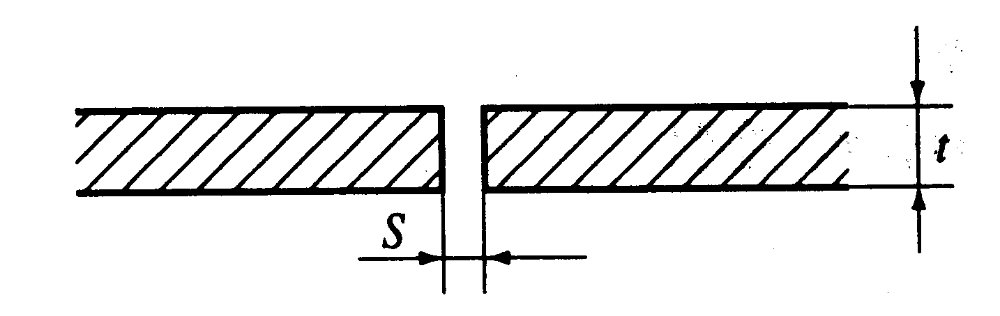
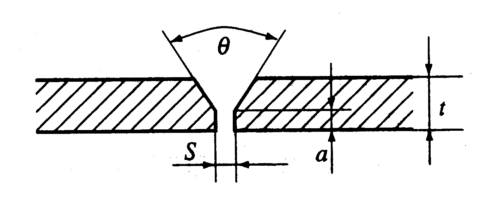
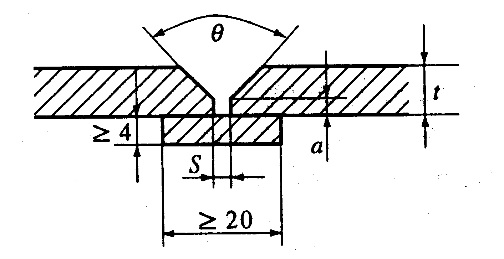
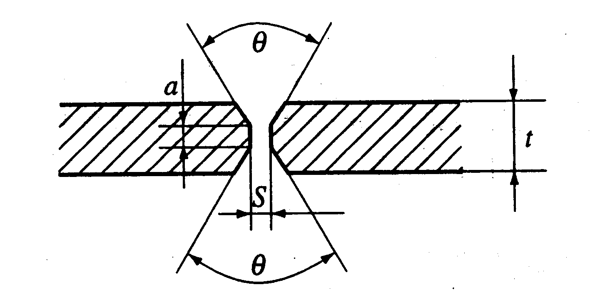
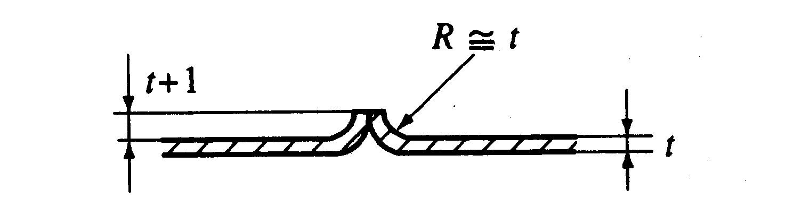
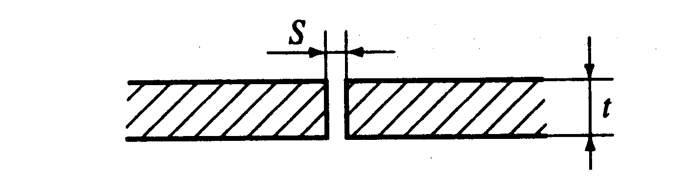
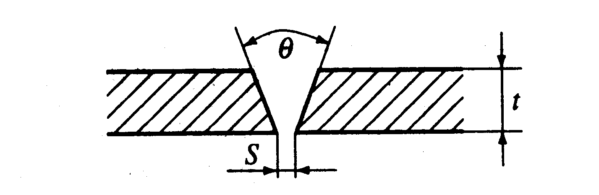

# Guidance for Recreational Crafts

> OTHER RULES AND GUIDANCE / GC-06-E / 2025 / EN / Guidance

## CHAPTER 3 MATERIALS

### Section 1 General

#### 101. Application

- **1.** The requirements of this chapter are applied to the metal, wood, FRP materials and it's construction work used for hull construction, superstructure and equipment of recreational crafts. However, the requirements other than those specified in this Chapter are to be in accordance with the related requirements in **Pt 2, Ch 2** of **Rules for the Classification of Steel Ships** and **Rule for the Classification of FRP ships**.
- **2.** Where deemed appropriate by the Society, national standards, internationally recognized Codes or Standards considered as equivalent for those may be applied instead of requirements of this Chapter.
- **3.** Materials not specified in this chapter may be used if adequate suitability and durability for the intended purpose can be demonstrated.
  - **(1)** Laboratory tests
  - **(2)** Long-term tests with the boat as finished
  - **(3)** Reports on similar craft with comparable hull parameters and size, and operating environment.
- **4.** It is the responsibility of the craft's owner to follow the instructions of the recreational craft manufacturer, especially concerning
  - **(1)** The possible reduction of mechanical properties by the induction of heat
  - **(2)** The use of chemicals and antifouling paints that are incompatible with aluminium

### Section 2 Metal Material and Welding

#### 201. Metal material

- **1.** **General**
  - **(1)** The properties of all metal such as steel and aluminium alloy, etc. used in the hull construction and equipment of recreational craft shall be suitable for marine use and the intended methods of construction. However, the requirements not specially provided in this Chapter are to be in accordance with the related requirements in **Pt 2, Ch 2** of **Rules for the Classification of Steel Ships**.
  - **(2)** The metal used shall have a suitable finish for the intended application and shall be free from surface defects prejudicial to use for the intended application.
  - **(3)** The manufacturer or supplier of the material shall adopt a system of identification, e.g. by colour coding or stamping, that will enable the material to be traced to its original manufacture.
- **2.** **Material combinations**
  - **(1)** When combining metals of different type or composition, the galvanic potential difference must be considered in order to avoid contact corrosion.
  - **(2)** The negative effect on certain timber by adjacent metals and vice versa shall be taken into account when selecting the materials to be in contact or shall be neutralized, e.g. by shielding or insulation.
- **3.** **Steels for hull structure**
  - **(1)** The steel used for hull structure of recreational crafts is to be mild or higher strength steel in accordance with requirements in **Pt 2, Ch 1** of **Rules for the Classification of Steel Ships**.
  - **(2)** Higher strength steel may be used in the construction of craft provided it is taken into consideration that, when fatigue load is present, the effective fatigue strength of a welded joint may not be greater than a welded joint in normal strength steels. Where higher strength steel is applied to the hull structure, the drawings indicating use extent, location, material property and dimensions to be submitted to the Society for approval.
  - **(3)** Classification for steel used in the hull structure is to be complying with **Pt 3, Ch 1, Sec 4** of **Rules for the Classification of Steel Ships**.
- **4.** **Stainless steels**
  - **(1)** Austenitic stainless steels may be used for construction of recreational craft subject to giving consideration to
    - **(A)** the environmental conditions to which the small craft may be subjected,
    - **(B)** any intended combination of different metals, the means of insulation from each other and surface protection or coating, and
    - **(C)** the detail design to reduce the possibility of pitting and/or crevice corrosion.
  - **(2)** This group of steels comprises low-carbon austenitic steels which achieve their resistance to corrosion in fresh and sea water by additions of chromium (Cr), nickel (Ni), molybdenum (Mo), and may additionally be stabilized for a stable after welding condition by titanium (Ti) and niobium (Nb).
  - **(3)** Alloys suitable for marine use are in general those with a minimum mass fraction of 12 % chromium and a pitting resistance equivalent (W) exceeding 25 (W = % Cr + 3,3 % Mo).
- **5.** **Aluminium alloys**
  - **(1)** Aluminium alloys used for hull structure of recreational crafts is to be 5000 or 6000 series in accordance with requirements in **Pt 2, Ch 1** of **Rules for the Classification of Steel Ships**.
  - **(2)** Alloys of the aluminium-copper group(3000 series) and aluminium-zinc group(7000 series) should not be used for the construction of recreational crafts. They may be used for secondary purposes in recreational craft with special protection, e.g. anodizing, painting.
  - **(3)** Aluminium-copper alloys(3000 series) may be used without protection for recreational crafts that are intended to be used exclusively in fresh water surroundings. It is preferable that they are not of welded construction.
- **6.** **Other metals**
  Structural members of recreational crafts may be built of other metals, e.g. copper- and nickel-based alloys. Those that are sensitive to crevice corrosion and pitting when not coated shall only be used with cathodic protection when submerged or subject to spray water.

#### 202. Storage and handling

- **1.** **Identification and marking**
  - **(1)** The builder shall establish and maintain a procedure to ensure that material and consumables used in the construction process are identified (by colour-coding and/or marking or any other means, as appropriate) from arrival in the yard through to fabrication in such a way as to enable the type and grade to be readily recognized.
  - **(2)** The builder shall maintain purchasing documents containing a clear description of material ordered for hull construction referring to the appropriate standards or specifications.
  - **(3)** Non-conforming material shall be separated from the acceptable material.
  - **(4)** Where materials are found to be defective, they shall be disposed of in accordance with the builder´s conformity assurance procedure.
- **2.** **Storage**
  - **(1)** Materials shall be stored in accordance with the material manufacturer’ requirements. Storage arrangements shall be such as to prevent deterioration through adverse environmental conditions and poor handling.
  - **(2)** Welding consumables shall be stored in suitable conditions to maintain them in accordance with the material manufacturer’ recommendations.

#### 203. Welding

- **1.** **General**
  - **(1)** The welding in the steels or aluminium alloys used for hull structure of recreational crafts are to be suitable for not only **203.** of this rule but **Pt 2, Ch 2** of **Rules for the Classification of Steel Ships**.
  - **(2)** Details of welded joints for main structural members are to come under construction plan and/or detail drawing.
  - **(3)** The welding is to be carried out in accordance with the procedures previously approved with welding consumables and by the welders qualified by the Society.
- **2.** **Preparation**
  - **(1)** Materials shall be suitably cleaned and cleared of millscale and rust prior to fabrication of the recreational craft.
  - **(2)** The preparation of materilas(e.g. cutting, bending and forming) shall follow recognized industry practice and shall be such as to ensure that the mechanical properties of the material are not adversely affected.
- **3.** **Welding work**
  - **(1)** Adequate protection, such as screening, shall be provided where welding is to carried out in wet, windy or cold weather. In cold or very humid conditions, it may be necessary to preheat the work to prevent too rapid cooling of the weld.
  - **(2)** The preparation of plate edges shall be accurate and free from harmful defects. Joints shall be properly fitted up, or aligned without using excessive force, before welding. Parts shall be set up and welded in such a way that contraction stresses are kept to be minimum.
  - **(3)** The surfaces to be welded shall be clean, dry and free from grease and other contaminants which might adversely affect weld quality. Where a primer has been used after surface preparation and prior to fabrication, the composition of the primer shall have no detrimental effect on the subsequent welding work.
- **4.** **Quality of welds**
  - **(1)** The weld is to have a regular and uniform surface and it to be reasonably free from excessive reinforcements, injurious defects, such as undercuts, overlaps, etc.
  - **(2)** Welded structures are to be reasonably free from welding deformation.
  - **(3)** Non-destructive inspection is to be carried out for welded joints as the Guidance relating to the Rules specified elsewhere.
  - **(4)** The welding defects found in an appropriate non-destructive inspection including the visual inspection or watertight test are to be removed and corrected by rewelding.
- **5.** **Repair welding**
  - **(1)** The removal of weld defects shall be done by gouging, grinding, chipping, etc. with such a manner that the remaining weld metal or base metal is not damaged.
  - **(2)** The removed weld defects parts are to be so machined as not to affect repair welding and repair welding shall be carried out with low hydrogen type welding consumables and an electrode preferably smaller than that used for making the original weld.
  - **(3)** Members distorted by welding may be straightened by mechanical means or localized heat treatment, however in case of localized heat treatment, the temperature of heated areas is to be so limited as not to affect the mechanical properties of base metal.

#### 204. Steel/aluminium transition joints

- **1.** Explosion-bonded composite transition joints shall be used for connecting aluminium to steel. These assemblies shall be used in strict compliance with the joint manufacturer´s specification.
- **2.** Bimetallic joints, where exposed to sea water or used internally within wet spaces, shall be suitably protected to prevent galvanic corrosion.

#### 205. Adhesive bonding of structure

- **1.** The adhesive manufacturer´s recommendations in respect to the jointing system, comprising surface preparation, the adhesive, bonding, and curing processes and environmental conditions, shall be strictly followed.
- **2.** Where adhesive bonding of any load-bearing structure is used, test samples shall be manufactured under workshop conditions to demonstrate that the bonded connection develops its intended strength.
- **3.** The method used to bond joints shall be documented so that the process is repeatable after the procedure has been verified.
- **4.** Bonded joints shall be designed to avoid tension on the joints which may cause peeling forces tending to open the joint, unless tests and calculations show that the joint has sufficient strength.
- **5.** Glued joints shall be resistant to, or protected against, sunlight (UV, heat, etc.) and environmental effects or cleaning agents normally encountered in the manufacture or the use of the craft.

#### 206. Steel/wood and aluminium/wood connection

- **1.** To minimize corrosion of steel or aluminium in contact with wood in a damp or marine environment, the surfaces in contact shall be protected in accordance with good practice.
- **2.** Surfaces in contact shall be primed and painted, or coated with a substantial thickness of a suitable sealant.

#### 207. Surface coating

Metal shall be given adequate protection for its intended use by an adequate surface treatment and/or coating, as necessary.

#### 208. Aluminium craft production, specific requirements

- **1.** **General**
  - **(1)** Aluminium shall not be welded when damp or wet in order to avoid hydrogen inclusions in the welds.
  - **(2)** Aluminium shall be stored in dry places, clear of the ground. Contact with other stored materials shall be avoided.
  - **(3)** Where a builder is working with both aluminium and steel, the tools directly in contact with the metal used in aluminium production shall be clearly marked(e.g. by colour) for use with aluminium only.
  - **(4)** Where bimetallic connections are made, involving dissimilar metals, measures shall be taken to prevent galvanic action.
  - **(5)** Areas of the hull structure that are permanently or temporarily submerged shall be protected by means of coating or cathodic protection.
  - **(6)** The welding in the aluminium alloys used for hull structure of recreational crafts are to be in accordance with **2** to **6.** Any contents other than those specified in **2** to **6** are to be in accordance with **Pt 2, Ch 2** of **Rules for the Classification of Steel Ships**.
- **2.** **Groove design**
  - **(1)** The groove design of welded connections, as a rule, is to be in accordance with **Table 3.1.** Grooves and root gaps which differ from these may be subject to special consideration.
  - **(2)** To minimize distortion, the X groove with the narrowest root gap practicable is recommended for thick material, instead of single-V groove.
- **3.** **Welding consumables**
  Welding consumables used for aluminium alloys is to be applied in accordance with **Table 3.2.**

  | Groove design |   | Dimension | Remarks |
  | --- | --- | --- | --- |
  | MIG |  | $t$ = 1.5 ~ 5 $s$ = 0 ~ 2 | Welding from one side. Backing may be used. |
  | MIG |  | $t$ = 5 ~ 25 $s$ = 0 ~ 3 $a$ = 1.5 ~ 3 $\theta$ = 60 ~ 100° | Largest angle is recommended for under-up position. Back chipping and rewelding should be carried out. |
  | MIG |  | $t$ = 8 ~ 25 $s$ = 3 ~ 7 $a$ = 2 ~ 4 $\theta$ = 40 ~ 60° | Smallest joint angle may be used up to 15 mm and with the largest root gap. Position vertical, under-up and side-in require large root gap. |
  | MIG |  | $t$ = 12 ~ 25 $s$ = 0 ~ 2 $a$ = 3 ~ 5 $\theta$ = 50 ~ 70° | Allowed specially for automatic welding. Semiautomatic processes may be used in all positions, and shall be back chipped before welding from backside. |
  | TIG |  | $t$ ≤ 2 |   |
  | TIG |  | $t$ ≤ 4 $s$ = 0 ~ 2 | Welding from one side. |
  | TIG |  | $t$ = 4 ~ 10 $s$ = 0 ~ 2 $\theta$ = 60 ~ 70° | Backing may be used in horizontal position |
  | $t$ = material thickness ($\mathrm{mm}$) $a$ = root face ($\mathrm{mm}$) $s$ = root gap ($\mathrm{mm}$) $\theta$ = joint angle |   |   |   |

  | Kind and grade of aluminium alloys to be welded |   | Grade of applicable welding consumables |
  | --- | --- | --- |
  | 5000 series${} ^{(1)}$ | 5754 *P* | *RAlRA,* *RAlRB, RAlRC* *RAlWA, RAlWB, RAlWC* |
  | 5000 series${} ^{(1)}$ | 5086 *P,* 5086 *S* | *RAlRB,* *RAlRC* *RAlWB,* *RAlWC* |
  | 5000 series${} ^{(1)}$ | 5083 *P,* 5083 *S* | *RAlRC,* *RAlWC* |
  | 6000 series${} ^{(1)}$ | 6005 *AS* | *RAlRD,* *RAlWD* |
  | 6000 series${} ^{(1)}$ | 6061 *P,* 6061 *S* | *RAlRD,* *RAlWD* |
  | 6000 series${} ^{(1)}$ | 6082 *S* | *RAlRD,* *RAlWD* |
  | (NOTES) (1) For welded joint of 5000 series alloys and 6000 series, the welding consumables corresponding to 5000 series alloys specified in this table may be used. |   |   |
- **4.** **Preparation for welding**
  - **(1)** **Edge preparation**
    - **(A)** Proper edge preparation is to be employed.
    - **(B)** Joint edge may be prepared by mechanical cutting, such as band sawing, and by plasma (TIG) arc cutting.
  - **(2)** **Cleanliness**
    - **(A)** All oil or other hydrocarbons, paint and loose particles from the sawed edges must be removed prior to welding.
    - **(B)** Oil or grease films may be removed chemically by dipping, spraying or wiping the aluminium plate with solvents. Mildly alkaline solutions may be used for cleaning and all welding surfaces shall be thoroughly dried before welding.
    - **(C)** Oxide films, which will prevent fusion between the filler metal and the parent material are to be removed from the weld bevels and a minimum of 75 $\mathrm{mm}$ to any side, prior to assembly. Mechanical means, such as a power-driven clean, stainless steel brush, or suitable chemical means are to be used. Welding is to take place immediately after cleaning, and the welding site is to be protected against draft, wind and moisture.
  - **(3)** **Backing**
    - **(A)** When backing is used, the joint angle is to be large enough to provide accessibility for the root runs.
    - **(B)** Besides aluminium alloys, stainless steel and copper may be used as backing bar material.
    - **(C)** When copper backing is used, copper pickup is to be prevented because local deposition can result in corrosion service.
    - **(D)** Temporary aluminium backing is to be removed by chipping after welding. If the butt weld is not completely fused to the temporary aluminium backing, the root pass is to be back chipped to sound metal after the backing bar has been removed.
    - **(E)** When permanent aluminium backing is used, it is necessary to obtain complete fusion between the backing, the root faces and the root layer of the weld. Permanent backing is not recommended where crevice corrosion is of a concern. In these conditions, all edges of the backing bars are to be completely welded.
- **5.** **Main welding**
  - **(1)** The welding process may be manual, semi-automatic or automatic according to welding procedure specifications.
  - **(2)** TIG-welding is a recommended process for welding of thinner gages and precision weldments. MIG-welding is recommended for thicker gages.
  - **(3)** For MIG fillet welds, back stepping is recommended to fully fill the end crater and thereby eliminate cracking problems that usually accompany the crater.
  - **(4)** Other welding methods such as resistance, spot, seam, stud or electron beam welding may be approved by the Society after consideration in each separate case.
- **6.** **Preheating**
  - **(1)** Preheating of parts to be welded is to be carried out when the temperature of the parts is below 5 ℃ or when the mass of the parts is such that the heat is conducted away from the joint faster than the welding process can supply it. Use of preheat is required when welding is performed under high humidity conditions.
  - **(2)** The preheating temperature must be limited to maximum 60 ℃, due to the increased susceptibility of stress corrosion cracking for 5000 series alloys above this temperature.
- **7.** **Acceptance criteria fabrication**
  - **(1)** **Visual inspection**
    - **(A)** All welds are to show good workmanship with smooth transition to the base material without sharp edges. An overlap or deficient weld is not acceptable.
    - **(B)** For butt welds, weld reinforcement or excessive penetration is not to exceed 2 $\mathrm{mm}$*.*
    - **(C)** For fillet and partial penetration welds, weld reinforcement is not to exceed 3 $\mathrm{mm}$*.*
    - **(D)** For throat thickness, a negative deviation from that which is specified is not allowed.
    - **(E)** The difference in leg lengths of a fillet weld is not to exceed 3 $\mathrm{mm}$*.*
  - **(2)** **Non-destructive examination**
    - **(A)** Requirements for non-destructive examination to be complying with **Pt 2, Annex 2-7** of **Guidance for the Classification of Steel Ships**.
    - **(B)** Cracks, incomplete penetration and lack of fusion are not acceptable.

### Section 3 Wood

#### 301. General

- **1.** Requirements specified in this Chapter are applied to structural wood and plywood used in the hull structure of recreational crafts.
- **2.** Wood and plywood used for hull structure of recreational crafts are to be approved by Society.

#### 302. Wood

- **1.** Timber shall be suitable for use in the intended marine environment and shall be of durability classes 1, 2 or 3, (see **Table 3.3**) except where otherwise specified in this section.

  | Durability class | Endurance (years) | Resistance |
  | --- | --- | --- |
  | 1 | > 25 | high resistance |
  | 2 | 15 ~ 25 | resistant |
  | 3 | 10 ~ 15 | moderate resistance |
  | 4 | < 10 | non-resistant |
- **2.** A selection of such wood species is given in **Table 3.4**. Wood of lower durability classes may be used, as listed in **Table 3.4**, provided the mechanical properties are sufficient for scantlings, and suitable preservations are applied.

  | Trade name | Botanical designation | Durability class |
  | --- | --- | --- |
  | Teak | Tectona grandis | 1 |
  | Iroko | Chlorophora excelsa | 1 |
  | Macore | Tieghemelia heckelii | 1 |
  | Sipo, Utile | Entandophragma utile | 2 |
  | Mahogany | Swietenia macrophylla | 2 |
  | Oak, European | Quercus robur | 2 |
  | Red cedar, Western | Thuja plicata | 2 |
  | Khaya, Benin mahogany | Khaya ivorensis | 2, 3 |
  | Agba | Gossweilerodendron balsamiferum | 2, 3 |
  | Douglas fit, Oregon pine | Pseudotsuga menziesii | 3 |
  | Larch | Larix decidua | 3 |
  | Pine | Pinus sylvestris | 3 |
  | Fir | Abies alba | 4 |
  | Fir, Spruce | Picea abies | 4 |
  | Spruce | Picea glauca | 4 |
- **3.** Timber for structural parts shall be free from defects that might impair the strength or durability of the craft, e.g. bluing, brittleness, rot, cracks, knots and sapwood.
- **4.** Timber used for planking of the hull shall be cut with consideration of warping, shrinkage and swelling in the as-assembled condition. Timber intended to be used for planking of the hull should be quarter sawn (rift sawn), with an angle of the annular rings to the lower cut edge less than 45° for single-skin carvel construction, except for strip plank construction with small strip width.
- **5.** The moisture content of the wood shall be within the limits required by the method of joining the parts (gluing, laminating, sheathing) and consideration of the dimensional stability of the structure. Timber for structural purposes where encapsulated or over-laminated shall have an average moisture content not greater than 15 %.

#### 303. Plywood

- **1.** Plywood intended to be used for external structural members, e.g. hull, weather deck not sheathed by fibre reinforced plastics (FRP) laminate or similar, superstructures and deckhouses, shall be marine-grade plywood. Where a craft is intended to be only temporarily used in the water and the hull is protected by a wood-penetrating medium (e.g. epoxy resin) other waterproof and boilproof external-grade plywood may be used.
- **2.** Other members inside the hull may be made of waterproof and boilproof plywood which does not fully comply with marine-grade plywood. It shall be durable.

#### 304. Veneers for moulded construction

Veneers used in the construction of the hull, deck and superstructure shall in general be of durability class 1 or 2. Exception: veneers of durability less than 2 may be used if adequately preserved by resin penetration or FRP sheathing.

#### 305. Wood composite structures

- **1.** Composite structures are wooden, generally of moulded construction and made of layers of veneers or strip planking with cove-and-bead or tongue–nd-groove edge joints with one or more layers of synthetic fibres incorporated taking a significant part of the stress. The synthetic fibres are generally used in the form of fabrics, for example glass, aramid, carbon fibres, or a combination of these.
- **2.** When selecting wood and fibre fabrics for the purpose of composite construction, the resin used for saturating the fibres shall be capable of achieving a good penetration into the surface of the wood and a structurally sound bond between wood and fabric.
- **3.** Where composite construction is used, account shall be taken of the different properties of the materials being used and the way in which applied loads will be shared.

#### 306. Workshop conditions

- **1.** The premises used for production and storage shall be suitable, and equipped to provide the conditions necessary for fault-free bonding by adhesives.
- **2.** This shall enable the builder to monitor, and if necessary control, temperature, humidity and other environmental conditions during manufacturing so as to avoid changes during manufacture.
- **3.** The workshop and equipment shall be maintained in a clean and efficient condition.

#### 307. Storage and handling for material

- **1.** Timber shall be stored in dry and well-ventilated premises where it is protected from direct sunlight and excessive moisture. It shall be stored horizontally, each plank or layer being separated from the other to achieve air circulation.
- **2.** Adhesives shall be suitable for the intended purpose. The bond’s mechanical properties and life shall exceed that of the glued wood. Adhesives shall be stored as specified by the manufacturer of these materials in their original containers. They must not be used after their expiry date.
- **3.** Fastening elements for load-bearing parts of the construction, e.g. nails, screws and bolts shall be corrosion resistant or hot-dipped galvanized.

#### 308. Manufacturing for wooden crafts

- **1.** Manufacturing shall take place in an environment that takes into account the requirements and limitations specified by the manufacturer of the material (e.g. glue, resin or paint).
- **2.** The moisture content of the wood shall be checked before gluing. The moisture content shall not exceed that which permits full joint strength. Areas to be glued shall be free from any contamination that might impair the strength of the bond.
- **3.** Wooden craft shall be constructed in such a way that water cannot collect in areas where it cannot be drained. They shall also be constructed in such a way that natural ventilation is promoted to all areas of the craft.
- **4.** A protective coating or surface treatment shall be applied to finished surfaces not intended to be left bare, for example teak decks. Any coating or treatment shall not adversely react with the adhesives, reduce the mechanical property of the joint or have a detrimental effect on the wood itself.

### Section 4 FRP Material and Moulding

#### 401. General

- **1.** The requirements in this section are applied to FRP materials and moulding used for hull construction of recreational crafts. However, the requirements other than those specified in this section are to be in accordance with the related requirements in **Pt 2** of **Rules for the Classification of Steel Ships** and **Rules for the Classification for FRP ships**.
- **2.** Resins, gelcoats, fibre reinforcement, core for sandwich structure (Expanded plastics foam and End-grain balsa) and core for moulding used for FRP raw materials are to be approved by Society in accordance with the requirement of **Guidance for Approval of Manufacturing Process and Type Approval, Etc**.
- **3.** Type Approval for FRP materials other than those specified in this section may be applied to recognized Standards. Where deemed appropriate by the Society, National Standards, internationally recognized Codes or Standards considered as equivalent for those may be applied instead of requirements of this Guidance.

#### 402. FRP Material

- **1.** **Reinforcement fibres**
  - **(1)** The reinforcement used as a reference for this chapter shall be E-glass in accordance with **ISO 2078**. Other types of glass fibres may be used if the minimum properties of E-glass are met or surpassed and the laminate itself is of equal or higher mechanical property.
  - **(2)** The finish and binder of glass fibres shall be compatible with the matrix material used.
  - **(3)** Fibres made of material other than glass may be used, provided that their properties are suitable for the intended purpose.
  - **(4)** The material upon delivery complies with **Table 3.5**.
- **2.** **Resin**
  - **(1)** **Properties**
    The properties of liquid gelcoat, topcoat and laminating resins shall comply with the requirements of **Table 3.6**, as applicable.
  - **(2)** **Gelcoat resins**

    | Property | Test method | Requirement |
    | --- | --- | --- |
    | Moisture content on delivery % max. Roving Chopped strand mat Fabrics | ISO 3344 | 0.2 0.5 0.2 |
    | Mass per unit, tolerance on nominal value % Roving (length) Chopped strand mat (area) Woven roving (area) | ISO 1889 ISO 3374 ISO 3374 | -5∼+10 -5∼+10 -5∼+10 |
    | Loss on ignition, nominal value % max. | ISO 1887 | +20 |
    | (NOTE) Equivalent methods for determining moisture content and mass including permissible tolerances should be used for materials other than glass fibre. |   |   |

    | Property | Test method | Requirement (Tolerance on nominal value specified by the manufacturer %) |
    | --- | --- | --- |
    | Viscosity | (1) Brookfield, ISO 2555, or (2) Cone/plate, ISO 2884-1 | ±20 |
    | Monomer content | ISO 4901 | ±5 |
    | Gel time | ISO 2535 | ±20 |
    | Density | ISO 1675 or ISO 2811-1 | ±5 |
    | Mineral content (laminating resins only) | DIN 16945 | ±5 |

    | Property | Test method | Requirement |   |   |
    | --- | --- | --- | --- | --- |
    | Property | Test method | Resin type |   |   |
    | Property | Test method | A | B(1) | C(1) |
    | Ultimate tensile strength (Min. MPa) | ISO 527-1/527-4 | 55 | 45 | 45 |
    | Elongation at break (Min. %) | ISO 527-1/527-4 | 2.5 | 1.5 | 1.2 |
    | Ultimate bending strength (Min. MPa) | ISO 178 | 100 | 80 | 80 |
    | Ultimate flexural strength (Min. MPa) | ISO 178 | 2700 | 2700 | 2700 |
    | Heat deflection temperature (Min. ℃) | ISO 75-1/75-2, method A | 60 | 60 | 53 |
    | Water absorption (Max. mg) | ISO 62(2) | 80 | 100 | 100 |
    | Overall volume shrinkage | ISO 3521 | Nominal value specified by the manufacturer +5 % |   |   |
    | Barcol hardness(3) (Min.) | EN 59 | 35 | 35 | 35 |
    | (NOTES) (1) The requirements for laminating resins Types B and C are minima of different applications of determining required scantlings. (2) Test sample : $50 _{ 0} ^{+1} \mathrm{mm} \times 50 _{ 0} ^{+1} \mathrm{mm} \times 4 _{ 0} ^{+0.2} \mathrm{mm}$, Distill water. Exposure time 28 day at 23 ℃ (3) Resin systems may deviate from these values, provided a minimum value of 30 is achieved and adequate cure can be demonstrated by the manufacturer. |   |   |   |   |
    - **(A)** Gelcoat base resins when cured shall meet the requirements of Type A in **Table 3.7**.
    - **(B)** For specific applications, in order to achieve superior properties as to elongation and/or reduced water absorption, resins used for gelcoats and skin coats may deviate as to their minimum properties from the requirements of Type A resin in **Table 3.7**.
  - **(3)** **Topcoat resins**
    The formulation of a topcoat resin as to its physical properties shall consider the specific applications for which it is intended and shall meet the respective requirements for Type A, B or C, for instance
    - **(A)** exposure to weathering;
    - **(B)** oily bilge water;
    - **(C)** tack-free surface only;
    - **(D)** suitability as a paint.
  - **(4)** **Laminating resins**
    Laminating resins, including resin blends with permissible amounts of fillers and other additives when cured shall meet the respective requirements specified in **Table 3.7**.
  - **(5)** **Fillers, additives**
    Quantities and types of fillers and/or additives shall allow sufficient wet out of reinforcement fibres within the resin manufacturer's specified gel time.
  - **(6)** **Catalysts, accelerators**
    The use of catalysts and accelerators shall be as specified or recommended by the resin manufacturer.
  - **(7)** **Declaration**
    - **(A)** The resin manufacturer shall declare in writing that the material upon delivery complies with **Tables 3.6** and **3.7** appropriate to the manufacturer's specified Type A, B or C resin.
    - **(B)** If the resin manufacturer claims for exemption according to **Table 3.7**, i.e. that the requirements are not applicable to resins used in the formulations of fillers and putties, he shall state the mechanical properties achieved and shall provide information on the intended application of the resin.
    - **(C)** The manufacturer of the resin, catalyst, accelerator, filler or other substances used in the laminate shall each provide written information on
      - **(a)** the compatibility or incompatibility (if known) of the material supplied with other materials used in the laminate;
      - **(b)** the shelf life of the material;
      - **(c)** the specific requirements concerning storage;
      - **(d)** the specific requirements concerning use.
    - **(D)** The boat manufacturer shall keep this information with the documentation established for the small craft.
- **3.** **FRP laminate**
  - **(1)** The mechanical properties of the reference laminate as listed in **Table 3.8** shall be achieved by any manufacturing process.

    | Property | Test method | Requirement (MPa) |
    | --- | --- | --- |
    | Ultimate tensile strength | ISO 527-1, ISO 527-4 | 80 |
    | Tensile modulus | ISO 527-1, ISO 527-4 | 6,350 |
    | Ultimate flexural strength | ISO 178 | 135 |
    | Flexural modulus | ISO 178 | 5,200 |
    | In-plane shear | ASTM D 4255 | 50 |
    | Apparent interlaminar shear strength (short-beam shear) | ISO 14130 | 15 |
  - **(2)** The resin manufacturer shall declare in writing that the mechanical properties of **Table 3.8** are capable of being fulfilled. The resin manufacturer shall provide detailed information with respect to other substances (e.g. catalyst, accelerator, fillers, additives, etc.) used in the fabrication process of the reference laminate.
- **4.** **Core for sandwich structure**
  - **(1)** **Structural requirements**
    - **(A)** Core materials for sandwich construction of small craft shall only be used if the following requirements of the final structure are fulfilled. The material shall have adequate properties to enable the sandwich structure to fulfil the requirements specified in **Ch 4** for a normal service life in a marine environment, with special regard to
      - **(a)** in-plane forces, acting in the direction of the sandwich layers, e.g. tension, compression, shear;
      - **(b)** out-of-plane forces, acting transversely to the sandwich layers, e.g. compression, tension, shear.
    - **(B)** Fatigue performance must be considered when choosing the core material.
  - **(2)** **General requirements**
    - **(A)** Core materials shall have stable mechanical properties consistent with the designated use of the craft.
    - **(B)** Resin applied to the core material or its protective sheathing/coating shall be compatible with its surface.
    - **(C)** Core materials forming part of a sandwich structure shall
      - **(a)** limit the penetration of water beyond the area of a possible fracture of the skin laminate. This requirement does not apply for core materials that consist of a three-dimensional open structure bonded to both skin laminates, e.g. honeycomb or three-dimensional fabrics.
      - **(b)** not emit significant amounts of gases that would compromise the bond or laminate.
    - **(D)** Core materials shall be capable of transferring the shear loads specified in **Ch 4**.
    - **(E)** The core material manufacturer shall provide written information on the mechanical and other properties relevant for the intended application, as well as their variation in temperature and thermal limit of application where relevant.
    - **(F)** Where the core material used for structural parts may limit the mechanical properties of the sandwich panel due to extreme thermal conditions, the temperature range for safe operation of the craft shall be stated in the owner’ manual.
  - **(3)** **End-grain balsa**
    - **(A)** Where used as a structural core material of the hull, end-grain balsa wood shall fulfil the following requirements.
      - **(a)** be free from living organisms that may cause degradation when enclosed in a boat structure sandwich panel;
      - **(b)** have been homogenized;
      - **(c)** have an average moisture content of 12 % to 15 %, when packaged.
    - **(B)** The mechanical properties as delivered shall comply with Grade I or II of **Table 3.9**.
  - **(4)** **Special requirement for Expanded foam**
    - **(A)** Expanded foam plastics used in structural sandwich cores of the craft shall be of a closed cell type.
    - **(B)** The mechanical properties of PVC (polyvinyl chloride) and SAN (styrene acrylic nitrile) type foam cores, intended to be used in the structural laminate of hull, deck and first tier of the superstructure, if this is open to the atmosphere, shall at least comply with the properties of Grade I of **Table 3.10**.
    - **(C)** The mechanical properties as delivered, intended to be used for other parts of the craft, shall comply at least with the properties of Grade II of **Table 3.10**.
- **5.** **Embedded materials—inserts**
  - **(1)** The properties of expansion and contraction of inserts shall be similar to those of the laminate so that the overall performance of the structural laminate is not impaired.
  - **(2)** Embedded plywood shall be of the waterproof and boilproof type and shall have a surface that bonds easily to the resin or adhesive. Solid timber inserts between layers of laminate are not recommended.

    | Property | Test method(5) | Required minimum values |   | Unit |
    | --- | --- | --- | --- | --- |
    | Property | Test method(5) | Grade I | Grade II | Unit |
    | Density | ISO 3131, ISO 845 | Manufacturer’ specified min. value |   |   |
    | Tensile strength: longitudinal perpendicular | ISO 3345(KS F 2207)(1)(2) ISO 3346(KS F 2207) | 16 0.64 | 9 0.44 | $\mathrm{N}/mm ^{ 2}$ |
    | Compressive strength: longitudinal perpendicular | ASTM C365(1)(2), 23℃ ISO 3132(KS F 2206), 23℃ | 10 0.6 | 5 0.35 | $\mathrm{N}/mm ^{ 2}$ |
    | Compressive modulus: longitudinal perpendicular | ASTM C365, 23℃ ISO 3132(KS F 2206)(1)(2)(3), 23℃ | 4,300 73 | 2,275 35 | $\mathrm{N}/mm ^{ 2}$ |
    | Shear strength(4) | ISO 1922 | 1.84 | 1.1 | $\mathrm{N}/mm ^{ 2}$ |
    | Shear modulus(4) | ISO 1922 | 150 | 105 | $\mathrm{N}/mm ^{ 2}$ |
    | (NOTES) (1) Max. speed of deformation, mm/min: 10 % of the measured initial thickness. (2) Dimensions of specimen: 50 mm × 50 mm × product thickness in millimetres. (3) Core material to be tested with and without a longitudinal adhesive joint. Joint at mid-plane of specimen, parallel to steel supports and at an equal distance from supports. (4) Test to be carried out on samples with a layer of suitable resin to stabilize the core cell walls at the loaded surfaces. (5) Moisture content of the specimens shall be between 12 % and 15 %. |   |   |   |   |

    | Property | Test method(5) | Required minimum values |   | Unit |
    | --- | --- | --- | --- | --- |
    | Property | Test method(5) | Grade I | Grade II | Unit |
    | Tensile strength | ISO 1926(1)(2) | 1.0 | 0.6 | $\mathrm{N}/mm ^{ 2}$ |
    | Tensile modulus | ISO 1926 | 60 | 30 | $\mathrm{N}/mm ^{ 2}$ |
    | Compressive strength | ISO 844(1)(2)(3), 23°C | 1.0 | 0.6 | $\mathrm{N}/mm ^{ 2}$ |
    | Compressive modulus | ISO 844(1)(2)(3), 23°C | 40 | 40 | $\mathrm{N}/mm ^{ 2}$ |
    | Compressive strength | ISO 844(1)(2)(3), 45°C | 60% of value obtained at 23°C | 50% of value obtained at 23°C | $\mathrm{N}/mm ^{ 2}$ |
    | Compressive modulus | ISO 844(1)(2)(3), 45°C | 70% of value obtained at 23°C | 50% of value obtained at 23°C | $\mathrm{N}/mm ^{ 2}$ |
    | Shear strength(4) | ISO 1922 | 0.6 | 0.4 | $\mathrm{N}/mm ^{ 2}$ |
    | Shear modulus(4) | ISO 1922 | 18 | 9 | $\mathrm{N}/mm ^{ 2}$ |
    | Shear elongation(5) | ISO 1922 | Manufacturer’ specified min. value |   |   |
    | Water absorption | ISO 2896, 40°C,1 week, in water | 1.5 max. | 1.5 max. | %(V/V) |
    | Water resistance | Percentage retention of compressive and tensile strength after 4 weeks in water (ISO 2896) at 23°C | 75 | 70 | % |
    | Density | ISO 845 | Manufacturer’ specified min. value |   | kg/m^3 |
    | Oxygen index | ISO 4589-1,2,3 | Stated value |   |   |
    | (NOTES) (1) Maximum speed of deformation, mm/min: 10 % of the measured initial thickness. (2) Dimensions of specimen: 50 mm x 50 mm x product thickness in millimetres. (3) Test to be carried out on samples with a layer of suitable resin to stabilize the core cell walls at the loaded surfaces. (4) Core material to be tested with and without a longitudinal adhesive joint. Joint at mid-plane of specimen, parallel to steel supports and at an equal distance from supports. (5) Elongation at break or at the point where the load has decreased to 80 % of its maximum value. |   |   |   |   |

#### 403. Workshop conditions

- **1.** **General**
  - **(1)** The buildings used for production and storage shall be of suitable construction, and equipped to provide the environment specified by the material manufacturer or supplier.
  - **(2)** To minimize contamination or impairment of the laminate, the production area shall be separate from the storage area and, wherever practicable, the various manufacturing processes shall be carried out in separate sections.
  - **(3)** The workshop and equipment shall be properly maintained and kept in a clean condition, substantially free from debris, surplus material, and equipment that is not essential for the production process.
- **2.** **Temperature and humidity**
  - **(1)** Where a conventional manual lay-up or spray-up process is used, the moulding shop temperature shall be maintained within the limits specified by the resin manufacturer during lay-up and curing periods.
  - **(2)** Should the temperature vary outside the specified limits, the boat builder shall establish with the resin manufacturer that the resulting laminate will meet the requirements upon which scantlings and design are based.
- **3.** **Ventilation**
  - **(1)** Adequate ventilation shall be provided in the laminating area, in order to minimize accumulation of monomer fumes in the mould.
  - **(2)** The ventilation shall not significantly reduce the surface temperature of the mould or laminate.
  - **(3)** The design of the ventilation system shall take account of the size of the laminating shop, possible subdivision and the amount of resin under cure.
  - **(4)** The ventilation arrangements shall not cause excessive evaporation of the resin monomer.
  - **(5)** Precautions shall be taken to ensure freedom from draughts.
- **4.** **Dust control**
  Provisions shall be made to minimize harmful accumulation of dust on moulds and laminates.
- **5.** **Illumination**
  Provisions shall be made to avoid any harmful effects on the resin cure due to direct sunlight or artificial lighting.

#### 404. Material storage and handling

- **1.** **General requirements**
  - **(1)** Storage areas shall be arranged and equipped in such a way that the material manufacturer’ requirements for storage and handling can be followed.
  - **(2)** The procedures for the reception, verification against certificates of conformity, storage and handling of materials shall be detailed in the conformity assurance procedures provided by the boat builder (see clause 10) to ensure that the materials suffer no contamination or degradation and carry adequate identification at all times.
  - **(3)** Storage shall be arranged so that wherever possible materials are used in order of receipt.
  - **(4)** Structural parts shall be manufactured from materials that have not passed the material manufacturers’date of expiry.
  - **(5)** Materials found to be defective or not in compliance with the specifications of raw-material supplier(s) shall be rejected unless treated in accordance with the conformity assurance procedure, provided by the boat builder.
  - **(6)** Unused resin and ancillary materials exposed to the workshop atmosphere shall not be returned to the parent stock or bulk storage.
- **2.** **Resin**
  - **(1)** Resins shall be stored under controlled conditions in accordance with the resin manufacturer's requirements.
  - **(2)** Where a resin contains an ingredient that can settle within the resin system, it is the builder's responsibility to ensure that the resin manufacturer's recommendations for mixing and conditioning are complied with prior to use.
- **3.** **Catalysts and accelerators**
  Catalysts and accelerators shall be stored according to the material manufacturer's requirements.
- **4.** **Fillers and additives**
  Fillers and additives used in the moulding process shall be stored in closed containers to protect them from dust and humidity.
- **5.** **Reinforcing and core materials**
  Reinforcing and core materials shall be stored in clean and dry conditions, in accordance with the material manufacturer's recommendations.

#### 405. Moulds

- **1.** **Construction**
  - **(1)** Moulds shall be constructed of a suitable material and adequately stiffened to maintain their shape and fairness of form.
  - **(2)** The materials used in the construction of moulds shall not adversely affect the resin cure.
- **2.** **Preparation**
  - **(1)** Moulds shall be cleaned, dried and in place so that they stabilize at the workshop temperature before the release agent is applied.
  - **(2)** The release agent shall be compatible with the mould surface, the resins applied in the laminating process and with mould release films used previously. Release agents containing silicon shall not be used.

#### 406. Resin preparation

- **1.** The requirements of the resin manufacturer shall be followed.
- **2.** Where blended resins are used, test specimen(s) shall be made to ensure that the blended resin is suitable for the laminating process.
- **3.** Where the boat builder wishes to modify resin with additives outside the resin manufacturer’ specification, the boat builder shall conduct tests to verify compliance with **Table 3.7**.

#### 407. Laminating process

- **1.** General
  - **(1)** The resins are to be scrubbed by rollers till they are permeated completely. In the laminations for structures, the glass/resins ratio is to be the minimum quantities of the resins to permeate the glass completely. In the chopped strand mat moulded by the manual lay-up process, the weight of the glass/resins is to be 2.5:1 to 3:1.
  - **(2)** The hull lamination and other hull structural members are to be tested in glass fiber content ratio, aperture content ratio, hardening degree and mechanical strength etc. if it is necessary by surveyor.
  - **(3)** The laminations are to be free from defects such as blister, delamination, excessive resin etc.
  - **(4)** The overlapping breadths at butts and seams of mats which are composed of reinforcement layer are not to be less than 40 mm. The centre lines of overlaps of two adjacent plies are not be less than 100 mm apart from each other.
  - **(5)** In case where heavy mats and fibers are used, special attention is to be taken to permeate completely.
  - **(6)** When the dough materials with resin and glass fiber are used to increase the thickness of lamination, they are to be same with main lamination. And the content of fiberglass is not to be less than 25 % of resin and the length of fiberglass is not to be less than 25 mm.
  - **(7)** Where thickness of lamination are shifted, it is changed slowly and gradually. The change of weight for the hull lamination is not to be more than 1200 g per 25 mm as weight of glass fiber reinforcement.
- **2.** **Manual lay-up**
  - **(1)** The material type and unit weight of the first fibre reinforcement layer shall be chosen to provide for adequate penetration of the reinforcement layer by the resin system used and reduce the effect of hydrolytic attack.
  - **(2)** The lay-up sequence and degree of resin cure between plies shall be in accordance with the resin manufacturer's recommendation. Where the degree of cure exceeds these recommendations, the surface shall be treated.
  - **(3)** Moulds shall be arranged or access provided so that each part of the mould can be reached with the tools used to ensure consolidation and de-aeration of the laminate during lay-up.
- **3.** **Spray lay-up**
  - **(1)** Spray lay-up of resin and/or reinforcement fibres shall be limited to applications where, in general, a specified even thickness of the sprayed laminate can be achieved. Consideration shall be given to
    - exothermic heat by excessive wet laminate thickness,
    - sagging or drainage of the laminate, and
    - de-aereation
  - **(2)** The weight of glass reinforcement to be deposited between resin/glass consolidation depends upon the complexity of the mould. In general, this shall not be more than 1,150 $\mathrm{g}/m ^{2}$ of glass fibres, unless it can be demonstrated that a satisfactory laminate can be achieved with a greater glass reinforcement weight.
  - **(3)** The uniformity of the laminate and glass content shall be checked at regular intervals.
  - **(4)** Where the back-up layer behind the gelcoat is sprayed-up, the type and length of the fibres shall ensure that no wicking effect can occur.
  - **(5)** The spray equipment shall be calibrated and shall be checked for the desired setting for the resin/catalyst and resin/reinforcement fibre ratios at the beginning of each working day.
  - **(6)** To ensure that the lay-up is within tolerances, the settings shall be monitored.
- **4.** **Closed moulding**
  When closed moulding is applied, the system shall be designed to ensure the correct distribution of resin in the laminate.
- **5.** **Pre-impregnated laminates**
  Pre-impregnated laminates shall be stored, used and cured in accordance with the material manufacturer’ requirements.

#### 408. Surface coating

- **1.** **Coating material**
  - **(1)** Gelcoat or another suitable coating, which may be the laminating resin when designed for this purpose, shall be applied to provide some protection from solar radiation, hydrolytic attack and abrasion.
  - **(2)** Where gelcoat is used, the first layer of reinforcement shall be applied according to the resin manufacturer's specification and as soon as the gelcoat has adequately cured.
- **2.** **Spray surface coating**
  The spray equipment shall be calibrated and shall be checked for the desired settings for the resin/catalyst ratios and the spray pattern at the beginning of each working day or prior to the start of single-part work to ensure consistent application.

#### 409. Manufacturing requirements, sandwich construction

- **1.** **Sandwich construction using female moulds**
  - **(1)** Core surface cavities and other irregularities shall be removed or coated with filler, resin or sandwich adhesive according to the material manufacturer’ specification and depending on the following skin lay-up. When using scored core material, a sufficient amount of resin or adhesive shall be used in the bond to fill the gaps.
  - **(2)** When bonding core material to a wet laminate, sufficient resin shall be in or on the laminate to achieve a bond between the laminate and core material without resin deficiency of the laminate.
  - **(3)** The materials shall be kept in contact while curing to ensure a structurally sufficient bond and to avoid air entrapment.
  - **(4)** Deviations from these procedures may be made, provided that the structural requirements of **Ch 4** are met.
- **2.** **Sandwich construction with male moulds**
  - **(1)** Joints, scores and voids in the core material shall be filled or fixed to each other before the skin laminate is applied.
  - **(2)** When laying the core material, it shall not be bent or deformed to such an extent that the properties of the core are adversely affected.
  - **(3)** Irregularities on the core surface and the joints shall be removed.
  - **(4)** The core surface shall be primed where required before the laminate is applied.

#### 410. Laminate curing

- **1.** **Open-mould process**
  - **(1)** The laminate cure schedule shall follow the resin manufacturer's requirements and shall be documented.
  - **(2)** The curing schedule for sandwich laminates shall take into account the thermal influence of the core material and the possible slower initiation of the cure due to thin laminates.
  - **(3)** If the resin requires higher post-cure temperatures than ambient temperature, this process shall be documented.
  - **(4)** Post-curing at an elevated temperature shall not commence until the laminate has stabilized.
  - **(5)** The post-cure temperature shall be compatible with the temperature limits of the release agent and shall not adversely effect the gelcoat, the single skin or sandwich laminate.
- **2.** **Closed-mould process**
  The curing schedule for the closed-mould technique shall take into account the thermal influence of material, mass and construction of the mould.

#### 411. Bonding

- **1.** The required surface treatment for the laminate subject to the bonding are to be in accordance with manufacturer's specification.
- **2.** If a laminate subject to secondary bonding has cured for more than 5 days the surface should be ground. If resin containing wax is used grinding is required if the curing time exceeds 24 hours.
- **3.** If peel strips are used in the bonding surface the required surface treatment may be dispensed with. 
