# Guidance for Recreational Crafts

> OTHER RULES AND GUIDANCE / GC-06-E / 2025 / EN / Guidance

## CHAPTER 4 HULL STRUCTURES

### Section 1 General

#### 101. Scope

This chapter applies to the determination of design pressures and stresses, and to the determination of the scantlings, including internal structural members of monohull small craft constructed from fibre-reinforced plastics, aluminium or steel alloys, glued wood or other suitable craft building material, with a length of hull, $L_H$, between 2.5 m and 24 m. It only applies to crafts in the intact condition. And it only applies to craft with a maximum speed ≤ 50 knots in $m_LDC$ conditions.

#### 102. Terms and definitions

For the purposes of this chapter, the following terms and definitions apply.

- **1.** **Displacement craft**
  Craft whose maximum speed in flat water and $m_LDC$ conditions, declared by its manufacturer, is such that
  $\frac{V}{( \sqrt {L _{WL}} )} < 5$
- **2.** **Displacement mode**
  Mode of running of a craft in the sea such that its mass is mainly supported by buoyancy forces
- **3.** **Planing craft**
  Craft whose maximum speed in flat water and $m_LDC$ conditions, declared by its manufacturer, is such that
  $\frac{V}{( \sqrt {L _{WL}} )} \geq 5$
- **4.** **Planing mode**
  Mode of running of a craft in the sea such that its mass is significantly supported by forces coming from dynamic lift due to speed in the water

#### 103. Areas

- **1.** **General**
  The hull, deck and superstructure are divided into various areas: bottom, side, decks and superstructures (see **Fig 4.1**).
  - **(1)** Bottom areas
    For all craft, bottom pressure applies up to waterline (see **Fig 4.1**). The part of the transom following the above definition is considered as bottom.
    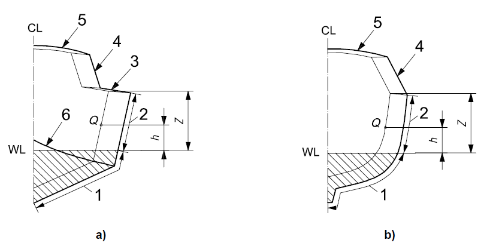
    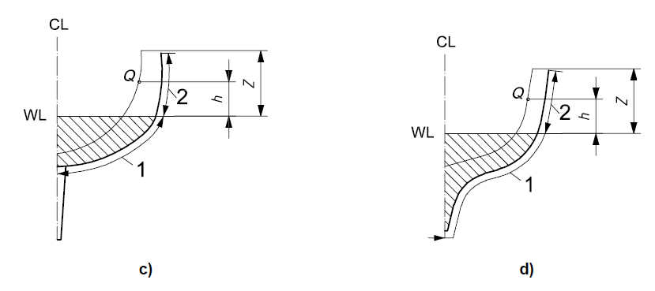
- **1.** bottom (hatched area)
- **2.** side
- **3.** deck
- **4.** superstructures
- **5.** superstructure top
- **6.** hard chine
  **Fig 4.1 Definitions of areas, and panel height above waterline**
  - **(2)** Side areas
    The extent of the side pressure area, which includes the transom, is the part of the hull not considered as belonging to the bottom area.
  - **(3)** Decks and superstructures
    Deck areas are parts of the deck exposed to weather and where persons are liable to walk. Cockpit bottom and top of benches and seating areas are included.
    Superstructure areas include all areas above deck level. **Table 4.3** lists the different superstructure types.
  - **(4)** Panel fully in one area or across two areas
    The general situation is as follows:
    - **(A)** Where the plate panel or stiffener is fully within a specified design area, e.g. bottom, side, deck, superstructures, etc., its design pressure shall be determined at the middle of the panel or at mid-length of the stiffener;
    - **(B)** Where the plate panel or stiffener extends over both bottom area and side area, its design pressure shall be determined as a constant pressure over the entire design area, calculated as a weighted average between the two pressures.

### Section 2 Pressure Adjusting Factors

#### 201. General

Final design pressure is adjusted by a set of factors according to design, craft type and location, etc.

#### 202. Design category factor,

The design category factor $k_DC$, defined in **Table 4.1**, takes into account the variation of pressure loads due to sea with design category.

| Design category | A | B | C | D |
| --- | --- | --- | --- | --- |
| $k_DC$ | 1 | 0.8 | 0.6 | 0.4 |

#### 203. Dynamic load factor,

- **1.** **General**
  The dynamic load factor $n_CG$ is considered to be close to the single amplitude acceleration measured at the craft centre of gravity at the relevant frequency for a certain period of time. This factor is the negative acceleration supported by the craft, either while slamming in an encountered wave at speed or falling from the crest of a wave into its trough. $n_CG$ is expressed in gs where 1 g is the acceleration due to gravity (9.81 $\mathrm{m}/s^2$).
- **2.** **Dynamic load factor** $n_CG$ **for planing non-sailing craft in planing mode**
  The dynamic load factor for planing craft running in planing mode shall be determined from Equation (1) or Equation (2).
  $n _{cg} = 0.32 \left( \frac{L _{WL}}{10 \times B _{C}} + 0.084 \right) \times (50 - \beta _{0.4} ) \times \frac{V ^{2} \times B _{C} ^{2}}{m _{LDC}}$ (1)
  where,
  V : for non-sailing craft, the maximum speed in calm water declared by the manufacturer, with the craft in $m_LDC$ conditions. This speed shall not be taken as < $2.36 \sqrt {L _{WL}}$.
  $B _{C}$ : the chine beam, measured at $0.4 \sqrt {L _{WL}}$ forward of its aft end, in metres (See **ISO 12215-5** Fig 1)
  $\beta _{0.4}$ : the deadrise angle at $0.4 \sqrt {L _{WL}}$ forward of its aft end (See **ISO 12215-5** Fig 1), not to be taken < 10°, nor > 30°, in degrees,
  Where Equation (1) gives an $n _{CG}$ value ≤ 3.0, the value given by Equation (1) shall be used.
  Where Equation (1) gives an $n _{CG}$ value > 3.0, that value or the value from Equation (2) shall be used.
  $n _{CG} = \frac{0.5 \times V}{m _{LDC} ^{0.17}}$ (2)
  In any case, $n _{CG}$ need not be taken > 7.
- **3.** **Dynamic load factor** $n _{CG}$ **for sailing craft and displacement non-sailing craft**
  For sailing craft, $n _{CG}$ is not used for pressure determination. It is only used in the calculation of $k _{L}$ for which purpose the value of $n _{CG}$ shall be taken as 3. For non-sailing craft where $n _{CG}$, determined using Equation (1), is < 3.0 from Equation (1), a value of 3.0 shall still be used for calculation of $k _{L}$.
- **4.** **Longitudinal pressure distribution factor** $k _{L}$
  The longitudinal pressure distribution factor $k _{L}$ takes into account the variation of pressure loads due to location on the craft. It shall be taken from **Fig 4.2** or calculated from Equation (3).
  $k _{L}$ is a function of the dynamic load factor defined below for non-sailing craft.
  $k _{L} = \frac{1 - 0.167 \times n _{CG}}{0.6} \frac{x}{L _{WL}} + 0.167 \times n _{CG}$ but not taken > 1 for $\frac{x}{L_W}L \leq 0.6$ (3)
  $k_L = 1$ for $\frac{x}{L_W}L > 0.6$
  where
  $n _{CG}$ is determined in accordance with **1 to 3**, but for the purposes of determination of $k _{L}$, $n _{CG}$ shall not be taken < 3 nor > 6;
  $\frac{x}{L_W}L$ is the position of the centre of the panel or middle of stiffener analysed proportional to $L_WL$, where $\frac{x}{L_W}L$ = 0 and 1 are respectively the aft end and fore end of $L_WL$.
  where
  $x$ is the longitudinal position of the centre of the panel or middle of stiffener forward of aft end of $L_WL$ in $m_LDC$ conditions, in metres.
  The overhangs fore and aft shall have the same value of $k _{L}$ as their respective end of the waterline.
  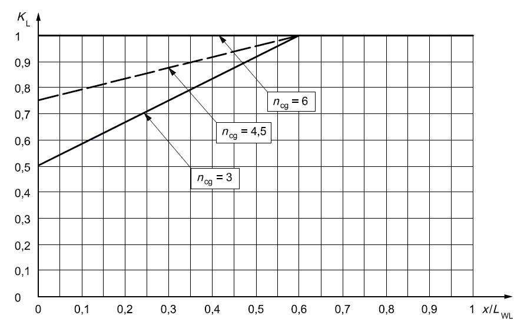
  **Fig 4.2 Longitudinal pressure distribution factor** $k _{L}$

#### 204. Area pressure reduction factor

- **1.** **General**
  The area pressure reduction factor $k _{AR}$ takes into account the variation of pressure loads due to panel or stiffener size.
  $k _{AR} = \frac{k _{R} \times 0.1 \times m _{LDC} ^{0.15}}{A _{D} ^{0.3}}$ (4)
  where
  $k_{ R}$ is the structural component and craft type factor:
  $k _{R} =1.0$ for bottom side and deck panels and stiffeners of planing non-sailing craft operating in planing mode;
  $k _{R} =1.5-3 \times 10 ^{-4} \times b$ for bottom side and deck panels of sailing craft, displacement non-sailing craft and planing non-sailing craft operating in displacement mode;
  $k _{R} =1-2 \times 10 ^{-4} \times l _{u}$ for bottom side and deck stiffeners of sailing craft, displacement non-sailing craft and planing non-sailing craft operating in displacement mode;
  $A _{D}$ is the design area, in square metres:
  $A _{D} =(l \times b) \times 10 ^{-6}$ for plating, but shall not be taken > $2.5\times b ^{2} \times 10 ^{-6}$;
  $A _{D} =(l _{u} \times s) \times 10 ^{-6}$ for stiffeners but need not be taken < $0.33\times l _{u} ^{2} \times 10 ^{-6}$;
  $b$ is the shorter dimension of the panel, in millimetres;
  $l$ is the longer dimension of the panel, in millimetres;
  $s$ is the stiffener spacing, in millimetres;
  $l_{ u}$ is the unsupported span of a stiffener, in millimetres.
- **2.** **Maximum and minimum value of** $k _{AR}$
  $k _{AR}$ shall not be taken > 1 and at less than the values given in **Table 4.2**.

  | Design category | Side and bottom single-skin panels and stiffeners Deck and superstructures sandwich and single-skin panels and stiffeners | Side and bottom sandwich panels ^a |   |   |
  | --- | --- | --- | --- | --- |
  | Design category | Side and bottom single-skin panels and stiffeners Deck and superstructures sandwich and single-skin panels and stiffeners | $\frac{x}{L _{WL}} \leq 0.4$ | $0.4< \frac{x}{L _{WL}} <0.6$ | $\frac{x}{L _{WL}} \geq 0.6$ |
  | A | 0.25 any craft hull and deck | 0.4 | Interpolation between values at $\frac{x}{L _{WL}}$= 0.4 and 0.6 | 0.5 sail bottom and topside 0.5 non-sailing bottom 0.4 non-sailing topside |
  | B | 0.25 any craft hull and deck | 0.4 | Interpolation between values at $\frac{x}{L _{WL}}$= 0.4 and 0.6 | 0.4 |
  | C & D | 0.25 any craft hull and deck | 0.4 |   |   |
  | ^a Minimum $k _{AR}$ applies to bending or shear strength and deflection requirement. |   |   |   |   |

#### 205. Hull side pressure reduction factor

The side pressure reduction factor $k _{Z}$ interpolates the pressure of the hull side between the (bottom) pressure at waterline and deck pressure at the top edge (see **Fig 4.1**).
$k _{Z} = \frac{Z-h}{Z}$ (5)
where
$Z$ is the height of top of hull or hull/deck limit above the fully loaded waterline, in metres;
$h$ is the height of centre of panel or middle of stiffener above the fully loaded waterline, in metres.

#### 206. Superstructure and deckhouse pressure reduction factor

The superstructure and deckhouse pressure reduction factor $k _{SUP}$ is defined according to location and craft type by **Table 4.3**.

| Position of panel | $k _{SUP}$ non-sailing and sail | Application |
| --- | --- | --- |
| Front | 1 | Any area |
| Side | 0.67 | Walking area |
| Side | 0.5 | Non-walking area |
| Aft end | 0.5 | Any area |
| Top, ≤ 800 mm above deck | 0.5 | Walking area |
| Top, > 800 mm above deck and upper tiers | 0.35 | Walking area |
| Upper tiers ^a | Minimum deck pressure 5 $\mathrm{kN}/m ^{3}$ | Non-walking area |
| ^a Elements not exposed to weather shall be considered as upper tiers. |   |   |

#### 207. Light and stable sailing craft pressure correcting factor for slamming

The light and stable sailing craft pressure correcting factor $k _{SL S}$ takes into account higher slamming pressures encountered on light and stable sailing craft when sailing upwind (i.e at an angle of up to 90° off true wind). It is defined below.
- In design category C and D: $k _{SL S} =1$
- In design category A and B:
- $k _{SL S} =1$ if $m _{LDC} > 5L _{WL} ^{3}$
- $k _{SLS} = \left( \frac{10GZ _{\max <60} \times L _{WL} ^{0.5}}{m _{LDC} ^{0.33}} \right) ^{0.5}$if $m _{LDC} \leq 5L _{WL} ^{3}$ but shall not be taken < 1 (6)
where
$GZ _{\max <60}$ is the maximum righting moment lever taken at a heel angle not > 60°, with all stability increasing devices such as canting keels or water ballast at their most effective position, in fully loaded condition, measured in metres.
If the maximum righting lever occurs at a heel angle > 60°, the value at 60° shall be taken. The crew shall be considered in upwind hiking position in the calculation of the above $GZ _{\max <60}$.

### Section 3 Design Pressure

#### 301. Non-sailing craft design pressure

- **1.** **General**
  The bottom pressure of non-sailing craft shall be the greater of (see NOTE 1)
  - the displacement mode bottom pressure $P _{BMD}$ defined in **2** or
  - the planing mode bottom pressure $P _{BMP}$ defined in **3**
  For non-sailing craft of design categories A and B, the side pressure shall be the greater of
  - the displacement mode side pressure $P _{SMD}$ defined in **4** or
  - the planing mode side pressure $P _{SMP}$ defined in **5**
  For non-sailing craft of design categories C and D, the side pressure shall be the one corresponding to planing or displacement mode: the “mode” to consider is the one where the bottom pressure, planing or displacement is the greater.
- **2.** **Non-sailing craft bottom pressure in displacement mode** $P _{BMD}$
  The bottom design pressure for non-sailing craft in displacement mode $P _{BMD}$ is the greater of
  $P _{BMD} =P _{BMDBASE} \times k _{AR} \times k _{DC} \times k _{L}$ $\mathrm{kN}/m ^{2}$ or (7)
  $P _{BMMIN} =0.45m _{LDC} ^{0.33} + \left( 0.9 \times L _{WL} \times k _{DC} \right)$ $\mathrm{kN}/m ^{2}$ (8)
  where
  $P _{BMDBASE} =2.4m _{LDC} ^{0.33} +20$ $\mathrm{kN}/m ^{2}$ (9)
- **3.** **Non-sailing craft bottom pressure in planing mode** $P _{BMP}$
  The bottom design pressure for planing non-sailing craft $P _{BMP}$ is the greater of
  $P _{BMP} =P _{BMPBASE} \times k _{AR} \times k _{L}$ $\mathrm{kN}/m ^{2}$ or (10)
  $P _{BMMIN} =0.45m _{LDC} ^{0.33} + \left( 0.9 \times L _{WL} \times k _{DC} \right)$ $\mathrm{kN}/m ^{2}$ (11)
  where
  $P _{BMPBASE} = \frac{0.1m _{LDC}}{L _{WL} \times B _{C}} \times \left( 1+k _{DC} ^{0.5} \times n _{CG} \right)$ $\mathrm{kN}/m ^{2}$
- **4.** **Non-sailing craft side pressure in displacement mode** $P _{SMD}$
  The side design pressure for non-sailing craft in displacement mode $P _{SMD}$ is the greater of
  $P _{SMD} = \left[ {} _{ } P _{DMBASE} +k _{Z} \times \left( P _{BMDBASE} -P _{DMBASE} \right) \right] \times k _{AR} \times k _{DC} \times k _{L}$ $\mathrm{kN}/m ^{2}$ or (12)
  $P _{SMMIN} =0.9L _{WL} \times k _{DC}$ $\mathrm{kN}/m ^{2}$ (13)
  For decked crafts, those parts of the side above hull-deck limit (e.g. bulwark) shall be assessed using $P _{SMMIN}$.
- **5.** **Non-sailing craft side pressure in planing mode** $P _{SMP}$
  For side areas located at or above waterline, the side design pressure $P _{SMP}$ for non-sailing craft in planing mode is the greater of
  $P _{SMP} = \left[ {} _{ } P _{DMBASE} +k _{Z} \times \left( 0.25P _{BMPBASE} -P _{DMBASE} \right) \right] \times k _{AR} \times k _{DC} \times k _{L}$ $\mathrm{kN}/m ^{2}$ or (14)
  $P _{SMMIN} =0.9L _{WL} \times k _{DC}$ $\mathrm{kN}/m ^{2}$ (15)
  For decked crafts, those parts of the side above hull-deck limit (e.g. bulwark) shall be assessed using $P _{SMMIN}$.
- **6.** **Non-sailing craft deck pressure** $P _{DM}$
  The design pressure $P _{DM}$ for the non-sailing craft weather deck is the greater of
  $P _{DM} =P _{DMBASE} \times k _{AR} \times k _{DC} \times k _{L}$ $\mathrm{kN}/m ^{2}$ or (16)
  $P _{DMMIN} =5$ $\mathrm{kN}/m ^{2}$
  where
  $P _{DMBASE} =0.35L _{WL} +14.6$ $\mathrm{kN}/m ^{2}$ (17)
- **7.** **Non-sailing craft pressure for superstructures and deckhouses** $P _{SUP M}$
  The design pressure $P _{SUP M}$ for superstructures and deckhouses exposed to weather of non-sailing craft is proportional to the deck pressure, but not to be taken less than $P_{ DMMIN}$ in walking areas:
  $P _{SUP M} =P _{DMBASE} \times k _{DC} \times k _{AR} \times k _{SUP}$ $\mathrm{kN}/m ^{2}$ (18)

#### 302. Sailing craft design pressure

- **1.** **Sailing craft bottom pressure**
  The bottom design pressure $P_{ BS}$ for sailing craft is the greater of
  $P _{BS} =P _{BSBASE} \times k _{AR} \times k _{DC} \times k _{L}$ $\mathrm{kN}/m ^{2}$ or (19)
  $P _{BSMIN} =0.35m _{LDC} ^{0.33} +1.4L _{WL} \times k _{DC}$ $\mathrm{kN}/m ^{2}$ (20)
  where
  $P _{BSBASE} = \left( 2m _{LDC} ^{0.33} +18 \right) \times k _{SLS}$ $\mathrm{kN}/m ^{2}$ (21)
- **2.** **Sailing craft side pressure** $P _{SS}$
  The side pressure for sailing craft $P _{SS}$ is the greater of
  $P _{SS} = \left[ P _{DSBASE} +k _{Z} \times (P _{BSBASE} -P _{DSBASE} ) \right] \times k _{AR} \times k _{DC} \times k _{L}$ $\mathrm{kN}/m ^{2}$ or (22)
  $P _{SSMIN} =1.4L _{WL} \times k _{DC}$ but shall not be taken < 5 $\mathrm{kN}/m ^{2}$ (23)
  where
  $P_{ BSBASE}$ is the base sailing craft bottom pressure defined in **3** ;
  $P_{ DSBASE}$ is the base sailing craft deck pressure.
- **3.** **Sailing craft deck pressure** $P_{ DS}$
  The design pressure for the weather deck of sailing craft $P_{ DS}$ is the greater of
  $P _{DS} =P _{DSBASE} \times k _{DC} \times k _{AR} \times k _{L}$ $\mathrm{kN}/m ^{2}$ (24)
  $P _{DSMIN} =5$ $\mathrm{kN}/m ^{2}$
  where
  $P _{DSBASE} =0.5m _{LDC} ^{0.33} +12$ $\mathrm{kN}/m ^{2}$ (25)
- **4.** **Sailing craft superstructure pressure** $P _{SUP S}$
  The design pressure $P _{SUP S}$ for superstructures and deckhouses exposed to weather on sailing craft is proportional to the deck pressure, but not to be taken less than $P _{DSMIN}$ in walking areas.
  $P _{SUP S} =P _{DSBASE} \times k _{AR} \times k _{DC} \times k _{SUP}$ $\mathrm{kN}/m ^{2}$ (26)

#### 303. Watertight bulkheads and integral tank boundaries design pressure

- **1.** **Watertight bulkheads pressure** $P _{WB}$
  The design pressure $P _{WB}$ on watertight bulkheads is
  $P _{WB} =7h _{B}$ $\mathrm{kN}/m ^{2}$
  where
  $h _{B}$ is the water head, in metres, measured as follows (see **Fig 4.3**):
  - for plating, the distance from a point 2/3 of the depth of the panel below the top of bulkhead;
  - for vertical stiffeners, the distance from a point 2/3 of the depth of the stiffener below top of bulkhead;
  - for horizontal stiffeners, the height measured from the stiffener to the top of bulkhead.
  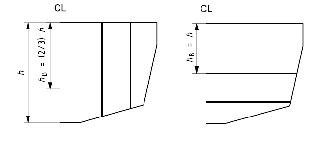
  Fig 4.3 Watertight bulkheads
- **2.** **Integral tank bulkheads and boundaries** $P _{TB}$
  The design pressure $P _{TB}$ on integral tank bulkheads and boundaries is:
  $P _{TB} =10h _{B}$ $\mathrm{kN}/m ^{2}$
  where
  $h _{B}$ is the water head, in metres, measured as follows (see **Fig 4.4**):
  - for plating, the distance from a point 2/3 of the depth of the panel below top of tank or top of overflow, whichever is the greater;
  - for vertical stiffeners, the distance from a point 2/3 of the depth of the stiffener below top of tank or top of the overflow, whichever is the greater;
  - for horizontal stiffeners, the height measured from the stiffener to top of tank or top of overflow, whichever is the greater.
  Where there are plates of different thicknesses or scantlings, $h _{B}$ for each plate panel shall be measured to the lowest point of the panel.
  For determination of the design pressure, the top of the overflow shall not be taken < 2 m above the top of the tank.
  Where the tanks form part of the deck, this has to be assessed according to the requirements of this section.
  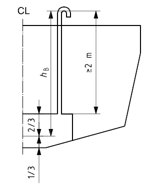
  **Fig 4.4 Measurement of dimensions for integral tank scantling calculation**
- **3.** **Wash plates**
  - **(1)** Tanks shall be subdivided as necessary by internal baffles or wash plates. Baffles or wash plates that support hull framing shall have scantlings equivalent to stiffeners located in the same position.
  - **(2)** Wash plates and wash bulkheads shall, in general, have an area of perforation not < 50 % of the total area of the bulkhead. The perforations shall be so arranged that the efficiency of the bulkheads as a support is not impaired.
  - **(3)** The general stiffener requirement for both minimum section modulus and second moment of area may be 50 % of that required for stiffener members of integral tanks.
- **4.** **Collision bulkheads**
  The scantlings of collision bulkheads, where fitted, shall not be less than required for integral tank bulkheads.
- **5.** **Non-watertight or partial bulkheads**
  Where a bulkhead is structural but non-watertight, the scantlings shall be as required in **507**.
- **6.** **Transmission of pillar loads**
  Bulkheads that are required to act as pillars in the way of under-deck girders subjected to concentrated loads and other structures that carry heavy loads shall be dimensioned according to these loads.

#### 304. Design pressures for structural components where would be ≤ 0.25

- **1.** The dynamic effect reduces as the structural component size increases. For very large structural components, the design pressure should be based on the hydrostatic pressure, since it is this load that can be reasonably taken as being distributed over the whole area of the component.
- **2.** “Very large” components are defined as panels or stiffeners for which the product of the shorter and longer panel sides (panels) or the span and spacing (stiffeners) exceeds the following areas:
  - for bottom structure, 30 % of the $L _{WL} \times B _{ WL}$ product;
  - for side structure, 30 % of the $L _{WL} \times D$ product, where $D$ is the hull total depth;
  - for deck structure, 30 % of the $L _{WL} \times B _{ WL}$ product.
  In such cases, irrespective of the pressure loads obtained from **301.** and **302.**, the design pressures need not be taken greater than:
  - for bottom structure, $0.45m _{LDC} ^{0.33}$, but not < 5 $\mathrm{kN}/m ^{2}$;
  - for side structure, $0.3m _{LDC} ^{0.33}$, but not < 5 $\mathrm{kN}/m ^{2}$;
  - for deck structure, 5 $\mathrm{kN}/m ^{2}$.

### Section 4 Scantling of Plating

#### 401. Plating - Scantling equations

- **1.** **Thickness adjustment factors for plating**
  - **(1)** Bending deflection factor $k _{1}$ for sandwich plating
    $k _{1}$ = 0.017
  - **(2)** Panel aspect ratio factor for strength $k _{2}$ and for stiffness $k _{3}$
    The panel aspect ratio factors for strength $k _{2}$ and for stiffness $k _{3}$ are given in **Table 4.4**.

    | Panel aspect ratio $l/b$ | Factor $k _{2}$ $k _{2}$ to be taken = 0.5 for laminated wood plating | Factor $k _{3}$ |
    | --- | --- | --- |
    | > 2.0 | 0.500 | 0.028 |
    | 2.0 | 0.497 | 0.028 |
    | 1.9 | 0.493 | 0.027 |
    | 1.8 | 0.487 | 0.027 |
    | 1.7 | 0.479 | 0.026 |
    | 1.6 | 0.468 | 0.025 |
    | 1.5 | 0.454 | 0.024 |
    | 1.4 | 0.436 | 0.023 |
    | 1.3 | 0.412 | 0.021 |
    | 1.2 | 0.383 | 0.019 |
    | 1.1 | 0.349 | 0.016 |
    | 1.0 | 0.308 | 0.014 |
    |   | $k _{2}$ can be evaluated by the formula below, keeping 0.308 < $k _{2}$ < 0.5 | $k _{3}$ can be evaluated by the formula below, keeping 0.014 < $k _{3}$ < 0.028 |
    |   | $k_2 = \frac{0.271(l/b)^2 + 0.910(l/b) - 0.554}{(l/b)^2 - 0.313(l/b) + 1.351}$ | $k _{3} = \frac{0.027(l/b) ^{2} - 0.029(l/b) + 0.011}{(l/b) ^{2} - 1.463(l/b) +1.108}$ |
  - **(3)** Curvature correction factor $k _{C}$ for curved plates
    The curvature correction factor $k _{C}$ is given by **Table 4.5**, where $c$ is the crown of the panel, as defined in **Fig 4.5**. $k _{C}$ shall not be taken < 0.5 nor > 1.

    | $c/b$ | $k _{C}$ |
    | --- | --- |
    | 0 to 0.03 | 1.0 |
    | 0.03 to 0.18 | $1.1- \frac{3.33c}{b}$ |
    | > 0.18 | 0.5 |

    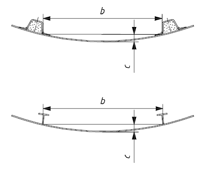
    **Fig 4.5 Measurement of convex curvature**
  - **(4)** Shear force and bending moment on a panel
    In the case on non-homogenous or non-isotropic material, the shear force and bending moment on panel are complying with following equations.
    $F _{d} = \sqrt {k _{C}} \times k _{SHC} \times P \times b \times 10 ^{-3}$ is the shear force in the middle of the $b$ dimension in N/mm (27)
    $M _{d} =83.33\times k _{C} ^{2} \times 2k _{2} \times P \times b ^{2} \times 10 ^{-6}$ is the bending moment in the $b$ direction in N/mm (28)
    Where the panel stiffness is not similar in the two principal panel directions, see **ISO 12215-5** Annex H.

#### 402. FRP single-skin plating

- **1.** **Design stress for FRP single-skin plating**

  | Material | Structural element | Design stress $\sigma_d$ $\mathrm{N}/mm ^{ 2}$ |
  | --- | --- | --- |
  | FRP single skin | All elements | 0.5 $\sigma_uf$ |

  where $\sigma_uf$ is the minimum ultimate flexural strength, in newtons per square millimetre.
- **2.** **Required thickness for FRP single-skin plating**
  The following equation is only valid if the mechanical properties in both directions differ by < 25 %; otherwise the panel shall be analysed in accordance with **ISO 12215-5** Annex H.
  The minimum required single-skin plating thickness $t$ is
  $t = b \times k _{C} \times \sqrt {\frac{P \times k _{2}}{1000 \times \sigma _{d}}}$ mm (29)
  where
  $b$ is the short dimension of the panel in millimetres;
  $k _{C}$ is the curvature correction factor for curved panels given in **Table 4.5**;
  $P$ is the design pressure (bottom, side, deck and superstructure, etc.) of the panel in accordance with **Ch.3**, in kilonewtons per square metre;
  $k _{2}$ is the panel aspect ratio factor for bending strength given in **Table 4.4**;
  $\sigma _{d}$ is the design stress for FRP plating given in **Table 4.6**, in newtons per square millimetre.
  For FRP, it shall be translated into a mass of dry fibre reinforcement $w _{f}$ (in kilograms per square metre) using the fibre mass content $\Psi$ according to the methods of **ISO 12215-5** Annex C,
- **3.** **Use of bulking material**
  - **(1)** General
    A bulking material is a core material (thick fabric, resin-rich felt, syntactic foam, etc.) intended to increase the thickness of a laminate. The bulking material functions either as an element only carrying shear (like in a sandwich) or as an elemnet of the laminate working both in shear transmission and flexure.
  - **(2)** Resin-saturated foam or felt
    Bulking materials having a strength > 3 $\mathrm{N}/mm ^{ 2}$ may be substituted for the central layers of a single-skin FRP laminate, providing the total thickness $t$ of single skin determined by Equation (29) according to the following requirements ;
    For a total thickness between 1.15$t$ and 1.30$t$, bulking thickness may be interpolated.
    - **(A)** if the total thickness is 1.15$t$, the bulking material thickness shall be 0.33 time the total laminate thhickness, i.e. a bulking thickness 0.383$t$ and each skin 0.383$t$ ;
    - **(B)** if the total thickness is 1.30$t$, the bulking material thickness shall be 0.50 time the total laminate thhickness, i.e. a bulking thickness 0.65$t$ and each skin 0.325$t$ ;

#### 403. Metal plating - Steel and aluminium alloy

- **1.** **Design stress for metal plating**

  | Material | Structual element | Design stress $\sigma _{d}$ ($\mathrm{N}/mm ^{ 2}$) |
  | --- | --- | --- |
  | Aluminium alloys | All elements | 0.6$\sigma _{uw} ^{a}$ or 0.9 $\sigma _{yw}$ |
  | Steel | All elements | 0.6$\sigma_u ^{a}$ or 0.9 $\sigma _{y}$ |
  | ^a The lesser value applies. |   |   |

  where
  for steel : $\sigma _{y}$ - Minimum tensile yield strength, ($\mathrm{N}/mm ^{ 2}$)
  $\sigma _{ut}$ - Minimum ultimate tensile strength, ($\mathrm{N}/mm ^{ 2}$)
  for welded aluminium : $\sigma _{yw}$ - Minimum tensile yield strength in the welded condition, ($\mathrm{N}/mm ^{ 2}$)
  $\sigma _{utw}$ - Minimum ultimate tensile strength in the welded condition ($\mathrm{N}/mm ^{ 2}$)
  For aluminium adhesively bonded or mechanically fastened, $\sigma _{y}$ and $\sigma _{ut}$ are in the unwelded state.
- **2.** **Required thickness for metal plating**
  The thickness of metal required by the following does not take into account any corrosion margin or the effect of fabrication techniques. Coating is considered to be used where needed.
  The minimum required thickness of the plating $t$ is
  $t = b \times k _{C} \times \sqrt {\frac{P \times k _{2}}{1000 \times \sigma _{d}}}$ (mm) (30)
  where
  $b$ : the short dimension of the panel (mm)
  $k _{C}$ : the curvaure correction factor for curved panels given in **Table 4.5**.
  $P$ : the design pressure in accordance with **Ch.3** (bottom, side, deck, etc.) ($\mathrm{kN}/m ^{2}$)
  $k _{2}$ : the panel aspect ratio factor for bending strength given in **Table 4.4**.
  $\sigma _{d}$ : the design stress for metal plating given in **Table 4.7**.

#### 404. Laminated wood or plywood single-skin plating

See **ISO 12215-5** Annex E for Laminated wood or plywood single-skin plating.

#### 405. FRP sandwich plating

- **1.** **General**
  This section applies to sandwich panels where the outer and inner skins are similar in layout, in strength and in elastic properties. The skin laminates are considered similar when the ratio of their mechanical properties is within 25 percent of each other.
  If this is not the case, the sandwich shall be analysed in accordance with **ISO 12215-5** Annex H. In any case, the thickness requirement from the shear load capacity of **4.** shall be followed.
- **2.** **Design stress for sandwich plating**

  | Material | Structural element | Design stress $\sigma _{dt}$ or $\sigma _{dc}$ ($\mathrm{N}/mm ^{ 2}$) |
  | --- | --- | --- |
  | FRP sandwich | Hull, deck, superstructures, structural and watertight bulkheads and tanks | In outer skin 0.5$\sigma _{ut}$ In inner skin 0.5$\sigma _{uc}$ or 0.3$root {3} of {E _{C} \times E _{CO} \times G _{C}}$ ^a |
  | ^a See **3.** and Equation (34). |   |   |

  where
  for FRP sandwich: $\sigma _{ut}$ is the minimum ultimate tensile strength of the skin, in newtons per square millimetre;
  $\sigma _{uc}$ is the minimum ultimate compressive strength of the skin, in newtons per square millimetre.
- **3.** **Minimum section modulus and second moment**
  The required minimum section modulus about the neutral axis of a strip of sandwich panel shall not be less than the values given by Equations (31) and (32).
  Minimum required section modulus of the outer skin of sandwich 1 cm wide:
  $SM _{0}$/1 cm width = $\frac{b ^{2} \times k _{C} ^{2} \times P \times k _{2}}{6 \times 10 ^{5} \times \sigma _{dto}}$ outer skin $\mathrm{cm} ^{3}$/cm (31)
  Minimum required section modulus of the inner skin of sandwich 1 cm wide:
  $SM _{i}$/1 cm width = $\frac{b ^{2} \times k _{C} ^{2} \times P \times k _{2}}{6 \times 10 ^{5} \times \sigma _{dci}}$ inner skin $\mathrm{cm} ^{3}$/cm (32)
  Minimum required second moment (moment of inertia) for a strip of sandwich 1 cm wide:
  $I$/1 cm width = $\frac{b ^{3} \times k _{C} ^{3} \times P \times k _{3}}{12 \times 10 ^{6} \times k _{1} \times E _{io}}$ $\mathrm{cm} ^{4}$/cm (33)
  where
  $b$ is the shorter dimension of the panel, but shall not be taken > 330 $L _{H}$, in millimetres;
  $k _{C}$ is the curvature correction factor for curved panels given in **Table 4.5**;
  $P$ is the pressure (bottom, side, deck, etc.) for the panel in accordance with Clause 8, in kilonewtons per square metre;
  $k _{2}$ is the panel aspect ratio factor for bending strength given in **Table 4.4**;
  $k _{3}$ is the panel aspect ratio factor for bending stiffness given in **Table 4.4**;
  $k _{1}$ = 0,017 is the sandwich bending deflection factor;
  $E _{io}$ is the mean of the inner and outer face moduli, in newtons per square millimetre (see Annex C); this approach is suitable when the inner and outer faces are similar, i.e. differ by not > 25 %.
  Design tensile stress on the outer skin:
  $\sigma _{dto}$ is the tensile design stress of the outer skin given in **Table 4.8**, i.e. 0.5 $\sigma _{ut}$, in newtons per square millimetre
  Design compressive stress on the inner skin:
  $\sigma _{dci}$ is the compression design stress of the inner skin which is the lesser of
- **0.** 5 $\sigma _{uc}$ or $0.3 root {3} of {E _{c} \times E _{co} \times G _{c}}$ (34)
  where
  $E _{C}$ is the compressive $E$ modulus of inner skin in 0°/90° in-plane axis of panel (see **ISO 12215-5** Annex C), in newtons per square millimetre,
  $E _{CO}$ is the compressive $E$ modulus of core, perpendicular to skins (see **ISO 12215-5** Annex D), in newtons per square millimetre;
  $G _{C}$ is the core shear modulus in the direction parallel to load (see **ISO 12215-5** Annex D), in newtons per square millimetre.
  Equation (33) may also be written as
  $EI$ per mm width = $\frac{b ^{3} \times k _{c} ^{3} \times P \times k _{3}}{12 \times 10 ^{3} \times k _{1}}$ $\mathrm{N}/mm ^{ 2}$/mm (35)
- **4.** **Thickness required by shear load capabilities**
  In order to transmit the shear load, the effective thickness of sandwich laminate $t _{s} _{}$ shall not be less than given by Equation (36):
  $t _{s} \geq \sqrt {k _{C}} \frac{k _{SHC} \times P \times b}{1000 \times \tau _{d}}$ mm (36)
  where
  $t _{s} = t _{c} +0.5(t _{i} +t _{o} )$ is the distance between mid-thickness of the skins of the sandwich, in millimetres;
  $k _{C}$ is the curvature correction factor defined in **Table 4.5**;
  $t _{o}$ is the thickness of the sandwich outer skin, excluding gel coat, in millimetres;
  $t _{i}$ is the thickness of the sandwich inner skin, in millimetres;
  $t _{c}$ is the thickness of the core, in millimetres;
  $k _{SHC}$ is the shear strength aspect ratio factor, given in **Table 4.10**;
  Where the elastic properties of the skins are different by > 25 % in the principal axes, $k _{SHC}$ shall not be taken < 0.465;
  $P$ is the pressure (bottom, side, deck, etc.) for the panel in accordance with **Ch. 3**, in kilonewtons per square metre;
  $b$ is the short dimension of the panel in millimetres;
  $\tau _{d}$ is the design shear stress of the core, according to **Table 4.9**, in newtons per square millimetre.

  | Material | Core design shear stress $\tau _{d}$ ($\mathrm{N}/mm ^{ 2}$) |
  | --- | --- |
  | End grain balsa | 0.5 $\tau _{u}$ |
  | Core having shear elongation at break < 35 % (cross-linked PVC, etc.) | 0.55 $\tau _{u}$ |
  | Core having shear elongation at break > 35 % (linear PVC, SAN, etc.) | 0.65 $\tau _{u}$ |
  | Honeycomb cores (to be compatible with marine application) | 0.5 $\tau _{u}$ |

  $\tau _{u}$ is the minimum ultimate core shear strength, in newtons per square millimetre.

  | $l/b$ | > 4.0 | 3.0 | 2.0 | 1.9 | 1.8 | 1.7 | 1.6 | 1.5 | 1.4 | 1.3 | 1.2 | 1.1 | 1.0 |
  | --- | --- | --- | --- | --- | --- | --- | --- | --- | --- | --- | --- | --- | --- |
  | $k _{SHC}$ ^a | 0.500 | 0.493 | 0.463 | 0.459 | 0.453 | 0.445 | 0.435 | 0.424 | 0.410 | 0.395 | 0.378 | 0.360 | 0.339 |
  | ^a The values of $k _{SHC}$ may be calculated by the equation $k _{SHC} =0.035+0.394\times \left( \frac{l}{b} \right) -0.99 \times \left( \frac{l}{b} \right) ^{2}$ for $l/b<2$ |   |   |   |   |   |   |   |   |   |   |   |   |   |
- **5.** **Minimum core shear strength**
  For bottom laminate, the value of the design shear strength of the core, as used in **4**, shall be at least in accordance with to **Table 4.11**.

  | $L _{H}$ (m) | < 10 | 10 to 15 | 15 to 24 |
  | --- | --- | --- | --- |
  | $\tau _{d}$ min ($\mathrm{N}/mm ^{ 2}$) | 0.25 | 0.25 + 0.03($L _{H}$ -10) | 0.40 |
- **6.** **Minimum sandwich skin fibre mass requirements**
  In order to reduce the risk of skin puncture or damage, the required minimal fibre mass in kilograms per square metre is given by
  $w _{os} =k _{DC} \times k _{4} \times k _{5} \times k _{6} \times (0.1L _{WL } +0.15)$ $\mathrm{kg}/m ^{2}$ (37)
  $w _{is} =0.7 \times w _{os}$ $\mathrm{kg}/m ^{2}$ (38)
  where
  $w _{os}$ is the fibre mass per square metre of the outer skin, in kilograms per square metre;
  $w _{is}$ is the fibre mass per square metre of the inner skin, in kilograms per square metre;
  $k _{4}$ is the sandwich minimum skin location factor where
  $k _{4}$ = 1 for hull bottom,
  $k _{4}$ = 0.9 for side shell,
  $k _{4}$ = 0.7 for deck,
  $k _{5}$ is the sandwich minimum skin fibre type factor where
  $k _{5}$ = 1.0 for E-glass reinforcement containing up to 50 % of chopped strand mat by mass,
  $k _{5}$ = 0.9 for continuous glass reinforcement (i.e. bi-axials, woven roving, unidirectionals, double bias or multiaxial),
  $k _{5}$ = 0.7 for continuous reinforcement using aramid or carbon or hybrids thereof,
  $k _{6}$ is the sandwich minimum skin care factor where
  $k _{6}$ = 0.9 for craft where the sandwich outer skin is expected to be punctured after hitting a sharp object;
  $k _{6}$ = 1 for other craft.
  If $k _{6}$ = 0.9, a statement warning that the craft may be punctured after hitting a sharp object and that this damage shall be quickly repaired shall be inserted in the owner's manual.

#### 406. Single-skin plating minimum thickness

- **1.** **Minimum thickness or mass of reinforcement for the hull**
  For metal or plywood $t _{\min } =k _{5} \times \left( A+k _{7} \times V+k _{8} \times m _{LDC} ^{0.33} \right)$ mm (39)
  For FRP, minimal dry fibre weight $w _{\min } =0.43\times k _{5} \times (A+k _{7} \times V+k _{8} \times m _{LDC} ^{0.33} )$ $\mathrm{kg}/m ^{2}$ (40)
  where
  $A$, $k _{5}$, $k _{7}$ and $k _{8}$are defined in **Table 4.12**. For sailing craft $V$ shall be taken as $2.36 \sqrt {L _{WL}}$.

  | Material | Position | $A$ | $k _{5}$ | $k _{7}$ | $k _{8}$ |
  | --- | --- | --- | --- | --- | --- |
  | FRP | Bottom | 1.5 | As defined in **405. 6.** | 0.03 | 0.15 |
  | FRP | Side/transom | 1.5 | As defined in **405. 6.** | 0 | 0.15 |
  | Aluminium | Bottom | 1.0 | $\sqrt {125/ \sigma _{y}}$ | 0.02 | 0.1 |
  | Aluminium | Side/transom | 1.0 | $\sqrt {125/ \sigma _{y}}$ | 0 | 0.1 |
  | Steel | Bottom | 1.0 | $\sqrt {240/ \sigma _{y}}$ | 0.015 | 0.08 |
  | Steel | Side/transom | 1.0 | $\sqrt {240/ \sigma _{y}}$ | 0 | 0.08 |
  | Plywood | Bottom | 3.0 | $\sqrt {30/ \sigma _{uf}}$ | 0.05 | 0.3 |
  | Plywood | Side/transom | 3.0 | $\sqrt {30/ \sigma _{uf}}$ | 0 | 0.3 |
- **2.** **Minimum deck thickness**
  The values of minimum deck thickness shall be derived from **Table 4.13**.

  | Location | Deck minimum required thickness $t _{\min }$ mm |   |   |   |
  | --- | --- | --- | --- | --- |
  | Location | FRP | Aluminium | Steel | Wood, plywood |
  | Deck | $k _{5} (1.45+0.14L _{WL} )$ | $1.35+0.06L _{WL}$ | $1.5+0.07L _{WL}$ | $3.8+0.17L _{WL}$ |

### Section 5 Requirements for Stiffening

#### 501. Stiffening members requirements

- **1.** **General**
  Plating shall be supported by an arrangement of stiffening members. The relative stiffness of primary and secondary stiffening members shall be such that loads are effectively transferred from secondary to primary, then to shell and bulkheads.

#### 502. Properties adjustment factors for stiffeners

- **1.** **Curvature factor for stiffeners** $k_{ CS}$
  The curvature factor $k_{ CS}$ shall be taken as listed in **Table 4.14**.

  | $\frac{c _{u}}{l _{u}}$ | $k_{ CS}$ |
  | --- | --- |
  | 0 to 0.03 | 1 |
  | 0.03 to 0.18 | 1.1-3.33($c _{u} /l _{u}$) |
  | > 0.18 | 0.5 |

  where
  $c _{u}$ is the crown of a curved stiffener, in millimetres;
  $k_{ CS}$ applies to convex or concave stiffeners; it shall not be taken < 0.5 nor > 1.
- **2.** **Stiffener shear area factor** $k _{SA}$
  The stiffener shear area factor $k _{SA}$ shall be taken as listed in **Table 4.15**.

  | Stiffener arrangements | $k _{SA}$ |
  | --- | --- |
  | Attached to the plating | 5 |
  | Other arrangements (floating) | 7.5 |

#### 503. Design stresses for stiffeners

| Material | Tensile and compressive design stress $\sigma _{d}$ $\mathrm{N}/mm ^{ 2}$ | Design shear stress $\tau _{d}$ $\mathrm{N}/mm ^{ 2}$ |
| --- | --- | --- |
| FRP | 0.5 $\sigma _{ut}$ and 0.5 $\sigma _{uc}$^a | 0.5 $\tau _{u}$ |
| Aluminium alloys | 0.7 $\sigma _{yw}$ ^b | 0.4 $\sigma _{yw}$ ^b |
| Steel | 0.8 $\sigma _{y}$ | 0.45 $\sigma _{y}$ |
| Laminated wooden frames | 0.45 $\sigma _{uf}$ ^c | 0.45 $\tau _{u}$ |
| Solid stock wooden frames | 0.4 $\sigma _{uf}$ ^c | 0.4 $\tau _{u}$ |
| Plywood on edge frames | 0.45 $\sigma _{uf}$ ^c | 0.45 $\tau _{u}$ |
| NOTE These design stresses also apply for the attached plating of the stiffener, according to its material. |   |   |
| ^a $\sigma _{c}$is considered where stressed in compression (usually the stiffener top flange) and $\sigma _{t}$ is considered where stressed in tension (usually the plating); both verifications need to be calculated. ^b For welded stiffeners. If aluminium stiffeners are not welded, i.e. riveted, glued, etc., the non-welded properties shall be used. ^c $\sigma_uf$ for laminated wooded stiffeners and $\sigma_uf$ for solid stock shall be taken from **ISO 12215-5 Table E.1**. For plywood, $\sigma_uf$ shall not be taken from **Table E.2** but from **Tables E.3** or **E.6**. |   |   |

$\tau _{u}$ is the minimum ultimate in-plane shear strength of the stiffener material, in newtons per square millimetre.

#### 504. Requirements for stiffeners made with similar materials

- **1.** **For any material: minimum section modulus and shear area**
  The web area $A _{W}$ and minimum section modulus $SM$ of stiffening members, including the effective plating of the stiffening members, shall be not less than the values given by Equations (41) and (42) :
  $A _{W} = \frac{k _{SA} \times P \times s \times l _{u}}{\tau _{d}} 10 ^{-6}$ $\mathrm{cm} ^{2}$ (41)
  $SM= \frac{83.33 \times k _{CS} \times P \times s \times l _{u} ^{2}}{\sigma _{d}} 10 ^{-9}$ $\mathrm{cm} ^{3}$ (42)
  where
  $k _{CS}$ is the curvature factor for stiffeners given in **Table 4.14**;
  $k _{SA}$ is the stiffener shear area factor given in **Table 4.15**;
  $P$ is the pressure (bottom, side, deck and superstructure, etc.) for the panel, in kilonewtons per square metre;
  $s$ is the spacing of stiffeners, in millimetres;
  $l _{u}$ is the length of the stiffener, in millimetres;
  $\sigma _{d}$ is the design stress for stiffeners given in **Table 4.16**, in newtons per square millimetre;
  $A _{W}$ is the shear area (cross-sectional area of stiffener shear web), in square centimetres;
  $\tau _{d}$ is the design shear stress of the shear web as defined in **Table 4.16**, in newtons per square millimetre.
- **2.** **Supplementary stiffness requirements for FRP**
  For FRP stiffeners, the second moment of area, including the effective plating, shall not be less than given by the following formula.
  $I= \frac{26 \times k _{CS} ^{1.5} \times P \times s \times l _{u} ^{3}}{k _{1S} \times E _{tc}} 10 ^{-11}$ $\mathrm{cm} ^{4}$ (43)
  where
  $E _{tc}$ is the mean of compressive/tensile modulus of the material (see **ISO 12215-5** Annex C), in newtons per square millimetre;
  $k _{1S}$ = 0.05 is the deflection factor for stiffeners (allowable relative deflection $y/l _{u}$).

#### 505. Requirements for stiffeners made with dissimilar materials

In case that dissimilar materials which mechanical properties differ by > 25 % from each other are used, see **ISO 12215-5** 11.5.

#### 506. Effective plating

The lower flange of stiffening members working in bending is a band of plating called “effective plating” as shown in **Fig 4.6**. The effective extent of plating be shall be calculated according to **Table 4.17**, but shall not be taken greater than the actual stiffener spacing.
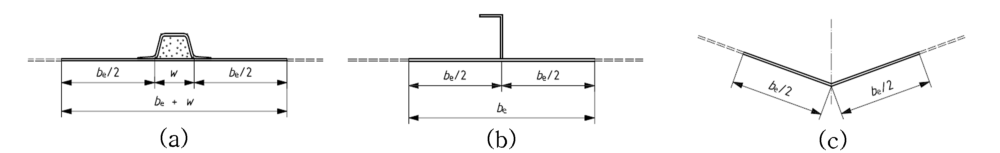
Fig 4.6 Sketch showing the effective extent of plating around a stiffener (top hat, L and chine)

| Material | Steel | Aluminium | FRP single skin | FRP sandwich | Wood, plywood |
| --- | --- | --- | --- | --- | --- |
| $b _{e}$ | 80 $t$ | 60 $t$ | 20 $t$ | 20$\left( t _{o} +t _{i} \right)$^a | 15 $t$ |
| ^a The attached plating is 20 times both inner and outer skins, separated by the core, which is considered ineffective, i.e $E _{core} =0$. |   |   |   |   |   |

Where the stiffener has a significant width it may be added to be [see **Fig 4.6** a)].
The above equations are valid for any stiffener: stringer, frame, bulkhead, etc.
For stiffeners along an opening, the effective extent shall be taken as 50 % of the extent as given above.

#### 507. Structural bulkheads

- **1.** **Plywood bulkheads**
  The thickness of unstiffened solid plywood bulkheads shall be not less than
  $t _{b} = 7.0 D _{b}$ mm (44)
  where
  $D _{b}$ is the depth of the bulkhead from bottom of canoe body to deck at side, in metres.
- **2.** **Sandwich bulkheads**
  - **(1)** Core
    In addition to the requirements of (2) and (3)
    - the core shear strength shall be in accordance with to **405. 5.** and **Table 4.11**,
    - the core thickness shall be at least five times the thickness of the thinnest skin.
  - **(2)** Sandwich bulkheads with identical plywood skins
    The thickness of skins $t _{s}$ and of core $t _{c}$ shall be such that
    $t _{s} \times t _{c} \geq \frac{t _{b} ^{2}}{6}$ $\mathrm{mm} ^{2}$ and $t _{s} \times \frac{t _{c} ^{2}}{2} \geq \frac{t _{b} ^{3}}{12}$ $\mathrm{mm} ^{3}$ (45)
    where
    $t _{b}$ is the solid plywood bulkhead thickness defined by Equation (54);
    $t _{s}$ and $t _{c}$ are as defined in **405. 4.**
  - **(3)** Sandwich bulkheads with identical FRP skins
    The thickness of skins ts and of core tc shall be such that
    $t _{s} \times t _{c} \geq \frac{t _{b} ^{2}}{6} \left( \frac{25}{\sigma _{d}} \right)$ mm and $t _{s} \times \frac{t _{c} ^{2}}{2} \geq \frac{t _{b} ^{3}}{12} \left( \frac{4000}{E _{io}} \right)$ mm (46)
    where
    $t _{b}$ is the solid plywood bulkhead thickness
- **3.** **Metal bulkheads**
  They shall be calculated as watertight bulkheads.

### Section 6 Structural Arrangement

#### 601. Stiffening

- **1.** **General**
  - **(1)** The hull, deck and deckhouse plating shall be stiffened as necessary, by any combination of longitudinal and transverse conventional stiffeners, structural bulkheads, internal furniture such as berths and shelves, and internal tray mouldings, providing these may be considered as “load bearing”. The arrangement is usually made with stiffeners supported by deeper and stronger stiffeners, crossing perpendicularly.
  - **(2)** **Fig 4.7, 4.8** and **4.9** illustrate characteristic arrangements that comply with good practice. These figures apply to both sailing and non-sailing craft, and combinations of arrangement within a single craft are acceptable. Small crafts (generally those of hull length less than about 9 m in length) employ natural stiffeners such as deck edge, round bilges, hard chines, keel, etc. to define panels and then need no further stiffening.
  - **(3)** Equivalence criteria
    Other arrangements are possible, but these shall follow good practice principles (as illustrated by **Fig 4.7, 4.8** and **4.9**) of effective and smooth transmission of stresses due to pressure loads and concentrated loads (mast, keel, rudder, etc) from the load point into the supporting structure (see **603.** and **604.**).
  - **(4)** Longitudinally framed craft
    In the example in **Fig 4.7**, the hull shell is stiffened by longitudinal secondary stiffeners supported by transverse primary stiffeners, such as web frames, bulkheads and deep floors. The example given is typical for an FRP craft.
  - **(5)** Transversally framed craft
    In the example in **Fig 4.8**, the hull shell is stiffened by transverse frames (secondary stiffeners) that are typically supported at the centreline, at the chines or turn of bilge and at deck level. In larger crafts, girders (primary stiffeners) may be fitted, which support these frames and also assist in carrying hull girder loads.
  - **(6)** Small, slow craft stiffened by keel, gunwale stringer, structural sole and thwarts
    It is common for small craft (i.e. those of hull length less than 6 m) to have no specific stiffeners. However, components not primarily intended to be stiffeners, such as internal partitions may act as such. These components may need to be reinforced for this other role as “stiffeners”. In **Fig 4.9**, the thwarts, front and aft locker, cockpit sole and gunwale are used in this way.
  - **(7)** Load bearing elements
    To be considered as “load bearing”, the supporting member shall be effectively attached to the plating by any combination of welding (continuous or intermittent), bonding with structural quality adhesive (e.g. use of epoxy fillets) or fibre reinforced bonding angles or other methods appropriate to the materials. In addition, the member in question shall be constructed of material acceptable for hull construction in accordance with **Ch 4**, and shall be able to carry the forces and moments associated with the effective support assumption as defined there.
    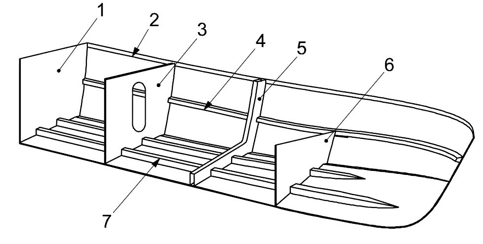
    1 transom 2 gunwale stringer 3 bulkhead
    4 side longitudinal stiffener (stringer) 5 web frame 6 deep floor
    7 bottom longitudinal stiffener (girder or stringer)
    NOTE 1, 3, 5 and 6 are primary stiffeners; 2, 4 and 7 are secondary stiffeners.
    **Fig 4.7 Longitudinally framed small craft**
    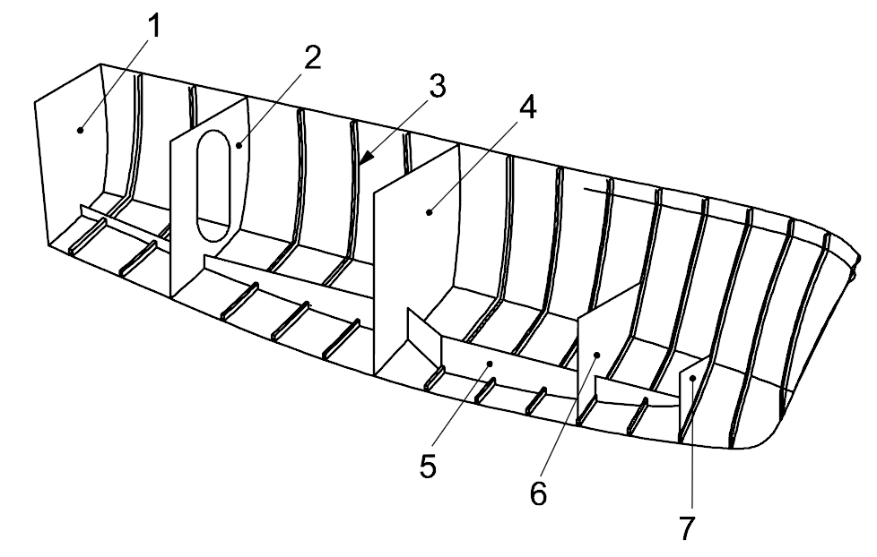
    1 transom 2 bulkhead 3 frame
    4 bulkhead 5 bottom girder 6 deep floor
    7 deep floor
    **Fig 4.8 Transversally framed small craft**
    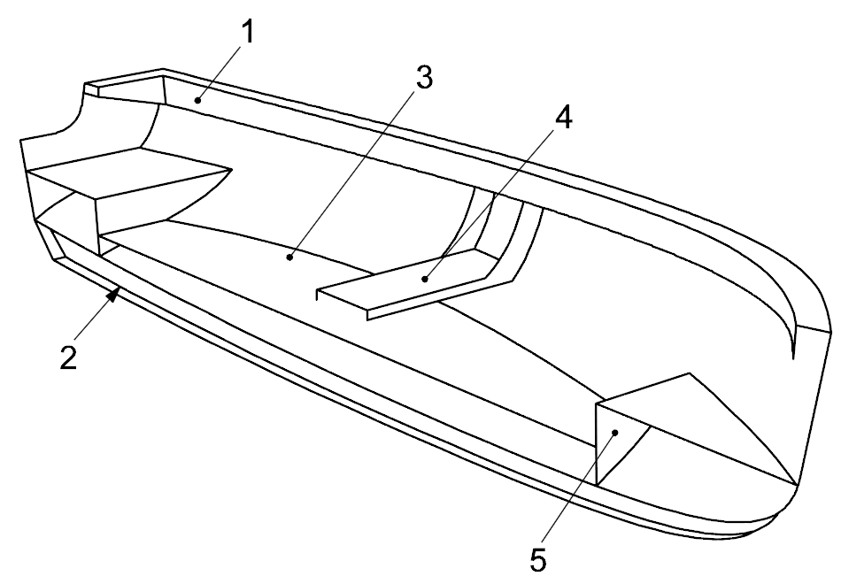
    1 gunwale stringer 2 keel 3 structural sole
    4 thwarts 5 deep floor
    **Fig 4.9 Small, slow craft stiffened by keel, gunwale stringer, structural sole and thwarts**

#### 602. Hull girder strength

This section is based on the assumption that hull and deck scantlings are governed by local loads, which is usually the case for craft of normal proportions and is especially so for longitudinally framed craft.
For the following craft, an explicit longitudinal strength and buckling assessment is recommended:
- transversely framed non-sailing craft where $\frac{V _{\max}}{\sqrt {L _{WL}}} >6$;
- transversely framed sailing crafts experiencing large rig loads;
- craft with large deck openings or craft with $\frac{L _{H}}{D _{\max}} >12$

#### 603. Load transfer

- **1.** **General**
  The structural geometry shall be so arranged and detailed as to ensure a smooth transfer of loads throughout the structure. Concentrated loads (e.g. mast step for a keel stepped mast, mast pillar for a deck stepped mast) shall be transmitted into the surrounding structure by a series of stiff supporting members. In no case shall concentrated load points be landed on unsupported plating. In general, concentrated loads shall be introduced into the adjacent structural elements by shear load carrying brackets, flanges or floors. Knife edge load crossing shall be avoided (see **5**).
  **2** gives examples of good practice load transfer arrangements. Other arrangements need to be specifically engineered.
- **2.** **Examples of good practice load transfer arrangements**
  The list below gives examples of good practice load transfer arrangements.
  - **(1)** Stiffeners (generally angle bar, tee section, top hats or flat bars, etc.) and girders (including engine girders) do not terminate abruptly, but are suitably terminated to develop their bending strength and shear strength at the supporting member, with brackets or without brackets, but with structurally effective attachment of web and flange to the supporting member (see **Fig 4.10**). Where stiffeners are lightly loaded, they may have tapered (sniped) ends, provided the slope of the taper is at least 30 % and that the plating between the end of the stiffener and the supporting structure is designed or able to transmit the shear force and bending moment of the tapered stiffener [see **Fig 4.10** c)].
  - **(2)** Floors smoothly taper in depth towards that of the attached transverse frame. Where no transverse frames are fitted, the floor is attached to the side shell over a sufficient length to ensure that the shear force (due to keel moment or bottom pressure) can be adequately transferred to the side shell (see **Fig 4.11**).
  - **(3)** Cut-outs and sharp corners are avoided in load-carrying structures such as shell, deck, primary and secondary stiffening members. Where cut-outs cannot be avoided, the depth of any cut-out does not exceed 50 % of the depth of the web of the member, and the length of the cut-out does not exceed 75 % of the depth of the web of the member, unless effectively engineered. Cut-outs shall have radius corners not less than 12 % of the cut-out depth or 30 mm, whichever is the greater. Cut-outs are avoided within 20 % of the span from the support points and by way of concentrated loads on the member.
- **3.** **Openings in deck and shell according to good practise**
  Openings in decks and shell have radius corners not less than 12 % of the width of opening, but need not exceed 300 mm and are not less than 50 mm. This does not apply where the edges are reinforced by a structural flat bar or equivalent (see **Fig 4.12**).
  It is also good practice to minimize sharp cut-outs in structurally loaded panels and stiffeners, unless accordingly reinforced.
  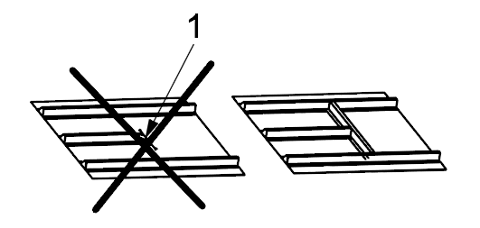
  a) Stiffener ending in panel, poor practice and good practice solution
  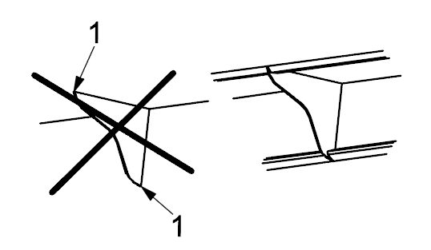
  b) Bracket, poor practice and good practice solution
  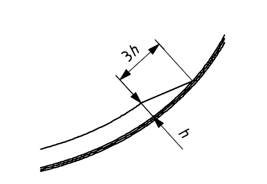
  c) Tapered ends acceptable provided the vertical load can be taken by the shell
  1 risk of crack
  $h$ height of stiffener
  **Fig 4.10 Detail of stringer and bracket end**
- **4.** **Floating frame systems**
  Floating frame systems (see **Fig 4.13**) are those where one set of stiffeners (the “floated” stiffeners) effectively sits on top of another set without being directly attached to the hull plating. Only the second set (the “attached” stiffener) is directly attached to the plating. When analysing such floating frames, the effective plating of the floating frame is to be taken as zero.
  For all materials, particular metal crafts or wooden crafts that use plywood frames, these “floating” frames are normally I beams “attached” to a T, L or U stringer. Attention shall be given to the strength of the weld or glued area between the “floating” frame and stringer, torsional (tripping) or shear buckling of the stringer and the frame transverse web and knife edge load crossing (see **5.**), which requires explicit calculation. By way of Guidance, the weld or glue area shall generally not be less than the stiffener web area, $A _{W}$, Equation (41).
  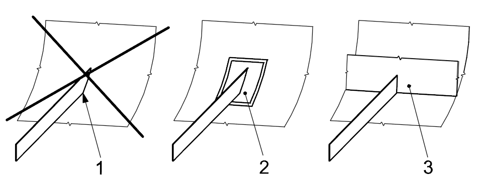
  a) Stiffener ending in shell, poor practice and good practice
  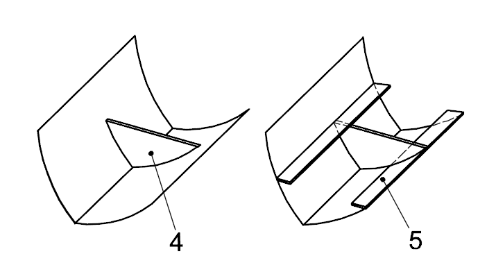
  b) Deep floor/partial bulkhead
  1 hard spot, risk of crack, poor practice
  2 reinforced plating, acceptable practice
  3 transverse floor or bulkhead, good practice
  4 no longitudinal structure at top end of deep floor, acceptable practice
  5 cabin sole, deck or longitudinal stiffener on top of floor, good practice
  **Fig 4.11 Detail of stiffener ending on the plating**
  Dimensions in millimetres
  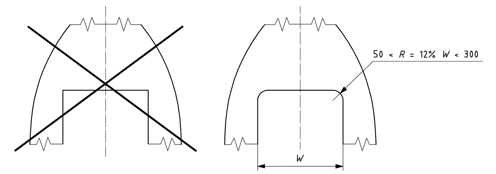
  $R$ radius corner
  $W$ width of opening
  **Fig 4.12 Deck and shell openings corner radius**
  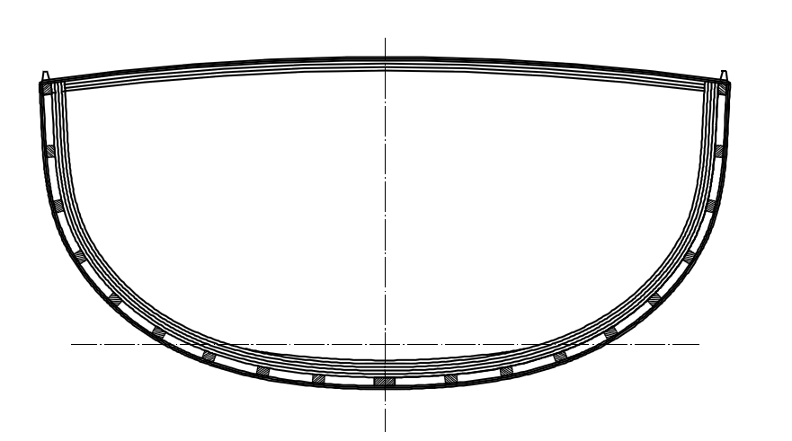
  **Fig 4.13 Section of a wooden craft with floating frame**
- **5.** **Knife edge load crossing**
  Knife edge load crossing happens when two load carrying members cross at a right angle. This shall be avoided as there is a high stress concentration at the point of connection of the two members. In the case of knife edge load crossing, at least one of the members shall be reinforced as shown in **Fig 4.14**.
  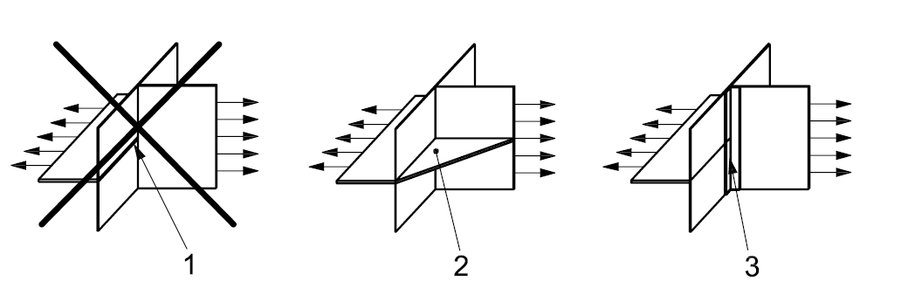
  1 stress concentration (knife edge load crossing), poor practice
  2 bracket transferring the load from the horizontal plate to the vertical plate, good practice
  3 reinforcement with an L shaped stiffener or tabbing (for use in lightly loaded areas only), acceptable practice
  **Fig 4.14 Knife edge load crossing**
- **6.** **Equivalent criteria**
  Other arrangements are possible but these shall follow good practice principles (as illustrated by **Fig 4.10** to **4.14**) of effective and smooth transmission of stresses, generous radii, use of connecting brackets, gentle tapering of material, avoidance of stress concentration features and careful placement of any lightening holes.

#### 604. Determination of stiffener spans

- **1.** **General**
  In order to establish whether a stiffener complies with the requirements of the **Ch.6** series, the spacing and span of the stiffener being considered shall be established.
  The spacing is the distance between successive stiffeners, measured perpendicular to the stiffener axis. The span is the distance between support points. It is important to appreciate that span exercises a very strong influence on the bending strength and deflection of any stiffener.
  In order to simplify the calculations, this chapter considers stiffeners as isolated beams under a uniformly distributed pressure load. ISO 12215-5 provides Guidance on locating support points for isolated stiffeners.
  In reality, small craft structures often comprise a set of transverse stiffeners that intersect a set of longitudinal stiffeners. This may be termed a “grid”. Each point where a transverse member crosses a longitudinal member is termed an “intersection point”.
  In some cases, it is correct to take the stiffener span as the distance between adjacent intersection points, but in other cases this is too optimistic. The support which one set of crossing members offers to the other set is a complex function of the relative flexural rigidity ($EI$) and the grid dimensions between well defined supports such as bulkheads, side shell, partitions and other very deep members. This subclause provides procedures for determination of stiffener spans.
- **2.** **Deep stiffeners crossing shallow stiffeners**
  Where one set of members have a depth of at least twice that of the other set, these deeper stiffeners are called “primary members” and the shallower stiffeners are called “secondary members”.
  The span of primary members, $l _{u}$, is the grid dimension in the direction of the primary member.
  The span of secondary members, $l _{u}$, is the spacing of the primary member.
- **3.** **Stiffeners crossing similar depth stiffeners**
  - **(1)** General
    This arrangement is commonly found in small craft as a tray moulding (see **Fig 4.15**) and is often referred to as “egg-box” style. Neither set of members can be categorized as primary or secondary as the degree to which one set supports the other is indeterminate by simple means of assessment.
    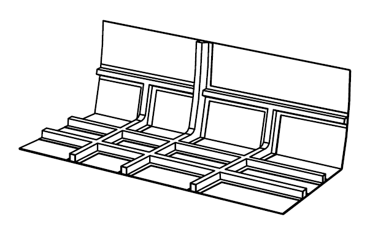
    Fig 4.15 “Egg-box” style tray mouldings
    In such cases, the procedure described in (2) and (3) shall be adopted.
  - **(2)** Stiffeners running in the shorter of the grid dimensions
    The span used to determine the design bending moment and shear force shall be taken as 60 % of the grid dimension.
    The design pressure shall be obtained using a design area, $A _{D}$, based on the stiffener spacing and 60 % of the grid dimension.
  - **(3)** Stiffeners running in the longer of the grid dimensions
    The span to be used to determine the design bending moment and shear force shall be taken as 150 % of the distance between intersection points.
    The design pressure shall be obtained using a design area, $A _{D}$, based on the stiffener spacing and 150 % of the distance between intersection points.

#### 605. Detail of structures

The items which is not mentioned in this chapter are to be in accordance with **ISO 12215-6**. 
