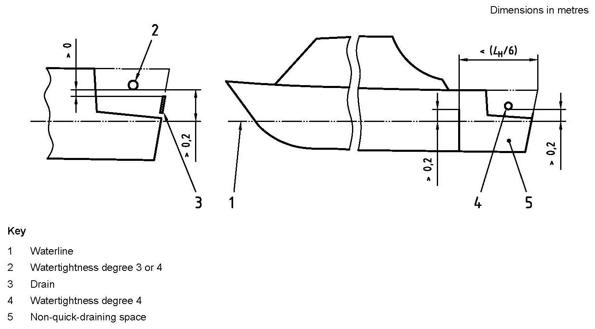
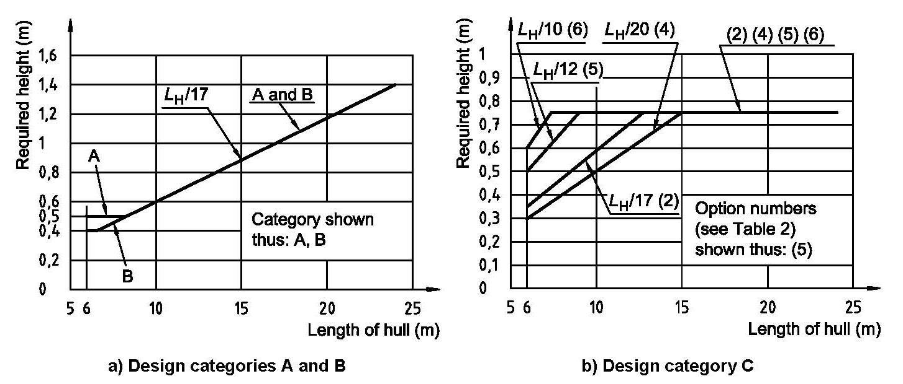
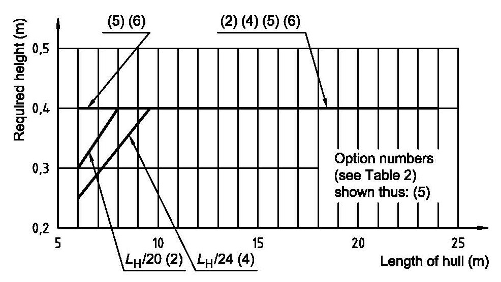
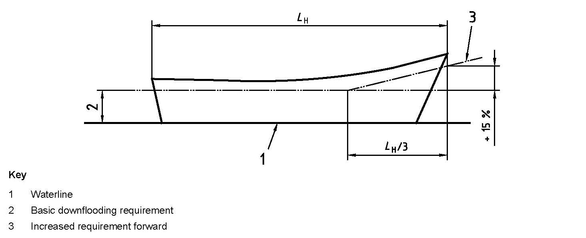
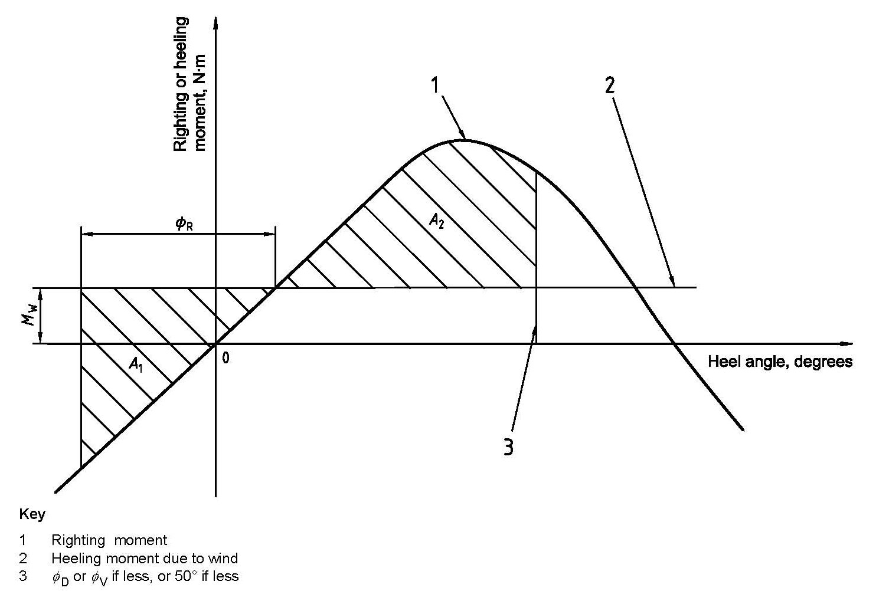
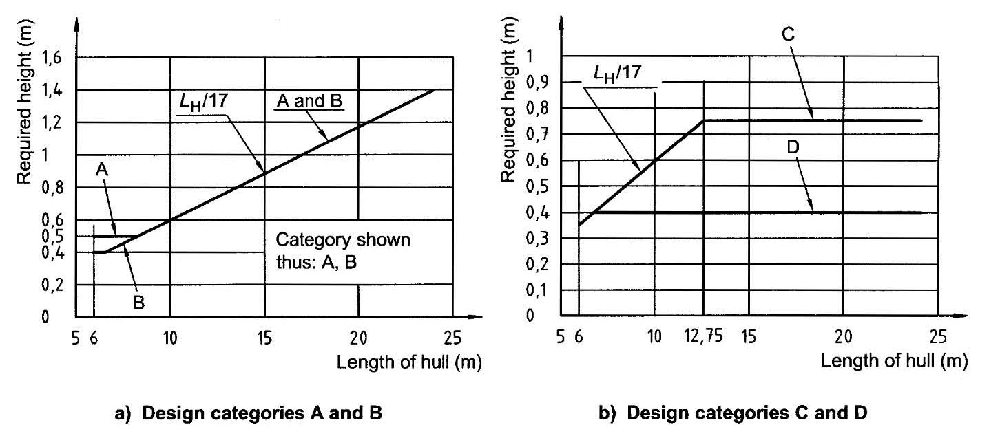
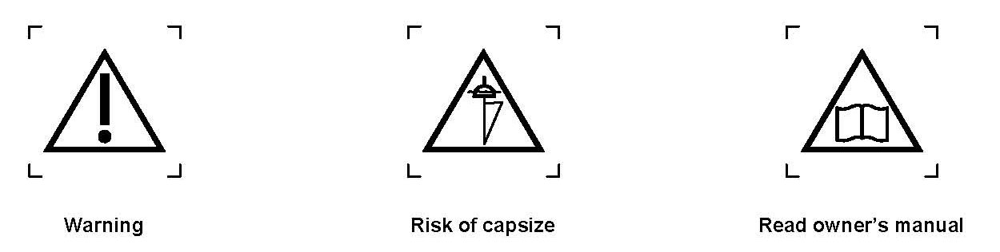
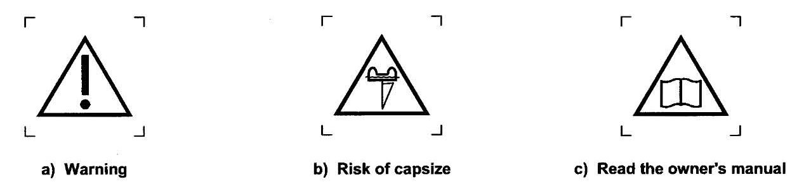
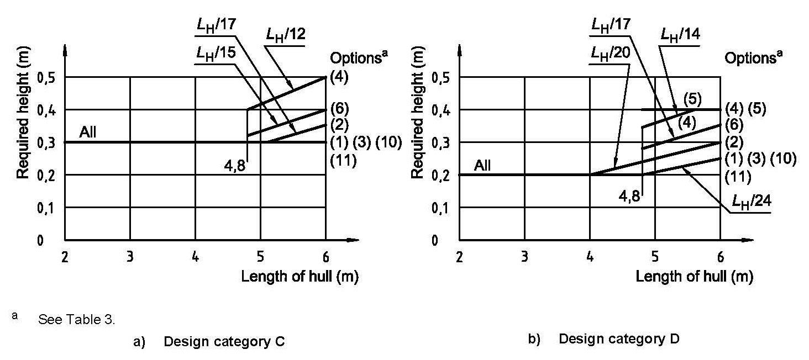
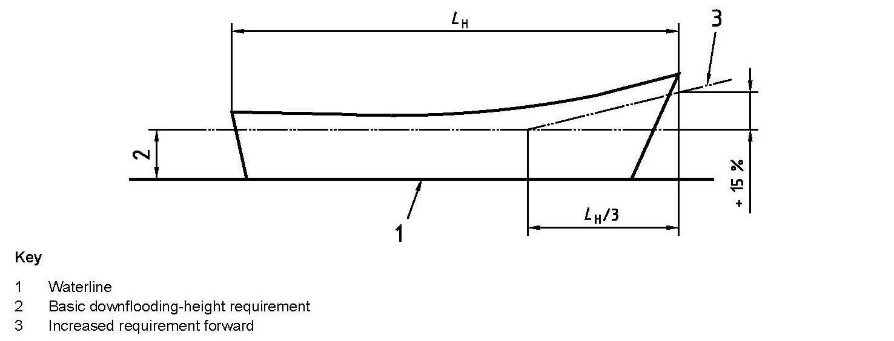

# Guidance for Recreational Crafts

> OTHER RULES AND GUIDANCE / GC-06-E / 2025 / EN / Guidance

## CHAPTER 5 Stability and buoyancy

### Section 1 General

#### 101. Scope

This chapter specifies methods for evaluating the stability and buoyancy of intact (l.e. undamaged) crafts. The flotation characteristics of crafts vulnerable to swamping are also encompassed.
The evaluation of stability and buoyancy properties using this part will enable the craft to be assigned to a design category (A, B, C or D) appropriate to its design and maximum total load.

#### 102. Definitions

The definitions of terms used in this chapter are as follows.

- **1.** **Windage area (**$A _{LV}$**)**
  projected profile area of hull, superstructures, deckhouses and spars above the waterline at the appropriate loading condition, the craft being upright ($\mathrm{m} ^{2}$)
- **2.** **Flotation element**
  element which provides buoyancy to the craft and thus influences its flotation characteristics
  - **(1)** air tank
    tank made of hull construction material, integral with hull or deck structure
  - **(2)** air container
    container made of stiff material, not integral with the hull or deck structure
  - **(3)** low density material
    material with a specific gravity of less than 1,0 primarily incorporated into the craft to enhance the buoyancy when swamped
  - **(4)** rib collar
    heavy duty tubular collar fitted around the periphery of the craft and always intended to be inflated whenever the craft is being used
  - **(5)** inflated bag
    bag made of flexible material, not integral with hull or deck, accessible for visual inspection and intended always to be inflated when the craft is being used
- **3.** **Inclining experiment**
  method by which the vertical position of the centre of gravity (VCG) of a craft can be determined
- **4.** **Loaded waterline**
  waterline of the craft when upright at loaded displacement mass and design trim
- **5.** **Capsize**
  event when a craft reaches any heel angle from which it is unable to recover to equilibrium near the upright without intervention
- **6.** **Knockdown**
  event when a craft reaches a heel angle sufficient to immerse the masthead, and from which it mayor may not recover without intervention
- **7.** **Inversion**
  event when a craft becomes upside down

### Section 2 Non-sailing Crafts of Hull Length Greater than or Equal to 6 m

#### 201. Tests to be applied

Non-sailing crafts of hull length greater than or equal to 6 m shall comply with all the requirements of anyone of six options according to amount of flotation and decking, and whether the craft is fitted with suitable recesses. These options and the tests to be applied (as described in **202.**) are given in **Table 5.1**.

| Option | 1 | 2 | 3 | 4 | 5 | 6 |
| --- | --- | --- | --- | --- | --- | --- |
| Categories possible | A and B | C and D | B | C and D | C and D | C and D |
| Decking or covering | Fully decked | Fully decked | Any amount | Any amount | Partially decked | Any amount |
| Downflooding openings | **202. 1 (1)** | **202. 1 (1)** | **202. 1 (1)** | **202. 1 (1)** | **202. 1 (1)** | **202. 1 (1)** |
| Downflooding-height test | **202. 1 (2)** | **202. 1 (2)** | **202. 1 (2)** | **202. 1 (2)**(1) | **202. 1 (2)** | **202. 1 (2)** |
| Offset-load test | **202. 2** | **202. 2** | **202. 2** | **202. 2** | **202. 2** | **202. 2** |
| Resistance to waves + wind | **202. 3** |   | **202. 3** |   |   |   |
| Heel due to wind action |   | **202. 4**(2) |   | **202. 4**(2) | **202. 4**(2) | **202. 4**(2) |
| Flotation requirements |   |   | **202. 5** | **202. 5** |   |   |
| Flotation material |   |   | Annex F(3) | Annex F(3) |   |   |
| (NOTES) (1) This test is not required for crafts assessed using option 4 if, during the swamped load test in normative **ISO 12217-1** Annex E, the craft has been shown to support an equivalent dry mass of 133 % of the maximum total load. (2) The application of **202. 4** is only required for crafts where $A _{LV} \geq L _{H} B _{H}$. (3) See **ISO 12217-1** Annex F. |   |   |   |   |   |   |

#### 202. Requirements of non-sailing crafts of hull length greater than or equal to 6 m

- **1.** **Downflooding**
  - **(1)** Downflooding openings
    
    Fig 5.1 Openings in outboard engine wells
    - **(A)** The requirements given as follows shall apply to all downflooding openings except:
      - **(a)** watertight recesses with a combined volume less than $L _{H} B _{H} F _{M} /40$, or quick-draining recesses;
      - **(b)** piped drains from quick-draining recesses or from watertight recesses which, if filled, would not lead to downflooding or capsize when the craft is upright;
      - **(c)** non-opening appliances;
      - **(d)** opening appliances located in the topsides which comply with **ISO 12216** to tightness degree 2 and which are referenced in the Owner's Manual (see normative **ISO 12217-1** Annex G) and are clearly marked "WATERTIGHT CLOSURE - KEEP SHUT WHEN UNDER WAY"; and which are
      - **(i)** emergency escape hatches or appliances fitted with screwed closures, or
        - **(ii)** in a compartment of such restricted volume that, even if flooded, the craft satisfies all the requirements, or
        - **(iii)** in a craft of design category C or D and which, when at loaded displacement mass, would not sink if the affected compartment was flooded as a result of the appliance being left open;
      - **(e)** opening appliances located inboard of the topsides which comply with **ISO 12216** to tightness degree 2 and which are referenced in the Owner's Manual and are clearly marked "WATERTIGHT CLOSURE - KEEP SHUT WHEN UNDER WAY";
      - **(f)** engine exhausts or other openings that are only connected to watertight systems;
      - **(g)** openings in the sides of outboard engine wells which are of
      - **(i)** watertightness degree 2 and having the lowest point of downflooding more than 0.1 m above the loaded waterline, or
        - **(ii)** watertightness degree 3 and having the lowest point of downflooding more than 0.2 m above the loaded waterline and also above the top of the transom in way of the engine mounting, provided that well drain holes are fitted, see **Fig 5.1**, or
        - **(iii)** watertightness degree 4 and having the lowest point of downflooding more than 0.2 m above the loaded waterline and also above the top of the transom in way of the engine mounting, provided that well drain holes are fitted, and that the part of the interior or non-quick-draining spaces into which water may be admitted has a length less than $L _{H} /6$ and from which water up to 0,2 m above the loaded water line cannot drain into other parts of the interior or non-quick-draining spaces of the craft, see **Fig 5.1**.
    - **(B)** All closing appliances fitted to downflooding openings shall comply with **KS V ISO 12216**, according to design category and appliance location area.
    - **(C)** No opening type appliances shall be fitted in the hull less than 0.2 m above the loaded waterline unless they comply with **ISO 9093** or they are emergency escape hatches complying with **ISO 9094**.
    - **(D)** Openings within the craft, such as outboard engine trunks or free-flooding fish bait tanks, shall be considered as possible downflooding openings.
    - **(E)** For crafts to be given design category A or S, downflooding openings not fitted with any form of closing appliance shall only be permitted if they are essential for ventilation or engine combustion requirements.
  - **(2)** Downflooding height
    This test is to demonstrate sufficient margins of freeboard for the craft in the loaded displacement condition before water is shipped aboard.
    This test shall be performed using people as described below, using test weights to represent people (at 75 kg per person), or by calculation (using a lines plan and displacement derived by a weighing or measured freeboards).
    
    Fig 5.2 Required downflooding height - Design categories A, Band C
    
    Fig 5.3 Required downflooding height - Design category D
    
    Fig 5.4 Increase in required downflooding height - Options 3, 4 and 6
    - **(A)** Test
      - **(a)** Select a number of people equal to the crew limit, having an average mass of not less than 75 kg.
      - **(b)** In calm water, load the craft with all items of maximum total load, with the people positioned so as to achieve the design trim.
      - **(c)** Measure the height from the waterline to the points at which water could first begin to enter any downflooding opening described in **202. 1** (1) (A). Where a downflooding opening is fully protected by a higher coaming around the recess from which it leads, the downflooding height shall be measured to the lowest point of water ingress of that coaming (see **ISO 12217-1** Annex C).
    - **(B)** Requirements
      - **(a)** Determine the design category by comparing the measurements with the requirements for minimum downflooding height, as modified by (b) to (d) below, using either
      - **(i)** the method of normative ISO 12217-1 Annex A, which generally gives the lowest requirement, or
        - **(ii)** **Figs 5.2** and **5.3** which are based only on craft length.
      - **(b)** For crafts assessed using option 3, 4 or 6 (see **Table 5.1**), the required downflooding height within $L _{H} /3$ of the bow shall be increased as shown in **Fig 5.4**.
      - **(c)** crafts assessed using option 3 or 4 are permitted a 20 % reduction in required downflooding height in way of an outboard engine mounting position, provided that the width of the area where this reduction applies is minimized.
      - **(d)** crafts assessed using **Fig 5.2** or **5.3** shall be permitted downflooding openings having a combined clear area, in square millimetres ($\mathrm{mm} ^{2}$), of not more than 50 $L _{H} ^{2}$ within the aft quarter of $L _{H}$, provided that the downflooding height to these openings is not less than 75 % of that required by these figures.
- **2.** **Offset-load test**
  This test is to demonstrate sufficient stability for the craft against offset loading by the crew.
  The offset-load test shall be conducted in accordance with **ISO 12217-1** Annex B.
  During the test, the heel angle $\phi _{O}$ shall be not greater than
  $\phi _{O(R)} = 11.5+ \frac{(24-L _{H} ) ^{3}}{520}$ (see **Table 5.2**)

  | $L _{H}$ (m) | 6.0 | 7.0 | 8.0 | 9.0 | 10.0 | 12.0 | 15.0 | 18.0 | 21.0 | 24.0 |
  | --- | --- | --- | --- | --- | --- | --- | --- | --- | --- | --- |
  | $\phi _{O(R)}$ (°) | 22.7 | 20.9 | 19.4 | 18.0 | 16.8 | 14.8 | 12.9 | 11.9 | 11.6 | 11.5 |

  During the test, the freeboard margin to downflooding shall not be less than that given in **Table 5.3**

  | Design category | A | B | C | D |
  | --- | --- | --- | --- | --- |
  | Option 1 or 3 in Table 5.1 | 0.26 $B _{H}$ | 0.145 $B _{H}$ | not applicable | not applicable |
  | Option 2 in **Table 5.1** | not applicable | not applicable | 0.046 $B _{H}$ | 0.010 |
  | Option 4 in **Table 5.1** | not applicable | not applicable | 0.046 $B _{H}$ | 0.010 |
  | Option 5 or 6 in **Table 5.1** | not applicable | not applicable | 0.110 $\sqrt {L _{H}}$ | 0.070$\sqrt {L _{H}}$ |
- **3.** **Resistance to waves and wind (design categories A and B only)**
  - **(1)** General
    Crafts shall be assessed using (2) and (3).
    Crafts shall be assessed in the minimum operating condition unless the ratio $m _{LDC} /m _{MOC} > 1.15$, in which case the loaded displacement condition shall also be assessed.
    Recesses of crafts to be assigned design category A or B using option 1 of **Table 5.1** shall comply with the plan area limitations given below, unless specific account is taken of the mass and free-surface effect of water that recesses may contain when calculating the stability characteristics.
    If this special calculation option is used, righting moments shall be calculated assuming that each recess is treated as though it had no drainage and is assumed to initially hold water to the following percentage of its maximum (upright) capacity:
    Percentage full = $60-240F/L _{H}$
    where $F$ is the minimum freeboard to the coaming of the recess in question.
    Such water shall be assumed to spill out as the craft heels, the righting moments being assumed to be symmetrical about the upright.
    For design category A: plan area of all recesses ($\mathrm{m} ^{2}$) < $0.2 L _{H} B _{H}$
    plan area of all recesses forward of $L _{H} /2$ ($\mathrm{m} ^{2}$) < $0.1 L _{H} B _{H}$
    For design category B: plan area of all recesses ($\mathrm{m} ^{2}$) < $0.3 L _{H} B _{H}$
    plan area of all recesses forward of $L _{H} /2$ ($\mathrm{m} ^{2}$) < $0.15 L _{H} B _{H}$
  - **(2)** Rolling in beam waves and wind
    The curve of righting moments of the craft shall be established up to the downflooding angle or the angle of vanishing stability or 50°, whichever is the least, using **ISO 12217-1** Annex D.
    The heeling moment due to wind, $M _{W}$ expressed in newton metres, is assumed to be constant at all angles of heel and shall be calculated as follows:
    $M _{W} = 0.3 A _{LV} \left( \frac{A _{LV}}{L _{WL}} +T _{M} \right) v _{W} ^{2}$
    where
    $T _{M}$ is the draught at the mid-point of the waterline length, expressed in metres;
    $v _{W}$ = 28 m/s for design category A, and 21 m/s for design category B;
    $A _{LV}$ is the windage area as defined in **102. 1**, but shall not be taken as less than $0.55 L _{H} B _{H}$.
    Alternatively, the heeling characteristics due to wind can be assessed from wind tunnel tests.
    The assumed roll angle $\phi _{R}$ shall be calculated as follows:
    $\phi _{R} = 25+20/V _{D}$ for design category A, and $20+20/V _{D}$ for design category B.
    The righting moment curve and the wind heeling moment shall be plotted on the same graph as shown in **Fig 5.5**.
    Area $A _{2}$ shall be greater than area $A _{1}$, where $A _{1}$ and $A _{2}$ are the areas indicated in **Fig 5.5**.
  - **(3)** Resistance to waves
    In addition to the requirements of (2), the curve of righting levers at angles of heel up to $\phi _{D}$, $\phi _{V}$ or 50° whichever is the least, shall comply with the following.
    In addition, the maximum righting lever shall not be less than ($6/ \phi _{GZ _{\max}}$) m, where $\phi _{GZ _{\max}}$ is the heel angle, in degrees, at which the maximum righting lever occurs, considering only that part of the curve for heel angles less than the downflooding angle.
    
    Fig 5.5 Roll resistance to waves and wind
    - **(A)** Where the maximum righting moment occurs at a heel angle of 30° or more, the righting moment at 30° heel shall be not less than 25 kN·m for design category A, and 7 kN·m for design category B. In addition, the righting lever at 30° shall be not less than 0.2 m.
    - **(B)** Where the maximum righting moment occurs at a heel angle of less than 30°, the maximum righting moment shall be not less than ($750/ \phi _{GZ _{\max}}$) kN·m for design category A, and ($210/ \phi _{GZ _{\max}}$) kN·m for design category B.
- **4.** **Heel due to wind action (design categories C and D only)**
  Crafts shall be assessed in the minimum operating condition unless the ratio $m _{LDC} /m _{MOC} > 1.15$, in which case the loaded displacement condition shall also be assessed.
  Crafts of design categories C and D, where $A _{LV} < L _{H} B _{H}$, do not have to be assessed. Other crafts shall be assessed as follows.
  The wind heeling moment ($M _{W}$) shall be calculated as in **202. 3.** (2), but using
  $v _{W}$ = 17 m/s for design category C, and 13 m/s for design category D.
  The heel angle due to the wind heeling moment, $\phi _{W}$, shall be determined either by comparing the heeling moment with the curve of righting moments or from the formula:
  $\phi _{W} = \left( M _{W} /M _{C} \right) \times \phi _{O}$
  where
  $M _{C}$ is the maximum offset-load moment, expressed in newton metres, due to the crew, see normative **ISO 12217-1 Annex B**;
  $\phi _{O}$ is the offset-load heel angle observed due to $M _{C}$.
  The angle $\phi _{W}$ shall be less than 0.5 $\phi _{O(R)}$, derived from **2**.
- **5.** **Flotation requirements**
  The flotation test to demonstrate adequate swamped buoyancy and stability shall be performed using the method given in normative **ISO 12217-1** Annex E. Where flotation materials or elements are used, they shall comply with normative **ISO 12217-1** Annex F.

### Section 3 Sailing Crafts of Hull Length Greater than or Equal to 6 m

#### 301. Requirements for monohull crafts

- **1.** **Requirements**
  - **(1)** Monohull sailing crafts shall comply with all the requirements of anyone of seven options according to amount of flotation and decking, and whether the craft is fitted with suitable recesses. These options and the tests to be applied are given in **Table 5.4**
  - **(2)** The design category finally given is that for which the craft satisfies all the relevant requirements of any one of these options.
  - **(3)** For crafts using option 1 or 2, the requirements shall be satisfied in the minimum operating condition unless otherwise specifically noted. If the ratio of $m _{LDC}$/$m _{MOC}$ exceeds 1.15 then all the requirements shall be satisfied in the loaded displacement condition as well as in the minimum operating condition. In calculating the position of the overall centre of gravity in the loaded displacement condition, the following shall be observed:
    - fuel and water shall be located in the fixed tanks;
    - provisions shall be stowed in an appropriate location;
    - the mass of additional crew (crew limit less those required for $m _{MOC}$) shall be added at sheerline height at the mid-length of $L _{H}$.
  - **(4)** Crafts using option 1 or 2 and fitted with provision for asymmetric ballasting whilst under way (whether liquid or solid) shall
    - **(A)** comply with all the requirements of the selected option as indicated in **Table 5.4**, and
    - **(B)** comply with the requirements of **2** (3), **3** (if appropriate) and **4** for the next less demanding design category considering that the movable ballast is of whichever amount or position that gives the most adverse result when considering each individual stability requirement.
  - **(5)** Recesses of crafts to be assigned design category A or B using option 1 of **Table 5.4** shall comply with the plan-area limitations given below, unless specific account is taken of the mass and free-surface effect of water that recesses may contain when calculating the stability characteristics.
    If this special calculation option is used, righting levers shall be calculated assuming that each recess is treated as though it had no drainage and is assumed to initially hold water to the following percentage of its maximum (upright) capacity:
    Percentage full = (60 - 240 $F/L _{H}$)
    where $F$ is the minimum freeboard to the coaming of the recess in question.
    Such water shall be assumed to spill out as the craft heels, the righting moments being assumed to be symmetrical about the upright.
    For design category A : plan area of all recesses ($\mathrm{m} ^{2}$) < $0.2 L _{H} B _{H}$
    plan area of all recesses forward of $L _{H} /2$ ($\mathrm{m} ^{2}$) < $0.1 L _{H} B _{H}$
    For design category B : plan area of all recesses ($\mathrm{m} ^{2}$) < $0.3 L _{H} B _{H}$
    plan area of all recesses forward of $L _{H} /2$ ($\mathrm{m} ^{2}$) < $0.15 L _{H} B _{H}$

    | Option | 1 | 2 | 3 | 4 | 5 | 6 | 7 |
    | --- | --- | --- | --- | --- | --- | --- | --- |
    | Categories possible | A and B | C and D | C and D | C and D | C and D | C and D | C and D |
    | Decking or covering | Fully decked (1) | Any amount | Any amount | Any amount | Any amount | Any amount | Any amount |
    | Downflooding openings | 301. 2 (1) | 301. 2 (1) | 301. 2 (1) | 301. 2 (1) | 301. 2 (1) | 301. 2 (1) |   |
    | Downflooding-height test | 301. 2 (2) | 301. 2 (2) | 301. 2 (2) |   | 301. 2 (2) |   |   |
    | Downflooding angle | 301. 2 (3) | 301. 2 (3) |   |   |   |   |   |
    | Angle of vanishing stability | 301. 3 | 301. 3 |   |   |   |   |   |
    | Stability index | 301. 4 | 301. 4 |   |   |   |   |   |
    | Knockdown-recovery test |   |   | 301. 5 | 301. 5 |   |   |   |
    | Wind stiffness test |   |   |   |   | 301. 6 | 301. 6 |   |
    | Flotation requirements |   |   |   | 301. 7 |   | 301. 7 |   |
    | Capsize recovery test |   |   |   |   |   |   | 301. 8 |
    | Note : (1) This term is defined in **ISO 12217-1** 3.1.6. |   |   |   |   |   |   |   |
- **2.** **Downflooding**
  These requirements are to ensure that a level of watertight integrity appropriate to the design category is maintained.
  - **(1)** Downflooding openings
    To be in accordance with **202. 1** (1) (downflooding openings of Non-sailing crafts of hull length greater than or equal to 6 m)
  - **(2)** Downflooding height
    To be in accordance with **202. 1** (2) (test of downflooding height of Non-sailing crafts of hull length greater than or equal to 6 m)
    
    Fig 5.6 Required downflooding height
    - **(A)** Test
    - **(B)** Requirements
      - **(a)** Determine the design category by comparing the measurements with the requirements for minimum downflooding height, as modified by (b) and (c) below, using either
      - **(i)** the method of normative **ISO 12217-2** Annex A, which generally gives the lowest requirement, or
        - **(ii)** **Fig 5.6** which is based only on craft length.
      - **(b)** Crafts assessed using **Fig 5.6** shall be permitted openings having a combined clear area, expressed in square millimetres ($\mathrm{mm} ^{2}$), of not more than 50 $L _{H} ^{2}$ within the aft quarter of $L _{H}$. provided that the downflooding height to these openings is not less than 3/4 of that required by **Fig 5.6**
      - **(c)** The required downflooding height for centreboard, drop keel or dagger-board casings shall be half that determined by (a) above.
  - **(3)** Downflooding angle
    This requirement is to show that there is sufficient margin of heel angle before significant quantities of water can enter the craft.
    The downflooding angle to any downflooding opening ($\phi _{DA}$) apart from those excluded by (2) (A), which can be determined using either of the methods in normative **ISO 12217-2** Annex B, shall exceed the required downflooding angle ($\phi _{D(R)}$) as shown in **Table 5.5**.
    Where a downflooding opening is protected by a higher coaming around the recess from which it leads, the downflooding angle shall be determined to the lowest point of that coaming, see Fig B.1 in normative **ISO 12217-2** Annex B.

    | Design category | A and B | C | D |
    | --- | --- | --- | --- |
    | Required downflooding angle $\phi _{D(R)}$ | 40 ° | 35 ° | 30 ° |
- **3.** **Angle of vanishing stability and minimum mass**
  These requirements are intended to ensure an absolute minimum survival capability in severe conditions. The angle of vanishing stability for the appropriate loading conditions shall be obtained using normative **ISO 12217-2** Annex C. Crafts shall normally comply with (1), but those of design category A or B may alternatively comply with (2).
  - **(1)** Normal requirement
    Crafts to be assigned to design category A or B shall comply with the requirements given in **Table 5.6**.

    | Design category | Required angle of vanishing stability ($\phi _{V(R)}$) |
    | --- | --- |
    | A | $m$ > 3.000 kg, $\phi _{V(R)}$ = (130-0.002 $m$). but always ≥ 100 ° |
    | B | $m$ > 1.500 kg, $\phi _{V(R)}$ = (130-0.005 $m$). but always ≥ 95 ° |
    | C | $\phi _{V(R)}$ = 90 ° |
    | D | $\phi _{V(R)}$ = 75 ° |
  - **(2)** Alternative requirement for design categories A and B
    As an alternative to **301. 3** (1), crafts may be assigned to design category A or B provided that
    Closures to access openings into watertight compartments shall be clearly marked on both sides:
    "WATERTIGHT CLOSURE - KEEP SHUT WHEN UNDER WAY"
    
    Fig 5.7 Warning symbols
    - **(A)** $\phi _{V}$ ≥ 90° for design category A, or $\phi _{V}$ ≥ 75° for design category B;
    - **(B)** it has been shown by calculation using normative **ISO 12217-2** Annex D that when the swamped or inverted craft is totally immersed. the volume of buoyancy, expressed in cubic metres ($\mathrm{m} ^{3}$) available from the hull structure, fittings and flotation elements is greater than the number represented by ($m _{LDC} /850$), thus ensuring that it is sufficient to support the mass of the loaded craft by a margin. Allowance for trapped air (apart from dedicated air tanks and watertight compartments) shall not be included;
    - **(C)** where compartments accessible via hatches or doors are used to demonstrate positive flotation after capsize, the compartment shall be constructed to watertightness degree 1, with hatches and doors satisfying the watertightness requirements for degree 2.
    - **(D)** where flotation elements are used, the requirements of **ISO 12217-2** Annex E are satisfied;
    - **(E)** stability information similar to that required by 302. 4. is provided, except that instead of being derived from normative **ISO 12217-2** Annex G, the recommended maximum wind strength for a given sail area shall be determined on the basis that the upright wind heeling moment in a gust of twice the mean wind pressure shall not be greater than the maximum righting moment at any heel angle;
    - **(F)** the warning symbols shown in **Fig 5.7** are displayed at the main control position.
- **4.** **Stability index (STIX)**
  The stability index is a method of obtaining an overall assessment of the stability properties of mono hull sailing crafts. Details are to be in accordance with **ISO 12217-2**.
- **5.** **Knockdown-recovery test**
  This test is to demonstrate that a craft can return to the upright unaided after being knocked down. Details are to be in accordance with **ISO 12217-2**.
- **6.** **Wind stiffness test**
  This test is to demonstrate that, when a sailing craft is heeled to a steady wind speed appropriate to the design category, the craft does not start flooding. Details are to be in accordance with **ISO 12217-2**.
- **7.** **Flotation requirements**
  - **(1)** Because some sailing crafts may be capsized if incorrectly handled, it shall be shown that, when the craft is inverted and/or fully flooded, either
    - **(A)** the volume of buoyancy, expressed in cubic metres, in the hull, fittings and equipment is greater than the number represented by ($m _{LDC}$/1,000), using the method of normative **ISO 12217-2** Annex D, thus ensuring that it is sufficient to support the mass of the loaded craft. Allowance for trapped bubbles of air (apart from dedicated air tanks and watertight compartments) shall not be included, alternatively;
    - **(B)** the craft when loaded to $m _{LDC}$ does not sink, as demonstrated by a physical test.
  - **(2)** Where compartments accessible via hatches or doors are used to demonstrate positive flotation after capsize or swamping, the compartment shall be constructed to watertightness degree 1 (see **ISO 11812**), with access closures satisfying the watertightness requirements for degree 2 of **ISO 12216**.
    Closures to access openings into watertight compartments shall be clearly marked on both sides:
    "WATERTIGHT CLOSURE - KEEP SHUT WHEN UNDER WAY"
    Where flotation elements are used, the requirements of **ISO 12217-2** Annex E shall apply.
- **8.** **Capsize-recovery test**
  This test is to demonstrate that a capsized craft can be returned to the upright by the actions of the crew using their body action and/or righting devices purposely designed and permanently fitted to the craft, that it will subsequently float, and to verify that the recommended minimum crew mass is sufficient for the recovery method used. Details are to be in accordance with **ISO 12217-2**.

#### 302. Requirements for catamarans and trimarans

- **1.** **Requirements to be applied**
  Where catamarans and trimarans have $L _{H} > 5B _{CB}$, they shall comply with the requirements of clause **301.** All other catamarans and trimarans shall comply with either
  - **(1)** **2** to **7**, or
  - **(2)** capsize-recovery test as described in **301. 8**, when the craft shall be assigned either design category C or D at the discretion of the builder.
- **2.** **Downflooding openings**
  The requirements of **301. 2** (1) shall apply.
- **3.** **Downflooding height**
  The requirements of **301. 2** (2) shall apply.
- **4.** **Stability information**
  Since sailing multihull crafts may capsize, information on all of the following subjects shall be provided in the owner's manual (see normative **ISO 12217-2** Annex F).
  - **(1)** The stability hazards to which these crafts are vulnerable, including the risk of capsize in roll and/or pitch, particularly in breaking seas.
  - **(2)** The Beaufort wind strength at which the working sail area should be reduced when sailing in calm water in the minimum operating condition, taking account of the hazardous effects of gusts. Additional information relevant to the loaded displacement mass can also be provided if desired.
    This information can be calculated using informative **ISO 12217-2** Annex G (which includes a margin for gusts). or alternatively be derived from sailing trials. The method of determination shall be stated.
    If derived from sailing trials, the wind strength quoted in the owner's manual shall correspond to a wind speed of not greater than 70 % of that required to
    - **(A)** lift the windward hull of catamarans out of the water. or
    - **(B)** lift the main hull of trimarans out of the water, or submerge the leeward sidehull, whichever occurs sooner.
  - **(3)** The choice of sails to be set with respect to the prevailing wind strength, relative wind direction, and sea state.
  - **(4)** Precautions to be taken when altering course from a following to a beam wind.
- **5.** **Warning symbols**
  Warning symbols shall be permanently displayed at the main control position, as shown in **Figs 5.8** and **5.9**:
  
  Fig 5.8 Warning symbols for catamaran
  
  Fig 5.9 Warning symbols for trimaran
- **6.** **Buoyancy when inverted**
  - **(1)** Because multihull sailing crafts may capsize, it shall be shown by calculation using normative **ISO 12217-2** Annex D that, when inverted and/or fully flooded, the volume of buoyancy, expressed in cubic metres ($\mathrm{m} ^{3}$), in the hull, fittings and equipment is greater than the number represented by ($m _{LDC} /850$), thus ensuring that it is sufficient to support the mass of the loaded craft by a margin. Allowance for trapped bubbles of air (apart from dedicated air tanks and watertight compartments) shall not be included.
  - **(2)** Where there is a means of escape provided for use in the event of inversion, it shall not compromise the stability or buoyancy whether the craft is upright or inverted.
  - **(3)** Where compartments accessible via hatches or doors are used to demonstrate positive flotation after capsize, the compartment shall be constructed to watertightness degree 1 (see **ISO 11812**), with hatches and doors satisfying the watertightness requirements for degree 2 of **ISO 12216**.
  - **(4)** Closures to access openings into watertight compartments shall be clearly marked on both sides:
    "WATERTIGHT CLOSURE - KEEP SHUT WHEN UNDER WAY"
  - **(5)** Where flotation elements are used, the requirements of **ISO 12217-2** Annex E shall apply.
- **7.** **Breaking waves**
  To provide a degree of protection against being inverted by breaking waves, the multihull size factor shall exceed the required values given in **Table 5.7**.

  | Design category | Required multihull size factor |   |   |
  | --- | --- | --- | --- |
  | Design category | if $L/B$ < 2.2 | if 2.2 ≤ $L/B$ ≤ 3.2 | if $L/B$ ≥ 3.2 |
  | A | 193,600/$(L/B) ^{2}$ | 40,000 | 313,600/$(6-L/B) ^{2}$ |
  | B | 72,600/$(L/B) ^{2}$ | 15,000 | 117,600/$(6-L/B) ^{2}$ |
  | C and D | not applicable | not applicable | not applicable |
  | NOTE For catamarans: $L/B$ = $L _{H} /B _{CB}$ For trimarans: $L/B$ = $2L _{H} /B _{CB}$ |   |   |   |

  $1.75m _{MOC} \sqrt {L _{H} B _{CB}}$
  The minimum operating mass ($m _{MOC}$) shall be derived from a hull mass obtained from either a weighing or calculation from an observed waterline and the lines plan.

### Section 4 Crafts of Hull Length Less than 6 m

#### 401. General

Non-sailing crafts shall be assessed using **402.** Sailing crafts other than habitable multihulls shall be assessed using **403.** Habitable multihull sailing crafts shall be assessed using **Sec. 3**.

#### 402. Tests to be applied to non-sailing crafts

- **1.** **General**
  Non-sailing crafts may be assessed by anyone of six options according to length of hull, amount of flotation and decking, and whether the craft is fitted with suitable recesses complying with **ISO 11812**. These options and the corresponding tests to be applied are given in **Table 5.8**. The design category finally given in respect of stability and buoyancy is that for which the craft satisfies all the relevant requirements.

  | Option | 1(1) | 2 | 3(1) | 4 | 5 | 6(1) |
  | --- | --- | --- | --- | --- | --- | --- |
  | Applicable to length of hull | Up to 6.0 m |   |   | From 4.8 m up to 6.0 m |   |   |
  | Design categories possible | C and D | C and D | D | C and D | D only | C and D |
  | Applicable to engine powers of | Any amount | Any amount | ≤ 3 kW | Any amount | Any amount | Any amount |
  | Applicable to the following types of engine installation | Any | Any | Any | Any | Any | Inboard engines only |
  | Decking or covering | Any amount | Fully decked | Any amount | Partially decked | Any amount | Any amount |
  | Downflooding-height test | **402. 2** (2) | **402. 2** | **402. 2** | **402. 2** | **402. 2** | **402. 2** |
  | Offset-load test | **402. 3** | **402. 3** | - | **402. 3** | **402. 3** | **402. 3** |
  | Flotation standard | Level | - | See **402. 6** | - | - | Basic |
  | Flotation test | **402. 4** | - | See 402. 6 | - | - | 402. 5 |
  | Flotation elements | Annex C (3) | - | Annex C (3) | - | - | Annex C (3) |
  | Capsize-recovery test | - | - | 402. 6 | - | - | - |
  | (NOTES) (1) Crafts using options 1, 3 and 6 are considered to be susceptible to swamping when used in their design category. (2) This test is not required to be applied if, when swamped during the test described in **402. 4**, the craft supports an equivalent dry mass of 133 % of the maximum total load, or if the craft does not take on water when heeled to 90° from the upright in light craft condition. (3) See **ISO 12217-3** Annex C. |   |   |   |   |   |   |
- **2.** **Downflooding-height tests**
  - **(1)** Downflooding openings
    To be in accordance with **202. 1** (1) (downflooding openings of Non-sailing crafts of hull length greater than or equal to 6 m)
  - **(2)** Test and requirements with maximum load
    To be in accordance with **202. 1** (2) (test of downflooding height of Non-sailing crafts of hull length greater than or equal to 6 m)
    
    Fig 5.10 Required downflooding height - Design categories C and D
    - **(A)** Test
    - **(B)** Requirements
      - **(a)** Determine the design category by comparing the measurements with the requirements for minimum downflooding height, as modified by (b) to (f) below, using either
      - **(i)** the method of normative **ISO 12217-3** Annex A, which generally gives the lowest requirement, or
        - **(ii)** **Fig 5.10** which is based only on craft length.
      - **(b)** For crafts assessed using options 1, 3, 5 or 6, the required downflooding height within $L _{H} /3$ of the bow shall be increased as shown in **Fig 5.11**.
      - **(c)** Crafts assessed using options 1 or 3 are permitted a 20 % reduction in required downflooding height in the way of an outboard engine mounting position, provided that the width of this reduction is minimized.
      - **(d)** The required downflooding height at the transom shall be reduced by 0.05 m for crafts of design category C using option 1, provided that such crafts have a watertight recess aft (i.e.: cockpit).
      - **(e)** Crafts assessed using **Fig 5.10** shall be permitted downflooding openings having a combined clear area, expressed in square millimetres ($\mathrm{mm} ^{2}$), of not more than ($50 L _{H} ^{2}$) within the aft quarter of $L _{H}$ provided that the downflooding height to these openings is not less than 3/4 of that required by **Fig 5.10**.
      - **(f)** For sailing crafts also equipped for use as non-sailing crafts, the required downflooding height for centreboard, drop keel or dagger-board casings shall be half that determined by (a) above.
  - **(3)** Outboard crafts when starting
    In addition and only applicable to crafts with provision for externally mounted outboard engine(s), the following requirements shall be satisfied,
    - **(A)** When the craft is in the light craft condition, with engine(s) fitted and one person of not less than 75 kg positioned 0,5 m forward of the engine attachment point, the least height from the waterline to the point at which the craft could first begin to enter any downflooding opening shall be greater than 0,1 m.
    - **(B)** The mass of petrol engines shall be taken from columns 1 and 3 of **ISO 12217-3** of Tables B.1 and B.2 as appropriate to the maximum power recommended for the craft by the builder. For other engines, the mass of the actual engine shall be used.
- **3.** **Offset-load tests**
  This test is to demonstrate sufficient stability against offset loading by the crew, for unswamped crafts. Details are to be in accordance with **ISO 12217-3**.
  
  Fig 5.11 Increase in required downflooding height - Options 1, 3, 5 and 6 (see Table 5.8)
- **4.** **Level flotation test**
  This test is to demonstrate adequate swamped buoyancy and stability. Details are to be in accordance with **ISO 12217-3**.
- **5.** **Basic flotation test**
  This test is to demonstrate that the craft has sufficient flotation to satisfy the swamped buoyancy load test. Details are to be in accordance with **ISO 12217-3**.
- **6.** **Capsize-recovery test**
  This test is to demonstrate that a capsized craft can be returned to the upright by the actions of the crew using their body action and/or righting devices purposely designed and permanently fitted to the craft, that it will subsequently float, and to verify that the recommended minimum crew mass is sufficient for the recovery method used. Details are to be in accordance with **ISO 12217-3**.

#### 403. Tests to be applied to sailing crafts

- **1.** **General**
  Sailing crafts other than habitable multihulls may be assessed by anyone of five options according to amount of flotation and decking. These options and the tests to be applied are given in **Table 5.9.** Habitable multihull sailing crafts shall be assessed using **ISO 12217-2**. If a sailing craft is also equipped for use as a non-sailing craft, e.g. for rowing or for engine propulsion, it shall also meet the requirements for non-sailing crafts.
  The design category finally given in respect of stability and buoyancy is that for which the craft satisfies all the relevant requirements.
- **2.** **Downflooding-height tests**
  The downflooding-height tests shall be conducted in accordance with **402. 2**, either by practical testing or by calculation.
- **3.** **Flotation tests**
  - **(1)** Level flotation test
    The purpose of the level flotation test is to demonstrate adequate swamped buoyancy and stability. Details are to be in accordance with **ISO 12217-3**.
  - **(2)** Basic flotation test
    The purpose of the basic flotation test is to demonstrate that the craft has sufficient swamped buoyancy. Details are to be in accordance with **ISO 12217-3**.

    | Option | 7(1) | 8(1) | 9(1) | 10 | 11 |
    | --- | --- | --- | --- | --- | --- |
    | Categories possible | C and D | C and D | C and D | C and D | C and D |
    | Applicable to hull types | All | Monohull only | Monohull only | All | All |
    | Decking or covering | Any amount | Any amount | Any amount | Fully decked | Fully decked |
    | Downflooding-height test | - | - | - | 403. 2 | 403. 2 |
    | Flotation standard | - | Level (Cat C) Basic (Cat D) | Level (Cat C)(2) Basic (Cat D)(2) | - | - |
    | Flotation test | - | 403. 3 | 403. 3(2) | - | - |
    | Flotation elements | Annex C(3) | Annex C(3) | Annex C(3) | - | - |
    | Capsize-recovery test | 403. 4 | - | - | - | - |
    | Knockdown-recovery test | - | 403. 5 | - | 403. 5 | - |
    | Wind stiffness test | - | - | 403. 6 | - | 403. 6 |
    | Note : (1) Crafts using options 7, 8 and 9 are considered to be susceptible to swamping when used in their design category, excepting those crafts using option9 and covered by the exemptions given in footnote b. (2) Flotation testing is not required for crafts satisfying the exemptions given in **403. 3** (1) or (2). (3) See **ISO 12217-3** Annex C. |   |   |   |   |   |
- **4.** **Capsize-recovery test**
  - **(1)** The capsize-recovery test shall be conducted in accordance with **402. 6** (1) to (9), with the following additional preparations:
    - **(A)** fore-and-aft sails shall be hoisted and set;
    - **(B)** centreboard(s) or keel(s) shall be lowered.
  - **(2)** Crafts passing the above test shall be given either design category C or D at the discretion of the builder, and shall be permanently marked in a prominent position with the symbols shown in **Fig 5.12.**
    
    Fig 5.12 Warning symbols
- **5.** **Knockdown-recovery test**
  This test is to demonstrate that a craft can return to the upright unaided after being knocked down. Details are to be in accordance with **ISO 12217-3**.
- **6.** **Wind stiffness test**
  This test is to demonstrate that, when a sailing craft is heeled to a steady wind speed appropriate to the design category, the craft does not start flooding. Details are to be in accordance with **ISO 12217-3**.

### Section 5 Maximum Load Capacity

#### 501. Scope

This section lists items to be included in the maximum load of small craft without exceeding the limits set by other **ISO** standards for stability, freeboard, flotation and crew. It further sets requirements for seating of crew members.

#### 502. Definitions

For the purpose of this section, the following terms and definitions apply.

- **1.** **Seat**
  Any surface, horizontal or nearly horizontal, where a person may sit, with minimum dimensions of 400 mm width by 750 mm length (i.e. depth of the seat plus clear foot space in front of the seat)
- **2.** **Seating area**
  Clear sole space in an open craft or in a cockpit provided that an area measuring 750 mm x 750 mm be available for each person so accommodated.

#### 503. Maximum number of persons

The manufacturer's recommended maximum number of persons to be carried when the craft is underway shall not exceed

- **1.** The number of persons for which the craft has successfully passed the requirements for freeboard, stability and flotation in accordance with **Sec2, 3** and **4**;
- **2.** The number of persons for which seating space is assigned by the manufacturer with dimensions as defined in **502. 2.** and **3.**

#### 504. Maximum load

The term "maximum load" is to be understood as the "manufacturer's recommended maximum load". This shall not exceed the total load that may be added to the light craft mass in accordance with **ISO 8666** without exceeding the requirements for stability, freeboard, flotation in accordance with **Sec2, 3** and **4**, and seating requirements and shall take into account the craft design category. As a minimum it shall take account of the mass of the following:

- **1.** The number of persons at 75 kg each according to **503**. Where children are carried as part of the crew the maximum number of persons may be exceeded provided that each child's mass does not surpass a limit of 37.5 kg and the total persons mass is not exceeded ;
- **2.** Basic equipment of $(L _{H-2.5} ) ^{2}$, but not less than 10 kg;
- **3.** Stores and cargo (if any), dry provisions, consumable liquids [not covered by **4** or **5**], and miscellaneous equipment not included in the light craft mass or in **2**;
- **4.** Consumable liquids (fresh water, fuel) in portable tanks filled to the maximum capacity;
- **5.** Consumable liquids (fresh water, fuel) in permanently installed tanks filled to the maximum capacity;
- **6.** A liferaft or dinghy when intended to be carried. 
