# Guidance for Recreational Crafts

> OTHER RULES AND GUIDANCE / GC-06-E / 2025 / EN / Guidance

## CHAPTER 6 HULL EQUIPMENT

### Section 1 Proteciton against Falling Overboard and Reboarding

#### 101. General

Crafts are to be designed to minimize the risk of falling overboard and to facilitate reboarding.

#### 102. Working deck

- **1.** **Functions of the working deck**
  Safe access to the following areas shall be provided either via the working deck, the interior of the craft or combination thereof:
  - **(1)** craft steering including emergency steering;
  - **(2)** strong points;
  - **(3)** sail handling and trimming;
  - **(4)** interior;
  - **(5)** engine room compartment.
- **2.** **Means of protection**
  Protection against falling overboard from the working deck shall be achieved by applying one of the relevant options as listed in **Table 6.1** or **Table 6.2**, taking into account the type or design of the craft and the intended use, within the limits of the design category chosen.
- **3.** **Minimum width of decks**
  - **(1)** be free, continuous and not angled transversally more than 15° from the horizontal, when the craft is upright
  - **(2)** have a width of at least 100 mm for design category D, 120 mm for category C, and 150 mm for category A or B measured perpendicular
  - **(3)** to the foot stop inner limit or
  - **(4)** the lateral outer deck edge of the deck if there is no foot stop.
- **4.** **Continuity of the working deck**
  Working deck areas shall be connected, this may include passage through the interior. Special provision shall be made where changes in elevation or obstacles have to be surpassed. Steps higher than 500 mm and obstacles higher or longer than 500 mm shall be avoided.

#### 103. Tables of requirements

- **1.** **General**
  The requirements are presented in **Tables 6.1** and **6.2**. For each design category, an “×” signifies that the corresponding safety device is required.

#### 104. Specific requirement for slip-resistant areas

- **1.** **General**
  Working deck areas shall be slip-resistant. The spacing between slip-resistant patches shall not be greater than
  - **(1)** 75 mm for non-glazed areas
  - **(2)** 500 mm for glazed areas, unless the lateral sides of the area are fitted with foot stops
- **2.** **Requirements for trampolines and nets**
  Trampolines and nets which are part of the working deck shall have slip-resistant characteristics.
  Any opening within the working deck area having a depth greater than 1 m and not provided with a hatch or lid shall be surrounded by guard-rails as required or fitted with trampolines or nets.

  | Safety device | Design category |   |   |   |   |   |
  | --- | --- | --- | --- | --- | --- | --- |
  | Safety device | A | B | B | B | C | D |
  | Safety device |   | $L_H$ > 8.5m | $L_H$ ≤ 8.5m |   |   |   |
  | Slip resistant surface | × | × | × | × | × | × |
  | Foot-stop | × | × | × | × |   |   |
  | Handholds | × | × | × | × | × | × |
  | Low guard-rail or low guard-line |   |   | × |   |   |   |
  | High guard-rail or high guard-line | × | × |   |   |   |   |
  | Hooking points | × |   |   | × |   |   |
  | Body support on high-speed craft(if relevant) | × | × | × | × | × | × |
  | Means of reboarding | × | × | × | × | × | × |
  | NOTE A handhold meeting the requirements of **111.** may also be a hooking point. |   |   |   |   |   |   |

  | Safety device | Design category |   |   |   |   |   |
  | --- | --- | --- | --- | --- | --- | --- |
  | Safety device | A | B and C | B and C | C | C^2 | D |
  | Safety device |   | $L_H$ > 8.5m | $L_H$ ≤ 8.5m | daytime |   |   |
  | Slip resistant surface | × | × | × | × | × | × |
  | Foot-stop | × | × | × | × |   |   |
  | Handholds | × | × | × | × | × | × |
  | Low guard-rail or low guard-line |   |   | × |   |   |   |
  | High guard-rail or low guard-line | × | × |   |   |   |   |
  | Hooking points^1 | × | × | × | × |   |   |
  | Jack-line attachment points | × | × | × |   |   |   |
  | Means of reboarding | × | × | × | × | × | × |
  | NOTE 1. A handhold meeting the requirements of **111.** may also be a hooking point. 2. Limited to sailing crafts, either capsize or knockdown recoverable or fitted with flotation according to **Ch 5.** |   |   |   |   |   |   |

#### 105. Requirements for foot-stops

- **1.** **General**
  **Fig 6.1** shows a few examples of foot-stops.
  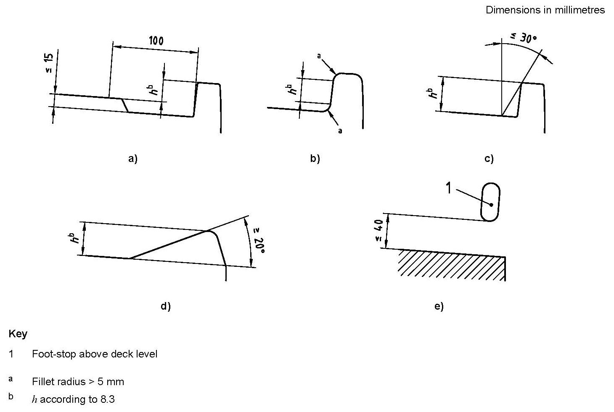
  Fig 6.1 Diagram illustrating the requirements of 3, 4, 5 and 6
- **2.** **Provision of foot-stops**
  Foot-stops shall be provided as close as practicable to the outboard edges of the working deck.
  Foot-stops are not required on the following:
  - **(1)** parts of the working deck where people are not intended to walk but only sit when the craft is underway, such as sailing craft deck edge where the crew hikes;
  - **(2)** the aft limit (perpendicular to the longitudinal axis) of monohull working deck, e.g. top of transoms;
  - **(3)** the aft limit (perpendicular to the longitudinal axis) of the rigid part of multihull working deck;
  - **(4)** front and aft beams (perpendicular to the longitudinal axis) of multihulls.
- **3.** **Minimum height and angle of foot-stop**
  The height of the upper edge of the foot-stop above the adjacent working deck level shall not be less than:
  - **(1)** for crafts of design category C
    - 25 mm for sailing crafts,
    - 20 mm for non-sailing crafts;
  - **(2)** for crafts of design category A and B
    - 30 mm for sailing crafts,
    - 25 mm for non-sailing crafts.
    These heights are the smallest distances, measured perpendicularly to the deck, from the highest inner point of the foot-stop to the highest point of the deck within 100 mm of the foot-stop [see **Fig 6.1** a)].
    If the edges of the foot-stop have a fillet radius greater than 5 mm, the height of the foot stop shall be measured between the closest points of these fillets [see **Fig 6.1** b)].
    To stop the foot from slipping outboard, the angle in the internal face (or of a tangent to it) shall not be more than 30° from the vertical [see **Fig 6.1** c)], except on non-sailing crafts using the device described in **4** (for non-sailing crafts only).
- **4.** **Foot-stops made of angled surfaces**
  Angled surfaces foot-stops are allowed on non-sailing crafts of design categories C and D. These surfaces shall have an inclination of not less than 20° from the horizontal and a height according to **3** [see **Fig 6.1** d)].
  These angled surfaces shall be slip-resistant.
- **5.** **Maximum foot-stop clearance between deck and foot stop**
  If there is a vertical clearance between deck and foot-stop level the open spaces between the deck level and the bottom of the lowest foot-stopping point shall not be greater than 40 mm [see **Fig 6.1** e)].
  Ex) Soft or rigid line parallel to the working deck.
- **6.** **Continuity on the working deck level in way of the foot-stop**
  In order to guarantee foot-stopping action there shall be no step in the working deck level greater than 15 mm within 100 mm from the foot-stop [see **Fig 6.1** a)].
- **7.** **Gaps in the foot-stop rail**
  Gaps in the foot-stop rail are allowed for stanchions, pulpit feet, cleats, etc. or for water drainage, but each gap shall not be greater than 100 mm to the edge of the adjacent fitting or foot stop rail. This distance shall be measured parallel to the foot stop general line.
  Fittings providing foot-stopping action are considered to be local foot-stops.

#### 106. Requirements for handholds

- **1.** **Location in way of side decks**
  - **(1)** Handholds fitted less than 300 mm inboard from the outer working deck edge shall be placed at least 350 mm above deck level, but not higher than the adjacent superstructure.
  - **(2)** On the route along the outer edges of the working deck, the maximum distance between two adjacent handholds shall not exceed 1.5 m.

#### 107. Common requirements for low and high guard-rails and guard-lines

- **1.** **General**
  Guard-rails may be required, either low guard-rail/low guard-line ($h$ ≥ 450 mm) or high guard-rail/ high guard-line ($h$ ≥ 600 mm) as specified in **2.**
  Guard-rails shall completely surround the outer edges of the working deck except in the transversal direction as permitted by **3**, **6** and **8**.
- **2.** **Height of guard-rails or guard-lines**
  Low guard-rails/ low guard-lines shall have a height of at least 450 mm.
  High guard-rails/ high guard-lines shall have a height of at least 600 mm.
  If there are discontinuities in the working deck level, the vertical gap between the lowest guard-rail/guard-line and the deck or foot-stop, coaming, bulwark, etc., whichever is higher, shall not be greater than
  - 560 mm for low guard-rail or low guard-line [see **Fig 6.2** a)];
  - 380 mm for the intermediate line of a high guard-rail or guard-line [see **Fig 6.2** b)].
  The length of these discontinuities in the main deck area shall not be greater than 600 mm, when measured parallel to the guard-rail/guard-line mean direction [see **Figs 6.2** a) and b)].
- **3.** **Intermediate lines, vertical spacing and maximum gap**
  On non-sailing crafts, rigid high guard-rails and pulpits need not be fitted with intermediate lines.
  If high guard-rail/guard-lines are installed, an intermediate guard-rail shall be fitted, the gap between this intermediate line and the deck, foot, stop, bulwark, etc, whichever is higher, shall not be greater than 300 mm.
  As an alternative, the intermediate line may be replaced by any device limiting the gap between two adjacent protections below 380 mm, in any direction [see **Fig 6.2** c)].
  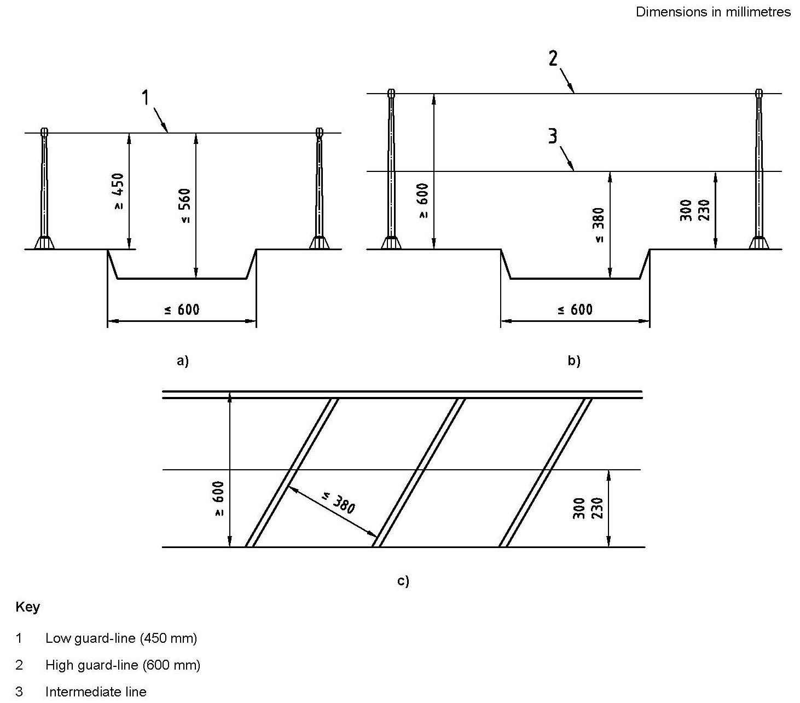
  Fig 6.2 Diagram illustrating the requirements of 2 and 3
- **4.** **Risk of falling overboard from elevated parts**
  Even when protected from falling overboard by guard-rail/guard-line there is a risk of falling overboard from higher parts of the working deck (See **Fig 6.3.**).
  Therefore
  - any part of the working deck located higher than $H_1$ from the adjacent part of the working deck shall at least be equipped with foot-stop according to **107.**;
  - any part of the working deck located higher than $H_2$ from the adjacent part of the working deck shall at least be equipped with foot-stop according to **107.** and guard-rails/guard-lines having the same height as at the outer periphery of the deck.
  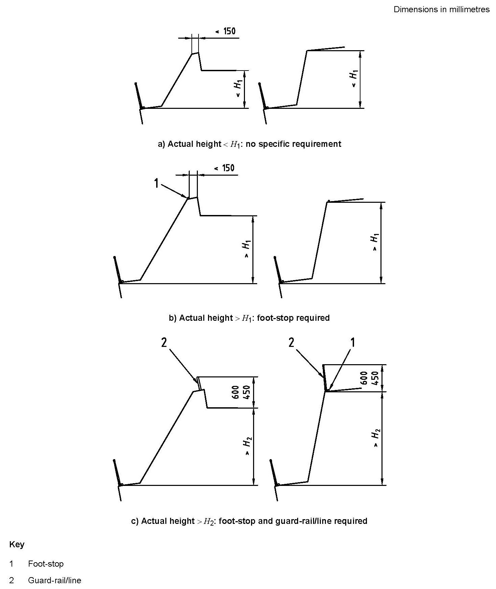
  Fig 6.3 Diagram illustrating the requirements of 4
  $H_1$ and $H_2$ are function of the height of the guard-rail/guard-line and defined in **Table 6.3**.

  | Guard-rail/line height | $H_1$ | $H_2$ |
  | --- | --- | --- |
  | 450 | 700 | 1200 |
  | 600 | 900 | 1500 |
- **5.** **Openings in guard-rails/guard-lines**
  To facilitate boarding or reboarding of people or equipment, openings in the guard-rail/guard-lines are allowed, provided that permanently fixed and quickly operable mobile sections are fitted in way of these openings. These sections shall be designed not to open inadvertently.
  Openings in guard-rails/guard-lines are also allowed for the passage of sails, provided that there is no gap transversally and that the space between the rails does not exceed 150 mm.
- **6.** **Bow pulpits for sailing crafts**
  Bow pulpits may be open but the opening between the pulpit and any part of the craft shall never be greater than 360 mm.
- **7.** **Transom guard-rails/guard-lines for sailing crafts**
  - **(1)** On crafts where a high guard-rail/guard-line is required:
    - the aft pulpits in way of the transom or guard-line support shall have at least the required 600 mm height;
    - the transversal line need not meet the requirements of **1**, **2** and **3** provided that
    - the height of the line is at least 450 mm above any part of the seat;
    - the height of the line is at least 800 mm above any part of the cockpit bottom local level;
    - there is a handhold according to **106.** allowing an athwartship grip line higher than 600 mm not farther than 1,250 mm from the line end;
    - the horizontal distance between two adjacent supports is not greater than 2,500 mm.
    See Fig 6.4.
  - **(2)** On crafts where a low guard-rail/guard-line is required:
    - the aft pulpits in way of the transom or guard-line support shall have at least the required 450 mm height;
    - the transversal line need not meet the requirements of **1**, **2**, **3** provided that
    - the height of the line is at least 300 mm above any part of the seat level;
    - the height of the line is at least 650 mm above any part of the cockpit bottom local level;
    - there is a handhold according to **106.** allowing an athwartship grip line higher than 600 mm not farther than 1,000 mm from the line end;
    - the horizontal distance between two adjacent supports is not greater than 2,000 mm.
    See **Fig 6.4**.
- **8.** **Forward cross beams of sailing catamarans**
  On sailing catamarans, the wire/rod and stanchion bracing on forward cross beam may be regarded as a guardrail/guard-line, even if its height varies from the minimum required height to zero at the beam end. The minimum height of this wire/rod at centreline shall be according to the option of **Table 6.2** for guard-rail/guard-line height.
  Similarly, the height of the longitudinal guard-rail/guard-line system on the outer edges of the hulls may diminish to zero in way of the forward beam. As long as the greatest distance between possible handhold points on the transverse and longitudinal guard-rails shall not be greater than 0,75 m.
- **9.** **Central hull of sailing trimarans**
  On sailing trimarans, guard-rails/guard-lines may be omitted on the central hull in the areas where a person falling from the working deck would land on a trampoline, which shall have a width of at least 700 mm in these areas.
  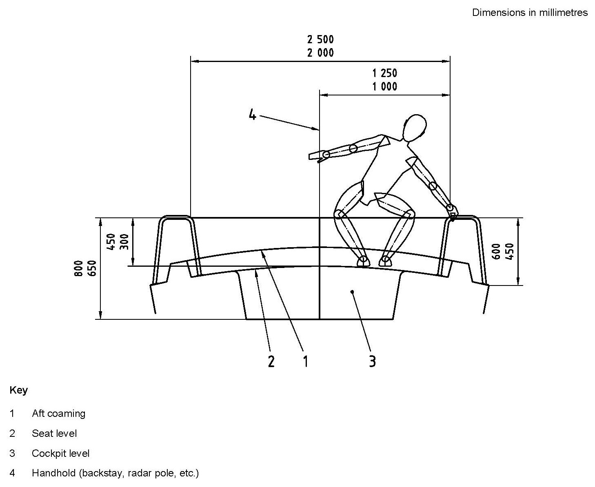
  Fig 6.4 Transom diagram facing aft, illustrating the requirement of 7

#### 108. Requirements for stanchions or guard-line supports

- **1.** **Spacing**
  The spacing between stanchions or guard-line supports shall not be greater than 2,2 m.
- **2.** **Fixture and disposition of stanchion and line supports**
  Stanchions/line supports shall not be angled outboard more than 10° from the vertical, at any point above 50 mm from the deck.

#### 109. Requirements for hooking points

- **1.** **General**
  Hooking points are eye, fitting, or any device to which people can clip directly a safety harness and be able to move around an area of the working deck.
- **2.** **Location**
  Hooking points shall be located as follows :
  - **(1)** within 1 m of the edge of the main access hatch/door;
  - **(2)** within 2 m of all outside steering positions;
  - **(3)** within 2 m of the mast of sailing crafts;
  - **(4)** within 2 m of the winch positions of sailing crafts;
  - **(5)** within 2 m of the windlass or towing strong point(s).
    Hooking points shall be located no more than 3 m apart.
    Habitable sailing multihulls of design category A and B shall be fitted with at least one hooking point in the vicinity of each escape hatch, to be used if the craft is in the inverted position.
- **3.** **Size**
  In order to allow a correct closing of the harness hook, any hooking point shall be inscribed within a circle of 15 mm diameter.

#### 110. Attachment points for jack-lines

- **1.** **General**
  Jack-line means flexible line or rigid bar intended for attachment of the safety harness allowing safe movement of the crew along its length when attached.
- **2.** **Fitting**
  Attachment points for jack-lines shall be fitted on deck, port and starboard to provide secure fixing for jack-lines. These lines shall be long enough to allow the movements on the working deck needed for craft operation.
  Jack-lines may be fitted in sections, but each section of jack-line shall be as long as practicable. Attachment points shall be fitted at the ends of each section.

#### 111. Body support on high-speed crafts

- **1.** **General**
  High-speed crafts shall be fitted with means of support for each of its occupants, when the craft is underway, limiting the risk of being thrown overboard in case of sharp turns, strong acceleration, or movements in the sea.
  To provide support, one of the following option shall be chosen, for each person:
  - one handhold plus body support as required in **2**;
  - two handholds allowing simultaneous gripping of both hands.
- **2.** **Body support**
  If the occupants are seated, the body support shall have a height of no less than 120 mm above the rigid bottom of the seat or where a cushion is if fitted, with the cushion fully compressed.
  If the occupants are standing or leaning, the body support may only provide support for the back or the torso.
  If the occupants are sitting riding astride a seat, i.e. riding, the body support may be provided by the action of the knees.

#### 112. Means of reboarding

It shall be equipped with a specific means of reboarding from the water, e.g. ladders, steps, handholds, brackets.
The ladders have the lowest point serving as foot step located at least 300 mm below the waterline.
Reboarding means is rigid or flexible fitting or part of the hull which allows a person to reboard without assistance

#### 113. Requirements for strength

Requirements for strength of each safety device shall comply with **ISO 15085**.

#### 114. Owner’s manual

The owner’s manual provided with the craft shall indicate the items specified in **Table 6.4**.

| Subclause in ISO 15085 | Required indication in owner’s manual |
| --- | --- |
| **102. 1** | If appropriate, a text or a sketch in the owner’s manual shall indicate the working deck area(s) defined by the craft builder. |
| **Table 6.2**, Design Category C(Daytime) | A sentence in the owner’s manual shall indicate that the craft is only intended for daytime sailing and not for use at night. |
| **107** | If relevant, information on maintenance requirements for guard-lines pointing out the need for periodic inspection of synthetic wires for UV degradation and chafe that might necessitate replacement. |
| **112** | Description of the means of reboarding. |

### Section 2 Windows, Portlights, Hatches, Deadlights and Doors

#### 201. Terms

For the purposes of this Section, the following terms and definitions apply.

- **1.** **Appliance location area**
  Area of the craft where the appliance is fitted
  See **ISO 12216** Annex A for sketches showing examples of appliance location areas.
  - **(1)** Area I
    Part of the hull sides situated above waterline, i.e. up to its intersection with the weather deck (for decked craft), or the upper edge of the hull (for open craft or partially decked craft), but only to the following upper boundary:
    - a horizontal line located at the height $h _{S}$ above waterline in the rear half of the waterline (see **Fig 6.5**);
    - a sloped line having a height $h _{S}$ at mid waterline, and a height 1.2 $h _{S}$ at the front end of the waterline, with
    - $h _{S} = L _{H} /12$ for sailing monohulls.
    - $h _{S} = L _{H} /17$ for non-sailing crafts, sailing catamarans and central hull of sailing trimarans.
    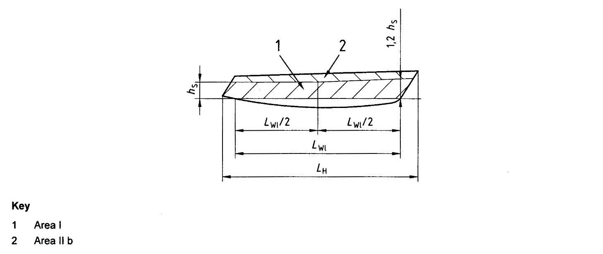
    Fig 6.5 Limits of Areas I and II b
  - **(2)** Area II a
    Area, other than Area I, where persons are liable to walk or step, such as decks, superstructures, cockpit soles, at an inclination of less than 25° to the horizontal in a longitudinal direction, and at an inclination of less than 50° to the horizontal in the transversal direction respectively for sailing monohulls, or 25° for multihulls
  - **(3)** Area II b
    Areas from the hull sides not belonging to Area I
  - **(4)** Area III
    Area, other than Area I or II
  - **(5)** Area IV
    Parts of Area III protected from the direct impact of sea or slamming waves
- **2.** **Type of plate end connection**
  See **ISO 12216** Annex B for sketches showing examples of types of plate end-connection.
  - **(1)** Semi-fixed (SF plate)
    Plate fixed in a way to restrict deflection and prevent lateral movement at its boundaries
  - **(2)** Simply supported (SS plate)
    Plate that can deflect at its boundaries and/or perform lateral movement
  - **(3)** Flexibly connected plate
    Simply supported plate where the connection is achieved by an elastic support around the perimeter of the plate

#### 202. General requirements

To avoid flooding, all appliances shall be designed and fixed to prevent substantial ingress of water when closed.

- **1.** Minimum degree of watertightness
  The required minimum degree of watertightness of an appliance is a function of the craft's design category. These requirements are given in **Table 6.5.**

  | Type of craft | Appliance location area | Type of appliance | Design category |   |   |   |
  | --- | --- | --- | --- | --- | --- | --- |
  | Type of craft | Appliance location area | Type of appliance | A | B | C | D |
  | Any | Area I | Any | 2 | 2 | 2 | 2 |
  | Any | Area II | Any | 2 | 2 | 3 | 4 |
  | Any | Area II | Sliding companionway hatch | 3 | 3 | 3 | 4 |
  | Any | Area III | Any | 3 | 3 | 3 | 4 |
  | Sailing monohull | Area IV | Any | 3 | 3 | 3 | 4 |
  | Non-sailing + Multihull | Area IV | Any | 3 | 3 | 4 | 4 |
- **2.** Additional requirements related to watertightness
  - **(1)** Sliding appliances
    Sliding appliances shall not be used in Area I.
  - **(2)** Deck hatches of trimaran outrigger hulls
    Hatches fitted on the decks of trimaran outrigger hulls shall not be sliding appliances.

#### 203. Plate materials

- **1.** **General**
  Appliance plates shall be made of
  - **(1)** A transparent glazing material, such as poly(methyl)methacrylate (PMMA), polycarbonate (PC), tempered glass, chemically reinforced glass or laminated glass, or
  - **(2)** A non-transparent plate material, such as plywood (PW), glass-fibre reinforced thermosetting plastic (GRP), aluminium alloy, steel, etc.; or
  - **(3)** Any other material of strength and stiffness equivalent to those cited above.
- **2.** **Acrylic sheet materials**
  Poly(methyl)methacrylate (PMMA) made with a technique other than the casting procedure shall have mechanical properties and resistance to ageing at least equal to those of cast PMMA
- **3.** **Glass**
  The use of glass is restricted to (1) and (2) plus **204. 1** (1) (A) for use of simply supported plates, **204. 3** (1) (D) for use in Area I and **204. 3** (2) for use in Area II.
  - **(1)** Monolithic glass
    Monolithic glass shall only be made of tempered glass, or chemically reinforced glass.
  - **(2)** Laminated glass
    The glass plies used in laminated glass can be made of any type of glass.

#### 204. Specific requirements

- **1.** **End connection and location of plate**
  - **(1)** Simply supported plates
    Simply supported plates shall not be used in Area I:
    - on sailing monohulls in design categories A and B and sailing multihulls in design category A;
    - on non-sailing crafts in design category A.
    On other types of craft and design categories, simply supported plates may be used provided that all the following conditions are met:
    - the glazing material is PMMA or PC (see clause **203.**) ;
    - the plate thickness is equal to 1.3 times the one required by clause 205. ;
    - the fixing devices of the plate (hinge bolts, fixing knob, etc.) are not spaced more than 250 mm.
    The above restrictions of use need not be considered if the appliance is equipped with a deadlight meeting the requirements of **3** (6).
    Flexibly connected plates may only be used on non-sailing crafts of design categories C and D in Areas III and IV.
    - **(A)** Plates in Area I
    - **(B)** Flexibly connected plates
  - **(2)** Semi-fixed plates
    Semi-fixed plates may be used in crafts of all design categories and in all location areas with the restrictions of the special requirements given in **3**.
    This type of end connection can be achieved by one of the following means.
    Metal to glass contact shall be avoided.
    - **(A)** Plates made of material other than glass
      - **(a)** Connected with a counter frame: The edge fixity is achieved by pinching the plate at its periphery between the craft shell or a frame and a counter frame. The counter frame shall be mechanically fastened and/or glued to the structure of the craft.
      - **(b)** Connected by gluing: The edge fixity is achieved by gluing the plate at its periphery to the craft shell, to the structure of the craft or to a frame. This gluing can either be in a rabbet or a face, edge gluing or any combination of these gluing methods.
      - **(c)** Connected by direct fastening: The edge fixity is achieved by fastening the plate inside its periphery to the shell, the structure of the craft or to a frame by correctly spaced and sized mechanical fasteners. These fasteners may be bolts, rivets, self-tapping screws or any adequate mechanical fasteners.
    - **(B)** Plates made of glass
- **2.** **Fastening requirements**
  - **(1)** Fastening of plates and frames
    Plates and frames can be fastened by mechanical means, glue or elastomer joints. All types of fastening shall ensure watertightness of the plate or frame, and resistance to loads due to normal operating pressure.
    Every part of the mechanical elements connecting appliances to the rest of the craft shall be capable of withstanding, without breaking, twice the force induced by the pressure loads defined in **205.** This requirement shall be verified for inwards opening appliances, where hinges, locks or any other part of the link chain between the plate and the support shall be checked by calculation or testing in accordance with **ISO 12216** Annex D D.2.
  - **(2)** Fastening of semi-fixed plates
    Mechanical fasteners shall not induce parasitic stresses due to deflection or temperature changes, nor stress concentration or stress raising.
    Additional stresses brought by cold forming shall be considered when determining the plate scantlings in **205.**
  - **(3)** Fastening of glued plates
    Glued joints shall be resistant to (or protected against) sunlight (UV, heat, etc.) and all environmental effects or cleaning chemicals normally encountered in the manufacture and use of the craft.
    Glued joints shall fulfil the requirements of one of the following items:
    The above requirements shall be verified after any change in material or gluing procedure.
    Plates, with or without framing, are considered glued if they are fastened with mechanical devices, such as bolts, rivets or screws, spaced more than 20 times $t$, where $t$ is the nominal plate thickness defined in **205.**
    - **(A)** the inside pressure test (**ISO 12216** Annex D D.3.2);
    - **(B)** the separation test (**ISO 12216** Annex D D.3.3);
    - **(C)** the manufacturer's gluing procedure and conditions are followed and the bond strength checked by calculation to meet test pressure in **ISO 12216** Annex D D.3.2.2.
- **3.** **Special requirements**
  - **(1)** Appliances fitted in Area I
    The lower edge of any opening appliance shall be placed at least 200 mm above the waterline, the craft being in the fully loaded ready-far-use condition and upright. These opening appliances shall in any case be located according to the relevant requirements of **Ch 5**.
    The small unsupported dimension $b$ (or the equivalent of $b$) of any appliance (see **ISO 12216** Annex C) placed in Area I shall not exceed 300 mm.
    The above requirements do not apply to escape hatches of sailing multihulls, or designated escape hatches, when required by **ISO 9094**.
    All opening appliances shall open inwards, with the exception of multihull escape hatches or designated escape hatches, when required by **ISO 9094**.
    On crafts of design categories A and B, no part of the plate or its framing shall extend outside the local vertical tangent to the hull, deck, rubbing strake, fixed fender, or of a built-in fairing which is an integral part of the hull. **Fig 6.6** explains this requirement.
    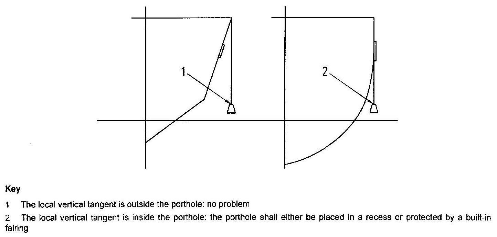
    Fig 6.6 Sketch explaining the requirement of (C)
    Glass shall not be used on sailing crafts of all design categories and on non-sailing crafts of design categories A and B, unless the plate is made of high-impact-resistance glass, or if the appliance is equipped with a deadlight meeting the requirements of (6). High-impact-resistant glass types are listed in normative **ISO 12216** Annex E.
    - **(A)** Height above waterline and maximum short side dimension
    - **(B)** Opening side
    - **(C)** Protection
    - **(D)** Use of glass
  - **(2)** Appliances fitted in Area II a
    On non-sailing crafts, the usage of monolithic and laminated glass is accepted without restriction.
    On sailing crafts, neither monolithic nor laminated glass shall be used forward of the mast or foremast, unless the plate is made of high-impact-resistance glass, or if the appliance is equipped with a deadlight meeting the requirements of (6). High-impact-resistance glass types are listed in **ISO 12216** Annex E.
    This restriction need not be considered if the plate is protected against shocks by an adequate device.
    The test is performed on a hinged deck hatch fixed to a rigid flat support of dimensions twice those of the hatch, as shown in **Fig 6.7**.
    The hatch is open in any position, up to its maximum operating position, and shall be able to withstand a concentrated force of 750 N applied anywhere on the outside edge of the hatch, without permanent deformation or damage to the hatch, its framing or hinge. The hatch will normally close under the applied force, and the system that is used to maintain the hatch open may be damaged. The hatch is considered to fulfil the requirements of this test if the integrity of the hatch, and its closing and watertightness capabilities, are maintained.
    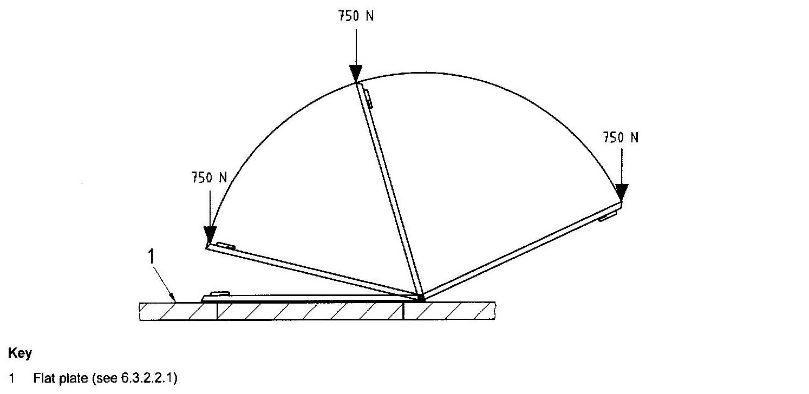
    Fig 6.7 Unintentional stepping test
    The test is performed on the same test device and loading as in (a), but with a 14 mm, three-strand polypropylene rope simultaneously jamming both sides, as shown in **Fig 6.8.**
    The test is considered as passed if there is no permanent deformation or damage to the plate, its framing or hinges.
    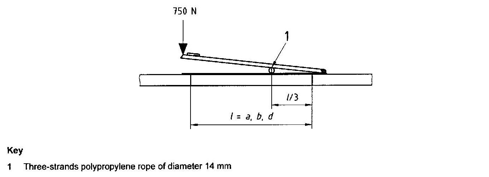
    Fig 6.8 Rope jamming test
    The test is performed on the same test device as in (a), with the hatch open at 90°, as shown in **Fig 6.9**.
    Apply a twisting torque made by two parallel and opposite forces of 200 N, acting on the two outside corners (or horizontal diameter) of the opening part of the hatch.
    The test is considered as passed if there is no permanent deformation or damage to the plate, its framing or hinges.
    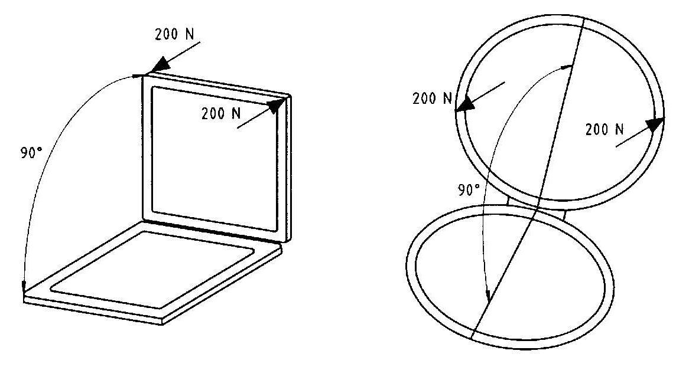
    Fig 6.9 Hatch and hinge strength test
    - **(A)** Use of glass
    - **(B)** Tests on hinged deck hatches
      - **(a)** Unintentional stepping test
      - **(b)** Rope jamming test
      - **(c)** Hatch and hinge strength test
  - **(3)** Sliding appliances
    The depth of the rabbet shall be sufficient to prevent any disengagement of the plate under the pressure loads defined in **205.**, taking into account the size of the appliance, the material of which it is made, and the rigidity of the structure it is fixed on. For unframed plates made of PMMA, PC, or materials with similar modulus of elasticity, this depth shall be at least 12 mm.
    The appliance shall be fitted with stops at each end of its stroke to prevent any disengagement of the sliding part of the frame.
    - **(A)** Rabbet depth
    - **(B)** Stops
  - **(4)** Doors made with removable sections: washboards
    Doors made with removable sections, usually called "washboards", shall be
    Craft of design category A shall be equipped with a device connecting the boards together when not in use.
    - **(A)** fitted with a device to keep them in position, when in use, and to be at least operable from inside, and
    - **(B)** stored inside the craft in the vicinity of the door opening, and easily reached without the use of tools.
  - **(5)** Locking system
    Any appliance shall have a locking device which maintains it in a closed position, operable at least from inside.
    On doors, this system shall be operable from both sides.
    In crafts of design categories A and B, if the companionway door is used together with a companionway hatch, the locking device need only be efficient when both the door and the hatch are closed together. In this case, if the companionway door is made with washboards, the locking device may only act between the upper panel of the washboard and the hatch.
  - **(6)** Deadlights
    Any part of a deadlight shall meet the requirements of **405.** and **407. 2**. Deadlights of windows fitted in Area I. if required, shall be permanently attached to the appliance, its framing, or the craft structure, and be operative even in the case of rupture of the opening part of the window.
  - **(7)** Multihull escape hatches
    On crafts with $L _{H}$ > 12 m, the multihull escape hatches shall have the following minimum clearing characteristics:
    - circular shape: diameter of at least 450 mm;
    - any other shape: a minimum dimension of 380 mm and 0,18 $\mathrm{m}^{ 2}$ minimum area. The hatch shall be big enough for a 380 mm diameter circle to be inscribed.
    Glass shall not be used, unless it is high-impact-resistance glass. High-impact-resistance glass types are listed in **ISO 12216** Annex E.
    Multihull escape hatches shall be free to open from the inside and the outside when secured but unlocked.
    The hinge or hinges of an escape hatch that opens outwards shall be such that the hatch cannot be torn out by the action of the sea if it is partially, or totally, opened.
    - **(A)** Minimum dimensions
    - **(B)** Material
    - **(C)** Opening and hinge disposition
  - **(8)** Commercially available appliances
    Commercially available appliances shall, at the time of purchase, have an information notice which indicates, for the benefit of the fitter and consumer, the upper design category, craft type and location area allowed. This notice may be a sticker glued on the appliance, a label on the appliance box, a leaflet or any other type of information device.

#### 205. Scantling determination of non-stiffened plates

**See** clause **7. of ISO 12216.**

### Section 3 Watertight Cockpits and Quick-draining Cockpits

#### 301. Scope

This section specifies requirements for cockpits and recesses to be designated either as "watertight" or as "quick-draining".

#### 302. Definitions

For the purposes of this section, the following terms and definitions apply.

- **1.** **Cockpit and recess**
  Any area that may retain water, however briefly, due to rain, waves, craft heeling, etc.
- **2.** **Cockpit sole**
  Essentially horizontal surface(s) of the cockpit on which people normally stand
- **3.** **Cockpit bottom**
  Lowest surface of the cockpit sole where water collects before being drained
- **4.** **Bridge deck**
  Area just outside the companionway opening and above the cockpit bottom, onto which people normally step before entering the accommodation
- **5.** **Closing appliance**
  Device used to cover an opening in the cockpit, hull or superstructures
- **6.** **Cockpit water-retention height(**$h_C$**)**
  Height of the water contained in the cockpit measured between the cockpit bottom and the point of overflow outboard, the craft being upright, at rest and fully loaded
- **7.** **Cockpit bottom height(**$H _{B}$**)**
  Height of the cockpit bottom above the waterline. the craft being upright, at rest and fully loaded
- **8.** **Cockpit volume(**$V _{C}$**)**
  Volume, in cubic metres, of water that can be instantaneously contained in the cockpit before discharge, which is the volume below $h_C$
- **9.** **Cockpit volume coefficient(**$k _{C}$**)**
  Ratio between the cockpit volume and the reserved buoyancy
  $k _{C} = \frac{V _{C}}{L _{H} B _{\max} F _{M}}$

#### 303. General requirements

- **1.** **Loading and measurement conditions**
  The loading conditions for the subclauses **2** to **4** are "fully loaded ready-for-use" as defined in **ISO 8666**. In some cases, the mass of water contained in specific volumes shall be added to this loading (see **304. 2** (1) and (2)).
  The measurement or calculations shall be made with the craft upright and at rest in smooth water.
- **2.** **Requirements for "watertight" cockpits and recesses**
  A "watertight" cockpit or recess shall
  - have its sills in accordance with **306.**
  - show a degree of watertightness in accordance with **307.**
- **3.** **Requirements for "quick draining" cockpits and recesses**
  A "quick-draining" cockpit or recess shall
  - have its bottom height $H _{B}$ above the waterline in accordance with **304.**
  - have its draining devices in accordance with **305.**
  - have its sills in accordance with **306.**
  - show a degree of watertightness in accordance with **307.**
- **4.** **Closing appliances**
  Closing appliances fitted in watertight cockpits and quick-draining cockpits, and giving access to the interior of the craft, shall fulfil the requirements of **Ch 2** and of **307.**

#### 304. Requirements for quick-draining cockpit bottom

- **1.** **Minimum cockpit bottom height,** $H _{B, \min}$
  The minimum cockpit bottom height, $H _{B, \min}$, above the waterline shall be according to **Table 6.6.**

  | Design category | Height, $H _{B, \min}$ |
  | --- | --- |
  | A | 0.15 |
  | B | 0.1 |
  | C | 0.075 |
  | D | 0.05 |
  | NOTE Greater heights than these minimum values may be required to fulfil the maximum acceptable draining time according to **305. 2** |   |
- **2.** **Exception to 6.1 for recesses or lockers**
  - **(1)** Exception up to 10 % of cockpit bottom area
    Surfaces up to a total 10 % of the horizontal projection of the cockpit bottom are not required to comply with **1.** Among these surfaces, those containing water after the cockpit has drained will be considered full of water when assessing the fully loaded condition.
  - **(2)** Lockers in the cockpit bottom
    Lockers placed in the cockpit bottom
    - which are intended for the storage of liferafts, ice, fish, baits, etc., and
    - which are watertight towards the interior of the craft, and
    - whose closing appliances do not fulfil all the requirements of **303. 3**,

#### 305. Requirements for drainage of quick-draining cockpits

- **1.** **Cockpit drainage**
  - **(1)** General
    Draining shall only be by gravity.
  - **(2)** When the craft is upright
    When the craft is upright, at least 98 % of the cockpit volume shall drain, excluding any recess in accordance with the exceptions of **304. 2.**
  - **(3)** When the craft is heeled
    The requirements in (A) and (B) shall be fulfilled when the craft is heeled to both port and starboard.
    On sailing monohulls, drainage shall be provided for at least 90 % of $V _{C}$ at the lesser heel angle of
    - 30° heel, or
    - when the deck at side begins to touch the water.
    On non-sailing crafts and multihulls, drainage shall be provided for at least 90 % of $V _{C}$ at 10° heel.
    - **(A)** Sailing monohulls
    - **(B)** Non-sailing crafts and multihulls
- **2.** **Draining time**
  The draining time is the time needed to drain the cockpit from the full height of water, $h _{C}$, down to a remainder of 0,1 m above cockpit bottom.
  The draining time shall be measured or calculated with every appliance closed.
  If the draining section. expressed in square metres, is greater than or equal to 0,05 $V _{C}$, it is considered large enough to fulfil the requirements and does not require a draining time assessment.
  For other drain configurations, the draining time shall be assessed, and shall not be greater than $t _{\max}$ given by the formulae in **Table 6.7** or by the curves in **Fig 6.10.**

  | Design category | $t _{\max}$ |
  | --- | --- |
  | A | 0.3/$k _{C}$ but not greater than 5 |
  | B | 0.45/$k _{C}$ but not greater than 5 |
  | C | 0.6/$k _{C}$ but not greater than 5 |
  | D | 0.9/$k _{C}$ but not greater than 5 |

  The cockpit volume, $V _{C}$, shall be measured from the cockpit bottom up to the top of $h _{C}$, with the eventual exception of **304. 2**, assuming that all closing appliances and drains are closed.
  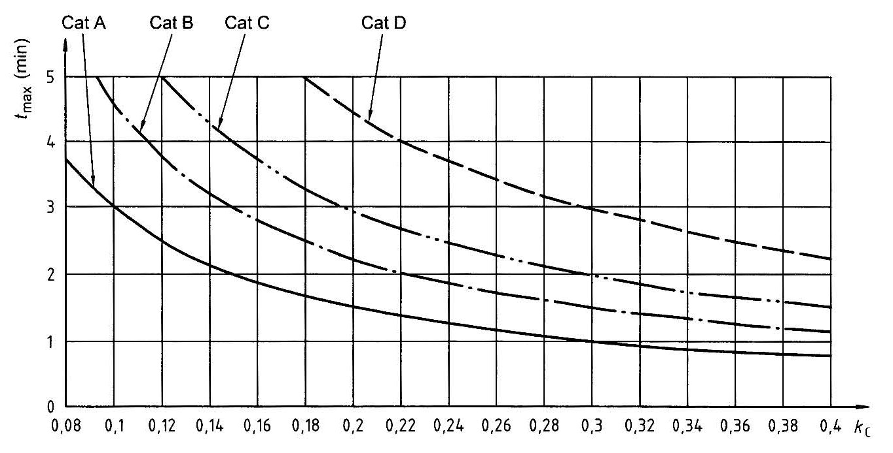
  Fig 6.10 Maximum acceptable draining time #eqnID-697 according to #eqnID-698 and design category
- **3.** **Number of drains**
  A quick-draining cockpit shall have at least two drains, one port and one starboard, unless one opening enables drainage when the craft is heeled to both port and starboard, as required in **1.**
- **4.** **Minimum drain dimensions**
  - **(1)** Internal dimensions of the drain
    Drains with a circular cross section shall have a diameter of at least 25 mm. Drains with other cross-sectional shapes shall have a cross-sectional area of at least 500 $\mathrm{mm} ^{2}$ and a minimum dimension of 20 mm.
  - **(2)** Eventual protective grids
    If the drains are equipped with systems preventing loose objects from falling into the draining system, one shall be aware that a grid of small holes is more prone to be clogged than the drain itself.
    If the minimum passage dimension inside any part of these devices has at least a section of 125 $\mathrm{mm} ^{2}$ (or a diameter of 12 mm), and the total entry cross-section is at least 1.5 times the cross-section of the drain, **Table 6.8** may be used for calculation of the draining time.
    If the above conditions are not met, the head losses from the protection grid shall be considered. See **ISO 11812 Annex D**.
- **5.** **Centreboard housings and other types of drain**
  Centreboard housings and other types of aperture may be used as drains if they are designed for this purpose.
- **6.** **Drain fitting**
  The drain outlet running through the hull shall either be located above the waterline or, if below the waterline, be fitted with seacocks (see **7**), unless the drain outlet is an integral part of the hull extending from the outlet up to at least 0.75 $H _{B, \min}$ above the waterline.
  **Fig 6.11** shows a drain outlet integral with the hull.
  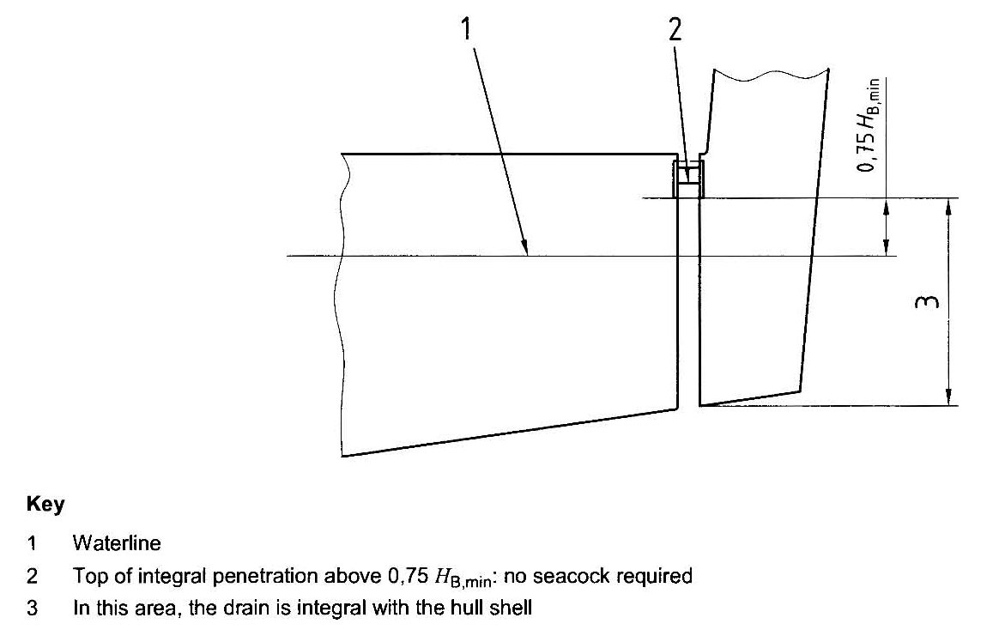
  Fig 6.11 Drain outlet as an integral part of the hull
- **7.** **Drain piping design and construction**
  The scantling and design of drains shall take into account all the loads to which they may be subjected.
  Drain piping shall be protected against damage from loose objects stowed in the craft and against being kicked or stepped on.
  Drain piping shall not trap water and shall only be used for cockpit drainage. This requirement does not apply to drains fitted in centreboard housing or outboard wells and trunks.
  Seacocks, through-hull fittings, and associated components shall comply with the requirements of **Ch 2** or **Ch 3**.
- **8.** **Draining time assessment**
  - **(1)** General
    The draining time shall be determined either by measurement of the actual draining time, or by calculation.
  - **(2)** Measurement of the draining time
    The craft shall be placed near the fully loaded displacement and corresponding design trim.
    The cockpit is filled with water up to $h _{C}$. and the draining time to empty the cockpit between $h _{C}$ and 0.1 m of water remaining in the cockpit is measured. This latter height shall be measured above the centre of the bottom surface of the cokpit.
  - **(3)** Calculation of the draining time
    A quick and approximate method of calculating the draining time calculation is given in (4). Simplifications in this method may lead to small differences between measured and calculated draining time, but both methods are considered valid.
    More thorough methods of calculation are specified in **ISO 11812** Annex C.
    If the arrangement of cockpit and drains does not correspond to the cases of (4) or the methods of **ISO 11812** Annex C. the calculation method used shall be based on a practical test on a similar arrangement.
  - **(4)** Quick method of calculation for cockpit fitted with two drains
    Determine $t_\max$ using $k _{C} = V _{C} / \left( L _{H} B _{\max} F _{mean} \right)$, i.e. the cockpit volume coefficient in accordance with **2.**
    Calculate $t _{ref} = t _{\max} / V _{C}$ which is the reference draining time (without head loss) for a set of two drains.
    Determine whether the drain outlet is above or below the waterline when the cockpit is full. If the drain outlet is above the waterline when the cockpit is empty and below it when the cockpit is full, one shall either conservatively consider that the drain is always below the waterline, or make the calculation in both cases and calculate the final time by interpolation.
    **Fig 6.12** shows some drain arrangements, but other arrangements may be used.
    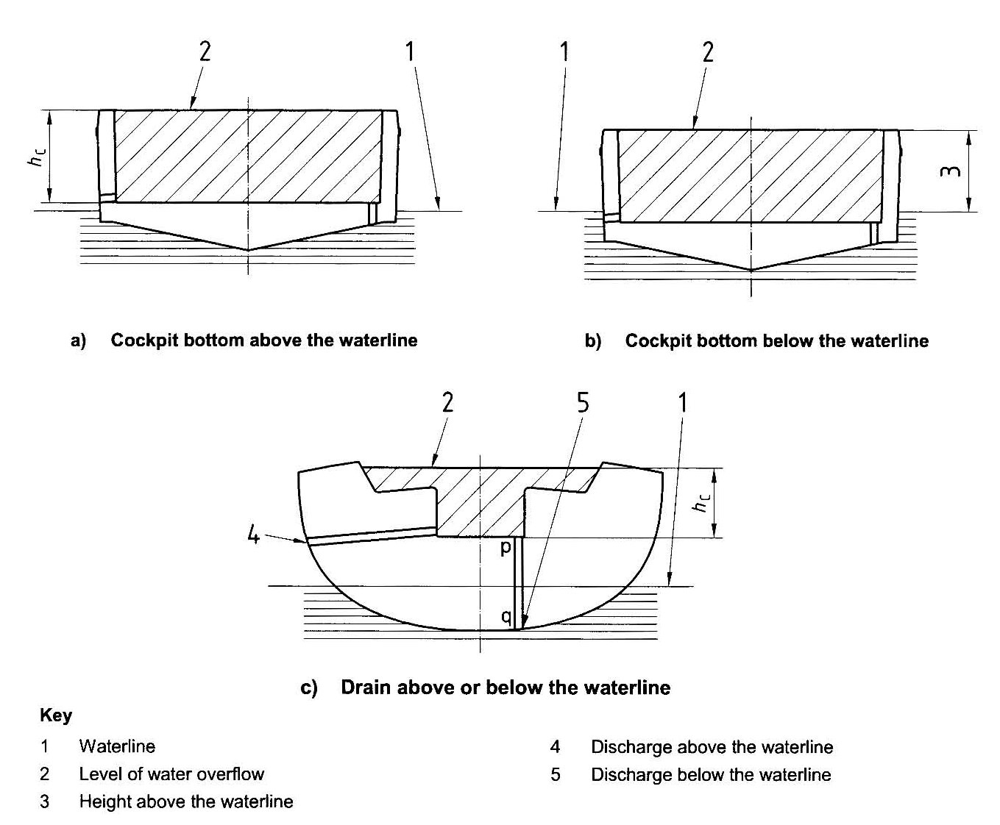
    Fig 6.12 Examples of some drain arrangements
    **Table 6.8** gives the approximate draining time for six cases: drain above or below the waterline, no elbow or two elbows, and freeing port with and without a flap.
    Enter the line corresponding approximately to the cockpit configuration and choose the drain diameter giving a draining time $t _{ref}$ corresponding to the requirements. Interpolations may be used.

    | Typical drain arrangement | Values of $t _{ref}$ (min) |   |   |   |   |   |   |   |   |   |   |   |   |   |   |   |   |   |   |
    | --- | --- | --- | --- | --- | --- | --- | --- | --- | --- | --- | --- | --- | --- | --- | --- | --- | --- | --- | --- |
    | Drain outlet above $W _{L}$, no elbow | 8.8 | 5.8 | 4.1 | 3.0 | 2.3 | 1.8 | 1.5 | 1.2 | 1.0 | 0.9 | 0.8 | 0.7 | 0.5 | 0.4 | 0.3 | 0.3 | 0.2 | 0.2 | 0.2 |
    | Drain outlet above $W _{L}$, two elbows | 10.0 | 6.7 | 4.7 | 3.5 | 2.7 | 2.2 | 1.8 | 1.5 | 1.3 | 1.1 | 0.9 | 0.8 | 0.6 | 0.5 | 0.4 | 0.4 | 0.3 | 0.3 | 0.2 |
    | Drain outlet above $W _{L}$, no elbow | 10.8 | 7.2 | 5.1 | 3.9 | 3.0 | 2.4 | 2.0 | 1.6 | 1.4 | 1.2 | 1.0 | 0.9 | 0.7 | 0.6 | 0.5 | 0.4 | 0.3 | 0.3 | 0.2 |
    | Drain outlet above $W _{L}$, two elbows | 11.8 | 7.9 | 5.7 | 4.3 | 3.3 | 2.7 | 2.2 | 1.8 | 1.5 | 1.3 | 1.2 | 1.0 | 0.8 | 0.6 | 0.5 | 0.4 | 0.4 | 0.3 | 0.3 |
    | Freeing port above $W _{L}$, no flap | 10.1 | 7.0 | 5.2 | 3.9 | 3.1 | 2.5 | 2.1 | 1.8 | 1.5 | 1.3 | 1.1 | 1.0 | 0.8 | 0.6 | 0.5 | 0.4 | 0.4 | 0.3 | 0.3 |
    | Freeing port above $W _{L}$, withflap | 15.2 | 10.5 | 7.7 | 5.9 | 4.7 | 3.8 | 3.1 | 2.6 | 2.2 | 1.9 | 1.7 | 1.5 | 1.2 | 0.9 | 0.8 | 0.7 | 0.6 | 0.5 | 0.4 |
    | Drain diameter $d$(mm) two drains | 25 | 30 | 35 | 40 | 45 | 50 | 55 | 60 | 65 | 70 | 75 | 80 | 90 | 100 | 110 | 120 | 130 | 140 | 150 |

    However, for a non-circular drain section, the section area shall be the same as that of a circular drain.
    - **(A)** Step 1: Determination of the required maximum draining time $t_\max$
    - **(B)** Step 2: Determination of the reference draining time, $t _{ref}$
    - **(C)** Step 3: Determine whether the drain outlet is above or below the waterline
    - **(D)** Step 4: Determination of the required drain diameter

#### 306. Requirements for sills

- **1.** **Sill height for watertight cockpits**
  Watertight cockpits shall have no opening below the height $h _{C}$.
- **2.** **Sill height and other requirements for quick-draining cockpits**
  - **(1)** Sill-height measurement
    When measuring the sill height, all closing appliances shall be considered to be closed, with the exception of companionway door(s). The sill height is the lowest height of the openings considered to be sills.
    Any vertical bulkhead or partial bulkhead cut by a companionway aperture leading to the interior, and located close to a cockpit or on the deck shall fulfil all the requirements for sill height and watertightness of **306.** and **307.**
    The sill height shall be measured vertically from the cockpit bottom to the lowest point on the sill edge that allows ingress of water.
    If the cockpit bottom is not horizontal, the sill height shall be measured to the closest point of the cockpit bottom.
    Cockpits having more than one bottom level shall be assessed using informative **ISO 11812** Annex A.
  - **(2)** Requirements for sill height of quick draining cockpits
    The required minimum sill height $h _{S, \min}$ according to craft type and design category is given in **Table 6.9**.
    The value of $h _{S, \min}$ may be used in **307.** or informative **ISO 11812** Annex A when considering multi-level cockpits.

    | Design category | Sailing monohulls |   |   | Non-sailing crafts and sailing multihulls |   |   |
    | --- | --- | --- | --- | --- | --- | --- |
    | Design category | Fixed sill | Semi-fixed sill |   | Fixed sill | Semi-fixed sill |   |
    | Design category | Top of sill | Top of fixed part | Top of mobile part | Top of sill | Top of fixed part | Top of mobile part |
    | Design category | $h _{S, \min}$ | $h _{S, \min}$/2 | $h _{S, \min}$ | $h _{S, \min}$ | $h _{S, \min}$/2 | $h _{S, \min}$ |
    | A | 0.3 | 0.15 | 0.3 | 0.2 | 0.1 | 0.2 |
    | B | 0.25 | 0.125 | 0.25 | 0.15 | 0.075 | 0.15 |
    | C | 0.15 | 0.075 | 0.15 | 0.1 | 0.05 | 0.1 |
    | D | 0.05 | 0.025 | 0.05 | 0.05 | 0.025 | 0.05 |
  - **(3)** Requirements for companionway doors and appliances above sill height
    Above sill level, whether fixed or semi-fixed, appliances complying with **Sec 2** shall be used to close the openings, at least up to $h _{C}$.
  - **(4)** Other requirements
    Semi-fixed sills and washboards shall have a device maintaining them in place, when in use, which shall at least be operable from inside.
    Semi-fixed sills and washboards shall meet the strength requirements of **Sec 2**.
    Semi-fixed sills shall only be detachable with the use of tools.
    Provision shall be made for washboards to be stowed in a readily accessible specific location in the vicinity of the companionway.

#### 307. Watertightness requirements

- **1.** **Watertightness requirements of watertight cockpits**
  All surfaces of watertight cockpits up to $h _{C}$ shall have a watertightness degree 1.
- **2.** **Watertightness requirements of quick-draining cockpits**
  - **(1)** Watertightness of the cockpit
    All surfaces of quick-draining cockpits up to $h _{C}$ shall have a watertightness degree 1.
    The watertightness degrees of the closing appliances shall be as required by **Table 6.10**.

    | Location of the closing appliance in the cockpit | Degree of watertightness |
    | --- | --- |
    | Closing appliances on bottom and horizontal areas | 2 |
    | Closing appliances on cockpit sides up to $h _{S, \min}$ | 2 |
    | Closing appliances on cockpit sides between $h _{S, \min}$ and 2$h _{S, \min}$^a | 3 |
    | Closing appliances on cockpit sides above 2$h _{S, \min}$^a | 4 |
    | ^a $h _{S, \min}$ being measured from the nearest part of the cockpit bottom. Informative **ISO 11812 Annex A** explains how to consider the main examples of cockpit layout. |   |

    Hatches and appliances located in the bottom or sides of the cockpit up to $h _{S, \min}$ shall be fitted with seals and sills at least 12 mm high, or tested as installed to watertightness degree 2 according to **ISO 11812** Annex E.
    The above watertightness degrees, if appropriate, shall be tested according to **ISO 11812** Annex E.
  - **(2)** Permanently open ventilation openings
    The lowest point of non-closable ventilation openings leading to water ingress in the interior shall be at least at a height 2 $h _{S, \min}$ or 0.3 m, whichever is the greater, above the cockpit bottom, and shall be watertight to degree 4.

### Section 4 Rudders

#### 401. Scope

This section gives requirements on the scantlings of rudders and those not specified in this section to be complying with **ISO 12215-8**.

#### 402. Design stresses

- **1.** **Rudder material**
  Values of design stresses shall be taken from **Table 6.11**

  | Material | Direct stresses |   |   | Combined stresses |
  | --- | --- | --- | --- | --- |
  | Material | Tensile/compressive $\sigma _{d}$ | Shear $\tau _{d}$ | Bearing $\sigma _{db}$ | Combined stresses |
  | Metals^a | $\min \left( \sigma _{y} ; 0.5 \sigma _{u} \right)$ | $0.58 \tau _{d}$ | $1.8 \sigma _{d}$ | $\sqrt {\sigma ^{2} +3 \tau ^{2}} \leq \sigma _{d}$ |
  | Wood and fibre-reinforced plastics (FRP) | $0.5 \times \sigma _{u}$ | $0.5 \tau _{u}$ | $1.8 \sigma _{d}$ | $\left( \frac{\sigma}{\sigma _{u}} \right) ^{2} + \left( \frac{\tau}{\tau _{u}} \right) ^{2} < 0.25$ |
  | ^a Steel, stainless steel, aluminium alloys, titanium alloys, copper alloys (see **Annex A**). In welded condition for welded metals. |   |   |   |   |

  - $\sigma _{d}$ is the design tensile, compressive, or flexural strength (as relevant);
  - $\sigma _{u}$ is the ultimate tensile, compressive, or flexural strength (as relevant);
  - $\sigma _{y}$ is the yield tensile, compressive, or flexural strength (as relevant);
  - $\sigma _{db}$ is the design bearing strength;
  - $\tau _{d}$ is the design shear strength;
  - $\tau _{u}$ is the ultimate shear strength.

#### 403. Rudder types

- **1.** **Type I (spade) rudders (see Fig 6.13 and 6.14)**
  - $A$ is the rudder (spade) area;
  - $\Lambda = \frac{h _{r} ^{2}}{A}$ is the rudder geometric aspect ratio
  where $h _{r}$ is the average height of the rudder;
  - $h _{b}$ is the height between rudder top and centre of hull bearing;
  - $c _{1}$ and $c _{2}$ are, respectively, the top and bottom chords or their natural extension;
  - $co _{1}$ and $co _{2}$ are the top and bottom compensation, respectively, i.e. the distance, measured from fore to aft, between the leading edge and the rotation axis;
  - $c$ is the chord length at the height of the centroid of rudder area;
  - $h _{c}$ is the height between rudder top and centroid of rudder area (this is the position where the rudder force is considered to act);
  - $k _{b}$ is the rudder bending coefficient with $k _{b} = h _{c} /h _{r}$
  - $r$ is the horizontal distance between the position of the resultant of the rudder force (taken at rudder centroid) and the rudder's rotational axis and shall not be taken less than $r _{\min}$;
  - $u$ is, for Type I (spade) rudders, the horizontal distance from fore to aft, from the leading edge to the rudder rotational axis at the height of centroid of rudder area (i.e. the geometric centre of the profile area);
  $u$ is positive if the leading edge is forward of the axis (see **Fig 6.14** Types I a, I b, or I c) or negative in the opposite case (see Type I d).
- **2.** **Rudder spade with trapezoidal shape**
  For spade rudders with a trapezoidal (or close to) shape some values are easily calculated as follows:
  $A = h _{r} \frac{c _{1} +c _{2}}{2}$ is the area of a trapezoidal spade;
  $k _{b} = \frac{h _{c}}{h _{r}} = \frac{1+2 \alpha}{3 \left( 1+ \alpha \right)}$ for a trapezoidal spade;
  where $\alpha = \frac{c _{2}}{c _{1}}$ is the taper coefficient, See **Table 6.12**

  | $c _{2} /c _{1}$ = $\alpha$ | 1.00 | 0.90 | 0.80 | 0.70 | 0.60 | 0.50 | 0.40 | 0.30 | 0.20 |
  | --- | --- | --- | --- | --- | --- | --- | --- | --- | --- |
  | $k _{b}$ | 0.50 | 0.49 | 0.48 | 0.47 | 0.46 | 0.44 | 0.43 | 0.41 | 0.39 |

  $h _{c} = k _{b} \times h _{r}$
  $c = c _{1} -k _{b} \left( c _{1} -c _{2} \right)$ for a trapezoidal spade
  $u = co _{1} -k _{b} \left( co _{1} -co _{2} \right)$ for a trapezoidal spade
  The value of $h _{c}$ can also be determined graphically, as shown in **Fig 6.13**
  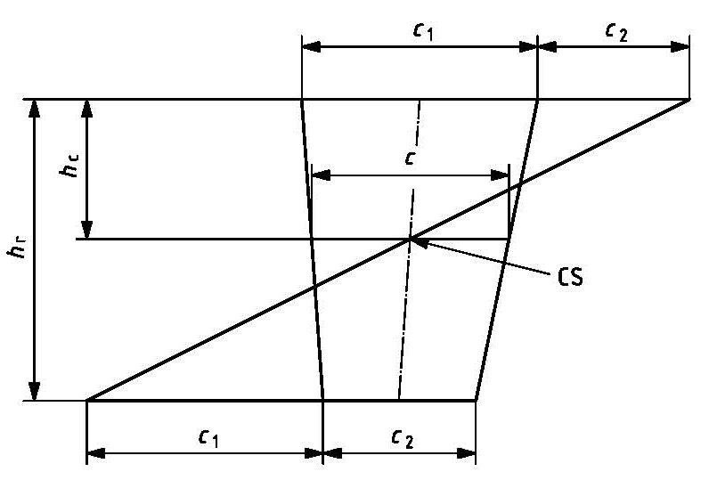
  **Fig 6.13 Graphical determination of centroid, CS, of a trapeze**
  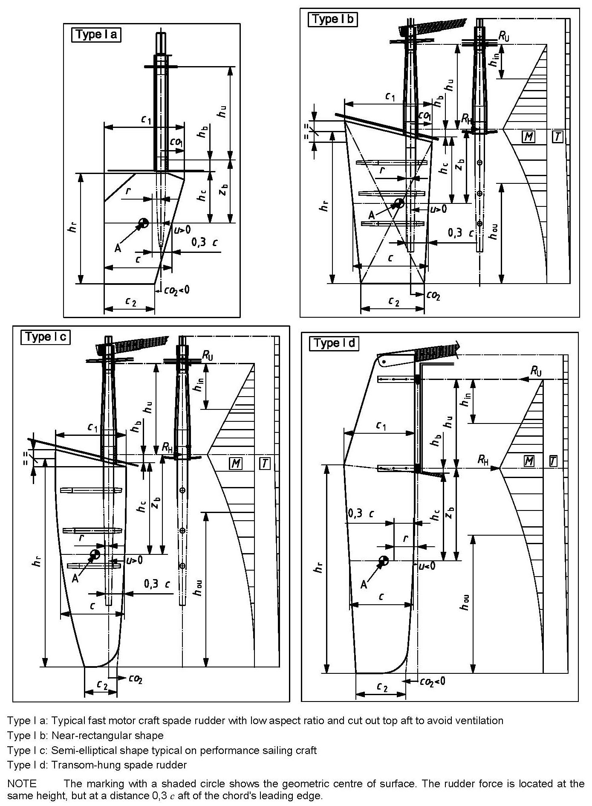
  Fig 6.14 Spade rudders: Type I
- **3.** **Rudder types II to V (see Fig 6.15)**
  The dimensions are the same as for spade rudders, except that:
  - $A$ is the total area of the moving part of the rudder, divided into $A _{1}$ and $A _{2}$ in Type V;
  - $A _{3}$ is the skeg area (only used to determine the type in **Fig 6.15**);
  - $h _{r}$ is the average height of the rudder;
  - $\Lambda = \frac{h _{r} ^{2}}{A _{0}}$ is the effective rudder geometric aspect ratio
  where $A _{0}$ is the rudder effective area (moving part plus effective part of the skeg, see **Table 6.13**);
  - $c = A _{0} /h _{r}$ is the mean chord;
  - $h _{s}$ is the height of the skeg/horn between hull and mid-skeg bearing for Type V and the lower bearing for Types III and IV.
  **Table 6.13** gives values of $A$ and $A _{0}$ according to rudder type.

  | Type | Value |   |
  | --- | --- | --- |
  | Type | $A$ | $A _{0}$ |
  | II | $A$ |   |
  | III | $A _{1}$ | $A _{1} +A _{3}$ |
  | IV | $A _{1}$ | $A _{1}$ |
  | V | $A _{1} +A _{2}$ | $A _{1} +A _{2} +A _{3}$ |

  For Type V, $h _{d}$ and he are the portions of $h _{r}$ above and below the skeg bearing, respectively.
  For Types II to V:
  - $u$ is, for rudder Types II and IV, the horizontal distance, fore to aft, from the leading edge of the rudder to the stock vertical axis at the height of centroid of rudder area. For rudder Types III and V, $u$ is measured aft of the leading edge of the partial or full narrow skeg (see **Fig 6.15**);
  - $r$ is the horizontal distance between the position of the centroid of rudder area and the rudder's rotational axis and shall not be taken less than $r _{\min}$.
  The rudders of Types II to V are considered to be held by three bearings (two bearings inside the hull and one skeg bearing, see **405. 3** (1))
  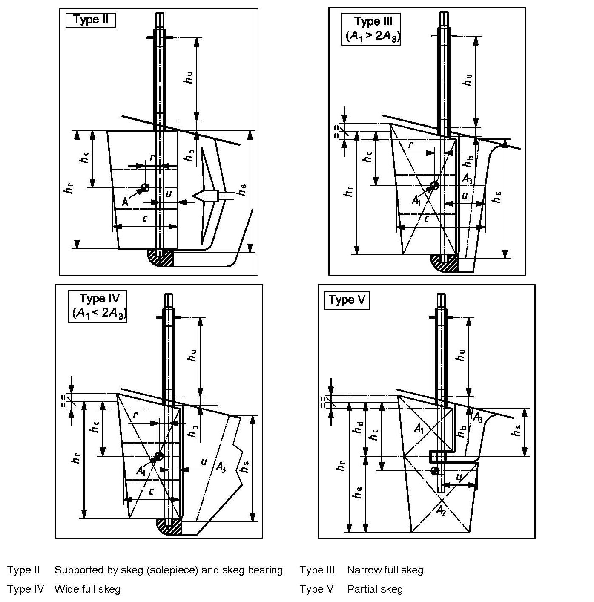
  Fig 6.15 Other rudder types: Types II to V

#### 404. Design rudder force calculation

- **1.** **General**
  The design rudder force, $F$, shall be taken as follows:
  - **(1)** For non-sailing craft, the greater of $F _{1}$ and $F _{2}$, defined in **2** and **3**, respectively;
  - **(2)** For sailing craft, the force $F _{1}$, defined in **2.**
- **2.** **Force** $F _{1}$ **and corresponding load case**
  This case corresponds to loads associated with craft handling in the design category sea state.
  $F _{1} = 23 \times L _{WL} \times k _{SEA} \times k _{LD} ^{2} \times k _{GAP} \times k _{USE} \times A$
  where
  $k _{SEA}$ =
  - 1.4 for sailing craft of design categories A and B and non-sailing craft of design category A,
  - 1.2 for non-sailing craft of design category B,
  - 1.0 for craft of design categories C and D;
  $k _{LD}$ = 6.15 for non-sailing craft of all design categories and sailing craft of design categories C and D;
  for sailing craft of design categories A and B, but shall not be taken less than 6.15;
  $k _{LD} = \frac{L _{WL}}{\left( \frac{m _{LDC}}{1025} \right) ^{1/3}}$
  $k _{GAP}$ =
  - 1.0 for rudders where the root gap (average clearance between the hull and the rudder root plane) is less than 5 % of the mean rudder chord. This gap shall not be exceeded at any rudder angle,
  - 0.85 for rudders which are surface piercing (e.g. transom held) or exceed the gap limitation or can otherwise exhibit significant 3-D flow over the root;
  $k _{USE}$ = 1 for all craft but may be taken as 0.9 for category C and D sailing craft which are essentially used for close inshore racing with suitable safety procedures in place and for which the rudder can be easily inspected on a regular basis. If $k _{USE}$ is taken as 0.9, a warning requiring regular inspection of rudder(s) should be included in the owner's manual.
- **3.** **Force** $F _{2}$ **and corresponding load case**
  This case corresponds to loads connected with non-sailing craft handling during a turn at speed in slight seas. It is therefore only applicable to non-sailing craft.
  $F _{2} = 370 \times \Lambda ^{0,43} \times V _{\max } ^{1,3} \times k _{GAP} \times k _{SERV} \times k _{\flat } \times k _{SIG} \times A$
  where
  $\Lambda$ is the geometric aspect ratio defined in Equation (1) or (7);
  $V _{\max }$ is the craft maximum speed in calm water and mLDC conditions;
  $k _{GAP}$ is as given in **807. 2**;
  $k _{SERV}$ =
  - 1.0 for design category A and B craft,
  - 0.8 for design category C and D craft (may also be taken as 1);
  If $k _{SERV}$ = 0.8 is used, a note to this effect should be placed in the owner's manual.
  $k _{\flat } = 1.08-0.008 \times V _{\max }$ with $0.75 \leq k _{\flat } <1$
  $k _{SIG} = 1.25$

#### 405. Rudder bending moment and reactions at bearings

- **1.** **Spade rudder (Type I)**
  - **(1)** Values of $k _{b}$, bending moment $M$ and reactions at bearings for spade rudders (Type I)
    $M _{H} = F \times z _{b}$
    is the design rudder bending moment (at hull bearing) for spade rudders, where
    - $F$ is determined according to **404.**;
    - $z _{b}$ is the bending moment lever for spade rudders (see **403. 1** (1)):
    $z _{b} = \left( k _{b} \times h _{r} \right) +h _{b} = h _{c} +h _{b}$
    where $k _{b}$ is the rudder bending coefficient, determined according to rudder type, as follows.
    To calculate $z _{b}$, one shall first determine the value of $h _{c}$:
    - for a trapezoidal or near trapezoidal shape, either
    a) use the value of $k _{b}$ given by Equation in **403. 2.** or **Table 6.12**, or
    b) apply the graphical method shown in **Fig 6.13** ;
    - for other shapes, find $h _{c} = k _{b} \times h _{r}$ by any geometrical method and then calculate $z _{b} = h _{c} +h _{b}$.
    The reactions at bearings for spade rudders are as follows:
    $R _{U} = F \frac{z _{b}}{h _{u}}$
    is the reaction at the upper bearing (at deck or intermediate level), where $h _{u}$ is the vertical distance between the centres of the upper and lower bearings (see **Fig 6.14**);
    $R _{H} = R _{U} +F$
    is the reaction at the hull bearing.
- **2.** **Skeg rudders (Types II to V)**
  - **(1)** General
    Rudders supported by a skeg or horn are considered to be held, from bottom to top, by three bearings (see **Fig 6.15**):
    - a skeg bearing, with reaction $R _{S}$
    - a hull bearing located close to the hull bottom at the rudder level, with reaction $R _{H}$
    - an upper bearing located at deck level at the rudder level or an intermediate level between hull and deck, with reaction $R _{U}$.
  - **(2)** Methods of calculation
    Rudders of Types II to V may be analysed by one of the following methods:
    - continuous beam theory (also known as the three-moment equation) or the method in **ISO 12215-8** Annex C;
    - the simplified method of **405. 3** (4).
  - **(3)** Continuous beam theory
    **See ISO 12215-8.**
  - **(4)** Simplified method
    **See ISO 12215-8.**

#### 406. Rudder design torque,

$T = F \times r$ is the rudder design torque
where
$F$ is as defined in **404.** ;
$r$ is the rudder torque arm but shall not be taken less than $r _{\min}$, as defined in **Table 6.14.**

| Type | $r$ | $r _{\min}$ |
| --- | --- | --- |
| I | $0.3 c-u$ | $0.1 c$ |
| II | $0.3 c-u$ | $0.1 c$ |
| III | $0.5 c-u$ | $0.05 c$ |
| IV | $0.25 c-u$ | $0.05 c$ |
| V | $\left( 0.2 \frac{h _{d}}{h _{r}} +0.3 \right) c-u$ | $\left( 0.1-0.05 \frac{h _{d}}{h _{r}} \right) c$ |
| NOTE $c$ and $u$ are defined in **403.** |   |   |

#### 407. Rudder and rudder stock design

See ISO 12215-8.

#### 408. Clearance between stock and bearings

Where the bushing manufacturer specifies the necessary clearance between stock and bushing, this shall be adopted. In the absence of such information, the following equations may be used. **Table 6.15** gives pre-calculated values for these equations.
$D-d = \frac{1.5 \times d}{1000} +0.1+$ water soaking expansion, in millimetres, is the minimum recommended value.
$D-d = \frac{3 \times d}{1000} +0.2+$ water soaking expansion, in millimetres, is the maximum recommended value.
**Table 6.15 Computed recommended values of diametric clearance** $D-d$ **between stock and bushing**

| Stock outer diameter $d$ | Diametric clearance $D-d$ |   |
| --- | --- | --- |
| Stock outer diameter $d$ | min. | max. |
| 40 | 0.16 | 0.32 |
| 60 | 0.19 | 0.38 |
| 80 | 0.22 | 0.44 |
| 100 | 0.25 | 0.50 |
| 120 | 0.28 | 0.56 |
| 140 | 0.31 | 0.62 |
| 160 | 0.34 | 0.68 |
| 180 | 0.37 | 0.74 |
| 200 | 0.40 | 0.80 |

### Section 5 Anchoring, Mooring and Towing - Strong Points

#### 501. Scope

This section specifies requirements for strong points for attaching chains, cables and lines for anchoring, mooring and towing.

#### 502. General requirements

- **1.** A strong point may be used for different purposes. An anchoring or towing strong point may be used for mooring.
- **2.** The minimum number of strong points shall be as follows:
  - **(1)** all craft: one anchoring/towing point forward;
  - **(2)** craft over 6 m $L _{H}$: at least one mooring point aft;
  - **(3)** craft over 12 m $L _{H}$: at least one additional mooring point both forward and aft;
  - **(4)** craft over 18 m $L _{H}$: at least one additional mooring point both port and starboard.

#### 503. Strength requirements

- **1.** **Introduction**
  The assessment of the breaking strength shall be made according to **2**, **3** or **4**.
- **2.** **Horizontal load**
  Each strong point shall be designed and installed, so that it will take a horizontal load, $P _{n}$, in kilonewtons without failure of the strong point or the surrounding structure to which it is attached:
  - forward, for anchoring and being towed:
  $P _{1} = f \left( 4.3L _{C} -5.4 \right)$
  - forward, for mooring:
  $P _{2} = f \left( 3.5L _{C} -4.3 \right)$
  - aft
  $P _{3} = f \left( 3.0L _{C} -3.8 \right)$
  where
  $f$ = 1.0 (design categories A and B)
  = 0.9 (design category C)
  = 0.75 (design category D)
  $L _{C}$ is the calculation length:
  $L _{C} = \frac{L _{H} +L _{WL}}{2}$
  The breaking strength of a strong point for any application need not be higher than that required to withstand a load representing the mass of the craft in the fully loaded ready-for-use condition, $m _{LDC}$.
- **3.** **Direct calculation**
  The assessment of the breaking strength of the strong points may be made by direct calculation, taking into account the design category, the configuration of the craft with special regard to the windage area, the hull form, and the wave spectrum in the intended area of operation.
- **4.** **Matching strength**
  =Where a craft manufacturer specifies or supplies lines, chains or cables which exceed the requirements of **2** (e.g. where the craft is intended to be used in extreme conditions or lines are required to be easier to handle), the breaking strength of the related strong point shall be not less than 125 % of the rope or chain that is specified or supplied.

#### 504. Detailed requirements

- **1.** **Structural support**
  Craft structures in the vicinity of strong points shall be reinforced to take the loads calculated according to **503. 2** to **4**. Doubling plates or washers of adequate size shall be used where the strong points are secured with nuts and bolts.
- **2.** **Corrosion resistance**
  Strong points shall be made of materials that are resistant to or protected against corrosion.
  Where non-metallic (plastics) strong points are provided, the material shall be UV stabilized. In addition, a warning notice shall be listed in the owner's manual to replace strong points showing visible signs of deterioration.
- **3.** **Labelling**
  Where the intended use of a strong point for anchoring and/or being towed is not self evident, the strong point shall be labelled.

#### 505. Owner's manual

The information specified in **ISO 15084** Annex A shall be included in the owner's manual

#### 506. Strength of synthetic fibre ropes

See **ISO 15084** Annex B. 
