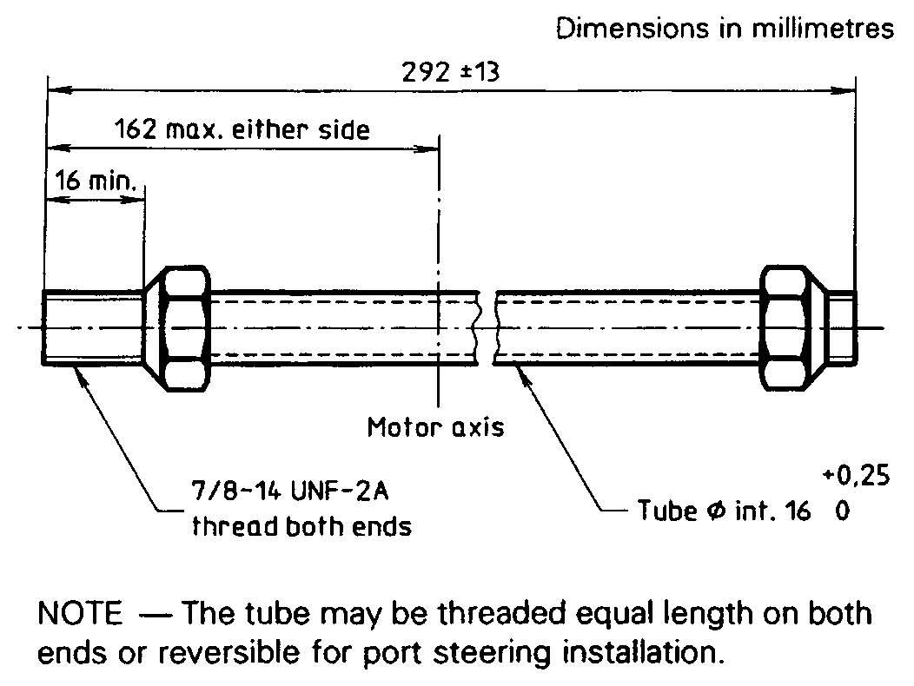
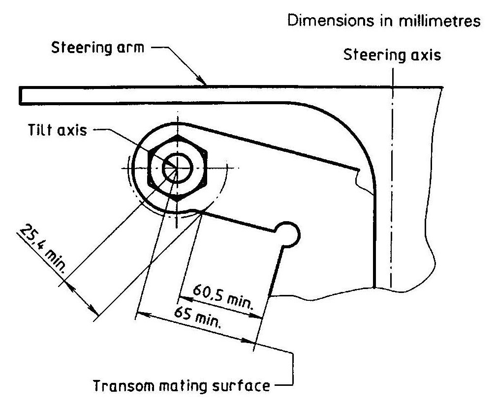
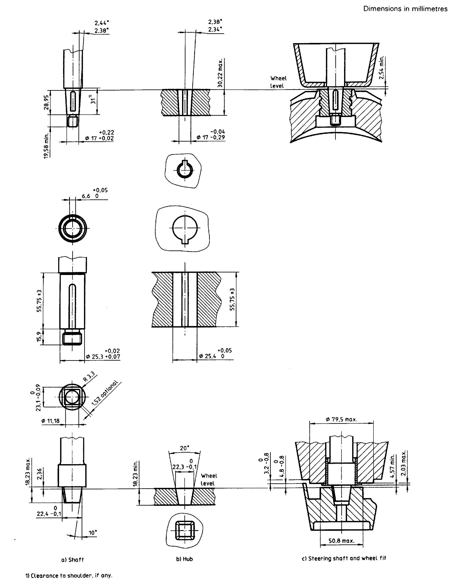
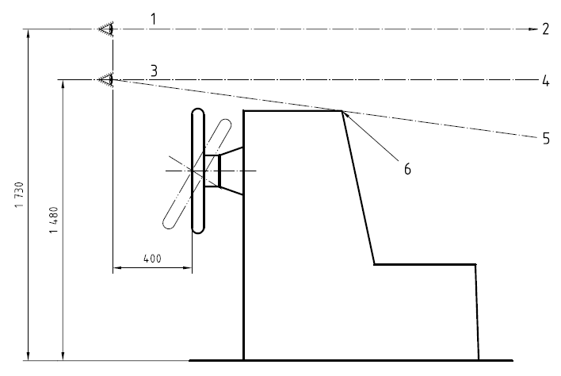
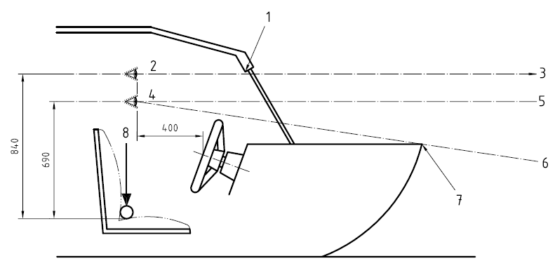

# Guidance for Recreational Crafts

> OTHER RULES AND GUIDANCE / GC-06-E / 2025 / EN / Guidance

## CHAPTER 7 STEERING SYSTEM

### Section 1 General

#### 101. General

- **1.** Steering systems are to be designed, constructed and installed in order to allow the transmission of steering loads under foreseeable operating conditions.
- **2.** Sailing craft and single-engine inboard powered non-sailing crafts with remote-controlled rudder steering systems are to be provided with emergency means of steering the craft at reduced speed.
- **3.** Remote-controlled steering systems are also to comply with ISO 8848 or ISO 9775, in addition to the requirements in this chapter.
- **4.** Cable and pulley system are to be in accordance with the requirements of ISO 8847 and gear driven steering systems are to be in accordance with the requirements of ISO 13929.

### Section 2 Hydraulic Steering System

#### 201. General requirements for hydraulic steering systems

- **1.** The components of hydraulic steering systems are to be compatible with each other in order to be used as a complete system.
- **2.** All component parts are to be supported independently of the connecting tubes.
- **3.** Connections, fittings, oil fill openings and air bleeders are to be readily accessible.
- **4.** Components in the system are to be externally protected against corrosion. The complete hydraulic steering system is to be designed to withstand conditions of pressure, vibration, shock and movement without failure or leakage.
- **5.** Hydraulic systems with a non-functional autopilot are to be capable of operation throughout an ambient temperature range of -10 ℃ to +60 ℃ and be capable of withstanding storage at -30 ℃ to +60 ℃.
- **6.** Fittings, hoses, piping and components are to be capable of withstanding the system test pressure without permanent deformation, external leakage or other malfunction.
- **7.** Materials used in hydraulic steering systems are to be resistant to deterioration by liquids or compounds with which the material may come in contact under normal marine service, e.g. grease, lubricating oil, hydraulic fluid, common bilge solvents, salt and fresh water.
- **8.** In vessels over 12.5 m in length, the hydraulic steering system is to be capable of putting the rudder over from 30° on one side to 30° on the other in not more than 30 s when the vessel is at maximum forward service speed with the rudder totally submerged, and, if normally operated, is to be designed to prevent violent recoil of the steering-wheel.

#### 202. Hydraulic fluid

- **1.** The type of hydraulic fluid to be used in a hydraulic steering system is to be specified by the manufacturer of the steering system and is to be stated in the owner's manual.
- **2.** The hydraulic fluid is to be non-flammable or have a flash point of 157 °C or over.

#### 203. Materials

In addition to the general requirements of **201**., the following requirements are to be met.

- **1.** Components of different materials are to be galvanically compatible or separated by a galvanic barrier.
- **2.** Plastics and elastomers which may be exposed to sunlight are to be chosen to resist degradation by ultraviolet radiation.
- **3.** Plastics and elastomers which may be installed in engine compartments are to be chosen to resist degradation by saline atmospheres, fuel. oil, heat and fire.

#### 204. Outboard non-sailing and inboard-outdrive requirements

- **1.** Steering stops on an outboard non-sailing is to permit at least 30° of angular movement to either side. The design torque at the rudder stock is to be sufficient to put the helm from hard over to hard over (30° port to 30° starboard or vice versa) in not more than 30 s.
- **2.** Outboard non-sailings are to meet the applicable dimensional requirements indicated in **Fig 7.1** and **Fig 7.2**.
- **3.** Necessary fittings to attach an outboard non-sailing to the cylinder output rod are to be supplied with the outboard non-sailing.
- **4.** Outboard non-sailings are to be designed so that with any combination of non-sailing turn and tilt, there are to be no damaging interference between the non-sailing, its accessories, and both the craft-mounted and the non-sailing-mounted system, if the non-sailing is designed for both systems. Appropriate written information and installation instructions are to be provided, clearly indicating the type of steering system(s) that should be used.
- **5.** Outboard non-sailings are to be designed so that the geometry ensures that a static force of 3,300 N, applied at the steering arm connection point normal to the steering arm in its normal plane of operation throughout the maximum steering arc, will not result in steering output ram loadings greater than those specified in **206.**
- **6.** The steering arm of an outboard non-sailing is to be provided with a 3/8 in-24 UNF thread, or a plain hole of 9.65 mm to 9.9 mm diameter at the connection point.
- **7.** Inboard-outdrives are to be designed with proper geometry to ensure that a torque of 680 Nm applied on the outdrive steering axis will not result in a steering component loading greater that specified in **206.**
  
  Fig 7.1 Non-sailing-mounted steering tube
  
  Fig 7.2 non-sailing-mounted steering tilt axis

#### 205. Installation

- **1.** The installation is to be carried out following the directions of the manufacturers of the system. Hydraulic lines are to be supported by clips, straps or other means to prevent chafing or vibration damage. The clips, straps or other devices are to be corrosion-resistant and are to be designed to prevent cutting, abrading or damage to the lines and are to be compatible with hydraulic line materials. A flexible section is to be installed between rigid piping and cylinder(s).
- **2.** Hoses and piping are to be protected from contact with hot objects and from abrasion. There are to be no joints or connections directly above hot objects.
- **3.** Hydraulic components are to be secured to the craft's structure considering the potential forces to be transmitted. Specifically, the mounting location for hydraulic cylinders is to provide a rigid attachment.
- **4.** All threaded fasteners whose integrity affects safe operation of the hydraulic steering system are to be provided with a locking means.
- **5.** Steering wheels and helm shafts are to be selected to fit each other. Current configurations are shown in **Fig 7.3.**
- **6.** Threaded fasteners whose integrity affects safe operation of the steering system, and which are intended to be mounted or adjusted at the installation of the steering system in the craft and which may be expected to be disturbed by installation or adjustment procedures, are to be locked by locking devices referenced by instructions for correct assembly and complying with the following requirements.
  - **(1)** Loose lock-washers. fasteners with metallic distorting threads and adhesive are prohibited.
  - **(2)** A locking device is to be so designed that its presence can be determined by visual inspection or felt by a layman after installation.
    
    Fig 7.3 Steering shafts and steering-wheel hubs

#### 206. Tests

Hydraulic steering systems are to subject to tests in accordance with **9.** in **ISO 10592** to verify the design strength and to verify that components are meet with minimum acceptable design criteria.

#### 207. Manual and marking

- **1.** An owner's manual and an installer's manual are to include the information in accordance with 10 and 11 in ISO 10592.
- **2.** Hydraulic steering systems are to provided with marking in accordance with 12 in **ISO 10592** and components are to proded with marking in accordance with 13 in **ISO 10592**.

### Section 3 Field of Vision from Steering Position

#### 301. General

- **1.** All glazing through which vision from the steering position shall have at least 70 % light transmission.
- **2.** For ships having more than one steering station and position designed to be used from either standing or sitting, are to be complied with the requirements of **ISO 15085** from at least one of the steering stations and position.
- **3.** Throttle and shift controls, as intended for use by the steersman, shall be positioned within 0.7 m of the high eye position and shall enable the maintenance of at least the low eye position by the steersman at all throttle settings. For ships designed to be operated from both the seated and standing positions, the controls shall be located to meet these requirements from at least the seated position.
- **4.** The requirements for the low eye position may be met by a steersman's seat with vertical height adjustment.
- **5.** Permanent and removable tops and/or other structural parts and mounted instruments in the vicinity of the steersman shall not obstruct forward vision.
- **6.** Field vision of fore and aft is to comply with the requirements of **ISO 15085**.

#### 302. Definition

- **1.** High eye position (standing position)
  Position of 1730 mm above the surface on which the steersman stands, 400 mm from the centre of the steering-wheel rim. (See **Fig 7.4**)
- **2.** High eye position (seated position)
  Position of 840 mm above the intersection of the compressed seat and the seat back, 400 mm from the centre of the steering-wheel rim. (See **Fig 7.5**)
- **3.** Low eye position (standing position)
  Position of 1480 mm above the surface on which the steersman stands, 400 mm from the centre of the steering-wheel rim. (See **Fig 7.4**)
- **4.** Low eye position (seated position)
  Position of 840 mm above the intersection of the compressed seat and the seat back, 400 mm from the centre of the steering-wheel rim. (See **Fig 7.5**)
- **5.** Compressed seat bottom
  Surface of the centre of the steering seat at the intersection of the seat-back and seat-bottom when compressed by a 25 mm diameter spherical object under a vertical load of 100N. (See **Fig 7.5**)
- **6.** Vertical range of vision
  Range between the lowest unobstructed line of vision from the low eye position and the highest unobstructed line of vision from the high eye position. 
  
- **1.** High eye position
- **2.** To horizon
- **3.** Low eye position
- **4.** Required vertical range of vision
- **5.** Lowest unobstructed line of vision
- **6.** Point of visual obstruction
  **Fig 7.4 Eye positions and vertical range of vision - steersman in standing position**
  
- **1.** Vision obstruction
- **2.** High eye position
- **3.** To horizon
- **4.** Low eye position
- **5.** Required vertical range of vision
- **6.** Lowest unobstructed line of vision
- **7.** Point of visual obstruction
- **8.** Seat compression
  **Fig 7.5 Eye positions and vertical range of vision - steersman in seated position**
