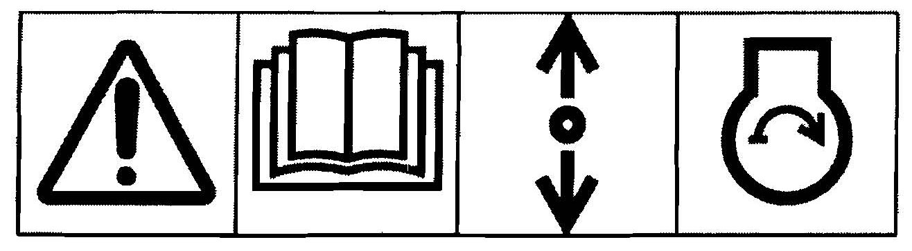

# Guidance for Recreational Crafts

> OTHER RULES AND GUIDANCE / GC-06-E / 2025 / EN / Guidance

## CHAPTER 8 MACHINERY INSTALLATIONS

### Section 1 Engine and Engine Spaces

#### 101. Inboard engine

- **1.** All inboard mounted engines are to be placed within an enclosure separated from living quarters and installed so as to minimize the risk of fires or spread of fires as well as hazards from toxic fumes, heat, noise or vibrations in the living quarters.
- **2.** Engine parts and accessories that require frequent inspection and/or servicing are to be readily accessible.
- **3.** Fuel and electrical components mounted on the inboard petrol engines are to comply with the requirements of **ISO 15584**.
- **4.** Fuel and electrical components mounted on the inboard diesel engines are to comply with the requirements of **ISO 16147**.
- **5.** The propulsion engine which have a clutch or drives controllable pitch propeller is to be provided with governor to prevent overspeed.
- **6.** The main engine seat is to be of rigid structures integrated with hull structure and supported by transverse reinforcements. And the structures are to be easily accessible for operation of lubricating oil, drainage, bilge suction or sea water suction valves etc.
- **7.** Main engine setting bolts are to be of suitable size and contacted completely with engine seats, and the bolts are to be provided with anti-loosening devices.
- **8.** In case of using chock liner which has a elasticity for main engine installation, the main engine is to be connected with shafting system using flexible coupling.
- **9.** Unless the engine is protected by a cover or its own enclosure, exposed moving or hot parts of the engine that could cause personal injury are to be effectively shielded.

#### 102. Outboard engine starting

- **1.** All crafts with outboard engines are to have a device to prevent starting the engine in gear, except:
  - **(1)** when the engine produces less than 500 N of static thrust;
  - **(2)** when the engine has a throttle limiting device to limit thrust to 500 N at the time of starting the engine.
- **2.** Non-sailings equipped with remote starting systems may have either an integral start-in-gear protection device or a similar device incorporated in the remote control system. In the latter case, a label shall be affixed to the non-sailing close to the control connection with the WARNING and the READ OWNER'S MANUAL symbols in accordance with ISO 11192.
- **3.** Non-sailings which are normally started by remote control but also have provision for manual local starting that is not readily accessible need not be fitted with a start-in-gear protection device for this system, provided the information label in **Fig 8.1** is displayed on the product. The information label is to be displayed in a prominent position visible to the person operating this manual starting system
  
  Fig 8.1
- **4.** Owner's Manual is to contain the information that controls installed with this non-sailing must have a start-in-gear protection device and contain an explanation correct use of the manual starting system.

### Section 2 Propulsion System

#### 201. Propulsion system

- **1.** The material of shafts is to be of mild steel, stainless steel, bronze or monel and the tensile strength of the material is not to be less than 45$\mathrm{kg}/mm ^{2}$. The shafts are to be made of forged or rolled steel and pressed steel is not to used for shaft.
- **2.** Propeller shaft or stern tube of mild steel is to be of construction which is not to be contacted with sea water, such as continuos bronze sleeve. However, the above requirements are not apply to the oil lubricating system with approved oil sealing device. The part between stern tube and bracket is to be protected from contact with sea water using approved paint.
- **3.** In case propeller shafts or stern tube shafts are made of corrosion resistance steel such as stainless steel, bronze or monel, the measurement to prevent from contact with sea water is not needed.
- **4.** The diameter of intermediate shaft($d _{0}$) is not to be less than that obtained from following formula.
  $d _{0} =102 root {3} of {\frac{H}{n}}$ (mm)
  $H$ : Continuous maximum output of engine (*PS*)
  $n$ : Continuous maximum revolution of shaft (rpm)
- **5.** The diameter of propeller shaft or stern tube shaft (d*_p*) is not to be less than that obtained from following formula.
  $d _{p} =1.2d _{0}$ (mm)
  $d _{0}$ : Required diameter of intermediate shaft (mm)
- **6.** Where the propeller shafts or stern tube shafts used the materials of which the tensile strength exceeds 45 $\mathrm{kg}/mm ^{2}$, the diameter of propeller shafts or stern tube shafts may be reduced to the value multiplied by$K$ of following formula. However, the propeller shafts or stern tube shafts made of mild steel are not allowed to reduce the diameter even if the materials of high tensile steel are used.
  $K= root {3} of {\frac{45}{45+ \frac{2}{3} \left( S-45 \right)}}$
  $S$ : minimum tensile strength($\mathrm{kg}/mm ^{2}$)
- **7.** The thickness of bronze sleeves used in propeller shaft or stern tube shaft is not to be less than that obtained from following formula.
  $t _{1} =0.03d _{p} +7.0$ (mm)
  $t _{2} =0.75t _{1}$ (mm)
  $t _{1}$ : thickness of sleeve where stern tube or strut bearings are contacting
  $t _{2}$ : thickness other than above
  $d _{p}$ : Required diameter of propeller or stern tube in calculating (mm)
- **8.** In case of propeller shaft set sleeve, the construction between propeller and propeller shaft is to be prevented sea water from ingress.
- **9.** The diameters of coupling bolts at contacting surface of shaft coupling are not to be less than that obtained from following formula. However, in case of material of which tensile strength exceeds 45 $\mathrm{kg}/mm ^{2}$, the diameters may be reduced to the values which are deemed appropriate by the Society.
  $d _{b} =0.75 \sqrt {\frac{d _{0} ^{3}}{nD}}$ (mm)
  $d _{0}$ : Required diameter of intermediate shaft in calculating (mm)
  $n$ : Number of coupling bolts
  $D$ : Diameter of pitch circle (mm)
- **10.** The thickness of coupling on pitch circle is not to be less than the required diameter of coupling bolt in calculating. However, the coupling thickness of propeller shaft is to be greater than 0.25 times of required diameter of intermediate shaft. Also, the radius of roots in coupling is to be greater than 0.125 times of shaft diameter. In case, the coupling is fabricating type, it is to be of the structure to withstand in full astern condition.
- **11.** The bearing length of stern tube or strut bracket supporting propeller shaft is not to be less than 4 times of required propeller shaft diameter in calculating.
- **12.** Where the propeller bearing is a lignumbite or approved synthetic material, it is to be designed to lubricate by sufficient sea water. In relatively large stern tube bearing system, it is needed to supply sea water by circulating pump or other water pressure for lubricating.
- **13.** The stern tube and propeller brackets are to be rigidly fitted with hull structures to maintain shaft centerline in normal voyage condition. And, where the length of shaft is long, the bearings are to be supported so that the space between bearings is not be too long. The bearings installed below engine room upper plate are to be readily accessible.
- **14.** The machinery installation and shaft centerline is to be confirmed by the surveyor in crafts afloat condition.

### Section 3 Starting System

#### 301. Starting system

- **1.** The generators are to be installed to charge the starting batteries for the main engine starting by batteries.
- **2.** In case the main engine started by compressed air, at least tow air compressors are to be installed and these may be driven by main engine. Each air compressor is to be provided with safety valves.
- **3.** The construction of air tanks are to be of approved ones and each tank is to be provided with safety valves or plug and drain system.
- **4.** The compressed air pipes are to be made of seamless steel pipe, and the thickness $t$ are not to be less than that obtained from following formula.
  $t= \frac{pd}{C} +1.0$ (mm)
  $p$ : maximum working pressure ($\mathrm{kg}/cm ^{2}$)
  $d$ : outer diameter of pipe (mm)
  $C$ : coefficient, in case of steel pipe 844, in case of cupper pipe 422.

### Section 4 Sea Water and Drainage Piping System

#### 401. General

Sufficient number of freeing ports and scuppers are to be installed on bulwarks and decks.

#### 402. Drain pipe

- **1.** When drain pipes are installed to discharge water from upper deck or accommodations to the below waterline or adjacent area, check valves or cock are to be installed and discharge lines are to have sufficient thickness.
- **2.** For the crafts of 20 m or less in length, in case the drain pipes of upper deck is installed to discharged water to the above waterline, the drain pipes may be reclaimed in the side plating. The weight of drain pipe wall is not to be less than 75 % of side shell plating.
- **3.** Drain pipes installed between decks are to be led to bilge well in crafts.
- **4.** Sanitary supply lines and pipe lines for washbasin are to be connected to side shell plating.
- **5.** Cast steel with check valve or other elbow, etc. are to be of strong structure and of approved material except normal cast iron. Pipes attached to valve or elbow are to be of galvanized and thick steel pipes.

#### 403. Sea suction and overboard discharging system

- **1.** The sea suction and overboard discharging system are to be fitted at the location which are easily accessible and valve and cocks are to be connected with shell plate or short and rigid distance piece directly. The shell openings are to be reinforced with doublers properly.
- **2.** Where the fitting of a seacock/valve or through-hull fitting impairs the local strength of the hull, a reinforcement or a backing block is to be installed to compensate for the loss of strength.
- **3.** In reinforced plastics hulls built in sandwich construction, the core material is to be replaced by a material that cannot be compressed when tightening the through-hull fitting, or the area around the fitting is to be built in single skin construction with local reinforcement.
- **4.** The attachment of through-hull fittings and seacock/valve to the hull is to be watertight and so installed as to prevent loosening under normal operating conditions.
- **5.** Sea cocks/valves are to be readily accessible and securely fastened to the hull to permit easy operation without damage to the hull structure or to the sea cock/valve itself and without destroying the watertight integrity or the sea cock/valve installation.
- **6.** Cocks/valves, outfitting penetrating hull are to be complied with the requirements of ISO 9093-1 and ISO 9093-2.

#### 404. Bilge piping sysytem

- **1.** **Type, number and location**
  - **(1)** General
    Bilge-pumping systems are to be capable of removing water from all main compartments of the craft where water can accumulate. Fore and aft peaks with a combined volume of less than or including 10 % of the displacement of the craft in the fully loaded ready-for-use condition, according to **ISO 8666**, need not be linked to the bilge-pumping system if trapped water in those compartments can be emptied into the main bilges by a valve, or drained by other means. Types, numbers and locations of bilge-pumping systems are to be in accordance with requirements in (2) and (3).
  - **(2)** Open and partially decked crafts(For crafts in design categories A, B C and D)
    For open and partially decked crafts, the means of bailing are to be specified in the owner's manual.
  - **(3)** Fully decked crafts
    For craft in design categories A, B and C, one additional manual, mechanical or electric bilge pump or bilge-pumping system is to be installed, which is to be capable of removing water from all bilge compartments and which is to be operable from a readily accessible position. For craft in design category D, no secondary bilge pump is required.

    | Craft type | Craft characteristics | Type of pump | Bilge-pump requirements or means of bailing |
    | --- | --- | --- | --- |
    | Open and partially decked crafts (Design categories A, B, C, D) |   |   | See Owner's manual |
    | Fully decked crafts (Design category A, B, C) | Exposed steering position | Primary pump | 1 manual pump (water head less than 1.5 m) 1 manual, mechanical or electric pump (water head 1.5 m or more) (operable from the cockpit) |
    | Fully decked crafts (Design category A, B, C) | Exposed steering position | Secondary pump | 1 manual or mechanical or electric pump |
    | Fully decked crafts (Design category A, B, C) | Enclosed steering position | Primary pump | 1 powered pump (operable from the main steering position) |
    | Fully decked crafts (Design category A, B, C) | Enclosed steering position | Secondary pump | 1 manual or mechanical or electric pump |
    | Fully decked crafts (Design category D) | $L_H$ greater than 6 m | Primary pump | 1 manual or mechanical or electric pump |
    | Fully decked crafts (Design category D) | $L_H$ less than or equal to 6 m | Primary pump | 1 manual pump, for alternative see Owner's manual |
    - **(A)** Fully decked crafts are to be fitted with one or more bi1ge pumps according to the requirements in (B) and (C).
    - **(B)** Primary bilge pump (For craft in design categories A, B and C)
      - **(a)** Where the main steering position is exposed and the water head in the discharge line is less than 1.5 m, one manual bilge pump is to be installed, permanently attached to the craft structure and operable from within the cockpit, with all doors, hatches and other accesses to the interior of the craft closed;
      - **(b)** Where the main steering position is exposed and the water head in the discharge line is 1.5 m or more, one manual or powered bilge pump or bilge pumping system (e.g. electric) is to be installed, permanently attached to the craft structure and operable from the main steering position, with all doors, hatches and other accesses to the interior of the craft closed;
      - **(c)** Where the main steering position is enclosed within the craft, one powered bilge pump or bilge-pumping system is to be installed and the bilge pump is to be operable from the main steering position.
    - **(C)** Primary bilge pump(For craft in design category D)
      - **(a)** If $L_H$ is greater than 6 m, one manual or powered bilge pump or bilge-pumping system is to be installed;
      - **(b)** If $L_H$ is less than or equal to 6 m, one manual bilge pump or other means of bailing is to be available, which is to be specified in the owner's manual.
    - **(D)** Secondary bilge pump
- **2.** **Capacity**
  - **(1)** The capacity of each bilge pump, according to **1** (3) is to be not less than
    - **(A)** 10 L/min for crafts with $L_H$, less than or equal to 6 m,
    - **(B)** 15 L/min for crafts with $L_H$, greater than 6 m and less than 12 m, or
    - **(C)** 30 L/min for crafts with $L_H$, greater than or equal to 12 m.
  - **(2)** These volumes per minute are to be achieved when the pump is subjected to a back pressure of 10 kPa. For manual bilge pumps, the capacity is to be rated for 45 strokes per minute.
- **3.** **Design and construction**
  - **(1)** The design and construction of bilge-pumping systems are to withstand the pressures, temperatures and stresses likely to be encountered under normal operating conditions. Bilge pumps are to be operable within temperature limits ranging from 0 °C to +60 °C and are to withstand storage temperatures, without operation, of -40 °C to +60 °C when in the dry condition.
  - **(2)** Spigots/spuds of bilge pumps and other components are to be long enough to provide support for the hose, and permit the use of clamps.
  - **(3)** Unless permanently fitted, bilge-pump handles are to be secured to minimize the risk of accidental loss.
  - **(4)** No bilge pump may discharge into a cockpit unless the cockpit opens aft to the sea. Bilge pumps are not to be connected to cockpit drains.
  - **(5)** Electrically operated pumps
    - **(A)** Electric bilge pumps are to comply with **ISO 8849**.
    - **(B)** Electrical connections are to be water resistant to a degree of IP 67 according to **IEC 60529**, and are to be placed above the maximum acceptable water level, unless submersible.
    - **(C)** Where the switch is subject to spray water, it is to be water resistant to a degree of IP 56 according to **IEC 60529**.
  - **(6)** The inner diameter of bilge suction pipes are not to be less than that obtained from following formula. However, the inner diameter is not to be less than 25 mm in any case and the inner diameter of bilge branch line need not be exceed 50mm.
    $d = \frac{L}{1.2} + 25$
    $d$ : inner diameter of bilge pipe (mm)
    $L$ : craft length (m)
- **4.** **Installation**
  - **(1)** Bilge pumps are to be mounted in an accessible location for servicing and clearing the intake.
  - **(2)** Bilge-pump water inlets (e.g. strainers) are to be designed and installed to minimize ingestion of debris likely to cause pump failure and are to be accessible for cleaning.
  - **(3)** Intake hoses are not to collapse under maximum pump suction.
  - **(4)** Bilge-pump pipes and hoses are to be installed to minimize flow restriction.
  - **(5)** Outlets on the hull are to be above the maximum heeled waterline, unless a seacock is installed in accordance with **ISO 9093**, and there is a means to prevent backflow into the craft.
  - **(6)** Where several pumps discharge through one through-hull fitting, the system is to be designed so that the operation of one pump will not feed back through another pump, and the simultaneous operation of the pumps will not diminish the pumping capacity of the system.
  - **(7)** Hose connections are to be secured with non-corrosive types of clamps, or with permanently attached end-fittings.
  - **(8)** Non-submersible bilge pump non-sailings are to be located above the critical bilge-water level.
  - **(9)** Bilge pumps with automatic controls are to be provided with a readily accessible manual power-supply switch to activate the pump.
  - **(10)** Automatic controls are to be provided with a visual indication showing that power is supplied to the pump and that the pump is set and ready to operate in automatic mode.
  - **(11)** Hand pumps are to be installed in such a way that they can be operated at their rated capacity according to **2**.
- **5.** **Owner's manual**
  The manufacturers of craft and/or pump are to provided with the following information for bilge pumping system in the owner's manual.
  - **(1)** Type, capacity and position of installation of each bilge pump
  - **(2)** Methods of operation
  - **(3)** Requirements for maintenance

### Section 5 Discharge Prevention and Installations Facilitating the Delivery Ashore of Waste

#### 501. General

- **1.** Crafts are to be constructed so as to prevent the accidental discharge of pollutants (oil, fuel, etc.) overboard.
- **2.** Craft fitted with toilets is to have holding tanks or provision to fit holding tanks.
- **3.** Crafts with permanently installed holding tanks are be fitted with a standard discharge connection to enable pipes of reception facilities to be connected with the craft discharge pipeline.
- **4.** Toilet waste retention system and a standard discharge connection are to comply with the requirements in **ISO 8099**.
- **5.** In addition, any through-the-hull pipes for human waste is to be fitted with valves which are capable of being secured in the closed position.

### Section 6 Fuel System

#### 601. General

Design, materials, installation and tests of permanently installed gasoline and diesel fuel system and permanently installed fuel tanks for inboard engines for propulsion and auxiliary and outboard engines are to be comply with the requirements in this Section.

#### 602. Fuel system

- **1.** **Materials and design**
  - **(1)** The filling, storage, venting and fuel-supply arrangements and installations are to be designed and installed so as to minimize the risk of fire and explosion.
  - **(2)** Individual components of the fuel system, and the fuel system as a whole, are to be designed to withstand the combined conditions of pressure, vibration, shocks, corrosion and movement encountered under normal operating conditions and storage.
  - **(3)** Each component of the fuel system, and the fuel system as a whole, are to be capable of operation within an ambient temperature range of -10 °C to +80 °C, without failure or leakage, and be capable of being stored without operation within an ambient temperature range of -30 °C to +80 °C, without failure or leakage.
  - **(4)** All materials used in the fuel system are to be resistant to deterioration by its designated fuel and to other liquids or compounds with which it may come into contact under normal operating conditions, e.g. grease, lubricating oil, bilge solvents and sea water.
  - **(5)** The only outlets for drawing fuel from the fuel system are to be :
    - **(A)** Plugs in petrol filter bowls intended solely for the purpose of servicing the filter,
    - **(B)** Plugs or valves in diesel filter bowls intended solely for the purpose of servicing the filter.
  - **(6)** Each metal or metallic plated component of a petrol fuel fill system and fuel tank which is in contact with the fuel are to be grounded so that its resistance to the craft's ground is less than one ohm. Grounding wires are not to be clamped between a hose and its pipe or spud.
  - **(7)** Fuel filling systems are to be designed to avoid blowback of fuel through the fill fitting. Fuel systems are to be tested in accordance with **4** (3).
  - **(8)** Provision is to be made to prevent fuel overflow from the vent opening from entering the craft or the environment.
  - **(9)** All fuel system components in the engine compartment, excluding permanently installed fuel tanks, which are tested in accordance with **ISO 21487**(e.g. filters, water separators, and hoses) are to individually, or as installed in the craft, be capable of withstanding a 2.5 min fire test as specified in **ISO 7840 Annex A**. Fasteners supporting metal fuel lines constitute an exception to this requirement.
  - **(10)** Copper-base alloy fittings may be used for aluminium tanks if protected by a galvanic barrier to reduce galvanic corrosion.
  - **(11)** A means to determine fuel tank level or quantity is to be provided.
- **2.** **Fuel pipes, hoses, connections and accessories**
  - **(1)** Fuel filling lines
    - **(A)** The minimum inside diameter of the filling pipe system is to be 31.5 mm and the minimum inside diameter of fuel filling hoses is to be 38 mm.
    - **(B)** Fuel filling hoses located in the engine compartment are to be fire resistant, of type A1 or A2 in accordance with **ISO 7840**. Fuel filling hoses outside the engine compartment are to be of either type A1 or A2 in accordance with **ISO 7840**, or of type B1 or B2 in accordance with **ISO 8469**.
    - **(C)** Fuel filling lines are to be self-draining to the tank when the craft is in its static floating position.
    - **(D)** Fuel filling lines are to run as directly as practicable, preferably in a straight line from the deck plate or equivalent filling point to the tank.
    - **(E)** The fuel filling system is to be designed so that accidental fuel spillage does not enter the craft when it is in its static floating position.
    - **(F)** The distance between compartment ventilation openings and fuel filling openings is to be at least 400 mm, except where the craft's coaming, superstructure or hull creates a barrier to prevent fuel vapour entering the craft through the ventilation opening.
    - **(G)** The fuel filling point are to be marked “petrol” or “diesel” and/or with a symbol specified in **ISO 11192** to identify the type of fuel to be used.
  - **(2)** Vent lines
    - **(A)** Each fuel tank is to have a separate vent line.
    - **(B)** Vent hoses located in the engine compartment are to be fire resistant, of type A1 or A2 in accordance with **ISO 7840**. Vent hoses outside the engine compartment are to be of either type A1 or A2 in accordance with **ISO 7840**, or type B1 or B2 in accordance with **ISO 8469**.
    - **(C)** The cross-sectional area of any vent component is not to be less than 95 $\mathrm{mm} ^{ 2}$(inside diameter 11 mm).
    - **(D)** Vent lines are not to have valves other than those that permit free flow of air and prevent flow of liquid both in and out of the tank.
    - **(E)** Vent lines are to be self-draining when the craft is in its static floating position.
    - **(F)** The distance between compartment ventilation openings and fuel vent openings is to be at least 400 mm, except where the craft's coaming, superstructure or hull creates a barrier to prevent fuel vapour entering the craft through the ventilation opening.
    - **(G)** The vent line is to be arranged to minimize intake of water without restricting the release of vapour or intake of air and is not to allow fuel or vapour overflow to enter the craft.
    - **(H)** The vent-line termination or a gooseneck in the vent-line routing is to be arranged at sufficient height to prevent spillage of fuel through the vent line during filling and entry of water under normal operating conditions of the craft. On mono-hull sailing craft, the vent line is to be arranged to minimize the risk of fuel spillage or entry of water through the vent when sailing at a heel angle of up to 30°.
    - **(I)** The vent lines on all fuel installations are to incorporate a flame arrester device.
    - **(J)** For components installed in the vent line, the requirements in (2) apply.
    - **(K)** For vent-line components in the engine compartment, with the ability to capture fuel, the fire test requirements in **1** (9) apply.
  - **(3)** Fuel distribution lines and fuel return lines
    - **(A)** Metal fuel distribution and return lines are to be made of seamless annealed copper or copper–nickel or equivalent metal with a nominal wall thickness of at least 0.8 mm. Aluminium lines may be used for diesel fuel.
    - **(B)** Rigid fuel distribution and return lines are to be connected to the engine by a flexible hose section. Support is to be provided within 100 mm of the connection to the metal supply line on the rigid side of the connection.
    - **(C)** Connections in rigid fuel distribution or return lines are to be made with efficient screwed, compression, cone, brazed or flanged joints.
    - **(D)** Flexible fuel distribution and return hoses are to be used where relative movement of the craft structures supporting the fuel lines would be anticipated during normal operating conditions.
    - **(E)** Flexible fuel distribution and return hoses are to be accessible for inspection and maintenance.
    - **(F)** Petrol distribution and return hoses are to be fire-resistant, type A1 hoses in accordance with **ISO 7840**, except hoses entirely within the splash well at the stern of the craft connected directly to an outboard engine, which are to be type B1 or B2 hoses in accordance with **ISO 8469** or A1 or A2 hoses in accordance with **ISO 7840**.
    - **(G)** Diesel-fuel distribution and return hoses are to be fire-resistant, type A1 or A2 hoses in accordance with **ISO 7840**.
    - **(H)** Fuel distribution and return lines are to be properly supported and secured to the craft structure above bilge water level, unless specifically designed for immersion or protected from the effects of immersion.
    - **(I)** There are to be no joints in fuel distribution and return pipes or hoses other than those required to connect required fuel-line components, e.g. filters and bulkhead connections.
    - **(J)** Fuel distribution lines to petrol engines are to be designed or installed to prevent fuel siphoning out of the tank following a failure in the system. The following examples illustrate how this can be achieved:
      - **(a)** routing all parts of fuel lines, from which an assumed leakage can enter the craft, above the level of the tank top when the craft is in its static floating position, including fuel-containing parts on the engine; or
      - **(b)** fitting an anti-siphon valve at the tank fittings with a rated siphon-protection head greater than that required to avoid the siphon effect; or
      - **(c)** fitting a manual shut-off valve, which are to be capable of being closed from an indicated accessible location outside the engine compartment, in a position that is self-draining from the valve to the tank; or
      - **(d)** fitting an electrically operated valve at the tank withdrawal fitting which is activated to open only when the engine is running or the starting device is operated. A momentary override type is acceptable for starting.
    - **(K)** Fuel distribution lines to diesel engines to either meet the requirements of (J), or be fitted with a manual shut-off valve. This valve is to be capable of being closed from an indicated accessible location outside the engine compartment. If electrically operated valves are used, they are to be equipped with a manual emergency operating or by-passing device.
    - **(L)** Diverting valves in diesel return lines are to ensure that the return line flow is not restricted.
  - **(4)** Hose fittings and hose clamping
    - **(A)** Fuel hoses are to be secured to the pipe, spud or fitting by metal hose clamps or be equipped with permanently attached end fittings such as a swaged sleeve or a sleeve and threaded insert.
    - **(B)** Pipes, spuds or other fittings for hose connection with hose clamps are to have a bead, flare, series of annular grooves or serrations. The fuel-tank spud constitutes an exception to this requirement. Continuous helical threading knurls or grooves, which can provide a path for fuel leakage, are not to be used.
    - **(C)** Spuds or other fittings for hose connection with hose clamps are to have a nominal outer diameter which is the same as the nominal inner diameter of the hose, and should be chosen from a series of preferred numbers, e.g. 3.2, 4, 5, 6.3, 8, 10, 12.5 16, 20, 25, 31.5, 40, 50, 63.
    - **(D)** Hose connections designed for a clamp connection are to have a spud at least 25 mm long.
    - **(E)** Hose connections having a nominal diameter of more than 25 mm are to have two hose clamps. The spud is to be at least 35 mm long, to provide space for the clamps.
    - **(F)** Spuds intended for hose connection are to be free from sharp edges that could cut or abrade the hose.
    - **(G)** Hose clamps are to be made of CrNi 18-8 stainless steel, or equivalent, and be reusable. Clamps depending solely on spring tension are not to be used. The nominal clamp band width is to be at least 8 mm for nominal outside hose diameters up to and including 25 mm and at least 10 mm for bigger hoses. Clamps are to be of the correct size and are to be fitted according to the clamp manufacturer's requirements.
    - **(H)** Clamps are to be installed to fit directly on the hose and are not to overlap each other. Clamps are to be installed behind the bead, if any, or fully on the serrations on spuds at least one clamp width from the end of the hose.
  - **(5)** Valves
    - **(A)** Manually operated valves are to be designed with positive stops in the open and closed positions or are to clearly indicate their open and closed positions.
    - **(B)** The integrity and tightness of a valve are not to depend solely on spring tension.
    - **(C)** Threaded valve housing covers that can be exposed to an opening torque when the valve is operated are to be secured against unintentional opening by a device that can be reused.
  - **(6)** Fuel filters
    - **(A)** Petrol fuel systems are to be equipped with a fuel filter, which may be fitted on the engine.
    - **(B)** Diesel fuel systems are to be equipped with at least one fuel filter and one water separator. The two functions may be combined in one unit.
    - **(C)** Each filter is to be independently supported on the engine or craft structure.
  - **(7)** Labelling
    All components (e.g. filters, pumps and water separators) that have passed the test for fire resistance specified in **ISO 7840** Annex A, are to be labelled or marked with the following:
    - **(A)** Manufacturer's name or trademark;
    - **(B)** **ISO 10088**, fire resistant;
    - **(C)** Type of fuel or fuels for which the component is suitable.
- **3.** **Installation**
  - **(1)** The fuel system is to be permanently installed. All component parts, except small connectors and fittings and short sections of flexible hoses, are to be independently supported.
  - **(2)** All valves and other components intended to be operated or observed during normal operation of the craft, or for emergency purposes, are to be readily accessible. All other components of the system are to be accessible. Tanks need not be accessible for removal.
  - **(3)** The clearance between a petrol fuel tank and a combustion engine is not to be less than 100 mm.
  - **(4)** The clearance between a petrol tank and dry exhaust components is not to be less than 250 mm, unless an equivalent thermal barrier is provided.
  - **(5)** Fuel system electrical components are to be installed in accordance with **ISO 10133** or **ISO 13297**.
  - **(6)** Fuel tanks and components of petrol fuel systems are not to be installed directly above batteries unless the batteries are protected against the effects of fuel leakage.
- **4.** **Tests**
  - **(1)** After installation, the fuel system is to be subject to pressure test as follows;
    - **(A)** A complete fuel system as installed in the craft is to be subject to the test pressure with the pressure of 20 kPa. and the pressure-drop method is to be used. The time during which the system is exposed to the pressure is to be equal to the greater of the following two values: 1.5 s per litre of tank capacity or 5 min, up to a maximum of 30 min. Tanks with a capacity of less than 200 L are to be tested for at least 5 min. During this test, fuel-fill deck plates and vent-line through-hull fittings may be replaced by plugs. The fuel connection at the fuel feed pump of the engine is to be disconnected and sealed. Anti-siphon valves and other fuel valves are to be open.
    - **(B)** A component or fuel system is not to show any leakage during pressure testing for 5 min.
  - **(2)** Fuel system components that are small enough, such as fuel valves, and required to be fire tested according to **1** (9) are to be tested as specified in **ISO 7840** Annex A. **The component to be tested is to be a complete assembly and include all accessories intended to be attached directly to the component.**
  - **(3)** There are to be no blow back of fuel through the fill fitting when filling at a rate of 30 L/min from 25 % to 75 % of the capacity on the tank label. For fuel tanks of 100 L capacity or less, the fill rate may be reduced to 20 L/min. The test to determine compliance with this is to be performed on at least one craft or a representative installation.

#### 603. Fuel tanks

- **1.** **Design general**
  - **(1)** Fuel tanks, lines and hoses are to be secured and separated or protected from any source of significant heat. The material of the tanks and their method of construction are to be according to their capacity and the type of fuel. All tank spaces are to be ventilated.
  - **(2)** Petrol fuel is to be kept in tanks which do not form part of the hull and are insulated from the engine compartment and from all other source of ignition and are separated from living quarters.
  - **(3)** Diesel fuel may be kept in tanks that are integral with the hull.
  - **(4)** Metal tanks are to be designed or installed so that no exterior surface will trap water.
  - **(5)** Rigid fuel suction tubes and filling pipes which extend near the tank bottom are to have sufficient clearance to prevent contact with the bottom during normal operation of the craft.
  - **(6)** Non-integral tanks shall be installed so that the loads due to the mass of the full tank are safely introduced into the structure, with due consideration given to upward and downward acceleration due to the craft's movements at maximum speed in the sea. All non-integral tank supports, chocks or hangers are to either be separated from the surface of metal tanks by a non-metallic, non-hygroscopic, non-abrasive material or welded to the tank.
  - **(7)** If baffles are provided, the total open area provided in the baffles is to be not greater than 30 % of the tank cross section in the plane of the baffle.
  - **(8)** Baffle openings are to be designed so that they do not prevent the fuel flow across the bottom or trap vapour across the top of the tank.
- **2.** **Materials**
  - **(1)** All seals such as gaskets, o-rings and joint-rings are to be of non-wicking, i.e. non-fuel absorbent, material.
  - **(2)** All materials used are to be resistant to deterioration by the fuel for which the system is designed and to other liquids or compounds with which the material can come in contact as installed under normal operating conditions, e.g. grease, lubricating oil, bilge solvents and sea water.
  - **(3)** The melting point of materials used for manufacturing of plastic fuel tanks is to be higher than 150 °C.
  - **(4)** Copper-based alloys for fittings are acceptable for direct coupling with all tank materials specified in **Table 8.2** except aluminium. Copper-based alloy fittings are allowed for aluminium tanks only if a galvanic barrier is arranged between fitting and tank.
  - **(5)** Suitable metallic tank materials and minimum recommended material thicknesses required for corrosion resistance are given in **Table 8.2**. Other materials may be used if they demonstrate equivalent fuel and corrosion resistance.

    | Material | Minimum nominal sheet thickness for corrosion resistance mm | Fuel |
    | --- | --- | --- |
    | Copper, internally tin-coated | 1.5 | Petrol only |
    | Aluminium alloys containing no more than 0.1 % copper | 2.0 | Diesel and petrol |
    | Stainless steel, with all welding deposits removed | 1.0 | Diesel and petrol |
    | Mild steel | 2.0 | Diesel only |
    | Mild steel externally hot-dip zinc-coated after fabrication | 1.5 | Diesel only |
    | Mild steel externally and internally hot-dip zinc-coated after fabrication | 1.5 | Petrol only |
    | Aluminized steel | 1.2 | Diesel and petrol |
- **3.** **Petrol fuel tanks**
  - **(1)** Petrol fuel tanks are not to be integral with the hull.
  - **(2)** Petrol fuel tanks are to have all fittings and openings on top, except metallic filling and ventilation pipes, which may be connected to the sides or ends of metal petrol fuel tanks, provided that they are welded to the tank and reach above the top of the tank.
  - **(3)** Tank drains are not permitted on petrol fuel tanks.
  - **(4)** Petrol fuel tanks are to be subjected to leakage test in accordance with 7.1.2 of **ISO 21487** and to be subjected to pressure-impulse test in accordance with 7.2 of **ISO 21487**.
  - **(5)** Non-metallic petrol fuel tanks are to meet the fire test in accordance with 7.3 and 7.4 of **ISO 21487**.
- **4.** **Diesel fuel tanks**
  - **(1)** Diesel fuel tanks may be constructed independent of or integral with the hull. Care should be taken to avoid penetration of fuel in the hull.
  - **(2)** Diesel fuel integral tanks are to be built in accordance with **ISO 12215-5**.
  - **(3)** Diesel fuel tanks may have side inspection openings. Fittings in the bottom, sides or ends are allowed provided that each connection has a shut-off valve directly coupled to the tank. The valve is to be protected or located to prevent physical damage or be of at least 25 mm nominal diameter.
  - **(4)** Diesel fuel tank drains, where fitted, are to have a shut-off valve with a plug on the outlet that can only be removed by the use of tools, or the handle of the drain shut-off valve is to be removable with the valve in its closed position.
  - **(5)** Diesel tanks are to be subjected to leakage test in accordance with 7.1.2 **and** are to be subjected to pressure/strength test in accordance with 7.1.3 of **ISO 21487**.
- **5.** **Marking to the Tanks**
  All fuel tanks are to display the following information in contrasting or embossed letters and numerals at least 3 mm high:
  - manufacturer's name or trademark, city or equivalent, and country;
  - year of manufacture (last two digits);
  - design capacity, expressed in liters;
  - fuel or fuels for which the tank is suitable, in symbols (as specified in **ISO 11192**) or in words;
  - maximum fill-up height above tank top, expressed in meters, and allowable test pressure, expressed in kP; “ISO 21487” marking or label if the tank is a non-metallic petrol fuel tank fire tested in accordance with this International Standard;
  - CE marking and identification number of notify authority (if applicable)

### Section 7 Ventilation

#### 701. General of ventilation

- **1.** The engine compartment is to be sufficiently ventilated with adequate natural ventilation, etc.
- **2.** The dangerous ingress of water into the engine compartment through all inlets must be prevented.
- **3.** The machinery spaces are to be provided with intake and discharge ducts of ventilating system and at least one intake duct are to be extended to the low location of proper space. The discharge duct may be connected to top of machinery space or to the natural or mechanical ventilator.
- **4.** Where ventilation system is installed other than this regulation, the detail documents are to be submitted to the Society before installation and it may be approved when it is considered equivalents.

#### 702. Ventilation of petrol engine and/or petrol tank compartments

- **1.** **Natural ventilation systems**
  - **(1)** Unless open to the atmosphere, each compartment contains a permanently installed petrol engine, a permanently installed petrol tank or a portable petrol tank in a craft is to have a natural ventilation system.
  - **(2)** Natural ventilation may be supply opening or supply duct or exhaust opening or exhaust duct and each exhaust opening or exhaust duct is to originate in the lower one-third of the compartment.
  - **(3)** Each supply opening or supply duct and each exhaust opening or exhaust duct in a compartment is to be above the normal accumulation of bilge water.
  - **(4)** Compartment air intake and exhaust duct openings are to be separated by at least 600 mm, compartment dimensions permitting.
  - **(5)** Except as provided in (6), the combined area of supply openings or supply ducts, and the combined area of exhaust openings or exhaust ducts is to have a minimum internal cross-sectional area calculated as follows:
    $A=3300 \ell n(V/0.14)$
    where,
    A : is the minimum combined internal cross-sectional area of the openings or ducts, ($\mathrm{mm} ^{ 2}$) ;
    V : is the net compartment volume equal to the total compartment volume minus the volume of permanently installed components in it, ($\mathrm{m}^{ 3}$).
  - **(6)** The minimum internal cross-sectional area of each supply opening or duct, and exhaust opening or duct is to exceed 3000 $\mathrm{mm} ^{ 2}$.
  - **(7)** The minimum internal cross-sectional area of terminal fittings for flexible ventilation ducts installed to meet the requirements of clause (5) is not to be less than 80 % of the required internal cross-sectional area of the flexible ventilation duct.
  - **(8)** The exhaust of the natural ventilation system may be part of the powered ventilation system.
- **2.** **Power ventilation systems**
  - **(1)** Unless open to the atmosphere, each compartment containing a permanently installed petrol engine is to be provided with power ventilation system removing air from the compartment to the atmosphere outside the craft by an exhaust blower system.
  - **(2)** Each exhaust blower or combination of blowers are to be rated at an airflow capacity $Q r$ not less than that given in **Table 8.3**. Blower rating is to be determined according to ISO 9097.

    | compartment volume(V) $\mathrm{m}^{ 3}$ | airflow capacity ($Q r$) $\mathrm{m}^{ 3}$/min |
    | --- | --- |
    | < 1 1 ≤$V$ ≤ 3 > 3 | 1.5 1.5 × $V$ 0.5 × $V$+3 |
  - **(3)** Each intake duct for an exhaust blower is to be in the lower one-third of the compartment and above the normal level of accumulated bilge water.
  - **(4)** More than one exhaust blower may be used in combination to meet the requirements of clause (2).
  - **(5)** Each craft that has an exhaust blower is to have a label in accordance with 6.5 of **ISO 11105** and to include an information in accordance with 7 of **ISO 11105** in the owner's manual.
- **3.** The ventilation duct sizes and airflow requirements are to be calculated based on compartment volumes.
- **4.** Compartments containing petrol engines and/or petrol tanks are to be sealed from enclosed accommodation spaces. Separating structures are regarded as being sealed if they fulfil the following requirements:
  - **(1)** the boundaries are welded, brazed, glued, laminated or the like;
  - **(2)** penetrations for cables, piping etc. are closed by fittings and/or sealants; and
  - **(3)** access openings, for example doors and hatches, are equipped with fittings and are secured.
- **5.** No ventilation is required in petrol engine or petrol tank compartments which are open to the atmosphere, that is; compartment or space having at least 0.34 $\mathrm{m} ^{2}$ of permanent open area directly exposed to the atmosphere for each cubic meter of net compartment volume.
- **6.** Neither supply nor exhaust ducts are to open into an accommodation space.
- **7.** Electrical components installed in petrol engine and petrol tank compartments and any connecting compartments, not open to the atmosphere, are to be ignition-protected in accordance with **ISO 8846**. 
  **Chapter 9 ELECTRICAL EQUIPMENT**

### Section 1 Direct Current System

#### 101. Scope

- **1.** This section is to be applied to the extra-low-voltage direct current (d.c) electrical systems which operate at nominal potentials of 50 V d.c. or less on the recreational crafts. It specifies the requirements for the design, construction and installation of the d.c electrical systems but engine wiring as supplied by the engine manufacturer is not covered by this section. However, the craft operated by alternating current systems shall comply with the **Sec 2**.
- **2.** In addition to requirements in this section, the systems shall also comply with **ISO 10133** (Extra-low-voltage d.c. installations). However, for the direct current (d.c) electrical systems exceeding d.c. 50 V, other standards in the **IEC 60092** series are to be applied.
- **3.** Requirements for electrically operated direct-current bilge pumps applies to the pumps rated for less than 50 V direct current, the pumps intended for use in removing bilge water from the recreational crafts and also shall comply with **ISO 8849** (Electrically operated direct-current bilge pumps). This pumps do not cover pumps intended for damage control.

#### 102. General

- **1.** Electrical systems shall be designed and installed so as to ensure proper operation of the craft under normal conditions of use and shall be such as to minimise risk of fire and electric shock.
- **2.** Attention shall be paid to the provision of overload and short-circuit protection of all circuits, except engine starting circuits, supplied from batteries.
- **3.** Ventilation shall be provided to prevent the accumulation of gases, which might be emitted from batteries. Batteries shall be firmly secured and protected from ingress of water.
- **4.** The system type shall be either a fully insulated two-wire d.c. system or a two-wire d.c. system with a negative ground. The hull shall not be used as a current-carrying conductor. Engine-mounted wiring systems may use the engine block as the grounded conductor.
- **5.** An equipotential bonding conductor, if fitted, shall be connected to the craft's ground(earth) to minimize stray current corrosion.
- **6.** Switches and controls shall be marked to indicate their use, unless the purpose of the switch is obvious and its mistaken operation will not cause a hazardous condition.
- **7.** Protective devices such as circuit-breakers or fuses shall be provided at the source of power, e.g the panel-board(switchboard), to interrupt any overload current in the circuit conductors before heat can damage the conductor insulation, connections or wiring-system terminals. The selection, arrangement and performance characteristics should be such that the following is achieved.
  - **(1)** maximum continuity of service to healthy circuits under fault conditions through selective operation of the various protective devices.
  - **(2)** protection of electrical equipment and circuits from damage due to overcurrents, by coordination of the electrical characteristics of the circuit or apparatus and the tripping characteristics of the protective devices.
- **8.** All d.c. equipment shall operate under the voltage range of accumulator terminals like below (1). Except where the circuit includes equipment requiring a higher minimum voltage, the specified minimum voltage shall be used in the calculation of the conductor size (refer to (2))
  - **(1)** for a 12 volt system : 10.5 ~ 15.5 V, for a 24 volt system : 21 ~ 31 V
  - **(2)** the voltage drop $E$(V) may be calculated by the following formula
    $E = \frac{0.0164 \times I \times L}{S}$
    where
    $S$ : the cross-sectional area of the conductor($\mathrm{mm} ^{ 2}$)
    $I$ : load current (A)
    $L$ : the length (m) of the condition from the positive power source to the electrical device and back to the negative source connection.
- **9.** The length and cross-sectional area of conductors in each circuit shall be such that the calculated voltage drop shall not exceed 10 % of the nominal battery voltage for any appliance, when every appliance in the circuit is switched on at full load.
- **10.** Electrical systems shall comply with the **ISO 8846** in order to protect against ignition of surrounding flammable gases.

#### 103. Batteries

- **1.** Batteries shall be permanently installed in a dry, ventilated location above the anticipated bilge-water level.
- **2.** Batteries shall be installed in a manner to restrict their movement horizontally and vertically considering the intended use of the craft. A battery, as installed, shall not move more than 10 mm in any direction when exposed to a force corresponding to twice the battery weight.
- **3.** The batteries installed in the craft shall be capable of inclinations of up to 30° without leakage of electrolyte. In monohull sailing craft, means shall be provided for containment of any spilled electrolyte up to inclinations of 45°.
- **4.** Batteries shall be installed, designed or protected so that metallic objects cannot come into unintentional contact with any battery terminal.
- **5.** Batteries, as installed, shall be protected against mechanical damage at their location or within their enclosure.
- **6.** Batteries shall not be installed directly above or below a fuel tank or fuel filter.
- **7.** Any metallic component of the fuel system within 300 mm above the battery top, as installed, shall be electrically insulated.
- **8.** Battery cable terminals shall not depend on spring tension for mechanical connection to them

#### 104. Battery-disconnect switch

- **1.** A battery-disconnect switch shall be installed in the positive conductor from the battery, or group of batteries, connected to the supply system voltage in a readily accessible location, as close as practical to the battery or group of batteries. The following constitute exceptions.
  - **(1)** outboard-powered craft with circuits for engine starting and navigation lighting only
  - **(2)** electronic devices with protected memory and protective devices such as bilge-pumps and alarms, if individually protected by a circuit-breaker or fuse as close as practical to the battery terminal
  - **(3)** ventilation exhaust blower of engine/fuel-tank compartment if separately protected by a fuse or circuit-breaker as close as practical to the battery terminal
  - **(4)** charging devices which are intended to be used when the craft is unattended (e.g. solar panels, wind generators) if individually protected by a fuse or circuit-breaker as close as practical to the battery terminal.
- **2.** The minimum continuous rating of the battery switch shall be at least equal to the maximum current for which the main circuit-breaker is rated and also the intermittent load of the starter motor circuit, or the current rating of the feeder conductor, whichever is less.
- **3.** Remote-controlled battery-disconnect switches, if used, shall also permit safe manual operation.

#### 105. Conductors

- **1.** Electrical distribution shall use insulated stranded-copper conductors.(refer to **Table 9.1**) Conductor insulation shall be of fire-retardant material, (e.g. not supporting combustion in the absence of flame.)
- **2.** Conductors that are not sheathed shall be supported throughout their length in conduits, cable trunk, or trays, or by individual supports at maximum intervals of 300 mm.
- **3.** Sheathed conductors and battery conductors to the battery disconnect switch shall be supported at maximum intervals of 300 mm, with the first support not more than 1m from the terminal. Other sheathed conductors shall be supported at maximum intervals of 450 mm. Sheathed outboard-non-sailing starter conductors constitute an exception to this requirements.
- **4.** Conductors which may be exposed to physical damage shall be protected by sheaths, conduits or other equivalent means. Conductors passing through bulkheads or structural members shall be protected against damage to insulation by chafing.
- **5.** Conductors shall have minimum dimensions in accordance with **Table 9.1**, or the conductor manufacturer's rated current-carrying capacity, based on the load to be supplied and allowable voltage drop for the load to be carried. Conductors in voltage-critical circuits, such as starter non-sailing circuits, navigation-light circuits and ventilation­blower circuits, whose output may vary with system voltage, shall be sized in compliance with the component manufacturer's requirements. (refer to **102. 8** & **9**)
- **6.** Each conductor longer than 200 mm installed separately shall have an area of at least 1 $\mathrm{mm} ^{2}$. Each conductor in a multi-conductor sheath shall have an area of at least 0.75 $\mathrm{mm} ^{2}$ and may extend out of the sheath a distance not to exceeding 800 mm. An exception may be made for conductors of minimum area 0.75 $\mathrm{mm} ^{2}$ which may be used as internal wiring in panel-boards.
- **7.** A d.c. circuit shall not be contained in the same wiring system as an a.c. circuit, unless one of the following methods of separation is used.
  - **(1)** For a multicore cable or cord, the cores of the d.c. circuit are separated from the cores of the a.c. circuit by an earthed metal screen of equivalent current-carrying capacity to that of the largest core in either circuit.
  - **(2)** The cables are insulated for their system voltage and installed in a separate compartment of a cable ducting or trunking system.
  - **(3)** The cables are installed on a tray or ladder where physical separation is provided by a partition.
  - **(4)** A separate conduit, sheathing or trunking system is used.
  - **(5)** The d.c and a.c. conductors are fixed directly to a surface and separated by at least 100 mm.
- **8.** Each electrical conductor that is part of the electrical system shall have a means to identify its function in the system, except for conductors integral with engines as supplied by their manufacturers.
  - **(1)** All equipotential bonding conductors shall be identified by green, or green with a yellow stripe insulation, or may be uninsulated. Conductors with green, or green with a yellow stripe insulation shall not be used for current­carrying conductors.
  - **(2)** Means of identification other than colour for d.c. positive conductors is permitted if properly identified on the wiring diagram of the electrical system(s) of the craft.
  - **(3)** All d.c. negative conductors shall be identified by black or yellow insulation. If the craft is equipped with an a.c. electrical system (refer to **ISO 13297**) which may use black insulation for live conductors, yellow insulation shall be used for d.c. negative conductors of the d.c. system. Black or yellow insulation shall not be used for d.c. positive conductors.
  - **(4)** Insulation-temperature ratings of conductors in engine spaces shall be 70 °C minimum. The conductors shall be rated oil resistant, or shall be protected by an insulating conduit or sleeving, and shall be derated in allowable current-carrying capacity in accordance with **9**.
  - **(5)** For additional conductor specifications, refer to **ISO 6722-3** and **ISO 6722-4**.
  - **(6)** Current-carrying conductors of the d.c. system shall be routed above anticipated levels of bilge water and in other areas where water may accumulate, or at least 25 mm above the level at which the automatic bilge-pump switch activates. If conductors must be routed in the bilge area, the wiring and connections shall be in an IP 67 enclosure, in accordance with **lEC 60529**, as a minimum, and there shall be no connection below the foreseeable water level.
  - **(7)** Conductors shall be routed away from exhaust pipes and other heat sources which can damage the insulation. The minimum clearance of the conductors is 50 mm from water-cooled exhaust components and 250 mm from dry exhaust components, unless an equivalent thermal barrier is provided.
- **9.** Cross-sectional area of conductor, allowable continuous current and the number of strands for conductors are as follows.
  - **(1)** Cross-sectional area of conductor, allowable continuous current and stranding

    | Cross- sectional area $\mathrm{mm} ^{ 2}$ | Maximum current, in amperes, for single conductors at insulation temperature ratings |   |   |   |   |   | Minimum number of strands |   |
    | --- | --- | --- | --- | --- | --- | --- | --- | --- |
    | Cross- sectional area $\mathrm{mm} ^{ 2}$ | 60 ℃ | 70 ℃ | 85 ~ 90 ℃ | 105 ℃ | 125 ℃ | 200 ℃ | Type A | Type B |
    | 0.75 | 6 | 10 | 12 | 16 | 20 | 25 | 16 | - |
    | 1 | 8 | 14 | 18 | 20 | 25 | 35 | 16 | - |
    | 1.5 | 12 | 18 | 21 | 25 | 30 | 40 | 19 | 26 |
    | 2.5 | 17 | 25 | 30 | 35 | 40 | 45 | 19 | 41 |
    | 4 | 22 | 35 | 40 | 45 | 50 | 55 | 19 | 65 |
    | 6 | 29 | 45 | 50 | 60 | 70 | 75 | 19 | 105 |
    | 10 | 40 | 65 | 70 | 90 | 100 | 120 | 19 | 168 |
    | 16 | 54 | 90 | 100 | 130 | 150 | 170 | 37 | 266 |
    | 25 | 71 | 120 | 140 | 170 | 185 | 200 | 49 | 420 |
    | 35 | 87 | 160 | 185 | 210 | 225 | 240 | 127 | 665 |
    | 50 | 105 | 210 | 230 | 270 | 300 | 325 | 127 | 1,064 |
    | 70 | 135 | 265 | 285 | 330 | 360 | 375 | 127 | 1,323 |
    | 95 | 165 | 310 | 330 | 390 | 410 | 430 | 259 | 1,666 |
    | 120 | 190 | 360 | 400 | 450 | 480 | 520 | 418 | 2,107 |
    | 150 | 220 | 380 | 430 | 475 | 520 | 560 | 418 | 2,107 |
    | Conductors with at least Type A stranding shall be used for general wiring of the craft. Conductors with Type B stranding shall be used for any wiring where frequent flexing is involved during use. Conductor current ratings may be interpolated for cross-sectional areas between those shown above. |   |   |   |   |   |   |   |   |
  - **(2)** Correction factors about temperature rating of conductors insulation in engine rooms
    For conductors in engine rooms (60 ℃ ambient), the maximum current rating in **Table 9.1** shall be derated by the factors listed below.

    | Temperature rating of conductor insulation | Multiply maximum current from **Table 9.1** by |
    | --- | --- |
    | 70 ℃ | 0.75 |
    | 85 ~ 90 ℃ | 0.82 |
    | 105 ℃ | 0.86 |
    | 125 ℃ | 0.89 |
    | 200 ℃ | 1 |

#### 106. Overcurrent protection

- **1.** A manually reset trip-free circuit-breaker, or a fuse, shall be installed within 200 mm of the source of power for each circuit or conductor of the system or, if impractical, each conductor shall be contained within a protective covering, such as a sheathing conduit or cable trunking, for its entire length from the source of power to the circuit­breaker or fuse. The following constitute exceptions.
  - **(1)** The main power-feed circuit from the battery to an engine-cranking non-sailing, if sheathed or supported to protect against abrasion and contact with conductive surfaces. (refer to **105. 2**)
  - **(2)** The main power-feed from the battery to the panel-board (switchboard), distribution panel or fuse block, if sheathed or supported to protect against abrasion and contact with conductive surfaces. (refer to **105. 2**)
    If the fuse or circuit-breaker at the source of the supply conductor is sized to protect the smallest conductor in the circuit, only the fuse or circuit-breaker at the source is required.
- **2.** The voltage rating of each fuse or circuit-breaker shall not be less than the nominal circuit voltage; the current rating shall not exceed the value for the conductor of smallest diameter in the circuit.
- **3.** Output circuits of self-limiting generators and battery chargers do not require fuses or circuit-breakers.

#### 107. Panel-boards (switchboards)

- **1.** Panel-boards (switchboards) shall be installed such that the control elements, indicating instruments, circuit-breakers and fuses are readily accessible. The terminal side shall be accessible.
- **2.** Connections and components on panel-boards shall be in locations protected from the expected conditions in conformity with **lEC 60529**
  - **(1)** IP 67 as a minimum, if exposed to short-term immersion
  - **(2)** IP 55 as a minimum, if exposed to splashing water
  - **(3)** IP 20 as a minimum, if located in protected locations inside the craft
- **3.** Panel-boards (switchboards) shall be permanently marked with the nominal
- **4.** Craft equipped with both direct current (d.c.) and alternating current (a.c.) electrical systems shall have their distribution from either separate panel-boards or a common one with a partition or other positive means provided to separate clearly the a.c. and d.c. sections from each other. Wiring diagrams to identify circuits, components and conductors shall be included, with the craft.

#### 108. Wiring connection and terminals

- **1.** Conductor connections shall be in locations protected from the weather or in IP 55 enclosures, in accordance with **lEC 60529** as a minimum. Connections above deck exposed to intermittent immersion shall be in IP 67 enclosures, in accordance with **lEC 60529** as a minimum.
- **2.** Metals used for terminal studs, nuts and washers shall be corrosion resistant and galvanically compatible with the conductor and terminal. Aluminium and unplated steel shall not be used for studs, nuts or washers in electrical circuits.
- **3.** All conductors shall have suitable terminals installed, i.e. no bare wires attached to stud or screw connections.
- **4.** Screw-clamp or screwless terminal blocks shall conform to **IEC 60947-7-1**(Low-voltage switchgear and controlgear - Part 7-1: Ancillary equipment - Terminal blocks for copper conductors). Other terminals shall be of the ring or self-locking captive-spade type, not dependent on screw or nut tightness alone for retention on the stud or screw. An exception is that friction-type connectors may be used in circuits not exceeding 20 A if the connection does not separate when subjected to a force of 20 N.
- **5.** Twist-on connectors (wire nuts) shall not be used.
- **6.** Exposed shanks of terminals shall be protected against accidental shorting by the use of insulating barriers or sleeves, except for those in the grounding system.
- **7.** Solderless crimp-on terminals and connectors shall be attached with the type of crimping tool designed for the termination used and for a connection meeting the following requirements.
  Each conductor-to-connector and conductor-to-terminal connection shall be capable of withstanding a tensile force equal to at least the value shown in **Table 9.2** for the smallest conductor in the connection, without separating.

  | Conductor size $\mathrm{mm} ^{ 2}$ | Tensile force N | Conductor size $\mathrm{mm} ^{ 2}$ | Tensile force N | Conductor size $\mathrm{mm} ^{ 2}$ | Tensile force N |
  | --- | --- | --- | --- | --- | --- |
  | 0.75 1 1.5 2.5 4 | 40 60 130 150 170 | 6 10 16 25 35 | 200 220 260 310 350 | 50 70 95 120 150 | 400 440 550 660 770 |
- **8.** No more than four conductors shall be secured to one terminal stud.

#### 109. Receptacles/sockets

- **1.** Receptacles/sockets and matching plugs used on d.c. systems shall not be interchangeable with those used on a.c. systems on the craft.
- **2.** Receptacles/sockets installed in locations subject to rain, spray or splashing shall have a minimum protection of IP 55, in accordance with **lEC 60529** when not in use, e.g. protected by a cover with an effective weatherproof seal.
- **3.** Receptacles/sockets installed in areas subject to flooding or momentary submersion shall have a minimum protection of IP 67, in accordance with **lEC 60529**, including when in use with connecting plugs.

#### 110. Electrically operated direct-current bilge pumps

- **1.** **General**
  - **(1)** Bilge pumps shall be designed to operate continuously at 87.5 % of nominal voltage, i.e. 10.5 V for a 12 V system, 21 V for a 24 V system, up to their design voltage at the point within the range of performance recommended for the pump that results in the highest power consumption.
  - **(2)** Bilge pumps and devices used to convert bilge pumps to automatic operation shall be ignition-protected in accordance with the requirements of **ISO 8846**(protection against ignition of surrounding flammable gases) and shall meet the electrical requirements of **ISO 10133**(extra-low-voltage d.c. installations).
  - **(3)** Bilge pumps shall be rated in litres of water flow per minute or per hour at nominal voltage, at static pressures of 0 kPa, 10 kPa and 20 kPa, i.e. 0 m, 1 m and 2 m output lift, with 1.5 times the lift in a smooth bore hose length of an inside diameter equal to the pump-outlet outside diameter fixed to the pump outlet.
    - **(A)** The pump rating and capacities shall be stated in the installation and operating instructions.
    - **(B)** The pump rating shall include the maximum output pressure and lift at which the pump ceases operation, i.e. the discharge of water.
  - **(4)** Bilge pumps shall be provided with means of fastening them to the craft independently and securely.
  - **(5)** Materials used in the construction of bilge pumps, which can be expected to come in contact with sea water, shall be
    - **(A)** selected or coated to be resistant to corrosion,
    - **(B)** galvanically compatible, and
    - **(C)** resistant to deterioration by bilge-cleaning agents and intermittent exposure to petrol(gasoline), oil and diesel fuel.
  - **(6)** Submersible pumps shall be provided with a strainer or other means of preventing debris entering the pump inlet. Inlet strainers and screens shall be designed such that they can cleaned.
  - **(7)** Installation and operating instructions shall be available for each bilge pump. An electrical diagram shall be provided. It shall identify each conductor and shall include the proper location of the control switch in the circuit and the bonding connection, if applicable. The recommended overcurrent protection for non-integrally protected bilge pumps shall be stated. Installation instructions shall require remote-mounted pumps to be fitted with a strainer or other means of preventing debris from entering the pump inlet.
  - **(8)** Centrifugal and axial flow pumps shall be capable of operating dry at their design voltage for at least 7 hours without creating a fire hazard. Alternatively, a means integral with the pumps shall be provided to shut the pump off automatically to prevent a fire hazard.
  - **(9)** Positive or semi-positive displacement pumps, i.e. those in which the impeller may be in continuous
    contact with the housing when operating dry, shall be capable of operating dry for at least 5 min without damage to the impeller or housing and for at least 1 hour without creating a fire hazard. Alternatively, a means integral with the pumps shall be provided to shut the pump off automatically to prevent a fire hazard. A label shall be provided cautioning against operating the pump dry for more than 1 min.
- **2.** **Electrical requirements**
  - **(1)** Bilge pumps shall be of the two-wire type or three-wire type if for manual or automatic operation, with both power (positive) and return (negative) conductors insulated from the motor housing and the pump housing.
  - **(2)** Conductors used for connection to the power supply shall be of stranded copper meeting the size, current capacity and insulation requirements of **ISO 10133**.
  - **(3)** Submersible pumps shall have watertight electrical connections, IP 56 in accordance with **lEC 60529**. The use of a length of watertight electrical cable sealed at the pump connection is recommended, so that connections to the power supply may be made above the normal bilge-water level.
  - **(4)** Metallic parts of the pump housing that could be exposed to contact with bilge water and may become a source of stray current leakage shall have provisions for bonding conductor connections. However, pumps designed with a double-Insulated electrical system, requiring a break in two distinct insulation systems before electrical leakage can reach exposed metallic parts, do not require a bonding connection.
  - **(5)** Bilge pumps shall be protected against continuously locked rotor conditions by
    - **(A)** integral overcurrent protection, or
    - **(B)** overcurrent protection in the circuit of a size to protect the bilge-pump motor, or
    - **(C)** being capable of sustaining operation with a locked rotor for 7 hours without generating surface temperatures in excess of 150 ℃, at an ambient temperature of 60 ℃, and without evidence of charring, burning or melting.
  - **(6)** Bilge pumps shall be capable of withstanding a d.c. voltage of 500 V for 1 minute without leakage in excess of 1 mA. The test voltage shall be applied between the current-carrying parts and the non-current-carrying metal parts. If the pump is internally earthed, the earth connection shall be broken in order to carry out this test.
  - **(7)** Bilge pumps designed for automatic operation shall be provided with an override switch to permit manual operation if the automatic operation fails.

#### 111. Ignition protection

- **1.** Electrical components installed in compartments which may contain explosive vapour and gases shall be ignition-protected in accordance with **ISO 8846**(protection against ignition of surrounding flammable gases). Compartments which may contain explosive gases are those containing, or which have open connections with compartments containing, such items as
  - **(1)** spark-ignition engines or their fuel tanks
  - **(2)** joints or fittings in fuel lines connecting spark-ignition engines with their fuel tanks
    Open compartments having 0.34 $\mathrm{m} ^{2}$ of open area per cubic metre of compartment volume exposed to the open atmosphere outside the craft constitute an exception to this requirement.
- **2.** Electrical components installed in certain compartments in the craft with liquefied petroleum gas (LPG) systems, such as lockers and housings containing LPG cylinders and pressure regulators, shall be ignition-protected (refer to **ISO 8846**) as required in **ISO 10239**(Small craft-Liquefied petroleum gas (LPG) systems)
- **3.** Electrical fans shall be in accordance with the requirements of **ISO 9097** and shall be ignition-protected in accordance with the requirements of **ISO 8846**.

#### 112. Test

The following system tests should be performed upon completion of the d.c. installation.

#### 113. Owner's manual

Instructions supplied by manufacturers of low voltage d.c. systems are to be included in owner's manual of **Ch 1, 206.** and owner's manual are to include the instructions according to **ISO 10133** Annex B

### Section 2 Alternating Current System

#### 201. Application

- **1.** This section is to be applied to the alternate current (a.c) electrical systems which operate at nominal potentials of one pole 250 V a.c. or less on the recreational crafts. In addition to requirements in this section, the systems shall also comply with **ISO 13297**. However, three pole a.c. electrical systems or one pole 250 V over a.c. electrical systems are to comply with the following.
  - **(1)** For alternating current systems having exceeding voltages 250 V single-phase or 500 V three-phase, other standards in the **IEC 60092** series are to be applied.
  - **(2)** For alternating current systems having not exceeding voltages 500 V three-phase, **IEC 60092-507** are to be applied.

#### 202. General

- **1.** The protective conductor insulation shall be green or green with a yellow stripe. Neither colour shall be used for current-carrying conductors.
- **2.** The protective conductor shall be connected to the craft's d.c. negative ground (earth) as close as practicable to the battery (d.c.) negative terminal.
- **3.** For craft with fully insulated d.c. systems (refer to **ISO 10133**), the a.c. protective conductor shall be connected to the hull of a metallic hull craft, the craft external ground (earth) or the craft lightning-protection ground plate, if fitted.
- **4.** Metallic craft hulls shall not be used as conductors.
- **5.** The protective conductor shall be connected to metallic hulls at a location above any anticipated water accumulation.
- **6.** Individual circuits shall not be capable of being energized by more than one source of electrical power at a time. Each shore-power inlet, generator or inverter is a separate source of electrical power. The transfer from one power-source circuit to another shall be made by a means which opens all current-carrying conductors, live and neutral, before closing the other source circuit, prevents arc-over between contacts and is interlocked by mechanical or electromechanical means. Both current-carrying conductors, live and neutral, shall be broken simultaneously Vvf1en changing power sources.
- **7.** Energized parts of electrical equipment shall be guarded against accidental contact by the use of enclosures of at least IP 2X type, in accordance with **lEC 60529**, or other protective means which shall not be used for non-electrical equipment. Access to energized parts of the electrical system shall require the use of hand tools or have a protection of at least IP 2X, unless otherwise specified. A suitable warning sign shall be displayed (refer to 5.2 of **ISO 13297**).
- **8.** The neutral conductor shall be grounded (earthed) only at the source of power, i.e. at the onboard generator, the secondary of the isolation or polarization transformer, or the shore-power connection. The shore-power neutral shall be grounded through the shore-power cable and shall not be grounded on board the craft.
- **9.** A galvanic isolator or other suitable device may be fitted in the protective conductor to resist imported stray galvanic current flow Vv'hile permitting the passage of a.c. current, if present. Galvanic isolators shall be designed to withstand the application of power from a short-circuit test from a source capable of delivering 5000 A r.m.s. symmetrically to its output test terminals for the time required for the circuit-breaker in the test circuit to trip. After three applications of the short-circuit test, the electrical and mechanical characteristics of the isolator shall be unchanged.

#### 203. Ignition protection

Electrical components installed in compartments which may contain liquified petroleum gases(LPG) or petrol vapour, e.g. petrol tank, engine compartment and LPG lockers, are to be designed to be compliant with ISO 8846 or in accordance with IEC 60079-0, and are to be located in accordance with ISO 9094-1.

#### 204. Overcurrent protection

- **1.** **General**
  - **(1)** In unpolarized systems. double-pole Circuit-breakers that open both live and neutral conductors are required.
  - **(2)** Fuses shall not be Installed In unpolarized systems.
  - **(3)** Overcurrent protection devices for moto loads shall have a predetermined value of current flow that is consistent with demand-load characteristics of the protected circuit.
  - **(4)** All a.c. motor installations and each motor of a motor-operated device shall be individually protected in accordance with (3) by an integral overcurrent or thermal protection device. An exception may be made for motors that will not overheat under continuous locked-rotor conditions.
  - **(5)** The rating of the overcurrent protection device shall not exceed the maximum current-carrying capacity of the conductor being protected. (refer to **Table 9.1**)
- **2.** **Main supply circuits**
  - **(1)** Double-pole circuit-breakers shall be installed in conductors to the shore-power supply circuits.
  - **(2)** A manually reset trip-free circuit-breaker shall be Installed within 0.5 m of the source of power or, if impractical, the conductor from the source of power to the panel-board circuit-breaker shall be contained within a protective covering, such as a junction box, control box, enclosed panel-board, or within a conduit or cable trunking or equivalent protective covering. If the location of the main shore-power inlet circuit-breaker exceeds 3 m from the shore-power inlet connection or the electrical attachment point of a permanently installed shore-power cord, additional fuses or circuit-breakers shall be provided within 3 m of the inlet or attachment point to the electrical system in the craft, measured along the conductor.
  - **(3)** Overcurrent protection shall be provided for isolation and polarization transformers, including a bank of transformers operating as a unit. Each transformer shall be protected by an individual overcurrent device on the primary side, rated at not more than 125 % of the rated primary current of the transformer.
- **3.** **Branch circuits**
  - **(1)** The live conductor of each branch-circuit in a polarized system shall be provided with overcurrent protection, i.e. a fuse or circuit-breaker, at the point of connection to the main panel-board bus.
  - **(2)** Both conductors of each branch circuit in unpolarized systems shall be provided with overcurrent protection by double-pole circuit-breakers and double-pole switches, if used, at the point of connection to the main panel-board bus.

#### 205. Ground-fault protection/earth-leakage protection

- **1.** GFCls (RCDs) shall be of the trip-free type.
- **2.** The craft shall be provided with earth-leakage protection in the main supply circuit by
  - **(1)** a double-pole RCD having a maximum nominal trip sensitivity of 30 mA and 100 ms maximum trip time located in accordance with **203. 2** (2) or
  - **(2)** each receptacle located in the galley, toilet, machinery space or weather deck shall be protected by a GFCI(RCD) having a maximum sensitivity of 10 mA.
- **3.** The GFCI (RCD) device shall have an internal circuit for manual testing of the trip function.

#### 206. Appliances and equipment

Applicances and fixed a.c. electrical equipment installed on a craft shall have exposed conductive parts connected the the protective conductor, unless the appliance is of double-insulated construction. Integral overcurrent protection shall be provided.

#### 207. System wiring

- **1.** Conductors shall have a minimum rating of 300/500 V. Flexible cords shall have a minimum rating of 300/300 V.
- **2.** Conductors and flexible cords shall be of multistrand copper, and of sizes no smaller than those determined by reference to **Table 9.1**.
- **3.** The insulation-temperature rating of conductors and flexible cords outside engine spaces shall be at least 60 °C.
- **4.** Conductors shall be at least 1 $\mathrm{mm} ^{2}$ in area. An exception may be made for conductors of minimum 0.75 $\mathrm{mm} ^{2}$ area which may be used as internal wiring in switchboards.
- **5.** Temperature ratings of conductor insulation in engine spaces shall be 70 °C minimum. The conductors shall be rated oil-resistant, or shall be protected by an insulating conduit or sleeving, and shall be derated in allowable current-carrying capacity in accordance with **ISO 13297** annex A.
- **6.** The protective conductor shall not have a cross-sectional area less than that of the live conductor in the supply circuit.
- **7.** Live, neutral and protective conductors of the a.c. system shall be identified. Identification may be made by the insulation colour, by numbering or other means, if a wiring diagram for the system indicating the means of identification is supplied with the craft.
  Insulation colours used, in conformance with **IEC 60446**:
  - **(1)** Live conductors : black or brown
  - **(2)** Neutral conductors : white or light blue
  - **(3)** Protective conductors : green or green with a yellow stripe(refer to **201. 1**)

#### 208. Installation

- **1.** Conductor connections shall be in locations protected from the weather or in IP 55 enclosures, in accordance with **IEC 60529**, as a minimum. Connections above deck exposed to intermittent immersion shall be in IP 67 enclosures, in accordance with **IEC 60529**, as a minimum.
- **2.** Conductors shall be supported throughout their length in conduits, cable trunking or trays, or by individual supports at maximum intervals of 450 mm.
- **3.** An a.c. circuit shall not be contained in the same wiring system as a d.c. circuit, unless one of the following methods of separation is used.
  - **(1)** For a multicore cable or cord, the cores of the a.c. circuit are separated from the cores of the d.c. circuit by an earthed metal screen of equivalent current-carrying capacity to that of the largest core of the a.c. circuit.
  - **(2)** The cables are insulated for their system voltage and installed in a separate compartment of a cable ducting or trunking system.
  - **(3)** The cables are installed on a tray or ladder where physical separation is provided by a partition.
  - **(4)** A separate conduit, sheathing or trunking system is used.
  - **(5)** The a.c and d.c. conductors are fixed directly to a surface and separated by at least 100 mm
- **4.** Current-carrying conductors of the a.c. system shall be routed above forseeable levels of bilge water and in other areas where water may accumulate, or at least 25 mm above the water level at which the automatic bilge pump switch activates.
  If conductors must be routed in the bilge area, the wiring and connections shall be in IP 67 enclosures, in accordance with **IEC 60529**, such as continuous conduit, as a minimum, and there shall be no connections below the forseeable water level.
- **5.** Metals used for terminal studs, nuts and washers shall be corrosion-resistant and galvanically compatible with the conductor and terminal. Aluminium and unplated steel shall not be used for studs, nuts or washers in electrical circuits.
- **6.** Solderless crimp-on terminals and connectors shall be attached with the type of crimping tool designed for the termination used and for producing a connection meeting the requirements of **13**.
- **7.** All conductors shall have suitable terminals installed, i.e. no bare wires attached to stud or screw connections.
- **8.** Screw-clamp or screwless terminals shall conform to **lEC 60947-7-1**. Other terminals shall be of the ring or captive-spade type, not dependent on screw or nut tightness alone for retention on the screw or stud. Captive-spade terminals shall be of the self-locking type.
  An exception is that friction-type connectors may be used in circuits not exceeding 20 A if the connection does not separate when subjected to a force of 20 N.
- **9.** Twist-on connectors(wire nuts) shall not be used.
- **10.** Exposed shanks of terminals shall be protected against accidental shorting by the use of insulating barriers or sleeves, except those in the protective conductor system.
- **11.** Conductors shall be routed away from exhaust pipes and other heat sources which can damage the insulation. The minimum clearances is 50 mm from water-cooled exhaust components, and 250 mm from dry exhaust components, unless an equivalent thermal barrier is provided.
- **12.** Conductors which may be exposed to physical damage shall be protected by sheaths, conduits or other equivalent means. Conductors passing through bulkheads or structural members shall be protected against insulation damage by chafing.
- **13.** Each conductor-to-connector and conductor-to-terminal connection shall be capable of withstanding a tensile force equal to at least the value shown in **Table 9.2** for the smallest conductor in the connection for 1min, without separating.
- **14.** No more than four conductors shall be secured to one terminal stud.

#### 209. Switchboards

- **1.** An a.c. system switchboards with a lamp indicating the system on/off function shall be installed.
- **2.** A system voltmeter shall be installed on the panel-board if the system is designed to supply motor circuits or if an on-board generator is installed.
- **3.** Panel-boards shall be permanently marked with the system voltage.
- **4.** The front side of panel-boards, i.e. the switch and circuit-breaker operating face, shall be readily accessible, and the rear side, i.e. the terminal and connection side, accessible.
- **5.** Connections and components on panel-boards shall be in locations protected from the weather, in conformity with **lEC 60529**
  - **(1)** IP 67 as a minimum, if exposed to short-term immersion
  - **(2)** IP 56 as a minimum, if exposed to splashing water
  - **(3)** IP 20 as a minimum, if located in protected locations inside the craft
- **6.** Craft equipped with both d.c. and a.c. electrical systems shall have their distribution from either separate switchboards or from a common one with a partition or other positive means provided to separate clearly the a.c. and d.c. sections from each other, and be clearly identified. Wiring diagram to identify circuits, components and conductors shall be included with the craft.

#### 210. Receptacles/sockets

- **1.** Receptacles/sockets and matching plugs used on a.c. systems shall not be interchangeable with those used in the d.c. system on the craft.
- **2.** Receptacles/sockets installed in locations subject rain, spray or splashing shall be able to be enclosed in IP 55 enclosures, in accordance with **lEC 60529**, as a minimum, when not in use. Receptacles mated with the appropriate plug shall also remain sealed, in accordance with **lEC 60529**.
- **3.** Receptacles/sockets installed in areas subject to flooding or momentary submersion shall be in IP 56 enclosures, in accordance with **lEC 60529**, as a minimum, also meeting these requirements when in use with electrical plugs.
- **4.** Receptacles/sockets shall be of the earthing type with a terminal provided for the protective conductor.
- **5.** Receptacles/sockets provided for the galley area shall be located so that appliance cords may be plugged in without crossing above a galley stove or sink or across a traffic area.
- **6.** Receptacles/sockets shall have a voltage rating in accordance with the voltage supplied by the power sources.

#### 211. Power-source options

- **1.** Power for the a.c. system shall be supplied by one of the following means:
  - **(1)** single shore-power cable, power inlet, wiring and components with a capacity to supply the required design system load;
  - **(2)** multiple shore-power cables, power inlets, wiring and components with a capacity to supply the required design-system load;
  - **(3)** inverter supplying a.c. power from the craft's d.c. system;
  - **(4)** on-board a.c. generator(s) supplying the required system load;
  - **(5)** combination of shore-power cable(s) and on-board generator(s) used simultaneously if the craft's circuitry is arranged such that the load connected to each source is isolated from the other in accordance with **202. 6**.
- **2.** The shore-power cable(s) capacity alone, or with on-board generator(s) capacity in addition, shall be at least as large as the required system load(s).
- **3.** A.C. generators, where installed, shall be connected to the electrical distribution system as required in **202. 6** or protected in accordance with **202. 7**.
- **4.** The power-feeder conductor from the a.c. generator shall be sized to transmit at least the generator's maximum rated output and shall be protected at the generator with over current protection devices with a rating such that 120 % of the generator nominal output is not exceeded. An exception may be made for self-limiting (self-adjusting) generators whose maximum over current does not exceed 120 % of its rated current output; these do not require additional external overcurrent protection.

#### 212. Test

- **1.** The following system tests should be performed upon completion of the a.c. installation.
  - **(1)** Residual current device (RCD) testing
  - **(2)** Continuity test of circuits, particularly ring and protective circuits
  - **(3)** Insulation resistance testing at 500 V d.c. for each circuit
  - **(4)** Polarity test at distribution and at each outlet.

#### 213. Owner's manual

Instructions supplied by manufacturers of a.c. systems are to be included in owner's manual of **Ch 1, 206.** and owner's manual are to include the instructions according to **ISO 13297** Annex B.

### Section 3 Navigation Lights

#### 301. Application

In case of navigation lights are installed, **1972 COLREG**, **CEVNI** or relevant **ISO** standards are to be complied with. 
