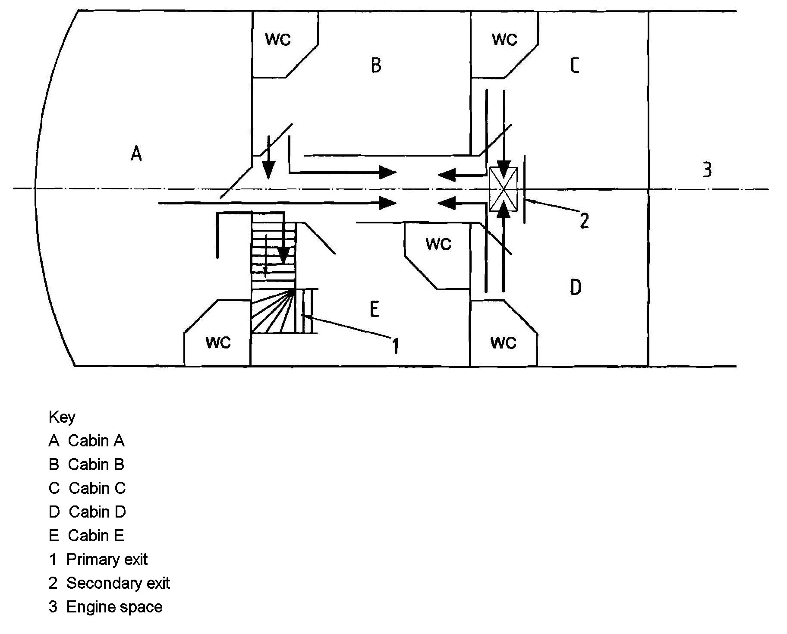
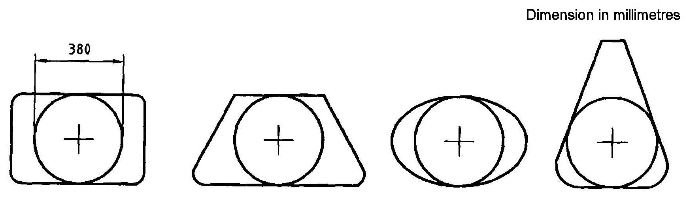

# Guidance for Recreational Crafts

> OTHER RULES AND GUIDANCE / GC-06-E / 2025 / EN / Guidance

## CHAPTER 11 FIRE PROTECTION AND FIRE EXTINCTION

### Section 1 Fire Protection

#### 101. Arrangement and design of craft

- **1.** The type of equipment installed and the layout of the craft are to take account of the risk and spread of fire. Special attention is to be paid to the surroundings of open flame devices, hot areas or engines and auxiliary machines, oil and fuel overflows, uncovered oil and fuel pipes and avoiding electrical wiring above hot areas of machines.
- **2.** Materials used for the insulation of engine space are to be of non-combustible and are to comply with the requirements of 4.5.2 in **ISO 9094-2**.
- **3.** Bilges that may contain spillage of flammable liquids are to be accessible for cleaning.
- **4.** Components containing petrol/gasoline engines and/or petrol/gasoline tanks are to be separated from enclosed accommodation spaces. The condition is met if the structure fulfills the following requirements:
  - **(1)** The boundaries are to be continuously sealed.(e.g. welded, brazed, glued, laminated or otherwise sealed)
  - **(2)** Penetrations for cables, piping, etc. are to be closed by fittings, seals and/or sealants.
  - **(3)** Access openings, such as doors, hatches, etc., are to be equipped with fittings so that they can be secured in the closed position.
- **5.** Petrol/gasoline tanks within an engine room are to be insulated from the engine or any other source of heat by either.
  - **(1)** a physical barrier between the tank and engine, engine-mounted components including fuel-and water-supply lines, and any source of heat (e.g. bulkhead, wall, insulating material, etc.), or
  - **(2)** an air gap to prevent any contact between the tank and engine, and engine-related components, and any source of heat, the gap being wide enough to allow for servicing the engine and its related components. The air gap is to be at least;
    - **(A)** 100 mm between a petrol engine and a fuel tank, and
    - **(B)** 250 mm between a dry exhaust and a fuel tank.
- **6.** Passages through accommodation spaces are not to be obstructed.
- **7.** Where a non-metallic flexible hose is part of a water-cooled exhaust system, an alarm at the main steering position is to be activated if there is a loss of cooling water or if the temperature inside the exhaust line surpasses a preset limit(craft with a length of over 15 m).

#### 102. Escape routes and exits

- **1.** **Escape routes**
  - **(1)** Escape routes for crafts with a length of up to and including 15 m are to comply with the following.
    - the farthest point where a person can stand (minimum height 1.60 m), or
    - the midpoint of a berth
    - **(A)** The distance to the nearest exit to the open air is not to exceed 5 m.
    - **(B)** Where the exit route passes beside an engine space, the distance to the nearest exit is not to exceed 4 m.
    - **(C)** The distance is to be measured in the horizontal plane as the shortest distance between the centre of the exit and following point, and whichever is to be the greater distance.
    - **(D)** Where only one escape route is provided, this is not to pass directly over a cooker.
    - **(E)** Where living or sleeping accommodation is separated from the nearest exit by a solid partition (e.g. a door) and leads directly past a cooker or engine space, an alternative exit is to be provided.
  - **(2)** Escape routes for crafts with a length of over 15 m are to comply with the following.
    Where living or sleeping accommodation is not separated from the nearest exit, i.e. people can move around without passing through any door, the following is to apply(Doors of toilet or shower compartments are disregarded.).
    - the farthest point where a person can stand (minimum height 1.60 m), or
    - the midpoint of a berth
    Where living or sleeping accommodation is separated from the nearest main exit by bulkheads and doors, escape routes and exits from accommodation areas are to be arranged to reduce the risk of people being trapped and the following conditions are to be met.
    **Fig 11.1** shows a typical cabin arrangement of a big non-sailing yacht. According to the conditions specified above, this section of the craft requires two exits, because the shared route from cabins C and D is longer than 2 m. In this case, the two exits are the main staircase (primary exit) and a deck hatch between cabins C and D (secondary exit).
    - **(A)** The following requirements are to be met irrespective of the accommodation arrangement.
      - **(a)** Where there are two escape routes, only one may pass through, over and beside an engine space.
      - **(b)** Where the distance between a cooking or open-flame heating-appliance burner and the nearest side of an escape route is less than 750 mm, a second escape route is to be provided. In an enclosed galley, this requirement does not apply where the dead end beyond the cooker is less than 2 m.
      - **(c)** No escape route is to pass directly over a cooking or open-flame heating appliance.
    - **(B)** Open-accommodation arrangement
      - **(a)** The distance to the nearest exit is not to exceed ($L_H$ /3) m.
      - **(b)** The distance is to be measured in the horizontal plane as the shortest distance between the center of the exit and following point, and whichever is to be the greater distance.
    - **(C)** Enclosed accommodation arrangement
      - **(a)** Each accommodation section is to have more than one escape route leading finally to the open air, unless it is a single cabin or compartment intended to accommodate no more than four persons and the exit leads directly to the open air without passing through or over engine spaces or over cooking appliances. The cabin must not contain cooking or open-flame heating devices.
      - **(b)** For individual cabins intended to accommodate no more than four persons, and not containing cooking or open-flame heating devices, escape routes may form shared escape ways for up to 2 m, measured to a two-way escape route from the door or entrance.
      - **(c)** Shower and toilet compartments are regarded as part of the compartment or passageway that gives access to their doors and therefore do not require alternative escape routes.
      - **(d)** With multi-level arrangements, the exits are to lead to a different accommodation section or compartment, as far as practicable.
- **2.** **Exits**
  - **(1)** Any exit from an accommodation space or from any other space is to have the following minimum clear openings:
    - **(A)** Circular shape : diameter 450 mm;
    - **(B)** Any other shape : minimum dimension of 380 mm and minimum area 0.18 $\mathrm{m}^{ 2}$. The exit is to be large enough to allow for a 380 mm diameter circle to be inscribed. The measurement of the minimum clear opening is illustrated in **Fig 11.2**.
  - **(2)** Exits are to be readily accessible. Exits leading to the weather deck or to the open air are to be capable of being opened from the inside and outside when secured and unlocked. The requirement does not apply to port-lights of sufficient size to be designated as exits.
  - **(3)** Where deck hatches are designated as exits, footholds, ladders, steps or other means are to be provided. The vertical distance between the upper foothold and the exit is not to exceed 1.2 m.
  - **(4)** Escape facilities or doors are to be identified by the appropriate **ISO** or national symbol.
    
    Fig 11.1 Escape routes and exits
    
    Fig 11.2 Measurement of minimum clear opening

#### 103. Cooking and heating appliances

- **1.** Where flues are installed, they are to be insulated or shielded to avoid overheating or damage to adjacent material or to the structure of the craft.
- **2.** For cooking and heating units using fuel which is liquid at atmospheric pressure, the following are to apply.
  - **(1)** Stoves and heating units are to be securely fastened.
  - **(2)** Open-flame burners are to be fitted with a readily accessible drip-pan.
  - **(3)** Where open-flame-type water heaters are installed, adequate ventilation and flue protection are to be provided.
  - **(4)** Where a pilot light is installed, the combustion chamber is to be room sealed, except for cookers.
  - **(5)** Appliances using petrol for priming, or as a fuel, are not to be installed.
  - **(6)** For non-integral tanks and supply lines, the following are to be met.
    - **(A)** Non-integral tanks are to be securely fastened and are to be installed at a sufficient distance from cooking and heating units.
    - **(B)** A readily accessible shut-off valve is to be installed on the tank. If this is outside the galley, a second valve is to be fitted in the fuel line in the galley space. This requirement does not apply where the tank is located lower than the cooker/heater and there is no possibility of back siphoning.
- **3.** Materials used in the vicinity of cooking and heating devices are to be in accordance with 4.3.1 of **ISO 9094-1**(crafts with a length of up to and including 15m) or 4.4.1 of **ISO 9094-2**(crafts with a length of up to and including 15m).

### Section 2 Fire Fighting Equipment

#### 201. General

- **1.** Crafts are to be supplied with fire-fighting equipment appropriate to the fire hazard and capacity and location of fire-fighting equipment are to be indicated.
- **2.** Petrol engine enclosures are to be protected by a fire extinguishing system that avoids the need to open the enclosure in the event of fire.
- **3.** Where fitted, portable fire extinguishers are to be readily accessible and one is to be so positioned that it can easily be reached from the main steering position of the craft.

#### 202. Furnishing of fire fighting equipment

- **1.** The weather deck of the craft is to be protected by water hose system or provided with at least two(2) buckets with lanyard. The buckets are to be painted with red color and provided in the place that is readily accessible in case of fire.
- **2.** Portable fire extinguishers and fixed fire extinguishers are to comply with the requirements of 6. and 7. in **ISO 9094-1/9094-2**.
- **3.** A fire blanket is to comply with the requirements of 9. in **ISO 9094-1/9094-2**.
- **4.** The accommodation area is to be equipped with either;
  - **(1)** Portable fire extinguisher according to **2** or,
  - **(2)** Fixed fire extinguisher according to **2** and either one or more portable fire extinguishers
- **5.** The galley of the craft with a length of up to and including 15 m is to be protected either by a portable fire extinguisher or by a fire blanket or by water-fog systems. Sprinkler-type water systems are not to be used.
- **6.** The galley of the craft with a length of over 15 m is to be protected by one or more portable fire extinguishers and a fire blanket. Sprinkler-type water systems are not to be used. Water-fog systems are regarded as being suitable.
- **7.** The protection of engine and fuel spaces is to comply with the following.
  - **(1)** The protection of engine and fuel spaces are to comply with **Table 11.1.**
  - **(2)** The extinguishing medium is to be suitable for extinguishing an engine room fire and flooding the entire space. The extinguishing capacity of the portable extinguisher is to be sufficient for the volume of the engine space. A discharge opening is to be provided so that the extinguishing medium can be discharged into the engine space without opening the primary access. For engine spaces which a gross volume is 1 $\mathrm{m}^{ 3}$ and less, any extinguishing medium suitable for extinguishing Class B fires is considered to fulfil this requirement.
  - **(3)** The fire port is to comply with the followings.
    - **(A)** Identified.
    - **(B)** Sized to accept the discharge nozzle.
    - **(C)** Open or openable to provide ready access for discharge of the medium into the engine space.
    - **(D)** Located so that the required size of extinguisher can be operated in a position that will allow complete discharge of the extinguishing medium.
- **8.** Other enclosed spaces are to be treated as accommodation spaces according to **4**, except where they are designated for the storage of fuel or other flammable goods when they are to be protected as specified in **Table 11.1** containing main engines and auxiliaries with a total combined capacity of less than or equal to 120 kW.

  | Engine position | Type and rating of engine | Protection achieved by |
  | --- | --- | --- |
  | Open craft with engine(s) or part of engines above cockpit sole, nearly vertical casting | Petrol inboard engine of less than 120 kW Diesel engine | - fixed fire-fighting system, or - portable fire extinguisher sized and suited to flood the engine space through a fire port in the engine casing |
  | Open craft with transom-mounted outboard motor, and portable fuel tank stowage in the open atmosphere | Petrol outboard engine | No requirement for single outboard engine < 25 kW (clause 6.4 in **ISO 9094-1** applies) |
  | Open craft with transom-mounted outboard motor(s), and more than one portable fuel tank per engine or tank(s) installed in an enclosed space | Petrol outboard engine | - fixed fire-fighting system to protect the fuel space, or - portable fire extinguisher sized and suited to flood the fuel space through a fire port tin the fuel-space boundary |
  | Engine below cockpit level or inside craft | Petrol inboard engine | - fixed fire fighting system |
  | Engine below cockpit level or inside craft | Diesel inboard engine(s) of less than or equal to 120 kW combined rating (main and auxiliaries) | - fixed fire-fighting system, or - portable fire extinguisher of a type and size suitable to flood the engine space through a fire port in the engine casing |
  | Engine below cockpit level or inside craft | Diesel inboard engine(s) of more than 120 kW combined rating (main and auxiliaries) | - fixed fire-fighting system |

### Section 3 Others

#### 301. General

- **1.** Displayed information and owner's manual are to be in accordance with the requirements of 8 and 10 in **ISO 9094-1/9094-2**. 
