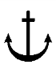

# Guidance for WIG Craft(Wing-In-Ground Effect Craft)

> OTHER RULES AND GUIDANCE / GC-07-E / 2025 / EN / Guidance

## CHAPTER 4 EQUIPMENT

### 102. Rudder and Steering Gear

#### 1. Design loads

- **(1)** The maximum values of aerodynamic and hydrodynamic forces and torque likely to occur in the range of assumed rudder angles for the appropriate rudder are to be taken as the design loads. The torque on the stock of the rudder when a buffer is fitted in gear is to be taken depending on the buffer characteristics.
- **(2)** Design loads are to be determined by a calculation method or to be based on the model tests and the design loads along the water rudder are to be determined at the maximum speed in the displacement mode and the design loads along the air rudder are to be determined at the maximum speed in the ground effect mode.

#### 2. Calculations of steering gear main components

- **(1)** Bending moments, shear forces and support reactions acting on the steering gear components with regard to the be of the steering gear used, its main dimensions, reliability of supports, etc. are to be proved its effectiveness.
- **(2)** Where only hydrodynamic loads arc taken into consideration as external loads in strength calculations, the reduced stresses in the design sections of the steering gear components are not to exceed 0.5 times the upper yield stress. The specific pressure on the supports is not to be more than that given in the following table.

  | Material of the pair in friction | Specific pressure $P _{V}$ (MPa) |   |
  | --- | --- | --- |
  | Material of the pair in friction | in backwash | outside backwash |
  | Stainless steel - bronze Stainless steel - rubber Stainless steel - caprolon | - 6.0 - | 15.0 8.0 6.0 |

#### 3. Steering gear

- **(1)** Steering gear, the controls and actuating systems of the water rudder are to comply with the requirements of "Standard for Ship's Facilities(Article 73 ~ 77)". When air rudder is not regulated by steering gear in "Standard for Ship's Facilities", the sufficient performances for steering the ship are to be proved by sea trials of the WIG craft.
- **(2)** The water rudder should be provided the main steering gear and auxiliary steering gear. The auxiliary steering gear is not required in case a craft fitted with several rudders, the steering gear allows to shift each rudder independently of other rudders and adequate maneuverability of the craft is ensured with one rudder.
- **(3)** The performance of the steering gear of the air rudder is to be proved the possibility of the safe and rapid collision avoidance, when the craft running at the maximum speed in the ground effect mode.
- **(4)** When the water rudder is installed, the steering gear of the water rudder in the displacement mode is to be capable of putting the rudder over from 30° from one side to 30° on the other side in not more than 15 s, with the craft running at a speed of 7 knots. When a water-jet or other equipment is installed instead of the water rudder, its rotation capability is to be proved at least equivalent to that the rotation capability of the water rudder in this paragraph.
- **(5)** The steering gear of the water rudder may be hand-operated provided it is handled by one man with a force at the hand-wheel of not more than 120 N. A short-time increase of the force up to 200 N is allowed.
- **(6)** For the water rudder in the displacement mode, it is to be provided with a system of rudder stops permitting to put the rudder over on either side to an angle of not more than 35°. However, when the greater angle is larger in the displacement mode, the relevant values are to be submitted and its effectiveness is to be proved.

### 103. Anchoring Equipment

#### 1. Each WIG craft is to be provided at least one anchor, anchor wire rope (or chain cable), securing and recovery equipment. However, where the weight of the anchor is less than 25 kg, recovery equipment may be omitted. In such case a WIG craft is to be provided with a device for securing the anchor wire rope (or chain cable) for riding the anchor at craft. However, the WIG craft which is not practicable providing anchoring equipment of this paragraph due to the limited space etc. may not apply.

#### 2. Calculation of anchor and anchor chain etc.

- **(1)** The mass of each bower anchor, $Q$ (kg) is to be not less than:
  $Q = 1.75E$
  where
  $E$ = equipment number according to Rules for the Classification of Steel Ships. If a high holding power anchor is used as the bower anchor, the mass of the anchor may amount to 75 % of the anchor mass determined using the above formula.
- **(2)** The length $\ell$(m) of the anchor wire rope (chain cable) for the bower anchor is not to be less than:
  $\ell = 7.5 \sqrt {Q} +20$
  where
  $Q$ = anchor mass(kg) according to (1)
- **(3)** The breaking strength $F _{ST}$ (kN) of the anchor wire rope (chain cable) is to be not less than:
  $F _{ST} = 0.06 kQ$
  where
  $k$ = holding power factor of the used anchor equal to:

#### 3.0 for normal holding power anchors;

#### 6.0 for high holding power anchors;

$Q$ = anchor mass(kg) according to (1)

- **(4)** Ends of a wire rope are to be spliced into sockets, clamps or thimbles. The wire rope is to be connected with the anchor shackle by means of the joining shackle.
- **(5)** WIG craft not fitted with anchor recovery equipment may be provided with synthetic fibre ropes in lieu of wire ropes (chain cables). The breaking strength $F _{syn}$(kN) of the synthetic fibre rope is to be not less than:
  $F _{syn} = 0.124 \delta _{av} F _{st} ^{8/9}$
  where
  $\delta _{av}$ = average relative elongation in breaking a synthetic fibre rope(%), but not less than 30 %
  $F _{st}$ = breaking strength (kN) of the wire rope as a whole determined from (3)
- **(6)** The end of the synthetic fibre rope is to be spliced into a thimble and to be secured to the anchor, as far as possible, by a wire rope (chain cable) section at least 10 m long which complies with the requirements of (3). Laying of an anchor wire rope (chain cable) is to provide Its free run when dropping or hoisting the anchor.
- **(7)** In spite of the criteria in (1) ~ (3) and (5), anchor and anchor wire rope may be determined according to the test in actual navigating area and simulation to prove the same performance.

### 104. Mooring and Towing Arrangements

#### 1. General

- **(1)** Each WIG craft is to be supplied with mooring arrangement for warping to a coastal or floating berth and towing arrangement capable to ensure safe towing. Other arrangements on board the craft may be used for towing purposes.
- **(2)** Mooring and towing arrangements are to be designed and secured so that watertight integrity of WIG craft is not impaired in case of their damage. The safe towing speed is to be determined during delivery trials of the first craft of a series.
  **2 Calculation of mooring arrangement**
- **(1)** The number of mooring ropes (n) on WIG craft is to be not less than:
  $n = 1.5+0.004E$
  where
  $E$ = equipment number according to **Rules** for the Classification of Steel Ships.
  The results of calculations using above formula are to be rounded off to both sides to the nearest figure. In all cases, the number of mooring ropes is not to be less than two.
- **(2)** The length of each mooring rope $\ell$(m) is to be not less than 1.5 times the length of the craft with rounding off to the nearest 5 m. When $E$(equipment number) exceeds 500, the length of a mooring rope may be taken equal to 1.2 L. (where L is the length of WIG craft).
- **(3)** The breaking strength $F _{st}$(kN) of the wire rope as a whole is to be not less than:
  $F _{st} = 5.0 \sqrt {E}$
  where
  $E$ = equipment number according to **Rules for the Classification of Steel Ships.**
- **(4)** Mooring ropes may be of steel wire, natural fibre or synthetic fibre material. The breaking strength $F _{syn}$(kN) of the synthetic fibre rope is to be not less than
  $F _{syn} = 0.074 \delta _{av} F _{st}$
  where
  $\delta _{av}$ = average relative elongation(%) in breaking a synthetic fibre rope, but not less than 30 %.
  $F _{st}$ = $F _{st}$(kN) determined from formula (3).
- **(5)** Irrespective of the breaking strength regulated by formulas (3) and (4), mooring ropes made of natural fibre or synthetic fibre material less than 20 mm in diameter are not to be used. However, when the adequacy of the mooring performance is proved, the use of ropes of less than 20 mm in diameter is allowed. 
