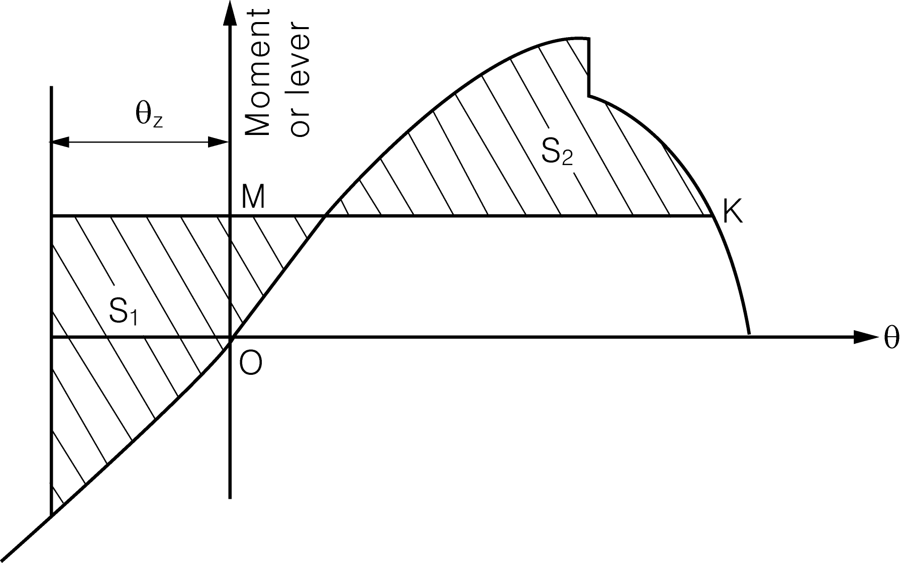
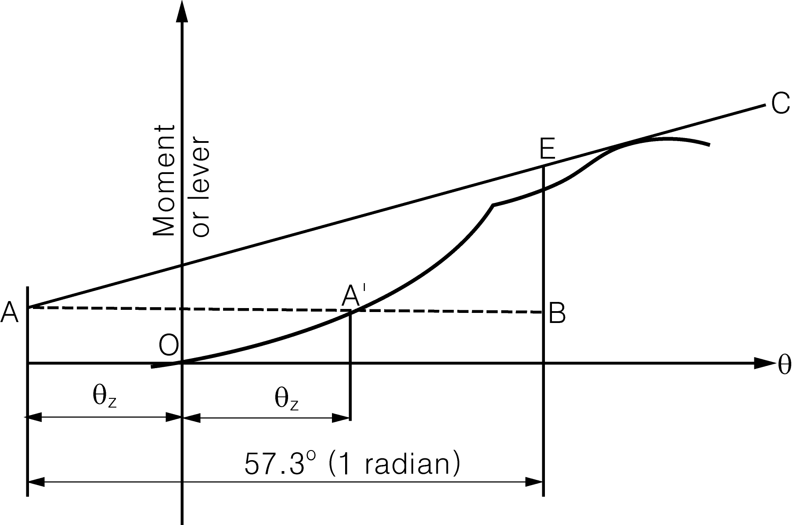

# Guidance for WIG Craft(Wing-In-Ground Effect Craft)

> OTHER RULES AND GUIDANCE / GC-07-E / 2025 / EN / Guidance

## CHAPTER 5 STABILITY AND SUBDIVISION

### 101. General

#### 1. References for the stability in the displacement mode under the intact and damaged condition should be submitted to verify stability of WIG craft. Moreover, the references indicating the characteristic and installation for stability to land safely despite troubles of some equipment under the worst intended condition should be submitted.

#### 2. Account should be taken of the effect of icing in all stability calculations where icing may occur. If there is an ice breaker, that should be considered for stability calculations. (2019)

### 102. Buoyancy

#### 1. All WIG craft should have a sufficient reserve of buoyancy to meet the intact and damage stability requirements. The Society may require a larger reserve of buoyancy to permit the craft to operate in any of its intended modes. And arrangements should be provided for checking the watertight integrity of those compartments. Where the buoyancy are be calculated, watertight compartments below the draught and watertight or weathertight compartments above the draught should be included in.

#### 2. Where entry of water into structures above the datum would significantly influence the stability and buoyancy of the craft, such structures should be:

- **(1)** of adequate strength to maintain the weathertight integrity and fitted with weathertight closing appliances; or
- **(2)** provided with adequate drainage arrangements; or
- **(3)** an equivalent combination of both measures.
  The means of closing openings in the boundaries of weathertight structures should be such as to maintain weathertight integrity in all operational conditions.

### 103. Intact stability

#### 1. General

- **(1)** It should be shown by calculations and/or by trials that in all operational modes and load cases within its operational restrictions a craft will return or can be readily made to safely return to the initial position of draught/altitude, heel and trim when displaced during roll, pitch, yaw or heave motions or when subjected to a transitory force or moment associated with such motions.
- **(2)** Suitable precautions of arrangement, equipment or operational procedures should be taken against the craft developing dangerous altitudes, yawing, inclinations or loss of stability subsequent to a collision with a submerged or floating object in displacement, transitional, take-off/landing, planing and surface effects modes, particularly in modes where any part of the craft or its appendages is submerged.
- **(3)** When turning in calm water the inner angle of heel should not:
  - **(A)** induce instability in the craft;
  - **(B)** exceed the angle at which the wing makes contact with the water surface necessitating corrective control action when in the ground effect mode in calm water at the design altitude; and
  - **(C)** exceed the angle at which the skeg makes contact with the water surface when the craft is in the ground effect mode.

#### 2. Intact stability in the displacement mode

- **(1)** Craft should have sufficient stability in calm water in all possible and permitted conditions of cargo stowage and with uncontrolled passenger movement so that a residual freeboard of 0.1 m is maintained all parts of fixed airfoils excluding flaps and ailerons. (2019)
- **(2)** The angle of heel under the combined action of heeling moments due to passenger crowding according to **108. 1** (1) and the greater of the moments due to wind and turning being determined experimentally should not exceed 8 degrees or the angle of entrance of the wing into the water, whichever is the less.
- **(3)** The stability of WIG craft, which is difficult to apply (1) and (2), should be verified by the results of trials conducted with the craft itself.

#### 3. Stability in the transitional and take off/landing mode

The maintenance of sufficient stability should be verified by trials and documented in the operational procedures in the transitional and take off/landing mode up to the worst intended condition, if the change of WIG craft mode is not concerned with stability. The angle of horizontal heel under combined action of heeling moments due to passenger crowding according to **108. 1** (1) should not exceed 80 % of the wing surface angle in the transitional mode and 50 % in the take off/landing mode.

#### 4. Stability in ground effect mode

- **(1)** Definitions
  - **(A)** The focus of altitude *X_FH* is the point in the wing chord of action of the increment of lift force caused by the change of the altitude.
  - **(B)** The focus of attack angle *X_FA* is the point in the wing chord of action of the increment of lift force caused by the change of the attack angle.
  - **(C)** *X_T,* is the centre of gravity of the craft.
- **(2)** General
  - **(A)** The WIG craft should have stable flight in all normal operational conditions and should return to the original state after influence of short vertical, longitudinal or lateral forces and moments.
  - **(B)** Stable flight should be verified by the leading craft test flight: The WIG crafts under the scheduled operating conditions can be stable flight in the ground effect mode.
- **(3)** Longitudinal stability
  - **(A)** The longitudinal static stability of crafts in flight should be calculated. The following two criteria should be satisfied at the same time:
    *X_FA* – *X_FH* ＞0.
    *X_FA* – *X_T* ＞0.
  - **(B)** The dynamic longitudinal stability of crafts in flight should be verified by calculation, simulation test or Actual craft trial. The longitudinal dynamic stability should be satisfied that the motion of the disturbed crafts is oscillatory attenuation.
  - **(C)** If equipped with automatic motion control system, the verification of the dynamic longitudinal stability of crafts should consider the influence of automatic motion control system.
- **(4)** Lateral stability
  - **(A)** The dynamic lateral stability of crafts in the ground effect mode should be verified by calculation, simulation test or actual trial. The lateral dynamic stability should be satisfied that the motion of the disturbed crafts is oscillatory attenuation.
  - **(B)** If equipped with automatic motion control system, the verification of the dynamic lateral stability of crafts should consider the influence of automatic motion control system.
  - **(C)** The craft can fly stably in the ground effect mode should withstand crosswind corresponding of the service weather restriction, and that should be proved by actual trials of the leading craft, and the heeling angle of crafts does not exceed the immersion angle of the skeg. That should be proved by actual trials of the leading craft.
  - **(D)** The limit of ultimate heeling angle of crafts turning on the calm water in the ground effect mode should be measured by actual trials, that to avoid the instable motion due to wing or skeg contact with the water surface. In addition, the limit of trim angle of crafts turning should be measured, that to avoid losing stability due to turning with excessive attack. The limit of heeling angle and trim angle of crafts turning in the ground effect mode should be clearly specified in the operation manual of crafts. (2019)

#### 5. Stability in fly-over mode

The stability in fly-over mode should be verified by a calculation and test considering significant factors, such as a speed of craft, a distance with the subject, a height and size of the subject, etc.

#### 6. The stability of WIG craft, which is difficult to apply 103. 2 to 5, should be verified by the results of trials conducted with the craft itself.

#### 7. Stability verification

- **(1)** If the craft is fitted with a system for directing sprays of air engines under a wing or other craft structures to create a static air cushion or for other purposes, then the effect of that system on craft stability should be taken into account.
- **(2)** For a craft which is designed and certificated to be capable from the displacement mode wholly or partly to mount to a gentle slope shore (and to come down backwards) and to operate in amphibian mode, the maintenance of satisfactory stability during such manoeuvres should be verified by trials and documented in the operational procedures, including transit through the wave breaking zone in all conditions up to the worst allowable conditions for those manoeuvres.
- **(3)** Validation of stability in calm water should be verified by trails.

### 104. WIG craft weather criteria

#### 1. Craft operation, depending on the operational modes, should be restricted by the worst intended conditions and critical design conditions specified according to the results of trials conducted with the craft itself or with one of the craft of a series of identical craft.

#### 2. In the displacement mode of operation, stability is considered to be sufficient if the following conditions are observed when the dynamically applied heeling moment due to the beam wind pressure (in the loading condition with least reserves of stability and subjected to the critical design conditions) is equal or less than the capsizing moment ,

$M_V < M_c$ or $K = M_C / M_V >1.0$

#### 3. The heeling moments due to the wind pressure should be taken as constant during the whole period of heeling and determined as follows:

The heeling moment $M _{V}$(kNm) in the displacement mode of operation is calculated as follows:
$M_V = 0.001 P_V A_V Z f$
where:
$P _{V}$ : wind pressure ($\mathrm{N}/m ^{2}$)
$A _{V}$ : windage area (the projected lateral area of the portion of the craft above the acting waterline) ($\mathrm{m}^2$)
$Z$ : the windage area lever equal to the vertical distance to the centre of windage from the centre of the projected lateral area of the portion of the craft below the plane of the acting waterline (m)
$f$ : streamline factor, $f$ < 1, determined by model tests in a wind tunnel ($f$ = 1 if such data are lacking)
The value of $P _{V}$ should be determined according to **Table 5.1** for wind force corresponding to the critical design conditions. This wind force should be at least one Beaufort scale number higher than that corresponding to the worst intended conditions.

| Wind force |   | Vertical distance between the centre of the projected lateral area of the WIG craft and the sea surface in m |   |   |   |   |   |   |
| --- | --- | --- | --- | --- | --- | --- | --- | --- |
| Beaufort Scale | m/s | 1 | 2 | 3 | 4 | 5 | 6 | 7 < |
| 2 | 5 | 15 | 20 | 25 | 25 | 30 | 30 | 35 |
| 3 | 7 | 50 | 60 | 65 | 70 | 75 | 80 | 85 |
| 4 | 9 | 95 | 120 | 135 | 145 | 150 | 160 | 165 |
| 5 | 12 | 155 | 195 | 220 | 235 | 250 | 265 | 275 |
| 6 | 15 | 240 | 300 | 335 | 360 | 385 | 400 | 415 |
| 7 | 19 | 435 | 545 | 605 | 655 | 700 | 730 | 750 |
| 8 | 23 | 705 | 875 | 970 | 1050 | 1115 | 1170 | 1230 |

#### 4. The amplitude of rolling in the displacement mode is to be determined according to 6 or equivalent method with propulsion and stability equipment inoperative.

#### 5. The recommended scheme for determination of the capsizing moment, , in the displacement mode of operation is given in 104. 6 (1) and (2). For this purpose, the angle of flooding should be taken as the lowest angle of heel corresponding to residual freeboard of 300 mm below:

- **(1)** the lower window sill;
- **(2)** the upper edge of the coaming of the outside entry door; or
- **(3)** other points of flooding.

#### 6. The minimum capsizing moments, , in the displacement mode is to be determined from the static and dynamic stability curves taking rolling into account.

- **(1)** When the static stability curve is used, $M _{C}$ is determined by equating the areas under the curves of the capsizing and righting moments (or levers) taking rolling into account, as indicated by **Fig 5.1**, where $\theta _{Z}$ is the amplitude of roll and $M _{k}$ is a line drawn parallel to the abscissa axis such that the shaded areas S1 and S2 are equal.
  $M _{C}$ = OM, if the scale of ordinates represents moments,
  $M _{C}$ = OM × displacement, if the scale of ordinates represents levers.
- **(2)** When the dynamic stability curve is used, first an auxiliary point A should be determined. For this purpose the amplitude of heeling is plotted to the right along the abscissa axis and a point A' is found (see **Fig 5.2**). A line AA' is drawn parallel to the abscissa axis equal to the double amplitude of heeling (AA' = 2$\theta_Z$) and the required auxiliary point A is found. A tangent AC to the dynamic stability curve is to be drawn. From the point A the line AB is drawn parallel to the abscissa axis and equal to 1 radian (57.3°). From the point B a perpendicular is drawn to intersect with the tangent in point E. The distance BE is equal to the capsizing moment if measured along the ordinate axis of the dynamic stability curve. If, however, the dynamic stability levers are plotted along this axis, BE is then the capsizing lever. In this case the capsizing moment $M _{C}$ is determined by multiplication of ordinate BE (in m) by the corresponding displacement in tons
  $M _{C} = 9.81 \Delta BE$ (kNm)
- **(3)** The amplitude of rolling $\theta_Z$ is determined by means of model and full-scale tests in irregular seas as a maximum amplitude of rolling of 50 oscillations of a craft travelling at 90° to the wave direction in sea state for the worst design condition. If such data are lacking, the amplitude is assumed to be equal to 15°.
- **(4)** The effectiveness of the stability curves should be limited to the angle of flooding.
  
  Fig 5.1 Static stability curve
  Fig 5.2 Dynamic stability curve

### 105. Buoyancy and stability in the displacement mode following damage

#### 1. For the purpose of damage stability calculations, the volume and surface permeability should be as follows:

| Space | Permeability |
| --- | --- |
| Appropriated to cargo or stores Occupied by accommodation Occupied by machinery Intended for liquids Appropriated for cargo vehicles Void space | 60 95 85 0 to 95* 90 95 |

* Whichever results in severer condition.
Permeability may be also determined by direct calculation.

#### 2. Low-density foam or other media may be used to provide buoyancy in void spaces, if necessary. Any proposed medium should be:

- **(1)** of closed-cell form or otherwise impervious to water absorption;
- **(2)** structurally stable under service conditions;
- **(3)** chemically inert in relation to structural materials with which it is in contact or other substances with which the medium is likely to be in contact; and
- **(4)** properly secured in place and easily removable for inspection of the void spaces.

#### 3. The possible damages should be assumed to consider all of the reason causing the damage, except that the total loss condition as a part of hull is divided. The craft following damage should have sufficient buoyancy and positive stability in sill water to simultaneously ensure that:

- **(1)** after flooding ceased and a state of equilibrium reached, the final waterline is not to be less than 300 mm below the level of the openings.
- **(2)** the angle of inclination of the craft from the horizontal does not normally exceed 10° in any direction. However, where this is clearly impractical, angles of inclination up to 15° immediately after damage but reducing to 10° within 15 min. may be permitted provided that efficient non-slip deck surface and suitable holding points, e.g., holes, bars, etc., are provided.
- **(3)** there is a positive freeboard from the damage waterline to survival craft embarkation positions.
- **(4)** any flooding of passenger compartments or escape routes which might occur will not significantly impede the evacuation of passengers.
- **(5)** essential emergency equipment, emergency radios, power supplies and public address systems needed for organizing the evacuation remain accessible and operational.

### 106. Inclining and stability information

#### 1. Every craft, on completion of construction should be inclined and the elements of its stability are to be determined. Alternatively, the mass and centre of gravity of the craft may be determined by weighing methods. When it is not possible to accurately determine the craft's vertical centre of gravity by either of these methods, it may be determined by accurate calculation.

#### 2. A report of each weighing, inclining or lightweight survey carried out in accordance with this chapter and of the calculation therefrom of the light-ship condition particulars should be submitted to this society for approval, together with a copy for their retention. The approved report should be placed on board and incorporated when adding or amending.

#### 3. The information should include particulars appropriate to the craft and reflect the craft's loading conditions and modes of operation. All watertight and weathertight structures included in the cross curves of stability and the critical down flooding points and angles should be identified.

### 107. Marking of the draft mark and the design waterline

#### 1. The draft mark should clearly be marked on the bow and stern. If it is difficult to read the draft mark, installation directing the draft of the bow and stern should be attached.

#### 2. The design waterline should clearly be marked amidships on the craft's outer sides.

### 108. Passenger regulations

#### 1. Passenger regulation in the displacement mode should be satisfied with as follows:

- **(1)** Where compliance with this chapter requires consideration of the effects of passenger weight, the following information should be used:
  - **(A)** Each passenger has a mass of 75 kg.
  - **(B)** Vertical centre of gravity of seated passengers is 0.3 m above seat.
  - **(C)** Passengers and luggages should be considered to be in the space normally at their disposal.
  - **(D)** Passengers should be distributed on available deck areas towards one side of the craft on the decks where muster stations are located and in such a way that they produce the most adverse heeling moment. (2019)
- **(2)** The stability of the craft should be verified according to the assumptions of paragraph (1) for each of the following loading conditions:
  - **(A)** with full number of passengers and cargo and full provisions on board craft
  - **(B)** with full number of passengers and cargo and with 10 % of provisions
  - **(C)** without passengers and cargo and with 10 % of provisions.
- **(3)** The stability of the craft should be verified under the loading condition described in paragraph (2) (B) but with 50 % of the passengers located in their seats on one side from the craft centre line. The remaining passengers should be located in their seats and/or passageways and other spaces not allocated to individual passengers so as to result in maximum heeling moment towards the side on which passengers remain seated. 
