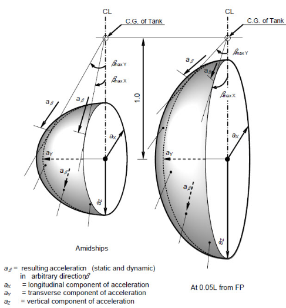
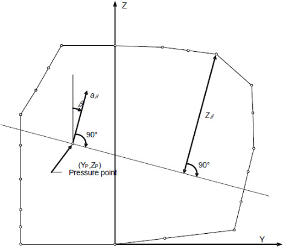
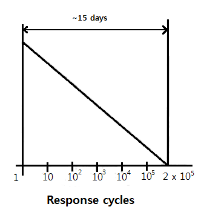
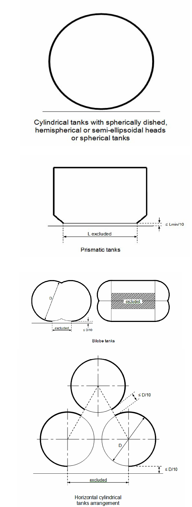

# Gas-fuelled Ships

> OTHER RULES AND GUIDANCE / GC-09-E / 2025 / EN / Guidance

## CHAPTER 4 FUEL CONTAINMENT SYSTEM

### Section 1 General

#### 101. Goal

The goal of this chapter is to provide that gas storage is adequate so as to minimize the risk to personnel, the ship and the environment to a level that is equivalent to a conventional oil fuelled ship.

#### 102. Functional requirements

This chapter relates to functional requirements in **Ch 1 202. 1**, **202. 2**, **202. 5** and **202. 8** to **17** In particular the following apply:

- **1.** the fuel containment system is to be so designed that a leak from the tank or its connections does not endanger the ship, persons on board or the environment. Potential dangers to be avoided include:
  - **(1)** exposure of ship materials to temperatures below acceptable limits;
  - **(2)** flammable fuels spreading to locations with ignition sources;
  - **(3)** toxicity potential and risk of oxygen deficiency due to fuels and inert gases;
  - **(4)** restriction of access to muster stations, escape routes and life-saving appliances (LSA); and
  - **(5)** reduction in availability of LSA.
- **2.** the pressure and temperature in the fuel tank are to be kept within the design limits of the containment system and possible carriage requirements of the fuel;
- **3.** the fuel containment arrangement is to be so designed that safety actions after any gas leakage do not lead to an unacceptable loss of power; and
- **4.** if portable tanks are used for fuel storage, the design of the fuel containment system is to be equivalent to permanent installed tanks as described in this chapter.

#### 103. General requirements

- **1.** Natural gas in a liquid state may be stored with a maximum allowable relief valve setting (MARVS) of up to 1.0 $\mathrm{MPa}$.
- **2.** The Maximum Allowable Working Pressure (MAWP) of the gas fuel tank is not to exceed 90 % of the Maximum Allowable Relief Valve Setting (MARVS).
- **3.** A fuel containment system located below deck is to be gas tight towards adjacent spaces.
- **4.** All tank connections, fittings, flanges and tank valves must be enclosed in gas tight tank connection spaces, unless the tank connections are on open deck. The space is to be able to safely contain leakage from the tank in case of leakage from the tank connections.
- **5.** Pipe connections to the fuel storage tank are to be mounted above the highest liquid level in the tanks, except for fuel storage tanks of type C. Connections below the highest liquid level may however also be accepted for other tank types that it is deemed to be equivalent to the Rules to the satisfaction to the Society refering to **Pt 1, Ch 1, 104.** of **Guidance relating to the Rules for Classification of Steel Ships**.
- **6.** Piping between the tank and the first valve which release liquid in case of pipe failure is to have equivalent safety as the type C tank, with dynamic stress not exceeding the values given in **Ch 4 213. 1** (2).
- **7.** The material of the bulkheads of the tank connection space is to have a design temperature corresponding with the lowest temperature it can be subject to in a probable maximum leakage scenario. The tank connection space is to be designed to withstand the maximum pressure build up during such a leakage. Alternatively, pressure relief venting to a safe location (mast) can be provided.
- **8.** The probable maximum leakage into the tank connection space is to be determined based on detail design, detection and shutdown systems.
- **9.** If piping is connected below the liquid level of the tank it has to be protected by a secondary barrier up to the first valve.
- **10.** If liquefied gas fuel storage tanks are located on open deck the ship steel is to be protected from potential leakages from tank connections and other sources of leakage by use of drip trays. The material is to have a design temperature corresponding to the temperature of the fuel carried at atmospheric pressure. The normal operation pressure of the tanks is to be taken into consideration for protecting the steel structure of the ship.
- **11.** Means is to be provided whereby liquefied gas in the storage tanks can be safely emptied.
- **12.** It is to be possible to empty, purge and vent fuel storage tanks with fuel piping systems. Instructions for carrying out these procedures must be available on board. Inerting is to be performed with an inert gas prior to venting with dry air to avoid an explosion hazardous atmosphere in tanks and fuel pipes. See detailed regulations venting with dry air to avoid an explosion hazardous atmosphere in tanks and fuel pipes. See detailed regulations in **Ch 4, 302.**

### Section 2 Liquefied gas fuel containment

#### 201. Liquefied gas fuel containment

- **1.** The risk assessment required in **Ch 1 302.** is to include evaluation of the ship's liquefied gas fuel containment system, and may lead to additional safety measures for integration into the overall vessel design.
- **2.** The design life of fixed liquefied gas fuel containment system is not to be less than the design life of the ship or 20 years, whichever is greater.
- **3.** The design life of portable tanks is not to be less than 20 years.
- **4.** Liquefied gas fuel containment systems is to be designed in accordance with North Atlantic environmental conditions and relevant long-term sea state scatter diagrams for unrestricted navigation. Less demanding environmental conditions, consistent with the expected usage, may be accepted by the Society for liquefied gas fuel containment systems used exclusively for restricted navigation. More demanding environmental conditions may be required for liquefied gas fuel containment systems operated in conditions more severe than the North Atlantic environment. (Refer to the **Pt 3, Annex 3-2** of **Guidance relating to the Rules for the Classification of Steel Ships**. Assumed temperatures are used for determining appropriate material qualities with respect to design temperatures and is another matter not intended to be covered in this article.)
- **5.** Liquefied gas fuel containment systems is to be designed with suitable safety margins:
  - **(1)** to withstand, in the intact condition, the environmental conditions anticipated for the liquefied gas fuel containment system's design life and the loading conditions appropriate for them, which is to include full homogeneous and partial load conditions and partial filling to any intermediate levels; and
  - **(2)** being appropriate for uncertainties in loads, structural modelling, fatigue, corrosion, thermal effects, material variability, aging and construction tolerances.
- **6.** The liquefied gas fuel containment system structural strength is to be assessed against failure modes, including but not limited to plastic deformation, buckling and fatigue. The specific design conditions that is to be considered for the design of each liquefied gas fuel containment system are given in **211.** to **214.** There are three main categories of design conditions:
  - **(1)** Ultimate Design Conditions –. The liquefied gas fuel containment system structure and its structural components is to withstand loads liable to occur during its construction, testing and anticipated use in service, without loss of structural integrity. The design is to take into account proper combinations of the following loads:
    - **(A)** internal pressure;
    - **(B)** external pressure;
    - **(C)** dynamic loads due to the motion of the ship in all loading conditions;
    - **(D)** thermal loads;
    - **(E)** sloshing loads;
    - **(F)** loads corresponding to ship deflections;
    - **(G)** tank and liquefied gas fuel weight with the corresponding reaction in way of supports;
    - **(H)** insulation weight;
    - **(I)** loads in way of towers and other attachments; and
    - **(J)** test loads.
  - **(2)** Fatigue Design Conditions –. The liquefied gas fuel containment system structure and its structural components are not to fail under accumulated cyclic loading.
  - **(3)** Accidental Design Conditions –. The liquefied gas fuel containment system is to meet each of the following accident design conditions (accidental or abnormal events), addressed in this Guidance:
    - **(A)** Collision –. The liquefied gas fuel containment system is to withstand the collision loads specified in **205. 5** (1) without deformation of the supports or the tank structure in way of the supports likely to endanger the tank and its supporting structure.
    - **(B)** Fire –. The liquefied gas fuel containment systems is to sustain without rupture the rise in internal pressure specified in **218. 3** (1) under the fire scenarios envisaged therein.
    - **(C)** Flooded compartment causing buoyancy on tank –. the anti-flotation arrangements is to sustain the upward force, specified in **205. 5** (2) and there is to be no endangering plastic deformation to the hull. Plastic deformation may occur in the fuel containment system provided it does not endanger the safe evacuation of the ship.
- **7.** Measures are to be applied to ensure that scantlings required meet the structural strength provisions and are maintained throughout the design life. Measures may include, but are not limited to, material selection, coatings, corrosion additions, cathodic protection and inerting.
- **8.** An inspection/survey plan for the liquefied gas fuel containment system is to be developed and approved by the Society. The inspection/survey plan is to identify aspects to be examined and/or validated during surveys throughout the liquefied gas fuel containment system's life and, in particular, any necessary in-service survey, maintenance and testing that was assumed when selecting liquefied gas fuel containment system design parameters. The inspection/survey plan may include specific critical locations as per **208. 2** (8) or **208. 2** (9).
- **9.** Liquefied gas fuel containment systems is to be designed, constructed and equipped to provide adequate means of access to areas that need inspection as specified in the inspection/survey plan. Liquefied gas fuel containment systems, including all associated internal equipment is to be designed and built to ensure safety during operations, inspection and maintenance.

#### 202. Liquefied gas fuel containment safety principles

- **1.** The containment systems is to be provided with a complete secondary liquid-tight barrier capable of safely containing all potential leakages through the primary barrier and, in conjunction with the thermal insulation system, of preventing lowering of the temperature of the ship structure to an unsafe level.
- **2.** The size and configuration or arrangement of the secondary barrier may be reduced or omitted where an equivalent level of safety can be demonstrated in accordance with **3** to **5** as applicable.
- **3.** Liquefied gas fuel containment systems for which the probability for structural failures to develop into a critical state has been determined to be extremely low but where the possibility of leakages through the primary barrier cannot be excluded, is to be equipped with a partial secondary barrier and small leak protection system capable of safely handling and disposing of the leakages (a critical state means that the crack develops into unstable condition).
  The arrangements is to comply with the following:
  - **(1)** failure developments that can be reliably detected before reaching a critical state (e.g. by gas detection or inspection) is to have a sufficiently long development time for remedial actions to be taken; and
  - **(2)** failure developments that cannot be safely detected before reaching a critical state is to have a predicted development time that is much longer than the expected lifetime of the tank.
- **4.** No secondary barrier is required for liquefied gas fuel containment systems, e.g. type C independent tanks, where the probability for structural failures and leakages through the primary barrier is extremely low and can be neglected.
- **5.** For independent tanks requiring full or partial secondary barrier, means for safely disposing of leakages from the tank is to be arranged.
- **6.** **Secondary barriers in relation to tank types**
  Secondary barriers in relation to the tank types defined in **211.** to **214.** is to be provided in accordance with the following table.

  | Basic Tank type | Secondary barrier requirements |
  | --- | --- |
  | Membrane | Complete secondary barrier |
  | Independent Type A Type B Type C | Complete secondary barrier Partial secondary barrier No secondary barrier required |
- **7.** **Design of secondary barriers**
  The design of the secondary barrier, including spray shield if fitted, is to be such that:
  - **(1)** it is capable of containing any envisaged leakage of liquefied gas fuel for a period of 15 days unless different criteria apply for particular voyages, taking into account the load spectrum referred to in **208. 2.** (6).
  - **(2)** physical, mechanical or operational events within the liquefied gas fuel tank that could cause failure of the primary barrier is not to impair the due function of the secondary barrier, or vice versa;
  - **(3)** failure of a support or an attachment to the hull structure will not lead to loss of liquid tightness of both the primary and secondary barriers;
  - **(4)** it is capable of being periodically checked for its effectiveness by means of a visual inspection or other suitable means acceptable to the Society;
  - **(5)** the methods required in (4) are to be approved by the Society and are to include, as a minimum:
    - **(A)** details on the size of defect acceptable and the location within the secondary barrier, before its liquid tight effectiveness is compromised;
    - **(B)** accuracy and range of values of the proposed method for detecting defects in (A) above;
    - **(C)** scaling factors to be used in determining the acceptance criteria if full-scale model testing is not undertaken; and
    - **(D)** effects of thermal and mechanical cyclic loading on the effectiveness of the proposed test.
  - **(6)** the secondary barrier is to fulfil its functional requirements at a static angle of heel of 30°.
- **8.** **Partial secondary barriers and primary barrier small leak protection system**
  - **(1)** Partial secondary barriers as permitted in **202. 3** is to be used with a small leak protection system and meet all the regulations in **5**. The small leak protection system is to include means to detect a leak in the primary barrier, provision such as a spray shield to deflect any liquefied gas fuel down into the partial secondary barrier, and means to dispose of the liquid, which may be by natural evaporation.
  - **(2)** The capacity of the partial secondary barrier is to be determined, based on the liquefied gas fuel leakage corresponding to the extent of failure resulting from the load spectrum referred to in **208. 2.** (6), after the initial detection of a primary leak. Due account may be taken of liquid evaporation, rate of leakage, pumping capacity and other relevant factors.
  - **(3)** The required liquid leakage detection may be by means of liquid sensors, or by an effective use of pressure, temperature or gas detection systems, or any combination thereof.
  - **(4)** For independent tanks for which the geometry does not present obvious locations for leakage to collect, the partial secondary barrier is to also fulfil its functional requirements at a nominal static angle of trim.

#### 203. Supporting arrangements

- **1.** The liquefied gas fuel tanks is to be supported by the hull in a manner that prevents bodily movement of the tank under the static and dynamic loads defined in **205. 2** to **5**, where applicable, while allowing contraction and expansion of the tank under temperature variations and hull deflections without undue stressing of the tank and the hull.
- **2.** Anti-flotation arrangements is to be provided for independent tanks and capable of withstanding the loads defined in **205. 5** (2) without plastic deformation likely to endanger the hull structure.
- **3.** Supports and supporting arrangements are to withstand the loads defined in **205. 3** (3) (H) and **205. 5**, but these loads need not be combined with each other or with wave-induced loads.

#### 204. Associated structure and equipment

- **1.** Liquefied gas fuel containment systems are to be designed for the loads imposed by associated structure and equipment. This includes pump towers, liquefied gas fuel domes, liquefied gas fuel pumps and piping, stripping pumps and piping, nitrogen piping, access hatches, ladders, piping penetrations, liquid level gauges, independent level alarm gauges, spray nozzles, and instrumentation systems (such as pressure, temperature and strain gauges).
- **2.** **Thermal insulation**
  Thermal insulation is to be provided as required to protect the hull from temperatures below those allowable (see **209. 1** (1)) and limit the heat flux into the tank to the levels that can be maintained by the pressure and temperature control system applied in **301.**

#### 205. Design loads

- **1.** **General**
  - **(1)** This section defines the design loads that is to be considered with regard to regulations in **206.** to **208.** This includes load categories (permanent, functional, environmental and accidental) and the description of the loads.
  - **(2)** The extent to which these loads is to be considered depends on the type of tank, and is more fully detailed in the following **2** to **5**.
  - **(3)** Tanks, together with their supporting structure and other fixtures, are to be designed taking into account relevant combinations of the loads described below.
- **2.** **Permanent loads**
  - **(1)** Gravity loads
    The weight of tank, thermal insulation, loads caused by towers and other attachments are to be considered.
  - **(2)** Permanent external loads
    Gravity loads of structures and equipment acting externally on the tank are to be considered.
- **3.** **Functional loads**
  - **(1)** Loads arising from the operational use of the tank system are to be classified as functional loads.
  - **(2)** All functional loads that are essential for ensuring the integrity of the tank system, during all design conditions, are to be considered.
  - **(3)** As a minimum, the effects from the following criteria, as applicable, are to be considered when establishing functional loads:
    $P_"eq 1" = P_0 + (P_gd )\max$ ($\mathrm{MPa}$)
    $P_"eq 2" = P_h + (P_gd site)\max$ ($\mathrm{MPa}$)
    $P _{gd} =a _{\beta } Z _{\beta } \frac{\rho}{1.02 \times 10 ^{5}}$ ($\mathrm{MPa}$)
    where:
    $a_ \beta$ : dimensionless acceleration (i.e. relative to the acceleration of gravity), resulting from gravitational and dynamic loads, in an arbitrary direction $\beta$ (see **Fig 4.1**). For large tanks, an acceleration ellipsoid, taking account of transverse vertical and longitudinal accelerations, is to be used.
    $\mathrm{Z} _\beta$ : largest liquid height ($\mathrm{m}$) above the point where the pressure is to be determined measured from the tank shell in the $\beta$ direction (see **Fig 4.2**).
    
    Fig 4.1 Acceleration ellipsoid
    
    Fig 4.2 Determination of internal pressure heads
    Tank domes considered to be part of the accepted total tank volume are to be taken into account when determining $Z_\beta$ unless the total volume of tank domes $V _{d}$ does not exceed the following value:
    $V _{d} =V _{t} \left( \frac{100-FL}{FL} \right)$
    where:
    $V_t$ = tank volume without any domes; and
    $FL$ = filling limit according to **219.**
    $\rho$ = maximum liquefied gas fuel density ($\mathrm{kg}/m ^{3}$) at the design temperature.
    The direction that gives the maximum value $(P _{gd} )\max$ or $(P _{gd} site)\max$ is to be considered. Where acceleration components in three directions need to be considered, an ellipsoid is to be used instead of the ellipse in **Fig 4.1**. The above formula applies only to full tanks.
    External design pressure loads is to be based on the difference between the minimum internal pressure and the maximum external pressure to which any portion of the tank may be simultaneously subjected.
    The potentially damaging effects of vibration on the liquefied gas fuel containment system are to be considered.
    The static component of loads resulting from interaction between liquefied gas fuel containment system and the hull structure, as well as loads from associated structure and equipment, is to be considered.
    Loads or conditions associated with construction and installation are to be considered, e.g. lifting.
    Account is to be taken of the loads corresponding to the testing of the liquefied gas fuel containment system refered to in **Ch 10, Sec 5.**
    Loads corresponding to the most unfavourable static heel angle within the range 0° to 30° are to be considered.
    Any other loads not specifically addressed, which could have an effect on the liquefied gas fuel containment system, are to be taken into account.
    - **(A)** Internal pressure
      - **(a)** In all cases, including (b), $P _{0}$ is not to be less than MARVS.
      - **(b)** For liquefied gas fuel tanks where there is no temperature control and where the pressure of the liquefied gas fuel is dictated only by the ambient temperature, $P _{0}$ is not to be less than the gauge vapour pressure of the liquefied gas fuel at a temperature of 45 °C except as follows:
      - **(i)** Lower values of ambient temperature may be accepted by the Society for ships operating in restricted areas. Conversely, higher values of ambient temperature may be required.
        - **(ii)** For ships on voyages of restricted duration, $P _{0}$ may be calculated based on the actual pressure rise during the voyage and account may be taken of any thermal insulation of the tank.
      - **(c)** Subject to special consideration by the Society and to the limitations given in **214.** for the various tank types, a vapour pressure $P _{h}$ higher than $P _{0}$ may be accepted for site specific conditions (harbour or other locations), where dynamic loads are reduced.
      - **(d)** Pressure used for determining the internal pressure is to be:
      - **(i)** $(P _{gd} )\max$ is the associated liquid pressure determined using the maximum design accelerations.
        - **(ii)** $(P _{gd} site)\max$ is the associated liquid pressure determined using site specific accelerations.
        - **(iii)** $P_eq$ is to be the greater of $P_"eq 1"$ and $P_"eq 2"$ calculated as follows:
      - **(e)** The internal liquid pressures are those created by the resulting acceleration of the centre of gravity of the liquefied gas fuel due to the motions of the ship referred to in **205. 4** (1) (A). The value of internal liquid pressure $P _{gd}$ resulting from combined effects of gravity and dynamic accelerations is to be calculated as follows:
    - **(B)** External pressure
    - **(C)** Thermally induced loads
      - **(a)** Transient thermally induced loads during cooling down periods are to be considered for tanks intended for liquefied gas fuel temperatures below minus 55 °C.
      - **(b)** Stationary thermally induced loads are to be considered for liquefied gas fuel containment systems where the design supporting arrangements or attachments and operating temperature may give rise to significant thermal stresses (see **301. 2**).
    - **(D)** Vibration
    - **(E)** Interaction loads
    - **(F)** Loads associated with construction and installation
    - **(G)** Test loads
    - **(H)** Static heel loads
    - **(I)** Other loads
- **4.** **Environmental loads**
  - **(1)** Environmental loads are defined as those loads on the liquefied gas fuel containment system that are caused by the surrounding environment and that are not otherwise classified as a permanent, functional or accidental load.
    The determination of dynamic loads is to take into account the long-term distribution of ship motion in irregular seas, which the ship will experience during its operating life. Account may be taken of the reduction in dynamic loads due to necessary speed reduction and variation of heading. The ship's motion is to include surge, sway, heave, roll, pitch and yaw. The accelerations acting on tanks are to be estimated at their centre of gravity and include the following components:
    Methods to predict accelerations due to ship motion are to be proposed and approved by the Society(Refer to **Pt 7, Ch 5, 428. 2** (1) of **Rules for the Classification of Steel Ships** for guidance formulae for acceleration components.)
    Ships for restricted service may be given special consideration.
    Account is to be taken of the dynamic component of loads resulting from interaction between liquefied gas fuel containment systems and the hull structure, including loads from associated structures and equipment.
    The sloshing loads on a liquefied gas fuel containment system and internal components are to be evaluated for the full range of intended filling levels.
    Snow and icing are to be considered, if relevant.
    Loads due to navigation in ice are to be considered for ships intended for such service.
    Account is to be taken to loads due to water on deck.
    Account is to be taken to wind generated loads as relevant.
    - **(A)** Loads due to ship motion
      - **(a)** vertical acceleration: motion accelerations of heave, pitch and, possibly roll (normal to the ship base);
      - **(b)** transverse acceleration: motion accelerations of sway, yaw and roll and gravity component of roll; and
      - **(c)** longitudinal acceleration: motion accelerations of surge and pitch and gravity component of pitch.
    - **(B)** Dynamic interaction loads
    - **(C)** Sloshing loads
    - **(D)** Snow and ice loads
    - **(E)** Loads due to navigation in ice
    - **(F)** Green sea loading
    - **(G)** Wind loads
- **5.** **Accidental loads**
  Accidental loads are defined as loads that are imposed on a liquefied gas fuel containment system and it's supporting arrangements under abnormal and unplanned conditions.
  - **(1)** Collision load
    The collision load is to be determined based on the fuel containment system under fully loaded condition with an inertial force corresponding to "$a$" in the table below in forward direction and "$a/2$" in the aft direction, where "$g$" is gravitational acceleration.

    | Ship Length ($L$) ($\mathrm{m}$) | Design acceleration ($a$) ($\mathrm{m}/s ^{ 2}$) |
    | --- | --- |
    | $L \succ 100\mathrm{m}$ | $0.5g$ |
    | $60 \prec L \leq 100\mathrm{m}$ | $(2-\frac{3(L-60)}{80} )g$ |
    | $L \leq 60\mathrm{m}$ | $2g$ |
    | Special consideration is to be given to ships with Froude Number ($Fn= \frac{V}{\sqrt {gL}}$, $g=9.81\mathrm{m}/s ^{2}$) $\geq 0.4$ |   |
  - **(2)** Loads due to flooding on ship
    For independent tanks, loads caused by the buoyancy of a fully submerged empty tank are to be considered in the design of anti-flotation chocks and the supporting structure in both the adjacent hull and tank structure.

#### 206. Structural integrity

- **1.** The structural design is to ensure that tanks have an adequate capacity to sustain all relevant loads with an adequate margin of safety. This is to take into account the possibility of plastic deformation, buckling, fatigue and loss of liquid and gas tightness.
- **2.** The structural integrity of liquefied gas fuel containment systems can be demonstrated by compliance with **211.** to **214.**, as appropriate for the liquefied gas fuel containment system type.
- **3.** For other liquefied gas fuel containment system types, that are of novel design or differ significantly from those covered by **211.** to **214.**, the structural integrity is to be demonstrated by compliance with **215.**

#### 207. Structural analysis

- **1.** **Analysis**
  - **(1)** The design analyses is to be based on accepted principles of statics, dynamics and strength of materials.
  - **(2)** Simplified methods or simplified analyses may be used to calculate the load effects, provided that they are conservative. Model tests may be used in combination with, or instead of, theoretical calculations. In cases where theoretical methods are inadequate, model or full-scale tests may be required.
  - **(3)** When determining responses to dynamic loads, the dynamic effect is to be taken into account where it may affect structural integrity.
- **2.** **Load scenarios**
  - **(1)** For each location or part of the liquefied gas fuel containment system to be considered and for each possible mode of failure to be analysed, all relevant combinations of loads that may act simultaneously are to be considered.
  - **(2)** The most unfavourable scenarios for all relevant phases during construction, handling, testing and in service conditions are to be considered.
  - **(3)** When the static and dynamic stresses are calculated separately and unless other methods of calculation are justified, the total stresses are to be calculated according to:
    $\sigma _{x} = \sigma _{x,st} ± \sqrt {\sum _{} ^{} ( \sigma _{x,dyn} ) ^{2}}$
    $\sigma _{y} = \sigma _{y,st} ± \sqrt {\sum _{} ^{} ( \sigma _{y,dyn} ) ^{2}}$
    $\sigma _{z} = \sigma _{z,st} ± \sqrt {\sum _{} ^{} ( \sigma _{z,dyn} ) ^{2}}$
    $\tau _{xy} = \tau _{xy,st} ± \sqrt {\sum _{} ^{} ( \tau _{xy,dyn} ) ^{2}}$
    $\tau _{xz} = \tau _{xz,st} ± \sqrt {\sum _{} ^{} ( \tau _{xz,dyn} ) ^{2}}$
    $\tau _{yz} = \tau _{yz,st} ± \sqrt {\sum _{} ^{} ( \tau _{yz,dyn} ) ^{2}}$
    $\sigma _{x,st}$, $\sigma _{y,st}$, $\sigma _{z,st}$, $\tau _{xy,st}$, $\tau _{xz,st}$, and $\tau _{yz,st}$ are static stresses; and
    $\sigma _{x,dyn}$, $\sigma _{y,dyn}$, $\sigma _{z,dyn}$, $\tau _{xy,dyn}$, $\tau _{xz,dyn}$, and $\tau _{yz,dyn}$ are dynamic stresses,
    each is to be determined separately from acceleration components and hull strain components due to deflection and torsion.

#### 208. Design conditions

All relevant failure modes are to be considered in the design for all relevant load scenarios and design conditions. The design conditions are given in the earlier part of this chapter, and the load scenarios are covered by **207. 2**.

- **1.** **Ultimate design condition**
  - **(1)** Structural capacity may be determined by testing, or by analysis, taking into account both the elastic and plastic material properties, by simplified linear elastic analysis or by the provisions of this Guidance:
    Permanent loads : Expected values
    Functional loads : Specified values
    Environmental loads For wave loads : most probable largest load encountered during $10 ^{ 8}$ wave encounters.
    $R _{e}$ = specified minimum yield stress at room temperature ($\mathrm{N}/mm ^{2}$). If the stress-strain curve does not show a defined yield stress, the 0.2 % proof stress applies.
    $R _{m}$ = specified minimum tensile strength at room temperature ($\mathrm{N}/mm ^{2}$). For welded connections where under-matched welds, i.e. where the weld metal has lower tensile strength than the parent metal, are unavoidable, such as in some aluminium alloys, the respective $R _{e}$ and $R _{m}$ of the welds, after any applied heat treatment, are to be used. In such cases the transverse weld tensile strength is not to be less than the actual yield strength of the parent metal. If this cannot be achieved, welded structures made from such materials are not to be incorporated in liquefied gas fuel containment systems.
    The above properties are to correspond to the minimum specified mechanical properties of the material, including the weld metal in the as fabricated condition. Subject to special consideration by the Society, account may be taken of the enhanced yield stress and tensile strength at low temperature.
    $\sigma _{c} = \sqrt {\sigma _{x} ^{2} + \sigma _{y} ^{2} + \sigma _{z} ^{2} - \sigma _{x} \sigma _{y} - \sigma _{x} \sigma _{z} - \sigma _{y} \sigma _{z} +3( \tau _{xy} ^{2} + \tau _{xz} ^{2} + \tau _{yz} ^{2} )}$
    $\sigma _{x}$, $\sigma _{y}$, $\sigma _{z}$: total normal stress in $x$, $y$, $z$-direction
    $\tau _{xy}$, $\tau _{xz}$, $\tau _{yz}$: total shear stress in $x-y$, $x-z$, $y-z$ plane;
    The above values are to be calculated as described in **207. 2** (3).
    - **(A)** Plastic deformation and buckling are to be considered.
    - **(B)** Analysis is to be based on characteristic load values as follows:
    - **(C)** For the purpose of ultimate strength assessment the following material parameters apply:
    - **(D)** The equivalent stress $\sigma _{c}$ (von Mises, Huber) is to be determined by:
    - **(E)** Allowable stresses for materials other than those covered by **Ch 5, Sec 3** are to be subject to approval by the Society in each case.
    - **(F)** Stresses may be further limited by fatigue analysis, crack propagation analysis and buckling criteria.
- **2.** **Fatigue Design Condition**
  - **(1)** The fatigue design condition is the design condition with respect to accumulated cyclic loading.
  - **(2)** Where a fatigue analysis is required the cumulative effect of the fatigue load is to comply with:
    $\sum _{} ^{} \frac{n _{i}}{N _{i}} + \frac{n _{Loading}}{N _{Loading}} \leq C _{W}$
    where:
    $n _{i}$ = number of stress cycles at each stress level during the life of the tank;
    $N _{i}$ = number of cycles to fracture for the respective stress level according to the Wohler (S-N) curve;
    $n _{Loading}$ = number of loading and unloading cycles during the life of the tank not to be less than 1000. Loading and unloading cycles include a complete pressure and thermal cycle;
    $N _{Loading}$ = number of cycles to fracture for the fatigue loads due to loading and unloading; and
    $C _{W}$ = maximum allowable cumulative fatigue damage ratio. The fatigue damage is to be based on the design life of the tank but not less than $10 ^{8}$ wave encounters.
  - **(3)** Where required, the liquefied gas fuel containment system is to be subject to fatigue analysis, considering all fatigue loads and their appropriate combinations for the expected life of the liquefied gas fuel containment system. Consideration is to be given to various filling conditions.
  - **(4)** Design S-N curves used in the analysis is to be applicable to the materials and weldments, construction details, fabrication procedures and applicable state of the stress envisioned.
    The S-N curves is to be based on a 97.6 % probability of survival corresponding to the mean-minus-two-standard-deviation curves of relevant experimental data up to final failure. Use of S-N curves derived in a different way requires adjustments to the acceptable $C _{W}$ values specified in (7) to (9).
  - **(5)** Analysis is to be based on characteristic load values as follows:
    Permanent loads Expected values
    Functional loads Specified values or specified history
    Environmental loads Expected load history, but not less than $10 ^{8}$ cycles
    If simplified dynamic loading spectra are used for the estimation of the fatigue life, those are to be specially considered by the Society.
  - **(6)** Where the size of the secondary barrier is reduced, as is provided for in **202. 3**, fracture mechanics analyses of fatigue crack growth are to be carried out to determine:
    The fracture mechanics are in general based on crack growth data taken as a mean value plus two standard deviations of the test data. Methods for fatigue crack growth analysis and fracture mechanics are to be based on recognized standards.
    In analysing crack propagation the largest initial crack not detectable by the inspection method applied is to be assumed, taking into account the allowable non-destructive testing and visual inspection criterion as applicable.
    Crack propagation analysis specified in (7) the simplified load distribution and sequence over a period of 15 days may be used. Such distributions may be obtained as indicated in **Fig 4.3**. Load distribution and sequence for longer periods, such as in (8) and (9) are to be approved by the Society. The arrangements is to comply with (7) to (9) as applicable.
    - **(A)** crack propagation paths in the structure, where necessitated by (7) to (9), as applicable;
    - **(B)** crack growth rate;
    - **(C)** the time required for a crack to propagate to cause a leakage from the tank;
    - **(D)** the size and shape of through thickness cracks; and
    - **(E)** the time required for detectable cracks to reach a critical state after penetration through the thickness.
  - **(7)** For failures that can be reliably detected by means of leakage detection: $C _{W}$ is to be less than or equal to 0.5.
    Predicted remaining failure development time, from the point of detection of leakage till reaching a critical state, is not to be less than 15 days unless different regulations apply for ships engaged in particular voyages.
  - **(8)** For failures that cannot be detected by leakage but that can be reliably detected at the time of in-service inspections: $C _{W}$ is to be less than or equal to 0.5.
    Predicted remaining failure development time, from the largest crack not detectable by in-service inspection methods until reaching a critical state, is not to be less than three (3) times the inspection interval.
  - **(9)** In particular locations of the tank where effective defect or crack development detection cannot be assured, the following, more stringent, fatigue acceptance criteria is to be applied as a minimum: $C _{W}$ is to be less than or equal to 0.1.
    Predicted failure development time, from the assumed initial defect until reaching a critical state, is not to be less than three (3) times the lifetime of the tank.

    | $\sigma _{0}$ |
    | --- |
    | $\sigma _{0}$ = most probable maximum stress over the life of the ship Response cycle scale is logarithmic : the value of 2 x 10^5 is given as an example of estimate |
- **3.** **Accidental design condition**
  - **(1)** The accidental design condition is a design condition for accidental loads with extremely low probability of occurrence.
  - **(2)** Analysis is to be based on the characteristic values as follows:
    Permanent loads : Expected values
    Functional loads : Specified values
    Environmental loads : Specified values
    Accidental loads : Specified values or expected values
    Loads mentioned in **205. 3** (3) (H) and **205. 5** need not be combined with each other or with wave-induced loads.

#### 209. Materials and construction

- **1.** **Materials**
  - **(1)** Materials forming ship structure
    - **(A)** To determine the grade of plate and sections used in the hull structure, a temperature calculation is to be performed for all tank types. The following assumptions are to be made in this calculation:
      - **(a)** The primary barrier of all tanks is to be assumed to be at the liquefied gas fuel temperature.
      - **(b)** In addition to (a) above, where a complete or partial secondary barrier is required it is to be assumed to be at the liquefied gas fuel temperature at atmospheric pressure for any one tank only.
      - **(c)** For worldwide service, ambient temperatures are to be taken as 5 °C for air and 0 °C for seawater. Higher values may be accepted for ships operating in restricted areas and conversely, lower values may be imposed by the Society for ships trading to areas where lower temperatures are expected during the winter months.
      - **(d)** Still air and sea water conditions are to be assumed, i.e. no adjustment for forced convection.
      - **(e)** Degradation of the thermal insulation properties over the life of the ship due to factors such as thermal and mechanical ageing, compaction, ship motions and tank vibrations as defined in **3** (6) and **3** (7) are to be assumed.
      - **(f)** The cooling effect of the rising boil-off vapour from the leaked liquefied gas fuel is to be taken into account where applicable.
      - **(g)** Credit for hull heating may be taken in accordance with (C), provided the heating arrangements are in compliance with (D).
      - **(h)** No credit is to be given for any means of heating, except as described in (C).
      - **(i)** For members connecting inner and outer hulls, the mean temperature may be taken for determining the steel grade.
    - **(B)** The materials of all hull structures for which the calculated temperature in the design condition is below 0 °C, due to the influence of liquefied gas fuel temperature, is to be in accordance with **Table 5.5**. This includes hull structure supporting the liquefied gas fuel tanks, inner bottom plating, longitudinal bulkhead plating, transverse bulkhead plating, floors, webs, stringers and all attached stiffening members.
    - **(C)** Means of heating structural materials may be used to ensure that the material temperature does not fall below the minimum allowed for the grade of material specified in **Table 5.5**. In the calculations required in (A), credit for such heating may be taken in accordance with the following principles:
      - **(a)** for any transverse hull structure;
      - **(b)** for longitudinal hull structure referred to in (B) where colder ambient temperatures are specified, provided the material remains suitable for the ambient temperature conditions of plus 5 °C for air and 0 °C for seawater with no credit taken in the calculations for heating; and
      - **(c)** as an alternative to (b) for longitudinal bulkhead between liquefied gas fuel tanks, credit may be taken for heating provided the material remain suitable for a minimum design temperature of minus 30 °C, or a temperature 30 °C lower than that determined by (a) with the heating considered, whichever is less. In this case, the ship's longitudinal strength is to comply with **Pt 3, Ch 3** of **Rules for the Classification of Steel Ships** for both when those bulkhead(s) are considered effective and not.
    - **(D)** The means of heating referred to in (C) are to comply with the following:
      - **(a)** the heating system is to be arranged so that, in the event of failure in any part of the system, standby heating can be maintained equal to no less than 100 % of the theoretical heat requirement;
      - **(b)** the heating system is to be considered as an essential auxiliary. All electrical components of at least one of the systems provided in accordance with (C) (a) are to be supplied from the emergency source of electrical power; and
      - **(c)** the design and construction of the heating system are to be included in the approval of the containment system by the Society.
- **2.** **Materials of primary and secondary barriers**
  - **(1)** Metallic materials used in the construction of primary and secondary barriers not forming the hull, are to be suitable for the design loads that they may be subjected to, and be in accordance with **Table 5.1, 5.2** or **5.3**.
  - **(2)** Materials, either non-metallic or metallic but not covered by **Table 5.1, 5.2** and **5.3**, used in the primary and secondary barriers may be approved by the Society considering the design loads that they may be subjected to, their properties and their intended use.
  - **(3)** Where non-metallic materials(refer to **215.**), including composites, are used for or incorporated in the primary or secondary barriers, they are to be tested for the following properties, as applicable, to ensure that they are adequate for the intended service:
    - **(A)** compatibility with the liquefied gas fuels;
    - **(B)** ageing;
    - **(C)** mechanical properties;
    - **(D)** thermal expansion and contraction;
    - **(E)** abrasion;
    - **(F)** cohesion;
    - **(G)** resistance to vibrations;
    - **(H)** resistance to fire and flame spread; and
    - **(I)** resistance to fatigue failure and crack propagation.
  - **(4)** The above properties, where applicable, are to be tested for the range between the expected maximum temperature in service and 5 °C below the minimum design temperature, but not lower than minus 196 °C.
  - **(5)** Where non-metallic materials, including composites, are used for the primary and secondary barriers, the joining processes are to also be tested as described above.
  - **(6)** Consideration may be given to the use of materials in the primary and secondary barrier, which are not resistant to fire and flame spread, provided they are protected by a suitable system such as a permanent inert gas environment, or are provided with a fire retardant barrier.
- **3.** **Thermal insulation and other materials used in liquefied gas fuel containment systems**
  - **(1)** Load-bearing thermal insulation and other materials used in liquefied gas fuel containment systems are to be suitable for the design loads.
  - **(2)** Thermal insulation and other materials used in liquefied gas fuel containment systems are to have the following properties, as applicable, to ensure that they are adequate for the intended service:
    - **(A)** compatibility with the liquefied gas fuels;
    - **(B)** solubility in the liquefied gas fuel;
    - **(C)** absorption of the liquefied gas fuel;
    - **(D)** shrinkage;
    - **(E)** ageing;
    - **(F)** closed cell content;
    - **(G)** density;
    - **(H)** mechanical properties, to the extent that they are subjected to liquefied gas fuel and other loading effects, thermal expansion and contraction;
    - **(I)** abrasion;
    - **(J)** cohesion;
    - **(K)** thermal conductivity;
    - **(L)** resistance to vibrations;
    - **(M)** resistance to fire and flame spread; and
    - **(N)** resistance to fatigue failure and crack propagation.
  - **(3)** The above properties, where applicable, are to be tested for the range between the expected maximum temperature in service and 5 °C below the minimum design temperature, but not lower than minus 196 °C.
  - **(4)** Due to location or environmental conditions, thermal insulation materials are to have suitable properties of resistance to fire and flame spread and are to be adequately protected against penetration of water vapour and mechanical damage. Where the thermal insulation is located on or above the exposed deck, and in way of tank cover penetrations, it is to have suitable fire resistance properties in accordance with a recognized standard or be covered with a material having low flame spread characteristics and forming an efficient approved vapour seal.
  - **(5)** Thermal insulation that does not meet recognized standards for fire resistance may be used in fuel storage hold spaces that are not kept permanently inerted, provided its surfaces are covered with material with low flame spread characteristics and that forms an efficient approved vapour seal.
  - **(6)** Testing for thermal conductivity of thermal insulation is to be carried out on suitably aged samples.
  - **(7)** Where powder or granulated thermal insulation is used, measures are to be taken to reduce compaction in service and to maintain the required thermal conductivity and also prevent any undue increase of pressure on the liquefied gas fuel containment system.

#### 210. Construction processes

- **1.** **Weld joint design**
  - **(1)** All welded joints of the shells of independent tanks are to be of the in-plane butt weld full penetration type. For dome-to-shell connections only, tee welds of the full penetration type may be used depending on the results of the tests carried out at the approval of the welding procedure. Except for small penetrations on domes, nozzle welds are also to be designed with full penetration.
  - **(2)** Welding joint details for type C independent tanks, and for the liquid-tight primary barriers of type B independent tanks primarily constructed of curved surfaces, is to be as follows:
    - **(A)** All longitudinal and circumferential joints are to be of butt welded, full penetration, double vee or single vee type. Full penetration butt welds are to be obtained by double welding or by the use of backing rings. If used, backing rings are to be removed except from very small process pressure vessels. (For vacuum insulated tanks without manhole, the longitudinal and circumferential joints are to meet the aforementioned requirements, except for the erection weld joint of the outer shell, which may be a oneside welding with backing rings.) Other edge preparations may be permitted, depending on the results of the tests carried out at the approval of the welding procedure. For connections of tank shell to a longitudinal bulkhead of type C bilobe tanks, tee welds of the full penetration type may be accepted.
    - **(B)** The bevel preparation of the joints between the tank body and domes and between domes and relevant fittings is to be designed according to **Pt 5, Ch 5** of **Rules for the Classification of Steel Ships**. All welds connecting nozzles, domes or other penetrations of the vessel and all welds connecting flanges to the vessel or nozzles are to be full penetration welds.
- **2.** **Design for gluing and other joining processes**
  - **(1)** The design of the joint to be glued (or joined by some other process except welding) is to take account of the strength characteristics of the joining process.

#### 211. Type A independent tanks

- **1.** **Design basis**
  - **(1)** Type A independent tanks are tanks primarily designed using classical ship-structural analysis procedures in accordance with the requirements of the Society. Where such tanks are primarily constructed of plane surfaces, the design vapour pressure $P _{0}$ is to be less than 0.07 $\mathrm{MPa}$.
  - **(2)** A complete secondary barrier is required as defined in **202. 4**. The secondary barrier is to be designed in accordance with **202. 5**.
- **2.** **Structural analysis**
  - **(1)** A structural analysis is to be performed taking into account the internal pressure as indicated in **205. 3** (3) (A), and the interaction loads with the supporting and keying system as well as a reasonable part of the ship's hull.
  - **(2)** For parts, such as structure in way of supports, not otherwise covered by the requirements in this Guidance, stresses are to be determined by direct calculations, taking into account the loads referred to in **205. 2** to **205. 5** as far as applicable, and the ship deflection in way of supports.
  - **(3)** The tanks with supports are to be designed for the accidental loads specified in **205. 5**. These loads need not be combined with each other or with environmental loads.
- **3.** **Ultimate design condition**
  - **(1)** For tanks primarily constructed of plane surfaces, the nominal membrane stresses for primary and secondary members (stiffeners, web frames, stringers, girders), when calculated by classical analysis procedures, are not to exceed the lower of $R _{m} /2.66$ or $R _{e} /1.33$ for nickel steels, carbon-manganese steels, austenitic steels and aluminium alloys, where $R _{m}$ and $R _{e}$ are defined in **208. 1** (1) (C). However, if detailed calculations are carried out for the primary members, the equivalent stress σc, as defined in **208. 1** (1) (D), may be increased over that indicated above to a stress acceptable to the Society. Calculations are to take into account the effects of bending, shear, axial and torsional deformation as well as the hull/liquefied gas fuel tank interaction forces due to the deflection of the hull structure and liquefied gas fuel tank bottoms.
  - **(2)** Tank boundary scantlings are to meet at least **Pt 3, Ch 15** of **Rules for the Classification of Steel Ships**. for deep tanks taking into account the internal pressure as indicated in **205. 3** (3) (A) and any corrosion allowance required by **201. 7**.
  - **(3)** The liquefied gas fuel tank structure is to be reviewed against potential buckling.
- **4.** **Accidental design condition**
  - **(1)** The tanks and the tank supports are to be designed for the accidental loads and design conditions specified in **205. 5** and **201. 6** (3) as relevant.
  - **(2)** When subjected to the accidental loads specified in **205. 5**, the stress is to comply with the acceptance criteria specified in **1.** (3), modified as appropriate taking into account their lower probability of occurrence.

#### 212. Type B independent tanks

- **1.** **Design basis**
  - **(1)** Type B independent tanks are tanks designed using model tests, refined analytical tools and analysis methods to determine stress levels, fatigue life and crack propagation characteristics. Where such tanks are primarily constructed of plane surfaces (prismatic tanks) the design vapour pressure $P _{0}$ is to be less than 0.07 $P _{0}$.
  - **(2)** A partial secondary barrier with a protection system is required as defined in **202. 4**. The small leak protection system is to be designed according to **202. 6**.
- **2.** **Structural analysis**
  - **(1)** The effects of all dynamic and static loads are to be used to determine the suitability of the structure with respect to:
    Finite element analysis or similar methods and fracture mechanics analysis or an equivalent approach, is to be carried out.
    - **(A)** plastic deformation;
    - **(B)** buckling;
    - **(C)** fatigue failure; and
    - **(D)** crack propagation.
  - **(2)** A three-dimensional analysis are to be carried out to evaluate the stress levels, including interaction with the ship's hull. The model for this analysis is to include the liquefied gas fuel tank with its supporting and keying system, as well as a reasonable part of the hull.
  - **(3)** A complete analysis of the particular ship accelerations and motions in irregular waves, and of the response of the ship and its liquefied gas fuel tanks to these forces and motions, is to be performed unless the data is available from similar ships.
- **3.** **Ultimate design condition**
  - **(1)** Plastic deformation
    For type B independent tanks, primarily constructed of bodies of revolution, the allowable stresses are not to exceed:
    The thickness of the skin plate and the size of the stiffener is not to be less than those required for type A independent tanks.
    $\sigma _{m} <= f$
    $\sigma_L <= 1.5 f$
    $\sigma_b <= 1.5 F$
    $\sigma_L + \sigma_b <= 1.5 F$
    $\sigma_m + \sigma_b <= 1.5 F$
    $\sigma_m + \sigma_b + \sigma_g <= 3.0 F$
    $\sigma_L + \sigma_b + \sigma_g <= 3.0 F$
    $\sigma_m$ : equivalent primary general membrane stress
    $\sigma_L$ : equivalent primary local membrane stress
    $\sigma_b$ : equivalent primary bending stress
    $\sigma_g$ : equivalent secondary stress
    $f$ : the lesser of ($R _{m} /A$) or ($R _{e} /B$); and
    $F$ : the lesser of ($R _{m} /C$) or ($R _{e} /D$),
    with $R_m$ and $R_e$ as defined in **208. 1** (1) (C). With regard to the stresses $\sigma_m$, $\sigma_L$, $\sigma_g$ and $\sigma_b$ see also the definition of stress categories in **2** (3) (F).
    The values $A$, $B$, $C$ and $D$ are to have at least the following minimum values:

    |   | Nickel steels and carbon manganese steels | Austenitic steel | Aluminium alloys |
    | --- | --- | --- | --- |
    | $A$ | 3 | 3.5 | 4 |
    | $B$ | 2 | 1.6 | 1.5 |
    | $C$ | 3 | 3 | 3 |
    | $D$ | 1.5 | 1.5 | 1.5 |
    | The above figures may be altered considering the design condition considered in acceptance with the Society. For type B independent tanks, primarily constructed of plane surfaces, the allowable membrane equivalent stresses applied for finite element analysis are not to exceed: (A) for nickel steels and carbon-manganese steels, the lesser of $R_m / 2$ or $R _{e} /1.2$; (B) for austenitic steels, the lesser of $R _{m} /2.5$ or $R _{e} /1.2$; and (C) for aluminium alloys, the lesser of $R _{m} /2.5$ or $R _{e} /1.2$. The above figures may be amended considering the locality of the stress, stress analysis methods and design condition considered in acceptance with the Society. |   |   |   |
  - **(2)** Buckling
    Buckling strength analyses of liquefied gas fuel tanks subject to external pressure and other loads causing compressive stresses are to be carried out in accordance with recognized standards. The method is to adequately account for the difference in theoretical and actual buckling stress as a result of plate edge misalignment, lack of straightness or flatness, ovality and deviation from true circular form over a specified arc or chord length, as applicable.
  - **(3)** Fatigue design condition
    - **(A)** Fatigue and crack propagation assessment are to be performed in accordance with the provisions of **208. 2**. The acceptance criteria is to comply with **208. 2** (7), **208. 2** (8) or **208. 2** (9), depending on the detectability of the defect.
    - **(B)** Fatigue analysis is to consider construction tolerances.
    - **(C)** Where deemed necessary by the Society, model tests may be required to determine stress concentration factors and fatigue life of structural elements.
  - **(4)** Accidental design condition
    - **(A)** The tanks and the tank supports are to be designed for the accidental loads and design conditions specified in **205. 5** and **201. 6** (3), as relevant.
    - **(B)** When subjected to the accidental loads specified in **205. 5**, the stress is to comply with the acceptance criteria specified in **3**, modified as appropriate, taking into account their lower probability of occurrence.
  - **(5)** Marking
    Any marking of the pressure vessel is to be achieved by a method that does not cause unacceptable local stress raisers.
  - **(6)** Stress categories
    For the purpose of stress evaluation, stress categories are defined in this section as follows:
    $S_1 <= 0.5 \sqrt{R t}$ and $S _{2} >= 2.5 \sqrt {R t}$
    where:
    $S _{1}$ = distance in the meridional direction over which the equivalent stress exceeds 1.1$f$
    $S _{2}$ = distance in the meridional direction to another region where the limits for primary general membrane stress are exceeded;
    $R$ = mean radius of the vessel;
    $t$ = wall thickness of the vessel at the location where the primary general membrane stress limit is exceeded; and
    $f$ = allowable primary general membrane stress.
    - **(A)** Normal stress is the component of stress normal to the plane of reference.
    - **(B)** Membrane stress is the component of normal stress that is uniformly distributed and equal to the average value of the stress across the thickness of the section under consideration.
    - **(C)** Bending stress is the variable stress across the thickness of the section under consideration, after the subtraction of the membrane stress.
    - **(D)** Shear stress is the component of the stress acting in the plane of reference.
    - **(E)** Primary stress is a stress produced by the imposed loading, which is necessary to balance the external forces and moments. The basic characteristic of a primary stress is that it is not self-limiting. Primary stresses that considerably exceed the yield strength will result in failure or at least in gross deformations.
    - **(F)** Primary general membrane stress is a primary membrane stress that is so distributed in the structure that no redistribution of load occurs as a result of yielding.
    - **(G)** Primary local membrane stress arises where a membrane stress produced by pressure or other mechanical loading and associated with a primary or a discontinuity effect produces excessive distortion in the transfer of loads for other portions of the structure. Such a stress is classified as a primary local membrane stress, although it has some characteristics of a secondary stress. A stress region may be considered as local, if:
    - **(H)** Secondary stress is a normal stress or shear stress developed by constraints of adjacent parts or by self-constraint of a structure. The basic characteristic of a secondary stress is that it is self-limiting. Local yielding and minor distortions can satisfy the conditions that cause the stress to occur.

#### 213. Type C independent tanks

- **1.** **Design basis**
  - **(1)** The design basis for type C independent tanks is based on pressure vessel criteria modified to include fracture mechanics and crack propagation criteria. The minimum design pressure defined in (2) is intended to ensure that the dynamic stress is sufficiently low so that an initial surface flaw will not propagate more than half the thickness of the shell during the lifetime of the tank.
  - **(2)** The design vapour pressure is not to be less than:
    $P _{0} = 0.2 + AC( \rho _{r } ) ^{1.5}$ ($\mathrm{MPa}$)
    where:
    $A = 0.00185 (\frac{\sigma_m}{\Delta \sigma_A} )^2$
    with:
    $\sigma_m$ : design primary membrane stress;
    $\Delta \sigma_A$ = allowable dynamic membrane stress (double amplitude at probability level $Q=10 ^{{} _{-8}}$) and equal to:
    - 55 $\mathrm{N}/mm ^{2}$ for ferritic-perlitic, martensitic and austenitic steel;
    - 25 $\mathrm{N}/mm ^{2}$ for aluminium alloy (5083-O);
    $C$ = a characteristic tank dimension to be taken as the greatest of the following:
    $h, 0.75 b$ or $0.45 l$,
    with:
    $h$ = height of tank (dimension in ship's vertical direction) ($\mathrm{m}$);
    $b$ = width of tank (dimension in ship's transverse direction) ($\mathrm{m}$);
    $l$ = length of tank (dimension in ship's longitudinal direction) ($\mathrm{m}$);
    $\rho _{r}$ *=* the relative density of the cargo ($\rho _{r}$ = 1 for fresh water) at the de sign temperature.
- **2.** **Shell thickness**
  - **(1)** In considering the shell thickness the following apply:
    - **(A)** for pressure vessels, the thickness calculated according to (4) is to be considered as a minimum thickness after forming, without any negative tolerance;
    - **(B)** for pressure vessels, the minimum thickness of shell and heads including corrosion allowance, after forming, is not to be less than 5 $\mathrm{mm}$ for carbon manganese steels and nickel steels, 3 $\mathrm{mm}$ for austenitic steels or 7 $\mathrm{mm}$ for aluminium alloys; and
    - **(C)** the welded joint efficiency factor to be used in the calculation according to (4) is to be 0.95 when the inspection and the non-destructive testing referred to in **Ch 10, 306. 4** are carried out. This figure may be increased up to 1.0 when account is taken of other considerations, such as the material used, type of joints, welding procedure and type of loading. For process pressure vessels the Society may accept partial non-destructive examinations, but not less than those of **Ch 10, 306. 4**, depending on such factors as the material used, the design temperature, the nil ductility transition temperature of the material as fabricated and the type of joint and welding procedure, but in this case an efficiency factor of not more than 0.85 is to be adopted. For special materials the above-mentioned factors are to be reduced, depending on the specified mechanical properties of the welded joint.
  - **(2)** The design liquid pressure defined in **205. 3** (3) (A) is to be taken into account in the internal pressure calculations.
  - **(3)** The design external pressure $P_e$, used for verifying the buckling of the pressure vessels, is not to be less than that given by:
    $P _{e} = P _{1} +P _{2} +P _{3} +P _{4}$ ($\mathrm{MPa}$)
    where:
    $P _{1}$ = setting value of vacuum relief valves. For vessels not fitted with vacuum relief valves $P _{1}$ is to be specially considered, but is not in general to be taken as less than 0.025 $\mathrm{MPa}$.
    $P _{2}$ = the set pressure of the pressure relief valves (PRVs) for completely closed spaces containing pressure vessels or parts of pressure vessels; elsewhere $P _{2}$ = 0.
    $P _{3}$ = compressive actions in or on the shell due to the weight and contraction of thermal insulation, weight of shell including corrosion allowance and other miscellaneous external pressure loads to which the pressure vessel may be subjected. These include, but are not limited to, weight of domes, weight of towers and piping, effect of product in the partially filled condition, accelerations and hull deflection. In addition, the local effect of external or internal pressures or both is to be taken into account.
    $P _{4}$ = external pressure due to head of water for pressure vessels or part of pressure vessels on exposed decks; elsewhere $P _{4}$ = 0.
  - **(4)** Scantlings based on internal pressure are to be calculated as follows:
    The thickness and form of pressure-containing parts of pressure vessels, under internal pressure, as defined in **205. 3.** (3) (A), including flanges, are to be determined. These calculations are in all cases to be based on accepted pressure vessel design theory. Openings in pressure-containing parts of pressure vessels are to be reinforced in accordance with **Pt 4, Ch 2** of **Rules for the Classification of Steel Ships**.
  - **(5)** Stress analysis in respect of static and dynamic loads is to be performed as follows:
    - **(A)** pressure vessel scantlings are to be determined in accordance with (1) to (4) and **3**;
    - **(B)** calculations of the loads and stresses in way of the supports and the shell attachment of the support are to be made. Loads referred to in **205. 2** to **205. 5** are to be used, as applicable. Stresses in way of the supports are to be to a recognized standard acceptable to the Society. In special cases a fatigue analysis may be required by the Society; and
    - **(C)** if required by the Society, secondary stresses and thermal stresses are to be specially considered.
- **3.** **Ultimate design condition**
  - **(1)** Plastic deformation
    For type C independent tanks, the allowable stresses are not to exceed:
    $\sigma_m <= f$
    $\sigma_L <= 1.5f$
    $\sigma_b <= 1.5f$
    $\sigma_L + \sigma_b <= 1.5f$
    $\sigma_m + \sigma_b <= 1.5f$
    $\sigma_m + \sigma_b + \sigma_g <= 3.0f$
    $\sigma_L + \sigma_b + \sigma_g <= 3.0f$
    where:
    $\sigma_m$ = equivalent primary general membrane stress;
    $\sigma_L$ = equivalent primary local membrane stress;
    $\sigma_b$ = equivalent primary bending stress;
    $\sigma_g$ = equivalent secondary stress; and
    $f$ = the lesser of $R _{m} /A$ or $R _{e} /B$,
    with $R_m$ and $R_e$ as defined in **208. 1** (1) (C)
    With regard to the stresses $\sigma_m$, $\sigma_L$, $\sigma_g$, and $\sigma_b$, see also the definition of stress categories in **212. 3** (6).
    The values $A$ and $B$ are to have at least the following minimum values:

    |   | Nickel steels and carbon-manganese steels | Austenitic steels | Aluminium alloys |
    | --- | --- | --- | --- |
    | $A$ | 3 | 3.5 | 4 |
    | $B$ | 1.5 | 1.5 | 1.5 |
  - **(2)** Buckling criteria is to be as follows:
    The thickness and form of pressure vessels subject to external pressure and other loads causing compressive stresses are to be based on calculations using accepted pressure vessel buckling theory and are to adequately account for the difference in theoretical and actual buckling stress as a result of plate edge misalignment, ovality and deviation from true circular form over a specified arc or chord length.
- **4.** **Fatigue design condition**
  - **(1)** For type C independent tanks where the liquefied gas fuel at atmospheric pressure is below minus 55 °C, the Society may require additional verification to check their compliance with **213. 1** (1), regarding static and dynamic stress depending on the tank size, the configuration of the tank and arrangement of its supports and attachments.
  - **(2)** For vacuum insulated tanks, special attention is to be made to the fatigue strength of the support design and special considerations is to also be made to the limited inspection possibilities between the inside and outer shell.
- **5.** **Accidental design condition**
  - **(1)** The tanks and the tank supports are to be designed for the accidental loads and design conditions specified in **205. 5** and **201. 1** (6) (C), as relevant.
  - **(2)** When subjected to the accidental loads specified in **205. 5**, the stress is to comply with the acceptance criteria specified in **213. 3** (1), modified as appropriate taking into account their lower probability of occurrence.
- **6.** **Marking**
  The required marking of the pressure vessel is to be achieved by a method that does not cause unacceptable local stress raisers.

#### 214. Membrane tanks

- **1.** **Design basis**
  - **(1)** The design basis for membrane containment systems is that thermal and other expansion or contraction is compensated for without undue risk of losing the tightness of the membrane.
  - **(2)** A systematic approach, based on analysis and testing, is to be used to demonstrate that the system will provide its intended function in consideration of the identified in service events as specified in **2** (1).
  - **(3)** A complete secondary barrier is required as defined in **202. 6**. The secondary barrier is to be designed according to **202. 7**.
  - **(4)** The design vapour pressure $P _{0}$ is not to normally exceed 0.025 $\mathrm{MPa}$. If the hull scantlings are increased accordingly and consideration is given, where appropriate, to the strength of the supporting thermal insulation, $P _{0}$ may be increased to a higher value but less than 0.070 $\mathrm{MPa}$.
  - **(5)** The definition of membrane tanks does not exclude designs such as those in which non-metallic membranes are used or where membranes are included or incorporated into the thermal insulation.
  - **(6)** The thickness of the membranes is normally not to exceed 10 $\mathrm{mm}$.
  - **(7)** The circulation of inert gas throughout the primary and the secondary insulation spaces, in accordance with **303. 1** is to be sufficient to allow for effective means of gas detection.
- **2.** **Design considerations**
  - **(1)** Potential incidents that could lead to loss of fluid tightness over the life of the membranes are to be evaluated. These include, but are not limited to:
    - tensile failure of membranes;
    - compressive collapse of thermal insulation;
    - thermal ageing;
    - loss of attachment between thermal insulation and hull structure;
    - loss of attachment of membranes to thermal insulation system;
    - structural integrity of internal structures and their associated supporting structures; and
    - failure of the supporting hull structure.
    - fatigue of membranes including joints and attachments to hull structure;
    - fatigue cracking of thermal insulation;
    - fatigue of internal structures and their associated supporting structures; and
    - fatigue cracking of inner hull leading to ballast water ingress.
    - accidental mechanical damage (such as dropped objects inside the tank while in service);
    - accidental over pressurization of thermal insulation spaces;
    - accidental vacuum in the tank; and
    - water ingress through the inner hull structure.
    - **(A)** Ultimate design events:
    - **(B)** Fatigue design events:
    - **(C)** Accident design events : Designs where a single internal event could cause simultaneous or cascading failure of both membranes are unacceptable.
  - **(2)** The necessary physical properties (mechanical, thermal, chemical, etc.) of the materials used in the construction of the liquefied gas fuel containment system is to be established during the design development in accordance with **1** (2).
- **3.** **Loads, load combinations**
  Particular consideration is to be paid to the possible loss of tank integrity due to either an overpressure in the interbarrier space, a possible vacuum in the liquefied gas fuel tank, the sloshing effects, to hull vibration effects, or any combination of these events.
- **4.** **Structural analyses**
  - **(1)** Structural analyses and/or testing for the purpose of determining the ultimate strength and fatigue assessments of the liquefied gas fuel containment and associated structures and equipment noted in **204. 1** are to be performed. The structural analysis is to provide the data required to assess each failure mode that has been identified as critical for the liquefied gas fuel containment system.
  - **(2)** Structural analyses of the hull are to take into account the internal pressure as indicated in **205. 3** (3) (A). Special attention is to be paid to deflections of the hull and their compatibility with the membrane and associated thermal insulation.
  - **(3)** The analyses referred to in (1) and (2) are to be based on the particular motions, accelerations and response of ships and liquefied gas fuel containment systems.
- **5.** **Ultimate design condition**
  - **(1)** The structural resistance of every critical component, sub-system, or assembly, is to be established, in accordance with **1** (2), for in-service conditions.
  - **(2)** The choice of strength acceptance criteria for the failure modes of the liquefied gas fuel containment system, its attachments to the hull structure and internal tank structures, is to reflect the consequences associated with the considered mode of failure.
  - **(3)** The inner hull scantlings are to meet **Pt 3, Ch 15** of **Rules for the Classification of Steel Ships.** for deep tanks, taking into account the internal pressure as indicated in **205. 3.** (3) (A) and the specified appropriate regulations for sloshing load as defined in **1** (3).
- **6.** **Fatigue design condition**
  - **(1)** Fatigue analysis is to be carried out for structures inside the tank, i.e. pump towers, and for parts of membrane and pump tower attachments, where failure development cannot be reliably detected by continuous monitoring.
  - **(2)** The fatigue calculations are to be carried out in accordance with **208. 2**, with relevant regulations depending on:
    - **(A)** the significance of the structural components with respect to structural integrity; and
    - **(B)** availability for inspection.
  - **(3)** For structural elements for which it can be demonstrated by tests and/or analyses that a crack will not develop to cause simultaneous or cascading failure of both membranes, $C_{ W}$ is to be less than or equal to 0.5.
  - **(4)** Structural elements subject to periodic inspection, and where an unattended fatigue crack can develop to cause simultaneous or cascading failure of both membranes, is to satisfy the fatigue and fracture mechanics regulations stated in **208. 2** (8).
  - **(5)** Structural element not accessible for in-service inspection, and where a fatigue crack can develop without warning to cause simultaneous or cascading failure of both membranes, is to satisfy the fatigue and fracture mechanics regulations stated in **208. 2** (9).
- **7.** **Accidental design condition**
  - **(1)** The containment system and the supporting hull structure are to be designed for the accidental loads specified in **205. 5**. These loads need not be combined with each other or with environmental loads.
  - **(2)** Additional relevant accidental scenarios are to be determined based on a risk analysis. Particular attention is to be paid to securing devices inside of tanks.

#### 215. Limit state design for novel concepts

- **1.** Fuel containment systems that are of a novel configuration that cannot be designed using section **211.** to **214.** are to be designed using this section and **201.** to **210.**, as applicable. Fuel containment system design according to this section is to be based on the principles of limit state design which is an approach to structural design that can be applied to established design solutions as well as novel designs. This more generic approach maintains a level of safety similar to that achieved for known containment systems as designed using **211.** to **214**.
- **2.** (1) The limit state design is a systematic approach where each structural element is evaluated with respect to possible failure modes related to the design conditions identified in **211. 1** (6). A limit state can be defined as a condition beyond which the structure, or part of a structure, no longer satisfies the regulations.
  - **(2)** For each failure mode, one or more limit states may be relevant. By consideration of all relevant limit states, the limit load for the structural element is found as the minimum limit load resulting from all the relevant limit states. The limit states are divided into the three following categories:
    - Ultimate limit states (ULS), which correspond to the maximum load-carrying capacity or, in some cases, to the maximum applicable strain or deformation; under intact (undamaged) conditions.
    - Fatigue limit states (FLS), which correspond to degradation due to the effect of time varying (cyclic) loading.
    - Accident limit states (ALS), which concern the ability of the structure to resist accidental situations.
  - **(3)** The procedure and relevant design parameters of the limit state design are to comply with the Standards for the Use of limit state methodologies in the design of fuel containment systems of novel configuration (LSD Standard), as set out in the annex to **part A-1** of **IGF Code**.

#### 216. Portable liquefied gas fuel tanks

- **1.** The design of the tank is to comply with **213**. The tank support (container frame or truck chassis) is to be designed for the intended purpose.
- **2.** Portable fuel tanks are to be located in dedicated areas fitted with:
  - mechanical protection of the tanks depending on location and cargo operations;
  - if located on open deck: spill protection and water spray systems for cooling; and
  - if located in an enclosed space: the space is to be considered as a tank connection space.
- **3.** Portable fuel tanks are to be secured to the deck while connected to the ship systems. The arrangement for supporting and fixing the tanks are to be designed for the maximum expected static and dynamic inclinations, as well as the maximum expected values of acceleration, taking into account the ship characteristics and the position of the tanks.
- **4.** Consideration is to be given to the strength and the effect of the portable fuel tanks on the ship's stability.
- **5.** Connections to the ship's fuel piping systems are to be made by means of approved flexible hoses or other suitable means designed to provide sufficient flexibility.
- **6.** Arrangements are to be provided to limit the quantity of fuel spilled in case of inadvertent disconnection or rupture of the non-permanent connections.
- **7.** The pressure relief system of portable tanks is to be connected to a fixed venting system.
- **8.** Control and monitoring systems for portable fuel tanks are to be integrated in the ship's control and monitoring system. Safety system for portable fuel tanks is to be integrated in the ship's safety system (e.g. shutdown systems for tank valves, leak/gas detection systems).
- **9.** Safe access to tank connections for the purpose of inspection and maintenance is to be ensured.
- **10.** After connection to the ship's fuel piping system,
  - **(1)** with the exception of the pressure relief system in **6** each portable tank is to be capable of being isolated at any time;
  - **(2)** isolation of one tank is not to impair the availability of the remaining portable tanks; and
  - **(3)** the tank is not to exceed its filling limits as given in **205**.

#### 217. CNG fuel containment

- **1.** The storage tanks to be used for CNG is to be certified and approved by the Society.
- **2.** Tanks for CNG are to be fitted with pressure relief valves with a set point below the design pressure of the tank and with outlet located as required in **204. 2** (7) and **204. 2** (8).
- **3.** Adequate means are to be provided to depressurize the tank in case of a fire which can affect the tank.
- **4.** Storage of CNG in enclosed spaces is normally not acceptable, but may be permitted after special consideration and approval by the Society provided the following is fulfilled in addition to **103. 4** to **103. 6** :
  - **(1)** adequate means are provided to depressurize and inert the tank in case of a fire which can affect the tank;
  - **(2)** all surfaces within such enclosed spaces containing the CNG storage are provided with suitable thermal protection against any lost high-pressure gas and resulting condensation unless the bulkheads are designed for the lowest temperature that can arise from gas expansion leakage; and
  - **(3)** a fixed fire-extinguishing system is installed in the enclosed spaces containing the CNG storage. Special consideration is to be given to the extinguishing of jet-fires.

#### 218. Pressure relief system

- **1.** **General**
  - **(1)** All fuel storage tanks are to be provided with a pressure relief system appropriate to the design of the fuel containment system and the fuel being carried. Fuel storage hold spaces, interbarrier spaces, tank connection spaces and tank cofferdams, which may be subject to pressures beyond their design capabilities, are to also be provided with a suitable pressure relief system. Pressure control systems specified in **301.** are to be independent of the pressure relief systems.
  - **(2)** Fuel storage tanks which may be subject to external pressures above their design pressure is to be fitted with vacuum protection systems.
- **2.** **Pressure relief systems for liquefied gas fuel tanks**
  - **(1)** If fuel release into the vacuum space of a vacuum insulated tank cannot be excluded, the vacuum space is to be protected by a pressure relief device which is to be connected to a vent system if the tanks are located below deck. On open deck a direct release into the atmosphere may be accepted by the Society for tanks not exceeding the size of a 40 ft container if the released gas cannot enter safe areas.
  - **(2)** Liquefied gas fuel tanks are to be fitted with a minimum of 2 pressure relief valves (PRVs) allowing for disconnection of one PRV in case of malfunction or leakage.
  - **(3)** Interbarrier spaces are to be provided with pressure relief devices referring to **Pt 7, Ch 5, 802. 1** of **Rules for the Classification of Steel Ships**. For membrane systems, the designer is to demonstrate adequate sizing of interbarrier space PRVs.
  - **(4)** The setting of the PRVs is not to be higher than the vapour pressure that has been used in the design of the tank. Valves comprising not more than 50 % of the total relieving capacity may be set at a pressure up to 5 % above MARVS to allow sequential lifting, minimizing unnecessary release of vapour.
  - **(5)** The following temperature regulations apply to PRVs fitted to pressure relief systems:
    - **(A)** PRVs on fuel tanks with a design temperature below 0 °C are to be designed and arranged to prevent their becoming inoperative due to ice formation;
    - **(B)** the effects of ice formation due to ambient temperatures are to be considered in the construction and arrangement of PRVs;
    - **(C)** PRVs are to be constructed of materials with a melting point above 925 °C. Lower melting point materials for internal parts and seals may be accepted provided that fail-safe operation of the PRV is not compromised; and
    - **(D)** sensing and exhaust lines on pilot operated relief valves are to be of suitably robust construction to prevent damage.
  - **(6)** In the event of a failure of a fuel tank PRV a safe means of emergency isolation are to be available.
    - **(A)** procedures are to be provided and included in the operation manual ;
    - **(B)** the procedures are to allow only one of the installed PRVs for the liquefied gas fuel tanks to be isolated, physical interlocks are to be included to this effect; and
    - **(C)** isolation of the PRV is to be carried out under the supervision of the master. This action is to be recorded in the ship's log, and at the PRV.
  - **(7)** Each pressure relief valve installed on a liquefied gas fuel tank is to be connected to a venting system, which is to be:
    - **(A)** so constructed that the discharge will be unimpeded and normally be directed vertically upwards at the exit;
    - **(B)** arranged to minimize the possibility of water or snow entering the vent system; and
    - **(C)** arranged such that the height of vent exits is normally not to be less than $B/3$ or 6 $\mathrm{m}$, whichever is the greater, above the weather deck and 6 $\mathrm{m}$ above working areas and walkways. However, vent mast height could be limited to lower value according to special consideration by the Society.
  - **(8)** The outlet from the pressure relief valves is to normally be located at least 10$m$ from the nearest:
    - **(A)** air intake, air outlet or opening to accommodation, service and control spaces, or other non-hazardous area; and
    - **(B)** exhaust outlet from machinery installations.
  - **(9)** All other fuel gas vent outlets are to also be arranged in accordance with (7) and (8). Means are to be provided to prevent liquid overflow from gas vent outlets, due to hydrostatic pressure from spaces to which they are connected.
  - **(10)** In the vent piping system, means for draining liquid from places where it may accumulate is to be provided. The PRVs and piping are to be arranged so that liquid can, under no circumstances, accumulate in or near the PRVs.
  - **(11)** Suitable protection screens of not more than 13 $\mathrm{mm}$ square mesh are to be fitted on vent outlets to prevent the ingress of foreign objects without adversely affecting the flow.
  - **(12)** All vent piping are to be designed and arranged not to be damaged by the temperature variations to which it may be exposed, forces due to flow or the ship's motions.
  - **(13)** PRVs are to be connected to the highest part of the fuel tank. PRVs are to be positioned on the fuel tank so that they will remain in the vapour phase at the filling limit ($FL$) as given in **219.**, under conditions of 15° list and 0.015$L$ trim, where $L$ is defined in **Ch 1, 102. 25**.
- **3.** **Sizing of pressure relieving system**
  - **(1)** Sizing of pressure relief valves
    $Q = FGA ^{0.82}$ ($\mathrm{m}^3 /s$)
    where:
    $Q$ = minimum required rate of discharge of air at standard conditions of 273.15 Kelvin ($\mathrm{K}$) and 0.1013 $\mathrm{MPa}$.
    $F$ = fire exposure factor for different liquefied gas fuel types:
    $F$ = 1.0 for tanks without insulation located on deck;
    $F$ = 0.5 for tanks above the deck when insulation is approved by the Society. (Approval will be based on the use of a fireproofing material, the thermal conductance of insulation, and its stability under fire exposure);
    $F$ = 0.5 for uninsulated independent tanks installed in holds;
    $F$ = 0.2 for insulated independent tanks in holds (or uninsulated independent tanks in insulated holds);
    $F$ = 0.1 for insulated independent tanks in inerted holds (or uninsulated independent tanks in inerted, insulated holds); and
    $F$ = 0.1 for membrane tanks.
    For independent tanks partly protruding through the weather decks, the fire exposure factor is to be determined on the basis of the surface areas above and below deck.
    $G$ = gas factor according to formula:
    $G = \frac{12.4}{LD} \sqrt{\frac{ZT}{M}}$
    where:
    $T$ = temperature in Kelvin at relieving conditions, i.e. 120 % of the pressure at which the pressure relief valve is set;
    $L$ = latent heat of the material being vaporized at relieving conditions, in $\mathrm{kJ}/kg$;
    $D$ = a constant based on relation of specific heats k and is calculated as follows:
    $D = \sqrt{k (\frac{2}{k+1} )^{\frac{k+1}{k-1}}}$
    where:
    $k$ = ratio of specific heats at relieving conditions, and the value of which is between 1.0 and 2.2.
    If k is not known, $D$ = 0.606 is to be used;
    $Z$ = compressibility factor of the gas at relieving conditions; if not known, $Z$ = 1.0 is to be used;
    $M$ = molecular mass of the product.
    The gas factor of each liquefied gas fuel to be carried is to be determined and the highest value is to be used for PRV sizing.
    $A$ = external surface area of the tank ($\mathrm{m}^2$), as for different tank types, as shown in **Fig 4.3**.

    |  |
    | --- |
    | **Fig 4.4 External surface area for different type of tank** |

    If the pressure relief valves have to be sized for fire loads the fire factors according may be reduced to the following values: The minimum fire factor is $F$ = 0.1
    $F$ = 0.5 to $F$ = 0.25
    $F$ = 0.2 to $F$ = 0.1
    - **(A)** PRVs are to have a combined relieving capacity for each liquefied gas fuel tank to discharge the greater of the following, with not more than a 20 % rise in liquefied gas fuel tank pressure above the MARVS:
      - **(a)** the maximum capacity of the liquefied gas fuel tank inerting system if the maximum attainable working pressure of the liquefied gas fuel tank inerting system exceeds the MARVS of the liquefied gas fuel tanks; or
      - **(b)** vapours generated under fire exposure computed using the following formula:
    - **(B)** For vacuum insulated tanks in fuel storage hold spaces and for tanks in fuel storage hold spaces separated from potential fire loads by coffer dams or surrounded by ship spaces with no fire load the following applies:
    - **(C)** The required mass flow of air at relieving conditions is given by: where density of air ($\rho_air$) = 1.293 $\mathrm{kg}/m^3$ (air at 273.15 $\mathrm{K}$, 0.1013 $\mathrm{MPa}$).
  - **(2)** Sizing of vent pipe system
    - for unbalanced PRVs: 10 % of MARVS;
    - for balanced PRVs: 30 % of MARVS; and
    - for pilot operated PRVs: 50 % of MARVS.
    Alternative values provided by the PRV manufacturer may be accepted.
    - **(A)** Pressure losses upstream and downstream of the PRVs, are to be taken into account when determining their size to ensure the flow capacity required by (1).
    - **(B)** Upstream pressure losses
      - **(a)** the pressure drop in the vent line from the tank to the PRV inlet is not to exceed 3 % of the valve set pressure at the calculated flow rate, in accordance with (1) (C) ;
      - **(b)** pilot-operated PRVs are to be unaffected by inlet pipe pressure losses when the pilot senses directly from the tank dome; and
      - **(c)** pressure losses in remotely sensed pilot lines are to be considered for flowing type pilots.
    - **(C)** Downstream pressure losses
      - **(a)** Where common vent headers and vent masts are fitted, calculations are to include flow from all attached PRVs.
      - **(b)** The built-up back pressure in the vent piping from the PRV outlet to the location of discharge to the atmosphere, and including any vent pipe interconnections that join other tanks, is not to exceed the following values:
    - **(D)** To ensure stable PRV operation, the blow-down is not to be less than the sum of the inlet pressure loss and 0.02 MARVS at the rated capacity.

#### 219. Loading limit for liquefied gas fuel tanks

- **1.** Storage tanks for liquefied gas are not to be filled to more than a volume equivalent to 98 % full at the reference temperature as defined in **Ch 1, 102. 36**.
  A loading limit curve for actual fuel loading temperatures is to be prepared from the following formula:
  $LL = FL \frac{\rho _{R}}{\rho _{L}}$
  where:
  $LL$(Loading limit) = loading limit as defined in **Ch 1, 102. 27**, expressed in per cent;
  $FL$(Filling limit) = filling limit as defined in **Ch 1, 102. 26** expressed in percent, here 98 %;
  $\rho_R$ = relative density of fuel at the reference temperature; and
  $\rho_L$ = relative density of fuel at the loading temperature
- **2.** In cases where the tank insulation and tank location make the probability very small for the tank contents to be heated up due to an external fire, special considerations may be made to allow a higher loading limit than calculated using the reference temperature, but never above 95 %. This also applies in cases where a second system for pressure maintenance is installed, (refer to **301.**). However, if the pressure can only be maintained / controlled by fuel consumers, the loading limit as calculated in **1** is to be used.

### Section 3 Maintaining of fuel storage condition

#### 301. Control of tank pressure and temperature

- **1.** (1) With the exception of liquefied gas fuel tanks designed to withstand the full gauge vapour pressure of the fuel under conditions of the upper ambient design temperature, liquefied gas fuel tanks' pressure and temperature are to be maintained at all times within their design range by means acceptable to the Society, e.g. by one of the following methods:
  The method chosen is to be capable of maintaining tank pressure below the set pressure of the tank pressure relief valves for a period of 15 days assuming full tank at normal service pressure and the ship in idle condition, i.e. only power for domestic load is generated.
  - **(2)** Venting of fuel vapour for control of the tank pressure is not acceptable except in emergency situations.
- **2.** **Design of systems**
  - **(1)** For worldwide service, the upper ambient design temperature is to be sea 32 °C and air 45 °C. For service in particularly hot or cold zones, these design temperatures are to be increased or decreased, to the satisfaction of the Society.
  - **(2)** The overall capacity of the system is to be such that it can control the pressure within the design conditions without venting to atmosphere.
- **3.** **Reliquefaction systems**
  - **(1)** The reliquefaction system is to be designed and calculated according to (2). The system has to be sized in a sufficient way also in case of no or low consumption.
  - **(2)** The reliquefaction system is to be arranged in one of the following ways:
    - **(A)** a direct system where evaporated fuel is compressed, condensed and returned to the fuel tanks;
    - **(B)** an indirect system where fuel or evaporated fuel is cooled or condensed by refrigerant without being compressed;
    - **(C)** a combined system where evaporated fuel is compressed and condensed in a fuel/refrigerant heat exchanger and returned to the fuel tanks; or
    - **(D)** if the reliquefaction system produces a waste stream containing methane during pressure control operations within the design conditions, these waste gases are to, as far as reasonably practicable, be disposed of without venting to atmosphere.
- **4.** **Thermal oxidation systems**
  Thermal oxidation can be done by either consumption of the vapours according to the regulations for consumers described in this Guidance or in a dedicated gas combustion unit (GCU). It is to be demonstrated that the capacity of the oxidation system is sufficient to consume the required quantity of vapours. In this regard, periods of slow steaming and/or no consumption from propulsion or other services of the ship are to be considered.
- **5.** **Compatibility**
  Refrigerants or auxiliary agents used for refrigeration or cooling of fuel are to be compatible with the fuel they may come in contact with (not causing any hazardous reaction or excessively corrosive products). In addition, when several refrigerants or agents are used, these are to be compatible with each other.
- **6.** **Availability of systems**
  - **(1)** The availability of the system and its supporting auxiliary services are to be such that in case of a single failure (of mechanical non-static component or a component of the control systems) the fuel tank pressure and temperature can be maintained by another service/system.
  - **(2)** Heat exchangers that are solely necessary for maintaining the pressure and temperature of the fuel tanks within their design ranges are to have a standby heat exchanger unless they have a capacity in excess of 25 % of the largest required capacity for pressure control and they can be repaired on board without external sources.

#### 302. Atmospheric control within the fuel containment system

- **1.** A piping system is to be arranged to enable each fuel tank to be safely gas-freed, and to be safely filled with fuel from a gas-free condition. The system is to be arranged to minimize the possibility of pockets of gas or air remaining after changing the atmosphere.
- **2.** The system is to be designed to eliminate the possibility of a flammable mixture existing in the fuel tank during any part of the atmosphere change operation by utilizing an inerting medium as an intermediate step.
- **3.** Gas sampling points are to be provided for each fuel tank to monitor the progress of atmosphere change.
- **4.** Inert gas utilized for gas freeing of fuel tanks may be provided externally to the ship.

#### 303. Atmosphere control within fuel storage hold spaces (Fuel containment systems other than type C independent tanks)

- **1.** Interbarrier and fuel storage hold spaces associated with liquefied gas fuel containment systems requiring full or partial secondary barriers are to be inerted with a suitable dry inert gas and kept inerted with make-up gas provided by a shipboard inert gas generation system, or by shipboard storage, which is to be sufficient for normal consumption for at least 30 days. Shorter periods may be considered by the Society depending on the ship's service.
- **2.** Alternatively, the spaces referred to in **1** requiring only a partial secondary barrier may be filled with dry air provided that the ship maintains a stored charge of inert gas or is fitted with an inert gas generation system sufficient to inert the largest of these spaces, and provided that the configuration of the spaces and the relevant vapour detection systems, together with the capability of the inerting arrangements, ensures that any leakage from the liquefied gas fuel tanks will be rapidly detected and inerting effected before a dangerous condition can develop. Equipment for the provision of sufficient dry air of suitable quality to satisfy the expected demand is to be provided.

#### 304. Environmental control of spaces surrounding type C independent tanks

Spaces surrounding liquefied gas fuel tanks are to be filled with suitable dry air and be maintained in this condition with dry air provided by suitable air drying equipment. This is only applicable for liquefied gas fuel tanks where condensation and icing due to cold surfaces is an issue.

#### 305. Inerting

- **1.** Arrangements to prevent back-flow of fuel vapour into the inert gas system are to be provided as specified below.
- **2.** To prevent the return of flammable gas to any non-hazardous spaces, the inert gas supply line is to be fitted with two shutoff valves in series with a venting valve in between (double block and bleed valves). In addition, a closable non-return valve is to be installed between the double block and bleed arrangement and the fuel system. These valves are to be located outside non-hazardous spaces.
- **3.** Where the connections to the fuel piping systems are non-permanent, two non-return valves may be substituted for the valves required in **2**.
- **4.** The arrangements are to be such that each space being inerted can be isolated and the necessary controls and relief valves, etc. is to be provided for controlling pressure in these spaces.
- **5.** Where insulation spaces are continually supplied with an inert gas as part of a leak detection system, means are to be provided to monitor the quantity of gas being supplied to individual spaces.

#### 306. Inert gas production and storage on board

- **1.** The equipment is to be capable of producing inert gas with oxygen content at no time greater than 5 % by volume. A continuous-reading oxygen content meter is to be fitted to the inert gas supply from the equipment and is to be fitted with an alarm set at a maximum of 5 % oxygen content by volume.
- **2.** An inert gas system is to have pressure controls and monitoring arrangements appropriate to the fuel containment system.
- **3.** Where a nitrogen generator or nitrogen storage facilities are installed in a separate compartment outside of the engine-room, the separate compartment is to be fitted with an independent mechanical extraction ventilation system, providing a minimum of 6 air changes per hour. A low oxygen alarm is to be fitted.
- **4.** Nitrogen pipes are to only be led through well ventilated spaces. Nitrogen pipes in enclosed spaces is to:
  - **(1)** be fully welded;
  - **(2)** have only a minimum of flange connections as needed for fitting of valves; and
  - **(3)** be as short as possible. 
