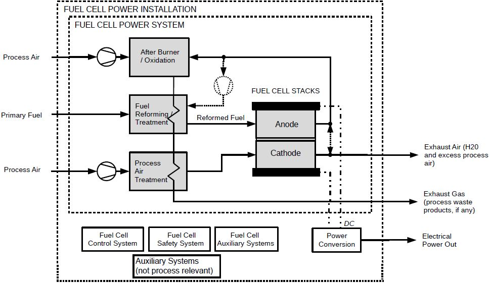
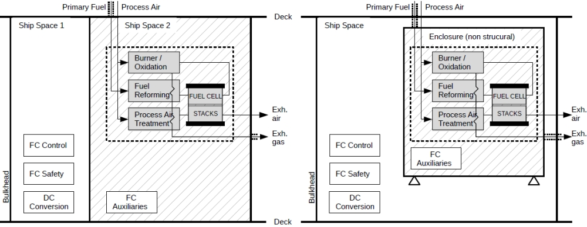
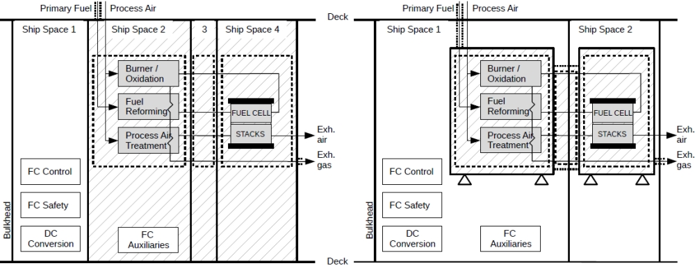

# Guidance for Fuel Cell Systems on Board of Ships

> OTHER RULES AND GUIDANCE / GC-12-E / 2025 / EN / Guidance

## CHAPTER 1 GENERAL

### Section 1 General

#### 101. Application (2020)

- **1.** This Guidance is to apply to with fuel cell power installations on board ships used as auxiliary or main source of power.
- **2.** The scope of this Guidance mainly covers the requirements for the arrangement and design of fuel cell power installations in **102. 3** (6) and the spaces containing such installations. Regulations such as storage, preparation, distribution, etc. of fuel other than this guidance are to be covered by the relevant regulations of **Rules for Ships using Low-flashpoint Fuels** depending on the fuel used. *(2022)*
- **3.** Items not specified in this Guidance relating to fuel cell power installation are to be in accordance with each relevant requirement in **Rules for the Classification of Steel Ships** except for the requirements inapplicable to fuel cell power installations in ships.
- **4.** Items not included in this Guidance may comply with ISO, IEC, KS or equivalent standards as deemed appropriate by the Society.
- **5.** Additional requirements to this Guidance may be required.

#### 102. General (2020)

- **1.** **Goal**
  The goal of this Guidance is to provide safe and reliable delivery of electrical and/or thermal energy through the use of fuel cell technology.
- **2.** **Functional requirements**
  This Guidance is related to the goals and functional requirements of **Rules for Ships using Low-flashpoint Fuels**. In particular, the following apply.
  - **(1)** The safety, reliability and dependability of the systems are to be equivalent to those achieved with new and comparable conventional oil-fuelled main and auxiliary machinery installations, regardless of the specific fuel cell type and fuel.
  - **(2)** The probability and consequences of fuel related hazards are to be limited to a minimum through arrangement and system design, such as ventilation, detection and safety actions. In the event of gas leakage or failure of the risk reducing measures, necessary safety actions are to be initiated.
  - **(3)** The design philosophy is to ensure that risk reducing measures and safety actions for the fuel cell power installation do not lead to an unacceptable loss of power.
  - **(4)** Hazardous areas are to be restricted, as far as practicable, to minimize the potential risks that might affect the safety of the ship, persons on board and equipment.
  - **(5)** Equipment installed in hazardous areas is to be minimized to that required for operational purposes and is to be suitably and appropriately certified.
  - **(6)** Fuel cell spaces are to be configured to prevent any unintended accumulation of explosive, flammable or toxic gas concentrations.
  - **(7)** System components are to be protected against external damages.
  - **(8)** Sources of ignition in hazardous areas are to be minimized to reduce the probability of explosions.
  - **(9)** Piping systems and overpressure relief arrangements that are of suitable design, construction and installation for their intended application is to be provided.
  - **(10)** Machinery, systems and components are to be designed, constructed, installed, operated, maintained and protected to ensure safe and reliable operation.
  - **(11)** Fuel cell spaces are to be arranged and located such that a fire or explosion in either will not lead to an unacceptable loss of power or render equipment in other compartments inoperable.
  - **(12)** Suitable control, alarm, monitoring and shutdown systems are to be provided to ensure safe and reliable operation.
  - **(13)** Fixed leakage detection suitable for all spaces and areas concerned is to be arranged.
  - **(14)** Fire detection, protection and extinction measures appropriate to the hazards concerned are to be provided.
  - **(15)** Commissioning, trials and maintenance of fuel systems and gas utilization machinery are to satisfy the goal in terms of safety, availability and reliability.
  - **(16)** The technical documentation is to permit an assessment of the compliance of the system and its components with the applicable rules, guidelines, design standards used and the principles related to safety, availability, maintainability and reliability.
  - **(17)** A single failure in a technical system or component is not to lead to an unsafe or unreliable situation.
  - **(18)** Safe access is to be provided for operation, inspection and maintenance.
- **3.** **Definitions**
  For the purpose of these Guidances, the terms used have the meanings defined in the following paragraphs. Terms not defined have the same meaning as in **SOLAS chapter II-2** and **Rules for Ships using Low-flashpoint Fuels**.
  - **(1)** **Fuel cell** is a source of electrical power in which the chemical energy of a fuel cell fuel is converted directly into electrical and thermal energy by electrochemical oxidation.
  - **(2)** **Fuel cell stack** is an assembly of cells, separators, cooling plates, manifolds and a supporting structure that electrochemically converts, typically, hydrogen-rich gas and air reactants to DC power, heat and other reaction products. *(2022)*
  - **(3)** **Fuel cell module** is an assembly incorporating one or more fuel cell stacks and, if applicable, additional components, which is intended to be integrated into a power system or a vehicle. A fuel cell module comprises the following main components: one or more fuel cell stack(s), a piping system for conveying fuels, oxidants and exhausts, electric connections for the power delivered by the stack(s) and means for monitoring, control or both. Additionally, a fuel cell module can comprise: means for conveying additional fluids (e.g. cooling media, inert gas), means for detecting normal and abnormal operating conditions, enclosures or pressure vessels and module ventilation systems, and the required electronic components for module operation and power conditioning. *(2022)*
  - **(4)** **Fuel reformer** is the arrangement of all related fuel-reforming equipment for processing gaseous or liquid primary fuels to reformed fuel for use in the fuel cells.
  - **(5)** **Fuel cell power system** is the group of components which may contain fuel or hazardous vapours, fuel cell(s), fuel reformers, if fitted, and associated piping systems.
  - **(6)** **Fuel cell power installation** is the fuel cell power system and other components and systems required to supply electrical power to the ship. It may also include ancillary systems for the fuel cell operation. (refer to **Fig 1.1**)

    |  |
    | --- |
    | **Fig 1.1 Components of Typical Fuel Cell Power Installation** |
  - **(7)** **Fuel cell space** is a space containing fuel cell power systems or parts of fuel cell power systems. (refer to **Fig 1.2**)
  - **(8)** **Reformed fuel** is hydrogen rich gas generated in the fuel reformer.
  - **(9)** **Primary fuel** is fuel supplied to the fuel cell power system.
  - **(10)** **Exhaust gas** is exhaust from the reformer or anode side of the fuel cell.
  - **(11)** **Exhaust air** is exhaust from the cathode side of the fuel cell.
  - **(12)** **Process air** is air supply to the reformer and/or the cathode side of the fuel cell.
  - **(13)** **Ventilation air** is air used to ventilate the fuel cell space.
  - **(14)** **LEL** means lower explosive limit, which, in the context of these Interim Guidelines, is to be taken as identical to the Lower Flammable Limit (LFL) and which is 4.0% vol. fraction for hydrogen. *(2023)*

    |  Ex.1) Fuel cell space as a structural ship space Ex.2) Fuel cell space as a non-structural enlosure within a ship space |
    | --- |
    |  Ex.3) Multiple fuel cell space as a structural ship Ex.4) Multiple fuel cell space as a non-structural space enclosures within a ship space |
    |  |
    | **Fig 1.2 Examples for Fuel Cell Spaces** |

#### 103. Class notations (2024)

- **1.** As additional special feature notations, a notation is to be assigned as follows:
  - **(1)** Ships installing fuel cell power installations are to comply with the requirements of this Guidance and a notation “FC” is to be assigned.
  - **(2)** In addition to above, where the fuel cell power is used for propulsion or essential services and the redundancy requirements of **Ch 2, 101.** are satisfied, a notation "FC-PWR" is to be assigned.

#### 104. Alternative design (2020)

- **1.** These Guidances contain functional requirements for all appliances and arrangements related to the usage of fuel cell technology.
- **2.** Appliances and arrangements of fuel cell power systems may deviate from those set out in these Guidances, provided such appliances and arrangements meet the intent of the goal and functional requirements concerned and provide an equivalent level of safety of the relevant sections.
- **3.** The equivalence of the alternative design is to be demonstrated as specified in **SOLAS Reg. II-1/55** and approved by the Society. However, the Society is not to allow operational methods or procedures to be applied as an alternative to a particular fitting, material, appliance, apparatus, item of equipment or type thereof which is prescribed by these Guidances.

#### 105. Exclusion from the Guidance

The Society cannot assume responsibility for other technical characteristics for fuel cell systems not covered by this Guidance. However, the Society may advise on such matters upon application. 
