# Guidance for Ship for Navigation in Ice

> OTHER RULES AND GUIDANCE / GC-14-E / 2025 / EN / Guidance

## CHAPTER 1 STRENGTHENING FOR NAVIGATION IN ICE

### Section 1 General

#### 101. Application

- **1.** The requirements in this Chapter are applied to the hull structure, equipment, machinery and etc. of ice strengthened ships.
- **2.** The ships intended to navigate in ice are to be in accordance with the requirements in this Chapter in addition to **the Rules for the Classification of Steel Ships**.
- **3.** In principle, the requirements in this chapter are applied to the ice strengthening of ships which are intended to navigate in the Northern Baltic that are subject to the **Finnish-Swedish Ice class Rules 2017** or in the Canadian Arctic that are subject to the **Arctic Shipping Pollution Prevention Regulations**(see **Annex 1, 101**).
- **4.** The low air temperature of the ship's ambience in the navigational waters is to be considered for fittings of structures and equipment that are important for navigation and the safety of the ship which is subject to the requirements of this Chapter. In particular, special consideration should be given towards the functioning of hydraulic systems, hazards of freezing of water pipings and tanks and starting of emergency diesel engines, etc.
- **5.** In ships that have unusual proportions, hull form or propulsion arrangements, etc, the Society may impose special requirements.

#### 102. Documentation

- **1.** Forward region, midship region, aft region, ice belt, UIWL and LIWL defined in **202.** are to be specified in the Shell Expansion.
- **2.** The engine output defined in **501,** the displacement defined in **203.3** and the dimensions necessary for the engine output calculation required in **502.** are to be specified in the General Arrangement. And the engine output calculation is to be submitted in addition to drawing and data for reference in accordance with the **Pt 5 of the Rules for the Classification of Steel Ships**.

### Section 2 Ice Strengthening

#### 201. Classification of Ice Strengthening

- **1.** Strengthening for navigation in ice is classified into the following 6 class notations dependent on the degree of reinforcement and engine output of the ship(see **Annex 1, 102**).
  - **(1)** IA Super : ships with such structure, engine output and other properties that they are normally capable of navigating in difficult ice conditions without the assistance of Icebreakers
  - **(2)** IA : ships with such structure, engine output and other properties that they are capable of navigating in difficult ice conditions, with the assistance of Icebreakers when necessary
  - **(3)** IB : ships with such structure, engine output and other properties that they are capable of navigating in moderate ice conditions, with the assistance of Icebreakers when necessary
  - **(4)** IC : ships with such structure, engine output and other properties that they are capable of navigating in light ice conditions, with the assistance of Icebreakers when necessary
  - **(5)** ID : ships with such structure, engine output and other properties that are capable of navigating in light ice conditions
  - **(6)** II : ships complying with a standard deemed appropriate by the Society and that are capable of navigating in very light ice conditions
- **2.** It is the responsibility of the Owner to determine which class in Par 1 is most suitable for this requirement.

#### 202. Definitions

The definitions of terms which appear in this Chapter are to be specified as the following, unless otherwise specified elsewhere.

- **1.** **Area of Ice Strengthening**
  The bow, midbody, and stern regions in way of hull part are defined for ships of Ice classes IA Super, IA, IB and IC and the bow region is defined for ships of Ice class ID as follows:
  - **(1)** Bow region: From the stem to a line parallel to and 0.04$L$ aft of the bow borderline of the part of the hull where the waterlines run parallel to the centerline. For Ice classes IA Super and IA the overlap over the borderline need not exceed 6 m, and for Ice classes IB, IC and ID this overlap need not exceed 5 m.
  - **(2)** Midbody region: From the aft boundary of the bow region to a line parallel to and 0.04 $L$ aft of the aft borderline of the part of the hull where the waterlines run parallel to the centreline. For Ice classes IA Super and IA the overlap over the borderline need not exceed 6 m, and for Ice classes IB and IC this overlap need not exceed 5 m.
  - **(3)** Stern region: From the aft boundary of the midbody region to the stern.
- **2.** The ice belt is the part of the shell plating which has to be reinforced. (see Fig **1.1** and **303.1**)
  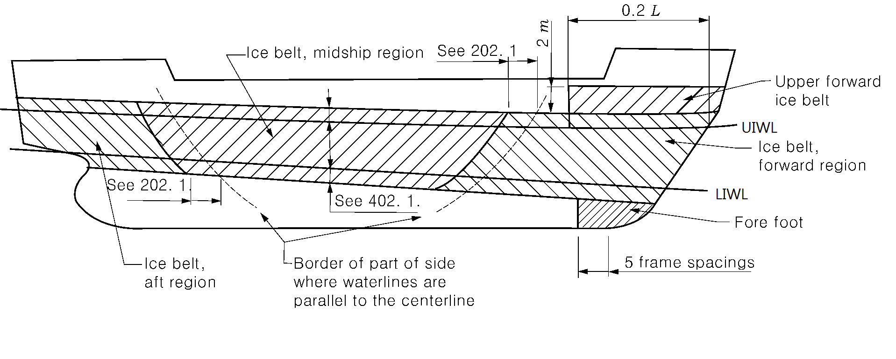
  Fig 1.1 Ice Belt at each region
- **3.** The upper ice waterline (UIWL) shall be the envelop of the highest points of the waterline at which the ship is intended to operate in ice. The line may be a broken line.
- **4.** The lower ice waterline (LIWL) shall be the envelop of the lowest points of the waterline at which the ship is intended to operate in ice.
- **5.** The maximum and minimum Ice class draughts at fore and aft perpendiculars shall be determined in accordance with the upper and lower ice waterlines.

#### 203. Operational Requirements

- **1.** The draught of the ship at fore and aft perpendiculars, when operating in ice shall always be between the UIWL and LIWL.
- **2.** Restrictions on draughts when operating in ice shall be documented and kept on board readily available to the master.
- **3.** The maximum and minimum Ice class draughts fore, amidships and aft shall be indicated in the classification certificate.
- **4.** For ships built("Built" means the keel of ships has been laid or which has been at a similar stage of construction) on or after 1 July 2007, if the summer load line in fresh water is anywhere located at a higher level than the UIWL, the ship’s sides are to be provided with a warning triangle and with an Ice class draught mark at the maximum permissible Ice class draught amidships. Ships built before 1 July 2007 shall be provided with such a marking, if the UIWL is below the summer load line, not later than the first scheduled dry docking after 1 July 2007 (see **Annex 1, 103**). Ships built before 1 July 2007 shall be provided with such a marking, if the UIWL is below the summer load line, not later than the first scheduled dry docking after 1 July 2007.
- **5.** The draught and trim, limited by UIWL, must not be exceeded when the ship is navigating in ice. The salinity of sea water along the intended route shall be taken into account when loading the ship. The ship shall always be loaded down at least to the LIWL when navigating in ice.

#### 204. Security of Minimum Draught

- **1.** **Prevention of the water from freezing**
  Any ballast tank, situated above the LIWL and needed to load down the ship to this water line is to be equipped with proper devices to prevent the water from freezing.
- **2.** In determining the LIWL, regard shall be paid to the need for ensuring a reasonable degree of ice-going capability in ballast.
- **3.** The propeller is to be fully submerged, if possible, entirely below the ice.
- **4.** **Minimum forward draught**
  The minimum forward draught is not to be less than that obtained from the following formula, which need not exceed $4 h_0$
  $d _{f} = (2.0+0.00025 \Delta ) h _{0}$ (m)
  $\Delta$ : the maximum displacement (t) of the ship determined from the waterline on the UIWL (see **202. 3**). Where multiple waterlines are used for determining the UIWL, the displacement is to be determined from the waterline corresponding to the greatest displacement.
  $h_0$ = level ice thickness given in **Table 1.1**

  **Table 1.1 Level ice thickness** $h_0$

  | Ice class | $h_0$ (m) |
  | --- | --- |
  | IA Super | 1.0 |
  | IA | 0.8 |
  | IB | 0.6 |
  | IC | 0.4 |
  | ID | 0.4 |

### Section 3 Hull Structural Design

#### 301. Design ice pressures

- **1.** Design ice pressure $P_d$ is not to be less than that obtained from the following formula:
  $P _{d} =C _{d} C _{1} C _{a} P _{0}$ (MPa)
  $C_d$ = a factor which takes account of the influence of the size and engine output of the ship.
  $C_d = \frac{ak+b}{1000}$ ($C_d <= 1.0$)
  $k = \sqrt \frac{\Delta P}{1000}$
  $\Delta$ = the displacement (ton) of ship on the maximum ice-class draught according to **202. 3**
  $P$ = is the actual continuous engine output of the ship (kW) available when sailing in ice. If additional power sources are available for propulsion power (e.g. shaft motors), in addition to the power of the main engine (s), they shall also be included in the total engine output used as the basis for hull scantling calculations. The engine output used for calculation of the hull scantlings shall be clearly stated on the shell expansion drawing
  $a$ and $b$ = as given in **Table 1.2** according to the region under consideration and the value of $k$
  $C _{1}$ = hull region factor that reflects the magnitude of the load expected in that hull area relative to the bow area. (see **Table 1.3**)
  $P _{0}$ = the nominal ice pressure; the value 5.6 MPa is to be used.
  $C_a$ = a factor which takes account of the probability that the full length of the area under consideration will be under pressure at the same time, as given by the following formula.
  $C _{a} = \sqrt {\frac{0.6}{l _{a}}}$ (0.35$<= C_a <=$ 1.0)
  $l _{a}$ = to be taken as specified in **Table 1.4** according to the structural member under consideration.

  |   | Bow |   | Midbody and Stern region |   |
  | --- | --- | --- | --- | --- |
  |   | $k \leq 12$ | $k>12$ | $k \leq 12$ | $k>12$ |
  | $a$ | 30 | 6 | 8 | 12 |
  | $b$ | 230 | 518 | 214 | 286 |

  **Table 1.3 Coefficient** $C_1$

  | Ice class | Bow | Midbody | Stern |
  | --- | --- | --- | --- |
  | IA Super | 1.00 | 1.00 | 0.75 |
  | IA | 1.00 | 0.85 | 0.65 |
  | IB | 1.00 | 0.70 | 0.45 |
  | IC | 1.00 | 0.50 | 0.25 |
  | ID | 1.00 | - | - |

  **Table 1.4 Value of** $l_a$

  | Structure | Type of framing | $l_a$(m) |
  | --- | --- | --- |
  | Shell | Transverse | Frame Spacing |
  | Shell | Longitudinal | 1.7 frame Spacing |
  | Frames | Transverse | Frame Spacing |
  | Frames | Longitudinal | span of frame |
  | ice stringer | - | span of stringer |
  | web frame | - | 2-spacing of web frames |
- **2.** The $h$ is the height of the area under the ice pressure $P _{d}$ specified in **1** and is to be as given in **Table 1.5** according to the Ice class.

  **Table 1.5 Value of** $h$

  | Ice class | $h$(m) |
  | --- | --- |
  | IA Super | 0.35 |
  | IA | 0.30 |
  | IB | 0.25 |
  | IC | 0.22 |
  | ID | 0.22 |

#### 302. General of Structure

- **1.** The formulae and values given in this section may be substituted by direct analysis if they are deemed by the Society to be invalid or inapplicable for a given structural arrangement or detail. Otherwise, direct analysis is not to be utilized as an alternative to the analytical procedures prescribed by explicit requirements in sections
- **2.** If scantlings derived from these regulations are less than those required by the Society for a not an ice strengthened ship, the latter shall be used.
- **3.** For curved members the span (or spacing) is defined as the chord length between span (or spacing) points. The span points are defined by the intersection between the flange or upper edge of the member and the supporting structural element (stringer, web frame, deck or bulkhead). (see **Fig 1.2**)
  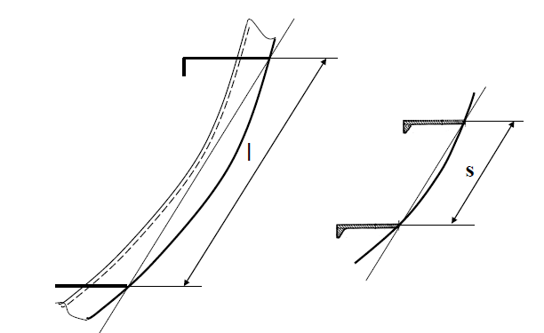
  **Fig 1.2 Definition of the frame span(left) and frame spacing (right) for curved members.**
- **4.** The effective breadth of the attached plate to be used for calculating the section modulus of the stiffener is to comply with **Pt 3, Ch 1, 602.** of **the Rules for the Classification of Steel Ships**.
- **5.** For such cases where the member is not normal to the plating (the angle between plating and stiffeners is less than 75°), the section properties (section modulus and shear area) are to be calculated in accordance with the **Pt 13, Ch 3, Sec 7 1.4** of **the Rules for the Classification of Steel Ships**.

#### 303. Shell plating

- **1.** **Vertical extension of ice strengthening**
  The vertical extension of ice belt is to be as given in **Table 1.6** according to the Ice class and is to comply with the following requirements.
  - **(1)** Fore foot
    For Ice class IA Super the shell plating below the ice belt from the stem to a position five main frame spaces abaft the point where the bow profile departs from the keel line is to have at least the thickness required in the ice belt in the midbody region.
  - **(2)** Upper bow ice belt
    For Ice classes IA Super and IA on ships with an open water service speed equal to or exceeding 18 kt, the shell plate from the upper limit of the ice belt to 2 m above it and from the stem to a position at least 0.2 $L$ abaft the bow perpendicular, is to have at least the thickness required in the ice belt in the midbody region. A similar strengthening of the bow region is to apply to a ship with lower service speed, when it is, e.g. on the basis of the model tests, evident that the ship will have a high bow wave.
  - **(3)** Side scuttles are not to be situated in the ice belt.
  - **(4)** If the weather deck in any part of the ship is situated below the upper limit of the ice belt, the bulwark and the construction of the freeing ports are to be given at least the same strength as is required for the shell in the ice belt.

    **Table 1.6 Vertical extension of the Ice belt** $b$

    | Ice class | Hull Region | Above $\mathrm{UIWL}$ | Below $\mathrm{LIWL}$ |
    | --- | --- | --- | --- |
    | IA Super | Bow | 0.6 m | 1.2 m |
    | IA Super | Midbody | 0.6 m | 1.2 m |
    | IA Super | Stern | 0.6 m | 1.0 m |
    | IA | Bow | 0.5 m | 0.9 m |
    | IA | Midbody | 0.5 m | 0.75 m |
    | IA | Stern | 0.5 m | 0.75 m |
    | IB and IC | Bow | 0.4 m | 0.7 m |
    | IB and IC | Midbody | 0.4 m | 0.6 m |
    | IB and IC | Stern | 0.4 m | 0.6 m |
    | ID | Bow | 0.4 m | 0.7 m |
- **2.** **Thickness of shell plating**
  The thickness of shell plating in the ice belt is not to be less than that obtained from the following formula:
  For the transverse framing : $t = 667S \sqrt {\frac{f _{1} P _{PL}}{\sigma _{y}}} + t_c$(mm)
  For the longitudinal framing : $t = 667S \sqrt {\frac{P}{f _{2} \sigma _{y}}} + t_c$(mm)
  $t_c$ : 2 mm, if special surface coating, by experience shown capable to withstand the abrasion of ice, is applied and maintained, lower values may be approved.
  $S$ : frame spacing (m)
  $P _{PL}$ : 0.75 $P _{d}$ (MPa)
  $P_d$ : as specified in **301.1**
  $f_1$ : as given in the following formula. Where, however, $f_1$ is greater than 1.0, $f_1$ is to be taken as 1.0
  $f_1 = 1.3 - {4.2 } over { (h/S + 1.8 ) ^2$
  $f_2$ : as given by the following formula depending on the value of $h/S$
  Where $h/S <1.0$ : $f_2 = 0.6 + \frac{0.4}{h/S}$
  Where $1.0 \leq h/S < 1.8$ : $f_2 = 1.4 - 0.4(h/S)$
  $h$ : as specified in **Table 1.5.**
  $\sigma_y$ : yield stress of the material of the member considered, which are given as follows (N/mm^2)
  235 : for mild steels as specified in **Pt 2, Ch 1 of the Rules for the Classification of Steel Ships**
  315 : for high tensile steels *AH* 32, *DH* 32, *EH* 32 or *FH* 32 as specified in **Pt 2, Ch 1 of the Rules for the Classification of Steel Ships**
  355 : for high tensile steels *AH* 36, *DH* 36, *EH* 36 or *FH* 36 as specified in **Pt 2, Ch 1 of the Rules for the Classification of Steel Ships**
  390 : for high tensile steels *AH* 40, *DH* 40, *EH* 40 or *FH* 40 as specified in **Pt 2, Ch 1 of the Rules for the Classification of Steel Ships**

#### 304. Frames

- **1.** **Vertical extension of ice strengthening**
  - **(1)** The vertical extension of ice strengthening of the framing is to be at least as given in **Table 1.7** according to the respective Ice classes and regions.
  - **(2)** For Ice classes IA Super and IA on ships with an open water service speed equal to or exceeding 18 kt, the ice strengthening part of the framing is to be extended to the top of this ice belt of **303.1** (2).
  - **(3)** Where the ice strengthening would go beyond a deck or a tanktop (or tank bottom) by no more than 250 mm, it can be terminated at that deck or tanktop (or tank bottom).
  - **(4)** For this reason, the vertical extension of the ice strengthening of the longitudinal frames should be extended up to and including the next frame up from the upper edge (frame 3 in **Fig 1.3**) of the ice belt as defined in **303.1**. Additionally the frame spacing of the longitudinal frames just above and below the edge of the ice belt should be the same as the frame spacing in the ice belt (spacing between frames 2 and 3 should be the same as between frames 1 and 2 in **Fig 1.3**).
  - **(5)** If, however, the first frame in the area above the ice belt (frame 3 in area 2 in **Fig 1.3**) is closer than about s/2 to the edge of the icebelt, then the same frame spacing as in the icebelt should be used above the edge of the ice belt i.e in the spacing between frames 3 and 4.
    
    Fig 1.3 The different ice strengthening areas at and above the UIWL.

    **Table 1.7 Vertical extension of the ice strengthening of framing**

    | Ice class | Region | Above $\mathrm{UIWL}$ (m) | Below $\mathrm{LIWL}$ (m) |
    | --- | --- | --- | --- |
    | IA Super | Bow | 1.2 | to double bottom or below top of floors |
    | IA Super | Midbody | 1.2 | 2.0 |
    | IA Super | Stern | 1.2 | 1.6 |
    | IA IB IC | Bow | 1.0 | 1.6 |
    | IA IB IC | Midbody | 1.0 | 1.3 |
    | IA IB IC | Stern | 1.0 | 1.0 |
    | ID | Bow | 1.0 | 1.6 |
- **2.** **General of Frames**
  - **(1)** Within the ice strengthening area all frames are to be effectively attached to all the supporting structures. A longitudinal frame is to be attached to all the supporting web frames and bulkheads by brackets. When a transverse frame terminates at a stringer or deck, a bracket or similar construction is to be fitted. When a frame is running through the supporting structure, both sides of the web plate of the frame are to be connected to the structure by direct welding, collar plate or lug. When a bracket is installed, it is to have at least the same thickness as the web plate of the frame and the edge is to be appropriately stiffened against buckling.
  - **(2)** The frames shall be attached to the shell by double continuous weld. No scalloping is allowed (except when crossing shell plate butts)
  - **(3)** The web thickness of the frames shall be at least the maximum of the following:
    $C$ = 805 for profiles and
    $C$ = 282 for flat bars
  - **(4)** Where there is a deck, tank top (or tank bottom) or bulkhead in lieu of a frame, the plate thickness of this is to be as per the preceding in (3), to a depth corresponding to the height of adjacent frames and constant C is to be taken as 805.
  - **(5)** Asymmetrical frames and frames which are not at right angles to the shell (web less than 75 degrees to the shell) shall be supported against tripping by brackets, intercoastals, stringers or similar, at a distance not exceeding 1.3 m.
  - **(6)** For frames with spans greater than 4 m, the extent of antitripping supports is to be applied to all regions and for all ice classes.
  - **(7)** For frames with spans less than or equal to 4 m the extent of antitripping supports is to be applied to following regions
    - IA Super All hull regions
    - IA Bow and midbody regions
    - IB, IC and ID Bow region.

#### 305. Transverse frames

- **1.** **Section Modulus and Shear Area**
  - **(1)** The section modulus $Z$ and the effective shear area A of a main or intermediate transverse frame specified in **304.1** is to be not less than that obtained from the following formula.
    Section modulus: $Z = \frac{P_d S h l}{m_t \sigma_y} \times 10^6$(cm^3)
    Effective shear area: $A = \frac{\sqrt{3} f_3 P_d h s}{2 \sigma_y} \times 10^4$(cm^2)
    $f_3$ = factor which takes into account the maximum shear force versus the load location and the shear stress distribution, taken as 1.2
    $P_d$ = as specified in **301.1**
    $S$ = frame spacing (m).
    $h$ = as specified in **Table 1.5**
    $l$ = span of the frame (m).
    $m_t$ = as given by the following formula : $m_t = \frac{7m_0}{7 - 5 h/l}$
    $m_0$ = as specified in **Table 1.8** The boundary conditions are those for the main and intermediate frames. Load is applied at mid span.
    $\sigma_y$ = as specified in **303.2.**
  - **(2)** Where less than 15 % of the span of the frame in **304.1** is situated within the ice strengthening zone for frames, frame scantlings are to be larger than that applied to the requirements of **Pt 3** or **Pt 10** of **the Rules for the Classification of Steel Ships**.
- **2.** **Upper end of Transverse Framing**
  - **(1)** The upper end of the strengthening part of a main frame and of an intermediate frame are to be attached to a deck, tanktop (or tank bottom) or an ice stringer as specified in **307.**
  - **(2)** Where a frame terminates above a deck or a stringer (hereinafter, referred to as the lower deck in this section) which is situated at or above the upper limit of the ice belt, the part of the frame above the lower deck is to be in accordance with the followings:
    - **(A)** the part of the main frame and the intermediate frame may have the scantlings required by the ordinary frame
    - **(B)** the upper end of the main frame and the intermediate frame is to be connected to a deck which situated above the lower deck (hereinafter, referred to as the higher deck in this section). However, the upper end of the intermediate frame may be connected to the adjacent main frames by a horizontal stiffener having the same scantlings as the main frame.
- **3.** **Lower end of Transverse Framing**
  - **(1)** The lower end of the strengthened part of a main frame and of an intermediate ice frame is to be attached to a deck, tank top (or tank bottom) or ice stringer specified in **307.**
  - **(2)** Where an intermediate frame terminates below a deck, tank top (or tank bottom) or ice stringer which is situated at or below the lower limit of the ice belt, the lower end may be connected to the adjacent main frames by a horizontal member of the same scantlings as the frames.
  - **(3)** the main frames below the lower edge of ice belt must be ice strengthened. (see **304.1**)

    **Table 1.8 Value of** $m _{0}$

    | Boundary condition | $m_0$ | Example |
    | --- | --- | --- |
    | Both ends fixed | 7.0 | Frames in a bulk carrier with top side tanks |
    | 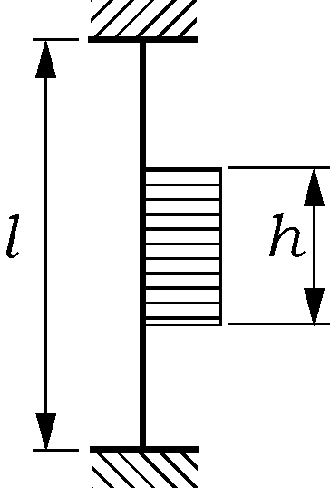 | 7.0 | Frames in a bulk carrier with top side tanks |
    | One side fixed and one side simple support | 6.0 | Frames extending from the tank top to a single deck |
    | 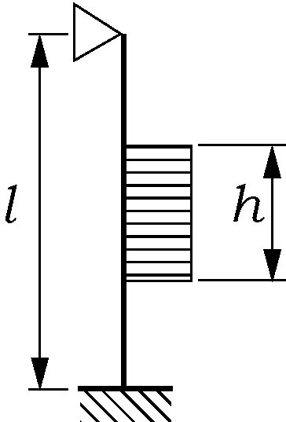 | 6.0 | Frames extending from the tank top to a single deck |
    | Multi point simple support | 5.7 | Continuous frames between several decks or stringers |
    | 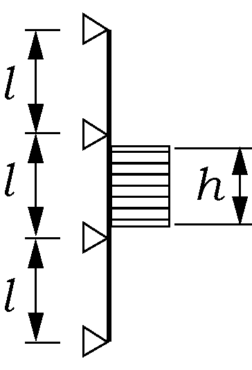 | 5.7 | Continuous frames between several decks or stringers |
    | Both ends simple support | 5.0 | Frames extending between two decks only |
    | 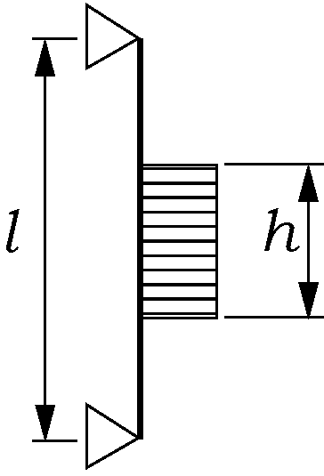 | 5.0 | Frames extending between two decks only |

#### 306. Longitudinal frames

The section modulus $Z$ and effective shear area $A$ of a longitudinal frame in the extension specified in **303.1** are not to be less than that obtained from the following formula. However in calculating the actual shear area of the frames, the shear area of the brackets is not to be taken into account.
$Z= \frac{f _{4} P _{d} hl ^{2}}{m _{} \sigma _{y}} \times 10 ^{6}$ (cm^3), $A= \frac{\sqrt {3} f _{4} f _{5}P _{d} hl}{2 \sigma _{y}} \times 10 ^{4}$ (cm^2)
$f_4$ = factor which takes account of the load distribution to adjacent frames given by following formula:
$f _{4} = \left( 1- {0.2h} / {S} \right)$
$h$ = as specified in **Table 1.5**
$S$ = frame spacing (m).
$P_d$ = as specified in **301.1**
$l$ = span of the longitudinal frame (m).
$\sigma_y$ = as specified in **303.2**
$f_5$ = factor which takes account the maximum shear force versus load location and the shear stress distribution ($f_5$ = 2.16)
$m$ is boundary condition factor and $m$ = 13.3 for a continuous beam with brackets; where the boundary conditions deviate significantly from those of a continuous beam with brackets, e.g. in an end field, a smaller boundary condition factor may be required

#### 307. Ice stringers

- **1.** **Stringer within the ice belt**
  The section modulus $Z$ and the effective shear area $A$ of a stringer situated within the ice belt are to be not less than that obtained from the following formula:
  $Z= \frac{f _{6} f _{7} P _{d} h l ^{2}}{m _{} \sigma _{y}} \times 10 ^{6}$(cm^3), $A= \frac{\sqrt {3} f _{6} f _{7} f _{8} P _{d} h l}{2 \sigma _{y}} \times 10 ^{4}$(cm^2)
  $P_d$ = as specified in **301.1**
  $h$ = as specified in **Table 1.5.** However, the product $P _{d} \times h$ is not to be taken as less than 0.15$\mathrm{MN}/m$.
  $l$ = span of the stringer (m).
  $m$ = boundary condition factor; as given in **306.**
  $f _{6}$ = factor which takes account of the distribution of load to the transverse frames is to be taken as 0.9.
  $f _{7}$ = safety factor of stringer: to be taken as 1.8
  $f _{8}$ = factor that takes into account the maximum shear force versus load location and the shear stress distribution: to be taken as 1.2
  $\sigma_y$ = as specified in **303.2**
- **2.** **Stringers outside the ice belt**
  The section modulus $Z$ and the effective shear area $A$ of a stringer situated outside the ice belt but supporting ice strengthened frames are not to be less than that obtained from the following formula:
  $Z= \frac{f _{9} f _{10} P _{d} h l ^{2}}{m _{} \sigma _{y}} (1-h _{s} /l _{s} ) \times 10 ^{6}$(cm^3), $A= \frac{\sqrt {3} f _{9} f _{10} f _{11} P _{d} h l}{2 \sigma _{y}} (1-h _{s} /l _{s} ) \times 10 ^{4}$(cm^2)
  $P_d$ = as specified in **301.1.**
  $h$ = as specified in **Table 1.5.** However, the product $P _{d} \times h$ is not to be taken as less than 0.15 $\mathrm{MN}/m$.
  $l$ = span of the stringer (m).
  $m_s$= boundary condition factor as defined in **306.**
  $l_s$ = the distance to the adjacent ice stringer (m).
  $h_s$ = the shortest distance from the considering stringer to the ice belt (m).
  $f _{9}$ = factor which takes account of load to the transverse frames is to be taken as 0.80.
  $f_10$ = safety factor of stringer ; to be taken as 1.8
  $f_11$ = factor which takes account the maximum shear force versus load location and the shear stress distribution; $f_11$ = 1.2
  $\sigma_y$ = as specified in **302. 2.**
- **3.** **Deck Strips**
  - **(1)** Narrow deck strips abreast of hatches and serving as ice stringers are to comply with the section modulus and shear area requirements in **1** and **2** respectively.
  - **(2)** In the case of very long hatches, the product $P _{d} \times h$ may be taken as less than 0.15 $\mathrm{MN}/m$ but in no case less than 0.1 $\mathrm{MN}/m$.
  - **(3)** Regard is to be paid to the deflection of the ship's sides due to ice pressure in way of very long(more than B/2) hatch openings, when designing weather deck hatch covers and their fittings.

#### 308. Web Frames

- **1.** **Ice Load**
  The ice load $F$ transferred to a web frame from an ice stringer or from longitudinal framing is not to be less than that obtained by the following formula. However, In case the supported stringer is outside the ice belt, the load $F$ may be reduced by multiplying $(1-h _{s} / l _{s} )$.
  $F = f _{12} P _{d} hS$(MN)
  $P_d$ = ice pressure (MPa) as specified in **301.1** in calculating $C_a$ however, $l_a$ is to be taken as 2$S$.
  $f_12$ = safety factor of web frames; to be taken as 1.8.
  $h$ = as specified in **Table 1.5.** However, the product $P _{d} \times h$ is to be more than 0.15$\mathrm{MN}/m$.
  $S$ = web frame spacing (m).
  $h _{s} , l _{s}$: As specified in **307.2.**
- **2.** **Section Modulus and Shear Area**
  The section modulus $Z$ and effective shear area $A$ of web frame may be obtained from the following formula:
  $Z = \frac{M}{\sigma _{y}} \sqrt { \frac{1}{1-( \gamma A /A _{a} ) ^{2}} } \times 10 ^{6}$(cm^3), $A= \frac{\sqrt {3} \alpha f _{13} Q}{\sigma _{y}} \times 10 ^{4}$ (cm^2)
  $l$ = span of web frame (m).
  $Q$ = maximum calculated shear force under the ice load $F$, as given in **Par 1**
  $f_13$ = factor that takes into account the shear force distribution, $f_13$ = 1.1
  $M$ = maximum calculated bending moment under the ice load $F$ ; to be taken as $M = 0.193 F l$.
  $\alpha$ and $\gamma$ = as given in **Table 1.9.** For intermediate values of $A_f /A_w$ is to be obtained by linear interpolation.
  $\sigma_y$ = as specified in **307.2.**
  $A$ = required shear area (cm^2)
  $A_a$ = actual cross sectional area of the web frame (cm^2)
  $A_a = A_f + A_w$

  **Table 1.9 Value of** $\alpha$ **and** $\gamma$

  | $A_f /A_w$ | 0.00 | 0.20 | 0.40 | 0.60 | 0.80 | 1.00 | 1.20 | 1.40 | 1.60 | 1.80 | 2.00 |
  | --- | --- | --- | --- | --- | --- | --- | --- | --- | --- | --- | --- |
  | $\alpha$ | 1.50 | 1.50 | 1.23 | 1.16 | 1.11 | 1.09 | 1.07 | 1.06 | 1.05 | 1.05 | 1.04 |
  | $\gamma$ | 0.00 | 0.44 | 0.62 | 0.71 | 0.76 | 0.80 | 0.83 | 0.85 | 0.87 | 0.88 | 0.89 |
  | Note: $A_f$ = actual cross section area of free flange (cm^2) $A_w$ = actual effective cross section area of web plate (cm^2) |   |   |   |   |   |   |   |   |   |   |   |
- **3.** **Direct Analysis**
  The scantlings of web frames may be calculated by direct analyses where deemed appropriate by the Society. In this case, the following are to be complied with;
  - **(1)** The pressure $P_d$ according to **301.1**. and height of load area $h$ according to **301.2**. are to be used in direct calculation.
  - **(2)** The pressure to be used is 1.8 $P_d$ (MPa).
  - **(3)** The load patch is to be applied at locations where the capacity of the structure under the combined effects of bending and shear are minimized.
  - **(4)** The structure is to be checked with load centered at follow location;
    - **(A)** Vertical location
      - **(a)** at the UIWL,
      - **(b)** 0.5$h_0$ (m) below the LIWL, and ($h_0$ see **Table 1.1)**
      - **(c)** positioned several vertical locations in between.
    - **(B)** Several horizontal locations which are the locations centered at the mid-span or spacing
    - **(C)** If the load length $l_a$ cannot be determined directly from the arrangement of the structure, several values of $l_a$ may be checked using corresponding values for $C_a$.
  - **(5)** Allowable stress are as follows;
    ․ Bending stress : $\sigma _{b} = \sigma _{y}$
    ․ Shear stress : $\tau = \sigma _{y} / \sqrt {3}$
    ․ Equivalent stress : $\sigma _{e} = \sqrt {\sigma ^{2} _{b} +3 \tau ^{2}} = \sigma _{y}$

#### 309. Bow

- **1.** **Stem**
  - **(1)** The stem shall be made of rolled, cast or forged steel or of shaped steel plates as shown in **Fig 1.4.**
    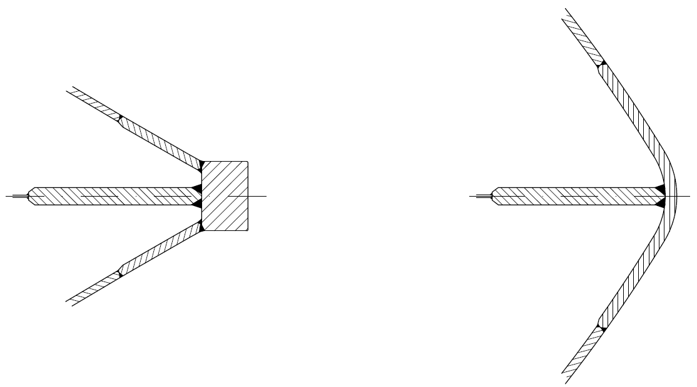
    Fig 1.4 Examples of suitable stems
  - **(2)** The plate thickness of a shaped plate stem and in the case of a blunt bow, any part of the shell where angle $\alpha$ and $\psi$ as specified in **502.1** are respectively not less than 30 degrees and 75 degrees, is to be obtained from the formula in **301.2** using the following values ;
    $S$ = spacing of elements supporting the plate (m).
    $P_PL$ = ice pressure ($P _{d}$) as specified in **301** (MPa).
    $l_a$ = spacing of vertical supporting elements (m).
  - **(3)** The stem and the part of a blunt bow specified in (2) is to be supported by floors or brackets spaced not more than 0.6 m apart and having a thickness of at least half the plate thickness.
  - **(4)** The reinforcement of the stem is to be extended from the keel to a point 0.75 m above UIWL or, in case an upper forward ice belt is required in **303.1** (3) to the upper limit of this.
- **2.** **Arrangements for towing**
  Towing arrangements are normally as follows; (see **Fig 1.5**)
  - **(1)** The towing arrangement usually uses a thick wire which is split into two slightly thinner wires, shown in **Fig 1.5**.
  - **(2)** Two fairleads must be fitted symmetrically off the centreline with one bollard each.
  - **(3)** The distance of the bollards from the centreline is approximately 3 m. The bollards shall be aligned with the fairleads allowing the towlines to be fastened straight onto them.
  - **(4)** A bollard or other means for securing a towline, structurally designed to withstand the breaking force of the towline of the ship, shall also be fitted.
    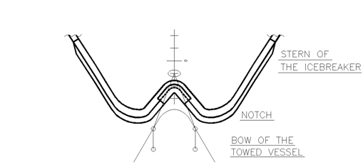
    Fig 1.5 The typical towing arrangement

#### 310. Stern

- **1.** The clearance between the propeller blade tip and hull, including the stern frame is not to be less than $h_0$ as specified **203.** to prevent from occurring high loads on the blade tip.
- **2.** On twin and triple screw ships, the ice strengthening of the shell and framing are to be extended to the double bottom for 1.5 m forward and aft of the side propellers.
- **3.** On twin and triple screw ships, the shafting and stern tubes of side propellers are to be normally enclosed within plated bossings. If detached struts are used, their design, strength and attachment to the hull are to be duly considered.
- **4.** The introduction of new propulsion arrangements with azimuth thrusters or podded propellers, which provide an improved maneuverability, will result in increased ice loading of the stern region and the stern area. This fact is to be considered in the design of the aft/stern structure.

#### 311. Bilge keel

- **1.** The connection of bilge keels to the hull shall be so designed that the risk of damage to the hull, in case a bilge keel is damaged, is minimized.
- **2.** A construction of bilge keels as **Fig 1.6** is recommended for strength.
- **3.** To limit damage when a bilge keel is partly damaged, it is recommended that bilge keels are cut up into several shorter independent lengths.
  
  **Fig 1.6 An example of typical type bilge keel construction**

### Section 4 Rudder and Steering Arrangements

#### 401. Rudder and steering arrangements

- **1.** The scantlings of rudder post, rudder stock, pintles and steering gear, etc. are to comply with requirements in **Pt 4, Ch 1** and **Pt 5, Ch 7 of the Rules for the Classification of Steel Ships.** The maximum service speed of the ship to be used in these calculations shall, however, not be taken as less than stated below:
  IA Super 20 knots
  IA 18 knots
  IB 16 knots
  IC 14 knots
  If the actual maximum service speed of the ship is higher, that speed shall be used.
- **2.** The local scantling of rudders are to be determined assuming that the whole rudder belongs to the ice belt. The rudder plating and frames are to be designed using the ice pressure for the plating and frames in the midbody region.
- **3.** For the Ice classes IA Super and IA, the rudder stock and the upper part of the rudder are to be protected from direct contact with intact ice by either an ice knife that extends below the LIWL or by equivalent means. Special consideration is to be given to the design of the rudder and the ice knife for ships with flap-type rudders.
- **4.** For ships of Ice classes IA Super and IA, the rudders and steering arrangements are to be designed as follows to endure the loads that work on the rudders by the ice when backing into an ice ridge.
  - **(1)** Relief valves for hydraulic pressure is to be installed
  - **(2)** The components of the steering gear are to be dimensioned to stand the yield torque of the rudder stock.
  - **(3)** Suitable arrangements such as rudder stoppers are to be installed.

#### 402. Ice Knife

The construction of ice knife of **401.3** is as follow (see **Fig 1.7**) ;

- **1.** The lowest part of the ice knife should be below water in all draughts.
- **2.** If the ship is not intended to go astern in ice at some draughts, a smaller ice knife could be used.
- **3.** An ice knife is recommended to be fitted to all ships with an ice class IA Super or IA.
  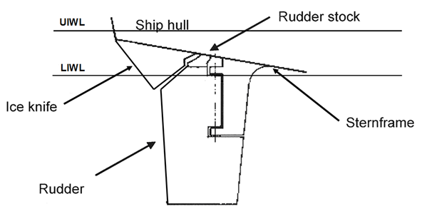
  Fig 1.7 An example of Ice Knife

### Section 5 Engine Output

#### 501. Definition of engine output (2018)

The engine output $P$ is the total maximum output the propulsion machinery can continuously deliver to the propeller(s). If the output of the machinery is restricted by technical means or by any regulations applicable to the ship, $P$ shall be taken as the restricted output. If additional power sources are available for propulsion power (e.g. shaft motors), in addition to the power of the main engine(s), they shall also be included in the total engine output.

#### 502. Required engine output for Ice classes IA Super, IA, IB, IC and ID

The engine output shall not be less than that determined by the formula below and in no case less than 1,000 kW for Ice class IA, IB, IC and ID, and not less than 2800 kW for IA Super.

- **1.** **Definitions**
  The dimensions of the ship and some other parameters are defined below:
  $L$ = length of the ship between the perpendiculars (m)
  $L _{BOW}$ = length of the bow (m)
  $L _{PAR}$ = length of the parallel midship body (m)
  $B$ = maximum breadth of the ship (m)
  $T$ = actual Ice class draughts of the ship according to **202. 2** (m)
  $A _{wf}$ = area of the waterline of the bow (m^2)
  $\alpha$ = the angle of the waterline at B/4 (deg)
  $\phi _{1}$ = degree the rake of the stem at the centerline (deg)
  $\phi _{2}$ = degree the rake of the bow at B/4 (deg)
  $D _{p}$ = diameter of the propeller (m)
  $H _{M}$ = thickness of the brash ice in mid channel (m)
  $H_F$ = thickness of the brash ice layer displaced by the bow (m)
  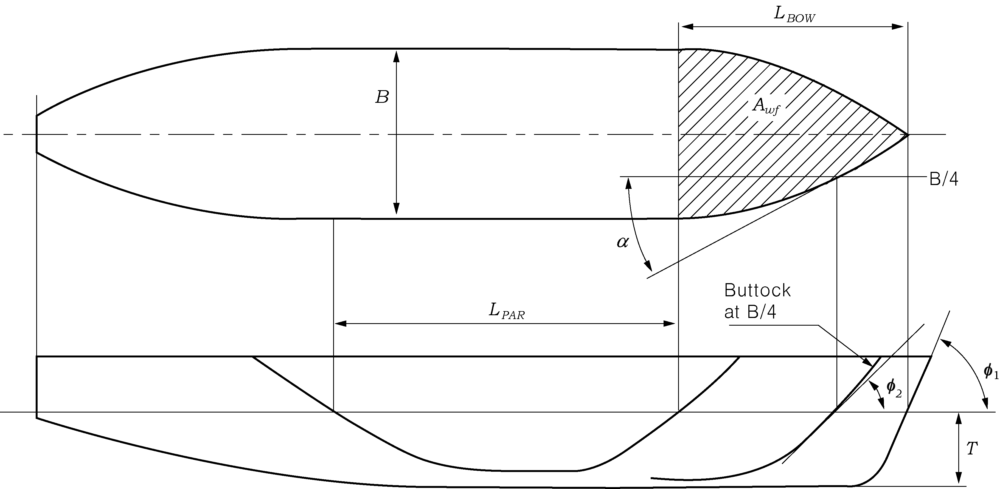
  Fig 1.8 Determination of the geometric quantities of the hull. If the ship has a bulbous bow, then #eqnID-207 = 90°.
- **2.** **New ships**
  To be entitled to Ice class IA Super, IA, IB, IC or ID a ship the keel of which is laid or which is at a similar stage of construction on or after 1 September 2003 is to comply with the following requirements regarding its engine output. The engine output requirement is to be calculated for two draughts. Draughts to be used are the maximum draught amidship referred to as UIWL and the minimum draught referred to as LIWL, as defined in **202.** In the calculations the ship's parameters which depend on the draught are to be determined at the appropriate draught, but L and B are to be determined only at the UIWL. The engine output is not to be less than the greater of these two outputs.
  $P =K _{e} \frac{(R _{CH} /1000) ^{3/2}}{D _{P}}$ [kW],
  where $K_e$ : as given in **Table 1.10**

  **Table 1.10 Values of constant** $K_e$

  | Number of Propeller | CP or electric or hydraulic propulsion machinery | FP propeller |
  | --- | --- | --- |
  | 1 propeller | 2.03 | 2.26 |
  | 2 propellers | 1.44 | 1.60 |
  | 3 propellers | 1.18 | 1.31 |

  These $K_e$ values apply for conventional propulsion systems. Other methods may be used for determining the required power for advanced propulsion systems (see **Par 5**).
  RCH is the resistance in Newton of the ship in a channel with brash ice and a consolidated surface layer:
  $R _{CH} = C _{1} +C _{2} +C _{3} C _{\mu } (H _{F} +H _{M} ) ^{2} (B+C _{\psi } H _{F} )+C _{4} L _{PAR} H _{F} ^{2} +C _{5} \left( \frac{LT}{B ^{2}} \right) ^{3} \frac{A _{wf}}{L}$
  where
  $C _{\mu } =0.15\cos \phi _{2} +\sin \psi \sin \alpha$, $C _{\mu }$ is to be taken equal or larger than 0.45.
  $C _{\psi } = 0.047 \psi -2.115$, and $C _{\psi }$ = 0 if $\psi \leq 45$.
  $H _{F} =0.26+(H _{M} B) ^{0.5}$
  $H _{M}$ = 1.0 for Ice class IA and IA Super
  = 0.8 for Ice class IB
  = 0.6 for Ice class IC
  = 0.5 for Ice class ID
  $C _{1}$ and $C _{2}$ = coefficients obtained by taking into account a consolidated upper layer of the brash ice
  For ships of Ice classes IA, IB, IC and ID : $C _{1} =0$, $C _2 = 0$
  For ships of Ice classes IA Super
  $C_1 = f_1 BL_PAR /(2T/B+1) +(1+0.021 \phi_1 ) (f_2 B +f_3 L_BOW +f_4 BL _BOW )$
  $C _{2} =(1+0.063 \phi _{1} )(g _{1} +g _{2} B)+g _{3} (1+1.2T/B)B ^{2} / \sqrt {L}$
  For a ship with a bulbous bow, $\phi _{1}$ is to be taken as 90°.
  $f_1, f_2, f_3, f_4, g_1, g_2, g_3, C_3, C_4 and C_5$ = values given in **Table 1.11**
  $\psi$ = $arctan (\tan \phi_2 / \sin \alpha )$
  $\left( \frac{LT}{B ^{2}} \right) ^{3}$ is not to be taken as less than 5 and not to be taken as more than 20.
  Further information on the validity of the above formulas can be found in **Annex I** together with sample data for the verification of powering calculations. If the ship’s parameter values are beyond the ranges defined in **Table 1.1 of Annex I**, other methods for determining $R _{CH}$ shall be used as defined in **Par 5.**

  **Table 1.11** $f _{1,} f _{2,} f _{3,} f _{4,} g _{1,} g _{2,} g _{3,} C _{3,} C _{4} and C _{5}$

  | $f_1$($\mathrm{N}/m ^{ 2}$) | 23 | $g_1$($\mathrm{N}$) | 1530 | $C_3$(kg/($\mathrm{m} ^{2} s ^{2}$)) | 845 |
  | --- | --- | --- | --- | --- | --- |
  | $f_2$($\mathrm{N}/m$) | 45.8 | $g_2$($\mathrm{N}/m$) | 170 | $C _{4}$(kg/($\mathrm{m} ^{2} s ^{2}$)) | 42 |
  | $f_3$($\mathrm{N}/m$) | 14.7 | $g_3$($\mathrm{N}/m ^{1.5}$) | 400 | $C _{5}$(kg/$\mathrm{s}^{ 2}$) | 825 |
  | $f_4$($\mathrm{N}/m ^{ 2}$) | 29 |   |   |   |   |
- **3.** **Existing ships of Ice class IB or IC**
  To be entitled to retain Ice class IB or IC a ship, the keel of which has been laid or which has been at a similar stage of construction before 1 September 2003, is to comply with the following requirements regarding its engine output. The engine output is not to be less than that determined by the formula below and in no case less than 740 kW.
  $P = f _{1} \cdot f _{2} \cdot f _{3} (f _{4} \Delta +P _{0} )$ [kW]
  where
  $f _{1} = 1.0$ for a fixed pitch propeller
  $= 0.9$ for a controllable pitch propeller
  $f _{2} = \phi _{1} /200 + 0.675$ but not more than 1.1 and 1.1 for a bulbous bow
  where,
  $\phi _{1}$is the rake of the stem at the centerline [degrees] (see **Fig 1.8**)
  The product $f _{1}$X$f _{2}$ shall not be taken as less than 0.85.
  $f _{3} = 1.2B/ \Delta ^{1/3}$but not less than 1.0
  $f _{4}$ and $P _{0}$ shall be taken as follows:

  | Ice class | IB | IC | IB | IC |
  | --- | --- | --- | --- | --- |
  | Displacement | $\Delta$ < 30000 |   | $\Delta$ ≥ 30000 |   |
  | $f _{4}$ | 0.22 | 0.18 | 0.13 | 0.11 |
  | $P _{0}$ | 370 | 0 | 3070 | 2100 |
  | NOTE: $\Delta$ is displacement [t] of the ship on the maximum Ice class draught according to **202. 1.** It need not be taken as greater than 80,000 t. |   |   |   |   |
- **4.** **Existing ships of Ice class IA Super or IA**
  To be entitled to retain Ice class IA Super or IA a ship, the keel of which has been laid or which has been at a similar stage of construction before 1 September 2003, shall comply with the requirements in **Par 2** above at the following dates:
  - 1 January 2005 or
  - 1 January in the year when 20 years has elapsed since the year the ship was delivered, whichever occurs the latest.
  When, for an existing ship, values for some of the hull form parameters required for the calculation method in section **Par 2** are difficult to obtain, the following alternative formulae can be used:
  $R _{CH} = C _{1} +C _{2} +C _{3} (H _{F} +H _{M} ) ^{2} (B+0.658H _{F} )+C _{4} LH _{F} ^{2} +C _{5} \left( \frac{LT}{B ^{2}} \right) ^{3} \frac{B}{4}$
  Where,
  For ships of Ice classes IA, $C _{1} = 0, C _{2} = 0$
  For ships of Ice classes IA Super without a bulbous bow, $C _{1} and C _{2}$ is to be calculated as follows;
  $C _{1} =f _{1} \frac{BL}{(2T/B+1)} +1.84(f _{2} B+f _{3} L+f _{4} BL)$
  $C _{2} =3.52(g _{1} +g _{2} B)+g _{3} \left( 1+1.2 \frac{T}{B} \right) \frac{B ^{2}}{\sqrt {L}}$
  For ships of Ice classes IA Super with a bulbous bow, $C _{1} and C _{2}$ is to be calculated as follows;
  $C_{ 1 } =f_{ 1 } BL over (2T/B+1) + 2.89(f_{ 2 } B+f_{ 3 } L+f_{ 4 } BL)$
  $C_{ 2 } = 6.67(g_{ 1 } +g_{ 2 } B)+g_{ 3 } \left(1+ 1.2 \frac{T}{B} \right) B^\frac{2}{\sqrt} { L }$
  $f_1, f_2, f_3, f_4, g_1, g_2, g_3, C_3, C_4 and C_5$ = values given in **Table 1.13**
  $\left( \frac{LT}{B ^{2}} \right) ^{3}$ is not to be taken as less than 5 and not to be taken as more than 20.

  **Table 1.13 Values of** $f _{1,} f _{2,} f _{3,} f _{4,} g _{1,} g _{2,} g _{3,} C _{3,} C _{4}$ **and** $C _{5}$

  | $f_1$ ($\mathrm{N}/m ^{ 2}$) | 10.3 | $g_1$ ($\mathrm{N}$) | 1530 | $C_3$ (kg/($\mathrm{m} ^{2} s ^{2}$)) | 460 |
  | --- | --- | --- | --- | --- | --- |
  | $f_2$ ($\mathrm{N}/m$) | 45.8 | $g_2$ ($\mathrm{N}/m$) | 172 | $C _{4}$ (kg/($\mathrm{m} ^{2} s ^{2}$)) | 18.7 |
  | $f_3$ ($\mathrm{N}/m$) | 2.94 | $g_3$ ($\mathrm{N}/m ^{1.5}$) | 400 | $C _{5}$ (kg/$\mathrm{s}^{ 2}$) | 825 |
  | $f_4$ ($\mathrm{N}/m ^{ 2}$) | 5.8 |   |   |   |   |
- **5.** **Other methods of determining** $K _{e}$ **or** $R _{CH}$
  For an individual ship, in lieu of the $K _{e}$ or $R _{CH}$ values defined in **Par 2** and **3**, the use of $K _{e}$ or $R _{CH}$ values based on more exact calculations or values based on model tests may be approved. Such an approval will be given on the understanding that it can be revoked if experience of the ship’s performance in practice motivates this.
  The design requirement for Ice classes is a minimum speed of 5 knots in the following brash ice channels:
  IA Super $H _{M}$ = 1.0 m and a 0.1 m thick consolidated layer of ice
  IA = 1.0 m
  IB = 0.8 m
  IC = 0.6 m
  ID = 0.5 m

### Section 6 Propulsion Machinery (2018)

#### 601. Application

- **1.** The requirements in this Section apply to propulsion machinery covering open-and ducted-type propellers with controllable pitch or fixed pitch design for the Ice classes IA Super, IA, IB, IC and ID.
- **2.** The given propeller loads are the expected ice loads for the whole ship’s service life under normal operational conditions, including loads resulting from the changing rotational direction of FP propellers. However, these loads do not cover off-design operational conditions, for example when a stopped propeller is dragged through ice. Also, the load models in the strength calculation of this Section do not include propeller/ice interaction loads when ice enters the propeller of a turned azimuth thruster from the side (radially).
- **3.** This requirements also apply to azimuth and fixed thrusters for main propulsion, considering loads resulting from propeller-ice interaction and loads on the thruster body/ice interaction. The given azimuthing thruster body loads are the expected ice loads for the ship’s service life under normal operational conditions. The local strength of the thruster body shall be sufficient to withstand the local ice pressure when the thruster body is designed for the extreme loads.
- **4.** The thruster global vibrations caused by blade order excitation at the propeller may cause significant vibratory loads. A simplified methodology to estimate the load amplitude is given in **10.4** of the **Guidelines for the Application of the Finnish-Swedish Ice Class Rules**.

#### 602. Symbols

$c$ = chord length of blade section (m)
$c _{0.7}$ = chord length of blade section at 0.7R propeller radius (m)
CP = controllable pitch
$D$ = propeller diameter (m)
$d$ = external diameter of propeller hub (at propeller plane) (m)
$D _{limit}$ = limit value for propeller diameter (m)
$EAR$ = expanded blade area ratio
$F _{b}$ = maximum backward blade force for the ship’s service life (kN)
$F _{ex}$ = ultimate blade load resulting from blade loss through plastic bending (kN)
$F _{f}$ = maximum forward blade force for the ship’s service life (kN)
$F _{ice}$ = ice load (kN)
$(F _{ice} ) _{\max}$= maximum ice load for the ship’s service life (kN)
FP = fixed pitch
$h _{0}$ = depth of the propeller centerline from lower ice waterline (m)
$H _{ice}$ = thickness of maximum design ice block entering to propeller (m)
$I _{s}$ = equivalent mass moment of inertia of all parts on engine side of component under consideration (kgm^2)
$I _{t}$ = equivalent mass moment of inertia of the whole propulsion system (kgm^2)
$k$ = shape parameter for Weibull distribution
LIWL = lower ice waterline (m)
$m$ = slope for S-N curve in log/log scale
$M _{BL}$ = blade bending moment (kNㆍm)
$MCR$ = maximum continuous rating
$n$ = propeller rotational speed (rev./s)
$n _{n}$ = nominal propeller rotational speed at $MCR$ in free running condition (rev./s)
$N _{class}$ = reference number of impacts per propeller rotational speed per ice class
$N _{ice}$ = total number of ice loads on propeller blade for the ship’s service life
$N _{R}$ = reference number of load for equivalent fatigue stress (10^8 cycles)
$N _{Q}$ = number of propeller revolutions during a milling sequence
$P _{0.7}$ = propeller pitch at 0.7R radius (m)
$P _{0.7n}$ = propeller pitch at 0.7R radius at $MCR$ in free running condition (m)
$P _{0.7b}$ = propeller pitch at 0.7R radius at $MCR$ in bollard condition (m)
$Q$ = Torque (kNㆍm)
$Q _{emax}$ = maximum engine torque (kNㆍm)
$Q _{\max}$ = maximum torque on the propeller resulting from propeller-ice inter action (kNㆍm)
$Q _{ motor}$ = electric motor peak torque (kNㆍm)
$Q _{n}$ = nominal torque at $MCR$ in free running condition (kNㆍm)
$Q _{r}$ = response torque along the propeller shaft line (kNㆍm)
$Q _{peak}$ = maximum of the response torque $Q _{r}$ (kNㆍm)
$Q _{smax}$ = maximum spindle torque of the blade for the ship’s service life (kNㆍm)
$Q _{sex}$ = maximum spindle torque due to blade failure by plastic bending (kNㆍm)
$Q _{vib}$ = Vibratory torque at considered component, taken from frequency domain open water TVC (kNㆍm)
$R$ = propeller radius (m)
$r$ = blade section radius (m)
$T$ = propeller thrust (kN)
$T _{b}$ = maximum backward propeller ice thrust for the ship’s service life (kN)
$T _{f}$ = maximum forward propeller ice thrust for the ship’s service life (kN)
$T _{n}$ = propeller thrust at $MCR$ in free running condition (kN)
$T _{r}$ = maximum response thrust along the shaft line (kN)
$t$ = maximum blade section thickness (m)
$Z$ = number of propeller blades
$\alpha _{i}$ = duration of propeller blade/ice interaction expressed in rotation angle (deg)
$\alpha _{1}$ = phase angle of propeller ice torque for blade order excitation component (deg)
$\alpha _{2}$ = phase angle of propeller ice torque for twice the blade order excitation com ponent (deg)
$\gamma _{\varepsilon 1}$ = the reduction factor for fatigue; scatter effect
$\gamma _{\varepsilon 2}$ = the reduction factor for fatigue; test specimen size effect
$\gamma _{\nu }$ = the reduction factor for fatigue; variable amplitude loading effect
$\gamma _{\nu }$ = the reduction factor for fatigue; variable amplitude loading effect
$\gamma _{m}$ = the reduction factor for fatigue; mean stress effect
$\rho$ = a reduction factor for fatigue correlating the maximum stress amplitude to the equivalent fatigue stress for 10^8 stress cycles
$\sigma _{0.2}$ = proof yield strength (at 0.2% offset) of blade material (MPa)
$\sigma _{\exp}$ = mean fatigue strength of blade material at 10^8 cycles to failure in sea water (MPa)
$\sigma _{fat}$ = equivalent fatigue ice load stress amplitude for 10^8 stress cycles (MPa)
$\sigma _{fl}$ = characteristic fatigue strength for blade material (MPa)
$\sigma _{ref1}$ = reference strength $\sigma _{ref1} =0.6 \cdot \sigma _{0.2} +0.4 \cdot \sigma _{u}$ (MPa)
$\sigma _{ref2}$ = reference strength (MPa)
$\sigma _{ref2} = 0.7 \cdot \sigma _{u}$ or $\sigma _{ref2} = 0.6 \cdot \sigma _{0.2} + 0.4 \cdot \sigma _{u}$ whichever is less
$\sigma _{st}$ = maximum stress resulting from $F _{b}$ or $F _{f}$ (MPa)
$\sigma _{u}$ = ultimate tensile strength of blade material (MPa)
$(\sigma _{ice} ) _{bmax}$= principal stress caused by the maximum backward propeller ice load (MPa)
$( \sigma _{ice} ) _{fmax}$= principal stress caused by the maximum forward propeller ice load (MPa)
$( \sigma _{ice} ) _{\max}$ = maximum ice load stress amplitude (MPa)

|   | Definition | Use of the load in design process |
| --- | --- | --- |
| $F _{b}$ | The maximum backward force on a propeller blade resulting from propeller/ice interaction for the ship’s service life, including hydrodynamic loads on that blade. The direction of the force is perpendicular to 0.7R chord line. See **Fig 1.9.** | Design force for strength calculation of the propeller blade. |
| $F _{f}$ | The maximum forward force on a propeller blade resulting from propeller/ice interaction for the ship’s service life, including hydrodynamic loads on that blade. The direction of the force is perpendicular to 0.7R chord line. | Design force for calculation of strength of the propeller blade. |
| $Q _{smax}$ | The maximum spindle torque on a propeller blade resulting from propeller/ice interaction for the ship’s service life, including hydrodynamic loads on that blade. | In designing the propeller strength, the spindle torque is automatically taken into account because the propeller load is acting on the blade as distributed pressure on the leading edge or tip area. |
| $T _{b}$ | The maximum thrust on propeller (all blades) resulting from propeller/ice interaction for the ship’s service life. The direction of the thrust is the propeller shaft direction and the force is opposite to the hydrodynamic thrust. | Is used for estimation of the response thrust $T _{r}$. $T _{b}$ can be used as an estimate of excitation for axial vibration calculations. However, axial vibration calculations are not required in the rules. |
| $T _{f}$ | The maximum thrust on propeller (all blades) resulting from propeller/ice interaction for the ship’s service life. The direction of the thrust is the propeller shaft direction acting in the direction of hydrodynamic thrust. | Is used for estimation of the response thrust $T _{r}$.$T _{f}$ can be used as an estimate of excitation for axial vibration calculations. However, axial vibration calculations are not required in the rules. |
| $Q _{\max}$ | The maximum ice-induced torque resulting from propeller/ice interaction on one propeller blade, including hydrodynamic loads on that blade. | Is used for estimation of the response torque ($Q _{r}$) along the propulsion shaft line and as excitation for torsional vibration calculations. |
| $F _{ex}$ | Ultimate blade load resulting from blade loss through plastic bending. The force that is needed to cause total failure of the blade so that plastic hinge is caused to the root area. The force is acting on 0.8R. Spindle arm is to be taken as 2/3 of the distance between the axis of blade rotation and leading/trailing edge (whichever is he greater) at the 0.8R radius. | Blade failure load is used to dimension the blade bolts, pitch control mechanism, propeller shaft, propeller shaft bearing and trust bearing. The objective is to guarantee that total propeller blade failure should not cause damage to other components. |
| $Q _{peak}$ | Maximum response torque along the propeller shaft line, taking into account the dynamic behavior of the shaft line for ice excitation (torsional vibration) and hydrodynamic mean torque on propeller. | Design torque for propeller shaft line components. |
| $T _{r}$ | Maximum response thrust along shaft line, taking into account the dynamic behavior of the shaft line for ice excitation (axial vibration) and hydrodynamic mean thrust on propeller. | Design thrust for propeller shaft line components. |
| $F _{ti}$ | Maximum response force caused by ice block impacts on the thruster body or on the propeller hub. | Design load for thruster body and slewing bearings. |
| $F _{tr}$ | Maximum response force on the thruster body caused by ice ridge/thruster body interaction. | Design load for thruster body and slewing bearings. |

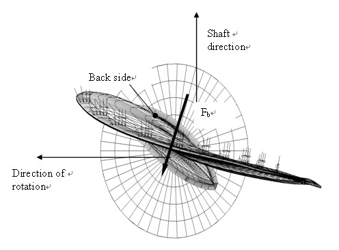
**Fig 1.9 Direction of the backward blade force resultant taken perpendicular to chord line at radius 0.7R. (Ice contact pressure at leading edge is shown with small arrows)**

#### 603. Design ice conditions

In estimating the ice loads of the propeller for Ice classes, different types of operation as given in **Table 1.15** were taken into account. For the estimation of design ice loads, a maximum ice block size is determined. The maximum design ice block entering the propeller is a rectangular ice block with the dimensions $H _{ice} \cdot 2H _{ice} \cdot 3H _{ice}$. The thickness of the ice block ($H _{ice}$) is given in **Table 1.16**.

| Ice class | Operation of the ship |
| --- | --- |
| IA Super | Operation in ice channels and in level ice. The ship may proceed by ramming |
| IA, IB, IC, ID | Operation in ice channels |

| Ice class | IA Super | IA | IB | IC |
| --- | --- | --- | --- | --- |
| Thickness of the design maximum ice block entering the propeller ($H _{ice}$) | 1.75 m | 1.5 m | 1.2 m | 1.0 m |

#### 604. Materials

- **1.** **Materials exposed to sea water**
  Materials of components exposed to sea water, such as propeller blades, propeller hubs, and thruster body, are to have an elongation of not less than 15 % on a test specimen, the gauge length of which is five times the diameter. A Charpy V impact test is to be carried out for materials other than bronze and austenite steel. An average impact energy value of 20 J taken from three tests is to be obtained at minus 10 ºC. For nodular cast iron the average impact energy of 10 J at minus 10 ºC is required accordingly.
- **2.** **Materials exposed to sea water temperature**
  Materials exposed to sea water temperature are to be of steel or other ductile material. An average impact energy value of 20 J taken from three tests is to be obtained at minus 10 ºC. This requirement applies to propeller shafts, blade bolts, CP mechanisms, shaft bolts, strut-pod connecting bolts etc. This does not apply to surface hardened components, such as bearings and gear teeth. Nodular cast iron of ferrite structure type may be used for other relevant parts than bolts. Average impact energy for nodular cast iron is to be minimum 10 J at minus 10 ºC.

#### 605. Design loads

- **1.** The given loads are intended for component strength calculations only and are total loads including ice-induced loads and hydrodynamic loads during propeller/ice interaction. The presented maximum loads are based on worst case scenario that occurs once during the service life of the ship. Thus, load level for higher number of loads is lower.
- **2.** The values of the parameters in the formulae in this Section is to be given in the units shown in **602.**
- **3.** If the propeller is not fully submerged when the ship is in ballast condition, the propulsion system is to be designed according to Ice class IA for Ice classes IB, IC and ID.
- **4.** **Design loads on propeller blades**
  $F _{b}$ is the maximum force experienced during the ship’s service life that bends a propeller blade backwards when the propeller mills an ice block while rotating ahead. $F _{f}$ is the maximum force experienced during the ship’s service life that bends a propeller blade forwards when the propeller mills an ice block while rotating ahead. $F _{b}$ and $F _{f}$ originate from different propeller/ice interaction phenomena, not acting simultaneously. Hence they are to be applied to one blade separately.
  - **(1)** Maximum backward blade force $F _{b}$ for open propellers
    when $D \leq D _{\lim _{} {}} it$, $F _{b} = -27 \cdot \left[ n \cdot D \right] ^{0.7} \cdot \left[ \frac{EAR}{Z} \right] ^{0.3} \cdot D ^{2}$ (kN)
    when $D>D _{\lim _{} {}} it$, $F _{b} = -23 \cdot \left[ n \cdot D \right] ^{0.7} \cdot \left[ \frac{EAR}{Z} \right] ^{0.3} \cdot D \cdot H _{ice} ^{{} ^{1.4}}$ (kN)
    where,
    $D _{\lim _{} {}} it =0.85 \cdot \left[ H _{ice} \right] ^{1.4}$ (m)
    $n$ is the nominal rotational speed (at $MCR$ free running condition) for a CP propeller and 85 % of the nominal rotational speed (at $MCR$ free running condition) for a FP propeller.
  - **(2)** Maximum forward blade force $F _{f}$ for open propellers
    when $D \leq D _{\lim _{} {}} it$, $F _{f} =250 \cdot \left[ \frac{EAR}{Z} \right] \cdot D ^{2}$ (kN)
    when $D>D _{\lim _{} {}} it$, $F _{f} =500 \cdot \left[ \frac{1}{(1- \frac{d}{D} )} \right] \cdot H _{ice} \cdot \left[ \frac{EAR}{Z} \right] \cdot D$ (kN)
    where,
    $D _{\lim _{} {}} it = \left[ \frac{2}{(1- \frac{d}{D} )} \right] \cdot H _{ice}$ (m).
  - **(3)** Loaded area on the blade for open propellers
    Load cases 1-4 have to be covered, as given in **Table 2.1 of Annex 2**, for CP and FP propellers. In order to obtain blade ice loads for a reversing propeller, load case 5 also has to be covered for FP propellers.
  - **(4)** Maximum backward blade force $F _{b}$ for ducted propellers
    when $D \leq D _{\lim _{} {}} it$, $F _{b} = -9.5 \cdot \left[ \frac{EAR}{Z} \right] ^{0.3} \cdot \left[ n \cdot D \right] ^{0.7} \cdot D ^{2}$ (kN)
    when $D>D _{\lim _{} {}} it$, $F _{b} = -66 \cdot \left[ \frac{EAR}{Z} \right] ^{0.3} \cdot \left[ n \cdot D \right] ^{0.7} \cdot D ^{0.6} \cdot \left[ H _{ice} \right] ^{1.4}$ (kN)
    where,
    $D _{\lim _{} {}} it =4 \cdot H _{ice}$
    $n$ is the nominal rotational speed (at MCR in free running condition) for a CP propeller and 85 % of the nominal rotational speed (at MCR in free running condition) for an FP propeller
  - **(5)** Maximum forward blade force $F _{f}$ for ducted propellers
    when $D \leq D _{\lim _{} {}} it$, $F _{f} =250 \cdot \left[ \frac{EAR}{Z} \right] \cdot D ^{2}$ (kN)
    when $D>D _{\lim _{} {}} it$, $F _{f} =500 \cdot \left[ \frac{EAR}{Z} \right] \cdot D \cdot \frac{1}{\left[ 1- \frac{d}{D} \right]} \cdot H _{ice}$ (kN)
    where,
    $D _{\lim _{} {}} it = \frac{2}{\left[ 1- \frac{d}{D} \right]} \cdot H _{ice}$ (m)
  - **(6)** Loaded area on the blade for ducted propellers
    Load cases 1 and 3 have to be covered as given in **Table 2.2 of Annex 2** for all propellers, and an additional load case (load case 5) for an FP propeller, to cover ice loads when the propeller is reversed.
  - **(7)** Maximum blade spindle torque $Q _{smax}$ for open or ducted propellers
    The spindle torque $Q _{smax}$ around the axis of the blade fitting is to be determined both for the maximum backward blade force $F _{b}$ and forward blade force $F _{f}$, which are applied as in **Table 2.1** and **2.2 of Annex 2**. The larger of the obtained torques is used as the dimensioning torque. If the above method gives a value which is less than the default value given by the formula below, the default value is to be used.
    Default Value $Q _{smax} =0.25ㆍFㆍc _{0.7}$ (kNㆍm)
    where,
     is the chord length of the blade section at 0.7R radius and $F _{}$ is either $F _{b}$ or $F _{f}$, whichever has the greater absolute value.
  - **(8)** Load distributions for blade loads
    The Weibull-type distribution (probability that $F_{ ice}$ exceeds $(F _{ice} ) _{\max}$), as given in **Fig 1.10**, is used for the fatigue design of the blade.
    $P \left( \frac{F _{ice}}{\left( F _{ice} \right) _{\max}} \geq \frac{F}{\left( F _{ice} \right) _{\max}} \right) =e ^{\left( - \left( \frac{F}{\left( F _{ice} \right) _{\max}} \right) ^{k} \cdot \ln \left( N _{ice} \right) \right)}$
    where $k$ is the shape parameter of the spectrum, $N _{ice}$ is the number of load cycles in the spectrum, and $F_{ ice}$ is the random variable for ice loads on the blade, $0 \leq F _{ice} \leq (F _{ice} ) _{\max}$. The shape parameter $k$ = 0.75 is to be used for the ice force distribution of an open propeller blade and the shape parameter $k$ = 1.0 for that of a ducted propeller blade.
    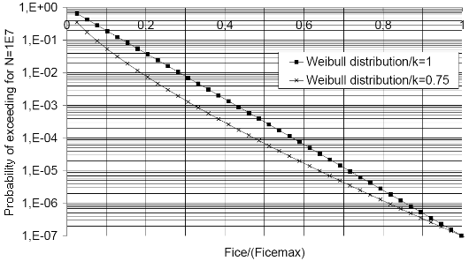
    **Fig 1.10 The Weibull-type distribution (probability that (F_ice exceeds (F_ice)_max)**
    **that is used for fatigue design.**
  - **(9)** Number of ice loads
    The number of load cycles per propeller blade in the load spectrum is to be determined according to the formula:
    $N _{ice} =k _{1} \cdot k _{2} \cdot k _{3} \cdot N _{class} n$,
    where,
    Reference number of loads for Ice classes $N _{class}$

    | Class | IA Super | IA | IB | IC |
    | --- | --- | --- | --- | --- |
    | impacts for the ship’s service life /$n$ | $9 \cdot 10 ^{6}$ | $6 \cdot 10 ^{6}$ | $3.4 \cdot 10 ^{6}$ | $2.1 \cdot 10 ^{6}$ |

    Propeller location factor $k _{1}$

    | Location | Center propeller Bow first operation | Wing propeller Bow first operation | Pulling propeller (wing and center) Bow propeller or Stern first operation |
    | --- | --- | --- | --- |
    | $k _{1}$ | 1 | 2 | 3 |

    The submersion factor $k _{2}$ is determined from the equation
    $k _{2} =0.8-f$ when $f <0$
    $=0.8-0.4 \cdot f$ when $0 \leq f \leq 1$
    $=0.6-0.2 \cdot f$ when $1 \(=0.1$ when $f >2.5$
    where the immersion function$f$is:
    $f= \frac{h _{0} -H _{ice}}{D/2} -1$
    where $h _{0}$is the depth of the propeller centerline at the lower ice waterline (LIWL) of the ship.
    Propulsion type factor $k _{3}$

    | type | fixed | azimuthing |
    | --- | --- | --- |
    | $k _{3}$ | 1 | 1.2 |

    For components that are subject to loads resulting from propeller/ice interaction with all the propeller blades, the number of load cycles ($N _{ice}$) is to be multiplied by the number of propeller blades ($Z$).
- **5.** **Axial design loads for propellers**
  - **(1)** Maximum ice thrust on propeller$T _{f}$and$T _{b}$for propellers
    The maximum forward and backward ice thrusts are:
    $T _{f} =1.1 \cdot F _{f}$ (kN)
    $T _{b} =1.1 \cdot F _{b}$ (kN)
  - **(2)** Design thrust along the propulsion shaft line for propellers
    The design thrust along the propeller shaft line is to be calculated with the formulae below. The greater absolute value of the forward and backward direction loads is to be taken as the design load for both directions. The factors 2.2 and 1.5 take into account the dynamic magnification resulting from axial vibration.
    In a forward direction $T _{r} =T _{} +2.2 \cdot T _{f}$ (kN)
    In a backward direction $T _{r} =1.5 \cdot T _{b}$ (kN)
    If hydrodynamic bollard thrust, $T _{}$, is not known, $T _{}$ is to be taken as follows:

    **Table 1.17 Propeller bollard thrust** $T _{}$

    | Propeller Type | $T _{}$ |
    | --- | --- |
    | CP propellers (open) | $1.25 \cdot T _{n}$ |
    | CP propellers (ducted) | $1.1 \cdot T _{n}$ |
    | FP propellers driven by turbine or electric motor | $T _{n}$ |
    | FP propellers driven by diesel engine (open) | $0.85 \cdot T _{n}$ |
    | FP propellers driven by diesel engine (ducted) | $0.75 \cdot T _{n}$ |
    | NOTE: $T _{n}$ = nominal propeller thrust at MCR at free running open water conditions |   |
- **6.** **Torsional design loads**
  - **(1)** Design ice torque on propeller$Q _{\max}$for open propellers
    $Q _{\max}$ is the maximum torque on a propeller resulting from ice/propeller interaction during the service life of the ship.
    when $D \leq D _{\lim _{} {} it}$, $Q _{\max} = 10.9 \cdot [1- \frac{d}{D} ] \cdot [ \frac{P _{0.7}}{D} ] ^{0.16} \cdot \left[ nD \right] ^{0.17} \cdot D ^{3}$ (kNㆍm)
    when$D >D _{\lim _{} {} it}$, $Q _{\max} = 20.7 \cdot [1- \frac{d}{D} ] \cdot [ \frac{P _{0.7}}{D} ] ^{0.16} \cdot \left[ nD \right] ^{0.17} \cdot D ^{1.9} \cdot H _{ice} ^{1.1}$ (kNㆍm)
    where
    $D _{\lim _{} {}} it =1.8 \cdot H _{ice}$ (m).
    $n$ is the rotational propeller speed at MCR in bollard condition. If not known, n is to be taken as follows:

    **Table 1.18 The rotational propeller speed at bollard condition value** $n$

    | Propeller type | Rotational speed $n$ |
    | --- | --- |
    | CP propellers | $n _{n}$ |
    | FP propellers driven by turbine or electric motor | $n _{n}$ |
    | FP propellers driven by diesel engine | $0.85 \cdot n _{n}$ |
    | NOTE: Here, $n _{n}$ is the nominal rotational speed at MCR in free running condition. |   |

    For CP propellers, propeller pitch, $P _{0.7}$ is to correspond to MCR in bollard condition. If not known, $P _{0.7}$ is to be taken as $0.7 \cdot P _{0.7n}$, where $P _{0.7n}$ is propeller pitch at MCR in free running condition.
  - **(2)** Design ice torque on propeller $Q _{\max}$ for ducted propellers
    $Q _{\max}$ is the maximum torque on a propeller during the service life of the ship resulting from ice/propeller interaction.
    when $D \leq D _{\lim _{} {} it}$, $Q _{\max} = 7.7 \cdot [1- \frac{d}{D} ] \cdot [ \frac{P _{0.7}}{D} ] ^{0.16} \cdot \left[ nD \right] ^{0.17} \cdot D ^{3}$ (kNㆍm)
    when$D >D _{\lim _{} {} it}$, $Q _{\max} = 14.6 \cdot [1- \frac{d}{D} ] \cdot [ \frac{P _{0.7}}{D} ] ^{0.16} \cdot \left[ nD \right] ^{0.17} \cdot D ^{1.9} \cdot H _{ice} ^{1.1}$ (kNㆍm)
    where
    $D _{\lim _{} {}} it =1.8 \cdot H _{ice}$ (m)
    $n$ is the rotational propeller speed at MCR in bollard condition. If not known, n is to be taken as follows:

    **Table 1.19 The rotational propeller speed at bollard condition value** $n$

    | Propeller type | Rotational speed $n$ |
    | --- | --- |
    | CP propellers | $n _{n}$ |
    | FP propellers driven by turbine or electric motor | $n _{n}$ |
    | FP propellers driven by diesel engine | $0.85 \cdot n _{n}$ |
    | NOTE: Here, $n _{n}$ is the nominal rotational speed at MCR in free running condition. |   |

    For CP propellers, propeller pitch, $P _{0.7}$ is to correspond to MCR in bollard condition. If not known, $P _{0.7}$ is to be taken as $0.7 \cdot P _{0.7n}$, where $P _{0.7n}$ is propeller pitch at MCR in free running condition.
  - **(3)** Design torque for non-resonant shaft line
    If there is not any relevant first blade order torsional resonance in the operational speed range or in the range 20% above and 20% below the maximum operating speed (bollard condition), the following estimation of the maximum torque can be used.
    Directly coupled two stroke diesel engines without flexible coupling:
    $Q _{r} = Q _{emax} +Q _{vib} + Q _{\max} \cdot \frac{I}{I _{t}}$ (kNㆍm)
    Other plants:
    $Q _{r} = Q _{emax} + Q _{\max} \cdot \frac{I}{I _{t}}$ (kNㆍm)
    Where,
    $I$ is equivalent mass moment of inertia of all parts on engine side of component under consideration and,
    $I _{t}$ is equivalent mass moment of inertia of the whole propulsion system
    All the torques and the inertia moments are to be reduced to the rotation speed of the component being examined. If the maximum torque, $Q _{emax}$, is not known, it is to be taken as given in **Table 1.20.**

    **Table 1.20 the maximum torque** $Q _{emax}$

    | Propeller type | $Q _{emax}$ |
    | --- | --- |
    | Propellers driven by electric motor(FP and CP) | $Q _{motor}$ |
    | CP propellers driven by prime movers other than electric motor | $Q _{n}$ |
    | FP propellers driven by turbine | $Q _{n}$ |
    | FP propellers driven by diesel engine | $0.75 \cdot Q _{n}$ |
    | NOTE: Here, $Q _{motor}$ is the electric motor peak torque. |   |
  - **(4)** Design torque for shaft line having resonances
    If there is a first blade order torsional resonance in the operational speed range or in the range 20% above and 20% below the maximum operating speed (bollard condition), the design torque $Q _{peak}$ of the shaft component is to be determined by means of torsional vibration analysis of the propulsion line. There are two alternative ways to make the dynamic analysis.
    - Time domain calculation for estimated milling sequence excitation
    - Frequency domain calculation for blade orders sinusoidal excitation
    The frequency domain analysis is generally considered as conservative compared to the time domain simulation provided there is a first blade order resonance in the considered speed range.
    Time domain calculations shall be calculated for MCR condition, MCR bollard conditions and for blade order resonant rotational speeds so that the resonant vibration responses can be obtained.
    The load sequence given in below for a case where propeller is milling an ice block shall be used for strength evaluation of the propulsion line. The given load sequence is not intended for propulsion system stalling analyses.
    The following load cases are intended to reflect the operational loads on the propulsion system, when the propeller interacts with ice, and the respective reaction of the complete system. The ice impact and system response causes loads in the individual shaft line components. The ice torque $Q _{\max}$ may be taken as a constant value in the complete speed range. When considerations at specific shaft speeds are performed a relevant $Q _{\max}$ may be calculated using the relevant speed according to (1), (2).
    Diesel engine plants without an elastic coupling shall be calculated at the least favourable phase angle for ice versus engine excitation, when calculated in the time domain. The engine firing pulses shall be included in the calculations and their standard steady state harmonics can be used.
    If there is a blade order resonance just above the MCR speed, calculations shall cover the rotational speeds up to 105 % of the MCR speed.
    The propeller ice torque excitation for shaft line transient dynamic analysis in time domain is defined as a sequence of blade impacts which are of half sine shape. The excitation frequency shall follow the propeller rotational speed during the ice interaction sequence. The torque due to a single blade ice impact as a function of the propeller rotation angle is then defined using the formula:
    when $\varphi$ rotates from 0 to $\alpha _{i}$ plus integer revolutions.
    $Q \left( \varphi \right) =C _{q \cdot } Q _{\max} \cdot \sin \left( \varphi \left( 180/ \alpha _{i} \right) \right)$
    when $\varphi$ rotates from $\alpha _{i}$ to 360 plus integer revolutions.
    $Q \left( \varphi \right) =0$
    where,
    $\varphi$ is rotation angle starting when the first impact occurs and $C _{q}$ and $\alpha _{i}$ parameters are given in **Table 1.21.**
    $\alpha _{i}$ is duration of propeller blade/ice interaction expressed in term of propeller rotation angle as following picture.

    | 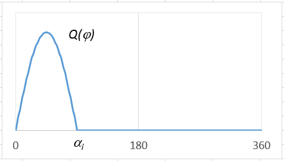 |
    | --- |
    | **Schematic ice torque due to a single blade ice impact as a function of the propeller rotation angle** |

    **Table 1.21 Ice impact magnification and duration factors for different blade numbers**

    | Torque excitation | Propeller-ice interaction | $C _{q}$ | $\alpha _{i}$[deg.] |   |   |   |
    | --- | --- | --- | --- | --- | --- | --- |
    | Torque excitation | Propeller-ice interaction | $C _{q}$ | Z=3 | Z=4 | Z=5 | Z=6 |
    | Excitation Case 1 | Single ice block | 0.75 | 90 | 90 | 72 | 60 |
    | Excitation Case 2 | Single ice block | 1.0 | 135 | 135 | 135 | 135 |
    | Excitation Case 3 | Two ice blocks (phase shift 360/2∙Z deg.) | 0.5 | 45 | 45 | 36 | 30 |
    | Excitation Case 4 | Single ice block | 0.5 | 45 | 45 | 36 | 30 |

    The total ice torque is obtained by summing the torque of single blades, taking into account the phase shift 360 deg./Z. See **Fig 2.1 of Annex 2.** At the beginning and at the end of the milling sequence (within calculated duration) linear ramp functions shall be used to increase $C _{q}$ to its maximum within one propeller revolution and vice versa to decrease it to zero.
    The number of propeller revolutions during a milling sequence is to be obtained from the formula:
    $N _{Q} =2 \cdot H _{ice}$
    The number of impacts is $Z \cdot N _{Q}$ for blade order excitation. An illustration of all excitation cases for different blade numbers is given in **Fig 2.1 of Annex 2.**
    The dynamic simulation has to be performed for all excitation cases at the operational rotational speed range. For a fixed pitch propeller propulsion plant the dynamic simulation shall also cover bollard pull condition with a corresponding rotational speed assuming maximum possible output of the engine. If a speed drop occurs down to stand still of the main engine, it indicates that the engine may not be sufficiently powered for the intended service task. For the consideration of loads, the maximum occurring torque during the speed drop process has to be taken. For the time domain calculation the simulated response torque typically include the engine mean torque and the propeller mean torque. If this is not the case, response torques is to be obtained using the following formula.
    $Q _{r} =Q _{emax} +Q _{rtd}$
    $Q _{rtd}$ is the maximum simulated torque obtained from the time domain analysis.
    For frequency domain calculations blade order and twice the blade order excitation may be used. The amplitudes for blade order and twice the blade order sinusoidal excitation have been derived based on the assumption that the time domain half sine impact sequences were continuous, and the Fourier series components for blade order and twice the blade order components have been derived. The propeller ice torque is then:
    $Q _{F} ( \varphi )=Q _{\max} \cdot (C _{q0} +C _{q1} \cdot \sin(Z \cdot E _{0} \cdot \varphi + \alpha _{1} )+C _{q2} \cdot \sin(2 \cdot Z \cdot E _{0} \cdot \varphi + \alpha _{2} ))$ (kNm)
    where,
    $C _{q0}$ is mean torque parameter
    $C _{q1}$ is first blade order excitation parameter
    $C _{q2}$ is second blade order excitation parameter
    $\alpha _{1}$, $\alpha _{2}$ are phase angles of excitation component
    $\varphi$ is angle of rotation
    $E _{0}$ is number of ice blocks in contact
    Above coefficients for frequency domain excitation calculation are to be taken as given in **Table 1.22**.
    Design torque for the frequency domain excitation case is to be obtained using the formula:
    $Q _{r} = Q _{emax} +Q _{vib} + Q _{\max} ^{n} \cdot C _{q0} +Q _{rf1} +Q _{rf2}$
    Where,
    $Q _{\max} ^{n}$ is the maximum propeller ice torque at the operation speed in consideration
    $C _{q0}$ is the mean static torque coefficient from **Table 1.22**
    $Q _{rf1}$ is the blade order torsional response from the frequency domain analysis
    $Q _{rf2}$ is the second order blade torsional response from the frequency domain analysis
    If the prime mover maximum torque, $Q _{emax}$, is not known, it shall be taken as given in **Table 1.20**. All the torque values have to be scaled to the shaft revolutions for the component in question.

    **Table 1.22** **Coefficients for frequency domain excitation calculation**

    | Torque excitation | Z=3 |   |   |   |   |   |
    | --- | --- | --- | --- | --- | --- | --- |
    |   | $C _{q0}$ | $C _{q1}$ | $\alpha _{1}$ | $C _{q2}$ | $\alpha _{2}$ | $E _{0}$ |
    | Excitation Case 1 | 0.375 | 0.36 | -90 | 0 | 0 | 1 |
    | Excitation Case 2 | 0.7 | 0.33 | -90 | 0.05 | -45 | 1 |
    | Excitation Case 3 | 0.25 | 0.25 | -90 | 0 | 0 | 2 |
    | Excitation Case 4 | 0.2 | 0.25 | 0 | 0.05 | -90 | 1 |
    |   |   |   |   |   |   |   |
    | Torque excitation | Z=4 |   |   |   |   |   |
    |   | $C _{q0}$ | $C _{q1}$ | $\alpha _{1}$ | $C _{q2}$ | $\alpha _{2}$ | $E _{0}$ |
    | Excitation Case 1 | 0.45 | 0.36 | -90 | 0.06 | -90 | 1 |
    | Excitation Case 2 | 0.9375 | 0 | -90 | 0.0625 | -90 | 1 |
    | Excitation Case 3 | 0.25 | 0.25 | -90 | 0 | 0 | 2 |
    | Excitation Case 4 | 0.2 | 0.25 | 0 | 0.05 | -90 | 1 |
    |   |   |   |   |   |   |   |
    | Torque excitation | Z=5 |   |   |   |   |   |
    |   | $C _{q0}$ | $C _{q1}$ | $\alpha _{1}$ | $C _{q2}$ | $\alpha _{2}$ | $E _{0}$ |
    | Excitation Case 1 | 0.45 | 0.36 | -90 | 0.06 | -90 | 1 |
    | Excitation Case 2 | 1.19 | 0.17 | -90 | 0.02 | -90 | 1 |
    | Excitation Case 3 | 0.3 | 0.25 | -90 | 0.048 | -90 | 2 |
    | Excitation Case 4 | 0.2 | 0.25 | 0 | 0.05 | -90 | 1 |
    |   |   |   |   |   |   |   |
    | Torque excitation | Z=6 |   |   |   |   |   |
    |   | $C _{q0}$ | $C _{q1}$ | $\alpha _{1}$ | $C _{q2}$ | $\alpha _{2}$ | $E _{0}$ |
    | Excitation Case 1 | 0.45 | 0.36 | -90 | 0.05 | -90 | 1 |
    | Excitation Case 2 | 1.435 | 0.1 | -90 | 0 | 0 | 1 |
    | Excitation Case 3 | 0.3 | 0.25 | -90 | 0.048 | -90 | 2 |
    | Excitation Case 4 | 0.2 | 0.25 | 0 | 0.05 | -90 | 1 |

    The aim of time domain torsional vibration simulations is to estimate the extreme torsional load for ship’s lifespan. The simulation model can be taken from the normal lumped mass elastic torsional vibration model including damping. For time domain analysis the model should include the ice excitation at propeller, other relevant excitations and the mean torques provided by the prime mover and hydrodynamic mean torque in the propeller. The calculations should cover variation of phase between the ice excitation and prime mover excitation. This is extremely relevant to propulsion lines with direct driven combustion engines. Time domain calculations shall be calculated for MCR condition, MCR bollard conditions and for resonant speed so that the resonant vibration responses can be obtained.
    For frequency domain calculations the load should be estimated as Fourier component analysis of the continuous sequence of half sine load sequences. The first and second order blade components should be used for excitation. The calculation should cover the whole relevant rpm range and simulation of responses at the torsional vibration resonances.
    - **(A)** Time domain calculation of torsional response
    - **(B)** Frequency domain calculation of torsional response
    - **(C)** Guidance for torsional vibration calculation
- **7.** **Blade failure load**
  - **(1)** Bending force, $F _{ex}$
    The ultimate load resulting from blade failure as a result of plastic bending around the blade root is to be calculated by the formula below or alternatively by means of an appropriate stress analysis, reflecting the non-linear plastic material behaviour of the actual blade. In such a case, the blade failure area may be outside the root section. The ultimate load is assumed to be acting on the blade at the 0.8$R$ radius in the weakest direction of the blade. A alternative methodology for estimation of the blade failure loads and spindle torque is given in **10.1** of the **Guidelines for the Application of the Finnish-Swedish Ice Class Rules**.
    A blade is regarded as having failed, if the tip is bent to an offset by more than 10% of propeller diameter D.
    $F _{ex} = \frac{300ㆍcㆍt ^{2} ㆍ \sigma _{ref1}}{0.8ㆍD-2ㆍr}$ (kN)
    where,
    $\sigma _{ref1} =0.6 \cdot \sigma _{0.2} +0.4 \cdot \sigma _{u}$ (MPa)
    $c$, $t$, and $r$ are respectively the actual chord length, maximum thickness and radius of the cylindrical root section of the blade, which is the weakest section outside the root fillet typically located at the point where the fillet terminates at the blade profile. (see **Fig 1.11**).
  - **(2)** Spindle Torque, $Q _{sex}$
    The maximum spindle torque due to a blade failure load acting at 0.8$R$ shall be determined. The force that causes blade failure typically reduces when moving from the propeller centre towards the leading and trailing edges. At a certain distance from the blade centre of rotation the maximum spindle torque will occur. This maximum spindle torque shall be calculated by an appropriate stress analysis or using the equation given below.
    $Q _{sex} =\max(C _{L E 0.8} ;0.8 \cdot C _{TE 0.8} ) \cdot C _{spex} \cdot F _{ex}$ (kNㆍm)
    where,
    $C _{spex} =C _{sp} \cdot C _{fex} =0.7 \cdot (1-(4 \cdot \frac{EAR}{Z} ) ^{3} )$
    $C _{sp}$ is non-dimensional parameter taking into account the spindle.
    $C _{fex}$ is non-dimensional parameter taking into account the reduction of blade failure force at the location of maximum spindle torque.
    If $C _{spex}$ is below 0.3, a value of 0.3 shall to be used for $C _{spex}$.
    $C _{L E 0.8}$ is the leading edge portion of the chord length at 0.8$R$.
    $C _{TE 0.8}$ is the trailing edge portion of the chord length at 0.8$R$.
    **Fig 1.12** below illustrates the spindle torque values due to blade failure loads across the entire chord length.

    | 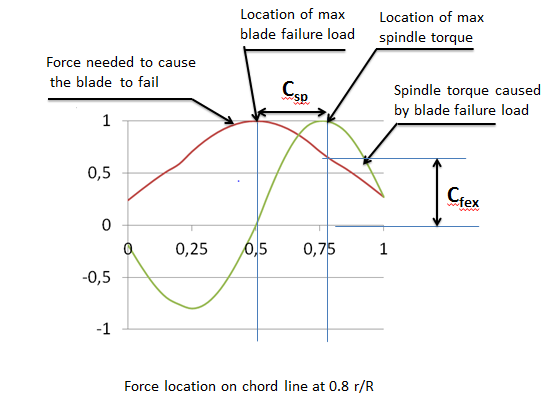 |
    | --- |
    | **Fig 1.12 Schematic figure showing a blade failure load and related spindle torque when the force acts at different location on the chord line at radius 0.8 R** |

#### 606. Design

- **1.** **Design principle**
  The strength of the propulsion line is to be designed according to the pyramid strength principle. This means that the loss of the propeller blade shall not cause any significant damage to other propeller shaft line components.
- **2.** **Propeller blade**
  - **(1)** Calculation of blade stresses
    The blade stresses is to be calculated for the design loads given in Section **605. 4**. Finite element analysis is to be used for stress analysis for final approval for all propellers. The following simplified formulae can be used in estimating the blade stresses for all propellers at the root area ($r/R<0.5$). The root area dimensions based on following formula can be accepted even if the FEM analysis would show greater stresses at the root area.
    $\sigma _{st} =C _{1} \cdot \frac{M _{BL}}{100 \cdot ct ^{2}}$ (MPa)
    where,
    constant $C _{1}$ is the $\frac{actual stress}{stress obtained with beam equation}$.
    If the actual value is not available, $C _{1}$ should be taken as 1.6.
    $M _{BL} =(0.75-r/R) \cdot R \cdot F$, for relative radius $r/R<0.5$
    $F$ is the maximum of $F _{b}$ and $F _{f}$, whichever is greater absolute value.
  - **(2)** Acceptability criterion
    The following criterion for calculated blade stresses has to be fulfilled.
    $\frac{\sigma _{ref2}}{\sigma _{st}} \geq 1.3$
    where,
    $\sigma _{st}$ is the calculated stress for the design loads. If FEM analysis is used in estimating the stresses, von Mises stresses are to be used.
    $\sigma _{ref2}$ is the reference stress, defined as:
    $\sigma _{ref2} =0.7 \cdot \sigma _{u}$ or $\sigma _{ref2} =0.6 \cdot \sigma _{0.2} +0.4 \cdot \sigma _{u}$, whichever is less.
  - **(3)** Fatigue design of propeller blade
    The fatigue design of the propeller blade is based on an estimated load distribution for the service life of the ship and the S-N curve for the blade material. An equivalent stress that produces the same fatigue damage as the expected load distribution shall be calculated and the acceptability criterion for fatigue should be fulfilled as given in this Section. The equivalent stress is normalized for 10^8 cycles.
    For materials having two slope S-N curve (See **Fig 1.13**) fatigue calculations according to this sub-paragraph are not required if the following criterion is fulfilled.
    $\sigma _{\exp} \geq B _{1} \cdot \sigma _{ref2} ^{B _{2}} \cdot \log(N _{ice} ) ^{B _{3}}$
    where, $B _{1}$, $B _{2}$ and $B _{3}$ coefficients for propellers are given in the table below.

    **Table 1.23** $B _{1}$**,** $B _{2}$ **and** $B _{3}$ **coefficients**

    |   | Open propeller | Ducted propeller |
    | --- | --- | --- |
    | $B _{1}$ | 0.00328 | 0.00223 |
    | $B _{2}$ | 1.0076 | 1.0071 |
    | $B _{3}$ | 2.101 | 2.471 |

    For calculation of equivalent stress two types of S-N curves are available.
    - Two slope S-N curve (slopes 4.5 and 10), see **Fig 1.13**.
    - One slope S-N curve (the slope can be chosen), see **Fig 1.14**.
    The type of the S-N curve is to be selected to correspond to the material properties of the blade. If S-N curve is not known, the two slope S-N curve is to be used.
    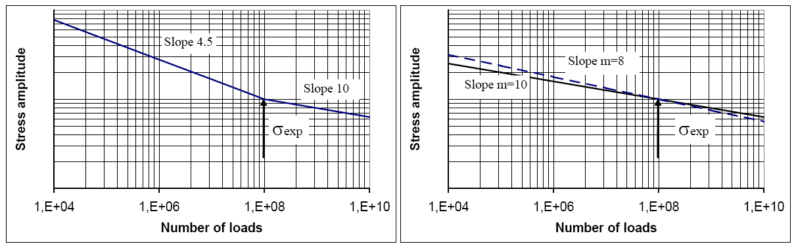
    **Fig 1.13 Two-slope S-N curve Fig 1.14 Constant-slope S-N curve**
    The equivalent fatigue stress for 10^8 stress cycles which produces the same fatigue damage as the load distribution is:
    $\sigma _{fat} = \rho \cdot ( \sigma _{ice} ) _{\max}$
    where,
    $( \sigma _{ice} ) _{\max} = 0.5 \cdot [( \sigma _{ice} ) _{f \max} -( \sigma _{ice} ) _{b \max} ]$
    $( \sigma _{ice} ) _{\max}$ is the mean value of the principal stress amplitudes resulting from design forward and backward blade forces at the location being studied
    $( \sigma _{ice} ) _{f \max}$ is the principal stress resulting from forward load
    $( \sigma _{ice} ) _{b \max}$ is the principal stress resulting from backward load
    In calculation of $( \sigma _{ice} ) _{\max}$, case 1 and case 3 (or case 2 and case 4) in **Table 2.1**, **2.2** of **Annex 2** are considered as a pair for $( \sigma _{ice} ) _{f \max}$, and $( \sigma _{ice} ) _{b \max}$ calculations. Case 5 is excluded from the fatigue analysis.
    The parameter $\rho$ relates the maximum ice load to the distribution of ice loads according to the regression formulae.
    $\rho = C _{1} \cdot ( \sigma _{ice} ) _{\max} ^{C _{2}} \cdot \sigma _{fl} ^{C _{3}} \cdot \log(N _{ice} ) ^{C _{4}}$
    where,
    $\sigma _{fl} = \gamma _{\varepsilon 1} \cdot \gamma _{\epsilon 2} \cdot \gamma _{\nu } \cdot \gamma _{m} \cdot \sigma _{\exp}$
    where,
    $\gamma _{\varepsilon 1}$ is the reduction factor due to scatter (equal to one standard deviation)
    $\gamma _{\varepsilon 2}$ is the reduction factor for test specimen size effect
    $\gamma _{\nu }$ is the reduction factor for variable amplitude loading
    $\gamma _{m}$ is the reduction factor for mean stress
    $\sigma _{\exp}$ is the mean fatigue strength of the blade material at 10^8 cycles to failure in seawater. The following values should be used for the reduction factors if actual values are not available: $\gamma _{\varepsilon } = \gamma _{\varepsilon 1} \cdot \gamma _{\varepsilon 2}$=0.67, $\gamma _{\nu }$=0.75, and $\gamma _{m}$=0.75.
    The coefficients $C _{1}$, $C _{2}$, $C _{3}$, and $C _{4}$ are given in **Table 1.24**. The applicable range of $N _{ice}$ for calculating $\rho$ is $5 \times 10 ^{6} \leq N _{ice} \leq 10 ^{8}$.

    |   | Open propeller | Ducted propeller |
    | --- | --- | --- |
    | $C _{1}$ | 0.000747 | 0.000534 |
    | $C _{2}$ | 0.0645 | 0.0533 |
    | $C _{3}$ | - 0.0565 | - 0.0459 |
    | $C _{4}$ | 2.22 | 2.584 |

    For materials with a constant-slope S-N curve(see **Fig 1.14**), the $\rho$ factor is to be calculated with the following formula:
    $\rho = \left( G \cdot \frac{N _{ice}}{N _{R}} \right) ^{1/m} (\ln(N _{ice} )) ^{-1/k}$
    where,
    $k$ is the shape parameter of the Weibull distribution $k$ = 1.0 for ducted propellers and $k$ = 0.75 for open propellers.
    $N _{R}$ is the reference number of load cycles (=10^8)
    Values for the $G$ parameter are given in **Table 1.25**.
    Linear interpolation may be used to calculate the $G$ value for other $m/k$ ratios than given in the **Table 1.25**.

    | $m/k$ | $G$ | $m/k$ | $G$ | $m/k$ | $G$ | $m/k$ | $G$ |
    | --- | --- | --- | --- | --- | --- | --- | --- |
    | 3 | 6 | 5.5 | 287.9 | 8 | 40320 | 10.5 | 11.899E6 |
    | 3.5 | 11.6 | 6 | 720 | 8.5 | 119292 | 11 | 39.917E6 |
    | 4 | 24 | 6.5 | 1871 | 9 | 362880 | 11.5 | 136.843E6 |
    | 4.5 | 52.3 | 7 | 5040 | 9.5 | 1.133E6 | 12 | 479.002E6 |
    | 5 | 120 | 7.5 | 14034 | 10 | 3.623E6 |   |   |
    - **(A)** Equivalent fatigue stress
    - **(B)** Calculation of $\rho$ parameter for two-slope S-N curve
    - **(C)** Calculation of $\rho$ parameter for constant-slope S-N curve
  - **(4)** Acceptability criterion for fatigue
    The equivalent fatigue stress at all locations on the blade has to fulfil the following acceptability criterion.
    $\frac{\sigma _{fl}}{\sigma _{fat}} \geq 1.5$
    where,
    $\sigma _{fl} = \gamma _{\varepsilon 1} \cdot \gamma _{\varepsilon 2} \cdot \gamma _{\nu } \cdot \gamma _{m} \cdot \sigma _{\exp}$
    where,
    $\gamma _{\varepsilon 1}$ is the reduction factor due to scatter (equal to one standard deviation)
    $\gamma _{\varepsilon 2}$ is the reduction factor for test specimen size effect
    $\gamma _{\nu }$ is the reduction factor for variable amplitude loading
    $\gamma _{m}$ is the reduction factor for mean stress
    $\sigma _{\exp}$ is the mean fatigue strength of the blade material at $10 ^{8}$ cycles to failure in seawater.
    The following values should be used for the reduction factors if actual values are not available: $\gamma _{\varepsilon } = \gamma _{\varepsilon 1} \cdot \gamma _{\varepsilon 2}$ = 0.67, $\gamma _{\nu }$ = 0.75, and $\gamma _{m}$ = 0.75.
- **3.** **Propeller bossing and CP mechanism**
  The blade bolts, the CP mechanism, the propeller boss, and the fitting of the propeller to the propeller shaft is to be designed to withstand the maximum and fatigue design loads, as defined in **605**. The safety factor against yielding is to be greater than 1.3 and that against fatigue greater than 1.5. In addition, the safety factor for loads resulting from loss of the propeller blade through plastic bending as defined in **605. 7** is to be greater than 1.0 against yielding.
- **4.** **Propulsion shaft line**
  The shafts and shafting components, such as the thrust and stern tube bearings, couplings, flanges and sealings, are to be designed to withstand the propeller/ice interaction loads as given in **605.** The safety factor is to be at least 1.3 against yielding for extreme operational loads, 1.5 for fatigue loads and 1.0 against yielding for the blade failure load.
  - **(1)** Shafts and shafting components
    The ultimate load resulting from total blade failure as defined in **605. 7** should not cause yielding in shafts and shaft components. The loading shall consist of the combined axial, bending, and torsion loads, wherever this is significant. The minimum safety factor against yielding is to be 1.0 for bending and torsional stresses.
- **5.** **Azimuth main propulsors**
  - **(1)** Design principle
    In addition to the above requirements considering propeller blade dimensioning, the azimuth thrusters have to be designed for the thruster body/ice interaction loads. The load formulae are given to estimate the once a lifetime extreme loads on the thruster body basing on estimated ice condition and ship operational parameters. Two main ice load scenarios have been selected to define the extreme ice loads. The examples of loads are illustrated in **Fig 1.15**. In addition, blade order thruster body vibration responses may be estimated for propeller excitation.
    - Ice block impact to the thruster body or propeller hub
    - Thruster penetration into an ice ridge that has a thick consolidated layer.
    - Vibratory response of the thruster at blade order frequency

    | 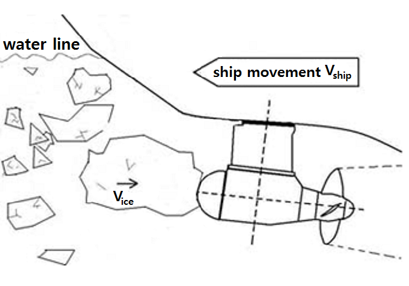 Impact on thruster body | 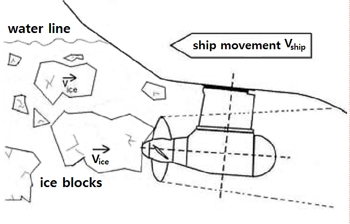 Impact on propeller hub |
    | --- | --- |
    | 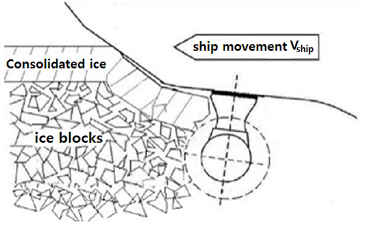 Thruster penetration to the ice ridge |   |
    | **Fig 1.15 Examples of load scenario to types** |   |

    The steering mechanism, the fitting of the unit, and the body of the thruster shall be designed to withstand the plastic bending of a blade without damage. The loss of a blade shall be considered for the propeller blade orientation which causes the maximum load on the component being studied. Typically, top-down blade orientation places the maximum bending loads on the thruster body.
  - **(2)** Extreme ice impact loads
    When the ship is operated in ice conditions the ice blocks formed in channel side walls or from the ridge consolidated layer may impact on the thruster body and also on the propeller hub. The exposure to ice impact is very much dependent on the ship size and ship hull design as well as location of the thruster. The contact force will grow on the thruster/ice contact until the ice block will reach the ship speed.
    The thruster has to withstand the loads obtained when the maximum ice blocks, which are given in **603.**, hit the thruster body when the ship is sailing at a typical ice operating speed. Load cases for impact loads are given in **Table 1.26**. The contact geometry is estimated to be hemisphere in shape. If the actual contact geometry differs from the shape of hemisphere a sphere radius has to be estimated so that the growth of the contact area as a function of penetration to ice corresponds as close as possible to the actual geometrical shape penetration.

    **Table 1.26 Load cases for azimuth thruster ice impact loads**

    |   | Force | Loaded area |   |
    | --- | --- | --- | --- |
    | Load case $T _{1a}$ Symmetric longitudinal ice impact on thruster | $F _{ti}$ | Uniform distributed load or uniform pressure, which are applied symmetrically on the impact area. | 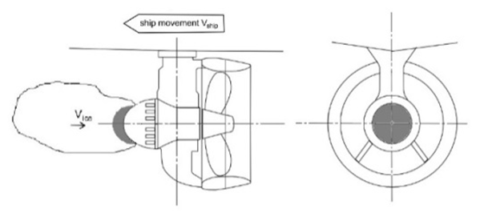 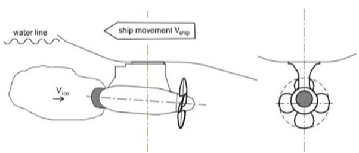 |
    | Load case $T _{1b}$ Non-symmetric longitudinal ice impact on thruster | 50 % of $F _{ti}$ | Uniform distributed load or uniform pressure, which are applied on the other half of the impact area. | 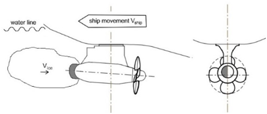 |
    | Load case $T _{1c}$ Non-symmetric longitudinal ice impact on nozzle | $F _{ti}$ | Uniform distributed load or uniform pressure, which are applied on the impact area. Contact area is equal to the nozzle thickness ($H _{nz}$)*contact length($H _{ice}$) | 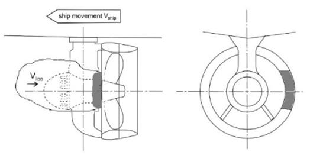 |
    | Load case $T _{2a}$ Symmetric longitudinal ice impact on propeller hub | $F _{ti}$ | Uniform distributed load or uniform pressure, which are applied symmetrically on the impact area. | 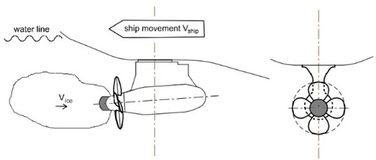 |
    | Load case $T _{2b}$ Non-symmetric longitudinal ice impact on propeller hub | 50 % of $F _{ti}$ | Uniform distributed load or uniform pressure, which are applied on the other half of the impact area. | 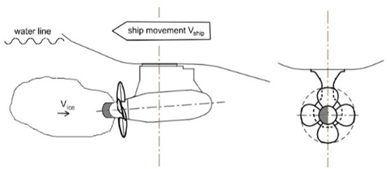 |
    | Load case $T _{3a}$ Symmetric lateral ice impact on thruster body | $F _{ti}$ | Uniform distributed load or uniform pressure, which are applied symmetrically on the impact area. |  |

    **Table 1.26 Load cases for azimuth thruster ice impact loads (continued)**

    |   | Force | Loaded area |   |
    | --- | --- | --- | --- |
    | Load case $T _{3b}$ Non-symmetric lateral ice impact on thruster body or nozzle | $F _{ti}$ | Uniform distributed load or uniform pressure, which are applied on the impact area. Nozzle contact radius $R$ to be taken from the nozzle length ($L _{nz}$) |  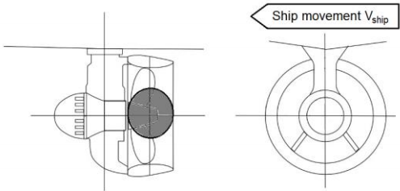 |

    The ice impact contact load has to be calculated with the following formula. The related parameter values are given in **Table 1.27**. The design operation speed in ice can be derived from the **Table 1.28** and **Table 1.29**, or the ship in question’s actual design operation speed in ice can be used. The longitudinal impact speed in **Table 1.28** and **Table 1.29** refers to the impact in the thruster’s main operational direction. For the pulling propeller configuration, the longitudinal impact speed is used for load case $T _{2}$, impact on hub; and for the pushing propeller unit, the longitudinal impact speed is used for load case $T _{1}$, impact on thruster end cap. For the opposite direction, the impact speed for transversal impact is applied.
    $F _{ti} =C _{DMI} 34.5 R _{c} ^{0.5} (m _{ice} v _{s} ^{2} ) ^{0.333}$ (kN)
    where,
    $R _{c}$ is impacting part sphere radius, see **Fig. 1.16** (m)
    $m _{ice}$ is ice block mass (kg)
    $v _{s}$ is ship speed at the time of contact (m/s)
    $C _{DMI}$ is the dynamic magnification factor for impact loads. $C _{DMI}$ is to be taken from **Table 1.27** if unknown.
    For impacts on non-hemispherical areas, such as the impact on the nozzle, the equivalent impact sphere radius is to be estimated using the equation below.
    $R _{ceq} = \sqrt {\frac{A}{\pi}}$ (m)
    If the $2 \cdot R _{ceq}$ is greater than the ice block thickness, the radius is set to half of the ice block thickness. For the impact on the thruster side, the pod body diameter can be used as a basis for determining the radius. For the impact on the propeller hub, the hub diameter can be used as a basis for the radius.

    | 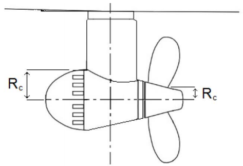 |
    | --- |
    | **Fig 1.16 Dimensions used for** $R _{c}$ |

    **Table 1.27 Parameter values for ice dimensions and dynamic magnification**

    |   | IA Super | IA | IB | IC |
    | --- | --- | --- | --- | --- |
    | Thickness of the design ice block impacting thruster (2/3 of $H _{ice}$) | 1.17 m | 1.0 m | 0.8 m | 0.67 m |
    | Extreme ice block mass ($m _{ice}$) | 8670 kg | 5460 kg | 2800 kg | 1600 kg |
    | $C _{DMI}$ (if not known) | 1.3 | 1.2 | 1.1 | 1 |

    **Table 1.28 Impact speeds for aft centerline thruster**

    |   | IA Super | IA | IB | IC |
    | --- | --- | --- | --- | --- |
    | Longitudinal impact in main operational direction | 6 m/s | 5 m/s | 5 m/s | 5 m/s |
    | Longitudinal impact in reversing direction (pushing unit propeller hub or pulling unit cover end cap impact) | 4 m/s | 3 m/s | 3 m/s | 3 m/s |
    | Transversal impact in bow first operation | 3 m/s | 2 m/s | 2 m/s | 2 m/s |
    | Transversal impact in stern first operation (double acting ship) | 4 m/s | 3 m/s | 3 m/s | 3 m/s |

    **Table 1.29 Impact speeds for aft wing, bow centerline and bow wing thrusters**

    |   | IA Super | IA | IB | IC |
    | --- | --- | --- | --- | --- |
    | Longitudinal impact in main operational direction | 6 m/s | 5 m/s | 5 m/s | 5 m/s |
    | Longitudinal impact in reversing direction (pushing unit propeller hub or pulling unit cover end cap impact) | 4 m/s | 3 m/s | 3 m/s | 3 m/s |
    | Transversal impact | 4 m/s | 3 m/s | 3 m/s | 3 m/s |
  - **(3)** Extreme ice loads on thruster hull when penetrating into an ice ridge
    In ice conditions ships operate typically in ice channels. When passing other ships, ships may be subject to loads that are caused by their thrusters penetrating into ice channel walls. There is usually a consolidated layer at the ice surface, below which the ice blocks are loose. In addition, the thruster may penetrate into ice ridges when backing. Such a situation is likely in case of IA Super ships in particular, because they may operate independently in difficult ice conditions. However, the thrusters in ships with lower ice classes may also have to withstand such a situation, but at a remarkably lower ship speed.
    In this load scenario, the ship is penetrating a ridge in thruster first mode with an initial speed. This situation occurs when a ship with a thruster at the bow moves forward, or a ship with a thruster astern moves in backing mode. The maximum load during such an event is considered the extreme load. An event of this kind typically lasts several seconds, due to which the dynamic magnification is considered negligible and is not taken into account.
    The load magnitude must be estimated for the load cases shown in **Table 1.30** using equation below. The parameter values for calculations are given in **Table 1.31** and **Table 1.32**. The loads are to be applied as uniform distributed load or uniform pressure over the thruster surface. The design operation speed in ice can be derived from **Table 1.31** or **Table 1.32**. Alternatively, the actual design operation speed in ice of the ship in question can be used.
    $F _{tr} =0.032 \cdot \nu _{s} ^{0.66} \cdot H _{r} ^{0.9} \cdot A _{t} ^{0.74}$ (kN)
    where,
    $\nu _{s}$ is ship speed (m/s)
    $H _{r}$ is design ridge thickness (the thickness of the consolidated layer is 18 % of the total ridge thickness) (m)
    $A _{t}$ is projected area of the thruster ($\mathrm{m} ^{2}$)
    When calculating the contact area for thruster-ridge interaction, the loaded area in vertical direction is limited to the ice ridge thickness as shown in **Fig 1.17**.

    **Table 1.30 Load cases for ridge ice loads**

    |   | Force | Loaded area |   |
    | --- | --- | --- | --- |
    | Load case $T_{ 4a}$ Symmetric longitudinal ridge penetration loads | $F_{ tr}$ | Uniform distributed load or uniform pressure, which are applied symmetrically on the impact area. | 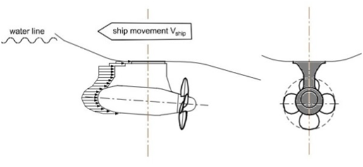 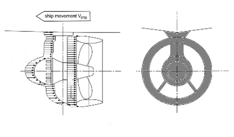 |

    **Table 1.30 Load cases for ridge ice loads (continued)**

    |   | Force | Loaded area |   |
    | --- | --- | --- | --- |
    | Load case $T _{4b}$ Non-symmetric longitudinal ridge penetration loads | 50% of $F_{ tr}$ | Uniform distributed load or uniform pressure, which are applied on the other half of the contact area. | 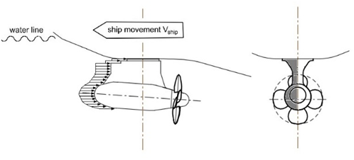 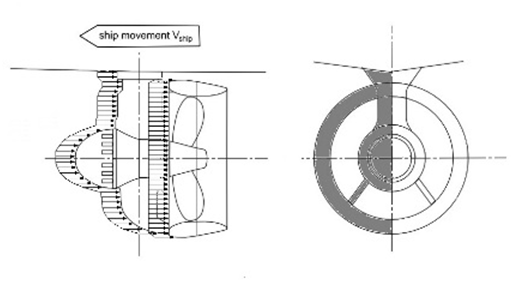 |
    | Load case $T _{5a}$ Symmetric lateral ridge penetration loads for ducted azimuthing unit and pushing open propeller unit | $F_{ tr}$ | Uniform distributed load or uniform pressure, which are applied symmetrically on the contact area. | 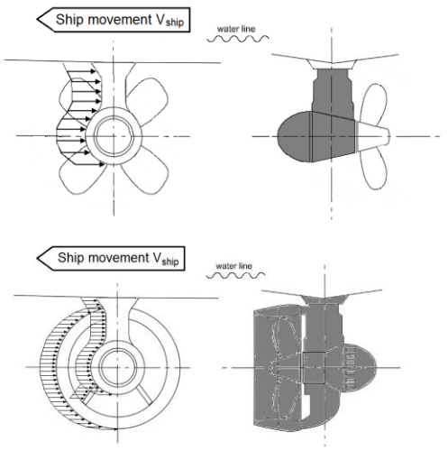 |
    | Load case $T _{5b}$ Non-symmetric lateral ridge penetration loads for all azimuthing unit | 50% of $F_{ tr}$ | Uniform distributed load or uniform pressure, which are applied on the other half of the contact area. | 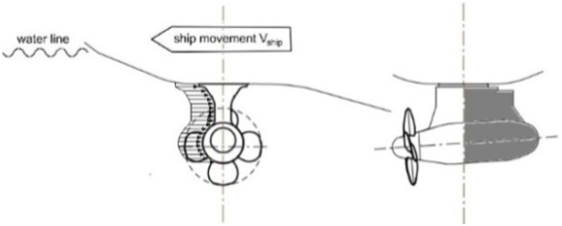 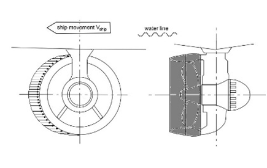 |

    | 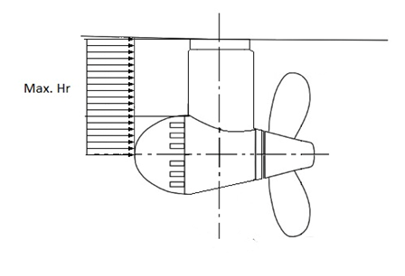 |
    | --- |
    | **Fig 1.17 Schematic figure showing the reduction of the contact area by the maximum ridge thickness** |

    **Table 1.31 Parameters for calculating maximum loads when thruster penetrates into an ice ridge. Aft thrusters. Bow first operation**

    |   | IA Super | IA | IB | IC |
    | --- | --- | --- | --- | --- |
    | Thickness of the design ridge consolidated layer | 1.5 m | 1.5 m | 1.2 m | 1.0 m |
    | Total thickness of the design ridge | 8 m | 8 m | 6.5 m | 5 m |
    | Initial ridge penetration speed (longitudinal loads) | 4 m/s | 2 m/s | 2 m/s | 2 m/s |
    | Initial ridge penetration speed (transversal loads) | 2 m/s | 1 m/s | 1 m/s | 1 m/s |

    **Table 1.32 Parameters for calculating maximum loads when thruster penetrates into ice ridge. Thruster first mode such as double acting ships.**

    |   | IA Super | IA | IB | IC |
    | --- | --- | --- | --- | --- |
    | Thickness of the design ridge consolidated layer | 1.5 m | 1.5 m | 1.2 m | 1.0 m |
    | Total thickness of the design ridge | 8 m | 8 m | 6.5 m | 5 m |
    | Initial ridge penetration speed (longitudinal loads) | 6 m/s | 4 m/s | 4 m/s | 4 m/s |
    | Initial ridge penetration speed (transversal loads) | 3 m/s | 2 m/s | 2 m/s | 2 m/s |
  - **(4)** Acceptability criterion for static loads
    The stresses on the thruster must be calculated for the extreme once in a lifetime loads described in **Par 5.** The nominal von Mises stresses on the thruster body must have a safety margin of 1.3 against yielding strength of the material. At areas of local stress concentrations, stress must have a safety margin of 1.0 against yielding. The slewing bearing, bolt connections and other components must be able to maintain the operability without incurring damage that requires repair when subject to the loads given in (2), (3) multiplied by a safety factor of 1.3.
  - **(5)** Thruster body global vibration
    Evaluating the global vibratory behavior of the thruster body is important, if the first blade order excitations are in the same frequency range with the thruster global modes of vibration, which occur when the propeller rotational speeds are in the high power range of the propulsion line. This evaluation is mandatory and it must be shown that there is either no global first blade order resonance at high operational propeller speeds (above 50% of maximum power) or that the structure is designed to withstand vibratory loads during resonance above 50% of maximum power.
    When estimating thruster global natural frequencies in the longitudinal and transverse direction, the damping and added mass due to water must be taken into account. In addition to this, the effect of ship attachment stiffness must be modelled. A methodology to estimate the vibratory loads is given in **10.4** of the **Guidelines for the Application of the Finnish-Swedish Ice Class Rules**.

#### 607. Alternative design procedure

- **1.** **Scope**
  As an alternative to **605.** and **606.**, a comprehensive design study may be carried out to the satisfaction of the society. The study has to be based on ice conditions given for different Ice classes in **603.** It has to include both fatigue and maximum load design calculations and fulfil the pyramid strength principle, as given in **606. 1.**
- **2.** **Loading**
  Loads on the propeller blade and propulsion system are to be based on an acceptable estimation of hydrodynamic and ice loads.
- **3.** **Design levels**
  - **(1)** The analysis is to indicate that all components transmitting random (occasional) forces, excluding propeller blade, are not subjected to stress levels in excess of the yield stress of the component material, with a reasonable safety margin.
  - **(2)** Cumulative fatigue damage calculations are to indicate a reasonable safety factor. Due account is to be taken of material properties, stress raisers, and fatigue enhancements.
  - **(3)** Vibration analysis is to be carried out and is to indicate that the complete dynamic system is free from harmful torsional resonances resulting from propeller/ice interaction.

#### 608. Design of propulsion shafting for Ice class ID (2020)

- **1.** **Application**
  This regulation applies to the design of propulsion shafting for ships with Ice class ID. However, some or all of propulsion shaft design for Ice class IC in this section may be applied.
- **2.** **Propeller shaft and stern tube shaft**
  The diameter of propeller shaft and stern tube shaft is not to be less than 5% increased from the shaft diameter calculated in accordance with **Pt 5, Ch 3, 204.** of the Rules for the Classification of Steel Ships.
- **3.** **Thickness of Propeller Blade**
  - **(1)** The thickness of propeller blade is not to be less than 8% increased from the blade thickness calculated in accordance with **Pt 5, Ch 3, 303. of the Rules for the Classification of Steel Ships**.
  - **(2)** The thickness $t _{0.95}$ of propeller blades at a radius of 0.95$R$ is not to be less than that obtained from the following formula.
    $t _{0.95} =0.14(t+57) root {3} of {\frac{430}{T}}$
    $t _{0.95}$ : Thickness of propeller blade at a radius of 0.95$R$ (mm)
    $t$ : Thickness at the root of propeller blade in accordance with **Pt 5, Ch 3, 303. of Rules for the Classification of Steel Ships** (solid propeller: 0.25$R$, controllable pitch propeller: 0.35$R$) (mm)
    $T$ : Specified minimum tensile strength of propeller material ($\mathrm{N}/mm ^{2}$)
- **4.** **Fitting of propeller**
  Where the propeller is force-fitted to the propeller shaft without the use of a key, the calculations for pull-up length and pull-up load in accordance with **Pt 5, Ch 3, 305. 2** (C) **of the Guidance Relating to the Rules for the Classification of Steel Ships** is to be carried out using $F _{V } '$ of the following formula in lieu of $F _{V}$.
  $F _{V} '=F _{V} +0.15 \frac{2cQ}{D _{s}}$

### Section 7 Miscellaneous Machinery Requirements

#### 701. Starting arrangements

- **1.** The capacity of the air receivers is to be sufficient to provide without reloading not less than 12 consecutive starts of the propulsion engine, if this has to be reversed for going astern, or 6 consecutive starts if the propulsion engine does not have to be reversed for going astern.
- **2.** If the air receivers serve any other purposes than starting the propulsion engine, in addition to the capacity required by **Par 1**, they are to have a sufficient capacity for these purposes.
- **3.** The capacity of the air compressors is to be sufficient for charging the air receivers from atmospheric to full pressure in one (1) hour as specified in **Pt 5, Ch 6, 1101. of the Rules for the Classification of Steel Ships,** except for a ship with the Ice class IA Super, if its propulsion engine has to be reversed for going astern, in which case the compressor is to be able to charge the receivers in half an hour.

#### 702. Sea inlet and cooling water systems

- **1.** The cooling water system is to be designed to ensure supply of cooling water when navigating in ice.
- **2.** To satisfy **Par 1**, at least one cooling water inlet chest is to be arranged as follows. However, the ship with Ice class ID may not comply with the requirements in (2), (3) and (5).
  - **(1)** The sea inlet is to be situated near the centerline of the ship and well aft if possible.
  - **(2)** As guidance for design, the volume of the chest is to be about 1 $\mathrm{m} ^{3}$ for every 750 kW engine output of the ship including the output of auxiliary engines necessary for the ship's service.
  - **(3)** The chest is to be sufficiently high to allow ice to accumulate above the inlet pipe and the height of sea chest is not less than the value obtained from the following formula.
    $H=1.5 root {3} of {V}$
    $V$ = volume of sea chest specified in (2) and, inlet pipe is to be not located higher than $H/3$ from the uppermost of sea chest.
  - **(4)** A pipe for discharge cooling water, allowing full capacity circulate, is to be connected to the chest. Here, "full capacity of cooling water" in means that the cooling water is used for the following purposes
  - **(1)** Main propulsion system(main engine, power train, shafts)
  - **(2)** prime movers for generator
  - **(3)** main boiler and primary equipments of auxiliary boiler
  - **(5)** The open area of the strainer plates is not to be less than four (4) times the inlet pipe sectional area.
- **3.** If there are difficulties to meet the requirements of **Par 2** (2) and (3), two smaller chests may be arranged for alternating intake and discharge of cooling water. In this case, the requirements in **Par 2** (1), (4) and (5) are to be complied with. If the volume and height are not comply with **2** (2) and (3), inlet and outlet pipes of cooling water is to be connected to sea chest.
- **4.** Heating coils may be installed in the upper part of the sea chest.
- **5.** Arrangements for using ballast water for cooling purposes may be useful as a reserve in ballast condition but cannot be accepted as a substitute for sea inlet chest as described above. 
