# Guidance for Ship for Navigation in Ice

> OTHER RULES AND GUIDANCE / GC-14-E / 2025 / EN / Guidance

## CHAPTER 2 SHIPS FOR NAVIGATION IN POLAR WATERS

### Section 1 Polar Class Descriptions and Application

#### 101. Application

- **1.** This chapter is to apply to ships constructed of steel and intended for independent navigation in ice‐infested polar waters.
- **2.** Ships that comply with the requirements in **Sec 2** and **Sec 3** can be considered for a Polar Class notation as listed in **Table 2.1**. The requirements of **Sec 2** and **Sec 3** are in addition to the open water requirements of the Society. If the hull and machinery are constructed such as to comply with the requirements of different Polar Classes, then both the hull and machinery are to be assigned the lower of these classes in the Certificate of Classification. Compliance of the hull or machinery with the requirements of a higher Polar Class is also to be indicated in the Certificate of Classification or equivalent.
- **3.** Ships which are assigned a Polar Class notation and complying with the relevant requirements of **Sec 2** and **Sec 3** may be given the additional notation “Icebreaker”. “Icebreaker" refers to any ship having an operational profile that includes escort or ice management functions, having powering and dimensions that allow it to undertake aggressive operations in ice-covered waters. *(2017)*
- **4.** For ships which are assigned a Polar Class notation, the hull form and propulsion power are to be such that the ship can operate independently and at continuous speed in a representative ice condition, as defined in **Table 2.1** for the corresponding Polar Class. For ships and ship-shaped units which are intentionally not designed to operate independently in ice, such operational intent or limitations are to be explicitly stated in the Certificate of Classification or equivalent. *(2017)*
- **5.** For ships which are assigned a Polar Class notation PC1 through PC5, bows with vertical sides, and bulbous bows are generally to be avoided. Bow angles should in general be within the range specified in **203. 1 (5).** *(2017)*
- **6.** For ships which are assigned a Polar Class notation PC6 and PC7, and are designed with a bow with vertical sides or bulbous bows, operational limitations (restricted from intentional ramming) in design conditions are to be stated in the Certificate of Classification or equivalent. *(2017)*

#### 102. Polar Classes

- **1.** The Polar Class (PC) notations and descriptions are given in **Table 2.1**. It is the responsibility of the Owner to select an appropriate Polar Class. The descriptions in **Table 2.1** are intended to guide owners, designers and administrations in selecting an appropriate Polar Class to match the requirements for the ship with its intended voyage or service.
- **2.** The Polar Class notation is used throughout this chapter to convey the differences between classes with respect to operational capability and strength.

  | Polar Class | Ice Description (based on WMO Sea Ice Nomenclature) |
  | --- | --- |
  | PC1 | Year‐round operation in all Polar waters |
  | PC2 | Year‐round operation in moderate multi‐year ice conditions |
  | PC3 | Year‐round operation in second‐year ice which may include multi‐year ice inclusions. |
  | PC4 | Year‐round operation in thick first‐year ice which may include old ice inclusions |
  | PC5 | Year‐round operation in medium first‐year ice which may include old ice inclusions |
  | PC6 | Summer/autumn operation in medium first‐year ice which may include old ice inclusions |
  | PC7 | Summer/autumn operation in thin first‐year ice which may include old ice inclusions |

#### 103. Upper and lower ice waterlines

- **1.** The upper and lower ice waterlines upon which the design of the ship has been based is to be indicated in the Certificate of Classification. The upper ice waterline (UIWL) is to be defined by the maximum draughts fore, amidships and aft. The lower ice waterline (LIWL) is to be defined by the minimum draughts fore, amidships and aft.
- **2.** The lower ice waterline is to be determined with due regard to the ship’s ice-going capability in the ballast loading conditions. The propeller is to be fully submerged at the lower ice waterline. *(2017)*

#### 104. Subdivision and stability

- **1.** For the ships to apply this chapter, the followings are to be examined, considering the navigation features in ice-infested polar waters within approved limitations, in addition to the requirements regarding the stability and subdivision for the ships navigating in open waters.
  - **(1)** Stability in intact conditions *(2017)*
    - **(A)** In order to comply with the functional requirement of this chapter, for ships operating in areas and during periods where ice accretion is likely to occur, the following icing allowance shall be made in the stability calculations:
      - **(a)** 30 $\mathrm{kg}/m^2$ on exposed weather decks and gangways
      - **(b)** 7.5 $\mathrm{kg}/m^2$ for the projected lateral area of each side of the ship above the water plane
      - **(c)** the projected lateral area of discontinuous surfaces of rail, sundry booms, spars (except masts) and rigging of ships having no sails and the projected lateral area of other small objects shall be computed by increasing the total projected area of continuous surfaces by 5% and the static moments of this area by 10%.
    - **(B)** Ships operating in areas and during periods where ice accretion is likely to occur shall be:
      - **(a)** designed to minimize the accretion of ice; and
      - **(b)** equipped with such means for removing ice for example, electrical and pneumatic devices, and/or special tools such as axes or wooden clubs for removing ice from bulwarks, rails and erections.
  - **(2)** Damage stability to be expected when operated in ice-infested polar waters *(2017)*
    - **(A)** The Ships shall be able to withstand flooding resulting from hull penetration due to ice impact. The residual stability following ice damage shall be such that the factor Si, as defined in **SOLAS regulations II-1/7-2.2** and **II-1/7-2.3**, is equal to one for all loading conditions used to calculate the attained subdivision index in **SOLAS regulation II-1/7**. However, for cargo ships that comply with subdivision and damage stability regulations in another instrument developed by the Organization, as provided by **SOLAS regulation II- 1/4.1**, the residual stability criteria of that instrument shall be met for each loading condition.
    - **(B)** The ice damage extents to be assumed shall be such that:
      - **(a)** the longitudinal extent is 4.5 % of the upper ice waterline length if centred forward of the maximum breadth on the upper ice waterline, and 1.5 % of upper ice waterline length otherwise, and shall be assumed at any longitudinal position along the ship's length
      - **(b)** the transverse penetration extent is 760 mm, measured normal to the shell over the full extent of the damage
      - **(c)** the vertical extent is the lesser of 20 % of the upper ice waterline draught or the longitudinal extent, and shall be assumed at any vertical position between the keel and 120% of the upper ice waterline draught.
  - **(3)** Subdivision and watertightness *(2017)*
    - **(A)** In order to comply with the functional requirements of this chapter, the following apply:
      - **(a)** for ships operating in areas and during periods where ice accretion is likely to occur, means shall be provided to remove or prevent ice and snow accretion around hatches and doors
      - **(b)** in addition, for ships intended to operate in low air temperature the following apply:
      - **(i)** if the hatches or doors are hydraulically operated, means shall be provided to prevent freezing or excessive viscosity of liquids; and
        - **(ii)** watertight and weathertight doors, hatches and closing devices which are not within an habitable environment and require access while at sea shall be designed to be operated by personnel wearing heavy winter clothing including thick mittens.
    - **(B)** For ships with an aggregate oil fuel capacity of less than 600 $\mathrm{m}^3$, all oil fuel tanks shall be separated from the outer shell by a distance of not less than 0.76 $\mathrm{m}$. This provision does not apply to small oil fuel tanks with a maximum individual capacity not greater than 30 $\mathrm{m}^3$.
    - **(C)** For ships other than oil tankers, all cargo tanks constructed and utilized to carry oil shall be separated from the outer shell by a distance of not less than 0.76 m.
    - **(D)** For oil tankers of less than 5,000 tonnes deadweight, the entire cargo tank length shall be protected with:
      - **(a)** double bottom tanks or spaces complying with the applicable requirements of regulation 19.6.1 of **MARPOL Annex I**
      - **(b)** wing tanks or spaces arranged in accordance with regulation 19.3.1 of **MARPOL Annex I** and complying with the applicable requirements for distance referred to in regulation 19.6.2 of **MARPOL Annex I.**
    - **(E)** all oil residue (sludge) tanks and oily bilge water holding tanks shall be separated from the outer shell by a distance of not less than 0.76 m. This provision does not apply to small tanks with a maximum individual capacity not greater than 30 $\mathrm{m}^3$.

### Section 2 Structural Requirements for Polar Class Ships

#### 201. General (2021)

- **1.** **Application**
  These requirements are to be applied to ships of Polar Class mentioned in **Sec 1**.
- **2.** **Definitions**
  - **(1)** The length L_UI is the distance, in m, measured horizontally from the fore side of the stem at the intersection with the upper ice waterline (UIWL) to the after side of the rudder post, or the centre of the rudder stock if there is no rudder post. L_UI is not to be less than 96%, and need not be greater than 97%, of the extreme length of the upper ice waterline (UIWL) measured horizontally from the fore side of the stem. In ships with unusual stern and bow arrangement the length L_UI will be specially considered.
  - **(2)** The ship displacement D_UI is the displacement, in kt, of the ship corresponding to the upper ice waterline (UIWL). Where multiple waterlines are used for determining the UIWL, the displacement is to be determined from the waterline corresponding to the greatest displacement.

#### 202. Hull areas

- **1.** The ice strengthening regions of all Polar Class ships is divided into regions reflecting the magnitude of the loads that are expected to act upon them. In the longitudinal direction, there are four regions: Bow, Bow Intermediate, Midbody and Stern. The Bow Intermediate, Midbody and Stern regions are further divided in the vertical direction into the Bottom, Lower and Icebelt regions. The extent of each ice strengthening region is illustrated in **Fig 2.1.**
- **2.** The upper ice waterline (UIWL) and lower ice waterline (LIWL) are as defined in **103. 1.**
- **3.** **Fig 2.1** notwithstanding, at no time is the boundary between the Bow and Bow Intermediate regions to be forward of the intersection point of the line of the stem and the ship baseline.
- **4.** **Fig 2.1** notwithstanding, the aft boundary of the Bow region need not be more than 0.45 L aft of the fore side of the stem at the intersection with the upper ice waterline (UIWL). *(2021)*
- **5.** The boundary between the bottom and lower regions is to be taken at the point where the shell is inclined 7° from horizontal.
- **6.** If a ship is intended to operate astern in ice regions, the aft section of ships is to be designed using the Bow and Bow Intermediate ice strengthening region requirements.
- **7.** **Fig 2.1** notwithstanding, if the ship is assigned the additional notation “Icebreaker”, the forward boundary of the stern region is to be at least 0.04 L_UI forward of the section where the parallel ship side at the upper ice waterline (UIWL) ends. *(2021)*
  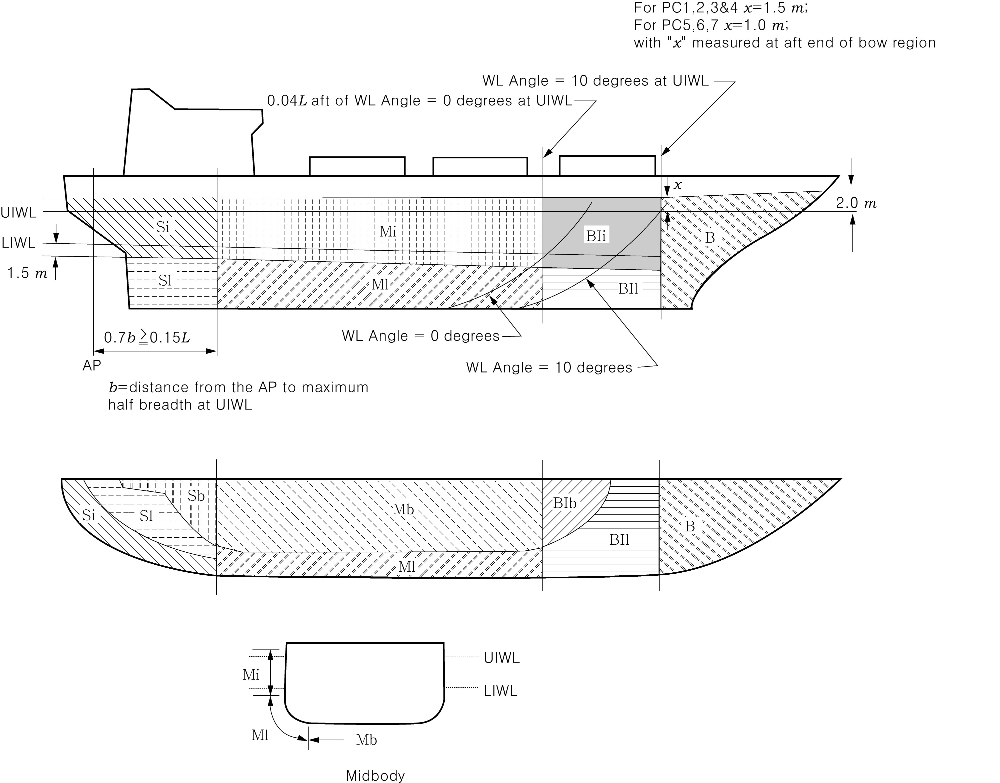
  Fig 2.1 Ice strengthening region extents

#### 203. Design ice loads

- **1.** **General**
  - **(1)** A glancing impact on the bow is the design scenario for determining the scantlings required to resist ice loads.
  - **(2)** The design ice load is characterized by an average pressure ($P _{avg}$) uniformly distributed over a rectangular load patch of height ($b$) and width ($w$).
  - **(3)** Within the Bow region of all Polar Classes and within the Bow Intermediate ice strengthening region of Polar Classes PC6 and PC7, the ice load parameters ($P _{avg}$, $b$ and $w$) are functions of the actual bow shape. To determine the ice load parameters, it is required to calculate the following ice load characteristics for sub-region of the bow region; shape coefficient ($fa _{i}$), total glancing impact force ($F _{i}$), line load ($Q _{i}$) and pressure ($P _{i}$).
  - **(4)** In other ice‐strengthened regions the ice load parameters ($P _{avg}$, $b _{NonBow}$ and $w _{NonBow}$) are determined independently of the hull shape. Accordingly, calculation of the glancing impact force ($F _{NonBow}$) and line load ($Q _{NonBow}$) are based on a standard hull shape coefficient ($fa=0.36$) and a fixed load patch aspect ratio ($AR=3.6$).
  - **(5)** Design ice forces calculated according to **2.** (1) (C) are applicable for bow forms where the buttock angle, $\gamma$ at the stem is positive and less than 80 deg, and the normal frame angle, $\beta'$ at the centre of the foremost sub-region, as defined in **2.** (1) (B), is greater than 10 deg. *(2017)*
  - **(6)** Design ice forces calculated according to **2.** (1) (D) are applicable for ships which are assigned the Polar Class PC6 or PC7 and have a bow form with vertical sides. This includes bows where the normal frame angles, $\beta'$ at the considered sub-regions, as defined in **2.** (1) (A), are between 0 and 10 deg. *(2017)*
  - **(7)** For ships which are assigned the Polar Class PC6 or PC7, and equipped with bulbous bows, the design ice forces on the bow are to be determined according to **2.** (1) (D). In addition, the design forces are not to be taken less than those given in **2.** (1) (C), assuming $f_a$= 0.6 and $AR$ = 1.3. *(2017)*
  - **(8)** For ships with bow forms other than those defined in (5) to (7), design forces are to be specially considered by the Classification Society. (2017)
  - **(9)** Ship structures that are not directly subjected to ice loads may still experience inertial loads of stowed cargo and equipment resulting from ship/ice interaction. These inertial loads, based on accelerations determined by the Society, are to be considered in the design of these ship structures.
- **2.** **Glancing impact load characteristics**
  The parameters defining the glancing impact load characteristics are reflected in the Class Factors listed in **Table 2.2** and **Table 2.2-1**. *(2017)*

  | Polar Class | Crushing Failure Class Factor ($CF _{C}$) | Flexural Failure Class Factor ($CF _{F}$) | Load Patch Dimensions Class Factor ($CF _{D}$) | Displacement Class Factor ($CF _{DIS}$) | Longitudinal Strength Class Factor ($CF _{L}$) |
  | --- | --- | --- | --- | --- | --- |
  | PC1 | 17.69 | 68.60 | 2.01 | 250 | 7.46 |
  | PC2 | 9.89 | 46.80 | 1.75 | 210 | 5.46 |
  | PC3 | 6.06 | 21.17 | 1.53 | 180 | 4.17 |
  | PC4 | 4.50 | 13.48 | 1.42 | 130 | 3.15 |
  | PC5 | 3.10 | 9.00 | 1.31 | 70 | 2.50 |
  | PC6 | 2.40 | 5.49 | 1.17 | 40 | 2.37 |
  | PC7 | 1.80 | 4.06 | 1.11 | 22 | 1.81 |

  | Polar Class | Crushing Failure Class Factor ($CF _{CV}$) | Line Load Class Factor ($CF _{QV}$) | Pressure Class Factor ($CF _{PV}$) |
  | --- | --- | --- | --- |
  | PC6 | 3.43 | 2.82 | 0.65 |
  | PC7 | 2.60 | 2.33 | 0.65 |
  - **(1)** Bow area
    $fa _{i} =\min(fa _{i,1} ; fa _{i,2} ; fa _{i,3} )$
    where
    $fa _{i,1} =(0.097-0.68(x/L _{UI} -0.15) ^{2} ) \times \alpha _{i} / \sqrt {\beta _{i}^{' } }$
    $fa _{i,2} =1.2 \times CF _{F} / (\sin \beta _{i}^{' } \times CF _{C } \times D _{UI}^{ 0.64} )$
    $fa _{i,3} =0.60$
    $F _{i} = fa _{i} \times CF _{C} \times D _{UI}^{ 0.64}$ ($\mathrm{MN}$)
    $AR _{i} = 7.46 \times \sin \beta _{i} ^{' } \geq 1.3$
    $Q _{i} = F _{i} ^{0.61} \times CF _{D} / AR _{i} ^{0.35}$ ($\mathrm{MN}/m$)
    $P _{i} = F _{i} ^{0.22} \times CF _{ D} ^{2} \times AR _{i} ^{0.3}$($\mathrm{MPa}$)
    where
    $i$ = sub-region considered
    $L _{UI}$ = length as defined in **201. 2** (m)
    $x$ = distance from the forward fore side of the stem at the intersection with the upper ice waterline (UIWL) to station under consideration (m)
    $\alpha$ = waterline angle (deg), see **Fig 2.2**
    $\beta ^{' }$ = normal frame angle (deg), see **Fig 2.2**
    $D _{UI}$ = ship displacement (kt), not to be taken less than 5 kt
    $CF _{C}$ = crushing failure class factor from **Table 2.2**
    $CF _{F}$ = flexural failure class factor from **Table 2.2**
    $CF _{D}$ = load patch dimensions class factor from **Table 2.2**
    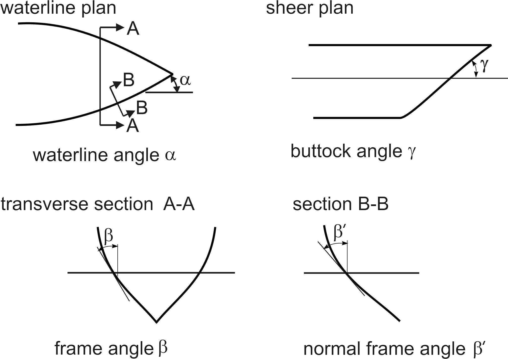
    Note:
    $\beta '$ = normal frame angle at upper ice waterline [deg]
    $\alpha$ = upper ice waterline angle [deg]
    $\gamma$ = buttock angle at upper ice waterline (angle of buttock line measured from vertical)
    [deg]
    $\tan \beta = \tan \gamma / \tan \alpha$
    $\tan \beta ' = \tan \beta / \cos \alpha$
    **Fig 2.2 Definition of hull angles**
    $fa _{i} = \alpha_i / 30$
    $F _{i} = fa _{i} \times CF _{CV} \times D _{UI}^{ 0.47}$ ($\mathrm{MN}$)
    $Q _{i} = F _{i} ^{0.22} \times CF _{QV}$ ($\mathrm{MN}/m$)
    $P _{i} = F _{i} ^{0.56} \times CF _{PV}$ ($\mathrm{MPa}$)
    where
    $i$ = sub-region considered
    $\alpha$ = waterline angle (deg), see **Fig 2.2**
    $D _{UI}$ = displacement (kt), not to be taken less than 5 kt
    $CF _{CV}$ = crushing failure class factor from **Table 2.2-1**
    $CF _{QV}$ = flexural failure class factor from **Table 2.2-1**
    $CF _{PV}$ = pressure class factor from **Table 2.2-1**
    - **(A)** In the Bow area, the force ($F$), line load ($Q$), pressure ($P$) and load patch aspect ratio ($AR$) associated with the glancing impact load scenario are functions of the hull angles measured at the upper ice waterline. The influence of the hull angles is captured through calculation of a bow shape coefficient ($fa$). The hull angles are defined in **Fig 2.2.**
    - **(B)** The waterline length of the bow region is generally to be divided into 4 sub-regions of equal length. The force ($F$), line load ($Q$), pressure ($P$) and load patch aspect ratio ($AR$) are to be calculated with respect to the mid-length position of each sub-region (each maximum of F, Q and P is to be used in the calculation of the ice load parameters $P _{avg}$, $b$ and $w$).
    - **(C)** The Bow area load characteristics for bow forms defined in **203. 1.** (5) are determined as follows: *(2017)*
      - **(a)** Shape coefficient, $fa _{i}$, is to be taken as
      - **(b)** Force, $F_i$
      - **(c)** Load patch aspect ratio, $AR_i$
      - **(d)** Line load, $Q_i$
      - **(e)** Pressure, $P_i$
    - **(D)** The Bow area load characteristics for bow forms defined in **203. 1.** (6) are determined as follows: *(2017)*
      - **(a)** Shape coefficient, $fa _{i}$, is to be taken as
      - **(b)** Force, $F_i$
      - **(c)** Line load, $Q_i$
      - **(d)** Pressure, $P_i$
  - **(2)** Hull areas other than the bow
    $F _{NonBow} = 0.36 \times CF _{C} \times DF$ ($\mathrm{MN}$)
    $Q _{NonBow} = 0.639 \times F _{NonBow} ^{0.61} \times CF _{D}$ ($\mathrm{MN}/m$)
    where
    $CF _{C}$ = crushing failure class factor from **Table 2.2**
    $DF$ = ship displacement factor
    = $D _{UI}^{ 0.64}$ if $D \leq CF _{DIS}$
    = $CF _{DIS} ^{0.64} + 0.10(D-CF _{DIS} )$ if $D > CF _{DIS}$
    $D _{UI}$ = ship displacement (kt), not to be taken less than 10 kt
    $CF _{DIS}$ = displacement class factor from **Table 2.2**
    $CF _{D}$ = load patch dimension class factor from **Table 2.2**
    - **(A)** In the hull area other than the bow, the force ($F _{NonBow}$) and line load ($Q _{NonBow}$) used in the determination of the load patch dimensions ($b _{NonBow}$, $w _{NonBow}$) and design pressure ($P _{avg}$) are determined as follows: *(2017)*
      - **(a)** Force, $F _{NonBow}$
      - **(b)** Line Load, $Q _{NonBow}$
- **3.** **Design load patch**
  - **(1)** In the Bow area, and the Bow Intermediate icebelts area for ships with class notation PC6 and PC7, the design load patch has dimensions of width, $w _{Bow}$, and height, $b _{Bow}$, defined as follows: *(2017)*
    $w _{Bow} = F _{Bow} / Q _{Bow}$ (m)
    $b _{Bow} = Q _{Bow} / P _{Bow}$ (m)
    where
    $F _{Bow}$ = maximum force $F _{i}$ in the Bow area ($\mathrm{MN}$)
    $Q _{Bow}$ = maximum line load $Q _{i}$ in the Bow area ($\mathrm{MN}/m$)
    $P _{Bow}$ = maximum pressure $P _{i}$ in the Bow area ($\mathrm{MPa}$)
  - **(2)** In hull areas other than those covered by (1), the design load patch has dimensions of width, $w _{NonBow}$, and height, $b_NonBow$, defined as follows: *(2017)*
    $w _{NonBow} = F _{NonBow} / Q _{NonBow}$ (m)
    $b _{NonBow} = w _{NonBow} / 3.6$ (m)
    where
    $F _{NonBow}$ = force as defined in **2.** (2) (A) (a) ($\mathrm{MN}$)
    $Q _{NonBow}$ = line load as defined in **2.** (2) (A) (b) ($\mathrm{MN}/m$)
- **4.** **Pressure within the design load patch**
  - **(1)** The average pressure, $P _{avg}$, within a design load patch is determined as follows:
    $P _{avg} = F / (b \times w )$ (MPa)
    where
    $F$ = $F _{Bow}$ or $F _{NonBow}$ as appropriate for the ice strengthening region under consideration (MN)
    $b$ = $b _{Bow}$ or $b _{NonBow}$ as appropriate for the ice strengthening region under consideration (m)
    $w$ = $w _{Bow}$ or $w _{NonBow}$ as appropriate for the ice strengthening region under consideration (m)
  - **(2)** Regions of higher, concentrated pressure exist within the load patch. In general, smaller regions have higher local pressures. Accordingly, the peak pressure factors listed in **Table 2.3** are used to account for the pressure concentration on localized structural members.

    | Structural Member |   | Peak Pressure Factor ($PPF _{i}$) |
    | --- | --- | --- |
    | Plating | Transversely‐Framed | $PPF _{p} = (1.8-S) \geq 1.2$ |
    | Plating | Longitudinally‐Framed | $PPF _{p} = (2.2-1.2 \times S) \geq 1.5$ |
    | Frames in Transverse Framing Systems | With Stringers | $PPF _{t} = (1.6-S) \geq 1.0$ |
    | Frames in Transverse Framing Systems | No Stringers | $PPF _{t} = (1.8-S) \geq 1.2$ |
    | Frames in Bottom Structures |   | $PPF _{s} = 1.0$ |
    | Load Carrying Stringers Side Longitudinals Web Frames |   | $PPF _{s} = 1 if S _{w} \geq 0.5 \times w$ $PPF s = 2.0-2.0 \times S w / W \# if S w <( 0.5 \times w)$ |
    | where, $S$ = frame or longitudinal spacing (m) $S _{w}$ = web frame spacing (m) $w$ = ice load patch width (m) |   |   |
- **5.** **Hull area factors**
  - **(1)** Associated with each ice strengthening region is an region Factor that reflects the relative magnitude of the load expected in that region. The region Factor ($AF$) for each ice strengthening region is listed in **Table 2.4.**
  - **(2)** In the event that a structural member spans across the boundary of a ice strengthening region, the largest ice strengthening region factor is to be used in the scantling determination of the member.
  - **(3)** Due to their increased manoeuverability, ships having propulsion arrangements with azimuth thruster (s) or “podded” propellers are to have specially considered Stern Icebelt ($S _{i}$) and Stern Lower ($S _{l}$) hull area factors.
  - **(4)** For ships assigned the additional notation ”Icebreaker”, the Area Factor (AF) for each hull area is listed in **Table 2.4-1.** *(2017)*

    | Ice strengthening region |   | region | Polar Class |   |   |   |   |   |   |
    | --- | --- | --- | --- | --- | --- | --- | --- | --- | --- |
    | Ice strengthening region |   | region | PC1 | PC2 | PC3 | PC4 | PC5 | PC6 | PC7 |
    | Bow ($B$) | All | $B$ | 1.00 | 1.00 | 1.00 | 1.00 | 1.00 | 1.00 | 1.00 |
    | Bow Intermediate ($BI$) | Icebelt | $BI _{i}$ | 0.90 | 0.85 | 0.85 | 0.80 | 0.80 | 1.00* | 1.00* |
    | Bow Intermediate ($BI$) | Lower | $BI _{l}$ | 0.70 | 0.65 | 0.65 | 0.60 | 0.55 | 0.55 | 0.50 |
    | Bow Intermediate ($BI$) | Bottom | $BI _{b}$ | 0.55 | 0.50 | 0.45 | 0.40 | 0.35 | 0.30 | 0.25 |
    | Midbody ($M$) | Icebelt | $M _{i}$ | 0.70 | 0.65 | 0.55 | 0.55 | 0.50 | 0.45 | 0.45 |
    | Midbody ($M$) | Lower | $M _{l}$ | 0.50 | 0.45 | 0.40 | 0.35 | 0.30 | 0.25 | 0.25 |
    | Midbody ($M$) | Bottom | $M _{b}$ | 0.30 | 0.30 | 0.25 | ** | ** | ** | ** |
    | Stern ($S$) | Icebelt | $S _{i}$ | 0.75 | 0.70 | 0.65 | 0.60 | 0.50 | 0.40 | 0.35 |
    | Stern ($S$) | Lower | $S _{l}$ | 0.45 | 0.40 | 0.35 | 0.30 | 0.25 | 0.25 | 0.25 |
    | Stern ($S$) | Bottom | $S _{b}$ | 0.35 | 0.30 | 0.30 | 0.25 | 0.15 | ** | ** |
    | Note to Table 2.4: * See 203.1.(3) ** Indicates that strengthening for ice loads is not necessary. |   |   |   |   |   |   |   |   |   |

    | Hull area |   | Area | Polar Class |   |   |   |   |   |   |
    | --- | --- | --- | --- | --- | --- | --- | --- | --- | --- |
    | Hull area |   | Area | PC1 | PC2 | PC3 | PC4 | PC5 | PC6 | PC7 |
    | Bow($B$) | All | $B$ | 1.00 |   |   |   |   |   |   |
    | Bow Intermediate ($BI$) | Icebelt | $BI _{i}$ | 0.90 | 0.85 | 0.85 | 0.85 | 0.85 | 1.00 | 1.00 |
    | Bow Intermediate ($BI$) | Lower | $BI _{l}$ | 0.70 | 0.65 | 0.65 | 0.65 | 0.65 | 0.65 | 0.65 |
    | Bow Intermediate ($BI$) | Bottom | $BI _{b}$ | 0.55 | 0.50 | 0.45 | 0.45 | 0.45 | 0.45 | 0.45 |
    | Midbody ($M$) | Icebelt | $M _{i}$ | 0.70 | 0.65 | 0.55 | 0.55 | 0.55 | 0.55 | 0.55 |
    | Midbody ($M$) | Lower | $M _{l}$ | 0.50 | 0.45 | 0.40 | 0.40 | 0.40 | 0.40 | 0.40 |
    | Midbody ($M$) | Bottom | $M _{b}$ | 0.30 | 0.30 | 0.25 | 0.25 | 0.25 | 0.25 | 0.25 |
    | Stern ($S$) | Icebelt | $S _{i}$ | 0.95 | 0.90 | 0.80 | 0.80 | 0.80 | 0.80 | 0.80 |
    | Stern ($S$) | Lower | $S _{l}$ | 0.55 | 0.50 | 0.45 | 0.45 | 0.45 | 0.45 | 0.45 |
    | Stern ($S$) | Bottom | $S _{b}$ | 0.35 | 0.30 | 0.30 | 0.30 | 0.30 | 0.30 | 0.30 |

#### 204. Shell plate requirements

- **1.** The required minimum shell plate thickness, $t$, is given by:
  $t = t _{"net"} + t _{s}$ (mm)
  where
  $t _{"net"}$ = plate thickness(mm) required to resist ice loads according to **204. 2**
  $t _{s}$ = corrosion and abrasion allowance (mm) according to **207**
- **2.** The thickness of shell plating required to resist the design ice load, $t _{"net"}$, depends on the orientation of the framing. *(2017)*
  - **(1)** In the case of transversely‐framed plating ($\Omega \geq 70°$, see **Fig 2.3**), the net thickness is given by:
    $t _{"net"} = 500 \times S ((AF \times PPF _{p} \times P _{avg} ) / \sigma _{y} ) ^{0.5} / (1 + S /2b)$ (mm)
  - **(2)** In the case of longitudinally‐framed plating ($\Omega \leq 20°$), when $b \geq S$, the net thickness is given by:
    $t _{"net"} = 500 \times S ((AF \times PPF _{p} \times P _{avg} ) / \sigma _{y} ) ^{0.5} / (1 + S /2a)$ (mm)
  - **(3)** In the case of longitudinally‐framed plating ($\Omega \leq 20°$, see **Fig 2.3**), when $b < S$, the net thickness is given by:
    $t _{"net"} = 500 \times S ((AF \times PPF _{p} \times P _{avg} ) / \sigma _{y} ) ^{0.5} (2 b /S -(b /S) ^{2} ) ^{0.5} / (1+S/2a)$ (mm)
  - **(4)** In the case of obliquely-framed plating($70° > \Omega > 20°$), linear interpolation is to be used.
    where
    $\Omega$ = smallest angle (deg.) between the chord of the waterline and the line of the first level framing as illustrated in **Fig 2.3**
    $S$ = transverse frame spacing in transversely‐framed ships or longitudinal spacing in longitudinally-framed ships (m)
    $AF$ = ice strengthening region factor from **Table 2.4**
    $PPF _{p}$ = peak pressure factor from **Table 2.3**
    $P _{avg}$ = average patch pressure according to **203. 4** (1) (MPa)
    $\sigma _{y}$ = minimum yield stress of the material (N/mm^2)
    $b$ = height of design load patch (m), where $b$ is to be taken not greater than $(a - s/4)$ in the case of determination of the net thickness for transversely framed plating
    $a$ = distance between frame supports, i.e. equal to the frame span as given in **205. 1** (5), but not reduced for any fitted end brackets (m). When a stringer is fitted, the $a$ need not be taken larger than the distance from the stringer to the most distant frame support.
    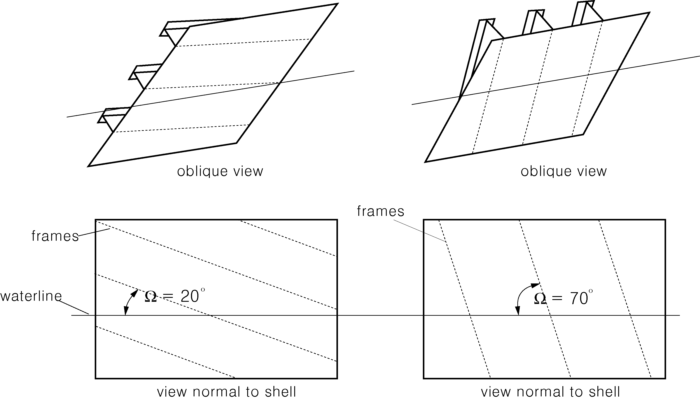
    Fig 2.3 Shell framing angle #eqnID-989

#### 205. Framing

- **1.** **General**
  - **(1)** Framing of Polar Class ships are to be designed to withstand the ice loads defined in **203.**
  - **(2)** The term "framing" refers to transverse and longitudinal local frames, load carrying stringers and web frames in the areas of the hull exposed to ice pressure, see **Fig 2.1**. Where load-distributing stringers have been fitted, the arrangement and scantlings of these are to be in accordance with the requirements of the Society. *(2017)*
  - **(3)** The strength of a framing member is dependent upon the fixity that is provided at its supports. Fixity can be assumed where framing members are either continuous through the support or attached to a supporting section with a connection bracket. In other cases, simple support is to be assumed unless the connection can be demonstrated to provide significant rotational restraint. Fixity is to be ensured at the support of any framing which terminates within an ice‐strengthened area.
  - **(4)** The details of framing member intersection with other framing members, including plated structures, as well as the details for securing the ends of framing members at supporting sections are to be in accordance with the requirements of the Society.
  - **(5)** The effective span of a framing is to be determined on the basis of its moulded length. If brackets are fitted, the effective span may be reduced in accordance with the usual practice of the Society. Brackets are to be configured to ensure stability in the elastic and post‐yield response regions.
  - **(6)** When calculating the section modulus and shear area of a framing member, net thicknesses of the web, flange (if fitted) and attached shell plating are to be used. The shear area of a framing member may include that material contained over the full depth of the member, i.e. web area including portion of flange, if fitted, but excluding attached shell plating.
  - **(7)** The actual net effective shear area, $A _{w}$, of a transverse or longitudial local frame is given by: *(2017)*
    $A _{w} = h t _{wn} \sin \varphi _{w} / 100$ ($\mathrm{cm}^2$)
    where
    $h$ = height of stiffener including thickness of face plate (mm) (see **Fig 2.4)**
    $t _{wn}$ = net web thickness ($\mathrm{mm}$)
    = $t _{w } - t _{c}$
    $t _{w}$ = as built web thickness (mm) (see **Fig 2.4**)
    $t _{c}$ = corrosion deduction (mm) to be subtracted from the web and flange thickness (as specified the Society, but not less than $t _{s}$ as required by **207. 3**).
    $\varphi _{w}$ = smallest angle between shell plate and stiffener web, measured at the midspan of the stiffener. (see **Fig 2.4**) The angle may be taken as 90 degrees provided the smallest angle is not less than 75 degrees.
  - **(8)** When the cross-sectional area of the attached plate exceeds the cross-sectional area of the frame, the actual net effective plastic section modulus, $Z _{p}$ of transverse or longitudial frame is given by: *(2017)*
    $Z _{p} = A _{pn} t _{pn} /20 + \frac{h _{w} ^{2} t _{wn} \sin \varphi _{w}}{2000} + A _{fn} (h _{fc} \sin \varphi _{w} - b _{w} \cos \varphi _{w} )/10$ (cm^3)
    where
    $h$, $t _{wn}$, $t _{c}$ and $w$ are as given in **205. 1** (7) and $S$ as given in **204. 2**
    $A _{pn}$ = net cross-sectional area of shell plating (cm^2)
    $t _{pn}$ = net shell plate thickness ($\mathrm{mm}$) (complying with $t _"net"$ as required by **204. 2**)
    $h _{w}$ = height of frame web (mm) (see **Fig 2.4**)
    $A _{fn}$ = net cross-sectional area of frame flange (cm^2)
    $h _{fc}$ = height of frame measured to centre of the flange area (mm) (see **Fig 2.4**)
    $b _{w}$ = distance from mid thickness plane of frame web to the centre of the flange area (mm) (see **Fig 2.4**)
    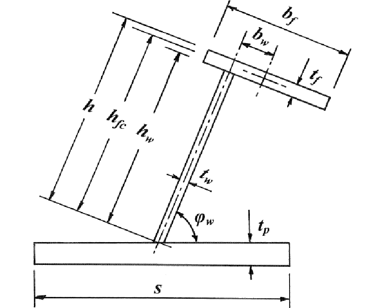
    Fig 2.4 Stiffener geometry
  - **(9)** When the cross-sectional area of the frame exceeds the cross-sectional area of the attached plate flange, the plastic neutral axis is located a distance $Z _{na}$ above the shell plate, given by: *(2017)*
    $Z _{na} = (100A _{fn} +h _{w} t _{wn} - 1000 t _{pn} S)/(2 t _{wn} )$ (mm)
    and the net effective plastic section modulus, $Z_p$ transverse or longitudial frame is given by:
    $Z _{p} = t _{pn} S \left( Z _{na} + \frac{t _{pn}}{2} \right) \sin \varphi _{w} + \left( \frac{((h _{w} -Z _{na} ^{} ) ^{2} +Z _{na} ^{2} )t _{wn} \sin \varphi _{w}}{2000} + \frac{A _{fn} ((h _{fc} -Z _{na} )\sin \varphi _{w} - b _{w} \cos \varphi _{w} )}{10} \right)$ (cm^3)
  - **(10)** In the case of oblique framing arrangement (70 *deg* > $\Omega$ > 20 *deg*, where $\Omega$ is defined as given in **204. 2**), linear interpolation is to be used.
- **2.** **Local frames in bottom structures and transverse local frame in side structures**
  - **(1)** The local frames in bottom structures (i.e. ice strengthening regions $B _{Ib}$, $M _{b}$ and $S _{b}$) and transverse frames in side structures are to be dimensioned such that the combined effects of shear and bending do not exceed the plastic strength of the member. Plastic strength is defined as the magnitude of midspan load that causes the development of a plastic collapse mechanism. For bottom structure the patch load shall be applied with the dimension (b) parallel with the frame direction. *(2017)*
  - **(2)** The actual net effective shear area of the frame, $A _{w}$ is shall not be less than the following calculation:
    $A _{w} =100 ^{2} \times 0.5 \times LL \times S \times (AF \times PPF \times P _{avg} )/(0.577 \sigma _{y} )$ ($\mathrm{cm}^2$)
    where
    $LL$ = length of loaded portion of span
    = lesser of $a$ and $b$ (m)
    $a$ = local frame span ($\mathrm{m}$)
    $b$ = height of design ice load patch as defined in **203. 3** (1) or (2) ($\mathrm{m}$)
    $S$ = local frame spacing ($\mathrm{m}$)
    $AF$ = hull area factor from **Table 2.4** or **Table 2.4-1**
    $PPF$= peak pressure factor, $PPF_t$ or $PPF_s$ as appropriate from **Table 2.3**
    $P _{avg}$ = average pressure within load patch as defined in **203. 4** (1) ($\mathrm{MPa}$)
    $\sigma _{y}$ = minimum yield stress of the material (N/mm^2)
  - **(3)** The actual net effective plastic section modulus of the frame, $Z _{p}$ is shall not be less than the following calculation(where $Z _{\pm}$ is to be the greater calculated on the basis of following two load conditions). The $A_1$ parameter in the equation reflects the two conditions: *(2017)*
    $Z _{\pm} = 100 ^{3} \times LL \times Y \times S \times (AF \times PPF \times P _{avg} ) a \times A _{1} /(4 \sigma _{y} )$ ($\mathrm{cm}^3$)
    where
    $LL$, $a$, $b$, $S$, $AF$, $PPF _{t}$, $P _{avg}$ and $\sigma _{y}$, are given in (2)
    $Y = 1-0.5 (LL/a)$
    $A _{1}$ = maximum of
    $A _{1A} = \frac{1}{(1+ \frac{j}{2} +k _{w} \frac{j}{2} ((1-a _{1} ^{2} ) ^{0.5} -1))}$
    $A _{1B} = \frac{1-1/(2 a _{1} Y)}{0.275+1.44 k _{z} ^{0.7}}$
    $j$ = 1 for local frame with one simple support outside the ice strengthened regions
    = 2 for local frame without any simple supports
    $a _{1} = A _{t} /A _{w}$
    $A _{t}$ = minimum shear area of the local frame as given in (2) ($\mathrm{cm}^2$)
    $A _{w}$ = active net shear area of the local frame (calculated according to **205. 1** (7)) ($\mathrm{cm}^2$)
    $k _{w} = 1/(1+2A _{fn} /A _{w} )$ with $A _{fn}$ as given in **205. 1** (8)
    $k _{z} = z _{p} /Z _{p}$ in general
    = 0.0 when the frame is arranged with end bracket
    $z _{p}$ = sum of individual plastic section modulus of flange and shell plate (cm^3)
    = $(b _{f} \frac{t _{fn} ^{2}}{4} +b _{eff} \frac{t _{pn} ^{2}}{4} )/1000$
    $b _{f}$ = flange breadth (mm) (see **Fig 2.4)**
    $t _{fn}$ = net flange thickness (mm)
    ($t_fn = t_f - t_c$, $t_c$ as given in **205. 1** (7))
    $t _{pn}$ = the fitted net shell plate thickness ($\mathrm{mm}$)
    (not to be less than $t_"net"$ as given in **204.**)
    $b _{eff}$= effective width of shell plate flange ($\mathrm{mm}$) = $500 s$
    $Z _{p}$ = plastic section modulus of local frame (cm^2) (calculated according to **205. 1** (8))
  - **(4)** The scantlings of the local frame are to meet the requirements of **Par 5.**
- **3.** **Longitudinal local frames in side structures**
  - **(1)** Longitudinal local frames in side structures are to be dimensioned such that the combined effects of shear and bending do not exceed the plastic strength of the member. Plastic strength is defined as the magnitude of midspan load that causes the development of a plastic collapse mechanism. *(2017)*
  - **(2)** The actual net effective shear area of the side longitudinal is shall not be less than the following calculation : *(2017)*
    $A _{L} = 100 ^{2} \times \frac{0.5b _{1} \times c \times (AF \times PPF _{s} \times P _{avg} )}{0.577 \sigma _{y}}$ ($\mathrm{cm}^2$)
    where
    $AF$ = hull area factor from **Table 2.4** or **Table 2.4-1**
    $PPF _{s}$= peak pressure factor from **Table 2.3**
    $P _{avg}$ = average pressure within load patch as defined in **203. 4** (1) ($\mathrm{MPa}$)
    $b _{1} = k _{0} b _{2}$
    $k _{o} = 1-0.3/b '$
    $b ' = b/S$
    $b$ = height of design ice load patch as defined in **203. 3** (1) or (2) (m)
    $S$ = main frame spacing (m)
    $b 2 & = b(1-0.25b ' ) &ifb ' < 2\#
    & = S &ifb ' \geq 2$
    $a$ = effective span of longitudinal local frames as given **205.1** (5)
    $\sigma_y$ = minimum yield stress of the material (N/mm^2)
  - **(3)** The actual net effective plastic section modulus of the plate/stiffener combination, $Z _{p}$ is shall not be less than the following calculation :
    $(Z _{pL} )= 100 ^{3} \times \frac{b _{1} \times a ^{2} \times A _{4} \times (AF \times PPF _{s} \times P _{avg} )}{8 \sigma _{y}}$ (cm^3)
    where
    $AF, PPF _{s} , P _{avg} , b _{1} , a, and \sigma _{y}$ are as given in (2)
    $A_4 = \frac{1}{2 + k_wl ((1-a_4 ^2 )^0.5 -1)}$
    $a _{4} = \frac{A _{L}}{A _{w}}$
    $A _{L}$ = required shear area for longitudinal as given in (2) (cm^2)
    $A _{w}$ = actual net effective shear area of longitudinal as given in (7) (cm^2)
    $k _{wl} = 1 / (1+2A _{fn} / A _{w} )$ with $A _{fn}$ as given in (8)
  - **(4)** The scantlings of the longitudinals are to meet the requirements of **Par 5.**
- **4.** **Web frame and stringers**
  - **(1)** Web frames and stringers are to be designed to withstand the ice load patch as defined in 203. The load patch is to be applied at locations where the capacity of these members under the combined effects of bending and shear is minimized.
  - **(2)** Web frames and stringers are to be dimensioned such that the combined effects of shear and bending do not exceed the limit state (s) defined by the Classification Society. Where the structural configuration is such that members do not form part of a grillage system, the appropriate peak pressure factor ($PPF$) from **Table 2.3** is to be used. Special attention is to be paid to the shear capacity in way of lightening holes and cut‐outs in way of intersecting members.
  - **(3)** For determination of scantlings of load carrying stringers, web frames supporting local frames, or web frames supporting load carrying stringers forming part of a structural grillage system, appropriate methods as outlined in 217. are normally to be used.
  - **(4)** The scantlings of web frames and stringers are to meet the requirements of **Par 5.**
- **5.** **Structural stability**
  - **(1)** To prevent local buckling in the web, the ratio of web height ($h _{w}$) to net web thickness ($t _{w}$) of any framing member is not to exceed:
    For flat bar sections: $h _{w} /t _{w} \leq 282 / \sigma ^{0.5}$
    For bulb, tee and angle sections: $h _{w} /t _{w} \leq 805 / \sigma ^{0.5}$
    where
    $h _{w}$ = web height
    $t _{w}$ = net web thickness
    $\sigma _{y}$ = minimum yield stress of the material (N/mm^2)
  - **(2)** Framing members for which it is not practicable to meet the requirements of (1) (e.g. stringers or deep web frames) are required to have their webs effectively stiffened. The scantlings of the web stiffeners are to ensure the structural stability of the framing member. The minimum net web thickness for these framing members is given by the following equation:
    $t _{w} = 2.63 \times 10 ^{-3} c _{1} \sqrt {\sigma _{y} over {5.34+4(c _{1} / c _{2} ) ^{2}$ (mm)
    where
    $t _{w}$ = net web thickness (mm)
    $c _{1} = h _{w} -0.8h _{f}$ (mm)
    $h _{w}$ = web height of stringer / web frame (mm) (see **Fig 2.5**)
    $h _{f}$ = height of framing member penetrating the member under consideration (0 if no such framing member) (mm) (see **Fig 2.5**)
    $c _{2}$ = spacing between supporting structure oriented perpendicular to the member under consideration (mm) (see **Fig 2.5**)
    $\sigma _{y}$ = minimum yield stress of the material (N/mm^2)
    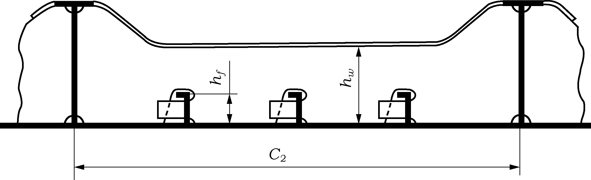
    Fig 2.5 Parameter definition for web stiffening
  - **(3)** In addition, the following is to be satisfied:
    $t _{w} \geq 0.35 t _{"net"} \sqrt {\frac{\sigma _{y}}{235}}$
    where
    $\sigma _{y}$ = minimum upper yield stress of the shell plate in way of the framing member (N/mm^2)
    $t _{w}$ = net thickness of the web
    $t _{"net"}$ = thickness of the shell plate in way the framing member
  - **(4)** To prevent local flange buckling of welded profiles, the following are to be satisfied:
    $\frac{b}{t _{f}} \leq \frac{155}{\sqrt {\sigma _{y}}}$
    where
    $t _{f}$ = net thickness of flange
    $\sigma _{y}$ = minimum upper yield stress of the material (N/mm^2)

#### 206. Plated structures

- **1.** Plated structures are those stiffened plate elements in contact with the hull and subject to ice loads. These requirements are applicable to an inboard extent which is the lesser of:
  - **(1)** web height of adjacent parallel web frame or stringer; or
  - **(2)** 2.5 times the depth of framing that intersects the plated structure
- **2.** The thickness of the plating and the scantlings of attached stiffeners are to be such that the degree of end fixity necessary for the shell framing is ensured.
- **3.** The stability of the plated structure is to adequately withstand the ice loads defined in **203.**

#### 207. Corrosion/abrasion additions and steel renewal

- **1.** Effective protection against corrosion and ice‐induced abrasion is recommended for all external surfaces of the shell plating for all Polar Class ships.
- **2.** The values of corrosion/abrasion additions, $t _{s}$, to be used in determining the shell plate thickness are listed in **Table 2.5.**
- **3.** Polar Class ships are to have a minimum corrosion/abrasion addition of $t _{s} = 1.0$mm applied to all internal structures within the ice‐strengthened regions, including plated members adjacent to the shell, as well as stiffener webs and flanges.
- **4.** Steel renewal for ice strengthened structures is required when the gauged thickness is less than $t _{"net"} + 0.5$mm.

  | Hull Area | $t_s$ (mm) |   |   |   |   |   |
  | --- | --- | --- | --- | --- | --- | --- |
  | Hull Area | With Effective Protection |   |   | Without Effective Protection |   |   |
  | Hull Area | PC1 ‐ PC3 | PC4 & PC5 | PC6 & PC7 | PC1 ‐ PC3 | PC4 & PC5 | PC6 & PC7 |
  | Bow; Bow Intermediate Icebelt | 3.5 | 2.5 | 2.0 | 7.0 | 5.0 | 4.0 |
  | Bow Intermediate Lower; Midbody & Stern Icebelt | 2.5 | 2.0 | 2.0 | 5.0 | 4.0 | 3.0 |
  | Midbody & Stern Lower; Bottom | 2.0 | 2.0 | 2.0 | 4.0 | 3.0 | 2.5 |

#### 208. Materials (2017)

- **1.** Steel grades of plating for hull structures are to be not less than those given in **Tables 2.7** based on the as built thickness, the Polar Class and the material class of structural members given in **2.**
- **2.** Material classes specified in **Pt 3, Ch 1 of the Rules for the Classification of Steel Ships,** **Table 3.1.4** are applicable to Polar Class ships regardless of the ship’s length. In addition, material classes for weather and sea exposed structural members and for members attached to the weather and sea exposed shell plating of polar ships are given in **Table 2.6.** Where the material classes in **Table 2.6**, and those in **Pt 3, Ch 1 Table 3.1.4 of the Rules for the Classification of Steel Ships** differ, the higher material class is to be applied.
- **3.** Steel grades for all plating and attached framing of hull structures and appendages situated below the level of 0.3 m below the lower waterline, as shown in **Fig 2.6**, are to be obtained from **Pt 3 Ch 1, Table 3.1.9** and **Table 3.1.10 of the Rules for the Classification of Steel Ships** based on the material class for structural members in **Table 2.6**, above, regardless of Polar Class.
- **4.** Steel grades for all weather exposed plating of hull structures and appendages situated above the level of 0.3 m below the lower ice waterline, as shown in **Fig 2.6**, are to be not less than given in **Table 2.7.**
- **5.** Castings are to have specified properties consistent with the expected service temperature for the cast component.

  | Structural Members | Material Class |
  | --- | --- |
  | Shell plating within the bow and bow intermediate icebelt hull regions (B, BIi) | II |
  | All weather and sea exposed SECONDARY and PRIMARY, as defined in **Pt 2, Ch 1 Table 3.1.4 of the Rules for the Classification of Steel Ships**, structural members outside $0.4 L$ amidships | I |
  | Plating materials for stem and stern frames, rudder horn, rudder, propeller nozzle, shaft brackets, ice skeg, ice knife and other appendages subject to ice impact loads | II |
  | All inboard framing members attached to the weather and sea‐exposed plating including any contiguous inboard member within 600 mm of the shell plating | I |
  | Weather‐exposed plating and attached framing in cargo holds of ships which by nature of their trade have their cargo hold hatches open during cold weather operations | I |
  | All weather and sea exposed SPECIAL, as defined in **Pt 2,** **Ch 1** **Table 3.1.4 of the Rules for the Classification of Steel Ships**, structural members within $0.2 L$ from FP | II |

  | Thickness, $t$(mm) | Material Class I |   |   |   | Material Class II |   |   |   | Material Class III |   |   |   |   |   |
  | --- | --- | --- | --- | --- | --- | --- | --- | --- | --- | --- | --- | --- | --- | --- |
  | Thickness, $t$(mm) | PC1‐5 |   | PC6&7 |   | PC1‐5 |   | PC6&7 |   | PC1‐3 |   | PC4&5 |   | PC6&7 |   |
  | Thickness, $t$(mm) | MS | HT | MS | HT | MS | HT | MS | HT | MS | HT | MS | HT | MS | HT |
  | $t \leq 10$ | B | AH | B | AH | B | AH | B | AH | E | EH | E | EH | B | AH |
  | $10 < t \leq 15$ | B | AH | B | AH | D | DH | B | AH | E | EH | E | EH | D | DH |
  | $15 < t \leq 20$ | D | DH | B | AH | D | DH | B | AH | E | EH | E | EH | D | DH |
  | $20 < t \leq 25$ | D | DH | B | AH | D | DH | B | AH | E | EH | E | EH | D | DH |
  | $25 < t \leq 30$ | D | DH | B | AH | E | EH | D | DH | E | EH | E | EH | E | EH |
  | $30 < t \leq 35$ | D | DH | B | AH | E | EH | D | DH | E | EH | E | EH | E | EH |
  | $35 < t \leq 40$ | D | DH | D | DH | E | EH | D | DH | F | FH | E | EH | E | EH |
  | $40 < t \leq 45$ | E | EH | D | DH | E | EH | D | DH | F | FH | E | EH | E | EH |
  | $45 < t \leq 50$ | E | EH | D | DH | E | EH | D | DH | F | FH | F | FH | E | EH |
  | Notes : 1) Includes weather‐exposed plating of hull structures and appendages, as well as their outboard framing members, situated above a level of 0.3 m below the lowest ice waterline. 2) Grades D, DH are allowed for a single strake of side shell plating not more than 1.8 m wide from 0.3 m below the lowest ice waterline. |   |   |   |   |   |   |   |   |   |   |   |   |   |   |

  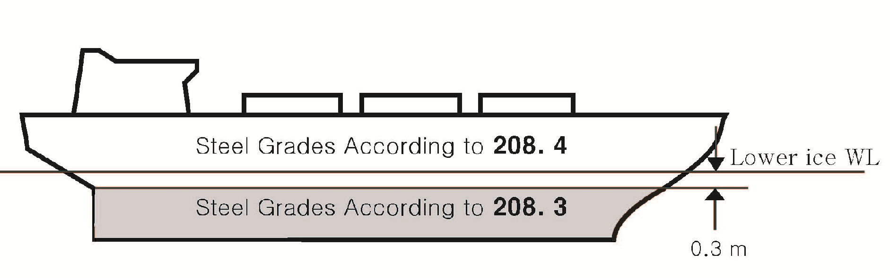
  **Fig 2.6 Steel grade requirements for submerged and weather exposed shell plating**

#### 209. Longitudinal strength

- **1.** **Application**
  - **(1)** A ramming impact on the bow is the design scenario for the evaluation of the longitudinal strength of the hull. *(2017)*
  - **(2)** Intentional ramming is not considered as a design scenario for ships which are designed with vertical or bulbous bows, (see **101. 6**). Hence the longitudinal strength requirements given in **209.**. is not to be considered for ships with stem angle, $\gamma_stem$ equal to or larger than 80 deg. *(2017)*
  - **(3)** Ice loads are only to be combined with still water loads. The combined stresses are to be compared against permissible bending and shear stresses at different locations along the ship’s length. In addition, sufficient local buckling strength is also to be verified.
- **2.** **Design vertical ice force at the bow**
  The design vertical ice force at the bow, $F _{IB}$, is to be taken as:
  $F _{IB} = \min(F _{IB,1} ; F _{IB,2} )$ (MN)
  where
  $F _{IB,1} = 0.534K _{I} ^{0.15} \sin ^{0.2} \gamma _{stern} (DK _{h} ) ^{0.5} CF _{L}$ (MN)
  $F _{IB,2} = 1.2 CF _{F}$ (MN)
  $K _{I}$ = indentation parameter = $K _{f} / K _{h}$
  - **(1)** for the case of a blunt bow form
    $K _{f} = \left( \frac{2CB ^{(1-e _{b} )}}{(1+e _{b} )} \right) ^{0.9} \tan( \gamma _{stem} ) ^{-0.9(1+e _{b} )}$
  - **(2)** for the case of wedge bow form ($\alpha _{stem} <80 deg$), $e _{b} = 1$ and the above simplifies to
    $K _{f} = \left( \frac{\tan( \alpha _{stem} )}{\tan ^{2} ( \gamma _{stem} )} \right) ^{0.9}$
    $K _{h} = 0.01A _{"wp"}$ (MN/m)
    $CF _{L}$ = Longitudinal Strength Class Factor from **Table 2.2**
    $e _{b}$ = bow shape exponent which best describes the waterplane (see **Fig 2.7** and 2**.8**)
    = 1.0 for a simple wedge bow form
    = 0.4 to 0.6 for a spoon bow form
    = 0 for a landing craft bow form
    An approximate $e_b$ determined by a simple fit is acceptable.
    $\gamma _{stem}$= stem angle to be measured between the horizontal axis and the stem tangent at the upper ice waterline (deg) (buttock angle as per **Fig 2.2** measured on the centerline)
    $\alpha_stem$= waterline angle measured in way of the stem at the upper ice waterline (UIWL) [deg] (see **Fig 2.2**)
    $C = \frac{1}{2 (L _{B} / B) ^{e _{b}}}$
    $B _{UI}$ = moulded breadth corresponding to the upper ice waterline (UIWL) (m)
    $L _{B}$ = bow length used in the equation $y =B/2 (x/L _{B} ) ^{e _{b}}$(m) (see **Fig 2.7** and 2**.8**)
    $D _{UI}$ = displacement (kt), where #eqnID-116910 kt
    $A _{"wp"}$ = waterplane area corresponding to the upper ice waterline (UIWL) (m^2)
    $CF _{F}$ = Flexural Failure Class Factor from **Table 2.2**
    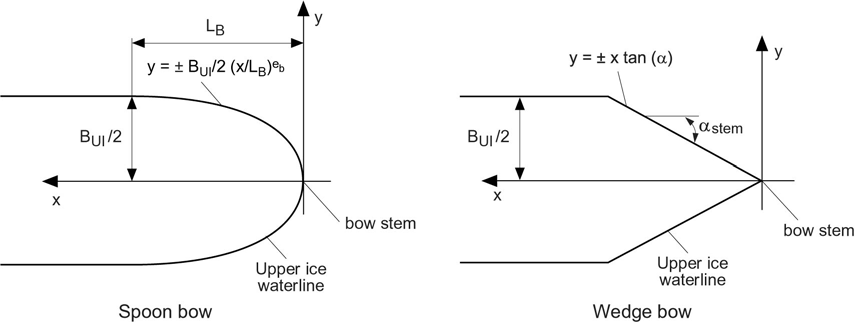
    Fig 2.7 Bow shape definition
    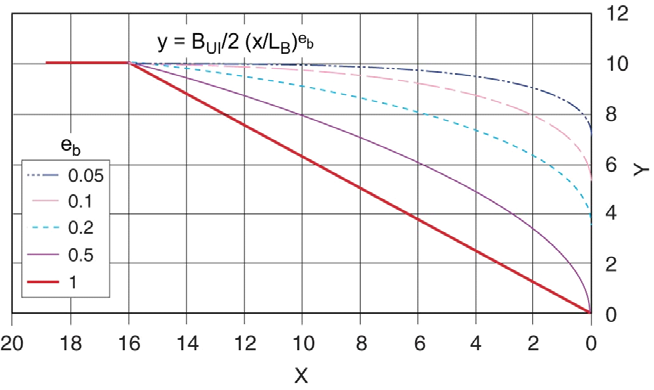
    Fig 2.8 Illustration of #eqnID-1172 effect on the bow shape for #eqnID-1173 = 20 and #eqnID-1174 =16
- **3.** **Design vertical ice shear force**
  - **(1)** The design vertical ice shear force,$F _{I}$, along the hull girder is to be taken as:
    $F _{I} = C _{f} F _{IB}$ (MN)
    where
    $C _{f}$ = longitudinal distribution factor to be taken as follows:
    $C _{f} = 0.0$ between the aft end of $L _{UI}$ and $0.6 L _{UI}$ from aft
    $C _{f} = 1.0$ between $0.9L _{UI}$ from aft and the forward end of $L _{UI}$
    $C _{f} = 0.0$ at the aft end of $L _{UI}$
    $C _{f} = -0.5$ between $0.2L _{UI}$ and $0.6L _{UI}$ from aft
    $C _{f} = 0.0$ between $0.8L _{UI}$ from aft and the forward end of $L _{UI}$
    Intermediate values are to be determined by linear interpolation
  - **(2)** The applied vertical shear stress, $\tau _{a}$, is to be determined along the hull girder in a similar manner as in **Pt 2 Ch 3, 402. 2 of the Rules for the Classification of Steel Ships** of the Rules by substituting the design vertical ice shear force for the design vertical wave shear force.
- **4.** **Design vertical ice bending moment**
  - **(1)** The design vertical ice bending moment,$M _{I}$, along the hull girder is to be taken as:
    $M _{I} = 0.1C _{m} L \sin ^{-0.2} ( \psi ) F _{IB}$(MN-m)
    where
    $L _{UI}$ = length (rule length as defined in **202. 2**) (m)
    $\psi$ = stem angle to be measured between the horizontal axis and the stem tangent at the upper ice waterline (deg)
    $F _{IB}$ = design vertical ice force at the bow (MN)
    $C _{m}$ = longitudinal distribution factor for design vertical ice bending moment to be taken as follows:
    $C _{m} = 0.0$ at the aft end of $L _{UI}$
    $C _{m} = 1.0$ between $0.5L _{UI}$ and $0.7L _{UI}$ from aft
    $C _{m} = 0.3$ at $0.95L _{UI}$ from aft
    $C _{m} = 0.0$ at the forward end of $L _{UI}$
    Intermediate values are to be determined by linear interpolation
  - **(2)** The applied vertical bending stress,$\sigma _{a}$, is to be determined along the hull girder in a similar manner as in **Pt 2, Ch 1, 402. 1 of the Rules for the Classification of Steel Ships.** of the Rules, by substituting the design vertical ice bending moment for the design vertical wave bending moment. The ship still water bending moment is to be taken as the permissible still water bending moment in sagging condition.
- **5.** **Longitudinal strength criteria**
  - **(1)** The strength criteria provided in **Table 2.9** are to be satisfied. The design stress is not to exceed the permissible stress.

    | Failure Mode | Applied Stress | Permissible Stress (when$\sigma _{y} / \sigma _{u} \leq 0.7$) | Permissible Stress (when$\sigma _{y} / \sigma _{u} > 0.7$) |
    | --- | --- | --- | --- |
    | Tension | $\sigma _{a}$ | $\eta \times \sigma _{y}$ | $\eta \times 0.41( \sigma _{u} + \sigma _{y} )$ |
    | Shear | $\tau _{a}$ | $\eta \times \frac{\sigma _{y}}{\sqrt {3}}$ | $\eta \times \frac{0.41( \sigma _{u} + \sigma _{y} )}{\sqrt {3}}$ |
    | Buckling | $\sigma _{a}$ | $\sigma _{c}$ for plating and for web plating of stiffeners $\sigma _{c} /1.1$ for stiffeners |   |
    | Buckling | $\tau _{a}$ | $\tau _{c}$ |   |

    where
    $\sigma _{a}$ = applied vertical bending stress (N/mm^2)
    $\tau _{a}$ = applied vertical shear stress (N/mm^2)
    $\sigma _{y}$ = minimum upper yield stress of the material (N/mm^2)
    $\sigma _{u}$ = ultimate tensile strength of material (N/mm^2)
    $\sigma _{c}$ = critical buckling stress in compression, according to **Pt 3, Ch 4 of the Rules for the Classification of Steel Ships** (N/mm^2)
    $\tau _{c}$ = critical buckling stress in shear, according to **Pt 3, Ch 4 of the Rules for the Classification of Steel Ships** (N/mm^2)
    $\eta$ = 0.8
    $\eta$ = 0.6 for ships which are assigned the additional notation "Icebreaker"

#### 210. Stem and stern frames

The stem and stern frame are to be designed according to the requirements of the Society. For PC6/PC7 ships requiring IA SUPER/IA equivalency, the stem and stern requirements of **Ch 1, 406. 1** and **407.** of the Rules may need to be additionally considered.

#### 211. Appendages (2017)

- **1.** All appendages are to be designed to withstand forces appropriate for the location of their attachment to the hull structure or their position within a hull area.
- **2.** Load definition and response criteria are to be determined by the Society.

#### 212. Local details

- **1.** For the purpose of transferring ice loads to supporting structure (bending moments and shear forces), local design details are to comply with the requirements by the Society. *(2017)*
- **2.** The loads carried by a member in way of cut‐outs are not to cause instability. Where necessary, the structure is to be stiffened.

#### 213. Direct calculations (2017)

- **1.** Direct calculations are not to be utilized as an alternative to the analytical procedures for the shell plating and local frame requirements given in **204, 205. 2,** and **205. 3.**
- **2.** Direct calculations are to be used for load carrying stringers and web frames forming part of a grillage system.
- **3.** Where direct calculation is used to check the strength of structural systems, the load patch specified in **203.** is to be applied without being combined with any other loads. The load patch is to be applied at locations where the capacity of these members under the combined effects of bending and shear is minimised. Special attention is to be paid to the shear capacity in way of lightening holes and cut-outs in way of intersecting members.
- **4.** The strength evaluation of web frames and stringers may be performed based on linear or non-linear analysis. Recognized structural idealisation and calculation methods are to be applied, but the detailed requirements are to be in accordance with the discretion of the Society. In the strength evaluation, the guidance given in **5.** and **6.** may generally be considered.
- **5.** If the structure is evaluated based on linear calculation methods, the following are to be considered:
  - **(1)** Web plates and flange elements in compression and shear to fulfil relevant buckling criteria as specified by the Society
  - **(2)** Nominal shear stresses in member web plates to be less than $\sigma_y / \sqrt 3$
  - **(3)** Nominal von Mises stresses in member flanges to be less than $1.15 \sigma_y$
- **6.** If the structure is evaluated based on non-linear calculation methods, the following are to be considered:
  - **(1)** The analysis is to reliably capture buckling and plastic deformation of the structure
  - **(2)** The acceptance criteria are to ensure a suitable margin against fracture and major buckling and yielding causing significant loss of stiffness
  - **(3)** Permanent lateral and out-of plane deformation of considered member are to be minor relative to the relevant structural dimensions
  - **(4)** Detailed acceptance criteria to be in accordance with the discretion of the Society.

#### 214. Welding

- **1.** All welding within ice‐strengthened regions is to be of the double-sided continuous type.
- **2.** Continuity of strength is to be ensured at all structural connections.

### Section 3 Machinery Requirements for Polar Class Ships (2024)

#### 301. Application

- **1.** The contents of this Section apply to main propulsion, steering gear, emergency and auxiliary systems essential for the safety of the ship and the crew.
- **2.** The vessel operating conditions are defined in **Sec 1**.
- **3.** The requirements herein are additional to those applicable for the basic open water class of the vessel.

#### 302. Drawings & particulars to be submitted and system design

- **1.** **Drawings & particulars to be submitted**
  - **(1)** Details of the intended environmental operational conditions and the required ice strengthening for the machinery, if different from ship’s ice class.
  - **(2)** Detailed drawings and descriptions of the main propulsion, steering, emergency and auxiliary machinery and information on the essential main propulsion load control functions. The descriptions are to include operational limitations.
  - **(3)** Description detailing where main, emergency and auxiliary systems are located and how they are protected to prevent problems from freezing, ice and snow accumulation and evidence of their capability to operate in the intended environmental conditions.
  - **(4)** Calculations and documentation indicating compliance with the requirements of this Section.
- **2.** **System design**
  - **(1)** Systems subject to damage by freezing, shall be drainable.
  - **(2)** Vessels classed PC1 to PC5 inclusive shall have means provided to ensure sufficient vessel operation in the case of propeller damage including the Controllable Pitch (CP) mechanism. Sufficient vessel operation means that the vessel should be able to reach safe haven (safe location) where repairs can be undertaken. This may be achieved either by a temporary repair at sea, or by towing, assuming assistance is available. This would lead however to a condition of approval.
  - **(3)** Means shall be provided to free a stuck propeller by turning it in reverse direction. This shall also be possible for a propulsion plant intended for unidirectional rotation.
  - **(4)** The propeller shall be fully submerged at the ships LIWL.

#### 303. Materials

Materials shall be of an approved ductile material. Ferritic nodular cast iron may be used for parts other than bolts. For nodular cast iron an averaged impact energy value of 10 J at testing temperature is regarded as equivalent to the Charpy V test requirements defined below.

- **1.** **Materials exposed to sea water**
  Materials exposed to sea water, such as propeller blades, propeller hubs and cast thruster bodies shall have an elongation not less than 15% on a test specimen according to **Pt 2, Ch 1, Sec 2** of **the Rules for the Classification of Steel Ships**. Charpy V-notch impact testing is to be carried out for materials other than bronze and austenitic steel. The tests shall be carried out on three specimens at minus 10℃, and the average energy value is to be not less than 20 J. However, Charpy V impact test requirements of **Pt 2, Ch 1, 505.** or **601.** of **the Rules for the Classification of Steel Ships** as applicable for ships with ice class notation, shall also be applied to ships covered by this Section.
- **2.** **Materials exposed to sea water temperature**
  Charpy V-notch impact testing is to be carried out for materials other than bronze and austenitic steel. The tests shall be carried out on three specimens at minus 10 ºC, and the average energy value is to be not less than 20 J. However, the Charpy V impact test requirements of **Pt 2, Ch 1, 601.** of **the Rules for the Classification of Steel Ships** as applicable for ships with ice class notation, shall also be applied to ships covered by this Section. This requirement applies to components such as but not limited to blade bolts, CP-mechanisms, shaft bolts, propeller shaft, strut-pod connecting bolts, etc. This requirement does not apply to surface hardened components, such as bearings and gear teeth or sea water cooling lines (heat exchangers, pipes, valves, fittings etc.). For a definition of structural boundaries exposed to sea water temperature see **Sec 2, Fig 2.6**.
- **3.** **Material exposed to low air temperature**
  Materials of exposed machinery and foundations shall be manufactured from steel or other approved ductile material. An average impact energy value of 20 J taken from three Charpy V tests is to be obtained at 10℃ below the lowest design temperature. Charpy V impact tests are not required for bronze and austenitic steel. This requirement does not apply to surface hardened components, such as bearings and gear teeth. For a definition of structural boundaries exposed to air temperature see **Sec 2, Fig 2.6**.

#### 304. Definitions

- **1.** **Definition of Symbols**
  $c$ = chord length of blade section (m)
  $c _{0.7}$ = chord length of blade section at 0.7R propeller radius (m)
  CP = controllable pitch
  $D$ = propeller diameter (m)
  $d$ = external diameter of propeller hub (at propeller plane) (m)
  $d _{p i n}$ = diameter of shear pin (mm)
  $D _{l im i t}$ = limit value for propeller diameter (m)
  $EAR$ = expanded blade area ratio
  $F _{b}$ = maximum backward blade force for the ship’s service life (negative sign) (kN)
  $F _{ex}$ = ultimate blade load resulting from blade loss through plastic bending (kN)
  $F _{f}$ = maximum forward blade force for the ship’s service life (positive sign) (kN)
  $F _{ice}$ = ice load (kN)
  $(F _{ice} ) _{\max}$ = maximum ice load for the ship’s service life (kN)
  $FP$ = fixed pitch
  $h _{0}$ = depth of the propeller centerline from lower ice waterline (LIWL) (m)
  $H _{ice}$ = ice block dimension for propeller load definition (m)
  $I _{}$ = equivalent mass moment of inertia of all parts on engine side of component under consideration (kgm^2)
  $I _{t}$ = equivalent mass moment of inertia of the whole propulsion system (kgm^2)
  $k$ = shape parameter for Weibull distribution
  $LIWL$ = lower ice waterline (m)
  $m$ = slope for S-N curve in log/log scale
  $M _{BL}$ = blade bending moment (kN･m)
  $MCR$ = maximum continuous rating
  $N$ = number of ice load cycles
  $n$ = propeller rotational speed (rev./s)
  $n _{n}$ = nominal propeller rotational speed at MCR in free running condition (rev./s)
  $N _{class}$ = reference number of impacts per propeller revolution per ice class
  $N _{ice}$ = total number of ice loads cycles on propeller blade for the ship’s service life
  $N _{R}$ = reference number of ice load cycles for equivalent fatigue stress ($10 ^{8}$ cycles)
  $N _{Q}$ = number of propeller revolutions during a milling sequence
  $P _{0.7}$ = propeller pitch at 0.7R radius (m)
  $P _{0.7n}$ = propeller pitch at 0.7R radius at MCR in free running condition (m)
  $P _{0.7b}$ = propeller pitch at 0.7R radius at MCR in bollard condition (m)
  $PCD$ = pitch circle diameter
  $Q( \varphi )$ = torque (kN･m)
  $Q _{Amax}$ = maximum response torque amplitude as a simulation result (kN･m)
  $Q _{emax}$ = maximum engine torque (kN･m)
  $Q _{F} ( \varphi )$ = ice torque excitation for frequency domain calculations (kN･m)
  $Q _{fr}$ = friction torque in pitching mechanism; reduction of spindle torque (kN･m)
  $Q _{\max}$ = maximum torque on the propeller resulting from propeller-ice inter action (kN･m)
  $Q _{ motor}$ = electric motor peak torque (kN･m)
  $Q _{n}$ = nominal torque at MCR in free running condition (kN･m)
  $Q _{r} (t)$ = response torque along the propeller shaft line (kN･m)
  $Q _{peak}$ = maximum of the response torque $Q _{r} (t)$ (kN･m)
  $Q _{smax}$ = maximum spindle torque of the blade for the ship’s service life (kN･m)
  $Q _{sex}$ = maximum spindle torque due to blade failure by plastic bending (kN･m)
  $Q _{vib}$ = Vibratory torque at considered component, taken from frequency domain open water TVC (kN･m)
  $R$ = propeller radius (m)
  $S$ = safety factor
  $S _{fat}$ = safety factor for fatigue
  $S _{ice}$ = ice strength index for blade ice force
  $r$ = blade section radius (m)
  $T$ = hydrodynamic propeller thrust in bollard condition (kN)
  $T _{b}$ = maximum backward propeller ice thrust for the ship’s service life (kN)
  $T _{f}$ = maximum forward propeller ice thrust for the ship’s service life (kN)
  $T _{n}$ = propeller thrust at $MCR$ in free running condition (kN)
  $T _{r}$ = maximum response thrust along the shaft line (kN)
  $T _{kmax}$ = maximum torque capacity of flexible coupling (kN･m)
  $T _{kmax2}$ = $T _{kmax}$ at $N=1$ load cycle (kN･m)
  $T _{kmax1}$ = $T _{kmax}$ at $N=5 \times 10 ^{ 4}$ load cycles (kN･m)
  $T _{kv}$ = vibratory torque amplitude at $N=10 ^{ 6}$ load cycles (kN･m)
  $\Delta T _{kmax}$ = maximum range of $T _{kmax}$ at $N=5 \times 10 ^{ 4}$ load cycles (kN･m)
  $t$ = maximum blade section thickness (m)
  $Z$ = number of propeller blades
  $\alpha _{i}$ = duration of propeller blade/ice interaction expressed in rotation angle (deg)
  $\gamma _{\varepsilon }$ = the reduction factor for fatigue; scatter and test specimen size effect
  $\gamma _{\nu }$ = the reduction factor for fatigue; variable amplitude loading effect
  $\gamma _{m}$ = the reduction factor for fatigue; mean stress effect
  $\rho$ = a reduction factor for fatigue correlating the maximum stress amplitude to the equivalent fatigue stress for $10 ^{8}$ stress cycles
  $\sigma _{0.2}$ = proof yield strength (at 0.2% plastic strain) of material (MPa)
  $\sigma _{\exp}$ = mean fatigue strength of blade material at $10 ^{8}$ cycles to failure in sea water (MPa)
  $\sigma _{fat}$ = equivalent fatigue ice load stress amplitude for $10 ^{8}$ stress cycles (MPa)
  $\sigma _{fl}$ = characteristic fatigue strength for blade material (MPa)
  $\sigma _{ref1}$ = reference stress $\sigma _{ref1} =0.6 \cdot \sigma _{0.2} +0.4 \cdot \sigma _{u}$ (MPa)
  $\sigma _{ref2}$ = reference stress $\sigma _{ref2} = 0.7 \cdot \sigma _{u}$ or $\sigma _{ref2} = 0.6 \cdot \sigma _{0.2} + 0.4 \cdot \sigma _{u}$ whichever is less (MPa)
  $\sigma _{st}$ = maximum stress resulting from $F _{b}$ or $F _{f}$ (MPa)
  $\sigma _{u}$ = ultimate tensile strength of blade material (MPa)
  $(\sigma _{ice} ) _{bmax}$ = principal stress caused by the maximum backward propeller ice load (MPa)
  $( \sigma _{ice} ) _{fmax}$ = principal stress caused by the maximum forward propeller ice load (MPa)
  $( \sigma _{ice} ) _{Amax}$ = maximum ice load stress amplitude at the considered location on the blade (MPa)
  $\sigma _{mean}$ = mean stress (MPa)
  $( \sigma _{ice} ) _{A} (N)$= blade stress amplitude distribution (MPa)
- **2.** **Definition of Loads**
  The definitions of loads are given in **Table 2.10**.

  |   | Definition | Use of the load in design process |
  | --- | --- | --- |
  | $F _{b}$ | The maximum lifetime backward force on a propeller blade resulting from propeller/ice interaction, including hydrodynamic loads on that blade. The direction of the force is perpendicular to chord line. See **Fig 2.9**. | Design force for strength calculation of the propeller blade. |
  | $F _{f}$ | The maximum lifetime forward force on a propeller blade resulting from propeller/ice interaction, including hydrodynamic loads on that blade. The direction of the force is perpendicular to 0.7R chord line. | Design force for calculation of strength of the propeller blade. |
  | $Q _{smax}$ | The maximum lifetime spindle torque on a propeller blade resulting from propeller/ice interaction, including hydrodynamic loads on that blade. | In designing the propeller strength, the spindle torque is automatically taken into account because the propeller load is acting on the blade as distributed pressure on the leading edge or tip area. |
  | $T _{b}$ | The maximum lifetime thrust on propeller (all blades) resulting from propeller/ice interaction. The direction of the thrust is the propeller shaft direction and the force is opposite to the hydrodynamic thrust. | Is used for estimation of the response thrust $T _{r}$, $T _{b}$ can be used as an estimate of excitation for axial vibration calculations. However, axial vibration calculations are not required in the Rules. |
  | $T _{f}$ | The maximum lifetime thrust on propeller (all blades) resulting from propeller/ice interaction. The direction of the thrust is the propeller shaft direction acting in the direction of hydrodynamic thrust. | Is used for estimation of the response thrust $T _{r}$.$T _{f}$ can be used as an estimate of excitation for axial vibration calculations. However, axial vibration calculations are not required in the Rules. |
  | $Q _{ma x}$ | The maximum ice-induced torque resulting from propeller/ice interaction on one propeller blade, including hydrodynamic loads on that blade. | Is used for estimation of the response torque $Q _{r}$ along the propulsion shaft line and as excitation for torsional vibration calculations. |
  | $F _{ex}$ | Ultimate blade load resulting from blade loss through plastic bending. The force that is needed to cause total failure of the blade so that plastic hinge is caused to the root area. The force is acting on 0.8R. | Blade failure load is used to dimension the blade bolts, pitch control mechanism, propeller shaft, propeller shaft bearing and trust bearing. The objective is to guarantee that total propeller blade failure should not cause damage to other components. |
  | $Q _{sex}$ | Maximum spindle torque resulting from blade failure load. | Is used to ensure pyramid strength principle for the pitching mechanism. |
  | $Q _{r}$ | Maximum response torque along the propeller shaft line, taking into account the dynamic behaviour of the shaft line for ice excitation (torsional vibration) and hydrodynamic mean torque on propeller. | Design thrust for propeller shaft line components. |
  | $T _{r}$ | Maximum response thrust along shaft line, taking into account the dynamic behaviour of the shaft line for ice excitation (axial vibration) and hydrodynamic mean thrust on propeller. | Design thrust for propeller shaft line components. |

  | 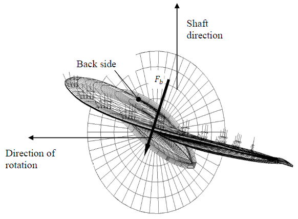 |
  | --- |
  | Fig 2.9 Direction of the backward blade force resultant taken perpendicular to the chord line at radius 0.7R. Ice contact pressure at leading edge is shown with small arrows. |

#### 305. Design Ice Loads

- **1.** **General**
  - **(1)** These Rules cover open and ducted type propellers situated at the stern of a vessel having controllable pitch or fixed pitch blades. Ice loads on bow-mounted propellers shall receive special consideration at the discretion of the Society. The given loads are expected, single occurrence, maximum values for the whole ship’s service life for normal operational conditions, including loads resulting from directional change of rotation where applicable.
  - **(2)** These loads do not cover off-design operational conditions, for example when a stopped propeller is dragged through ice. These Rules also cover loads due to propeller ice interaction for azimuthing and fixed thrusters with geared transmission or an integrated electric motor (“geared or podded propulsors”). However, the load models of the regulations do not include propeller/ice interaction loads when ice enters the propeller of a turned azimuthing thruster from the side (radially) or loads when ice blocks hit on the propeller hub of a pulling propeller.
  - **(3)** Ice loads resulting from ice impacts on the body of thrusters shall be estimated on a case by case basis, however are not included within the this section.
  - **(4)** The loads given in **Par 3** are total loads including ice-induced loads and hydrodynamic loads (unless otherwise stated) during ice interaction and are to be applied separately (unless otherwise stated) and are intended for component strength calculations only.
  - **(5)** $F _{b}$ is the maximum force experienced during the lifetime of the ship that bends a propeller blade backwards when the propeller mills an ice block while rotating ahead. $F _{f}$ is the maximum force experienced during the lifetime of the ship that bends a propeller blade forwards when the propeller mills an ice block while rotating ahead. $F _{b}$ and $F _{f}$ originate from different propeller/ice interaction phenomena, which do not act simultaneously. Hence they are to be applied separately.
- **2.** **Ice class factors**
  The dimensions of the considered design ice block are $H _{ice} \times 2H _{ice} \times 3H _{ice}$. The design ice block and ice strength index ($S _{ice}$) are used for the estimation of propeller ice loads. Both $H _{ice}$ and $S _{ice}$ are defined for each Ice class in **Table 2.11** below.

  **Table 2.11 Ice class factors**

  | Ice class | $H _{ice}$ [m] | $S _{ice}$ [-] |
  | --- | --- | --- |
  | PC1 | 4.0 | 1.2 |
  | PC2 | 3.5 | 1.1 |
  | PC3 | 3.0 | 1.1 |
  | PC4 | 2.5 | 1.1 |
  | PC5 | 2.0 | 1.1 |
  | PC6 | 1.75 | 1 |
  | PC7 | 1.5 | 1 |
- **3.** **Propeller Ice Interaction Loads**
  - **(1)** Maximum backward blade force, $F _{b}$ for open propellers
    when $Dwhen \(D \geq D _{l i m i t} it$, $F _{b} = 23 \cdot S _{ice} \cdot \left[ nD \right] ^{0.7} \cdot \left[ \frac{EAR}{Z} \right] ^{0.3} \cdot [H _{ice} ] ^{1.4} \cdot D$ (kN
    where:
    $D _{l i m i t} it =0.85 \cdot \left[ H _{ice} \right] ^{1.4}$ (m)
    Here $n$ is the nominal rotational speed at MCR in the free running open water condition for CP-propellers and 85% of the nominal rotational speed (at MCR free running condition) for a FP-propeller (regardless driving engine type) (rps)
    For vessels with the additional notation “Icebreaker”, the above stated backward blade force $F _{b}$ shall be multiplied by a factor of 1.1.
  - **(2)** Maximum forward blade force $F _{f}$ for open propellers
    when $Dwhen \(D \geq D _{l i m i t}$, $F _{f} =500 \cdot \left[ \frac{1}{(1- \frac{d}{D} )} \right] \cdot H _{ice} \cdot \left[ \frac{EAR}{Z} \right] \cdot D$ (kN)
    where:
    $D _{l i m i t} it = \left[ \frac{2}{(1- \frac{d}{D} )} \right] \cdot H _{ice}$ (m)
  - **(3)** Loaded area on the blade for open propellers
    Load cases 1 ~ load cases 4 shall be covered, as given in **Table 2.1** of **Annex 2** for CP and FP propellers. In order to obtain blade ice loads for a reversing propeller, load case 5 shall also be covered for propellers where reversing is possible.
  - **(4)** Maximum backward blade ice force $F _{b}$ for ducted propellers
    when $Dwhen \(D \geq D _{l i m i t} it$, $F _{b} = 66 \cdot S _{ice} \cdot [nD] ^{0.7} \cdot \left[ \frac{EAR}{Z} \right] ^{0.3} \cdot \left[ H _{ice} \right] ^{1.4} \cdot D ^{0.6}$ (kN)
    where:
    $D _{l i m i t} it =4 \cdot H _{ice}$
    $n$ is to be taken as in (1)
    For vessels with the additional notation “Icebreaker”, the above stated backward blade force $F _{b}$ shall be multiplied by a factor 1.1.
  - **(5)** Maximum forward blade ice force $F _{f}$ for ducted propellers
    when $D \leq D _{l i m i t} it$, $F _{f} =250 \cdot \left[ \frac{EAR}{Z} \right] \cdot D ^{2}$ (kN)
    when $D>D _{l i m i t} it$, $F _{f} =500 \cdot \left[ \frac{EAR}{Z} \right] \cdot D \cdot \frac{1}{\left[ 1- \frac{d}{D} \right]} \cdot H _{ice}$ (kN)
    where:
    $D _{l i m i t} it = \frac{2}{\left[ 1- \frac{d}{D} \right]} \cdot H _{ice}$ (m)
  - **(6)** Loaded area on the blade for ducted propellers
    Load cases 1 and 3 shall be covered as given in **Table 2.2** of **Annex 2** for all propellers. In order to obtain blade ice loads for a reversing propeller, load case 5 shall also be covered for propellers, where reversing is possible.
  - **(7)** Maximum blade spindle torque $Q _{smax}$ for open and ducted propellers
    The spindle torque $Q _{smax}$ around the axis of the blade fitting shall be determined both for the maximum backward blade force $F _{b}$ and forward blade force $F _{f}$, which are applied as per **Table 2.1** and **Table 2.2** of **Annex 2**. If the above method gives a value which is less than the default value given by the formula below, the default value shall be used.
    Default Value $Q _{smax} =0.25ㆍFㆍc _{0.7}$ (kN･m)
    where:
    $F$ is either $F _{b}$ or $F _{f}$ which ever has the greater absolute value.
    The blade failure spindle torque $Q _{sex}$ is defined under **Par 4**.
  - **(8)** Load distributions (spectra) for blade loads
    The Weibull-type distribution (probability that $F _{ice}$ exceeds $(F _{ice} ) _{\max}$), as given in **Fig 2.10** is used for the fatigue design of the blade.
    $P \left( \frac{F _{ice}}{\left( F _{ice} \right) _{\max}} \geq \frac{F}{\left( F _{ice} \right) _{\max}} \right) =e ^{\left( - \left( \frac{F}{\left( F _{ice} \right) _{\max}} \right) ^{k} \cdot \ln \left( N _{ice} \right) \right)}$
    where:
    $k$ = shape parameter of the spectrum
    $N _{ice}$ = number of load cycles in the spectrum, see (9)
    $F_{ ice}$ = random variable for ice loads on the blade, $0 \leq F _{ice} \leq (F _{ice} ) _{\max}$
    This results in a blade stress amplitude distribution
    $( \sigma _{ice} ) _{A} (N)=( \sigma _{ice} ) _{Amax} \cdot (1- \frac{\log(N)}{\log(N _{ice} )} ) ^{\frac{1}{k}}$
    where:
    $( \sigma _{ice} ) _{Amax} = \frac{( \sigma _{ice} ) _{fmax} -( \sigma _{ice} ) _{bmax}}{2}$
    The shape parameter $k$ = 0.75 shall be used for the ice force distribution of an open propeller and the shape parameter $k$ = 1.0 for that of a ducted propeller blade.

    |  |
    | --- |
    | **Fig** **2.10** **The Weibull-type distribution (probability that** $F _{ice}$ **exceeds** $(F _{ice} ) _{\max}$**)** **that is used for fatigue design.** |
  - **(9)** Number of ice loads
    Number of load cycles $N _{ice}$ in the load spectrum per blade is to be determined according to the formula:
    $N _{ice} =k _{1} \cdot k _{2} \cdot N _{class} \cdot n$
    where:
    $N _{class}$ = reference number of impacts per propeller revolution for each ice class (**Table 2.12**)

    **Table 2.12 Reference number of impacts**

    | Ice class | PC1 | PC2 | PC3 | PC4 | PC5 | PC6 | PC7 |
    | --- | --- | --- | --- | --- | --- | --- | --- |
    | $N _{class}$ | $21 \times 10 ^{6}$ | $17 \times 10 ^{6}$ | $15 \times 10 ^{6}$ | $13 \times 10 ^{6}$ | $11 \times 10 ^{6}$ | $9 \times 10 ^{6}$ | $6 \times 10 ^{6}$ |

    $k _{1}$ = 1 for centre propeller
    = 2 for wing propeller
    = 3 for pulling propeller (wing and centre)
    $k _{2}$ = $0.8-f$ when $f <0$
    = $0.8-0.4 \cdot f$ when $0 \leq f \leq 1$
    = $0.6-0.2 \cdot f$ when $1 = \(0.1$ when $f >2.5$
    where the immersion function $f$ is:
    $f= \frac{h _{0} -H _{ice}}{D/2} -1$
    If $h _{0}$ is not known, $h _{0} =D/2$
    For vessels with the additional notation “Icebreaker”, the above stated number of load cycles $N _{ice}$ shall be multiplied by a factor of 3. For components that are subject to loads resulting from propeller/ice interaction with all the propeller blades, the number of load cycles $N _{ice}$ is to be multiplied by the number of propeller blades $Z$.
- **4.** **Blade Failure Load for both Open and Ducted Propellers**
  - **(1)** Bending Force, $F _{ex}$
    The minimum load required resulting in blade failure through plastic bending. This shall be calculated iteratively along the radius of the blade from blade root to 0.5R using below Equation with the ultimate load assumed to be acting at 0.8R in the weakest direction.
    The blade failure load is:
    $F _{ex} = \frac{0.3ㆍcㆍt ^{2} ㆍ \sigma _{ref1}}{0.8ㆍD-2ㆍr} 10 ^{3}$ (kN)
    where:
    $\sigma _{ref1} =0.6 \cdot \sigma _{0.2} +0.4 \cdot \sigma _{u}$
    $\sigma _{u}$ (minimum ultimate tensile strength to be specified on the drawing) and $\sigma _{0.2}$ (minimum yield or 0.2% proof strength to be specified on the drawing) are representative values for the blade material
    $c$, $t$ and $r$(see **Ch 1, 605. Fig 1.11**) are respectively the actual chord length, maximum thickness and radius of the cylindrical root section of the blade, which is the weakest section outside the root fillet located typically at the termination of the fillet into the blade profile.
    The Society may approve alternative means of failure load calculation by means of an appropriate stress analysis reflecting the non-linear plastic material behaviour of the actual blade. A blade is regarded as having failed, if the tip is bent by more than 10% of the propeller diameter $D$.
  - **(2)** Spindle Torque, $Q _{sex}$
    The maximum spindle torque due to a blade failure load acting at 0.8R shall be determined. The force that causes blade failure typically reduces when moving from the propeller centre towards the leading and trailing edges. At a certain distance from the blade centre of rotation the maximum spindle torque will occur. This maximum spindle torque shall be defined by an appropriate stress analysis or using equation below.
    $Q _{sex} =\max(C _{L E 0.8} ;0.8 \cdot C _{TE 0.8} ) \cdot C _{spex} \cdot F _{ex}$ (kN･m)
    where:
    $C _{spex} =C _{sp} \cdot C _{fex} =0.7 \cdot (1-(4 \cdot \frac{EAR}{Z} ) ^{3} )$
    $C _{sp}$ is non-dimensional parameter taking into account the spindle arm
    $C _{fex}$ is non-dimensional parameter taking into account the reduction of blade failure force at the location of maximum spindle torque.
    If $C _{spex}$ is below 0.3, a value of 0.3 shall be used for $C _{spex}$.
    $C _{L E 0.8}$ is the leading edge portion of the chord length at 0.8R
    $C _{TE 0.8}$ is the trailing edge portion of the chord length at 0.8R
    The **Fig 2.11** illustrates the spindle torque values due to blade failure loads across the whole chord length.

    |  |
    | --- |
    | **Fig 2.11** **Schematic figure showing blade failure load and related spindle torque when the force acts at different location on the chord line at radius 0.8R.** |
- **5.** **Axial design loads acting on open and ducted propellers**
  - **(1)** Maximum ice thrust on propeller $T _{f}$ and $T _{b}$ acting on open and ducted propellers
    The maximum forward and backward ice thrusts are given by the following formula:
    $T _{f} =1.1 \cdot F _{f}$ (kN)
    $T _{b} =1.1 \cdot F _{b}$ (kN)
    However, the load models within this UR do not include propeller/ice interaction loads where an ice block hits the propeller hub of a pulling propeller.
  - **(2)** Design thrust along the propulsion shaft line for open and ducted propellers
    The design thrust along the propeller shaft line is to be calculated with the formulae below. The greater value of the forward and backward directional load shall be taken as the design load for both directions. The factors 2.2 and 1.5 take into account the dynamic magnification resulting from axial vibration.
    In a forward direction: $T _{r} =T+2.2 \cdot T _{f}$ (kN)
    In a backward direction: $T _{r} =1.5 \cdot T _{b}$ (kN)
    If the hydrodynamic bollard thrust, $T _{}$, is not known, $T _{}$ is to be taken as follows:

    **Table 2.13 Guidance for bollard thrust values**

    | Propeller Type | $T$ |
    | --- | --- |
    | CP propellers (open) | $1.25 \cdot T _{n}$ |
    | CP propellers (ducted) | $1.1 \cdot T _{n}$ |
    | FP propellers driven by turbine or electric motor | $T _{n}$ |
    | FP propellers driven by reciprocating internal combustion engine (open) | $0.85 \cdot T _{n}$ |
    | FP propellers driven by reciprocating internal combustion engine (ducted) | $0.75 \cdot T _{n}$ |
    | Here, $T _{n}$ is the nominal propeller thrust at MCR in the free running open water condition. |   |

    For pulling type propellers ice interaction loads on propeller hub must be considered in addition to the above. These will be specially considered by the Society.
- **6.** **Torsional design loads acting on open and ducted propellers**
  - **(1)** Design ice torque on propeller $Q _{\max}$ for open propellers
    $Q _{\max}$ is the maximum torque on a propeller resulting from ice/propeller interaction.
    when $D \(Q _{\max} = k _{open} \cdot [1- \frac{d}{D} ] \cdot [ \frac{P _{0.7}}{D} ] ^{ 0.16} \cdot \left[ nD \right] ^{0.17} \cdot D ^{3}$ (kN･m)
    where:
    $k _{open}$ = 14.7 PC1 ~ PC5; and
    $k _{open}$ = 10.9 PC6 ~ PC7
    when $D \geq D _{l i m i t it}$:
    $Q _{\max} = 1.9 \cdot k _{open} \cdot [1- \frac{d}{D} ] \cdot [H _{ice} ] ^{1.1} \cdot [ \frac{P _{0.7}}{D} ] ^{0.16} \cdot \left[ nD \right] ^{0.17} \cdot D ^{1.9}$ (kN･m)
    where:
    $D _{l i m i t} it =1.8 \cdot H _{ice}$ (m)
    $n$ is the rotational propeller speed in rev/s in bollard condition. If not known, $n$ is to be taken as following **Table 2.14**.

    **Table 2.14 Guidance for rotational speeds to calculate torsional loads**

    | Propeller type | $n$ |
    | --- | --- |
    | CP propellers | $n _{n}$ |
    | FP propellers driven by turbine or electric motor | $n _{n}$ |
    | FP propellers driven by reciprocating nternal combustion engine | $0.85 \cdot n _{n}$ |

    For CP propellers, the propeller pitch $P _{0.7}$ shall correspond to MCR in bollard condition. If not known, $P _{0.7}$ is to be taken as $0.7 \cdot P _{0.7n}$, where $P _{0.7n}$ is the propeller pitch at MCR in free running condition.
  - **(2)** Design ice torque on propeller $Q _{\max}$ for ducted propellers
    when $D \(Q _{\max} = k _{ducted} \cdot [1- \frac{d}{D} ] \cdot [ \frac{P _{0.7}}{D} ] ^{ 0.16} \cdot \left[ nD \right] ^{0.17} \cdot D ^{ 3}$ (kN･m)
    where:
    $k _{ducted}$ = 10.4 PC1 ~ PC5; and
    $k _{ducted}$ = 7.7 PC6 ~ PC7
    when $D \geq D _{l i m i t it}$:
    $Q _{\max} = 1.9 \cdot k _{ducted} \cdot [1- \frac{d}{D} ] \cdot [H _{ice} ] ^{1.1} \cdot [ \frac{P _{0.7}}{D} ] ^{0.16} \cdot \left[ nD \right] ^{0.17} \cdot D ^{1.9}$ (kN･m)
    where:
    $D _{l i m i t} it =1.8 \cdot H _{ice}$ (m)
    $n$ shall be taken as in (1)
    For CP propellers, the propeller pitch $P _{0.7}$ shall correspond to MCR in bollard condition. If not known, $P _{0.7}$ is to be taken as $0.7 \cdot P _{0.7n}$, where $P _{0.7n}$ is the propeller pitch at MCR in free running condition.
  - **(3)** Ice torque excitation for open and ducted propellers
    The given excitations are used to estimate the maximum torque likely to be experienced once during the service life of the ship. The following load cases are intended to reflect the operational loads on the propulsion system when the propeller interacts with ice and the corresponding reaction of the complete system. The ice impact and system response cause loads in the individual shaft line components. The ice torque $Q _{\max}$ may be taken as a constant value in the complete speed range. When considerations at specific shaft speeds are performed a relevant $Q _{\max}$ may be calculated using the relevant speed.
    Diesel engine plants without an elastic coupling shall be calculated at the least favourable phase angle for ice versus engine excitation, when calculated in time domain. The engine firing pulses shall be included in the calculations and their standard steady state harmonics can be used. A phase angle between ice and gas force excitation does not need to be regarded in frequency domain analysis. Misfiring does not need to be considered.
    If there is a blade order resonance just above MCR speed, calculations shall cover the rotational speeds up to 105% of MCR speed.
    See also Guidelines for calculations given in **Par 7**.
    The propeller ice torque excitation for shaft line transient dynamic analysis (time domain) is defined as a sequence of blade impacts which are of half sine shape and occur at the blade. The torque due to a single blade ice impact as a function of the propeller rotation angle is then defined as:
    when $\varphi$ rotates from 0 to $\alpha _{i}$ plus integer revolutions:
    $Q \left( \varphi \right) =C _{q} \cdot Q _{\max} \cdot \sin \left( \varphi \left( 180/ \alpha _{i} \right) \right)$
    when $\varphi$ rotates from $\alpha _{i}$ to 360 plus integer revolutions:
    $Q \left( \varphi \right) =0$
    where:
    $\varphi$ : rotation angle starting when the first impact occurs
    $\alpha _{i}$ : the duration of propeller blade/ice interaction expressed in propeller rotation angle.
    $C _{q}$ and $\alpha _{i}$ parameters are given in the **Table 2.15** below.

    **Table 2.15 Ice impact magnification and duration factors for different blade numbers**

    | Torque excitation | Propeller-ice interaction | $C _{q}$ | $\alpha _{i}$[deg.] |   |   |   |
    | --- | --- | --- | --- | --- | --- | --- |
    | Torque excitation | Propeller-ice interaction | $C _{q}$ | Z=3 | Z=4 | Z=5 | Z=6 |
    | Excitation Case 1 | Single ice block | 0.75 | 90 | 90 | 72 | 60 |
    | Excitation Case 2 | Single ice block | 1.0 | 135 | 135 | 135 | 135 |
    | Excitation Case 3 | Two ice blocks (phase shift $360 {}^{\circ} /2 \cdot Z$ ) | 0.5 | 45 | 45 | 36 | 30 |
    | Excitation Case 4 | Single ice block | 0.5 | 45 | 45 | 36 | 30 |

    The total ice torque is obtained by summing the torque of single blades, taking into account the phase shift $360 {}^{\circ} /Z$.
    At the beginning and at the end of the milling sequence (within calculated duration) linear ramp functions shall be used to increase $C _{q}$ to its maximum within one propeller revolution and vice versa to decrease it to zero (see examples for different $Z$ numbers in **Fig 2.1** of **Annex 2**).
    The number of propeller revolutions during a milling sequence $N _{Q}$ shall be obtained from the formula:
    $N _{Q} =2 \cdot H _{ice}$
    The number of impacts is $Z \cdot N _{Q}$ for blade order excitation.
    An illustration of all excitation cases for different blade numbers is given in **Fig 2.1** of **Annex 2**.
    The dynamic simulation shall be performed for all excitation cases starting at MCR nominal, MCR bollard condition and just above all resonance speeds (1st engine and 1st blade harmonic), so that the resonant vibration responses can be obtained. For a fixed pitch propeller plant the dynamic simulation shall also cover bollard pull condition with a corresponding speed assuming maximum possible output of the engine.
    If a speed drop occurs down to stand still of the main engine, it indicates that the engine may not be sufficiently powered for the intended service task. For the consideration of loads, the maximum occurring torque during the speed drop process shall be applied. On these cases, the excitation shall follow the shaft speed.
    For frequency domain calculations the following torque excitation may be used. The excitation has been derived so that the time domain half sine impact sequences have been assumed to be continuous and the Fourier series components for blade order and twice the blade order components have been derived. The frequency domain analysis is generally considered as conservative compared to the time domain simulation provided there is a first blade order resonance in the considered speed range.
    $Q _{F} ( \varphi )=Q _{\max} \cdot (C _{q0} +C _{q1} \cdot \sin(Z \cdot E _{0} \cdot \varphi + \alpha _{1} )+C _{q2} \cdot \sin(2 \cdot Z \cdot E _{0} \cdot \varphi + \alpha _{2} ))$ (kN･m)
    $C _{q0}$ = mean torque component
    $C _{q1}$ = first blade order excitation amplitude
    $C _{q2}$ = second blade order excitation amplitude
    $\varphi$ = angle of rotation
    $\alpha _{1}$, $\alpha _{2}$ = phase angle of excitation component
    $E _{0}$ = number of ice blocks in contact
    Above coefficients for frequency domain excitation calculation are to be taken as given in **Table 2.16**.

    **Table 2.16** **Coefficients for simplified excitation torque estimation**

    | Torque excitation | Z=3 |   |   |   |   |   |
    | --- | --- | --- | --- | --- | --- | --- |
    |   | $C _{q0}$ | $C _{q1}$ | $\alpha _{1}$ | $C _{q2}$ | $\alpha _{2}$ | $E _{0}$ |
    | Excitation Case 1 | 0.375 | 0.375 | -90 | 0 | 0 | 1 |
    | Excitation Case 2 | 0.7 | 0.33 | -90 | 0.05 | -45 | 1 |
    | Excitation Case 3 | 0.25 | 0.25 | -90 | 0 | 0 | 2 |
    | Excitation Case 4 | 0.2 | 0.25 | 0 | 0.05 | -90 | 1 |
    |   |   |   |   |   |   |   |
    | Torque excitation | Z=4 |   |   |   |   |   |
    |   | $C _{q0}$ | $C _{q1}$ | $\alpha _{1}$ | $C _{q2}$ | $\alpha _{2}$ | $E _{0}$ |
    | Excitation Case 1 | 0.45 | 0.36 | -90 | 0.06 | -90 | 1 |
    | Excitation Case 2 | 0.9375 | 0 | -90 | 0.0625 | -90 | 1 |
    | Excitation Case 3 | 0.25 | 0.251 | -90 | 0 | 0 | 2 |
    | Excitation Case 4 | 0.2 | 0.25 | 0 | 0.05 | -90 | 1 |
    |   |   |   |   |   |   |   |
    | Torque excitation | Z=5 |   |   |   |   |   |
    |   | $C _{q0}$ | $C _{q1}$ | $\alpha _{1}$ | $C _{q2}$ | $\alpha _{2}$ | $E _{0}$ |
    | Excitation Case 1 | 0.45 | 0.36 | -90 | 0.06 | -90 | 1 |
    | Excitation Case 2 | 1.19 | 0.17 | -90 | 0.02 | -90 | 1 |
    | Excitation Case 3 | 0.3 | 0.25 | -90 | 0.048 | -90 | 2 |
    | Excitation Case 4 | 0.2 | 0.25 | 0 | 0.05 | -90 | 1 |
    |   |   |   |   |   |   |   |
    | Torque excitation | Z=6 |   |   |   |   |   |
    |   | $C _{q0}$ | $C _{q1}$ | $\alpha _{1}$ | $C _{q2}$ | $\alpha _{2}$ | $E _{0}$ |
    | Excitation Case 1 | 0.45 | 0.375 | -90 | 0.05 | -90 | 1 |
    | Excitation Case 2 | 1.435 | 0.1 | -90 | 0 | 0 | 1 |
    | Excitation Case 3 | 0.3 | 0.25 | -90 | 0.048 | -90 | 2 |
    | Excitation Case 4 | 0.2 | 0.25 | 0 | 0.05 | -90 | 1 |

    Torsional vibration responses shall be calculated for all excitation cases. The results of the relevant excitation cases at the most critical rotational speeds are to be used in the following way:
    The highest response torque (between the various lumped masses in the system) is in the following referred to as peak torque $Q _{peak}$.
    The highest torque amplitude during a sequence of impacts is to be determined as half of the range from max to min torque and is referred to as $Q _{Amax}$.
    An illustration of $Q _{Amax}$ is given in **Fig 2.12**. It can be determined by
    $Q _{Amax} = \left( \frac{\max(Q _{r} (time))-\min(Q _{r} (time))}{2} \right)$ (kN･m)

    | 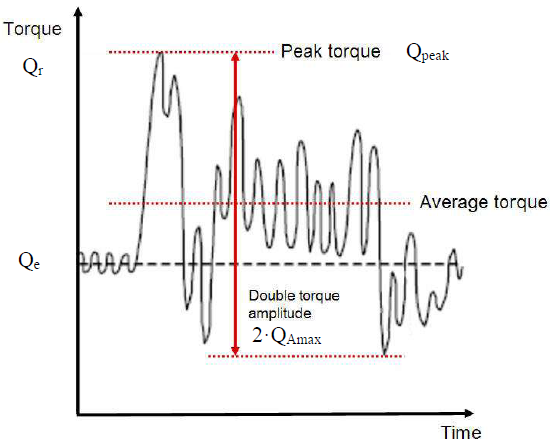 |
    | --- |
    | **Fig 2.12 Interpretation of different torques in a measured curve, as example** |
    - **(A)** Excitation for the time domain calculation
    - **(B)** Frequency domain excitation
  - **(4)** Design torque along shaft line
    For directly coupled two stroke reciprocating internal combustion engine without flexible coupling.
    $Q _{r} = Q _{emax} +Q _{vib} + Q _{\max} \cdot \frac{I}{I _{t}}$ (kN･m)
    For all other plants:
    $Q _{r} = Q _{emax} + Q _{\max} \cdot \frac{I}{I _{t}}$ (kN･m)
    $I$ = equivalent mass moment of inertia of all parts on engine side of component under consideration
    $I _{t}$ = equivalent mass moment of inertia of the whole propulsion system
    All the torques and the inertia moments shall be reduced to the rotation speed of the component being examined. If the maximum torque, $Q _{emax}$, is not known, it shall be taken as following **Table 2.17**:

    **Table 2.17 Guideline for the determination of maximum motor torque**

    | Propeller type | $Q _{emax}$ |
    | --- | --- |
    | Propellers driven by electric motor | $Q _{motor}$ |
    | CP propellers driven by prime movers other than electric motor | $Q _{n}$ |
    | FP propellers driven by turbine | $Q _{n}$ |
    | FP propellers driven by reciprocating internal combustion engine | $0.75 \cdot Q _{n}$ |
    | NOTE: Here, $Q _{motor}$ is the electric motor peak torque. |   |
    - **(A)** If there is no relevant first order propeller torsional resonance in the range 20% (of $n _{n}$) above and 20% below the maximum operating speed in bollard condition (see **Table 2.14**), the following estimation of the maximum response torque can be used to calculate the design torque along the propeller shaft line.
    - **(B)** If there is a first blade order torsional resonance in the range 20% (of $n _{n}$) above and 20% below the maximum operating speed (bollard condition), the design torque ($Q _{r}$) of the shaft component shall be determined by means of a dynamic torsional vibration analysis of the entire propulsion line in the time domain or alternatively in the frequency domain. It is then assumed that the plant is sufficiently designed to avoid harmful operation in barred speed range.
- **7.** **Guideline for torsional vibration calculation**
  - **(1)** The aim of torsional vibration calculations is to estimate the torsional loads for individual shaft line components over the life time in order to determine scantlings for safe operation. The model can be taken from the normal lumped mass elastic torsional vibration model (frequency domain) including the damping. Standard harmonics may be used to consider the gas forces. The engine torque - speed curve of the actual plant shall be applied.
  - **(2)** For time domain analysis the model should include the ice excitation at propeller, the mean torques provided by the prime mover and the hydrodynamic mean torque produced by the propeller as well as any other relevant excitations. The calculations should cover the variation of phase between the ice excitation and prime mover excitation. This is extremely relevant for propulsion lines with direct driven combustion engines.
  - **(3)** For frequency domain calculations the load should be estimated as a Fourier component analysis of the continuous sequence of half sine load peaks. The first and second order blade components should be used for excitation. The calculation should cover the whole relevant shaft speed range. The analysis of the responses at the relevant torsional vibration resonances may be performed for open water (without ice excitation) and ice excitation separately. The resulting maximum torque can be obtained for directly coupled plants by the following superposition:
    $Q _{peak} = Q _{emax} +Q _{opw} +Q _{ice}$
    where:
    $Q _{emax}$ is the maximum engine torque at considered rotational speed
    $C _{opw}$ is the maximum open water response of engine excitation at considered shaft speed and determined by frequency domain analysis
    $Q _{ice}$ is the calculated torque using frequency domain analysis for the relevant shaft speeds, ice excitation cases 1~ cases 4, resulting in the maximum response torque due to ice excitation

#### 306. Design

- **1.** **Design Principle**
  - **(1)** The propulsion line shall be designed according to the pyramid strength principle in terms of its strength. This means that the loss of the propeller blade shall not cause any significant damage to other propeller shaft line components.
  - **(2)** The propulsion line components shall withstand maximum and fatigue operational loads with the relevant safety margin. The loads do not need to be considered for shaft alignment or other calculations of normal operational conditions.
- **2.** **Fatigue design in general**
  - **(1)** The design loads shall be based on the ice excitation and where necessary (shafting) dynamic analysis, described as a sequence of blade impacts (**305. 6** (3) (A)). The shaft response torque shall be determined according **305. 6** (4).
  - **(2)** The propulsion line components are to be designed so as to prevent accumulated fatigue failure when considering the relevant loads using the linear elastic Miner’s rule as defined below.
    $D= \frac{n _{1}}{N _{1}} + \frac{n _{2}}{N _{2}} +...+ \frac{n _{k}}{N _{k}} \leq 1$ or $D= \sum _{j=1} ^{k} \frac{n _{j}}{N _{j}} \leq 1$
    where:
    $k$ is the number of stress levels.
    $N _{1...k}$ is the number of load cycles to failure of the individual stress level class.
    $n _{1...k}$ is the accumulated number of load cycles of the case under consideration, per class.
    $D$ is Miners damage sum
    The stress distribution should be divided into a frequency load spectrum having minimum 10 stress blocks (every 10 % of the load). Calculation with 5 stress blocks has been found to be too conservative. The maximum allowable load is limited by $\sigma _{ref2}$ for propeller blades and yield strength for all other components. The load distribution (spectrum) should be in accordance with the Weibull distribution.
- **3.** **Propeller blades**
  - **(1)** Calculation of blade stresses due to static loads
    The blade stresses (equivalent and principal stresses) shall be calculated for the design loads given in section **305. 3** Finite element analysis (FEA) shall be used for stress analysis as part of the final approval for all propeller blades. The von Mises stresses, taken as $\sigma _{st}$, shall comply with equation in (2).
    Alternatively, the following simplified equation can be used in estimating the blade stresses for all propellers in the root area ($r/R<0.5$) for final approval.
    $\sigma _{st} =C _{1} \cdot \frac{M _{BL}}{100 \cdot ct ^{2}}$ (MPa)
    where:
    constant $C _{1}$ is the $\frac{actual stress}{stress obtained with beam equation}$
    If the actual value is not available, $C _{1}$ should be taken as 1.6.
    $M _{BL} =(0.75-r/R) \cdot R \cdot F$, for relative radius $r/R<0.5$
    $F$ is the maximum of $F _{b}$ and $F _{f}$, whichever is greater.
  - **(2)** Acceptability criterion for static loads
    The following criterion for calculated blade stresses shall be fulfilled:
    $\frac{\sigma _{ref2}}{\sigma _{st}} \geq 1.3$
    $\sigma _{st}$ = calculated stress for the design loads. If FE analysis is used in estimating the stresses, von Mises stresses shall be used.
  - **(3)** Fatigue design of propeller blade
    For materials with a two slope S-N curve (**Fig 2.13**) the fatigue calculations defined in this chapter are not required if the following criterion is fulfilled.
    $\sigma _{\exp} \geq B _{1} \cdot \sigma _{ref2} ^{B _{2}} \cdot \log(N _{ice} ) ^{B _{3}}$
    where:
    $B _{1}$, $B _{2}$ and $B _{3}$ are coefficients for open and ducted propellers, given in the **Table 2.18** below.

    **Table 2.18 Coefficients to check a dispense from fatigue calculation**

    |   | Open propeller | Ducted propeller |
    | --- | --- | --- |
    | $B _{1}$ | 0.00328 | 0.00223 |
    | $B _{2}$ | 1.0076 | 1.0071 |
    | $B _{3}$ | 2.101 | 2.471 |

    Where the above criterion is not fulfilled the fatigue requirements defined below shall be applied:
    The fatigue design of the propeller blade is based on an estimated load distribution for the service life of the ship and the S-N curve for the blade material. An equivalent stress $\sigma _{fat}$ that produces the same fatigue damage as the expected load distribution shall be calculated according to Miner’s rule and the acceptability criterion for fatigue should be fulfilled as given in this section. The equivalent stress is normalised for $10 ^{8}$ cycles.
    The blade stresses at various selected load levels for fatigue analysis are to be taken proportional to the stresses calculated for maximum loads given in section **305. 3**.
    The peak principal stresses $\sigma _{f}$ and $\sigma _{b}$ are determined from $F _{f}$ and $F _{b}$ using FEA. The peak stress range $\Delta \sigma _{ma x }$ and the maximum stress amplitude $\sigma _{Amax}$ are determined on the basis of load cases 1 and 3, 2 and 4.
    $\Delta \sigma _{ma x} =2 \cdot \sigma _{Amax} = \left| ( \sigma _{ice} ) _{fmax} \right| + \left| ( \sigma _{ice} ) _{b ma x} \right|$
    The load spectrum for backward loads is normally expected to have a lower number of cycles than the load spectrum for forward loads. Taking this into account in a fatigue analysis introduces complications that are not justified considering all uncertainties involved. For the calculation of equivalent stress two types of S-N curves are available.
    Two slope S-N curve (slopes 4.5 and 10), see **Fig 2.13**.
    One slope S-N curve (the slope can be chosen), see **Fig 2.14**.
    The type of the S-N-curve shall be selected to correspond with the material properties of the blade. If the S-N-curve is not known the two slope S-N curve shall be used.
    
    **Fig 2.13 Two-slope S-N curve Fig 2.14 Constant-slope S-N curve**
    A more general method of determining the equivalent fatigue stress of propeller blades is described in **Par 5**, where the principal stresses are considered according to **305. 3** using the Miner’s rule. For a total number of load blocks $n _{bl} >100$, both methods deliver the same result. Therefore, they are regarded as equivalent.
    The equivalent fatigue stress for $10 ^{8}$ cycles which produces the same fatigue damage as the load distribution is:
    $\sigma _{fat} = \rho \cdot ( \sigma _{ice} ) _{\max}$
    where:
    $( \sigma _{ice} ) _{\max}$ : mean value of the principal stress amplitudes resulting from design forward and backward blade forces at the location being studied.
    $( \sigma _{ice} ) _{\max} = 0.5 \cdot [( \sigma _{ice} ) _{f \max} -( \sigma _{ice} ) _{b \max} ]$
    $( \sigma _{ice} ) _{f \max}$ : principal stress resulting from forward load
    $( \sigma _{ice} ) _{b \max}$ : principal stress resulting from backward load
    In the calculation of $( \sigma _{ice} ) _{\max}$, case 1 and case 3 or case 2 and case 4 in **Table 2.1, Table 2.2** of **Annex 2** are considered as pairs for $( \sigma _{ice} ) _{f \max}$, and $( \sigma _{ice} ) _{b \max}$ calculations. Case 5 is excluded from the fatigue analysis.
    Calculation of parameter $\rho$ for two-slope S-N curve
    The error of the following method to determine the parameter $\rho$ is sufficiently small, if the number of load cycles $N _{ice}$ is in the range $5 \cdot 10 ^{6} \leq N _{ice} \leq 10 ^{8}$
    The parameter $\rho$ relates the maximum ice load to the distribution of ice loads according to the regression formula
    $\rho = C _{1} \cdot ( \sigma _{ice} ) _{\max}^{C _{2}} \cdot \sigma _{fl}^{C _{3}} \cdot \log(N _{ice} ) ^{C _{ 4}}$
    where:
    $\sigma _{fl} = \gamma _{\varepsilon 1} \cdot \gamma _{\epsilon 2} \cdot \gamma _{\nu } \cdot \gamma _{m} \cdot \sigma _{\exp}$ is the blade material fatigue strength at $10 ^{8}$ load cycles, see (C).
    The coefficients $C _{1}$, $C _{2}$, $C _{3}$, and $C _{4}$ are given in **Table 2.19**.

    |   | Open propeller | Ducted propeller |
    | --- | --- | --- |
    | $C _{1}$ | 0.000747 | 0.000534 |
    | $C _{2}$ | 0.0645 | 0.0533 |
    | $C _{3}$ | - 0.0565 | - 0.0459 |
    | $C _{4}$ | 2.22 | 2.584 |

    Calculation of parameter $\rho$ for constant-slope S-N curve
    For materials with a constant-slope S-N curve, see **Fig 2,14**, the factor $\rho$ shall be calculated from the following formula:
    $\rho = \left( G \cdot \frac{N _{ice}}{N _{R}} \right) ^{1/m} (\ln(N _{ice} )) ^{-1/k}$
    where:
    $k$ = shape parameter of the Weibull distribution
    $k$ = 1.0 for ducted propellers and
    $k$ = 0.75 for open propellers
    $N _{R}$ = reference number of load cycles (=$10 ^{8}$)
    Values for the parameter $G$ are given in **Table 2.20** below. Linear interpolation may be used to calculate the value of $G$ for $m/k$ ratios other than those given in the **Table 2.20**.

    | $m/k$ | $G$ | $m/k$ | $G$ | $m/k$ | $G$ |
    | --- | --- | --- | --- | --- | --- |
    | 3 | 6 | 5.5 | 287.9 | 8 | 40320 |
    | 3.5 | 11.6 | 6 | 720 | 8.5 | 119292 |
    | 4 | 24 | 6.5 | 1871 | 9 | 362880 |
    | 4.5 | 52.3 | 7 | 5040 | 9.5 | 1.133x$10 ^{6}$ |
    | 5 | 120 | 7.5 | 14034 | 10 | 3.623x$10 ^{6}$ |

    The equivalent fatigue stress $\sigma _{fat}$ at all locations on the blade shall fulfil the following acceptability criterion:
    $\frac{\sigma _{fl}}{\sigma _{fat}} \geq 1.5$
    where:
    $\sigma _{fl} = \gamma _{\varepsilon 1} \cdot \gamma _{\epsilon 2} \cdot \gamma _{\nu } \cdot \gamma _{m} \cdot \sigma _{\exp}$
    $\sigma _{fl}$ = the blade material fatigue strength at $10 ^{8}$ load cycles
    $\gamma _{\varepsilon 1}$ = reduction factor due to scatter (equal to one standard deviation)
    $\gamma _{\varepsilon 2}$ = reduction factor for test specimen size effect
    The geometrical size factor ($\gamma _{\varepsilon 2}$) is:
    $\gamma _{\varepsilon 2} =1-a \cdot \ln \left( \frac{t}{0.025} \right)$
    where:
    “$a$” is as given in **Table 2.21** below and “$t$” is the maximum blade thickness at the considered point
    $\gamma _{\nu }$ = reduction factor for variable amplitude loading
    $\gamma _{m}$ = reduction factor for mean stress
    The mean stress effect ($\gamma _{m}$) is
    $\gamma _{m} =1.0- \left( \frac{1.4 \cdot \sigma _{mean}}{\sigma _{u}} \right) ^{0.75}$
    $\sigma _{\exp}$ = mean fatigue strength of the blade material at $10 ^{8}$ cycles to failure in seawater
    $\sigma _{\exp}$ in **Table 2.21** has been defined from the results of constant amplitude loading fatigue tests at $10 ^{7}$ load cycles and 50% survival probability and has been extended to $10 ^{8}$ load cycles.
    Fatigue strength values and correction factors other than those given in **Table 2.21** may be used, provided the values are determined under conditions approved by the Society.
    The following values should be used for the reduction factors if actual values are not available:
    $\gamma _{\varepsilon 1}$ = 0.85, $\gamma _{\nu }$ = 0.75, 및 $\gamma _{m}$ = 0.75.
    The S-N curve characteristics are based on two slopes, the first slope 4.5 is from 1000 to $10 ^{8}$ load cycles; the second slope 10 is above $10 ^{8}$ load cycles.
    The maximum allowable stress for one or low number of cycles is limited to $\sigma _{ref 2 } /S$, with $S=1.3$ for static loads.

    **Table 2.21 Mean fatigue strength** $\sigma _{\exp}$ **for different material types at** $10 ^{8}$ **load cycles and stress ratio R = -1 with a survival probability of 50%**

    | Mean fatigue strength $\sigma _{\exp}$ for different material types at $10 ^{8}$ load cycles |   |   |   |
    | --- | --- | --- | --- |
    | Bronze and brass ($a=0.10$) |   | Stainless steel ($a=0.05$) |   |
    | Mn-Bronze, CU1 (high tensile brass) | 84 MPa | Ferritic (12Cr 1Ni) | 144 MPa(1) |
    | Mn-Ni-Bronze, CU2 (high tensile brass) | 84 MPa | Martensitic (13Cr 4Ni/13Cr 6Ni) | 156 MPa |
    | Ni-Al-Bronze, CU3 | 120 MPa | Martensitic (16Cr 5Ni) | 168 MPa |
    | Mn-Al-Bronze, CU4 | 113 MPa | Austenitic (19Cr 10Ni) | 132 MPa |
    | (Note) (1)　This value may be used, provided a perfect galvanic protection is active. Otherwise a reduction of about 30 MPa shall be applied. |   |   |   |
    - **(A)** General
    - **(B)** Equivalent fatigue stress
    - **(C)** Acceptability criterion for fatigue
- **4.** **Blade bolts, propeller hub and CP mechanism**
  - **(1)** General
    The blade bolts, CP mechanism, propeller boss and the fitting of the propeller to the propeller shaft shall be designed to withstand the maximum static and fatigue design loads (as applicable), as defined in **305. 3** and **306. 3**. The safety factor $S$ against yielding due to static loads and against fatigue shall be greater than 1.5, if not stated otherwise. The safety factor $S$ for loads, resulting from propeller blade failure as defined in **305. 4** shall be greater than 1.0 against yielding.
    Provided that calculated stresses duly considering local stress concentrations are less than yield strength, or maximum of 70% of $\sigma _{u}$ of respective materials, detailed fatigue analysis is not required. In all other cases components shall be analysed for cumulative fatigue. An approach similar to that used for shafting assessment may be applied (see **Par 5**).
  - **(2)** Blade bolts
    Blade bolts shall withstand the following bending moment considered around a tangent on bolt pitch circle, or any other relevant axis for non-circular joints, parallel to considered root section:
    $M _{bolt} =S \cdot F _{ex} (0.8 \frac{D}{2} -r _{bolt} )$ (kN･m)
    where:
    $r _{bolt}$ = radius to the bolt plane (m)
    $S$ = 1.0 safety factor
    Blade bolt pre-tension shall be sufficient to avoid separation between mating surfaces when the maximum forward and backward ice loads defined in **305. 3** (open and ducted propellers respectively) are applied. For conventional arrangements, the following formula may be applied:
    $d _{bb} =41 \cdot \sqrt {\frac{F _{ex} \cdot (0.8D-d) \cdot S \cdot \alpha}{\sigma _{0.2} \cdot Z _{bb} \cdot PCD}}$ (mm)
    where:
    $\alpha$ = 1.6 torque guided tightening
    = 1.3 elongation guided
    = 1.2 angle guided
    = 1.1 elongated by other additional means
    other factors may be used, if evidence is demonstrated.
    $d _{bb}$ = effective diameter of blade bolt in way of thread (mm)
    $Z _{bb}$ = number of blade bolts
    $S$ = 1.0 safety factor
  - **(3)** CP mechanism
    Separate means, e.g. dowel pins, shall be provided in order to withstand the spindle torque resulting from blade failure $Q _{sex}$ (see **305. 4** (2)) or ice interaction $Q _{smax}$ (see **305. 3** (7)), whichever is greater. Other components of the CP mechanism shall not be damaged by the maximum spindle torques ($Q _{smax}$, $Q _{sex}$). One third of the spindle torque is assumed to be consumed by friction, if not otherwise documented trough further analysis.
    The diameter of fitted pins $d _{fp}$ between the blade and blade carrier can be calculated using the formula:
    $d _{fp} =66 \cdot \sqrt {\frac{(Q _{S} -Q _{fr} )}{PCD \cdot Z _{p i n} \cdot \sigma _{0.2}}}$ (mm)
    where:
    $Q _{S} =m a x(S \cdot Q _{smax} ; S \cdot Q _{sex} )$ (kN･m)
    $S$ = 1.3 for $Q _{smax}$ and
    $S$ = 1.0 for $Q _{sex}$
    $Q _{fr}$ = friction between connected surfaces = $0.33 \cdot Q _{S}$
    The Society may approve alternative $Q _{fr}$ calculation according to reaction forces due to $F _{ex}$, or $F _{f}$, $F _{b}$ whichever is relevant, utilising a friction coefficient = 0.15.
    The stress in the actuating pin can be estimated by
    $\sigma _{vMises} = \sqrt {\left( \frac{\left( F \cdot \frac{h _{p i n}}{2} \right)}{\frac{\pi \cdot d _{p i n}^{ 3}}{32}} \right) ^{2} +3 \cdot \left( \frac{F}{\frac{\pi}{4} d _{p i n}^{ 2}} \right) ^{2}}$ (MPa)
    where:
    $F= \frac{Q _{S} -Q _{fr}}{l _{m}}$ (kN)
    $l _{m}$ = distance pitching centre of blade – axis of pin (m)
    $Q _{fr}$ = friction torque in blade bearings acting on the blade palm and caused by the reaction forces due to $F _{ex}$, or $F _{f}$, $F _{b}$ whichever is relevant; taken to one third of spindle torque $Q _{S}$
    $h _{p i n}$ = height of actuating pin (mm)
    $d _{p i n}$ = diameter of actuating pin (mm)
    The blade failure spindle torque $Q _{sex}$ shall not lead to any consequential damage.
    Fatigue strength is to be considered for parts transmitting the spindle torque from the blade to a servo system considering the ice spindle torque acting on one blade. The maximum amplitude $Q _{samax}$ is defined as:
    $Q _{samax} = \frac{Q _{sb} +Q _{sf}}{2}$ (kN･m)
    where:
    $Q _{sb}$ = spindle torque due to $\left| F _{b} \right|$ (kN･m)
    $Q _{sf}$ = spindle torque due to $\left| F _{f} \right|$ (kN･m)
  - **(4)** Servo pressure
    The design pressure for the servo system shall be taken as the pressure caused by $Q _{samax}$ or, $Q _{sex}$ when not protected by relief valves on the hydraulic actuator side, reduced by relevant friction losses in bearings caused by the respective ice loads. The design pressure shall in any case not be less than relief valve set pressure.
- **5.** **Propulsion line components**
  The ultimate load resulting from total blade failure $F _{ex}$ as defined in **305. 4** shall consist of combined axial and bending load components, wherever this is significant. The minimum safety factor against yielding is to be 1.0 for all shaft line components. The shafts and shafting components, such as bearings, couplings and flanges shall be designed to withstand the operational propeller/ice interaction loads as given in **305**. The given loads are not intended to be used for shaft alignment calculation. Cumulative fatigue calculations shall be conducted according to the Miner’s rule. A fatigue calculation is not necessary, if the maximum stress is below fatigue strength at $10 ^{8}$ load cycles.
  The torque and thrust amplitude distribution (spectrum) in the propulsion line is to be taken as (because Weibull exponent k = 1):
  $Q _{A} (N)=Q _{Amax} \cdot \left( 1- \frac{\log(N)}{\log(Z \cdot N _{ice} )} \right)$
  This is illustrated by the example in the **Fig 2.15**.

  |  |
  | --- |
  | **Fig 2.15 Cumulative torque distribution** |

  The number of load cycles in the load spectrum is defined as $Z \cdot N _{ice}$.
  The Weibull exponent should be considered as k = 1.0 for both open and ducted propeller torque and bending forces. The load distribution is an accumulated load spectrum, and the load spectrum should be divided into a minimum of ten load blocks when using the Miner summation method. The load spectrum used counts the number of cycles for 100% load to be the number of cycles above the next step, e.g. 90% load. This ensures that the calculation is on the conservative side. Consequently, the fewer stress blocks used the more conservative the calculated safety margin.

  |  |
  | --- |
  | **Fig 2.16 Example of ice load distribution (spectrum) for the shafting (k=1)** |

  The load spectrum is divided into number of load blocks $n _{bl}$ for the Miner summation method.
  The following formula can be used for calculation of the number of cycles for each load block.
  $n _{i} =N _{ice}^{1- \left( 1- \frac{i}{n _{bl}} \right) ^{k}} - \sum _{i=1} ^{i} n _{i-1}$
  where:
  $i$ = single load block
  $n _{bl}$ = the number of load blocks
  - **(1)** Propeller fitting to the shaft
    The friction capacity (at 0° C) shall be at least $S$ = 2.0 times the highest peak torque $Q _{peak}$ as determined in **305. 6** without exceeding the permissible hub stresses.
    The necessary surface pressure $P _{o {}^{\circ}\mathrm{C} }$ can be determined as:
    $P _{o {}^{\circ}\mathrm{C} } = \frac{2 \cdot S \cdot Q _{peak}}{\pi \cdot \mu \cdot D _{S}^{2} \cdot L \cdot 10 ^{3}}$ (MPa)
    where:
    $\mu$ = 0.15 for steel-steel,
    = 0.13 for steel-bronze
    Above friction coefficients may be increased by 0.04 if glycerine is used in wet mounting.
    $D _{S}$ = the shrinkage diameter at the mid-length of the taper (m)
    $L$ = the effective length of taper (m)
    Key mounting is not permitted.
    The flange thickness is to be at least 25% of the required aft end shaft diameter. Any additional stress raisers such as recesses for bolt heads shall not interfere with the flange fillet unless the flange thickness is increased correspondingly. The flange fillet radius is to be at least 10% of the required shaft diameter.
    The diameter of shear pins shall be calculated according to the following equation:
    $d _{p i n} =66 \cdot \sqrt {\frac{Q _{peak} \cdot S}{PCD \cdot Z _{p i n} \cdot \sigma _{0.2}}}$ (mm)
    where:
    $Z _{p i n}$ = number of shear pins
    $S$ = 1.3 safety factor
    The bolts are to be designed so that the blade failure load $F _{ex}$ (see **305. 4**) in backward direction does not cause yielding of the bolts. The following equation should be applied:
    $d _{b} =41 \cdot \sqrt {\frac{F _{ex} \cdot \left( 0.8 \cdot \frac{D}{PCD} +1 \right) \cdot \alpha}{\sigma _{0.2} \cdot Z _{b}}}$ (mm)
    where:
    $\alpha$ = 1.6 torque guided tightening
    = 1.3 elongation guided
    = 1.2 angle guided
    = 1.1 elongated by other additional means
    other factors may be used, if evidence is demonstrated.
    $d _{b}$ = diameter flange bolt (mm)
    $Z _{b}$ = number of flange bolts
    - **(A)** Keyless cone mounting
    - **(B)** Key mounting
    - **(C)** Flange mounting
  - **(2)** Propeller shaft
    The propeller shaft is to be designed to fulfil the following:
    $d _{P} =160 \cdot root {3} of {\frac{F _{ex} \cdot D}{\sigma _{0.2} \cdot \left( 1- \frac{d _{i}^{ 4}}{d _{p}^{ 4}} \right)}}$ (mm)
    where:
    $d _{p}$ = propeller shaft diameter (mm)
    $d _{i}$ = propeller shaft inner diameter (mm)
    Forward from the aft stern tube bearing the shaft diameter may be reduced based on direct calculation of the actual bending moment, or by the assumption that the bending moment caused by $F _{ex}$ is linearly reduced to 25% at the next bearing and in front of this linearly to zero at third bearing. Bending due to maximum blade forces $F _{b}$ and $F _{f}$ have been disregarded since the resulting stress levels are much lower than the stresses caused by the blade failure load.
    plain shaft:
    $d _{P} =210 \cdot root {3} of {\frac{Q _{peak} \cdot S}{\sigma _{0.2} \cdot \left( 1- \frac{d _{i}^{ 4}}{d _{p}^{ 4}} \right)}}$ (mm)
    notched shaft:
    $d _{P} =210 \cdot root {3} of {\frac{Q _{peak} \cdot S \cdot \alpha _{t}}{\sigma _{0.2} \cdot \left( 1- \frac{d _{i}^{ 4}}{d _{p}^{ 4}} \right)}}$ (mm)
    where:
    $\alpha _{t}$ = local stress concentration factor in torsion.
    Notched shaft diameter shall in any case not be less than the required plain shaft diameter.
    $\sigma _{F} =0.436 \cdot \sigma _{0.2} +77= \tau _{F} \cdot \sqrt {3}$ (MPa)
    This is valid for small polished specimens (no notch) and reversed stresses, see “VDEH 1983 Bericht Nr. ABF11 Berechnung von Wöhlerlinien für Bauteile aus Stahl”. The high cycle fatigue (HCF) is to be assessed based on the above fatigue strengths, notch factors (i.e. geometrical stress concentration factors and notch sensitivity), size factors, mean stress influence and the required safety factor of 1.6 at $3 \times 10 ^{6}$ cycles increasing to 1.8 at $10 ^{9}$ cycles. The low cycle fatigue (LCF) representing $10 ^{4}$ cycles is to be based on the smaller value of yield or 0.7 of tensile strength/$\sqrt {3}$. The criterion utilises a safety factor of 1.25. The LCF and HCF as given above represent the upper and lower knees in a stress-cycle diagram. Since the required safety factors are included in these values, a Miner sum of unity is acceptable.
    - **(A)** The blade failure load $F _{ex}$ (see **305. 4**) applied parallel to the shaft (forward or backwards) shall not cause yielding. The bending moment need not to be combined with any other loads. The diameter $d _{p}$ in way of the aft stern tube bearing shall not be less than:
    - **(B)** The stresses due to the peak torque $Q _{peak}$ shall have a minimum safety factor of $S$ =1.5 against yielding in plain sections and $S$ =1.0 in way of stress concentrations in order to avoid bent shafts.
    - **(C)** The torque amplitudes (see **305. 6** (4)) with the corresponding number of load cycles shall be used in an accumulated fatigue evaluation where the safety factor is $S _{ fat}$ =1.5. If the plant has high engine excited torsional vibrations (e.g. direct coupled 2-stroke internal combustion engines), this shall also be considered.
    - **(D)** The fatigue strengths $\sigma _{F}$ and $\tau _{F}$ (3 million cycles) of shaft materials may be assessed on the basis of the material’s yield or 0.2% proof strength as:
  - **(3)** Intermediate shafts
    The intermediate shafts are to be designed to fulfil (2) (B) to (D).
  - **(4)** Shaft connections
    See (1) (A). A safety factor of $S$ =1.8 shall be applied.
    The flange thickness is to be at least 20% of the required shaft diameter. Any additional stress raisers such as recesses for bolt heads shall not interfere with the flange fillet unless the flange thickness is increased correspondingly. The flange fillet radius is to be at least 8% of the required shaft diameter. The diameter of ream fitted (light press fit) bolts shall be chosen so that the peak torque is transmitted with a safety factor of 1.9. This accounts for a prestress. Pins shall transmit the peak torque with a safety factor of 1.5 against yielding (see equation in (1) (C)). The bolts are to be designed so that the blade failure load (see **305. 4**) in backward direction does not cause yielding.
    Splined shaft connections can be applied where no axial or bending loads occur. A safety factor of $S$ =1.5 against allowable contact and shear stress resulting from $Q _{peak}$ shall be applied.
    - **(A)** Shrink fit couplings (keyless)
    - **(B)** Key mounting is not permitted.
    - **(C)** Flange mounting
    - **(D)** Splined shaft connections
  - **(5)** Gear transmissions
    Shafts in gear transmissions shall meet the same safety level as intermediate shafts, but where relevant, bending stresses and torsional stresses shall be combined (e.g. by von Mises for static loads). Maximum permissible deflection in order to maintain sufficient tooth contact pattern shall be considered for the relevant parts of the gear shafts.
    - Tooth root stresses
    - Pitting of flanks
    - Scuffing
    In addition to above 3 criteria subsurface fatigue may need to be considered.
    See (9).
    The torque capacity shall be at least 1.8 times the highest peak torque $Q _{peak}$ (at considered rotational speed) as determined in **Par 5** without exceeding the permissible hub stresses of 80% yield.
    - **(A)** Shafts
    - **(B)** Gearing
      - **(a)** The gearing shall fulfil following three acceptance criteria:
      - **(b)** Common for all criteria is the influence of load distribution over the face width. All relevant parameters are to be considered, such as elastic deflections (of mesh, shafts and gear bodies), accuracy tolerances, helix modifications, and working positions in bearings (especially for multiple input single output gears).
      - **(c)** The load spectrum (see **Par 5**) may be applied in such a way that the numbers of load cycles for the output wheel are multiplied by a factor of (number of pinions on the wheel / number of propeller blades $Z$). For pinions and wheels operating at higher speeds the numbers of load cycles are found by multiplication with the gear ratios. The peak torque ($Q _{peak}$) is also to be considered during calculations.
      - **(d)** Cylindrical gears can be assessed on the basis of the international standard ISO 6336 series (i.e. ISO 6336-1:2019, ISO 6336-2:2019, ISO 6336-3:2019, ISO 6336-4:2019, ISO 6336-5:2016 and ISO 6336-6:2019), provided that “method B” is used. Standards within the Societies can also be applied provided that they are considered equivalent to the above mentioned ISO 6336.
      - **(e)** For Bevel Gears the methods or standards used or acknowledged by the Society can be applied provided that they are properly calibrated.
      - **(f)** Tooth root safety shall be assessed against the peak torque, torque amplitudes (with the pertinent average torque) as well as the ordinary loads (open water free running) by means of accumulated fatigue analyses. The resulting factor of safety is to be at least 1.5. (Ref ISO 6336 Pt 1, 3 and 6 and **Pt 5, Annex 5-4** of **Guidance Relating to the Rules for the Classification of Steel Ships**)
      - **(g)** The safety against pitting shall be assessed in the same way as tooth root stresses, but with a minimum resulting safety factor of 1.2. (Ref ISO 6336-1:2019, ISO 6336-2:2019 and ISO 6336-6:2019 as well as **Pt 5, Annex 5-4** of **Guidance Relating to the Rules for the Classification of Steel Ships**).
      - **(h)** The scuffing safety (flash temperature method – ref. ISO/TR 13989-1:2000 and ISO/TR 13989-2:2000) based on the peak torque shall be at least 1.2 when the FZG class of the oil is assumed one stage below specification.
      - **(i)** The safety against subsurface fatigue of flanks for surface hardened gears (oblique fracture from active flank to opposite root) is to be assessed at the discretion of each Society. (It should be noted that high overloads can initiate subsurface fatigue cracks that may lead to a premature failure. In lieu of analyses UT inspection intervals may be used.)
    - **(C)** Bearings
    - **(D)** Gear wheel shaft connections
  - **(6)** Clutches
    Clutches shall have a static friction torque of at least 1.3 times the peak torque $Q _{peak}$ and dynamic friction torque 2/3 of the static. Emergency operation of clutch after failure of e.g. operating pressure shall be made possible within reasonably short time. If this is arranged by bolts, it shall be on the engine side of the clutch in order to ensure access to all bolts by turning the engine.
  - **(7)** Elastic couplings
    There shall be a separation margin of at least 20% between the peak torque and the torque where any twist limitation is reached.
    $Q _{peak} <0.8 \cdot T _{kmax} (N=1)$ (kN･m)
    There shall be a separation margin of at least 20% between the maximum response torque $Q _{peak}$ (see **Fig 2.12**) and the torque where any mechanical twist limitation and/or the permissible maximum torque of the elastic coupling, valid for at least a single load cycle (=1), is reached.
    A sufficient fatigue strength shall be demonstrated at design torque level $Q _{r} (N=x)$ and $Q _{A} (N=x)$. This may be demonstrated by interpolation in a Weibull torque distribution (similar to **Fig 2.15**):
    $\frac{Q _{r} (N=x)}{Q _{r} (N=1)} =1- \frac{\log(x)}{\log(Z \cdot N _{ice} )}$
    respectively
    $\frac{Q _{A} (N=x)}{Q _{A} (N=1)} =1- \frac{\log(x)}{\log(Z \cdot N _{ice} )}$
    where $Q _{r} (N=1)$ correspons to $Q _{peak}$ and $Q _{A} (N=1)$ to $Q _{Amax}$.
    $Q _{r} (N=5 \cdot 10 ^{4} ) \cdot S\(Q _{r} (N=1 \cdot 10 ^{6} ) \cdot S\(Q _{r} (N=5 \cdot 10 ^{4} ) \cdot S< \Delta T _{m a x} (N=5 \cdot 10 ^{4} )$ (kN･m)
    $S$ is the general safety factor for fatigue, equal to 1.5.
    See illustration in below **Fig 2.17**, **Fig 2.18**, **Fig 2.19**.
    The torque amplitude (or range $\Delta$) shall not lead to fatigue cracking, i.e. exceeding the permissible vibratory torque. The permissible torque may be determined by interpolation in a Weibull torque distribution where $T _{Kmax1}$ respectively $\Delta T _{Kmax}$ refer to $5 \cdot 10 ^{4}$ cycles and $T _{KV}$ refer to $10 ^{6}$ cycles. See illustration in below **Fig 2.17**, **Fig 2.18**, **Fig 2.19**.
    $T _{Kmax1} \geq Q _{r}$ at $5 \cdot 10 ^{4}$ load cycles (kN･m)

    | 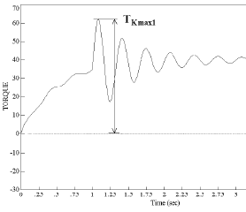 | 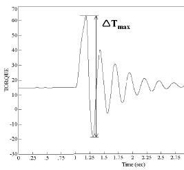 |
    | --- | --- |
    | **Fig 2.17 Example of** $T _{Kmax1}$ | **Fig 2.18 Example of** $\Delta T _{Kmax}$ |

    |  |
    | --- |
    | **Fig 2.19 Example of** $T _{KV}$ |
  - **(8)** Crankshafts
    Special considerations apply for plants with large inertia (e.g. flywheel, tuning wheel or PTO) in the non-driving end front of the engine (opposite to main power take off).
  - **(9)** Bearings
    The aft stern tube bearing as well as the next shaft line bearing are to withstand $F _{ex}$ as given in **305. 4**, in such a way that the ship can maintain operational capability. Rolling bearings are to have an $L _{10a}$ lifetime of at least 40000 hours according to ISO 281:2007. Thrust bearings and their housings are to be designed to withstand with a safety factor $S$ =1.0 the maximum response thrust in **305. 5** and the axial force resulting from the blade failure load $F _{ex}$ in **305. 4**. For the purpose of calculation, except for $F _{ex}$, the shafts are assumed to rotate at rated speed. For pulling propellers special consideration is to be given to loads from ice interaction on the propeller hub.
  - **(10)** Seals
    Seals are to prevent egress of pollutants and be suitable for the operating temperatures. Contingency plans for preventing the egress of pollutants under failure conditions are to be documented. Seals installed are to be suitable for the intended application. The manufacturer is to provide service experience in similar applications and/or testing results for consideration.
- **6.** **Azimuthing main propulsors**
  - **(1)** In addition to the above requirements, special consideration shall be given to those loading cases which are extraordinary for propulsion units when compared with conventional propellers. The estimation of load cases shall reflect the way the thrusters are intended to operate on the specific ship. In this respect, for example, the loads caused by the impacts of ice blocks on the propeller hub of a pulling propeller shall be considered. Furthermore, loads resulting from the thrusters operating at an oblique angle to the flow shall be considered. The steering mechanism, the fitting of the unit, and the body of the thruster shall be designed to withstand the loss of a blade without damage. The loss of a blade shall be considered for the propeller blade orientation which causes the maximum load on the component being studied. Typically, top-down blade orientation places the maximum bending loads on the thruster body.
  - **(2)** Azimuth thrusters shall also be designed for estimated loads caused by thruster body/ice interaction. The thruster body shall withstand the loads obtained when the maximum ice blocks, which are given in section **305. 2**, strike the thruster body when the ship is at a typical ice operating speed. In addition, the design situation in which an ice sheet glides along the ship’s hull and presses against the thruster body should be considered. The thickness of the sheet should be taken as the thickness of the maximum ice block entering the propeller, as defined in section **305. 2**.

#### 307. Prime Movers

- **1.** **Propulsion engines**
  Engines are to be capable of being started and running the propeller in bollard condition. Propulsion plants with CP propeller are to be capable being operated even when the CP system is at full pitch as limited by mechanical stoppers.
- **2.** **Starting arrangements**
  The capacity of the air receivers shall be sufficient to provide, without recharging, not less than 12 consecutive starts of the propulsion engine, if this has to be reversed for going astern or 6 consecutive starts if the propulsion engine does not have to be reversed for going astern. If the air receivers serve any other purposes than starting the propulsion engine, they shall have additional capacity sufficient for these purposes. The capacity of the air compressors shall be sufficient for charging the air receivers from atmospheric to full pressure in one hour, except for a ship with the ice class PC6 to PC1, if its propulsion engine has to be reversed for going astern, in which case the compressor shall be able to charge the receivers in half an hour.
- **3.** **Emergency power units**
  Provisions shall be made for heating arrangements to ensure ready starting from cold of the emergency power units at an ambient temperature applicable to the Polar Class of the ship. Emergency power units shall be equipped with starting devices with a stored energy capability of at least three consecutive starts at the above mentioned temperature. The source of stored energy shall be protected to preclude critical depletion by the automatic starting system, unless a second independent mean of starting is provided. A second source of energy shall be provided for an additional three starts within 30 min., unless manual starting can be demonstrated to be effective.

#### 308. Equipment fastening loading accelerations

- **1.** Essential equipment and supports shall be suitable for the accelerations as indicated in the following paragraphs. Accelerations are to be considered as acting independently.
- **2.** **Longitudinal impact accelerations,** $a _{1}$
  Maximum longitudinal impact acceleration at any point along the hull girder,
  $a _{1} =( \frac{F _{IB}}{\Delta } ) \left\{ \left[ 1.1 \cdot \tan( \gamma + \phi ) \right] + \left[ 7 \cdot \frac{H}{L} \right] \right\}$ (m/s2)
- **3.** **Vertical acceleration,** $a _{v}$
  Combined vertical impact acceleration at any point along the hull girder,
  $a _{v} =2.5 \cdot ( \frac{F _{IB}}{\Delta } )F _{X}$ (m/s^2)
  $F _{X}$ = 1.3 at FP
  = 0.2 at midships
  = 0.4 at AP
  = 1.3 at AP for vessels conducting ice breaking astern
  Intermediate values to be interpolated linearly
- **4.** **Transverse impact acceleration,** $a _{t}$
  Combined transverse impact acceleration at any point along hull girder,
  $a _{t} =3F _{i} \frac{F _{X}}{\Delta }$ (m/s^2)
  $F _{X}$ = 1.5 at FP
  = 0.25 at midships
  = 0.5 at AP
  = 1.5 at AP for ships conducting ice breaking astern
  Intermediate values to be interpolated linearly
  where
  $\phi$ : maximum friction angle between steel and ice, normally taken as $10 {}^{\circ}$ [deg.]
  $\gamma$ : bow stem angle at waterline [deg.]
  $\Delta$ : displacement
  $L$ : length between perpendiculars (m)
  $H$ : distance in meters from the water line to the point being considered (m)
  $F _{IB}$ : vertical impact force, defined in **209. 2**
  $F _{I}$ : total force normal to shell plating in the bow area due to oblique ice impact, defined in **209. 3**

#### 309. Auxiliary Systems

- **1.** Machinery shall be protected from the harmful effects of ingestion or accumulation of ice or snow. Where continuous operation is necessary, means should be provided to purge the system of accumulated ice or snow.
- **2.** Means should be provided to prevent damage to tanks containing liquids due to freezing.
- **3.** Vent pipes, intake and discharge pipes and associated systems shall be designed to prevent blockage due to freezing or ice and snow accumulation.

#### 310. Sea chest and cooling water systems

- **1.** Cooling water systems for machinery that are essential for the propulsion and safety of the vessel, including sea chests inlets, shall be designed for the environmental conditions applicable to the ice class.
- **2.** At least two sea chests are to be arranged as ice boxes (sea chests for water intake in severe ice conditions) for ice class PC1 to PC5 inclusive. The calculated volume for each of the ice boxes shall be at least 1m^3 for every 750 kW of the totally installed power. For PC6 and PC7 there shall be at least one ice box located preferably near centre line.
- **3.** Ice boxes are to be designed for an effective separation of ice and venting of air.
- **4.** Sea inlet valves are to secured directly to the ice boxes. The valve shall be a full bore type.
- **5.** Ice boxes and sea bays are to have vent pipes and are to have shut off valves connected direct to the shell.
- **6.** Means are to be provided to prevent freezing of sea bays, ice boxes, ship side valves and fittings above the load water line.
- **7.** Efficient means are to be provided to re-circulate cooling seawater to the ice box. Total sectional area of the circulating pipes is not to be less than the area of the cooling water discharge pipe.
- **8.** Detachable gratings or manholes are to be provided for ice boxes. Manholes are to be located above the deepest load line. Access is to be provided to the ice box from above.
- **9.** Openings in ship sides for ice boxes are to be fitted with gratings, or holes or slots in shell plates. The net area through these openings is to be not less than 5 times the area of the inlet pipe. The diameter of holes and width of slot in shell plating is to be not less than 20 mm. Gratings of the ice boxes are to be provided with a means of clearing. The means of clearing is to be of a type using low pressure steam. Clearing pipes are to be provided with screw-down type non return valves.

#### 311. Ballast Tanks

- **1.** Efficient means are to be provided to prevent freezing in fore and after peak tanks and wing tanks located above the water line and where otherwise found necessary.

#### 312. Ventilation Systems

- **1.** The air intakes for machinery and accommodation ventilation are to be located on both sides of the ship at locations where manual de-icing is possible. Anti-icing protection of the air inlets may be accepted as an equivalent solution to location on both sides of the ship and manual de-icing at the Society’s discretion. Notwithstanding the above, multiple air intakes are to be provided for the emergency generating set and are to be as far apart as possible.
- **2.** The temperature of the inlet air shall be suitable for:
  - the safe operation of the machinery; and
  - the thermal comfort in the accommodation.
  Accommodation and ventilation air intakes shall be provided with means of heating, if needed.

#### 313. Steering Systems

- **1.** Rudder stops are to be provided. The design ice force on rudder shall be transmitted to the rudder stops without damage to the steering system. An ice knife shall in general be fitted to protect the rudder in centre position. The ice knife shall extend below BWL. Design forces shall be determined according to the **211.**.
- **2.** The rudder actuator is to comply with the following requirements.
  - **(1)** The rudder actuator is to be designed for a holding torque obtained by multiplying the open water torque resulting from the application of **Pt 5, Ch 7, 202.** of **the Rules for the Classification of Steel Ships** (considering however a maximum speed of 18 knots, by following factors)

    |   |   |   |   |   |   |   |   |
    | --- | --- | --- | --- | --- | --- | --- | --- |
    | Ice Class | PC1 | PC2 | PC3 | PC4 | PC5 | PC6 | PC7 |
    | Factor | 5 | 5 | 3 | 3 | 3 | 1.5 | 1.5 |
  - **(2)** The design pressure for calculations to determine the scantlings of the rudder actuator is to be at least 1.25 times the maximum working pressure corresponding to the holding torque defined in (1) (Derived from **Pt 5, Ch 7, 403. 3** of **the Rules for the Classification of Steel Ships**).
- **3.** The rudder actuator is to be protected by torque relief arrangements, assuming the turning speeds of following **Table 2.22** (deg/s] without an undue pressure rise (refer to **Pt 5, Ch 7, 204. 4** of **the Rules for the Classification of Steel Ships** for undue pressure rise).

  **Table 2.22 Steering gear turning speeds**

  | Ice Class | PC1 and PC2 | PC3, PC4 and PC5 | PC6 and PC7 |
  | --- | --- | --- | --- |
  | Turning speeds (deg/s) | 10 | 7.5 | 6 |

  If the rudder and actuator design can withstand such rapid loads, this special relief arrangement is not necessary and a conventional one may be used instead (refer to **Pt 5, Ch 7, 204. 4** of **the Rules for the Classification of Steel Ships**).
- **4.** Additionally for icebreakers, fast-acting torque relief arrangements are to be fitted in order to provide effective protection of the rudder actuator in case of the rudder being pushed rapidly hard over against the stops. For hydraulically operated steering gear, the fast-acting torque relief arrangement is to be so designed that the pressure cannot exceed 115% of the set pressure of the safety valves when the rudder is being forced to move at the speed indicated in **Table 2.23**, also when taking into account the oil viscosity at the lowest expected ambient temperature in the steering gear compartment. For alternative steering systems the fast-acting torque relief arrangement is to demonstrate an equivalent degree of protection to that required for hydraulically operated arrangements. The turning speeds to be assumed for each ice class are shown in **Table 2.23** below.

  **Table 2.23 Steering gear turning speeds for icebreakers**

  | Ice Class | PC1 and PC2 | PC3, PC4 and PC5 | PC6 and PC7 |
  | --- | --- | --- | --- |
  | Turning speeds (deg/s) | 40 | 20 | 15 |

  The arrangement is to be designed such that steering capacity can be speedily regained.

#### 314. Alternative design

- **1.** As an alternative, a comprehensive design study may be submitted and may be requested to be validated by an agreed test programme. 
