# Guidance for Ship for Navigation in Ice

> OTHER RULES AND GUIDANCE / GC-14-E / 2025 / EN / Guidance

## CHAPTER 3 SHIPS WITH ICE BREAKING CAPABILITY FOR NAVIGATION IN POLAR WATERS

### Section 1 General

#### 101. General

- **1.** The requirements in this chapter apply to ships with ice breaking capability and Icebreakers intended for navigation in the arctic seas.
- **2.** For those not defined in this Chapter, the requirements of **the Rules for the Classification of Steel Ships** are to be applied.

#### 102. Class of a ship and Class notation

- **1.** Class notations are assigned to Icebreakers and Arctic class ships in compliance with the requirements of **Par 2** to **4.** At the owner's discretion, class notations of **Ch 1, Ch 2** and of this chapter may be assigned simultaneously, provided such ships comply with the requirements for both.
- **2.** If an Icebreaker complies with the requirements of this chapter, one of the class notations Icebreaker3 ∼ Icebreaker6 described below can be assigned. Icebreaker have the following characteristics as **Table 3.1**.

  | Icebreaker3 | - Intended for ice breaking operation in harbour and roadstead water areas as well as in non-arctic freezing seas where the ice is up to 1.5m thick. - Ice breaking capability in ice up to 1 m thick. |
  | --- | --- |
  | Icebreaker4 | - Intended for ice breaking operation in the arctic seas on coastal routes during winter/spring navigation in ice up to 2.0 m thick and summer/autumn navigation in ice up to 2.5 m thick; in non-artic freezing seas and mouths of rivers flowing into arctic seas in ice up to 2.0 m thick. - Ice breaking capability in ice up to 1.5 m thick. - The total shaft power not less than 11 MW. |
  | Icebreaker5 | - Intended for ice breaking operations in the arctic seas on coastal routes during winter/spring navigation in ice up to 3.0m thick and summer/autumn navigation without restrictions. - Ice breaking capability in ice up to 2.0m thick. - The total shaft power not less than 22 MW. |
  | Icebreaker6 | - Intended for ice breaking operation on coastal routes in arctic seas during winter/spring navigation in ice up to 4.0 m thick and summer/autumn navigation without restrictions. - Ice breaking capability in ice over 2.0 m thick. - The total shaft power not less than 48 MW. |
- **3.** **3**. If a ship complies with the relevant requirements of this Chapter and intended for navigation in arctic seas, one of the Arctic7 ∼ Arctic9 class notations shall be assigned. At the owner's discretions, a ship which perform icebreaking operations periodically and complies with the relevant requirements of Icebreaker, one of Icebreaker3 or Icebreaker4 class notations may be assigned.
- **4.** **Table 3.2** shows, for Arctic class ships, limiting type and thickness of ice enabling a ship to navigate in a channel following an Icebreaker at a low speed(3 to 5 knots) without running a heightened risk of damage through contact of hull with ice. **Table 3.3** shows, Arctic class ships operating independently, permissible speeds which a ship under the ice conditions set out in the table may reach when navigating in fractures between floes or surmounting ice isthmuses without running a heightened risk of damage through contact of hull with ice.
  **Table 3.2 Permitted type and thickness of ice(Icebreaker escorted navigation)**

  | Arctic class | Permitted type and thickness of ice |   |
  | --- | --- | --- |
  | Arctic class | Winter/spring navigation | Summer/autumn navigation |
  | Arctic4 | First-year | Medium first-year up to 0.9 m |
  | Arctic5 | Medium first-year up to 0.8 m thick | Medium first-year |
  | Arctic6 | Medium first-year | Thick first-year up to 1.5 m |
  | Arctic7 | Thick first-year up to 1.8 m | Second-year |
  | Arctic8 | Multi-year up to 3.4 m | Multi-year |
  | Arctic9 | Multi-year | Multi-year |
  | Note : The classification of ice adopted according to the "Sea Ice Nomenclature: of the World Meteorological Organization (WMO)" Ice type ; Ice thickness Multi-year ; > 3.0 m Second-year ; > 2.0 m Thick first-year ; > 1.2 m Medium first-year ; 0.7 - 1.2 m Thin first-year ; < 0.7 m Ice type Ice thickness Multi-year > 3.0 m Second-year > 2.0 m Thick first-year > 1.2 m Medium first-year 0.7 - 1.2 m Thin first-year < 0.7 m |   |   |
  | Ice type | Ice thickness |   |
  | Multi-year | > 3.0 m |   |
  | Second-year | > 2.0 m |   |
  | Thick first-year | > 1.2 m |   |
  | Medium first-year | 0.7 - 1.2 m |   |
  | Thin first-year | < 0.7 m |   |

  **Table 3.3 Permitted type and thickness of ice(Independent navigation)**

  | Arctic class | Permitted speed, in knots | Ice concentration and type | Ice thickness, in m |   | Methods of surmounting ice ridges |
  | --- | --- | --- | --- | --- | --- |
  | Arctic class | Permitted speed, in knots | Ice concentration and type | Winter/ spring navigation | Summer/ autumn navigation | Methods of surmounting ice ridges |
  | Arctic4 | 6-8 | open floating first-year ice | 0.6 | 0.8 | Continuous motion |
  | Arctic5 | 6-8 | open floating first-year ice | 0.8 | 1.0 | Continuous motion |
  | Arctic6 | 6-8 | open floating first-year ice | 1.1 | 1.3 | Continuous motion |
  | Arctic7 | 6-8 | close floating first-year ice | 1.4 | 1.7 | Episodic ramming |
  | Arctic8 | 10 | close floating second-year ice | 2.1 | 3.0 | Regular ramming |
  | Arctic9 | 12 | very close floating and compact multi-year ice | 3.5 | 4.0 | Surmount of ice ridges and episodic ramming of compact ice fields |

#### 103. Documentation

- **1.** Forward region, forward intermediate region, midship region, aft region and UIWL, LIWL of **Par 3** defined in **203.** are to be indicated in the Shell Expansion.
- **2.** UIWL and LIWL
  - **(1)** The upper ice waterline (UIWL) shall be the envelop of the highest points of the waterline at which the ship is intended to operate in ice.
  - **(2)** The lower ice waterline (LIWL) shall be the envelop of the lowest points of the waterline at which the ship is intended to operate in ice.
  - **(3)** The maximum and minimum ice draughts at fore and aft perpendiculars shall be determined in accordance with the upper and lower ice waterlines.
  - **(4)** An ice loadline shall be disregarded heel and mass of ice in case of icing during ice navigation.
- **3.** Restrictions on draughts when operating in ice shall be documented and kept on board readily available to the master. The maximum and minimum ice draughts fore, amidships and aft shall be indicated in the classification certificate.

### Section 2 Strengthening of Arctic class ships and Icebreakers

#### 201. General

The requirements of this section apply to Arctic class ships and Icebreakers having standard hull form that comply with the requirements of **202.** below.

#### 202. Requirements to hull configuration

- **1.** The hull configuration factor $\alpha , \beta , \varphi$(deg) shall be measured in conformity with **Fig 3.1** to **3.4**.
  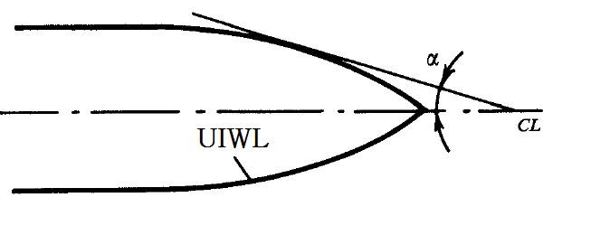
  **Fig 3.1 Slope of UIWL at the section considerd,** $\alpha$**(deg)**
  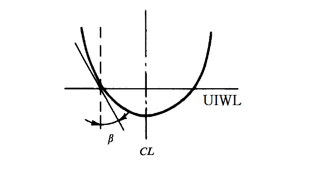
  **Fig 3.2 Slope of frame on the level of UIWL at the section considerd,** $\beta$**(deg)**
  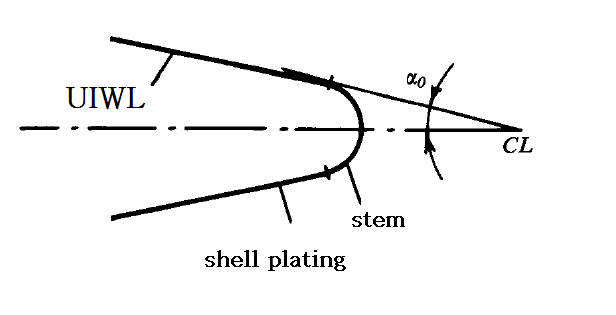
  **Fig 3.3 Slope of UIWL at the fore perpendicular,** $\alpha _{0}$**(deg)**
  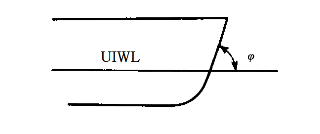
  **Fig 3.4 Slope of stem on the level of UIWL,** $\varphi$**(deg)**
- **2.** The hull configuration factors of Arctic class ships shall be accordance with **Table 3.4**.

  | Arctic class | Arctic8, Arctic9 | Arctic6, Arctic7 | Arctic5 | Arctic4 |
  | --- | --- | --- | --- | --- |
  | $\varphi$ | 25° | 30° | 45° | 60° |
  | $\alpha _{0}$ | 30° | 30° | 40° | 40° |
  | $\beta$ within 0,05$L$ from fore perpendicular | 45° | 40° | 25° | 20° |
  | $\beta$ amidships | 15° | - | - | - |
- **3.** The value of hull configuration factors in Icebreakers shall comply with the following requirements.
  - **(1)** At 0 - 0.25L from fore perpendicular at service draughts, straight and convex waterlines shall be used. The entrance angle for above waterlines shall be 22${}^{\circ}$ to 30${}^{\circ}$.
  - **(2)** At service draughts, the angle shall not exceed : 30${}^{\circ}$ for Icebreaker3, Icebreaker4 class ice breakers, 25${}^{\circ}$ for Icebreaker5, Icebreaker6.
  - **(3)** The cross section of stem shall be executed in the form of a trapezoid with a bulging forward face.
  - **(4)** For Icebreakers with standard bow lines, slop angles of frames shall be adopted from **Table 3.5**.
  - **(5)** In way of construction water line, frames shall have a straight-lined or moderately convex shape.
    **Table 3.5 The angle** $\beta$ **of Icebreaker**

    | Distance from section to fore perpendicular | 0.1$L$ | 0.2 - 0.25$L$ | 0.4 - 0.6$L$ | 0.8 - 1.0$L$ |
    | --- | --- | --- | --- | --- |
    | $\beta$ (deg) | 40° - 55° | 23° - 32° | 15° - 20° | Approximately coinciding with the angles of within 0 - 0.2$L$ |
- **4.** **4**. The lower ice waterline shall cover the blade tips of side propellers(refer to **Fig 3.5**), the tip clearance shall not be less than stated in **Table 3.6**.
  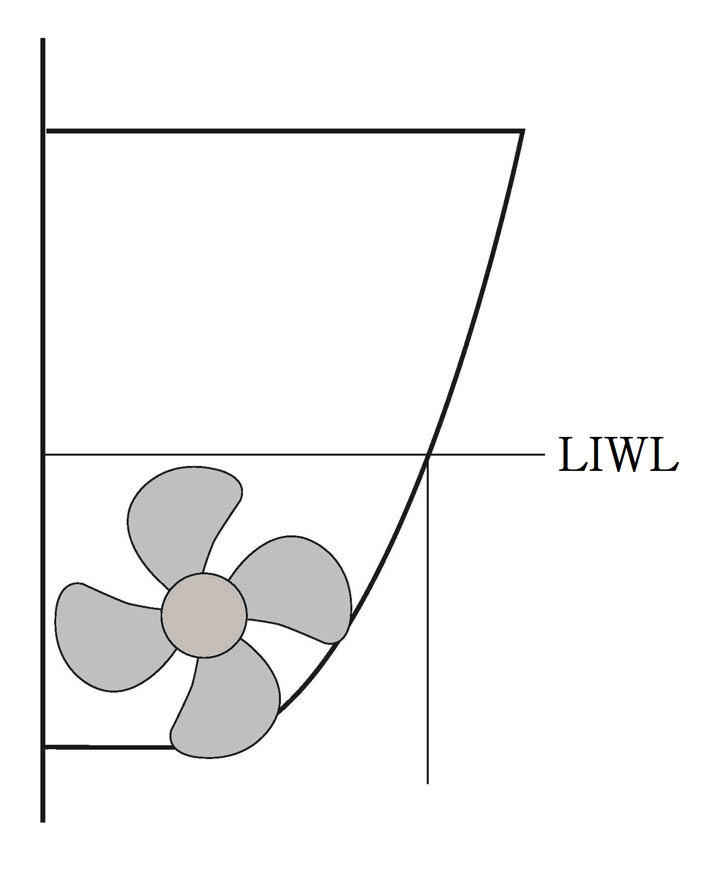
  **Fig 3.5 The position of blade tips of side propellers**

  | Class of Icebreaker | Icebreaker6 | Icebreaker5 | Icebreaker4 | Icebreaker3 |
  | --- | --- | --- | --- | --- |
  | Clearance,$\delta$ (mm) | 1500 | 1250 | 750 | 500 |
- **5.** In the afterbody of Icebreakers and Arctic class ships, there shall be appendage(ice knife) aft of the rudder to protect the latter on the sternway.
- **6.** For Icebreakers and Arctic6 ∼ Arctic9 class ships, the transom stern is not permitted. But transom stern where placed in out of ice strengthening regions is permitted.
- **7.** For Icebreakers and Arctic6 ∼ Arctic9 class ships, there shall be a ice skeg(refer to **Fig 3.6**) in the lower part of the stem. The height of the ice skeg shall be 0.1$d$ at least. The transition from the ice skeg to the lower part of the stem shall be smooth.
- **8.** In Arctic8 ∼ Arctic9 class ships, bulbous bow is not permitted. In Arctic4 class ships, this kind of bow is subject to special consideration by the Society.
  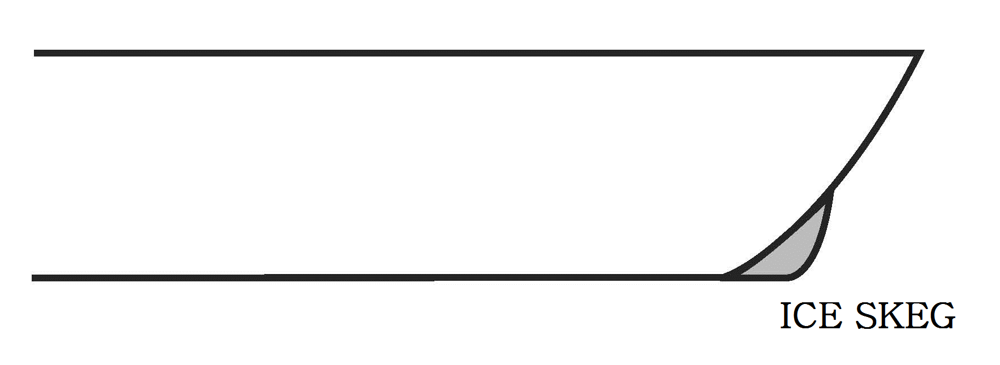
  Fig 3.6 Ice skeg

#### 203. Region of ice strengthening

- **1.** There are ice strengthening regions lengthwise as follows.
  forward region - A
  forward intermediate region - B
  midship region - C
  aft region - D
- **2.** There are ice strengthening regions transversely as follows.
  region from $h _{1}$, the upper of UIWL to $h _{3}$, the lower of LIWL - 1
  region from the lower edge of region 1 to the upper edge of bilge strake - 2
  bilge strake - 3
  region from the lower edge of bilge strake to the center line - 4
- **3.** The scope of regions of ice strengthening in Arctic class ships shall be determined on the basis of **Fig 3.7** and **Table 3.7**.
  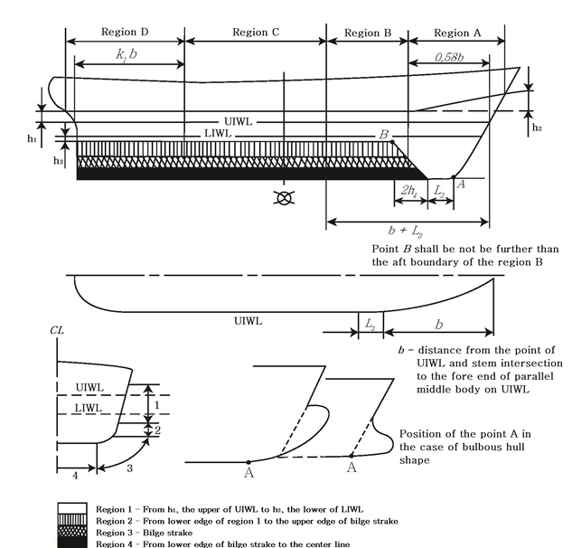
  Fig 3.7 Region of ice strengthening of Arctic class ships

  | Arctic class |   | Arctic7, Arctic8, Arctic9 | Arctic5, Arctic6 | Arctic4 |
  | --- | --- | --- | --- | --- |
  | $h _{1}$(m) | where $B \leq 20$m | 0.75 |   | 0.60 |
  | $h _{1}$(m) | where $B>20$m | $\frac{0.5B+8}{24}$ |   | $\frac{0.5B+8}{30}$ |
  | $h _{2}$(m) |   | 1.4 | 0.8 | 0.6 |
  | $h _{3}$(m) |   | 1.6$h _{1}$ | 1.35$h _{1}$ | 1.20$h _{1}$ |
  | $L _{2}$(m) |   | 0.15$L$ | 0.1$L$ | 0.05$L$ |
  | $L _{3}$(m) |   | 0.06$L$ | 0.05$L$ | 0.045$L$ |
  | $k _{1}$ |   | 0.84 | 0.69 | 0.55 |
- **4.** The scope of regions of ice strengthening in Icebreakers shall be determined on the basis of **Fig 3.8** and **Table 3.8**.

  | Icebreakers |   | Icebreaker6 | Icebreaker5 | Icebreaker4 |   | Icebreaker3 |
  | --- | --- | --- | --- | --- | --- | --- |
  | $h _{1}$, in m | where $B \leq 20$m | 1.00 | 0.80 | 0.75 |   |   |
  | $h _{1}$, in m | where $B>20$m | $\frac{0.5B+12}{22}$ | $\frac{0.5B+7.6}{22}$ | $\frac{0.5B+8}{24}$ |   |   |
  | $h _{2}$, in m |   | 2 | 1.7 | 1.4 | 1.1 |   |
  | $h _{3}$, in m |   | $1.9+1.6h _{1} \geq 3.5$ | $1.72+1.6h _{1} \geq 3.0$ | $1.6+1.6h _{1} \geq 2.8$ | $0.4+1.6h _{1} \geq 1.6$ |   |
- **5.** The requirements of the Chapter apply to the regions of ice strengthening marked with "○" in **Table 3.9**. For the purpose of **Table 3.9**, the absence of this mark means that the particular region of ice strengthening is not covered by the requirements of the section.

  | Ship class | Regions transversely |   |   |   |   |   |   |   |   |   |   |   |   |   |   |   |
  | --- | --- | --- | --- | --- | --- | --- | --- | --- | --- | --- | --- | --- | --- | --- | --- | --- |
  | Ship class | 1 |   |   |   | 2 |   |   |   | 3 |   |   |   | 4 |   |   |   |
  | Ship class | Regions lengthwise |   |   |   |   |   |   |   |   |   |   |   |   |   |   |   |
  | Ship class | A | B | C | D | A | B | C | D | A | B | C | D | A | B | C | D |
  | Icebreaker4, Icebreaker5, Icebreaker6, Arctic8, Arctic9 | **○** | **○** | **○** | **○** | **○** | **○** | **○** | **○** | **○** | **○** | **○** | **○** | **○** | **○** | **○** | **○** |
  | Arctic7 | **○** | **○** | **○** | **○** | **○** | **○** | **○** | **○** | **○** | **○** | **○** | **○** | **○** | **○** |   | **○** |
  | Icebreaker3, Arctic6 | **○** | **○** | **○** | **○** | **○** | **○** | **○** | **○** | **○** | **○** | **○** | **○** | **○** | **○** |   | **○** |
  | Arctic5 | **○** | **○** | **○** | **○** | **○** | **○** | **○** | **○** | **○** | **○** |   | **○** | **○** |   |   |   |
  | Arctic4 | **○** | **○** | **○** | **○** | **○** | **○** | **○** |   | **○** | **○** |   | **○** | **○** |   |   |   |

  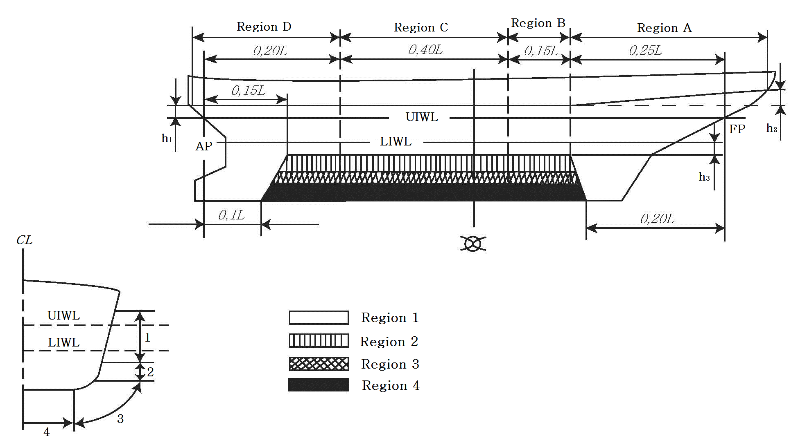
  Fig 3.8 Region of ice strengthening of Icebreakers

#### 204. Material and Welding

- **1.** **Design temperatures**
  The design temperatures for steel grades to be used in hull structure members in accordance with this chapter are to be determined as follows. Where the builder specified the design temperature lower than below temperature, the steel grades are to be based on the temperature are specified by the builder.
  - **(1)** Arctic5 ~ Arctic9 and Icebreaker4 ~ Icebreaker6 class ships : -40℃
  - **(2)** Arctic4 and Icebreaker3 class ships : -30℃
- **2.** **Application of steels**
  - **(1)** Materials for ships applied by the requirements of this chapter in accordance with this chapter in the various strength members above the LIWL exposed to air are not to be of lower grades than those corresponding to classes as given in **Table 3.10,** For non-exposed structures and structures below the LIWL, see **Pt 3, Ch 1, 405. of the Rules for the Classification of Steel Ships**.
  - **(2)** The material grade requirements for hull members of each class depending on thickness and design temperature are defined in **Table 3.11.**
  - **(3)** Single strakes required to be of class Ⅲ or of grade *E, EH* 32/*EH* 36/*EH* 40 and *FH* 32/*FH* 36/*FH* 40 are to have breadths not less than the values given by the following formula, maximum 1800 mm.
    $b=5L+800$(mm)
  - **(4)** Plating materials for stern frames, rudder horns, rudders and shaft brackets are not to be of lower grades than those corresponding to the material classes given in **Pt 3, Ch 1, 405. 3 of the Rules for the Classification of Steel Ships**.
- **3.** **Welding**
  - **(1)** All welding within ice strengthened regions is to be of the double continuous type.
  - **(2)** Continuity of strength is to be ensured at all structural connections.

    **Table 3.10 Application of material classes and grades - Structures exposed at low temperatures**

    | Structural member category | Material class |   |
    | --- | --- | --- |
    | Structural member category | Within 0.4$L$ amidships | Outside 0.4$L$ amidships |
    | ○ SECONDARY: - Deck plating exposed to weather, in general - Side plating above LIWL - Transverse bulkheads above LIWL | I | I |
    | ○ PRIMARY: - Strength deck plating [1] - Continuous longitudinal members above strength deck, excluding longitudinal hatch coamings - Longitudinal bulkhead above LIWL - Top wing tank bulkhead above LIWL | II | I |
    | ○ SPECIAL: - Sheer strake at strength deck [2] - Stringer plate in strength deck [2] - Deck strake at longitudinal bulkhead [3] - Continuous longitudinal hatch coamings [4] | III | II |
    | ○ Shell plating, frame and welded stem/sten of ice strengthening region 1 for Arctic7 class ships | I | I |
    | ○ Shell plating, frame and welded stem/sten of ice strengthening region 1 for Arctic8 ~ Arctic9 class ships and Icebreakers | II | II |
    | Notes : [1] Plating at corners of large hatch openings to be specially considered. Class Ⅲ or grade *E*, *EH* 32, *EH* 36 and *EH* 40 to be applied in positions where high local stresses may occur. [2] Not to be less than grade *E*, *EH* 32, *EH* 36 and *EH* 40 within 0.4$L$ amidships in ships with length exceeding 250 m [3] In ships with a breadth exceeding 70 m at least three deck strakes to be class Ⅲ. [4] Not to be less than grade *D*, *DH* 32, *DH* 36 and *DH* 40. |   |   |

    **Table 3.11 Material grade requirements for classes I, II and III at low temperatures** Class I

    | Plate thickness in (mm) | -20/-25 °C |   | -26/-35 °C |   | -36/-45 °C |   | -46/-55 °C |   |
    | --- | --- | --- | --- | --- | --- | --- | --- | --- |
    | Plate thickness in (mm) | *MS* | *HT* | *MS* | *HT* | *MS* | *HT* | *MS* | *HT* |
    | $t \leq 10$ | *A* | *AH* | *B* | *AH* | *D* | *DH* | *D* | *DH* |
    | $10 *B* *AH* *D* *DH* *D* *DH* *D* *DH* |   |   |   |   |   |   |   |   |
    | \(15 *B* *AH* *D* *DH* *D* *DH* *E* *EH* |   |   |   |   |   |   |   |   |
    | \(20 *D* *DH* *D* *DH* *D* *DH* *E* *EH* |   |   |   |   |   |   |   |   |
    | \(25 *D* *DH* *D* *DH* *E* *EH* *E* *EH* |   |   |   |   |   |   |   |   |
    | \(30 *D* *DH* *D* *DH* *E* *EH* *E* *EH* |   |   |   |   |   |   |   |   |
    | \(35 *D* *DH* *E* *EH* *E* *EH* *-* *FH* |   |   |   |   |   |   |   |   |
    | \(45 *E* *EH* *E* *EH* *-* *FH* *-* *FH* |   |   |   |   |   |   |   |   |
    | Class Ⅱ |   |   |   |   |   |   |   |   |
    | Plate thickness in (mm) | -20/-25 °C |   | -26/-35 °C |   | -36/-45 °C |   | -46/-55 °C |   |
    | Plate thickness in (mm) | *MS* | *HT* | *MS* | *HT* | *MS* | *HT* | *MS* | *HT* |
    | \(t \leq 10$ | *B* | *AH* | *D* | *DH* | *D* | *DH* | *E* | *EH* |
    | $10 *D* *DH* *D* *DH* *E* *EH* *E* *EH* |   |   |   |   |   |   |   |   |
    | \(20 *D* *DH* *E* *EH* *E* *EH* *-* *FH* |   |   |   |   |   |   |   |   |
    | \(30 *E* *EH* *E* *EH* *-* *FH* *-* *FH* |   |   |   |   |   |   |   |   |
    | \(40 *E* *EH* *-* *FH* *-* *FH* *-* *-* |   |   |   |   |   |   |   |   |
    | \(45 *E* *EH* *-* *FH* *-* *FH* *-* *-* |   |   |   |   |   |   |   |   |
    | Class Ⅲ |   |   |   |   |   |   |   |   |
    | Plate thickness in (mm) | -20/-25 °C |   | -26/-35 °C |   | -36/-45 °C |   | -46/-55 °C |   |
    | Plate thickness in (mm) | *MS* | *HT* | *MS* | *HT* | *MS* | *HT* | *MS* | *HT* |
    | \(t \leq 10$ | *D* | *DH* | *D* | *DH* | *E* | *EH* | *E* | *EH* |
    | \(10 *D* *DH* *E* *EH* *E* *EH* *-* *FH* |   |   |   |   |   |   |   |   |
    | \(20 *E* *EH* *E* *EH* *-* *FH* *-* *FH* |   |   |   |   |   |   |   |   |
    | \(25 *E* *EH* *E* *EH* *-* *FH* *-* *FH* |   |   |   |   |   |   |   |   |
    | \(30 *E* *EH* *-* *FH* *-* *FH* *-* *-* |   |   |   |   |   |   |   |   |
    | \(35 *E* *EH* *-* *FH* *-* *FH* *-* *-* |   |   |   |   |   |   |   |   |
    | \(40 *-* *FH* *-* *FH* *-* *-* *-* *-* |   |   |   |   |   |   |   |   |
    | Notes : The symbols in the table mean the grades of steel as follows : *AH* : *AH* 32, *AH* 36 and *AH* 40, *DH* : *DH* 32, *DH* 36 and *DH* 40, *EH* : *EH* 32, *EH* 36 and *EH* 40, *FH* : *FH* 32, *FH* 36 and *FH* 40 *MS* : Mild steels, *HT* : High tensile steels |   |   |   |   |   |   |   |   |

#### 205. Structure

- **1.** **Side grillage structure transversely framed**
  - **(1)** Side grillage structure transversely framed include conventional frames, deep frames and stringers.
    Conventional frame are subdivided into :
    - main frames in plane of floors or bilge brackets
    - intermediate frame not in plane as floors or bilge brackets. The intermediate frames are not mandatory within a side grillage. Not more than one intermediate frame may be fitted between main frames.
    Stringer are subdivided into :
    - side stringers by which a transition of forces is ensured from conventional frames which directly take up the ice load to deep frames or to transverse bulkhead
    - intercostal stringers by which joint taking-up of local ice loads by the frames is ensured. It is recommended that the stringer shall be inter-costal
  - **(2)** Side grillage structures are permitted as follows :
    - grillage with transverse main frames which is formed by conventional frames of the same section and by intercostal stringer
    - grillage with transverse web frames which is formed by conventional frames, side stringers and deep frames. Intercostal stringers may be fitted together with side stringers
  - **(3)** With a double-bottom structure available, the functions of deep frames are taken over by vertical diaphragms, and those of the side stringers, by horizontal diaphragms.
  - **(4)** In Icebreakers and Arctic5 ~ Arctic9 class ships, frames shall be attached to decks and platforms with brackets; if a frame is intercostal in way of deck, platform or side stringer, brackets shall be fitted on both sides of it.
  - **(5)** The end attachments of main frames shall not less than their section modulus. In Icebreakers solid floors shall be fitted on each main frame. In Arctic8, Arctic9 class ships, solid floors shall be fitted on every other main frame.
  - **(6)** In Icebreakers and Arctic class ships, the bottom ends of intermediate frames shall be secured at margin plate stiffened with a lightened margin bracket(or a system of stiffeners) reaching up to longitudinal stiffeners or intercostal members and welded thereto(**Fig 3.9**)
    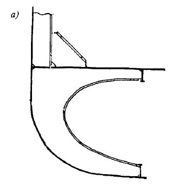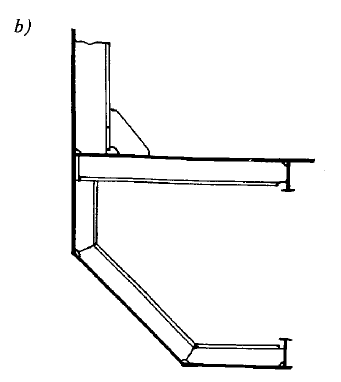
    **Fig 3.9** $a$ **- lighted margin bracket,** $b$ **- system of stiffeners**
  - **(7)** Where there is no double bottom, the intermediate frames shall extend as far as longitudinal stiffeners or intercostal structure and welded thereto. The particular longitudinal stiffener or intercostal structure shall be fitted not higher than the floor face-plate level.
  - **(8)** In Icebreakers and Arctic class ships, the upper ends of intermediate frames shall be secured on a deck or platform lying above the upper boundary of region I.
  - **(9)** In region I and II of Icebreakers and Arctic class ships, intercostal and/or side stringers shall be fitted the distance between which or the stringer-to-deck or platform distance shall not exceed 2 m, as measured on a chord at side.
    Side stringers shall be fitted in the UIWL and LIWL regions. If there is a deck or platform lying on the same level, the side stringer may be omitted. Stringers shall be attached to bulkhead by means of brackets.
- **2.** **Supporting sections of frames in grillage with transverse framing**
  - **(1)** For frames, horizontal grillages(decks, platforms, bottom) are considered to be supporting structures. A supporting structure consists of plating(decks, platforms, double bottom) and framing connected thereto(beams, half-beams, floors, tank-side brackets). Where there is no double bottom, the formulate to be found below shall be used on the assumption that the plating lies level with floor face plates.
  - **(2)** The supporting section of a conventional frame is considered to be fixed, if one of the following conditions is met at least.(refer to **Table 3.12**)
    1) the frame is connected to the framing of a supporting structure
    2) the frame crossed the plating of a supporting structure
  - **(3)** A supporting section is considered to be simply supported, if one of the following conditions is met at least.(refer to **Table 3.12**)
    1) a conventional frame is not connected to supporting structure framing
    2) a conventional frame is terminated on the structure plating
  - **(4)** Where a conventional frame terminates on an intercostal longitudinal(intercostal stringer), its end is considered to be free, i.e. with no supporting section.
  - **(5)** The position of a supporting section of a frame(conventional or deep frame) is determined in the following way.(refer to **Table 3.12**)
    1) Where the frame is connected to the supporting structure plating only, the supporting section coincides with the plating surface.
    2) Where the frame is connected to the supporting structure framing, the supporting section coincides with the face plate surface of the supporting structure frame in case of bracketless joint.
    3) Where the frame is connected to the supporting structure framing, the supporting section lies at bracket end where brackets with a straight or rounded and stiffened edge are connected.
    4) Where the frame is connected to the supporting structure framing, the supporting section lies in the middle of the bracket side where brackets with a rounded free edge are connected.
    **Table 3.12 Structure and the position of supporting section of frames in grillage with**
    **transverse framing**

    | Type of joint in way supporting section of the frame | Type of supporting section | Sketch showing structure and the position of supporting section therein |
    | --- | --- | --- |
    | Intersection of supporting structure | Fixed | 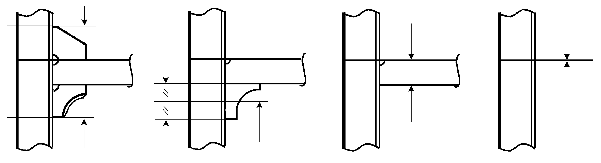 |
    | Securing on supporting structure with connection to its framing | Fixed | 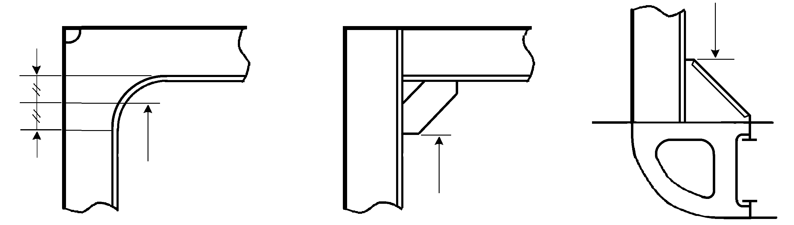 |
    | Securing on supporting structure without connection to its framing | Simply supported | 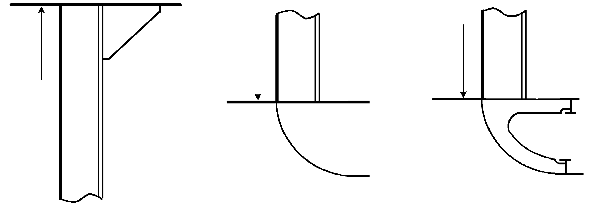 |
    | Securing on intercostal longitudinal | Free end | 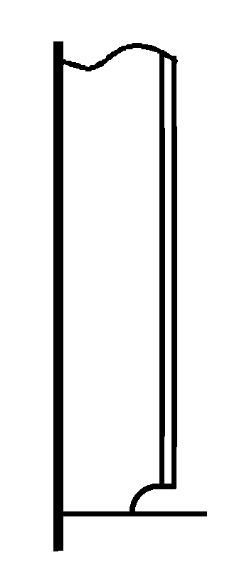 No supporting section |
- **4.** **Plate structures**
  - **(1)** By plate structures, the sections of deck, platform and double bottom plating, of transverse bulkhead plating, deep frame plates and bilge brackets which adjoin the shell plating are meant.
  - **(2)** For hull members mentioned under (1), the areas to be covered by the requirements for plate structure shall be established as **Table 3.13**.
    **Table 3.13 Application area of the requirements for plate structure**

    | Area | Ship class | Distance from the shell plating |
    | --- | --- | --- |
    | fore peak and after peak bulkheads | Icebreakers and Arctic5 ~ Arctic9 | throughout their breadth |
    | other bulkheads in region 1 and 2 | Icebreakers and Arctic4 ~ Arctic9 | on a breadth of 1.2m |
    | decks and platforms | Icebreakers and Arctic4 ~ Arctic9 | on a breadth of 1.2m |
    | other hull members | Icebreakers and Arctic4 ~ Arctic9 | on a breadth of 0.6m |
  - **(3)** In the areas of plate structures mentioned under (2), corrugated structures with corrugations arranged along the shell plating(i.e. vertical corrugations on transverse bulkheads and longitudinal corrugations on decks or platforms) are not permitted.
  - **(4)** The plate structures of Icebreakers, Arctic5 ~ Arctic9 class ships and region 1 of Arctic5 class ships shall be provided with stiffeners fitted at right angles approximately to the shell plating. The stiffeners shall be spaced not farther apart than stipulated in **Table 3.14**.
    **Table 3.14 Maximum spacing of stiffeners**

    | Orientation of main framing fitted at shell plating | Maximum spacing of stiffeners |   |
    | --- | --- | --- |
    | Orientation of main framing fitted at shell plating | Icebreaker, Arctic5(region 1) Arctic6 ~ Arctic9 | Arctic5(except region 1), Arctic4(region 1) |
    | Main framing lies across a plate structure | $a$, but not greater than 0.5 m | $2a$, but not greater than 1.0 m |
    | Main framing lies parallel to plate structure | 0.6 m | 0.8 m |
    | Note : $a$ is the spacing of main framing girder, as measured on the shell plating. |   |   |
  - **(5)** The intersections of plate structures with main framing shall be executed in accordance with **Table 3.14**.
    **Table 3.15 The intersections of plate structures with main framing**

    | Ship class | Sketch of structure |   |   |
    | --- | --- | --- | --- |
    | Ship class | 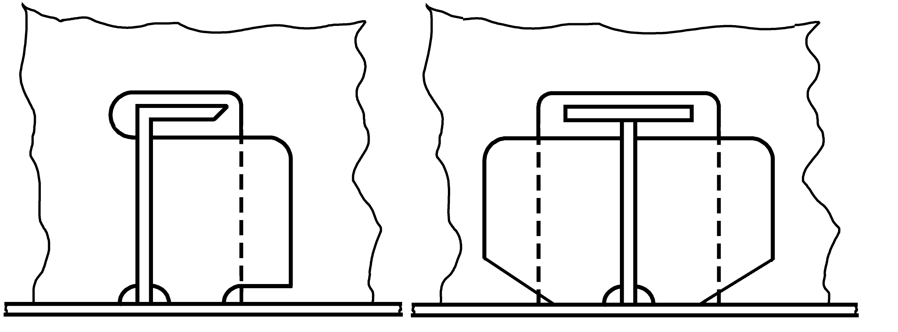 | 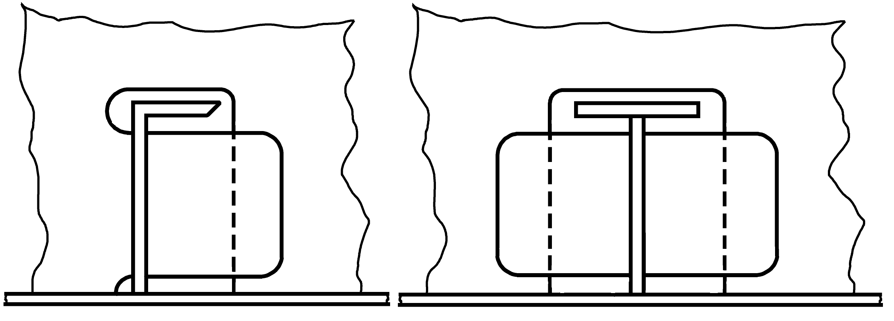 | 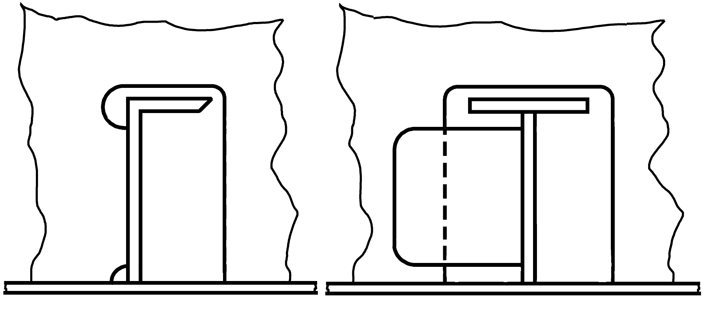 |
    | Icebreaker5, Icebreaker6 | Fore peak, after peak, region 1, 2 with longitudinal framing | Regions 2, A3, B3, D3, A4, B4 | Other regions as per Table 3.9 |
    | Icebreaker3, Icebreaker4 | Fore peak, after peak, region 1, 2 with longitudinal framing | Regions 1 and 2 (except fore peak and after peak) A3, B3, D3 | Other regions as per Table 3.9 |
    | Arctic7 ~ Arctic9 | Fore peak, region 1 with longitudinal framing | Regions 1 and 2 (except fore peak), A3, A4, B3, B4 | Other regions as per Table 3.9 |
    | Arctic5, Arctic6 | Fore peak, region A1, B1, C1 with longitudinal framing | Regions 1 (except fore peak), 2 , A3, B3 | Other regions as per Table 3.9 |
    | Arctic4 | ㅡ | Regions 1, A2, B2, A3, B3 | Other regions as per Table 3.9 |
  - **(6)** Where main framing girders are intercostal in way of the plate structure, brackets shall be fitted on both side of the structure on the same plane as each of the girders, and the girder webs shall be welded to the plate structure.
  - **(7)** The following requirements are put forward additionally for the intersections of the plate structures of decks and platforms with main framing.
    1) Where transverse framing is used for sides, the frames shall be attached to the beams with brackets, In Arctic5(region 1 only), Arctic6 ~ Arctic9 class ships, the girders shall be fitted on the same plane as each of the frames.
    2) In Arctic5(except region 1) and Arctic4(region 1) class ships, the frame on whose plane no beam is fitted shall be secured to the plate structure with brackets which shall terminate on the intercostal stiffener.
    3) Where longitudinal framing is used for sides, the beams shall be attached to the shell plating with brackets reaching as far as the nearest side longitudinal.
  - **(8)** The distance from the edge of opening or manhole to the shell plating shall not be less than 0.5m in a plate structure. The distance from the edge of opening or manhole in a plate structure to the edge of opening for the passage of a girder through the plate structure shall not be less than the height of that girder.
- **5.** **Fore peak and after peak structure**
  - **(1)** A longitudinal bulkhead welded to the stem or sternframe shall be fitted on the centerline of the ship in the fore peak and after peak of Icebreakers and Arctic8, Arctic9 class ships, and the lower ends of all frames shall be connected to floors or brackets.
  - **(2)** In the fore peak of Icebreakers and Arctic8 ~ Arctic9 class ships, platforms with lightening holes shall be fitted instead of stringers and panting beams, the distance between platforms measured along a chord at side, shall not exceed 2.0m. This structure is recommended for Arctic4 class ships as well.
  - **(3)** In the after peak of Icebreakers and Arctic8 ~ Arctic9 class ships, side stringers and panting beams shall be fitted so that the distance between the stringers as measured along a chord at side, would not be greater than 2.0m. The dimensions of stringer webs shall not be less than determined by the formulae.
    depth d = 5L + 400 (mm)
    thickness t = 0.05L + 7 (mm)
    where, L : length of ship (m)
    Platform with lightening holes are recommended instead of panting beams and stringers.
  - **(4)** In Icebreakers and Arctic6 ~ Arctic9 class ships, the side stringers in the fore peak and after peak shall generally be a continuation of those fitted in the region A and D(refer to **203. 1**)
  - **(5)** In the case of Arctic4 class ships, the area and inertia moment of panting beams shall be increased by 25 per cent as compared to those required for non-Arctic class ships. The dimension of stringer webs shall not be less than given by the formula.
    depth d = 3L + 400 (mm)
    thickness t = 0.04L + 6.5 (mm)
    where, L : length of ship (m)
  - **(6)** In the fore peak and after peak, the free edge of side stringers shall be stiffened with face plates having a thickness not less than the web thickness and a width not less than ten thickness. The interconnections of frames with side stringers shall be in accordance with **Table 3.14**, and brackets shall be carried to the face plates of the stringers.
- **6.** **Stem and sternframe construction**
  - **(1)** Arctic6 ~ Arctic9 class ships shall have a solid section stem made of steel(cast steel is recommended). The stems and sternframes of Icebreakers, as well as the sternframes of Arctic5 ~ Arctic9 class ships, shall be made of forged or cast steel. Stems and sternframes welded of cast or forged parts are admissible.
  - **(2)** In Arctic4, Arctic5 class ships, a stern of combined structure(a bar with thickened plates welded thereto) or plate structure may be used, and where the ship length is under 150m with a sharp-lined bow, the stem design shown in **Fig 3.10** may be used.
    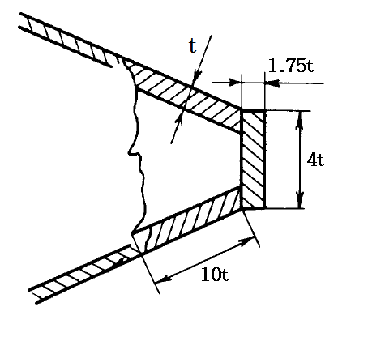
    **Fig 3.10 Stem for ship length is under 150m**
  - **(3)** In Arctic4 ~ Arctic7 class ships, the stem shall, where practicable, be strengthened by a center line web having its section depth equal to $h _{v}$ at least(refer to **Table 3.35**) with a face plate along its free edge or a longitudinal bulkhead fitted on the ship centerline, on the entire stem length from the keel plate to the nearest deck or platform situated above the level $H _{1}$ referred to in **216.** and in **Table 3.35**. The thickness of this plate shall not be less than that of the brackets. In Icebreakers and Arctic8, Arctic9 class ships, a longitudinal bulkhead may be substituted for the center line web.
  - **(4)** Within the vertical extent defined in (3), the stem shall be strengthened by horizontal webs at least 0.6m in depth and spaced not more than 0.6m apart. The webs shall be carried to the nearest frames and connected thereto. Where in line with side stringers, the webs shall be attached to them. In stems of combined or plate type, the webs shall be extended beyond the welded butts of the stem and shell plating.
  - **(5)** Above the deck or platform located, by the value of $H _{1}$ at least, higher than the upper boundary of region 1, the spacing of horizontal webs may gradually increase to 1.2m in Icebreakers and Arctic7 ~ Arctic9 class ships, and to 1.5m in ships of other classes. The web thickness shall be adopted not less than half the stem plate thickness. In Icebreakers and Arctic class ships, the free edges of webs shall be strengthened with face plates welded to the frames at their ends. The side stringers of the fore peak shall be connected to the webs fitted in line with them.
  - **(6)** Where the stern frame has an appendage(ice knife), the clearance between the latter and the rudder plate shall not exceed 100mm. The appendage shall be reliably connected to the stern frame. Securing the appendage to plate structure is not permitted.
  - **(7)** In Icebreakers, the lower edge of sole-piece shall be constructed with a slope of 1:8 beginning from the propeller post.
- **7.** **Bottom structure**
  - **(1)** In Icebreakers and Arctic5 ~ Arctic9 class ships, double bottom shall be provided between the fore peak bulkhead and the after peak bulkhead.
  - **(2)** In Icebreakers, provision shall be made for solid floors at each main frame, and in Arctic8, Arctic9 class ships, at every other main frame.
  - **(3)** In regions of ice strengthening in way of bottom, as established in accordance with **Table 3.9**, bracket floors are not permitted.
  - **(4)** In Icebreaker and Arctic8, Arctic9 class ships the center-line girder height shall not be less than determined by the formula.
    $d _{0} = \varphi (9L+800) _{}$ (mm)
    where,
    $\varphi$ = 0.8 for Arctic8 class ships
- **0.** 9 for Arctic9 class ships
- **1.** 0 for Icebreakers
  - **(5)** In Icebreakers and Arctic8, Arctic9 class ships, the spacing of bottom stringers shall not exceed 3.0m.
- **8.** **Special requirements**
  - **(1)** In Icebreakers, double side structure shall generally be provided between the fore peak bulkhead and the after peak bulkhead.
  - **(2)** In Arctic7 ~ Arctic9 class ships double side structure is necessary for engine room, and for the region mentioned in (1) it is recommended.
  - **(3)** Where the web plate of a girder of a plate structure is considerably inclined to the shell plating, the framing normal to the shell plating or an inclined plate structure is recommended.

#### 206. Ice load

- **1.** Where using the ice load parameters for strength estimation on the basis of other procedures and programs are to be specially approved by the Society.
- **2.** The ice-load parameters to be determined according to **Par 3** to **8** apply to Arctic class ships and Icebreakers with hull shape complying with the requirements of **202. 2.** and **202.3.**
- **3.** **Ice load for Arctic class ships**
  For Arctic class ships, the ice load(kPa), shall be determined by **Table 3.16**.

  | Ice strengthening region and Arctic class |   | Ice load (kPa) |
  | --- | --- | --- |
  | A1 | All class | $p _{A1} =2500a _{1} v _{m} root {6} of {\frac{\Delta }{1000}}$ |
  | B1 | All class | $p _{B1} = 2500a _{2} v _{m} root {6} of {\frac{\Delta }{1000}}$ |
  | C1 | All class | $p _{C1} =1200a _{3} root {6} of {\frac{\Delta }{1000}}$ |
  | D1 | Arctic4, Arctic5, Arctic6 | $p _{D1} =a _{4} p _{C1}$ |
  | D1 | Arctic7, Arctic8, Arctic9 | $p _{D1} =0.75p _{A1}$ |
  | 2, 3, 4 | All class | the ice load is determined as follow formula a part of the ice load in region 1 at considered section $p _{kl} =a _{kl} \cdot p _{k1}$ |
  | Where $a _{1}$, $a _{2}$, $a _{3}$, $a _{4}$ = factor as specified in **Table 3.17** proceeding from the Arctic class $\Delta$ = displacement(t) correspond to UIWL $v _{m}$ = value of the shape factor which is the maximum one for the region, as at considered sections on the ice loadline level. The value shall be determined by the formula. $v _{m} =(0.278+ \frac{0.18x}{L} ) root {4} of {\frac{\alpha ^{2}}{\beta}}$ where $\frac{x}{L} \leq 0.25$ $v _{m} =(0.343- \frac{0.08x}{L} ) root {4} of {\frac{\alpha ^{2}}{\beta}}$ where $\frac{x}{L} >0.25$ $x$ = the distance between the considered section and the forward perpendicular(m) $\alpha$ = angles(deg) of summer load waterline inclination which shall be measured in accordance with **Fig 3.1** and **3.3** (where $x=0$) $\beta$ = angles(deg) of frame inclination on UIWL level which shall be measured in accordance with **Fig 3.2.** Where the frame is concave in a section, a minimal angle shall be chosen for in the case of Arctic4 ~ Arctic9 class ships which is measured on all waterlines of ice navigation $a _{kl}$ = as specified in **Table 3.18**. $k$ is A, B, C, D for region lengthwise of ice strengthening, $l$ is 2, 3, 4 for region transversly of ice strengthening. |   |   |

  | Arctic class | Arctic4 | Arctic5 | Arctic6 | Arctic7 | Arctic8 | Arctic9 |
  | --- | --- | --- | --- | --- | --- | --- |
  | $a _{1}$ | 0.79 | 1.15 | 1.89 | 2.95 | 5.3 | 7.9 |
  | $a _{2}$ | 0.80 | 1.17 | 1.92 | 3.06 | 5.75 | 8.95 |
  | $a _{3}$ | 0.50 | 0.78 | 1.2 | 1.84 | 3.7 | 5.6 |
  | $a _{4}$ | 0.75 | 0.87 | 1.0 | - | - | - |

  | Arctic class | Region lengthwise |   |   |   |   |   |   |   |   |
  | --- | --- | --- | --- | --- | --- | --- | --- | --- | --- |
  | Arctic class | forward and intermediate regions (A and B) |   |   | midship region (C) |   |   | aft region(D) |   |   |
  | Arctic class | Region vertically |   |   |   |   |   |   |   |   |
  | Arctic class | 2 | 3 | 4 | 2 | 3 | 4 | 2 | 3 | 4 |
  | Arctic4 Arctic5 Arctic6 Arctic7 Arctic8 Arctic9 | 0.5 0.65 0.65 0.65 0.7 0.7 | 0.4 0.65 0.65 0.65 0.65 0.65 | 0.35 0.45 0.5 0.5 0.5 0.5 | 0.4 0.5 0.5 0.5 0.55 0.55 | - 0.4 0.45 0.45 0.45 0.45 | - - - - 0.25 0.3 | - 0.5 0.5 0.5 0.55 0.55 | - - 0.35 0.4 0.4 0.4 | - - 0.15 0.2 0.3 0.35 |
- **4.** **The vertical distribution height of ice load for Arctic class ships**
  The vertical distribution height(m) of ice load shall be determined by the following **Table 3.19.**

  | Ice strengthening region and Arctic class |   | Vertical distribution height |
  | --- | --- | --- |
  | A | All class | $b _{A} =C _{1} k _{\Delta } u _{m}$ |
  | B | All class | $b _{B} =C _{2} k _{\Delta } u _{m}$ Max. : $b _{B} =1.25b _{A} p _{A1} /p _{B1}$ Min. : $b _{B} =p _{C1} b _{C} /p _{B1}$ |
  | C | All class | $b _{C} =C _{3} C _{4} k _{\Delta }$ |
  | D | Arctic4, Arctic5, Arctic6 | $b _{D} = 0.8b _{C}$ |
  | D | Arctic7, Arctic8, Arctic9 | $b _{D } =b _{A}$ |
  | Where $C _{1}$, $C _{2}$, $C _{3}$ = factor as specified in **Table 3.20** proceeding from the Arctic class $C _{4}$ = factor as specified in **Table 3.21** proceeding from the minimal side inclination angle in the midship region of ice strengthening on UWIL $k _{\Delta } = root {3} of {\frac{\Delta }{1000}}$, but not greater than 3.5 $\Delta$ = refer to **Par 3** $u _{m}$ = value of the shape factor which is the maximum one for the region, as at considered sections on the ice loadline level. The value shall be determined by the formula. $u _{m} =k _{B} (0.635+ \frac{0.61x}{L} ) \sqrt {\frac{\alpha}{\beta}}$, where $\frac{x}{L} \leq 0.25$ $u _{m} =k _{B} (0.862+ \frac{0.30x}{L} ) \sqrt {\frac{\alpha}{\beta}}$, where $\frac{x}{L} >0.25$ $k _{B} = 1$, where $\beta \geq 7 {}^{\circ}$ $k _{B} = 1.15-0.15 \frac{\beta}{7}$, where $\beta \prec 7 {}^{\circ}$ $x, \alpha , \beta$ = refer to **Par 3** $p _{A1}$, $p _{B1}$, $p _{C1}$ = refer to **Par 3** |   |   |

  | Arctic class | Arctic4 | Arctic5 | Arctic6 | Arctic7, Arctic8, Arctic9 |
  | --- | --- | --- | --- | --- |
  | C1 C2 C3 | 0.49 0.55 0.34 | 0.6 0.7 0.40 | 0.62 0.73 0.47 | 0.64 0.75 0.50 |

  | Angle of side slope amidships(deg) | ≤6 | 8 | 10 | 12 | 14 | 16 | 18 |
  | --- | --- | --- | --- | --- | --- | --- | --- |
  | $C _{4}$ | 1.00 | 0.81 | 0.68 | 0.54 | 0.52 | 0.47 | 0.44 |
- **5.** **The horizontal distribution length of ice load for Arctic class ships**
  Horizontal distribution length(m) of ice load, shall be determined by the following **Table 3.22**.

  | Ice strengthening region | Horizontal distribution length |
  | --- | --- |
  | A | $lp _{A} =11.3 \sqrt {b _{A} \sin \beta _{Am}}$, but not less than $3.5 \sqrt {k _{\Delta }}$ |
  | B | $lp _{B} =11.3 \sqrt {b _{B}} \sin \beta _{Bm}$, but not less than $3 \sqrt {k _{\Delta }}$ |
  | C | $lp _{C} =6b _{C} ,$ but not less than $3 \sqrt {k _{\Delta }}$ |
  | D | $lp _{D} =6b _{D} ,$ but not less than $3 \sqrt {k _{\Delta }}$ |
  | Where $b _{A}$, $b _{B}$, $b _{C}$, $b _{D}$, $k _{\Delta }$ = refer to **Par 4** $\beta _{Am}$ = angle $\beta$ in the design section of region A for which the value of the $u _{m}$ parameter is maximum $\beta _{Bm}$ = angle $\beta$ in the design section of region B for which the value of the $u _{m}$ parameter is maximum $u _{m}$ = refer to **Par 4** |   |
- **6.** **Ice load for Icebreakers**
  For Icebreakers, the ice load shall be determined by the following **Table 3.23**.

  | Region | Ice load |
  | --- | --- |
  | A1 | $P _{A1} =k _{p} P I _{A1}$ |
  | B1, C1, D1 | $P _{k1} =a _{k} P _{A1}$ |
  | 2, 3, 4 | $P _{mn} =a _{mn} P _{m1}$ |
  | Where $P I _{A1}$ = ice load in region A1, to be determined in accordance with **Par 3** as in the case of a ship whose ice class number coincides with the class of the Icebreaker $k_{ p}$ = 1, where $N_{ \sum } \leq N _{ 0}$ $k _{p} =(N _{\sum } /N _{0} ) ^{0.4}$, where $N \succ N _{0}$ $N _{\Sigma }$ = propeller shaft output(MW) $N _{0}$(MW) = as specified in **Table 3.24** $a _{k}$ = factor as specified in **Table 3.25** proceeding from the region of the ship length and class of Icebreaker $P _{m1}$ = ice load in region 1 proceeding from the region lengthwise, $p _{A1 }$, $p _{B1}$, $p _{C1}$, $p _{D1}$ $a _{mn}$ = parameter as specified in **Table 3.26**, $m$ is A, B, C, D for region lengthwise of ice strengthening $n$ is 2,3,4 for region transversly of ice strengthening. |   |

  | Icebreakers | $N _{0} (MW)$ |
  | --- | --- |
  | Icebreaker3 Icebreaker4 Icebreaker5 Icebreaker6 | 10 20 40 60 |

  | Region | Icebreakers |   |   |   |
  | --- | --- | --- | --- | --- |
  | Region | Icebreaker3 | Icebreaker4 | Icebreaker5 | Icebreaker6 |
  | B1 C1 D1 | 0.65 0.6 0.75 | 0.75 0.65 0.75 | 0.85 0.7 0.75 | 0.85 0.75 0.75 |

  | Region vertically and region lengthwise | A2 | A3 | A4 | B2 | B3 | B4 | C2 | C3 | C4 | D2 | D3 | D4 |
  | --- | --- | --- | --- | --- | --- | --- | --- | --- | --- | --- | --- | --- |
  | $a _{mn}$ | 0.7 | 0.65 | 0.5 | 0.6 | 0.55 | 0.45 | 0.55 | 0.45 | 0.35 | 0.55 | 0.40 | 0.30 |
- **7.** As far as Icebreakers are concerned, the vertical distribution height of ice pressure shall be adopted equal for all regions and shall be determined in accordance with **Par 4**, i.e. when determining $u _{m}$, the values of $b _{a}$ shall be calculated for those sections only which are included in the forward region A of ice strengthening of the Icebreaker.
- **8.** As far as Icebreakers are concerned, the horizontal distribution length of ice pressure shall be adopted equal for all regions are shall be determined in accordance with **Par 5**, i.e. when determining $\beta _{Am}$, the values of $lp _{A}$ shall be calculated for those sections only which are included in the forward region A of ice strengthening of the Icebreaker.

#### 207. Shell plating

In regions of ice strengthening, the shell plating thickness $t _{}$(mm), shall not be less than determined by the formula. In addition, $t _{}$(mm) shall not be less than the requirements of **Pt 4, Ch 4 of Rules for the Classificaion of Steel Ships**.
$t _{} =t _{0} + \Delta t _{}$ (mm)
where
$t _{0} =15.8a _{0} \sqrt {\frac{p}{\sigma _{y}}}$
$p$ = ice load(kPa) in the region under consideration according to **206. 3.** or **206. 6.**
$a _{0} = \frac{a}{1+0.5 \frac{a}{c}}$
$c$ = $b$ where the grillage is transversely framed in the region under consideration. In this case, $c$ shall not be greater than the spacing of intercostal stringers or the distance between plate structures
$c$ = $l$ where the grillage is longitudinally framed in the region under consideration
$b$ = vertical distribution(m) of ice pressure in the region under consideration according to **206. 4**. or **206. 7.**
$l$ = distance between supporting section of longitudinal frame(m)
$a$ = spacing of longitudinal frame for the grillage is longitudinally framed or of transverse frame for the grillage is transversely framed(m)
$\Delta t _{}$ = additional thickness(mm) for corrosion wear and abrasion, as specified in **Table 3.27**.

| Ship class | Region of ice strengthening |   |
| --- | --- | --- |
| Ship class | forward and intermediate (A and B) | midship and after(C and D) |
| Arctic4 | 7.0 | 5.0 |
| Arctic5 | 7.0 | 5.5 |
| Arctic6 ~ Arctic9 | 7.5 | 5.5 |
| Icebreaker3 | 7.5 | 5.5 |
| Icebreaker4 | 9.5 | 6.5 |
| Icebreaker5 | 11.5 | 7.5 |
| Icebreaker6 | 13.0 | 7.5 |

#### 208. Procedure for determining the actual section area and ultimate section modulus of stiffeners

The procedure for determining the actual section area and ultimate section modulus of stiffeners are specified in **Ch 2, 205.**

#### 209. Conventional frames where transverse framing is used

The requirements of this paragraph apply to conventional frames, main frame and deep frame in grillages where transverse framing is used. In the case of main framing, the requirements shall be applied to a single span of a conventional frame which lies between the supporting sections of the frame on the upper and lower supporting structures. In the case of web frames, the requirements shall be applied to all the spans of a conventional frame.

- **1.** The ultimate section modulus $Z _{f}$(cm^3), of a conventional frame shall not be less than determined by the formula.
  $Z _{f} =k _{f} Z _{f0}$ (cm^3)
  where
  $k _{f}$$= \frac{1}{F+0.15j}$
  $F$ = 1 with $CF =4$
  $F$ = 0.5 with $CF$ < 4
  $CF$ = refer to **Table 3.28** for grillage with main framing
  $CF$ = 4 for grill ages with web framing
  $j$ = factor equal to : the number of fixed supporting sections of two adjacent frames $j \leq 4$ as far as grillage with main framing are concerned, in the case of grillage with web framing, refer to **Table 3.29**
  $Z _{f0}$$=1.15 \frac{250}{\sigma _{y}} p b a l Y k _{k} E$
  $p$ = ice load(kPa) in the region under consideration in accordance with **206. 3.** or **206. 6.** where the lower boundary of region 1 is included in the grillage and this requirements cover region of ice strengthening 1 and 2, the following values of $p$ shall be adopted $p=p _{k 1}$, if the distance from the plating of the upper supporting structure of the grillage to the lower boundary of region 1 is greater than 1.2b, other wise $p$ = $p _{k2}$
  $p _{k1}$, $p _{k2}$ = ice load in regions 1 and 2(refer to **206. 3.**)
  $b$ = vertical distribution(m) of ice load in the region under consideration in accordance with **206. 3.** or **206. 6.** if b > l, b = 1 shall be adopted for the purpose of determining $Z _{f0}$ and $A _{f}$
  $a$ = conventional frame spacing(m) as measured at side
  $l$ = considered frame span(m) to be determined in accordance with **Table 3.28** in the case of main framing and with **Table 3.29** in the case of web framing
  $Y=1- 0.5 \beta , \beta = \frac{b}{l} ( \beta \leq 1)$
  $k _{k}$ = factor equal to 0.9 for conventional frames joined with knees to bearing stringers in a side grillage with deep frames, and equal to 1.0 in other cases
  E = factor equal to :
  $E = 4l _{i} \frac{l-l _{i}}{l ^{2}}$ with $l _{i} <0.5l$
  $E =1$ with $l _{i} \geq 0.5l$
  where $l _{i}$ = section of the span length $l$(m) overlapped by the region of ice strengthening

  | Parameter | Type of intermediate frame end fixation |   |   |
  | --- | --- | --- | --- |
  | Parameter | both ends supported | one end supported, the other free (attached to an intercostal member) | both ends free (attached to an inter costal member) |
  | $CF$ | 4 | 3 | 2 |
  | $l$ | Half the sum of distances between the supporting sections of two adjacent frames | Distance between the supporting sections of main frame |   |

  | Position of conventional frame zone under consideration | $l$ | $j$ |
  | --- | --- | --- |
  | Between side stringers | Distance between side stringers | 4 |
  | Between upper (lower) supporting structure and the nearest side stringer | Half the sum of distances between supporting sections on supporting structure and the nearest side stringer for two adjacent frames | $j _{0} +2$ where $j _{0} \leq 2$ is the number of fixed supporting sections on the supporting structure for two adjacent frames |
- **2.** The web area $A _{f}$(cm^2) of a conventional frame shall not be less than determined by the formula.
  $A _{f}$ $= \frac{8.7pab}{\sigma _{y}} k _{2} k _{3} k _{4} +0.1d _{w} \Delta t$ (cm^2)
  where
  $k _{2 } = \frac{4}{CF}$
  $k _{3} = \frac{1}{1+z+ \sqrt {2z} \beta ^{2.5}}$ or $k _{3} =0.7,$ whichever is greater.
  $z= \frac{1}{2 \beta} (a/l) ^{2}$
  $p, a, b, l, k, \beta$ = refer to **Par 1**, the values of $b$ and $l$ adopted shall not exceed he distance between bracket ends
  $k _{4}$ = 1 - where no side stringer is provided
- **0.** 9 - where there is a side stringer in the span
  $d _{w}$ = frame web height(cm), $d _{w} = 0.89d$ for symmetric bulb and $d _{w} =0.84d$ for asymmetric bulb
  $d$ = rolled profile height(cm)
  $\Delta t$= additional thickness(mm) for corrosion wear, 2.5 for deep tanks and 1.5 for other regions
- **3.** The actual web area $A _{}$ (cm^2), shall be determined in accordance with **Ch 2, 205.**
- **4.** The web thickness $t _{f}$ (mm), of a conventional frame shall be adopted not less than the greater of the following values.
  $t _{f}$$= \frac{k _{s}}{\sigma _{y}} pa+ \Delta t$ (mm) or
  $t _{f}$$=0.0114d _{w} \sqrt {\sigma _{y}} + \Delta t$ (mm)
  Where
  $k _{s}$ = $1.4 \frac{Z _{f}}{Z _{a}}$, but not less than $k _{s}$ = 1.0
  $Z _{a}$ = actual ultimate section modulus(cm^3), of a conventional frame, to be determined in accordance with **208.**
  $Z _{f} ,$ $p, a$ = refer to **Par 1**
  $d _{w}$, $\Delta t$ = refer to **Par 2**
- **5.** The face plate breadth $b _{f}$ (mm), of a conventional frame shall not be less than the greater one of the following values.
  $b _{f} =0.0145 \sigma _{y} \frac{Z _{f}}{Z _{a}} \sqrt {c _{f} t _{a}} \left( \frac{d _{w}}{t _{a}} -0.98 \right)$ (mm) or
  $b _{f}$$=2.5t _{f}$ (mm) or
  $b _{f}$$=69.6t _{a} \sqrt {\frac{d _{w}}{c _{f}} ( \beta ^{2} -0.0029)}$ (mm)
  where
  $Z _{f}$, $a$ = refer to **Par 1**
  $Z _{a}$ = refer to **Par 4**
  $t _{a}$ = actual web thickness of a conventional frame(mm)
  $c _{f}$ = face plate thickness(mm) of a conventional frame(for beams made of bulbs, $c _{f} = 1.5t _{a}$ shall be adopted)
  $d _{w}$ = refer to **Par 2**
  $\beta = \frac{(2- \alpha )l _{S}}{\alpha d _{w}}$, but not less than $\beta$ = 0.055
  $l _{S}$ = the greatest spacing(m), of adjacent stringers crossing the frame span or the greatest distance(m) between the stringer and the supporting section
  $\alpha = \left( \frac{t _{a}}{t _{as}} \right) ^{2} +0.01 \frac{d _{w} t _{as}}{at _{a}}$, but not less than $\alpha$ = 1
  $t _{as}$ = actual shell plating thickness(mm)
- **6.** Where the face plate breadth is not in accordance with **Par 5**, the height of a conventional frame shall not be less than determined by the formula. A distance between side stringers or a side stringer and a supporting structure for conventional frames shall not exceed 1.3 m.
  $d _{w} =23.4(t _{a} - \Delta t)/ \sqrt {\sigma _{y}}$ (cm)
  where $t _{a}$ = refer to **Par 5**
  $\Delta t$ = refer to **Par 2**

#### 210. Side and intercostal stringers as part of transverse framing with deep frames

- **1.** The ultimate section modulus $Z _{s}$(cm^3) of a bearing side stringer shall not be less than determined by the formula.
  $Z _{s} =0.63 \cdot Z _{s0}$(cm^3)
  where
  $Z _{s0}$$=1.15 \frac{125}{\sigma _{y}}$$k ^{p} _{s}$$p a _{1}^{2} b Q$ (cm^3)
  $p, b$ = refer to **209. 1.**
  $a _{1}$ = deep frame spacing(m) as measured along the side
  $k _{s ^{}}^{p} = 0.82-0.55a _{1} /l ^{p} \geq 0.6$ with $l ^{p} ^{} \geq a _{1}$
  $k _{s ^{}}^{p} = 0.82l ^{p ^{}} /a _{1} -0.55 \geq 0.6l ^{p ^{}} /a _{1}$ with $l ^{p} ^{} \prec a _{1}$
  $l ^{p}$ = refer to **206. 5.**
  $Q _{} = 0.32+0.132 \frac{b}{l}$ with $m=1$
  $Q _{} = 0.358+0.11 \frac{b}{l}$ with $m \geq 2$
  m = number of side stringers in a grillage
  $l$ = refer to **209. 1.**
- **2.** The web area $A _{s}$ (cm^2), of a side stringer shall not be less than determined by the formula.
  $A _{s} = \frac{8.7k ^{p} _{s} p a b}{\sigma _{y}} Q n+0.1d _{s} \Delta t$ (cm^2)
  where
  $p, a, b$ = refer to **209. 1.**
  $n$ = number of frames fitted between considered side stringers
  $k ^{p} _{s}$, $Q$ = refer to **Par 1**
  $d _{s}$ = web height of a side stringer(cm)
  $\Delta s _{}$ = refer to **209. 2.**
- **3.** The actual web area $A _{}$ (cm^2), of a side stringer shall be determined in accordance with **Ch 2, 205**.
- **4.** The web thickness $t _{s}$ (mm), of a side stringer shall not be less than determined by the formula
  $t _{s} =2.63c _{1} \sqrt {\frac{\gamma _{s} \sigma _{y}}{5.34+4 \left( \frac{c _{1}}{c _{2}} \right) ^{2}}} + \Delta t$ (mm)
  where
  $c _{1} , c _{2} =$ the shorter and longer side, in m, of the panels into which the stringer web is divided by its stiffeners for an unstiffened web, $c _{1} =0.01(d _{s} -0.8d _{f} ), c _{2} =a _{1}$
  $d _{s}$ = refer to **Par 2**
  $d _{w}$ = refer to **209. 2.**
  $a _{1}$ = refer to **Par 1**
  $\gamma _{s} = \frac{A _{s}}{A}$
  $A _{s}$, $A$ = **Par 2, 3**
  $\Delta t$ = refer to **209. 2.**
- **5.** The web height $d _{s}$ (cm), of a side stringer shall not be less than determined by the formula
  $d _{s} =2d _{w}$ (cm)
  where
  $d _{w}$ = refer to **209. 2.**
- **6.** The face plate thickness of a side stringer shall not be less than its actual web thickness. The side stringer without face plate is not permitted.
- **7.** The face plate breadth $b _{s}$ (mm), of a side stringer shall not be less than the greater of the following values
  $b _{s} =0.0165 \sigma _{y} \frac{Z _{s}}{Z _{a}} \sqrt {c _{s} t _{as}} ( \frac{d _{s}}{t _{as}} -2.6)$ (mm) or
  $b _{s}$$=7.5t _{s}$ (mm)
  where
  $Z _{s}$ = refer to **Par 1**
  $Z _{a}$ = actual ultimate section modulus (cm^3) of aside stringer, to be determined in accordance with **Ch 2, 205**.
  $c _{s}$ = face plate thickness (mm) of a stringer
  $t _{as}$ = actual web thickness of a stringer
  $d _{s}$ = refer to **Par 2**
- **8.** The web height $d _{i}$ (cm), of an intercostal stringer in way of a conventional frame shall not be less than determined by the formula
  $d _{i} =0.8d _{w}$ (cm)
  where
  $d _{w}$ = refer to **209. 2.**
- **9.** The web thickness of an intercostal stringer shall not be less than that of a conventional frame, as required in accordance with **209. 4.**

#### 211. Deep frames as part of transverse framing

- **1.** The ultimate section modulus $Z _{wf}$ (cm^3) of a deep frame shall not be less than determined by the formula.
  $Z _{wf} =0.63 \cdot Z _{wf0}$ (cm^3)
  where
  $Z _{wf0} =1.15 \frac{250}{\sigma _{y}} k ^{p} _{wf} p a b l _{wf} (1- \frac{0.5b}{l _{wf}} +k _{m} G)$
  $k _{m}$ = refer to **Table 3.31**
  $G = nQ _{m}$
  $n$ = number of frames fitted between considered deep frames
  $Q _{m} =Q$ with $m=1, 2$
  $Q _{m} =C _{m1} +C _{m2} (0.5 \frac{b}{l} ( \psi _{f} -0.5)- \psi _{f} )$ with $m=3, 4, 5, 6$
  $C _{m1}$, $C _{m2}$ = factors to be determined from **Table 3.32**
  $Q$ = refer to **210. 1.**
  $\psi _{f}$ = factor to be adopted equal to the lesser of the following
  $\psi _{f} = \frac{Z _{af}}{Z _{f0}}$ or
  $\psi _{f} = \frac{Z _{a}}{Z _{f0}}$ or
  $\psi _{f} =1.4k _{f} ^{ 2}$
  $Z _{f0} , k _{f}$ = refer to **209. 1.**
  $Z _{a}$ = refer to **209. 4.**
  $k _{wf} ^{k} =0.82(1-a _{1} /l ^{p} ) \geq 0.6$ with $l ^{p} \geq 2a _{1}$
  $k _{wf} ^{p} =0.41(l ^{p} /a_1 -1) \geq 0.3l ^{p} /a _{1}$ with $l ^{p} \prec 2a _{1}$
  $l _{P}$ = refer to **206. 5.**
  $a _{1}$ = refer to **210. 1.**
  $p, a, b$ = refer to **209. 1.**
  $l _{wf}$ = span(m) between supporting section of a deep frames

  | $m$ | 1 | 2 | 3 | 4 | 5 | 6 |
  | --- | --- | --- | --- | --- | --- | --- |
  | $k _{m}$ | 1.0 | 1.33 | 2.0 | 2.4 | 3.0 | 3.43 |

  | $m$ | 3 | 4 | 5 | 6 |
  | --- | --- | --- | --- | --- |
  | $C _{m1}$ | 0.5 | 0.417 | 0.333 | 0.292 |
  | $C _{m2}$ | 0.25 | 0.167 | 0.111 | 0.083 |
- **2.** The web area $A _{wf}$ (cm^2) of a deep frame shall not be less than determined by the formula.
  $A _{wf} = \frac{8.7 p a b k _{wf}^{p}}{\sigma _{y}} (i+m \cdot G)+0.1d _{wf} \Delta t$ (cm^2)
  where
  $p, a, b$ = refer to **209. 1.**
  $k _{wf}^{p}$, $G$ = refer to **Par 1**
  $m$ = refer to **210. 1.**
  $d _{wf}$ = deep frame web depth (cm)
  $\Delta t$ = refer to **209. 2.**
- **3.** The actual web area $A _{}$ (cm^2) of a deep frame shall be determined in accordance with **Ch 2, 205.**
- **4.** The web thickness $t _{wf}$ (mm) shall be adopted not less than the greater of the following values.
  $t _{wf}$$= \frac{k _{s}}{\sigma _{y}} pa+ \Delta t$ (mm) or
  $t _{} =2.63c _{1} \sqrt {\frac{\gamma _{wf} \sigma _{y}}{5.34+4( \frac{c _{1}}{c _{2}} ) ^{2}}} + \Delta t$ (mm)
  where
  $k _{s} = \frac{1}{1.25 \frac{Z _{a}}{Z _{wf}} -0.75}$, but not less than $k _{s} =1.0$
  $Z _{a}$ = actual ultimate section modulus (cm^3) of a deep frame to be determined in accordance with **Ch 2, 205.**
  $p, a$ = refer to **206. 3. (1)**
  $Z _{wf}$ = refer to **Par 1**
  $\gamma _{wf} = \frac{A _{wf}}{A}$
  $A _{wf}$ = refer to **Par 2**
  $A$ = refer to **Par 3**
  $c _{1} , c _{2}$ = the shorter and the longer side(m) of panels into which the web of a deep frame is
  divided by its stiffeners
  $\Delta t$ = refer to **209. 2.**
- **5.** The face plate thickness of a deep frame shall not be less than the actual thickness of its web. Deep frame without face plate is not permitted.
- **6.** The face plate breadth $b _{wf}$ (mm) of a deep frame shall not be less than the greater of the following values.
  $b _{wf}$$=A _{1} \sigma _{y} \frac{Z _{wf}}{Z _{a}} \sqrt {t _{wf} t _{awf}} ( \frac{d _{wf}}{t _{awf}} -A _{2} )$ (mm) or
  $b _{wf}$$=A _{3} t _{wf}$ (mm)
  where
  $Z _{wf}$ = refer to **Par 1**
  $Z _{a}$ refer to **Par 4**
  $t _{wf}$ = face plate thickness(mm) of a deep frame
  $t _{awf}$ = web thickness(mm) of a deep frame
  $d _{wf}$ = refer to **Par 2**
  $A _{1}$, $A _{2}$, $A _{3}$ = refer to **Table 3.33**

  |   | $A _{1}$ | $A _{2}$ | $A _{3}$ |
  | --- | --- | --- | --- |
  | if the web is provided with stiffeners fitted normal to the shell plating | 0.0039 | 1.4 | 5 |
  | if the web is provided with stiffeners fitted parallel to the shell plating | 0.0182 | 2.6 | 10 |
  | if it is unstiffened | 0.0182 | 2.6 | 10 |

#### 212. Side and bottom longitudinals as part of longitudinal framing

- **1.** The ultimate section modulus $Z _{l}$ (cm^3) of a longitudinal shall not be less than determined by the formula.
  $Z _{l} =0.63 \cdot Z _{l0}$ (cm^3)
  where
  $Z _{l0}$$=1.15 \frac{125}{\sigma _{y}} p b _{1} l (l-0.5a) c ^{2}$(cm^3)
  $p$, $b$ = refer to **209. 1.**
  $l$ = spacing(m) of deep frames or floors
  $b _{1} =k _{0} b _{2}$
  $k _{0} =1- \frac{0.3}{( \frac{b}{a} )}$
  $b _{2} =b(1-0.25 \frac{b}{a} )$ with $\frac{b}{a} <2$
  $b _{2} =a$ with $\frac{b}{a} \geq 2$
  $a$ = spacing(m) of longitudinals
  $c$ = 1, for bottom longitudinals and for side longitudinals where no panting frames are fitted
  $c= \frac{1}{1+ \frac{0.25}{e}}$, for side longitudinals where panting frames are fitted
  $e= \frac{b}{a} +1$
- **2.** The web area $A _{l}$(cm^2) of a longitudinal shall not be less than determined by the formula.
  $A _{l} = \frac{8.7}{\sigma _{y}} p b _{1} l c k _{1} +0.1d _{l} \Delta t$ (cm^2)
  where
  $p$ = refer to **209. 1.**
  $b _{1} , l, c$ = refer to **Par 1**
  $k _{1}$ = factor to be adopted as the greater of the following
  $k _{1} = \frac{1}{1+0.76 \frac{a _{0}}{l}}$, or $k _{1} =0.8$
  $d _{l}$ = web height (cm) of a longitudinal
  $\Delta t$ = refer to **209. 2.**
- **3.** The actual web area $A _{}$ (cm^2) of a longitudinal shall be determined in accordance with **Ch 2, 205.**
- **4.** The web area $t _{l}$(mm) of a longitudinal shall be adopted not less than the greater one of the following values.
  $t _{l}$$= \frac{k _{s}}{\sigma _{y}} pb _{1} + \Delta t$ (mm) or
  $t _{l}$$=0.013d _{l} \sqrt {\sigma _{y}} + \Delta t$ (mm)
  where
  $k _{s} =1.4$$Z _{l} /Z _{a}$, but not less than $k _{s} =1.0$
  $Z _{l}$ = refer to **Par 1**
  $Z _{a}$ = actual ultimate section modulus (cm^3) of a longitudinal, to be determined in accordance with **Ch 2, 205.**
  $p$ = refer to **209. 1.**
  $b _{1}$ = refer to **Par 1**
  $d _{l}$ = refer to **Par 2**
  $\Delta t$ = refer to **209. 2.**
- **5.** The face plate breadth $b _{l}$ (mm) of a longitudinal shall not be less than the greater of the following values.
  $b _{l} = 0.0145 \sigma _{y} \frac{Z _{l}}{Z _{a}} \sqrt {c _{l} t _{al}} \left( \frac{d _{l}}{t _{al}} -0.98 \right)$ (mm) or
  $b _{l}$$= 2.5t _{l}$ (mm) or
  $b _{l}$$= 69.6t _{al} \sqrt {\frac{d _{l}}{c _{l}} ( \beta ^{2} -0.0029)}$ (mm)
  where
  $Z _{l}$ = refer to **Par 1**
  $Z _{a}$ = refer to **Par 4**
  $t _{al}$ = actual web thickness(mm) of a longitudinal
  $c _{l} =$ face plate thickness(mm) of a longitudinal(for longitudinals of bulb, $c _{l} =1.5t _{al}$ shall be adopted)
  $d _{l}$ = refer to **Par 2**
  $\beta = \frac{(2- \alpha )l _{s}}{\alpha h _{l}}$, but not less than $\beta =0.055$
  $\alpha =( \frac{s _{al}}{s _{as}} ) ^{2} + \frac{0.01h _{l} s _{as}}{as _{al}}$, but not less than $\alpha =1$
  $t _{as}$ = actual shell plating thickness(mm)
  $a$ = refer to **Par 1**
  $l _{s}$ = span(m) of a longitudinal
- **6.** Where the face plate breadth is not in accordance with **Par 5**, the height of a longitudinal shall not be less than the value determined by **209. 6.**(where $t _{af}$ shall be assumed equal to $t _{al}$). A distance between deep frames or a deep frame and a supporting structure for longitudinals without face plates shall not exceed 1.3 m.

#### 213. Deep frames as part of longitudinal framing

- **1.** The ultimate section modulus $Z _{wfl}$(cm^3) of a deep frame shall not be less than determined by the formula.
  $Z _{wfl} =0.63 \cdot Z _{wfl0}$ (cm^3)
  where
  $Z _{wfl0} =1.15 \frac{500}{\sigma _{y}} pabk ^{p} _{w} l(1+k _{g} )(Q- \frac{k _{g} 0.33 \beta}{e} )$
  $p$, $b$ = refer to **209. 1.**
  $kp _{w}$ = refer to **211. 1.**
  $a, l, e$ = refer to **212. 1.**
  $Q=2-1.1 \beta$
  $\beta = \frac{b _{1} e}{b}$
  $b _{1 }$ = refer to **212. 1.**
  $k _{g}$ = factor to be adopted as the lesser of the following
  $k _{g} =0.5( \frac{eQ}{0.33} -1)$ or
  $k _{g} =0.5(k-0.25(e+1))$
  $k$ = number of longitudinals in considered transverse span
- **2.** The web area $A _{wfl}$ (cm^2) of a deep frame shall not be less than determined by the formula.
  $A _{wfl} = \frac{8.7}{\sigma _{y}} pbk _{wf}^{p} lQ+0.1d _{wfl} \Delta t$ (cm^2)
  where
  $p$, $b$ = refer to **209. 1.**
  $l$ = refer to **212. 1.**
  $Q$ = refer to **Par 1**
  $d _{wfl}$ = transverse web height(cm)
  $\Delta t$ = refer to **209. 2.**
- **3.** The actual web area $A _{}$ (cm^2) of a deep frame shall be determined in accordance with **Ch 2, 205.**
- **4.** The web thickness of a deep frame shall not be less than the greater of the values determined by **211. 4**, while $Z _{wfl}$ is required ultimate section modulus(cm^3) of a transverse shall be in accordance with **Par 1** and $a$ is spacing(m) of longitudinals. The requirements of this paragraph apply to the vertical diaphragms of the double side.
- **5.** The web height of a deep frame shall not be less than determined by the formula.
  $d _{wfl}$$=2d _{l}$ (cm)
  where
  $d _{l}$ = web height (cm) of a longitudinal
- **6.** The face plate thickness of a transverse shall not be less than its actual web thickness.
- **7.** The face plate breadth of a transverse shall be determined in accordance with **211. 6.** while $Z _{wfl}$ shall be in accordance with **Par 1**. The transverse without face plate (flat bar) is not permitted.

#### 214. Additional frames and horizontal diaphragms as part of longitudinal framing

- **1.** The web height of an additional frame $d$ (cm) in way of a longitudinal shall not be less than determined by the formula.
  $d _{} =0.8d _{l}$ (cm)
  where
  $d _{l}$ = web height(cm) of a longitudinal
- **2.** The web thickness of an additional frame shall not be less than that of a longitudinal, as required in accordance with **212. 4**.
- **3.** Where the outboard side is longitudinally framed shall not be less than the web area of a transeverse in accordance with **213. 2**.

#### 215. Plate structures

- **1.** The thickness of plate structures forming part of web framing of side grillages(deep frames, side stringers) shall be determined in accordance with **210. 4**, **211. 4**, **213. 4**.
- **2.** The plate structure thickness of decks, platforms, double bottom and bottom girder shall not be less than $t$(mm) to be determined by the formula.
  $t=t _{p0} + \Delta t$ (mm)
  where
  $t _{p0} = b \left\{ 0.8 \frac{p _{1}}{\sigma _{y}} -0.0045k _{2} \left[ 1+4( \frac{c _{}}{k _{2} b} ) ^{2} \right] ( \frac{t _{0}}{10c _{sp}} ) ^{3.5} \right\}$, if the plate structure is stiffened normal to the shell plating
  $t _{p0} = \frac{0.95p _{1} b}{\sigma _{y}}$, if the plate structure is unstiffened or parallel to the shell plating
  $p _{1} =k _{1} p$
  $k _{1}$ = refer to **Table 3.34**
  $p$, $b$ = refer to **209. 1.**
  $k _{2} =k _{T} \sqrt {k _{p}}$
  $k _{T} =0.17 \Delta ^{1/6}$, but not less than 1.0
  $\Delta$ = refer to **206. 3.**
  $k _{p}$ = shall be in accordance with **206. 5. (1)** as far as Icebreakers are concerned
  $k _{p} =1$ for Arctic class ships
  $c _{sp}$ = spacing(m) of stiffeners in a plate structure
  $t _{0}$ = refer to **207.**
  $\Delta t$ = refer to **209. 2.**

  | Ship class | $k _{1}$ |
  | --- | --- |
  | Arctic4, Arctic5 Arctic6, Icebreaker3 Arctic7, Icebreaker4 Arctic8, Arctic9, Icebreaker5, Icebreaker6 | 1.3 1.2 1.1 1.0 |
- **3.** In addition to the requirements of **Par 2**, the thickness of plate structures in decks and platforms, where the side is transversely framed, shall not be less than $t$(mm) to be determined by the formula.
  $t _{} =t _{0} + \Delta t$ (mm)
  where
  $t _{0} = \frac{0.866}{\alpha} \left[ 1.1 \frac{p _{1}}{\sigma _{y}} b(1- \frac{b}{4l} )-0.5 \frac{Z _{f} l10 ^{-3}}{1.15al _{1} l _{2}} ( \frac{d _{f}}{10l} ) ^{1.5} - \frac{0.1f _{st}}{a _{1}} \right]$
  $p _{1}$ = refer to **Par 2**
  $\alpha = 1 - \frac{a _{2}}{a}$
  $b, a$ = refer to **209. 1.**
  $a _{2}$ = length(m) of unstiffened section of opening in plate structure for the passage of a conventional frame, as measured on the shell plating
  $l= \frac{1}{2} (l _{1} +l _{2} )$
  $l _{1} , l _{2}$ = distance(m) from the plate structure under consideration to the nearest plate structures (decks, platforms, side stringers, inner bottom plating) on both sides
  $a _{1}$ = spacing(m) of plate structure stiffeners fitted approximately normal to shell plating
  $f _{st}$ = cross-sectional area of stiffener(cm^2) without effective flange where stiffeners are fitted parallel to the shell plating or snipped, $f _{st} =0$ shall be adopted
  $Z _{f}$ = refer to **209. 4.**
  $d _{f}$ = refer to **209. 2.**
  $\Delta t$ = refer to **209. 2.**
- **4.** Transverse bulkhead plating thickness where the side is longitudinally framed and the floor and bilge bracket thickness where the bottom is longitudinally framed shall not be less than $t$(mm) to be determined by the formula.
  $t _{} =t _{p0} + \Delta t$ (mm)
  where
  $t _{p0} = a \left\{ 1.8 \frac{p _{2}}{\sigma _{y}} -0.009 1+( \frac{a}{k _{g}} ) ^{2}  ^{3.5} \right\}$
  $p _{2} = \frac{p _{1}}{k _{2}}$
  $p _{1}$, $k _{2}$ = refer to **Par 2**
  $k _{g} = 0.4k _{2} b,$ but not greater than $k _{g} = a$
  $a$ = spacing(m) of side (bottom) longitudinals
  $b$ = refer to **209. 1.**
  $t _{0}$ = refer to **207.**
  $\Delta t$ = refer to **209. 2.**
- **5.** The plate structure thickness of transverse bulkheads in a transversely framed side, and of floors in a transversely framed bottom shall not be less than $t$(mm) to be determined by the formula.
  $t _{} =t _{p0} + \Delta t$ (mm)
  where
  $t _{p0} = a \left\{ 1.8 \frac{p _{2}}{\sigma _{y}} -0.009 1+( \frac{a}{k _{g}} ) ^{2}  ^{3.5} \right\}$
  $k _{g} = 0.4k _{2} b,$ but not greater than $k _{g} = c _{sp}$
  $b$ = refer to **209. 1.**
  $k _{2}$, $c _{sp}$ = refer to **Par 2**
  $p _{2}$ = refer to **Par 4**
  $a$ = spacing(m) of conventional frames (for p1ate structures of bulkheads) or floors (for p1ate structures of floors)
  $t _{0}$ = refer to **207.**
  $\Delta t$ = refer to **209. 2.**
- **6.** In any case, the plate thickness of decks and platforms, transverse bulkheads, inner bottom, floors and bilge brackets, bottom stringers and centre girder shall not be less than $t$(mm) to be determined by the formula.
  $t _{} =t _{0} + \Delta t _{}$ (mm)
  where
  $t _{0} = root {3} of {\frac{q}{n}}$ with $q \leq 0.353 \sqrt {\frac{\sigma _{y} ^{3}}{n}}$,
  $t _{0} = 0.455 \left[ \frac{q}{\sigma _{y}} + \sqrt {( \frac{q}{\sigma _{y}} ) ^{2} + \frac{1.32 \sigma _{y}}{n}} \right]$ with $0.353 \sqrt {\frac{\sigma _{y} ^{3}}{n}} \(t _{0} = 1.73 \sqrt {\frac{\sigma _{y}}{n}}$ with $q \geq 1.73 \sqrt {\frac{\sigma _{y} ^{3}}{n}}$
  $q= 0.6p _{1} b (1- \frac{0.1bk _{2}}{a} )$, for plate structures of, decks and platforms, inner bottom, bottom stringers and centre girder in a longitudinally framed side or bottom
  $q= 0.89 p _{2} a$, for the rest of plate structures where the bottom is transversely framed and for all plate structures where the bottom and side are framed transversely
  $p _{1} , k _{2}$ = refer to **Par 2**
  $p _{2}$ = refer to **Par 4**
  $b$ = refer to **209. 1.**
  $a$ = spacing(m) of main framing girders of shell plating
  $n= \frac{0.294 n _{1}}{c _{1} ^{2}}$
  $n _{1} =[1+( \frac{c _{1}}{c _{2}} ) ^{2} ] ^{2}$ where the longer side of plate structure panel adjoins the shell plating
  $n _{1} =$ 4 where the shorter side of plate structure panel adjoins the shell plating
  $c _{1 } , c _{2} =$ the shorter and longer sides(m) of pane1s into which a p1ate structure is divided by its stiffeners
  $\Delta t$ = refer to **209. 2.**
- **7.** The inertia moment $i$ (cm^4) of stiffeners by which the plate structures are structures and which are fitted normal to the shell plating shell not be less than determined by the formula.
  $i = 0.01 \sigma _{y} l ^{2} (10t _{ps} a + f _{p} )$ (cm^4)
  where
  $l =$ span length(m) of stiffener, not greater than $l = 6a$
  $t _{ps}$ = thickness(mm) of p1ate structure being strengthened
  $a =$ spacing(m) of stiffeners
  $f _{p} =$ sectional area of stiffener(cm^2) without effective flange
- **8.** A horizontal grillage adjoining the shell plating in an region of ice strengthening, but not reaching from side to side (deck or platform in way of large openings, horizontal diaphragm of double side, etc.) may be considered a platform if the sectional area of its plating (on one side) is not less than $A$ (cm^2) to be determined by the formula.
  $A = \frac{6pbl _{d}}{\sigma _{y}} (i- \frac{b}{4l} )$ (cm^2)
  where
  $p$, $b$ = refer to **209. 1.**
  $l _{d}$ = design distribution length(m) for the load taken up by the transverse main framing of side, to be adopted equal to $l ^{p}$, or to $l ^{p}$ or $2a _{1}$ whichever is less, in the case of framing (transverse or longitudinal) including deep frames
  $lp$ = refer to **206. 5.**
  $a _{1}$ = refer to **210. 1.**
  $l$ = refer to **Par 3**
  Otherwise, such a structure shall be considered a bearing side stringer. Structure considered to be a platform shall comply with the requirements of **215.** for the plate structures of platforms, and one considered to be a stringer, with the requirements of **210.**

#### 216. Stems and sternframes

- **1.** **Stems**
  - **(1)** The requirements of this paragraph for the section modulus and plate thickness of stem shall be complied on the stem span from the keel to a level extending above the upper boundary of the ice strake by a value of $H _{1}$ (refer to **Table 3.35**). In the case of Icebreaker, this stem shall extend up to the nearest deck or platform lying higher than this level.
  - **(2)** The cross sectional area $A$ (cm^2) of stem shall not be less than determined by the formula.
    $A = k _{t} A _{\Delta }$ (cm^2)
    where
    $k _{k } =$ refer to **Table 3.35**
    $A _{\Delta } = 0.031 \Delta +137$(cm^2) with $\Delta <5,000t$
    $A _{\Delta } = \Delta ^{2/3}$(cm^2) with $\Delta \geq 5,000t$
  - **(3)** The stem above the borders of the area considered (1), the scantlings may gradually reduce and shall not be less than determined by the formula.
    The cross sectional area : $A=1.3L-4$ (cm^2)
    The thickness : $t=k _{} \cdot t _{s}$ (mm)
    where
    $t _{s}$ = The shell plating thickness of region A1
    $k$ = refer to **Table 3.35**

    | Ship Class | Arctic4 | Arctic5 | Arctic6 | Arctic7 | Arctic8 | Arctic9 | Ice breaker3 | Ice breaker4 | Ice breaker5 | Ice breaker6 |
    | --- | --- | --- | --- | --- | --- | --- | --- | --- | --- | --- |
    | Section $H _{1}$(m) above the upper boundary of the ice strengthening of the stem | 0.7 | 0.8 | 0.9 | 1.0 | 1.1 | 1.2 | 1.0 | 1.5 | 1.75 | 2.0 |
    | Factor $k$ of stem plate thickening above the upper boundary of strengthening | 1.1 | 1.1 | 1.05 | 1 | 1 | 1 | 1 | 1 | 1 | 1 |
    | Factor $k _{k}$ | 0.54 | 0.66 | 1.02 | 1.25 | 1.4 | 1.55 | 1.43 | 1.75 | 1.96 | 2.17 |
    | Depth of girder, $h _{v}$ (m) by which the stem is strengthened | 0.6 | 1.0 | 1.3 | 1.5 | Longitudinal bulkhead in fore peak centerline |   |   |   |   |   |
  - **(4)** For strengthened stem, the depth, $h _{v}$(m) of vertical girder on centerline shall not be less than the value obtained from **Table 3.35.** For Icebreakers and Arctic8, Arctic9 class ships, the longitudinal bulkheads are to be fitted on the ceterline.
  - **(5)** The section modulus $Z$ (cm^3) of the stem cross sectional area about an axis perpendicular the centerline shall not be less than determined by the formula
    $Z= 1.16 pb$ (cm^3)
    where
    $p$, $b$ = refer to **209. 1.** as far as region of ice strengthening 1 is concerned
  - **(6)** Where calculated the area of stem, the cross-sectional area of shell plates and centerline girder or of longitudinal bulkhead on a breadth not exceeding ten times the thickness of relevant plates shall be included.
  - **(7)** The plate thickness $t$ (mm) of combined and plate stems, as well as of the structure shown in **Fig 3.8**, shall not be less than determined by the formula.
    $t = 1.2 \left( t _{0} \frac{a _{b}}{a _{sp}} \sqrt {\frac{\sigma _{ysp} ^{}}{\sigma _{y}}} + \Delta t _{} \right)$ (mm)
    where
    $t _{0}$, $\Delta t _{}$ = refer to **207.** as far as the region of ice strengthening A1 is concerned
    $a _{b }$ = spacing(m) of transverse brackets of stem
    $a _{af}$ = main framing spacing(m) in the region of ice strengthening A1
    $\sigma _{ysp} ^{}$ = tensile strength(MPa) of shell plating material
    $\sigma _{y}$ = tensile strength(MPa) of stem plate material
- **2.** **Sternframe**
  The sectional area $A$ (cm^2) of propeller post and rudder post shall be as given by the formula.
  $A = k \cdot A _{ 0}$ (cm^2)
  where
  $k =$ factor to be adopted from **Table 3.36**
  $A _{0}$ = sectional area of propeller post or rudder post(cm^2) as required for a non-Arctic class ship
  $A _{0} =0.1L+4.4$ (cm^2) with $L \prec 200m$
  $A _{0} =0.06L+12.4$ (cm^2) with $L \geq 200m$

  | Strengthening factor $k$ | Ship class |   |   |   |   |   |
  | --- | --- | --- | --- | --- | --- | --- |
  | Strengthening factor $k$ | Arctic4 | Arctic5 | Arctic6 Icebreaker3 | Arctic7 Icebreaker4 | Arctic8 Icebreaker5 | Arctic9 Icebreaker6 |
  | Propeller post | 1.25 | 1.5 | 1.75 | 2 | 2.5 | 3 |
  | Rudder post and solepiece | 1.5 | 1.8 | 2 | 2.5 | 3.5 | 4 |

#### 217. Corrosion/abrasion additions and steel renewal

- **1.** Effective protection against corrosion and ice‐induced abrasion is recommended for all external surfaces of the shell plating for all Arctic class ships and Icebreakers.
- **2.** The values of corrosion/abrasion additions, $\Delta t _{}$ to be used in determining the shell plate thickness are given in **Table 3. 27.**
- **3.** The minimum corrosion/abrasion addition applied to all internal structures within the ice strengthened regions, including plated members adjacent to the shell, as well as stiffener webs and flanges shall not be less than 2.5 mm for deep tank region and 1.5mm for other regions.
- **4.** Steel renewal for ice strengthened structures is required when the gauged thickness is less than $t _{"net"} + 0.5$mm.
- **5.** Wear limits on all internal structures within the ice strengthened regions are to be in accordance with **Pt 1, Annex 1-5, Par 2 of Guidance Relating to the Rules for the Classificaion of Steel Ships.**

### Section 3 Rudder

#### 301. General

- **1.** The rudder stock and upper edge of the rudder are to be effectively protected against ice pressure.
- **2.** Plating materials in rudders and rudder horns are to be in accordance with **204**.
- **3.** In Icebreakers and Arctic7 ~ Arctic9 class ships the nozzle rudders shall not be fitted. In Arctic4 ~ Arctic6 class ships the arrangement of the nozzle rudder without the lower pintle in the solepiece is not permitted.

#### 302. The requirements of Rudder

- **1.** The rudder force $F _{R}$ (kN) are to be in accordance with **Pt 4, Ch 1, 201. of the Rules for the Classificaion of Steel Ships** and shall not be less than determined by the formula.
  $F _{R} =kA$(kN)
  where
  $k$ = factor of rudder force, refer to **Table 3.37**
  $A$ = rudder area (m^2)

  | Ship class | $k$ |
  | --- | --- |
  | Arctic4 | 53 |
  | Arctic5 | 66 |
  | Arctic6 | 75 |
  | Arctic7 | 81 |
  | Arctic8 | 95 |
  | Arctic9, Icebreaker3 | 110 |
  | Icebreaker4 | 130 |
  | Icebreaker5 | 150 |
  | Icebreaker6 | 171 |
- **2.** The ships that are subject to this chapter are to be in accordance with the requirements of rudder of **Pt 4, Ch 1 of the Rules for the Classificaion of Steel Ships** with rudder force $F _{R}$ (kN) determined by **Par 1**.

### Section 4 Machinery installations

#### 401. Power of main machinery

- **1.** The requirements to the minimum required power $P _{\min}$ delivered to the propeller shaft of Icebreakers and Arctic class ships are given in from (1) to (4) depending on their class.
  - **(1)** The minimum required power delivered to the propeller shaft of Icebeakers shall be consistent with their class according to **Sec. 1**
  - **(2)** The minimum required power delivered to the propeller shaft of Arctic4 class ship shall not be less than the lesser of values determined according to (3), (4). The minimum required power delivered to the propeller shaft of Arctic5 ~ Arctic9 class ships shall be determined according to (3).
  - **(3)** Minimum required power $P _{\min}$ shall be determined by formula below.
    $P _{\min} = f _{1} \cdot f _{2} \cdot f _{3} (f _{4} \Delta +P _{0} )$
    where,
    $P _{\min}$ = minimum required power (kW)
    $f _{1}$= 1.0 for a fixed pitch propeller
    $= 0.9$ for propulsion plants with controllable pitch propeller or electric drive
    $f _{2} = \phi _{1} /200 + 0.675$ but not more than 1.
    $\phi _{1}$is the rake of the stem at the centerline(degrees) (see **Ch 1, Fig 1.8**)
    $f _{2} = 1.1$ for a bulbous bow
    The product $f _{1} \times f _{2}$ shall be taken as not less than 0.85.
    $f _{3} = 1.2B/ \Delta ^{1/3}$ but not less than 1.0
    $B$ = maximum breadth of the ship (m)
    $\Delta$ = displacement [t] of the ship on the maximum ice draught according to **Ch 1, 202. 3**
    $f _{4}$ and $P _{0}$ are given in **Table 3.38**
    Irrespective of the results obtained in calculating the power as per formula above, the minimum power, kW, shall not be less than
    10,000 kW for Arctic9 class ship
    7,200 kW for Arctic8 class ship
    5,000 kW for Arctic7 class ship
    3,500 kW for Arctic6 class ship
    2,600 kW for Arctic5 class ship
    1,000 kW for Arctic4 class ship

    | Displacement $\Delta$, t | Value | Arctic class |   |   |   |   |   |
    | --- | --- | --- | --- | --- | --- | --- | --- |
    | Displacement $\Delta$, t | Value | Arctic4 | Arctic5 | Arctic6 | Arctic7 | Arctic8 | Arctic9 |
    | $\Delta < 30,000$ | $f _{4}$ | 0.26 | 0.3 | 0.36 | 0.42 | 0.47 | 0.5 |
    | $\Delta < 30,000$ | $P _{0}$, kW | 740 | 2200 | 3100 | 4000 | 5300 | 7500 |
    | $\Delta \geq 30,000$ | $f _{4}$ | 0.15 | 0.2 | 0.22 | 0.24 | 0.25 | 0.26 |
    | $\Delta \geq 30,000$ | $P _{0}$, kW | 4040 | 5200 | 7300 | 9400 | 11600 | 14700 |
  - **(4)** The Minimum required power $P _{\min}$ for Arctic4 class ship, shall be determined as the maximum value calculated as per the formula given in **Ch 1, 302. 2** for the upper ice waterline (UIWL) and lower ice waterline (LIWL) as indicated in **Ch 1, 202. However, the value of** $H _{M}$, $C _{1}$*,* $C _{2}$ shall be taken as below.
    $H _{M}$ = 1.0 for Arctic4 class ship
    $C _{1}$ = 0 and $C _{2}$ = 0
  - **(5)** The reduction of the required output may be considered for a vessel having design features improving performance in ice conditions. Such features are to be documented, either by means of model tests or full scale measurements.
- **2.** In Icebreakers and Arctic6 ~ Arctic9 class ship, turbines and internal combustion engines with mechanical transmission of power to the propeller may be utilized as main engines, provided use is made of the devices to protect turbines, reduction gears of gas turbine geared sets and diesel-engine geared sets against the loads exceeding the design torque determined with regard to operation of such ships under ice conditions in compliance with the requirements of **404. 2**.

#### 402. Shafting

- **1.** **General**
  In Icebreakers and Arctic class ships, the propeller shafts shall be protected from ice effects.
- **2.** **Diameters of shafts**
  The diameters of shafts in Icebreakers and Arctic class ships shall exceed the design diameters by value indicated in **Table 3.39**. The diameter $d$ of propeller shafts, in mm, for Icebreakers and Arctic class ships shall, besides, meet the following condition in way of aft bearings.
  $d \geq a root {3} of {bs ^{2} R _{mbl} /R _{e}}$
  where,
  $a$ = factor equal to
- **10.** 8 for propeller boss diameter equal or less than 0.25D (D is the propeller diameter)
- **11.** 5 for propeller boss diameter greater than 0.25D
  $b$ = actual width of expanded cylindrical section of the blade on the radius of 0.25R for unit-cast propellers and of 0.35R for controllable pitch propeller (m)
  $s$ = maximum thickness of expanded cylindrical section of the blade on the radii given for $b$ (mm)
  $R _{mbl}$ = tensile strength of the blade material (MPa)
  $R _{e}$ = yield stress of propeller shaft material (MPa)

  | Shaft | Arctic class |   |   |   |   | Icebreakers |   |
  | --- | --- | --- | --- | --- | --- | --- | --- |
  | Shaft | Arctic4 | Arctic5 | Arctic6 | Arctic7 | Arctic8, Arctic9 | Center shaft | Side shaft |
  | Intermediate and thrust | 8 | 12 | 13.5 | 15 | (1) | 18 | 20 |
  | Propeller | 15 | 20 | 25 | 30 | (1) | 45 | 50 |
  | Note: (1) Subject to special consideration by the Society in each particular case. |   |   |   |   |   |   |   |
- **3.** **Keyless fitting of propellers and shaft couplings**
  - **(1)** When fitting the keyless shrunk assembly, the axial pull-up of the boss in relation to the shaft or intermediate sleeve, as soon as the contact area between mating surfaces is checked after eliminating the clearance, shall be determined by the following formula.
    $\Delta h= \left[ \frac{80B}{hz} \sqrt {( \frac{1910PL ^{3}}{nD _{w}} ) ^{2} +T ^{2}} + \frac{D _{w} ( \alpha _{y} - \alpha _{w} )(t _{e} -t _{m)}}{z} \right] k$
    where,
    $\Delta h$ = axial pull-up of the boss in the course of fitting (cm)
    $B$ = material and shape factor of the assembly (MPa^-1), determined by the following formula,
    $B= \frac{1}{E _{y}} ( \frac{y ^{2} +1}{y ^{2} -1} + \nu _{y} )+ \frac{1}{E _{w}} ( \frac{1+w ^{2}}{1-w ^{2}} - \nu _{w} )$
    For assemblies with a steel shaft having no axial bore, the factor $B$ may be obtained
    from **Table 3.40** using linear interpolation.
    $E _{y}$ = modulus of elasticity of the boss material (MPa)
    $E _{w}$ = modulus of elasticity of the shaft material (MPa)
    $\nu _{y}$ = Poisson's ratio for the boss material
    $\nu _{w}$ = Poisson's ratio for the shaft material (for steel $\nu _{w}$=0.3)
    $y$ = mean factor of outside boss diameter
    $w$ = mean factor of shaft bore
    $D _{w}$ = mean outside shaft diameter in way of contact with the boss or intermediate sleeve (cm)
    $D _{y}$ = mean internal boss diameter in way of contact with the shaft or intermediate sleeve (cm), refer to **Fig 3.11**
    without intermediate sleeve,
    $D _{w1} =D _{y1}$, $D _{w2} =D _{y2}$, $D _{w3} =D _{y3}$ therefore $D _{w} =D _{y}$
    with intermediate sleeve,
    $D _{w1} != D _{y1}$, $D _{w2} != D _{y2}$, $D _{w3} != D _{y3}$ therefore $D _{w} != D _{y}$
    $y= \frac{D _{z1} +D _{z2} +D _{z3}}{D _{y1} +D _{y2} +D _{y3}}$ for the boss
    $w= \frac{D _{o1} +D _{o2} +D _{o3}}{D _{w1} +D _{w2} +D _{w3}}$ for the shaft
    $D _{w} =(D _{w1} +D _{w2} +D _{w3} )/3$
    $D _{y} =(D _{y1} +D _{y2} +D _{y3} )/3$
    $h$ = active length of the shaft cone or sleeve at the contact with the boss (cm)
    $z$ = taper of the boss
    $P$ = power transmitted by assembly (kW)
    $n$ = speed (rpm)
    $L$ = factor for ice strengthening according to **Table 3.41**
    $T$ = propeller thrust at ahead speed (kW)
    $\alpha _{y}$ = thermal coefficient of liner expansion of the boss material ($1/ {}^{\circ}\mathrm{C}$)
    $\alpha _{w}$ = thermal coefficient of liner expansion of the shaft material ($1/ {}^{\circ}\mathrm{C}$)
    $t _{e}$ = temperature of the assembly in service conditions (${}^{\circ}\mathrm{C}$)
    $t _{m}$ = temperature of the assembly in the course of fitting (${}^{\circ}\mathrm{C}$)
    $k$ = 1 for assemblies without intermediate sleeve
    $k$ = 1.1 for assemblies with the use of intermediate sleeve
    For Arctic class ships, the value $\Delta h$ shall be chosen as the greater of the results obtained from calculations for extreme service temperatures, i.e:
    $t _{e} =35 {}^{\circ}\mathrm{C}$ for $L=1$
    $t _{e} =0 {}^{\circ}\mathrm{C}$ for $L>1$

    **Factor $B \times 10 ^{5}$, MPa^-1, Steel shaft *w=*0, $E _{W} = 2,059 \times 10 ^{5}$ MPa, $v _{w} =0,3$**

    | Factor *y* | Copper alloy boss $v _{y} = 0,34$ with $E _{y}$, MPa |   |   |   |   |   |   | Steel boss $v _{y} = 0.3$ with $E _{y} =2.059 \times 10 ^{5}$ MPa |
    | --- | --- | --- | --- | --- | --- | --- | --- | --- |
    | Factor *y* | $0.98 \times 10 ^{5}$ | $1.078 \times 10 ^{5}$ | $1.176 \times 10 ^{5}$ | $1.274 \times 10 ^{5}$ | $1.373 \times 10 ^{5}$ | $1.471 \times 10 ^{5}$ | $1.569 \times 10 ^{5}$ | Steel boss $v _{y} = 0.3$ with $E _{y} =2.059 \times 10 ^{5}$ MPa |
    | 1.2 1.3 1.4 1.5 1.6 1.7 1.8 1.9 2.0 2.1 2.2 2.3 2.4 | 6.34 4.66 3.83 3.33 3.01 2.78 2.62 2.49 2.39 2.30 2.23 2.18 2.13 | 5.79 4.26 3.52 3.07 2.77 2.48 2.38 2.29 2.20 2.13 2.06 2.01 1.97 | 5.34 3.95 3.25 2.83 2.57 2.38 2.23 2.13 2.05 1.98 1.92 1.88 1.84 | 4.96 3.66 3.03 2.64 2.40 2.22 2.09 1.99 1.92 1.86 1.79 1.75 1.72 | 4.63 3.43 2.83 2.48 2.24 2.09 1.97 1.88 1.80 1.74 1.69 1.65 1.62 | 4.34 3.22 2.67 2.34 2.12 1.97 1.86 1.77 1.70 1.65 1.60 1.57 1.54 | 4.09 3.04 2.52 2.21 2.01 1.87 1.76 1.68 1.62 1.57 1.53 1.49 1.46 | 3.18 2.38 1.98 1.74 1.59 1.49 1.41 1.35 1.29 1.25 1.22 1.19 1.17 |

    **Table 3.41** **Factor** $L$

    | Assembly | Arctic class |   |   |   |   | Icebreakers |   |
    | --- | --- | --- | --- | --- | --- | --- | --- |
    | Assembly | Arctic4 | Arctic5 | Arctic6 | Arctic7 | Arctic8, Arctic9 | Centre shaft | Side shaft |
    | Propeller with shaft Coupling with shaft | 1.15 1.08 | 1.20 1.12 | 1.25 1.135 | 1.30 1.15 | (1) (1) | 1.45 1.18 | 1.50 1.20 |
    | Note: (1) Subject to special consideration by the Society in each particular case. |   |   |   |   |   |   |   |
  - **(2)** When assembling steel couplings and shafts with cylindrical mating surfaces, the interference fit ($\Delta D$, cm) shall be determined by the following formula.
    $\Delta D= \frac{80B}{h} \sqrt {\left( \frac{1910PL ^{3}}{nD _{w}} \right) ^{2} +T ^{2}}$
    Other terms are as defined in (1).
  - **(3)** For propeller bosses and half-couplings in keyless assemblies with the shafts, the following condition shall be met.
    $\frac{A}{B} \left[ \frac{C}{D _{y}} +( \alpha _{y} - \alpha _{w} )t _{m} \right] \leq 0.75R _{e}$
    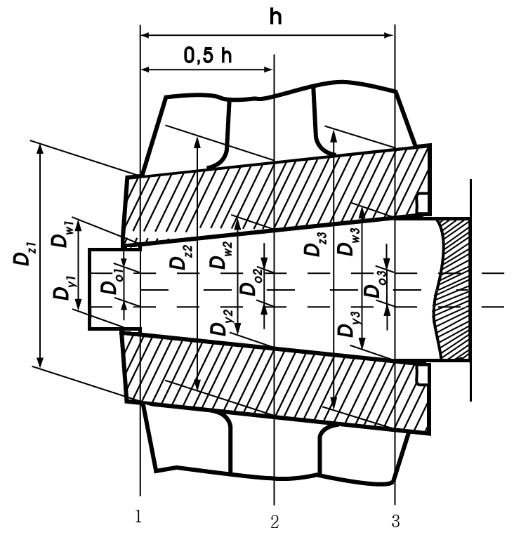
    Fig 3.11 Details of propellers and shaft couplings
    $A$ = shape factor of the boss determined by the formula
    $A= \frac{1}{y ^{2} -1} \sqrt {1+3y ^{4}}$
    The factor A may be obtained from **Table 3.42** by linear interpolation.
    $C= \Delta h _{r} z$ for assemblies with conical mating surfaces.
    $C= \Delta D _{r}$ for assemblies with cylindrical mating surfaces.
    $\Delta h _{r}$ = actual pull-up of the boss in the course of fitting at a temperature $t _{m}$, $\Delta h _{r} \geq \Delta h$ (cm)
    $\Delta D _{r}$ = actual interference fit of the assembly with cylindrical mating surfaces, $\Delta D _{r} \geq \Delta D$ (cm)
    $R _{e}$ = yield stress of the boss material, (MPa)
    Other terms are as defined in (1).

    **Table 3.42 Factor** $A$

    | $y$ | $A$ | $y$ |   | $A$ |   |
    | --- | --- | --- | --- | --- | --- |
    | 1.2 1.3 1.4 1.5 1.6 1.7 1.8 | 6.11 4.48 3.69 3.22 2.92 2.70 2.54 | 1.9 2.0 2.1 2.2 2.3 2.4 |   | 2.42 2.33 2.26 2.20 2.15 2.11 |   |

#### 403. Propellers

- **1.** **Materials of propellers**
  Copper alloys of Type CU3 and Type CU4 are not admitted for propellers in Icebreakers and Arctic7 ~ Arctic9 class ships.
- **2.** **Propellers blade thickness**
  - **(1)** Propeller blade thickness is checked in the design root section and in the blade section at the radius r = 0.6R where R is propeller radius. The location of the design root section is adopted as follows.
    In solid propellers, detachable-blade propellers and CPP, the maximum thickness $s$, in mm, of an expanded cylindrical section shall not be less than following formula.
    $s=9.8 \left[ A \sqrt {\frac{0.14kP}{zb \sigma n}} +c \frac{m}{\sigma} ( \frac{Dn}{300} ) ^{2} \right]$
    where,
    $A$ = coefficient to be determined from the nomograph in **Fig 3.12** depending on the relative radius r/R of design section and the pitch ratio H/D at this radius (for a CP-propeller, take the pitch ratio of the basic design operating condition)
    $k$ = coefficient obtained from **Table 3.43**
    $P$ = shaft power at the rated output of the main propulsion engine (kW)
    $z$ = number of blades
    $b$ = width of the expanded cylindrical section of the blade on the design radius (m)
    $\sigma =0.6R _{mbl} +175 MPa$, but not more than 570 MPa for steels and not more than 610 MPa for copper alloys
    $R _{mbl}$ = tensile strength of blade material (MPa)
    $n$ = speed at the rated output (rpm)
    $c$ = coefficient of centrifugal stresses to be determined from **Table 3.44**
    $m$ = blade rake (mm)
    $D$ = propeller diameter (m)

    **Table 3.43** **Coefficient** $k$

    | Arctic class |   |   |   |   | Icebreakers |   |
    | --- | --- | --- | --- | --- | --- | --- |
    | Arctic4 | Arctic5 | Arctic6 | Arctic7 | Arctic8, Arctic9 | Centre propeller | Side propeller |
    | 11.2 | 12.5 | 13.2 | 14 | (1) | 16 | $16+ \frac{23500}{P ^{(2)}}$ |
    | Notes 1. If reciprocating engines with less than four cylinders are installed in the ship, $k$ shall be increased by 7 per cent. 2. For reciprocating engines fitted with hydraulic or electromagnetic couplings, $k$ may be reduced by 5 per cent. 3. (1) through (2) in this table are subject to the following (1) Subject to special consideration by the Society in each case. (2) ${} ^{} P$ = shaft power, kW. |   |   |   |   |   |   |

    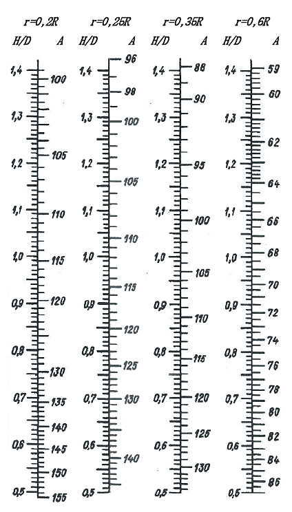
    Fig 3.12 Factor #eqnID-2655

    **Table 3.44** **Coefficient** $c$

    | *r* / R | *c* |
    | --- | --- |
    | 0.20 0.25 0.35 0.60 | 0.50 0.45 0.30 0 |

    | Arctic class |   |   |   | Icebreakers |
    | --- | --- | --- | --- | --- |
    | Arctic4, Arctic5 | Arctic6 | Arctic7 | Arctic8, Arctic9 | Icebreakers |
    | $0.005D ^{}$ | $0.0055D ^{}$ | $0.006D ^{}$ | (2) | $0.008D ^{}$ |
    | Note: (1) $D$ = diameter of the propeller (2) Subject to special consideration by the Society in each case. |   |   |   |   |
    - **(A)** Solid propellers - At the radius 0.2R where the propeller boss radius is smaller than 0.2R, and at the radius 0.25R where the propeller boss radius is greater than or equal to 0.2R.
    - **(B)** Detachable blade propellers - At the radius 0.3R, the values of the factors $A$ and $c$ being adopted as in the case of r = 0.25R.
    - **(C)** CPP - At the radius 0.35R.
  - **(2)** The blade tip thickness at the radius D/2 shall not be less than provided in **Table 3.45**. The leading and trailing blade edge thickness measured at 0.05 of the blade width from the edges
    shall not be less than 50 per cent of blade tip thickness.
  - **(3)** The blade thickness calculated in accordance with (1) and (2) may be reduced (e.g. for blades of particular shape), provided a detailed strength calculation is submitted for consideration to the Society.
  - **(4)** In Icebreakers and Arctic class ships, the stresses in the most loaded parts of pitch control gear shall not exceed yield stress of the material, if the blade is broken in direction of the weakest section by a force applied along the blade axis over 2/3 of its length from the boss and laterally over 2/3 from the blade spindle axis to the leading edge.
- **3.** **Propeller boss and blade fastening parts**
  - **(1)** Fillet radii of the transition from the root of a blade to the boss shall not be less than 0.04D on the suction side of the blade and shall not be less than 0.03D on the pressure side. If the blade has no rake, the fillet radius on both sides shall be at least 0.03D. Smooth transition from the blade to the boss using a variable radius may be permitted.
  - **(2)** The propeller boss shall be provided with holes through which the empty spaces between the boss and shaft cone are filled with non-corrosive mass; the latter shall also fill the space inside the propeller cap.
  - **(3)** The diameter of the bolts (studs), by which the blades are secured to the propeller boss or the internal diameter of the thread of such bolts (studs), whichever is less, shall not be less than that determined by the following formula.
    $D _{b} =ks \sqrt {\frac{bR _{m bl}}{dR _{m b}}}$
    where,
    k = 0.33, in case of three bolts in blade flange, at thrust surface
- **0.** 30, in case of four bolts in blade flange, at thrust surface
- **0.** 28, in case of five bolts in blade flange, at thrust surface
  s = the maximum actual thickness of the blade at design root section (refer to **2.** (1)) (mm)
  b = width of expanded cylindrical section of the blade at the design root section (m)
  $R _{m bl}$ = tensile strength of blade material (MPa)
  $R _{m b}$ = tensile strength of bolt/stud material (MPa)
  d = diameter of bolt pitch circle; with other arrangement of bolts, $d = 0.85l$ where $l$ = the distance between the most distant bolts (m)
  - **(4)** The securing devices of the bolts(studs), by which the blades are fastened to the detachable-blade propellers of Arctic class ships, shall be recessed in the blade flange.
- **4.** **Controllable pitch propellers**
  - **(1)** The pitch control unit shall be designed so as to enable turning the blades into ahead speed position, shall the hydraulic power system fail. In multi-screw ships with Arctic class of Arctic7, this requirement need not be satisfied.
  - **(2)** In ships with a CP-propeller, in which the main engine may become overloaded due to particular service conditions, it is recommended that automatic protection against overloading be used for the main engine.
  - **(3)** The time required for the blades to be turned over from full ahead to full astern speed position with main machinery inoperative shall not exceed 20 s for CP-propellers up to 2 m in diameter including, and 30s for CP-propellers with diameters over 2 m.
  - **(4)** In the gravity lubrication systems of CP-propellers, the gravity tanks shall be installed above the deepest load waterline and be provided with level indicators and low level alarms.
  - **(5)** The sealings fitted to the cone and flange casing of the propeller shaft (if such method of connection with the propeller boss is used)shall be tested to a pressure of at least 0,2 MPa after the propeller is fitted in place. If the above sealings are under pressure of oil from the sterntube or the propeller boss, they shall be tested in conjunction with testing of the sterntubes or propeller boss.
  - **(6)** After being assembled with the blades the boss of a CP-propeller shall be tested by internal pressure equal to a head up to the working level of oil in gravity tank, or by a pressure created by the lubricating pump of the boss. In general, the test shall be made during blade adjustment.

#### 404. Power transmission system

- **1.** In the strength calculation for gear of **Pt 5, Annex 5-4 of the Guidance Relating to the Rules for the Classification of Steel Ships, t**he application factor $K _{A}$, which accounts for externally generated overloads on the gearing, is chosen from **Table 3.46** in the absence of special procedures for its determination.

  | Type of gearing | Engine | Type of coupling on input shaft | $K_A$ | $K _{st \max}$ |
  | --- | --- | --- | --- | --- |
  | Main propulsion | Electric motor | Any type | 1.0 | 1.1 |
  | Main propulsion | Turbine | Any type | 1.0 | 1.1 |
  | Main propulsion | Internal combustion engine | Hydraulic or equivalent coupling | 1.0 | 1.1 |
  | Main propulsion | Internal combustion engine | High elastic (flexible) coupling | 1.3 | 1.4 |
  | Main propulsion | Internal combustion engine | Other types | 1.5 | 1.6 |
  | Auxiliary | Electric motor | Any type | 1.0 | 1.1 |
  | Auxiliary | Turbine | Any type | 1.0 | 1.1 |
  | Auxiliary | Internal combustion engine | Hydraulic or equivalent coupling | 1.0 | 1.1 |
  | Auxiliary | Internal combustion engine | High elastic (flexible) coupling | 1.2 | 1.3 |
  | Auxiliary | Internal combustion engine | Other types | 1.4 | 1.5 |

  For ships strengthened for ice navigation, the factor $K _{A}$ for main gearing is determined as a product of $K _{A} \cdot K ' _{A}$ where $K ' _{A}$ is obtained from **Table 3.47**.
- **2.** For Arctic class ships, the torque of the shafts, pinions, wheels of main gearing, shall be calculated by formula below.
  $T=K ' _{A} T _{1}$
  Where,
  $K ' _{A}$ = refer to **Table 3.47**
  $T _{1}$ = torque of pinion at the maximum longacting load (Nㆍm)

  | Factor | Ship class |   |   |   |   |
  | --- | --- | --- | --- | --- | --- |
  | Factor | Arctic4 | Arctic5 | Arctic6 | Arctic7 ~ Arctic9, Icebreaker3, Icebreaker4 | Icebreaker5, Icebreaker6 |
  | $K ' _{\Lambda }$ | 1.25 | 1.5 | 1.75 | 2.0 | 2.5 |
- **3.** The elastic and disengaging couplings intended for Arctic class ships shall satisfy the requirements of **Par 2.**

#### 405. Steering gear

Main steering gear of Icebreakers and Arctic class ships shall be provided with a device to prevent the ice overload of turning mechanism.

#### 406. Torsional vibration

- **1.** **Torsional vibration calculations**
  Torsional vibration calculations shall be prepared both for the basic variant and for other variants and conditions possible in the operation of the installation, as follows.
  - **(1)** Maximum power take-off and idling speed (with the propeller blades at zero position)for installations comprising CP-propellers or vertical axis propellers.
  - **(2)** Individual and simultaneous operation of main engines with a common reduction gear.
  - **(3)** Reverse gear.
  - **(4)** Connection of additional power consumers if their moments of inertia are commensurate with the inertia moments of the working cylinder.
  - **(5)** Running with one cylinder missfiring, for installations containing flexible couplings and reduction gear; to be assumed not firing is the cylinder the disconnection of which accounts to the greatest degree for the increase of stresses and alternating torques.
  - **(6)** Damper jammed or removed where single main engine installations are concerned.
  - **(7)** Flexible coupling blocked due to breakage of its elastic components (where single main engine installations are concerned).
- **2.** **Permissible stresses for crankshafts**
  - **(1)** total stresses due to torsional vibration under conditions of continuous running shall not exceed the values determined by the following formulas.
    For main engine crankshafts of Icebreakers and of Arctic class ships within the speed range (0.7 ~ 1.05)$n _{r}$, and the crankshafts of engines driving generators and other auxiliary machinery for essential services within the speed range (0.9 ~ 1.05)$n _{r}$,When calculating a crankshaft in accordance with **Pt 5, Annex 5-3 of Guidance Relating to the Rules for the Classification of Steel Ships,**
    $\tau _{C} =± \tau _{N}$ ------------------------------------------ (1)
    When calculating a crankshaft by another method,
    $\tau _{C} =±0.76 \frac{R _{m} +160}{18} C _{d}$ -------------------------- (2)
    For main engine crankshafts of Icebreakers and of Arctic class ships within the speed range lower than 0.7$n _{r}$, and the crankshafts of engines driving generators and other auxiliary machinery for essential services within the speed range lower than 0.9$n _{r}$,
    $\tau _{C} =± \frac{\tau _{N} \left[ 3-2(n/n _{r} ) ^{2} \right]}{1.38}$ -------------------------- (3)
    Or,
    $\tau _{C} =±0.55 \frac{R _{m} +160}{18} C _{d} \left[ 3-2(n/n _{r} ) ^{2} \right]$ --------------- (4)
    where,
    $\tau _{C}$ = permissible stresses (MPa)
    $\tau _{N}$ = the maximum alternating torsional stress determined during crankshaft calculation from **Pt 5, Annex 5-3, Par 2,** (2) **of Guidance Relating to the Rules for the Classification of Steel Ships.**
    $R _{m}$ = tensile strength of shaft material (MPa). When using materials with the tensile strength above 800 MPa, $R _{m}$= 800 MPa shall be adopted for calculation purposes.
    $n$ = speed under consideration (rpm). For tugs, trawlers and other ships which main engines run continuously under conditions of maximum torque at speeds below the rated speed throughout the speed range, $n=n _{r}$ shall be adopted and formulas (1) and (2) shall be used. For the main diesel generators of ships with electric propulsion plants, all the specified values of $n _{r}$ shall, by turn, be adopted as $n$, and in each of the ranges (0.9 ~ 1.05)$n _{r}$, formulas (3) and (4) shall be used for partial loads.
    $n _{r}$ = rated speed (rpm)
    $C _{d} = 0.35+0.93d ^{-0.2}$ : scale factor.
    where,
    $d$ = shaft diameter (mm)
  - **(2)** The total stresses due to torsional vibration within speed ranges prohibited for continuous running, but which may only be rapidly passed through shall not exceed the values determined by the following formulas.
    For the crankshafts of main engines,
    $\tau _{T} =2 \tau _{C}$
    For the crankshafts of engines driving generators or other auxiliary machinery for essential services,
    $\tau _{T} =5 \tau _{C}$ ----------------------------------------- (5)
    where,
    $\tau _{T}$ = permissible stresses for speed ranges to be rapidly passed through (MPa)
    $\tau _{C}$ = permissible stresses determined by one of formulas (1) to (4) of (1).
- **3.** **Permissible stresses for intermediate, thrust, propeller shafts and generator shafts**
  - **(1)** Under conditions of continuous running, the total stresses due to torsional vibration shall not exceed the values determined by the following formulas.
    For the shafts of Icebreakers and of Arctic class ships within the speed range (0.7 ~ 1.05)$n _{r}$, and generator shafts within the speed range (0.9 ~ 1.05)$n _{r}$.
    $\tau _{C} =±1.38 \frac{R _{m} +160}{18} C _{k} C _{d}$
    For the shafts of Icebreakers and of Arctic class ships within the speed range lower than 0.7$n _{r}$, and generator shafts within the speed range lower than 0.9$n _{r}$,
    $\tau _{C} =± \frac{R _{m} +160}{18} C _{k} C _{d} \left[ 3-2(n/n _{r} ) ^{2} \right]$
    where,
    $R _{m}$ = tensile strength of the shaft material (MPa). When using the material with the tensile strength over 800 MPa (for intermediate and thrust shafts of alloyed steel) and over 600 MPa (for intermediate and thrust shafts of carbon and carbon-manganese steel, as well as for propeller shaft) $R _{m}$ = 800 MPa and $R _{m}$ = 600 MPa shall be assumed in the calculations accordingly.
    $C _{k}$ = factor obtained from **Pt 5, Ch 4, Table 5.4.1 of Rules for the Classification of Steel Ships.**
    $C _{d}$ = refer to **Par** 2**.** (1)
  - **(2)** The total stresses due to torsional vibration within speed ranges prohibited for continuous running, but which may only be rapidly passed through shall not exceed.
    For intermediate, thrust, propeller shafts and shafts of generators driven by the main engine
    $\tau _{T} = \frac{1.7 \tau _{C}}{\sqrt {C _{k}}}$
    For the shafts of generators driven by auxiliary engines, refer to formula (5) of **Par 2,** (2).
- **4.** **Permissible torque in reduction gear**
  - **(1)** For the case of continuous running or rapid passage, the alternating torques in any reduction gear step shall not exceed the permissible values established for the operating conditions by the manufacturer.
  - **(2)** Where the values mentioned under (1) are not available, the alternating torque in any reduction gear step for the case of continuous running shall satisfy the following conditions.
    Within the speed range (0.7 ~ 1.05)$n _{r}$ for the main propulsion plants of Icebreakers and of Arctic class ships,
    $M _{alt} \leq 0.3M _{nom}$
    Within speed ranges lower than 0.7$n _{r}$, the permissible value of alternating torque will be specially considered by the Society in each case, but, in any case.
    $M _{alt} \leq 1.3M _{nom} -M$
    where,
    $M _{nom}$ = average torque in the step under consideration at nominal speed (Nㆍm)
    $M$ = average torque at the speed under consideration (Nㆍm)
    For the case of rapid passage, the alternating torque value is subject to special consideration by
    the Society in each case.
- **5.** **Permissible torque and temperature of flexible couplings**
  - **(1)** For the case of continuous running or rapid passage, the alternating torque in a coupling, relevant stresses in and temperatures of the flexible component material due to torsional vibration shall not exceed the permissible values established for the operating conditions by the manufacturer.
  - **(2)** Where the values mentioned under (1) are not available, the torque, stress and temperature values permissible for continuous running and rapid passage shall be determined by the procedures approved by the Society.
- **6.** **Other installation components**
  - **(1)** Under conditions of continuous running, the total torque (average torque plus alternating torque)shall not exceed the frictional torque in the keyless fitting of the propeller and shaft or shafting couplings.
  - **(2)** Where, for generator rotors, the Manufacturer's permissible values are not available, the alternating torque shall not exceed twice, in the case of continuous running, or six times, in the case of rapid passage, the nominal generator torque.
- **7.** **Torsional vibration measurement**
  - **(1)** Data obtained from torsional vibration calculations for machinery installations with the main engines shall be confirmed by measurements. The measurements shall cover all the variants and operation conditions of the installation, for which calculations were made in accordance with **Par 1**, except emergency operation conditions listed in (6) and (7).
  - **(2)** The results of measurement obtained on the first ship (unit)of a series apply to all the ships (units) of that series, provided their engine-shafting-propeller(driven machinery) systems are identical.
  - **(3)** The free resonance vibration frequencies obtained as a result of measurement shall not differ from the design values by more than 5 per cent. Otherwise, the calculation shall be corrected accordingly.
- **8.** **Restricted speed ranges**
  - **(1)** Where the shaft stresses, torques in some installation components or temperature of the rubber components of flexible couplings arising due to torsional vibration exceed the relevant permissible values for continuous running determined, restricted speed ranges are assigned.
  - **(2)** No restricted speed ranges are permitted for the speeds equal to or greater than 0.7$n _{r}$ with respect to Icebreakers and of Arctic class ships, and for (0.9~1.05)$n _{r}$ with respect to diesel generators and other auxiliary diesel machinery for essential services. Where the main diesel generators of ships with electric propulsion plants are concerned, all the fixed speed values corresponding to the specified conditions of partial loading shall alternately be adopted for $n _{r}$.
    In icebreakers and ships with ice categories Arctic7 to Arctic9 fitted with a FPP, blade frequency resonance shall be avoided within the range (0.5~0.8)$n _{r}$.
  - **(3)** For Icebreakers and of Arctic class ships within the main engine speed range (0.7~1.05)$n _{r}$, and for diesel generators within the speed range (0.9~1.05)$n _{r}$ vibration dampers or antivibrators may be used to eliminate restricted speed ranges subject to special consideration by the Society in each case.

#### 407. Spare parts

Two spare propeller blades per one propeller completed with securing items for detachable propeller and controllable pitch propeller are to be provided that are necessary for the case of eventual replacement by the crew when afloat.

#### 408. Seachests and ice boxes

- **1.** Number and arrangement of seachests for the cooling water system shall comply with **Pt 5, Ch 6, 703.** of **Rules for the Classificaion of Steel Ships.** In Arctic4 and Arctic5 class ships, one of the sea chests shall function as an ice box. In Icebreakers and Arctic6 ~ Arctic9 class ships, at least two sea chests shall be ice boxes. In Icebreakers and Arctic class ships, the ice box design shall allow for an effective separation of ice and removal of air from the ice box to ensure reliable operation of the seawater system. Sea inlet valves shall be secured directly to seachests or ice boxes.
- **2.** In Icebreakers and Arctic class ships, provision shall be made for the heating of the seachests and ice boxes as well as of the ship side valves and fittings above the load waterline. For this purpose cooling water recirculation shall be used for ice boxes and sea chests. Ship side valves and fittings shall be supplied with heating medium through a non-return shut-off valve. The heating arrangements shall be so designed as to prevent the side valves and fittings and shell plating from being damaged under the influence of lowest temperatures. Electric heating systems with special heating cables may be used for valves heating. For ice boxes the recirculated water pipes shall be laid to the upper and lower part of the box, and the total sectional area of these pipes shall not be less than the area of the cooling water discharge pipe. For seachests, the diameter of the water recirculating pipe shall not be less than 0.85 of the discharge pipe diameter.

#### 409. Flexible hoses

Sleeves for cargo and fuel oil hoses of Arctic class ships shall be subjected to cold endurance type tests. For this purpose samples of the hoses shall be kept at the temperature of -40 °C during 4 hour and be tested for elasticity by means of bending for 180° two times in the opposite directions around the adapter with a diameter of R, where R is a minimum bending radius; whereupon a visual exam­ination is carried out. After freezing and bending no cracks shall appear on the internal and external surfaces of the sample. Where necessary, the sample may be cut along the axis for the internal surface inspection. On agreement with the Society, another method for freeze resistance test with allowance made for special structural features may be accepted.

#### 410. Ballast, heel and trim systems

In Icebreakers and Arctic class ships, the fore and after peaks, as well as structural wing tanks for water ballast, located above the waterline and in way of cargo holds, shall be provided with heating arrangements. The double bottom tanks in way of cargo holds, intended for water ballast, are recommended to be fitted with heating coils.

#### 411. Ventilation system

In Icebreakers and Arctic class ships, precautions shall be taken to prevent admission of snow into the ventilation ducts. It is recommended to arrange the air intakes on both sides of the ship and to provide for heating arrangements.

#### 412. Compressed air system

For Icebreakers and Arctic6 ~ Arctic9 class ships the total capacity of air receivers and the number of compressors for starting and reversing of the main engines is subject to special consideration by the Society in each case.

### Section 5 Subdivision and Stability

#### 501. General

- **1.** The ships that are subject to this chapter are to be accordance with the requirements of relevant international conventions in addition to the requirements of this section.

#### 502. Documentation

- **1.** Documentation for approval
  - preliminary damage stability calculations
  - final damage stability calculations
  (not required in case of approved limit curves, or if approved lightweight data are not less favourable than estimated lightweight data).
- **2.** Documentation for information
  - internal watertight integrity plan.
- **3.** Other plans and documents deemed necessary by the Society

#### 503. Intact stability

- **1.** Under all loading conditions to be encountered in service and which are in agreement with the purpose of the ship, the intact stability shall be sufficient for satisfying damage stability requirements.
- **2.** The requirements of intact stability are to be in accordance with **Ch 2, 104. 1** (1)

#### 504. Arctic class ships

- **1.** For the purpose of damage stability calculations, the following extent of ice damage shall be assumed
  - **(4)** location of ice damage from the keel to the level of 1.2$d _{ice}$ and within $L _{ice}$
  - **(5)** the vertical extent of damage may be assumed from the keel to the level of 1.2$d _{ice}$
- **2.** When performing damage stability calculations, the number of floodable compartments shall be determined proceeding from the location of the assumed ice damage in **Table 3.48**.
- **3.** Arctic class ships are subject to **SOLAS regulation II-1/Part B-1** ~ **Part B-4** shall be such that the factor $s _{i}$, as defined in **SOLAS regulation II-1/7.2**, equals 1 for all loading conditions in case of ice damage specified in **Par 1**, in positions as defined in **Par 2**.
- **4.** Arctic class ships not subject to **Par 3** above shall be in accordance with the damage stability requirements of international conventions developed by IMO Instruments.

  | ItemNo. | Arctic class | Location of ice damage mentioned in **504. 1** |
  | --- | --- | --- |
  | 1 | Arctic4 ~ Arctic9 | Anywhere in the ice damage area |
  | 2 | Ice strengthened salvage ships with Arctic5 ~ Arctic9 class | Anywhere in the ice damage area |
  | 3 | Ice strengthened ships with Arctic5 and Arctic6 class not mentioned in item 2 | Between watertight bulkheads, platforms, decks and plating^1. With the hull length $L _{f} \prec 100m$ it is permitted not to comply with the requirements for damage trim and stability where engine room located aft is flooded in case of ice damage. |
  | 4 | Ice strengthened ships with Arctic4 class not mentioned in item 2 | Between watertight bulkheads, platforms, decks and plating^1. With the hull length $L _{f} \prec 125m$ it is permitted not to comply with the requirements for damage trim and stability where engine room located aft is flooded in case of ice damage. |
  | Note ^1 : Where the distance between two consecutive watertight structures is less than the extent of damage, relative adjacent compartments shall be considered a single floodable compartment when checking damage stability. |   |   |

#### 505. Icebreakers

- **1.** For the purpose of damage stability calculations, the extent of ice damage shall be determined in accordance with **504. 1**.
- **2.** Damage as defined **Par 1** shall be assumed at any position along the side shell in the ice damage area.
- **3.** Icebreakers that are subject to **SOLAS regulation II-1/Part B-1** ~ **Part B-4** shall be such that the factor $s _{i}$, as defined in **SOLAS regulation II-1/7.2**, equals 1 for all loading conditions in case of ice damage specified in **Par 1**, in positions as defined in **Par 2**.
- **4.** In case of the Icebreakers with freeboard length 50m and upwards that are not subject to **Par 3**, shall be in accordance with the damage stability requirement of **Par 6** considering damage as defined in **Par 5** and the number of floodable compartment shall be one. However, Icebreaker3 or Icebreaker4 which perform icebreaking operations periodically shall be in accordance with the requirements in **Par 6** at damage extent and its position as defined in **Par 1** and **2** and the damage extent defined in **Par 5** is not considered **Par 5**.
- **5.** **Extent of damage**
  The following extent of side damage shall be assumed when making damage stability calculations.
  - **(1)** longitudinal extent : $\frac{1}{3} L _{f} ^{2/3}$ or 14.5m(whichever is less)
  - **(2)** transverse extent measured inboard of ship side at right angles to the centerline at the level of the deepest subdivision load line : 1/5 of the ship breadth *B* or 11.5m(whichever is less)
  - **(3)** vertical extent : from the base line upwards without limit
- **6.** **Requirements for damage stability**
  - **(1)** In the final stage of flooding, the initial metacentric height of a ship in the upright condition determined, shall not be less than 0.05m. For non-passenger ships, a positive metacentric height below 0.05m may be permitted for the upright condition in the final stage of flooding on the Society approval.
  - **(2)** For unsymmetric flooding the angle of heel shall not exceed 20˚ before equalization measures and cross-flooding fitting being used, 12˚ after equalization measures and cross-flooding fittings being used.
  - **(3)** The static stability curve of a damaged ships shall have a sufficient positive lever arm section. In the final stage of flooding and after the equalization of the ship, a length of positive lever arm curve, flooding angle considered, shall be ensured not less than 20˚.
  - **(4)** The angle of submersion of the opening which are not equipped with watertight or weathertight covers through which water may spread to intact compartments may be taken as flooding angle.
  - **(5)** The maximum lever arm shall be at least 0.1m within this length, i.e. within the heel angel equal to the static one plus 20˚. The positive lever arm section within the said extant shall not be less than 0.0175m·rad.
  - **(6)** In the intermediate stages of flooding, the maximum lever arm of the static stability curve shall be at least 0.05m, and the length of its positive section shall not be less than 7˚.
  - **(7)** The damage waterline shall be at least 0.3m or $0.1+(L _{f} -10)/150 m$(whichever is less) below the opening in the bulkheads, decks and sides through which progressive flooding could take place. Such opening include the outlets of air and vent pipes and those which are closed by means of weathertight doors and covers. These do not necessarily include :

#### 506. Requirements to watertight integrity

- **1.** As far as practicable, tunnels, ducts or pipes which may cause progressive flooding in case of damage, are to be avoided in the damage penetration zone.
- **2.** The scantlings of tunnels, ducts, pipes, doors, staircases, bulkheads and decks, forming watertight boundaries, are to be adequate to withstand pressure heights corresponding to the deepest equilibrium waterline in damaged condition.
- **3.** Excluding cases that comply with **Par 4**, no Arctic class ships and Icebreakers should carry any pollutant directly against the outer shell. Any pollutant should be separated from the outer shell of the ship by double skin construction of at least 760 mm in width.
- **4.** All Arctic class ships and Icebreakers should have double bottoms over the breadth and the length between forepeak and after peak bulkheads. Double bottom height should be in accordance with the rules of the Classification Societies in force. Double bottoms should not be used for the carriage of pollutants except where a double skin construction complying with **Par 3** is provided, or where working liquids, are carried in way of main machinery spaces in tanks not exceeding 20 m^3 individual volume.
- **5.** All Arctic class ships and Icebreakers with icebreaking bow forms and short forepeaks may dispense with double bottoms up to the forepeak bulkhead in the area of the inclined stem, provided that the watertight compartments between the forepeak bulkhead and the bulkhead at the junction between the stem and the keel are not used to carry pollutants. 
