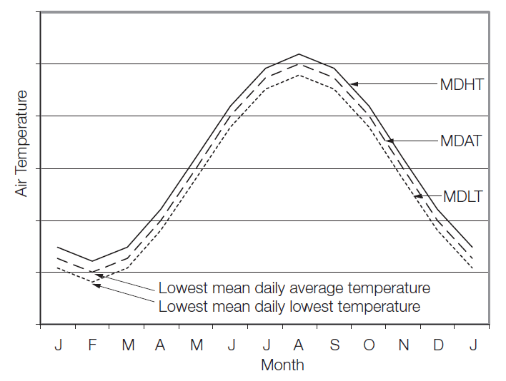
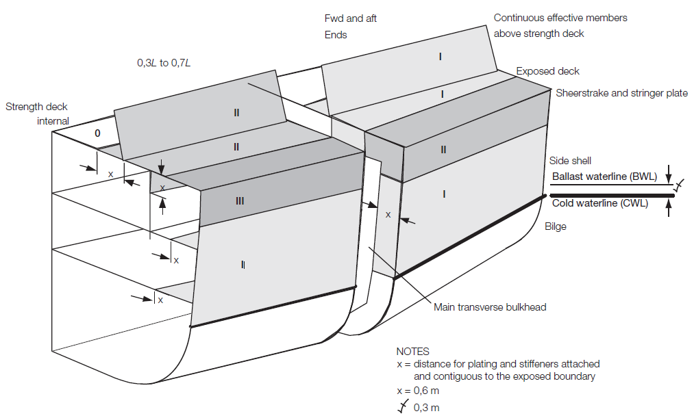
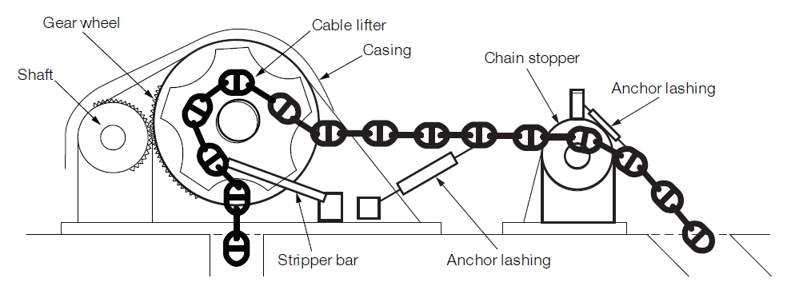

# Guidance for Ship for Navigation in Ice

> OTHER RULES AND GUIDANCE / GC-14-E / 2025 / EN / Guidance

## CHAPTER 4 Winterization

### Section 1 General

#### 101. Scope

The requirements of this chapter apply to ships intended to navigate in cold climates and may be exposed to low temperatures that may cause equipment to freeze due to ice accretion from atmospheric icing or sea spray, or due to freezing of liquid within a system. Protection measures are to be provided and operational procedures are to be specified to ensure that equipment is suitably protected to enable operation in low temperatures.

#### 102. Application

- **1.** Compliance with this chapter is optional and the requirements are additional to those subject to **the Rules for the Classification of Steel Ships**.
- **2.** Where a class notation of **Ch 1** or **Ch 2** or **Ch 3** is to be assigned in addition to Winterization notation, the requirement of **Ch 1** or **Ch 2** or **Ch 3** are to be applied additionally.
- **3.** It is the responsibility of the Owner to determine design air temperatures, are most suitable for a particular ship's operational requirements.
- **4.** Application of this Chapter is to be based on the lowest external design air temperature, refer to **104.** This temperature does not apply to continuous operation, but is based on a distribution of operational time around an average temperature, assumed to be -10°C for normal worldwide operation. Therefore, the duration of time for ship operations at temperatures below the average temperature will decrease to a minimum at the lowest temperature, and thus the operating time at the lowest temperature is assumed to be minimal
- **5.** Ships complying with the requirements of this Chapter may be eligible for one or more of the following notations. Where applicable, these winterization notations are specified in below (1), (2) may be assigned one or a combination of them, e.g. Winterization E2(-35) S(A). *(2017)*
  - **(1)** Winterization H(t) : Where materials for hull construction are in compliance with **Sec. 2** in association with an external design air temperature of t degrees Celsius.
  - **(2)** Winterization M(t) : Where materials for hull equipments and system are in compliance with **Sec. 3** in association with an external design air temperature of t degrees Celsius.
  - **(3)** Winterization E1(t), Winterization E2(t) or Winterization E3(t) : Where equipment and systems are in compliance with **Sec. 4 ~ 6** in association with an external design air temperature of T degrees Celsius.
  - **(4)** Winterization S(A), Winterization S(B) or Winterization S(C) : Where stability are in compliance with **Sec. 7** in association with the specified ice accretion values.
  - **(5)** Winterization D(t) : Where alternative designs, compliance with **Sec. 8** in association with an external design air temperature of T degrees Celsius are applied.
  - **(6)** Winterization IR : Where ice removals are compliance with **Sec. 9.**
- **6.** Information for selection of a suitable winterization level is given in **Table 4.1**. This is based on the intended operational scenarios for Winterization E1(t), Winterization E2(t) and Winterization E3(t) levels and in association with the average and lowest external design air temperatures.
- **7.** For the assignment of Winterization E1(t), it is in subject to the requirements of this Chapter and where applicable, to be in accordance with the **IMO Guidelines for Ships Operating in Arctictic Ice-Covered Waters : MSC/Circ. 1056 MEPC/Circ. 399.**

  | Winterization level | Description | External design air temperature (°C) | operational scenario |
  | --- | --- | --- | --- |
  | Winterization E3(t) | Mild | Down to -30°C | Short transits in low temperatures - for example, ships loading or discharging in low temperatures then sailing to discharge or load in warmer regions |
  | Winterization E2(t) | Moderate | -31°C to -45°C | Seasonal operation in cold temperatures - for example, ships operating continuously in low temperatures during the winter months |
  | Winterization E1(t) | Severe | -46°C and below | Prolonged operation in extreme low temperatures - for example, ships operating year round in the Arctic or Antarctic |

#### 103. Information required (2017)

- **1.** For Winterisation H(t), details of material grades are to be included on the hull structure plans required for submission.
- **2.** For Winterization levels E1(t), E2(t) and E3(t) a Winterization Manual is to be submitted. The Winterization Manual is to contain the following detailed information in order to demonstrate that the design and installation of winterization features of the ship complies with **Sec. 4 ~ Sec. 6**.
  - **(1)** General arrangement highlighting winterization features and design temperatures.
  - **(2)** List of winterization equipment and systems.
  - **(3)** Details of tank heating, see **410**.
  - **(4)** Details of heating arrangements for spaces, see **408.**
  - **(5)** Inventory and locations of ice removal measures, see **411**.
  - **(6)** Details of accommodation and escape route arrangements, see **409**.
  - **(7)** Details of anchoring/mooring and deck crane arrangements, see **405**.
  - **(8)** Details of main/auxiliary engines arrangements, see **402** and **403**.
  - **(9)** Details of materials specification/heating arrangements for exposed pipework/components, see **404**.
  - **(10)** Details of materials specification/heating arrangements for exposed electrical cables/components, see **406**.
  - **(11)** Details of winterization of emergency appliances, see **407**.
  - **(12)** Details of operational and maintenance procedures e.g.
    • Continuous circulation of fluids and/or heating media.
    • Use of heating arrangements in sub-zero temperatures.
    • Application of silicone spray or other suitable low temperature films to door/hatch seals.
    • Application of low temperature lubricants.
    • Use of antifreeze in liquid filled pressure/vacuum breakers in inert gas lines on tankers.
    • Use of antifreeze in emergency generators and lifeboat /rescue boat engines.
    • Use of oil fuel for emergency generators and lifeboat /rescue boat engines that is suitable for
    low temperature conditions.
    • Use of low temperature grease for lifeboat/rescue boat davits/sheaves/release hooks and for
    radar motors.
    • Use of suitable antifreeze solutions for bridge window cleaning.
    • Steam heating coil condensate evacuation (draining) if and when heating coils are redundant.
- **3.** For Winterization S(A), S(B) and S(C), details of the trim and stability conditions, and calculations, are to be submitted in order to demonstrate that the design of the ship complies with **Sec.7**.
- **4.** Where an alternative design is used for Winterization D(t), as described in **Sec.8**, the Winterization Manual is to be submitted based on an agreed specification list confirmed by the Builder Shipbuilder and Owner with reference to the intended operation, ship type and arrangement.
- **5.** Details of the average design external air temperature, lowest design external temperature and design internal air temperature/ambient conditions for spaces within the ship are to be agreed with the Owner and Builder and submitted Shipbuilder. These details are to include machinery spaces, habitable spaces, those commonly accessed and any other spaces where the temperature will differ. Temperatures are to be rounded down to the nearest integer, e.g. -21.5°C is to be -22°C.
- **6.** A copy of the Winterization Manual is to be placed on board the ship.

#### 104. Definitions (2017)

- **1.** **Mean Daily Low Temperature**
  The MDLT($T_y$**)** is to be taken as the lowest mean daily average low air temperature in the area of operation. For seasonally restricted service the lowest value within the period of operation applies.
  Where
  Mean = statistical mean over a minimum of 10 years
  Average = average during one day and one night
  Lowest = lowest during the year or season
  MDHT = Mean Daily High Temperature
  MDAT = Mean Daily Average Temperature
  MDLT = Mean Daily Low Temperature
  
  Fig 4.1 Average external design air temperature
- **2.** **External design air temperature**
  The external design air temperature ($t$) is to be taken as the lowest mean daily low air temperature in the area of operation for the season of operation ($T_y$) minus 10 degrees Celsius ($t = T_y - 10$). For example: $T_y$ = -20℃, $t$ = -30℃. Where a Polar Service Temperature is defined for compliance with the IMO Polar Code, the external design air temperature ($t$) used in this chapter is to be taken as the Polar Service Temperature. Where reliable environmental records for contemplated operational areas exist, the lowest external design air temperature may be obtained after the exclusions of all recorded values having a probability of occurrence of less than 3 per cent.
- **3.** **Design internal air temperature / ambient conditions**
  The design parameters for the heating systems for accommodation and heated spaces(to be defined for each individual space). See **103. 5**.
- **4.** **Covers**
  Materials and arrangements used to protect items or equipment. These may be fixed type, such as mild steel, or removable, such as PVC coated nylon or other water-resistant material and are to completely cover the item of equipment without impairing its function.
- **5.** **Heating arrangements**
  Equipment and systems used to provide heat by means of electrical, steam, oil or other means
- **6.** **Ice removal measures**
  Ship services or tools used to facilitate the removal of ice by means of steam, hot water or hot air, manual tools, de-icing compounds or other means.
- **7.** **Protected locations**
  Location behind walls, screens, bulkheads and equipment, located inboard and recessed, onboard the ship and providing protection from icing.

### Section 2 Winterization H - Materials for hull construction at low temperatures (2017)

#### 201. Hull construction materials

- **1.** The requirements in this section are to provide steel grades with suitable notch toughness based on the thickness of the material and the location of the material.
- **2.** The hull construction materials of exposed members identified in **Table 4.2** and **Fig. 4.2** are to comply with **Table 4.3.**
- **3.** Where the material class in **Pt 3, Ch 1** **of the Rules** is higher than in **Table 4.2** and **Fig. 4.2,** the higher material class is to be applied.
- **4.** In addition to the requirements of **Table 4.2** and **Fig. 4.2**, miscellaneous attachments are to comply with **Table 4.4**.
- **5.** Welding consumables are to comply with the requirements of **Pt 2, Ch 2, Sec. 6** **of the Rules for the Classification of Steel Ships.**

  | Structural member category | Material class |   |
  | --- | --- | --- |
  | Structural member category | Within 0.4L amidships | Outside 0.4L amidships |
  | SECONDARY: • Deck plating exposed to weather, in general • Side plating above CWL ^5) • Transverse bulkheads above CWL ^5) | I | I |
  | PRIMARY: • Strength deck plating • Continuous longitudinal members above strength deck, excluding longitudinal hatch coamings • Longitudinal bulkhead above CWL ^5) • Top wing tank bulkhead above CWL ^5) | II | I |
  | SPECIAL: • Sheerstrake at strength deck ^1) • Stringer plate in strength deck ^1) • Deck strake at longitudinal bulkhead ^2) • Continuous longitudinal hatch coamings ^3) | III | II |
  | ^1) Not to be less than Grade E/EH within 0.4 L amidships in ships with length exceeding 250 m. ^2) In ships with breadth exceeding 70 m at least three deck strakes are to be Class III. ^3) Not to be less than Grade D/DH. ^4) Within 0.4 L amidships, single strakes which are required to be of Class III or of Grade E/EH or FH are to have breadths not less than 5L + 800, but need not be greater than 1,800 mm. ^5) The Cold Waterline (CWL) is to be taken as 0.3 m below the minimum design Ballast Waterline (BWL).(see **Fig. 4.2**) ^6) Applicable to plating attached to hull envelope plating exposed to cold air. At least one strake is to be considered in the same way as exposed plating and the strake width is to be at least 600$\mathrm{mm}$. If thermal stress calculations are performed then the extent of plate requiring consideration is to be adjusted accordingly. ^7) L is defined in **Pt 3, Ch. 1 of the Rules for the Classification of Steel Ships**. |   |   |

  **Table 4.3 Materials grade requirements at external desigh air temperature**
  Class I

  | Plate thickness (mm) | -20/-25 °C |   | -26/-35 °C |   | -36/-45 °C |   | -46/-55 °C |   |
  | --- | --- | --- | --- | --- | --- | --- | --- | --- |
  | Plate thickness (mm) | *MS* | *HT* | *MS* | *HT* | *MS* | *HT* | *MS* | *HT* |
  | $t \leq 10$ | *A* | *AH* | *B* | *AH* | *D* | *DH* | *D* | *DH* |
  | $10 *B* *AH* *D* *DH* *D* *DH* *D* *DH* |   |   |   |   |   |   |   |   |
  | \(15 *B* *AH* *D* *DH* *D* *DH* *E* *EH* |   |   |   |   |   |   |   |   |
  | \(20 *D* *DH* *D* *DH* *D* *DH* *E* *EH* |   |   |   |   |   |   |   |   |
  | \(25 *D* *DH* *D* *DH* *E* *EH* *E* *EH* |   |   |   |   |   |   |   |   |
  | \(30 *D* *DH* *D* *DH* *E* *EH* *E* *EH* |   |   |   |   |   |   |   |   |
  | \(35 *D* *DH* *E* *EH* *E* *EH* *-* *FH* |   |   |   |   |   |   |   |   |
  | \(45 *E* *EH* *E* *EH* *-* *FH* *-* *FH* |   |   |   |   |   |   |   |   |

  Class II

  | Plate thickness (mm) | -20/-25 °C |   | -26/-35 °C |   | -36/-45 °C |   | -46/-55 °C |   |
  | --- | --- | --- | --- | --- | --- | --- | --- | --- |
  | Plate thickness (mm) | *MS* | *HT* | *MS* | *HT* | *MS* | *HT* | *MS* | *HT* |
  | \(t \leq 10$ | *B* | *AH* | *D* | *DH* | *D* | *DH* | *E* | *EH* |
  | $10 *D* *DH* *D* *DH* *E* *EH* *E* *EH* |   |   |   |   |   |   |   |   |
  | \(20 *D* *DH* *E* *EH* *E* *EH* *-* *FH* |   |   |   |   |   |   |   |   |
  | \(30 *E* *EH* *E* *EH* *-* *FH* *-* *FH* |   |   |   |   |   |   |   |   |
  | \(40 *E* *EH* *-* *FH* *-* *FH* *-* *-* |   |   |   |   |   |   |   |   |
  | \(45 *E* *EH* *-* *FH* *-* *FH* *-* *-* |   |   |   |   |   |   |   |   |

  Class III

  | Plate thickness (mm) | -20/-25 °C |   | -26/-35 °C |   | -36/-45 °C |   | -46/-55 °C |   |
  | --- | --- | --- | --- | --- | --- | --- | --- | --- |
  | Plate thickness (mm) | *MS* | *HT* | *MS* | *HT* | *MS* | *HT* | *MS* | *HT* |
  | \(t \leq 10$ | *D* | *DH* | *D* | *DH* | *E* | *EH* | *E* | *EH* |
  | \(10 *D* *DH* *E* *EH* *E* *EH* *-* *FH* |   |   |   |   |   |   |   |   |
  | \(20 *E* *EH* *E* *EH* *-* *FH* *-* *FH* |   |   |   |   |   |   |   |   |
  | \(25 *E* *EH* *E* *EH* *-* *FH* *-* *FH* |   |   |   |   |   |   |   |   |
  | \(30 *E* *EH* *-* *FH* *-* *FH* *-* *-* |   |   |   |   |   |   |   |   |
  | \(35 *E* *EH* *-* *FH* *-* *FH* *-* *-* |   |   |   |   |   |   |   |   |
  | \(40 *-* *FH* *-* *FH* *-* *-* *-* *-* |   |   |   |   |   |   |   |   |

  
  Fig 4.2 Distribution of material classes for cold weather

  | Structural member | Reference temperature °C ^1) |   | Material class |
  | --- | --- | --- | --- |
  | Exposed structures of length greater than 0.09 L and subjected to hull girder stress | t |   | Constructed of the same material class to that of the material to which they are attached, however need not be greater than class II |
  | Hatch coamings, hatch covers, crane pedestals and windlass seats | t + 5 |   | Constructed of the same material class to that of the material to which they are attached, or class II, whichever is the greater |
  | Forecastle deck | t+ 10 |   | II |
  | External bulkheads of accommodation block | t+ 20 |   | II |
  | Forecastle side shell plating | t+ 20 |   | II |
  | Plating and stiffeners attached and contiguous to the exposed boundary plating distance 'x', see **Fig. 4.2** Distribution of material classes for cold weather ^2) | t+ 10 |   | Class I, but need not be taken greater than D or DH |
  | Other exposed structures of length less than 0.09 L, e.g. bulwarks, water-breakers, unlagged gas turbine intake structures, side screens, etc. | Need not be taken lower than -33 |   | I |
  | Stern frames, rudders, rudder horns, shaft brackets and stem (including the strake of shell plating to which the item is attached) | Fully immersed | t + 20 | II |
  | Stern frames, rudders, rudder horns, shaft brackets and stem (including the strake of shell plating to which the item is attached) | Periodically immersed or exposed | t | II |
  | ^1) For built-up stiffeners within the distance ‘x’, the web and flange are considered to be a single stiffening member and both members are to comply with the material requirements. For bulb stiffeners and stiffeners with the flange outside the distance ‘x’, the web only may be required to comply with the material requirements. |   |   |   |
- **6.** Steel plate materials for stern frames, rudders, rudder horns, shaft brackets, and stem (including the strake of shell plating to which the item is attached) and internal members attached to these items are to be in accordance with **Table 4.4.** The steel casting and forging materials for the rudders, rudder stocks, rudder horns, shaft brackets, stern frames and stem are to be in accordance with **Table 4.5.**
- **7.** The materials for cast anchors are to be in accordance with **Pt 4, Ch. 8 of the Rules for the Classification of Steel Ships**, and anchor chain cables are to be, at least, Grade 3, suitably Charpy tested and confirmed for the lowest external design air temperature.

  | Item | Condition | Reference temperature,,°C | Steel grade ^1),2),3) |   |
  | --- | --- | --- | --- | --- |
  | Item | Condition | Reference temperature,,°C | Casting | Forging |
  | Rudder horn & Shaft brackets | Fully immersed | t + 20 | Special Grade | Structural |
  | Rudder horn & Shaft brackets | Periodically immersed or exposed | t | Ferritic Grade or Ni steel | Ferritic |
  | Rudder & Rudder stock | Fully immersed | t + 20 | Normal Grade | Structural |
  | Rudder & Rudder stock | Periodically immersed or exposed | t | Ferritic Grade or Ni steel | Ferritic |
  | Stern frame | Fully immersed | t + 20 | Special Grade | Structural |
  | Stern frame | Periodically immersed or exposed | t | Ferritic Grade or Ni steel | Ferritic |
  | Stem, (including the strake of shell plating to which the item is attached) | Fully immersed | t + 20 | Normal Grade | Structural |
  | Stem, (including the strake of shell plating to which the item is attached) | Periodically immersed or exposed | t | Ferritic Grade or Ni steel | Ferritic |
  | ^1) For ferritic grade cast steel, see **Pt 2, Ch. 1 Sec. 5 of the Rules for the Classification of Steel Ships.** for low temperature service of the Rules for Materials or equivalent to achieve an average Charpy energy of 27J at external design air temperature $T_x$ –5°C. ^2) For forgings installed without welding, the Charpy testing temperature may be increased by +20°C, but is not to be taken higher than 0°C, as in **Table 4.8** Charpy testing temperature (°C) for all classes. ^3) For forgings, see **Pt 2, Ch. 1 Sec. 6 of the Rules for the Classification of Steel Ships.** |   |   |   |   |

### Section 3 Winterization M - Materials for equipment and components at low temperatures (2017)

#### 301. Scope

- **1.** The following requirements are intended for the materials of equipment and components exposed to the lowest external design air temperature.
- **2.** The suitability may be demonstrated by one or a combination of a number of ways, including, but not limited to, the following:

#### 302. Documentation

- **1.** Documentation is to be submitted that demonstrates the suitability of exposed equipment and components at low temperatures.

#### 303. Equipment and components

- **1.** The equipment and components of exposed members identified in **Table 4.6** and **Fig. 4.3** are to comply with **304, 305** and **306**.

  | Main component | Sub-component | Class |
  | --- | --- | --- |
  | **Deck machinery and equipment** |   |   |
  | Windlass | Cable lifter | II |
  | Windlass | Gear wheel | II |
  | Windlass | Shaft | II |
  | Windlass | Casing | I |
  | Windlass | Foundation bolt | II |
  | Windlass | Brake system | II |
  | Windlass | Stripper bar | II |
  | Mooring winches | Gear wheel | II |
  | Mooring winches | Shaft | II |
  | Mooring winches | Casing | I |
  | Mooring winches | Foundation bolt | II |
  | Winch motors | Hydraulics piping | II |
  | Winch motors | Hoses | II |
  | Winch controls | Hydraulics | II |
  | Bollards/fairleads/bits |   | III |
  | Anchor chain ^3) |   | II |
  | Anchor | Crown/head, shackle & shank | II |
  | Anchor | Crown/head pin & shackle/swivel pin | I |
  | Anchor lashing |   | II |
  | Chain stopper |   | II |
  | Emergency towing system ^2) |   | I |

  | Main component | Sub-component | Class |
  | --- | --- | --- |
  | Cargo handling systems |   |   |
  | Cargo lines | Pipe | II |
  | Cargo lines | Flange | II |
  | Cargo lines | Valve | II |
  | Cargo lines | Gaskets | I |
  | Cargo lines | Bolts | I |
  | Cargo loading manifold |   | I |
  | Cargo heating steam line | Pipe | II |
  | Cargo heating steam line | Flange | II |
  | Cargo heating steam line | Valve | II |
  | Cargo heating steam line | Bolts | I |
  | Hydraulic oil pipes for cargo valve remote control |   | II |
  | Inert gas piping |   | I |
  | Hull piping systems |   |   |
  | Bunker lines to engine room | Pipe | I |
  | Bunker lines to engine room | Flange | I |
  | Bunker lines to engine room | Valve | I |
  | Bunker lines to engine room | Bolts | I |
  | Control air pipes |   | I |
  | Fire-fighting systems |   |   |
  | Fire main | Pipe | I |
  | Fire main | Flange | I |
  | Fire main | Valve | I |
  | Fire main | Bolts | I |
  | Water spray systems | Pipe | II |
  | Water spray systems | Flange | II |
  | Water spray systems | Valve | II |
  | Foam systems |   | I |
  | Emergency fire pump |   | I |
  | Hydrants |   | I |
  | Hydrant pipes |   | II |
  | Fire flaps |   | I |
  | Access on deck |   |   |
  | Handrails |   | I |
  | Structures on deck to provide shelter from seas/weather when working on deck during passage (excluding deckhouses and forecastles) |   | I |
  | Access doors and hatches–hinges/dogs, etc. to ccommodation and forecastle | Dogs/hinges | I |
  | Access doors and hatches–hinges/dogs, etc. to ccommodation and forecastle | Seals | I |
  | Stairs |   | I |
  | Note 1. Additional sub-components associated with the main component, which are not specified, are to be of a similar class to an equivalent sub-component which is specified. Note 2. Where the ETA is integrated with the bollards/fairleads/bits, the higher class is to be applied. Note 3. Anchor chain cables are to be, at least, grade 3. |   |   |

  
  Fig 4.3 Mooring and anchoring sub-components

#### 304. Plating

- **1.** The following requirements are to provide steel grades with suitable notch toughness based on the thickness of the material and the lowest external design air temperature. As an alternative for Classes I and II, steel may be to a national or international Standard showing equivalence to **the Rules for the Classification of Steel Ships.**
- **2.** **Table 4.3 Class I** are to be used for determining the material grades for steel plates, strips, sections and bars used in machinery and systems components.

#### 305. Piping, valves and fittings

- **1.** **Table 4.7** are to be used for determining the Charpy testing temperature for steel piping, valves and fittings used in machinery and systems components, in association with **Pt 5, Ch 6 of the Rules for the Classification of Steel Ships.** As an alternative for Class I, steel may be to a national or international Standard showing equivalence to the Rules for Materials.
- **2.** For the application of **Table 4.7** Class I, as given in **Pt 5, Ch 6** are to be reversed, e.g. Class 3 is to be taken as Class I.
- **3.** In general, the minimum average Charpy impact average energy (J) is to be 10 per cent of the specified minimum yield strength ($\mathrm{N}/mm ^{2}$) up to a maximum of 50 J.

  | Thickness ($\mathrm{mm}$) | External design air temperature |   |   |   |   |   |
  | --- | --- | --- | --- | --- | --- | --- |
  | Thickness ($\mathrm{mm}$) | –30°C ~ –34°C | –35°C ~ –39°C | –40°C ~ –45°C | –46°C ~ –55°C | –56°C ~ –65°C | –66°C ~ –75°C |
  | t ≤10 | +20 | +20 | +20 | 0 | -20 | -20 |
  | 10 +20 +20 0 -20 -20 -20 |   |   |   |   |   |   |
  | 15 0 0 -20 -20 -20 -20 |   |   |   |   |   |   |
  | 20 0 0 -20 -20 -20 -40 |   |   |   |   |   |   |
  | 25 0 -20 -20 -20 -40 -40 |   |   |   |   |   |   |
  | 30 -20 -20 -20 -20 -40 -40 |   |   |   |   |   |   |
  | 35 -20 -20 -20 -40 -40 -60 |   |   |   |   |   |   |
  | 45 -20 -20 -40 -40 -60 -60 |   |   |   |   |   |   |

  | Thickness ($\mathrm{mm}$) | External design air temperature |   |   |   |   |   |
  | --- | --- | --- | --- | --- | --- | --- |
  | Thickness ($\mathrm{mm}$) | –30°C ~ –34°C | –35°C ~ –39°C | –40°C ~ –45°C | –46°C ~ –55°C | –56°C ~ –65°C | –66°C ~ –75°C |
  | t ≤10 | +20 | +20 | 0 | -20 | -20 | -40 |
  | 10 0 0 -20 -20 -40 -40 |   |   |   |   |   |   |
  | 20 0 -20 -20 -40 -40 -60 |   |   |   |   |   |   |
  | 30 -20 -20 -40 -40 -60 -60 |   |   |   |   |   |   |
  | 40 -20 -20 -40 -60 -60 n/a |   |   |   |   |   |   |
  | 45 -40 -40 -40 -60 -60 n/a |   |   |   |   |   |   |

  | Thickness ($\mathrm{mm}$) | External design air temperature |   |   |   |   |   |
  | --- | --- | --- | --- | --- | --- | --- |
  | Thickness ($\mathrm{mm}$) | –30°C ~ –34°C | –35°C ~ –39°C | –40°C ~ –45°C | –46°C ~ –55°C | –56°C ~ –65°C | –66°C ~ –75°C |
  | t ≤10 | 0 | 0 | -20 | -20 | -40 | -40 |
  | 10 0 -20 -20 -40 -40 -60 |   |   |   |   |   |   |
  | 20 -20 -20 -40 -40 -60 -60 |   |   |   |   |   |   |
  | 25 -20 -40 -40 -40 -60 -60 |   |   |   |   |   |   |
  | 30 -40 -40 -40 -60 -60 n/a |   |   |   |   |   |   |
  | 35 -40 -40 -40 -60 -60 n/a |   |   |   |   |   |   |
  | 40 -40 -40 -60 -60 n/a n/a |   |   |   |   |   |   |

#### 306. Forging and castings

- **1.** **Table 4.8** is to be used for determining the Charpy testing temperature for steel forgings and castings used in exposed machinery and systems components

  | Material class | External design air temperature |   |   |   |
  | --- | --- | --- | --- | --- |
  | Material class | –30°C ~ –34°C | –35°C ~ –39°C | –40°C ~ –45°C | –46°C and below |
  | Class I or II | 0 | -20 | -20 | To be specially considered |
  | Class III | -20 | -40 | -40 | To be specially considered |
  | Note For components manufactured and installed without welding, the test temperature may be increased by +20°C, but is not to be taken higher than 0°C. |   |   |   |   |
- **2.** In general, the minimum average Charpy impact energy is to be greater than (E + f) in Joules (J),
  where
  E is the minimum average energy value:
  27J for steels with specified minimum yield strength less than 300 $\mathrm{N}/mm ^{2}$
  34J for steels with specified minimum yield strength equal to or greater than 300 $\mathrm{N}/mm ^{2}$
  f is m multiplied by the difference between the required test temperature as given in **Table 4.9** Example of required test criteria and the certified test temperature to be shown on the test certificate
  m is the slope of the transition curve; for steels, m is taken as a value of 3.
  An alternative value of m may be used
  where material impact transition properties have been demonstrated from either a single supplier of known consistency or a number of suppliers (minimum of three)
  For example, for steel with a specified minimum yield strength less than 300 $\mathrm{N}/mm ^{2}$ and where the lowest external design air temperature is equal to –40°C for a Class III component, the Charpy testing temperature and criteria may be taken as shown in **Table 4.9** Example of required test criteria

  | Required Charpy test temperature °C | Minimum energy value, E, J | Certified Charpy test temperature °C | Transition slope value, m | Difference in test temperature multiplied by m, f, °C | Criteria for Charpy impact energy, J |
  | --- | --- | --- | --- | --- | --- |
  | -40 | 27 | -40 | 3 | 0 | 27 |
  | -40 | 27 | -20 | 3 | 60 | 87 |
  | -40 | 27 | +0 | 3 | 120 | 147 |
- **3.** Ihere a component has dedicated heating arrangements that protect the entire component, the Charpy testing temperature may be taken as having a lowest external design air temperature of –0°C and as a Class I/II component.
- **4.** Cast iron is not permitted.
- **5.** The requirements in **305.** are to be used for determining the material certification for forgings and castings used in machinery and systems components.

#### 307. Other materials

- **1.** The testing requirements for piping, valves and fittings used in machinery and systems components of other materials will be specially considered in accordance with the manufacturer’s recommendations.
- **2.** Exposed components of electrical cabling are to be suitable for operation at the average external design air temperature.

### Section 4 Winterization E3(t) - Main component and sub-component (2017)

#### 401. General

- **1.** All items such as pipework, components and cables are to be located inside spaces as far as practicable to minimize exposure to low temperatures and icing.
- **2.** Each item of equipment and system on the ship is to be protected against the effects of low temperatures and build up of ice with the selection of appropriate protection methods. Methods for protecting the equipment and systems include the following:
  - **(1)** Heating (space and dedicated arrangements for equipment / systems).
  - **(2)** Ice removal equipment.
  - **(3)** Covers.
  - **(4)** Drainage.
  - **(5)** Insulation.
  - **(6)** Selection of materials.
  - **(7)** Selection of lubricants, oils, hydraulics and greases.
- **3.** Where heating arrangements are provided, they are to be fitted with the following: *(2017)*
  - **(1)** Means for ascertaining the temperature.
  - **(2)** For systems where heating arrangements could result in excessively high temperatures or pressures being generated, that may cause damage, malfunction, loss of effective lubrication or braking of equipment, arrangements are to be provide which will cut off the heating.
  - **(3)** Suitable control arrangements.
  - **(4)** Indication that the system(s) are in use or not.
  - **(5)** Where failure of a heating arrangement could result in a hazardous situation, an alarm in accordance with the alarm system required by **Pt 6, Ch 2, 201. of the Rules for the Classification of Steel Ships** is to be activated to allow responsible personnel to prevent the hazardous situation occurring.
    For use of electrical heating in dangerous zones, see **Pt 6, Ch 1, Sec. 9 of** **the Rules for the Classification of Steel Ships.**
- **4.** Where PVC covers or other water resistant materials are used, they are to be well fitting with suitable fixing to prevent unintended removal in severe weather.

#### 402. Winterization of machinery –General requirements

- **1.** Main and essential auxiliary machinery and equipment installed on the open deck is to be capable of operating satisfactorily under the conditions of the lowest external design air temperature.
- **2.** Main and essential auxiliary machinery and equipment installed in spaces is to be capable of operating satisfactorily under the conditions of the design internal air temperature/ambient conditions for that space.
- **3.** Dedicated heating arrangements may be provided to ensure the satisfactory operation of equipment and machinery required by **Par 1** and **2.**
- **4.** The requirements of **Par 1** and **2** are to include machinery and equipment for emergency appliances, including navigational aids required by statutory regulations.

#### 403. Winterization of main propulsion and essential auxiliary engines

- **1.** The arrangements for air supply to main propulsion and essential auxiliary engines are to ensure that the engine manufacturer's specification for minimum air intake temperature is complied with. Such arrangements may comprise pre-heating at the air intakes or use of heated engine room air, or other means such as scavenge air cooler bypass or exhaust gas bypass. The main engine lubrication oil is to be maintained at a minimum temperature in accordance with the manufacturer’'s specification.
- **2.** The Sea inlets for the cooling water system is are to be provided with arrangements to maintain ice free cooling water arrangements as given by **IMO Guidance on Design and Construction of Sea Inlets under Slush Ice Conditions MSC/Circ.504** or in accordance with **Ch 1, 702.** Alternative arrangements will be considered, such as by circulating engine cooling water via designated tanks where heat balance calculations have demonstrated that the engines are capable of operating at their maximum continuous rating.
- **3.** Electrical and hydraulic systems for podded or azimuth propulsion systems are to be provided with suitable provisions to prevent freezing. Heating arrangements and/or suitable lubrication oils, hydraulic oils and anti-freeze are also to be provided.
- **4.** Steering gear components are to be provided with suitable low temperature greases and lubrication oils.

#### 404. Winterization of auxiliary machinery systems and deck working areas (2017)

- **1.** Materials for components of exposed pipe work on deck are to be suitable for operation at the average external design air temperature or the components are to be provided with suitable heating arrangements.
- **2.** Systems are to be arranged to ensure they can be drained to protect against fluids freezing in pipes. Drainage valves are to be provided and pipe work included to ensure drainage of fluids is possible under all normal angles of list and trim. As a minimum, drain valves are to be provided at forward, aft, port and starboard locations. Additional shut off valves are to be installed on the branch pipes (and as close to the main line as practicable) to allow drainage and protection against freezing in branch pipes when the main line is under pressure and branch lines are not in use.
- **3.** Measures for protection against freezing of condensate in exposed steam pipe work are to be fitted with thermal insulation and/or connections for dry air to be blown through. Steam deck machinery is to be provided with measures for the continuous circulation of steam.
- **4.** Valves, gauges, indicators and monitoring equipment for essential services are to be protected from icing and provided with ice removal measures or by covers where ice removal measures are not suitable. Exposed valves at inaccessible locations are to be provided with covers or positioned in heated cabinets (by means of a heated frame or internal space heating). Gauges, indicators and monitoring equipment which are sited in exposed locations but are unsuitable for removal of ice are to be positioned in heated cabinets. Valve actuators, solenoids and pressure gauge transmitters for essential services are to be provided with heating arrangements.
- **5.** Where no heating arrangements are provided, valves, gauges, indicators and monitoring equipment for essential services are to be suitable for the lowest external design air temperature.
- **6.** Exposed control stand valves for hydraulic oil lines used for remote control are to be provided with heating arrangements to protect against freezing of the mechanism.
- **7.** As far as practicable, hydraulic oil power packs are to be sited in heated enclosed spaces. Where this is not practicable, the hydraulic fluid and pipework system materials are to be suitable for operation at the lowest design external air temperature.
- **8.** Measures to protect against water freezing in exposed fresh water and sea water pipes and valves are to be fitted. Exposed sections of seawater and freshwater lines are to be fitted with an isolating valve located inside a heated space such that the exposed length may be drained. Alternatively, a drain valve is to be provided at the lowest position on deck, and an air blow connection provided at the furthest forward end to keep the line dry after use. Alternatively, heating arrangements or continuous circulation is to be provided.
- **9.** Measures are to be provided to protect against humidity freezing the supply of air to pneumatic devices used on deck. They are to be designed for specified dew point appropriate to the external design air temperature, or be provided with air driers, or suitable heating arrangements. A drain valve is to be provided at the lowest point of the line on the exposed deck.
- **10.** Where sea chests are fitted other than for the main propulsion system as specified in **403.**, such as ballast sea chests located in the pump room, these are to be provided with a sea bay and heating arrangements, for ice clearing. Steam blowing may be used or similar arrangements as given in **403.**
- **11.** The sea inlet and overboard discharge valves are to be provided with low pressure steam connection for clearing purposes. Alternatively, arrangements are to be made for supplying water for machinery cooling purposes by circulating from ballast tanks(s) or those situated in the double bottom. Such tank(s) must be used only for storage of water ballast or fresh water.
- **12.** Overboard discharge valves at or below the waterline are to be provided with low pressure steam connections for clearing purposes.
- **13.** Where observation/security cabins are fitted, suitable heating arrangements are to be provided for the internal space and also for windows. Ice removal measures are to be provided to protect against icing forming on the windows.
- **14.** The equipment and systems for accommodation and pilot ladders are to comply with the requirements in **408.**
- **15.** To protect against freezing, the Oil Discharge Monitoring Equipment (ODME) is to be provided with heating arrangements on exposed supply/discharge lines and with steam blowing on the overboard discharge.

#### 405. Winterization of anchoring/mooring equipment and deck cranes

- **1.** Anchor windlass and mooring winches are to be protected from icing by means of suitable covers. Alternatively, a sheltered deck area is to be provided. See also **411.**
- **2.** Exposed control panels are to be provided with suitable steel covers to protect against icing. *(2017)*
- **3.** Measures are to be provided to protect against freezing of fluids, such as lubricants and hydraulic oil. The fluids are to be suitable for low temperature operation, and heating arrangements are to be provided where appropriate.
- **4.** Hydraulic control systems are to comply with **404.**
- **5.** Electrical installations are to comply with **406.**
- **6.** The hawse pipe is to be sited in a heated space or provided with suitable heating arrangements and deck steam connection valve(s) located within the vicinity to protect against icing.
- **7.** For hydraulically operated equipment and systems, steam ice removal measures are to be provided for protection against icing.
- **8.** Hawse pipe wash lines are to be provided with continuous circulation or heating arrangements to protect against waterin the pipes freezing. A steam connection on deck for ice removal is to be located within the vicinity.
- **9.** Means are to be provided for habitable working conditions in crane cabs, where fitted, by providing internal space heating arrangements. Cab windows are to be provided with heating arrangements to protect from the build up of ice, see **408. 9.** Ice removal measures are to be provided to protect against icing. Window wiper operating devices are to be arranged inside the cab or to be provided with heating arrangements.
- **10.** Suitable provisions for cold start arrangements for exposed deck cranes are to be provided. Suitable lubrication oils and greases, circulation facilities for hydraulic oils and a flushing system for the hydraulic oil are to be provided.
- **11.** Material grades for lifting appliances are to be in accordance with th **Pt 9, Ch 2, Sec 1** **of the Rules for Classification of Steel Ships** and suitable for operation at the average external design air temperature.
- **12.** Material grades for towing and mooring equipment, fittings and components are to be suitable for operation at the average external design air temperature.

#### 406. Winterization of electrical installations

- **1.** Electrical power used for heating purposes in cold climates is to be included in the schedule of operating loads required by **Pt 6, Ch 1, 1.2 of the Rules for the Classification of Steel Ships.**
- **2.** The schedule of loads is to include operation in cold climates as a separate Winterization condition. *(2017)*
- **3.** Emergency generators are to be capable of operating at the lowest external design air temperature and are to be provided in a heated room and/or are to be suitable for using fuel oil specified for low temperature conditions, and provided with protection or heating arrangements on the air intake. Suitable antifreeze or heating arrangements are to be used in the cooling system with a dew point appropriate to the external design air temperature. Where an air start system is installed the air is to be dried.
- **4.** The emergency generator room air intakes are to be provided with protection from icing by ice removal measures or heating arrangements. In addition, the air intake is to be provided with an automatic louver which closes whilst the generator is inactive (to reduce heat loss), and open when staring.
- **5.** Exposed electric motors installed on equipment are to be provided with covers or ice removal measures to aid the removal of ice. Measures are to be provided to protect against humidity and condensation freezing in the motor and to achieve this they are to be provided with suitable heating arrangements.
- **6.** Exposed components of electrical cabling are to be suitable for operation at the lowest external design air temperature. *(2017)*
- **7.** Measures to protect exposed cables from manual ice removal methods are to be provided. Penetrations in exposed decks for electrical cables are to be enclosed in protective steel covers extending 0.5 m from the penetration or to the item if this is closer.
- **8.** Switch boxes and control panels in unheated areas are to be fitted with heating arrangements or be sealed units suitable for operation at the lowest design air temperature, to prevent condensation freezing.
- **9.** For navigation aids and equipment, the temperature for use as stated by the manufacturer is to be suitable for the lowest external design air temperature.
- **10.** Protection measures are to be fitted for the continuous operation of the radar motors against the humidity and icing freezing the motor. Radar motors are to be provided with heating arrangements and with the provision for suitable use of low temperature grease.
- **11.** Measures for continuous operation of the navigation air horn, where fitted, are to be provided to protect against humidity freezing in components and icing. Dry air is to be used and suitable heating arrangements are to be provided. Air pipe lines for the navigation air horn are to be arranged in heated compartments as far as practicable, see also **404**.
- **12.** Remotely controlled and focused seArctich lights are to be provided at the bow and the bridge wings to combat reduced daylight hours and aid navigation in ice infested waters. The search lights are to be fitted with trace heating on the lens or provided with a cover, and with heating arrangements for the directional motor.
- **13.** Exposed magnetic compasses, where fitted, are to be protected by covers from icing.
- **14.** Where closed circuit television systems are fitted in exposed locations, these are to be provided with heating arrangements or covers, and ice removal measures to protect against icing and freezing of the motors, wipers and screen.
- **15.** Satellite/GPS motors are to be provided with suitable low temperature grease. Antenna systems are to be protected from icing.
- **16.** Lighting arrangements in working areas on the deck, and in particular the forecastle, are to be located at accessible positions to facilitate ice removal. Exposed lights are to be suitable for the lowest external design air temperature and with due regard being given to changes in illumination values.
- **17.** Navigation lights are to be of a type tested with the intended light source to demonstrate that they are suitable for the lowest design air temperature, such that illumination will not be reduced or obscured.

#### 407. Winterization of emergency appliances

- **1.** Fire pumps and the emergency fire pump are to be located in heated spaces to protect against freezing components and fluids.
- **2.** The fire main in exposed positions (including the main deck line and accommodation) is to be protected against freezing in the line and hydrants. Isolating valves are to be located in a heated space and arranged such that the exposed part may be drained. Alternatively, means are to be provided to ensure the isolating valve is dry before closing, continuously circulated and with thermal insulation or provided with heating arrangements. *(2017)*
- **3.** The exposed fire main is to be routed through internal heated spaces as far as practicable considering particular ship arrangements.
- **4.** Sea water suctions for fire pumps are to be provided with heating arrangements for ice cleaning. Steam blowing is to be provided or means of using the engine room sea chest.
- **5.** Water spray lines, where fitted, are to be designed to protect against the lines freezing and the nozzles clogging with ice. They are to be located inside and have external nozzles of a design to minimize freezing, or provided with drainage facilities and arranged to be blowing through with dry air, or provided with heating arrangements.
- **6.** Foam and CO2 systems and monitoring equipment are to comply with the applicable requirements of **Par 2** and **3**.
- **7.** For fire extinguishing media, such as foam systems, the temperature for use as stated by the manufacturer is to be suitable for the lowest design external air temperature. Extinguishers are to be suitable for low temperature use or located in heated spaces.
- **8.** Arrangements are to be provided such that after use, the fire hoses can be drained and dried to protect from freezing. Stowage arrangements are to be provided with heating arrangements or at least two additional hose provided to enable wet hoses to be replaced whilst drying.
- **9.** As far as practicable, lifeboats and liferafts are to be located in protected locations(recesses or garages) to provide protection from icing.
- **10.** Lifeboats are to be of totally enclosed type and provided with internal space heaters to maintain a habitable temperature. Adjacent receptacles for electrical heating arrangements are to be supplied from the emergency switchboard.
- **11.** The lifeboat coxswain’s control panel is to be provided with heating arrangements. Ice removal measures to remove icing from windows are to be provided.
- **12.** Lifeboat engines are to be provided with suitable low temperature grades of fuel oil and lubrication oil to protect against the effects of freezing. The cooling system for the engines is to be provided with suitable anti-freeze.
- **13.** Lifeboat engine batteries are to be suitable for low temperature conditions, or a flexible lead for battery charging and a means of safe heating is to be provided.
- **14.** Lifeboat winches, where fitted, are to be provided with suitable covers or ice removal measures. The operating devices (brake(s)) are to be protected from icing by ice removal measures, suitable grease and lubricants with covers or heating arrangements. Hydraulic systems, including tanks, pipes and mechanisms, are to be provided with suitable steam ice-removal measures, suitable grease and lubricants or heating arrangements.
- **15.** Lifeboat davits/sheaves/release hooks are to have provision for the use of suitable low temperature grease, covers or and heating arrangements, to protect the mechanisms from becoming fixed by icing.
- **16.** To protect from icing, the embarkation (lifeboat rope) ladders are to be provided with covers in the stowed position.
- **17.** Lifeboat water spray lines, where fitted, are to be located inside and have external nozzles of a design to minimize freezing or to have drainage facilities and arranged to be blown through with dry air. In addition, the water intake is to be protected from ice build up.
- **18.** Liferafts are to be suitable for the lowest external design air temperature. A steam connection for ice removal measures is to be provided for protection against icing of the liferaft. *(2017)*
- **19.** For life saving equipment, the temperature for use as stated by the manufacturer is to be suitable for the lowest external design air temperature. Measures are to be provided for lifeboat contents (including flares and torch batteries) for low temperature operation. Ice removal measures are to be provided for the EPIRB/SART. *(2017)*
- **20.** Rescue boats are to be provided with systems which are similar to those for lifeboats.
- **21.** Means are to be provided to protect fluids within exposed pipes for decontamination showers and eyewash systems from freezing, where fitted. Heating arrangements are to be provided in the water tank and exposed sections of piping are to be provided with insulation or trace heating arrangements. Alternatively, these are to be sited in a heated room/compartment. Additional eyewash fluids are to be stored in an alternative heated space.
- **22.** The materials used for exposed components, including steel davits, hydraulics and rubber components, are to be suitable for operation at the average external design air temperature.
- **23.** Immersion suits are to be suitable for low temperature operation and stored in heated spaces or containers in locations with suitable ice removal measures.

#### 408. Winterization of spaces/compartments

- **1.** Accommodation heating/air conditioning systems are to be capable of maintaining internal design air temperature in all spaces normally occupied when the ship is at sea, based on the lowest external design air temperature. This may be achieved by controlling the number of air changes providing acceptable levels of fresh air required for personnel efficiency, combustion or other oxidation processes. *(2017)*
- **2.** The requirements in **303. 1**. are intended to mitigate risks associated with the failure to maintain suitable (see **103. 104.**) temperatures associated with the defined spaces, and do not cover air-conditioning arrangements, air distribution ductwork, heating systems, chilled water systems or the calculation and verification of air flow rates and cooling/heating loads within the air-conditioned spaces. The method used to calculate the capacity of the air-conditioning, refrigeration and heating equipment is the responsibility of the Shipbuilder and Owner and should be in accordance with a recognised code or standard such as **ISO 7547:2002 Ships and marine technology - Air conditioning and ventilation of accommodation spaces - Design conditions and basis of calculations, or ASHRAE 26- 1996(RA2006) Mechanical refrigeration and air-conditioning installations aboard ship**.
- **3.** Heating arrangements (in addition to, and not necessarily serviced by, the air-conditioning system as specified in 408. are to be provided for spaces containing machinery and equipment for essential or emergency services and for spaces accessed during ship operation in order that equipment may be maintained. Heating arrangements are to be included in, but not limited to, the spaces as given in **Table 4.10** (where fitted): The heating of each space is to be capable of maintaining its internal design air temperature based on the lowest external design air temperature, insulation and the volume of air in each space. The internal temperature, and lowest limit for alarms, for each space is to be provided (and agreed with the Owner and Shipbuilder), but is to be a minimum of zero degrees Celsius at the lowest external design air temperature. *(2017)*
- **4.** Means of regulating the engine room temperature are to be provided. Where machinery space funnel louvers are fitted, these are to be capable of being adjusted to different open positions. The means of regulating temperature is not to prevent air supply or exhaust to machinery or machinery spaces required for operation.
- **5.** Pipework and electrical components in and passing through spaces and tanks, without space heating and which are exposed to low temperatures, such as void spaces and underdeck passageways, are to be suitable for the lowest external design air temperature or have suitable heating arrangements to protect against the low temperatures, see also **304.**
- **6.** The air intakes and exhaust louvres for accommodation and machinery spaces are to be provided with protection from icing by ice removal measures and heating arrangements.
- **7.** All cargo control room windows are to be fitted with heating arrangements to provide protection against the formation of ice obscuring visibility during discharging/loading operations. Ice removal measures are to be provided. See **408.** *(2017)*
- **8.** All bridge windows (excluding door windows) are to be fitted with heating arrangements to provide protection against the build up of ice obscuring visibility. The use of hot air blowers on the inside is to be provided for all windows. Consideration is to be given to fitting double glazed windows in order to provide protection against cold water cracking glass which is exposed to warm internal conditions. *(2017)*
- **9.** The system for window cleaning is to be protected against freezing in the lines and clogging of the nozzles with frequent operation. Cold fresh water systems with heated spray nozzles, or hot water systems designed are to be drained and dry air blown through after use, are to be provided. Window wiper operating devices are to be arranged inside the bridge or to be provided with heating arrangements. Safe access is to be provided externally for ice removal.
- **10.** Measures to protect personnel operating on the bridge from cold temperatures are to be provided. Where ships have exposed bridge wings, the wing controls/ equipment are to be provided with heating arrangements and covers. *(2017)*

  | Space | Heating arrangements | Alarm, see Note 1 |
  | --- | --- | --- |
  | Navigation bridge | Fixed | X |
  | Radio room (where fitted) | Fixed | X |
  | Hospital room/sick bay | Fixed | X |
  | Battert room ^2) | Fixed |   |
  | Mooring rope stores (including the bosun's store) | Multiple fixed |   |
  | Observation/security cabins (where fitted) | Portable |   |
  | Enclosed forecastle/sheltered deck (where fitted) | Portable |   |
  | Under-deck passageways (where fitted, to allow alternative access to bow spaces and which are adjacent to exposed external boundaries) | Multiple fixed | X |
  | Main engine and auxiliary machinery space(s) | Multiple fixed | X |
  | Podded propulsion or azimuth thruster space(s) | Portable |   |
  | Boilerroom | Portable |   |
  | Generator room(s) | Multiple fixed | X |
  | Workshop room and store(s) | Portable |   |
  | Engine control room | Portable |   |
  | Switchboard room | Fixed electrical type |   |
  | Steering gear room | Multiple fixed | X |
  | Bow thruster(s) room (when an integral part of dynamic positioning or for essential manoeuvring) ^3) | Fixed |   |
  | Oil Discharge Monitoring Equipment (ODME) room | Multiple fixed | X |
  | Emergency generator room ^4) | Fixed | X |
  | Fire-fighting control room(s) and inert gas cylinder and foam system equipment rooms where fitted | Fixed | X |
  | Fire-fighting equipment store room (including location of fireman’s outfit) | Multiple fixed | X |
  | Emergency fire pump-room ^5) | Emergency fire pump-room ^5) | X |
  | Note 1. Monitoring arrangements are to be provided that will activate an alarm in accordance with the alarm system required by **Pt 6, Ch 2, 201. of the Rules for Ships.** Essential features for control, alarm and safety systems of the Rules for Ships to allow responsible personnel to reinstate heating in the event of a failure. Note 2. In addition, a portable heater is to be provided. Alternatively, an additional battery or increased heating capacity may be provided. Note 3. Alternatively, the bow thruster is to be suitable for operation at the lowest design external air temperature. Note 4. Means are to be provided for start and control of the emergency generator as required by **Pt 6, Ch 1, 1406. of the Rules for Ships** Note 5. A single heater may be provided when located below the waterline and adjacent to a heated space. |   |   |

#### 409. Winterization of accommodation and escape routes

- **1.** Measures are to be provided to assist in the opening of doors when covered in ice and to protect seals against freezing. External doors are to be positioned in protected locations or recessed as far as practicable to provide protection from icing. The enclosed space adjacent to external doors on escape routes is to be fitted with heating arrangements.*(2017)*
- **2.** Suitable changing rooms are to be arranged to provide adequate space for changing into and out of cold weather working clothing adjacent to the entrance door. A heated space is to be provided for drying and storing cold weather working clothing.
- **3.** Measures are to be provided to reduce the likelihood of damage to insulation fitted to exposed external boundaries caused by humidity freezing within it. In particular the accommodation bulkhead/deck insulation is to be fitted with a protective vapour barrier such as aluminium foil or equivalent means.*(2017)*
- **4.** To protect against fluids freezing, cabin bathrooms are not to be located adjacent to exposed external boundaries, as far as practicable.
- **5.** Insulation and heating arrangements are to be provided for all exposed external boundaries in bathrooms and washrooms to prevent freezing of water in these spaces.
- **6.** Means such as a gutter and drainage on the deck below to collect condensed water are to be provided adjacent to external boundaries.

#### 410. Winterization of tanks

- **1.** Fresh water and sea-water ballast tanks, the tops of which are situated above the design ballast waterline and adjacent to the shell, which are intended to be used in ice and cold navigating conditions, are to be provided with means to prevent freezing. Measures are to be provided to demonstrate that they protect against the following:*(2017)*
  - **(1)** hull structural damage from pumping water creating a vacuum beneath a layer of ice across the top of the water in the tank;
  - **(2)** hull structural damage from ice expansion;
  - **(3)** engineering systems damage from ice expansion or ice blockage; and
  - **(4)** engineering systems damage from ice pieces melting or dislodging from upper sections of the tank.
    Heating coils are considered an effective means for tanks entirely above the waterline. Heating coils or other effective means such as continuous circulation, air bubbling and/or tank pressure/engineering systems alarms are considered effective for tanks partially below the waterline. Alternatively, demonstration that the above hazards have been mitigated is to be submitted through theoretical calculations, service experience, experimental tests, or a combination thereof.
- **2.** For tank heating required by **410**. monitoring arrangements are to be provided that will activate an alarm in accordance with the alarm system required by **Pt 6, Ch 2, 201.** **of the Rules for the Classification of Steel Ships** to allow responsible personnel to reinstate heating in the event of a failure.
- **3.** Tank systems and components for monitoring and alarms(1st and 2nd stage high level alarm systems, gas detection system etc.) are to be suitable for the lowest design external air temperature. *(2017)*
- **4.** The sewage tanks and associated pipe systems, where located adjacent to external ship boundaries, are to be located in heated compartments or provided with heating arrangement.
- **5.** Measures to provide protection from icing and blockage by ice formation resulting from humidity in tanks are to be fitted. Exposed air vent pipe heads of tanks are to be readily accessible, positioned in protected locations as far as practicable and fitted with covers to limit build up of ice. The covers are not to interfere with the free flow of air through the vent openings. *(2017)*
- **6.** Where ballast tank heating coils are provided as given in **410.**, a section of the heating coil is to be positioned below the air pipe vent, as far as practicable, to provide protection against freezing of the pipe and vent.
- **7.** The overboard ballast discharge line located above the waterline is to be provided with suitable heating arrangements.

#### 411. Ice removal and prevention measures

- **1.** The following areas of exposed decks are to be provided with ice prevention measures one of heated decks, gratings, checkered plate, welded studs or non-slip decking with coarse sand embedded into the paint. In addition ice removal measures are to be installed, of either steam or hot water types, with a fixed pipe line on the deck with connection valves for hoses in the following areas *(2017)*
  - **(1)** Gangways and stairways for safe access to bow, lifeboats, rescue boats and pilot boarding locations, see also **507.**
  - **(2)** Areas adjacent to escape exits.
  - **(3)** Areas in way of lifeboats/rescue boats, davits, and liferafts including launching areas.
  - **(4)** Adjacent to storage facilities for fire fighting equipment.
  - **(5)** Areas in way of anchoring and mooring operations (including windlass, chain and hawse pipe).
  - **(6)** Areas for open navigation and lookout.
  - **(7)** Helicopter deck areas, where fitted.
  - **(8)** Working areas on the open deck (including ice removal measures for hatch covers, containers and grain loading covers).
- **2.** To aid the removal of ice and protect against the ingress of water into components that may subsequently freeze and result in damage, mechanical and electrical equipment and control panels that may be exposed to icing are to be provided with suitable covers, as far as practicable, and unless other arrangements are specified in these Rules.*(2017)*
- **3.** A minimum of the following manual tools for removing ice are to be provided, provided, with at least one set of tools at each storage location. Storage locations should be as given in **511.** A set of tools is to comprise at least the following:
  - **(1)** shovels
  - **(2)** hammers or mallets
  - **(3)** scrapers.
    Storage facilities for the manual tools are to be provided and sited in protected areas, as far as practicable, to provide access and protection from icing behind bulwarks and accommodation walls.
- **4.** Containers for the storage of de-icing compounds are to be provided at the following locations as a minimum:
  - **(1)** Bow area
  - **(2)** Close to midships with port and starboard access, and close to the boarding area
  - **(3)** Stern area (close to the life saving launching areas)
    Containers are to be sited in protected areas, as far as practicable, to provide access and protection from icing behind bulwarks and accommodation walls.

#### 412. Bow loading systems (2017)

- **1.** In general, bow loading systems are to comply with **Table 4.12** Bow loading systems - System with valve coupling connection overboard or **Table 4.12.**

  | Component | Applicable winterization requirement | Rule reference |
  | --- | --- | --- |
  | Horizontal slipway from bow to the coupling valves | Material grades are to be suitable for operation at the lowest external design air temperature | **405.** Winterization of anchoring/mooring equipment and deck cranes |
  | Coupling valve attached to fixed piping | A Materials are to be suitable for operation at the lowest external design air piping temperature or components are to be provided with suitable heating arrangements B Valves are to be provided with ice removal measures or by covers where ice removal measures are not suitable. Exposed valves at inaccessible locations are to be provided with covers or positioned in heated cabinets (by means of a heated frame or internal space heating) | **404.** Winterization of auxiliary machinery systems and deck working areas |
  | ‘A’ frame lifting device | Material grades are to be in accordance with **Pt 9. Ch.2 of this rules** and suitable for operation at the lowest external design air temperature | **405.** Winterization of anchoring/mooring equipment and deck cranes |
  | Inboard ball valve | A Materials are to be suitable for operation at the lowest external design air temperature or components are to be provided with suitable heating arrangements B Valves are to be provided with ice removal measures or by covers where ice removal measures are not suitable. Exposed valves at inaccessible locations are to be provided with covers or positioned in heated cabinets (by means of a heated frame or internal space heating) | **404.** Winterization of auxiliary machinery systems and deck working areas |
  | Bow loading housing, where fitted | All items such as pipework, components and cables are to be located inside spaces as far as practicable to minimise exposure to low temperature and icing | **401.** General |
  | Bow door, where housing fitted | Materials grades to be taken as for hatch covers | **Table 4.3** Material classes and grades |
  | Remote control post (RCPH/E) | Exposed control panels are to be fitted in heated steel covers to protect against icing and components freezing | **405.** Winterization of anchoring/mooring equipment and deck cranes |
  | Guide rollers for hose handling wire | Material grades are to be suitable for operation at the lowest external design air temperature | **405.** Winterization of anchoring/mooring equipment and deck cranes |
  | Ball valve cabinet (emergency shut-down) | Exposed control panels are to be fitted in heated steel covers to protect against icing and components freezing | **405.** Winterization of anchoring/mooring equipment and deck cranes |

  | Component | Applicable winterization requirement | Rule reference |
  | --- | --- | --- |
  | Hydraulic power packs | Hydraulic oil power packs are to be sited in heated enclosed spaces Where this is not practicable, the hydraulic fluid and pipework system materials are to be suitable for operation at the lowest design external air temperature | **404.** Winterization of auxiliary machinery systems and deck working areas |
  | Electro Hydraulic main pump | Exposed electric motors installed on equipment are to be provided with covers or ice removal measures. Measures are to be provided to protect against the humidity and condensation freezing in the motor, and are to be provided with suitable heating arrangements | **406.** Winterization of electrical installations |
  | Hydraulic oil tank | Heating is to be provided under the bottom of the hydraulic oil tank A Materials are to be suitable for operation at the lowest external design air temperature or components are to be provided with suitable heating arrangement B Valves are to be provided with ice removal measures or by covers where ice removal measures are not suitable. Exposed valves at inaccessible locations are to be provided with covers or positioned in heated cabinets (by means of a heated frame or internal space heating) | **404.** Winterization of auxiliary machinery systems and deck working areas |
  | Auxiliary and starter cabinet to prevent condensation | Where located in unheated areas, are to be fitted with heating arrangements to prevent condensation | **406.** Winterization of electrical installations |
  | Electric equipment cabinet | Where located in unheated areas, are to be fitted with heating arrangements to prevent condensation | **406.** Winterization of electrical installations |

  | Component | Applicable winterization requirement | See also Rule reference |
  | --- | --- | --- |
  | Moment free’ bow loading coupler with a ship valve | A. Materials are to be suitable for operation at the lowest external design air temperature or components are to be provided with suitable heating arrangements B. Valves are to be provided with ice removal measures or by covers where ice removal measures are not suitable. Exposed valves at inaccessible locations are to be provided with covers or positioned in heated cabinets (by means of a heated frame or internal space heating) | **404.** Winterisation of auxiliary machinery systems and deck working areas |
  | Adjustable roller fairlead for chafe chain | Material grades are to be suitable for operation at the lowest external design air temperature | **405.** Winterisation of anchoring/mooring equipment and deck cranes |
  | Mooring chain stopper | Material grades are to be suitable for operation at the lowest external design air temperature | **405.** Winterisation of anchoring/mooring equipment and deck cranes |
  | Horizontal guide roller for mooring hawser messenger | Material grades are to be suitable for operation at the lowest external design air temperature | **405.** Winterisation of anchoring/mooring equipment and deck cranes |
  | Guide roller with load cell for mooring hawser messenger | Material grades are to be suitable for operation at the lowest external design air temperature | **405.** Winterisation of anchoring/mooring equipment and deck cranes |
  | Chain for emergency towing system | Material grades are to be suitable for operation at the lowest external design air temperature | **405.** Winterisation of anchoring/mooring equipment and deck cranes |
  | Guide rollers for hose handling wire | Material grades are to be suitable for operation at the lowest external design air temperature | **405.** Winterisation of anchoring/mooring equipment and deck cranes |
  | Mooring hawser messenger traction winch | Winches are to be protected from icing by means of suitable covers, alternatively a sheltered deck area is to be provided | **405.** Winterisation of anchoring/mooring equipment and deck cranes |
  | Drum winch for hose wire winch (this may be common with hydraulic power pack for the above) | Winches are to be protected from icing by means of suitable covers, alternatively a sheltered deck area is to be provided | **405.** Winterisation of anchoring/mooring equipment and deck cranes |
  | Guide roller for mooring hawser messenger rope storage unit | Material grades are to be suitable for operation at the lowest external design air temperature | **405.** Winterisation of anchoring/mooring equipment and deck cranes |
  | Mooring hawser messenger rope storage unit | Winches are to be protected from icing by means of suitable covers, alternatively a sheltered deck area is to be provided | **405.** Winterisation of anchoring/mooring equipment and deck cranes |
  | Guide roller for mooring hawser messenger rope storage unit | Material grades are to be suitable for operation at the lowest external design air temperature | **405.** Winterisation of anchoring/mooring equipment and deck cranes |
  | Mooring hawser messenger rope storage unit | Winches are to be protected from icing by means of suitable covers, alternatively a sheltered deck area is to be provided | **405.** Winterisation of anchoring/mooring equipment and deck cranes |
  | Bow door | Materials grades to be taken as for hatch covers | **Table 4.3** Material classes and grades |

  | Component | Applicable winterization requirement | See also Rule reference |
  | --- | --- | --- |
  | Inboard cargo lines | Arrangements are to be provided to protect against cargo fluids within exposed pipes from freezing. The exposed deck cargo and stripping lines are to be fitted with thermal insulation and suitable trace heating arrangements | **1002.** Winterisation of oil and/or chemical tankers |
  | Drain line | Systems are to be arranged to ensure that they can be drained to protect against fluids freezing in pipes. Drainage valves are to be provided and pipework inclined to ensure that drainage of fluids is possible under all normal angles of list and trim. As a minimum, drain valves are to be provided at forward, aft, port and starboard locations. Additional shut-off valves are to be installed on the branch pipes (and as close to the main line as practicable) to allow drainage and protection against freezing in branch pipes when the main line is under pressure and branch lines are not in use | **404.** Winterisation of auxiliary machinery systems and deck working areas |
  | Inboard ball valve | A Materials are to be suitable for operation at thelowest external design air temperature or components are to be provided with suitable heating arrangements B Valves are to be provided with ice removal measures or by covers where ice removal measures are not suitable. Exposed valves at inaccessible locations are to be provided with covers or positioned in heated cabinets (by means of a heated frame or internal space heating) | **404.** Winterisation of auxiliary machinery systems and deck working areas |
  | Inboard pressure transmitter | Exposed lines are to be provided with heating arrangements | **1002.** Winterisation of oil and/or chemical tankers |
  | Remote control post (RCPH/E) | Exposed control panels are to be fitted in heated steel covers to protect against icing and components freezing | **405.** Winterisation of anchoring/mooring equipment and deck cranes |
  | Ball valve cabinet (emergency shut-down) | Exposed control panels are to be fitted in heated steel covers to protect against icing and components freezing | **405.** Winterisation of anchoring/mooring equipment and deck cranes |
  | Hose handling bow roller | Material grades are to be suitable for operation at the lowest external design air temperature | **405.** Winterisation of anchoring/ mooring equipment and deck cranes |
  | Hydraulic pipes with accessories | Hydraulic oil power packs are to be sited in heated enclosed spaces. Where this is not practicable, the hydraulic fluid and pipework system materials are to be suitable for operation at the lowest design external air temperature | **405.** Winterisation of anchoring/mooring equipment and deck cranes |
  | Hydraulic valves | A. Materials are to be suitable for operation at the lowest external design air temperature or components are to be provided with suitable heating arrangements B. Valves are to be provided with ice removal measures or by covers where ice removal measures are not suitable. Exposed valves at inaccessible locations are to be provided with covers or positioned in heated cabinets (by means of a heated frame or internal space heating | **404.** Winterisation of auxiliary machinery systems and deck working areas |

  | Component | Applicable winterization requirement | See also Rule reference |
  | --- | --- | --- |
  | Control device for load cells, storage inside | Exposed components of electric cabling are to be suitable for operation at the lowest design external air temperature | **406.** Winterisation of electrical installations |
  | Watchkeeper shelter | Where observation cabins are fitted, suitable heating arrangements are to be provided for the internal space and windows | **404.** Winterisation of auxiliary machinery systems and deck working areas |
  | Electric motors for pumps | Exposed electric motors installed on equipment are to be provided with covers or ice removal measures. Measures are to be provided to protect against the humidity freezing in the motor, and are to be provided with suitable heating arrangements | **406.** Winterisation of electrical installations |
  | Hydraulic oil tank | Heating is to be provided under the bottom of the hydraulic oil tank | **404.** Winterisation of auxiliary machinery systems and deck working areas |
  | Starter cabinets | Where located in unheated areas are to be fitted with heating arrangements to prevent condensation | **406.** Winterisation of electrical installations |

### Section 5 Winterization E2(t) - Main component and sub-component (2017)

#### 501. General

- **1.** In addition to the requirements in **Sec. 4** Winterization E3(t), the following requirements are to be complied with.

#### 502. Winterization of auxiliary machinery systems and deck working areas

- **1.** In conjunction with **404**. Winterization of auxiliary machinery systems and deck working areas, heating is to be provided under the bottom of the hydraulic oil tanks.
- **2.** Arrangements are to be provided to protect fuel oil within exposed pipes against freezing. The exposed fuel oil filling and transfer lines, and any sludge transfer lines, are to be fitted with thermal insulation and trace heating arrangements.
- **3.** In conjunction with **404**. Winterization of auxiliary machinery systems and deck working areas, the air supply is to be both dry, with a dew point appropriate to the external design air temperature, and heated.
- **4.** Exposed expansion pieces, where fitted, are to be protected from the build-up of ice by the provision of approved bellows units.

#### 503. Winterization of anchoring/mooring and deck cranes

- **1.** Exposed control panels are to be fitted in heated steel covers to protect against icing and components freezing.

#### 504. Winterization of electrical installations

- **1.** In conjunction with **406.** Winterization of electrical installations, emergency generators are to be fitted with electrical heating arrangements for the cooling and lubricating oil systems.
- **2.** Satellite/GPS motors and exposed speaker systems are to be provided with heating arrangements.
- **3.** The navigation lights on the forward mast are to be provided with heating arrangements and ice removal measures to protect against icing.

#### 505. Winterization of emergency appliances

- **1.** The lifeboat access doors are to be provided with trace heating arrangements.
- **2.** The liferafts are to be covered with thermal blankets and monitoring arrangements are to be provided that will activate an alarm in accordance with the alarm system required by **Pt 6, Ch 2, 201. of the Rules for the Classification of Steel Ships** to allow responsible personnel to reinstate heating in the event of a failure.
- **3.** The EPIRB/SART is to be provided with heating arrangements on the release mechanism. The heating arrangements are not to interfere with the function of the mechanism.

#### 506. Winterization of spaces/compartments

- **1.** Space heating is regarded as an essential service and requires two heating sources.
- **2.** In conjunction with **Table 4.11** Space heating arrangements for Winterization E3(t), the heating requirements in **Table 4.14** Space heating arrangements for Winterization E2(t) are to be complied with.

  | Space | Heating arrangements | Alarm, see Note ^1) |
  | --- | --- | --- |
  | Observation/security cabins (where fitted) | Fixed |   |
  | Enclosed forecastle/sheltered deck (where fitted) | Multiple fixed |   |
  | Main engine and auxiliary machinery space(s) | Multiple fixed and portable | X |
  | Podded propulsion or azimuth thruster space(s) | Multiple fixed and portable | X |
  | 1) Monitoring arrangements are to be provided that will activate an alarm in accordance with the alarm system required by **Pt 6, Ch 2, 201 of the Rules for the Classification of Steel Ships** to allow responsible personnel to reinstate heating in the event of a failure. |   |   |
- **3.** In conjunction with **408**. Winterization of spaces/compartments, all cargo control room windows are to be fitted with thermally heated glass to provide protection against the formation of ice obscuring visibility during discharging/loading operations.
- **4.** In conjunction with **408**. Winterization of spaces/compartments, all bridge windows (excluding door windows) are to be fitted with thermally heated glass. Where it can be demonstrated that the build-up of ice on the outside and inside surfaces of deck-house windows obstructing visibility can be effectively prevented by adopting only one means of heating, i.e. heating with filament or hot air blowers, the provision of one means only may be specially considered.
- **5.** In conjunction with **408**., bridge wings are to be fully enclosed.

#### 507. Winterization of accommodation and escape routes

- **1.** In conjunction with **409**. Winterization of accommodation and escape routes, a dedicated heated airlock space or heating around the door frame is to be provided and the door seals are to be suitable for low temperature conditions.
- **2.** Above-deck walkways, where fitted, are to be provided with heating arrangements, as far as practicable, to allow alternative access to bow spaces.
- **3.** External handrails on routes as given in **411**. Ice removal and prevention measures, stairways and ladders are to be fitted with trace heating arrangements to provide access to main working areas and escape routes. Arrangements are to be fitted to cut off automatically in the event of excessively high temperatures to prevent injury when in contact, see **401** General.

#### 508. Winterization of tanks

- **1.** In conjunction with **410**. Winterization of tanks, exposed air vent pipe heads are to be of a dedicated type suitable for the lowest external design air temperature (with internal heating arrangements).

#### 509. Ice removal equipment and prevention measures

- **1.** In conjunction with **411**. Ice removal and prevention measures, mechanical and electrical control panels are to be provided with steel covers, as far as practicable

### Section 6 Winterization E1(t) - Main component and sub-component (2017)

#### 601. General

- **1.** In addition to the requirements in **Sec.5** Winterization E2(t), the following requirements are to be complied with.

#### 602. Winterization of auxiliary machinery systems and deck working areas

- **1.** Hydraulic piping at exposed locations is to be protected against the fluid freezing in the piping by thermal insulation or provided with heating arrangements.

#### 603. Winterization of electrical installations

- **1.** In conjunction with **406.** Winterization of electrical installations, all exposed cables are to be provided with steel covers, including cabling to the equipment or component. All cable covers are to be arranged so they can be drained of condensate, see 404. Winterization of auxiliary machinery systems and deck working areas.

#### 604. Winterization of emergency appliances

- **1.** In conjunction with **407.** Winterization of emergency appliances, heating arrangements are to be provided for hydrants in exposed locations and the fire main is to be arranged to provide continuous circulation.
- **2.** In conjunction with **407**. Winterization of emergency appliances, lifeboat windows are to be provided with heating arrangements.
- **3.** In conjunction with **407**. Winterization of emergency appliances, the cooling system for the lifeboat engines is to be provided with suitable anti-freeze and heating arrangements.

#### 605. Winterization of spaces/compartments

- **1.** In addition to **Table 4.5 6** and **Table 4.910**, an additional heater(s) is to be provided from a separate system, e.g. a steam and an electric heating system, or two electric (or steam) heating systems, with separate cabling (piping) and source, in the following spaces:
  - **(1)** under-deck passageways (where fitted, to allow alternative access to bow spaces which are adjacent to exposed external boundaries);
  - **(2)** generator room(s);
  - **(3)** steering gear room;
  - **(4)** cargo pump-room;
  - **(5)** oil discharge monitoring equipment (ODME) room;
  - **(6)** compressor and motor rooms (where fitted);
  - **(7)** fire-fighting equipment store room (including location of the fireman’s outfit); and
  - **(8)** emergency fire pump-room.
- **2.** A centralised location, for congregation of the crew during a prolonged emergency situation such as ice entrapment, is to be provided with heating arrangements powered by the emergency source.
- **3.** For the main engine and auxiliary machinery spaces, as well as podded propulsion or azimuth thruster space(s), one of the following is to be complied with:
- **4.** The Master’s and Senior Officer’s cabin windows are to have heating arrangements if they have a view over the cargo deck.

#### 606. Winterization of tanks

- **1.** In conjunction with **410**. Winterization of tanks, the tank heating is to be considered an essential service. Electrical arrangements are to be duplicated such that a failure will not result in the loss of the ability to provide heating required for safety of the ship. (see **Pt 6, Ch 1, 201.** and **204.**)Where a power driven motor pump is provided for transferring the heating medium, a standby pump is to be provided and connected for ready use or, alternatively, emergency connections may be made to one of the unit pumps or another suitable power driven pump.

### Section 7 Winterization S - Stability due to ice accretion

#### 701. Stability calculations and criteria

- **1.** The effect of icing is to be considered in the stability calculations and is to comply with the **International Code on Intact Stability Resolution MSC.267(85), as amended - Chapter 6 - Icing considerations.** The ice accretion values are to be taken as an additional mass per unit area, as given in **Table 4.15**.

  | Winterization level | Horizontal deck $\mathrm{kg}/m^2$ | Vertical side $\mathrm{kg}/m^2$ |
  | --- | --- | --- |
  | Winterization S(C) Winterization S(B) Winterization S(A) | 30 60 100 | 7.5 15 20 |
- **2.** Where surfaces are inclined or shaped, e.g. spherical covers or deck-houses, the most onerous condition from the projected horizontal or vertical area is to be taken in conjunction with the associated ice accretion value given in **Table 4.9**. All areas above the design waterline are to be included, e.g. side shell, deck-house sides and projected areas of deck cargo.
- **3.** The stability criteria as given in the **International Code on Intact Stability Resolution A.749(18) - Chapter 3.1 General intact stability criteria,** are to be complied with, see **101.** and **102**.
- **4.** Stability calculations are to include the effects of ice accretion on the loading conditions specified in the **International Code on Intact Stability Resolution** on intact stability. In addition, stability calculations are to be provided for the most onerous conditions and, at least, the following conditions:
  - **(1)** Establish specific winterization conditions of loading and ballasting corresponding to the limits of compliance with the criteria, taking into account ice accretion as follows:
    • homogeneous loading conditions
    • alternate and part load conditions, where applicable
    • normal ballast condition
    • heavy ballast condition
    • any specified non-uniform distribution of loading
    • for oil and chemical tankers, conditions with high density cargo
    • mid-voyage conditions relating to tank cleaning or other operations where these differ significantly from the ballast conditions and
    • conditions covering ballast water exchange procedures
  - **(2)** Establish ice accretion compliant conditions and limits for specified harbour/sheltered water con- ditions as follows:

### Section 8 Winterization D - Alternative design (2017)

#### 801. Alternative design

- **1.** Consideration may be given to alternative designs which do not comply with the requirements of **Sec 3** on the basis of equivalency and agreement between the Owner and Builder Shipbuilder.
- **2.** Consideration may be given to a specification agreed by the Builder Shipbuilder and Owner for a given specific trading route based on the environmental conditions for the intended operation, e.g. temperatures and sea states, and any operational considerations, e.g. specific ship arrangements.
- **3.** For ships where alternative designs are to be applied, the Winterization D(t) notation may be assigned. The lowest external design air temperature is to be included in the Winterization notation in brackets, e.g. Winterization D(-25).
- **4.** The design air temperature is to be stated in association with the lowest external design air temperature in degrees Celsius for the assessment of hull construction materials and, equipment and systems where applicable.

### Section 9 Winterization IR - Ice removal arrangements (2017)

#### 901. Application

- **1.** The following requirements are intended to provide protection from ice accretion through the provision of additional measures such as heating and covers.

#### 902. Information required

- **1.** Details of the heating arrangements and ice removal measures, as well as any operational procedures, are to be submitted, see **103**.
- **2.** An ice removal manual is to be placed on board the ship highlighting the equipment and features installed and any operational procedures.

#### 903. Definitions

- **1.** Ice removal measures. In addition to the measures in 104., heating arrangements, as given in **104**., are to be considered in conjunction with the requirements of this Section.

#### 904. Ice removal provisions

- **1.** Where heating arrangements are provided, they are to comply with the requirements in **401**. General.
- **2.** The items as given in **Table 4.16** Ice removal arrangements are to be complied with, considering the ship type and arrangement.

#### 905. Requirements for oil and/or chemical tankers, LNG and LPG carriers

- **1.** Ice removal measures are to be installed of either steam or hot water types with a fixed pipeline on the deck with connection valves for hoses in areas designated for control of cargo loading and unloading (including high walkways).

#### 906. Requirements for offshore supply vessels

- **1.** For vessels with a rescue zone, the requirements of 1003. Winterization of offshore supply vessels are to be complied with.

#### 907. Requirements for LNG and LPG carriers

- **1.** The air intakes and exhaust louvres are to be provided with protection from icing by ice removal measures and heating arrangements.

  | Component | Applicable Winterization requirement | See Rule reference |
  | --- | --- | --- |
  |   | Winterization of main propulsion and essential auxiliary engines |   |
  | Air intakes and exhaust louvres | The air intakes and exhaust louvres for machinery spaces are to be provided with protection from icing by ice removal measures and heating arrangements | **408.** Winterization of spaces/compartments |
  |   | Winterization of auxiliary machinery systems and deck |   |
  | Exposed fittings | Valves, gauges, indicators and monitoring equipment for essential services are to be protected from icing and provided with ice removal measures or by covers where ice removal measures are not suitable. Exposed valves at inaccessible locations are to be provided with covers or positioned in heated cabinets (by means of a heated frame or internal space heating). Gauges, indicators and monitoring equipment which are sited in exposed locations but are unsuitable for removal of ice are to be positioned in heated cabinets. Valve actuators, solenoids and pressure gauge transmitters for essential services are to be provided with heating arrangements | **408.** Winterization of spaces/compartments |
  |   | Winterization of anchoring/mooring |   |
  | Protection | Anchor windlass and mooring winches are to be protected from icing by means of suitable covers. Alternatively, a sheltered deck area is to be provided | **405.** Winterization of anchoring/mooring equipment and deck cranes |
  | Control panels | Exposed control panels are to be provided with suitable steel covers to protect against icing | **405.** Winterization of anchoring/mooring equipment and deck cranes |
  | Hydraulic equipment | For hydraulically operated equipment and systems, steam ice removal measures are to be provided for protection against icing | **405.** Winterization of anchoring/mooring equipment and deck cranes |
  | Hawse pipe | The hawse pipe is to be sited in a heated space or provided with suitable heating arrangements and deck steam connection valve(s) located within the vicinity to protect against icing | **405.** Winterization of anchoring/mooring equipment and deck cranes |
  |   | Winterization of electrical installations |   |
  | Emergency generator | The emergency generator room air intakes are to be provided with protection from icing by ice removal measures or heating arrangements. In addition, the air intake is to be provided with an automatic louvre which closes whilst the generator is inactive (to reduce heat loss), and opens when starting | **406.** Winterization of electrical installations |
  | Radar | Protection measures are to be fitted for the continuous operation of the radar motors against the humidity and icing freezing the motor. Radar motors are to be provided with heating arrangements and with the provision for suitable use of low temperature grease | **406.** Winterization of electrical installations |
  | Air horn | Measures for continuous operation of the navigation air horn, where fitted, are to be provided to protect against humidity freezing in components and icing and suitable heating arrangements are to be provided. Air pipe lines for the navigation air horn are to be arranged in heated compartments as far as practicable | **406.** Winterization of electrical installations |
  | Antenna systems | Antenna systems are to be protected from icing | **406.** Winterization of electrical installations |

  | Component | Applicable Winterization requirement | See Rule reference |
  | --- | --- | --- |
  |   | Winterization of electrical installations |   |
  | Fire-fighting | Isolating valves and hydrants are to be provided with ice removal measures | **407.** Winterization of emergency appliances |
  | Protected locations | As far as practicable, lifeboats and liferafts are to be located in protected locations (recesses or garages) to provide protection from icing | **407.** Winterization of emergency appliances |
  | Lifeboat winches | Lifeboat winches, where fitted, are to be provided with suitable covers or ice removal measures. The operating devices (brake(s)) are to be protected from icing by ice removal measures, suitable grease and lubricants with covers or heating arrangements. Hydraulic systems, including tanks, pipes and mechanisms, are to be provided with suitable steam ice removal measures, suitable grease and lubricants or heating arrangements | **407.** Winterization of emergency appliances |
  | Lifeboat davits | Lifeboat davits/sheaves/release hooks are to have provision for the use of suitable low temperature grease, covers and heating arrangements, to protect the mechanisms from icing | **407.** Winterization of emergency appliances |
  | Life rafts | A steam connection for ice removal measures is to be provided for protection against icing of the life raft. Davit-launched life rafts are to comply with 407. 14 | **407.** Winterization of emergency appliances |
  | EPIRB | Ice removal measures are to be provided for the EPIRB/SART | **407.** Winterization of emergency appliances |
  |   | Winterization of spaces/compartments |   |
  | Air intakes and exhaust louvres | The air intakes and exhaust louvres for accommodation spaces are to be provided with protection from icing by ice removal measures and heating arrangements | **408.** Winterization of spaces/compartments |
  | Bridge windows | All bridge windows (excluding door windows) are to be fitted with heating arrangements to provide protection against the build-up of ice obscuring visibility. The use of hot air blowers inside is to be provided for all windows. Consideration is to be given to fitting double-glazed windows in order to provide protection against cold water cracking glass which is exposed to warm internal conditions | **408.** Winterization of spaces/compartments |
  | Bridge window cleaning system | The system for window cleaning is to be protected against freezing in the lines and clogging of the nozzles with frequent operation. Cold fresh water systems with heated spray nozzles, or hot water systems which can be drained and dry air blown through after use, are to be provided. Window wiper operating devices are to be arranged inside the bridge or to be provided with heating arrangements. Safe access is to be provided externally for ice removal | **408.** Winterization of spaces/compartments |
  | Bridge wing controls | Measures to protect personnel operating on the bridge from cold temperatures are to be provided. Where ships have exposed bridge wings, the wing controls/equipment are to be provided with heating arrangements and covers | **408.** Winterization of spaces/compartments |

  | Component | Applicable Winterization requirement | See Rule reference |
  | --- | --- | --- |
  |   | Winterization of accommodation and escape routes |   |
  | Accommodation and escape routes | Measures are to be provided to assist in the opening of doors when covered in ice and to protect seals against freezing. External doors are to be positioned in protected locations or ecessed as far as practicable to provide protection from icing. The enclosed space adjacent to external doors on escape routes is to be fitted with heating arrangements | **409.** Winterization of accommodation and escape routes |
  |   | Winterization of tanks |   |
  | Tanks vent pipe heads | Measures to provide protection from icing and blockage by ice formation resulting from humidity in tanks are to be fitted. Exposed air vent pipe heads of tanks are to be readily accessible, positioned in protected locations as far as practicable and fitted with covers to limit build-up of ice. The covers are not to interfere with the free flow of air through the vent openings | **410.** Winterization of tanks |
  |   | Ice removal equipment and prevention measures |   |
  | Ice removal | The following areas of exposed decks are to be provided with: (a) heated decks; (b) gratings; (c) checkered plate; (d) non-slip decking with coarse sand embedded into the paint. In addition, ice removal measures are to be installed of either steam or hot water types with a fixed pipeline on the deck with connection valves for hoses in the following areas: (1) Gangways and stairways for safe access to bow, lifeboats, rescue boats and pilot boarding locations; (2) Areas adjacent to escape exits; (3) Areas in way of lifeboats/rescue boats, davits, and life rafts including launching areas; (4) Adjacent to storage facilities for fire-fighting equipment; (5) Areas in way of anchoring and mooring operations (including windlass, chain and hawse pipe); (6) Areas in way of anchoring and mooring operations (including windlass, chain and hawse pipe); (7) Areas for open navigation and lookout; (8) Helicopter deck areas, where fitted; (9) Working areas on the open deck (including ice removal measures for hatch covers, containers and grain loading covers) | **411.** Ice removal and prevention measures |
  | Protective covers | To aid the removal of ice and protect against the ingress of water into components that may subsequently freeze and result in damage, mechanical and electrical equipment and control panels that may be exposed to icing are to be provided with suitable covers, as far as practicable, and unless other arrangements are specified in these Rules | **411.** Ice removal and prevention measures |
  | Manual tools | A minimum of the following manual tools for removing ice are to be provided, with at least one set of tools at each storage location. Storage locations should be as given in 411. A set of tools is to comprise at least the following: (1) 3 shovels; (2) 3 hammers or mallets; and (3) 3 scrapers. Storage facilities for the manual tools are to be provided and sited in protected areas, as far as practicable, to provide access and protection from icing behind bulwarks and accommodation walls | **411.** Ice removal and prevention measures |

### Section 10 Ship specific requirements (2017)

#### 1001. General

- **1.** In addition to the requirements in **Sec.2, Sec.4** and **Sec.5,** the following requirements are to be complied with, as appropriate.

#### 1002. Winterization of oil and/or chemical tankers

- **1.** Arrangements are to be provided to protect against cargo fluids within exposed pipes from freezing. For Winterization E1(t) and Winterization E2(t), as stated in the Certificate of Fitness Cargo List and Notes, the exposed deck cargo and stripping lines are to be fitted with thermal insulation and suitable trace heating arrangements.
- **2.** Arrangements are to be provided to protect cargo fluids within exposed small bore pipes against freezing. Measures are to be provided for exposed cargo drain and pressure gauge lines. They are to be protected against freezing and exposed lines are to be provided with heating arrangements.
- **3.** Where exposed inert gas components such as the deck seal and pressure/vacuum breakers are fitted, measures are to be provided to protect liquid-filled components against freezing. Provision is to be made for heating arrangements or the use of suitable anti-freeze. Components are to be readily accessible and grouped together as far as practicable, to assist in ice removal. In addition, the deck seal is to be provided with heating arrangements. Heating arrangements and insulation are to be provided for exposed water supply and discharge lines to the deck water seal, or thermally insulated with continuous circulation. Thermal insulation is to be provided for drainage lines. The non-return valve for the deck water seal is to be provided with suitable drainage and a manual control/handle for testing. For Winterization E1(t) and E2(t), the pressure/vacuum breakers are to be suitable for the lowest external design air temperature and/or provided with heating arrangements. The cooling water system for inert gas scrubber pumps is to be provided with suitable arrangements to protect against freezing, see **403.**
- **4.** In conjunction with **Table 4.6**, **Table 4.17** Space heating arrangements for oil and/or chemical tankers are to be complied with.

  | Space | Heating arrangements | Alarm, see Note 1 |
  | --- | --- | --- |
  | Cargo control room Cargo pump-room Compressor and motor rooms (where fitted) | Fixed, see Note 2 Multiple fixed steam type Multiple fixed | X X X |
  | Note 1. Monitoring arrangements are to be provided that will activate an alarm in accordance with the alarm system required by **Pt 6, Ch 2, 201. of the Rules for Ships** to allow responsible personnel to reinstate heating in the event of a failure. Note 2. A portable heater may be accepted for Winterization E3(t). |   |   |
- **5.** Ice removal measures are to be installed of either steam or hot water types with a fixed pipeline on the deck with connection valves for hoses in areas designated for control of cargo loading and unloading (including high walkways).

#### 1003. Winterization of offshore supply vessels

- **1.** This Section applies to sea-going ships specially designed and constructed for the carriage of specialised stores and cargoes to mobile offshore units and other offshore installations, and also to offshore tug/supply ships which in addition to the above perform the duties of a tug.
- **2.** For offshore supply vessels, cargo lines for liquid tanks or bulk cargo tanks are to be provided with suitable drainage and connections for dry air to be blown through.
- **3.** For vessels with a rescue zone, suitable arrangements are to be provided to protect against ice freezing:
  - **(1)** on a cross-deck area between the rescue zones port and starboard;
  - **(2)** the sides and railings in the rescue zone; and
  - **(3)** routes to the accommodation/treatment areas.
- **4.** In conjunction with **411**. Ice removal and prevention measures, heating arrangements are to be provided for escape routes and access to emergency systems, including access and areas around lifeboats, liferafts, rescue boats and rescue zones, walkways on the aft deck, emergency generator and the fire-fighting platform.

#### 1004. Winterization of LNG and LPG carriers

- **1.** The air intakes and exhaust louvres for the spaces are to be provided with protection from icing by ice removal measures and heating arrangements.

  | Space | Heating arrangements | Alarm, see Note 1 |
  | --- | --- | --- |
  | Cargo control room Cargo pump-room Compressor and motor rooms (where fitted) | Fixed, see Note 2 Multiple fixed steam type Multiple fixed | X X X |
  | Note 1. Monitoring arrangements are to be provided that will activate an alarm in accordance with the alarm system required by **Pt 6, Ch 2, 201 of the Rules for Ships** to allow responsible personnel to reinstate heating in the event of a failure. Note 2. A portable heater may be accepted for Winterization E3(t). |   |   |
- **2.** In conjunction with **Table 4.6**, the heating requirements in **Table 4.18** Space heating arrangements for LNG and LPG carriers are to be complied with.
- **3.** Ice removal measures are to be installed of either steam or hot water types with a fixed pipeline on the deck with connection valves for hoses in areas designated for control of cargo loading and unloading (including high walkways).

#### 1005. Winterization of bulk carriers and container ships

- **1.** To prevent freezing of exposed cargo securing arrangements, they are to be of suitable material for the lowest design air temperature, provided with suitable low temperature grease and with ice removal measures. 
