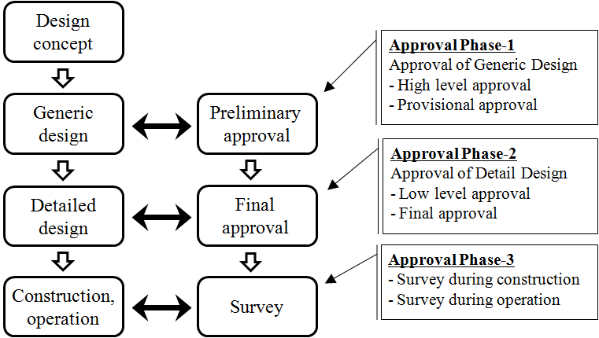
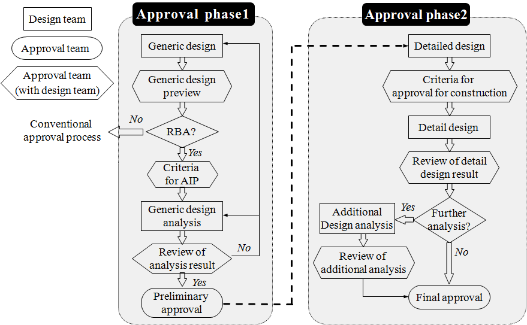
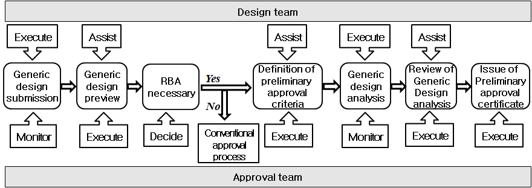
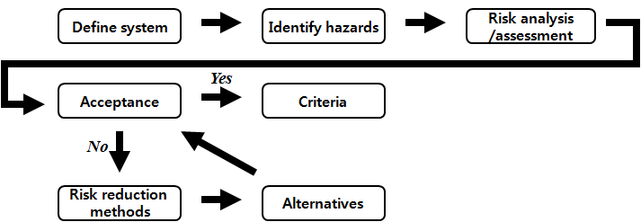
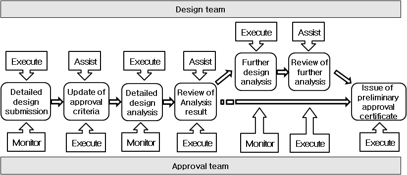

# Approval of Risk-based Ship Design

> OTHER RULES AND GUIDANCE / GC-16-K / 2025 / EN / Guidance

## CHAPTER 3 APPROVAL PROCESS

### Section 1 Approval Process

#### 101. General

- **1.** The risk-based approval process is to be clear, transparent and well described in order to avoid misinterpretations.
- **2.** The risk-based approval process is intended for validity and safety demonstration of target design, which especially focuses on design stage specially. It consists of three steps of preliminary approval, final approval and survey. (See **Fig 3.1**)
- **3.** The details of the risk-based approval process depend also on the design process of the design team. The design stage is subdivided into three stages: design concept, generic design, and detailed design. It is linked with preliminary approval and final approval. Risk-based approval on safety in generic design is to be carried out through preliminary approval and the same in detailed design is to be carried out through final approval. However, the design team may wish to carry out the approval process using a detailed design, i.e. without an analysis of a generic design. In such cases both parties may agree to skip the analysis of the generic design and adjust accordingly the approval process including the documentation of analyses. Independent of such details, the approval process to be consider among others the definition of the approval basis, the hazard identification, review of approval basis after HAZID and quantitative risk assessment.
- **4.** At the final stage, the survey requirements are applied to ensure that the original assumption of risk is satisfied for classification and continuation of the classification.
- **5.** Requirements of associated hazards are to be identified and are directly reflected to the generic design and detailed design as a means of controlling the risk of vessel during preliminary approval and final approval.
- **6.** The risk-based survey requirements are prepared by using various requirements related to construction and operation obtained through preliminary approval and final approval process. It would be a basis of safety management as a standard of work, monitoring, tests, audit and control during construction and operation of ships.
- **7.** The entire structure, primary step, stages and the order of preliminary approval and final approval is specified as **Fig 3.2**.
  
  **Fig 3.1 Stage of Approval Process**
  
  **Fig 3.2 The structure of preliminary approval and final approval**

### Section 2 Preliminary Approval

#### 201. General

- **1.** Preliminary approval is a validity approval process on generic design, and the order of preliminary approval process is specified as **Fig 3.3**.
  
  **Fig 3.3 Preliminary approval process flow**
- **2.** This section may also apply to Approval in Principle(AIP).

#### 202. Submission of generic design

- **1.** The design team is to prepare novel design or risk-based design and submit it and relate documents to the approval team.
- **2.** Overall shape of the ship, configuration of main compartments, structural configuration of main part, material, material and dimension of primary members, arrangement of primary systems, boundary condition, main specification, realizing methods of target function and operation characteristics are to be included in generical design.
- **3.** The design team is to identify existing standards, regulations and rules that the design deviated from, and explain them to the approval team.
- **4.** If necessary, terms and meanings concerning design and approval procedure are to be defined at the initial stage. The definition of these terms increases efficiency by avoiding misinterpretations and confusion.

#### 203. Preview of generic design

- **1.** The approval team previews the submitted generic design with respect to safety of life and environment protection and understands clearly the characteristics of the target design. The team considers if risk-based approval procedure is to be applied to the subjected design.
- **2.** The approval team and the design team are to discuss the contents of the submitted generic design at the generic design preview phase. The aim of the generic design preview phase is also to decide whether the risk-based design challenges any existing rules, regulations or standards to such an extent that a risk analysis is required. If risk-based approval procedure is decided not to be applied by an approval team, existing prescriptive regulations and rules may be applied to approve.
- **3.** The approval team and the design team are to identify and describe items requiring special attention and to plan how to handle these items with respect to approval.
- **4.** The decision whether the design requires a risk-based approval may be reached by using **Table 3.1** to determine the degree of novelty.

  **Table 3.1 Categorization of novelty**

  | Technology status Application area | Proven | Limited field history | New or unproven |
  | --- | --- | --- | --- |
  | Known | 1 | 2 | 3 |
  | New | 2 | 3 | 4 |
- **5.** A Matrix as shown in **Table 3.2**. may applied for guidance to the design team when performing preliminary estimates on the extent of work to be performed and submitted for approval.

#### 204. Definition of preliminary approval criteria

- **1.** The approval team is to define the required conditions and formal procedures based on the results on preview discussion of generic design.
- **2.** The specifications which are to be included, but are not limited to, in preliminary approval criteria are as follows:
  - **(1)** Definition of main risk concerned, and its evaluation criteria
  - **(2)** HAZID plans (including methods and scopes)
  - **(3)** Risk analysis and assessment plans (including methods and scopes)
  - **(4)** Work plan for generic design analysis such as experiments, calculations, analysis, simulation tests, etc. (including methods and scopes)
  - **(5)** Functional requirement and safety requirement list (Draft requirements)
  - **(6)** Assumptions, exemptions and restrictions
- **3.** The approval team defines preliminary approval criteria to advise to the design team. Preliminary approval criteria are defined through several meetings led by the approval team and the design team is to participate in the discussions.
- **4.** The following agenda is to be discussed in preliminary approval criteria meeting.
  - **(1)** Design concepts
  - **(2)** Design objectives
  - **(3)** Design novelty
  - **(4)** Risk-based features in design
  - **(5)** Violations and potential violations related to the existing prescriptive regulations, rules and standards, etc.
  - **(6)** The deficiencies or limitations of existing prescriptive regulations, rules and standards
  - **(7)** Potential hazards which may happen to all systems and functions of ships
  - **(8)** Necessary items to realize target functions

    **Table 3.2 Level of detail of risk-based approval** **corresponding to degree of novelty**

    | Category | Novelty 1(1) | Novelty 2(2) | Novelty 3(2) | Novelty 4(3) |
    | --- | --- | --- | --- | --- |
    | Risk Assessment | Not required | Required (partly) * Violation of primary regulations * Depending on risk assessment outcome * Semi-quantitative risk assessment on hazards medium or high(4) | Required (partly) * Quantitative risk assessment on hazards medium or high(5) | Required (overall) * Quantitative risk assessment on all hazards(5) |
    | Qualifications of a design team | Not required | Required * Design, operational experience experts * Individuals having general knowledge of risk assessment | Required * Design, operational experience experts * Risk assessment experts | Required * Design, operational experience experts * Risk assessment experts |
    | Applicable regulations | *Existing prescriptive regulations and rules | * Existing prescriptive regulations and rules * Parts of risk-based approval process * Applicable standards if available from other industrial sectors | * Risk-based approval process * Applicable standards if available from other industrial sectors | * Risk-based approval process |
    | Surveys | *Existing regulations of surveys | * Internal surveys * Additional surveys at related safety events | * Internal/external surveys * Additional periodic surveys at hazards | * Continuous monitoring and reporting |
    | Note : (1) ‘Novelty 1’ refers to a conventional design and the risk-based approval process need not be applied unless having a special intention or reason. Therefore existing prescriptive regulations, rules and standards may be applied. (2) ‘Novelty 2-3’ correspond to the middle level not belonging to Novelty 1 and 4 and may take existing approval process and risk-based approval process depending on the situations. Basically, they follow existing approval process according to design and may apply risk-based approval process only for important part systems and functions. If necessary, they may apply risk-based approval process for overall design. (3) ‘Novelty 4’ correspond to a design with a totally new concept which is lack of experience and verification. As there is no existing prescriptive regulations, rules and standards applicable to this, this is to follow risk-based approval process except special cases. (4) Semi-quantitative risk assessment is a method of quantitative estimates. It defines indexes on frequency and consequences of accidents in advance to give an index of the most appropriate grade. (5) Quantitative risk assessment is a method of completely estimating quantitative values. It estimates frequency and consequences of accidents in specific numbers through records, experiments, calculations, simulation tests etc. |   |   |   |   |
- **5.** Appropriate types of risk-based or reliability analysis techniques are to be identified in risk analysis and assessment plans. The features, limitations, application methods etc. are to be definitely mentioned.
- **6.** Appropriate types of experiments, theoretical analysis and calculations, possible simulation tests are to be identified in generic design analysis plans. The features, limitations, application methods etc. are to be definitely mentioned.
- **7.** Generic design analysis plans may be changed by results of generic design analysis and they are to be reflected to specify design analysis plans.
- **8.** Risk of major interest is to be identified, proper evaluation criteria corresponding to the risk are to be defined and identified.
- **9.** Objective safety level inherent in existing prescriptive regulations, rules and standards etc. may be referred to define risk evaluation criteria. Available risk evaluation criteria in other industrial sectors may be referred to. However, an approval or design team is to newly develop specific risk evaluation criteria in case of novel design.

#### 205. Analysis of generic design

- **1.** The design team is to analyse risks involved in generic design relating to preliminary approval criteria under the supervision of the approval team. The team identifies design items which require specific analysis, carries out experiments, calculations, analysis and simulation tests etc.
- **2.** If necessary, analysis results of generic design may be utilized to risk analysis works again and risk assessment is to be carried out by preliminary approval criteria. Safety of generic design is to be judged.
- **3.** At a minimum, a hazards identification is to be included in risk analysis works. Besides, other risk analysis methods such as FSA, FMECA, HAZOP, FTA, ETA, structural reliability analysis etc. may be applicable.
- **4.** The design team is to carry out hazards identification on novel design or risk-based design. Related hazards and consequences are to be identified, also safety systems(accident prevention and mitigation measures) are to be found. Through the procedure, the requirements are to be identified to ensure or improve the design safety. Preliminary approval criteria are to be revised. General risk analysis flow is specified as **Fig 3.4**.
  
  **Fig 3.4 Risk analysis flow**
- **5.** The design team is to carry out risk assessment at the end, after preparing risk model based on risk analysis results. Risk control measures are to be prepared according to risk assessment results and risk evaluation criteria defined in preliminary approval criteria.
- **6.** The specifications to be considered in risk assessment works. are as follows:
  - **(1)** Identified hazards, frequency, consequence
  - **(2)** Safety systems included in the design which may be identified
  - **(3)** Risk model for quantitative risk analysis
  - **(4)** Reference, assumption, uncertainty, sensitivity etc.
  - **(5)** Comparison of the calculated risk levels and evaluation criteria
  - **(6)** Risk control measures and risk reduction level
  - **(7)** Items which need additional risk analysis, experiments, calculations, analysis, simulation tests.
  - **(8)** Notices related to construction, operation
- **7.** Documents related to procedures and results are to be properly prepared, because risk assessment results are the most important data for preliminary approval.

#### 206. Review of analysis results for generic design

- **1.** To ensure rationality and adequacy of process and results of generic design, the approval team is to review hazards identification results and confirm that:
  - **(1)** participants have appropriate qualifications;
  - **(2)** standard procedures(eg. 「Guidelines for Formal Safety Assessment(FSA) for use in the IMO Rule-Making Process(MSC-MEPC.2/Circ.12)」) for hazards identification works were followed.
  - **(3)** the rank of identified hazards is considered properly.
  - **(4)** the identified safety systems are reflected to the design properly.
  - **(5)** features of novel design or risk-based design are reflect to identified hazards and safety systems properly.
  - **(6)** if necessary, preliminary approval criteria are revised according to identified design requirements.
- **2.** The approval team is to review rationality and adequacy of risk model
- **3.** The approval team is to review rationality and adequacy of risk assessment results.
- **4.** The approval team is to review rationality and adequacy of risk reduction level where risk control measures are applied by the design team.
- **5.** The approval team is to review that experiments, calculations, analysis, simulation tests etc related to the generic design have been carried out appropriately and transparently, and their results are reasonable.

#### 207. Issuance of preliminary approval certification

- **1.** The approval team is to review the analysis results for generic design in accordance with preliminary approval criteria and decide issuance of preliminary approval certification after judging realization possibility and safety level of generic design. The certification is not to be issued until all hazards, faults related to generic design are identified and their control is demonstrated.
- **2.** The approval team is to consider the following specifications to issue preliminary approval certification.
  - **(1)** Possible to realize generic design
  - **(2)** May all identified and calculated risk levels be acceptable
  - **(3)** Are there omitted or ignored risks
  - **(4)** Comply with design requirements
  - **(5)** Is risk reduction level by risk control measures reasonable
- **3.** It is noted that preliminary approval certification is not guaranteed for final approval. It is only possible through the final approval.
- **4.** The form of preliminary approval certificate is to be in accordance with the form defined in **Annex 2**.

### Section 3 Final Approval

#### 301. General

- **1.** Final approval is a procedure of detailed design preparation and analysis. The procedure step is specified as in **Fig 3.5**.
  
  **Fig 3.5 Final approval procedure flow**

#### 302. Submission of detailed design

- **1.** The design team submits detailed design to the approval team. The design reflects risk control measures, which are identified or created in preliminary approval procedure, in accordance to the analysis results for generic design.
- **2.** Detailed design is to include all details not specifically defined in generic design. For example, detailed structural arrangement and the shape in all parts of the ships, dimension of all structures, construction method, detailed layout and final specification of all equipment systems, specification and installation information of all equipments, operating conditions with all purposes and related loads, operating system, detailed information etc. related to propulsion and maneuver are to be developed in detailed design.

#### 303. Definition of final approval criteria

- **1.** The approval team is to identify the differences between generic and detailed design based on detailed information by detailed design as well as additional, detailed design information and revised design contents. The team is to define necessary requirements and formal procedure for final approval.
- **2.** Final approval criteria are intensified and expanded types of preliminary approval criteria. In other words, general things which are considered in preliminary approval criteria are the same as in final approval criteria, but preliminary approval criteria stated requirements which are to be complied with for approval are to be written in detail in final approval criteria.
- **3.** Items not recorded in preliminary approval criteria may be newly identified in detailed design. Risk evaluation criteria, detailed design analysis plans, the other requirements etc. of newly identified items are to be added to final approval criteria.
- **4.** If necessary, operation methods related to experiments, calculations, analysis, simulation tests etc. on risk analysis, assessment and detailed design in final approval criteria may be additionally assigned by approval team.

#### 304. Analysis of detailed design

- **1.** The design team is to identify risks related to detailed design in accordance with final approval criteria, carry out accompanied experiments, calculations, analysis, simulation tests etc. The team is to submit proper documents on the results of detailed design analysis to the approval team.
- **2.** The approval team is to supervise frequently that the design team carries out detailed design analysis suitably by final approval criteria. The representative in the approval team may attend the meeting of the design team.
- **3.** In case contents of generic design in detailed design stage are changed, hazards identification, analysis and assessment are to be carried out again overall.

#### 305. Review of analysis results for detailed design

- **1.** The approval team is to review that experiments, calculations, analysis, simulation tests etc. related to the detailed design have been carried out appropriately and transparently, and their results are reasonable.
- **2.** The list of requirements for final approval is to be prepared based on the results of preliminary approval criteria, final approval criteria, generic design and detailed design analysis. The following specifications are to be included to issue final approval certification.
  - **(1)** Possible risk categories and risk evaluation criteria
  - **(2)** Reasonable basis of limitations and restrictions applied to risk analysis
  - **(3)** Requirements to meet applied assumptions and conditions for identifying risks
  - **(4)** Requirements for successful functions of safety systems and risk control measures
  - **(5)** Requirements for achieving target functions of design
  - **(6)** If necessary, verifications for demonstrating satisfaction of requirements above
- **3.** Items recorded with list of requirements for final approval are related with the following directly, they are draft requirements of construction and survey related to operation.
  - **(1)** Related to construction : safety and quality management requirements related to construction, manufacture and installation etc.
  - **(2)** Related to operation : restrictions, maintenance requirements, procedure during operation

#### 306. Issuance of final approval certification

- **1.** The design team is to submit all necessary documents (specifications, drawings, calculations etc.) to the approval team prior to issuance of final approval certification. Basically documents related to development and analysis of detailed design are to be submitted, and relevant document list to be submitted may be adjusted by an agreement between the design team and approval team.
- **2.** All possible hazards of novel design or risk-based design are to be identified to issue final approval certification, they are to be reflected to risk analysis and assessment. Whether all risks are within risk acceptance level is to be verified comparing all risks to all risk evaluation criteria. It is to be verified that the developed detailed design is able to carry out target functions sufficiently.
- **3.** The approval team is to confirm the list of requirements for final approval and the suitability of the design. The team is to decide issuance of final approval certification after judging that detailed design or realization possibility of the target design, safety level are acceptable.
- **4.** Commencement of construction and manufacture may be possible after issuance of final approval certification. In other words, final approval is a formal and final design approval procedure to verify safety and adequacy on entire design including generic design and detailed design. 
