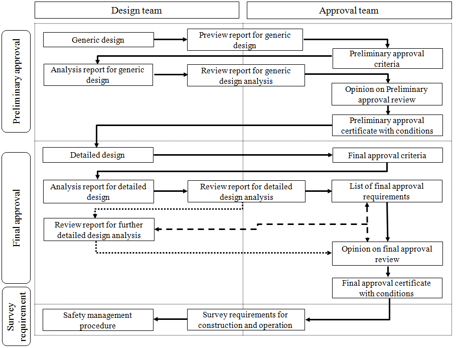

# Approval of Risk-based Ship Design

> OTHER RULES AND GUIDANCE / GC-16-K / 2025 / EN / Guidance

## CHAPTER 6 DOCUMENTATION REQUIREMENTS

### Section 1 General

#### 101. General

- **1.** The process method, necessary period, result of work and etc. of the risk-based approval process, unlike a existing conventional approval process, may not be the same according to contents and characteristics of the subjected design, and therefore the documentation process needs to be clear, transparent and well described to avoid misinterpretations. The result of non-traditional assessments need to be fully documented in a manner readily accessible to a third party.
- **2.** All documents are to be able to exhaustively transfer necessary information for the progress of the risk-based approval process. Means of document control such as document management control are to be applied to ensure that only controlled versions of the information yielded are distributed.
- **3.** **3**. Any design detail deviating from conventional best practice is to be described comprehensively in drawings. Contents which are difficult to be indicated in drawings may be additionally described in other documents.
- **4.** All parameters applied in the design process are to be explicit by being presented as diagrams or described in prose. The type, characteristic and the method (how) and stage (when) of application of parameters are to be clear from the description.
- **5.** All ships are required to carry necessary documentation for verification of safety compliance during operation on board by survey requirements and safety management systems. Essential safety elements are to be explicitly indicated in this documentation, and are to be well-acquainted by crews and the Surveyor.

### Section 2 Documentation and Exchange of Documents

#### 201. General

- **1.** Documentation in risk-based approval process may comprise, but is not limited to, documents specified in **202.** and **203.**.
- **2.** Documentation that is required to be exchanged between the approval team and the design team in the approval process is summarized in **Fig 6.1**.

#### 202. From Design Team to Approval team

- **1.** Risk-based design documents:
  - **(1)** Design concepts and objectives;
  - **(2)** Specification and general description of generic design and detailed design;
  - **(3)** Relevant drawings (generic design, system arrangement, structural drawing, production drawing, lines, etc.);
  - **(4)** Detail drawings of subsystems;
  - **(5)** Description of target system function and required sub function;
  - **(6)** Novel characteristics or risk-based characteristics of design (including operational characteristic);
- **2.** Analysis reports of generic design and detailed design:
  - **(1)** List of existing prescriptive regulations/rules/standards that are considered to be applied;
  - **(2)** Identified hazards reports;
  - **(3)** Safeguards included in the design;
  - **(4)** Results of risk analysis and risk assessment(including risk models);
  - **(5)** Safety critical elements;
  - **(6)** Applicable risk control option and consequent reduced level of risk;
  - **(7)** References and relative inter/external experts opinions;
  - **(8)** Applicable techniques or methods of test, calculation and analysis, simulation relative to the design;
  - **(9)** Objectives, scope and boundary conditions of test, calculation and analysis, simulation relative to the design;
  - **(10)** Result report of test, calculation and analysis, simulation relative to the design;
  - **(11)** Discussion about assumptions, error and uncertainties;
  - **(12)** If necessary, items which require additional further design analysis;
  - **(13)** If necessary, cost-benefit assessments
- **3.** Documents relative to construction and operation:
  - **(1)** Safety management procedure

#### 203. From Approval team to Design Team

- **1.** Result of generic design preview
- **2.** Preliminary approval criteria and final approval criteria
  - **(1)** Documentation of applicability of any regulations, rules or standards as well as any deviation;
  - **(2)** Risk analysis and assessment plans;
  - **(3)** Plan of test, calculation and analysis, simulation relative to the design;
  - **(4)** Documentation requirements and process;
- **3.** Review opinion on design analysis
- **4.** Opinion on preliminary approval review and final approval review
- **5.** List of final approval requirements
- **6.** Preliminary approval certificate and final approval certificate with conditions
- **7.** Survey requirements and safety management system approval opinion
  
  **Fig 6.1 Documentation between design team and approval team**

### Section 3 Reporting format

#### 301. General

- **1.** Prevalently, the responsibility for ensuring documentation quality rests with the design team. A party wishing to enter into the risk-based approval process(i.e. design team) is therefore to be able to manage their own document control processes.
- **2.** The documentation may take several forms, all with their own advantages and drawbacks, such as electronic file and hard copy. If necessary, the documentation is to take both of them.
- **3.** Basic formal issues have to be followed, ensuring document control and facilitating the adherence to any existing or future management systems. Such formal issues include stating on the submitted papers:
  - **(1)** Project identification number, title, scope and description
  - **(2)** Responsible persons for project, responsible persons for document, document preparing person(if necessary, document reviewer)
  - **(3)** Authorization signature
  - **(4)** Date for prepare and signature
  - **(5)** Revision number/letter
  - **(6)** Distribution list 
