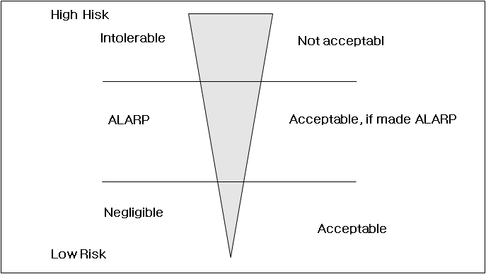

# Approval of Risk-based Ship Design

> OTHER RULES AND GUIDANCE / GC-16-K / 2025 / EN / Guidance

## Annex 1 RISK ACCEPTANCE CRITERIA

### 101. General

#### 1. Risk acceptance criteria is specific numerical value or scope of acceptable risk.

#### 2. For approval of risk-based design, acceptance criteria to be defined in agreement between the approval team and the design team.

#### 3. Risk acceptance criteria is a key of risk evaluation criteria and the specific criteria for evaluation by directly comparing the calculated risk.

#### 4. The risk-based design is to be designed to perform functions related safety with at least equivalent method of prescriptive requirements which the design deviates from.

#### 5. Risk acceptance criteria is to be determined based on the prescriptive requirements or the design applying the prescriptive requirements. Therefore, safety level of prescriptive requirements has to be described explicitly to be able to compare the safety level of risk-based design.

#### 6. Risk acceptance criteria are defined taking into account the followings.

- **(1)** Experience and statistical data
- **(2)** Acceptance criteria applied in a similar design or industry
- **(3)** The basic principles of risk assessment
- **(4)** Relevant social and economic impacts, if necessary

#### 7. Risk acceptance criteria may refer to 「Guidelines for Formal Safety Assessment(FSA) for use in the IMO Rule-Making Process(MSC-MEPC.2/Circ.12)」 that developed by the International Maritime Organization(IMO).

### 102. Basic Principle

#### 1. General

The basic principle utilized for developing the acceptance criteria can be ALARP principle, absolute risk criteria and safety equivalence. The principles adopted will naturally influence the risk acceptance criteria arrived at.

#### 2. ALARP principle

- **(1)** The ALARP principle dictates that risks are to be managed to be ‘'As Low As Reasonably Practicable’'. Reasonableness of risk reduction is generally described as economic cost. This means both risk levels and the cost associated with mitigating the risk are to be considered, and all risk reduction measures are to be implemented as long as the cost of implementing them is within the reasonably practicable region.
- **(2)** Risk level is divided in to following three regions as shown in **Fig. 1**.
  - **(A)** “Acceptable region" in which risk is negligible and no risk reduction required.
  - **(B)** “Not acceptable region" in which risk is too high and must be reduced.
  - **(C)** “ALARP region" which is in between the two bounds. In this region, risk is to be reduced to according to ALARP principle.
    
    **Fig 1 The ALARP principle**
- **(3)** Typical indices which express cost-effectiveness in relation to safety of life are GCAF(gross cost of averting a fatality) and NCAF(net cost of averting a fatality).

#### 3. Absolute probabilistic risk criteria

- **(1)** This principle explicitly defines the maximum allowable level of risk or the probability value. An example of a criterion according to this principle could be “the frequency of death due to a single accident is to not exceed 10-3 per person-year(i.e. 1 person per 1000 persons for a year)”.
- **(2)** This principle for establishing risk acceptance criteria does not consider the cost associated with achieving the corresponding risk level. This means that where maximum level of risk is higher than explicit absolute probabilistic risk criteria, the risk is to be reduced without due regard to the economic cost associated with it.
- **(3)** The explicit absolute probabilistic risk criteria may be defined for each of the accident or the integrated result of all accidents.

#### 4. Safety equivalency principle

- **(1)** This principle is the principle that compare the risk level of the subjected design with known risk levels for the similar existing design that are widely regarded as acceptable. This is a kind of comparative risk assessment approach and means that the risk level of the risk-based design is not to exceed the risk level of the existing proven design.
- **(2)** The level of the similar existing design, as the comparative risk evaluation criteria, includes a safety level that is aimed for or inherent in prescriptive regulations/rules/standards.
- **(3)** If necessary, a general risk which is commonly regarded in normal human activities(e.g. probability of death from a natural, probability of death in specific age group, etc.) may be used in lieu of risk of similar existing design. In this case, safety equivalency principle is similar with absolute probabilistic risk criteria.
- **(4)** The safety equivalency principle has the advantage that allows the designer to choose an alternative design and arrangement.
- **(5)** Where the safety equivalency principle is applied, the scope and viewpoint of risk comparison is to be decided paying due attention.
- **(6)** Where the quantitative risk of the risk-based design is difficult to estimate, the safety equivalency principle can be an effective method.

### 301. Definition of Risk Acceptance Criteria

#### 1. The approval team decides appropriate risk acceptance criteria for the subjected design and describes it in the document for preliminary approval and final approval criteria. The design team's confirmation and agreement for defined risk acceptance criteria are necessary for proper progress in the design analysis and the result review.

#### 2. The risk acceptance criteria is defined considering typical basic principle specified in 102.. The approval team is to specify a reasonable basis of basic principle selected for definition of risk acceptance criteria.

#### 3. The risk acceptance criteria in risk-based approval process can be defined using the ALARP principle or the absolute probabilistic risk criteria basically.

#### 4. Where considering the ALARP principle, the most important risk level is the risk level in upper limit of ALARP region, i.e. lower limit of unacceptable region. This risk level means maximum allowable risk level. This, therefore, has the same meaning of absolute probabilistic risk criteria in deciding to approve the design or not.

#### 5. The design team considers reduction in risk in ALARP region according to cost-effectiveness basis. According to circumstances, the approval team may refer the relative cost-effectiveness assessment result for review of risk control option.

#### 6. In application to safety equivalency principle, the approval team and the design team are to consider the following through continuous mutual discussion.

- **(1)** Selecting a similar design for criteria(including other industries)
- **(2)** Type and estimation method of the compared risk
- **(3)** Scope of the compared design and system

#### 7. Risk acceptance criteria are to be defined separately as high level risks and low level risk and also defined separately according to the type of risk. Therefore, risk acceptance criteria for high level and low level are defined separately and risk acceptance criteria for safety and environment are also defined separately. Each defined risk acceptance criteria may be different to each other or may be similar to or same as each other in some cases. #imgID-15
