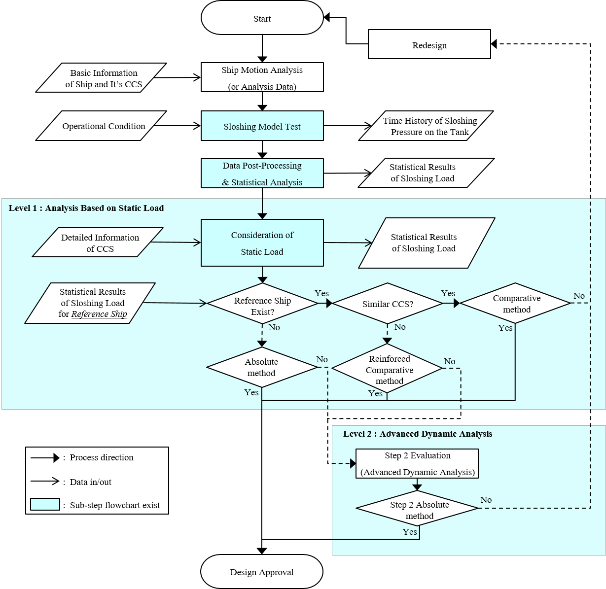

# Guidance for Strength Assessment of Membrane-Type LNG Tanks under Sloshing Loads

> OTHER RULES AND GUIDANCE / GC-17-E / 2025 / EN / Guidance

## CHAPTER 1 GENERAL

### Section 1 Application

#### 101. Application

This guidance deals with the sloshing load induced by the liquid cargo in tank due to ship motion in LNG carriers. This guidance applies to the assessment procedure and the acceptance criteria of cargo containment system under the sloshing load for the membrane type LNG carrier.
In addition, this guidance applicable to the calculation procedure of the sloshing impact load for the ship with liquid cargo tank beyond Rules for the Classification of Steel ships (hereinafter referred to as "the Rules" in this guidance), **Pt 13, Sub 1, Ch 4, Sec 6**, [6].
This guidance applies the evaluation procedure for the sloshing load and the structural strength of cargo containment system for offshore LNG storage and regasification structures using the membrane tank technology.
Requirements of this guidance shall apply in addition to the other requirements of the relevant Rules.

#### 102. Overview

Sloshing means movement of liquid inside the enclosed space. In the case of ships, the place where sloshing occurs most frequently is the liquid cargo hold, and is affected by the motion period of the cargo tank, the geometry, the density of the fluid cargo or the viscosity and the filling ratio, etc. The ship motion generates the motion of cargo tank and causes the sloshing phenomenon.
Sloshing in a tank is related to the complex physical phenomena such as the wave breaking, the phase change between liquid and gas in the tank, the cushioning effect made by the gas and the primary barrier.
Sloshing results in the high impact load on the inner structure and the support of cargo containment system. Particularly the prismatic membrane type tank with the flat and the edge zone generates the high pressure by the sloshing impact. Structural safety issue of the LNG CCS due to the sloshing pressure has become the important design factor.
Due to the strong nonlinearity and irregularity of the sloshing phenomenon, the sloshing load is generally estimated using the model test or numerical simulations. Until now, the analysis method through model experiment is considered to be the most reliable.
Overall flowchart of sloshing assessment of LNG tank is shown in Figure 1. During the model test, small-scaled model tank with partially filled with water is excited by irregular motion in seaway which representing design/operation conditions. During the test, dynamic pressures are measured at the inner-side of tank wall.
The measured pressures are used for structural strength evaluation through appropriate post-processing. In the post-processing stage, time history of pressure is converted into the time history of loads for various loaded area, and is used to extract sloshing load events through statistical analysis. The extracted sloshing load is used for strength evaluation.
Structural strength evaluation can be categorized into two levels: “Level 1 evaluation” and “Level 2 evaluation”. Level 1 evaluation is dynamic structural analysis to evaluate the safety of the CCS by converting the sloshing load into the static load.
The methods of assessment can be divided into three types.

#### 103. Equivalence

In the case that the application of this guidance is not appropriate or that the Society allow that the special method and the procedure not specified in this guidance is at least equivalent to those in effect for the provision of this guidance, it is assumed to be appropriate for the provision of this guidance.
If the other evaluation method of sloshing load is equivalent to the evaluation method of this guidance, the Society can approve the method as an alternative. In this case in order to verify that the evaluation of sloshing load is at least equivalent to the standard of this guidance, the related informations should be submitted to the Society and the evaluation method is to be consulted with the Society. From the initial design phase, the purpose to use the different method should be sufficiently discussed.

Figure 1 Flowchart of assessment of sloshing load and strength of cargo containment system

### Section 2 Symbols and definitions

#### 201. Primary symbols and units

Unless otherwise specified, the general symbols and their units used in these Rules are those defined in **Table 1.**

| **Symbols** | **Meaning** | **Units** |
| --- | --- | --- |
| $S$ | Wave energy density | $m ^{2} itsec$ |
| $H _{s}$ | Significant wave height | $\mathrm{itm}$ |
| $w$ | Angular wave frequency | $rad/itsec$ |
| $T _{z}$ | Average zero up-crossing wave period | $itsec$ |
| $\theta _{0}$ | Main wave heading | $itdeg$ |
| $\theta$ | Relative spreading around the main wave heading | $itdeg$ |
| $r _{xx}$ | Roll radius of gyration | $\mathrm{itm}$ |
| $r _{yy}$ | Pitch radius of gyration | $\mathrm{itm}$ |
| $r _{zz}$ | Yaw radius of gyration | $\mathrm{itm}$ |
| $B$ | Breadth of ship | $\mathrm{itm}$ |
| $L _{pp}$ | Length between perpendiculars | $\mathrm{itm}$ |
| $x _{G} ,y _{G} ,z _{G}$ | Ship center of gravity under consideration | $\mathrm{itm}$ |
| $x _{CT} ,y _{CT} ,z _{CT}$ | Center of gravity of tank under consideration | $\mathrm{itm}$ |
| $g$ | Gravitational acceleration | $itm/s ^{2}$ |
| $X _{1}$ | Surge at the ship center of gravity | $\mathrm{itm}$ |
| ${ddot{X _{1}}}$ | Longitudinal acceleration at the ship center of gravity | $itm/s ^{2}$ |
| $X _{2}$ | Sway at the ship center of gravity | $\mathrm{itm}$ |
| ${ddot{X _{2}}}$ | Transverse acceleration at the ship center of gravity | $itm/s ^{2}$ |
| $X _{3}$ | Heave at the ship center of gravity | $\mathrm{itm}$ |
| ${ddot{X _{3}}}$ | Vertical acceleration at the ship center of gravity | $itm/s ^{2}$ |
| $X _{4}$ | Roll | $rad$ |
| ${ddot{X _{4}}}$ | Roll acceleration | $rad/s^2$ |
| $X _{5}$ | Pitch | $rad$ |
| ${ddot{X _{5}}}$ | Pitch acceleration | $rad/s^2$ |
| $X _{6}$ | Yaw | $rad$ |
| ${ddot{X _{6}}}$ | Yaw acceleration | $rad/s^2$ |
| $T _{rise}$ | Rise time of sloshing impact | $it msec$ |
| $T _{decay}$ | Decay time of sloshing impact | $it msec$ |
| $P _{peak}$ | Peak pressure of sloshing impact | $N/mm ^{2}$ |
| $P _{is}$ | Interacted pressure of sloshing impact with $P _{peak}$, $T _{rise}$, and $T _{decay}$ | $N/mm ^{2}$ |
| $P _{3hrs}$ | Most probable maximum pressure for 3hour simulation (test) | $N/mm ^{2}$ |
| $NF$ | Number of considered filling conditions | - |
| $NH$ | Number of considered heading conditions | - |
| $NS$ | Number of considered sea states | - |
| $p_ijk$ | Occurrence probability of filling $i$, heading $j$, sea state $k$ condition | - |
| $R _{ijk}$ | Event rate of $ijk$ condition | - |
| $R$ | Average event rate | - |
| $Q _{ijk} (P)$ | Exceedance probability of sloshing load $ijk$ condition | - |
| $H$ | Height of cargo tank considered | $\mathrm{itm}$ |
| $P _{unit}$ | Unit pressure | $N/mm ^{2}$ |
| $C$ | Structural capacity of cargo containment system | - |
| $\sigma _{unit}$ | Maximum stress which is obtained by the static analysis while applying the unit load | $N/mm ^{2}$ |
| $\sigma _{y}$ | Allowable stress | $N/mm ^{2}$ |
| $K$ | Buckling coefficient | - |

#### 202. Definitions of terms

| **Terms** | **Definition** |
| --- | --- |
| Sloshing | The motion of the free fluid surface in LNG tank. |
| Potential flow | The flow of idealized fluid without the viscosity effect. |
| Critical wave domain | The wave range which generates the lifetime maximum sloshing loads. |
| Panel pressure | The averaged pressure over each measured pressure signal of the sensor stack. |
| Critical sea state | The sea state that generate the lifetime maximum sloshing loads. |
| Wave spectrum | The graph showing the distribution of the wave energy over wave frequency. |
| Diffraction-Radiation Method | The method to analyze the fluid motion phenomenon with the theory of diffraction-radiation. |
| Roll damping model | The model including the hull viscous roll damping. |
| Triangular impulse pressure | The sloshing loads which are idealized to have pressure shape over time in triangle shape. |
| Rise time | The time during when triangular impact pressure increases from the lowest to the highest. |
| Decay time | The time during when triangular impact pressure decreases from the highest to the lowest. |
| Skewness | The ratio obtained by dividing the decay time with the rise time of triangular impulse pressure. |
| CFD | The numerical analysis for fluid motion using computer program. |
| Sloshing model test | The experiments to measure (estimate) the sloshing load by the small scaled cargo tank with enforced motion excitation. |
| Pressure sensor | The sensor attached to the tank model and used to measure the sloshing pressure. |
| Design sloshing load | The design load used for the structural analysis of cargo containment system and obtained from the model test. |
| Dynamic amplification factor (DAF) | The ratio of the dynamic response to the static response for unit load with particular rise time. |
| Interacted load | The sloshing load obtained by multiplying $P _{peak}$ and $DAF _{is}$. |
| Comparative method | One of the evaluation method for cargo containment system. By selecting the membrane LNG ship with a proven service history as the reference ship, the similar LNG cargo containment system is to be evaluated. |
| Reinforced comparative method | One method of comparative method and to consider the strength of cargo containment system. |
| Absolute method | One method of strength assessment for LNG cargo containment system. It derives the design sloshing load and evaluate the structure strength of cargo containment system by performing the direct structural analysis. |
| Membrane | The film form substance used in the LNG cargo containment system. |
| Cargo containment system | The facility for storing cargo. If the primary barrier, the secondary barrier, the insulation are installed, cargo containment system means every thing and may include adjacent hull structure required to support these. |
| Primary barrier | The inner structure element (liquid-tight container) in contact with the cargo and designed to store the cargo when the cargo containment system is composed of two barriers. |
| Secondary barrier | The ability to store the liquid leakage temporarily, if any liquid cargo leaks from the primary barrier. It is the outer components of the cargo containment system (liquid-tight) designed to prevent the temperature drop of the hull structure to the dangerous condition such as the supercooled state. |
| MarkⅢ | The layered foam type cargo containment system with membrane developed by GTT which use STS 304L as the primary barrier. |
| KC-1 | The cargo containment system developed by KC LNG TECH which is the layered foam type. |
| Polyurethane foam | The filling material for the purpose of heat insulation at layered foam type cargo containment system. |
| Mastic | The material in contact with the hull directly in cargo containment system. |
| Top plywood | The plywood below the primary barrier and in contact with polyurethane foam at the layered foam type cargo containment system. |
| Back plywood | The plywood between insulation polyurethane foam and mastic at the layered foam cargo containment system. |
| NO96 | The cargo containment system developed by GTT which is the box type membrane cargo containment system. |
| Primary insulation box | The box between the primary and secondary barriers at the box type cargo containment system (NO96). |
| Secondary insulation box | The box in contact with hull through the mastic at the box type cargo containment system (NO96). |
| Acceptance criteria | The maximum stress, the maximum strain, the buckling and the service limit that cargo containment system can withstand without failure. |
| Strength of cargo containment system | The maximum strength that cargo containment system withstand without failure. |

### Section 3 Documentation

#### 301. Resource for approval

Commonly required data for the approval

#### 302. The reference data
