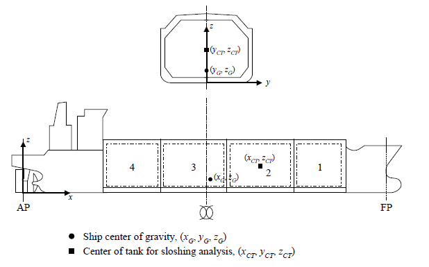
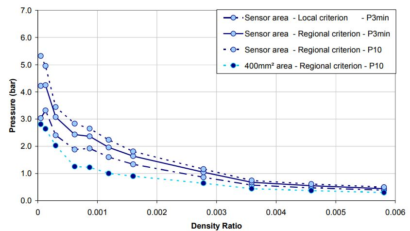
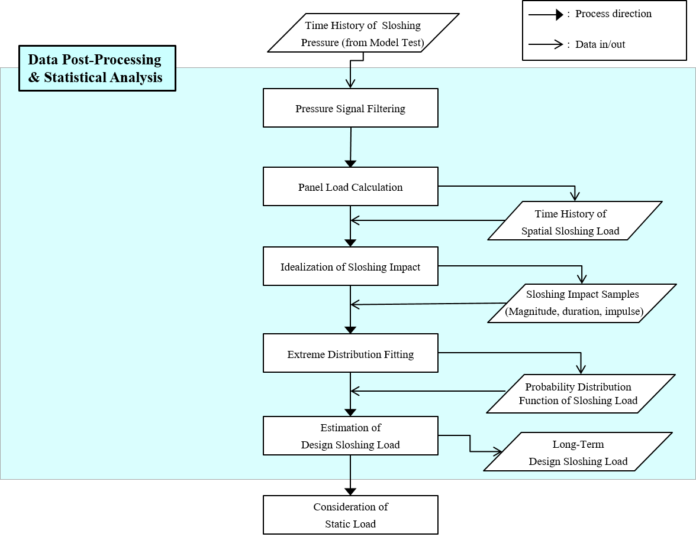

# Guidance for Strength Assessment of Membrane-Type LNG Tanks under Sloshing Loads

> OTHER RULES AND GUIDANCE / GC-17-E / 2025 / EN / Guidance

## CHAPTER 2 ASSESSMENT OF DESIGN SLOSHING LOAD

### Section 1 Sloshing analysis condition

#### 101. Target tank selection

The analysis should be performed on the cargo tanks that are expected to have the largest sloshing among tanks on the ship.
The severity of sloshing is closely related to the size, shape, and excitation motion of the tank. In a general manner, it is recommended to determine target tank as the large tank which is far from the ship motion center.
Generally, the most severe sloshing phenomenon is expected to occur in No. 2 cargo tank. Figure 1 shows the typical membrane type LNG cargo hold and No. 2 Cargo hold.

Figure 1 LNG cargo hold and No. 2 cargo hold location

#### 102. Loading condition

Tank filling ratios

#### 103. Short-term/long-term approach

Design sloshing load should be evaluated based on the design life time of the target vessel. In general, 25 year is considered for LNG carrier.
There are two methods for deriving the sloshing design load, short-term approach and long-term approach.
The short-term approach estimates the design sloshing load considering very extreme environmental conditions which the vessel could experience during her design life time. In that manner 1 year and 40 years return period is considered for beam and head waves respectively. The short-term approach does not require the sloshing load information at mild sea states and consider 3-hour most probable maximum load of critical wave condition as design load.
The long-term approach examines all the environmental conditions the vessel might experience. It additionally considers probabilities of sloshing events as well as probabilities of the sea states based on the wave scatter diagram. Therefore, probability level of design sloshing should be based on the design life, not 3hour maximum.

#### 104. Wave environmental condition

General

#### 105. Vessel speed

Speed of the vessel is varied with regards to the wave heading angle and the wave height as presented in Table 3.

| Heading angle Wave height | $0 {}^{\circ} \leq \theta <45 {}^{\circ}$ | $45 {}^{\circ} \leq \theta <135 {}^{\circ}$ | Heading angle Wave height | $135 {}^{\circ} \leq \theta <180 {}^{\circ}$ |
| --- | --- | --- | --- | --- |
| $H _{S} \leq 5$m | $V _{\max}$ | $V _{\max}$ | $H _{S} \leq 4$m | $V _{\max}$ |
| $H _{S} >5$m | $V _{\max}$ | 2/3$V _{\max}$ | $4$m$2/3\(V _{\max}$ |   |
| - |   |   | $H _{S} >7$m | 1/2$V _{\max}$ |

#### 106. Wave heading angle

Short-term approach

#### 107. Test phase

General

#### 108. Seakeeping analysis

General

#### 109. Generation of time history of tank motion

Generation of irregular tank motion

#### 110. Verification of tank motion

Verification of global motion

### Section 2 Sloshing analysis - Model test

#### 201. General

The model test should be carried out in all cases except for the case of performing the comparison method with the sloshing simulation.
The model test should be performed for the critical sea condition and the wave condition selected through the analysis of hull motion in accordance with Ch 2, Sec 1.

#### 202. Motion platform

The motion platform should be able to simulate 6-dof ship (tank) motion in seaway. The accuracy of the motion platform must be calibrated through an independent measurement system. In terms of the accuracy of the motion platform, the difference between the input motion and the output motion should be less than 3%.
If the deviation is larger than 3%, the effect of input and output motion deviations on sloshing pressure should be verified and discussed with the Society. A few studies have been conducted for the effect of input and output difference of sloshing motion time signals on the sloshing impact pressure.

#### 203. Cargo hold model

Tank model

#### 204. Liquid and ullage gas

Ullage and scaling law of density effect

#### 205. Pressure sensor

The pressure sensor must be suitable for measuring the sloshing load. The recommended features are as follows.

#### 206. Video recording

At least one earth-fixed video should be recorded to capture global motion of flow and model tank during the test. If it is necessary, platform fixed video camera would be installed to capture the flow, excluding the motion of the tank.
To capture the details of local motion of the flow, high-speed cameras with using Particle Image Velocimetry (PIV) technique could be used.

#### 207. Fluids in the tank

Ambient air and water are practically the most easily available fluids for sloshing model test. However, density ratio of air and water is different from that of Boil-Off Gas (BOG) and LNG, so the sloshing load tends to be excessively predicted.
The density ratio of the ambient air and water is about 0.0012, and the density ratio BOG and LNG in the actual LNG cargo hold is about 0.004. One of the most practical ways to match the density ratio of the fluid in the model tank as real is to replace the air by a suitable ullage gas which is heavier than air.
A mixture of sulfur hexafluoride (SF6) and nitrogen (N2) can be used instead of ambient air. The mixed gas has a ratio of SF6 of about 57% and N2 of about 43%, and their respective densities are shown in Table 4.
It is known that when the density ratio is adjusted to the realistic value by using a heavy gas mixture, the sloshing impact load can be reduced by about 40%-60% compared to the test case of using ambient air (Figure 5).

| Products | Density | Ratio (%) |
| --- | --- | --- |
| Sulfur Hexafluoride (SF6) | 6.16 | 56.9 |
| Nitrogen (N2) | 1.15 | 43.1 |
| Mixture | 4.00 | - |

Figure 5 Influence of fluid density ratio in tank on sloshing load
When using a heavy gas mixture, it is essential to ensure that the gas density in the tank is adjusted to the desired level. When using a heavy gas mixture, it is essential to ensure that the gas density in the tank is adjusted to the desired level. In addition, it is necessary to check whether the airtightness in the tank is well maintained. During the model test, the air dissolved in the water may escape and change the density ratio in the tank, so saturation work is also necessary before the test.

#### 208. Data submission

System specification for data measurement

### Section 3 Data analysis

#### 301. General

General procedure of data-post processing of pressure data from the test is shown in Figure 6.
The pressure time series obtained from individual sensors are converted into load time series for each load application area. After that, statistical samples to be used for statistical analysis are acquired through the process of detecting and idealizing sloshing peaks in the load time series.
After the post-processed sloshing peak samples are approximated to the extreme distribution function, the design sloshing load of a design exceedance probability level can be estimated based on the approximated function.
To convert to interacted load, FE analysis data base for target CCS model is required, and in this case, additional extreme function fitting is required.

Figure 6 Statistical post-processing of experimental pressure for design sloshing load

#### 302. Data filtering

A high pass filter could be applied to obtain impulse signals; hydrostatic pressure and low frequency components are to be removed. Cut-off frequency should be defined based on the response period of sloshing event, structural natural frequencies, and properties of pressure sensor. The filtering frequency should be reported.

#### 303. Consideration of panel load

The average pressure over a certain area should be processed through statistics and used as the design sloshing load.
The spatial averaging of sloshing pressure is a method of calculating the panel pressure by configuring the array group of sensors. The panel pressure can be calculated by combining the pressure signal of the individual pressure sensor. By using the installed cluster sensor, the panel load for various areas such as 0.25$m ^{2}$(1x1 array), 1.00$m ^{2}$(2x2 array), 2.25$m ^{2}$(3x3 array) should be evaluated.

#### 304. Identifying sloshing events

Peak over threshold method

#### 305. Consideration of interacted load

Structural strength evaluation can be assessed by two methods;“Level 1 evaluation” and “Level 2 evaluation”. Level 1 evaluation uses interacted load ($P _{is}$). Level 2 evaluation is described in Ch 3, Sec 6.
Level 1 evaluation is based on interacted load. Which means statistical analysis for design load derivation (Ch 2 Sec 3 306, 307) should be performed for $P _{is}$, not $P _{peak}$. Since The interacted load should include the dynamic response effect of the cargo hold, it is obtained by multiplying $P _{peak}$ and $DAF _{is}$. $DAF _{is}$ means the envelop of maximum curves for all failure modes of a structure considered, which can be obtained from the DAFs by multiplying its own natural period. For the details of DAF derivation, see Ch 3, Sec 3.

#### 306. Estimation of probability distribution of sloshing impact load

In order to examine various statistical characteristics of sloshing loads, it is necessary to approximate the probability distribution of sampled sloshing peaks to the extreme distribution function.
The most commonly used at this time is three-parameter Weibull distribution function. Probability density function (PDF, $f$), cumulative distribution function (CDF, $F$), and exceedance probability distribution (POE, $Q$) of Weibull function are described as bellows:
$f(P)= \frac{\gamma}{\beta} \left( \frac{P- \delta}{\beta} \right) \exp \left\{ - \left( \frac{P- \delta}{\beta} \right) ^{\gamma } \right\}$
$F(P)=1-\exp \left\{ - \left( \frac{P- \delta}{\beta} \right) ^{\gamma } \right\}$
$Q(P)=1-F(P)=\exp \left\{ - \left( \frac{P- \delta}{\beta} \right) ^{\gamma } \right\}$

#### 307. Estimation of long-term probability distribution

A long-term probability distribution of sloshing load should be derived based on the probability distribution of every condition that the model test is performed.
The long-term exceedance probability of sloshing load can be expressed as follows.
$Q(P)= \sum _{k=1} ^{NF} \sum _{k=1} ^{NH} \sum _{k=1} ^{NS} p _{ijk} \cdot \frac{R _{ijk}}{R} Q _{ijk} (P)$
where,
$NF$ : Number of considered filling conditions.
$NH$ : Number of considered heading conditions.
$NS$ : Number of considered sea states.
$p_ijk$ : Occurrence probability of filling $i$, heading $j$, sea state $k$ condition.
$R _{ijk}$ : Event rate of $ijk$ condition.
$R$ : Average event rate.
$Q _{ijk} (P)$ : Exceedance probability of sloshing load $ijk$ condition.

### Section 4 Sloshing simulation using CFD

#### 401. General

The sloshing analysis using CFD should be used only as an auxiliary role in deriving the sloshing design load through model tests, such as for screening purposes.
Which means that the design sloshing load derived only through CFD can not be accepted.

#### 402. Requirements for CFD tool

The CFD tool for sloshing simulation is to be verified and must satisfy the following criteria.

#### 403. Modeling

Tank modeling

#### 404. Results of numerical analysis

The analysis result should be able to obtain from CFD analysis.
