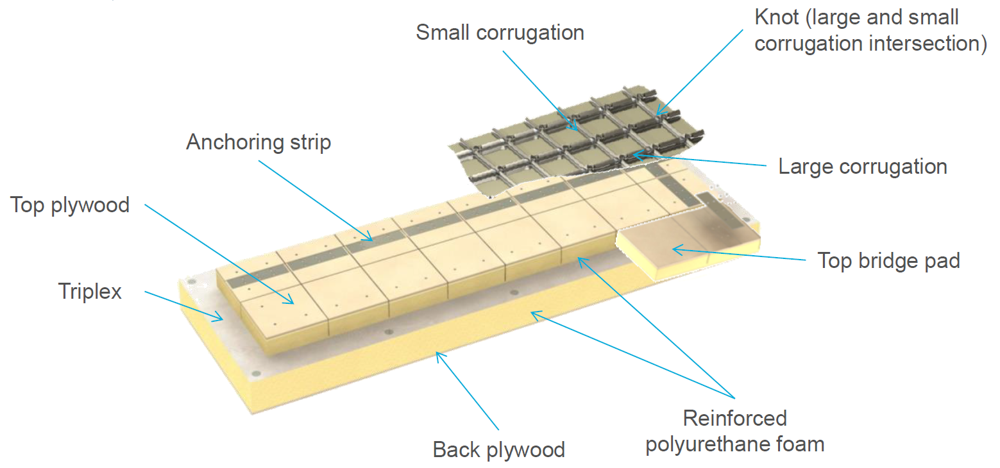
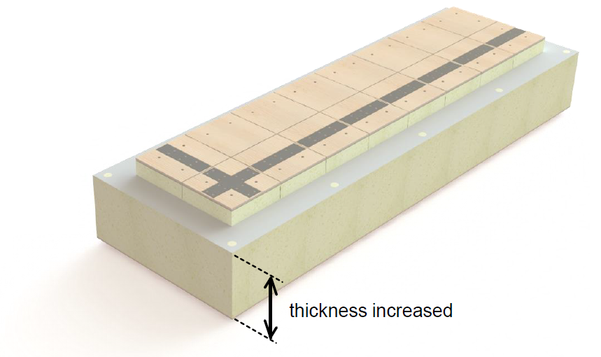
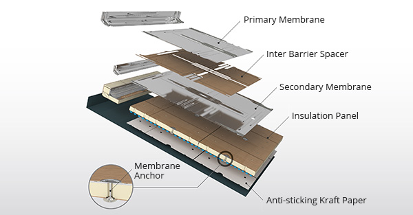
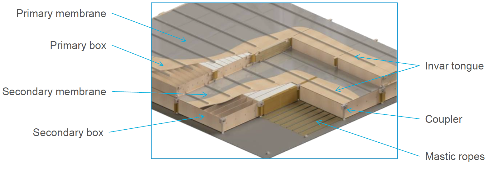
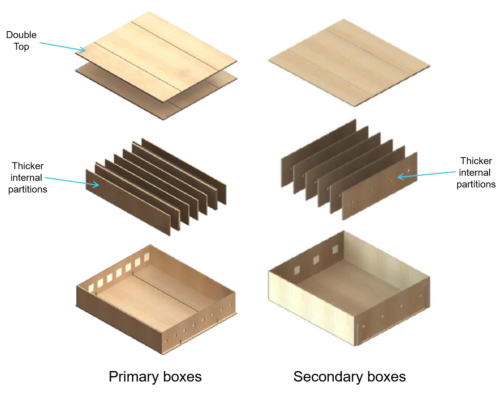
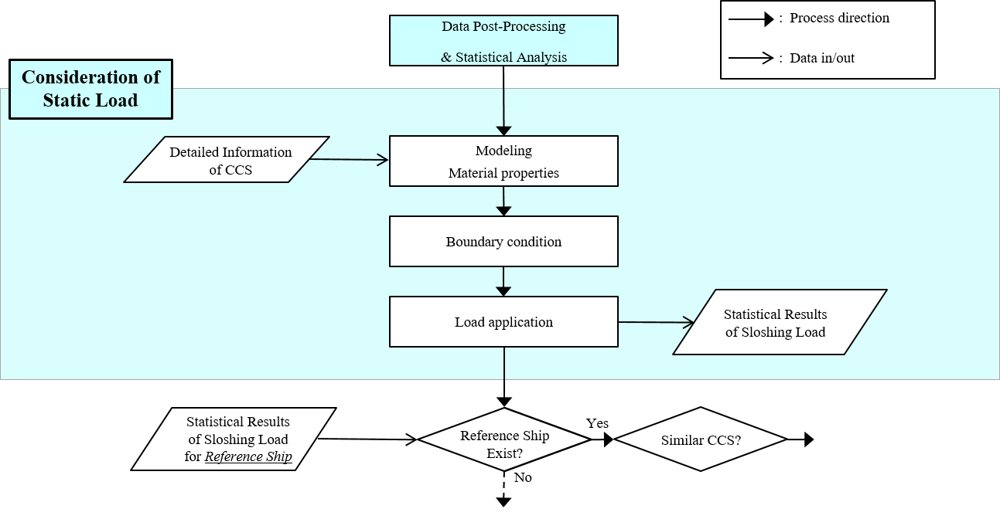
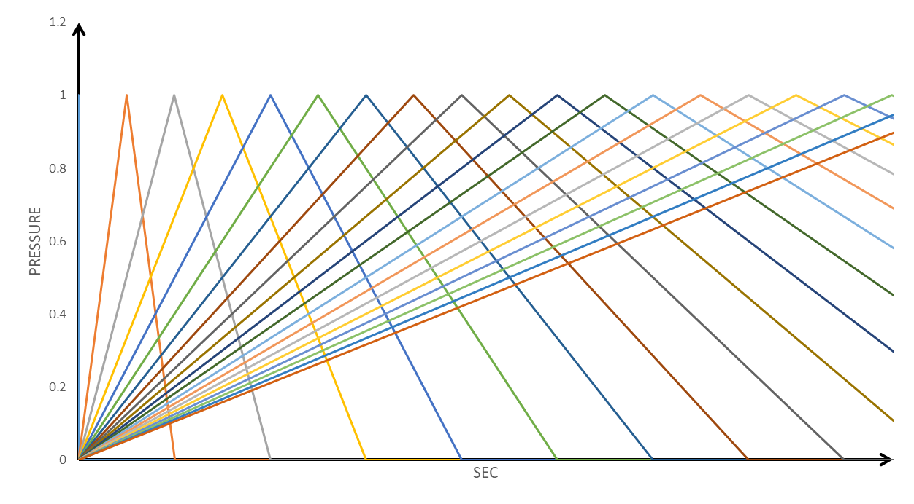
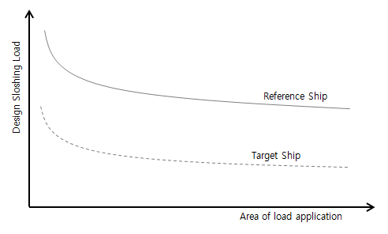
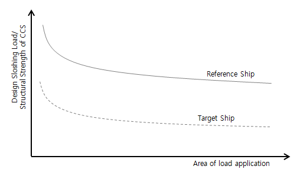
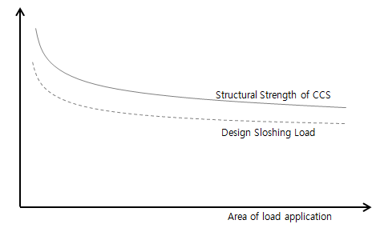

# Guidance for Strength Assessment of Membrane-Type LNG Tanks under Sloshing Loads

> OTHER RULES AND GUIDANCE / GC-17-E / 2025 / EN / Guidance

## CHAPTER 3 STRENGTH ASSESSMENT OF LNG CCS

### Section 1 General

#### 101. Application

After data post-processing & statistical analysis of model tests or CFD simulations, the structural analysis is performed in two levels.
Level 1 evaluation is the structural analysis to evaluate the safety of the cargo containment system by applying the sloshing load as the static load. Level 1 evaluation including the use of a DAF along with quasi-static response analyses should be used to assess the dynamic responses of the membrane type insulation systems. The details of Level 1 evaluation are described in Ch 3, Sec 3.
If the result of Level 1 evaluation does not meet the acceptance criteria, Level 2 evaluation should be performed. Level 2 evaluation is the advanced dynamic analysis to determine whether the result meets the acceptance criteria by applying the design sloshing load. If the analysis results meet the acceptance criteria, the design can be approved, otherwise the design shall be proceeded from the beginning. The details of Level 2 evaluation are described in Ch 3, Sec 6.
Sloshing loads may cause deformations of primary membranes of containment systems, but are not to cause significant damage of membranes of the cargo containment system. The main purpose of the structural analysis of LNG cargo containment system is to ensure the structural strength of the insulation panels.
If necessary, it may include a hull in the structural analysis and consider the motion of cargo hold. The structural assessment of primary membranes may be required to ensure that membrane deformations are in the acceptable limit. In these cases, methods of analyses shall be approved by the Society.

### Section 2 Configuration of CCS

#### 201. General

The LNG cargo containment system should keep the LNG cargo in liquid state and insulate the hull structure from the low temperature. The two major types of membrane containment systems are layered foam type containment system and box type containment system. Both containment systems provide primary and secondary barriers in compliance with the “International Code of the Construction and Equipment of Ships Carrying Liquefied Gases in Bulk (IGC Code)”, Volume III of SOLAS 1974 and consist of a two-layer system to prevent cargo leakage and maintain the cryogenic temperature.

#### 202. Layered foam type containment system

MarkⅢ and MarkⅢ flex designed by GTT and KC-1 by KC LNG TECH are typical of layered foam type containment system.
MarkⅢ and MarkⅢ flex
The material of primary barrier is austenitic stainless steel 304L which is possible to expand and contract in order to absorb the thermal deformation and hull deformation.
The secondary barrier is a membrane called Triplex which consists of the aluminum foil attached with glass fiber in and out for watertightness. The secondary insulation is composed of the reinforced polyurethane foam as same as the first insulation and the plywood. All of the contact surfaces are glued and mastic ropes are positioned between the back plywood and the inner hull. Figure 1 shows MarkⅢ containment system.

Figure 1 MarkⅢ containment system
MarkⅢ flex containment system is reinforced by increasing the thickness of secondary insulations and reducing the gap of strips of mastic. Figure 2 shows MarkⅢ flex containment system.

Figure 2 MarkⅢ flex containment system
KC-1
KC-1 cargo containment system has double metal barriers as shown in Figure 3.
The primary and secondary membrane are made of austenitic stainless steel 304L. The primary membrane has arch-shaped end corrugations with 3 lanes. Secondary membrane has identical thickness and corrugation structure but a slightly different size and shape in order to ensure a certain amount of space between them.
The insulation system is a bonded sandwich structure with single layer including back plywood, rigid closed cell foam panel and top plywood. The insulation panels are made of polyurethane foam and fixed to the inner hull by means of stud bolts. Mastic attached to the inner hull serves only load bearing members from cargo tanks because of anti-sticking paper inserted between mastic and inner hull.

Figure 3 KC-1 containment system

#### 203. Box type containment system

NO96 and NO96 reinforcement
NO96 and NO96 reinforcement designed by GTT are typical box type containment system.
The membrane material is invar which has the extremely low thermal expansion coefficient and the stress does not occur due to the thermal expansion and contraction.
The insulation system consists of two plywood boxes filled with an insulation material called perlite. These boxes are stiffened by internal partitions. All plywoods are fixed by the staples and strips of mastic are glued between the secondary box and the inner hull. Figure 4 shows a general containment system of NO96.

Figure 4 NO96 containment system
NO96 reinforcement containment system is reinforced by increasing the thickness of the internal partitions and designing the double top plates. The plates are connected by the staples. Figure 5 shows NO96 reinforcement containment system.

Figure 5 NO96 reinforcement containment system

#### 204. Other types of containment systems

The design of cargo containment system shall comply with the “The International Code of the Construction and Equipment of Ships Carrying Liquefied Gases in Bulk (IGC Code)” and shall be approved by the Society.

### Section 3 Analysis based on static load

#### 301. General

The dynamic response should be considered when performing the analysis based on static load. The dynamic response is determined from the quasi-static response through the application of dynamic amplication factor (DAF), given in Ch 3, Sec 3, 305.
If necessary, it may include a hull in the analysis and consider the temperature of the cargo containment system, the motion of cargo hold and the thermal analysis.
New types of cargo containment systems should be modeled using sufficient mesh size to reflect the structural response for the expected failure types. The loading and boundary conditions of the aforementioned systems should reflect realistic conditions as much as possible.

Figure 6 Flowchart of consideration of static load

#### 302. Modeling

MarkⅢ and MarkⅢ flex

#### 303. Material properties

General

#### 304. Loading and boundary conditions

MarkⅢ and MarkⅢ flex

#### 305. Dynamic amplification factor

Dynamic amplication factor(DAF) is the ratio of the dynamic response to the static response for unit load with particular rise time. Therefore DAF is a function of the ratio between the rise time and the natural period for characteristic of the cargo containment system being considered.
DAF curves depend on the structural models and loading conditions of 1x1, 2x2 or 3x3 sensor array, so the analyses should be conducted respectively. DAF curves may differ each component of the cargo containment system and for different failure types.
In order to obtain the robust DAF curve for the target cargo containment system, sufficient number of dynamic analyses should be conducted for various load cases. Peak is the rise time divided by the natural period, provided that DAF reaches maximum value. The examples of the sloshing loads for the derivation of DAF are shown in Figure 22.

Figure 22 Sloshing load profiles for derivation of DAFs
Typical failure types of MarkⅢ and MarkⅢ flex under the sloshing loads are as follows. Examples of locations where major damage occurs in cargo containment system are shown in Figure 23, Figure 24 and Figure 25.

### Section 4 Methods of assessment

#### 401. General

The comparative method refer to a method to evaluate the target ship by selecting the reference ship with a proven service history among the LNG membrane ships.
The comparative method is applied when the strength of cargo containment system of the reference ship is same with that of the target ship.
The reinforced comparative method is one of the comparative method and is applied when the structural strength of cargo containment system of the target ship increases from that of the reference ship.
If the approved design for the reference ship is not present, the absolute method should be applied.

#### 402. Application conditions

In order to apply the comparative method or the reinforced comparative method, the following should be proved.

#### 403. Selection of target ship

When the reference ship meet the following conditions, it is recognized to have the proved operating record.

#### 404. Comparative method

The comparative method is to select the membrane LNG ship with the good service history as the reference ship and to evaluate the design of LNG cargo containment system similar to the reference ship.
The design sloshing load of the reference ship is obtained and the design sloshing load of target ship is obtained in the same way. If the design sloshing load of the target ship is lower than that of the reference ship, the design is approved. When it fails to meet this condition, the absolute method should be used.
In order to proceed the comparative method, only the design sloshing load of the reference ship and that of target ship is needed. The design sloshing load is obtained through the CFD analysis or the model test, the structural analysis is not required.
The design sloshing loads of the reference ship and that of the target ship should be obtained in the same manner. The model test should proceed following the same procedure with the same model test facility.
If the design sloshing load of the target ship is lower than that of the reference ship as shown in Figure 29, the design can be approved. Refer to Ch 3, Sec 5, 502, 1.

Figure 29 Schematic drawing of comparative method

#### 405. Reinforced comparative method

The reinforced comparative method is one of comparative method and applied to the case where the structural strength of cargo containment system of the target ship increases from that of the reference ship. If the standard box of the box type cargo containment system (NO96) is improved by the enhanced box or the super-reinforced box, the reinforced comparative method can be applied.
The design sloshing load and the structural strength of cargo containment system for the reference ship and the target ship should be obtained. If the ratio of the structural strength of cargo containment system divided by the design sloshing load for the target ship is lower than that of the reference ship, the design of cargo containment system of the target ship can be approved. When it does not meet the acceptance criteria, the absolute method should be used.
For the reinforced comparative method, the design sloshing load and the strength of cargo containment system for the reference ship and the target ship should be obtained. The design sloshing loads are usually obtained through the model test. It should comply with the same test procedure with the same model facility for the target ship and the reference ship.
The strength change of cargo containment system are generally obtained by using the finite element analysis or the model test or both method at the same time. The critical failure mode of cargo containment system between the reference ship and the target ship should be assessed and documented. Although the structural change of the target cargo containment system is to change the critical failure mode, it should be demonstrated that its performance has not been further degenerated by the additional strength increment.
If the ratio of strength of cargo containment system to the design sloshing load for the target ship is lower than that for the reference ship, the cargo containment system of the target ship can be approved. Figure 30 shows this conceptually. Refer to Ch 3, Sec 5, 503, 1.

Figure 30 Schematic drawing of reinforced comparative method

#### 406. Absolute method

If the main design factor (size, arrangement and ratio) of cargo containment system of the target ship change significantly as compared to the that of the reference ship, the comparative and reinforced comparative method cannot be applicable. This design as determined as new design is assessed through the absolute method.
When it satisfies the acceptance criteria, the design can be approved, otherwise, the design should be started from the beginning.
Figure 31 shows an example of comparing the strength of cargo containment system to the sloshing load of cargo containment system conceptually. Refer to Ch 3, Sec 5, 504, 1.

Figure 31 Comparison between structural strength of cargo containment system and sloshing load

### Section 5 Acceptance criteria

#### 501. General

The designer is responsible for deriving the acceptance criteria and the purpose of this section is to provide the guidance to derive the acceptance criteria.
A typical failure type of layered foam type and box type cargo containment system under the sloshing loads is given in Ch 3, Sec 3, 305, 4 and 5.
The damage of cargo containment system may be evaluated from the point of yield/fracture, buckling and service limit. The damage type is related with material properties such as the relationship between stress and strain, yield strength and tensile strength.
For the viewpoint of yield/fracture and damage, the maximum bending stress of plywood is evaluated. The von-Mises stress of mastic and compressive stress of polyurethane foam are evaluated for the assessment of structural strength.
If the sloshing load exceeds the critical buckling load from the viewpoint of assessment of buckling failure, the cargo containment system is deemed to be broken.
Related to the service limit, the polyurethane foam, the plywood and the mastic has the allowable maximum displacement. If this limit is exceeded, the system becomes unstable and results in failure finally.

#### 502. Comparative method

In the case that the design sloshing load of the target ship is less than that of the reference ship, the cargo containment system of the target ship may be approved.
$P _{target} < P _{reference}$
where,
$P _{target}$ : Design sloshing load of target ship.
$P _{reference}$ : Design sloshing load of reference ship.
This criteria should be satisfied for the area/sloshing loads as shown in Figure 29.

#### 503. Reinforced comparative method

If the ratio of structural strength of cargo containment system to the design sloshing load for the target ship is less than that of the target ship, the cargo containment system of the target ship can be approved.
$\frac{P _{target}}{C _{target}} < \frac{P _{reference}}{C _{reference}}$
where,
$P _{target}$ : Design sloshing load of target ship.
$P _{reference}$ : Design sloshing load of reference ship.
$C _{target}$ : Structural strength for cargo containment system of target ship.
$C _{reference}$ : Structural strength for cargo containment system of reference ship.
This criteria should be satisfied for the area/sloshing loads as shown in Figure 30.

#### 504. Absolute method

In the case that the ratio of design sloshing load to the structural strength of cargo containment system is less than the utilization factor selected appropriately, the cargo containment system can be approved. This criteria should be satisfied for the area/sloshing loads as shown in Figure 31.
$\frac{P}{C} < UF$
where,
$P$ : Design sloshing pressure. In case of Level 1 evaluation, it is interacted load referred to Ch 2, Sec 3, 305.
$C$ : Structural capacity of cargo containment system and calculated by the structural analysis. In case of Level 1 evaluation, it is to be taken as:
$C=\min \left( \frac{\sigma _{y, i}}{\sigma _{unit, i}} \right)$
where,
$\sigma _{unit}$ : Maximum stress which is obtained by the static analysis while applying the unit load.
$\sigma _{y}$ : Allowable stress, which is related with failure mode, which should be based on the acknowledged experimental data for each material and the standard recognized by the Society.
$i$ : One of failure modes which should be considered.
$UF$ : Utilization factor, the value less than 0.60 is generally used. 0.60 is determined by the approximation of 1/(1.1×1.5). 1.5 is commonly used parameter for the dynamic load and 1.1 is a normally used factor for strength. Application of the utilization factor will vary depending on whether or not the cargo containment system is verified design. For the new cargo containment system, the utilization factor less than 0.5 is generally used.
Because of the characteristics of box type cargo containment system, the buckling can be occur. The buckling analysis is carried out with the finite element model in order to evaluate the strength of the box type cargo containment system.

### Section 6 Advanced dynamic analysis

#### 601. General

The advanced analysis should be conducted when the results of analysis considering the static load do not satisfy the criteria of either reinforced comparative or absolute method. The advanced analysis is defined as analyses performed to obtain more accurate results than that of the analysis considering the static load.
The dynamic load profile to be applied to the structure should correspond to the interacted load applied at Level 1 evaluation. For this case, the rise time of the load profile should be considered as conservative as possible considering the natural period of the structure.
The advanced dynamic analysis of the containment system may consider fluid-structure interaction between LNG and the cargo containment system. The sloshing of the LNG cargo containment system occurs by the complicated relation of the fluid and structure. The fluid-structure interaction analysis can consider the dynamics of the fluid and the deformation of the structure at the same time.
The viscoelastic effect may be also considered for polyurethane foam material in the advanced analysis. As the sloshing load is a short duration impact load, the rate effects can be included for the viscoelastic materials for evaluating the strength of the cargo containment system. Also non-linearity of material property and strain rate can be considered. However the analysis becomes more complicated and therefore, the assumptions and parameters of the analysis should be applied accurately.
The procedures and acceptance criteria of the advanced dynamic analysis should be submitted to the Society and to be approved by the Society.
**Reference**
Ahn, Y., Kim, K.H., Kim, S.Y., Lee, S.W., Kim, Y. and Lee, J.H. 2013. Experimental Study on the Effects of Pressure Sensors and Time Window in Violent Sloshing Pressure Measurement. Proceeding of 23th International Offshore and Polar Engineering Conference, Anchorage, Alaska, USA.
Bury, K.V. 1975. Statistical Models in Applied Science. Wiley, New York.
ITTC, 2017. Sloshing Model Test. ITTC Recommended Procedures and Guidelines
Kim, S.Y., Kim, K.H., Kim, Y. 2015. Comparative Study on Pressure Sensors for Sloshing Experiment. Ocean Engineering, Vol. 94, pp.199-212.
Kim, S.Y., Kim, Y. 2018. Study on Treatment of Outliers in Peak Pressure Statistics. Proceeding of 28th International Ocean and Polar Engineering Conference, Sapporo, Japan.
Maillard, S. and Brosset, L. 2009. Influence of Density Ratio between Liquid and Gas on Sloshing Model Test Results. Proceeding of 19th International Offshore and Polar Engineering Conference, Osaka, Japan.
Mehl, B. Oppitz, J., and Schreier, S. 2013. Sensitivity Study on the Influence of the Exciting Motion in Liquid Sloshing in a Rectangular Tank. Proceedings of the 23rd Int. Offshore and Polar Engineering Conference, Anchorage, USA.
Neugebauer, J., Liu, S., Potthoff, R., Moctar, O. 2017. Investigation of the Motion Accuracy Influence on Sloshing Model Test Results. Proceedings of the 27th International Offshore and Polar Engineering Conference, San Francisco, California, USA.)
Winterstein, S.R., Ude, T.C., Cornell, C.A., Bjerager, P., Haver, S. 1993. Environmental Parameters for Extreme Response: Inverse FORM with Omission Factors, Proceedings, ICOSSAR-93, Innsbruck, Austria

|   |
| --- |
| Guidance for Strength Assessment of Membrane-Type LNG Tanks under Sloshing Loads Published by ***KOREAN REGISTER*** 36, Myeongji ocean city 9-ro, Gangseo-gu, BUSAN, KOREA TEL : +82 70 8799 7114 FAX : +82 70 8799 8999 Website : http://www.krs.co.kr |
|   |

| CopyrightⒸ 2022, KR Reproduction of this Guidance in whole or in parts is prohibited without permission of the publisher. |
| --- |
