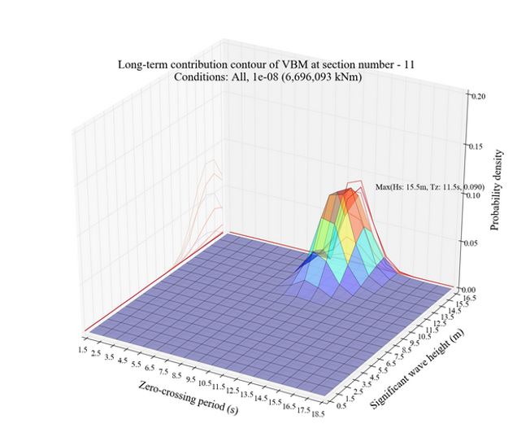

# Guidance on Strength Assessment of Container ships Considering the Whipping Effect

> OTHER RULES AND GUIDANCE / GC-19-E / 2025 / EN / Guidance

## CHAPTER 2 SELECTION OF DESIGN WAVE AND DOMINANT SEA STATE

### Section 1 General

#### 101. General

- **1.** This chapter deals with the procedure for selecting the design wave and the dominant sea state which is the condition of the hydro-elastic simulation to evaluate the whipping effect on the vertical wave bending moment.
- **2.** The terms not specifically described in this chapter are to comply with the requirements in **Pt 3**, **Annex 3-2**, **II. Direct Global Structural Analysis of Guidance relating to Rules for the Classification of Steel Ships.**

#### 102. Loading condition

- **1.** For container ships, the loading condition shall be selected whose longitudinal bending moments in the still water gives the maximum hogging bending moment. *(2024)*
- **2.** For other ships, the loading conditions shall be selected whose longitudinal bending moments in the still water give the maximum sagging and maximum hogging bending moment considering the ballast and full load condition with high operation ratio.

#### 103. Linear load analysis

- **1.** Fluid model and weight models for hydrodynamic analysis shall follow **Pt 3**, **Annex 3-2 of Guidance relating to Rules for the Classification of Steel Ships.**
- **2.** It is recommended to use 5 knots for forward speed.
- **3.** Ship motion and wave load analysis are performed on the longitudinal bending moment amidships to obtain the load transfer function.
- **4.** The program used for sea-keeping analysis should be approved by the Society.

### Section 2 Design wave selection

#### 201. Long-term analysis value of vertical wave bending moment

- **1.** For container ships, use the linear wave bending moment as the long-term analysis value by excluding the non-linear correction factor $f _{NL-Hog}$, from the vertical wave bending moment for hogging $M _{wv-Hog}$, in accordance with **Pt 14**, **Ch 4**, **Sec 4, 3.2.1** of **the Rules for the Classification of Steel Ships**.*(2022)*
- **2.** Ships other than container ships are to be decided in consultation with the Society.

#### 202. Design wave selection

- **1.** The heading angle of the design wave is based on 180˚, and the period is selected when the load transfer function with respect to the vertical bending moment is maximum at amidships.
- **2.** The amplitude of the design wave is the value obtained by dividing the long-term analysis value of the vertical wave bending moment by the load transfer function(i.e. RAO).

### Section 3 Dominant sea state selection

#### 301. Short-term statistics

- **1.** In each sea state of the wave scatter diagram, wave height is assumed to be stationary, narrow-band, and irregular sea state is represented by the wave spectrum. The wave spectrum follows the Modified Pierson-Moskowitz wave spectrum defined in **301. 2**, below.
- **2.** Find the response spectrum of the vertical bending moment at the hull transverse section to be considered by multiplying the load transfer function($H( \omega | \theta )$) obtained in **103.** and the wave spectrum($S _{\eta } ( \omega |H _{si} ,T _{zj} )$) in the sea state(i, j) that corresponds to the significant wave height $H_{ si}$ and wave period $T _{zj}$ of the wave scatter diagram.
  $S ( \omega | H _{si} ,T _{zj} , \theta ) = \left| H ( \omega | \theta ) \right| ^{2} S _{\eta } ( \omega |H _{si} ,T _{zj} )$
  $\theta$ : Heading angle
  $H( \omega | \theta )$ : Load transfer function
  $S _{\eta } ( \omega |H _{si} ,T _{zj} )$ : Modified Pierson-Moskowitz wave spectrum at short-term sea state
  $S _{\eta } ( \omega |H _{si} ,T _{zj} ) = \frac{H _{si} ^{2}}{4 \pi} \left( \frac{2 \pi}{T _{zj}} \right) ^{4} \omega ^{-5} \exp \left[ - \frac{1}{\pi} \left( \frac{2 \pi}{T _{zj}} \right) ^{4} \omega ^{-4} \right]$
  $\omega$ : Angular wave frequency (rad/s)
  $H _{si}$ : Significant wave height (m)
  $T _{zj}$ : Average Zero up-crossing wave period (s)
- **3.** The area of the short-term response spectrum is given by the following formula.
  $m _{0} = \int _{\omega } ^{} { \sum _{\theta _{0} -90 {}^{\circ} } ^{\theta _{0} +90 {}^{\circ} }} f _{s} ( \theta ) S( \omega |H _{s} , T _{z} , \theta )$
  using a spreading function usually defined as $f _{s} ( \theta )=kcos ^{2} ( \theta )$
  where $k$ is selected such that:  
  $\sum _{\theta _{0} -90 {}^{\circ} } ^{\theta _{0} +90 {}^{\circ} } f _{s} ( \theta )=1$
  where,
  $\theta _{0}$ : Main wave heading
  $\theta$ : Relative spreading around the main wave heading
- **4.** Assuming that the probability density function of the short-term load follows the Rayleigh distribution, the probability of exceedance that the amplitude $X$ of the load exceeds a certain value $X _{c}$ is as follows:
  $G _{ij} (X>X _{c} )= \exp \left( - \frac{X _{c} ^{2}}{2m _{0ij}} \right)$
  where, $m _{0ij}$ is the area of the response spectrum in the short-term sea state (i, j) that follows article **3** above.

#### 302. Long-term statistics

- **1.** In the long-term statistical analysis, the load response probability($[G(X>X _{c} )] _{L}$) exceeding a certain limit value $X_{ c}$ is given by the following equation.
  $[G(X>X _{c} )] _{L} = \sum _{ij} ^{} \sum _{k} ^{} \sum _{l} ^{} p _{ij} p _{k} p _{l} \left\{ G _{ij} (X>X _{c} ) \right\}$
  $p _{ij}$ : Probability of occurrence at of sea state (i, j) corresponding to $H _{si}$ and $T _{zj}$ of the wave scatter diagram
  $p _{k}$, $p _{l}$ : Probability of occurrence of each incident angle and loading condition
  $G _{ij} (X>X _{c} )$ : Probability of exceedance of response as described in article **301. 4.**
- **2.** The wave data used for the long-term analysis shall be applied with **Table 3** of **Pt 3 Annex 3-2 of Guidance relating to Rules for the Classification of Steel Ships**.

#### 303. Selection of dominant sea state

- **1.** Find the extreme value, $X_{ c}$, of 10-8 long-term probability level according to **302.** At this time, the incidence angles are set at equal intervals of 30 degrees or less, and the probability of occurrence of each incidence angle is the same. For a container ship, the probability of the loading condition, $p _{l}$, defined in 102. is 1.
- **2.** Calculate the extreme value of the load response at each short-term sea state in accordance with **301. 4** and then calculate the contribution for each short-term sea state as follows. At this time, the contribution sum of the short term sea states under consideration should be 1.
  $contribution ratio= \frac{\sum _{k} ^{} \sum _{l} ^{} p _{ij} p _{k} p _{l} \left\{ G _{ij} (X>X _{c} ) \right\}}{[G(X>X _{c} )] _{L}}$
- **3.** The short-term sea state with the largest contribution is selected as the dominant sea state by comparing the calculated contribution of each short-term sea state as shown in **Fig 2.1**. 
  
  Fig 2.1 Long-term condtibution contribution contour of VBM
