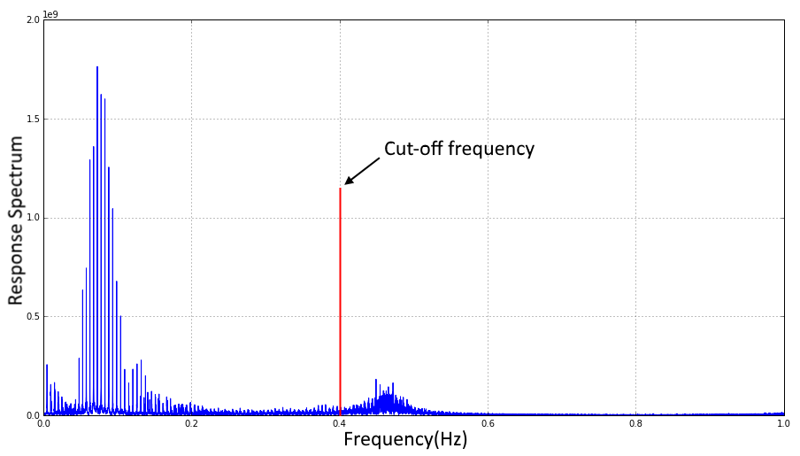
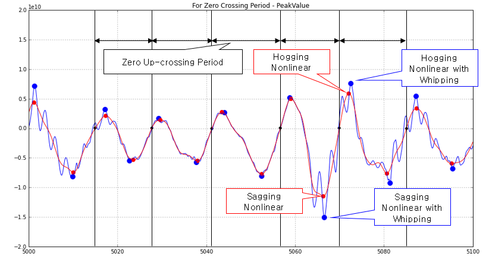
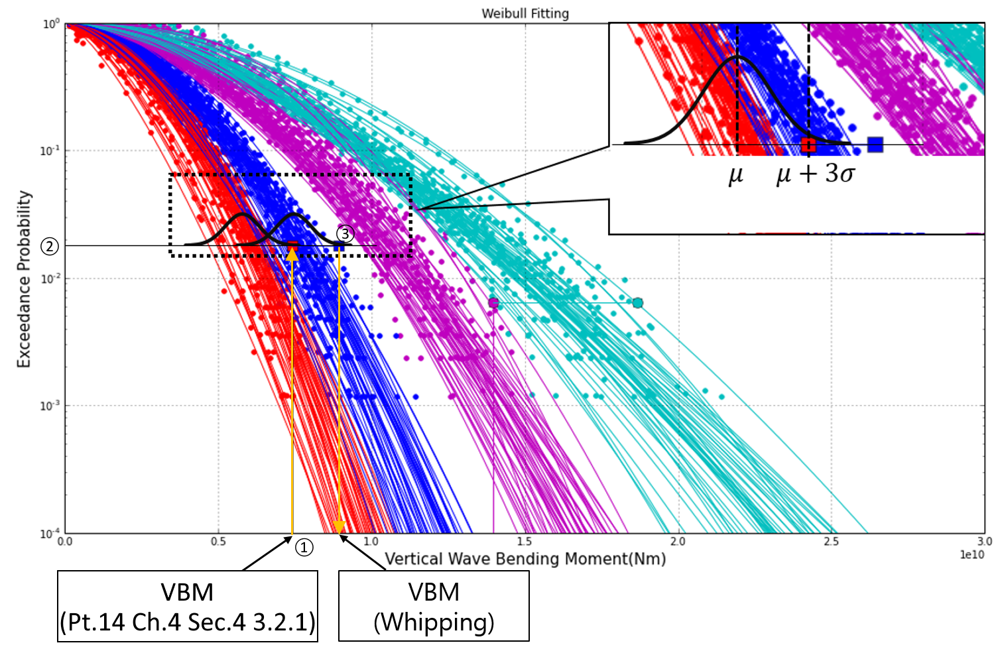

# Guidance on Strength Assessment of Container ships Considering the Whipping Effect

> OTHER RULES AND GUIDANCE / GC-19-E / 2025 / EN / Guidance

## CHAPTER 4 EVALUATION OF HULL GIRDER STRENGTH CONSIDERING THE WHIPPING EFFECT

### Section 1 General

#### 101. General

- **1.** This chapter deals with the evaluation of the ultimate strength of the hull considering the whipping effect on the vertical wave bending moment obtained by the design wave method and the design sea state method.
- **2.** In cases where methods other than those given in this chapter are to be applied, sufficient data on theory and program verification shall be submitted to the Society for approval.
- **3.** The design wave method has the advantages of short computation time and simple procedure but the results could be rather conservative as the slamming load could be overestimated since the actual irregular sea state is calculated as a substitute of a single regular wave.
- **4.** The design sea state method simulates the actual sea state and the irregular wave so that the slamming load can be approximated, therefore, the reliability of the result is high. However, compared with the design wave method, relatively longer analysis time is required, and it is difficult to ensure the reproducibility of the time series load response data. Therefore, statistical analysis based on multiple analysis data is required.

### Section 2 Estimation of whipping contribution by design wave method

#### 201. Application

The design wave method is used to calculate the contribution of whipping based on regular time series load response data.

#### 202. Peak value extraction and extreme load calculation during load cycle

- **1.** In order to remove the response due to the initial transient response in the time series analysis, the initial five wave periods are ignored. Then, the peak values of the vertical bending moment including the hull response due to whipping and the peak values of the vertical bending moment not including the said hull response, i.e. assumed as a rigid body, are extracted for at least thirty wave periods.
- **2.** Check whether the extracted peak values show a certain level and check whether high frequency response by whipping is observed under hogging and sagging condition.
- **3.** The whipping contribution is calculated as the average value by calculating the ratio of the peak value of the response considering whipping and the peak value of the response when the ship is assumed as rigid body in each cycle.

### Section 3 Estimation of whipping contribution by design sea state method

#### 301. Application

The design sea state method is used to calculate the whipping contribution based on time series load response data in the short-term sea state.

#### 302. Extraction of peak value during load cycle

- **1.** Obtains time-series response data of more than 3 hours including whipping response in short-term sea state.
- **2.** Time series load response data that does not include the whipping response is obtained under the same irregular wave condition expressing the short-term sea state. In this case, the time series load response data that does not include the whipping response can be replaced with the load response data with the high frequency hull girder vibration components removed, which is acquired from the time series load response data including the whipping response through the low-pass filter. The cutoff frequency of the low-pass filter is about 90% of the frequency of hull vibration mode in the mode analysis result of the wetted condition. It is to be confirmed that the dynamic response components, as shown in **Fig 4.1**, are properly removed, after comparing the determined cutoff frequency with the Fast Fourier Transform(FFT) results of the time series data that includes the whipping response.
- **3.** The zero up-crossing period is considered as the loading period, as shown in **Fig 4.2,** using the time series data that does not include the whipping response and the maximum and minimum values in each period are set as the peak value.
- **4.** The peak values of the time series load response data including the whipping response are obtained in the same periods.

#### 303. Estimation of parameters of the probability distribution

- **1.** Based on the peak values obtained in **302.**, cumulative relative frequencies can be calculated and the parameters of the Weibull distribution can be estimated using the least squares method or the maximum likelihood estimation based on the linearized data by logarithmic scale.
- **2.** Apply the shape parameter and the scale parameter of the Weibull distribution obtained from the above **1.** to the following equation to obtain the exceedance probability of the load response in given irregular wave as shown in **Fig 4.3**.
  $G(X>X _{c} )= \exp \left( - \frac{X _{c}}{\eta} \right) ^{\xi }$
  $\xi$ : Shape parameter
  $\eta$ : Scale parameter
  $X _{c}$ : Vertical bending moment
  
  Fig 4.1 Example of applying cutoff frequency in FFT result of time series data including whipping response

  |  Fig 4.2 Extraction of peak values during load cycle **Fig 4.2 Extraction of peak values during load cycle** |
  | --- |
  |  Fig 4.3 Weibull fitting of cumulative probability distribution *(2022)* **Fig 4.3 Weibull fitting of cumulative probability distribution** *(2022)* |
- **3.** When calculating the cumulative relative frequency using the histogram, it is recommended that the interval of the histogram be determined by the optimization method. If other methods are used, sufficient data on the theory and method should be submitted to the Society for approval.
- **4.** When estimating the parameter of Weibull distribution function, the tail weighting method can be applied to improve the accuracy of the fitting. For this, the cumulative relative frequency of at least 20% to 25% can be ignored.

#### 304. Estimation of probability level and calculation of extreme load

- **1.** Because the irregular waves used in the design sea state method are composed by the sum of overlapping regular waves based on the wave spectrum defined by significant wave height and wave period, many irregular waves can be generated depending on the various phase of the regular wave constituting the irregular wave.
- **2.** It is difficult to confirm the reproducibility of the load response when considering the nonlinearity of the ship motion in waves in a number of irregular wave conditions representing the same sea state. To account for this, a representative value in the short-term sea state can be estimated through statistical analysis, assuming that the load response at the same exceedance probability follows normal distribution as shown in **Fig 4.3**.
- **3.** The exceedance probability level for estimating the extreme load is the level when the representative value of the load response without whipping reaches the value of the vertical bending moment in accordance with **Pt 14, Ch 4, Sec 4, 3.2.1** of the **Rules for the Classification of Steel Ships**. The representative value for each exceedance probability is the value of three times the standard deviation added to the mean value of normal distribution.*(2022)*
- **4.** In order to obtain the reliability of the representative value of the normal distribution, a sufficient population is required. For this, 30 ~ 50 analyses may be required to achieve convergence in various irregular wave conditions expressing the same sea state.
- **5.** In the exceedance probability level obtained in the above **3.**, a representative value of the load response considering whipping is calculated, and this is regarded as an extreme load considering whipping. The contribution by whipping is calculated as the ratio of the representative values at this time.

### Section 4 Estimation of whipping contribution of vertical bending moment and ultimate hull girder strength

#### 401. Calculation of whipping contribution of vertical bending moment (2022)

The whipping contributions defined in **Sec 2** and **3** can be rewritten as:
$f _{Whip} = \frac{M _{Whip}}{M _{Rigid}}$
$f _{Whip}$ : Whipping contribution to vertical wave bending moment
$M _{Whip}$ : Vertical wave bending moment with whipping effect
$M _{Rigid}$ : Vertical wave bending moment without whipping effect

#### 402. Hull girder ultimate strength assessment considering the whipping effect (2022)

In case of container ship, the hull girder ultimate strength of hogging condition considering whipping for amidship should satisfy the following criteria. Ships other than container ships are to be decided in consultation with the Society.
$\gamma _{S} M _{S} + \gamma _{Whip} f _{Whip} M _{W} \leq \frac{M _{U}}{\gamma _{M} \gamma _{DB}}$
$M _{S}$ : Permissible still water vertical bending moment at hogging condition(kNm).
$M _{W}$ : Vertical wave bending moment in accordance with **Pt 14**, **Ch 4**, **Sec 4, 3.2.1** of the **Rules for the Classification of Steel Ships**(kNm).
$M _{U}$ : Vertical hull girder ultimate bending capacity in accordance with **Pt 14**, **Ch 5**, **Sec 2, 2.1.1** of the **Rules for the Classification of Steel Ships**(kNm).
$\gamma _{S}$ : Partial safety factor for the still water bending moment, to be taken as 1.0.
$\gamma _{Whip}$ : Partial safety factor for the vertical wave bending moment (with whipping included), to be taken as 1.05.
$f _{Whip}$ : Whipping contribution to vertical wave bending moment, defined in **401**. 

|   |
| --- |
| **Guidance on Strength Assessment of Container ships** **Considering the Whipping Effect** Published by **KR** 36, Myeongji ocean city 9-ro, Gangseo-gu, BUSAN, KOREA TEL : +82 70 8799 7114 FAX : +82 70 8799 8999 Website : http://www.krs.co.kr |
|   |

| CopyrightⒸ 2024, **KR** Reproduction of this Rules and Guidance in whole or in parts is prohibited without permission of the publisher. |
| --- |
