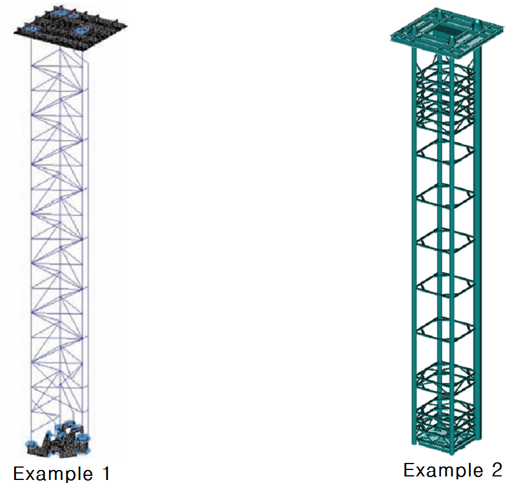
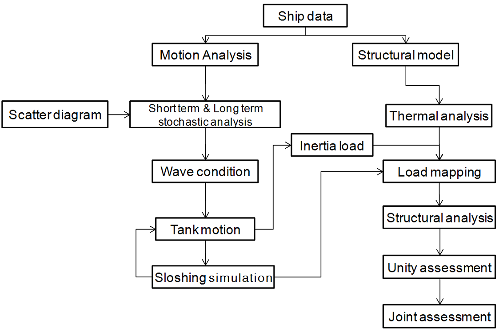

# Structural Strength Assessment of Pump Tower of LNG Carriers

> OTHER RULES AND GUIDANCE / GC-20-E / 2025 / EN / Guidance

## CHAPTER 1 GENERAL

### Section 1 General

#### 101. Application

- **1.** This Guidance is to apply to structural strength assessment of the pump tower of the membrane LNG Carriers.
- **2.** The requirements of this guidance shall apply in addition to the other requirement of the Rules.

### Section 2 Introduction

#### 201. Outline

- **1.** The pump tower system consists of pipes and pumps to load and discharge the liquid cargo and tubular members to support the structure(see **Fig. 1)**. The pump tower is located close to the aft bulkhead, hanging over the liquid dome and connected to base support at the tank bottom. In addition, pumps are installed at the bottom for loading and discharging of liquid cargo. The structural integrity of these systems is critical for the safe operation of the LNG carrier.
- **2.** Since the pump tower is exposed to the cryogenic cargo in the cargo tank, thermal stresses is to be considered and consideration is to be given at the support, and the LNG motion in the cargo tank and the load due to the motions of the ship should also be taken into account.
- **3.** Approval of the structural design of the pump tower systems has typically been made based on the analysis and assessment provided by the designers of the systems.
  
  Fig 1 Example of Pump tower system

#### 202. Pump tower assessment procedure

The analysis procedure provided in this Guidance is a first-principle-based, direct calculation approach to identify the critical sloshing load on the pump tower during its design life and to evaluate the structural integrity of the pump tower under that load. The overall analysis procedure for the strength assessment of pump tower is shown in **Fig. 2**.

Fig 2 Analysis procedure for strength assessment of pump tower

#### 203. Structural assessment of pump tower

- **1.** **Ship motion analysis**
  Follow Guidance for Assessment of Sloshing Load and Structural Strength of Cargo Containment System.
- **2.** **Selection of critical sloshing wave conditions**
  Follow Guidance for Assessment of Sloshing Load and Structural Strength of Cargo Containment System.
- **3.** **Sloshing analysis**
  Follow Guidance for Assessment of Sloshing Load and Structural Strength of Cargo Containment System.
- **4.** **Selection of Load Cases for Structural Analysis**
  Follow **Ch 2, Sec 2.**
- **5.** **FE analysis of pump tower structure**
  The structural members of the pump tower are to be modeled by appropriate FE models such as plate, shell or beam elements. The boundary conditions at the top and bottom ends of the pump tower may require special attention. Part of the liquid dome structure at the top of the pump tower is to be included in the structural model for accurate definition of the boundary condition at the top.
- **6.** **Acceptance criteria**
  Follow **Ch 3, Sec 3.**
- **7.** **Fatigue analysis**
  Fatigue strength assessment of the pump tower is based on the hot spot stress approach. The structural details, e.g., tubular joints in the pump tower, need to be evaluated in terms of the fatigue strength. Applicable dynamic loads are considered. Appropriate SCFs (Stress Concentration Factors) are to be applied in the stress range calculation.
- **8.** **Vibration analysis**
  The free and forced vibration(if necessary) of pump tower due to main engine and propeller are considered. Excessive vibration is to be avoided in order to reduce the risk of structural damage such as cracking on the liquid dome, base plate, or tubular joints of pump tower structure. The acceptance criteria for pump tower vibration are provided in terms of the vibration limits for local structures.

### Section 3 Equivalency

#### 301. Equivalency

Alternative special method and procedure will be accepted by the Society, provided that the Society is satisfied that such construction, equipment, arrangement and scantlings are equivalent to those required in the Rules.

### Section 4 Documents

#### 401. Documents

The following materials should be submitted to the Society and to be reviewed by the Society. In addition, if deemed necessary, the Society may require the submission of date other than those specified below.

- **1.** **Motion analysis data**
  - **(1)** Input data of the motion analysis(loading conditions, the draft, the metacenter height and the gravity center of ship, etc)
  - **(2)** Model data of motion analysis
  - **(3)** Detail result of motion analysis
  - **(4)** Analysis data of critical sea state and wave condition for the model test.
- **2.** **CFD data**
  - **(1)** Verification data of CFD Software
  - **(2)** Data of critical sloshing wave condition
  - **(3)** CFD analysis model
  - **(4)** CFD analysis result
  - **(5)** Analysis data of the design sloshing load
- **3.** **Structural assessment data of the pump tower**
  - **(1)** Pump tower modeling and structural analysis
  - **(2)** Fatigue analysis result
  - **(3)** vibration analysis result
- **4.** **Reference data**
  - **(1)** Main source of the ship
  - **(2)** Restrictions on cargo operations, such as limiting the height of the cargo loading, cooling down speed
  - **(3)** Layout of cargo containment system in each cargo hold
  - **(4)** General arrangement of ship with the cargo containment system installed
  - **(5)** Design constraints of the cargo containment system 
