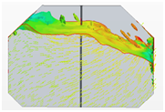
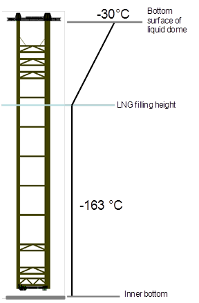

# Structural Strength Assessment of Pump Tower of LNG Carriers

> OTHER RULES AND GUIDANCE / GC-20-E / 2025 / EN / Guidance

## CHAPTER 2 LOADS ON PUMP TOWER

### Section 1 General

#### 101. General

Sloshing load, thermal load, inertial load and tank internal pressure are to be applied to the structural strength assessment of the pump tower. Pump torque is to be considered separately, as the pump is not used during the voyage of the LNG carrier.

### Section 2 Loads

#### 201. Sloshing load

The sloshing load due to the fluid obtained from the ship's motion analysis and sloshing CFD analysis (see **Fig. 3**) is to be selected for the moment having the maximum value in both the transverse direction and the longitudinal direction, and the load distribution at that time is to be applied to the structure. In this case, the load due to the fluid is to be calculated using the Morrison equation. When applying a load to the pump tower structure, it is to be applied to the distribution load using the Morrison equation in the same way. The sloshing load per unit length of the structure is to be calculated by calculating the fluid acceleration and velocity according to the height at the pump tower position. The Morrison equation for the sloshing load applied to the pump tower is as follows.
$\frac{dF _{s}}{ds} = \frac{1}{2} \rho _{L} C _{D} U _{n} \left| U _{n} \right| D _{mem} + \rho _{L} C _{M} \frac{dU _{n}}{dt} A _{mem}$
$dF _{s} /ds$ : sectional force due to sloshing on the wetted portion of the structure (N/mm)
$s$ : length coordinate along the tubular member
$\rho _{L}$ : liquid density (ton/mm^3)
$U _{n}$ : liquid velocity normal to the member (mm/s)
$dU _{n} /dt$ : liquid acceleration normal to the member (mm/s^2)
$C _{D}$ : drag coefficient, 0.7 for cylinder
$C _{M}$ : inertia coefficient, 2.0 for cylinder
$D _{mem}$ : diameter of the structure (mm)
$A _{mem}$ : vertical cross section area of the structure (mm^2)

Fig 3 Sloshing simulation using CFD

#### 202. Thermal load

Since the length of the pump tower is very long compared to the cross-sectional area of the structural member, thermal expansion or contraction is a major load factor. According to the stack height of the LNG, as shown in **Fig. 4**, it is assumed that the temperature up to the point of direct contact with LNG is -163 °C, and -30 °C is the bottom surface of liquid dome. It is assumed that from the free surface of the LNG to the bottom surface of liquid dome is linearly distributed.

Fig 4 Assumption of temperature distribution

#### 203. Inertial load

The inertial load due to the ship's motion at the time of maximum sloshing load is to be calculated and applied to the pump tower itself. The inertial load consists of the translational acceleration of the ship, the acceleration in the tank position due to the rotational acceleration, and its own weight by the pitch and roll angles.(Refer to Guidance for Assessment of Sloshing Load and Structural Strength of Cargo Containment System)

#### 204. Tank internal pressure

The vapor pressure present in the cargo tank is applied to the bottom of the liquid dome cover. In general, a pressure of 0.25 bar or more(refer to IGC code) is to be considered as static pressure. 
