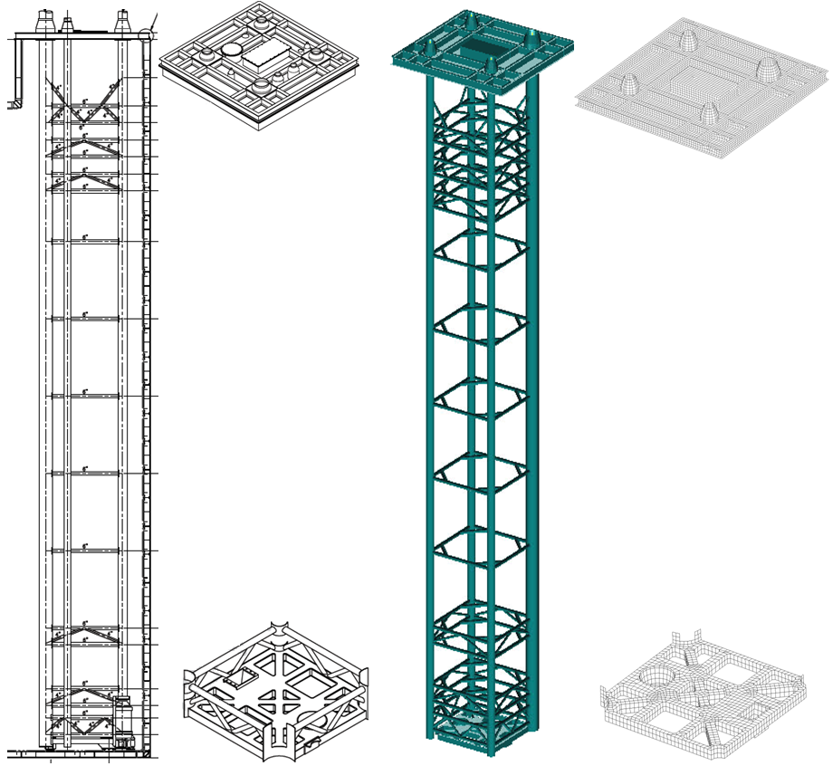
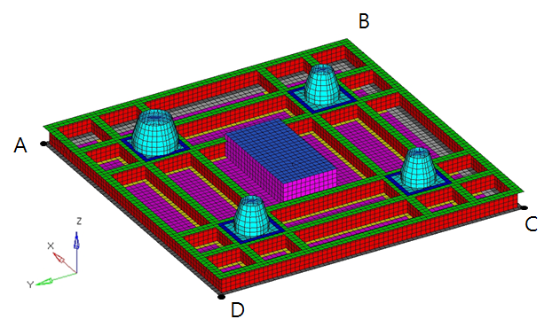
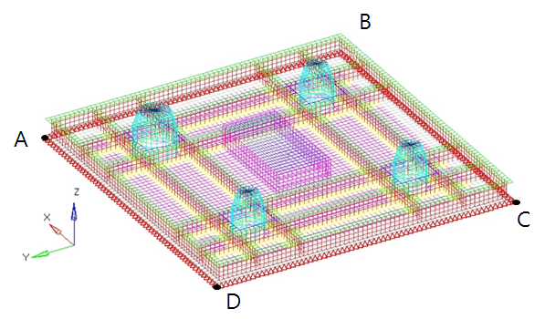
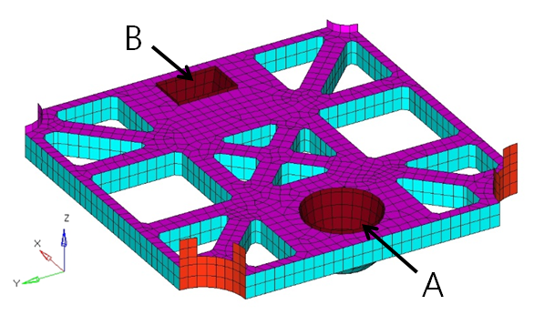
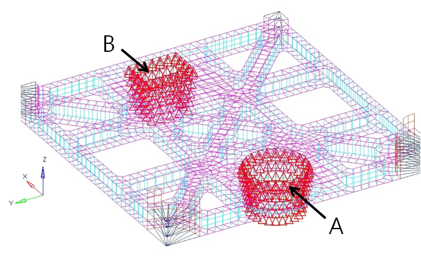
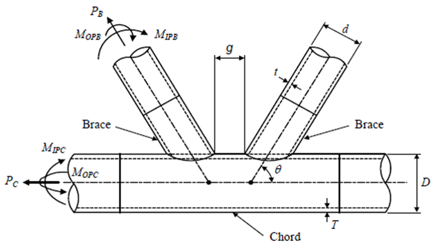

# Structural Strength Assessment of Pump Tower of LNG Carriers

> OTHER RULES AND GUIDANCE / GC-20-E / 2025 / EN / Guidance

## CHAPTER 3 STRUCTURAL STRENGTH ASSESSMENT

### Section 1 Structure modeling

#### 101. Analysis Model Scope and Structure Modeling

The pump tower structure consists of liquid dome cover, tubular members, and base plate (see **Fig. 5**). To assess the strength of the tubular members, the liquid dome cover and the base plate is to be included in the model. The liquid dome cover is connected to the hatch coaming of the cargo tank of the vessel and the lower support is connected to another support fixed to the inner bottom. The model for the lower support is sufficient for the evaluation of the tubular members. The strength assessment for the liquid dome cover and the base plate is to be evaluated in separate models and boundary conditions.

Fig 5 Example of Pump tower model

- **1.** The liquid dome cover and the base plate are modeled using plate elements, the element size is to be sufficient to express the shape and the maximum size is 100 mm x 100 mm. The tubular members are modeled as beam elements.
  The rigid link element is used because the area where the tubular members and the liquid dome cover are welded and the area where the base plate and the tubular members are in contact are modeled by the plate elements and the beam elements.
- **2.** The pump tower is typically made of 300 series stainless steel. The material properties used in the analysis, such as elastic modulus and thermal expansion coefficient, are shown in **Table 1** (Example: stainless steel 304L). The temperature-dependent elastic modulus and thermal expansion coefficient are calculated by linear interpolation using the values for the temperatures given in **Table 1**.

  | Elastic modulus | 193 GPa (20 °C) 203 GPa (-163 °C) |
  | --- | --- |
  | Poisson's ratio | 0.3 |
  | Density | 7.85 x 10^-9 ton/mm3 |
  | Thermal expansion coefficient | -185°C : 1.33 x 10^-5 mm/mm/°C -130°C : 1.39 x 10^-5 mm/mm/°C -70°C : 1.48 x 10^-5 mm/mm/°C -20°C : 1.57 x 10^-5 mm/mm/°C 0 ~ 100°C : 1.72 x 10^-5 mm/mm/°C |

### Section 2 Boundary conditions

#### 201. Boundary conditions

The example of boundary conditions is to comply with the following.

- **1.** **Liquid dome cover**

  |  |  |
  | --- | --- |
  | Example of boundary conditions |   |

  | Coord. Position | Displacement |   |   | Rotation |   |   |
  | --- | --- | --- | --- | --- | --- | --- |
  | Coord. Position | $U _{x}$ | $U _{y}$ | $U _{z}$ | $\theta _{x}$ | $\theta _{y}$ | $\theta _{z}$ |
  | $\bar{AB }$, $\bar{BC }$, $\bar{CD }$, $\bar{DA }$ | 1 | 1 | 1 | 1 | 1 | 1 |
  | (Remark) 1 : Fixed 0 : Free |   |   |   |   |   |   |
- **2.** **Base plate**

  |  |  |
  | --- | --- |
  | Example of boundary conditions |   |

  | Coord. Position | Displacement |   |   | Rotation |   |   |
  | --- | --- | --- | --- | --- | --- | --- |
  | Coord. Position | $U _{x}$ | $U _{y}$ | $U _{z}$ | $\theta _{x}$ | $\theta _{y}$ | $\theta _{z}$ |
  | A(main support) | 1 | 1 | 0 | 1 | 1 | 0 |
  | B(sub support) | 0 | 1 | 0 | 1 | 0 | 1 |
  | (Remark) 1 : Fixed 0 : Free |   |   |   |   |   |   |

### Section 3 Strength assessment

#### 301. Tubular members

Strength assessment for tubular members is performed for yielding and buckling etc.. If there is an approach based on experimental data on the material used for the pump tower, acceptance criteria is to be determined based on this. When a detailed analysis is not available, the equations provided below are to be used to assess the yielding and buckling strength for tubular members in the pump tower.

- **1.** **Axial tension and shear**
  $\sigma _{a _{-} t} \leq \eta _{a} \sigma _{y}$
  $\sigma _{a _{-} t}$ : tensile stress from FE analysis
  $\eta _{a}$ : 0.9 (normal stress), 0.52 (shear stress)
  $\sigma _{y}$ : 170 (N/mm^2)
- **2.** **Axial Compression**
  $\sigma _{a _{-} c} \leq \eta _{a} \sigma _{cr}$
  $\sigma _{a _{-} c}$ : compressive stress from FE analysis
  $\eta _{a}$ : 0.783 (if $\sigma _{el} \leq \sigma _{y}$)
  $0.9 - 0.0827 \sqrt {\sigma _{y} / \sigma _{el}}$ (if $\sigma _{el} > \sigma _{y}$)
  $\sigma _{el}$ : elastic buckling stress(N/mm^2)
  $\sigma _{el} =\pi ^{2} E _{} /( \frac{k \ell }{r} ) ^{2}$
  $E$ : elastic modulus for stainless steel (N/mm^2)
  $k$ : 1.0 (for filling, discharge, emergency pipe)
  0.8 (for brace, strut)
  $\ell$ : length of members (mm)
  $r$ : radius of gyration (mm)
  $r = \sqrt {I/A}$
  $I$ : moment of inertia (mm^4)
  $A$ : cross sectional area (mm^2)
  $\sigma _{cr}$ : critical buckling stress (N/mm^2)
  $\sigma _{cr} =\pi ^{2} E _{t} /( \frac{k \ell }{r} ) ^{2}$
  $E _{t}$ : tangent modulus for stainless steel
  $E _{t} =E[1+0.002 \frac{E n}{\sigma _{y}} ( \frac{\sigma _{cr}}{\sigma _{y}} ) ^{n-1} ] ^{-1}$
  $n$ : 7.2, knee factor
- **3.** **Bending moment**
  $\sigma _{b _{-} act} \leq \eta _{b} \sigma _{b}$
  $\sigma _{b _{-} act}$ : bending stress from FE analysis
  $\sigma _{b _{-} act} = M/Z _{e}$
  $M$ : Bending moment (N-mm)
  $Z _{e}$ : elastic section modulus (mm^3)
  $Z _{e} = \left( \pi /64 \right) \left[ D ^{4} - \left( D-2 t \right) ^{4} \right] / \left( D/2 \right)$
  $D, t$ : as specified in **Fig 6.** (mm)
  $\eta _{b}$ : 0.9
  $\sigma _{b}$ : bending strength (N/mm^2)
  $\sigma _{b} =(Z _{p} /Z _{e} ) \sigma _{y}$ (for $\sigma _{y} D / \left( E t \right) \leq 0.02$)
  $\sigma _{b} = \left[ 1.038-1.9 \sigma _{y} D/ \left( E t \right) \right] (Z _{p} /Z _{e} ) \sigma _{y}$ (for $0.02 < \sigma _{y} D / \left( E t \right) \leq 0.1$)
  $\sigma _{b} = \left[ 0.921-0.73 \sigma _{y} D/ \left( E t \right) \right] (Z _{p} /Z _{e} ) \sigma _{y}$ (for $\sigma _{y} D / \left( E t \right) >0.1$)
  $Z _{p}$ : plastic section modulus (mm^3)
  $Z _{p} = \left( 1/6 \right) \left[ D ^{3} - \left( D-2 t \right) ^{3} \right]$
- **4.** **Combined Loads(Axial Tension and Bending Moment)**
  $\left[ \sigma _{a _{-} t} /( \eta _{a} \sigma _{y} ) \right] + \left[ \sigma _{b _{-} act} /( \eta _{b} \sigma _{b} ) \right] \leq 1$
- **5.** **Combined Loads(Axial Compression and Bending Moment)**
  $\left[ \sigma _{a _{-} c} /( \eta _{a} \sigma _{cr} ) \right] + \left[ C _{m} \sigma _{b _{-} act} / \left\{ \eta _{b} \sigma _{b} (1- \sigma _{a _{-} c} /( \eta _{a} \sigma _{el} )) \right\} \right] \leq 1$ (for $(\sigma _{a _{-} c} / \sigma _{cr} )>0.15$)
  $\left[ \sigma _{a _{-} c} /( \eta _{a} \sigma _{cr} ) \right] + \left[ \sigma _{b _{-} act} /( \eta _{a} \sigma _{b} ) \right] \leq 1$ (for $( \sigma _{a _{-} c} / \sigma _{cr} ) \leq 0.15$)
  $C _{m}$: which is the lesser of 0.85 or $1-0.4 \left[ \sigma _{a _{-} c} /( \eta _{a} \sigma _{el} ) \right]$
- **6.** **Local buckling**
  $\sigma _{a _{-} b} \leq \eta _{local} \sigma _{local}$
  $\sigma _{a _{-} b} = \sigma _{a _{-} c} + \sigma _{b _{-} act}$
  $\eta _{local}$ : 0.75 (if $\sigma _{local} \leq 0.55 \sigma _{y}$)
  $0.566 + 0.334 \sigma _{local} / \sigma _{y}$ (if $\sigma _{local} >0.55 \sigma _{y}$)
  $\sigma _{local}$ : critical local buckling stress
  $=0.6 E _{t} t/D$

#### 302. Tubular Joints

The tubular joints are the part where the chord and the brace are welded and each chord/brace intersection is to be classified as T, Y or K, according to their configuration and load pattern for each load case.
The assessment of tubular joints is to be evaluated in consideration of bending, punching shear, and axial stress. **Fig 6** shows the force and general shape of a tubular joint.

|  Fig 6 Geometry and geometric parameters of tubular joint **Fig 6 Geometry and geometric parameters of tubular joint** | $\theta$: angle of brace measured from chord $g$: gap $\gamma$: $D /(2T)$ $\beta$: $d /D$ |
| --- | --- |

- **1.** The strength of tubular joints is to comply with the following formula.
  $\left| \frac{F _{A}}{\mu F _{U _{-} A}} \right| + \left( \frac{M _{IPB}}{\mu M _{U _{-} IPB}} \right) ^{2} + \left| \frac{M _{OPB}}{\mu M _{U _{-} OPB}} \right| \leq 1$
  $F _{A}$ : axial load in the brace member (N)
  $M _{IPB}$ : in-plane bending moment in the brace member (N-mm)
  $M _{OPB}$ : out-of-plane bending moment in the brace member (N-mm)
  $\mu$ : 0.9, safety factor
  $F _{U _{-} A}$ : tubular joint strength for brace axial load (N)
  $M _{U _{-} IPB}$ : tubular joint strength for brace in-plane bending moment (N-mm)
  $M _{U _{-} OPB}$ : tubular joint strength for brace out-of-plane bending moment (N-mm)
  $F _{U _{-} A} = \frac{\sigma _{y} T ^{2}}{\sin \theta} Q _{u} Q _{f}$
  $M _{U _{-} IPB} or M _{U _{-} OPB} = \frac{\sigma _{y} T ^{2} d}{\sin \theta} Q _{u} Q _{f}$
  $F _{U _{-} A}$ : critical joint axial strength (N)
  $M _{U _{-} IPB}$ : critical joint bending moment strength for in-plane bending (N-mm)
  $M _{U _{-} OPB}$ : critical joint bending moment strength for out-of plane bending (N-mm)
  $\theta$ : as specified in **Fig 6**
  $\sigma _{y}$ : as specified in **301. 1.**
  $Q _{u}$ : strength factor depending on the joint loading and classification, as determined in **Table 2**
  $Q _{f}$ : chord load factor
  $Q _{f} =1- \lambda \gamma A ^{2}$
  $\lambda$ : 0.030 (for brace axial load)
  0.045 (for brace in-plane bending moment)
  0.021 (for brace out-of-plane bending moment)
  $\gamma$ : as specified in **Fig 6**
  $A = \frac{\sqrt {\sigma _{nominal _{-} a} ^{2} + \sigma _{nominal _{-} IPB} ^{2} + \sigma _{nominal _{-} OPB} ^{2}}}{\mu \sigma _{y}}$
  $\sigma _{nominal _{-} a}$ : nominal axial stress in the chord member (N/mm^2)
  $\sigma _{nominal _{-} IPB}$ : nominal in-plane bending stress in the chord member (N/mm^2)
  $\sigma _{nominal _{-} OPB}$ : nominal out-of-plane bending stress in the chord member (N/mm^2)
  $\mu$ : 0.9, safety factor

  | Joint Classification | Axial load |   | Bending load |   |
  | --- | --- | --- | --- | --- |
  | Joint Classification | Compression | Tension | In-plane | Out-of-plane |
  | K | $(0.5+12 \beta ) \gamma ^{0.2} Q _{\beta } ^{0.5} Q _{g}$ | $(0.65+15.5 \beta ) \gamma ^{0.2} Q _{\beta } ^{0.5} Q _{g}$ | $4.5 \beta \gamma ^{ 0.5}$ | $3.2 \gamma ^{(0.5 \beta ^{ 2} )}$ |
  | T & Y | $(0.5+12 \beta ) \gamma ^{0.2} Q _{\beta } ^{0.5}$ | $(0.65+15.5 \beta ) \gamma ^{0.2} Q _{\beta } ^{0.5}$ | $4.5 \beta \gamma ^{ 0.5}$ | $3.2 \gamma ^{(0.5 \beta ^{ 2} )}$ |

  $Q _{\beta }$ = $0.3/[ \beta (1-0.833 \beta )]$ for $\beta >0.6$
  = 1.0 for $\beta \leq 0.6$
  $Q _{g}$ = $1 + 0.85 e ^{(-4g/D)}$ for $g/D \geq 0$
  $g$ : as specified in **Fig 6.** (mm)
  $\gamma , \beta$ : as specified in **Fig 6**

#### 303. Liquid dome cover and base plate

- **1.** **FE model**
  The evaluations of the liquid dome cover and base plate structure require more detailed FE models than **101.**.
- **2.** **Strength Criterion**
  The strength of the liquid dome cover and base plate structure is to comply with the following formula.
  $\sigma _{e} \leq \mu \sigma _{y}$
  $\sigma _{e} = \sqrt {\sigma _{X} ^{ 2} - \sigma _{X} \sigma _{Y} + \sigma _{Y} ^{ 2} +3 \tau ^{ 2}}$
  $\sigma _{X}$ : calculated direct stress in the x-direction (N/mm^2)
  $\sigma _{Y}$ : calculated direct stress in the y-direction (N/mm^2)
  $\tau$ : calculated shear stress (N/mm^2)
  $\sigma _{y}$ : 170 (N/mm^2)
  $\mu$ : 1.0, safety factor 

  |   |
  | --- |
  | **GUIDANCE FOR STRUCTURAL STRENGTH ASSESSMENT OF** **PUMP TOWER OF LNG CARRIERS** Published by **KR** 36, Myeongji ocean city 9-ro, Gangseo-gu, BUSAN, KOREA TEL : +82 70 8799 7114 FAX : +82 70 8799 8999 Website : http://www.krs.co.kr |
  |   |

  | CopyrightⒸ 2017, KR Reproduction of this Guidance in whole or in parts is prohibited without permission of the publisher. |
  | --- |
