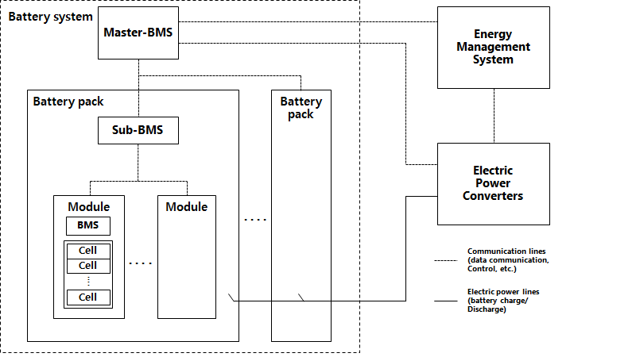

# Guidance for Battery Systems on Board Ships

> OTHER RULES AND GUIDANCE / GC-23-E / 2025 / EN / Guidance

## CHAPTER 3 CONSTRUCTION AND EQUIPMENT

### Section 1 General

#### 101. General

- **1.** Electrical equipment not specified in this chapter is to comply with the requirements in **Pt 1** of **Rules for the Classification of Steel Ships**.
- **2.** The battery system is generally configured as shown in Fig 1 below, which can be changed depending on the manufacturer's design. *(2023)*
  
  Fig 1 Block diagram of battery system *(2023)*

#### 102. Materials

- **1.** Parts and related materials used in the battery system shall be flame-retardant and moisture-resistant. *(2019)*
- **2.** Materials shall be of a material or coating that is corrosion-resistant to corrosion at the place of installation and at the environmental conditions of use.
- **3.** The conductive material shall be copper, copper alloy, stainless steel or equivalent, with sufficient electrical, thermal and mechanical safety.

#### 103. Construction (2023)

- **1.** All components shall be of a secure construction that is resistant to distortion, relaxation and other damage.
- **2.** Parts that are likely to come into contact with people and those that require periodic maintenance and inspection shall be constructed in a structure free of sharp protrusions or corners.
- **3.** Connection parts between live parts or connection parts between live parts and non-live parts are to be of a structure which does not cause relaxation under the use environment conditions.
- **4.** Parts that can replace or disassemble parts of the main body shall be easy to replace or disassemble and be of a safe construction.
- **5.** A dual-rated device with the ability to convert the rated input voltage or frequency shall be able to easily identify the converted voltage and frequency. However, except for devices with automatic conversion.
- **6.** Electrical components and accessories shall be applied with a maximum voltage or maximum power.

#### 104. Arrangement and location of area (2023)

- **1.** The battery space shall be permanently fixed to the hull by welding or otherwise, and the hull substructure shall be adequately reinforced.
- **2.** Safe access to the battery space shall be provided.

#### 105. Protective devices

Electrical equipment shall be adequately protected against all overcurrents, including short circuits.

### Section 2 System Design

#### 201. General

- **1.** Lithium secondary batteries are to be adequate to national standards, recognized international standards or equivalent standards.
- **2.** A single failure in the battery system shall not affect other systems in the ship.
- **3.** The battery system shall be able to block abnormal current flow, and effective protection shall be provided.

#### 202. Construction and design

- **1.** **Battery system design**
  - **(1)** The lithium secondary battery shall not overflow the electrolytes under the normal operational environment conditions of the ship, such as vibration and inclination of the ship.
  - **(2)** The electrolytes shall be injected into the integrated cell and not exposed to the outside.
  - **(3)** The battery module shall be designed so as to relieve the rise of internal pressure.
  - **(4)** The battery system shall be configured with appropriate protective devices and protective coordination against fault currents.
  - **(5)** The battery shall be protected against excessive temperature rise, and the protection function shall be fail safe. In addition, the protective device for this shall be separated from temperature indication, alarm and control functions.
  - **(6)** The battery system shall set the limits for the followings so that the temperature is maintained within a certain range.
    - **(A)** Maximum charge and discharge current rate (C-rate)
    - **(B)** Maximum and minimum battery voltage (overcharge and over-discharge protection)
  - **(7)** The battery system shall be equipped with short-circuit and over-current protection in the minimum unit forming the system voltage.
  - **(8)** The overcurrent protection device shall be installed as close as possible to the battery output terminal. Both the anode and cathode shall be operated simultaneously to prevent overcurrent.
  - **(9)** A device that limits the energy flow between the battery and the charging voltage source is to be installed to prevent damage to the battery.
  - **(10)** The fault current of the battery system shall be designed taking into account the manufacturer's instructions or the rated capacity (Ah) of the battery pack.
  - **(11)** Means of disconnection
    - **(A)** A disconnecting device is to be installed outside the battery system for maintenance.
    - **(B)** The battery disconnecting device shall be capable of simultaneously disconnecting and isolating anode and cathode.
    - **(C)** The automatic disconnector shall be manually reset and operator shall not be exposed to high voltage and arc when resetting.
    - **(D)** For the operation of a manual disconnecting device, tools or excessive force shall not be required by the operator.
    - **(E)** The battery disconnecting device shall be applied considering the designed current and voltage and short-circuit fault current.
- **2.** **Degree of protection (IP)**
  - **(1)** Batteries and related systems shall have a degree of protection suitable for the installation site.
  - **(2)** When water-based fire extinguishing system is used in the battery space, the degree of protection of the battery modules or its enclosures are to be at least IP 44. *(2023)*
- **3.** **Battery capacity**
  - **(1)** Batteries shall have adequate capacity, taking account of aging deterioration and capacity required for ships.
  - **(2)** Where the battery is to be used as an additional source of electrical power, the battery capacity shall be sufficient for the intended operation of the ship and data on the basis and calculation of the design capacity shall be submitted.
  - **(3)** In the event of an excessive temperature rise in the battery system, a audible and visual alarm signal for manual load reduction shall be transmitted to the bridge or the load reduction shall be performed automatically.
- **4.** **Installation**
  - **(1)** The battery shall be installed in an enclosed space consisting of hull bulkheads or in separate dedicated compartments.
  - **(2)** The battery space shall not be located in front of the collision bulkhead. *(2023)*
  - **(3)** The battery space shall not contain other systems related to the essential services of the ship. No piping shall be allowed to run through the battery space, as leaks in the piping may cause damage or failure of the battery system. However, in case of unavoidable installation of pipes, only welded joints are allowed (For pipe joint types, refer to Pt 5, Ch 6, 104. 1 of Rules for the Classification of Steel Ships). *(2023)*
  - **(4)** Flammable fluid shall not be allowed to pass through the pipes, even if the pipes joints in the battery space are welded joints. *(2023)*
- **5.** **Operation and maintenance**
  - **(1)** A detailed operating manual shall be provided on board for emergency situations and shall include the followings:
    - **(A)** Measures to be taken in case of a fire accident due to internal or external factors
    - **(B)** In case of an emergency, the local operation procedure of the battery (charge, stop procedure, etc.)
  - **(2)** A plan for functional test and maintenance shall be provided on board and shall include the followings:
    - **(A)** Detailed test plan and maintenance method
    - **(B)** Verification method for state-of-charge (SOC) and state-of-health (SOH)
  - **(3)** The battery system used for main source of electrical power shall be controllable from the local side such as the system, switchboard room or the power converter. The local control shall be independent of any remote control systems. *(2023)*

#### 203. Redundancy of the battery system (2023)

The additional class notation **Battery-M** may be assigned to ships complying with the requirements given this article.

- **1.** The battery system used as the main source of electrical power of sufficient capacity to supply essential services and services for habitability is to be provided. This battery system is to consist of at least two independent systems located in two independent battery spaces.
- **2.** The capacity of these battery systems is to be such that in the event of any one battery system being stopped it will still be possible to supply essential services and services for habitability necessary to provide normal operational conditions of propulsion and safety. Minimum comfortable conditions of habitability shall also be ensured which include at least adequate services for cooking, heating, domestic refrigeration, mechanical ventilation, sanitary and fresh water.
- **3.** Where the main source of electrical power is necessary for propulsion and steering of the ship, the system is to be so arranged that the electrical supply to equipment necessary for propulsion and steering and to ensure safety of the ship will be maintained or immediately restored in the case of loss of any one of the battery systems in service. Preference tripping or other equivalent arrangements are to be provided to protect the battery systems against sustained overload.
- **4.** The battery system shall be controllable from the local position. The local control panel can be located at the battery system, switchboard or converter. It is intended to provide a control station accessible as an alternative to that located at the bridge, in case of emergency. The local control shall be independent of all remote control systems.

#### 204. Application of Hybrid System (2021)

- **1.** Rotating machinery used as generating sources are to comply with the requirements in **Pt 6, Ch 1, Sec 3** of **Rules for the Classification of Steel Ships**.
- **2.** Generally, power generation sources may include fixed speed and variable speed generators, fuel cells, batteries, and other types of energy sources. These energy sources can be used as independent power sources or as main power sources in combination with other energy sources.

#### 205. Charging facility (2019)

- **1.** The equipment charging battery shall be able to supply enough power to charge the battery.
- **2.** When the battery system is being charged from the outside of the ship, it shall be equipped with the function to cut off the shore power automatically or manually. The degree of protection of the charging plug and the receptacle shall be at least IP56.

#### 206. Battery management systems

- **1.** **General**
  - **(1)** The battery management system should be supplied from a separate power source other than its own battery, and should be configured as a system compatible with the communication system so that it can be monitored or controlled with other systems such as a power management system or an energy management system.
  - **(2)** The battery management system shall include important alarm and stop functions.
  - **(3)** The Master-BMS shall be able to detect major faults in the Sub-BMS and disconnect the associated module or battery pack.
  - **(4)** Communication between the Master-BMS and the power management system shall be communicated clearly in normal operation and in the event of an accident.
  - **(5)** Electric power converter shall be able to communicate with the battery management system and be designed to be sufficient for the capacity of the battery system.
- **2.** **Design**
  The battery management system shall have the following functions.
  - **(1)** The Master-BMS shall monitor all the states of the Sub-BMS and forward the information to the power converter or host controller.
  - **(2)** The battery management system shall control charge/discharge according to information transmitted from a power converter or an energy management system which is a host controller, and the power converter shall supply power to meet the charging/discharging conditions.
  - **(3)** It shall be able to monitor the status of battery voltage, current, temperature, etc. in real time to maintain the optimal state. The battery system shall be monitored even when the battery system is not operating. *(2021)*
  - **(4)** BMS shall prevent overcharge, overdischarge, and overheating of the battery cell and monitor the battery to operate stably.
  - **(5)** The Master-BMS shall detect major failure of the Sub-BMS and forward it to the power converter so that it can immediately shut down the related battery system.
  - **(6)** Communication between the battery management system and the power converter or upper controller shall be redundant to increase the safety of the system.

#### 207. Energy management systems

- **1.** When applying an energy management system, the energy management system shall be installed as an upper controller of the battery system.
- **2.** The energy management system shall always monitor the followings:
  - **(1)** The available energy or power of the battery system.
  - **(2)** State-of-charge (SOC)
  - **(3)** State-of-health (SOH)
- **3.** The energy management system shall be designed so that the battery system operates within the specified limits and shall always monitor the followings in the engine control room.
  - **(1)** Maximum charge current and discharge current (C-rates)
  - **(2)** Maximum and minimum voltage of battery (prevention of overcharge and overdischarge)

### Section 3 Electric Power Converters

#### 301. Design (2023)

- **1.** All power converters shall use approved products from the Society and comply with the following requirements.
  - **(1)** Designed and tested in accordance with **Pt 6, Ch 1, 1202.** of Rules of the Society and the recognized standards by the Society.
  - **(2)** Designed considering the electrical characteristics of the equipment to be connected.
  - **(3)** It shall be designed in consideration of equipment and life safety.
    - **(A)** The enclosure shall be designed to protect personal injury due to sharp edges and excessive temperature rise.
    - **(B)** For the safety of life, a lock that can be used during maintenance and inspection shall be provided.
    - **(C)** When the operating voltage exceeds 50V, safety earth is to be carried out using earth wire.
  - **(4)** The power converter shall comply with the requirements in **Pt 6, Ch 1, 201. 8** of **Rules for the Classification of Steel Ships**.
  - **(5)** The components of the power inverter shall be easy to repair and replace.
  - **(6)** The capacity of the power converter shall be selected considering the electrical specifications of the connected load.
  - **(7)** Charge/discharge shall be controlled in accordance with the instruction of the upper controller responsible for the power control of the ship.
- **2.** **Installation**
  - **(1)** Power converter shall be installed in a dry place as far as possible from steam pipes, water pipes, oil pipes, etc.
  - **(2)** Power converter shall be installed in a space where the proper temperature can be maintained in consideration of the charge/discharge characteristics.
  - **(3)** The power converter shall not be installed on the battery.
- **3.** **Degree of protection (IP)**
  - **(1)** Power converters shall have a degree of protection suitable for the installation site.
- **4.** Power converters for charging battery and supplying power shall meet the following requirements.
  - **(1)** Protection against overcharging and overvoltage shall be provided.
  - **(2)** A protection system against reverse flow of charge current shall be installed.
  - **(3)** It shall be designed to charge the battery at the current and voltage appropriate for the specifications of the battery system.
  - **(4)** In the event of a power converter failure, a visual and audible alarm shall be issued to the bridge or engine control room.

#### 302. Protection system (2023)

- **1.** The system to which the power converter is connected shall be provided with an overcurrent limiting device.

### Section 4 Fire Protection and Fire Extinction

#### 401. General (2023)

- **1.** The requirements in this Section apply in addition to **Pt 8** of Rules for the Classification of Steel Ships.
- **2.** The battery space is generally considered as “machinery spaces of category A“ for fire protection purposes. *(2024)*
- **3.** The battery space shall be enclosed by an A-0 class divisions and the boundary between the following compartments shall be A-60 class.
  - **(1)** Machinery spaces of category A specified by SOLAS Reg.II-2/3
  - **(2)** Cargo area for the transportation of dangerous goods
- **4.** Fire extinction system for the battery space including the arrangement shall be approved by the Society.

#### 402. Fire detection system

- **1.** Smoke detectors shall be used for fire detection. However, for areas where malfunction of the smoke detector may occur, a heat detector may be used.
- **2.** The fire detection system shall be provided in accordance with the FSS code.
- **3.** When a fire is detected in the battery space, the battery system shall be able to automatically shut down. This function is to be designed in accordance with fail-safe. *(2023)*

#### 403. Ventilation (2023)

If the risk assessment indicates that flammable gas may be present in the battery space, the ventilation system shall comply with the following requirements.

- **1.** The ventilation fan shall be of a non-sparking type.
- **2.** The ventilation system in the battery space shall be operated independently of the rest other HVAC systems.
- **3.** The power supplied to the ventilation system shall be supplied from outside the battery space. For the Battery-M notation, the power supply to the ventilation system in the battery space is to be redundant.
- **4.** The air of exhaust outlets shall be monitored at all times and an alarm shall be issued when 30% of the lower explosion limit is reached. In addition, the gas detection system shall be interlocked with the relevant equipment to automatically shut down the battery. When 60% of the lower explosion limit is reached, all electrical circuits in the battery space must be deactivated and the function of the trip condition is to be designed to fail-safe.

#### 404. Fire protection (2023)

- **1.** The battery space shall not contain systems related to the heat sources with high risk of fire or explosion.
- **2.** The door of the battery space shall be kept closed at all times with alarms signal when opened, or a self-closing door shall be installed.

#### 405. Fire extinction for battery space

- **1.** The fire extinguishing system for the room installed battery system shall be provided in accordance with the FSS code. *(2022)*
- **2.** The type and amount of fire extinguishing shall be selected considering the method of fire extinguishing depending on battery materials caused by the systems which have different types of battery. The type and amount of such fire extinguishing media shall be selected according to the risk assessment and additional fire fighting equipment or cooling means may be required. *(2023)*
- **3.** When an automatic fire extinguishing system is applied in the battery system area, the operation signal of the fire extinguishing system shall be operated as a separate redundant signal and also be operated manually. *(2021)*
- **4.** Two portable dry powder fire extinguishers or two CO_2 fire extinguishers with a minimum capacity of 5kg shall be provided near the battery space and a portable fire extinguisher may be required depending on the capacity of the battery system. *(2023)*

### Section 5 Cooling

#### 501. General (2023)

- **1.** This section applies to cooling systems for the battery system and the power converter.
- **2.** In case of forced cooling type, a means of monitoring the condition of the cooling system shall be provided and a visual and audible alarm shall be issued to the engine control room in the event of a failure.
- **3.** In the case of air-cooled type, it shall be designed so that it does not cause trouble due to salt air or moisture.
- **4.** The class notation **Battery-M** is considered to meet the following requirement.
  - **(1)** The single failure of the cooling system shall not affect the operation of the battery system.

#### 502. Water-cooled type

- **1.** **Forced water-cooled type** ***(2023)***
  - **(1)** In case of forced water cooling, the state of cooling water shall be monitored at all times.
  - **(2)** Leak detection device shall be installed and a visual and audible alarm shall be issued to the engine control room when leaked.
  - **(3)** In the event of leakage, the leaked liquid shall be collected in a single location and leakage shall not cause peripheral equipment to fail.
  - **(4)** Cooling water is not to be in contact with the conductive part.

#### 503. Air-cooled type

- **1.** **Forced air-cooled type** ***(2023)***
  - **(1)** For forced air cooled type, the failure of the cooling fan shall be monitored at all times.

### Section 6 Monitoring and Safety Systems

#### 601. General

- **1.** Measurement and automation including computer-based control and monitoring are to comply with the requirements specified in **Pt 6, Ch 2** of **Rules for the Classification of Steel Ships** in addition to the relevant requirements of this section.
- **2.** The battery system shall be provided with means for emergency shutdown in the following locations and the emergency shutdown circuit shall be configured independently of the control, monitoring and alarm system.
  - **(1)** Navigation bridge
  - **(2)** Engine control room
  - **(3)** Adjacent to (outside of) the battery space (*2023)*
- **3.** The battery system shall be equipped with a device capable of monitoring the alarm and status information of **602.**

#### 602. Alarm and status information

- **1.** If the following situation occurs in the battery system, a visual and audible alarm shall be issued to the engine control room. However, in case of (2), a visual and audible alarm shall be issued to the bridge.
  - **(1)** Battery breaker trip
  - **(2)** Gas detection, fire detection *(2023)*
  - **(3)** Overcurrent, overvoltage, undervoltage, overdischarge
  - **(4)** Voltage unbalance between battery cells
  - **(5)** Charging/discharging failure
  - **(6)** Temperature rise of the cell
  - **(7)** Failure of ventilation system
  - **(8)** Failure of cooling system
  - **(9)** Failure of energy management system, power converter and battery management system
  - **(10)** Input of incorrect setting value
- **2.** The battery system shall ensure that the following items are transmitted to the engine control room for continuous monitoring.
  - **(1)** Battery
    - **(A)** System voltage *(2020)*
    - **(B)** maximum, minimum and average cell voltage *(2023)*
    - **(C)** Cell or module temperature *(2023)*
    - **(D)** Battery pack current
    - **(E)** Output of battery
    - **(F)** Available energy of battery
    - **(G)** Battery operating time
  - **(2)** Power converters
    - **(A)** Voltage, current
    - **(B)** Cooling medium temperature
    - **(C)** Internal temperature of the power converter
  - **(3)** Battery space *(2023)*
    - **(A)** Battery space temperature
    - **(B)** Operating condition of the ventilation system in the battery space
- **3.** The battery voltage and temperature shall be always monitored during charging and discharging. *(2023)*

### Section 7 Risk Assessment

#### 701. General

- **1.** A risk assessment shall be carried out with an emphasis on ship and life safety. And, causes and effect analysis for all possible accident scenarios and remedies for high risk potential shall be presented.
  - **(1)** Risks due to reasonably foreseeable failure with regard to installation, operation and maintenance shall be considered.
  - **(2)** Risks shall be analyzed using recognized analytical techniques and at least the loss of function, damage to components, fire, explosion, possible generation and ignition of flammable gases, and electrical shock shall be considered.
  - **(3)** Risk analysis shall ensure that risks are eliminated wherever possible, and risks that can not be eliminated shall be mitigated as necessary.
  - **(4)** Details of the risks and means to mitigate the risks shall be included in the operating manual.
- **2.** In the event of any revision or supplementation of the risk assessment result, it shall be revalidated by the Society.

#### 702. Considerations for risk assessment

- **1.** Various methods can be used for risk assessment and at least an analysis of the following risk factors shall be included.
  - **(1)** Risk of toxic, flammable, corrosive gas leaks
  - **(2)** Fire and Explosion Hazards
  - **(3)** Risk of electric shock
  - **(4)** Suitability of monitoring, alarm and ventilation systems according to the risk
  - **(5)** Protection measures against the risk factors (fire, flooding, vibration, etc.) surrounding the battery installation area
  - **(6)** Protection and prevention measures against battery failure
  - **(7)** Risk of electrical accidents (overdischarge, overcharge, electromagnetic compatibility, electrical shock, short circuit due to external factors, short circuit due to internal factors, overheating, etc.)
  - **(8)** Suitability of fire extinguishing systems and fire extinguishing equipment
  - **(9)** Means for detecting off-gas released from battery cell(s) caused by internal pressure rise, etc. and control measures when off-gases are released. *(2020)*
- **2.** Fire and explosion within the area containing the battery system shall not cause damage or failure as follows.
  - **(1)** Damage to any area other than the place where fire and explosion occurred
  - **(2)** Interference with proper functioning of other areas
  - **(3)** Ship damage in the form of flooding under the main deck or gradual flooding
  - **(4)** Damage to service areas or accommodation spaces in the form of injury to persons in service areas or accommodation spaces under normal operating conditions
  - **(5)** Obstruction of the proper functioning of control room and switchboard room for essential power supply
  - **(6)** Damage to life-saving equipment or related facilities
  - **(7)** disruption of the proper functioning of fire extinguishing facilities located outside the area damaged by fire and explosion
  - **(8)** Affecting other areas of the ship in the form of a chain reaction involving cargo, gas and fuel oil
- **3.** If it is deemed necessary by the Society, additional risk considerations may be required depending on the type of lithium secondary battery. 

  |   |
  | --- |
  | **GUIDANCE FOR BATTERY SYSTEMS** **ON BOARD SHIPS** Published by **KR** 36, Myeongji ocean city 9-ro, Gangseo-gu, BUSAN, KOREA TEL : +82 70 8799 7114 FAX : +82 70 8799 8999 Website : http://www.krs.co.kr |
  | CopyrightⒸ 2024, **KR** Reproduction of this Guidance in whole or in parts is prohibited without permission of the publisher. |
