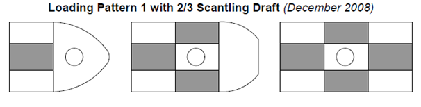

# Guidance for Floating LNG Bunkering Terminal

> OTHER RULES AND GUIDANCE / GC-25-E / 2025 / EN / Guidance

## CHAPTER 5 HULL CONSTRUCTION AND EQUIPMENT

### Section 1 General

#### 101. General

- **1.** The design and construction of the hull, superstructure and deckhouses for units that are new builds or conversions are to be based on the applicable requirements of design considerations of this guide and not specified in this guide are to be in accordance with the Rules.
- **2.** Design Considerations of this Guide reflects the different structural performance and demands expected for an installation transiting and being positioned at a particular site on a long-term basis compared to that of a vessel engaged in unrestricted seagoing service.

#### 102. Load line

- **1.** A mark designating the maximum allowable draught for loading is to be located in easily visible positions on units as deemed appropriate by the Society or in positions easily distinguishable by the person in charge of liquid transfer operations.
- **2.** The designation of load lines is to comply with the requirements given in the “International Convention on Load Lines, 1996 and Protocol of 1988 relating to the International Convention on Load Lines, 1966”, unless specified otherwise by the relevant flag states or coastal states.

#### 103. Loading manual, intact stability information and instruction for operation

- **1.** For the case of units, loading manual and loading instruments are to be installed are to be as specified in **Pt 3, Ch 3, Table 3.3.3** of **Guidance for the Classification of Steel Ships** and **Rules for the Classification of Steel Barges**.
- **2.** In order to avoid the occurrence of unacceptable stress in unit structures corresponding to all cargo and ballast loading conditions and topside modules arrangement and mass and to enable the master or the person-in-charge of loading operations to adjust the loading of cargo and ballast, units are to be provided with loading manuals approved by the Society. Such loading manuals are to at least include the following (1) to (4) items as well as relevant provisions given in **Pt 3, Ch 3** of **Rules for the Classification of Steel Ships**.
  - **(1)** The loading conditions on which the design of a unit has been based, including the permissible limits of longitudinal still water bending moments and still water shearing forces.
  - **(2)** The calculation results of longitudinal still water bending moments and still water shearing forces corresponding to the loading conditions.
- **3.** In addition to **Par 2** above, a loading computer that is capable of readily computing longitudinal still water bending moments and still water shearing forces working on units corresponding to all oil and ballast loading conditions and the operation manual for such a computer is to be provided on board.
- **4.** The capability of the loading computer specified in **Par 3** above to function as specified in the location where it is installed is to be confirmed.
- **5.** A intact stability information booklet approved by the Society is to be provided on board in accordance with **Pt 1, Annex 1-2** of **Rules for the Classification of Steel Ships**. This booklet is to include the results of stability evaluations in representative operating conditions.
- **6.** Instructions for the loading and unloading, and transfer and offloading operations of cargo and ballast are to be provided on board. In cases where mooring systems can be isolated, the procedures for isolating and re-mooring are also to be included.
- **7.** The loading precautions such as maximum cargo loading weight on the deck and equipment loading weight in the operating condition, etc., is to be stated in appropriate documents such as loading manual or stability information.

### Section 2 Survival Capability and Location of Cargo Tanks

#### 201. General

- **1.** Damage stability criteria are to be in accordance with the requirements specified in **Pt 7, Ch 5, Sec 2** of **Rules for the Classification of Steel Ships**. under the environmental conditions specified in **Ch 3**.
- **2.** The arrangements of watertight compartments, watertight bulkheads and closing devices are to be in accordance with the requirements specified in **Rules for the Classification of Steel Ships** and **Rules for the Classification of Steel Barges**.
- **3.** The requirements may be applied appropriately mitigated by the requirements of damage criteria for 2PG or 3G ship.
- **4.** Damage stability criteria is to be applied to the damage assumptions in **Pt 7, Ch 5, Sec 2** of **Rules for the Classification of Steel Ships**, except for bottom damage.

### Section 3 Longitudinal Strength

#### 301. Longitudinal hull girder strength

- **1.** For the longitudinal strength of a terminal, the bending strength, shear strength and buckling strength are to be based on **Pt 3** of **the Rules** basically. However, for barge type unit of 150 m or less, it is to be in accordance with the **Rules for the Classification of Steel Barges**. The total hull girder bending moment, $M _{t}$ is the sum of the maximum still water bending moment for operation on site or in transit combined with the corresponding wave-induced bending moment ($M _{W}$) expected on-site and during transit to the installation site.
- **2.** In lieu of directly calculated wave-induced hull girder vertical bending moments and shear forces, recourse can be made to the use of the Environmental Severity Factor (ESF) approach described of this guide. The ESF approach can be applied to modify the Steel Vessel Rules wave-induced hull girder bending moment and shear force formulas. Depending on the value of the Environmental Severity Factor, $\beta _{ vbm}$, for vertical wave-induced hull girder bending moment (see this Guide), the minimum hull girder section modulus, $Z_{ \min}$ of unit may vary in accordance with the following.

  | $\beta _{ vbm}$ | $Z_{ \min}$ |
  | --- | --- |
  | $\beta _{ vbm}$ < 0.7 | 0.85$Z_{ \min}$ |
  | 0.7 < $\beta _{ vbm}$ < 1.0 | Varies linearly between 0.85$Z_{ \min}$ and $Z_{ \min}$ |
  | $\beta _{ vbm}$ > 1.0 | $Z_{ \min}$ |
  | Where $Z_{ \min}$ = minimum hull girder section modulus as required in **Pt 3,Ch 3, 203.** of **Rules for the Classification of Steel Ships** |   |
- **3.** **Environmental Severity Factor**
  Environmental Severity Factors are adjustment factors for the dynamic components of loads and the expected fatigue damage that account for site-specific conditions as compared to North Atlantic unrestricted service conditions.
  - **(1)** ESFs of the Beta ($\beta _{}$) Type
    This type of ESF is used to introduce a comparison of the severity between the intended environment and a base environment, which is the North Atlantic unrestricted service environment. In the modified formulations, the $\beta _{}$ factors apply only to the dynamic portions of the load components, and the load components that are considered “static” are not affected by the introduction of the $\beta _{}$ factors.
    $\beta = \frac{E _{s}}{E _{u}}$
    where
    $E _{s}$ : most probable extreme value based on the intended site (100 years return period),
    transit (10 years return period), and repair/inspection (1 year return period)
    $E _{u}$ : most probable extreme value base on the North Atlantic environment
    A $\beta _{}$ of 1.0 corresponds to the unrestricted service condition of a seagoing vessel. A value of $\beta _{}$ less than 1.0 indicates a less severe environment than the unrestricted case.
  - **(2)** ESFs of the Alpha ($\alpha$) Type
    This type of ESF compares the fatigue damage between the specified environment and a base environment, which is the North Atlantic environment. This type of ESF is used to adjust the expected fatigue damage induced from the dynamic components due to environmental loadings at the installation’s site. It can be used to assess the fatigue damage accumulated during the historical service either as a trading vessel or as a unit, including both the historical site(s) and historical transit routes.
    $\alpha = \left( \frac{D _{u}}{D _{s}} \right) ^{0.65}$
    where
    $D _{u}$ : annual fatigue damage based on the North Atlantic environment (unrestricted service) at the details of the hull structure
    $D _{s}$ : annual fatigue damage based on a specified environment, for historical routes, histor ical sites, transit and intended site, at the details of the hull structure

### Section 4 Structural Design and Analysis of the Hull

#### 401. Structural design of the hull

- **1.** Regarding the design of hull structures, the respective requirements in **Pt 3** of **Rules for the Classification of Steel Ships** are to be applied with consideration to Sec 1 and Sec 2 of Ch 3 of this Guidance. In this Guideline, the characteristics of a floating LNG bunkering terminal that moors for a long period of time on specific waters need to be considered.
- **2.** When approval has been given by Society, the measurements of hull structural members can be decided according to direct strength calculation. If the measurements obtained through direct strength calculation are larger than those specified in **Pt 3** of **Rules for the Classification of Steel Ships**, the measurements is to be decided as the calculated results.
- **3.** For direct strength calculation according to the provisions in paragraph 1 above, data necessary in the calculation and the result shall be submitted to Society.

#### 402. Direct strength calculation

- **1.** Direct strength calculation is divided into cargo hold structural analysis and frontal structural analysis. For the cargo hold structural analysis, the related requirements in Paragraph 7, **Annex 3-2 III, Pt 3** of **Rules for the Classification of Steel Ships** is to be applied and, for the frontal structural analysis, the requirements in **Annex 3-2 II, Part 3** of **Rules for the Classification of Steel Ships** is to be applied.
- **2.** To decide the measurements of hull structural members through cargo hold structural analysis, the scope and procedures can be agreed on through consultation with Korean Register.
  In case the size of cargo hold model division by factor does not sufficiently show the areas subject to high stress, the areas shall be reviewed through division with detailed factors.
- **3.** As for the wave load applied to frontal structural analysis, a probability value equivalent to the 100-year reproduction cycle for terminal operating waters shall be used.
- **4.** In case mooring system is included in frontal structural analysis, the weight and dynamic load of mooring line shall be considered. The dynamic load of mooring line shall be compared with the result of mooring analysis in order to check that it is conservatively reflected in the frontal structural analysis.
- **5.** The results of direct strength calculation shall not be used for the purpose of reducing the measurements of structural members.

#### 403. Fatigue analysis

- **1.** The fatigue strength analysis target members shall be decided considering the style of hull structure and criticality of structural members. As for the target members, those subject to the problems of water tightness in compartments as a result of cracking or those subject to the probability of fatigue cracking as a result of the concentration of stress due to geometric discontinuation of the structure shall be extensively selected.
- **2.** For terminal fatigue analysis, temporary fatigue analysis, cargo hold fatigue analysis and frontal fatigue analysis shall be conducted according to **Annex 3-3, Pt 3** of **Rules for the Classification of Steel Ships**. However, if deemed appropriate by Society, fatigue strength can be examined using other methods.

#### 404. Cargo Containment system

For design and analysis of cargo containment system, the regulations in **Pt 7, Ch 5, Sec 4** of **Rules for the Classification of Steel Ships** shall be adhered to.

#### 405. Sloshing load evaluation/cargo containment system strength evaluation

For the evaluation of sloshing load generated in the cargo hold and structural safety of carbon containment system, the respective requirements in **Guidance for Assessment of Sloshing Load and Structural Strength of Cargo Containment System** can be applied.

#### 406. Position mooring/hull interface structural analysis

For the terminal, yield strength, buckling strength and fatigue strength of the hull and positioning system interface structures shall be examined through finite element analysis. For yield and buckling strength analysis, the provisions in **Annex 3-2 III**, Paragraph 7, **Pt 3** of **Rules for the Classification of Steel Ships** can be applied. For fatigue strength, those specified in **Annex 3-3, Pt 3** of **Rules for the Classification of Steel Ships** can be adhered to. However, if deemed appropriate by Society, interface structure strength can be reviewed using other methods.

- **1.** **Turret or SPM type mooring system, external to the terminal’s hull**
  - **(1)** Fore end mooring
    The minimum extent of the model is from the fore end of the installation, including the turret structure and its attachment to the hull, to a transverse plane after the aft end of the foremost cargo tank in the installation. The model can be considered fixed at the aft end of the model.
  - **(2)** Aft end mooring
    The minimum extent of the model is from the aft end of the installation and including the turret structure and its attachment to the hull structure to a transverse plane forward of the fore end of the aft most cargo tank in the hull. The model can be considered fixed at the fore end of the model.
- **2.** **Mooring system internal to the Installation Hull (Turret Moored)**
  - **(1)** Fore end Turret
    The minimum extent of the FEM model is from the aft end of the installation and including the turret structure, its attachment to the hull structure to a transverse plane forward of the fore end of the aft most cargo tank in the hull. The model can be considered fixed at the fore end of the model.
  - **(2)** Midship Turret
    The range of FEM model is from the transverse bulkhead at the back end of rear cargo hold that is located near the cargo head including turret to the transverse bulkhead at the front end of the first cargo hold.
  - **(3)** Load State
    As the load conditions, the two load states below, which exert the worst impact on hull structures, shall be included.
    
    Fig 5.1 Loading Pattern with 2/3 Scanting Draft#imgID-8Fig 5.2 Loading Pattern with Scanting Draft
    - **(A)** Load state where a full-load tank located close to the cargo hold including a turret is applied with maximum internal pressure and another empty tank is applied with minimum external pressure (Refer to **Fig 5.1**)
    - **(B)** Load state where an empty tank located close to the cargo hold including a turret and of another full-load tank are applied with maximum external pressure (Refer to **Fig. 5.2**)
- **3.** **Spread moored installations**
  The local foundation structure and installation structure are to be checked for the given mooring loads and hull structure loads, where applicable, using an appropriate FEM analysis.

#### 407. Other Applications

For other matters concerning hull structure design and analysis is to be in accordance with the requirements specified in Guidance for Floating Production Units.

### Section 5 Hull Arrangements

#### 501. Application

The applicable requirements for hull arrangements is to be in accordance with **Pt 7, Ch 5, Sec 3** of **the Rules**. However, the requirements in **Pt 7, Ch 5, 301. 1** (2) of **the Rules** may not be applied.

### Section 6 Hull Equipment

#### 601. Mooring systems for temporary mooring

- **1.** The mooring systems for temporary mooring specified in **Rules for Classification of Mobile Offshore Drilling Units** need not be fitted. In cases where the Society deems such necessary in consideration of the form of unit operations, the mooring systems for temporary mooring specified in **Rules for Classification of Mobile Offshore Drilling Units** are required.
- **2.** In the case of single-point mooring systems to moor receiving vessels, the chafing chain used ends for mooring lines are to be fitted and are to comply with the following:
  - **(1)** The chafing chain is to be the offshore chain specified in **Pt 4** of **Rules for the Classification of Steel Ships**, and the chain standard is short lengths (approximately 8 $\mathrm{m} ^{}$) of 76 $\mathrm{mm}$ diameter.
  - **(2)** The arrangement of the end connections of chafing chains is to comply with any standards deemed appropriate by the Society.
  - **(3)** Documented evidence of satisfactory tests of similar diameter mooring chains in the prior six month period may be used in lieu of breaking tests subject to agreement with the Society.
- **3.** Equipment used in mooring systems to moor at jetty etc. in order to install plant or mooring equipment for the mooring support ships and shuttle tankers, except for the equipment specified in **Par 2** above, is to be as deemed appropriate by the Society.

#### 602. Guardrails

- **1.** The guardrails or bulwarks specified in **Pt 4** of **Rules for the Classification of Steel Ships** are to be provided on weather decks. In cases where guardrails will become hindrances to the taking-off and landing of helicopters, means to prevent falling such as wire nets, etc. are to be provided.
- **2.** Freeing arrangements, cargo ports and other similar openings, side scuttles, rectangular windows, ventilators and gangways are to be in accordance with the requirements specified in **Rules for the Classification of Steel Ships** and **Rules for the Classification of Steel Barges**, unless specified otherwise by the relevant flag states or coastal states.
- **3.** Ladders, steps, etc. are to be provided inside compartments for safety examinations as deemed appropriate by the Society.

#### 603. Fenders

- **1.** Suitable fenders fore contact with the gunwales of other ships such as support ships, tug boats, shuttle tankers, etc. are to be provided.
- **2.** The most common fender used for side-by-side transfer operations is the high pressure pneumatic type. These fenders are generally favoured for their robustness and longevity. The low pressure pneumatic type have been found useful for emergency situations where ease of transport is a first priority. However, they can have the disadvantage of much shorter life in service. Foam filled fenders are not commonly used but owing to lighter construction they can have advantages when used as secondary fenders.
- **3.** Fender size will also be dictated by the freeboard of the ships, and the diameter of each floating fender should be no more than half the minimum freeboard of the smaller ship.
- **4.** Fenders used in side-by-side transfer operations offshore are divided into two categories:
  - **(1)** **Primary fenders** which are positioned along the parallel body of the ship to afford the maximum possible protection during mooring and unmooring.
  - **(2)** **Secondary fenders** which may be used to protect bow and stern plating from inadvertent contact during mooring and unmooring.
- **5.** For the details, Ship to Ship Transfer Guide(Liquefied Gases) issued by OCIMF is to be referred. 
