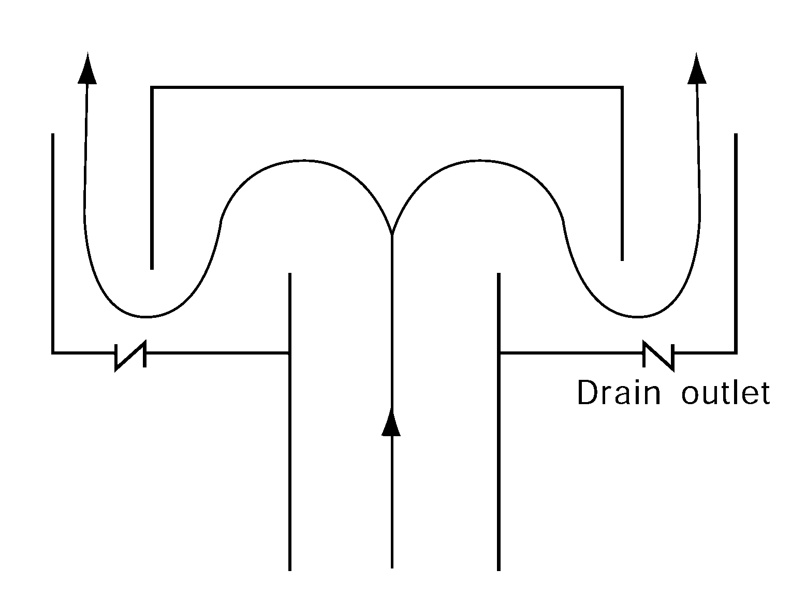

# Guidance for Floating LNG Bunkering Terminal

> OTHER RULES AND GUIDANCE / GC-25-E / 2025 / EN / Guidance

## CHAPTER 9 VENTILATION

### Section 1 General

#### 101. General

- **1.** Any ducting used for the ventilation of hazardous spaces is to be separate from that used for the ventilation of non-hazardous spaces. The ventilation is to function at all temperatures and environmental conditions the ship will be operating in.
- **2.** Electric motors for ventilation fans are not to be located in ventilation ducts for hazardous spaces unless the motors are certified for the same hazard zone as the space served.
- **3.** Ventilation systems required to avoid any gas accumulation are to consist of independent fans, each of sufficient capacity, unless otherwise specified in this Guidance.
- **4.** Air inlets for hazardous enclosed spaces are to be taken from areas that, in the absence of the considered inlet, would be non-hazardous. Air inlets for non-hazardous enclosed spaces are to be taken from non-hazardous areas at least 1.5 $\mathrm{m}$ away from the boundaries of any hazardous area. Where the inlet duct passes through a more hazardous space, the duct is to be gas-tight and have over-pressure relative to this space.
- **5.** Air outlets from non-hazardous spaces are to be located outside hazardous areas.
- **6.** Air outlets from hazardous enclosed spaces are to be located in an open area that, in the absence of the considered outlet, would be of the same or lesser hazard than the ventilated space.
- **7.** The required capacity of the ventilation plant is normally based on the total volume of the room. An increase in required ventilation capacity may be necessary for rooms having a complicated form.
- **8.** Non-hazardous spaces with entry openings to a hazardous area are to be arranged with an airlock and be maintained at overpressure relative to the external hazardous area. The overpressure ventilation is to be arranged according to the following:
  - **(1)** During initial start-up or after loss of overpressure ventilation, before energizing any electrical installations not certified safe for the space in the absence of pressurization, it is to be required to:
    - **(A)** proceed with purging (at least 5 air changes) or confirm by measurements that the space is non-hazardous; and
    - **(B)** pressurize the space.
  - **(2)** Operation of the overpressure ventilation is to be monitored and in the event of failure of the overpressure ventilation:
    - **(A)** an audible and visual alarm is to be given at a manned location; and
    - **(B)** if overpressure cannot be immediately restored, automatic or programmed disconnection of electrical installations according to a recognized standard(Refer to **IEC 60092-502, table 5**) is to be required.
- **9.** Non-hazardous spaces with entry openings to a hazardous enclosed space are to be arranged with an airlock and the hazardous space is to be maintained at underpressure relative to the non-hazardous space. Operation of the extraction ventilation in the hazardous space is to be monitored and in the event of failure of the extraction ventilation:
  - **(1)** an audible and visual alarm is to be given at a manned location; and
  - **(2)** if underpressure cannot be immediately restored, automatic or programmed, disconnection of electrical installations according to a recognized standard(Refer to **IEC 60092-502, table 5**) in the non-hazardous space is to be required.

#### 102. Bunkering manifolds

Bunkering manifolds that are not located on open deck are to be suitably ventilated to ensure that any vapor being released during bunkering operations will be removed outside. If the natural ventilation is not sufficient, mechanical ventilation is to be provided in accordance with the risk assessment required by **201.**.

### Section 2 Mechanical Ventilation in the Cargo Area

#### 201. Spaces required to be entered during normal cargo handling operations

- **1.** Electric motor rooms, cargo compressor and pump-rooms, spaces containing cargo handling equipment and other enclosed spaces where cargo vapors may accumulate are to be fitted with fixed artificial ventilation systems capable of being controlled from outside such spaces. The ventilation is to be run continuously to prevent the accumulation of toxic and/or flammable vapors, with a means of monitoring acceptable to the Society to be provided. A warning notice requiring the use of such ventilation prior to entering is to be placed outside the compartment.
- **2.** Artificial ventilation inlets and outlets are to be arranged to ensure sufficient air movement through the space to avoid accumulation of flammable, toxic or asphyxiant vapors, and to ensure a safe working environment.
- **3.** The ventilation system is to have a capacity of not less than 30 changes of air per hour, based upon the total volume of the space. As an exception, non-hazardous cargo control rooms may have eight changes of air per hour.
- **4.** Where a space has an opening into an adjacent more hazardous space or area, it is to be maintained at an overpressure. It may be made into a less hazardous space or non-hazardous space by overpressure protection in accordance with recognized standards.
- **5.** Ventilation ducts, air intakes and exhaust outlets serving artificial ventilation systems are to be positioned in accordance with recognized standards.(eg., IEC 60092-502). Air inlets are to be located in non-hazardous areas and the construction of ventilation exhaust ducts is, for example, to be as shown in Fig **8.1** of the Guidance.
  
  Fig 8.1 The consruction ofventilation exhaust ducts
- **6.** Ventilation ducts serving hazardous areas are not to be led through accommodation, service and machinery spaces or control stations, except as allowed in **Pt 7, Ch 5,** **Sec 16** of **Rules for the Classification of Steel Ships**.
- **7.** Electric motors' driving fans are to be placed outside the ventilation ducts that may contain flammable vapors. Ventilation fans are not to produce a source of ignition in either the ventilated space or the ventilation system associated with the space. For hazardous areas, ventilation fans and ducts, adjacent to the fans, are to be of non-sparking construction, as defined below: **【See Guidance】**
  - **(1)** impellers or housing of non-metallic construction, with due regard being paid to the elimination of static electricity
  - **(2)** impellers and housing of non-ferrous materials
  - **(3)** impellers and housing of austenitic stainless steel
  - **(4)** ferrous impellers and housing with design tip clearance of not less than 13 mm.
    Any combination of an aluminium or magnesium alloy fixed or rotating component and a ferrous fixed or rotating component, regardless of tip clearance, is considered a sparking hazard and is not to be used in these places.
  - **(5)** The ventilation fans for motor rooms where electric motors to drive cargo compressors and cargo pumps are installed are to be complied following requirements (A) and (B) :
    - **(A)** To have a ventilation capacity of not less then 30 air changes of the total volume of the motor room per hour.
    - **(B)** Electric motors driving ventilation fans are to conform to the relevant requirements in **Pt 7, Ch 5, Sec 10** of **Rules for the Classification of Steel Ships** depending on the location of motors, and in addition, to the requirements for exterior-mounted type specified in **Pt 8, Ch 12, 201. 4** (2) of **Rules for the Classification of Steel Ships** when motors are installed in exposed spaces.
  - **(5)** Where electric motors for ventilation fans are certified for the same hazard zone as the space served, the motors may be located in ventilation ducts for hazardous space.
- **8.** Where fans are required by this Section, full required ventilation capacity for each space are to be available after failure of any single fan, or spare parts are to be provided comprising a motor, starter spares and complete rotating element, including bearings of each type.
- **9.** Protection screens of not more than 13 mm square mesh are to be fitted to outside openings of ventilation ducts.
- **10.** Where spaces are protected by pressurization, the ventilation is to be designed and installed in accordance with recognized standards.(eg., IEC 60092-502)

#### 202. Spaces not normally entered

- **1.** Enclosed spaces where cargo vapors may accumulate are to be capable of being ventilated to ensure a safe environment when entry into them is necessary. This is to be capable of being achieved without the need for prior entry.
- **2.** For permanent installations, the capacity of 8 air changes per hour is to be provided and for portable systems, the capacity of 16 air changes per hour.
- **3.** Fans or blowers are to be clear of personnel access openings, and are to comply with **Pt 7, Ch 5, 1201. 7** of **Rules for the Classification of Steel Ships**.
- **4.** For cargo hold spaces, natural ventilation alone is not acceptable.
