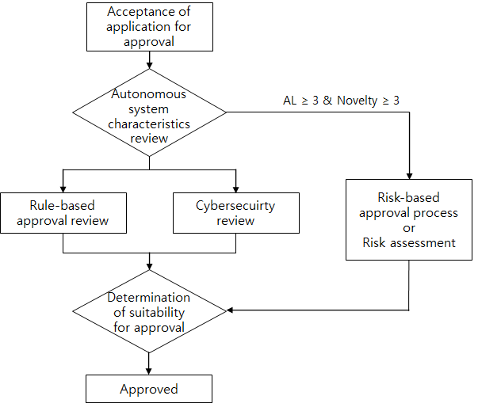

# Guidance for Autonomous Ships

> OTHER RULES AND GUIDANCE / GC-28-E / 2025 / EN / Guidance

## CHAPTER 2 CLASS SURVEY (2024)

### Section 1 General

#### 101. Approval procedure of autonomous ships

- **1.** The general approval procedure of autonomous ships is shown in **Fig 2.1**.
  
  Fig 2.1 The general approval procedure for autonomous ships
- **2.** Autonomous level **AL1** or **AL2** ships whose decision-making and execution is performed by the onboard operator are to comply with the existing classification approval procedure.
- **3.** The risk-based ship design approval procedure or risk assessment may be accepted for new concept designs that are difficult to apply the Classification Technical Rules, such as ships with an autonomous level of AL3 or higher, where decision-making and execution are performed by the system.
- **4.** **General approval process**
  - **(1)** Review of characteristics of autonomous system
    - **(A)** The design data of the autonomous system installed on the target ship is to be submitted for approval.
    - **(B)** Based on the submitted design data, the target ship's autonomous system is specifically identified.
    - **(C)** Review the adequacy of the requested autonomous level for the autonomous system.
    - **(D)** In the case of autonomous level **AL3** or higher, identify the degree of novelty in Table 3.1 of the Guidance for Approval of Risk-based Ship Design corresponding to the identified autonomous system.
  - **(2)** Identification of applicable rules for autonomous systems
    Identify the rules applicable to the target ship's autonomous system.
  - **(3)** Review of approval for autonomous system
    - **(A)** Review the suitability of approval for the target ship's autonomous system according to the identified rules.
    - **(B)** Review cyber security approval for the target ship's autonomous system.
    - **(C)** If the autonomous level is AL3 or higher and the degree of novelty is 3 or higher, the risk-based approval procedure or risk assessment is carried out for the target ship's autonomous system.
  - **(4)** Approval decision for the autonomous system
    As a result of the approval review for each field, if it is deemed appropriate, the approval of the autonomous system is completed. If it is judged to be inappropriate, the approval is rejected and the design is requested to be supplemented.

#### 102. Drawings and data to be submitted

The target vessel shall submit the drawings and data below to the Society. Additionally, if the Society deems it necessary, the Society may request the submission of additional drawings and data other than those specified below.

- **1.** **For approval**
  - **(1)** Electrical wiring diagram and arrangement
  - **(2)** On-board test procedure
  - **(3)** Sea trial procedure
- **2.** **For reference**
  - **(1)** Detailed explanation data on the autonomous navigation system
  - **(2)** Equipment operation manual
  - **(3)** Safety management procedures (including emergency response manual)
  - **(4)** Software quality management data
  - **(5)** Cyber security data
  - **(6)** Data explaining that even if the autonomous navigation system is stopped, the operation of existing navigation equipment (conventional equipment) is not affected.
  - **(7)** Risk assessment report (AL3 or higher)
  - **(8)** Matters identified in the risk assessment that need to be confirmed on board the ship (if necessary)

### Section 2 Classification Survey

#### 201. Classification Survey during Construction

- **1.** **General**
  - **(1)** Inspection of the installation and operation of the relevant systems shall be carried out on board the ship.
  - **(2)** During installation and operational inspection, the functionality of the system shall be verified in the presence of an surveyor.
  - **(3)** Upon completion of installation and operational inspection, the ship and associated systems may be assigned the applicable class notation.
  - **(4)** An autonomous systems composed of several devices are to be tested for effectiveness by performing an integration test after completion of the configuration. For example, in the case of a data acquisition and analysis system that is integrated with various sensors, it is necessary to verify that the entire system is working properly by performing a completion test on the integrated system as well as individual tests on each sensor.
- **2.** **Installation survey**
  It is to be confirmed that it is working as close to actual as possible after installation on board. And it is to be confirmed that a predefined safety system is working effectively in case of system failure or danger.
  - **(1)** Check sensor failure alarms and status for data collection and analysis.
  - **(2)** For AL3 or higher, check the interface between the data collection and analysis system and the autonomous navigation system.
    - **(A)** Hardware and software interface
    - **(B)** Individual failure alarm and status monitoring
  - **(3)** For AL3 or higher, check the inspection items according to the risk assessment report.
  - **(4)** For AL3 or higher, check whether the operation manual is provided at the installation location of the autonomous navigation system.
  - **(5)** For AL3 or higher, through the interworking test between the autonomous systems installed in the ship, it is to be check whether the data transfer between the systems and the performance of the functions are correct. This test may be included in the sea trial.
- **3.** **Sea trial**
  For AL3 or higher, it is to verify that the system is operating effectively for the autonomous ships operating within the operation scope and risk presented in the operation plan through the sea trial.
  - **(1)** Check route designation and route following function.
  - **(2)** Check collision avoidance function.
    - **(A)** Check whether the collision avoidance function is performed to suit the collision avoidance (Head-on/Crossing) scenario.
  - **(3)** Check how to respond in an emergency situation
    - **(A)** When an abnormal condition affecting navigation is identified, alarms and related information are communicated to the navigator and control is transferred to the navigator.
    - **(B)** Provides redundant emergency switching means considering single failure of emergency switching means.
    - **(C)** Check whether the means and procedures for emergency switching are reflected in the safety management procedures.
    - **(D)** Check that even if the autonomous navigation system is stopped, the operation of existing navigation equipment is not affected.
    - **(E)** In accordance with the safety management procedures(emergency response manual), check that the autonomous navigation system is effectively stopped and that existing navigation equipment, excluding the autonomous navigation system, operates normally.
  - **(4)** Check the inspection items according to the risk assessment report.

### Section 3 Periodical Survey for Maintaining Registration

#### 301. Annual Survey

- **1.** Check sensor failure alarms and status for data collection and analysis.
- **2.** For AL3 or higher, check the interface between the data collection and analysis system and the autonomous navigation system.
- **3.** For AL3 or higher, check whether the operation manual is provided at the installation location.

#### 302. Special Survey

In addition to all the requirements for Annual Survey, the following items are to be surveyed:

- **1.** For AL3 or higher, check the following items by checking the ship's operation records. However, if the surveyor deems it necessary, check may be requested through actual operation of the ship.
  - **(1)** Check route designation and route following function
  - **(2)** Check collision avoidance function
  - **(3)** Check emergency response 
