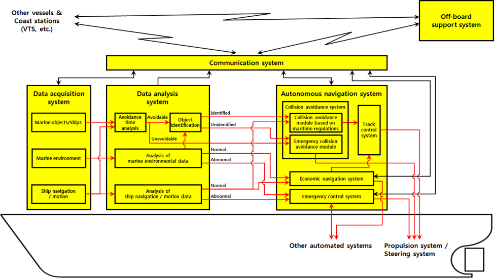
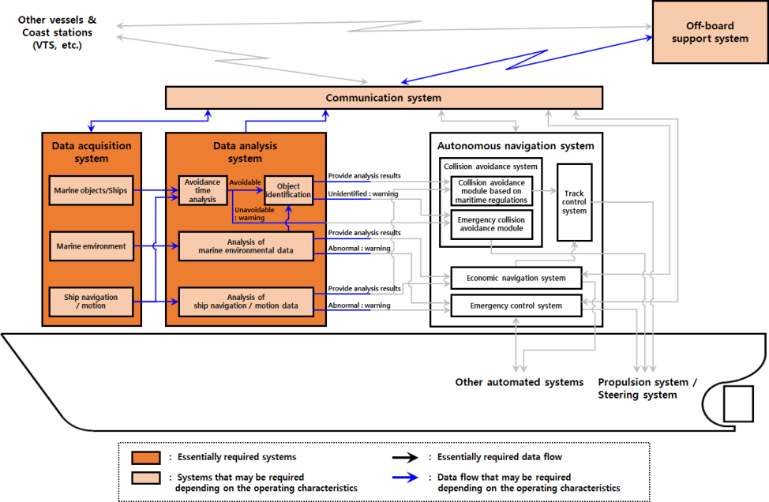
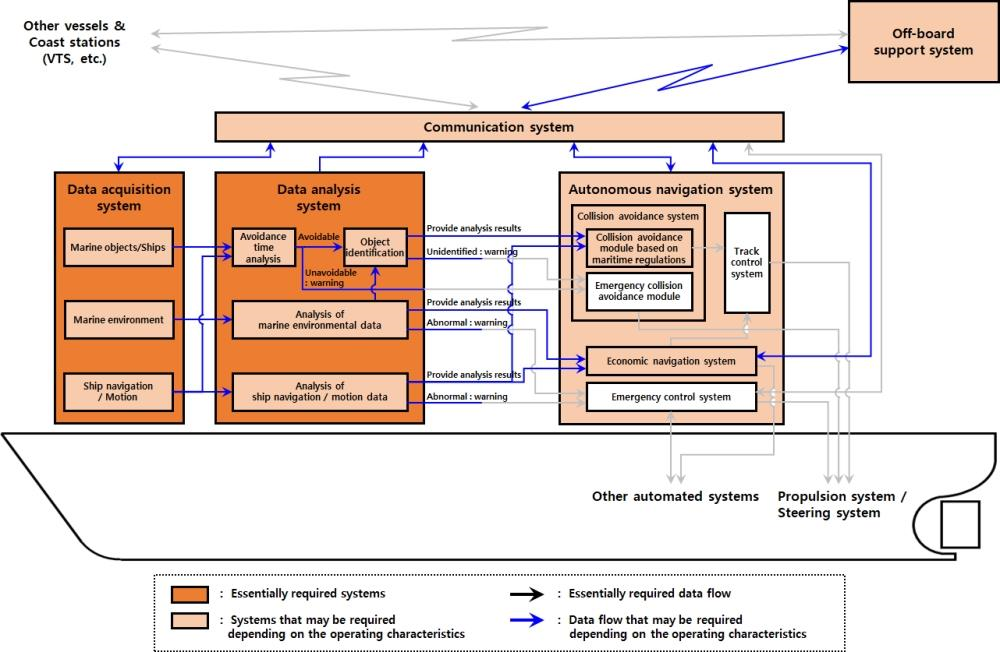
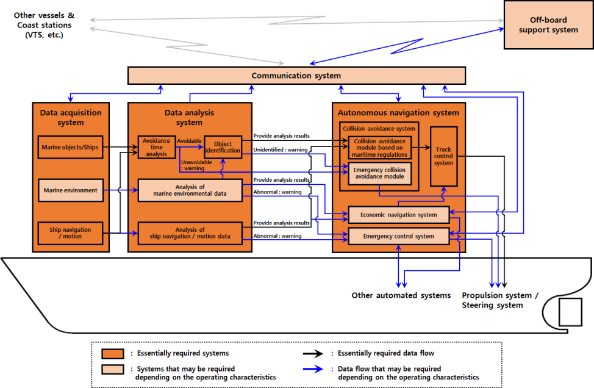
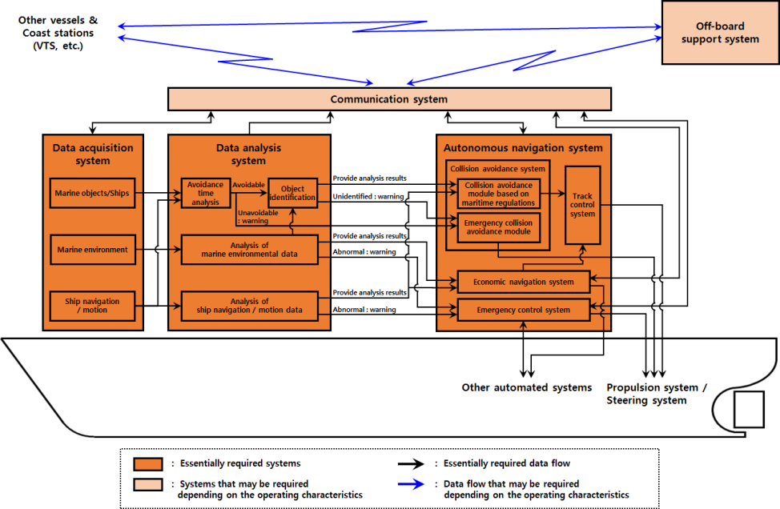
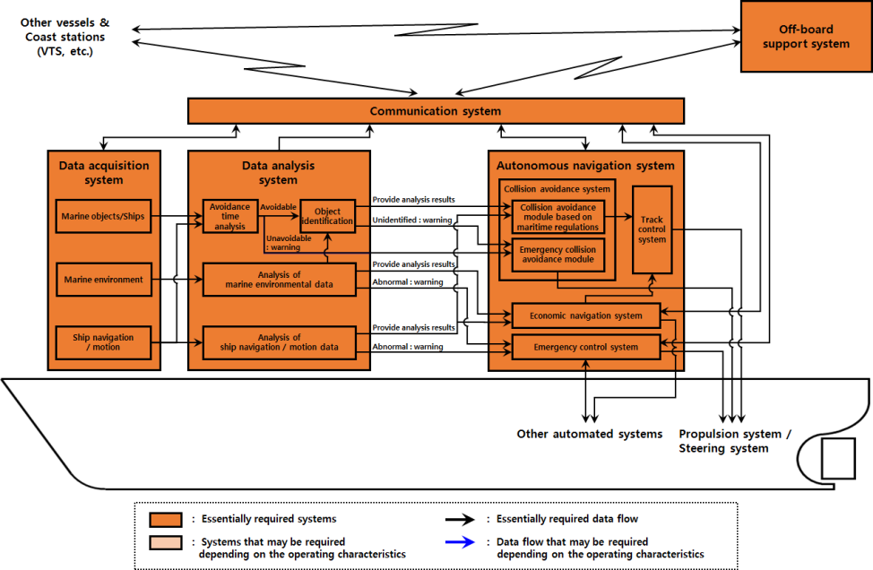

# Guidance for Autonomous Ships

> OTHER RULES AND GUIDANCE / GC-28-E / 2025 / EN / Guidance

## CHAPTER 3 AUTONOMOUS SYSTEMS AND AUTONOMOUS SHIPS

### Section 1 Configuration and Function of Autonomous Systems

#### 101. Configuration of autonomous systems

- **1.** The configuration of autonomous system presented in this guidance is shown in **Fig 3.1**.
  
  Fig 3.1 General configuration of autonomous system

#### 102. Function of autonomous systems

- **1.** **Data acquisition and analysis system**
  - **(1)** It is a system for recognizing the external situation of ships related to marine objects/ships and marine environment and the internal situation related to ship navigation/motion. It collects data from a number of data sources and integrates / analyzes them to provide operator or autonomous navigation system with results that can aid operational decision-making. The main functions of this system are as follows, but not limited to: *(2024)*
    - **(A)** After integrating and analyzing the external situation data collected through the marine objects/ships detection sensor module, it confirms the avoidance point, identifies the marine object or ship, then transmits the object identification result to the autonomous navigation system deliver the warning notification and relevant information to the operator.
    - **(B)** It measures ship's navigation and movement information such as ship's position, direction, speed, etc., and analyzes the operation/motion status of the ship and delivers the sorted information to the autonomous navigation system (If the system is equipped with an economic ship routing system, the information is transmitted to the autonomous navigation system and the economic navigation system).
    - **(C)** It integrates and analyzes marine environmental (weather, wave height, etc.) data collected through the marine environment detection sensor module or external communication means and delivers the analysis results to the economic navigation system.
  - **(2)** The subsystems of the data acquisition and analysis system can be composed as follows. *(2024)*
    - **(A)** Marine objects/Ships detection sensor module (AIS, ARPA, radar, lidar, daylight camera, infrared camera, etc.)
    - **(B)** Marine environmental detection sensor module (weather observation sensor, wave height sensor, echo sounding device, etc.)
    - **(C)** Position and navigation sensors (GNSS, gyro compass, etc.)
    - **(D)** Avoidance point analysis module
    - **(E)** Object identification module
    - **(F)** Marine environmental data integration/analysis module
    - **(G)** Ship navigation/motion data integration/analysis module
- **2.** **Autonomous navigation system**
  - **(1)** It is a system that establishes route plan and steering plan for economical navigation and collision/grounding prevention considering the internal and external situation of the ship, and controls the propulsion device and steering device of the ship in accordance with the established route plan and steering plan and performs the following functions.
    - **(A)** Establishment of a collision avoidance path according to the maritime regulations based on the analysis results (avoidance time, avoidance object, ship navigation/motion status) through data acquisition and analysis system
    - **(B)** Manage predefined navigation plans and update them in real time as needed
    - **(C)** Control of propulsion and steering system to ensure safe and efficient navigation according to predefined navigation plan considering traffic condition (Traffic and marine environmental conditions if equipped with an economic navigation system)
    - **(D)** For AL4 or higher, alert the operator if the avoidance object is not identified in the data analysis system and avoid risk within the ship’s operation scope if there is no response from the operator to the collision avoidance threshold according to the maritime regulations when related information is transmitted *(2024)*
    - **(E)** Avoid dangerous situation within the operation scope of the ship when an emergency danger situation (identification of a nearby colliding object) occurs
    - **(F)** Establishing the optimal route for economic operation considering the marine environment and the ship’s navigation and motion status
    - **(G)** Ship control according to predefined procedures when detecting unusual movements
  - **(2)** The subsystems of the autonomous navigation system can be composed as follows. *(2024)*
    - **(A)** Collision avoidance system
    - **(B)** Track control system
    - **(C)** Economic navigation system
    - **(D)** Emergency control system
- **3.** **Communication system**
  - **(1)** It is a system involved in communication between information objects and performs the following functions.
    - **(A)** Transfer and share data between the ship and other ships
    - **(B)** Transfer and share data between the ship and coast stations such as VTS
    - **(C)** Transfer and share data between the ship and off-board support system
    - **(D)** Other distress communication
  - **(2)** The subsystem of the communication system may be configured as follows.
    - **(A)** LOS (line of sight) communication system
    - **(B)** Wireless communication system (VHF, UHF)
    - **(C)** Satellite communication system
    - **(D)** Short-range wireless communication system (W-LAN)
- **4.** **Off-board support system**
  - **(1)** It is a system that monitors and controls the navigation information of autonomous ships and performs the following functions.
    - **(A)** Planning a voyage
    - **(B)** Autonomous system and navigation information monitoring
    - **(C)** Direct control of autonomous ship (if necessary)
  - **(2)** The subsystems of the off-board support system can be composed as follows. *(2024)*
    - **(A)** Mission control computer
    - **(B)** Operation Control Panel
    - **(C)** Interface system

#### 103. System configuration according to autonomy level

The autonomous systems required according to autonomy level of autonomous ship are as follows.

- **1.** **Autonomy level 1 (AL 1)**
  - **(1)** Definition of autonomy level
    - **(A)** Data acquisition and analysis: System and Operator
    - **(B)** Decision-making: Operator
    - **(C)** Action: Operator
  - **(2)** Ship characteristics: Ships equipped with a system for collecting data from multiple sources and integrating/analyzing them
  - **(3)** System configuration
    
    Fig 3.2 Autonomous system required for the ship of autonomy level 1 (AL1)
    - **(A)** Essentially required systems: Data acquisition and analysis system (systems with one or more of the functions specified in **102. 1** (1) (A) to (C))
    - **(B)** Systems that may be required depending on operating characteristics
      - **(a)** Communication systems
      - **(b)** Off-board support systems
- **2.** **Autonomy level 2 (AL 2)**
  - **(1)** Definition of autonomy level
    - **(A)** Data acquisition and analysis: System
    - **(B)** Decision-making: Operator (system support)
    - **(C)** Action: Operator
  - **(2)** Ship characteristics: Ships equipped with a system to support operational decision-making within normal operating scenarios
  - **(3)** System configuration
    
    Fig 3.3 Autonomous system required for the ship of autonomy level 2 (AL2)
    - **(A)** Essentially required systems
      - **(a)** Data acquisition and analysis system (system supporting autonomous navigation system functions)
      - **(b)** Decision-making support system *(2021)*
    - **(B)** Systems that may be required depending on operating characteristics
      - **(a)** Communication systems
      - **(b)** Off-board support systems
      - **(c)** Autonomous navigation system *(2021)*
- **3.** **Autonomy level 3 (AL 3)**
  - **(1)** Definition of autonomy level
    - **(A)** Data acquisition and analysis: System
    - **(B)** Decision-making: System (normal operation scenario only / operator verification required)
    - **(C)** Action: System (normal operation scenario only)
  - **(2)** Ship characteristics: Ships equipped with a system to support operational decision-making within normal operating scenarios (however, operator confirmation is required for decision-making, and if operator confirmation is not performed, the decision is withdrawn.)
  - **(3)** System configuration
    
    Fig 3.4 Autonomous system required for the ship of autonomy level 3 (AL 3)
    - **(A)** Essentially required systems
      - **(a)** Data acquisition system
      - **(i)** Marine objects/ships detection sensor module
        - **(ii)** Position and navigation sensor
      - **(b)** Data analysis system
      - **(i)** Avoidance point analysis module
        - **(ii)** Avoidance object identification module
        - **(iii)** Ship navigation/motion data integration/analysis module
      - **(c)** Autonomous navigation system
      - **(i)** Collision avoidance module in accordance with maritime regulations
        - **(ii)** Track control system
    - **(B)** Systems that may be required depending on operating characteristics
      - **(a)** Communication systems
      - **(b)** Off-board support systems
- **4.** **Autonomy level 4 (AL 4)**
  - **(1)** Definition of autonomy level
    - **(A)** Data acquisition and analysis: System
    - **(B)** Decision-making: System (operator monitoring)
    - **(C)** Action: System (operator monitoring)
  - **(2)** Ship characteristics: Ships capable of autonomous operation under the conditions of operator monitoring (System-level response to abnormal operating scenarios (system failure, etc.): At the autonomous level, there is no need for boarding personnel, but a minimum number of people for monitoring/control can be boarded if there is no adequate communication system to monitor all decision making and execution information and to support remote control if necessary.)
  - **(3)** System configuration
    © Autonomous navigation system
    
    Fig 3.5 Autonomous system required for the ship of autonomy level 4 (AL 4)
    - **(A)** Essentially required systems
      - **(a)** Data acquisition system
      - **(i)** Marine objects/ships detection sensor module
        - **(ii)** Marine environment detection sensor module
        - **(iii)** Position and navigation sensor
      - **(b)** Data analysis system
      - **(i)** Avoidance point analysis module
        - **(ii)** Avoidance object identification module
        - **(iii)** Marine environment data integration/analysis module
        - **(iv)** Ship navigation/motion data integration/analysis module
      - **(i)** Collision avoidance module in accordance with maritime regulations
        - **(ii)** Emergency collision avoidance module
        - **(iii)** Track control system
        - **(iv)** Economic navigation system
      - **(v)** Emergency control system
    - **(B)** Systems that may be required depending on operating characteristics
      - **(a)** Communication systems
      - **(b)** Off-board support systems
- **5.** **Autonomy level 5 (AL 5)**
  - **(1)** Definition of autonomy level
    - **(A)** Data acquisition and analysis: System
    - **(B)** Decision-making: System
    - **(C)** Action: System
  - **(2)** Ship characteristics: Ships capable of autonomous operation (Operator in off-board support system monitors emergency situations)
  - **(3)** System configuration
    
    Fig 3.6 Autonomous system required for the ship of autonomy level 5 (AL 5)
    - **(A)** Essentially required systems
      - **(a)** Data acquisition system
      - **(i)** Marine objects/ships detection sensor module
        - **(ii)** Marine environment detection sensor module
        - **(iii)** Position and navigation sensor
      - **(b)** Data analysis system
      - **(i)** Avoidance point analysis module
        - **(ii)** Avoidance object identification module
        - **(iii)** Marine environment data integration/analysis module
        - **(iv)** Ship navigation/motion data integration/analysis module
      - **(c)** Autonomous navigation system
      - **(i)** Collision avoidance module in accordance with maritime regulations
        - **(ii)** Emergency collision avoidance module
        - **(iii)** Track control system
        - **(iv)** Economic navigation system
      - **(v)** Emergency control system
      - **(d)** Communication systems
      - **(e)** Off-board support systems

### Section 2 Requirements for Autonomous Systems and Autonomous Ships

#### 201. Basic requirements for autonomous ships

- **1.** Autonomous ships shall be operated within the safe operation scope specified beforehand, and system reliability and safety shall be ensured within the range.
  - **(1)** An autonomous system shall be designed with all safety hazards reasonably predictable for safe operation.
  - **(2)** It shall be designed to cope with major defects or safety-related emergencies and shall be designed in such a way that the effects on a single fault are eliminated.
- **2.** The responsibility for the autonomous ship operation procedures shall be clarified and properly reviewed and monitored.
  - **(1)** The responsibility for the operator shall be specified and officially assigned.
  - **(2)** When transferring control of autonomous ships to internal or external personnel, the relevant responsibilities shall be clearly allocated and officially assigned in accordance with the procedures specified beforehand.
- **3.** A autonomous ship shall be equipped with a voyage data recorder(VDR) that stores data on the ship's internal and external conditions.
  - **(1)** The stored data may include the following information.
    - **(A)** Internal system status monitoring (fault indication, subsystem operation status, etc.)
    - **(B)** Data communication with external system
    - **(C)** Situation recognition sensor data (radar, observation camera data, etc.)
    - **(D)** Decision-making (avoidance action, speed change, etc.)
    - **(E)** Performed functions (activated system, activated warning signal, etc.)
  - **(2)** To save memory, data storage in VDR can be adjusted as a circular storage method that saves recent data while sequentially deleting old files. When using the circular storage method, the VDR shall be able to store the data record of sufficient time that the post-operation analysis is not problematic even if the old data is sequentially deleted, and the accident data shall not be deleted.
- **4.** Ships on which persons are on board shall comply with all codes and conventions involved.
- **5.** It shall comply with all relevant provisions of the International Convention adopted by IMO or local laws. If necessary, the exemptions or equivalent solutions shall be expressly approved by the Administration.

#### 202. Basic requirements for autonomous systems

Each autonomous system shall perform the functions described in **102.**, and the following basic requirements shall be satisfied when performing the functions.

- **1.** **Data acquisition and analysis system**
  - **(1)** The external conditions related to collision and environment and the internal conditions related to the operation and motion of the ship shall be properly recognized for safe operation of the autonomous ship, and the analyzed results should be communicated to the autonomous navigation system or operator. *(2024)*
    - **(A)** Data collected from the sensors on the ship’s status/situation awareness shall be communicated to the operator.
    - **(B)** Data storage shall be appropriate to the amount of data collected. Procedures shall be provided for deleting unnecessary or outdated data and recovering to a normal state when the capacity is exceeded.
  - **(2)** The marine objects/ships detection sensor module shall be able to identify obstacles and track moving or stationary objects.
    - **(A)** The sensor module can be applied as a combination of various sensors depending on the mission and operation scope of autonomous ships. In addition to the sensor devices installed on the ship, the necessary information can be obtained through other sensor devices installed in the base station or other places.
    - **(B)** When using only information collected by the AIS, operational limits such as 'Uncertainty of ship information by user input method', 'Restrictions on radio wave transmission range and visible path', and 'update frequency of AIS ship information' shall be considered. *(2024)*
  - **(3)** Sensor shall be designed to withstand the operating environment.
  - **(4)** Marine objects/ships detection sensors with autonomy level 3 (AL3) or higher, where the system-initiated action is performed, shall be able to detect limits of the operating range such as reduced visibility. *(2024)*
  - **(5)** The ship navigation / motion data shall include the ship's motion information and location information.
  - **(6)** If there are a marine environmental data integration/analysis module and/or a ship navigation/ motion data integration/analysis module, a warning shall be issued to the operator when the operational limits are approached. If an emergency control system is installed, the information shall be forwarded to the autonomous system so that predefined safety procedures can be carried out when the operational limit are exceeded.
    - **(A)** For ships with an autonomy level 4 (AL4) or higher in which the system makes decision-making and action and whose crews do not embark on the maintenance work due to system failure, it shall be possible to collect and analyze information on the operational status and soundness of the main engine, auxiliary engine and shafting, and visual monitoring shall be provided with one or more CCTV systems. The results collected and analyzed shall be transmitted, recorded and documented in a format suitable for verification by the off-board support system operator.
  - **(7)** For AL4 or higher, ships equipped with an economic navigation system shall independently collect marine environmental data from their own sensors. If a ship with AL3 or lower notation is equipped with an economic navigation system, marine environmental data can be collected from its own sensors or external communication means. Accumulated data such as wind speed and wave frequencies are provided to the off-board support system and can be used to support the future economic operations. *(2024)*
- **2.** **Autonomous navigation system**
  - **(1)** The operator shall be able to control the autonomous navigation system at any time.
  - **(2)** The navigation plans shall be established taking into account the waypoints, the turning angle and the speed of safety, and shall be defined and updated at any time by the operator.
  - **(3)** If the ship is equipped with a track control system, it shall notify the operator of any departure from the planned route, and an alarm shall be issued when the deviation exceeds the specified limits.
  - **(4)** Operational factors(navigation speed, etc.) for all operational scenarios shall be set taking into account the operation scope of each autonomous system.
  - **(5)** In the case of no complete autonomous operation of the navigation and berthing/leaving within the port, control shall be transferable to the onboard operator or the operator in off-board support system.
  - **(6)** Automatic avoidance technique, based on navigational regulations (COLREG, etc.) applicable to existing ships for all identified ships in the vicinity and appropriate ship maneuvering, shall be applied to autonomous navigation systems equipped with collision avoidance module based on maritime regulations. In addition, it shall be clearly indicated whether automatic avoidance is being implemented in compliance with COLREG.
  - **(7)** Navigation plans shall be established to avoid extreme environments when equipped with an economic navigation system and a track control system, since safe operation of ship may be difficult by the system in the event of heavy weather.
  - **(8)** Ship equipped with an emergency collision avoidance module shall perform appropriate avoidance maneuver if a near collision situation is identified. The avoidance maneuver may follow the following procedure.
    - **(A)** Deceleration
    - **(B)** Prediction and Estimation movement of obstacles
    - **(C)** Departure from initial ship path
  - **(9)** If the system can not find a solution to the collision avoidance for the ship with an autonomy level 4 (AL4) or higher in which the system makes decision-making and action, a predefined safety procedure shall be carried out.
  - **(10)** Ships equipped with an economic navigation system shall be capable of performing the following functions.
    - **(A)** Displays weather information according to the ship's voyage plan
    - **(B)** Perform route optimization taking into account the estimated weather conditions and the stability and maneuverability of the ship
    - **(C)** For AL4 or higher, comparing and evaluating the weather data collected by the ship with the received weather forecast
  - **(11)** Ships equipped with emergency control systems shall be able to manage in a reliable way situations that could potentially threaten the safety of the ship.
    - **(A)** If an abnormal condition affecting the operation is identified, it should be possible to automatically restore to a safe situation or at least automatically mitigate damage based on a predefined algorithm. Abnormal condition affecting the operation means that it is in an environment where normal operation is not possible from analysis results(marine environment, ship navigation/motion status) through data acquisition and analysis system, when the ship navigation/motion status are determined to be abnormal, or when a serious system error is detected through other automation systems which may affect the operation.
  - **(12)** For ships with an autonomy level 4 (AL4) or higher in which the system makes decision-making and action and whose crews do not embark on the maintenance work due to system failure, the system should be designed to be resilient to errors.
  - **(13)** For ships with an autonomy level 4 (AL4) or higher in which the system makes decision-making and action and whose operators do not embark, if the connection between the ship and the off-board support system breaks beyond the predefined time, a predefined safety procedure shall be carried out. The safety procedures may include the followings.
    - **(A)** Operator’s manual control attempt
    - **(B)** Slow operation to the next waypoint
    - **(C)** Maintain current position
    - **(D)** Operation to previous waypoint
  - **(14)** For AL5 or higher, the autonomous navigation system shall properly control ship and equipment in accordance with the software embedded in the off-board support system and/or the commands of the off-board support system.
- **3.** **Communication systems**
  - **(1)** Communication lines are to be have adequate coverage, bandwidth, and reliability to safely control autonomous ships and autonomous systems, and data quality is to be adequate for autonomous levels and functions required under normal and predictable abnormal conditions.
    - **(A)** The communication network capacity, reliability, availability, maintainability, safety and security performance required under normal conditions and predictable abnormal conditions are to be considered.
    - **(B)** The performance of the communication network is to be take into account the variability and vulnerability of wireless data communications, personal data communications, and the public data communications utilized.
    - **(C)** The communication network structure is to be provide adequate resilience to interference, performance degradation, and failure.
    - **(D)** In ​​order to prevent communication errors between the outboard support systems and the ship (or between multiple ships), a secure data management protocol is to be developed and the data link is to be properly encoded and encrypted to prevent interference.
    - **(E)** If a failure occurs in the external communication, a backup procedure for transmitting the important data is to be executed. In the event of a failure, automatic switchover between the main communication path and the backup path is to be made, and an alert is to be provided to the operator. Independent communication systems are to be used as the main path and backup path respectively except where autonomous ships and autonomous systems are possible to be safely operated even in the event of a single failure in the communication system(eg. AL1 or AL2 ships), *(2022)*
    - **(F)** A transmission control means for confirming the completion of data transmission by applying a cyclic redundancy check or an equivalent acceptable method are to be designed and provided. If corrupted data is detected, it is to be limit the number of retries to maintain the total acceptable response time.
  - **(2)** Required communication network performance requirements and data quality requirements are to be defined in the operation plan.
  - **(3)** During remote control, the outboard operator is to be able to recognize the communication latency that causes a delay between the control action and the actual ship response. The wait time is to be continuously displayed during operation and is to alert the operator if the wait time exceeds the predefined limit.
    - **(A)** Control feedback If a new command is issued before the loop cycle is completely processed, a control error may occur between the entities. Therefore, the communication protocol should be designed in consideration of this and the operator should be informed of the information about the control loop feedback time and the appropriate system response The shortest interval information should be provided.
  - **(4)** The type of data and the interval and amount of transmission periodically provided to the outboard support systems are to be appropriately changed when the control mode is changed (for example, autonomous operation → remote control). Where necessary, traffic-intensive situations in coastal waters such as ports are to be able to provide maximum availability and minimum latency using land-based communications networks.
  - **(5)** All data is to be identified by priority and the transmission software is to be designed taking into account the priority of the data.
    - **(A)** Warnings for systems that provide start-up, control, emergency signaling, or safety functions are to be precede other data in all operating modes of the system and are to be clearly distinguished.
  - **(6)** Functions that must operate continuously to provide essential services that rely on wireless data communication links are to have alternative means of taking action within an acceptable time frame.
  - **(7)** The network is to detect the failure of the link itself and detect a data communication failure at the node connected to the link. Appropriate warning notifications are to be provided when detecting communication faults.
    - **(A)** If the operator does not embark on board as a ship with an autonomous level 4(AL4) or higher that the system is to make decisions and implement, a predefined safety procedure is to be carried out if an unexpected fatal loss or failure occurs in the communication line.
  - **(8)** Radio waves emitted from communication lines are not to be interfere with other systems, and radio waves emitted from other systems are not to be interfere with the performance of communication lines.
  - **(9)** The communication systems are to be designed to allow access only to authorized personnel.
  - **(10)** The transport protocol is to conform to recognized international standards. Satellite communication providers are to be recognized by the International Maritime Satellite Organization(IMSO).
  - **(11)** Communication networks and systems are to comply with the following international standard requirements:
    - **(A)** IEC 61850-90-4, Network engineering
    - **(B)** IEC 61162, Maritime navigation and radiocommunication equipment and systems - Digital interfaces
    - **(C)** IMO MSC.252 (83), Performance Standards for Integrated Navigation Systems (INS)
- **4.** **Outboard support systems**
  - **(1)** Information related to data collection and analysis is to be provided to outboard operators for safe navigation and efficient functioning of autonomous ships.
  - **(2)** If the operator does not embark on board as a ship with an autonomous level 4(AL4) or higher that the system is to make decisions and implement, the followings are to be considered.
    - **(A)** Function to control the autonomous ships gainst possible dangerous situations during operation is to be provided.
    - **(B)** Operators are to be able to reprogram the autonomous ship's mission and control it at any time.
    - **(C)** Means of communication with the other decision-making bodies (eg, VTS, port authorities, shipping companies, etc.) participating in the operation of own ship and autonomous ships are to be provided.
    - **(D)** It is to be able to respond to requests from other ships using wireless communications or video signals.
  - **(3)** It is to be established appropriate control transfer procedures to prevent control confusion among multiple operators. And, in principle, ensure that no more than two control are exercised at the same time.
  - **(4)** In the event of system failure, hearing and visual alerting are to be provided to the operator and warnings presented to the equipment under autonomous/remote control are to be clearly distinguishable and categorized according to the type of response required of the crew and outboard operators.
  - **(5)** An outboard operators with decision-making authority over the operation are to have the appropriate qualifications for the ships subject to support and are to have access to at least the same level of information as the crew.
  - **(6)** The control systems are to be designed to reflect human factors. Control devices are to be easily identifiable and are to be arranged in a logical manner reflecting their function, manner of operation and their importance. The following considerations are to be considered when designing an outboard support systems.
    - **(A)** The appropriate number of autonomous ships that operators can safely control.
    - **(B)** Maintain control connection with autonomous ships and, when control connection is broken or damaged, maintain proper operation and notify it appropriately
    - **(C)** Communication loss and recovery function
    - **(D)** Data logging function
    - **(E)** Login and password authentication, machinery or software upgrade function
    - **(F)** Automatic safeguard function to prevent unauthorized use of autonomous ships by third parties

#### 203. Other requirements

- **1.** An autonomous systems are to be safely operated by an appropriate number of qualified and experienced staff.
  - **(1)** The organization and size of the operational team are to be determined so that autonomous ships can be deployed, operated and retrieved, or fully countered based on relevant knowledge and experience in predictable emergency situations.
  - **(2)** The required training completion, and the appropriate level of qualification, proficiency, experience and health status are to be confirmed for all operational scenarios, including safety and technical issues.
  - **(3)** The system operators are to have sufficient operational or service experience with the controlled ships of the same class.
  - **(4)** Direct/indirect communication between team members is to be considered.
  - **(5)** Instructions for the control, operation and maintenance of the autonomous ships are to be provided to the operators.
- **2.** Structural arrangements are to be made to ensure safe access to the structural and installation equipment/systems during autonomous ship’s maintenance.
- **3.** A preventive maintenance systems are to be introduced if the crew is not aboard to carry out maintenance work due to a system failure as a ship with an autonomous level 4 (AL4) or higher that the system makes decisions and executes.
  - **(1)** The systems are to be able to carry out corrective actions to prevent malfunctions according to the result of the condition evaluation of the machinery.
  - **(2)** The systems are to be able to identify the required pre-orderable spare parts and transmit the relevant information to the operators. 
