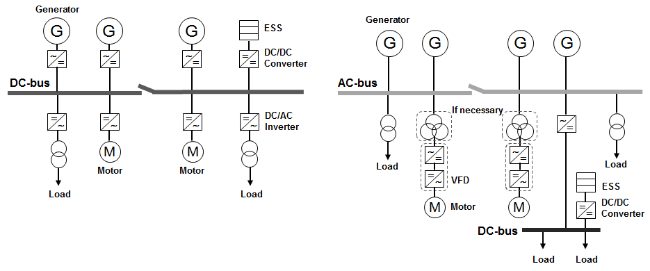
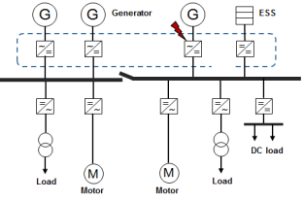
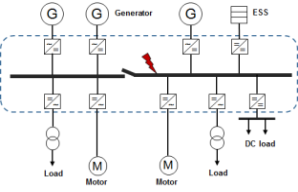
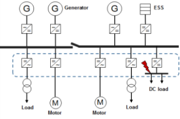

# Guidance for DC Distribution Systems

> OTHER RULES AND GUIDANCE / GC-29-E / 2025 / EN / Guidance

## CHAPTER 2 SYSTEM AND ELECTRICAL EQUIPMENT

### Section 1 System Design

#### 101. General

- **1.** **General**
  - **(1)** The general configuration of DC distribution system can be divided into the case where the DC distribution is applied to the power source side and the case where it is applied to the load side as shown in **Fig 2.1**.

    ****

    | (1) When DC distribution is applied to power source side | (2) When DC distribution is applied to load side |
    | --- | --- |
  - **(2)** All components and systems shall be of such size as to be capable of carrying, without their respective ratings being exceeded, the current which can normally flow through them. They shall be capable of carrying anticipated overloads and transient currents, for example the capacitor inrush currents, without operational degradation.
  - **(3)** The system shall be designed in consideration of dead ship and black-out situation.
  - **(4)** Electrical equipment shall be provided with adequate protection to prevent crew and passenger injuries and equipment damage.
  - **(5)** The system designer is to specify for each of the ships possible operating modes.
    - **(A)** The type of each electrical power source used to supply the distribution system (generators, batteries, fuel cells, etc.)
    - **(B)** The operating mode of each electrical power source (constant voltage, constant current, variable voltage, etc.)
    - **(C)** The configuration of the electrical distribution system (including, but not limited to, the earthing and protection strategies to be used)
  - **(6)** Modifications and additions to systems and equipment shall be approved in advance. And, special attention is taken to the factors affecting the existing system design such as current-carrying capacity, maximum fault current level, harmonic content, power quality and proper discrimination of the protective devices.
  - **(7)** A means of monitoring power quality is to be provided to measure, record, and report the harmonic distortion, voltage pulsation, current pulsation and any other power disturbances (spikes, sags, surge, etc.).
  - **(8)** Where essential services are required by **Pt 6, Ch 1, Sec 1** of the **Rules for the Classification of Steel Ships** to be duplicated, these are to be served by individual circuits, separated in their switchboard or section board and throughout their length as widely as is practicable without the use of common feeders, protective devices, control circuits or control gear assemblies, so that any single fault will not cause the loss of both services.
- **2.** **System of supply**
  The following systems of supply are considered as standard:
  - **(1)** Two-wire insulated.
  - **(2)** Two-wire with one pole earthed.
  - **(3)** Three-wire with mid-wire earthed.
- **3.** **Voltage and frequency**
  - **(1)** **Supply voltage**
    Supply voltage is not to exceed:
    - **(A)** 500$\mathrm{V}$ for cooking and heating equipment permanently connected to fixed wiring.
    - **(B)** 15,000 $\mathrm{V}$ a.c. or 3,000 $\mathrm{V}$ d.c. for electric propulsion equipment.
    - **(C)** 15,000 $\mathrm{V}$ a.c. or 1,500 $\mathrm{V}$ d.c. for generators and power equipment. *(2023)*
    - **(D)** 250 $\mathrm{V}$ for lighting, heaters in cabins and public rooms and other applications not mentioned (A), (B) and (C) above.
  - **(2)** **Voltage and frequency variations**

    **Table 2.1 Voltage and frequency variations**

    | **(a) Voltage and frequency variations for** ***a.c.*** **distribution systems** Type of variations ; Variations Permanent ; Transient Frequency ; ± 5 $\%$ ; ± 10 $\%$ (5 sec) Voltage ; + 6 $\%$, -10 $\%$ ; ± 20 $\%$ (1.5 sec) **(a) Voltage and frequency variations for** ***a.c.*** **distribution systems** Type of variations Variations Permanent Transient Frequency ± 5 $\%$ ± 10 $\%$ (5 sec) Voltage + 6 $\%$, -10 $\%$ ± 20 $\%$ (1.5 sec) **(b) Voltage variations for d.c distribution systems** Parameters ; Variations Voltage tolerance (continuous) ; ± 10 $\%$ Voltage cyclic variation deviation ; 5 $\%$ Voltage ripple(*a.c.* r.m.s. over steady *d.c.* voltage) ; 10 $\%$ **(b) Voltage variations for d.c distribution systems** Parameters Variations Voltage tolerance (continuous) ± 10 $\%$ Voltage cyclic variation deviation 5 $\%$ Voltage ripple(*a.c.* r.m.s. over steady *d.c.* voltage) 10 $\%$ |   |   |
    | --- | --- | --- |
    | **(a) Voltage and frequency variations for** ***a.c.*** **distribution systems** |   |   |
    | Type of variations | Variations |   |
    | Type of variations | Permanent | Transient |
    | Frequency | ± 5 $\%$ | ± 10 $\%$ (5 sec) |
    | Voltage | + 6 $\%$, -10 $\%$ | ± 20 $\%$ (1.5 sec) |
    | **(b) Voltage variations for d.c distribution systems** |   |   |
    | Parameters | Variations |   |
    | Voltage tolerance (continuous) | ± 10 $\%$ |   |
    | Voltage cyclic variation deviation | 5 $\%$ |   |
    | Voltage ripple(*a.c.* r.m.s. over steady *d.c.* voltage) | 10 $\%$ |   |
    - **(A)** All electrical appliances supplied from the main or emergency systems are to be so designed and manufactured that they are capable of operating satisfactorily under the normally occurring variations in voltage and frequency.
    - **(B)** Unless otherwise stated in the national or international standards, all equipment are to operate satisfactorily with the variations from its rated value shown in the **Table 2.1** on the following conditions.
      - **(a)** For alternative current components, voltage and frequency variations shown in the **Table 2.1** (a) are to be assumed.
      - **(b)** For direct current components supplied by d.c. generators or converted by rectifiers, voltage variations shown in the **Table 2.1** (b) are to be assumed.
    - **(C)** Electrical equipment shall be designed taking into account the maximum and minimum values of the rated voltage and frequency and the allowable limits of pulsation specified by the system designer.
    - **(D)** When a power flow may occur, the distribution system is to withstand the generated power variations. And, the level of bi-directional power flow allowed shall be specified by the system designer.
  - **(3)** Analysis results and protection measures for transient overvoltage shall be submitted for review.
- **4.** **Harmonic distortion**
  It is to comply with the requirements in **Pt 6, Ch 1, 201.8** of **Rules for the Classification of Steel Ships**. *(2023)*
- **5.** **Earthing**
  - **(1)** The Battery systems shall be insulated from the ship structure to avoid damaging voltage pulses between chassis and battery cells. For a DC source of power that requires direct or high impedance earthing, necessary arrangements shall be implemented and accepted by relevant authorities.
  - **(2)** Distribution systems supplying consumers through semi-conductor converting equipment are to ensure galvanic isolation and ground separation.
- **6.** **Application of Hybrid System**
  - **(1)** Rotating machinery used as generating sources are to comply with the requirements in **Pt 6, Ch 1, Sec 3** of **Rules for the Classification of Steel Ships**.
  - **(2)** Generally, power generation sources may include fixed speed and variable speed generators, fuel cells, batteries, and other types of energy sources. These energy sources can be used as independent power sources or as main power sources in combination with other energy sources.
  - **(3)** Synchronization may not be required if the voltages of generators or other power sources connected in parallel in the DC bus are the same. However, instrumentation and adjustment devices shall be installed independently for each power source to ensure the same level of independence and local control as the alternator.
  - **(4)** When a fuel cell is used as a DC power source, it shall be in accordance with **Guidance for Fuel Cell Systems on Board of Ships**, and when a battery is used as a DC power source, it shall be in accordance with **Guidance for Battery Systems on Board of Ships**.

#### 102. Main and Emergency Source of Electrical Power

- **1.** **Main source of electrical power**
  - **(1)** The main source of electrical power is to comply with the requirements of **Pt 6, Ch 1, 202.** of **Rules for the Classification of Steel Ships**.
- **2.** **Emergency source of electrical power**
  - **(1)** The emergency source of electrical power is to comply with the requirements of **Pt 6, Ch 1, 203.** of **Rules for the Classification of Steel Ships**.

#### 103. Distribution System

- **1.** **General**
  - **(1)** The AC distribution system used in combination with the DC distribution system is to comply with the requirements of **Pt 6, Ch 1, 204.** of **Rules for the Classification of Steel Ships**.
  - **(2)** Power distribution systems may include both traditional AC systems with fixed frequency and voltage, AC systems with variable frequency and DC inverter systems.
  - **(3)** The distribution system is to be split into at least two independent systems, or to be separated by protection devices providing overcurrent protection, including short circuit. The protective devices used are to be selective, ensuring faults are not transmitted further, and independent of the direction of current flow.
  - **(4)** Each energy storage circuit is normally a DC source (e.g. batteries) and shall be connected to the DC distribution with a controlled DC/DC converter or directly uncontrolled if this meet functional requirements for the other circuits.
- **2.** **DC bus**
  - **(1)** The DC bus shall be sized based on the combined rated output current from converters supplied by each power source (generator, fuel cell, ESS, etc.).
  - **(2)** The DC bus shall be properly sized to withstand the short circuit current available on the DC bus.
  - **(3)** Where bus ducts are used to distribute and control electrical energy throughout the ship, the bus ducts shall be designed, constructed and installed in accordance with IEC 61439-6 or other recognized standards.
  - **(4)** The protection system for bus shall be coordinated with other protection systems.
  - **(5)** Where the main source of electrical power is necessary for propulsion of the ship, the main DC bus shall be subdivided into at least two sections, which are to be connected by DC circuit breakers or other approved means.
- **3.** **Connection of distribution systems**
  - **(1)** Combinations of AC and DC distribution systems shall be coordinated in such way that safe operation can be documented for all normal and fault conditions. Parallel operation of such systems shall be documented and verified based on testing.
  - **(2)** Special attention shall be drawn to DC bus systems where two or more DC distribution systems are connected. The DC bus shall be equipped with a disconnector or a combination of semiconductor device and isolator.
  - **(3)** Connection of several DC distribution systems shall not degrade the operational conditions in any of the DC distribution systems.
  - **(4)** DC distribution systems with connection to AC systems shall be connected to the AC system with an inverter control unit. The inverter may feed power in both directions.
  - **(5)** DC distribution systems may connect to other DC distribution systems in case of faults or repowering by available power sources. Such connections to other DC distribution systems may be energized, for example by combination of precharge circuits, fuses and disconnectors, or an isolator in combination with an electronic switch based on semiconducting devices.
  - **(6)** The rating of the bus-bar connection with auxiliary circuits shall be documented for all operational conditions. The interconnection shall have necessary built-in protection which perform the following functions:
    - **(A)** control safely any faults
    - **(B)** safely isolate the faulty DC distribution systems
    - **(C)** maintain the operation of the healthy DC distribution systems without tripping other circuits connected to the distribution systems
  - **(7)** The function shall be tested and documented for fault clearance in case of worst fault and still maintain operation of other circuits.

#### 104. Protection System

- **1.** **General**
  - **(1)** Arrangements for the isolation and switching of distribution circuits shall be provided which shall enable safe isolation of faults and for maintenance.
  - **(2)** Effective means shall be provided to protect every part of a system from overcurrent and short-circuit current to prevent danger in accordance with **Pt 6, Ch 1, 205.** of **Rules for the Classification of Steel Ships.**
  - **(3)** An outgoing circuit breaker or semiconductor coordinated with a disconnector shall be a part of the DC distribution to be able to isolate the energy storage sources in case of a fault.
  - **(4)** It shall be designed to account for system disturbances such as voltage spikes, voltage drops, common mode noise, high frequency noise, power failures, surges and other conditions that could result in a hazard.
  - **(5)** To prevent permanent damage to connected equipment from voltage spike or surges, the voltages shall be limited using arrestors or by another recognised method, where it is deemed necessary by the system designer or the Society.
  - **(6)** Electrical equipment shall be placed so that, as far as practicable, it is not exposed to risk of mechanical damage according to IEC 60092-101 and IEC 60092-352. Safety barriers shall be established in design and arrangement of energy sources.
- **2.** **Protection of circuits**
  - **(1)** Suitable means to detect insulation breakdown with respect to earth of equipment and distribution systems shall be provided and an alarm shall be issued in the event of detection.
  - **(2)** Active protection shall be provided to safely block the starting currents, inrush currents and fault currents within the limits of voltage and frequency variation.
  - **(3)** Galvanic isolation shall be considered to prevent any circulating currents.
  - **(4)** Any fault in the DC bus arrangement or in one of the DC distribution systems shall not cause tripping of the other consumers connected to the other DC distribution systems.
  - **(5)** Each active controlled unit shall have monitoring and protection to protect the connected device and also to protect the semiconductor devices in the unit for external faults and for internal thermal faults.
  - **(6)** All normal closing and tripping including synchronizing and dead-bus connection shall be controlled by the inverter software and distribution breaker.
  - **(7)** With black-out start function, the inverter systems shall automatically connect to the AC network and maintain AC operation from the DC side if necessary.
  - **(8)** Protection and control systems shall include monitoring, fault detection and fault clearance. Comprehensive analyses shall document the actual clearing times and fault current conditions in relevant operation modes.
  - **(9)** Where DC and AC systems are used in the same installation, a discrimination study shall be performed. Full downstream selectivity shall be provided.
- **3.** **Protection of generators**
  - **(1)** Each generator supplying a DC primary distribution shall have a rectifier as a part of the DC distribution assembly or a DC connection to the generator. The rectifier may be an active or passive semiconductor unit.
  - **(2)** In case of a passive rectifier, the DC voltage shall be controlled by the generator excitation control system.
  - **(3)** The rating of the units shall be documented for all operational conditions of the generators.
  - **(4)** In case of internal failure, the prime mover shall be stopped and the energy source shall be disconnected from the busbar.
- **4.** **Blocking of the bus**
  - **(1)** During fault conditions, the bus-bar breaker shall isolate the faulty part of the system and the remaining system shall be steady and maintain normal operation after the fault is cleared.
- **5.** **Protection against shirt-circuit**
  - **(1)** The short-circuit current contribution of generators and motors shall be calculated on the basis of their characteristics. Contribution from connected DC inverter systems shall be calculated based on the actual technology used.
  - **(2)** Calculation sheets of short-circuit current in the circuits shall be submitted, including a description of the calculation method.
  - **(3)** The DC distribution system may include passive or active controlled components that limit the contribution of fault currents. Short-circuit current values shall be calculated and when required, verification shall be made by testing in the design phase.
  - **(4)** The protection system shall be constructed considering the short-circuit current of all parts such as generator side, bus side, load side, and appropriate protection cooperation shall be done.
  - **(5)** The followings as a minimum shall be taken into consideration in preparation for generator side failure.
    - **(A)** The Power Management System shall reduce load in order to prevent blackout caused by overloading the remaining running generators.
    - **(B)** Back-up short circuit protection method shall be provided between the individual generators and the bus in case of an internal failure of the power converter on the generator side.
    - **(C)** The failed generator shall be automatically de-excited and disconnected from the bus.
    - **(D)** The power electronic converter on the power generation side shall prevent reverse power flow from the DC bus to the generators.
  - **(6)** The followings as a minimum shall be taken into consideration in preparation for bus side failure.
    - **(A)** A type test report or simulation result shall be provided to demonstrate the protection performance in the event of a short-circuit in the bus.
    - **(B)** With regard to (A), protection coordination between the generator and the power converter and the ability of the connected power converter to withstand damage during a short-circuit current on the bus.
  - **(7)** The followings as a minimum shall be taken into consideration in preparation for the load side failure.

    |  |  |  |
    | --- | --- | --- |
    | (1) Short circuit fault on generator side | (2) Short circuit fault on bus side | (3) Short circuit fault on load side |

    **Fig 2.2 Example of short circuit fault in DC distribution system**
    - **(A)** In the event of an internal fault in the power converter module on the load side, a back-up short circuit protection means shall be provided between the bus and the converter.
    - **(B)** In the event of an internal fault in the load side power converter module, only the fuse(or protective device) protecting the module shall be tripped and not affect other power converter modules connected to the same DC bus.
- **6.** **Protective devices**
  - **(1)** General
    - **(A)** Separate protection functions by fuses, semiconductors or circuit breakers shall fulfil requirements for DC or AC ratings documented by suppliers for the relevant fault levels and system voltages.
    - **(B)** For protection against electric shock, the requirements of IEC 60364-4-41 shall be met.
    - **(C)** Where an IT system is designed not to be disconnected in the event of first fault, the occurrence of the first fault shall be indicated by an insulation monitoring device (IMD) according IEC 61557-8, which may be combined with an insulation fault location system (IFLS) according IEC 61557-9.
    - **(D)** Interlocks shall be provided which will prevent access to capacitors until their voltage level has reduced to below the safe extra low voltage level (50V).
    - **(E)** Insulated DC systems shall be provided with earth fault monitoring, detection and alarm capable of detecting earth faults up to and including the connected loads.
  - **(2)** Fuses
    - **(A)** Where fuses are used as fault protection, a disconnector shall also be installed.
    - **(B)** Where fuses are implemented to limit the fault current in the converter, the activation of the protection is not to influence the redundant consumers or cause loss of other single consumers.
    - **(C)** Fuses used to protect distribution converters shall be of the bolted type. Where alternative arrangements are proposed, it shall be demonstrated that protection system’s selectivity is not adversely affected as a result of an increased connection resistance.
  - **(3)** Circuit protection devices using semiconductor devices
    - **(A)** Other devices may be used for short-circuit protection such as semi-conductor devices. Galvanic isolation and short-circuit protection may be provided by separate devices.
    - **(B)** Depending on the type of power source feeding the DC distribution system, the protection function shall be able to protect the power source.
    - **(C)** Active semiconductor systems shall have built-in protection in the semiconductor software, and separate disconnecting device shall include protection as for AC systems. The semiconductor software shall trip the disconnecting device in case of a fault.
    - **(D)** Passive rectifiers shall be equipped with individual protection.
    - **(E)** The protection function of DC inverter systems shall be designed according to the relevant IEC standards. The protection functions shall be tested and documented.

#### 105. Shore Connection Systems

- **1.** **Application**
  The shore connection systems of the DC distribution system installed on board shall comply with the relevant requirements of **105.** and high voltage shore connection systems shall comply with the requirements of **Pt 9, Ch 8** of **Rules for the Classification of Steel Ships**. The low voltage shore connection systems may be subject to the requirements of IEC PAS 80005-3. *(2022)*
  - **(1)** If shore interconnection is to be used for charging of batteries, independent control of the shore interconnection current shall be provided in addition to control by the battery management system.
  - **(2)** The overall charging system shall be designed and verified for each type of application based on the nature of the power demand and its duration. Charging system connection may be automatic, for example due to limited time available for charging.
  - **(3)** A safety analysis shall be made including all phases of the operation of the power transfer system. Automatic connection system shall be tested according to a test procedure accepted by the relevant authority. Local manual operation shall be possible both on-board and onshore.
  - **(4)** The power exchange system shall withstand the dynamic forces in hull heave and sideway movements.
  - **(5)** The DC distribution system or shore connection box on a vessel shall be equipped with a passive or controllable feature that inhibit any reverse currents to shore in case of a fault in the shore system. Cascading faults in the interconnection of shore and vessel system shall be prevented.
  - **(6)** The feeding from shore may be connected to the DC distribution system with an AC/DC or DC/DC converter or as defined by vessel design if it meets all functional requirements. A disconnector shall be a part of the DC distribution system to be able to isolate the incoming supply in a safe way.
- **2.** **Ship to shore connection and interface equipment**
  - **(1)** The cable management system is to:
    - **(A)** be capable of maintaining an optimum length of cable which minimizes slack cable, and prevents the tension limits from being exceeded.
    - **(B)** be positioned to prevent interference with ship berthing and mooring systems, including the systems of ships that do not connect to shore power while berthed at the facility.
    - **(C)** maintain the bending radius of cables above the minimum bending radius recommended by the manufacturer during deployment, in steady state operation and when stowed.
    - **(D)** be capable of retrieving and stowing the cables once operations are complete.
  - **(2)** Monitoring of cable tension
    Stage 1 : alarm
    Stage 2 : activation of emergency shutdown facilities
    - **(A)** The cable management system is not to permit the cable tension to exceed the permitted design value.
    - **(B)** A means to detect maximum cable tension are to be provided, or where an active cable management system that limits cable tension is provided, means to detect the shortage of available cable length are to be provided with threshold limits provided in two stages:
  - **(3)** Monitoring of cable length
    Stage 1 : alarm
    Stage 2 : activation of emergency shutdown facilities
    - **(A)** The cable management system is to enable the cables to follow the ship movements over the entire range of ship draughts and tidal ranges, and the maximum range of allowable motion forward, aft or outward from the dock.
    - **(B)** Where the cable length may vary, the remaining cable length is to be monitored and threshold limits are to be arranged in two stages:
  - **(4)** Equipotential bond monitoring
    The equipotential bond created by the ship to shore connection cables is to be constantly monitored.
- **3.** **Plugs and socket-outlets**
  - **(1)** General
    - **(A)** Details including general arrangement of plug and socket-outlet are to be in accordance with IEC/IEEE 80005-1 Annex, IEC 62613-1 and IEC 62613-2. *(2022)*
    - **(B)** The plug and socket-outlet arrangement is to be fitted with a mechanical-securing device that locks the connection in the service position.
    - **(C)** The plugs and socket-outlets are to be designed so that an incorrect connection cannot be made.
    - **(D)** Socket-outlets are to be interlocked with the earth switch so that plugs cannot be inserted or withdrawn without the earthing switch in the closed position.

### Section 2 Electrical Equipment

#### 201. General

- **1.** **Application**
  - **(1)** Electrical equipment shall operate satisfactorily under various environmental conditions. Basically, it is to comply with the relevant requirements in **Pt 6, Ch 1** of **Rules for the Classification of Steel Ships**.
  - **(2)** In addition to the design and installation of electrical equipment, materials and components shall be selected to maintain continuous function under normal and anticipated abnormal conditions and to reduce the following risk factors. Materials and components, as well as the design and installation of electrical equipment, shall be selected to maintain continuous function during all normal and reasonably foreseeable abnormal conditions and to reduce the following risk factors.
    - **(A)** Injuries of crew and passengers
    - **(B)** Damage to the equipment and the system is contained within or adjacent equipment and systems
    - **(C)** Damage to adjacent equipment and systems
    - **(D)** Damage to the ship
  - **(3)** Electrical equipment shall be rated (voltage, current, power, etc.) for normal operation and additional supporting data may be required if necessary.
- **2.** **Structure and arrangement**
  - **(1)** Necessary technical arrangements shall be installed to compensate for any oscillations between units connected by cables or other arrangement.
  - **(2)** Cables and electrical equipment with different rated voltages shall not be in contact with each other, and the construction shall include adequate inside segregation and necessary protection to avoid damages on neighbouring units.
  - **(3)** The enclosures are to comply with the degree of protection of **Pt 6, Ch 1, Table 6.1.6** of **Guidance Relating to the Rules for the Classification of Steel Ships**.

#### 202. Generator

- **1.** DC power generation with variable speed allows for a wide speed range for the prime mover, which holds limitation for the actual speed range. The configuration of the power management system shall take into account the variances in available power at different prime mover speeds within the operating range.
- **2.** The fuel consumption, emission, speed, power and torque capability of the prime mover shall be documented over the selected speed range. The prime mover shall be protected by its own safety system.
- **3.** The generator shall be designed to operate at any speed within the selected speed range area. The power and fault current capabilities for this speed range shall be documented.
- **4.** For AC generators with fixed or variable speed, circuit protection and ratings shall comply with the requirements in **Pt 6, Ch 1, Sec 3** of **Rules for the Classification of Steel Ships**.
- **5.** For generators, which cannot be de-excited by field winding a stop arrangement for the prime mover shall be considered.
- **6.** Variable speed AC generators may vary depending on the characteristics of the prime mover. With these variations in speed, the generator need to be protected for fault contribution over the entire speed range; both thermal conditions and short-circuit fault currents as well as voltage regulation.
- **7.** Where a permanent excited generator is used, there shall be a separate protection for stopping the prime mover in case of short-circuit between the inverter/breaker and the generator.
- **8.** Protection functions like reverse power may be omitted if the rectifier blocks any back feeding of power.

#### 203. Battery

- **1.** **General**
  - **(1)** Batteries connected to and charged by the DC bus shall be protected against all effects of electrical faults in the system.
  - **(2)** Batteries connected to and charged by the DC bus shall be so located and provided with arrangements allowing for the safe isolation of their terminals and the reduction of voltages to a safe level during maintenance. Proposals for alternative arrangements providing an equivalent level of safety will be subject to special consideration.
  - **(3)** The maximum battery voltage under any conditions of charging shall not exceed the safe value of any connected apparatus.
  - **(4)** The voltage characteristics of the generator or generators or semiconductor convertor, which will operate in parallel with the battery, shall be suitable for each individual application.
  - **(5)** Where apparatus capable of operation at the maximum charging potential is not available, a voltage regulator or other means of voltage control shall be provided.
  - **(6)** When batteries are used as power supply systems, adequate measures shall be taken to keep the voltage within the specified limits during charging(including quick charging) and discharging of the battery.
  - **(7)** The short-circuit contribution of battery circuits shall be identified for the actual state of charge, ageing and other factors influencing the capacity of the battery.
- **2.** **Protection system**
  - **(1)** Each string of batteries shall have individual protection schemes to isolate a fault occurring in that string, and handle possible short-circuit contribution from paralleled strings.
  - **(2)** The complete battery shall have an disconnecting device between the battery and the DC distribution.
  - **(3)** The battery system shall be equipped with IT grounding system and means shall be provided to monitor the insulation and to alert in case of abnormal condition.
  - **(4)** Batteries shall be connected to the distribution system by protection devices which provide overcurrent protection, including short circuit. The protective devices used shall be selective, ensuring faults are not transmitted further, independent of the direction of current flow.
  - **(5)** Battery system shall be designed with a number of safety barriers.
  - **(6)** The battery system shall be documented with regards to max C rate that can be used in duty cycles both in discharge and charge conditions.
  - **(7)** The temperature conditions for the battery cells shall be monitored and a common visual and audible alarm shall be given when temperatures are in an area where there is a risk for permanent degradation of the cells or there is a risk for overheating and further thermal escalation.
  - **(8)** The battery system shall have sufficient cooling to be able to operate in ambient conditions specified by the manufacturer.
  - **(9)** The battery system shall be equipped with a battery management system (BMS) that shall monitor and protect the battery system and also control internal temperatures and voltages and internal cell balancing of the system.

#### 204. Electric power converter

- **1.** **Application**
  - **(1)** In addition to the requirements in **Pt 6, Ch 1, Sec 12** of the **Rules for the Classification of Steel Ships**, the power converter shall comply with the following requirements.
  - **(2)** Power converters shall be designed in accordance with international standards or equivalent standards such as IEC 60146 and IEC 62477.
  - **(3)** Converting equipment mentioned in this Section can be of conversion type DC/AC, AC/DC, DC/DC, and active or passive control types may be applied.
  - **(4)** The development of software for power converters shall be carried out in accordance with **Pt 6, Ch 2** of **Rules for the Classification of Steel Ships**.
  - **(5)** The power load that receives constant power from the DC bus through power converter shall not cause instability.
- **2.** **Performance**
  - **(1)** Electric power converters supplying electrical power to the d.c. distribution bus and consumers shall be capable of delivering the required currents for the time required to enable current-time discrimination of protective devices. The electrical supply shall be automatically restored following fault clearance.
  - **(2)** Electric power converters shall be capable of handling voltage and current spikes from the d.c. bus under all normal and reasonably foreseeable abnormal conditions without sustaining any damage or tripping, as far as practicable.
  - **(3)** Electric power converters supplying essential services shall automatically restart and connect to the DC bus after a blackout in accordance with **Pt 6, Ch 1, 203**. of **Guidance relating to the Rules for the Classification of Steel Ships**.
  - **(4)** Electric power converters arranged to operate in parallel shall be capable of stable load sharing up to maximum load, including temporary overloads.
  - **(5)** Electric power converters shall not be used as the final protective device for short circuit in lieu of dedicated protective devices such as fuses or circuit breakers except where it is proven that the converter will remain within the specified safe operational specification under all normal and reasonably foreseeable abnormal operating conditions.
  - **(6)** Where electric power converters are arranged to provide protection against electrical faults, a disconnector or switch disconnector shall be provided to enable safe isolation of the convertor from its incoming supplies.
  - **(7)** Electric power converters shall be protected from permanent damage as a result of short circuits or overload currents on their input or output terminals.
  - **(8)** The voltage ripple from the power converter shall be mitigated to a level that does not affect normal system operation and shall meet the voltage ripple reference of the DC bus (see **Table 2.1**).
  - **(9)** Electric power converters shall be designed to withstand foreseeable abnormal conditions (e.g., transient overvoltage and overcurrent) from the DC bus without changes in their characteristics and functionalities.
  - **(10)** The short-circuit contributions of internal capacitors in converters shall be considered in the sizing of protective devices and in the system protection coordination study.
  - **(11)** For ships with an integrated electric propulsion system, generator converters(converter or alternator rectifier) operating in parallel ​​shall be capable of performing load sharing under the control of a power management system.
  - **(12)** Where electric power converters are arranged to provide protection against electrical faults, a disconnecting method shall be provided to isolate the converter from its source. In case of any converter’s internal failure, a backup protection method shall be provided. In such arrangement, the design shall demonstrate that the converter will operate within the safe operational specification under normal and fault conditions.
- **3.** **Protective device**
  - **(1)** General
    - **(A)** Each connected circuit shall be connected to the DC distribution with a suitable breaker or fuses and disconnector to control outgoing faults and isolating capacity in case of faults in the circuits, or during maintenance work on a circuit. This does not preclude the use of additional semiconductor switching for high speed protection against over currents.
    - **(B)** Each inverter shall have necessary built-in protection to control safely any faults outside the assembly.
    - **(C)** In case of fault in the inverter, there shall be a separate protection that safely isolate the faulty circuit and maintain the operation of the DC distribution without tripping other circuits connected to the DC distribution. The protection may be fuses, DC breakers or semiconducting breakers. Semiconducting breakers are to be provided with disconnectors or other means to provide physical isolation of circuits.
    - **(D)** The function shall be tested and documented for fault clearance in case of worst fault in the inverter circuit and still maintaining operation of other circuits.
    - **(E)** The different inverter, breaker or fuse units may be fixed mounted or withdrawable.
    - **(F)** Where consumers are supplied via electric power converters which are connected to both sides of a DC bus capable of being split, arrangements shall be provided to eliminate the risk of current being supplied back to the DC bus through flyback diodes.
    - **(G)** The generator and load connected to the DC bus through converters shall be safe and easy to connect and disconnect.
    - **(H)** The system shall be designed to prevent damage to the converter when switching under load.
  - **(2)** Capacitors
    - **(A)** Where electric power converters are equipped with internal capacitors which can contribute significantly to the short-circuit level of the system, the effect on the design of the protection and distribution system shall be considered.
    - **(B)** Capacitors in the power converter have large inrush currents in a fully discharged state. Therefore, inrush current suppression means shall be provided so that the capacitors and the elements inside the converters are not damaged.
    - **(C)** Where capacitors are connected to a converter output, the output shall be charged by the converter or by external chargers to a level which will minimise the risk of damage to the capacitors before connecting them to the DC bus.
- **4.** **Indicators and warnings**
  - **(1)** Electric power converter shall be provided with the following visual means for status indication.
    - **(A)** Power available at the input
    - **(B)** Power at output
    - **(C)** Temperature
    - **(D)** Overload
  - **(2)** Additional indicators, warnings and shutdowns may be required if the risk assessment in **Ch 5** deems it necessary.
  - **(3)** Where Pulse Width Modulation converters are to be used, the voltage rate of rise times are to be evaluated. Rotating machinery, surge protective devices, cable insulation and motor windings shall be designed accordingly.
- **5.** **Cooling**
  - **(1)** In general, power electronics will produce additional heat due to switching and conducting losses. At least one independent cooling system for each DC distribution system is required.

#### 205. Cable

- **1.** The cables required for DC distribution systems shall comply with the requirements of **Pt 6, Ch 1, Sec 5** of the **Rules for the Classification of Steel Ships**.
- **2.** Cables shall be selected to meet the intended vessel life taking into account all reasonably foreseeable electrical effects such as, but not limited to, skin effect or partial discharge, age degradation and operating environment.

#### 206. Measuring devices

- **1.** At least two voltmeters indicating the DC bus voltage shall be provided. Where the main DC bus can be separated into sections there is to be at least one voltmeter per section. An ammeter shall be provided for each converter supplying the DC bus.
- **2.** Instruments shall be so arranged as to be observable at the operating position. And, additional instruments may be required at other locations through risk assessment of **Ch 5**.
- **3.** Instruments for switchboards shall comply with the requirements of **Pt 6, Ch 1, 404.** of the **Rules for the Classification of Steel Ships**.

#### 207. Creepages and clearances

- **1.** Creepages and clearances between conductive DC parts shall comply with the rated voltage in consideration of the following:
  - **(1)** Nature of the insulating material
  - **(2)** Transient overvoltages caused by switching and fault conditions
  - **(3)** Environment into which the assembly is installed
- **2.** The low-voltage switchgear and controlgear shall be designed creepages and clearances in accordance with applicable standards such as IEC 61439-1, and other equipment shall be designed to prevent failure and dielectric breakdown in accordance with the relevant standards. 
