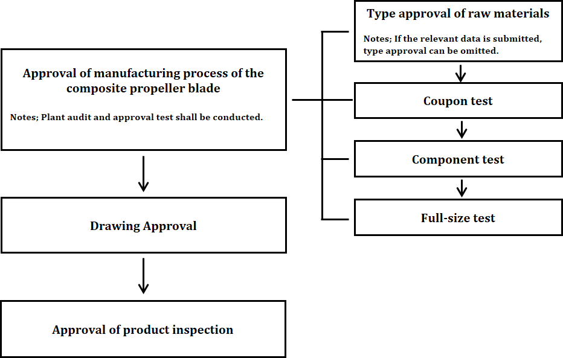

# Guidance for Composite Propellers

> OTHER RULES AND GUIDANCE / GC-32-E / 2025 / EN / Guidance

## CHAPTER 1 GENERAL

### Section 1 General

#### 101. Application

- **1.** This Guidance applies to the composite propellers composed of resins, fiber reinforcement and core materials (hereinafter refer to FRP materials) used in ships which are to be certified or are intended for classification.
- **2.** The matters not specified in this Guidance are subject to the respective requirements of **Pt 2** and **Pt 5** of the Rules and Guidance for the Classification of Steel Ships and of the Guidance for Approval of Manufacturing Process and Type Approval.
- **3.** If it is impracticable to apply the requirements specified in this Guidance, alternative methods are to be discussed by the Society.

#### 102. Definition of Terms

The definitions of terms are to be in accordance with the Rules and Guidance for Steel Ships unless otherwise specified in this Guidance.

- **1.** “Composite material” refers to material containing two or more different materials (resin, reinforcement) to possess specific performance characteristics.
- **2.** “Resin” refers to thermosetting resin for lamination constituting a composite material composed of various solid or semi-solid amorphous organic matter.
- **3.** “Fiber” refers to reinforcing fibers that improve the physical properties of the composite material due to its high axial strength and stiffness.
- **4.** “Core Material” refers to a structure of various types of foam for the purpose of weight reduction or thickness increment and stiffness improvement of a composite material.
- **5.** “Mixing ratio” refers to the weight ratio of the curing agent and the accelerator to the resin solution.
- **6.** Definition of test
  - **(1)** “Coupon test” refers to fabricating laminates in the same method using materials practically applied to the composite material and testing specimens for measuring the properties of the composite material.
  - **(2)** “Component test” refers to testing specimens obtained from a part of the practical size of the propeller blade or a part of the mould simultaneously used for forming the propeller blade to measure the properties of the composite material.
  - **(3)** “Full-size test” refers to testing the composite propeller blade of practical size for approval.

### Section 2 Approval Procedure

#### 201. Approval procedure

- **1.** The approval procedure for the composite propeller is to be in accordance with **Fig 1.1**.
  
  Fig 1.1 Approval procedure for the composite propeller#imgID-3
