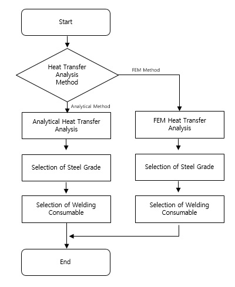

# Guidance of Heat Transfer Analysis for Ships Carring Liquefied Gases in Bulk/Ships Using Liquefied Gases as Fuels

> OTHER RULES AND GUIDANCE / GC-33-E / 2025 / EN / Guidance

## CHAPTER 1 GENERAL

### Section 1 Application

#### 101. Application

- **1.** This guidances applies to the assessment procedure of heat transfer analysis on the hull of ships carrying liquefied gases in bulk and the hull of ships using liquefied gases as fuels.
- **2.** This guidances deals with the selection of steel grade and welding consumables on ships carrying liquefied gases in bulk and ships using liquefied gases as fuels.
- **3.** Requirement of this guidances shall apply in addition to the other requirement of Rules for the Classification of Steel Ships.

#### 102. Equivalence

In the case that the application of this guidances is not appropriate or that the Society allow that the special method and the procedure not specified in this guidances is at least equivalent to those in effect for the provision of this guidances, it is assumed to be appropriate for the provision of this guidances. In this case in order to verify that the heat transfer analysis is at least equivalent to the standard of this guidances, the related information should be submitted to the Society and the evaluation method is to be consulted with the Society. From the initial design phase, the purpose to use the different method should be sufficiently discussed.

### Section 2 Definitions

#### 201. Application

The definitions of terms, except otherwise specified, are to be in accordance with Rules for the Classification of Steel Ships.

#### 202. Overall heat transfer coefficient

Overall heat transfer coefficient means the heat transfer coefficient by considering all heat transfer methods including convection, radiation and conduction.

#### 203. Prandtl number

Prandtl number represent the relative thickness of the velocity and the thermal boundary layer and is defined as the ratio of momentum diffusivity to thermal diffusivity.

#### 204. Nusselt number

Nusslet number(Nu) means the ratio of convective to conductive heat transfer across the boundary.

#### 205. Rayleigh number

The Rayleigh number is defined as the product of the Grashof number and the Prandtl number. It indicates whether heat transfer occurs as conduction or convection.

#### 206. Reynolds number

Reynolds number means the ratio of the inertia forces to viscous forces in the fluid.

#### 207. Grashof number

Grashof number means the ratio of buoyancy to viscous force acting on a fluid.

### Section 3 Summary of Guidances

#### 301. General

- **1.** The cargo tank of the ships carrying liquefied gases in bulk or the fuel tank of ships using liquefied gases as fuels is likely to make the hull structure cold due to the low temperature of the liquefied gas. In general, steels increase brittleness at low temperature, so brittle fracture of ships carrying liquefied gases in bulk/ships using liquefied gases as fuels through proper steel selection should be avoided. For this purpose, the IGC Code requires that the heat transfer analysis of ships carrying liquefied gases in bulk be carried out and the steel of the hull structure be selected based on the analysis.

#### 302. Methods of heat transfer analysis

- **1.** **General**
  - **(1)** This guidances applies two heat transfer analysis methods. The first is the analytical heat transfer analysis method and the second is the finite element heat transfer analysis method.
  - **(2)** The flowchart of the heat transfer analysis method presented in this guidances is shown in **Fig 1.1**.
  - **(3)** The user should decide which method to use between the two heat transfer analysis methods.
- **2.** **Analytical Heat Transfer Analysis**
  - **(1)** The analytical heat transfer analysis method is a method of solving the basic thermal equilibrium equation to obtain the temperature, which is easily applicable and can predict the temperature value. The calculated temperature means the average temperature of each section. Based on this, the steel grade is selected and finally the welding consumable is also selected.
  - **(2)** Air temperature, sea water temperature and wind speed are selected based on the navigation area of the ship for program input. Air temperature, sea water temperature and wind speed in IMO IGC Code or USCG may be used. The material properties for heat transfer analysis should be defined and the properties of steel, insulation, seawater and air should be selected in consideration of temperature. After all input for analytical heat transfer analysis is prepared, the analysis is performed. The steel grade is selected based on the temperature of each part obtained as a result of the analysis. Also, the welding consumable is selected based on the selected steel grade.
- **3.** **FEM Heat Transfer Analysis**
  - **(1)** Finite element heat transfer analysis method can estimate hull temperature distribution by considering complex hull structure. Since each section of the hull is divided into several elements to perform the analysis, it is calculated to have a temperature distribution along one structural member. The average temperature of the structural member is calculated and steel grade and welding consumable are selected based on this.
  - **(2)** If finite element heat transfer analysis method is selected, general finite element analysis software can be used. Two-dimensional analysis modeling or three-dimensional analysis modeling work should be performed considering the hull structure to be analyzed. Air temperature, seawater temperature and wind speed should be selected based on the navigation area of the ship for program input. In this case, IMO IGC Code or USCG can be used.
  - **(3)** The material properties for the heat transfer analysis must be entered into the software.
  - **(4)** The steel grade is selected based on the temperature of each part obtained as a result of the analysis. At this time, the steel grade is selected using the average temperature of the members. Welding consumable is selected based on the steel grade determined using the average temperature of the member.
    
    Fig 1.1 Flowchart of heat transfer analysis

### Section 4 Documentation

#### 401. Resource for approval

- **1.** Depending on the assessment method of the heat transfer analysis on ships carrying liquefied gases in bulk/ships using liquefied gases as fuels, the following materials should be submitted to the Society and to be approved by the Society. In addition, if deemed necessary, the Society may require the submission of data other than those specified below.
  - **(1)** By analytical heat transfer analysis method
    - **(A)** General information of analysis including model of heat transfer analysis, heat transfer analysis design condition and boundary condition
    - **(B)** The result of heat transfer analysis
    - **(C)** The result of steel grade selection
    - **(D)** Material properties and their basis
    - **(E)** In case of ships carrying liquefied gases in bulk, the drawing of cargo containment system and the related supports
      - **(a)** The data for type of cargo containment system
      - **(b)** The detail drawing of representative basic model
    - **(F)** In case of ships using liquefied gases as fuels, the drawing of fuel tank and the related supports
      - **(a)** The data for type of fuel tank
      - **(b)** The detail drawing of representative basic model
  - **(2)** By FEM heat transfer analysis method
    - **(A)** General information of analysis including model of heat transfer analysis, heat transfer analysis design condition and boundary condition
    - **(B)** The result of heat transfer analysis
    - **(C)** The result of steel grade selection
    - **(D)** If necessary, the result of welding consumables selection
    - **(E)** Material properties and their basis
    - **(F)** In case of ships carrying liquefied gases in bulk, the drawing of cargo containment system and the related supports
      - **(a)** The data for type of cargo containment system
      - **(b)** The detail drawing of representative basic model
    - **(G)** In case of ships using liquefied gases as fuels, the drawing of fuel tank and the related supports
      - **(a)** The data for type of fuel tank
      - **(b)** The detail drawing of representative basic model

#### 402. The reference data

- **1.** In the case of ships carrying liquefied gases in bulk
  - **(1)** The main source of the ship
  - **(2)** Restrictions on cargo operations, such as limiting the height of the cargo loading, cooling down speed.
  - **(3)** The layout of cargo containment system in each cargo hold
  - **(4)** The general arrangement of ship with the cargo containment system installed
  - **(5)** The design constraints of the cargo containment system
- **2.** In the case of ships using liquefied gases as fuels
  - **(1)** The main source of the ship
  - **(2)** Restrictions on cargo operations, such as limiting the height of the cargo loading, cooling down speed.
  - **(3)** The layout of fuel tank
  - **(4)** The design constraints of fuel tank 
