# Guidance of Heat Transfer Analysis for Ships Carring Liquefied Gases in Bulk/Ships Using Liquefied Gases as Fuels

> OTHER RULES AND GUIDANCE / GC-33-E / 2025 / EN / Guidance

## CHAPTER 2 HEAT TRANSFER ANALYSIS FOR MEMBRANE TYPE

### Section 1 Analytical Heat Transfer Analysis

#### 101. Analysis Procedure

- **1.** **Procedure of analytical heat transfer analysis**
  - **(1)** The analytical heat transfer analysis is performed according to the flowchart in **Figure 2.1**.
    - **(A)** As shown in **Figure 2.2**, the work to divide the compartment for analytical two-dimensional heat transfer analysis into sections is performed.
    - **(B)** Defines the boundary conditions for the compartment. This includes the settings of the length, width and area of all members of the compartment, seawater temperature, air temperature, wind speed and emissivity of the steel.
    - **(C)** Assume initial temperature of compartment and member.
    - **(D)** Calculate the overall heat transfer coefficient.
    - **(E)** Calculate the temperature of compartment and member.
    - **(F)** If the change in temperature is below the reference value, the calculation is stopped; otherwise, the calculation is performed in step (D).
    - **(G)** Perform the above operation to the last compartment to be analyzed.
    - **(H)** Obtain the hull temperature calculation results.
  - **(2)** Analytical heat transfer analysis method is performed through iterative procedures. In order to reduce the number of repetitions, the initial temperature is set to the atmospheric temperature or the seawater temperature according to the surrounding environment to be contacted.

    |  |
    | --- |
    | **Fig 2.1 Iterative procedure flowchart of analytical heat transfer analysis** |

    | 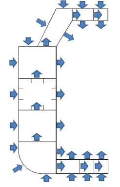 |
    | --- |
    | **Fig 2.2 Segmentation for heat transfer analysis of ships carrying liquefied gases in bulk** |

#### 102. Modeling

- **1.** **1-Dimensional heat transfer analysis model**
  - **(1)** The one-dimensional heat transfer analysis model provides the information necessary to understand the analytical heat transfer analysis method and the two-dimensional model is an extension of the one-dimensional model. The one-dimensional heat transfer analysis model is considered as a horizontal and vertical model and an example is shown in **Figure 2.3**.

    | 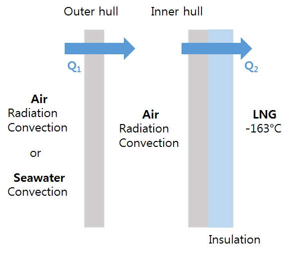 | 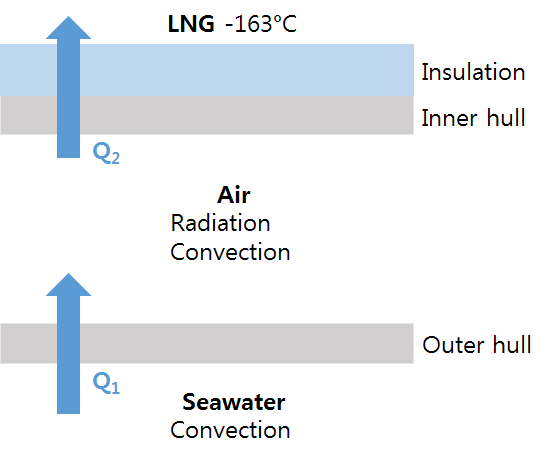 |
    | --- | --- |
    | **Fig 2.3 Example of one-dimensional horizontal and vertical heat transfer analysis model** |   |
  - **(2)** The equilibrium equation of the one-dimensional heat transfer analysis is defined as follows.
    $\sum _{} ^{} Q=0$
    $\sum _{} ^{} Q=Q _{1} +Q _{2} =0$
  - **(3)** The heat transfer of the one-dimensional heat transfer model is defined as follows using the overall heat transfer coefficient.
    $Q _{n} =U _{n} \cdot A _{n} \cdot (T _{1} -T _{2} )$
    $U$ : Overall heat transfer coefficient
    $A$ : Area of Heat Transfer
  - **(4)** The overall heat transfer coefficient is obtained by a combination of heat transfer coefficient of convection, conduction and radiation, and the above case is defined as follows.
    $1/U _{1} =1/(h _{C,EN/OH} +h _{R,EN/OH} )+t _{OH} /k _{OH} +1/(h _{C,OH/CO} +h _{R,OH/CO} )$
    $1/U _{2} =1/(h _{C,CO/IH} +h _{R,CO/IH} )+t _{IH} /k _{IH} +t _{INS} /k _{INS} +1/(h _{C,INS/LNG} +h _{R,INS/LNG} )$
    EN : Environment
    OH : Outer hull
    IH : Inner hull
    INS : Insulation
    CO : Compartment
    $h _{C}$ : Convection heat transfer coefficient
    $h _{R}$ : Radiation heat transfer coefficient
    $t$ : Thickness
    $k$ : Thermal conductivity
    $h _{conv} = \frac{N _{u} \cdot k}{L}$
    $N _{u}$ : Nusselt number
    $k$ : Fluid thermal conductivity
    $L$ : Characteristic length
    $h _{rad} = \varepsilon \sigma (T _{1} ^{2} +T _{2} ^{2} )(T _{1} +T _{2} )$
    $\sigma$ : Stefan-Boltzmann Constant($5.6703 \times 10 ^{-8} W/m ^{2} K ^{4}$)
    $\varepsilon$ : Emissivity
    - **(A)** Overall heat transfer coefficient for $Q _{1}$
    - **(B)** Overall heat transfer coefficient for $Q _{2}$
    - **(C)** Heat transfer coefficient($h _{C}$) of convection is calculated as follows.
    - **(D)** Heat transfer coefficient($h _{R}$) of radiation is calculated as follows.
  - **(5)** The temperature of the compartment and members is obtained in the same way as the method for obtaining the steel temperature in the example of **Fig 2.4**.

    | 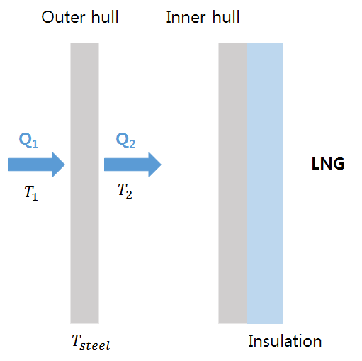 |
    | --- |
    | **Fig 2.4 Scheme of heat flux flow from outside to inside of LNG cargo tank** |

    $Q _{1} =U _{1} A(T _{1} -T _{steel} )$, $Q _{2} =U _{2} A(T _{steel} -T _{2} )$
    $U _{1} , U _{2}$ : Overall heat transfer coefficient
    $T _{1}$ : The temperature of the atmosphere/seawater
    $T _{2}$ : The temperature of the compartment
    $A$ : Area of Heat Transfer
    $Q _{1} =Q _{2} =U _{1} A(T _{1} -T _{steel} )=U _{2} A(T _{steel} -T _{2} )$
    $T _{steel} = \frac{U _{1} T _{1} +U _{2} T _{2}}{U _{1} +U _{2}}$
    - **(A)** The heat flux through the outer hull is expressed as follows.
    - **(B)** In equilibrium, the steel temperature is calculated as follows.
- **2.** **2-Dimensional heat transfer analysis model**
  - **(1)** In the analytical heat transfer analysis method, the heat transfer of the hull structure is considered in two dimensions. **Fig 2.5** shows the heat transfer path at the sideshell and bottom of the hull. The shape and heat transfer direction of the adjacent fluid(atmosphere or seawater) shown in **Fig 2.5** should be considered when performing analytical heat transfer analysis.

    | 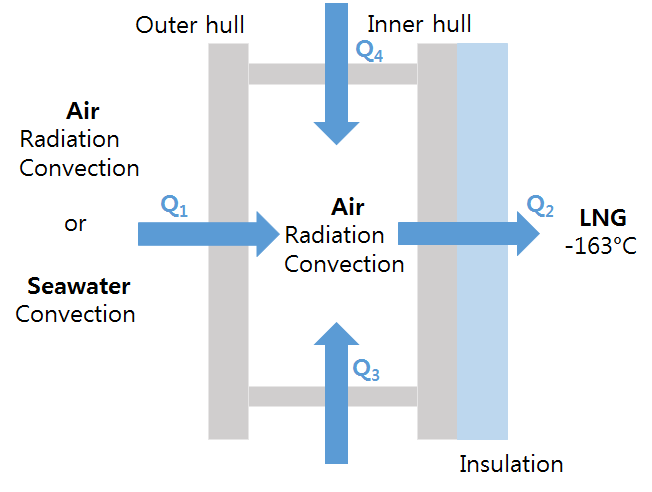 | 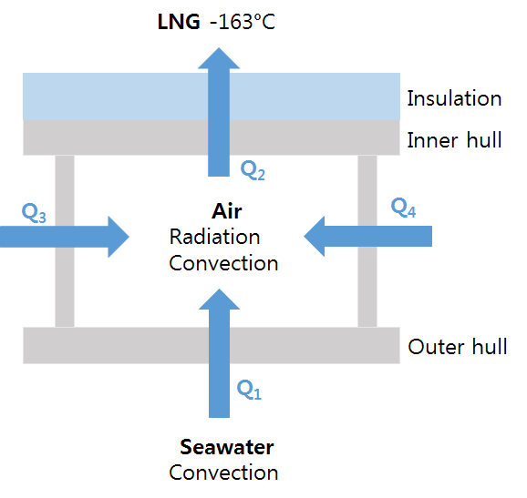 |
    | --- | --- |
    | **Fig 2.5 Example of two-dimensional heat transfer analysis model** |   |
  - **(2)** The equilibrium equation of the analytical two-dimensional heat transfer analysis is described as follows.
    $\sum _{} ^{} Q=Q _{1} +Q _{2} +Q _{3} +Q _{4} =0$
    $U _{1} A _{1} (T _{E} -T _{C} )+U _{2} A _{2} (T _{C} -T _{L} )+U _{3} A _{3} (T _{OC1} -T _{C} )+U _{4} A _{4} (T _{OC2} -T _{C} )=0$
    $T _{E}$ : Environmental temperature
    $T _{C}$ : Temperature of target compartment
    $T _{L}$ : Temperature of Liquefied gas
    $T _{OC}$ : Temperature of adjacent compartment
- **3.** **Basic heat transfer model**
  - **(1)** The one-and two-dimensional heat transfer analysis models are described as conduction heat transfer, convection heat transfer and radiation heat transfer.
  - **(2)** Heat Transfer of Conduction
    $q=-k \cdot grad(T)$
    $q$ : Heat flux
    $k$ : Thermal conductivity
    $grad(T)= Partial T/ Partial n$ is the temperature derivative in vertical direction on isothermal temperature surface.
    $q=k(T _{1} -T _{2} )/t$
    $t$ : Thickness
    - **(A)** The heat transfer rate by conduction per unit area is described by the Fourier equation as follows.
    - **(B)** The heat flux for a real structure is described as follows.
  - **(3)** Heat Transfer of Convection
    $q=h(T _{1} -T _{2} )$
    $h$ : Convective heat transfer coefficient
    $h= \frac{N _{u} k}{L}$
    $N _{u}$ : Nusselt number
    $k$ : Thermal conductivity
    $L$ : Characteristic length
    **Table 2.1 Nusselt number for vertical plate**

    | Shape | Characteristic length |
    | --- | --- |
    | 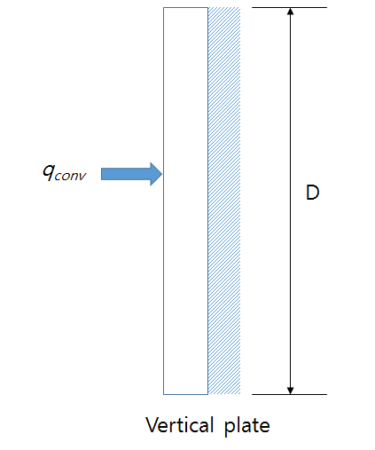 | D |
    | $R _{a}$ Range | Nusselt number, $N _{u}$ |
    | $\leq 10 ^{9}$ | $N _{u} =0.68+ \frac{0.670Ra ^{1/4}}{[1+(0.492/P _{r} ) ^{9/16} ] ^{4/9}}$ |
    | $>10 ^{9}$ | $N _{u} = \left\{ 0.825+ \frac{0.387R _{a} ^{1/6}}{[1+(0.492/P _{r} ) ^{9/16} ] ^{8/27}} \right\} ^{2}$ |

    $R _{a} =G _{r} \cdot P _{r}$
    $P _{r} = \frac{\mu C _{P}}{k}$
    $\mu$ : Dynamic viscosity
    $C _{P}$ : Specific heat
    $k$ : Thermal conductivity
    $G _{r} =L ^{3} g \Delta T \beta \cos( \theta )/ \nu ^{2}$
    $L$ : Characteristic length
    $g$ : Gravitational acceleration
    $\Delta T$: Temperature difference
    $\beta$ : Thermal expansion coefficient
    $\theta$ : Plate angle($0\leq \theta \leq 60 {}^{\circ}$)
    $\nu$ : Kinematic viscosity

    | Shape | Detail | Characteristic length |
    | --- | --- | --- |
    | 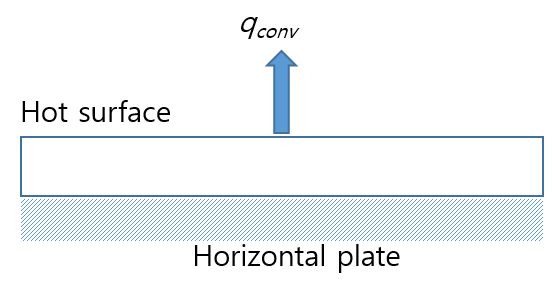 | Upper surface of a hot plate or lower surface of a cold plate | $A _{s} /P$ $A _{s}$ : surface area $P$ : perimeter |
    | $R _{a}$ Range | Nusselt number, $N _{u}$ |   |
    | $10 ^{4} \sim 10 ^{7}$ | $N _{u} =0.54R _{a} ^{1/4}$ |   |
    | $10 ^{7} \sim 10 ^{11}$ | $N _{u} =0.15R _{a} ^{1/3}$ |   |

    | Shape | Detail | Characteristic length |
    | --- | --- | --- |
    | 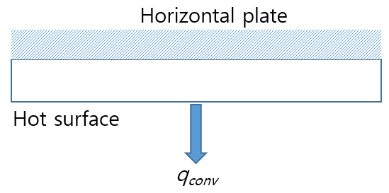 | Lower surface of a hot plate or upper surface of a cold plate | $A _{s} /P$ $A _{s}$ : surface area $P$ : perimeter |
    | $R _{a}$ Range | Nusselt number, $N _{u}$ |   |
    | $10 ^{5} \sim 10 ^{11}$ | $N _{u} =0.27R _{a} ^{1/4}$ |   |

    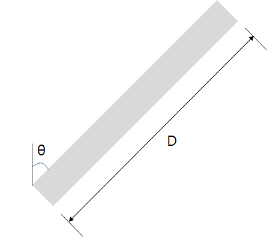
    Fig 2.6 Inclined plate
    $N _{u} =0.037 \cdot R _{e} ^{4/5} \cdot P _{r} ^{1/3}$
    $R _{e}$ : Reynolds number
    $P _{r}$ : Prandtl number
    $h _{fin} = \Phi \cdot h$
    $h$ : Heat transfer coefficient of convection
    $\Phi$ : Coefficient of fin effect
    $\Phi = \frac{(A _{unfin} + \eta _{fin} A _{fin} )(T _{b} -T _{\infty } )}{A _{nofin} (T _{b} -T _{\infty } )}$
    $\eta _{fin}$ : Fin efficiency
    $T _{b}$ : Surface temperature
    $T _{\infty }$ : Temperature of inner compartment
    $A _{unfin}$: The remaining area minus the fin portion
    $A _{nofin}$ : Area without fin
    $A _{fin}$ : Fin area
    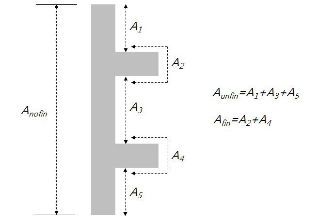
    **Fig 2.7 Shape definition for fin efficiency calculation**
    - **(A)** Heat transfer coefficient of convection is described as follows.
    - **(B)** Natural convection uses the Nusselt number to calculate the convective heat transfer coefficient.
      - **(a)** In hull structure, natural convection occurs in open spaces and also occurs in enclosed cofferdams.
      - **(b)** The Nusselt number for the vertical plate is obtained as shown in **Table 2.1**.
      - **(c)** Rayleigh number($R _{a}$) is calculated as follows.
      - **(d)** Prandtl number($P _{r}$) is calculated as follows.
      - **(e)** Grashof number($G _{r}$) is calculated as follows.
      - **(f)** Nusselt number for horizontal plate is calculated as shown in **Table 2.2** and **Table 2.3**.
      - **(g)** The Nusselt number for inclined plate in case of $\theta <60 {}^{\circ}$is calculated by changing $g$ of vertical Rayleigh number to $gcos \theta$.
    - **(C)** Forced convection is calculated using the following formula(McAdams’s formula) with the Nusselt number.
    - **(D)** Fin effect of stiffener
      - **(a)** ships carrying liquefied gases in bulk/ships using liquefied gases as fuels includes longitudinal and transverse stiffeners. These stiffeners affect the convective heat transfer coefficient, and the relationship can be expressed as:
      - **(b)** The stiffeners act like fin and the fin effect can be expressed as:
      - **(c)** T-bars and angles should be replaced with flat bars considering only the web to consider the fin effect.
  - **(4)** Radiation heat transfer
    $q= \varepsilon \sigma (T _{1} ^{4} -T _{2} ^{4} )$
    $\sigma$ : Stefan-Boltzmann constant, $5.6703 \times 10 ^{-8} W/m ^{2} K ^{4}$
    $\varepsilon$ : Emissivity
    $T _{1}$ : Temperature of radiation surface
    $T _{2}$ : Temperature of absorber
    - **(A)** When heat transfer is performed by radiation, the relationship is as follows.

#### 103. Material Properties

- **1.** **General**
  - **(1)** The designer is responsible for getting the material properties used in the heat transfer analysis.
  - **(2)** The designer should evaluate the material properties including the cryogenic environment of liquefied gas.
  - **(3)** Material properties can be obtained through the material supplier, the promulgated experimental data or the material experiments. If this is difficult, the specified values from **2.** to **5.** can be used.
- **2.** **Properties of steel**
  - **(1)** Refer **Table 2.4** for thermal conductivity of steel plate.

    | Material | Thermal Conductivity[W/mK] |   |   |
    | --- | --- | --- | --- |
    | Material | 0°C | -100°C | -163°C |
    | Carbon steel | 59 |   |   |
    | 2.5% Ni Steel | 38 | 33 |   |
    | 3.5% Ni Steel | 34 | 29 | 21 |
    | 5.0% Ni Steel | 31 | 26 | 19 |
    | 9.0% Ni Steel | 28 | 23 | 16 |
  - **(2)** Refer **Table 2.5** for emissivity of steel plate.

    | Steel shape | Temperature range(K) | Emissivity |
    | --- | --- | --- |
    | Polished Sheet | 300~500 | 0.08~0.14 |
    | Commercial Sheet | 500~1200 | 0.20~0.32 |
    | Heavily oxidized | 300 | 0.81 |
  - **(3)** The thermal conductivity for stainless steel and Invar(36% Ni steel) is obtained from the following formula, and the values in **Table 2.6** are used for the relevant constant.
    $\log _{10} k=a+b(\log _{10} T)+c(\log _{10} T) ^{2} +d(\log _{10} T) ^{3} +e(\log _{10} T) ^{4} +f(\log _{10} T) ^{5} +g(\log _{10} T) ^{6} +h(\log _{10} T) ^{7} +i(\log _{10} T) ^{8}$
    

    | Coefficient | Stainless Steel(304, 304L, 316) | Invar(36% Ni Steel) |
    | --- | --- | --- |
    | a | -1.408 | 22.0061 |
    | b | 1.3982 | -127.5528 |
    | c | 0.2543 | 303.647 |
    | d | -0.6260 | -381.0098 |
    | e | 0.2334 | 274.0328 |
    | f | 0.4256 | -112.9212 |
    | g | -0.4658 | 24.7593 |
    | h | 0.1650 | -2.239153 |
    | i | -0.0199 | 0 |
    | Applicable temperature range(K) | 1~300 | 100~300 |
- **3.** **Properties of seawater**
  - **(1)** Refer **Table 2.7** for density of seawater.

    | Seawater temperature[°C] | Salinity[‰] |   |   |
    | --- | --- | --- | --- |
    | Seawater temperature[°C] | 20 | 30 | 40 |
    | 0 | 1016.0 | 1024.0 | 1032.0 |
    | 10 | 1015.2 | 1023.0 | 1030.9 |
    | 20 | 1013.4 | 1021.1 | 1028.8 |
    | 30 | 1010.7 | 1018.2 | 1025.8 |
  - **(2)** Refer **Table 2.8** for specific heat of seawater.

    | Seawater temperature[°C] | Salinity[‰] |   |   |
    | --- | --- | --- | --- |
    | Seawater temperature[°C] | 20 | 30 | 40 |
    | 0 | 4.080 | 4.020 | 3.963 |
    | 10 | 4.079 | 4.023 | 3.969 |
    | 20 | 4.078 | 4.025 | 3.974 |
    | 30 | 4.079 | 4.028 | 3.979 |
  - **(3)** Refer **Table 2.9** for thermal conductivity of seawater.

    | Seawater temperature[°C] | Salinity[‰] |   |   |
    | --- | --- | --- | --- |
    | Seawater temperature[°C] | 20 | 30 | 40 |
    | 0 | 0.570 | 0.570 | 0.569 |
    | 10 | 0.587 | 0.587 | 0.586 |
    | 20 | 0.602 | 0.602 | 0.601 |
    | 30 | 0.616 | 0.616 | 0.615 |
  - **(4)** Refer **Table 2.10** for kinematic viscosity of seawater.

    | Seawater temperature[°C] | Salinity[‰] |   |   |
    | --- | --- | --- | --- |
    | Seawater temperature[°C] | 20 | 30 | 40 |
    | 0 | 18.23 | 18.43 | 18.65 |
    | 10 | 13.35 | 13.51 | 13.69 |
    | 20 | 10.29 | 10.43 | 10.58 |
    | 30 | 8.23 | 8.36 | 8.49 |
  - **(5)** Refer **Table 2.11** for prandtl number of seawater.

    | Seawater temperature[°C] | Salinity[‰] |   |   |
    | --- | --- | --- | --- |
    | Seawater temperature[°C] | 20 | 30 | 40 |
    | 0 | 13.25 | 13.31 | 13.40 |
    | 10 | 9.41 | 9.48 | 9.56 |
    | 20 | 7.06 | 7.12 | 7.19 |
    | 30 | 5.51 | 5.57 | 5.63 |
- **4.** **Properties of air**
  - **(1)** Refer **Table 2.12** for properties of air.

    | Air temperature [°C] | Density [kg/m^3] | Specific heat [kJ/kgK] | Thermal conductivity [W/mK] | kinematic viscosity [10^-6m^2/s] | Thermal expansion [10^-3/K] | Prandtl Number |
    | --- | --- | --- | --- | --- | --- | --- |
    | -150 | 2.793 | 1.026 | 0.0116 | 3.08 | 8.21 | 0.760 |
    | -100 | 1.980 | 1.009 | 0.0160 | 5.95 | 5.82 | 0.740 |
    | -50 | 1.534 | 1.005 | 0.0204 | 9.55 | 4.51 | 0.725 |
    | 0 | 1.293 | 1.005 | 0.0243 | 13.3 | 3.67 | 0.715 |
    | 20 | 1.205 | 1.005 | 0.0257 | 15.11 | 3.43 | 0.713 |
    | 40 | 1.127 | 1.005 | 0.0271 | 16.97 | 3.20 | 0.711 |
    | 60 | 1.067 | 1.005 | 0.0285 | 18.9 | 3.00 | 0.709 |
- **5.** **Properties of fresh water**
  - **(1)** Refer **Table 2.13** for properties of fresh water.

    | Temperature [°C] | Density [kg/m^3] | Thermal conductivity [k, W/mㆍk] | Kinematic viscosity [μ, kg/mㆍs] | Prandtl Number, Pr | Volume expansion coefficient [β, 1/K] |
    | --- | --- | --- | --- | --- | --- |
    | 0.01 | 999.8 | 0.561 | 1.792×10^-3 | 13.5 | -0.068×10^-3 |
    | 10 | 999.7 | 0.580 | 1.307×10^-3 | 9.45 | 0.733×10^-3 |
    | 20 | 998.0 | 0.598 | 1.002×10^-3 | 7.01 | 0.195×10^-3 |
    | 30 | 996.0 | 0.615 | 0.798×10^-3 | 5.42 | 0.294×10^-3 |
    | 40 | 992.1 | 0.631 | 0.653×10^-3 | 4.32 | 0.377×10^-3 |
    | 50 | 988.1 | 0.644 | 0.547×10^-3 | 3.55 | 0.451×10^-3 |
    | 60 | 983.3 | 0.654 | 0.467×10^-3 | 2.99 | 0.517×10^-3 |
    | 70 | 977.5 | 0.663 | 0.404×10^-3 | 2.55 | 0.578×10^-3 |
    | 80 | 971.8 | 0.670 | 0.355×10^-3 | 2.22 | 0.653×10^-3 |
    | 90 | 965.3 | 0.675 | 0.315×10^-3 | 1.96 | 0.702×10^-3 |
    | 100 | 957.9 | 0.679 | 0.282×10^-3 | 1.75 | 0.750×10^-3 |

#### 104. Calculation Conditions

- **1.** **Calculation conditions**
  - **(1)** To determine the grade of plate and sections used in the hull structure, a temperature calculation shall be performed for all tank types when the cargo temperature is below –10°C. The following assumptions shall be made in this calculation:

    | Regulation | Air temperature[°C] | Temperature of seawater[°C] | Wind speed[knots] |
    | --- | --- | --- | --- |
    | IGC Code | 5.0 | 0.0 | 0.0 |
    | IGC Code, Warm condition | 45.0 | 32.0 | 0.0 |
    | USCG, Excluding Alaskan water | -18.0 | 0.0 | 5.0 |
    | USCG, Alaskan water | -29.0 | -2.0 | 5.0 |

    | Boundaries | Overall heat transfer coefficient(W/m^2°C) |
    | --- | --- |
    | Still gas ↔ Hull or liquid | 5.8 |
    | Still sea water ↔ Hull | 116.3 |
    | Cargo vapour ↔ Hull contacted to air | 11.6 |
    - **(A)** The loading condition of the ship for the calculation is to be full loaded condition.
    - **(B)** Temperature distribution and heat transfer are to be dealt with as the phenomena in a steady state. No transient condition may be considered.
    - **(C)** the primary barrier of all tanks shall be assumed to be at the cargo temperature;
    - **(D)** The liquid cargo is to be assumed to have uniform temperature distribution.
    - **(E)** In addition to (C), where a complete or partial secondary barrier is required, it shall be assumed to be at the cargo temperature at atmospheric pressure for any one tank only;
    - **(F)** For worldwide service, ambient temperatures shall be taken as 5°C for air and 0°C for seawater. Higher values may be accepted for ships operating in restricted areas and, conversely, lower values may be fixed by the Society for ships trading to areas where lower temperatures are expected during the winter months. If necessary, refer to **Table 2.14.**
    - **(G)** still air and seawater conditions shall be assumed, I.e. no adjustment for forced convection;
    - **(H)** Sea water is to be assumed to have a density of 1,025kg/m^3 and a coagulation point of –2.5°C with physical properties compatible with those of fresh water for other items.
    - **(I)** degradation of the thermal insulation properties over the life of the ship due to factors such as thermal and mechanical ageing, compaction, ship motion and tank vibrations shall be assumed;
    - **(J)** the cooling effect of the rising boil-off vapour from the leaked cargo shall be taken into account, where applicable;
    - **(K)** credit for hull heating may be taken in accordance with **2.** (1), provided the heating arrangements are in compliance with **2.** (2);
    - **(L)** no credit shall be given for any means of heating, except as described in **2.** (1);
    - **(M)** The structures in hold space such as insulation materials and supports are to be assumed that they do not absorb liquid cargo.
    - **(N)** In compartments where gases exist other than in hold spaces, it is to be assumed that they are in natural convection.
    - **(O)** It is to be assumed that the gas and liquid within the same compartment are at the same temperature.
    - **(P)** It is to be assumed that there is no transfer of gases within the insulation materials.
    - **(Q)** It is to be assumed that there is no influence of moisture.
    - **(R)** It is to be assumed that there is no influence of paints.
    - **(S)** The overall heat transfer coefficients at various boundaries can be used with the numeral values given in **Table 2.15** of the Guidances, but calculation may be carried out by using empirical equations given in the heat transfer engineering data which has been made public. In this case, heat transfer due to radiation is also to be taken into account.
    - **(T)** The substance for which temperature distribution is investigated to be assumed to be of homogeneous one without directivity.
    - **(U)** Frames may be dealt with as fins.
    - **(V)** In case where hold spaces located forward and afterward the hold space under study are in the same locations, they may be treated as a two dimensional problem.
  - **(2)** At the upright cargo leakage is to be considered for the calculation in accordance with the following (A) to (E). However, no leakage may be considered for integral tanks and type C independent tanks.
    - **(A)** It is to be assumed that the failure of all cargo tanks located between transverse watertight bulkheads are caused. However, in case where the cross section of the ship is divided into more than one compartments by longitudinal bulkheads of the ship, it is to be assumed that the failure of all cargo tanks within each such compartment is caused.
    - **(B)** It is to be assumed that the locations of the failure of the cargo tank cover all conceivable ones.
    - **(C)** It is to be assumed that only the liquid cargo leaks out where the cargo tank, supports and hull remain intact without involving any deflections or fracture.
    - **(D)** For cargo tanks where the complete secondary barrier is required, it is to be assumed that the leakage of liquid cargo occurs instantaneously and the levels of residual liquid cargo in damaged cargo tank and the leaked liquid level in the hold space reach the same level instantaneously.
    - **(E)** The temperature of the secondary barrier in a state of leakage is to be assumed to be the same as the cargo temperature at the atmospheric pressure, whereas the temperature of the intact cargo tank is the design temperature. The ship is to be assumed to stay upright.
  - **(3)** Secondary barrier shall also meet functional requirements at static heel condition of 30°.
- **2.** **Heating device**
  - **(1)** Means of heating structural materials may be used to ensure that the material temperature does not fall below the minimum allowed for the grade of material specified in **Table 2.16**. In the calculations required in **1.** (1), credit for such heating may be taken in accordance with the following:
    - **(A)** for any transverse hull structure;
    - **(B)** for longitudinal hull structure referred to in **1.** (2) where colder ambient temperatures are specified, provided the material remains suitable for the ambient temperature conditions of 5°C for air and 0°C for seawater with no credit taken in the calculations for heating; and
    - **(C)** as an alternative to (B), for longitudinal bulkhead between cargo tanks, credit may be taken for heating, provided the material remain suitable for a minimum design temperature of –30°C, or a temperature 30°C lower than that determined by **1.** (1) with the heating considered, whichever is less.
  - **(2)** The means of heating referred to in (1) shall comply with the following requirements:
    - **(A)** the heating system shall be arranged so that, in the event of failure in any part of the system, standby heating can be maintained equal to not less than 100% of the theoretical heat requirement;
    - **(B)** the heating system shall be considered as an essential auxiliary. All electrical components of at least one of the systems provided in accordance with (1) (A) shall be supplied from the emergency source of electrical power; and
    - **(C)** the design and construction of the heating system shall be included in the approval of the containment system by the Society.

#### 105. Result Derivation

- **1.** **General**
  - **(1)** The steel grade of the structural members connecting the inner hull to the outer hull are determined using the average temperature.
  - **(2)** The temperature of structural members is to be represented by the temperature at their half thickness, and for individual members, the following requirements (A) through (D) are to be complied with :
    - **(A)** The temperature of those frames fitted to plates is to be assumed to be the same as the temperature of the plates, but when the temperature distribution of the frame in the direction of depth is known, the area mean of the temperature distribution may be taken.
    - **(B)** The temperature of web frames supporting frames or plates is to be the temperature at their half depth for webs, and the temperature of face plates for these.
    - **(C)** The temperature of members connecting the inner shall and outer shell, e.g., brackets and girders is to be of the mean of the temperature of the inner shell and that of the outer shell.
    - **(D)** The temperature of brackets is to be the temperature at their centroid.
- **2.** **Selection of steel grade**
  - **(1)** The grade of plate and sections used in the hull structure shall be selected in accordance with a temperature calculation when the cargo temperature is below –10°C.
  - **(2)** The shell and deck plating of the ship and all stiffeners attached thereto shall be in accordance with the requirements of Pt 3 of the Rules, if the calculated temperature of the material in the design condition is below –5°C due to the influence of the cargo temperature, the material shall be in accordance with **Table 2.16**.
  - **(3)** The materials of all other hull structures for which the calculated temperature in the design condition is below 0°C, due to the influence of cargo temperature and that do not form the secondary barrier, shall also be in accordance with **Table 2.16**. This includes hull structure supporting the cargo tanks, inner bottom plating, longitudinal bulkhead plating, transverse bulkhead plating, floors, webs, stringers and all attached stiffening members.

    | Minimum design temperature of hull structure(°C) | Maximum thickness(mm) for steel grades |   |   |   |   |   |   |   |
    | --- | --- | --- | --- | --- | --- | --- | --- | --- |
    | Minimum design temperature of hull structure(°C) | A | B | D | E | AH | DH | EH | FH |
    | 0 and above(1) -5 and above(2) | standards deemed appropriate by the our Society |   |   |   |   |   |   |   |
    | down to -5 | 15 | 25 | 30 | 50 | 25 | 45 | 50 | 50 |
    | down to -10 | ˟ | 20 | 25 | 50 | 20 | 40 | 50 | 50 |
    | down to -20 | ˟ | ˟ | 20 | 50 | ˟ | 30 | 50 | 50 |
    | down to -30 | ˟ | ˟ | ˟ | 50 | ˟ | 20 | 40 | 50 |
    | Below -30 | In accordance with Rules for the Classification of Steel Ships, **Pt 7 Chapte 5 Table 7.5.5** except that the thickness limitation given in Rules for the Classification of Steel Ships, **Pt 7 Chapter 5 Table 7.5.5** and in note (2) of that table does not apply. |   |   |   |   |   |   |   |
    | (Notes) “˟” means steel grade not to be used. (1) For the purpose of **502. 3** (2) For the purpose of **502. 2** |   |   |   |   |   |   |   |   |
  - **(4)** According to USCG code, the deck stringer and sheer strake must be at least Grade E steel. The strake at the turn of the bilge must be Grade D or Grade E. Application range is to follow **Table 2.17**.

    | structural member category | Application range |
    | --- | --- |
    | deck stringer | Within 0.4L amidships |
    | sheer strake | Within 0.4L amidships |
    | bilge | Within 0.4L amidships |
- **3.** **Selection of welding consumables**
  - **(1)** Application of welding consumables for welded joints of various grades of steel is to be as specified in **Table 2.18**.
  - **(2)** Welding consumables for lower toughness of steel may be used for welded joints of different toughness of steel of the same specified strength.
  - **(3)** In case of welding of steels of different specified strength, the welding consumables required for the steel of lower specified strength may be used, provided that adequate means for preventing cracks are considered.
  - **(4)** It is recommended that controlled low hydrogen type consumables are to be used when joining higher strength structural steel to the same or lower strength level, except that other consumables may be used at the discretion of the Society when the carbon equivalent is below or equal to 0.41%. When other than controlled low hydrogen type electrodes are used, appropriate procedure tests for hydrogen cracking may be conducted at the discretion of the Society. 

    | Kind and grade of steel to be welded |   |   | Grade of applicable welding consumables(1) |
    | --- | --- | --- | --- |
    | Rolled steels for hull | Mild steel | A | 1, 2, 3, 1Y, 2Y, 3Y, 4Y, 5Y, 2Y40, 3Y40, 4Y40, 5Y40, L1, L2, L3 |
    | Rolled steels for hull | Mild steel | B, D | 2, 3, 1Y, 2Y, 3Y, 4Y, 5Y, 2Y40, 3Y40, 4Y40, 5Y40, L1, L2, L3 |
    | Rolled steels for hull | Mild steel | E | 3, 3Y, 4Y, 5Y, 3Y40, 4Y40, 5Y40, L1, L2, L3 |
    | Rolled steels for hull | Higher strength low alloy steel | AH32, AH36 | 1Y(2), 2Y, 3Y, 4Y, 5Y, 2Y40, 3Y40, 4Y40, 5Y40, L2(3), L3, 2Y42, 3Y42, 4Y42, 5Y42 |
    | Rolled steels for hull | Higher strength low alloy steel | DH32, DH36 | 2Y, 3Y, 4Y, 5Y, 2Y40, 3Y40, 4Y40, 5Y40, L2(3), L3, 3Y42, 4Y42, 5Y42 |
    | Rolled steels for hull | Higher strength low alloy steel | EH32, EH36 | 3Y, 4Y, 5Y, 3Y40, 4Y40, 5Y40, L2(3), L3, 4Y42, 5Y42 |
    | Rolled steels for hull | Higher strength low alloy steel | FH32, FH36 | 4Y, 5Y, 4Y40, 5Y40, L2(3), L3, 4Y42, 5Y42 |
    | Rolled steels for hull | Higher strength low alloy steel | AH40, DH40 | 2Y40, 3Y40, 4Y40, 5Y40, 3Y42, 4Y42, 5Y42, 2Y46, 3Y46, 4Y46, 5Y46 |
    | Rolled steels for hull | Higher strength low alloy steel | EH40 | 3Y40, 4Y40, 5Y40, 3Y42, 4Y42, 5Y42, 3Y46, 4Y46, 5Y46 |
    | Rolled steels for hull | Higher strength low alloy steel | FH40 | 4Y40, 5Y40, 4Y42, 5Y42, 4Y46, 5Y46 |
    | NOTES : (1) The symbol of welding consumables listed above show the materials which are specified in Rules for the Classification of Steel Ships, **Pt 2 Table 2.2.16**, **Table 2.2.26**, **Table 2.2.34**, **Table 2.2.40** and **Table 2.2.68**. (2) When joining higher strength steels using grade 1Y welding consumables, the material thickness should not exceed 25mm. (3) Welding consumables of “L2” is applicable to steel grade of AH32, DH32, EH32 or FH32. |   |   |   |

### Section 2 FEM HEAT TRANSFER ANALYSIS

#### 201. Modeling

- **1.** **2-Dimensional heat transfer**
  - **(1)** The two-dimensional heat transfer analysis model is performed using a solid element or a shell element. When it is necessary to consider the temperature distribution in the thickness direction, the solid element should be used.
  - **(2)** When solid elements are used, the mesh size shall not be greater than 200mm*200mm and shall be divided into two or more elements in the thickness direction. An example of a two-dimensional heat transfer model is shown in **Fig 2.8**.
  - **(3)** When using a shell element, the mesh size should be 200mm*200mm or less.
    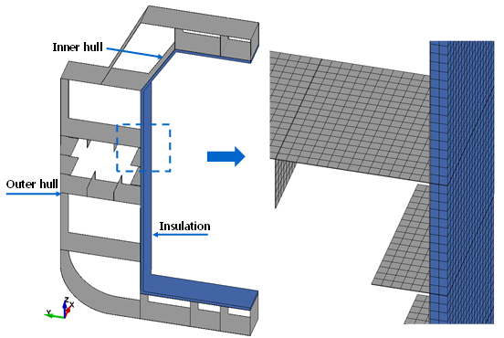
    Fig 2.8 Model for 2-dimensional heat transfer analysis
- **2.** **3-Dimensional heat transfer**
  - **(1)** When the analysis considering cofferdams is required, the heat transfer analysis model should be extended to both sides of the bulkhead of the cofferdam, and three-dimensional heat transfer analysis considering the length direction of the hull should be performed.
  - **(2)** The insulation and bulkhead are modeled on the LNG side of the inner hull.
  - **(3)** The transverse bulkhead should be considered in the finite element heat transfer analysis model. The bulkhead should only be insulted on the LNG contact surface and have a stiffener on the other side.
  - **(4)** The three-dimensional heat transfer analysis model is performed using a solid element or a shell element. When it is necessary to consider the temperature distribution in the thickness direction, the solid element should be used.
  - **(5)** When solid element are used, the mesh size shall not be greater than 200mm*200mm and shall be divided into two or more elements in the thickness direction. An example of a three-dimensional heat transfer model is shown in **Fig 2.9**.
  - **(6)** When using a shell element, the mesh size should be 200mm*200mm or less.
    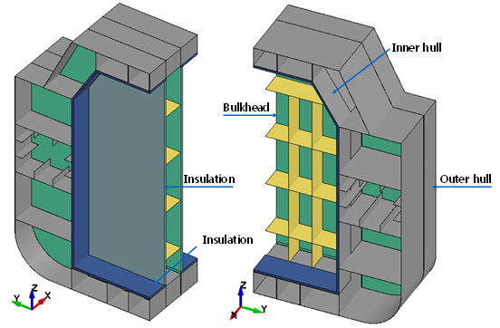
    Fig 2.9 Model for 3-dimensional heat transfer analysis

#### 202. Material Properties

- **1.** **General**
  - **(1)** Follow **Ch 2, Sec 1, 103..**

#### 203. Calculation Conditions

- **1.** **General**
  - **(1)** Follow **Ch 2, Sec 1, 104..**
  - **(2)** Convection, radiation and conduction according to the environment of each member should be considered as shown in **Figure 2.10** and **Table 2.19.**
  - **(3)** The temperature and heat transfer coefficient in **Table 2.19** shall be entered base on the results of **Ch 2, Sec 2.**

    | 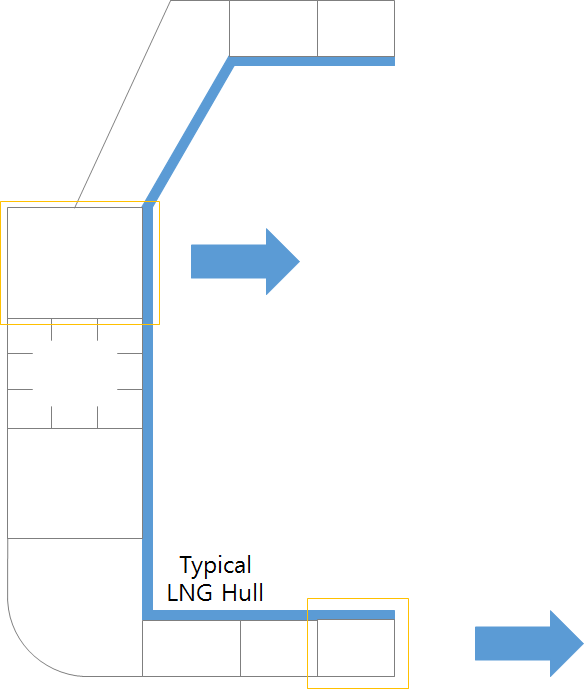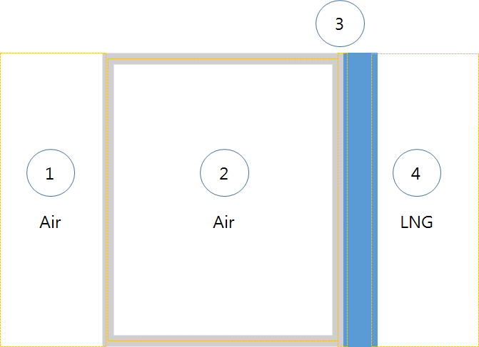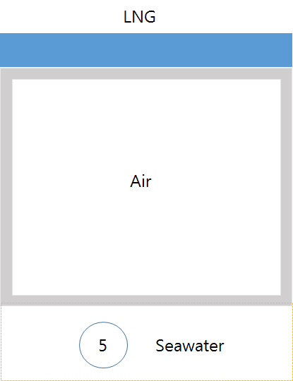 |
    | --- |
    | **Fig 2.10 Finite element modeling in heat transfer analysis of liquefied gas carrier hull** |

    | Structural part | Heat transfer process | Input for FEM analysis |
    | --- | --- | --- |
    | 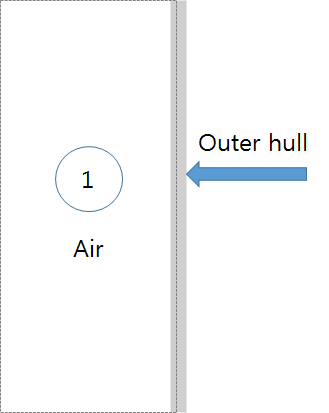 | Radiation | Air temperature Emissivity of outer hull surface |
    |   | Convection | Air temperature Convective heat transfer coefficient |
    |   | Conduction | Not considered |
    | 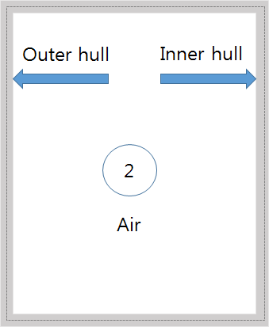 | Radiation | Air temperature of compartment View factor of compartment surface Emissivity of compartment surface |
    |   | Convection | Air temperature of compartment Convective heat transfer coefficient |
    |   | Conduction | Thermal conductivity and specific heat of steel |
    | 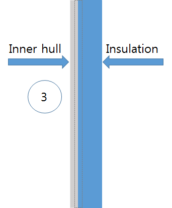 | Radiation | Not considered |
    |   | Convection | Not considered |
    |   | Conduction | Thermal conductivity and specific heat of steel and insulation |
    | 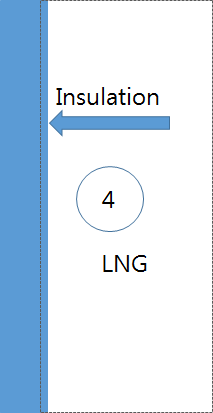 | Radiation | Not considered The temperature of liquefied gas is applied on the secondary barrier. |
    |   | Convection | Not considered The temperature of liquefied gas is applied on the secondary barrier. |
    |   | Conduction | Not considered The temperature of liquefied gas is applied on the secondary barrier. |
    | 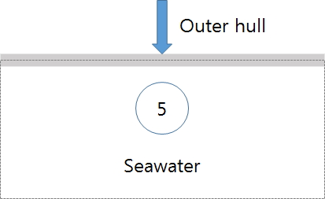 | Radiation | Not considered |
    |   | Convection | Seawater temperature Convective heat transfer coefficient |
    |   | Conduction | Not considered |

    .

#### 204. Result Derivation

- **1.** **General**
  - **(1)** Follow **Ch 2, Sec1, 105., 1**.
- **2.** **Selection of steel grade**
  - **(1)** Follow **Ch 2, Sec 1, 105., 2.**
  - **(2)** As shown in **Figure 2.11**, the steel of cofferdam surrounded by the design lower water line above and intersecting line between inner hull and cofferdam and steel inside 500mm from intersecting line between inner hull and cofferdam should be selected based on the temperature of mid-section of membrane tank.
    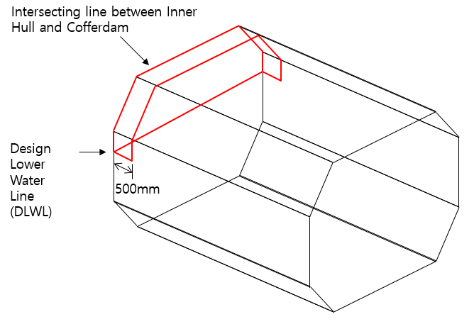
    Figure 2.11 Important consideration range in steel selection
- **3.** **Selection of welding consumable**
  - **(1)** Follow **Ch 2, Sec 1, 105., 3.**
  - **(2)** Selection of welding consumable is based on the steel grade determined using the average temperature of the member. 
