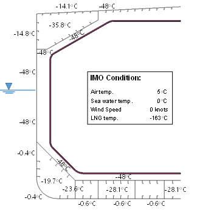
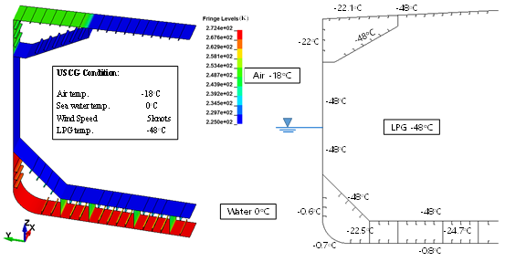
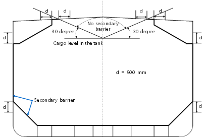

# Guidance of Heat Transfer Analysis for Ships Carring Liquefied Gases in Bulk/Ships Using Liquefied Gases as Fuels

> OTHER RULES AND GUIDANCE / GC-33-E / 2025 / EN / Guidance

## CHAPTER 3 HEAT TRANSFER ANALYSIS FOR INDEPENDENT TYPE A TANK

### Section 1 Analytical Heat Transfer Analysis

#### 101. Analysis Procedure

- **1.** **1**. Follow **Ch 2, Sec 1, 10**

#### 102. Modeling

- **1.** **1**. Follow **Ch 2, Sec 1, 102.**

#### 103. Material Properties

- **1.** **1**. Follow **Ch 2, Sec 1, 103.**

#### 104. Calculation Conditions

- **1.** **1**. Follow **Ch 2, Sec 1, 104.**

#### 105. Result Derivation

- **1.** **1**. Follow **Ch 2, Sec 1, 105.**
- **2.** **2**. **Figure 3.1** illustrates calculation results performed for a midship section of a type A LNG Carrier using analytical method.

  |  |
  | --- |
  | **Figure 3.1 Temperature calculation for Type A tank using analytical method** |

### Section 2 FEM HEAT TRANSFER ANALYSIS

#### 201. Modeling

- **1.** **1**. Follow **Ch 2, Sec 2, 20**
- **2.** **2**. The heat transfer of conduction through the supports(including vertical, anti rolling, anti pitching and anti floating) connecting the cargo tank with the inner hull should be considered.

#### 202. Material Properties

- **1.** **1**. Follow **Ch 2, Sec 2, 202.**

#### 203. Calculation Conditions

- **1.** **1**. Follow **Ch 2, Sec 2, 203.**

#### 204. Result Derivation

- **1.** **1**. Follow **Ch 2, Sec 2, 204.**
- **2.** **2**. A sample 2D model of the Type A hull for heat transfer analysis is presented in **Figure 3.2**.
- **3.** **3**. As shown ‘d’ in **Figure 3**., the steel on the secondary barrier should be extended 500mm toward the centerline from the intersection between the deck plate and a line at a static heel of ±30 degrees, inside the top side tank and hopper tank.

  |  |
  | --- |
  | **Figure 3.2 Temperature calculation for Type A tank using 2D FEM** |
  |  |
  | **Figure 3.3 Application range extension of secondary steel for Type A tank** |
