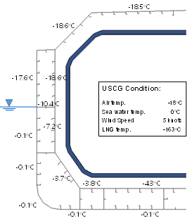
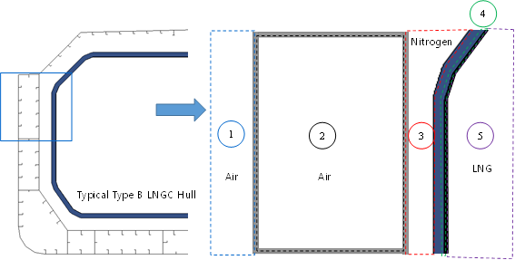
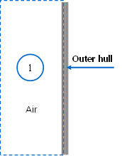
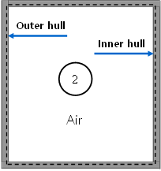
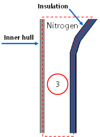
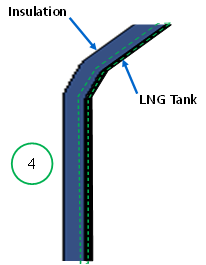
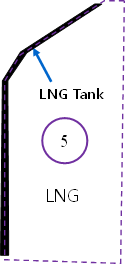
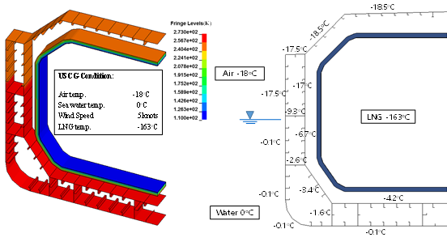
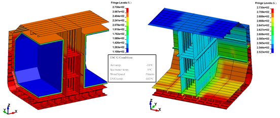

# Guidance of Heat Transfer Analysis for Ships Carring Liquefied Gases in Bulk/Ships Using Liquefied Gases as Fuels

> OTHER RULES AND GUIDANCE / GC-33-E / 2025 / EN / Guidance

## CHAPTER 4 HEAT TRANSFER ANALYSIS FOR INDEPENDENT TYPE B TANK

### Section 1 Analytical Heat Transfer Analysis

#### 101. Analysis Procedure

- **1.** **1**. Follow **Ch 2, Sec 1, 10**

#### 102. Modeling

- **1.** **1**. Follow **Ch 2, Sec 1, 102.**

#### 103. Material Properties

- **1.** **1**. Follow **Ch 2, Sec 1, 103.**

#### 104. Calculation Conditions

- **1.** **1**. Follow **Ch 2, Sec 1, 104.**

#### 105. Result Derivation

- **1.** **1**. Follow **Ch 2, Sec 1, 105.**
- **2.** **2**. **Figure 4.1** illustrates a temperature calculation results performed for a midship section of a Type B LNG carrier using analytical method.

  |  |
  | --- |
  | **Figure 4.1 Temperature calculation for Type B tank using analytical method** |

### Section 2 FEM HEAT TRANSFER ANALYSIS

#### 201. Modeling

- **1.** **1**. Follow **Ch 2, Sec 2. 20**
- **2.** **2**. The temperature calculation of independent type B tank is similar with the membrane type, but need to consider the gap between inner hull and the cargo tank. The heat transfer of conduction through the supports(including vertical, anti rolling, anti pitching and anti floating) connecting the cargo tank with the inner hull should be considered.

#### 202. Material Properties

- **1.** **1**. Follow **Ch 2, Sec 2. 202.**

#### 203. Calculation Conditions

- **1.** **1**. Follow **Ch 2, Sec 2. 203.**
- **2.** **2**. **Figure 4.2** and **Table 4.1** presents the application of FEM to modeling of overall heat transfer in the independent type B tank and the required input data for each form of heat energy transfer.

#### 204. Result Derivation

- **1.** **1**. Follow **Ch 2, Sec 2. 204.**
- **2.** **2**. **Figure 4-3** is one example of temperature analysis result for 2D FEM midship section.
- **3.** **3**. **Figure 4-4** illustrates a temperature calculation results performed for 3D FEM including cofferdam.
  
  Figure 4.2 Finite element modeling in heat transfer analysis of hull with independent type B tank at Temperature calculation

  | Parts | Heat Transfer Process | Required input data in FEM |
  | --- | --- | --- |
  |  | Radiation | Air temperature Outer hull surface emissivity |
  |   | Convection | Air temperature Convective heat transfer coefficient |
  |   | Conduction | Not considered |
  |  | Radiation | View factor of the enclosure surfaces Emissivity of enclosure surfaces |
  |   | Convection | Air properties such as conductivity and specific heat Convection heat transfer coefficient |
  |   | Conduction | Steel conductivity and specific heat |
  |  | Radiation | View factor of the enclosure surface Emissivity of enclosure surface |
  |   | Convection | Nitrogen properties such as conductivity and specific heat Convection heat transfer coefficient |
  |   | Conduction | Not considered |
  |  | Radiation | Not considered |
  |   | Convection | Not considered |
  |   | Conduction | Thermal material properties of insulation and LNG tank material such as conductivity and specific heat |
  |  | Radiation | Not considered |
  |   | Convection | Not considered The temperature of liquefied gas is applied on the primary barrier. |
  |   | Conduction | Not considered The temperature of liquefied gas is applied on the primary barrier. |

  
  Figure 4-3 Temperature distribution calculation by 2D FEM heat transfer analysis
  
  Figure 4-4 Temperature distribution in the cofferdam calculated by 3D FEM heat transfer analysis
  
