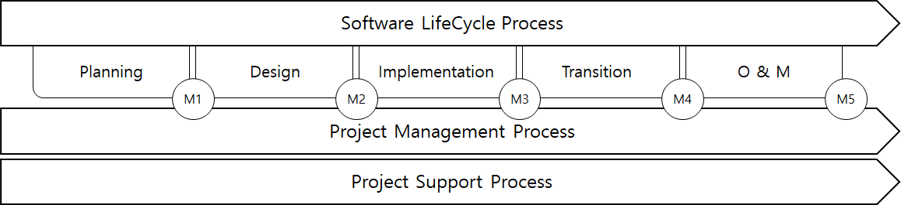

# Guidance for Integrated Software Process Management

> OTHER RULES AND GUIDANCE / GC-34-E / 2025 / EN / Guidance

## CHAPTER 3 SOFTWARE PROCESS

### Section 1 General

#### 101. General

- **1.** This guidance gives an overview of the steps and management methods that are aimed at the successful development and transition of the software. There are five phase of the Software Development Life Cycle (SDLC), management process, and support process.
- **2.** The SDLC described in this guidance is the least acceptable process. Milestones are those items that need to be fulfilled at each phase of the process being systematically processed and that the document shall ensure that the functions convey the meaning and intent of the functions. The milestones must be met before the end of each phase.

### Section 2 Roles and Responsibility of Stakeholder

#### 201. General

- **1.** The purpose of stakeholder requirements is to define the requirements of a system that can provide the services that users and other stakeholders need in a defined environment. Throughout the system's life cycle, it identifies the stakeholders or groups of stakeholders that are associated with the system, and identifies their needs, expectations, and desires. This common set of requirements represents the intended interactions between the system and the operational environment, and also serves as a reference for confirming the usefulness of each operational service result.
- **2.** Development and transition of integrated software requires a variety of organizations. Each process of the SDLC includes a number of requirements, activities and deliverables, in which various organizations carry out the requirements and activities.
- **3.** This guidance assumes that responsibility is assigned to the organization according to the activity, and that the assignment of activities clarifies the role and deliverable of the stakeholder organization at each phase.
- **4.** Stakeholders are organizations that are interested in the success of a project. Stakeholders in the integrated software SDLC process are defined in **202**. The responsibilities and roles may be combined in some cases. (For example, the Owner may be a User, and may be an Shipyard
- **5.** Manage stakeholder interactions, information flow and timeliness of information to maintain project schedules.

#### 202. Role of stakeholder

- **1.** **Owner**
  The owner is the stakeholder who acquires or procures integrated software, which is the organization that finances and initiates the project. In order to achieve the purpose of using integrated software, the requirements are presented to the developer, and the deliverables and requirements of each step are judged.
- **2.** **System Integrator (SI)**
  System integration organizations are responsible for the development of integrated systems. Depending on the ISPM system chosen, there may be multiple system integrators. The system integrator is an expert in the control system in charge and has an integrated awareness of the requirements of the control system to which the equipment is connected. The system integrator is responsible for the design of the integrated system, the creation of SRS & SDS, supplier management, integration and verification of the owner's permission and control system software. The owner can request information from the system integration organization as needed for the development of ConOps. The owner may select an SI to perform verification of the integrated system or the owner may require an independent third party verification. An SI or Shipbuilder organization may not transfer its responsibility when delegating SI activities to a third party. If the project size does not warrant a system integrator, the owner, user, or supplier organization of choice must carry out this responsibility.
  - **(1)** System integrators must currently have ISO 9001 or be at least CMMI level 2.
  - **(2)** Other software quality management systems may be specially considered by the Society. System integrators and shipyards are encouraged to guide suppliers to be informed of verification requirements and activities.
- **3.** **User**
  An individual or group who benefit from an integrated software converted during the integration software's usage period, responsible for the operation and maintenance phase of the system. Responsibility for maintenance ensures reliable operation throughout the life cycle of the system if improvements, upgrades and replacements or new components are added to the system.
- **4.** **Quality manager (V&V)**
  The quality manager receives the quality criteria, which are the owner's satisfaction criteria, from the system integrator and the software is closed loop (if specially considered) and software-in-the-loop (SIL) or hardware-in-the-loop (HIL) or The combination of these three methods identifies requirements defined in the Software Requirements Specification (SRS) and Integrated Software Design Specification (SDS). Verification and verification organizations can be part of the system integrator or be independent at the owner's request.
- **5.** **Shipbuilder**
  Ship builder means shipyard. The department within the shipyard may be an Shipbuilder if it has entered into a contract with the system integrator or meets the requirements of 104. SI. Shipbuilder performs integration verification activities when the ISPM control system is installed. Integration activities include verifying communications (consolidation checks) between equipment connected to the ISPM control system. Shipbuilder is responsible for the conversion (supply) of the ISPM control system desired by the owner under the contract.
- **6.** **Class Society (CS)**
  The Society reviews the documents produced during the development of the ISPM control system independent of the SI to ensure that stakeholders comply with these guidelines. However, verification tests for control systems rated IL2 or IL3 are to be carried out in the presence of the Society. Integrated verification tests carried out by Shipbuilder or its owners are to be carried out in the presence of the Society.
- **7.** **Supplier**
  An organization that performs development tasks during a process, either as a component of integrated software or as a contracted supplier of software. The developer shall provide the specifications and constraints of the system package that the developer supplies according to the specific scope and schedule assigned by the system integrator or the ship builder. Supplier verification of IL2 and IL3 supply equipment should be verified with the Society.
  - **(1)** The Supplier organization must currently have ISO 9001 or be at least CMMI level 2.
  - **(2)** Other software quality management systems shall follow the software conformance certification guidelines, if necessary.

### Section 3 ISPM Process

#### 301. General

This section outlines the five phases of the development lifecycle process, the project support process, and the project management process.

#### 302. Software Development Life Cycle (SDLC)

- **1.** The software development life cycle refers to a series of engineering plans for software development, from conception to disposal of computer-based control systems. Milestones (or step gates) are associated with each step or boundary of the SDLC and with the provision of specific step products.
- **2.** The software development life cycle is as follows:
  - **(1)** planning phase
    The following activities are carried out to determine the direction and scope of the project and to define the integrated system in detail.
  - **(2)** Development phase (RD)
    Developers and programmers of system integrators write documentation that can be used to configure software for the features defined in ConOps, taking into account the system architecture.
  - **(3)** implementation phase (CON)
    Emphasis is placed on converting the requirements and specifications of SRS and SDS into functional integrated system code. In addition, testing activities focus on the software aspect of the system.
  - **(4)** Verification, Verification phase (V & V)
    The system software aims to operate as specified in the SRS and SDS. ConOps is a document used for verification as well as commissioning and sea commissioning activities, and quality managers must create a verification plan and set up a simulator according to the verification method selected at the planning process.
  - **(5)** Transition phase
    After verification of the finished software, all the work required to convert the integrated system to owners and users should be completed. The software is installed on the hardware chosen by the owner and provided with support services. The system integrator must submit all documentation to the owner and user.
  - **(6)** Maintenance phase (O & M)
    It covers operational and maintenance activities, including scheduled and unscheduled upgrade and troubleshooting activities, and includes disposal activities.

#### 303. Project process

The project management process (planning, evaluation and engagement) is at the core of all management activities. These processes present a general approach to managing a project or process. The project support process is evident in the management of all tasks that span the entire organization, from one organization to one lifecycle process and its tasks. In this International Standard, projects are used as contexts to represent processes related to planning, execution, evaluation and coordination.

- **1.** **Project management process**
  The project management process:
  - **(1)** project planning process
  - **(2)** project evaluation and control process
- **2.** **Project support process**
  The project support process consists of the following processes:
  - **(1)** Decision Management Process
  - **(2)** risk management process
  - **(3)** configuration management process
  - **(4)** information management process
  - **(5)** measuring process 
