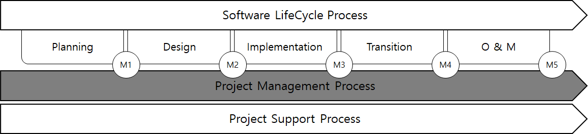
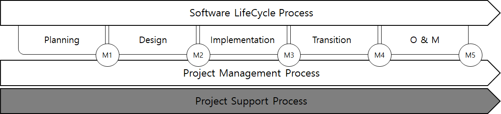

# Guidance for Integrated Software Process Management

> OTHER RULES AND GUIDANCE / GC-34-E / 2025 / EN / Guidance

## CHAPTER 4 PROJECT PROCESS

### Section 1 Project Management Process

#### 101. General

The project management process consists of the following:

#### 102. Project planning process

- **1.** **General**
  The project management process:
  - **(1)** The purpose of the Project Planning Process is to produce and communicate effective and workable project plans.
  - **(2)** This process determines the scope of project management and technical activities and identifies a schedule for project conduct, including process deliverable, project output, and project resources.
  - **(3)** The strategies defined in each of the other processes provide input are integrated in the Project planning process.
- **2.** **Activities**
  The planning process shall implement activities in accordance with applicable organization policies and procedures as follow.
  - **(1)** project definition
    - **(A)** Identify project objectives and constraints.
      - **(a)** Objectives and constraints include performance and other quality aspects, cost, time and stakeholder satisfaction.
      - **(b)** Each objective is identified with a level of detail that permits selection, tailoring and implementation of the appropriate processes and activities.
    - **(B)** Define the project scope as established in the agreement.
      - **(a)** The project includes all the relevant activities required to satisfy business decision criteria and complete the project successfully.
      - **(b)** A project can have responsibility for one or more processes in the complete system life cycle.
      - **(c)** Planning includes appropriate actions for maintaining project plans, performing assessments and controlling the project.
    - **(C)** Define and maintain a life cycle model that is comprised of processes using the defined life cycle models of the organization.
  - **(2)** Plan project and technical management
    - **(A)** Define and maintain a project schedule based on project objectives and work estimates.
      - **(a)** This includes definition of the duration, relationship, dependencies and sequence of activities, achievement milestones, resources employed and schedule reserves for risk management necessary to achieve timely completion of the project.
    - **(B)** Define project achievement criteria for the life cycle process decision gates, delivery dates and major dependencies on external inputs or outputs.
      - **(a)** The time internals between internal reviews are defined in accordance with organizational policy on issues such as business and system criticality, schedule and technical risks.
    - **(C)** Define the project costs and plan a budget.
      - **(a)** Costs are based on the schedule, labor estimates, infrastructure costs, procurement items, acquired service and enabling system estimates, and budget reserves for risk management.
    - **(D)** Establish the structure of authorities and responsibilities for project work.
      - **(a)** This includes defining the project organization, staff acquisitions, and the development of staff skills.
      - **(b)** Authorities includes, as appropriate, the legally responsible roles and individuals, e.g., design authorization, safety authorization, and award of certification or accreditation.
    - **(E)** Define the infrastructure and services required by the project.
      - **(a)** This includes defining the capacity needed, its availability and its allocation to project tasks.
      - **(b)** Infrastructure includes facilities, tools, communications, and information technology assets.
      - **(c)** The requirements for enabling systems for each life cycle stage are also specified.
    - **(F)** Plan the acquisition of materials, goods and enabling system services supplied from outside the project.
      - **(a)** This includes, as necessary, plans for solicitation, supplier selection, acceptance, contract administration and contract closure.
    - **(G)** Generate and communicate a plan for project and technical management and execution, including reviews.
  - **(3)** Activate the project
    - **(A)** Obtain authorization for the project.
    - **(B)** Submit requests and obtain commitments for necessary resources to perform the project.
    - **(C)** Implement project plans in order to meet the goal and requirements of the project.
- **3.** **deliverable**
  - **(1)** project management plan
  - **(2)** Project Contract Management Plan
  - **(3)** Project change management plan
  - **(4)** Project financial management plan
  - **(5)** project control plan
  - **(6)** Project quality assurance plan
  - **(7)** software development plan
  - **(8)** documentation plan

#### 103. Project assessment and control process

- **1.** **General**
  - **(1)** The purpose of the Project assessment and control process is as follow.
    - **(A)** To assess whether the plans are integrated, aligned, and feasible.
    - **(B)** To determine the status of the project, technical and process performance
    - **(C)** To ensure that the performance is according to plans and schedules, within projected budgets, to satisfy technical objectives.
  - **(2)** This process evaluates, periodically and at major events, the progress and achievements against requirements, plans and overall business objectives. Information is communicated for management action when significant variances are detected.
  - **(3)** This process also includes redirecting the project activities and tasks, as appropriate, to correct identified deviations and variations from other project management or technical processes.
  - **(4)** Redirection may include re-planning as appropriate.
- **2.** **Activities**
  The process containing the Project assessment and control process shall implement the activities in accordance with applicable organization policies and procedures as follows.
  - **(1)** Plan for project assessment and control
    - **(A)** Define the project assessment and control strategy
      - **(a)** The expected Project assessment and control activities are identified including planned assessment methods and timeframes, necessary management and technical reviews.
  - **(2)** Assess the project
    - **(A)** Assess alignment of project objectives and plans with the project context.
    - **(B)** Assess management and technical plans against objectives to determine adequacy and feasibility.
    - **(C)** Assess project status against appropriate project plans to determine actual and projected cost, schedule and quality variations.
    - **(D)** Assess the adequacy of roles, responsibilities, accountabilities, and authorities.
      - **(a)** Assessment includes the adequacy of personnel competencies to perform project roles and accomplish project tasks.
      - **(b)** Objective measures are used wherever possible like efficiency of resource use, project achievement.
    - **(E)** Assess the adequacy and availability of resources.
      - **(a)** Resources include infrastructure, personnel, funding, time, or other pertinent items.
      - **(b)** Assessment includes confirming that intra-organizational commitments are satisfied.
    - **(F)** Assess project progress using measured achievement and milestone completion.
      - **(a)** Assessment includes collecting and evaluating data for labor, material, service costs, and technical performance as well as other technical data about objectives, such as affordability.
      - **(b)** Assessment results are compared against measures of achievement.
      - **(c)** Conducting effectiveness assessments is included to determine the adequacy of developing system against requirements.
      - **(d)** The readiness of enabling systems are also included to deliver their services when needed.
    - **(G)** Conduct required management and technical reviews, audits and inspections.
      - **(a)** These are conducted to determine readiness to proceed to the next stage of the life cycle or project milestone;
      - **(b)** To help ensure that project and technical objectives are being met; or
      - **(c)** To obtain feedback from stakeholders
    - **(H)** Monitor critical processes and new technologies.
      - **(a)** Identifying and evaluating technology maturity and insertion are included.
    - **(I)** Analyze measurement and make recommendations.
      - **(a)** Measurement results are analyzed to identify deviations, variations or undesirable trends from planned values that include potential concerns, and to make appropriate recommendations for corrections or preventive actions.
      - **(b)** Analysis includes, where appropriate, statistical analysis of measures that indicates trends, e.g. fault density to indicate quality of outputs, distribution of measured parameters that indicate process repeatability.
    - **(J)** Record and provide status and findings from assesment tasks
      - **(a)** The materials recorded and provided are generally designated in the agreement, policies, and procedures.
    - **(K)** Monitor process execution within the project
      - **(a)** This includes the analysis of process measures and review of trends with respect to project objectives.
  - **(3)** Control the project
    - **(A)** Initiate necessary actions needed to address identified issues.
      - **(a)** The initiation occurs when project or technical achievement is not meeting planned targets.
      - **(b)** This includes corrective, preventive, and problem resolution actions.
      - **(c)** Actions generally require replanning or reassignment of personnel, tools and infrastructure assets when inadequacy or unavailability has been detected, or when project or technical achievement exceeds targets or plan.
      - **(d)** The actions often impact the cose, schedule, or technical scope or definition.
      - **(e)** The actions sometimes require changes to the implementation and execution of the software life cycle processes.
      - **(f)** To confirm their adequacy and timeliness, actions are recorded and reviewed.
    - **(B)** Initiate necessary project replanning
      - **(a)** Project replanning is initiated when project objectives or constraints have changed, or when planning assumptions are shown to be invalid.
      - **(b)** Changing the agreement between system integrator and supplier may be considered, if necessary.
    - **(C)** Initiate change actions when there is a contractual change to cost, time or quality due to the impact of an system integrator or supplier request.
      - **(a)** This includes consideration of modified terms and conditions for supply or initiating new supplier selection.
    - **(D)** Authorize the project to proceed toward the next milestone or event if justified.
      - **(a)** This process is used to reach agreement on milestone completion.
- **2.** **Output**
  - **(1)** project status assessment
  - **(2)** carry out quality assurance
  - **(3)** project team evaluation
  - **(4)** project progress evaluation
  - **(5)** Management and technical review and inspection
  - **(6)** Key Process / New Technology Observation
  - **(7)** data analysis and recommendations
  - **(8)** Periodic report
  - **(9)** Project control plan
  - **(10)** Project change report
  - **(11)** Requirements Status Report
  - **(12)** Project Progress Report

### Section 2 Support Process

#### 201. General

The project support process consists of as follows.

#### 202. Decision Management Process

- **1.** **General**
  - **(1)** The purpose of the Decision Management Process is to provide a structured, analytical framework for objectively identifying, characterizing and evaluating a set of alternatives for a decision at any point in the life cycle and select the most beneficial course of action.
    - **(A)** This process is used to resolve technical or project issues and respond to requests for decisions encountered during the software life cycle, in order to identify the alternative(s) that provides the preferred outcomes for the situation.
    - **(B)** Alternative actions are identified and selected of which are suitable for the situation of its process.
    - **(C)** Key study results such as assumptions and decision rationale data are maintained to inform decision-makers and support future decision-making.
- **2.** **Activities**
  The process containing the Decision Management Process shall implement the following activities and tasks in accordance with applicable organization policies and procedures.
  - **(1)** Prepare for decisions
    - **(A)** Define a decision management strategy.
      - **(a)** A decision management strategy includes the identification and allocation of responsibility for, and authority to make, decisions and the identification of decision categories and a prioritization scheme.
      - **(b)** Decisions may arise as a result of an effectiveness assessment, a technical trade-off, a problem needing to be solved, an action needed as a response to risk exceeding the acceptable threshold, a new opportunity or approval for project progression to the next life cycle process.
      - **(c)** The degree of rigor and formality for applying to the decision analysis complies with organization or project guidelines.
    - **(B)** Identify the circumstances and need for a decision.
      - **(a)** Record and categorize problems or opportunities and the alternative courses of action that will resolve their outcome.
    - **(C)** Involve relevant stakeholders in the decision-making in order to draw on experience and knowledge.
      - **(a)** It should need to identify the subject matter expertise for the analysis and the decision.
  - **(2)** Analyze the decision information
    - **(A)** Select and declare the decision management strategy for each decision.
      - **(a)** The degree of rigor required to resolve these problems or opportunities is determined, as well as the data and system analysis needed for evaluating the alternatives.
    - **(B)** Determine desired outcomes and measurable success criteria.
      - **(a)** Weighting factors for each criterion of decision management are determined, and the desired value and the threshold values for all quantifiable criteria.
    - **(C)** Identify the trade space and alternatives.
      - **(a)** They are qualitatively screened to reduce alternatives to a manageable number for further detailed systems analysis when a large number of alternatives exist.
      - **(b)** The screening is based on qualitative assessments of such factors as risk, cost, schedule, and regulatory impacts.
      - **(c)** The trade space is to find alternatives for best performance under cost constraint, or optimized alternatives under an acceptable performance area.
    - **(D)** Evaluate each alternative, against the criteria.
  - **(3)** Make and manage decisions
    - **(A)** Determine preferred alternative for each decision.
      - **(a)** Alternatives are evaluated quantitatively, using the selection criteria.
      - **(b)** The selected alternative generally provides an optimization of, or improvement in, an identified decision.
    - **(B)** Record the resolution, decision rationale, and assumptions.
    - **(C)** Record, track, evaluate and report decisions.
      - **(a)** As stipulated in agreements or organizational procedures, problems, opportunities, and their disposition are recorded to permit auditing and learning from experience.
      - **(b)** The organization is able to confirm that problems have been effectively resolved, the adverse trends have been reversed, and that advantage has been taken of opportunities.

#### 203. Risk management process

- **1.** **General**
  - **(1)** The purpose of the risk management process is to identify, analyse, treat and monitor the risks continually.
  - **(2)** The Risk management process is a continual process for systematically addressing risk throughout the life cycle of a system product or service.
  - **(3)** This process applied to risks related to the acquisition, development, maintenance or operation of a system.
- **2.** **Activities**
  The process containing the Risk Management Process shall implement the following activities and tasks in accordance with applicable organization policies and procedures.
  - **(1)** Plan risk management
    - **(A)** Define risk management policies.
      - **(a)** Risk management policies includes the risk management process of all supply chain suppliers and describes how risks from all suppliers will be raised to the next level(s) for incorporation in the project risk process.
    - **(B)** Define and record the context of the Risk management process.
      - **(a)** Record includes a description of stakeholders’ perspectives, risk categories, and a description of the technical and managerial objectives, assumptions and constraints.
      - **(b)** The risk categories include the relevant technical areas of the system and facilitate identification of risks across the life cycle of the software.
      - **(c)** The aim of this activities is to generate a comprehensive list of risks
      - **(d)** The list of risks may be capable to create, enhance, prevent, degrade, accelerate or delay the events related achievement of objectives.
      - **(e)** Opportunities, which are one type of risk, provide potential benefits for the system or project.
      - **(f)** Pursuing each opportunity has associated risks that detract from the expected benefit.
      - **(g)** This includes the associated risks not only with pursuing an opportunity but also not achieving the effects of the opportunity.
  - **(2)** Manage the risk profiles
    - **(A)** Define and document the risk thresholds and conditions under which a level of risk may be accepted.
    - **(B)** Establish and maintain a risk profile. The risk profile consists of as follows.
      - **(a)** Risk management context
      - **(b)** a record of each risk’s state including its likelihood of occurrence, consequences, and risk thresholds
      - **(c)** the priority of each risk based on risk criteria supplied by the stakeholders
      - **(d)** risk management action requests along with the status of their treatment
      - **(e)** The risk profile is updated when there are changed in an individual risk’s state.
      - **(f)** The priority in the risk profile is used to determine the application of resources for treatment.
    - **(C)** Periodically communicate the relevant risk profile to stakeholders based upon their needs.
  - **(3)** Analyze risks
    - **(A)** Identify risks by categories described in the risk management context.
      - **(a)** Risks are commonly identified through various analyses, readiness assessment and trade studies.
      - **(b)** Risks may be identified early in the life cycle and continue into the utilization, support, and retirement of the system.
      - **(c)** In addition, risks may be identified through the analysis of the measures of the system.
    - **(B)** Estimate the probability of occurrence and consequences of each identified risk.
    - **(C)** Evaluate each risk against its risk thresholds.
    - **(D)** For each risk that is above its risk threshold, define and recommended treatment strategies and measures.
      - **(a)** Risk treatment strategies include eliminating the risk, reducing its likelihood of occurrence or severity of consequency, or accepting the risk, but are not limited.
      - **(b)** Treatments include taking or increasing risk in order to pursue an opportunity.
      - **(c)** Measures provide information about the effectiveness of the treatment alternatives.
  - **(4)** Treat risks
    - **(A)** Identify recommended alternatives for risk treatment.
    - **(B)** Implement risk treatment alternatives for which the stakeholders determine that actions should be taken to make a risk acceptable.
    - **(C)** When the stakeholders accept a risk that exceeds its threshold, consider it a high priority and monitor it continuously to determine if any future risk treatment actions are necessary.
    - **(D)** Once a risk treatment is selected, ensure management actions in accordance with the assessment and control activities in **103. 2** of this standard.
  - **(5)** Monitor risks
    - **(A)** Continuously monitor all risks and the risk management context for changes and evaluate the risks when their state has changed.
    - **(B)** Implement and monitor measures to evaluate the effectiveness of risk treatments.
    - **(C)** Continuously monitor for new risks and sources throughout the life cycle.

#### 204. Configuration management process

- **1.** **General**
  The purpose of the Configuration Management Process is to manage and control system elements and configurations over the life cycle. CM also manages consistency between a product and its associated configuration definition.
- **2.** **Activities**
  The process containing the Configuration management process shall implement the following activities and tasks in accordance with applicable organization policies and procedures.
  - **(1)** Plan Configuration management
    - **(A)** Define a configuration management strategy.
      - **(a)** Configuration management includes details as follows:
      - **(i)** Roles, responsibilities, accountabilities, and authorities
        - **(ii)** Disposition of, access to, release of and control of changes to configuration items.
        - **(iii)** The necessary baselines to be established.
        - **(iv)** The locations and conditions of storage, the storage media and their environment, in accordance with designated levels of integrity, security and safety.
      - **(v)** The criteria or events for commencing configuration control and maintaining baselines of evolving configurations.
        - **(vi)** The audit strategy and the responsibilities for assessing continual integrity and security of the configuration definition information.
        - **(vii)** Change management, including any planned configuration control boards, regular and emergency change requests; and procedures for change management.
      - **(b)** The configuration management strategy needs to identify how configuration management will be coordinated across the set of system integrator, supplier, and supply chain organizations.
    - **(B)** Define the archive and retrieval approach for configuration items, configuration management artifacts and data.
  - **(2)** Perform configuration identification
    - **(A)** Identify the system elements and information items that are configuration items.
      - **(a)** Configuration items receive special attention.
      - **(b)** The items are assigned unique identifiers and are the subject of reviews and monitoring.
      - **(c)** Items generally include requirements, product and system elements, information items, and baselines.
    - **(B)** Identify the hierarchy and structure of system information.
    - **(C)** Establish system, system element, and information item identifiers.
      - **(a)** Identifiers are traceable to their specifications or equivalent, recorded descriptions.
    - **(D)** Define baselines through the life cycle.
      - **(a)** Baselines capture the evolving configuration states of system elements at designated times or under defined circumstances.
      - **(b)** Baselines form the basis for the next change.
    - **(E)** Obtain system integrator and supplier agreement to establish a baseline.
      - **(a)** The project assessment & control process is used to reach agreement.
  - **(3)** Perform configuration change managementConfiguration change management establishes procedures and methods for managing change to a baseline once it is established.
    - **(A)** Identify and record Requests for Change and Requests for Variance.
    - **(B)** Coordinate, evaluate, and disposition Requests for Change and Requests for Variance.
      - **(a)** Impact assessment of proposed changes including impact on project plans, risks, and quality is to be carried out.
      - **(b)** A decision is made on whether to implement or close the change request.
    - **(C)** Track and manage approved changes to the baseline, Requests for Change, and Requests for Variance.
      - **(a)** This includes tracking, scheduling, and closing changes.
      - **(b)** Any changes and rationales are recorded.
  - **(4)** Perform configuration status accounting
    - **(A)** Develop and maintain the configuration management status information, for system elements, baselines, and releases.
      - **(a)** Configuration status accounting provides the data on the status of controlled products needed to make decisions regarding system elements throughout system life cycle.
      - **(b)** Configuration information permits forward and backward traceability to other configuration states.
    - **(B)** Capture, store and report configuration management data.
  - **(5)** Perform configuration evaluation
    - **(A)** Identify the need for configuration management monitoring and schedule for audit.
    - **(B)** Verify the product configuration meets the configuration requirements.
    - **(C)** Monitor the incorporation of approved configuration changes.
    - **(D)** Ass whether the system meets baseline functional and performance capabilities.
    - **(E)** Assess whether the system conforms to the operational and configuration information items.
    - **(F)** Record the configuration management audit results and disposition action items.
  - **(6)** Perform release control
    - **(A)** Approve system releases and deliveries.
      - **(a)** The purpose of a release is to authorize the use of a system for a specific purpose, with or without restrictions.
      - **(b)** Releases generally include a set of changes.
      - **(c)** Approval of a release generally includes acceptance of the verified and validated changes.
    - **(B)** Track and manage system releases and deliveries.
      - **(a)** Master copies of all system elements are maintained for the life of the system.

#### 205. Information management process

- **1.** **General**
  - **(1)** The purpose of the Information Management Process is to generate, obtain, confirm, transform, retain, retrieve, disseminate and dispose of information, to designated stakeholder.
  - **(2)** Information management plans, executes, and controls the provision of information to designated stakeholders that is unambiguous, complete, verifiable, consistent, modifiable, traceable, and presentable.
  - **(3)** Information includes technical, project, organizational, agreement and user information. Information is often derived from data records of the organization, system, process, or project.
- **2.** **Activities**
  The process containing the Information management process shall implement the following activities and tasks in accordance with applicable organization policies and procedures.
  - **(1)** Prepare for Information management
    - **(A)** Define the strategy for information management.
      - **(a)** Information about the same topic can be developed in different ways at different points in the life cycle and for different audiences.
    - **(B)** Define the items of information that will be managed.
      - **(a)** Information includes that will managed during the software life cycle and possibly maintained for a defined period beyond.
      - **(b)** When define the items is done according to organizational policy, agreements, or legislation.
    - **(C)** Designate authorities and responsibilities for information management
      - **(a)** Information is identified accordingly, where restrictions or constraints due to legislation, security and privacy.
      - **(b)** People having knowledge of such items of information specified in **(a)** are informed of their obligations and responsibilities.
    - **(D)** Define the content, formats and structure of information items.
    - **(E)** Define information maintenance actions.
      - **(a)** Information maintenance includes status reviews of stored information for integrity, validity and availability.
  - **(2)** Perform information management
    - **(A)** Obtain, develop, or transform the identified items of information.
      - **(a)** Reviewing, validating, and editing information are included per information standards.
    - **(B)** Maintain information items and their storage records, and record the status of information.
      - **(a)** Items are maintained according to integrity, security and privacy requirements.
      - **(b)** The status of information items is maintained such as version description, data of issue or validity date, record of distribution, security classification.
      - **(c)** The source data and tools used to transform information, along with the resulting documentation is placed under configuration control in accordance with the Configuration management process.
    - **(C)** Publish, distribute or provide access to information and information items to designated stake holders.
      - **(a)** Information is provided to designated stakeholders parties in an appropriate form, as required by agreed schedules or defined circumstances.
    - **(D)** Archive designated information.
      - **(a)** Archive is done in accordance with the audit, knowledge retention, and project closure purposes.
      - **(b)** The media, location and protection of the information are selected in accordance with the specified storage Information is provided to designated stakeholders
    - **(E)** Dispose of unwanted, invalid or unverifiable information.
      - **(a)** This is done in accordance with organization policy, and security and privacy requirements.

#### 206. Measurement Process

- **1.** **General**
  The purpose of the Measurement process is to collect, analyze, and report objective data and information to support effective management and demonstrate the quality of the products, services, and processes.
- **2.** **Activities**
  The process containing the Measurement process shall implement the following activities and tasks in accordance with applicable organization policies and procedures.
  - **(1)** Prepare for measurement
    - **(A)** Define the measurement strategy.
    - **(B)** Describe the characteristics of the organization that are relevant to measurement.
    - **(C)** Identify and prioritize the information needs.
    - **(D)** Select and specify measures that satisfy the information needs.
    - **(E)** Define data collection, analysis, and reporting procedures.
    - **(F)** Define criteria for evaluating the information products and the Measurement process.
    - **(G)** Identify and plan for the necessary enabling systems or services to be used.
  - **(2)** Perform measurements
    - **(A)** Integrate procedures for data generation, collection, analysis and reporting into the relevant processes.
    - **(B)** Collect, store, and verify data.
    - **(C)** Analyze data and develop information products.
    - **(D)** Record results and inform the measurement users.
      - **(a)** The measurement analyses results are reported to relevant stakeholders in a timely, usable fashion to support decision making and assist in corrective actions, risk management, and improvements. 
