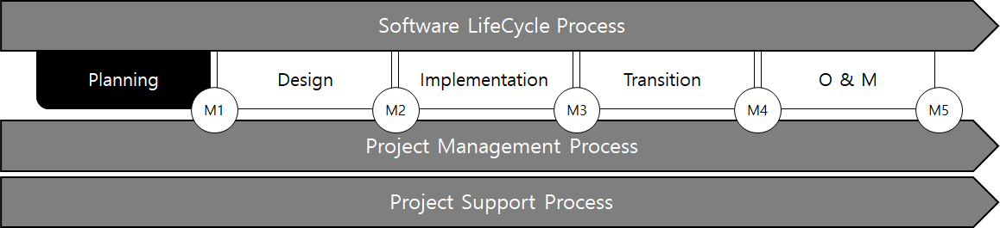
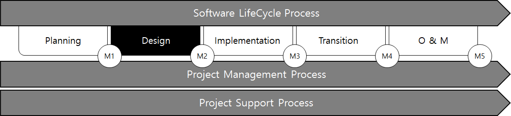
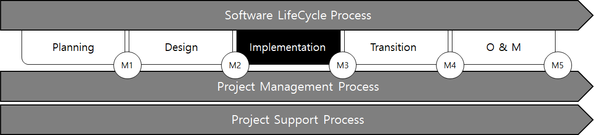
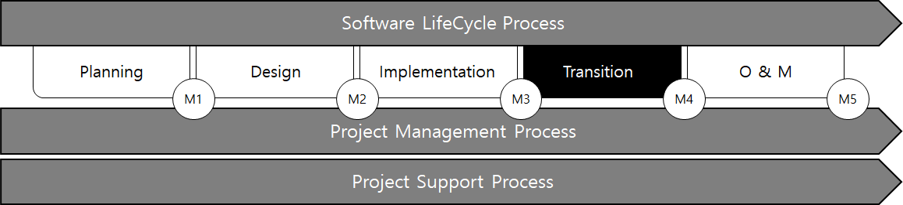
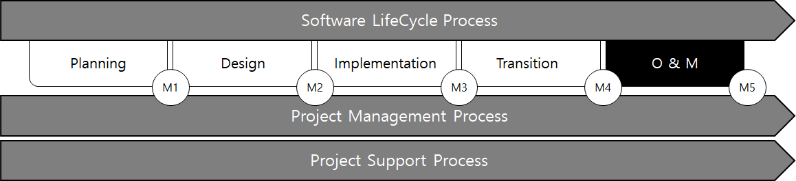

# Guidance for Integrated Software Process Management

> OTHER RULES AND GUIDANCE / GC-34-E / 2025 / EN / Guidance

## CHAPTER 5 SOFTWARE LIFE CYCLE PROCESS

### Section 1 Planning Process

#### 101. General

- **1.** The planning process identifies stakeholders who are involved with the integrated software throughout the software life cycle and identifies their needs and requirements.
- **2.** The planning process defines the integrated software with sufficient detail to enable safety review and integrity level assessment, taking into account the needs and requirements of stakeholders.
- **3.** The purpose of planning process is to complete ConOps, including the architecture, standards, descriptions and requirements required by the system integrator (SI) to begin the development phase and identify the suppliers of the Human Machine Interfaces (HMIs) and integrated systems connected to the package.
- **4.** The planning process establishes an integrity level (IL) for the function, which is applied to the appropriate software module in the development process.

#### 102. Activity

During the planning process, this process identifies stakeholders and identify and assess the requirements for integrated software configuration. The activities of this process were developed with reference to IEEE 12207-1-2008 Second Edition, 2008-02-01, IEEE Systems and Software Engineering-Software Life cycle Process.

| No. | Activity |
| --- | --- |
| **Owner** |   |
| 1 | Assign roles and responsibilities, Owner’s team members, Users, and SI |
| 2 | Assign team member to Owner’s team members |
| 3 | Update of entire project and general system requirements |
| 4 | Development of MOC Procedure for Integrated Control System |
| 5 | Development Process Tracking with SDLC |
| 6 | Coordination of work, designing conflict resolution |
| 7 | Identify integrated system components |
| 8 | ARMS consideration |
| 9 | Manage safety review, provide Result Documents |
| 10 | Provide integrity level definition |
| 11 | Independent operating means of essential systems from integrated systems |
| 12 | Assign IL Numbers to All Functions of ISPM Control System |
| 13 | Select verification method |
| 14 | Incorporate Suppliers V&V Reports &/or V&V Plans for packages |
| 15 | Develop and provide ConOps for review |
| 16 | Report of consolidated comments from ConOps Review |
| 17 | Recommended Matrix |
| 18 | Provide support information to SI during the planning process |
| 19 | Choose lifecycle Management for Integrated Systems |
| 20 | Grant authorization to Proceed to Implementation process |
| **User** |   |
| 1 | Assign team member to User |
| 2 | Assign roles and responsibilities to User’s team members |
| 3 | Support Owner with tradeoffs, conflict resolution |
| 4 | Support minimum requirements and design |
| 5 | Participate in safety review |
| 6 | Participate in Integrity Level assignment meetings |
| 7 | Support Owner and SI with information requests |
| 8 | ConOps Review |
| 9 | Provide component description of integrated system |
| 10 | Provide manual of functional activity during normal, degraded or failed condition |

| No. | Activity |
| --- | --- |
| **SI** |   |
| 1 | Collect requirements from owner |
| 2 | Assign Integrator’s senior technical member |
| 3 | Provide current ISO9001 or CMMI Level 2 Certificates |
| 4 | Development process tracking with SDLC |
| 5 | Collect subcontractors constraints |
| 6 | Design tradeoffs, conflict resolution |
| 7 | Provide to organizations when a canonical integration model has been developed |
| 8 | Support Owner with identifying all integrated system functions |
| 9 | System requirements analysis |
| 10 | Participate in a safety review meeting |
| 11 | Assist Owner with IL assignment |
| 12 | System integration architecture design |
| 13 | Obsolescence plan for hardware |
| 14 | Obsolescence plan for Software |
| 15 | Review selected verification method |
| 16 | ConOps Review |
| **Supplier** |   |
| 1 | Provide equipment restrictions or constraints to the requesting organization |
| 2 | V&V report for packages connected to the ISPM control system |
| 3 | V&V Plan for Packages Connected to ISPM Control Systems |
| 4 | Provide current ISO 9001 Certificate |
| 5 | Provide to organizations when a canonical integration model has been developed |

#### 102. Planning process development

- **1.** Adjustment, identification, and conflict resolution of design work (integrated system for suppliers) shall be documented. The standards, safety, security and human factors used shall be documented. It is recommended to manage the configuration of documents resulting from the analysis of the above factors.
- **2.** The basic integration model provides a common basis for communication between relevant software modules in integrated software, helping to identify problems among stakeholders and determine solutions.
  - **(1)** It is recommended that SI define the basic integrated model used throughout the project and provide a basic integrated model to all stakeholders and suppliers early in the planning phase.

#### 103. Integrated Model Requirements Analysis

- **1.** The SI shall analyse the requirements of the integrated model. An analysis of the requirements of the integrated software is an activity for the development of ConOps and focuses on the compromises involved in establishing the overall requirements of the integrated software.
- **2.** The following shall be documented..
  - **(1)** Functional requirements, characteristics of the entire system
  - **(2)** Accessibility
  - **(3)** Reliability
  - **(4)** Maintenance
  - **(5)** Safety
- **3.** Additional considerations for reliability, accessibility, maintainability and safety (RAMS) are as follows.
  - **(1)** Security
  - **(2)** Human Factors Engineering Interface Requirements
  - **(3)** Design constraints
  - **(4)** Maintenance
  - **(5)** Qualification requirements
- **4.** The requirements of the integrated model shall be evaluated by considering as follows:
  - **(1)** Traceability
  - **(2)** Consistency
  - **(3)** Testability
  - **(4)** Feasibility of operations and maintenance

#### 104. Integrated Model Requirements Analysis

- **1.** Integrated model architecture design is an activity for ConOps development. The integrated model architecture design activity creates the system's top-level architecture. This architecture identifies and enables grouping. Recommended grouping configurations are as follows.
  - **(1)** Hardware
  - **(2)** Software
  - **(3)** Manual operation items
- **2.** All software requirements shall be presented in a traceability matrix.
- **3.** The recommended criteria for evaluating integrated model architectures are as follows.
  - **(1)** Traceability
  - **(2)** Consistency
  - **(3)** Appropriateness
  - **(4)** Feasibility

#### 105. Risk management

Safety reviews of defined functions shall be performed to facilitate identification of critical functions, such as essential and safety functions.
The technologies used for the integrity level (IL) assessment in the ANSI / ISA-84 and IEC61508 processes are available on demand. Safety reviews can be combined with reviews of other safety and operational possibilities, hardware FMEA or software FMECA.

- **1.** Safety Review and New Technology
  - **(1)** SIS Safety System
    Integrated or unintegrated SIS safety systems shall comply with ANSI / ISA-84 or IEC61508 for safety integrity level (SIL) assessment.
  - **(2)** Safety review
    Safety reviews shall be carried out on integrated systems and associated packages, units and connected equipment. It is recommended to carry out safety reviews in the presence of SI, owners, users, shipbuilders and the Society.
  - **(3)** Review of ConOps
  - **(4)** new or untested technology
    New or untested technologies may entail additional risks. New technologies may be hardware, mechanical equipment, interface protocol, or software module coding.
- **2.** Integrity Level (IL) evaluation
  The integrity level (IL) shall be evaluated based on the results of failure of the function. The level of integrity indicates how important the function is to the operation of the system. The IL number indicates the confidence that the owner and/or the User want the function to function as specified, including the fail-safe situation. The IL number shall be assigned to the owner, taking into account the opinions of the User and SI, taking note of the requirements of the International and National Standards, and the Preference Association.
  The level of integrity derives from the expected reliability of performance and the severity of the failure results.
  - **(1)** The IL evaluation is as follows:
  - **(2)** The functions shall be evaluated in the categories of safety and environment. The business impact is considered optional. The business impact is optional and not reviewed by our Society. Potential safety and environmental impacts shall be considered when assessing functions for IL designations. Designation of levels of integrity may increase due to the impact of the company's risk tolerance and potential business.
  - **(3)** There are four levels of integrity (IL). Each has increasingly serious consequences from IL0, which is considered to have little or no impact on safety, environment or business outcomes, to IL3, which can have a significant impact on safety, environmental or business issues. ISPM control systems apply the highest IL of software functions. A control system consisting of functions listed in IL0 to IL2 and a control system with one software function called IL3 shall be designated in all functions as IL3. However, an IL3 rating may not be assigned to all functions within the ISPM control system unless a higher IL is required for other functions depending on the outcome of the risk analysis.
  - **(4)** Important systems and functions:
    Implementation of IL assignments at the planning process may scrutinize individual functions and systems as a whole. The goal of the IL allocation is to provide a reliable integrated system. Risks shall include scheduling, hardware and/or software obsolescence, and reliability (quality) of software development. The assigned IL shall be applied to the software module (code) of the function.
  - **(5)** The IL of the overall integrated system shall be applied in the same way as the highest IL number assigned among functions controlled by the ISPM control system.
  - **(6)** The owner and the User shall provide to our Society the criteria used in the evaluation of the IL of the function. Owners and User may improve the terms used above to meet the Company's risk tolerance.
    **Table 1 Integrity level table**

    | IL | Potential Consequences |   |   |
    | --- | --- | --- | --- |
    | IL | Safety | Environmental | Business |
    | 0 | Negligible^1) | Negligible^1) | Minor impact on operation. Might affect supporting process system but not main process system. |
    | 1 | Might eventually lead to marginal^2) safety incident | Might eventually lead to a marginal^2) environmental incident | Might lead to maintenance shutdown of non-critical system. Main process continues to operate. |
    | 2 | Within a short time could cause critical^3) injury, lost time, accident or loss of a life. | Critical^3) environmental impact | Shutdown of main system, excessive time for repair. |
    | 3 | Immediate and Catastrophic^4) lost time injuries, or multiple loss of life. | Catastrophic^4) environmental impact | Significant repair time or loss of the marine or offshore asset. |
    | (Note) 1) Negligible: first aid injury or illness, termination of non-workable systems or degradation of performance or User discomfort. 2) Marginal: Lost time damage or disease, degradation of ship or unit performance, or some financial loss or social loss. 3) Critical: Permanent damage or multiple roast time damage, job critical system damage or serious financial loss or social loss. 4) Catastrophic : Loss of life, loss of assets, loss of system safety or security, or extensive financial or social loss. |   |   |   |
- **3.** IL Assignment Function Document Requirements
  - **(1)** IL0
    In general, control and monitoring of non-essential and relatively insignificant functions is required. The User monitors important or essential functions that do not use data in safety or in algorithms (software modules) of critical and critical software modules without using information to make critical decisions.
    ARMS requirements for testing, recovery, and restart shall be specified without interfering with the redundant execution system.
  - **(2)** IL1
    In general, monitoring and/or control of non-essential functions
  - **(3)** IL2
    Essential and critical systems and features :
  - **(4)** IL3
    Essential, SIS and critical systems and features:
- **4.** Software quality management
  - **(1)** The owner shall specify the verification method to be followed. There are three options for verifying integrated system software. At the V & V level, system software shall at least function as specified in SRS and SDS. When the method of the owner's choice is possible, all three verification methods may be used to verify IL2 and IL3 function.
  - **(2)** The selection of the verification method includes consideration of the complexity of the function and associated software modules, the level of integrity of the function, and the quantity of supplier packages to be integrated. The development of the simulation is carried out in parallel with the development of the integrated system software, not the conclusion of the software development.
- **5.** Aging plan
  - **(1)** SI is to provide a high level of hardware Aging plan for integrated systems. Accessibility, reliability, maintainability and safety (ARMS) shall be considered in planning.
  - **(2)** The SI is to provide a high level of software Aging plan for integrated system software.

#### 106. Concept of operation(ConOps)

ConOps shall be reviewed by owner (if not developed by owner), Shipbuilder, User, SI (if not developed by SI) and our Society. ConOps shall contain the information listed in 106. 1. Review the period in accordance with the contract or other agreement with the contracting party.

- **1.** General
  - **(1)** The overall scope and goals of the project
  - **(2)** Supplier Package (if applicable)
  - **(3)** Functional description:
    Integrator can enter the word "sufficient." Details of the common and well understood functions may be "sufficient" in a single line of statement.
  - **(4)** The number and description of the human machine interface shall include as follows
  - **(5)** The number and description of the human machine interface shall include as follows
  - **(6)** Major verification methods
- **2.** Definition of project scope
  Owners who have comments from the User shall specify the purpose and scope of the integrated system in ConOps.
- **3.** Main components and boundaries of integrated systems
  - **(1)** Major packages or components shall be pre-selected at a high level of integrity. At this point, SI and / or owners are aware that to meet ConOps, they need an interface or a package of connected equipment from other suppliers. Dynamic Positioning System will interface with Power Management System from Vendor Xyz. ConOps includes a list of interfaces or connected equipment and HMI.
  - **(2)** Redundancy of control system components does not reduce the level of functional integrity if redundant control systems run the same software. This includes the components associated with the integrated system. When the software is defective, the functions under control and associated components or equipment may fail because the primary and backup control systems are executing the same code.
  - **(3)** When redundancy consists of two technologies (PLC control and other means of control or controlled shutdown, mechanical, hydraulic, etc.), the IL number may be lowered
- **4.** Constraints
  - **(1)** Constraints shall be identified and described in the concept of operating documents. This may include:
    Supplier's package shall be able to communicate using Modbus at 9600 BPS leading the demand for additional hardware modules for the integrated system. Process control groups may propose advanced controls using unproven software modules (fuzzy logic, model predictive control), but risks are judged too high by the owner, resulting in simpler, more proven controls being used.
  - **(2)** Supplier restrictions shall be eased as necessary

#### 107. Output

- **1.** The main output of the planning process is ConOps according to 105. The owner may request information from the SI or Shipbuilder for ConOps development if necessary. ConOps shall include at least the following.
  - **(1)** Provide traceability of functions for use in SDLC and identify functions.
  - **(2)** Include the recommendations of a safety review in the description of the function and in ConOps(If applicable).
  - **(3)** Assign the integrity level for each function.
  - **(4)** Identify the components of the integrated system
  - **(5)** Define alarm management policy.
- **2.** In ConOps, it is recommended that functions, activities and outputs be traceable in the subsequent SDLC phase.
- **3.** The definition of functions and interfaces is an important part of ConOps, along with the package data from the provider.

#### 108. Planning Process Milestone (M1)

- **1.** The components of the integrated system are identified.
- **2.** A safety review report is submitted.
- **3.** ConOps is updated with safety reviews and FMEA. (Approved Recommendations)
- **4.** The level of integrity shall be assigned to the function.
- **5.** The Change Management Procedure (MOC) applies to ConOps.
- **6.** Consultation with potential subcontractors.
- **7.** Choose the main V & V method of ISPM control system
- **8.** Supplier's V&V plans are provided for packages of IL2 or IL3 ISPM control systems and exceptions are specified in ConOps. V & V reports may be delivered at the Design process. V & V reports need not be produced by all suppliers for IL2 and IL3 systems to begin development.
- **9.** Supplier's V & V reports on IL1 ISPM control systems associated with packages are provided and exceptions are given in ConOps. Verification IL2 and IL3 functions are demonstrated by our Society and V & V reports may not be available at the time of ConOps development. V & V reports may be delivered at the Design process. V & V reports need not be produced by all suppliers for IL2 and IL3 systems to begin development.
- **10.** The project and the overall schedule of the updated integration system are completed.
- **11.** Hardware and software aging plans are included in ConOps.
- **12.** ARMS considerations are specified in ConOps.
- **13.** Compromise of design considerations is completed and included in ConOps.
- **14.** ConOps has been reviewed by the User, SI and our Society. Review the period in accordance with the contract or other agreement with the contracting party.
- **15.** List of equipment from the connected supplier.

### Section 2 Design Process

#### 201. General

- **1.** The design process focuses on the specification, architecture and design of integrated control software.
- **2.** The design process uses ConOps to provide guidance related to system characteristics. In accordance with principles and quality criteria that were completed early in the design process, the content of ConOps is used as guidance for the specification, architecture and detailed design of the software. The outputs of the design process form the basis for the implementation of integrated control software
- **3.** When new restrictions are identified, they shall be documented and discussed with the owner. Mitigation of constraints shall be documented and ConOps updated in accordance with Change Control (MOC) procedures. Documents in the design process will be reviewed based on ConOps and will become verification acceptance documents upon owner's approval.

#### 202. Activity

The design process shifts from system-level description and design to software-level specifications, architectures, and designs. In this process, the programmer organizes the modelling relationship and prepares the software coding through two documents. The activities of the design process have been developed with reference to the IEEE 12207-1-2008 Second Edition, 2008-02-01, IEEE Systems and Software Engineering - Software Lifecycle Process, as follows:

| No. | Activities |
| --- | --- |
| **Owner** |   |
| 1 | Update ConOpns according to MOC. provide to the Society with SRS and SDS |
| 2 | Review and approve SRS and SDS |
| 3 | Participate in FMECA |
| 4 | Safety review of added functions for suppler’s packages |
| 5 | Grant Authorization to proceed to implementation process |
| **User** |   |
| 1 | Review SRS and SDS |
| 2 | Owner and SI activity support |
| **SI** |   |
| 1 | SI team member assignment |
| 2 | Update canonical integration model(if developed), pass to Suppliers |
| 3 | Enhancement and detail of functions in SRS |
| 4 | Enhancement and detail of functions in SRS |
| 5 | Added V&V scenarios for operational and non-operational from ConOps |
| 6 | Internal functionality may be tracked through ConOps and safety reviews |
| 7 | V&V Plan and/or V&V Report for Supplier's packages |
| 8 | SI to facilitate and participate in Software Control System FMECA meetings |
| 9 | Provide Software Control System FMECA report(s) |
| 10 | SI to update and approve the SRS and SDS per the functional FMECA and comments from reviews |
| 11 | Supplier's package documentation |
| 12 | Variance from standards report(s) |
| 13 | Publish SRS |
| 14 | Publish SDS |
| 15 | Provide consolidated SRS and SDS review report |
| **Supplier** |   |
| 1 | Support the SI activities |
| 2 | If not previously provided, current ISO 9001 certificate. |
| 3 | Participate in the software FMECA |
| **V&V** |   |
| 1 | Draft initial V&V plan |

#### 203. Software requirements analysis

- **1.** Stakeholder requirements are analyzed to translate the stakeholder representation based on the requirements for the desired services into the technical representation of the product to which they will be provided. This process establishes a representation of the integrated software that satisfies the requirements of stakeholders within the tolerance of the constraints and does not imply any particular implementation. The result is a set of measurable system requirements that specify, from the developer's point of view, what characteristics and how much the system must possess to meet stakeholder requirements.
- **2.** In the software requirements analysis process, functions are separated into software modules. The specification of the software module includes functional capability and performance details. In addition, consideration shall be as follows.
  - **(1)** Interface outside the software module
  - **(2)** Qualification requirements
  - **(3)** Safety and environmental specifications;
  - **(4)** Operation and maintenance
  - **(5)** Security requirements
  - **(6)** Human factors (human engineering)
  - **(7)** User documentation

#### 204. Software Architecture Design

- **1.** The purpose of the architectural design is to find solutions that meet the integrated software requirements as follows.
  - **(1)** The area of the solution is divided and defined, but expressed as a set of manageable, conceptual and ultimately feasible sets of separate problems.
  - **(2)** Identify and explore one or more implementation strategies at a level of detail consistent with the technical and commercial requirements of the system and their risks, i.e. the requirements as a whole.
  - **(3)** The architecture design solutions are defined from this, expressed in the form of requirements regarding the set of system components to form the system.
  - **(4)** The design requirements defined as a result of performance provide the basis for validating the implemented system and form the basis for planning assembly and verification strategies.
- **2.** During software architectural design activities, system integrators shall:
  - **(1)** Translate software requirements into top-level architectures that identify software components for each software module;
  - **(2)** Assign each requirement of the SRS to one or more software modules.
  - **(3)** Document the requirements and software modules in the traceability matrix;
  - **(4)** Document the architecture of the software module
  - **(5)** Development
- **3.** It is recommended that the software architecture design conforms to the criteria recommended by the IEEE 12207 standard.
  - **(1)** Traceability to the requirements of the software item;
  - **(2)** External consistency with respect to the requirements of the software item;
  - **(3)** Internal consistency between software components;
  - **(4)** Conformity with the design methods and standards used;
  - **(5)** Feasibility for detailed design
  - **(6)** Feasibility of operation and maintenance;

#### 205. Risk Management

In the design process, there are two main aspects of risk, project and operation

- **1.** Project risk management
  In order to guide project managers on potential issues related to schedule, capacity and software quality, the design process recommends collecting, measuring and managing the matrix. The data in the indicators are internally used by System Integrators (SI) to manage software quality.
- **2.** Operation risk management
  Operational hazards are identified through safety reviews, failure mode effects and materiality analyses (FMECA) and other reviews. New technologies may be identified and presented at the design process.
- **3.** Supplier Package Document
  Supplier's package documentation shall consider the overall plan.
- **4.** Software control system FMECA
  The purpose of FMECA is to ensure that failure of a single software module does not result in failure of other software modules or loss of control systems.
  - **(1)** When IL2 and IL3 are assigned to an ISPM control system, a software focused functional FMECA shall be performed
  - **(2)** The control system FMECA shall provide traceability of the software module to the relevant functions of the traceability matrix.
  - **(3)** The control systems FMECA in IL2 and IL3 shall be performed including interfaces with integrated control systems that may affect their functions.
  - **(4)** SRS and SDS shall be updated in accordance with FMECA recommendations.
- **5.** New or unproven technology
  New or unproven technologies entail additional risks. New technologies may be hardware, mechanical equipment, interface protocol, or software module coding.
- **6.** New features added in the design process
  - **(1)** Owner must update ConOps.
  - **(2)** a safety review of new functions shall be made and the results shall be documented;
  - **(3)** Where a function has been added after the software control system FMECA, the FMECA shall be carried out to address all risks posed by new functions and related software modules.

#### 206. Software Requirements Specification (SRS) and Software Design Specification (SDS)

- **1.** Software Requirements Specification
  The ISPM Software Requirements Specification (SRS) is a specification for the integration of specific software products, programs, or sets of programs so that they may perform defined functions in a given environment. The SRS shall be reviewed by the Owner and User organization and our Society. Review the period in accordance with the contract or other agreement with the contracting party. The SI has discretion in the SRS regarding the ownership of software functions or the inclusion of intellectual property. The SI shall describe its function in technical terms.
  - **(1)** The SRS should address at least the following:
- **2.** Software Design Specification
  ISPM Integrated SDS describes the design of integrated components of the system. Common content includes system or component architectures, control logic, data structures, I/O formats, interface descriptions, and algorithms. SDS shall be reviewed by the owner, the User organization and our Society. Review the period in accordance with the contract or other agreement with the contracting party. The SI has discretion in SDS regarding the inclusion of software functional ownership information or intellectual property rights of the SI. The SI shall describe the function in detail.
  - **(1)** Integrated software detailed design process
    Software detailed design is performed throughout the implementation phase, starting with software requirements analysis at the design process. Software integration detailed design is an activity to refine the software component integration of the software module to a lower level consisting of unit integration software to be coded. SDS is written during the design process so that SI developers (coders) may clearly understand the exact nature of the work the software shall perform.
  - **(2)** The detailed design and test requirements of the software shall be evaluated using criteria recommended by the IEEE 12207 standard as follows

#### 207. Output

- **1.** Software Requirements Specification (SRS)
  The SRS shall include at least the following, taking into account the provisions of paragraph 1. of 206.
  - **(1)** Results of software requirements analysis activities
  - **(2)** Work process flow diagram
  - **(3)** Criteria and Standards
  - **(4)** Reconfigure a software module with related functions as a sub-software modules that make up the required functions
  - **(5)** Preliminary test requirements
  - **(6)** Functional test requirements
  - **(7)** Top-level External Interface Specifications
  - **(8)** The functions shall be traceable in ConOps.
- **2.** Software Design Specification (SDS)
  The SDS shall include at least the following, taking into account the provisions of paragraph 2. of 206.
  - **(1)** Top-level design of all databases
  - **(2)** Design for internal and external interfaces
  - **(3)** Design of user documents in advance
  - **(4)** Design evaluation of a software architecture
  - **(5)** Software design constraints
  - **(6)** The functions shall be traceable in ConOps
- **3.** Initial V & V Plan Established by V & V Organization
- **4.** Changes in standard reports (if changes occur)

#### 208. Document Maintenance

SRS and SDS shall be reviewed for consistency with ConOps by Owner, User organization and our Society. Review the period in accordance with the contract or other agreement with the contracting party.

- **1.** The SI shall update the SRS and SDS according to the review comments of the control system FMECA.

#### 209. Design Process Milestone M2

Some design process activities extend to the implementation process.

- **1.** Interface or integration between integrated system components shall be clearly defined.
- **2.** A detailed description of the functional component shall be completed.
- **3.** SRS and SDS shall be completed consistent with ConOps documentation.
- **4.** Integrity levels shall be sorted according to the scope of the Concept
- **5.** Software and Full Project Schedule Updates
- **6.** Authorization to proceed from Owner to implementation process
- **7.** Changes in standard reports
- **8.** Issue SDS and SRS (issue Implementation process)

### Section 3 Implementation Process

#### 301. General

- **1.** The implementation process aims to realize the integrated software specified through SRS and SDS and to assemble the software components to match the architectural design. This process objectively demonstrates that all features of SRS and SDS work satisfactorily in the integrated software and achieve their intended use in the operational environment conceptualized in the planning process.
- **2.** The implementation process provides the information necessary for remedial work when the implemented integrated software is not satisfied with the defined requirements, and performs remedial activities against the requirements of stakeholders. Once the calibration is complete, the stakeholder confirms.

#### 302. Activity

The implementation process implements integrated software through the integration of SRS and SDS segmentation, software module coding, and COTS product configurations, and establishes verification and verification plans to perform unit tests, integration tests, and software system-level acceptance test. Activities in the implementation process are described in ISO / IEC / IEEE 12207 First Edition, 2017-11, System and Software Engineering-Software Lifecycle Processes and ISO / IEC / IEEE 15288 First edition 2015-05-15, Systems and Software Engineering- Software Lifecycle Process ”, as follows.

| No. | Activities |
| --- | --- |
| **Owner** |   |
| 1 | Change Request Management for MOC Policy |
| 2 | Track risk |
| 3 | Project progress monitoring for the plan |
| 4 | SI Activity Support |
| 5 | Review the overall test results of the SI |
| 6 | Review and approve updates for SRS and SDS |
| 7 | ConOps review for updates in SRS and SDS |
| 8 | Reissue ConOps when programming is 90% complete |
| 9 | Review V & V Plan |
| 10 | It is recommended that the Owner participate in the V&V verification activities. |
| 11 | When a Moderate Defect is detected on an IL2 assigned function, a safety review is to be performed on the proposed workaround. solutions are not permitted for IL3 assigned functions. |
| 12 | Defect Rating Review |
| 13 | Review V & V Report |
| 14 | Review and approve V & V plans |
| **User** |   |
| 1 | Change Requirements Management for MOC |
| 2 | SI activity support |
| 3 | Review of the overall test results |
| 4 | Review updates for ConOps |
| 5 | Review updates for SRS and SDS |
| 6 | Review V&V Plan |
| 7 | The User's Recommendation to Attend V & V Activities |
| 8 | V&V Plan |
| 9 | V&V Report |
| 10 | Provide Information on defect ratings by the V & V organization |

| No. | Activities |
| --- | --- |
| **SI** |   |
| 1 | Monitoring of issues among stakeholders, suppliers and subcontractors. |
| 2 | Issue contracts to subcontractors |
| 3 | Subcontractor Monitoring |
| 4 | Peer Review of Coding |
| 5 | Management of Development Activities |
| 6 | Review and initiate MOC (requirement changes) |
| 7 | Provide integrated test results for review |
| 8 | Forecast to complete reports |
| 9 | Deliverable summation reports noting any open issues |
| 10 | Provide updated or current SRS and SDS |
| 11 | Issue schedule update requested by owner |
| 12 | Review V & V Plan |
| 13 | Report any variance to standard |
| 14 | Attending V & V Verification Activities |
| 15 | Software is locked after passing verification tests |
| 16 | When a Moderate Defect is detected on an IL2 assigned function, a safety review is to be performed on the proposed workaround. solutions are not permitted for IL3 assigned functions. |
| 17 | Correct coding defects |
| 18 | Provide information to rank defects in V&V organizations |
| **Supplier** |   |
| 1 | Review and initiate MOC (requirement changes) |
| 2 | Development and delivery of contracted package equipment and related software |
| 3 | Develop and provide the required documentation |
| 4 | Provide requested information to support anomaly identification |

| No. | Activities |
| --- | --- |
| **V&V** |   |
| 1 | Monitor and include approved SRS and SDS changes |
| 2 | V & V Plan |
| 3 | Issue V&V plans during and after review, during implementation |
| 4 | V&V's project management to monitor V&V configuration management for plan |
| 5 | Simulation software development |
| 6 | Simulator software or configuration management peer review |
| 7 | Generate integrated reports from all V & V plan comments |
| 8 | Simulation Verification |
| 9 | Simulation configuration management peer review |
| 10 | Provide V&V plans for comments and approved V&V plans |
| 11 | V & V Plan Execution |
| 12 | Note the deviation from the V & V plan |
| 13 | Create a V & V report of all the anomalies discovered and consolidate comments from other reviewers. |
| 14 | Results of the virus scan |
| 15 | The simulator shall include component data (monitoring and control) commands connected to the integrated system, signals, software interlocks and alarms as needed. |
| 16 | Generate Intermediate V & V Report |
| 17 | Support the safety reviews of the proposed moderate defects solution for IL2 assigned functions |
| 18 | Rank defects |
| **CS** |   |
| 1 | Review V&V Plan |
| 2 | Monitor SI and subcontractors for compliance with the guide |
| 3 | Perform independent selected design reviews |
| 4 | Review ConOps, SRS, and SDS |
| 5 | Review V & V Plan |
| 6 | Monitor V & V organization when executing the V&V plan |
| 7 | Review Interim V & V Report |
| 8 | Review Final V & V Report |
| 9 | Review the results of virus scans |
| 10 | Provide information about ranking of defects |
| 11 | Witness the verification |

- **1.** The system integrator is managed in the implementation process as follows.
  - **(1)** The owner shall correct, review and approve the errors or descriptions identified in the SRS and SDS before writing the code.
  - **(2)** The SI shall provide documentation certifying that all software modules developed by SI have been reviewed and unit tested.
  - **(3)** Once the unit modules of the integrated software have been reviewed, they shall be placed under configuration management and integrated into the baseline project.
  - **(4)** After all individual software modules have been successfully integrated, a SI integration test of comprehensive software system level shall be conducted to ensure that the software meets the requirements of SRS and SDS.
  - **(5)** The owner and / or DCO shall periodically review the software development activities of the system integrator (SI) and / or contractor. The results of the review are to be notified to the Society.

#### 303. Software coding and testing

This activity consists of development of custom software modules and the use of library modules, integration of COTS products and interfaces. SI completes the software architecture using models, diagrams and functional specifications, SRS and SDS. Based on SRS and SDS, the programmer makes the software module code of specification content and sets the order of software development. Internal test of individual software modules is performed.

- **1.** A programmer of SI who is not involved in the functions assigned by IL2 and IL3 shall have a peer review of the integrated software module code. A peer reviewer shall evaluate an integrated software module using standard methods for
  - **(1)** Correctness: SRS, SDS functions work correctly.
  - **(2)** Complete: there is no missing function.
  - **(3)** Clearness: The logic is clear and not unnecessarily complex.
  - **(4)** Maintenance: Source code logic is easy to read and annotate. For COTS configurations, clear information about integration, registers, and configurations shall be recorded.
  - **(5)** Efficient: There shall be no unacceptable performance bottleneck.
- **2.** During the final detailed design, coding and unit/database testing, the SI recommends that the results of the assessment be documented as follows.
  - **(1)** Traceability for the requirements and design of software items
  - **(2)** Consistency between unit requirements, standard integration model
  - **(3)** Consistency between unit requirements, standard integration model
  - **(4)** Unit test range
  - **(5)** Feasibility of software integration and testing;
  - **(6)** Feasibility of operation and maintenance;

#### 304. Software Integration

This activity develops an integrated plan that details the level of integration testing to be achieved. The test plan aims to ensure that the code developed complies with the requirements, architecture and specifications developed in the previous process. An integrated plan is part of the V & V plan.

- **1.** It is recommended that the integrated plan include test requirements, procedures, data, responsibilities and schedules.
- **2.** Each requirement shall be subjected to a series of test types, test cases and test procedures.
- **3.** Each test case shall be documented and traceable to the requirements of the SRS and SDS.
- **4.** The SI shall evaluate the integration plan, test results and user documentation as follows.
  - **(1)** Traceability to system requirements
  - **(2)** Consistency of system requirements
  - **(3)** Consistency between unit requirements
  - **(4)** Scope of testing for the requirements of software items
  - **(5)** Conformity with the test standards and methods used;
  - **(6)** Conformity with expected results
  - **(7)** Feasibility of a software qualification test
  - **(8)** Feasibility of operation and maintenance

#### 305. Software Integration Test

The SI shall test all software modules internally for SRS, SDS requirements (function and integration requirements) through peer review or other means, and it is recommended that an integrated test be performed to ensure that each software module interacts correctly with the rest of the software whenever software module is integrated into the baseline.

- **1.** The detailed design and test requirements of the software are to be evaluated as follows.
  - **(1)** Test range of software item requirements
  - **(2)** Conformity with expected results
  - **(3)** Feasibility of a software acceptance test
  - **(4)** Feasibility of operation and maintenance

#### 306. Document Maintenance

Updates to ConOps, SRS, and SDS shall be reviewed at the Owner, User organization. ConOps shall be approved by the Owner. The results of the comprehensive test shall be reviewed by the Owner, the User organization. Review the period in accordance with the contract or other agreement with the contracting party.

#### 307. V & V Plan

The V & V plan complies with the current V & V requirements of SRS and SDS.

- **1.** Explanation of V & V plans
  The V & V plan describes the purpose, goals, and scope of software V & V efforts. The plan follows the requirements listed in the current SRS and SDS.
  - **(1)** Satisfy standards, practices and conventions;
  - **(2)** The scenarios shall be traceable to the current SRS and SDS.
  - **(3)** The V & V plan shall include a process for collecting evidence that the software meets the requirements of the software system.
  - **(4)** It is recommended that ConOps be reviewed to make it easier to understand the intent of the requirements listed in the current SRS and SDS.
  - **(5)** The V & V plan is a document that specifies the scope, approach, resources and schedule of testing activities.
  - **(6)** The design of the test is a document that specifies the details of the test methods for the software module.
  - **(7)** The V & V plan is a document that specifies a series of tasks for testing.
  - **(8)** Document results and create a V & V report.
- **2.** V & V plan approval
  Owner, User and SI organizations and our Society shall review the V & V plans. The owner and our Society shall collect the reviewer's comments and approve the V & V plan. Review the period in accordance with the contract or other agreement with the contracting party.

#### 308. V & V Method

- **1.** The main verification method of software is as follows.
  - **(1)** Closed loop verification (if specially considered)
  - **(2)** Software in the loop verification
  - **(3)** Hardware in the loop verification
- **2.** The minimum objective of V & V process is to verify software performance as specified in SRS and SDS. Simulation shall have sufficient accuracy to test control system software.
- **3.** When simulation is necessary, it includes data from connected components (monitoring and control), commands, signals, software interlocks, and alarms with integrated systems to identify the code of the integrated system, and clearly show the control system software to stakeholders as specified in SRS and SDS. The intention is to identify an integrated control system, and the software of the connected components need not be checked.
- **4.** Closed loop verification
  The inputs and outputs of computer-based integrated systems are simulated with the minimum interactions of other integrated components. closed loop verification may require changing the register value of the program to evaluate the integrated system software response. A comprehensive understanding of the software code and its functions is required, which limits the application to a simple system. special considerations and prior approval of our advance are required before verification of closed loop is carried out. SI, Owner and User shall provide documentation that these closed loop verification requirements have been met.
  - **(1)** Requirements for verification of closed loop ver:
- **5.** Software in the roof verification
  Control system software is running on native hardware and simulations are running on the same or separate computers. it shall have sufficient accuracy, check the code of the integrated system, including the actual system, and document the stimulation results to the extent necessary. The accuracy of the simulations shall be sufficient to permit verification of the control system software for the current SRS and SDS.
- **6.** Hardware in the loop verification
  - **(1)** Programs in the integrated system run on native hardware(CPU) with interface cards for communication between the available components and the motherboard of the simulation computer and the control system.
  - **(2)** The simulator runs on separate computer hardware connected to interface card of control system.
  - **(3)** The simulator supports emulating components of the integrated system.
  - **(4)** The simulation shall have sufficient accuracy and shall identify the code of the integrated system, including the actual system, and document the stimulation results within the required scope.
  - **(5)** The accuracy of the simulations shall be sufficient to permit verification of the control system software for the current SRS and SDS.

#### 309. Scan for Viruses and Other Malicious Software

The V & V organization runs a virus scan in the control system software before performing all V & V activities and the scan results shall be reported to the Owner, the User, the SI and our class.

- **1.** V & V organizations shall state that they are using the latest virus definitions available in the virus testing program.
- **2.** Provide a virus definition number or identifier in the virus check report.
- **3.** The SI shall state when compiled software of SI is known to contain scripts detected by the virus scanning program as potentially malicious.
  - **(1)** The SI provides the name or type of malicious software that the script was detected (spyware, Trojan horse, etc.) and the number of instances reported. This enables identification of potentially different malicious software at the Management process.
- **4.** Where an SI, supplier or sub-supplier provides antivirus software to a control system, conflicts with the owner's security plan shall be resolved between the owner and the SI, supplier or sub-supplier.
  - **(1)** Where anti-virus software is installed in a control system, SI, Supplier or Sub-supplier recommends providing details on how and when virus definitions are updated on board.

#### 310. V & V in the Implementation Process

- **1.** The V & V organization is responsible for performing activities during the implementation process as follows.
  - **(1)** The V & V organization shall refine the V & V plan and Detailed V & V plans are reviewed by the Owners, the Users, and the SI. The reviewed V & V plan report shall be submitted to our Society.
  - **(2)** The V & V organization is to peer review the V & V plan.
  - **(3)** V & V organizations shall construct simulators at the implementation process.
  - **(4)** Program the simulator.
  - **(5)** Verifies the simulator program.

#### 311. V&V review of Simulation

- **1.** When simulator is necessary, it includes component data (monitoring and control) commands associated with integrated systems, signals, software interlocks, and alarms, to verify the code of the integrated system as specified in SRS and SDS and clearly demonstrate the control system software to stakeholders.
- **2.** Simulation shall have sufficient accuracy and shall reasonably include actual dynamic systems and effects to verify the code of the integrated system and the V & V organization documents the results of the verification.
- **3.** Reasonable is defined as providing sufficient accuracy to test control system software functions and programming while providing sufficient feedback to V&V organizations that the software is operating under SRS and SDS.
- **4.** Validity is determined by the V&V organizations with inputs from the SI.
- **5.** Equivalence Evaluation of V & V for Simulation
  Before verification, the simulation configuration shall be evaluated equally by V & V organizations for the following:
  - **(1)** Traceability to requirements using the current traceability matrix.
  - **(2)** Feasibility of simulation
  - **(3)** provide the report to the Shipbuilder, the Owner and our Society.

#### 312. Defect Ranking

SI shall determine whether the defect is a control system code defect, a simulation code defect or a planning error based on information from the V&V, the Owner organization

- **1.** Integrity level and fault category
  Table 2 includes requirements and recommendations for correct defects or errors.

#### 313. Verification and Verification Report (V & V Report)

- **1.** Reports are generated by V & V organizations using traceable notation for passing or failing each function currently described in SRS and SDS. This report includes as follows.
  - **(1)** Abnormalities found in software modules.
  - **(2)** Cause of defect, error, or abnormality (if known)
  - **(3)** Impact of a defect, error, or abnormality on a function and other functions have been affected
  - **(4)** Simulation design, simulation scenario, simulation procedure, and simulation results.
  - **(5)** Differences from V & V plans. to include function identifiers, what is deviated from and why there was a deviation.
  - **(6)** Recommendations

#### 314. Review of V & V Reports

Ther Owner and The User review V&V reports and resolve them to identify any concept error. SI corrects coding defects and our Society is to review V&V report. Review the period in accordance with the contract or other agreement with the contracting party.
**Table 2**
**IL Ranking and Defect Categories, Requirements and Recommendations (may be required to correct Owner Defects)**

| IL | Requirements and recommendations |   |   |   |   |
| --- | --- | --- | --- | --- | --- |
| DefectCategory | Cosmetic^1) | Minor^2) | Moderate^3) | Major^4) | Critical^5) |
| 0 | D | D | D | R | R |
| 1 | D | D | D (Review) | R | R |
| 2 | R (Essential) | R (Essential) | R (Essential) | R | R |
| 3 | R (Essential) | R | R | R | R |
| (Notes) D : Correction may be delayed D (Review) : Correction may be delayed (Review results and risks of the Owner and the User) R (Essential) : Requires correcting and retesting if essential function, may be delayed if IL consequence are business related only. On non-essential functions, review results and risks of the Owner and the User R : Requires correcting and retesting 1) Cosmetic Defects are the ones which are primarily related to the presentation or the layout of the data. However, there is no danger of corruption of data and incorrect values. If essential or safety functions are monitored on the system and this data is used for human decision making then Cosmetic ranking may not be appropriate. Depending upon the IL rating of the function, the Software Module may be released with the permission of the Owner and the User. HMI graphic colors may not be a Cosmetic Defect. 2) Minor Defects are defects that may or have caused a low level disruption of function. Such defects may result in data latency but not in essential, safety or IL2 or IL3 functions. The integrated system and the function continue to operate, although with a failure. Such a disruption or non-availability of some functionality may be acceptable for a limited period of time for IL1 functions. Minor defects may cause corruption of some noncritical data values in a way that is tolerable for a short period. Essential or SIS functions assigned IL2 or IL3 assigned functions are to be corrected. Non-essential and non SIS IL2 or IL3 assigned functions are to be corrected at the Owner’s option. IL0 or IL1 assigned functions are to be corrected at the Owner’s option. 3) Moderate Defects are major defects that have a solution acceptable to the Owner and the User. Such defects may result in data latency but not in essential or IL2 or IL3 functions. The integrated system and the function continue to operate, although with a failure. Such a disruption or non-availability of some functionality may be acceptable for a limited period of time for IL1 functions. Moderate defects could cause corruption of some non-critical data values in a way that is tolerable for a short period. Changes to the Operating Manual may be called a Moderate Defect. The Owner is to review the impact and risk of such a change. When a Moderate Defect is detected on an IL2 or IL3 assigned function, the SI is to facilitate a safety review on the proposed workaround involving the Owner, User and SI organizations. Society is to be notified of the safety review meeting. Provide report of the safety review to our Society. It is recommended that safety reviews be performed on IL0 and IL1 functions. 4) Major Defects are serious defects that have not halted the system, but have seriously degraded the performance, caused unintended action or incorrect data transmitted. There exists no acceptable (to Owner and User) solution. All Major defects are to be corrected and the control system retested. 5) Critical Defects are the extremely severe defects, which have already halted or are capable of halting the operation of the computer-based control system. Critical defects are also defects that are capable of unsafe operation of the Equipment Under Control (EUC). All Critical defects are to be corrected and the control system retested. |   |   |   |   |   |

#### 315. Deliverables

- **1.** The deliverables of the implementation process include detailed code specifications and unit test results for functions assigned IL2 and IL3, integration plans and overall integration software test results. However, it is not necessary to include the actual code in the documentation at this time.
- **2.** At least the implementation process shall have the outputs as follows.
  - **(1)** An integrated report on the results of the test plan. Include IL2 and IL3 results
  - **(2)** Completed integrated software module code
  - **(3)** Updated V & V plans by verification organization
  - **(4)** Issuing updated ConOps
  - **(5)** Issuing Updated SRS and SDS
  - **(6)** Integrated V & V Report Summary
  - **(7)** Simulation Equivalence Assessment Report

#### 316. Risk Management

- **1.** Risk management includes project and operational risks.
  - **(1)** Project risk management
    It is recommended to collect the matrix.
  - **(2)** Operational risk management
    Operational risks address safety reviews, FMECA and reviews performed early in the process. New technologies may be identified and presented at the implementation process.
  - **(3)** Software Control System FMECA
  - **(4)** New or unproven technology
    New or unproven technologies entail additional risks. New technologies can be hardware, mechanical equipment, interface protocol, or software module coding.

#### 317. Implementation Process Milestone M3

- **1.** Complete the code development.
- **2.** Complete the integration and SI tests.
- **3.** Adjustment of functional test strategies and plans and test results shall be reviewed and verified based on the traceability matrix.
- **4.** The SI releases integrated system programming for the transition process.
- **5.** Complete the V & V plan. (developed by V & V organization)
- **6.** Complete the simulation. (Verified by V & V Organization)
- **7.** Verification is completed and the SRS and SDS requirements of the control system software are met.
- **8.** A V & V Report is prepared and delivered to stakeholders.
- **9.** Before shipping the software, the software is checked for viruses.
- **10.** The owner confirms that the software meets the current ConOps. This includes the concepts that have changed in the course of the project.
- **11.** All components and subsystems shall be updated as defined in ConOps.

### Section 4 Transition Process

#### 401. General

- **1.** The transition process establishes the ability to provide the services specified in the requirements of stakeholders within the operational environment and ensures that the Owner and User integrated software meets the requirements.
- **2.** In the transition process, the User is responsible for the operation and maintenance of the integrated software. The SI shall deliver the final document to the User and its Owner, including manuals, ConOps, SRS and SDS.

#### 402. Activity

The transition process provides supplying and installing the integrated software to the user, ensuring that the installed integrated software works with SDS, and the Owner shall develop a maintenance plan. The activities of the transition process have been developed by reference to ISO/IEC/IEEE 12207 First Edition, 2017-11, "System and Software Engineering - Software Life Cycle Process" and ISO/IEC/IEEE 15288 First Edition 2015-05-15, "System and Software Engineering - Software Life Cycle Process."

| No. | Activity |
| --- | --- |
| **Owner** |   |
| 1 | Transfer of change management to users after the takeover phase. |
| 2 | Operation manual review |
| 3 | O & M Planning |
| 4 | Review O & M Plan |
| **User** |   |
| 1 | Install new / modified integrated software |
| 2 | Initialization, execution, and termination testing of installed integrated software |
| 3 | Identify integrated software maintenance manager |
| 4 | Review O & M plan |
| **SI** |   |
| 1 | Operation manual development |
| 2 | Identify integrated software maintenance manager |
| 3 | Provide to the Owner and the User, including operation manuals, ConOps, SRS and SDS |
| 4 | Integrated software update change management |
| 5 | Provide training to the Owner and the User |
| 6 | Integrated software operation test |
| 7 | Integrated software distribution |

#### 403. Maintenance plans and operation manuals

- **1.** The SI shall develop and provide operation manuals to the Owner and users. The operation manual shall identify the integrated software maintenance manager.
- **2.** The Owner and/or the User shall use documents from SI, suppliers and sub-suppliers to establish maintenance plans, if possible. The SI shall provide to the Owner and the user what is necessary to produce an maintenance plan. the User is advised to review maintenance plans established by owners.
- **3.** The maintenance plans are recommended to include as follows.
  - **(1)** The stakeholders responsible for maintenance shall be identified.
  - **(2)** The components of maintenance are defined.
  - **(3)** Where planned operations and maintenance take place is identified.
  - **(4)** When specific operations and maintenance occur is defined.
  - **(5)** The SI shall recommend training periods and courses for the maintenance of the system.
  - **(6)** The maintenance activities to be performed shall be described.
  - **(7)** The checks to be performed and the data to be collected for health and performance monitoring shall be described.
  - **(8)** Feedback shall be provided to manage maintenance effectiveness, including a schedule of reporting system health and performance.
  - **(9)** All documents to be provided by the SI shall be specified.
  - **(10)** System test and configuration documentation updates are covered as configuration changes, repairs and upgrades are made.
  - **(11)** The expected life of the software and the end-of-life replacement, upgrade and retirement are addressed in detail.
  - **(12)** It is recommended that the Owner or User identify the human resources, facilities and tools necessary for operation and maintenance.
  - **(13)** The plan refers to individual safety security and software/firmware configuration management plans, and the Owner shall add to the list of necessary documents not provided by the SI.

#### 404. Reviewing Operational and Maintenance Items

- **1.** Stakeholders shall review items based on completeness and entry into the next Maintenance process. Items to be considered are as follows and it is recommended not to initiate the O & M process if these modules are missing or incomplete.
  - **(1)** Control Equipment Registry
  - **(2)** Management of change (MOC) Policy
  - **(3)** Procedure for management of change (MOC)
  - **(4)** Vessel software registry
  - **(5)** Software configuration management plan
  - **(6)** Software change control process

#### 405. Change Management (MOC) Policy

- **1.** The MOC policy shall be reviewed by the User to determine the completeness of integrated software. The review records shall be kept on the vessel for review by our Society.
- **2.** Management of software changes is to follow the MOC procedures of the Owner or User for installation approval. The SI maintains change management of software updates internally. Owners and/or users may install new or updated software according to the MOC.
- **3.** Users shall at least review Change Management (MOC) policies for items and activities as follows.
  - **(1)** Definitions of various roles and responsibilities within the MOC process.
  - **(2)** Process for software validation of changes in IL2 and IL3 components
  - **(3)** MOC reviewed and defined milestones and life cycles;
  - **(4)** Evaluation of the change process should be performed as part of the process.
  - **(5)** Define formal approval procedures.
  - **(6)** Owner or DCO must comply with the MOC for new restrictions and process safety updates. Changes should be recorded.
  - **(7)** Notice of official ships or offshore plants shall be part of the owner's or DCO's MOC procedure.
  - **(8)** The DCO shall manage software changes within the MOC policy of the asset.
  - **(9)** The DCO shall manage software changes within the MOC policy of the asset.
  - **(10)** It is recommended to review the effects of software changes, updates, deletions, or new functions on the scope of the control system, including subsystems.

#### 406. Software Registry

- **1.** The registry shall contain at least the following information:
  - **(1)** File size
  - **(2)** The physical location of the backup(if provided by the SI and/or supplier)
  - **(3)** Location of recovery procedures for control systems and components, HMI, server, etc.
  - **(4)** Date the latest software was installed

#### 407. Control equipment Registry

- **1.** The registry shall contain information at least as follows.
  - **(1)** Installed control equipment
  - **(2)** Integrity Level
  - **(3)** Traceable unique tags of control equipment
  - **(4)** Interacting software modules

#### 408. Software configuration management plan

- **1.** It is recommended that the Owner and User review the software configuration management plan at least as follows.
  - **(1)** The software configuration management activities shall be planned.
  - **(2)** All software work assets shall be identifiable, controlled and available.
  - **(3)** All changes to identified software work assets shall be managed.
  - **(4)** Inform all interested parties of the status and contents of the software base line.
  - **(5)** A mechanism shall be used to control changes in software requirements.
  - **(6)** A mechanism shall be used to control changes in software design.
  - **(7)** A mechanism shall be used to control code change.
  - **(8)** Mechanisms are used in the maintenance process to manage the configuration of software tools.
  - **(9)** Regression test libraries shall be included to accept maintenance
  - **(10)** The software configuration management plan may be part of the owner/DCO MOC procedure.

#### 409. Scanning for viruses and other malicious software

- **1.** Prior to the installation of the integrated software, all software code, executables and physical media used for installation on ships shall be checked for viruses and malicious software.
- **2.** The test results are documented and kept in the software registry.

#### 410. Transition Process Milestone M4

- **1.** Operation manual provided
- **2.** Operation management plan development
- **3.** Control system software approval
- **4.** Ship software registry update by Shipbuilder, Owner, User and/or SI.
- **5.** Control equipment registry update by Shipbuilder, Owner, User and/or SI.
- **6.** Commissioning test
- **7.** Authorize the Owner to proceed to Maintenance process

### Section 5 Operation and Maintenance

#### 501. General

- **1.** The operational and maintenance process covers all operational and maintenance activities, including scheduled and unexpected upgrades and troubleshooting activities. This process may even apply to the decommissioning activities of ISPM control systems.
- **2.** The operation and maintenance process uses integrated software and ensures that its capabilities persist. Ultimately, the integrated software is discontinued, decommissioned, and removed to restore the environment in which it is installed to its original state or to an acceptable state by Owner or User.

#### 502. Activity

The activities of the operation and maintenance processes are under the responsibility of the User and the Supplier according to their instructions. After the conversion process, such as the integration software accepted by the Owner and presented to the User, the Owner or User observes the performance of the integration software based on the information and documentation provided by the SI, supplier and sub-supplier. The activities of the operational and maintenance processes have been developed by reference to ISO/IEC/IEE 12207 First Edition, 2017-11, "System and Software Engineering - Software Life Cycle Process" and ISO/IEC/IEE 15288 First Edition 2015-05-15, "System and Software Engineering - Software Life Cycle Process."

| No. | Activities |
| --- | --- |
| **Owner** |   |
| 1 | Development and management of MOC procedures. MOC requirements management. |
| 2 | Obsolescence monitoring |
| 3 | O&M plan review |
| 4 | MOC review |
| 5 | O&M plan development, issue for review and then for implementation |
| **User** |   |
| 1 | Changes to system software are managed in a controlled manner |
| 2 | The impact of software changes on the system as a whole shall be reviewed. |
| 3 | Perform verification tests after upgrades or source code changes(integrators may conduct peer review) |
| 4 | Perform regular software audits of user schedules |
| 5 | O&M plan update (if needed) |
| 6 | O&M plan review |
| 7 | ISPM integrated software resister maintenance |
| 8 | controller registry maintenance |
| 9 | Obsolescence monitoring |
| **SI** |   |
| 1 | Operation manual development |

- **1.** Identify and analyze operational problems associated with organizational constraints.
  - **(1)** Observe the ability of the system to provide the service, record the problem, take corrective activities, coordination activities, adaptation activities, preventive activities, and check the recovered ability.
  - **(2)** This process reproduces, stores and destroys system elements or waste in an environmentally sound manner in accordance with laws, conventions, organizational constraints and stakeholder requirements. If required, records should be maintained to monitor the health of operators, users, and the safety of the environment.

#### 503. Scan for viruses and other malicious software

Regularly check the integrated software in operation for virus and malicious software. Survey results are documented and stored in the Software Registry.

#### 504. Maintenance of Integrated Control System

- **1.** Scheduled Upgrades - New Features
  New functional upgrades of integrated control systems are usually due to the replacement of critical computer systems, the addition or replacement of major system functions. Due to known nature and significant effects on units, these upgrades are managed in the same way as initial system integration. To use the new control system functions, processes and outputs shall be updated in the previous SDLC process. The activities of SDLC may be reduced to match the scope of the project. The distinction between important and minor upgrades depends on the unit and application of the control system.
  - **(1)** Project management
    Establish a project management plan for the new scheduled functions.
  - **(2)** planning process
  - **(3)** Requirements and design process
  - **(4)** Implementation process
  - **(5)** Verification & verification process
  - **(6)** Transition process
- **2.** Unscheduled upgrade
  - **(1)** Unscheduled upgrades occur when the equipment manufacturer releases hardware, firmware, or software upgrades to the control system, or when the computer hardware manufacturer releases a series of modifications.
    Software upgrades with ISPM control systems or integrity levels IL0 to IL3 shall be upgraded using the following steps.
  - **(2)** When any IL2 or IL3 software functionality is upgraded, the Owner or the User shall follow the “scheduled upgrade” procedure possible.
  - **(3)** When a scheduled upgrade has not been performed prior to an unscheduled upgrade, significant or minor upgrades shall be performed according to the “scheduled upgrade” procedure for IL2 and IL3 ISPM control systems as determined. To update ConOps, SRS & SDS, the process defined in **504. 1** (1) and (2) shall be followed at least.
  - **(4)** For IL0 and IL1 ISPM control systems, it is recommended to comply with **504. 2** (1) (a) to (f) or at the owner's discretion.

#### 505. Scanning viruses and other malicious software

Disposal or replacement of the control system shall take into account the following disposal or replacement plan.

- **1.** Control and monitoring are reduced or eliminated during disposal or replacement activities. Disposal plans shall consider safeguards on equipment and processes during removal and / or replacement.
- **2.** The control system to be replaced shall not affect the functioning of the control system assigned the ISPM code.

#### 506. Operation and Maintenance Process Milestone M5

- **1.** Disposal of the integrated control system. 

  |   |
  | --- |
  | **GUIDANCE FOR SOFTWARE CONFORMITY CERTIFICATION** Published by **KR** 36, Myeongji ocean city 9-ro, Gangseo-gu, BUSAN, KOREA TEL : +82 70 8799 7114 FAX : +82 70 8799 8999 Website : http://www.krs.co.kr |
  |   |

  | CopyrightⒸ 2021, **KR** Reproduction of this Guidance in whole or in parts is prohibited without permission of the publisher. |
  | --- |
