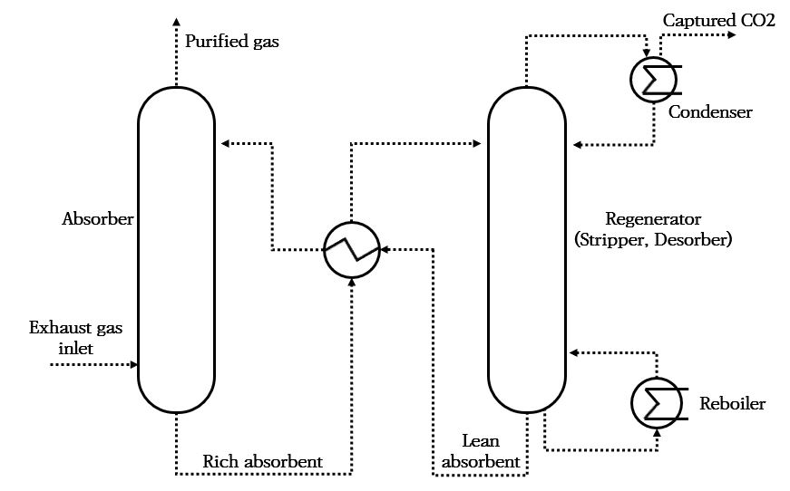

# Guidance for Prevention System of Pollution from Ships

> OTHER RULES AND GUIDANCE / GC-36-E / 2025 / EN / Guidance

## CHAPTER 7 Onboard Carbon Capture and Storage system

### Section 1 General

#### 101. General

- **1.** Carbon capture system could be classified according to three different capture routes.
  - **(1)** Post-combustion capture : Separation of carbon-dioxide(hereinafter CO2) from exhaust gas of fuel consumers
  - **(2)** Pre-combustion capture : CO2 removal from syngas obtained from gasification prior to its combustion in fuel consumers
  - **(3)** Oxy-combustion, Oxyfuel combustion : Combustion of the fuel in nearly pure oxygen and recycled exhaust gas to produce a flue gas with highly concentrated CO2 ready for further processing and purification to a desired CO2 specification
- **2.** There are three general separation processes of CO2 capture that are integrated into the CO2 capture route such as separation with solvent/sorbent, membrane separation and Cryogenic distillation.
  - **(1)** Separation with solvent/sorbent : The separation is achieved by passing the CO2-containing gas in intimate contact with a liquid absorbent or solid sorbent that is capable of capturing the CO2
  - **(2)** Membrane separation : The membrane separation process is a gas separation technology that takes advantage of the differences in the membrane permeability rates among gas components. It is effective when the feed gas is at high pressure and contains a high-concentration CO2.
  - **(3)** Cryogenic distillation : A gas can be made into a liquid by a series of compression, cooling and expansion steps. Once in liquid form, the components of the gas can be separated in a flash or distillation column.

#### 102. Application

- **1.** This chapter is applied to Onboard Carbon capture and storage system(hereinafter OCCS system) by carbon separation with a solvent like **Fig.7.1.1** via capture routes of Post-combustion capture among **101.**
  
  **Fig 7.1.**17 **Schematic diagram of Post-combustion capture by carbon separation with Solvent**
- **2.** Ships installed OCCS system to reduce CO2 emission shall be complied with this chapter.
- **3.** Carbon capture and storage system other than separation with solvent, may be approved after evaluation by the Society, provided that it can be demonstrated that the design represents an equal or better level of safety in this chapter.
- **4.** This chapter is purposed to prevent the safety level of ships from deteriorating due to the installation of OCCS system, and approval of the system does not guarantee a minimum captured CO2 rate.
- **5.** Apart from this chapter, waste and washwater generated from OCCS system shall be complied with the regulations in the Administration or port control to be disposed or discharged of.

#### 103. Definitions

The definitions of terms are to follow Rules for the Classification of Steel Ships, unless otherwise specified in this chapter.

- **1.** “**Absorber**” means the equipment to separate of CO2 from the exhaust gas of fuel consumers.
- **2.** “**Absorbent**” means substance able to absorb by chemical absorption and physical absorption carbon from exhaust gas
  - **(1)** The liquid solvent and solid sorbent are used as absorbents, however, the liquid solvent is referred to as an absorbent unless otherwise specified in this chapter.
  - **(2)** Chemicals such as (Alkanol-) amine-based or NaOH are generally used in liquid absorbent. e.g. MEA(Monoethanolamine), DEA(Diethanolamine) and MDEA(Methyldiethanolamine) as an amines absorbent.
- **3.** “**Desorption system**” means the equipment takes off CO2 from the absorbent. The system consists of a regenerator, heat exchangers, etc.
- **4.** “**Fuel**” means a carbon-based fuel such as oil fuel, LNG, LPG, methanol or ethanol in this chapter.
- **5.** “**Fuel consumer**” means machinery emits exhaust gas containing CO2 by combustion of consuming fuel such as internal combustion engine, boiler etc.
- **6.** “**Regenerator**” means the equipment removes the CO2 from rich absorbent by heat. Rich absorbent is regenerated to lean absorbent. The regenerator can also be referred to as ‘stripper’ or ‘desorber’.
  - **(1)** ‘Rich absorbent’ means absorbent in CO2-loaded conditions extracted from the absorber. Rich absorbent is transferred to regenerator to release the captured carbon.
  - **(2)** ‘Lean absorbent’ means absorbent in CO2-free conditions saturated CO2 is exhausted at regenerator. Lean absorbent is returned to the absorber to absorb the carbon of exhaust gas again.

#### 104. Plans and Documents

- **1.** The following plans and documents are to be submitted to the Society to install OCCS system on the ships. In addition, if deemed necessary by the Society, additional plans and documents other than those specified may be requested.
- **2.** **Plans and Documents for approval**
  - **(1)** General arrangement of OCCS system
  - **(2)** Specification of OCCS system
  - **(3)** Analysis for compatibility with fuel consumers (incl. **404. 3** (2))
  - **(4)** Piping diagrams for carbon capture and storage system
  - **(5)** Wiring diagram for control, alarm and safety system
  - **(6)** Drawing of gas tanks including information on non-destructive testing of welds and strength and tightness testing of tanks
  - **(7)** Drawings of support and staying of gas tanks
  - **(8)** Specification of materials in gas tanks and gas piping systems
  - **(9)** Specifications of welding procedures for gas tanks
  - **(10)** Specification of stress relieving procedures for independent tanks type C
  - **(11)** Specification of design loads and structural analysis of gas tanks
  - **(12)** A complete stress analysis for gas tanks
  - **(13)** Specification of cooling-down procedure for gas tanks
  - **(14)** Arrangement and specifications of second barriers
  - **(15)** Drawings and specifications of gas tank insulation
  - **(16)** Arrangement of detection ends for gas detection, temperature measurement and pressure measurement
  - **(15)** Documentation detailing the effect on Stability (where necessary)
  - **(16)** Investigation table of electrical load analysis
- **3.** **Plans and Documents for reference**
  - **(1)** Risk assessment
  - **(2)** Operation and maintenance manual
  - **(3)** MSDS for absorbent
  - **(4)** Strength calculation sheet for CO2 storage tank and structural supporter
  - **(5)** Calculation sheets of filling limits for CO2 storage tanks

#### 105. Class Notation

- **1.** **Table 7.1.1** shows the Class Notation of OCCS system, and the system installed for the purpose as above provisions of **102. 1** is basically given **CEmC-OCCS** notation of **Table 7.1.1**. In addition, **CEmC-OCCS(R)** and/or **(S)** may be additionally assigned if the relevant requirements are met.

  **Table 7.1.1 Class Notation of OCCS system**

  | No | Notation | Relevant requirements |
  | --- | --- | --- |
  | 1 | CEmC-OCCS | All requirements of this chapter excluding the relevant requirements of item **2** and **3** of **Table 7.1.1** |
  | 2 | CEmC-OCCS(R) | In addition to requirements of **CEmC-OCCS**, redundancy requirements (Provisions of **306.**) |
  | 3 | CEmC-OCCS(S) | In addition to requirements of **CEmC-OCCS**, test and survey requirements (**308.** and **Table 7.8.1**) |

#### 106. Equivalency

The equivalence of alternative and novel features which deviate from or are not directly applicable to this chapter is to be in accordance with **Pt 1, Ch 1, 105.** of **Rules for the Classification of Steel Ships**.

### Section 2 Goal and Functional Requirements

#### 201. Goal

The goal of this chapter is to ensure the safety of ships and personnel in particular installations of OCCS system, by describing the design and construction of ships.

#### 202. Functional Requirements

- **1.** Installation and operation of OCCS system is to be compatible with the fuel consumers and is not to cause any adverse effects on performance.
- **2.** The safety, reliability and dependability of the systems are to be equivalent to that achieved with comparable to conventional exhaust gas piping systems of oil-fuelled main and auxiliary machinery and exhaust gas treatment systems referred to **Ch 2 Sec. 2, Sec. 3** and **Ch 3 Sec.2** of this guidance.
- **3.** The probability and consequences of hazards related to absorbent and captured CO2 are to be limited to a minimum through arrangement and system design, such as ventilation, detection and safety actions. In the event of leakage or failure of the risk reducing measures, necessary safety actions are to be initiated.
- **4.** The design philosophy is to ensure that risk reducing measures and safety actions for OCCS system do not lead to an unacceptable loss of power.
- **5.** Unintended accumulation of explosive, flammable or toxic gas concentrations is to be prevented.
- **6.** System components are to be protected against external damages.
- **7.** It is to be arranged for safe and suitable absorbent supply and storage arrangements capable of receiving and containing in the required state without leakage.
- **8.** Piping systems, containment and over-pressure relief arrangements that are of suitable design, construction and installation for their intended application are to be provided.
- **9.** Absorber, regenerator and related components are to be designed, constructed, installed, operated, maintained and protected to ensure safe and reliable operation.
- **10.** OCCS system are to be designed to minimize the risks associated with the storage, handling, consumption, and disposal of hazardous or non-hazardous chemicals, and essential consumables like absorbent for the operation of the system. Appropriate personnel protective equipment, together with emergency treatment facilities, appropriate to the hazards concerned, are to be provided.
- **11.** Suitable control, alarm, monitoring and shutdown systems are to be provided to ensure safe and reliable operation of OCCS system.
- **12.** Leakage detection, and fire protection, detection and extinguishing arrangements are to be provided at the places where OCCS system is installed against possible hazards associated with the operation and/or stop of the systems.
- **13.** The technical documentation is to permit an assessment of the compliance of the system and its components with the applicable rules, guidelines, design standards used and the principles related to safety, availability, maintainability and reliability.
- **14.** A single failure in a technical system or component is to not lead to an unsafe or unreliable situation.

### Section 3 Configuration

#### 301. General

- **1.** OCCS system are to be arranged that the pressure in exhaust gas pipes does not exceed the allowable back pressure recommended by fuel consumers manufacturer.
- **2.** When a pre-scrubber is provided to adjust the temperature and humidity fitting to the optimal conditions of the absorption process and to remove SO2 in the exhaust gas, the chemical treatment piping, washwater piping and residue systems, and control and monitoring system shall be complied with **207.** and **208.** of **Ch 3 Sec.2** of this guidance respectively. Unless regulations or conventions specified otherwise, washwater from pre-scrubber shall be complied with **Res.MEPC.307(73)** and **Res.MEPC.340(77)**.
- **3.** OCCS system is to be so designed that it can withstand the loads corresponding to the static and dynamic inclination angles specified in **Ch 5, Sec 1, 103. 1** of Rules for the Classification of Steel Ships.

#### 302. Risk Assessment

- **1.** Risk assessment shall be conducted to determine whether the risks arising from the handling of absorbents and the storage of CO2 in OCCS system have dealt with effect on personnel, environment, and structural strength or integrity.
- **2.** The risks shall be evaluated using acceptable and recognized risk assessment techniques. The evaluated risks shall be reduced to a reasonable level through elimination or mitigation measures.
- **3.** The subject of risk assessment shall include at least:
  - **(1)** Supply, storage, handling and unloading system(if installed) of absorbent
  - **(2)** Compression, liquefaction, storage and unloading system of carbon storage system (if installed)
  - **(3)** Supply, storage, and handling of refrigerant for carbon dioxide liquefaction system *(2024)*
- **4.** Expected risks shall include at least:
  - **(1)** Leakage of absorbent
  - **(2)** Leakage of CO2
  - **(3)** Leakage of refrigerant for carbon dioxide liquefaction system *(2024)*
  - **(4)** Failure and malfunction of components of carbon capture and storage system
- **5.** When assessing the expected risks, those should be considered at least:
  - **(1)** Toxicity, flammability properties of absorbent
  - **(2)** The asphyxiation of CO2, especially when personnel on board are exposed
  - **(3)** Toxicity, flammability properties of refrigerant *(2024)*
- **6.** The Society may consider the acceptance of relaxations of requirements from **Ch.3** to **Ch.7** based on the risk assessment. *(2024)*

#### 303. Stability

- **1.** In the case of existing ships, data on light weight that is changed according to the installation of OCCS system is to be submitted, and if necessary, a revision of data related to stability may be requested.
- **2.** For new ships, it is to be in accordance with **Pt 1, Ch 1, 307.** of **Rules for the Classification of Steel Ships.**

#### 304. Compatibility with Fuel Consumers

- **1.** The data are to be provided to confirm not to exceed the approved design limits of OCCS system with the whole operational range of fuel consumers.
- **2.** The connected fuel consumers shall not be disturbed due to excessive back pressures or high temperatures due to operating OCCS system. Where necessary, considerations like extract fans will be given to maintain the operating condition of fuel consumers within the approved design limits.

#### 305. By-pass Operation

- **1.** A bypass arrangement of OCCS system or changeover system is to be installed to enable continued operation of the fuel consumers irrespective of the operation of fuel consumers. The following cases are also contained the not in operation of OCCS system:
  - **(1)** Operation mode selection of OCCS system
  - **(2)** Not in operation of absorbent circulation system; or,
  - **(3)** Failure of OCCS system
- **2.** The arrangement or system may not be installed when it is ensured the flow of exhaust gas is not restricted and there is no risk of a failure that results in the stop of fuel consumers.

#### 306. Redundancy (Only when the} "CEmC-OCCS(R)" class notation is applied)

- **1.** A redundancy is to be ensured for major equipment of OCCS system including carbon dioxide liquefaction system such as pumps, fans, blowers, etc. and is to be arranged to operate the system continuously in rated capacity whichever one major equipment is failed.
- **2.** **2**. To comply with **1.**, an alternative means can be considered per each equipment. The material is to be submitted demonstrating that the alternative means provides the reliability of the system and continuous operation of OCCS system, without compromising the vessel propulsion and maneuvering capability.
- **3.** Where ships fitted with two or more identical OCCS systems, a common standby pump (for each essential system) capable of serving all the systems will be acceptable in lieu of providing individual standby pumps for each system.
- **4.** When the major equipment is failed, standby equipment are to be automatically started and put into service. This failure is to be alarmed at the remote-control station(s) such as the bridge or engine control station.

#### 307. Prevention of Flooding

- **1.** Washwater of pre-scrubber or absorbent of absorber is to be prevented from ingress into fuel consumers.
- **2.** Alarm and shutdown arrangements are to be provided to prevent an abnormal rise of absorbent level in the absorber of carbon capture system.

#### 308. OCCS system Equipment

- **1.** **Pumps/Blowers/Compressor**
  - **(1)** When the “**CEmC-OCCS(S)**” class notation is applied, equipment required for continuous operation of OCCS system, such as absorbent transfer pumps, lean absorbent supply pumps, rich absorbent regenerating pumps, CO2 pump/compressor and blowers are certified in accordance with the relevant requirements of **Pt 5, Ch 1, 210** & **Ch 6. Sec.14** of Rules for the Classification of Steel Ships.
- **2.** **Pressure vessel (incl. Heat Exchangers)**
  - **(1)** Where provided, pressure vessles including heat exchangers are to comply with the requirements specified in **Pt 5 Ch 5, Sec. 3** of the **Rules for the Classification of Steel Ships**. However, a regenerator does not consider as a kind of heat exchanger.
- **3.** **Electrical Systems**
  For items not specified in this Section, the relevant requirements specified in **Pt 6** of the **Rules for the Classification of Steel Ships** apply.
  - **(1)** Electrical Motors and controlgears for motors
    When the “**CEmC-OCCS(S)**” class notation is applied, motors and controlgears for motors are to be certified in accordance with the relevant requirements specified in **Pt 6** of the **Rules for the Classification of Steel Ships**.
  - **(2)** Circuit Protection Devices
    Circuit breakers are to be installed for miscellaneous OCCS system electrical loads and are to be compatible with the prospective short circuit current level calculated at the switchboards.

### Section 4 Carbon Capture System

#### 401. General

- **1.** Pipings of carbon capture system are to comply with **Ch 6 Pt 5** of the **Rules for the Classification of Steel Ships**, unless specified in this section otherwise.
- **2.** The material for absorber, regenerator, absorbent storage tank and components of carbon capture system like heat exchangers, pipe fittings, pumps, valves is to be selected taking into account the the corrosive characteristics of the absorbent and working pressure and temperature of them.

#### 402. Absorber

- **1.** **Absorbent injection system**
  - **(1)** Injection control system
    The amount of injected absorbent is to be appropriately controlled depending upon the load of fuel consumers or quantity of carbon emissions in consideration of the temperature of the exhaust gas at the inlet of absorber.
- **2.** **Devices for monitoring amount of injected absorbent**
  Device for monitoring the amount of injected absorbent when using the carbon capture system are to be provided at least one of the monitoring stations for at least one place among a bridge if a bridge control system is installed, engine control room, or machine control side.
- **3.** **Safety and alarm devices**
  The absorbent injection system is to be provided with safety and alarm devices to prevent the injection of absorbent when the temperature at the exhaust gas outlet of fuel consumers or the inlet of carbon capture system exceeds the preset level.

#### 403. Exhaust Gas Piping System

- **1.** **General**
  - **(1)** The sections of carbon capture system that are subjected to absorbent (e.g. the interior reaction chamber or absorbent piping/nozzles, etc.) are to be constructed of suitable corrosion resistant materials.
  - **(2)** Exhaust gas piping systems after carbon capture system are to be of a corrosion resistant material such as stainless steel or to be coated with a suitable corrosion resistant materials.
- **2.** **Safety and alarm devices**
  - **(1)** Valves used in the carbon capture system are to comply with the relevant requirements specified in **Pt 5, Ch 6** of the **Rules for the Classification of Steel Ships**. The valves are to be constructed of corrosion resistant materials.
  - **(2)** Where bypass arrangements for carbon capture system are provided to comply with **305. 1.**, the bypass arrangement or changeover system is to be fail safe manner.
  - **(3)** Valves are to be installed in accessible locations, clear of or protected from obstructions, moving equipment, and hot surfaces, in order to permit regular inspection and periodic servicing.
- **3.** **Interconnection of exhaust gas piping**
  - **(1)** Exhaust gas pipes from fuel consumers are generally to be routed separately and not interconnected.
  - **(2)** However, interconnected exhaust piping systems to a common carbon capture system may be accepted when complied with the followings:
    - **(A)** The materials are to be submitted with **104. 2** to demonstrate that the OCCS system is capable of accommodating the maximum combined exhaust flows of all the connected fuel consumers for the worst case scenario for that particular ship arrangement and operational profile.
    - **(B)** The specific means are to prevent the passage of exhaust gases to other fuel consumers or spaces.
    - **(C)** In case of dual fuel and/or gas only internal combustion engines which are required to have their own independent exhaust piping, carbon capture system with a common exhaust gas piping is to be accepted by Flag Administration.
- **4.** **Insulation**
  Hot surfaces of OCCS system and their associated equipment or systems likely to come into contact with the crew during operation are to be suitably guarded or insulated. Where the surface temperatures are likely to exceed 220°C and where any leakage, under pressure or otherwise, of fuel oil, lubricating oil, or other flammable liquid is likely to come into contact with the OCCS system or exhaust pipes, these surfaces are to be suitably insulated with non-combustible materials that are impervious to such liquids.

#### 404. Absorbent Piping System

- **1.** **General**
  - **(1)** Absorbent piping systems are to be arranged taking into account the corrosiveness, explosiveness, combustibility and impact on human life of the absorbent.
  - **(2)** Absorbent piping and venting systems are to be independent from the other piping system.
  - **(3)** Absorbent piping systems are not to pass through accommodation spaces, service spaces or control stations.
  - **(4)** Supply, transfer, and loading lines for absorbent systems are not to be located over boilers or in close proximity to steam piping, exhaust systems, hot surfaces required to be insulated, or other sources of ignition. Valves are to be in positions accessible to periodical inspection and maintenance.
  - **(5)** Absorbent piping systems are to be classified into Class I or Class II piping specified in **Pt 5, Ch 6** of **the Rules for the Classification of Steel Ships**, taking into account the toxicity and corrosive, regardless of temperature and pressure of working media. However, vent and drain pipes can be regarded as Class III.
  - **(6)** Absorbent piping systems are to be all welded as possible. In case of the flanged connections are to be screened or otherwise suitably protected to avoid absorbent spray or leakage.
  - **(7)** The remote-controlled isolation valves are to be installed between each component of absorbent piping system such as absorber, regenerator, etc.
  - **(8)** In case of loss of power, the remote-controlled valves are to be fail-closed, or to be kept in their position when a measure is arranged to close the valves.
  - **(9)** The remote-controlled valves are to be indicated their position open/close clearly and to be arranged with open/close indicator at the remote-control stations.
  - **(10)** The pipe leading to the overflow tank is to be installed top on nor near the top of the tanks. If it does not possible, the non-return valve is to be installed on the piping system.
- **2.** **Material**
  - **(1)** Absorbent piping systems, absorbent waste/overflow tank, drip tray and other components contacting to absorbents are to be of a corrosion resistant material such as stainless steel or to be coated with a suitable corrosion resistant materials.
- **3.** **Drip tray**
  - **(1)** Drip tray is to be installed for places where are a risk of leakage from relevant components such as pumps, filter, heat exchangers, flanges and valves.
  - **(2)** Drain pipes leading to the overflow tank or alarm system are to be arranged at the drip tray. The non-return valve is to be installed on the drain pipe.
- **4.** **Ventilation system**
  - **(1)** If a absorbent tank is installed in a closed compartment, the area is to be served by an effective mechanical supply and exhaust ventilation system is independent from the ventilation system of accommodation, service spaces, or control stations. Warning notices requiring the ventilation of spaces prior to entrance shall be provided outside the compartment adjacent to each point of entry and inside the compartment.
  - **(2)** The capacity of ventilation system is as following standard per absorbent. The capacity is changeable based on the risk assessment in accordance with **302.** taking into account the toxicity, flammability, and explosive nature of the absorbent.
    - **(A)** Sodium hydroxide (NaOH): 6 air changes per hour
    - **(B)** Monoethanolamine (MEA), N-methyldiethanolamine (MDEA): 30 air changes per hour
    - **(C)** Diethanolamine (DEA): 45 air changes per hour
  - **(3)** The outlet of ventilation system for compartment where the storage tank is located is to terminate in a safe location on the open deck and the tank venting system is to be arranged to prevent entrance of water into the tank.
  - **(4)** Where an absorbent tank is located within an engine room, providing an effective movement of air in the vicinity of the tank, the ventilation system for the engine room can be replaced with the ventilation system complied with (1) to (3). If a dedicated ventilation system is provided, the system is to be operated continuously except when the storage tank is empty completely.
  - **(5)** When absorbent storage tank is formed as an integral tank, the ventilation system in (1) is to be provided to spaces which is the enclose and adjacent to the tank with possible leak points (e.g. manhole, fittings) from this tank. And the system is to be operatable outside of the spaces.
  - **(6)** In addition to (5), when absorbent piping systems pass through spaces normally accessed by a person, the ventilation system in (1) is to be provided for spaces even if the spaces are not in the adjacent area. However, the ventilation system is not required if the piping system is made of steel or other equivalent material with melting point above 925 degrees C and with fully welded joints.

#### 405. Absorbent Storage Tank

- **1.** The absorbent storage tank is to be arranged so that any leakage will be contained and prevented from making contact with heated surfaces. All pipes or other tank penetrations are to be provided with manual closing valves attached to the tank. In cases where such valves are provided below top of tank, they are to be arranged with quick acting shutoff valves which are to be capable of being remotely operated from a position accessible even in the event of absorbent leakages.
- **2.** The storage tank is to be located within the engine room or the enclosed compartments except for locating on open deck.
- **3.** For portable absorbent storage tanks whose support structure (container frame or truck chassis) is standardized as a container for international transport, the storage tanks are to be in accordance with requirements for the Guidance for Freight Containers. In addition, the storage tanks are to be arranged in compliance with the International Maritime Dangerous Goods (IMDG) code and **Pt 8, Ch 12** of **the Rules for the Classification of Steel Ships**. Absorbents are to be classified depending on risks by toxicity and flammability of them. *(2024)*
- **4.** The material of absorbent storage tank is to be complied with **404. 2.**
- **5.** The venting system is to be provided suitable for the absorbent and are to terminate in a safe location on the open deck and the tank venting system is to be arranged to prevent entrance of water into the tank.
- **6.** The storage tank is to be protected from temperatures applicable to the particular concentration absorbent.
- **7.** Where absorbent is stored in integral tanks, the following are to be considered during the design and construction:
  - **(1)** These tanks may be designed and constructed as integral part of the hull, (e.g. double bottom, wing tanks).
  - **(2)** These tanks are to be segregated by cofferdams, void spaces, pump rooms, empty tanks or other similar spaces so as to not be located adjacent to accommodation, cargo spaces containing cargoes which react with chemical treatment fluids in a hazardous manner as well as any food stores, oil tanks and fresh water tanks.
  - **(3)** These tanks are to be designed and constructed as per the structural requirements in accordance with **Pt 3 Ch 15** of the **Rules for the Classification of Steel Ships** for a deep tank construction.
  - **(4)** These tanks are to be included in the ship’s stability calculation.
- **8.** The absorbent storage tank is to be provided with temperature and level monitoring arrangements. A high temperature and high/low level alarm system be provided.
- **9.** Drain trays of adequate size led to the overflow tank are to be provided under the absorbent storage tank.
- **10.** The absorbent tanks are to be arranged so that they can be emptied of the fluids.
- **11.** **Loading of absorbent**
  - **(1)** When absorbent is loaded by the dedicated manifold, piping system is to be connected from manifold to the storage tank. The isolation valve is to be provided at the manifold.
  - **(2)** When the manifold is arranged, the drip tray is to have a sufficient capacity to ensure that the maximum amount of spill according to the risk assessment can be handled.
  - **(3)** The tray is to be fitted with a drain valve to enable rain water to be drained over the ship's side.

#### 406. Regenerator(Stripper, Desorber)

Interior pipes of regenerator is to be complied with **Pt 5, Ch 5, 120.** of the **Rules for the Classification of Steel Ships**.

#### 407. Overflow or Waste absorbent Tank

- **1.** The material of overflow or waste absorbent tank is to be complied with **404. 2.**
- **2.** The absorbent waste tank is to be independent from other tanks, except in cases where these this tank is also used as the overflow tanks.
- **3.** The vent piping of the overflow or waste absorbent tanks are to be complied with 405. 4.
- **4.** The overflow tank is to be arranged with a high level alarm.
- **5.** Sounding arrangements are to be provided for the absorbent waste tank in accordance with **Pt 5, Ch 6, 203.** of the **Rules for the Classification of Steel Ships**.

#### 408. Absorbent Leakage Detection

When absorbent leakage is detected in accordance with **404. 3.** (2), an alarm is to be initiated at the remote control location such as bridge control system and engine control room and at the local control location.

#### 409. Fire Protection and Extinction

- **1.** Where absorbor, desoprtion system or absorbent storage tank are installed in spaces other than engine-room, in determining fire integrity of divisions to adjacent spaces, the each space is to be categorized and applied **Pt 8, Ch 7, Sec. 1** of the **Rules for the Classification of Steel Ships** as follows:
  - **(1)** for ships carrying more than 36 passengers;
    - **(A)** In case of amine-based absorbents, "⑪ Auxiliary machinery spaces, cargo spaces, cargo and other oil tanks and other similar spaces of moderate fire risk" in **Pt 8 Ch 7**, **102. 3** (2) (B) of the **Rules for the Classification of Steel Ships**,
    - **(B)** In case of NaOH as absorbents, "⑩ Tanks, voids and auxiliary machinery spaces having little or no fire risk" in **Pt 8, Ch 7,** **102. 3** (2) (B) of the **Rules for the Classification of Steel Ships**, or
    - **(C)** Other than (A) and (B), it is to be determined by the Society.
  - **(2)** for ships carrying not more than 36 passengers and cargo ships: "⑦ Other machinery spaces" in **Pt 8, Ch 7**, **102. 4** (2) (B), **Pt 8, Ch 7**, **103. 3** (2) (B) and **Pt 8, Ch 7**, **104. 2** (2) (B) of the **Rules for the Classification of Steel Ships**.
- **2.** **Fire Fighting**
  - **(1)** The spaces where the absorbent storage tanks are installed is to be provided two(2) sets of portable fire-extinguisher complied with FSS code taken into account the flammability and explosiveness of the absorbent. However, the fire extinguisher can be omitted when fixed fire exinguishing systems are arranged.
  - **(2)** When fixed fire-extinguishing systems are arranged in the spaces where the absorbent storage tanks are installed, the following systems may be considered for the spaces:
    - **(A)** Fixed high-expansion foam fire-extinguishing system complying with FSS code suitable for extinguishing amine-based absorbent, or
    - **(B)** Fixed pressure water-spraying fire-extinguishing system complying with FSS code

### Section 5 Carbon Storage System

#### 501. General

- **1.** Equipment for CO2 storage system such as compressors, coolers, separators, and dryers is to be located in a dedicated space or compartment.
- **2.** Spaces where CO2 storage system or piping systems are arranged are to be fitted with an extraction type of mechanical ventilation system designed to take air from the bottom of the space and to be sized to provide at least 6 air changes per hour. *(2024)*
- **3.** Enclosed spaces where CO2 liquefaction systems with flammable refrigerant are arranged are to be fitted with an extraction type of mechanical ventilation system capable of at least 30 air changes per hour. But, the capacity of ventilation system may be adjusted depending on the risk assessment in **302.** *(2024)*
- **4.** Where the spaces or compartments arranged CO2 liquefaction system with flammable refrigerant are to be regarded as hazardous spaces, electric equipment installed in the spaces or compartments are to be complied with **Pt 6, Ch1, Sec 1** of **the Rules for the Classification of Steel Ships** *(2024)*
- **5.** Devices for continuously monitoring of CO2 accumulation is to be installed in spaces or compartment where CO2 liquefaction system or piping systems pass.
- **6.** It should be provided to monitor the purity of collected CO2 as possible.
- **7.** CO2 storage tank and piping systems are to satisfy **Pt 7, Ch 5, 1721.** and **1722.** of **Rules for the Classification of Steel Ships**. *(2024)*

#### 502. CO2 Piping System

- **1.** Liquefied carbon dioxide piping systems may be applied on Ch 7, Sec 3 of Rules for the Classification of Ships Using Low-flashpoint Fuels.
- **2.** The (gaseous) CO2 piping systems are regarded as Class I piping systems complied with **Pt 5, Ch 6** of **the Rules for the Classification of Steel Ships**.
- **3.** The CO2 piping systems are to be independent from the other piping system.
- **4.** The CO2 piping systems for storage, transferring and unloading containing liquefied CO2 storage tank are not to pass through accommodation spaces, service spaces or control stations.
- **5.** In case of loss of power, the remote-controlled valves are to be fail-closed, or to be kept in their position when a measure is arranged to close the valves.
- **6.** The remote-controlled valves are to be indicated their position open/close clearly and to be arranged with open/close indicator at the remote-control stations.
- **7.** The CO2 pipings are to be at least 0.8 m inboard from the ship’s sides.

#### 503. CO2 liquefication system (2024)

- **1.** The liquefaction system to store captured CO2 is to comply with requirements for refrigerating machinery **Pt 6, Ch 1** of **the Rules for the Classification of Steel Ships**. However, **Pt 6, Ch 1 301. 2** of **the Rules for the Classification of Steel Ships** is only applied to ships assigned "**CEmC-OCCS(R)**" notation.
- **2.** When using a refrigerant other than the one determined in the rules of **1.**, the liquefaction system is to be designed in consideration of the toxicity and flammability of the refrigerant.

#### 504. CO2 storage tanks

- **1.** **Arrangement of CO2 storage tanks**
  - **(1)** CO2 storage tanks are to be located in open decks, a dedicated CO2 tank room or compartment.
  - **(2)** The requirements of **Ch 5, 302.** of **Rules for the Classification of Ships Using Low-flashpoint Fuels** are to be applied to protect CO2 storage tanks from external damage due to collision or grounding.
- **2.** **Design of CO2 storage tanks**
  - **(1)** Liquefied CO2 storage tanks are to be independent tank type C designed in accordance with **Ch 6** of **Rules for the Classification of Ships Using Low-flashpoint Fuels.**
  - **(2)** The CO2 storage tanks and pressure relief devices are to be designed to prevent venting of CO2 except in emergency situations.
  - **(3)** The liquid level indicating device, pressure monitoring device and temperature indicating device of the CO2 storage tank are to be installed and controlled in accordance with the relevant requirements in **Pt 7, Ch 5, Sec 13** of **Rules for the Classification of Steel Ships**.
  - **(4)** Each CO2 storage tank is to be monitored for its state of charge and protected from overfilling. The high liquid level alarm device is to be operated at a position that does not exceed the filling limit, and the emergency stop specified in table 7.6.1 is to activate remotely controlled valves to close CO2 supply pipe connected to the storage tank.
  - **(5)** The pressure of the liquefied CO2 storage tank is to be maintained at least 0.05 MPa above the triple point for the CO2 mixture. The “triple point” for pure CO2 occurs at 0.52 MPa absolute and –56.5 °C.
  - **(6)** The liquefied CO2 tanks' pressure and temperature are to be maintained at all times within their design range by means acceptable to the Society, e.g. by one of the following methods. The pressure and temperature control system is to be capable of withstanding the full vapour pressure, taking into account the conditions in which all CO2 storage tanks are filled and the ship's operating profile.
    - **(A)** reliquefaction of CO2 vapours
    - **(B)** liquid CO2 cooling
    - **(C)** pressure accumulation
  - **(7)** If the reference temperature of the CO2 storage tank complies with the requirements defined in **Pt 7, Ch 5, 1501. 3** of **Rules for the Classification of Steel Ships**, the maximum filling limit of CO2 stroage tanks are not to be greater than 98% at reference temperature.
  - **(8)** All materials used for liquefied CO2 storage tanks and piping systems are to be suitable for the lowest temperatures that may occur in service. This lowest temperature refers to the saturation temperature of CO2 at the set pressure of the automatic safety device.
  - **(9)** The CO2 storage system design is to take into account the composition of CO2, impurities and water content, including the effect on the “triple point” of CO2 and corrosiveness.
  - **(10)** Detailed operating and maintenance manuals are to be provided with overall operating procedures between dry-docking of CO2 storage tanks and associated compression, cooling and liquefaction system. Operating procedures are to include at least cooling down, unloading, gas freeing, pressure/temperature control, emergency shutdown, maintenance and inspection.
- **3.** **Design of portable CO2 storage tanks** ***(2024)***
  - **(1)** Portable CO2 storage tanks are to comply with the follows as well as the requirements in 2 above.
  - **(2)** For portable CO2 tanks whose support structure (container frame or truck chassis) is standardized as container for international transport, tanks are to be in accordance with requirements for thermal container and/or tank container specified in **Guidance for Freight Containers**. Where the support structure is not standardized for international transport, the applicable tests specified in **Guidance for Freight Containers** can be appropriately adjusted or omitted in consideration of the load that can occur during stacking and loading/unloding operations of the portable CO2 storage tank.
  - **(3)** Portable CO2 tanks are to be located in dedicated areas fitted with:
    - **(A)** mechanical protection of the tanks depending on location and cargo operations; and
    - **(B)** if located on open deck: spill protection and measures to prevent the temperature rise of the storage tanks in case of fire in adjacent area.
  - **(4)** Portable CO2 tanks are to be secured to the deck while connected to the ship systems. The arrangement for supporting and fixing the tanks are to be designed for the maximum expected static and dynamic inclinations, as well as the maximum expected values of acceleration, taking into account the ship characteristics and the position of the tanks.
  - **(5)** Consideration is to be given to the strength and the effect of the portable CO2 tanks on the ship's stability.
  - **(6)** Connections to the ship's fuel piping systems are to be made by means of approved flexible hoses or other suitable means designed to provide sufficient flexibility.
  - **(7)** Arrangements are to be provided to limit the quantity of fuel spilled in case of inadvertent disconnection or rupture of the non-permanent connections.
  - **(8)** The pressure relief system of portable CO2 tanks is to be connected to a fixed venting system.
  - **(9)** Control and monitoring systems for portable CO2 tanks are to be integrated in the ship's control and monitoring system. Safety system for portable CO2 tanks is to be integrated in the ship's safety system (e.g. shutdown systems for tank valves, leak/gas detection systems).
  - **(10)** Safe access to tank connections for the purpose of inspection and maintenance is to be ensured.

#### 505. Leakage Detection

- **1.** At least two sets of CO2 detectors are to be arranged in an enclosed space where there is a possibility of leakage of CO2
- **2.** If carbon dioxide is detected in excess of 1%, an alarm is to be initiated at the remote control location such as bridge control system and engine control room and at the local control location.
- **3.** At least two sets of portable CO2 detection devices are to be provided on board.
- **4.** Where flammable refrigerants are used for CO2 liquefaction system, leakage detection systems are to be arranged in the space installed CO2 liquefaction system.

#### 506. Fire Protection and Extinction (2024)

- **1.** Where carbon storage system including CO2 liquefaction system are installed in spaces other than engine-room, in determining fire integrity of divisions to adjacent spaces, the each space is to be categorized and applied **Pt 8, Ch 7, Sec. 1** of the **Rules for the Classification of Steel Ships**, taking into account the flammability of refrigerants.
- **2.** Where flammable refrigerants are used for CO2 liquefaction system, spaces where the CO2 liquefaction system are installed is to be provided with fixed fire extinguishing systems suitable for the refrigerants.
- **3.** Where flammable refrigerants are used for CO2 liquefaction system, spaces where the CO2 liquefaction system is installed are to be provided with a fixed fire detection and fire alarm system.

### Section 6 System Design

#### 601. General

- **1.** The control system of carbon capture and storage system may consist of an integrated system or independent control systems.
- **2.** The control system shall be designed so that a single failure of the control system does not affect personnel safety and ship safety.

#### 602. Control and monitoring systems

- **1.** Automatic control, monitoring, alarm and safety systems shall be installed on carbon capture and storage system to ensure that the design parameters are not exceeded under all operating conditions of fuel consumers, and OCCS system. For ships assigned with the notation for automatic and remote control systems in accordance with **Pt 9, Ch 3** of **Rules for the Classification of Steel Ships**, the alarm and monitoring systems shall be integrated with the ship's centralized monitoring and control systems.
- **2.** Temperature, pressure, and flow in OCCS system and related systems shall be controlled and monitored as follows:
  - **(1)** Local control and monitoring systems shall be provided for safe operation, maintenance and effective control in case of emergency or remote control failure.
  - **(2)** The control system shall be designed to identify failures of process systems and equipment. The control and monitoring systems shall comply with the requirements of **Pt 9, Ch 3, 302. 4** of **Rules for the Classification of Steel Ships**.
  - **(3)** For the safe and effective operation of the OCCS system, the necessary parameters shall be displayed on the local and at the remote control location, including the followings:
    - **(A)** The operating status of the pumps, fans, blowers and motors of the carbon capture and storage system
    - **(B)** Level indication of absorber and absorbent storage tanks
    - **(C)** Level indication for CO2 storage tank of carbon storage system
    - **(D)** Pressure indication for CO2 storage tank of carbon storage system
    - **(E)** Level indication of CO2 storage tanks for carbon storage system
    - **(F)** Parameters required for the safe operation of OCCS system
- **3.** Each control, monitoring, and safety system shall be powered via a separate circuit. Each of these circuits shall be protected against short circuit and monitored for power failures.

#### 603. Emergency Stop System

- **1.** An emergency stop system shall be installed that operates independently of the control and alarm systems. The emergency stop system shall have the following functions:
  - **(1)** A means shall be provided for indicating the parameter that causes the emergency stop.
  - **(2)** When an emergency stop is triggered, an alarm shall be initiated at the normal control location and at the local control location.
  - **(3)** If the operation of an equipment or device is stopped due to an emergency stop, the equipment or device shall not automatically restart before being manually reset.
- **2.** Monitoring and safety systems shall be in accordance with **Table 7.6.1**.

  **Table 7.6.1 Monitoring and safety functions for OCCS system**

  | Parameters | Display | Alarmactivated | AutomaticShutdown |
  | --- | --- | --- | --- |
  | Fan/blower motors for OCCS system (when installed) | Run | Stop |   |
  | By-pass or changeover valve of carbon capture system(when installed) | Position |   |   |
  | Exhaust gas temperature after absorber (except if dry running can be used) | ● | H | HH |
  | Differential pressure across absorber |   | H | HH |
  | Pump for carbon capture system | Run | Stop |   |
  | Pressure for carbon capture system |   | L |   |
  | Level in absorber, Regenerator |   | H | HH |
  | Temperature of absorbent storage tank |   | H |   |
  | Level of absorbent storage tank | ● | L/H |   |
  | Level of drip tray for onboard carbon capture and storage system |   | H |   |
  | Level of absorbent overflow tank |   | H |   |
  | Pump/Compressor for carbon storage system | Run | Stop |   |
  | Level or Loading rate of CO2 storage tank | ● | H | HH |
  | Pressure for liquefied CO2 storage tank | ● | L/H | LL/HH |
  | Temperature for liquefied CO2 storage tank | ● | L/H | LL/HH |
  | power supply fail of control, alarm, monitoring or safety device | - | Fail |   |

### Section 7 Safety and Personnel Protective Equipment.

#### 701. For the protection of crew members, the vessel shall have on board suitable protective equipment consisting of aprons, gloves with long sleeves, boots, coveralls of chemical-resistant material, and chemical safety goggles or face shields or both. And, the quantity to be supplied is to be at least two sets.

#### 702. Eyewasher and safety showers are to be provided near the manifold for loading absorbent. If several manifolds are installed on the same deck, one could be installed if the manifold can be easily accessed to eyewasher and safety shower from the manifold. (2024)

### Section 8 Survey

#### 801. General

- **1.** This section is applied to inspection for installation of OCCS system.

#### 802. Production and Installation Survey

- **1.** Inspection and verification that the foundations and attachments of the principal components of the OCCS system are in accordance with the approved plans and particulars.
- **2.** Piping systems are to be examined and tested in accordance with **Pt 5, Ch 6, Sec. 14** of the **Rules for the Classification of Steel Ships**.
- **3.** Electrical equipment are to be examined and tested in accordance with **Pt 6, Ch 1** of the **Rules for the Classification of Steel Ships**.
- **4.** Following tests may be incorporated with the tests required by **Pt 5, Ch 2, 211.** of the **Rules for the Classification of Steel Ships**.
- **5.** Instrumentation is to be tested to confirm proper operation as per its predetermined set points.
- **6.** Pressure relief and safety valves installed on the unit are to be tested.
- **7.** Control system and shutdowns are to be tested for proper operation.
- **8.** The components of the OCCS system are to be tested and inspected in accordance with **Table 7.8.1**.

  **Table 7.8.1 Test and Survey for components of OCCS system**

  | No. | Components | Type approval | Drawing approval | Test and Survey |
  | --- | --- | --- | --- | --- |
  | 1 | Carbon-dioxdie emission monitoring system | ●(6) |   |   |
  | 2 | Control panel for OCCS system | ●(6) | ● | ● |
  | 3 | Pump (incl. motors and controlgears for motors(1),(2) |   | ●(8) | ● |
  | 4 | Compressor/Blower (incl. motors and controlgears for motors)(1),(2) |   | ●(8) | ● |
  | 5 | Absorber, Regenerator body(1),(3),(7) |   |   | ● |
  | 6 | Heat exchanger(4) |   | ●(9) | ● |
  | 7 | Abosbent storage tank, absorbent waste tank, overflow tank(1),(5) |   |   | ● |
  | Note. (1) For the applicable class notation ‘**CEmC-OCCS(S)**’ in **Table 7.1.1** (2) Components for the continual operation of the OCCS system are to be tested in accordance with the requirements specified in **Pt 5, Ch 6 & Pt 6** of the **Rules for the Classification of Steel Ships**. (3) The entire length of both longitudinal and circumferential welded joints and exhaust gas pipe or wash water pipe joints on scrubber body are to be subjected to liquid penetrant testing(PT). Where considered necessary by the Surveyor, additional non-destructive test may be required. (4) It shall be inspected based on the **Rules for the Classification of Steel Ships** of **Pt 5 Ch 5 Sec 3**. (5) Storage tank that do not form part of the hull are to be subjected to a hydraulic test at a head pressure of 2.5 m on the tank top plate, together with the attachment after manufacture. (6) Where equipment specified in **Guidance relating to the Rules for the Classification of Steel Ships Pt 6, Ch 1** and **Ch 2, 301.1** is installed, Regardless of class notation, the type approval product is to be installed. (7) When ships install carbon capture and storage system without by-pass arrangement of carbon capture system required in **305.** pre-scrubber body(when applied) and absorber is to be performed non-destructive examinations irrespective of notation in **105.** (8) Only applicable for rated output 100kW and above (9) Only applicable for PV-1 and PV-2 |   |   |   |   |

#### 803. Annual Survey

The annual survey of ships installed with OCCS system is to be included the followings:

- **1.** External examination of all components, including absorber and desorption system etc.
- **2.** Performance test of the instrumentation, control, monitoring, and safety equipment including indicators and alarms.
- **3.** Performance test of Changeover devices of exhaust gas pipes and the corresponding indicator
- **4.** Operation test of Remote control valves for absorbent or CO2 storage tanks
- **5.** General examinations of safety and protective equipment
- **6.** Performance test of eyewash and decontamination showers
- **7.** Warning notices as per **404. 4.**
- **8.** Performance test of extract fan (refer to **304. 2.**)

#### 804. Intermediate Survey

Requirements as required by the Annual Survey in **803.** above are to be surveyed.

#### 805. Special Survey

In addition to all the requirements for Annual Survey in **803.**, the following items are to be surveyed.

- **1.** Opening up examination of pumps, exhaust fans and blowers
- **2.** Internal examination of absorbent storage tank and absorber
- **3.** Operation test of absorbent injection control valves
- **4.** Internal examination of CO2 storage tank
- **5.** Visual inspection of CO2 storage tanks and insulation in way of chocks, supports, keys and other parts which consist of the foundation of tanks. (Removal of insulation may be required in order to verify the condition of the tank or the insulation itself if found necessary by the Surveyor)
- **6.** Non-destructive inspection of the main structural members, tank shell and highly stressed parts, if deemed necessary by the Surveyor. (However, for type C tanks, this does not mean that non-destructive testing can be dispensed with totally.)
- **7.** Tightness tests of all CO2 storage tanks
- **8.** A hydraulic or hydro-pneumatic test where findings of **4** to **7** or an examination of the voyage records raises doubts as to the structure integrity of CO2 storage tanks. (For integral tanks and for independent tank type A and B, the test pressure is to be carried out in accordance with proper pressure based on design of each tank. For independent tank type C, the test pressure is not to be less than 1.25 times the MARVS.)
- **9.** At every other special survey (i.e., 2nd, 4th, 6th, etc) all independent CO2 storage type C are to be either:
  - **(1)** Hydraulically or hydro-pneumatically tested to 1.25 times MARVS, followed by non-destructive testing in accordance with (C), or
  - **(2)** Subjected to a thorough, planned non-destructive testing. This testing is to be carried out in accordance with a programme specially prepared for the tank design. (At least 10 % of the length of the welded connections in each of the above mentioned areas is to be tested. This testing is to be carried out internally and externally as applicable. Insulation is to be removed as necessary for the required non-destructive test.)
- **10.** Visual inspection as far as practicable of all storage tank spaces and insulation, secondary barriers(if appicable) and tank supporting structures 
