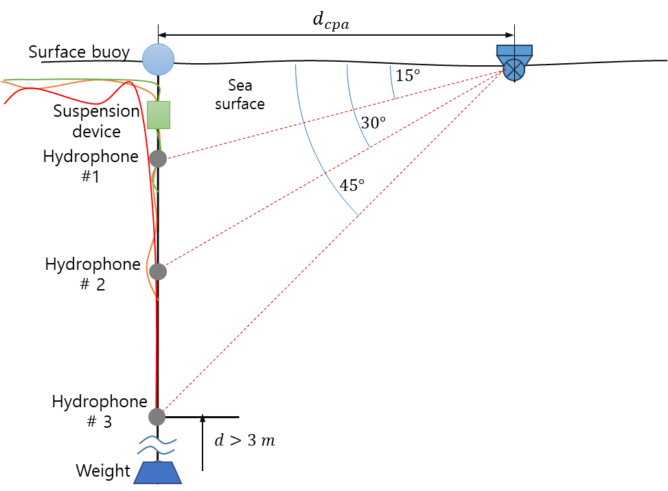
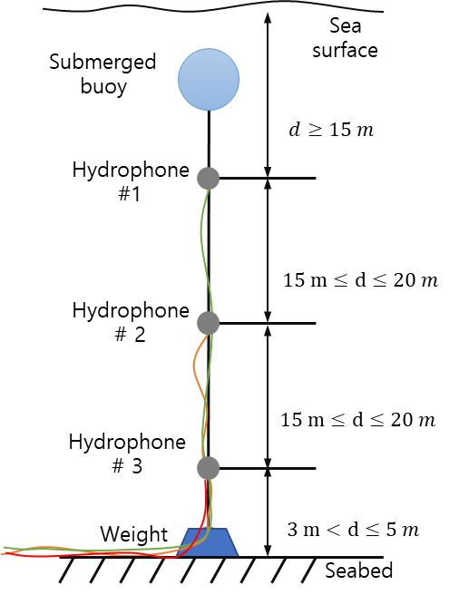
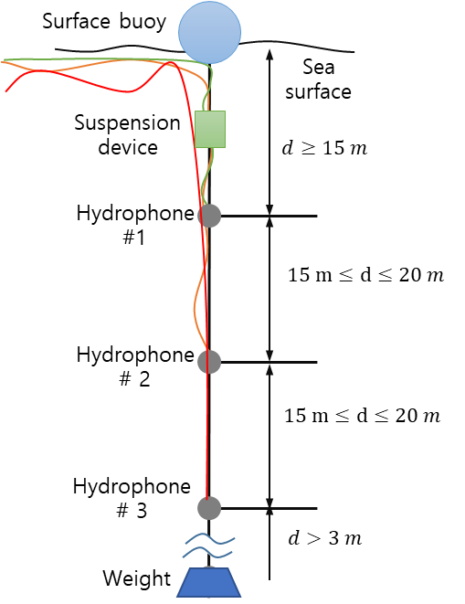
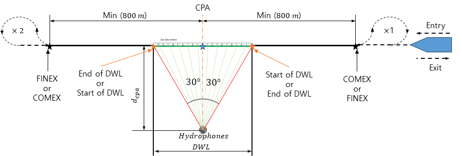
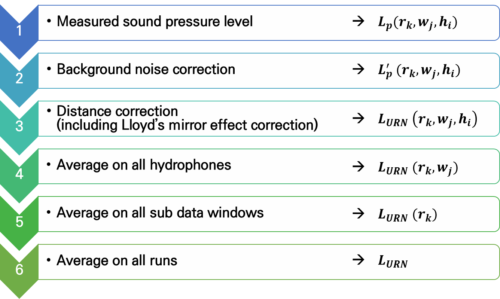
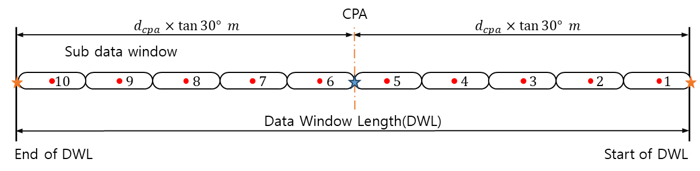
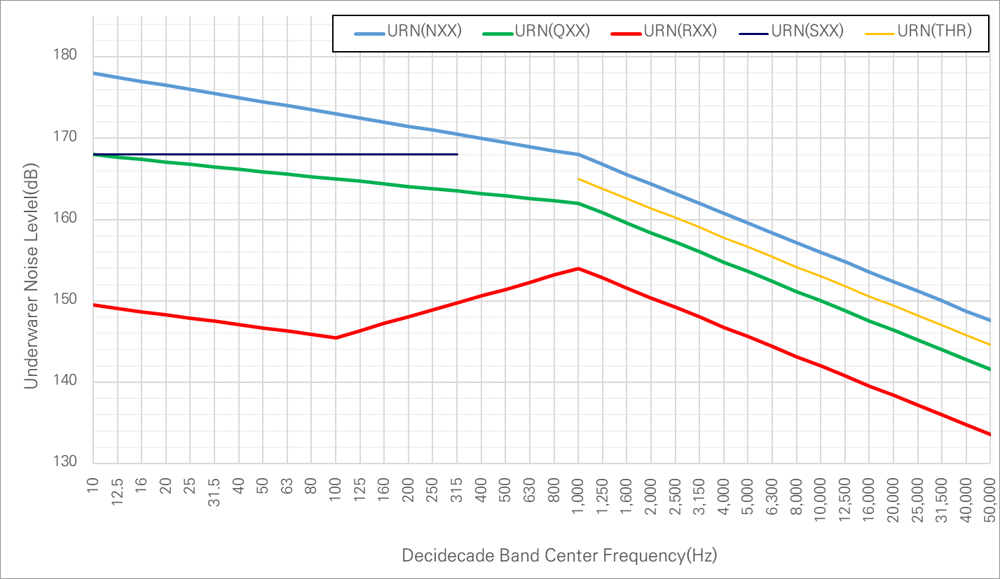

# Guidance for Radiated Noise from ships

> OTHER RULES AND GUIDANCE / GC-37-E / 2025 / EN / Guidance

## CHAPTER 3 UNDERWATER NOISE (2024)

### Section 1 General

#### 101. General

- **1.** The measurement and result analysis are to be performed in accordance with the requirements in **Sec.2** to **Sec.5**, and the criteria specified in **Sec.6** are to be satisfied.
- **2.** Measurement of underwater noise is to be performed by the service supplier registered with the Society.

### Section 2 Instrumentation

#### 201. General

- **1.** In order to quantify the underwater noise from a ship, main instrumentation is to be in accordance with the requirements in **202.** to **206.**.

#### 202. Hydrophone and signal conditioning

- **1.** The hydrophone is to have the sensitivity, bandwidth and dynamic range necessary to measure the ship under test.
- **2.** For underwater noise measurement, three hydrophones that should be omni-directional across the required frequency range of 10 Hz to 100,000 Hz are required.
- **3.** The receiving voltage sensitivity (RVS) of a hydrophone relates the hydrophone voltage output to the measured sound pressure level. A maximum uncertainty of this sensitivity of ± 2.5 $dB$ within the frequency range of the measurements is to be observed.

#### 203. Data acquisition, recording, processing and display

- **1.** The data acquisition, recording, processing and display system are to be capable of accurately acquiring, recording, processing and displaying data from the hydrophones.
- **2.** These systems are to comply with the requirements of ISO 17208 series.

#### 204. Distance measurement

- **1.** Distance measurement is required to continuously determine the actual distance between the hydrophones and the ship reference point of the ship under test.
- **2.** The distance measurement systems are to determine the horizontal distance from the sea surface position above the hydrophones (i.e. the device or buoy used to suspend the cable) to the ship reference point of the ship under test. The distance measurement device may utilize any method (e.g. optical, acoustical, GPS, radar) to achieve the required accuracy.
- **3.** The distance measurement system is to be accurate in 10 m. Distances are to be measured with an accuracy of ± 10 m. The use of DGPS (Differential Global Positioning System) is strongly recommended.
- **4.** Tilt angle measurements of the hydrophone array line are recommended to optimize the accuracy.
  **205 Water column speed properties**
- **1.** To be able to calculate the propagation loss via numerical modelling, the celerity profile of the water column needs to be ascertained.
- **2.** This is to be performed using either a CTD (conductivity, temperature, depth) measurement device or via a direct sound speed sensor.
- **3.** Onsite direct propagation loss measurements covering the whole range of frequencies for the test is an acceptable alternative to modelling.

#### 206. Instrumentation Calibration

- **1.** Calibration of underwater acoustic measurement equipment is to be carried out using IEC 60565-1.
- **2.** The calibration of hydrophones is to be undertaken by an external recognized organization every 24 months at maximum and as recommended by the hydrophone manufacturer.
- **3.** In addition, an in-situ check of the whole system using a dedicated calibrator (e.g., pistonphone) is to be performed prior and after the measurements. This calibrator is to be calibrated every 12 months at maximum.
- **4.** The data acquisition system is to be checked by an external recognized organization every 24 months at maximum.
- **5.** The measuring celerity profile device is to be calibrated every 24 months at maximum.

### Section 3 Measurement Procedure

#### 301. General

- **1.** In order to perform an accurate measurement of a ship’s underwater sound, several factors are to be addressed correctly, e.g. selection of an appropriate test site, proper deployment of hydrophones and proper operation of the ship under test.

#### 302. Hydrophone deployment

- **1.** Hydrophones are to be deployed as shown in **Figure 3.1** depending on required $d _{cpa}$ and water depth of the test site for underwater noise measurement.
- **2.** It is recommended that the hydrophone array incorporate a vertical line linked to a free-floating surface buoy decoupled from the sea surface (as shown in (1)① of **Figure 3.1**). The hydrophone array is not to be directly coupled to a support vessel not only to limit potential noise disturbances caused by the vessel behaviour but also to prevent masking from occurring. Additional mooring features (e.g. hardware swell compensation device) are also to be considered when appropriate.
- **3.** The hydrophone line is to be bottom anchored. A free-floating line/array is acceptable when water depths prevent the deployment of bottom anchored lines (as shown in (2) of **Figure 3.1**).
- **4.** The hydrophone vertical array line location should be broadcast via AIS equipment to ensure more accurate distance adjustments for CPA and safer measurement runs. If required by marine regulatory authorities, proper functioning of the AIS transponder is to be confirmed for identification on navigation e-charts.
- **5.** The vertical arrangement of hydrophones is to ensure measurement of the beam aspect of the tested vessel at CPA. The arrangement is to be reported.
- **6.** A minimum of three hydrophones on a single line array is to be used.

  |  (1)① surface-suspended **(1)① surface-suspended** |  (2)① bottom-anchored (recommended)  (2)② surface-suspended **(2)① bottom-anchored (recommended)** **(2)② surface-suspended** |
  | --- | --- |
  | **(1) For water depth greater than** $d _{cpa}$ | **(2) For water depth smaller than** $d _{cpa}$ |

#### 303. Data acquisition and recording

- **1.** The instrumentation set-up is to ensure, during the test runs, the synchronous acquisition, recording and processing of:
  - **(1)** sound pressure measurements from hydrophones
  - **(2)** distance between tested vessel and hydrophones
  - **(3)** tested ship speed over ground
- **2.** The Nyquist sampling theorem states that the sampling rates of the acoustic data is to be greater than twice the upper frequency of interest below.
- **3.** Other measurement values (calibration checks, etc.) are to be recorded.
- **4.** The measurement frequency range shall cover, in decidecade bands, the bandwidth 10 Hz - 50,000 Hz. For research vessels, the bandwidth is required to be 10 Hz – 100,000 Hz as per ICES “Cooperative Research Report No.209”, May 1995.

#### 304. Ship operation and test sequence

- **1.** The main propulsion and auxiliary machinery conditions are to be set up according to the conditions as specified in the approved measurement plan. The operating conditions are to be verified by the Surveyor.
- **2.** The hydrophones and measuring instruments used in the data acquisition system are to be calibrated prior to the underwater noise measurements. The relevant instrumentation reference calibration certificates, together with the results of the field setup and calibration check are to be provided to the Surveyor.
- **3.** The recognized service supplier for underwater noise measurement is to verify that all the measurement systems for carrying out the underwater noise measurement are put in place and are functioning correctly.
- **4.** At the start and the end of each measurement test run, the background noise measurement is to be carried out and recorded for at least 1 minute with the ship under test located at the farthest distance or at a distance of at least ≥ 2,000 m from the hydrophones, with the same hydrophone deployment and data acquisition methods.
- **5.** During the recording of the background noise measurement, all main engines and generators are to operate only in idle conditions.
- **6.** After the completion of the background noise measurement, the ship under test is to proceed to operate at the prescribed operating condition as specified in the approved measurement plan. The operating conditions such as the main and auxiliary engine output, ship speed, propeller RPM and nominal pitch, and loading condition are to be recorded accordingly.
- **7.** Before the acoustic center of the ship reaches the COMEX(start position of test range), the intended operating conditions of the ship under test are to be achieved. Between the COMEX and the FINEX(end posistion of test range), the direction and ship operating conditions are to remain the same.
- **8.** The ship under test is to pass a straight course to achieve the required distance ($d _{CPA}$) at closet point of approach. $d _{CPA}$ is 200 m or one ship length, whichever is larger. For ships with length less than 200 m, a minimum distance of 100 m can be accepted.
- **9.** Recording of data is to be performed during the test range between (1) and (2) below. (as shown in **Figure 3.2**)
  - **(1)** a minimum of 800m before the fore end of the vessel reaches the CPA; this defines the COMEX, to
  - **(2)** a minimum of 800m after the aft end of the vessel has passed the CPA; this defines the FINEX.
    
    Figure 3.2 Test and Data window arrangement
- **10.** During the test range, distance measurements between ship reference point and hydrophone alley are to be recorded for the ship under test. These include the distance ($d _{CPA}$) at the closest point of approach, horizontal distance from the ship reference point to each hydrophone and the vertical distance between the depth of each hydrophone and the sea surface.
- **11.** The ship under test is to make a “Williamson Turn” after passing FINEX, where the ship will maneuver and prepare for the next set of runs on the alternate side of the ship repeating the measurement procedure from **4** to **10**.
- **12.** A complete test course requires the ship under test to perform two repeated runs (with alternating approach) on each the port and starboard side of the ship under the same operating conditions.
- **13.** If two lines of three hydrophones are used to measure port and starboard simultaneously, the number of runs may be reduced to two.

### Section 4 Measurement Condition

#### 401. General

- **1.** Sea trials are to be carried out with the ship in loaded or ballast condition. The actual condition during the measurements is to be recorded on the measurement report.
- **2.** When measuring underwater noise in shallow seas, the minimum water depth is to be the greater of 60 m or $0.3v ^{2}$, where $v$ = ship speed over bottom in m/s.
- **3.** Measurements are to be taken under conditions of Sea State 3 or less, as defined by Sea State Code of the World Meteorological Organization (WMO) and of Beaufort wind force scale 4 or less. Rainy conditions are to be avoided due to background noise generation. If this cannot be achieved, the actual conditions are to be recorded on the measurement report.
- **4.** Measurements are not to be undertaken when/where currents exceed 2 m/s and/or potential tidal current impacts be assessed accordingly.
- **5.** In the case of reciprocal speed trial runs, a trial area is best avoided where the change of the current speed within the timespan of one double run is greater than 0.5 knots. Conducting testing around slack tide is ideal. Actual current information such as speed, direction, and tide related data is to be recorded on the measurement report.
- **6.** The nature, including its characteristics and bathymetric topology, is to be recorded, if applicable. The seabed topography should be level (± 10 % depth variations are permissible) and flat.
- **7.** Background noise is to be minimized as much as possible. The test site is to be as far as possible from vessel traffic lanes, port in/out lanes, marine works such as dredging, pile driving, fishing or diving zones, seismic exploration, mine clearing activities or coastal civil engineering works.
- **8.** Ship’s course has to be kept constant, with rudder angle less than 2 degrees from neutural position, for the duration of the measurement. If ship maneuvering is need, measurements are to be stopped until recovery of heading.
- **9.** All machinery essential for ship operation is to operate under conditions specified in approved measurement plan throughout the measurement period. The list of machinery and equipment that are to operate normally during the measurement period is limited to the installed equipment.
- **10.** Any deviations from operating conditions specified in the approved measurement plan is to be recorded in the measurement report.

#### 402. Normal mode

- **1.** During measurement, the propeller output is to be the normal seagoing speed of ship or at least 85 % of the maximum continuous rating (MCR) of the main engine.
- **2.** Controllable pitch and Voith-Schneider propellers, if any, are to be in the normal seagoing position. For ships with special propulsion and power configurations, such as diesel-electric systems, the actual ship’s design or operating parameters as defined in the ship’s specifications will be used and are to be recorded on the measurement report.

#### 403. Quiet mode, research mode, seismic survey mode

- **1.** During measurement, the propulsion system (conventional propeller, controllable pitch propeller, Voith-Schneider propeller, etc.) is to be maintained in the operating condition specified in the approved measurement plan.
- **2.** For vessel that need to be tested under towing conditions, the vessel should tow actual equipment or an alternative structure with a towing load equivalent to the towing loads calculated by simulation. Towing load calculation are to be submitted to the Society.
- **3.** If the ship speed in knots are not specified in the measurement plan, the test vessel should be set to the propeller output corresponding to the following ship speed in still water.
  - **(1)** for quiet mode: 11 knots
  - **(2)** for research mode: 11 knots
  - **(3)** for seismic survey mode: 5 knots.

#### 404. Thruster mode

- **1.** During measurement, the test vessel is to be operated at least 40% of the rated DP and/or thruster power, and no propulsion system other than DP and/or thrusters is to be operated.

### Section 5 Data Post-processing

#### 501. General

- **1.** The data is to be post processed following the ordering/scheme of **Figure 3.3** below, where represents:
  - **(1)** the k-th run,
  - **(2)** the j-th sub data window, and
  - **(3)** the i-th hydrophone.
    
    Figure 3.3 Data post-processing scheme for hydrophones, sub data windows, and test runs.
- **2.** Raw time series measurements are to be recorded in order to be permit post trial detailed analysis including data correction, narrow band analysis as deemed necessary.
  - **(1)** The start of data window is to occur at -30° (as shown below in Figure 6.2) from the hydrophones-CPA line
  - **(2)** The end of data window is to occur at +30° (as shown below in Figure 6.2) from the hydrophones-CPA line
- **3.** The underwater sound pressure measured at each hydrophone and recorded during the test range is to be collected while the ship reference point is within the data window, as shown in **Figure 3.4**, and analyzed by dividing it into 10 sub data windows. Each of the sub data windows is to be sized as evenly as possible.
  
  Figure 3.4 Configuration of Data Window
- **4.** The middle instant of a sub data window is reached when the acoustic center of the vessel is superimposed with the center of this window.
- **5.** For each sub data window, a root-mean-square linear averaged decidecade band spectrum of the measured underwater sound pressure level is to be performed for every hydrophone and recorded.
- **6.** The data post-processing described in **502.** through **504.** is to be performed per decidecade band.

#### 502. Background noise adjustments

- **1.** Each root-mean-square linearly averaged decidecade band spectrum is to be corrected for background noise according to the following procedure for each hydrophone.
- **2.** In detail the process is as follows:
  - **(1)** Calculate the arithmetic mean (linear average) of the sound pressure level measured for the hydrophone($h _{i}$) prior to and after ship test runs. This is the background noise.
  - **(2)** Calculate the variation of background noise between the start and end of runs.
  - **(3)** Calculate signal-plus-noise-to-noise level difference($triangle L$) for each run ($r _{k}$), sub data window ($w _{j}$) and hydrophone ($h _{i}$).
    $\Delta L(r _{k} ,w _{j} ,h _{i} ) = L _{p _{s+n}} (r _{k} ,w _{j} ,h _{i} )-L _{p _{n}} (h _{i} )$
    $triangle L$ : signal-plus-noise-to-noise level difference for each decidecade band ($dB$)
    $L _{p _{s+n}}$ : root-mean-square sound pressure level with ship under test present for each run ($dB$)
    $L _{p _{n}}$ : background root-mean-square sound pressure level with the ship under test not influencing the measurement away 2,000 m from hydrophones ($dB$)
  - **(4)** If $triangle L$$\geq$ 3 $dB$, the measurement can be considered acceptable with regards to the background noise. The following correction is to be applied:
    $L _{p}^{' } (r _{k} ,w _{j} ,h _{i} ) = 10\log \left[ 10 ^{\left( \frac{L _{p _{s+n}} (r _{k} ,w _{j} ,h _{i} )}{10} \right)} -10 ^{\left( \frac{L _{p _{n}} (h _{i} )}{10} \right)} \right]$
    $L _{p}^{'}$ : background noise adjusted root-mean-square sound pressure level of the ship under test ($dB$)
  - **(5)** If $triangle L$$<$ 3 $dB$, the result of the measured underwater sound pressure level may be considered as invalid data, and the effectiveness of the data is to be evaluated on a case-by-case basis by the Society

#### 503. Distance adjustments

- **1.** In order to obtain the underwater noise level ($L _{URN}$) at a reference distance of 1 m from the noise source, the propagation loss ($N _{PL}$) in water should be considered. The underwater noise levels, including the Lloyd’s mirror effect correction, are to be calculated and reported.
  - **(1)** The propagation loss ($N _{PL} (r _{k} , w _{j} ,h _{i} )$) should be calculated through modeling augmented with on-site actual water column properties using CTD measurement device or a sound speed sensor for each run ($r _{k }$), data window ($w _{j}$) and hydrophone ($h _{i}$).
    - **(A)** It is recommended to calibrate the model with a series of measured propagation losses with a controlled active source (known calibrated source level and known signal, recommended 4s-LFM-type signal, in the minimum frequency band 50 Hz – 20 kHz) at CPA, COMEX and FINEX. The model is be consistent with those propagation losses by adjusting the geo-acoustic parameters (compressional speed (m/s), density, compressional absorption) to minimize the difference between the model and the measured propagation losses. Differences and the best geo-acoustic parameters are to be reported.
    - **(B)** To take into account that the vessel is a moving noise source, the modelling propagation loss may be range-average smoothed.
    - **(C)** For the calculation of propagation loss, the following numerical modeling methods are recommended:
      - **(a)** Parabolic equation model: For low-frequency bands below 1kHz
      - **(b)** Ray theory model: For high-frequency bands above 1kHz
    - **(D)** The model should be run for each window ($w _{j}$), each hydrophone ($h _{i}$), and each frequency between 10 Hz and 50 kHz.
    - **(E)** The model should be run with the following information:
      - **(a)** Source depth: depth of the acoustic center
      - **(b)** Hydrophone depth: each hydrophone($h _{i}$) depth
      - **(c)** Range: Horizontal distance between the acoustic center and each hydrophone ($h _{i}$)
      - **(d)** Sound speed profile: As recommended in **205**., the sound speed profile should be measured and reported from the CTD measurement device or a sound speed sensor. Alternatively, the information should be obtained from operational oceanography services at the day of the measurement or at the closest date and place from the actual measurement.
      - **(e)** Bottom geo-acoustic parameters should be adjusted from the propagation losses specified in (A) above. Alternatively, it would be obtained from bottom geo-acoustic databases. The model is to be consistent with those propagation losses and this model calibration shall be reported.
      - **(f)** Sea-surface roughness should be modelled with the assumption of flatness (Hrms= 0 m).
      - **(g)** Bathymetry: Bathymetry between acoustic center and hydrophone ($h _{i}$) issued from databases such as GEBCO, EMODNet, or local bathymetric map.
      - **(h)** Frequencies: The model is to be run for a minimum of 3 frequencies in each decidecade bands.
    - **(F)** The result of the modeled propagation loss should is averaged for above frequencies of each decidecade band.
  - **(2)** If it is not practical to follow above (1), the propagation loss may be calculated with the following simple propagation law and correction factor.
    $N _{PL} =X \log \left( \frac{d _{T otal}}{d _{ref}} \right) + \Delta _{LME}$
    $d _{T otal} = \sqrt {d _{ver tical}^{2} +d _{horizontal}^{2}}$
    $d _{v ertical}$ : the vertical distances from the sea surface to each hydrophones, i.e., water depth of hydrophone (m)
    $d _{horizontal}$ : the horizontal distances from each center of sub data window to each hydrophones (m)
    $d _{ref}$ : reference distance (=1 m)
    $X$ : 19 for water depth $<$ 100 m, 20 for water depth $\geq$ 100 m
    $\Delta _{LME}$ : correction factor considering the Lloyd‘s mirror effect as per ISO 17208-2.
- **2.** The underwater noise level ($L _{URN}$) for each measurement run ($r _{k}$), sub data window ($w _{j}$) and hydrophone ($h _{i}$) is determined by the following equation.
  $L _{URN} \left( r _{k} ,w _{j} ,h _{i} \right) =L _{p}^{' } \left( r _{k} ,w _{j} ,h _{i} \right) +N _{PL} \left( r _{k} ,w _{j} ,h _{i} \right)$

#### 504. Determination of the final underwater noise level

- **1.** The level of underwater noise for each measurement run and sub data window is determined by the following equation.
  $L _{URN} (r _{k} ,w _{j} )=10 \log \left[ \frac{1}{3} \sum _{h=1} ^{3} 10 ^{\frac{L _{URN} (r _{k} ,w _{j} ,h _{i} )}{10}} \right]$
  $L _{URN} (r _{k} ,w _{j} )$ : the underwater noise level for each run ($r _{k}$) and each sub data window ($w _{j}$)
- **2.** The underwater noise level for each run is determined by the following equation.
  $L _{URN} (r _{k} )= \frac{1}{10} \sum _{j=1} ^{10} L _{URN} (r _{k} ,w _{j} )$
  $L _{URN} (r _{k} )$ : the underwater noise level for each run ($r _{k}$)
- **3.** The final underwater noise level of the ship under test is determined by the following equation.
  $L _{URN} = \frac{1}{4} \sum _{r=1} ^{4} L _{URN} (r _{k} )$
  $L _{URN}$ : the final underwater noise level for ship under test ($dB re 1 \mu Pa @ 1 m$)

### Section 6 Criteria

#### 601. General

- **1.** The final underwater noise level of ship under test calculated in **504. 3** are to satisfy the acceptance criteria of underwater noise level for the relevant operating mode in accordance with **Table 3.1** and **Figure 3.5**.
- **2.** The underwater noise level is assessed for each decidecade band, and the allowable criteria for the underwater noise level in each band are calculated based on the center frequency (f_c) of the band. 

  | Center Frequency (f_c) range | Normal mode NXX(1) | Quiet mode QXX(1) | Research mode RXX(1) | Seismic Survey mode SXX(1) | Thruster mode THR |
  | --- | --- | --- | --- | --- | --- |
  | 10 Hz ~ 100 Hz | -5log(f_c/10)+178 | -3log(fc/10)+168 | -4log(fc/10)+149.5 | 168 | - |
  | 100 Hz ~ 315 Hz | -5log(f_c/100)+173 | -3log(fc/100)+165 | +8.5log(fc/100)+145.5 | 168 | - |
  | 315 Hz ~ 1k Hz | -5log(f_c/100)+173 | -3log(fc/100)+165 | +8.5log(fc/100)+145.5 | - | - |
  | 1k Hz ~ 50k Hz | -12log(f_c/1000)+168 | -12log(fc/1000)+162 | -12log(fc/1000)+154 | - | -12log(fc/1000)+165 |
  | 50k Hz ~ 100k Hz | - | - | -12log(fc/1000)+154 | - | - |
  | note (1) XX means the ship speed (knots) corresponding to the propeller output for each operation mode of the ship under test and rounded off to the nearest decimal point. |   |   |   |   |   |

  
  Figure 3.4 Acceptance criteria of underwater noise level (graph)
