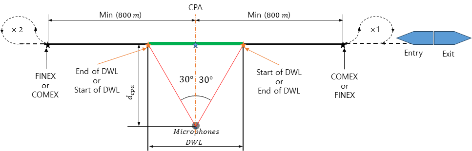

# Guidance for Radiated Noise from ships

> OTHER RULES AND GUIDANCE / GC-37-E / 2025 / EN / Guidance

## CHAPTER 4 AIRBORNE NOISE (2024)

### Section 1 General

#### 101. General

- **1.** The measurement and result analysis are to be performed in accordance with the requirements in **Sec 2** to **Sec 5** and the criteria specified in **Sec 6** are to be met.
- **2.** Measurement of ARN is to be performed by the service supplier registered with the Society.

#### 102. Sound source on board of the ships

- **1.** The overall sound emission from each ship can be traced back to several individual sound sources on board of the ship. The most relevant noise sources to be measured are listed below but not limited to.
  - **(1)** The funnel outlet(s) of main and/or auxiliary engines
  - **(2)** The opening(s) of engine room ventilation inlets and outlets
  - **(3)** The opening(s) of the cargo holds ventilation and air-conditioning inlet(s) and outlet(s).
  - **(4)** The opening(s) of the ventilation and air-conditioning of passenger rooms
  - **(5)** Additional relevant ventilation openings (e.g., sanitary or galley exhaust).
  - **(6)** Cargo loading and unloading facilities
- **2.** The operation of cooled containers/reefers on container ships strongly depends on several indicators, including the (cooling) type of the container, the type and size of the ship, the ships load, and port conditions. Furthermore, their operation is also part of the cargo handling process of a ship at berth. Therefore, cooled containers/reefers are not considered for measurements and will not be considered in the calculation of the total sound pressure level of the measured ship in this Guidance.

### Section 2 Instrumentation

#### 201. General

- **1.** In order to quantify the ARN from ships, main instrumentation is to be in accordance with the requirements in **202.**.

#### 202. Instrumentation

- **1.** The equipment for acoustic measurements must consist of the following equipment.
  - **(1)** Integrating sound level meter with a microphone, (cable) and windscreen, in compliance with IEC 61672-1 and IEC 61672-2, class 1.
  - **(2)** Acoustic calibrator in compliance with IEC 60942, class 1
- **2.** The microphones need to be equipped with a windscreen (diameter ≥ 6 cm) for each measurement.
- **3.** The calibration of the measuring system needs to be checked with the sound calibrator before each measurement series.
- **4.** For data post-processing, analysis software is required comprising the following methods.
  - **(1)** 1/3 octave band analysis according to IEC 61672-1.
  - **(2)** Frequency weighting, time weighting and averaging.
- **5.** During all measurements the time weighting fast (F) is to be used.
- **6.** Distance measuring system is to have an accuracy of 2 % with results from 10 to 600 m.
- **7.** Acoustic measuring system and distance measuring system are to be checked for calibration certificate and valid calibration status during measurement.

### Section 3 Measurement Location

#### 301. General

- **1.** Measurements are to be carried out taking into account the location of noise sources specified in **102. 1.** Additional measurements can be carried out as required by the Society in case of excessive noise level is identified.
- **2.** Measurements are to be made at a distance of 100 m from the hull surface for at least 30 seconds. All measurement points are to be at least 4 m above sea surface or ground surface where the microphone is located.
- **3.** Distance measurement is necessary to determine the distance between the vessel surface and the measuring point. If the measured distance differs from 100 m, it should be recorded and corrected during the data post-processing.

#### 302. Airborne noise for berthing

- **1.** The recommended distance between the hull side and the microphone is 100 m. If 100 m distance is not practical, measurement can be performed at a distance ranging from 80 to 120 m from the vessel. The side of the vessel is to be directly exposed to the microphone, and there should be no barrier or refecting surface between the noise source (vessel) and the receiver (microphone).
- **2.** At least 4 noise measurements is to be taken on each side of the vessel (starboard and port). One measurement point corresponds to a location 100 m perpendicular to the ship’s side from the position of the funnel outlet of auxiliary engines, and two points in the bow direction is to be at 1/4 and 1/2 points of the ship length (L), and one point at the 1/4 L point in the stern direction. However, in case of ships having a biased auxiliary engine outlet toward bow or midsection, the 1/2 L point in the bow direction may be adjusted to the 1/2 L point in the stern direction.
- **3.** Background noise is to be measured before and after measuring ARN for each side of the ship. The background noise is to be at least 3 $dB$ lower than that of each measurement point.
  
  Figure 4.1 Measurement outline of ARN for berthing

#### 303. Airborne noise for sailing

- **1.** The ship under test is to pass a straight course to achieve the required distance ($d _{CPA}$) at closet point of approach (CPA). $d _{CPA}$ which is the distance between hull surface and microphone is 100 m. To ensure the safety of ships and workers, if necessary, ARN may be measured at $d _{CPA}$ greater than 100 m.
- **2.** Recording of data is to be performed during the test range between (1) and (2) below. (as shown in **Figure 4.2**)
  - **(1)** a minimum of 800m before the fore end of the vessel reaches the CPA; this defines the COMEX, to
  - **(2)** a minimum of 800m after the aft end of the vessel has passed the CPA; this defines the FINEX.
- **3.** Unless otherwise required by the approved measurement plan, the ship under test is to maintain a constant speed, fixed engine conditions and minimum use of helm to maintain course until it has passed the end test range location.
  - **(1)** At the start and the end of each measurement test run, the background noise measurement is to be carried out and recorded for at least 1 minute with the ship under test located at the farthest distance or at a distance of at least ≥ 2,000 m from the microphones, with the same microphone and data acquisition methods.
  - **(2)** After the completion of the background noise measurement, the ship under test is to proceed to operate at the prescribed operating condition as specified in the approved measurement plan. The operating conditions such as the main and auxiliary engine output, ship speed, propeller RPM and nominal pitch, and loading condition are to be recorded accordingly.
  - **(3)** Before the ship reference point reaches COMEX, the intended operating conditions of the ship under test are to be achieved. Between the COMEX and the FINEX, the direction and ship operating conditions are to remain the same.
  - **(4)** Distance measurements are to be recorded for the ship under test. These include the distance ($d _{CPA}$) at the closest point of approach, horizontal distance from the hull surface of the ship to each microphone.
  - **(5)** The ship under test is to make a turn after passing the FINEX, where the ship will maneuver and prepare for the next set of runs on the alternate side of the ship repeating the measurement procedure from (1) to (4).
  - **(6)** A complete test course requires the ship under test to perform two repeated runs each on the port and starboard side of the ship under the same operating conditions.
    
    Figure 4.2 Arrangement of test and data window for sailing

### Section 4 Measurement Condition

#### 401. General

- **1.** Sea trials are to be carried out with the ship in loaded or ballast condition. The actual condition during the measurements is to be recorded on the measurement report.
- **2.** The main propulsion and auxiliary machinery conditions are to be set up according to the conditions as specified in the approved measurement plan. The operating conditions are to be verified by the Surveyor.
- **3.** Measurements are to be taken under conditions of Sea State 3 or less. Wind velocity is to be below 7 m/s and measurements are to only be performed when no rain or snow is present.
- **4.** The microphone and measuring instruments used in the data acquisition system are to be calibrated prior to the ARN measurements. The relevant instrumentation reference calibration certificates, together with the results of the field setup and calibration check are to be provided to the Surveyor.
- **5.** The recognized service supplier for ARN measurement is to verify that all the measurement systems for carrying out the ARN measurement are put in place and are functioning correctly.
- **6.** Residual noise (or background noise) is to be avoided as far as possible in the vicinity of the measurement location, and measurements are not to be distorted by background noise and surroundings (eg. large reflecting surfaces).

#### 402. Airborne noise for berthing

- **1.** Throughout the measurements, the ship is to operate under the characteristic/normal load condition when at berth. It is to be ensured that the chosen load condition during measurements prevents the measured sound emissions from exceeding the levels observed at berth in any subsequent port of call (typically during high/maximum load conditions of the ship). It is important that the electric load is kept as constant as possible during all measurements.
- **2.** To align the electric load of the auxiliary engine(s) with the representative load, consumers on board may need to be selectively switched on or off. The consumers that, in most cases, can be controlled manually include the following.
  - **(1)** cargo hold fans,
  - **(2)** engine room fans,
  - **(3)** fans and air-conditioning of passenger rooms and
  - **(4)** further fans on board.
- **3.** Furthermore, the operating conditions during all measurements need to be documented in detail.

#### 403. Airborne noise for sailng

- **1.** In the case for ships confirmed to sail in sea areas within 1 km from inland or in coastal areas under separately defined operating conditions the operational conditions are to be explicitly specified in the measurement plan. If the operating speed is not specified in the approved measurement plan, the default operating speed is to set at 12 knots for container ships and car carriers and 10 knots for other type of vessels.
- **2.** Ship’s course has to be maintained steadily, with the rudder angle kept less than 2 degrees to portside or starboard throughout the measurement. If ship maneuvering is required. measurements are to be halted until the heading is restored.
- **3.** All machinery essential for ship operation is to operate under normal conditions during the measurement period. The list of machinery and equipment that are to operate normally is restricted to the installed equipment.
- **4.** **4**. Controllable pitch and Voith-Schneider propellers, if present, are to be in the normal seagoing position. For ships with special propulsion and power configurations, such as diesel-electric systems, the actual ship’s design or operating parameters as defined in the ship’s specifications will be used and are to be documented in the measurement report.
- **5.** Any deviations from operating conditions specified in the approved measurement plan is to be documented in the measurement report.

### Section 5 Data Post-processing

#### 501. General

- **1.** The measured sound pressure by a microphone is to be subjected to post-processing steps such as background noise adjustments and distance adjustments.
- **2.** The data post-processing described in **502.** through **504.** is to be performed per 1/3 octave band in the range of 31.5 ~ 8,000 Hz.

#### 502. Background noise adjustments

- **1.** The difference ($triangle L$) between the measured sound pressure level ($L _{p _{s+n}}$) and background noise level ($L _{p _{n}}$) for each 1/3 octave band is determined by the following equation.
  $\Delta L = L _{p _{s+n}} -L _{p _{n}}$
  $triangle L$ : signal-plus-noise-to-noise level difference ($dB$) for each 1/3 octave band
  $L _{p _{s+n}}$ : root-mean-square sound pressure level ($dB$) with ship under test present for each run
  $L _{p _{n}}$ : background root-mean-square sound pressure level with the ship under test not influencing the measurement away 2,000 m from microphones ($dB$)
- **2.** The sound pressure level ($L ^{'} _{p}$) of the ship under test is determined as follows depending on the magnitude of $triangle L$.
  - **(1)** For $\Delta L$ $\geq$ 3 dB
    $L _{p}^{' } =10\log \left[ 10 ^{\left( \frac{L _{p _{s+n}}}{10} \right)} -10 ^{\left( \frac{L _{p _{n}}}{10} \right)} \right]$
    $L _{p}^{'}$ : background noise adjusted root-mean-square sound pressure level of the ship under test ($dB$)
  - **(2)** For $\Delta L$ $<$ 3 dB: The sound pressure level ($L ^{'} _{p}$) may be considered as the same as the background noise level($L _{p _{n}}$), and whether to use the data or re-measure airborne noise is to be discussed with the Society.

#### 503. Distance adjustments

- **1.** In order to obtain the sound pressure level at a reference distance of 100 m from the ship, the transmission loss ($TL$) due to sound wave transmission in the air should be considered.
  $L _{p} =L ' _{p} +TL$
  $TL=20\log \left( \frac{d}{d _{ref}} \right)$
  $d$ : the distance from the hull surface of the ship under test to the microphone (m)
  $d _{ref}$ : reference distance (=100 m)

#### 504. Determination of the final airborne noise level

- **1.** For the sound pressure level at the standard distance (100m) from the ship, airborne noise level per each 1/3 octave band is to be calculated according to the following procedure.
- **2.** Calculate the average sound pressure level per each 1/3 octave band of airborne noise for berthing.
  - **(1)** The average sound pressure levels on the port and starboard sides are determined by the following equation.
    $L _{p, P, avg} =10 \log \left( \frac{1}{n} \sum _{k=1} ^{n} 10 ^{\frac{L _{p, P} (k)}{10}} \right)$
    $L _{p, S, avg} =10 \log \left( \frac{1}{n} \sum _{k=1} ^{n} 10 ^{\frac{L _{p, S} (k)}{10}} \right)$
    $L _{p,P} (k)$ : the sound pressure level for each measuring point ($k$) on port side
    $L _{p,S} (k)$ : the sound pressure level for each measuring point ($k$) on starboard side
    $n$ : the number of measuring point ($k$) on each side
  - **(2)** The average sound pressure level of the ship is determined by the following equation.
    $L _{p,1/3 octave} =10\log \left[ \frac{1}{2} \left( 10 ^{\frac{L _{p,P,avg}}{10}} +10 ^{\frac{L _{p,S,avg}}{10}} \right) \right]$
    $L _{p,P, avg}$ : the average sound pressure level ($dB$) on port side
    $L _{p,S, avg}$ : the average sound pressure level ($dB$) on starboard side
- **3.** For average sound pressure level per each 1/3 octave band of airborne noise for sailing, the sound pressure level can be calculated by time averaging the measured sound pressure after background noise adjustments and distance adjustments, or vice versa.
- **4.** The frequency-weighted sound pressure level ($L _{Aeq}$ or $L _{Ceq}$) is calculated using the 1/3 octave band sound pressure level calculated according to paragraphs **2** and **3**.
- **5.** The broadband total airborne noise level ($L _{ARN}$) is calculated as the sum of A-weighted sound pressure levels in the 1/3 octave band from 31.5 Hz to 8,000 Hz.

### Section 6 Criteria

#### 601. General

- **1.** The final airborne noise level of ship under test calculated in **504. 5** are to meet the acceptance criteria of each airborne noise level depending on frequency ranges specified in **Table 4.1.** 

  | Center Frequency range | For sailing |   | For berthing |   |
  | --- | --- | --- | --- | --- |
  | Center Frequency range | S1 | S2 | B1 | B2 |
  | 31.5 Hz ~ 8,000 Hz | 63 | 58 | 50 | 45 |

  |   |
  | --- |
  | **GUIDANCE FOR** **RADIATED NOISE FROM SHIPS** Published by **KR** 36, Myeongji ocean city 9-ro, Gangseo-gu, BUSAN, KOREA TEL : +82 70 8799 7114 FAX : +82 70 8799 8999 Website : http://www.krs.co.kr |
  | CopyrightⒸ 2024, **KR** Reproduction of this Rules and Guidance in whole or inn parts is prohibited without permission of the publisher. CopyrightⒸ 2024, **KR** Reproduction of this Rules and Guidance in whole or inn parts is prohibited without permission of the publisher. |
  | CopyrightⒸ 2024, **KR** Reproduction of this Rules and Guidance in whole or inn parts is prohibited without permission of the publisher. |
