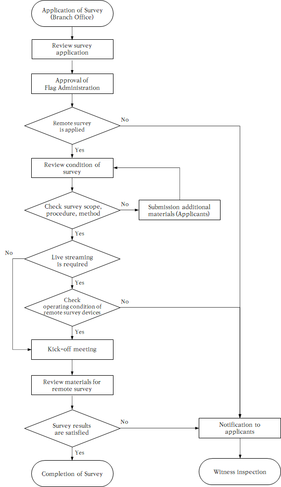

# Remote Survey

> OTHER RULES AND GUIDANCE / GC-38-E / 2025 / EN / Guidance

## Section 5 Recording of evidence and reporting of survey

### 501. Recording of Evidence

#### 1. Required evidence (refer to 205.)

In principle, live streaming video and audio shall be applied to remote surveys as a primary means (refer to **Table 1** in **301.**).
Additionally, and/or alternatively, one or more of the following evidence may be submitted or verified as requested by the Surveyor during remote survey so that the Surveyor is able to verify conditions of survey items:

- **(1)** Recorded video and audio
- **(2)** Photos
- **(3)** Master's/chief engineer's statement
- **(4)** Ship's logbook
- **(5)** Owner’s confirmation

#### 2. Evidence list

- **(1)** Live streaming video and audio
  Live streaming video and audio using Information and Communication Technology (ICT) shall be in accordance with the requirements in **Sec 4**.
- **(2)** Recorded videos/photos
  For the recorded videos/photos, the following information is to be available:
  - **(A)** confirmation that they were actually taken on the ship by the Owner’s representative
  - **(B)** date and time when they were taken
  - **(C)** identity of the personnel/crew responsible for taking evidence
- **(3)** Master's/chief engineer's statement
  Recorded videos/photos provided by the Owner’s representative may be supplemented with a statement signed by the master and/or the chief engineer confirming the condition of the items shown in the evidence. The final evaluation of the remote survey by the Surveyor is to be based on all of the provided evidence, and it does not delegate the responsibility to the master/chief engineer’s statement only.
- **(4)** Ship's logbook
  The Master shall make entries into ship's logbook on the following occasions and submit copies of the relevant pages when requested by the Surveyor:
  - **(A)** when a remote survey is carried out by the Surveyor
  - **(B)** when videos/photos are taken and submitted to the Surveyor with the master's/chief engineer's statement and additional documents as applicable.
- **(5)** Owner’s confirmation
  The Owner’s representative or the master is to confirm the correctness and completeness of the provided information and evidence (if any) relevant to the condition of the items requested to be surveyed. This confirmation may be included in the survey application.

#### 3. Retaining/filing evidence

- **(1)** The evidence submitted by the Owner’s representative or master shall be retained/filed in accordance with the Society's procedures which shall include:
  - **(A)** type of evidence to be retained/filed
  - **(B)** duration/location to be retained/filed
- **(2)** It is not required for the Society to record and save live streaming video and audio as evidence unless the Surveyor considers it necessary.

#### 4. Other supporting documents

- **(1)** The Surveyor may request the Owner’s representative or master to submit supplementary documents such as ship's maintenance reports and record for the operation of machinery, and equipment and service reports issued by manufacturers, service suppliers or service providers.
- **(2)** While the Surveyor shall verify that the documents are duly prepared and issued to the ship, they may not be required to be retained/filed by the Society as evidence.

### 502. Reporting of remote survey

#### 1. The report of a remote survey shall be issued in accordance with the Society's procedure. The survey report shall also include the following additional information:

- **(1)** indication that the survey was carried out remotely
- **(2)** description of the means used during the remote survey
- **(3)** indication of the provided evidence
- **(4)** confirmation of the flag State Administration’s authorization, when applicable
  
  **Fig. 1 Flow chart of remote survey procedure**
